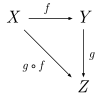
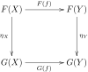

Schematic representation of three objects and three morphisms of a category, which form a [commutative diagram](https://en.wikipedia.org/wiki/Commutative_diagram "Commutative diagram")

**Category theory** is a general theory of [mathematical structures](https://en.wikipedia.org/wiki/Mathematical_structure "Mathematical structure") and their relations. It was introduced by [Samuel Eilenberg](https://en.wikipedia.org/wiki/Samuel_Eilenberg "Samuel Eilenberg") and [Saunders Mac Lane](https://en.wikipedia.org/wiki/Saunders_Mac_Lane "Saunders Mac Lane") in the mid-20th century in their foundational work on [algebraic topology](https://en.wikipedia.org/wiki/Algebraic_topology "Algebraic topology"). Category theory can be used in most areas of mathematics. In particular, many constructions of new [mathematical objects](https://en.wikipedia.org/wiki/Mathematical_object "Mathematical object") from previous ones that appear similarly in several contexts are conveniently expressed and unified in terms of categories. Examples include [quotient spaces](https://en.wikipedia.org/wiki/Quotient_space_\(disambiguation\) "Quotient space (disambiguation)"), [direct products](https://en.wikipedia.org/wiki/Direct_product "Direct product"), completion, and [duality](https://en.wikipedia.org/wiki/Duality_\(mathematics\) "Duality (mathematics)").

Many areas of [computer science](https://en.wikipedia.org/wiki/Computer_science "Computer science") also rely on category theory, such as [functional programming](https://en.wikipedia.org/wiki/Functional_programming "Functional programming") and [semantics](https://en.wikipedia.org/wiki/Semantics_\(computer_science\) "Semantics (computer science)").

A [category](https://en.wikipedia.org/wiki/Category_\(mathematics\) "Category (mathematics)") is formed by two sorts of [objects](https://en.wikipedia.org/wiki/Mathematical_object "Mathematical object"): the [objects](https://en.wikipedia.org/wiki/Object_\(category_theory\) "Object (category theory)") of the category, and the [morphisms](https://en.wikipedia.org/wiki/Morphism "Morphism"), which relate two objects called the _source_ and the _target_ of the morphism. A morphism is often represented by an arrow from its source to its target (see the figure). Morphisms can be composed if the target of the first morphism equals the source of the second one. Morphism composition has similar properties as [function composition](https://en.wikipedia.org/wiki/Function_composition "Function composition") ([associativity](https://en.wikipedia.org/wiki/Associativity "Associativity") and existence of an [identity morphism](https://en.wikipedia.org/wiki/Identity_element "Identity element") for each object). Morphisms are often some sort of [functions](https://en.wikipedia.org/wiki/Function_\(mathematics\) "Function (mathematics)"), but this is not always the case. For example, a [monoid](https://en.wikipedia.org/wiki/Monoid "Monoid") may be viewed as a category with a single object, whose morphisms are the elements of the monoid.

The second fundamental concept of category theory is the concept of a [functor](https://en.wikipedia.org/wiki/Functor "Functor"), which plays the role of a morphism between two categories $\mathcal{C}_1$ and $\mathcal{C}_2$: it maps objects of $\mathcal{C}_1$ to objects of $\mathcal{C}_2$ and morphisms of $\mathcal{C}_1$ to morphisms of $\mathcal{C}_2$ in such a way that sources are mapped to sources, and targets are mapped to targets (or, in the case of a [contravariant functor](https://en.wikipedia.org/wiki/Contravariant_functor "Contravariant functor"), sources are mapped to targets and _vice-versa_). A third fundamental concept is a [natural transformation](https://en.wikipedia.org/wiki/Natural_transformation "Natural transformation") that may be viewed as a morphism of functors.

## Categories, objects, and morphisms

### Categories

A _category_ $\mathcal{C}$ consists of the following three mathematical entities:

*   A [class](https://en.wikipedia.org/wiki/Class_\(set_theory\) "Class (set theory)") $\text{ob}(\mathcal{C})$, whose elements are called _objects_;
*   A class $\text{hom}(\mathcal{C})$, whose elements are called [morphisms](https://en.wikipedia.org/wiki/Morphism "Morphism") or [maps](https://en.wikipedia.org/wiki/Map_\(mathematics\) "Map (mathematics)") or _arrows_.

    Each morphism **$f$** has a _source object_ **$a$** and _target object_ **$b$**.

    The expression $f\colon a \rightarrow b$ would be verbally stated as "$f$ is a morphism from a to b".

    The expression $\text{hom}(a, b)$ – alternatively expressed as $\text{hom}_\mathcal{C}(a, b)$, $\text{mor}(a, b)$, or $\mathcal{C}(a, b)$ – denotes the _hom-class_ of all morphisms from $a$ to $b$.

*   A [binary operation](https://en.wikipedia.org/wiki/Binary_operation "Binary operation") $\circ$, called _composition of morphisms_, such that for any three objects _a_, _b_, and _c_, we have$$
\circ \colon  \text{hom}(b, c) \times \text{hom}(a, b) \to \text{hom}(a, c)
$$The composition of $f\colon a \rightarrow b$ and $g\colon b \rightarrow c$ is written as $g \circ f$ or $gf$, governed by two axioms:
    1.  [Associativity](https://en.wikipedia.org/wiki/Associativity "Associativity"): If $f\colon a \rightarrow b$, $g\colon b \rightarrow c$, and $h\colon c \rightarrow d$ then $$
h \circ (g \circ f) = (h \circ g) \circ f
$$
    2.  [Identity](https://en.wikipedia.org/wiki/Identity_\(mathematics\) "Identity (mathematics)"): For every object x, there exists a morphism $1_x \colon x \rightarrow x$ (also denoted as $\text{id}_x$) called the _[identity morphism](https://en.wikipedia.org/wiki/Identity_morphism "Identity morphism") for x_, such that for every morphism $f\colon a \rightarrow b$, we have$$
1_b \circ f = f = f \circ 1_a
$$

        From the axioms, it can be proved that there is exactly one identity morphism for every object.

#### Example

A prototypical example of a category is **Set**, the [category of sets](https://en.wikipedia.org/wiki/Category_of_sets "Category of sets") and functions between them. The objects of **Set** are just [sets](https://en.wikipedia.org/wiki/Set_\(mathematics\) "Set (mathematics)"), and a morphism from a set _X_ to a set _Y_ is a [function](https://en.wikipedia.org/wiki/Function_\(mathematics\) "Function (mathematics)") _f_: _X_ → _Y_. The category axioms are satisfied since every set has an [identity function](https://en.wikipedia.org/wiki/Identity_function "Identity function"), and since [composition of functions](https://en.wikipedia.org/wiki/Composition_of_functions "Composition of functions") is associative.

### Morphisms

Relations among morphisms (such as _fg_ = _h_) are often depicted using [commutative diagrams](https://en.wikipedia.org/wiki/Commutative_diagram "Commutative diagram"), with "points" (corners) representing objects and "arrows" representing morphisms.

[Morphisms](https://en.wikipedia.org/wiki/Morphism "Morphism") can have any of the following properties. A morphism _f_: _a_ → _b_ is:

*   a [monomorphism](https://en.wikipedia.org/wiki/Monomorphism "Monomorphism") (or _monic_) if _f_ ∘ _g_1 = _f_ ∘ _g_2 implies _g_1 = _g_2 for all morphisms _g_1, _g2_: _x_ → _a_.
*   an [epimorphism](https://en.wikipedia.org/wiki/Epimorphism "Epimorphism") (or _epic_) if _g_1 ∘ _f_ = _g_2 ∘ _f_ implies _g1_ = _g2_ for all morphisms _g_1, _g_2: _b_ → _x_.
*   a _bimorphism_ if _f_ is both epic and monic.
*   an [isomorphism](https://en.wikipedia.org/wiki/Isomorphism "Isomorphism") if there exists a morphism _g_: _b_ → _a_ such that _f_ ∘ _g_ = 1_b_ and _g_ ∘ _f_ = 1_a_.
*   an [endomorphism](https://en.wikipedia.org/wiki/Endomorphism "Endomorphism") if _a_ = _b_. end(_a_) denotes the class of endomorphisms of _a_.
*   an [automorphism](https://en.wikipedia.org/wiki/Automorphism "Automorphism") if _f_ is both an endomorphism and an isomorphism. aut(_a_) denotes the class of automorphisms of _a_.
*   a [retraction](https://en.wikipedia.org/wiki/Retract_\(category_theory\) "Retract (category theory)") if a right inverse of _f_ exists, i.e. if there exists a morphism _g_: _b_ → _a_ with _f_ ∘ _g_ = 1_b_.
*   a [section](https://en.wikipedia.org/wiki/Section_\(category_theory\) "Section (category theory)") if a left inverse of _f_ exists, i.e. if there exists a morphism _g_: _b_ → _a_ with _g_ ∘ _f_ = 1_a_.

Every retraction is an epimorphism, and every section is a monomorphism. Furthermore, the following three statements are equivalent:

*   _f_ is a monomorphism and a retraction;
*   _f_ is an epimorphism and a section;
*   _f_ is an isomorphism.

## Functors

[Functors](https://en.wikipedia.org/wiki/Functor "Functor") are structure-preserving maps between categories. They can be thought of as morphisms in the category of all (small) categories.

A (**covariant**) functor _F_ from a category _C_ to a category _D_, written _F_: _C_ → _D_, consists of:

*   for each object _x_ in _C_, an object _F_(_x_) in _D_; and
*   for each morphism _f_: _x_ → _y_ in _C_, a morphism _F_(_f_): _F_(_x_) → _F_(_y_) in _D_,

such that the following two properties hold:

*   For every object _x_ in _C_, _F_(1_x_) = 1_F_(_x_);
*   For all morphisms _f_: _x_ → _y_ and _g_: _y_ → _z_, _F_(_g_ ∘ _f_) = _F_(_g_) ∘ _F_(_f_).

A **contravariant** functor _F_: _C_ → _D_ is like a covariant functor, except that it "turns morphisms around" ("reverses all the arrows"). More specifically, every morphism _f_: _x_ → _y_ in _C_ must be assigned to a morphism _F_(_f_): _F_(_y_) → _F_(_x_) in _D_. In other words, a contravariant functor acts as a covariant functor from the [opposite category](https://en.wikipedia.org/wiki/Opposite_category "Opposite category") _C_op to _D_.

## Natural transformations

A _natural transformation_ is a relation between two functors. Functors often describe "natural constructions" and natural transformations then describe "natural homomorphisms" between two such constructions. Sometimes two quite different constructions yield "the same" result; this is expressed by a natural isomorphism between the two functors.

If _F_ and _G_ are (covariant) functors between the categories _C_ and _D_, then a natural transformation _η_ from _F_ to _G_ associates to every object _X_ in _C_ a morphism _η__X_: _F_(_X_) → _G_(_X_) in _D_ such that for every morphism _f_: _X_ → _Y_ in _C_, we have _η__Y_ ∘ _F_(_f_) = _G_(_f_) ∘ _η__X_; this means that the following diagram is [commutative](https://en.wikipedia.org/wiki/Commutative_diagram "Commutative diagram"):

Commutative diagram defining natural transformations

The two functors _F_ and _G_ are called _naturally isomorphic_ if there exists a natural transformation from _F_ to _G_ such that _η__X_ is an isomorphism for every object _X_ in _C_.

## Other concepts

### Universal constructions, limits, and colimits

Using the language of category theory, many areas of mathematical study can be categorized. Categories include sets, groups and topologies.

Each category is distinguished by properties that all its objects have in common, such as the [empty set](https://en.wikipedia.org/wiki/Empty_set "Empty set") or the [product of two topologies](https://en.wikipedia.org/wiki/Product_topology "Product topology"), yet in the definition of a category, objects are considered atomic, i.e., we _do not know_ whether an object _A_ is a set, a topology, or any other abstract concept. Hence, the challenge is to define special objects without referring to the internal structure of those objects. To define the empty set without referring to elements, or the product topology without referring to open sets, one can characterize these objects in terms of their relations to other objects, as given by the morphisms of the respective categories. Thus, the task is to find _[universal properties](https://en.wikipedia.org/wiki/Universal_property "Universal property")_ that uniquely determine the objects of interest.

Numerous important constructions can be described in a purely categorical way if the _category limit_ can be developed and dualized to yield the notion of a _colimit_.

### Equivalent categories

It is a natural question to ask: under which conditions can two categories be considered _essentially the same_, in the sense that theorems about one category can readily be transformed into theorems about the other category? The major tool one employs to describe such a situation is called _equivalence of categories_, which is given by appropriate functors between two categories. Categorical equivalence has found [numerous applications](https://en.wikipedia.org/wiki/Equivalence_of_categories#Examples "Equivalence of categories") in mathematics.

### Further concepts and results

The definitions of categories and functors provide only the very basics of categorical algebra; additional important topics are listed below. Although there are strong interrelations between all of these topics, the given order can be considered as a guideline for further reading.

*   The [functor category](https://en.wikipedia.org/wiki/Functor_category "Functor category")_D__C_ has as objects the functors from _C_ to _D_ and as morphisms the natural transformations of such functors. The [Yoneda lemma](https://en.wikipedia.org/wiki/Yoneda_lemma "Yoneda lemma") is one of the most famous basic results of category theory; it describes representable functors in functor categories.
*   [Duality](https://en.wikipedia.org/wiki/Dual_\(category_theory\) "Dual (category theory)"): Every statement, theorem, or definition in category theory has a _dual_ which is essentially obtained by "reversing all the arrows". If one statement is true in a category _C_ then its dual is true in the dual category _C_op. This duality, which is transparent at the level of category theory, is often obscured in applications and can lead to surprising relationships.
*   [Adjoint functors](https://en.wikipedia.org/wiki/Adjoint_functors "Adjoint functors"): A functor can be left (or right) adjoint to another functor that maps in the opposite direction. Such a pair of adjoint functors typically arises from a construction defined by a universal property; this can be seen as a more abstract and powerful view on universal properties.

### Higher-dimensional categories

Many of the above concepts, especially equivalence of categories, adjoint functor pairs, and functor categories, can be situated into the context of _higher-dimensional categories_. Briefly, if we consider a morphism between two objects as a "process taking us from one object to another", then higher-dimensional categories allow us to profitably generalize this by considering "higher-dimensional processes".

For example, a (strict) [2-category](https://en.wikipedia.org/wiki/2-category "2-category") is a category together with "morphisms between morphisms", i.e., processes which allow us to transform one morphism into another. We can then "compose" these "bimorphisms" both horizontally and vertically, and we require a 2-dimensional "exchange law" to hold, relating the two composition laws. In this context, the standard example is **Cat**, the 2-category of all (small) categories, and in this example, bimorphisms of morphisms are simply [natural transformations](https://en.wikipedia.org/wiki/Natural_transformation "Natural transformation") of morphisms in the usual sense. Another basic example is to consider a 2-category with a single object; these are essentially [monoidal categories](https://en.wikipedia.org/wiki/Monoidal_category "Monoidal category"). [Bicategories](https://en.wikipedia.org/wiki/Bicategory "Bicategory") are a weaker notion of 2-dimensional categories in which the composition of morphisms is not strictly associative, but only associative "up to" an isomorphism.

This process can be extended for all [natural numbers](https://en.wikipedia.org/wiki/Natural_number "Natural number") _n_, and these are called [_n_-categories](https://en.wikipedia.org/wiki/N-category "N-category"). There is even a notion of _[ω-category](https://en.wikipedia.org/wiki/Quasi-category "Quasi-category")_ corresponding to the [ordinal number](https://en.wikipedia.org/wiki/Ordinal_number "Ordinal number") [ω](https://en.wikipedia.org/wiki/Ω_\(ordinal_number\) "Ω (ordinal number)").

Higher-dimensional categories are part of the broader mathematical field of [higher-dimensional algebra](https://en.wikipedia.org/wiki/Higher-dimensional_algebra "Higher-dimensional algebra"), a concept introduced by [Ronald Brown](https://en.wikipedia.org/wiki/Ronald_Brown_\(mathematician\) "Ronald Brown (mathematician)"). For a conversational introduction to these ideas, see [John Baez, 'A Tale of _n_-categories' (1996).](http://math.ucr.edu/home/baez/week73.html)

## Historical notes

> It should be observed first that the whole concept of a category is essentially an auxiliary one; our basic concepts are essentially those of a functor and of a natural transformation \[...\]

— [Eilenberg](https://en.wikipedia.org/wiki/Samuel_Eilenberg "Samuel Eilenberg") and [Mac Lane](https://en.wikipedia.org/wiki/Saunders_Mac_Lane "Saunders Mac Lane") (1945)

Whilst specific examples of functors and natural transformations had been given by [Samuel Eilenberg](https://en.wikipedia.org/wiki/Samuel_Eilenberg "Samuel Eilenberg") and [Saunders Mac Lane](https://en.wikipedia.org/wiki/Saunders_Mac_Lane "Saunders Mac Lane") in a 1942 paper on [group theory](/source/group-theory/ "Group theory"), these concepts were introduced in a more general sense, together with the additional notion of categories, in a 1945 paper by the same authors (who discussed applications of category theory to the field of [algebraic topology](https://en.wikipedia.org/wiki/Algebraic_topology "Algebraic topology")). Their work was an important part of the transition from intuitive and geometric [homology](https://en.wikipedia.org/wiki/Homology_\(mathematics\) "Homology (mathematics)") to [homological algebra](https://en.wikipedia.org/wiki/Homological_algebra "Homological algebra"), Eilenberg and Mac Lane later writing that their goal was to understand natural transformations, which first required the definition of functors, then categories.

[Stanisław Ulam](https://en.wikipedia.org/wiki/Stanisław_Ulam "Stanisław Ulam"), and some writing on his behalf, have claimed that related ideas were current in the late 1930s in Poland. Eilenberg was Polish, and studied mathematics in Poland in the 1930s. Category theory is also, in some sense, a continuation of the work of [Emmy Noether](https://en.wikipedia.org/wiki/Emmy_Noether "Emmy Noether") (one of Mac Lane's teachers) in formalizing abstract processes; Noether realized that understanding a type of mathematical structure requires understanding the processes that preserve that structure ([homomorphisms](https://en.wikipedia.org/wiki/Homomorphism "Homomorphism")). Eilenberg and Mac Lane introduced categories for understanding and formalizing the processes ([functors](https://en.wikipedia.org/wiki/Functor "Functor")) that relate [topological structures](https://en.wikipedia.org/wiki/Topology "Topology") to algebraic structures ([topological invariants](https://en.wikipedia.org/wiki/Topological_invariant "Topological invariant")) that characterize them.

Category theory was originally introduced for the need of [homological algebra](https://en.wikipedia.org/wiki/Homological_algebra "Homological algebra"), and widely extended for the need of modern [algebraic geometry](https://en.wikipedia.org/wiki/Algebraic_geometry "Algebraic geometry") ([scheme theory](https://en.wikipedia.org/wiki/Scheme_theory "Scheme theory")). Category theory may be viewed as an extension of [universal algebra](https://en.wikipedia.org/wiki/Universal_algebra "Universal algebra"), as the latter studies [algebraic structures](/source/algebraic-structure/ "Algebraic structure"), and the former applies to any kind of [mathematical structure](https://en.wikipedia.org/wiki/Mathematical_structure "Mathematical structure") and studies also the relationships between structures of different nature. For this reason, it is used throughout mathematics. Applications to [mathematical logic](https://en.wikipedia.org/wiki/Mathematical_logic "Mathematical logic") and [semantics](https://en.wikipedia.org/wiki/Semantics_\(computer_science\) "Semantics (computer science)") ([categorical abstract machine](https://en.wikipedia.org/wiki/Categorical_abstract_machine "Categorical abstract machine")) came later.

Certain categories called [topoi](https://en.wikipedia.org/wiki/Topos "Topos") (singular _topos_) can even serve as an alternative to [axiomatic set theory](https://en.wikipedia.org/wiki/Axiomatic_set_theory "Axiomatic set theory") as a foundation of mathematics. A topos can also be considered as a specific type of category with two additional topos axioms. These foundational applications of category theory have been worked out in fair detail as a basis for, and justification of, [constructive mathematics](https://en.wikipedia.org/wiki/Constructivism_\(mathematics\) "Constructivism (mathematics)"). [Topos theory](https://en.wikipedia.org/wiki/Topos "Topos") is a form of abstract [sheaf theory](https://en.wikipedia.org/wiki/Sheaf_\(mathematics\) "Sheaf (mathematics)"), with geometric origins, and leads to ideas such as [pointless topology](https://en.wikipedia.org/wiki/Pointless_topology "Pointless topology").

[Categorical logic](https://en.wikipedia.org/wiki/Categorical_logic "Categorical logic") is now a well-defined field based on [type theory](/source/type-theory/ "Type theory") for [intuitionistic logics](https://en.wikipedia.org/wiki/Intuitionistic_logic "Intuitionistic logic"), with applications in [functional programming](https://en.wikipedia.org/wiki/Functional_programming "Functional programming") and [domain theory](https://en.wikipedia.org/wiki/Domain_theory "Domain theory"), where a [cartesian closed category](https://en.wikipedia.org/wiki/Cartesian_closed_category "Cartesian closed category") is taken as a non-syntactic description of a [lambda calculus](https://en.wikipedia.org/wiki/Lambda_calculus "Lambda calculus"). At the very least, category theoretic language clarifies what exactly these related areas have in common (in some [abstract](https://en.wiktionary.org/wiki/abstract "wikt:abstract") sense).

Category theory has been applied in other fields as well, see [applied category theory](https://en.wikipedia.org/wiki/Applied_category_theory "Applied category theory"). For example, [John Baez](https://en.wikipedia.org/wiki/John_Baez "John Baez") has shown a link between [Feynman diagrams](https://en.wikipedia.org/wiki/Feynman_diagrams "Feynman diagrams") in [physics](/source/physics/ "Physics") and monoidal categories. Another application of category theory, more specifically topos theory, has been made in mathematical music theory, see for example the book _The Topos of Music, Geometric Logic of Concepts, Theory, and Performance_ by [Guerino Mazzola](https://en.wikipedia.org/wiki/Guerino_Mazzola "Guerino Mazzola").

More recent efforts to introduce undergraduates to categories as a foundation for mathematics include those of [Lawvere & Rosebrugh (2003)](/source/category-theory/#CITEREFLawvereRosebrugh2003), and Lawvere and [Stephen Schanuel](https://en.wikipedia.org/wiki/Stephen_Schanuel "Stephen Schanuel") (1997).
