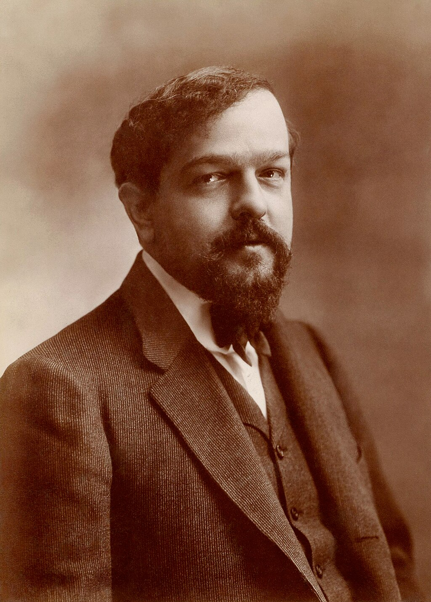

Debussy c. 1900 by Atelier [Nadar](https://en.wikipedia.org/wiki/Nadar "Nadar")

**Achille Claude Debussy** (French pronunciation:[\[aʃilkloddəbysi\]](https://en.wikipedia.org/wiki/Help:IPA/French "Help:IPA/French"); 22 August 1862 – 25 March 1918) was a French composer. He is sometimes seen as the first [Impressionist](https://en.wikipedia.org/wiki/Impressionism_in_music "Impressionism in music") composer, although he vigorously rejected the term. He was among the most influential composers of the late 19th and early 20th centuries.

Born to a family of modest means and little cultural involvement, Debussy showed enough musical talent to be admitted at the age of ten to France's leading music college, the [Conservatoire de Paris](https://en.wikipedia.org/wiki/Conservatoire_de_Paris "Conservatoire de Paris"). He originally studied the piano, but found his vocation in innovative composition, despite the disapproval of the Conservatoire's conservative professors. He took many years to develop his mature style, and was nearly 40 when he achieved international fame in 1902 with the only opera he completed, _[Pelléas et Mélisande](https://en.wikipedia.org/wiki/Pelléas_et_Mélisande_\(opera\) "Pelléas et Mélisande (opera)")_.

Debussy's orchestral works include _[Prélude à l'après-midi d'un faune](https://en.wikipedia.org/wiki/Prélude_à_l'après-midi_d'un_faune "Prélude à l'après-midi d'un faune")_ (1894), _[Nocturnes](https://en.wikipedia.org/wiki/Nocturnes_\(Debussy\) "Nocturnes (Debussy)")_ (1897–1899) and _[Images](https://en.wikipedia.org/wiki/Images_pour_orchestre "Images pour orchestre")_ (1905–1912). His music was to a considerable extent a reaction against [Wagner](https://en.wikipedia.org/wiki/Richard_Wagner "Richard Wagner") and the German musical tradition. He regarded the classical [symphony](https://en.wikipedia.org/wiki/Symphony "Symphony") as obsolete and sought an alternative in his "symphonic sketches", _[La mer](https://en.wikipedia.org/wiki/La_mer_\(Debussy\) "La mer (Debussy)")_ (1903–1905). His piano works include sets of 24 [Préludes](https://en.wikipedia.org/wiki/Préludes_\(Debussy\) "Préludes (Debussy)") and 12 [Études](https://en.wikipedia.org/wiki/Études_\(Debussy\) "Études (Debussy)"). Throughout his career he wrote _[mélodies](https://en.wikipedia.org/wiki/Mélodie "Mélodie")_ based on a wide variety of poetry, including his own. He was greatly influenced by the [Symbolist](https://en.wikipedia.org/wiki/Symbolism_\(movement\) "Symbolism (movement)") poetic movement of the later 19th century. A small number of works, including the early _[La Damoiselle élue](https://en.wikipedia.org/wiki/La_Damoiselle_élue "La Damoiselle élue")_ and the late _[Le Martyre de saint Sébastien](https://en.wikipedia.org/wiki/Le_Martyre_de_saint_Sébastien "Le Martyre de saint Sébastien")_ have important parts for chorus. In his final years, he focused on chamber music, completing three of [six planned sonatas for different combinations of instruments](https://en.wikipedia.org/wiki/Six_sonatas_for_various_instruments "Six sonatas for various instruments").

With early influences including Russian and Far Eastern music and works by [Chopin](https://en.wikipedia.org/wiki/Chopin "Chopin"), Debussy developed his own style of harmony and orchestral colouring, derided – and unsuccessfully resisted – by much of the musical establishment of the day. His works have strongly influenced a wide range of composers including [Béla Bartók](https://en.wikipedia.org/wiki/Béla_Bartók "Béla Bartók"), [Igor Stravinsky](https://en.wikipedia.org/wiki/Igor_Stravinsky "Igor Stravinsky"), [George Gershwin](https://en.wikipedia.org/wiki/George_Gershwin "George Gershwin"), [Olivier Messiaen](/source/olivier-messiaen/ "Olivier Messiaen"), [George Benjamin](https://en.wikipedia.org/wiki/George_Benjamin_\(composer\) "George Benjamin (composer)"), and the [jazz](/source/jazz/ "Jazz") pianist and composer [Bill Evans](https://en.wikipedia.org/wiki/Bill_Evans "Bill Evans"). Debussy died from [cancer](https://en.wikipedia.org/wiki/Colorectal_cancer "Colorectal cancer") at his home in Paris at the age of 55 after a composing career of a little more than 30 years.

## Life and career

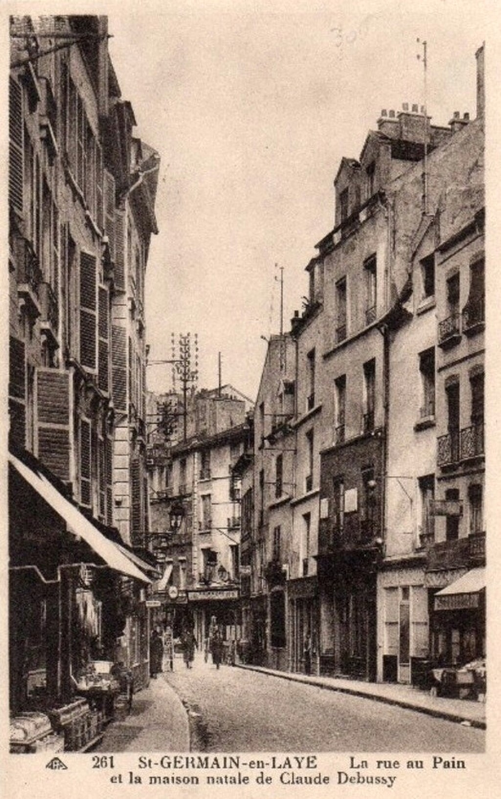Rue au Pain, [Saint-Germain-en-Laye](https://en.wikipedia.org/wiki/Saint-Germain-en-Laye "Saint-Germain-en-Laye"), street of [Debussy's birthplace](https://en.wikipedia.org/wiki/Musée_Claude-Debussy "Musée Claude-Debussy")

### Early life

Debussy was born on 22 August 1862 in [Saint-Germain-en-Laye](https://en.wikipedia.org/wiki/Saint-Germain-en-Laye "Saint-Germain-en-Laye"), [Seine-et-Oise](https://en.wikipedia.org/wiki/Seine-et-Oise "Seine-et-Oise"), on the north-west fringes of Paris. He was the eldest of the five children of Manuel-Achille Debussy and his wife, Victorine, _née_ Manoury. Debussy senior ran a china shop and his wife was a seamstress. The shop was unsuccessful and closed in 1864; the family moved to Paris, first living with Victorine's mother, in [Clichy](https://en.wikipedia.org/wiki/Clichy,_Hauts-de-Seine "Clichy, Hauts-de-Seine"), and, from 1868, in their own apartment in the [Rue Saint-Honoré](https://en.wikipedia.org/wiki/Rue_Saint-Honoré "Rue Saint-Honoré"). Manuel worked in a printing factory.

In 1870, to escape the [siege of Paris](https://en.wikipedia.org/wiki/Siege_of_Paris_\(1870–71\) "Siege of Paris (1870–71)") during the [Franco-Prussian War](https://en.wikipedia.org/wiki/Franco-Prussian_War "Franco-Prussian War"), Debussy's pregnant mother took him and his sister Adèle to their paternal aunt's home in [Cannes](https://en.wikipedia.org/wiki/Cannes "Cannes"), where they remained until the following year. During his stay in Cannes, the seven-year-old Debussy had his first piano lessons; his aunt paid for him to study with an Italian musician, Jean Cerutti. Manuel Debussy remained in Paris and joined the forces of the [Commune](https://en.wikipedia.org/wiki/Paris_Commune "Paris Commune"); after its defeat by French government troops in 1871 he was sentenced to four years' imprisonment, of which he only served one year. His fellow Communard prisoners included his friend Charles de Sivry, a musician. Sivry's mother, Antoinette Mauté de Fleurville, gave piano lessons, and at his instigation the young Debussy became one of her pupils.

Debussy's talents soon became evident, and in 1872, aged ten, he was admitted to the [Conservatoire de Paris](https://en.wikipedia.org/wiki/Conservatoire_de_Paris "Conservatoire de Paris"), where he remained a student for the next eleven years. He first joined the piano class of [Antoine François Marmontel](https://en.wikipedia.org/wiki/Antoine_François_Marmontel "Antoine François Marmontel"), and studied [solfège](https://en.wikipedia.org/wiki/Solfège "Solfège") with [Albert Lavignac](https://en.wikipedia.org/wiki/Albert_Lavignac "Albert Lavignac") and, later, composition with [Ernest Guiraud](https://en.wikipedia.org/wiki/Ernest_Guiraud "Ernest Guiraud"), harmony with [Émile Durand](https://en.wikipedia.org/wiki/Émile_Durand "Émile Durand"), and organ with [César Franck](https://en.wikipedia.org/wiki/César_Franck "César Franck"). The course included music history and theory studies with [Louis-Albert Bourgault-Ducoudray](https://en.wikipedia.org/wiki/Louis-Albert_Bourgault-Ducoudray "Louis-Albert Bourgault-Ducoudray"), but it is not certain that Debussy, who was apt to skip classes, actually attended these.

At the Conservatoire, Debussy initially made good progress. Marmontel said of him, "A charming child, a truly artistic temperament; much can be expected of him". Another teacher was less impressed: Émile Durand wrote in a report, "Debussy would be an excellent pupil if he were less sketchy and less cavalier." A year later he described Debussy as "desperately careless". In July 1874 Debussy received the award of _deuxième accessit_ for his performance as soloist in the first movement of [Chopin's Second Piano Concerto](https://en.wikipedia.org/wiki/Piano_Concerto_No._2_\(Chopin\) "Piano Concerto No. 2 (Chopin)") at the Conservatoire's annual competition. He was a fine pianist and an outstanding [sight reader](https://en.wikipedia.org/wiki/Sight-reading "Sight-reading"), who could have had a professional career had he wished, but he was only intermittently diligent in his studies. He advanced to _premier accessit_ in 1875 and second prize in 1877, but failed at the competitions in 1878 and 1879. These failures made him ineligible to continue in the Conservatoire's piano classes, but he remained a student for harmony, solfège and, later, composition.

With Marmontel's help Debussy secured a summer vacation job in 1879 as resident pianist at the [Château de Chenonceau](https://en.wikipedia.org/wiki/Château_de_Chenonceau "Château de Chenonceau"), where he rapidly acquired a taste for luxury that was to remain with him all his life. His first compositions date from this period, two settings of poems by [Alfred de Musset](https://en.wikipedia.org/wiki/Alfred_de_Musset "Alfred de Musset"): "Ballade à la lune" and "Madrid, princesse des Espagnes". The following year he secured a job as pianist in the household of [Nadezhda von Meck](https://en.wikipedia.org/wiki/Nadezhda_von_Meck "Nadezhda von Meck"), the patroness of [Tchaikovsky](https://en.wikipedia.org/wiki/Pyotr_Ilyich_Tchaikovsky "Pyotr Ilyich Tchaikovsky"). He travelled with her family for the summers of 1880 to 1882, staying at various places in France, Switzerland and Italy, as well as at her home in Moscow. He composed his [Piano Trio in G major](https://en.wikipedia.org/wiki/Piano_Trio_\(Debussy\) "Piano Trio (Debussy)") for von Meck's ensemble, and made a transcription for piano duet of three dances from Tchaikovsky's _[Swan Lake](https://en.wikipedia.org/wiki/Swan_Lake "Swan Lake")_.

### Prix de Rome

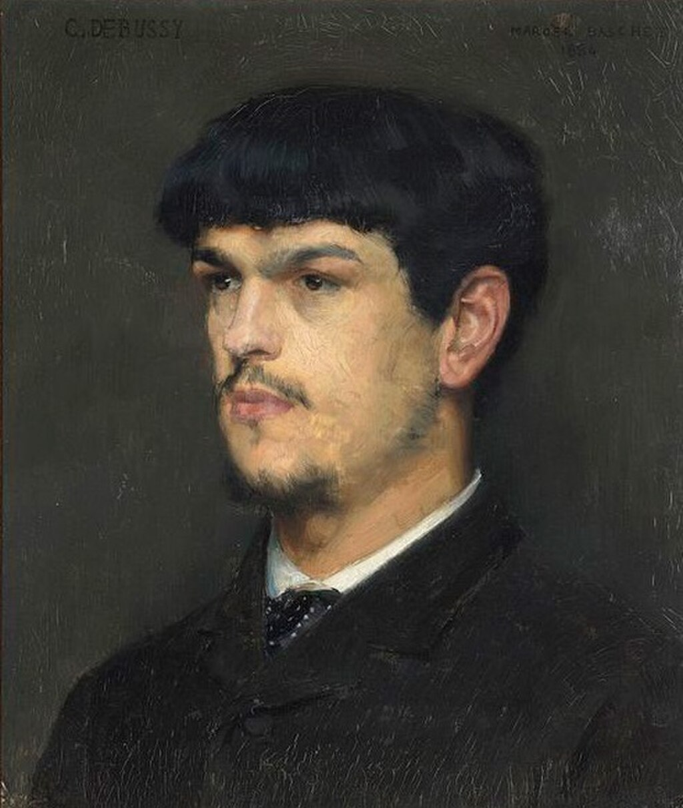Debussy by [Marcel Baschet](https://en.wikipedia.org/wiki/Marcel_Baschet "Marcel Baschet"), 1884

At the end of 1880 Debussy, while continuing his studies at the Conservatoire, was engaged as accompanist for Marie Moreau-Sainti's singing class; he took this role for four years. Among the members of the class was Marie Vasnier; Debussy was greatly taken with her, and she inspired him to compose: he wrote 27 songs dedicated to her during their seven-year relationship. She was the wife of Henri Vasnier, a prominent civil servant, and much younger than her husband. She soon became Debussy's lover as well as his muse. Whether Vasnier was content to tolerate his wife's affair with the young student or was simply unaware of it is not clear, but he and Debussy remained on excellent terms, and he continued to encourage the composer in his career.

At the Conservatoire, Debussy incurred the disapproval of the faculty, particularly his composition teacher, Guiraud, for his failure to follow the orthodox rules of composition then prevailing. Nevertheless, in 1884 Debussy won France's most prestigious musical award, the [Prix de Rome](https://en.wikipedia.org/wiki/Prix_de_Rome "Prix de Rome"), with his [cantata](https://en.wikipedia.org/wiki/Cantata "Cantata") _[L'enfant prodigue](https://en.wikipedia.org/wiki/L'enfant_prodigue_\(Debussy\) "L'enfant prodigue (Debussy)")_. The Prix carried with it a residence at the [Villa Medici](https://en.wikipedia.org/wiki/Villa_Medici "Villa Medici"), the [French Academy in Rome](https://en.wikipedia.org/wiki/French_Academy_in_Rome "French Academy in Rome"), to further the winner's studies. Debussy was there from January 1885 to March 1887, with three or possibly four absences of several weeks when he returned to France, chiefly to see Marie Vasnier.

Initially Debussy found the artistic atmosphere of the Villa Medici stifling, the company boorish, the food bad, and the accommodation "abominable". Neither did he delight in Italian opera, as he found the operas of [Donizetti](https://en.wikipedia.org/wiki/Gaetano_Donizetti "Gaetano Donizetti") and [Verdi](https://en.wikipedia.org/wiki/Giuseppe_Verdi "Giuseppe Verdi") not to his taste. He was much more impressed by the music of the 16th-century composers [Palestrina](/source/palestrina/ "Giovanni Pierluigi da Palestrina") and [Lassus](https://en.wikipedia.org/wiki/Orlande_de_Lassus "Orlande de Lassus"), which he heard at [Santa Maria dell'Anima](https://en.wikipedia.org/wiki/Santa_Maria_dell'Anima "Santa Maria dell'Anima"): "The only church music I will accept". He was often depressed and unable to compose, but he was inspired by [Franz Liszt](https://en.wikipedia.org/wiki/Franz_Liszt "Franz Liszt"), who visited the students and played for them. In June 1885, Debussy wrote of his desire to follow his own way, saying, "I am sure the Institute would not approve, for, naturally it regards the path which it ordains as the only right one. But there is no help for it! I am too enamoured of my freedom, too fond of my own ideas!"

Debussy finally composed four pieces that were submitted to the Academy: the symphonic ode _Zuleima_ (based on a text by [Heinrich Heine](https://en.wikipedia.org/wiki/Heinrich_Heine "Heinrich Heine")); the orchestral piece _Printemps_; the cantata _[La Damoiselle élue](https://en.wikipedia.org/wiki/La_Damoiselle_élue "La Damoiselle élue")_ (1887–1888), the first piece in which the stylistic features of his later music began to emerge; and the _Fantaisie_ for piano and orchestra, which was heavily based on Franck's music and was eventually withdrawn by Debussy. The Academy chided him for writing music that was "bizarre, incomprehensible and unperformable". Although Debussy's works showed the influence of [Jules Massenet](https://en.wikipedia.org/wiki/Jules_Massenet "Jules Massenet"), the latter concluded, "He is an enigma". During his years in Rome Debussy composed – not for the Academy – most of his [Verlaine](https://en.wikipedia.org/wiki/Paul_Verlaine "Paul Verlaine") cycle, _[Ariettes oubliées](https://en.wikipedia.org/wiki/Ariettes_oubliées "Ariettes oubliées")_, which made little impact at the time but was successfully republished in 1903 after the composer had become well known.

### Return to Paris, 1887

A week after his return to Paris in 1887, Debussy heard the first act of Wagner's _[Tristan und Isolde](https://en.wikipedia.org/wiki/Tristan_und_Isolde "Tristan und Isolde")_ at the [Concerts Lamoureux](https://en.wikipedia.org/wiki/Concerts_Lamoureux "Concerts Lamoureux") and judged it "decidedly the finest thing I know". In 1888 and 1889 he went to the annual festivals of Wagner's operas at [Bayreuth](https://en.wikipedia.org/wiki/Bayreuth_Festival "Bayreuth Festival"). He responded positively to Wagner's sensuousness, mastery of form, and striking harmonies, and was briefly influenced by them, but, unlike some other French composers of his generation, he concluded that there was no future in attempting to adopt and develop Wagner's style. He commented in 1903 that Wagner was "a beautiful sunset that was mistaken for a dawn".

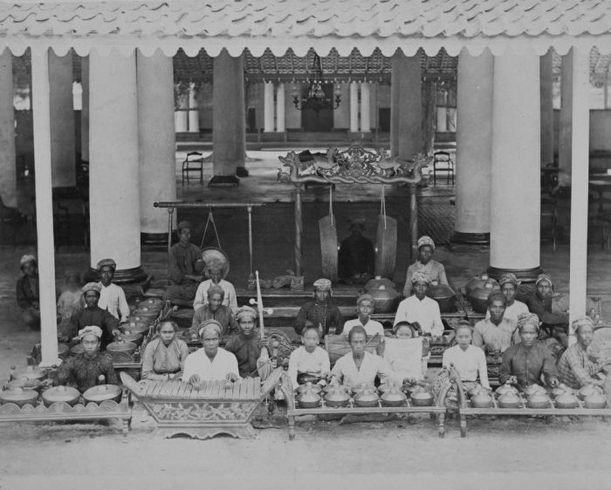Gamelan orchestra, c. 1889

In 1889, at the [Paris Exposition Universelle](https://en.wikipedia.org/wiki/Exposition_Universelle_\(1889\) "Exposition Universelle (1889)"), Debussy first heard [Javanese](https://en.wikipedia.org/wiki/Java "Java") [gamelan](https://en.wikipedia.org/wiki/Gamelan "Gamelan") music. The gamelan scales, melodies, rhythms, and ensemble textures appealed to him, and echoes of them are heard in "Pagodes" in his piano suite _[Estampes](https://en.wikipedia.org/wiki/Estampes "Estampes")_. He also attended two concerts of [Rimsky-Korsakov](https://en.wikipedia.org/wiki/Nikolai_Rimsky-Korsakov "Nikolai Rimsky-Korsakov")'s music, conducted by the composer. This too made an impression on him, and its harmonic freedom and non-Teutonic tone colours influenced his own developing musical style.

Marie Vasnier ended her liaison with Debussy soon after his final return from Rome, although they remained on good enough terms for him to dedicate to her one more song, "Mandoline", in 1890. Later in 1890 Debussy met [Erik Satie](https://en.wikipedia.org/wiki/Erik_Satie "Erik Satie"), who proved a kindred spirit in his experimental approach to composition. Both were [bohemians](https://en.wikipedia.org/wiki/Bohemianism "Bohemianism"), enjoying the same café society and struggling to survive financially. In the same year Debussy began a relationship with Gabrielle (Gaby) Dupont, a tailor's daughter from [Lisieux](https://en.wikipedia.org/wiki/Lisieux "Lisieux"); in July 1893 they began living together.

Debussy continued to compose songs, piano pieces and other works, some of which were publicly performed, but his music made only a modest impact, although his fellow composers recognised his potential by electing him to the committee of the [Société Nationale de Musique](https://en.wikipedia.org/wiki/Société_Nationale_de_Musique "Société Nationale de Musique") in 1893. His [String Quartet](https://en.wikipedia.org/wiki/String_Quartet_\(Debussy\) "String Quartet (Debussy)") was premiered by the [Ysaÿe string quartet](https://en.wikipedia.org/wiki/Ysaÿe_Quartet_\(1886\) "Ysaÿe Quartet (1886)") at the Société Nationale in the same year. In May 1893 Debussy attended a theatrical event that was of key importance to his later career – the premiere of [Maurice Maeterlinck](https://en.wikipedia.org/wiki/Maurice_Maeterlinck "Maurice Maeterlinck")'s play _[Pelléas et Mélisande](https://en.wikipedia.org/wiki/Pelléas_et_Mélisande "Pelléas et Mélisande")_, which he immediately determined to turn into an opera. He travelled to Maeterlinck's home in [Ghent](https://en.wikipedia.org/wiki/Ghent "Ghent") in November to secure his consent to an operatic adaptation.

### 1894–1902: _Pelléas et Mélisande_

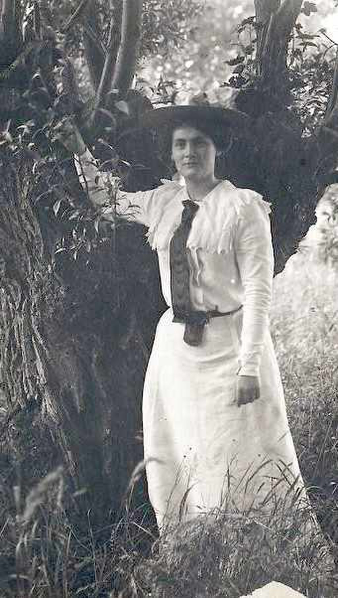Lilly Debussy in 1902

In February 1894 Debussy completed the first draft of Act I of his [operatic version](https://en.wikipedia.org/wiki/Pelléas_et_Mélisande_\(opera\) "Pelléas et Mélisande (opera)") of _Pelléas et Mélisande_, and for most of the year worked to complete it. While still living with Dupont, he had an affair with the singer Thérèse Roger, and in 1894 he announced their engagement. His behaviour was widely condemned; anonymous letters circulated denouncing his treatment of both women, as well as his financial irresponsibility and debts. The engagement was broken off, and several of Debussy's friends and supporters disowned him, including [Ernest Chausson](https://en.wikipedia.org/wiki/Ernest_Chausson "Ernest Chausson"), hitherto one of his strongest supporters.

In terms of musical recognition, Debussy made a step forward in December 1894, when the [symphonic poem](https://en.wikipedia.org/wiki/Symphonic_poem "Symphonic poem") _[Prélude à l'après-midi d'un faune](https://en.wikipedia.org/wiki/Prélude_à_l'après-midi_d'un_faune "Prélude à l'après-midi d'un faune")_, based on [Stéphane Mallarmé](https://en.wikipedia.org/wiki/Stéphane_Mallarmé "Stéphane Mallarmé")'s [poem of the same name](https://en.wikipedia.org/wiki/L'après-midi_d'un_faune_\(poem\) "L'après-midi d'un faune (poem)"), was premiered at a concert of the Société Nationale. The following year he completed the first draft of _Pelléas_ and began efforts to get it staged. In May 1898 he made his first contacts with [André Messager](https://en.wikipedia.org/wiki/André_Messager "André Messager") and [Albert Carré](https://en.wikipedia.org/wiki/Albert_Carré "Albert Carré"), respectively the musical director and general manager of the [Opéra-Comique](https://en.wikipedia.org/wiki/Opéra-Comique "Opéra-Comique"), Paris, about presenting the opera.

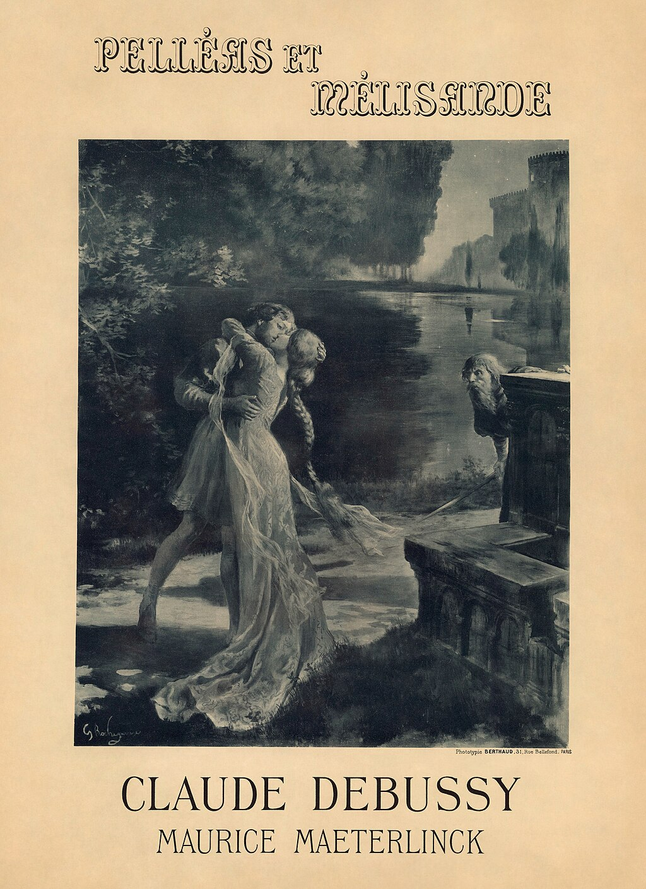Poster by [Georges Rochegrosse](https://en.wikipedia.org/wiki/Georges_Rochegrosse "Georges Rochegrosse") for the premiere of _[Pelléas et Mélisande](https://en.wikipedia.org/wiki/Pelléas_et_Mélisande_\(opera\) "Pelléas et Mélisande (opera)")_ (1902).

Debussy abandoned Dupont for her friend Marie-Rosalie Texier, known as "Lilly", whom he married in October 1899, after threatening suicide if she refused him. She was affectionate, practical, straightforward, and well liked by Debussy's friends and associates, but he became increasingly irritated by her intellectual limitations and lack of musical sensitivity. The marriage lasted barely five years.

From around 1900 Debussy's music became a focus and inspiration for an informal group of innovative young artists, poets, critics, and musicians who began meeting in Paris. They called themselves _[Les Apaches](https://en.wikipedia.org/wiki/Les_Apaches "Les Apaches")_ – roughly "The Hooligans" – to represent their status as "artistic outcasts". The membership was fluid, but at various times included [Maurice Ravel](https://en.wikipedia.org/wiki/Maurice_Ravel "Maurice Ravel"), [Ricardo Viñes](https://en.wikipedia.org/wiki/Ricardo_Viñes "Ricardo Viñes"), [Igor Stravinsky](https://en.wikipedia.org/wiki/Igor_Stravinsky "Igor Stravinsky") and [Manuel de Falla](https://en.wikipedia.org/wiki/Manuel_de_Falla "Manuel de Falla"). In the same year the first two of Debussy's three orchestral _[Nocturnes](https://en.wikipedia.org/wiki/Nocturnes_\(Debussy\) "Nocturnes (Debussy)")_ were first performed. Although they did not make any great impact with the public they were well reviewed by musicians including [Paul Dukas](https://en.wikipedia.org/wiki/Paul_Dukas "Paul Dukas"), [Alfred Bruneau](https://en.wikipedia.org/wiki/Alfred_Bruneau "Alfred Bruneau") and [Pierre de Bréville](https://en.wikipedia.org/wiki/Pierre_de_Bréville "Pierre de Bréville"). The complete set was given the following year.

Like many other composers of the time, Debussy supplemented his income by teaching and writing. For most of 1901 he had a sideline as music critic of _[La Revue Blanche](https://en.wikipedia.org/wiki/La_Revue_Blanche "La Revue Blanche")_, adopting the pen name "Monsieur [Croche](https://en.wikipedia.org/wiki/Crotchet "Crotchet")". He expressed trenchant views on composers ("I hate sentimentality – his name is [Camille Saint-Saëns](https://en.wikipedia.org/wiki/Camille_Saint-Saëns "Camille Saint-Saëns")"), institutions (on the Paris Opéra: "A stranger would take it for a railway station, and, once inside, would mistake it for a Turkish bath"), conductors ("[Nikisch](https://en.wikipedia.org/wiki/Arthur_Nikisch "Arthur Nikisch") is a unique virtuoso, so much so that his virtuosity seems to make him forget the claims of good taste"), musical politics ("The English actually think that a musician can manage an opera house successfully!"), and audiences ("their almost drugged expression of boredom, indifference and even stupidity"). He later collected his criticisms with a view to their publication as a book; it was published posthumously as _Monsieur Croche, Antidilettante_.

In January 1902 rehearsals began at the Opéra-Comique for the opening of _Pelléas et Mélisande_. For three months, Debussy attended rehearsals practically every day. In February there was conflict between Maeterlinck on the one hand and Debussy, Messager and Carré on the other about the casting of Mélisande. Maeterlinck wanted his mistress, [Georgette Leblanc](https://en.wikipedia.org/wiki/Georgette_Leblanc "Georgette Leblanc"), to sing the role, and was incensed when she was passed over in favour of the Scottish soprano [Mary Garden](https://en.wikipedia.org/wiki/Mary_Garden "Mary Garden"). The opera opened on 30 April 1902, and although the first-night audience was divided between admirers and sceptics, the work quickly became a success. It made Debussy a well-known name in France and abroad; _[The Times](https://en.wikipedia.org/wiki/The_Times "The Times")_ commented that the opera had "provoked more discussion than any work of modern times, excepting, of course, those of [Richard Strauss](https://en.wikipedia.org/wiki/Richard_Strauss "Richard Strauss")". The Apaches, led by Ravel (who attended every one of the 14 performances in the first run), were loud in their support; the conservative faculty of the Conservatoire tried in vain to stop its students from seeing the opera. The vocal score was published in early May, and the full orchestral score in 1904.

### 1903–1918

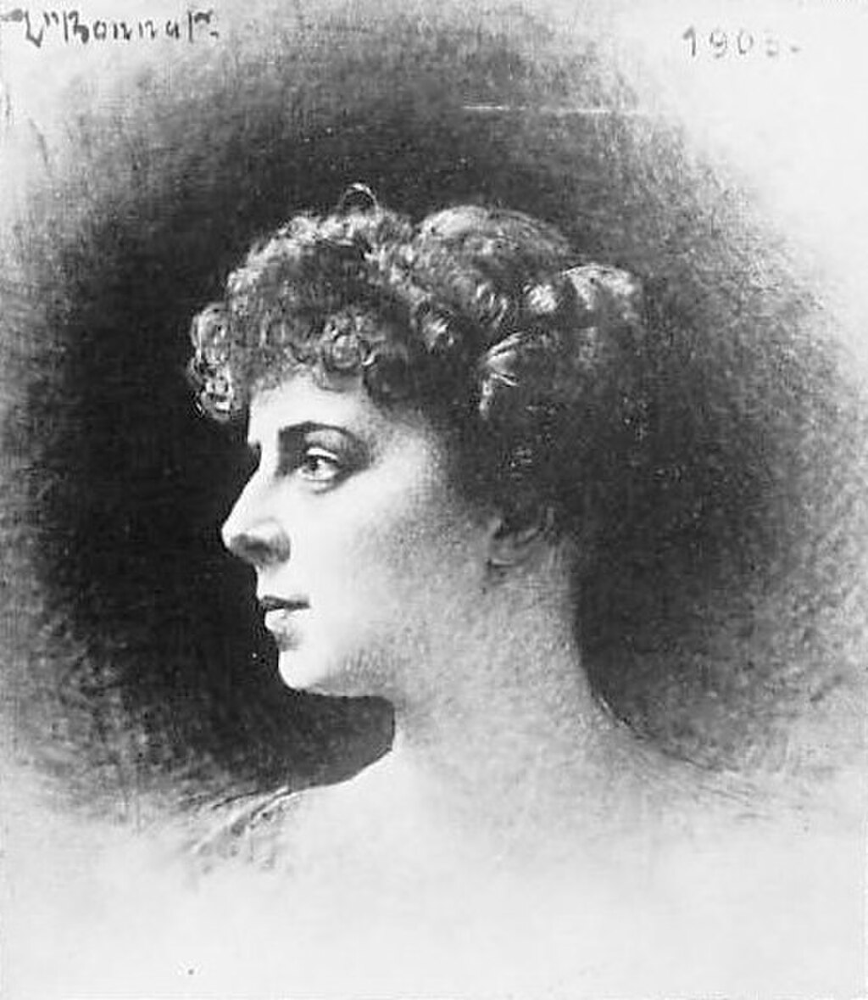Emma Bardac (later Emma Debussy) in 1903

In 1903 there was public recognition of Debussy's stature when he was appointed a Chevalier of the [Légion d'honneur](https://en.wikipedia.org/wiki/Légion_d'honneur "Légion d'honneur"), but his social standing suffered a great blow when another turn in his private life caused a scandal the following year. One of his pupils was [Raoul Bardac](https://en.wikipedia.org/wiki/Raoul_Bardac "Raoul Bardac"), son of [Emma](https://en.wikipedia.org/wiki/Emma_Bardac "Emma Bardac") and her husband, Parisian banker Sigismond Bardac. Raoul introduced his teacher to his mother, to whom Debussy quickly became greatly attracted. She was sophisticated, a brilliant conversationalist, an accomplished singer, and relaxed about marital fidelity, having been the mistress and muse of [Gabriel Fauré](https://en.wikipedia.org/wiki/Gabriel_Fauré "Gabriel Fauré") a few years earlier. After despatching Lilly to her parental home at Bichain in [Villeneuve-la-Guyard](https://en.wikipedia.org/wiki/Villeneuve-la-Guyard "Villeneuve-la-Guyard") on 15 July 1904, Debussy took Emma away, staying incognito in [Jersey](https://en.wikipedia.org/wiki/Jersey "Jersey") and then at [Pourville](https://en.wikipedia.org/wiki/Pourville "Pourville") in Normandy. He wrote to his wife on 11 August from [Dieppe](https://en.wikipedia.org/wiki/Dieppe "Dieppe"), telling her that their marriage was over, but still making no mention of Bardac. When he returned to Paris he set up home on his own, taking a flat in a different [arrondissement](https://en.wikipedia.org/wiki/Arrondissement "Arrondissement"). On 14 October, five days before their fifth wedding anniversary, Lilly Debussy attempted suicide, shooting herself in the chest with a revolver; she survived, although the bullet remained lodged in her [vertebrae](https://en.wikipedia.org/wiki/Vertebra "Vertebra") for the rest of her life. The ensuing scandal caused Bardac's family to disown her, and Debussy lost many good friends including Dukas and Messager. His relations with Ravel, never close, were exacerbated when the latter joined other former friends of Debussy in contributing to a fund to support the deserted Lilly.

The Bardacs divorced in May 1905. Finding the hostility in Paris intolerable, Debussy and Emma (now pregnant) went to England. They stayed at the [Grand Hotel, Eastbourne](https://en.wikipedia.org/wiki/Grand_Hotel,_Eastbourne "Grand Hotel, Eastbourne") in July and August, where Debussy corrected the proofs of his symphonic sketches _[La mer](https://en.wikipedia.org/wiki/La_mer_\(Debussy\) "La mer (Debussy)")_, celebrating his divorce on 2 August. After a brief visit to London, the couple returned to Paris in September, buying a house in a courtyard development off the Avenue du Bois de Boulogne (now [Avenue Foch](https://en.wikipedia.org/wiki/Avenue_Foch "Avenue Foch")), Debussy's home for the rest of his life.

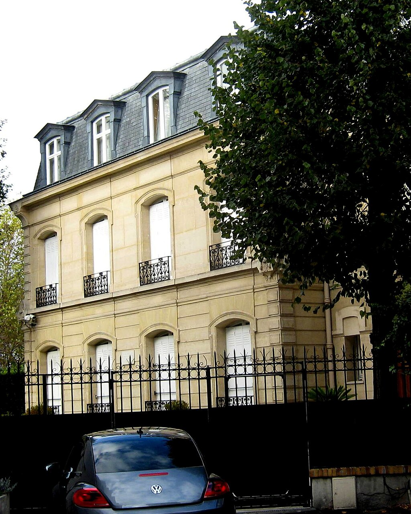Debussy's last home

In October 1905 _La mer_, Debussy's most substantial orchestral work, was premiered in Paris by the [Orchestre Lamoureux](https://en.wikipedia.org/wiki/Orchestre_Lamoureux "Orchestre Lamoureux") under the direction of [Camille Chevillard](https://en.wikipedia.org/wiki/Camille_Chevillard "Camille Chevillard"); the reception was mixed. Some praised the work, but [Pierre Lalo](https://en.wikipedia.org/wiki/Pierre_Lalo "Pierre Lalo"), critic of _[Le Temps](https://en.wikipedia.org/wiki/Le_Temps_\(Paris\) "Le Temps (Paris)")_, hitherto an admirer of Debussy, wrote, "I do not hear, I do not see, I do not smell the sea". In the same month the composer's only child was born at their home. Claude-Emma, affectionately known as "Chouchou", was a musical inspiration to the composer (she was the dedicatee of his _[Children's Corner](https://en.wikipedia.org/wiki/Children's_Corner "Children's Corner")_ suite). She outlived her father by scarcely a year, succumbing to the [diphtheria](https://en.wikipedia.org/wiki/Diphtheria "Diphtheria") epidemic of 1919. Mary Garden said, "I honestly don't know if Debussy ever loved anybody really. He loved his music – and perhaps himself. I think he was wrapped up in his genius", but biographers are agreed that whatever his relations with lovers and friends, Debussy was devoted to his daughter.

Debussy and Emma Bardac eventually married in 1908, their troubled union enduring for the rest of his life. The following year began well, when at Fauré's invitation, Debussy became a member of the governing council of the Conservatoire. His success in London was consolidated in April 1909, when he conducted _Prélude à l'après-midi d'un faune_ and the _Nocturnes_ at the [Queen's Hall](https://en.wikipedia.org/wiki/Queen's_Hall "Queen's Hall"); in May he was present at the first London production of _Pelléas et Mélisande_, at [Covent Garden](https://en.wikipedia.org/wiki/Royal_Opera_House "Royal Opera House"). In the same year, Debussy was diagnosed with [colorectal cancer](https://en.wikipedia.org/wiki/Colorectal_cancer "Colorectal cancer"), from which he was to die nine years later.

Debussy's works began to feature increasingly in concert programmes at home and overseas. In 1910 [Gustav Mahler](https://en.wikipedia.org/wiki/Gustav_Mahler "Gustav Mahler") conducted the _Nocturnes_ and _Prélude à l'après-midi d'un faune_ in New York in successive months. In the same year, visiting Budapest, Debussy commented that his works were better known there than in Paris. In 1912 [Sergei Diaghilev](https://en.wikipedia.org/wiki/Sergei_Diaghilev "Sergei Diaghilev") commissioned a new ballet score, _[Jeux](https://en.wikipedia.org/wiki/Jeux "Jeux")_. That, and the three _[Images](https://en.wikipedia.org/wiki/Images_pour_orchestre "Images pour orchestre")_, premiered the following year, were the composer's last orchestral works. _Jeux_ was unfortunate in its timing: two weeks after the premiere, in March 1913, Diaghilev presented the first performance of Stravinsky's _[The Rite of Spring](https://en.wikipedia.org/wiki/The_Rite_of_Spring "The Rite of Spring")_, a sensational event that monopolised discussion in musical circles, and effectively sidelined _Jeux_ along with Fauré's _[Pénélope](https://en.wikipedia.org/wiki/Pénélope_\(Fauré\) "Pénélope (Fauré)")_, which had opened a week before.

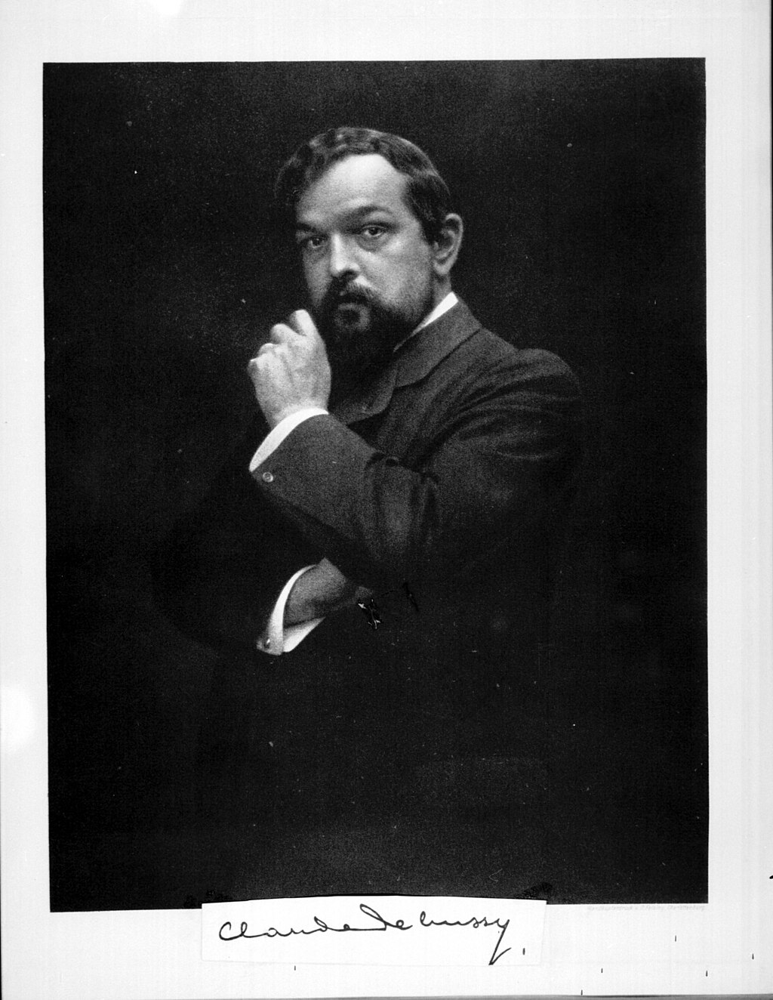Debussy in 1908

In 1915 Debussy underwent one of the earliest [colostomy](https://en.wikipedia.org/wiki/Colostomy "Colostomy") operations. It achieved only a temporary respite, and occasioned him considerable frustration ("There are mornings when the effort of dressing seems like one of the twelve labours of Hercules"). He also had a fierce enemy at this period in the form of [Camille Saint-Saëns](https://en.wikipedia.org/wiki/Camille_Saint-Saëns "Camille Saint-Saëns"), who in a letter to Fauré condemned Debussy's _[En blanc et noir](https://en.wikipedia.org/wiki/En_blanc_et_noir "En blanc et noir")_: "It's incredible, and the door of the [Institut](https://en.wikipedia.org/wiki/Institut_de_France "Institut de France") \[de France\] must at all costs be barred against a man capable of such atrocities". Saint-Saëns had been a member of the Institut since 1881: Debussy never became one. His health continued to decline; he gave his final concert on 14 September 1917 and became bedridden in early 1918.

Debussy died of colon cancer on 25 March 1918 at his home, aged 55. The [First World War](https://en.wikipedia.org/wiki/First_World_War "First World War") was still raging and Paris was under [German aerial and artillery bombardment](https://en.wikipedia.org/wiki/German_spring_offensive "German spring offensive"). The military situation did not permit the honour of a public funeral with ceremonious graveside orations. The funeral procession made its way through deserted streets to a temporary grave at [Père Lachaise Cemetery](https://en.wikipedia.org/wiki/Père_Lachaise_Cemetery "Père Lachaise Cemetery") as the [German guns](https://en.wikipedia.org/wiki/Paris_Gun "Paris Gun") bombarded the city. Debussy's body was reinterred the following year in the small [Passy Cemetery](https://en.wikipedia.org/wiki/Passy_Cemetery "Passy Cemetery") sequestered behind the [Trocadéro](https://en.wikipedia.org/wiki/Trocadéro,_Paris "Trocadéro, Paris"), fulfilling his wish to rest "among the trees and the birds"; his wife and daughter are buried with him.

## Works

In a survey of Debussy's oeuvre shortly after the composer's death, the critic [Ernest Newman](https://en.wikipedia.org/wiki/Ernest_Newman "Ernest Newman") wrote, "It would be hardly too much to say that Debussy spent a third of his life in the discovery of himself, a third in the free and happy realisation of himself, and the final third in the partial, painful loss of himself". Later commentators have rated some of the late works more highly than Newman and other contemporaries did, but much of the music for which Debussy is best known is from the middle years of his career.

The analyst David Cox wrote in 1974 that Debussy, admiring Wagner's attempts to combine all the creative arts, "created a new, instinctive, dreamlike world of music, lyrical and pantheistic, contemplative and objective – a kind of art, in fact, which seemed to reach out into all aspects of experience". In 1988 the composer and scholar [Wilfrid Mellers](https://en.wikipedia.org/wiki/Wilfrid_Mellers "Wilfrid Mellers") wrote of Debussy:

> Because of, rather than in spite of, his preoccupation with chords in themselves, he deprived music of the sense of harmonic progression, broke down three centuries' dominance of harmonic tonality, and showed how the melodic conceptions of tonality typical of primitive folk-music and of medieval music might be relevant to the twentieth century

Debussy did not give his works [opus numbers](https://en.wikipedia.org/wiki/Opus_number "Opus number"), apart from his [String Quartet](https://en.wikipedia.org/wiki/String_Quartet_\(Debussy\) "String Quartet (Debussy)"), Op. 10 in G minor (also the only work where the composer's title included a [key](https://en.wikipedia.org/wiki/Key_\(music\) "Key (music)")). His works were catalogued and indexed by the musicologist [François Lesure](https://en.wikipedia.org/wiki/François_Lesure "François Lesure") in 1977 (revised in 2003) and their [Lesure number](https://en.wikipedia.org/wiki/List_of_compositions_by_Claude_Debussy "List of compositions by Claude Debussy") ("L" followed by a number) is sometimes used as a suffix to their title in concert programmes and recordings.

### Early works, 1879–1892

Debussy's musical development was slow, and as a student he was adept enough to produce for his teachers at the Conservatoire works that would conform to their conservative precepts. His friend [Georges Jean-Aubry](https://en.wikipedia.org/wiki/Georges_Jean-Aubry "Georges Jean-Aubry") commented that Debussy "admirably imitated Massenet's melodic turns of phrase" in the cantata _[L'enfant prodigue](https://en.wikipedia.org/wiki/L'enfant_prodigue_\(Debussy\) "L'enfant prodigue (Debussy)")_ (1884) which won him the Prix de Rome. A more characteristically Debussian work from his early years is _[La Damoiselle élue](https://en.wikipedia.org/wiki/La_Damoiselle_élue "La Damoiselle élue")_, recasting the traditional form for [oratorios](https://en.wikipedia.org/wiki/Oratorio "Oratorio") and cantatas, using a chamber orchestra and a small body of choral tone and using new or long-neglected scales and harmonies. His early _[mélodies](https://en.wikipedia.org/wiki/Mélodie "Mélodie")_, inspired by Marie Vasnier, are more virtuosic in character than his later works in the genre, with extensive wordless _[vocalise](https://en.wikipedia.org/wiki/Vocalise "Vocalise")_; from the _[Ariettes oubliées](https://en.wikipedia.org/wiki/Ariettes_oubliées "Ariettes oubliées")_ (1885–1887) onwards he developed a more restrained style. He wrote his own poems for the _Proses lyriques_ (1892–1893) but, in the view of the musical scholar [Robert Orledge](https://en.wikipedia.org/wiki/Robert_Orledge "Robert Orledge"), "his literary talents were not on a par with his musical imagination".

The musicologist [Jacques-Gabriel Prod'homme](https://en.wikipedia.org/wiki/Jacques-Gabriel_Prod'homme "Jacques-Gabriel Prod'homme") wrote that, together with _La Demoiselle élue_, the _Ariettes oubliées_ and the _[Cinq poèmes de Charles Baudelaire](https://en.wikipedia.org/wiki/Cinq_poèmes_de_Charles_Baudelaire "Cinq poèmes de Charles Baudelaire")_ (1889) show "the new, strange way which the young musician will hereafter follow". Newman concurred: "There is a good deal of Wagner, especially of _Tristan_, in the idiom. But the work as a whole is distinctive, and the first in which we get a hint of the Debussy we were to know later – the lover of vague outlines, of half-lights, of mysterious [consonances and dissonances](https://en.wikipedia.org/wiki/Consonance_and_dissonance "Consonance and dissonance") of colour, the apostle of languor, the exclusivist in thought and in style." During the next few years Debussy developed his personal style, without, at this stage, breaking sharply away from French musical traditions. Much of his music from this period is on a small scale, such as the _[Two Arabesques](https://en.wikipedia.org/wiki/Two_Arabesques "Two Arabesques")_, _[Valse romantique](https://en.wikipedia.org/wiki/Valse_romantique "Valse romantique")_, _[Suite bergamasque](https://en.wikipedia.org/wiki/Suite_bergamasque "Suite bergamasque")_, and the first set of _[Fêtes galantes](https://en.wikipedia.org/wiki/Fêtes_galantes_\(Debussy\) "Fêtes galantes (Debussy)")_. Newman remarked that, like [Chopin](https://en.wikipedia.org/wiki/Frédéric_Chopin "Frédéric Chopin"), the Debussy of this period appears as a liberator from Germanic styles of composition – offering instead "an exquisite, pellucid style" capable of conveying "not only gaiety and whimsicality but emotion of a deeper sort". In a 2004 study, Mark DeVoto comments that Debussy's early works are harmonically no more adventurous than existing music by Fauré; in a 2007 book about the piano works, Margery Halford observes that _Two Arabesques_ (1888–1891) and "[Rêverie](https://en.wikipedia.org/wiki/Rêverie_\(Debussy\) "Rêverie (Debussy)")" (1890) have "the fluidity and warmth of Debussy's later style" but are not harmonically innovative. Halford cites the popular ["Clair de Lune"](https://en.wikipedia.org/wiki/Debussy's_Claire_de_Lune "Debussy's Claire de Lune") (1890), the third of the four movements of _Suite Bergamasque_, as a transitional work pointing towards the composer's mature style.

### Middle works, 1893–1905

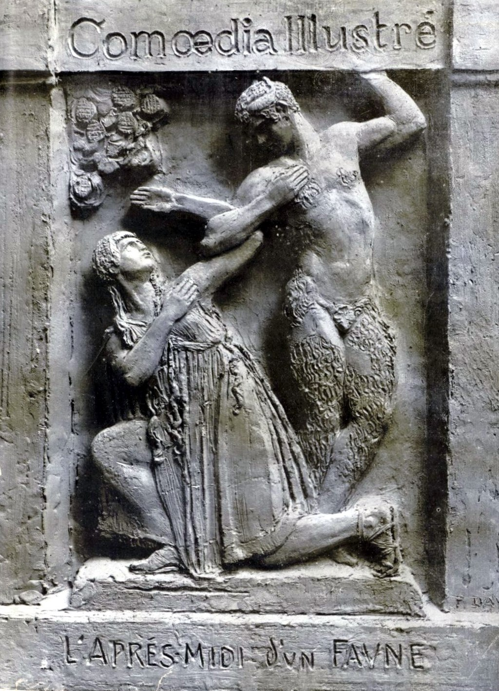Illustration of _[L'après-midi d'un faune](https://en.wikipedia.org/wiki/Prélude_à_l'après-midi_d'un_faune "Prélude à l'après-midi d'un faune")_, 1910

Musicians from Debussy's time onwards have regarded _[Prélude à l'après-midi d'un faune](https://en.wikipedia.org/wiki/Prélude_à_l'après-midi_d'un_faune "Prélude à l'après-midi d'un faune")_ (1894) as his first orchestral masterpiece. Newman considered it "completely original in idea, absolutely personal in style, and logical and coherent from first to last, without a superfluous bar or even a superfluous note"; [Pierre Boulez](https://en.wikipedia.org/wiki/Pierre_Boulez "Pierre Boulez") observed, "Modern music was awakened by _Prélude à l'après-midi d'un faune_". Most of the major works for which Debussy is best known were written between the mid-1890s and the mid-1900s. They include the String Quartet (1893), _[Pelléas et Mélisande](https://en.wikipedia.org/wiki/Pelléas_et_Mélisande_\(opera\) "Pelléas et Mélisande (opera)")_ (1893–1902), the _[Nocturnes for Orchestra](https://en.wikipedia.org/wiki/Nocturnes_\(Debussy\) "Nocturnes (Debussy)")_ (1899) and _[La mer](https://en.wikipedia.org/wiki/La_mer_\(Debussy\) "La mer (Debussy)")_ (1903–1905). The suite _[Pour le piano](https://en.wikipedia.org/wiki/Pour_le_piano "Pour le piano")_ (1894–1901) is, in Halford's view, one of the first examples of the mature Debussy as a composer for the piano: "a major landmark ... and an enlargement of the use of piano sonorities".

In the String Quartet (1893), the gamelan sonorities Debussy had heard four years earlier are recalled in the [pizzicatos](https://en.wikipedia.org/wiki/Pizzicato "Pizzicato") and [cross-rhythms](https://en.wikipedia.org/wiki/Cross-beat "Cross-beat") of the [scherzo](https://en.wikipedia.org/wiki/Scherzo "Scherzo"). Debussy's biographer [Edward Lockspeiser](https://en.wikipedia.org/wiki/Edward_Lockspeiser "Edward Lockspeiser") comments that this movement shows the composer's rejection of "the traditional dictum that string instruments should be predominantly lyrical". The work influenced Ravel, whose own [String Quartet](https://en.wikipedia.org/wiki/String_Quartet_\(Ravel\) "String Quartet (Ravel)"), written ten years later, has noticeably Debussian features. The academic and journalist [Stephen Walsh](https://en.wikipedia.org/wiki/Stephen_Walsh_\(writer\) "Stephen Walsh (writer)") calls _Pelléas et Mélisande_ (begun 1893, staged 1902) "a key work for the 20th century". The composer [Olivier Messiaen](/source/olivier-messiaen/ "Olivier Messiaen") was fascinated by its "extraordinary harmonic qualities and ... transparent instrumental texture". The opera is composed in what [Alan Blyth](https://en.wikipedia.org/wiki/Alan_Blyth "Alan Blyth") describes as a sustained and heightened [recitative](https://en.wikipedia.org/wiki/Recitative "Recitative") style, with "sensuous, intimate" vocal lines. It influenced composers as different as [Stravinsky](https://en.wikipedia.org/wiki/Igor_Stravinsky "Igor Stravinsky") and [Puccini](https://en.wikipedia.org/wiki/Giacomo_Puccini "Giacomo Puccini").

Orledge describes the _Nocturnes_ as exceptionally varied in texture, "ranging from the Musorgskian start of 'Nuages', through the approaching brass band procession in 'Fêtes', to the wordless female chorus in 'Sirènes'". Orledge considers the last a pre-echo of the marine textures of _La mer_. _[Estampes](https://en.wikipedia.org/wiki/Estampes "Estampes")_ for piano (1903) gives impressions of exotic locations, with further echoes of the gamelan in its [pentatonic](https://en.wikipedia.org/wiki/Pentatonic "Pentatonic") structures. Debussy believed that since [Beethoven](https://en.wikipedia.org/wiki/Ludwig_van_Beethoven "Ludwig van Beethoven"), the traditional symphonic form had become formulaic, repetitive and obsolete. The three-part, cyclic [symphony by César Franck](https://en.wikipedia.org/wiki/Symphony_in_D_minor_\(Franck\) "Symphony in D minor (Franck)") (1888) was more to his liking, and its influence can be found in _La mer_ (1905); this uses a quasi-symphonic form, its three sections making up a giant [sonata-form](https://en.wikipedia.org/wiki/Sonata-form "Sonata-form") movement with, as Orledge observes, a cyclic theme, in the manner of Franck. The central "Jeux de vagues" section has the function of a symphonic [development section](https://en.wikipedia.org/wiki/Musical_development "Musical development") leading into the final "Dialogue du vent et de la mer", "a powerful essay in orchestral colour and sonority" (Orledge) which reworks themes from the first movement. The reviews were sharply divided. Some critics thought the treatment less subtle and less mysterious than his previous works, and even a step backward; others praised its "power and charm", its "extraordinary verve and brilliant fantasy", and its strong colours and definite lines.

### Late works, 1906–1917

Of the later orchestral works, _[Images](https://en.wikipedia.org/wiki/Images_pour_orchestre "Images pour orchestre")_ (1905–1912) is better known than _[Jeux](https://en.wikipedia.org/wiki/Jeux "Jeux")_ (1913). The former follows the tripartite form established in the _Nocturnes_ and _La mer_, but differs in employing traditional British and French folk tunes, and in making the central movement, "Ibéria", far longer than the outer ones, and subdividing it into three parts, all inspired by scenes from Spanish life. Although considering _Images_ "the pinnacle of Debussy's achievement as a composer for orchestra", Trezise notes a contrary view that the accolade belongs to the ballet score _Jeux_. The latter failed as a ballet because of what Jann Pasler describes as a banal scenario, and the score was neglected for some years. Recent analysts have found it a link between traditional continuity and thematic growth within a score and the desire to create discontinuity in a way mirrored in later 20th century music. In this piece, Debussy abandoned the [whole-tone scale](https://en.wikipedia.org/wiki/Whole-tone_scale "Whole-tone scale") he had often favoured previously in favour of the [octatonic scale](https://en.wikipedia.org/wiki/Octatonic_scale "Octatonic scale") with what the Debussy scholar [François Lesure](https://en.wikipedia.org/wiki/François_Lesure "François Lesure") describes as its tonal ambiguities.

Among the late piano works are two books of _[Préludes](https://en.wikipedia.org/wiki/Préludes_\(Debussy\) "Préludes (Debussy)")_ (1909–10, 1911–13), short pieces that depict a wide range of subjects. Lesure comments that they range from the frolics of minstrels at Eastbourne in 1905 and the American acrobat "General Lavine" "to dead leaves and the sounds and scents of the evening air". _[En blanc et noir](https://en.wikipedia.org/wiki/En_blanc_et_noir "En blanc et noir")_ (In white and black, 1915), a three-movement work for two pianos, is a predominantly sombre piece, reflecting the war and national danger. The _[Études](https://en.wikipedia.org/wiki/Études_\(Debussy\) "Études (Debussy)")_ (1915) for piano have divided opinion. Writing soon after Debussy's death, Newman found them laboured – "a strange last chapter in a great artist's life"; Lesure, writing eighty years later, rates them among Debussy's greatest late works: "Behind a pedagogic exterior, these 12 pieces explore abstract intervals, or – in the last five – the sonorities and timbres peculiar to the piano." In 1914 Debussy started work on a planned set of [six sonatas for various instruments](https://en.wikipedia.org/wiki/Six_sonatas_for_various_instruments "Six sonatas for various instruments"). His fatal illness prevented him from completing the set, but those [for cello and piano](https://en.wikipedia.org/wiki/Cello_Sonata_\(Debussy\) "Cello Sonata (Debussy)") (1915), flute, viola and harp (1915), and violin and piano (1917 – his last completed work) are all concise, three-movement pieces, more [diatonic](https://en.wikipedia.org/wiki/Diatonic "Diatonic") in nature than some of his other late works.

_[Le Martyre de saint Sébastien](https://en.wikipedia.org/wiki/Le_Martyre_de_saint_Sébastien "Le Martyre de saint Sébastien")_ (1911), originally a five-act musical play to a text by [Gabriele D'Annunzio](https://en.wikipedia.org/wiki/Gabriele_D'Annunzio "Gabriele D'Annunzio") that took nearly five hours in performance, was not a success, and the music is now more often heard in a concert (or studio) adaptation with narrator, or as an orchestral suite of "Fragments symphoniques". Debussy enlisted the help of [André Caplet](https://en.wikipedia.org/wiki/André_Caplet "André Caplet") in orchestrating and arranging the score. Two late stage works, the ballets _[Khamma](https://en.wikipedia.org/wiki/Khamma_\(ballet\) "Khamma (ballet)")_ (1912) and _[La boîte à joujoux](https://en.wikipedia.org/wiki/La_boîte_à_joujoux "La boîte à joujoux")_ (1913), were left with the orchestration incomplete, and were completed by [Charles Koechlin](https://en.wikipedia.org/wiki/Charles_Koechlin "Charles Koechlin") and Caplet, respectively.

## Style

### Debussy and Impressionism

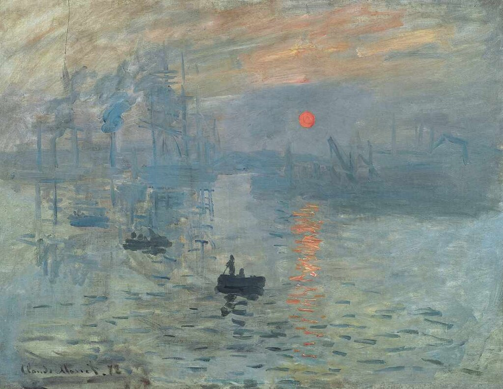[Monet](https://en.wikipedia.org/wiki/Claude_Monet "Claude Monet")'s _[Impression, soleil levant](https://en.wikipedia.org/wiki/Impression,_Sunrise "Impression, Sunrise")_ (1872), from which "Impressionism" takes its name

The application of the term "Impressionist" to Debussy and the music he influenced has been much debated, both during his lifetime and since. The analyst [Richard Langham Smith](https://en.wikipedia.org/wiki/Richard_Langham_Smith "Richard Langham Smith") writes that Impressionism was originally a term coined to describe a [style of late 19th-century French painting](https://en.wikipedia.org/wiki/Impressionism "Impressionism"), typically scenes suffused with reflected light in which the emphasis is on the overall impression rather than outline or clarity of detail, as in works by [Monet](https://en.wikipedia.org/wiki/Claude_Monet "Claude Monet"), [Pissarro](https://en.wikipedia.org/wiki/Camille_Pissarro "Camille Pissarro"), [Renoir](https://en.wikipedia.org/wiki/Pierre-Auguste_Renoir "Pierre-Auguste Renoir") and others. Langham Smith writes that the term became transferred to the compositions of Debussy and others which were "concerned with the representation of landscape or natural phenomena, particularly the water and light imagery dear to Impressionists, through subtle textures suffused with instrumental colour".

Among painters, Debussy particularly admired [Turner](https://en.wikipedia.org/wiki/J._M._W._Turner "J. M. W. Turner"), but also drew inspiration from [Whistler](https://en.wikipedia.org/wiki/James_McNeill_Whistler "James McNeill Whistler"). With the latter in mind the composer wrote to the violinist [Eugène Ysaÿe](https://en.wikipedia.org/wiki/Eugène_Ysaÿe "Eugène Ysaÿe") in 1894 describing the orchestral _Nocturnes_ as "an experiment in the different combinations that can be obtained from one colour – what a study in grey would be in painting."

Debussy strongly objected to the use of the word "Impressionism" for his (or anybody else's) music, but it has continually been attached to him since the assessors at the Conservatoire first applied it, opprobriously, to his early work _Printemps_. Langham Smith comments that Debussy wrote many piano pieces with titles evocative of nature – "Reflets dans l'eau" (1905), "Les Sons et les parfums tournent dans l'air du soir" (1910) and "Brouillards" (1913) – and suggests that the Impressionist painters' use of brush-strokes and dots is paralleled in the music of Debussy. Although Debussy said that anyone using the term (whether about painting or music) was an imbecile, some Debussy scholars have taken a less absolutist line. Lockspeiser calls _La mer_ "the greatest example of an orchestral Impressionist work", and more recently in _The Cambridge Companion to Debussy_ Nigel Simeone comments, "It does not seem unduly far-fetched to see a parallel in Monet's seascapes".

In this context may be placed Debussy's [pantheistic](https://en.wikipedia.org/wiki/Pantheism "Pantheism") eulogy to Nature, in a 1911 interview with [Henry Malherbe](https://en.wikipedia.org/wiki/Henry_Malherbe "Henry Malherbe"):

> I have made mysterious Nature my religion ... When I gaze at a sunset sky and spend hours contemplating its marvellous ever-changing beauty, an extraordinary emotion overwhelms me. Nature in all its vastness is truthfully reflected in my sincere though feeble soul. Around me are the trees stretching up their branches to the skies, the perfumed flowers gladdening the meadow, the gentle grass-carpeted earth, ... and my hands unconsciously assume an attitude of adoration.

In contrast to the "impressionistic" characterisation of Debussy's music, several writers have suggested that he structured at least some of his music on rigorous mathematical lines. In 1983 the pianist and scholar [Roy Howat](https://en.wikipedia.org/wiki/Roy_Howat "Roy Howat") published a book contending that certain of Debussy's works are proportioned using mathematical models, even while using an apparent classical structure such as [sonata form](https://en.wikipedia.org/wiki/Sonata_form "Sonata form"). Howat suggests that some of Debussy's pieces can be divided into sections that reflect the [golden ratio](https://en.wikipedia.org/wiki/Golden_ratio "Golden ratio"), which is approximated by ratios of consecutive numbers in the [Fibonacci sequence](https://en.wikipedia.org/wiki/Fibonacci_sequence "Fibonacci sequence"). Simon Trezise, in his 1994 book _Debussy: La Mer_, finds the intrinsic evidence "remarkable", with the caveat that no written or reported evidence suggests that Debussy deliberately sought such proportions. Lesure takes a similar view, endorsing Howat's conclusions while not taking a view on Debussy's conscious intentions.

### Musical idiom

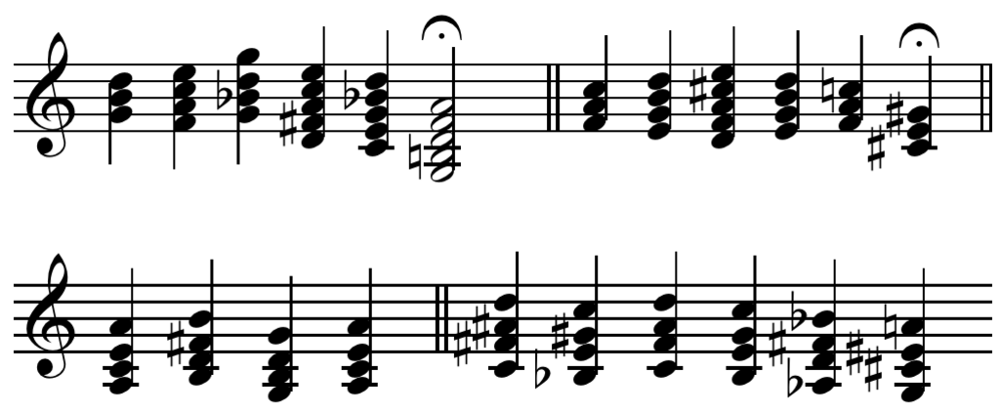Improvised chord sequences played by Debussy for Guiraud

![\header { tagline = ##f }
\paper { paper-width = 120\mm }
global = { \key c \major \time 4/4 \override Staff.TimeSignature.stencil = ##f }
tn = \tempo 4=60
tf = \tempo 4=30
kords = \relative c'' { \global \cadenzaOn
\tn <d b g>4 <e c a f> <g d bes g> <e c a fis d> <d bes! g e c> \tf <a f d b g>2\fermata \bar \"||\"
\tn <c a f>4 <d b g e> <e cis a f d> <d b g e> <c a f> \tf <gis e cis>\fermata \bar \"||\" \break
\tn <a e c a> <b fis d b> <g d b g> <a e c a> \bar \"||\"
<d ais fis! c>4 <c gis e bes> <d a f c> <c g e b> <bes fis d as> <a! eis cis g>
}
empty = r1
%{
\score { \new Staff { \accidentalStyle forget \kords }
\layout { indent = 0 \set Score.tempoHideNote = ##t \context { \Score \remove \"Bar_number_engraver\" } }
\midi { }
}
%}
\score { \empty \layout { \context { \Staff \RemoveAllEmptyStaves } } }
\score { \midi { } \kords }](../media/claude-debussy/c1p9e2nk.png)

Audio playback is not supported in your browser. You can [download the audio file](https://upload.wikimedia.org/score/c/1/c1p9e2nk848fnyi682p0kz5jblkdhht/c1p9e2nk.mp3).

Debussy wrote "We must agree that the beauty of a work of art will always remain a mystery \[...\] we can never be absolutely sure 'how it's made.' We must at all costs preserve this magic which is peculiar to music and to which music, by its nature, is of all the arts the most receptive."

Nevertheless, there are many indicators of the sources and elements of Debussy's idiom. Writing in 1958, the critic [Rudolph Reti](https://en.wikipedia.org/wiki/Rudolph_Reti "Rudolph Reti") summarised six features of Debussy's music, which he asserted "established a new concept of tonality in European music": the frequent use of lengthy [pedal points](https://en.wikipedia.org/wiki/Pedal_point "Pedal point") – "not merely bass pedals in the actual sense of the term, but sustained 'pedals' in any voice"; glittering passages and webs of figurations which distract from occasional absence of tonality; frequent use of [parallel chords](https://en.wikipedia.org/wiki/Parallel_chord "Parallel chord") which are "in essence not harmonies at all, but rather 'chordal melodies', enriched unisons", described by some writers as non-functional harmonies; bitonality, or at least [bitonal](https://en.wikipedia.org/wiki/Bitonal "Bitonal") chords; use of the [whole-tone](https://en.wikipedia.org/wiki/Whole-tone_scale "Whole-tone scale") and [pentatonic scales](https://en.wikipedia.org/wiki/Pentatonic_scale "Pentatonic scale"); and [unprepared modulations](https://en.wikipedia.org/wiki/Unprepared_modulation "Unprepared modulation"), "without any harmonic bridge". Reti concludes that Debussy's achievement was the synthesis of monophonic based "melodic tonality" with harmonies, albeit different from those of "harmonic tonality".

In 1889, Debussy held conversations with his former teacher Guiraud, which included exploration of harmonic possibilities at the piano. The discussion, and Debussy's chordal keyboard improvisations, were noted by a younger pupil of Guiraud, Maurice Emmanuel. The chord sequences played by Debussy include some of the elements identified by Reti. They may also indicate the influence on Debussy of [Satie](https://en.wikipedia.org/wiki/Erik_Satie "Erik Satie")'s 1887 _[Trois Sarabandes](https://en.wikipedia.org/wiki/Sarabandes_\(Satie\) "Sarabandes (Satie)")_. A further improvisation by Debussy during this conversation included a sequence of whole tone harmonies which may have been inspired by the music of [Glinka](https://en.wikipedia.org/wiki/Mikhail_Glinka "Mikhail Glinka") or [Rimsky-Korsakov](https://en.wikipedia.org/wiki/Nikolai_Rimsky-Korsakov "Nikolai Rimsky-Korsakov") which was becoming known in Paris at this time. During the conversation, Debussy told Guiraud, "There is no theory. You have only to listen. Pleasure is the law!" – although he also conceded, "I feel free because I have been through the mill, and I don't write in the [fugal](https://en.wikipedia.org/wiki/Fugue "Fugue") style because I know it."

## Influences

### Musical

> "Chabrier, Moussorgsky, Palestrina, voilà ce que j'aime" – they are what I love.

— Debussy in 1893

Among French predecessors, [Chabrier](https://en.wikipedia.org/wiki/Emmanuel_Chabrier "Emmanuel Chabrier") was an important influence on Debussy (as he was on Ravel and [Poulenc](https://en.wikipedia.org/wiki/Francis_Poulenc "Francis Poulenc")); Howat has written that Chabrier's piano music such as "Sous-bois" and "Mauresque" in the _[Pièces pittoresques](https://en.wikipedia.org/wiki/Pièces_pittoresques "Pièces pittoresques")_ explored new sound-worlds of which Debussy made effective use 30 years later. Lesure finds traces of [Gounod](https://en.wikipedia.org/wiki/Charles_Gounod "Charles Gounod") and [Massenet](https://en.wikipedia.org/wiki/Jules_Massenet "Jules Massenet") in some of Debussy's early songs, and remarks that it may have been from the Russians – [Tchaikovsky](https://en.wikipedia.org/wiki/Pyotr_Ilyich_Tchaikovsky "Pyotr Ilyich Tchaikovsky"), [Balakirev](https://en.wikipedia.org/wiki/Mily_Balakirev "Mily Balakirev"), [Rimsky-Korsakov](https://en.wikipedia.org/wiki/Nikolai_Rimsky-Korsakov "Nikolai Rimsky-Korsakov"), [Borodin](https://en.wikipedia.org/wiki/Alexander_Borodin "Alexander Borodin") and [Mussorgsky](https://en.wikipedia.org/wiki/Modest_Mussorgsky "Modest Mussorgsky") – that Debussy acquired his taste for "ancient and oriental modes and for vivid colorations, and a certain disdain for academic rules". Lesure also considers that Mussorgsky's opera _[Boris Godunov](https://en.wikipedia.org/wiki/Boris_Godunov_\(opera\) "Boris Godunov (opera)")_ directly influenced Debussy's _Pelléas et Mélisande_. In the music of [Palestrina](/source/palestrina/ "Giovanni Pierluigi da Palestrina"), Debussy found what he called "a perfect whiteness", and he felt that although Palestrina's musical forms had a "strict manner", they were more to his taste than the rigid rules prevailing among 19th-century French composers and teachers. He drew inspiration from what he called Palestrina's "harmony created by melody", finding an [arabesque](https://en.wikipedia.org/wiki/Arabesque "Arabesque")-like quality in the melodic lines.

Debussy opined that [Chopin](https://en.wikipedia.org/wiki/Frédéric_Chopin "Frédéric Chopin") was "the greatest of them all, for through the piano he discovered everything"; he professed his "respectful gratitude" for Chopin's piano music. He was torn between dedicating his own Études to Chopin or to [François Couperin](https://en.wikipedia.org/wiki/François_Couperin "François Couperin"), whom he also admired as a model of form, seeing himself as heir to their mastery of the genre. Howat cautions against the assumption that Debussy's Ballade (1891) and Nocturne (1892) are influenced by Chopin – in Howat's view they owe more to Debussy's early Russian models – but Chopin's influence is found in other early works such as the _Two arabesques_ (1889–1891). In 1914 the publisher [A. Durand & fils](https://en.wikipedia.org/wiki/Durand_\(publisher\) "Durand (publisher)") began publishing scholarly new editions of the works of major composers, and Debussy undertook the supervision of the editing of Chopin's music.

Although Debussy was in no doubt of Wagner's stature, he was only briefly influenced by him in his compositions, after _La damoiselle élue_ and the _Cinq poèmes de Baudelaire_ (both begun in 1887). According to [Pierre Louÿs](https://en.wikipedia.org/wiki/Pierre_Louÿs "Pierre Louÿs"), Debussy "did not see 'what anyone can do beyond Tristan'," although he admitted that it was sometimes difficult to avoid "the ghost of old [Klingsor](https://en.wikipedia.org/wiki/Parsifal#Act_I "Parsifal"), alias Richard Wagner, appearing at the turning of a bar". After Debussy's short Wagnerian phase, he started to become interested in non-Western music and its unfamiliar approaches to composition. The piano piece "[Golliwogg's Cakewalk](https://en.wikipedia.org/wiki/Golliwogg's_Cakewalk "Golliwogg's Cakewalk")", from the 1908 suite _[Children's Corner](https://en.wikipedia.org/wiki/Children's_Corner "Children's Corner")_, contains a parody of music from the introduction to _Tristan_, in which, in the opinion of the musicologist [Lawrence Kramer](https://en.wikipedia.org/wiki/Lawrence_Kramer_\(musicologist\) "Lawrence Kramer (musicologist)"), Debussy escapes the shadow of the older composer and "smilingly relativizes Wagner into insignificance".

A contemporary influence was Erik Satie, according to Nichols Debussy's "most faithful friend" amongst French musicians. Debussy's orchestration in 1896 of Satie's _[Gymnopédies](https://en.wikipedia.org/wiki/Gymnopédies "Gymnopédies")_ (which had been written in 1887) "put their composer on the map" according to the musicologist [Richard Taruskin](https://en.wikipedia.org/wiki/Richard_Taruskin "Richard Taruskin"), and the Sarabande from Debussy's _Pour le piano_ (1901) "shows that \[Debussy\] knew Satie's _[Trois Sarabandes](https://en.wikipedia.org/wiki/Sarabandes_\(Satie\) "Sarabandes (Satie)")_ at a time when only a personal friend of the composer could have known them." (They were not published until 1911). Debussy's interest in the popular music of his time is evidenced not only by the _Golliwogg's Cakewalk_ and other piano pieces featuring [rag-time](https://en.wikipedia.org/wiki/Rag-time "Rag-time"), such as _[The Little Nigar](https://en.wikipedia.org/wiki/The_Little_Nigar "The Little Nigar")_ (Debussy's spelling) (1909), but by the slow [waltz](https://en.wikipedia.org/wiki/Waltz "Waltz") _[La plus que lente](https://en.wikipedia.org/wiki/La_plus_que_lente "La plus que lente")_ (_The more than slow_), based on the style of the gipsy violinist at a Paris hotel (to whom he gave the manuscript of the piece).

In addition to the composers who influenced his own compositions, Debussy held strong views about several others. He was for the most part enthusiastic about [Richard Strauss](https://en.wikipedia.org/wiki/Richard_Strauss "Richard Strauss") and Stravinsky, respectful of [Mozart](https://en.wikipedia.org/wiki/Wolfgang_Amadeus_Mozart "Wolfgang Amadeus Mozart") and was in awe of [Bach](/source/johann-sebastian-bach/ "Johann Sebastian Bach"), whom he called the "good God of music" (_le Bon Dieu de la musique_). His relationship to Beethoven was complex; he was said to refer to him as _le vieux sourd_ ('the old deaf one') and asked one young pupil not to play Beethoven's music for "it is like somebody dancing on my grave;" but he believed that Beethoven had profound things to say, yet did not know how to say them, "because he was imprisoned in a web of incessant restatement and of German aggressiveness." He was not in sympathy with [Schubert](https://en.wikipedia.org/wiki/Franz_Schubert "Franz Schubert"), [Schumann](https://en.wikipedia.org/wiki/Robert_Schumann "Robert Schumann"), [Brahms](https://en.wikipedia.org/wiki/Johannes_Brahms "Johannes Brahms") and [Mendelssohn](https://en.wikipedia.org/wiki/Felix_Mendelssohn "Felix Mendelssohn"), the latter being described as a "facile and elegant notary".

With the advent of the First World War, Debussy became ardently patriotic in his musical opinions. Writing to Stravinsky, he asked "How could we not have foreseen that these men were plotting the destruction of our art, just as they had planned the destruction of our country?" In 1915 he complained that "since [Rameau](https://en.wikipedia.org/wiki/Jean-Philippe_Rameau "Jean-Philippe Rameau") we have had no purely French tradition \[...\] We tolerated overblown orchestras, tortuous forms \[...\] we were about to give the seal of approval to even more suspect naturalizations when the sound of gunfire put a sudden stop to it all." Taruskin writes that some have seen this as a reference to the composers [Gustav Mahler](https://en.wikipedia.org/wiki/Gustav_Mahler "Gustav Mahler") and [Arnold Schoenberg](https://en.wikipedia.org/wiki/Arnold_Schoenberg "Arnold Schoenberg"), both born Jewish. In 1912 Debussy had remarked to his publisher of the opera _[Ariane et Barbe-bleue](https://en.wikipedia.org/wiki/Ariane_et_Barbe-bleue "Ariane et Barbe-bleue")_ by the (also Jewish) composer [Paul Dukas](https://en.wikipedia.org/wiki/Paul_Dukas "Paul Dukas"), "You're right, \[it\] is a masterpiece – but it's not a masterpiece of French music." On the other hand, [Charles Rosen](https://en.wikipedia.org/wiki/Charles_Rosen "Charles Rosen") argued in a review of Taruskin's work that Debussy was instead implying "that \[Dukas's\] opera was too Wagnerian, too German, to fit his ideal of French style", citing Georges Liébert, one of the editors of Debussy's collected correspondence, as an authority, saying that Debussy was not antisemitic.

### Literary

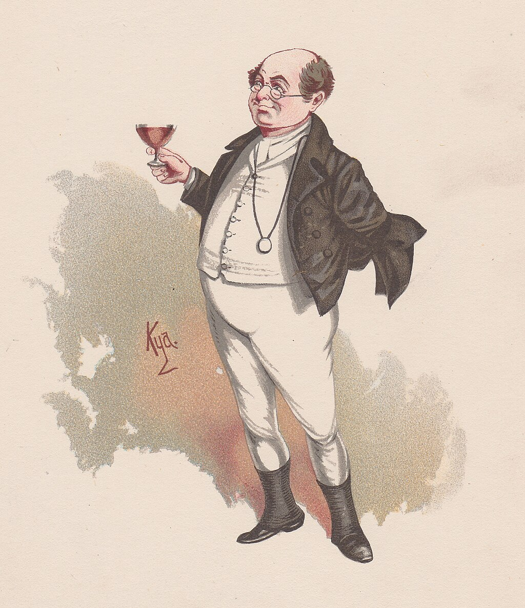[S. Pickwick Esq. P.P.M.P.C.](https://en.wikipedia.org/wiki/Hommage_à_S._Pickwick_Esq._P.P.M.P.C. "Hommage à S. Pickwick Esq. P.P.M.P.C.")

Despite his lack of formal schooling, Debussy read widely and found inspiration in literature. Lesure writes, "The development of [free verse](https://en.wikipedia.org/wiki/Free_verse "Free verse") in poetry and the disappearance of the subject or model in painting influenced him to think about issues of musical form." Debussy was influenced by the [Symbolist](https://en.wikipedia.org/wiki/Symbolism_\(movement\) "Symbolism (movement)") poets. These writers, who included Verlaine, Mallarmé, Maeterlinck and [Rimbaud](https://en.wikipedia.org/wiki/Arthur_Rimbaud "Arthur Rimbaud"), reacted against the realism, naturalism, objectivity and formal conservatism that prevailed in the 1870s. They favoured poetry using suggestion rather than direct statement; the literary scholar Chris Baldrick writes that they evoked "subjective moods through the use of private symbols, while avoiding the description of external reality or the expression of opinion". Debussy was much in sympathy with the Symbolists' desire to bring poetry closer to music, became friendly with several leading exponents, and set many Symbolist works throughout his career.

Debussy's literary inspirations were mostly French, but he did not overlook foreign writers. As well as Maeterlinck for _Pelléas et Mélisande_, he drew on [Shakespeare](https://en.wikipedia.org/wiki/William_Shakespeare "William Shakespeare") and [Dickens](https://en.wikipedia.org/wiki/Charles_Dickens "Charles Dickens") for two of his Préludes for piano – "La Danse de Puck" (Book 1, 1910) and "[Hommage à S. Pickwick Esq. P.P.M.P.C.](https://en.wikipedia.org/wiki/Hommage_à_S._Pickwick_Esq._P.P.M.P.C. "Hommage à S. Pickwick Esq. P.P.M.P.C.")" (Book 2, 1913). He set [Dante Gabriel Rossetti](https://en.wikipedia.org/wiki/Dante_Gabriel_Rossetti "Dante Gabriel Rossetti")'s _[The Blessed Damozel](https://en.wikipedia.org/wiki/The_Blessed_Damozel "The Blessed Damozel")_ in his early cantata, _La Damoiselle élue_ (1888). He wrote incidental music for _[King Lear](https://en.wikipedia.org/wiki/King_Lear "King Lear")_ and planned an opera based on _[As You Like It](https://en.wikipedia.org/wiki/As_You_Like_It "As You Like It")_, but abandoned that once he turned his attention to setting Maeterlinck's play. In 1890 he began work on an orchestral piece inspired by [Edgar Allan Poe](https://en.wikipedia.org/wiki/Edgar_Allan_Poe "Edgar Allan Poe")'s _[The Fall of the House of Usher](https://en.wikipedia.org/wiki/The_Fall_of_the_House_of_Usher "The Fall of the House of Usher")_ and later sketched the libretto for an opera, _[La chute de la maison Usher](https://en.wikipedia.org/wiki/La_chute_de_la_maison_Usher_\(opera\) "La chute de la maison Usher (opera)")_. Another project inspired by Poe – an operatic version of _[The Devil in the Belfry](https://en.wikipedia.org/wiki/The_Devil_in_the_Belfry "The Devil in the Belfry")_ did not progress beyond sketches. French writers whose words he set include [Paul Bourget](https://en.wikipedia.org/wiki/Paul_Bourget "Paul Bourget"), [Alfred de Musset](https://en.wikipedia.org/wiki/Alfred_de_Musset "Alfred de Musset"), [Théodore de Banville](https://en.wikipedia.org/wiki/Théodore_de_Banville "Théodore de Banville"), [Leconte de Lisle](https://en.wikipedia.org/wiki/Leconte_de_Lisle "Leconte de Lisle"), [Théophile Gautier](https://en.wikipedia.org/wiki/Théophile_Gautier "Théophile Gautier"), [Paul Verlaine](https://en.wikipedia.org/wiki/Paul_Verlaine "Paul Verlaine"), [François Villon](https://en.wikipedia.org/wiki/François_Villon "François Villon"), and Mallarmé – the last of whom also provided Debussy with the inspiration for one of his most popular orchestral pieces, _Prélude à l'après-midi d'un faune_.

## Influence on later composers

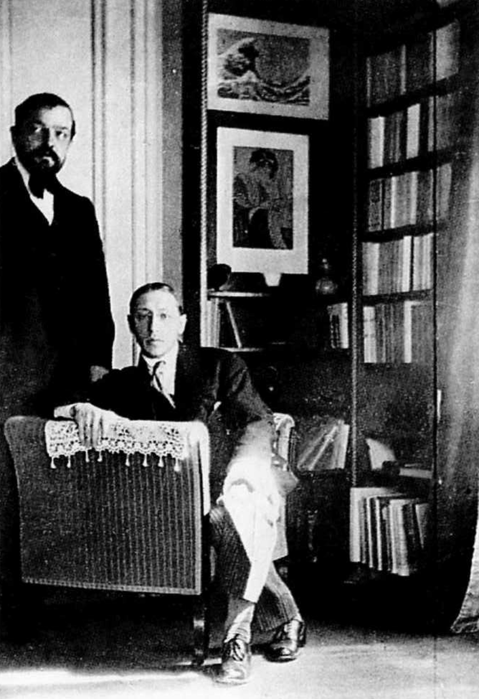Debussy with Igor Stravinsky: photograph by Erik Satie, June 1910, taken at Debussy's home in the Avenue du Bois de Boulogne

Debussy is widely regarded as one of the most influential composers of the 20th century. [Roger Nichols](https://en.wikipedia.org/wiki/Roger_Nichols_\(musical_scholar\) "Roger Nichols (musical scholar)") writes that "if one omits Schoenberg ... a list of 20th-century composers influenced by Debussy is practically a list of 20th-century composers _[tout court](https://en.wiktionary.org/wiki/tout%20court "wikt:tout court")_."

[Bartók](https://en.wikipedia.org/wiki/Béla_Bartók "Béla Bartók") first encountered Debussy's music in 1907 and later said that "Debussy's great service to music was to reawaken among all musicians an awareness of harmony and its possibilities". Not only Debussy's use of whole-tone scales, but also his style of word-setting in _Pelléas et Mélisande_, were the subject of study by [Leoš Janáček](https://en.wikipedia.org/wiki/Leoš_Janáček "Leoš Janáček") while he was writing his 1921 opera _[Káťa Kabanová](https://en.wikipedia.org/wiki/Káťa_Kabanová "Káťa Kabanová")_. [Stravinsky](https://en.wikipedia.org/wiki/Igor_Stravinsky "Igor Stravinsky") was more ambivalent about Debussy's music (he thought _Pelléas_ "a terrible bore ... in spite of many wonderful pages") but the two composers knew each other and Stravinsky's _[Symphonies of Wind Instruments](https://en.wikipedia.org/wiki/Symphonies_of_Wind_Instruments "Symphonies of Wind Instruments")_ (1920) was written as a memorial for Debussy.

In the aftermath of the First World War, the young French composers of [Les Six](https://en.wikipedia.org/wiki/Les_Six "Les Six") reacted against what they saw as the poetic, mystical quality of Debussy's music in favour of something more hard-edged. Their sympathiser and self-appointed spokesman [Jean Cocteau](https://en.wikipedia.org/wiki/Jean_Cocteau "Jean Cocteau") wrote in 1918: "Enough of _nuages_, waves, aquariums, _ondines_ and nocturnal perfumes," pointedly alluding to the titles of pieces by Debussy. Later generations of French composers had a much more positive relationship with his music. [Messiaen](/source/olivier-messiaen/ "Olivier Messiaen") was given a score of _Pelléas et Mélisande_ as a boy and said that it was "a revelation, love at first sight" and "probably the most decisive influence I have been subject to". [Boulez](https://en.wikipedia.org/wiki/Pierre_Boulez "Pierre Boulez") also discovered Debussy's music at a young age and said that it gave him his first sense of what modernity in music could mean.

Among contemporary composers [George Benjamin](https://en.wikipedia.org/wiki/George_Benjamin_\(composer\) "George Benjamin (composer)") has described _Prélude à l'après-midi d'un faune_ as "the definition of perfection"; he has conducted _Pelléas et Mélisande_ and the critic Rupert Christiansen detects the influence of the work in Benjamin's opera _[Written on Skin](https://en.wikipedia.org/wiki/Written_on_Skin "Written on Skin")_ (2012). Others have made orchestrations of some of the piano and vocal works, including [John Adams](https://en.wikipedia.org/wiki/John_Adams_\(composer\) "John Adams (composer)")'s version of four of the Baudelaire songs (_Le Livre de Baudelaire_, 1994), [Robin Holloway](https://en.wikipedia.org/wiki/Robin_Holloway "Robin Holloway")'s of _En blanc et noir_ (2002), and [Colin Matthews](https://en.wikipedia.org/wiki/Colin_Matthews "Colin Matthews")'s of both books of _Préludes_ (2001–2006).

The pianist [Stephen Hough](https://en.wikipedia.org/wiki/Stephen_Hough "Stephen Hough") believes that Debussy's influence also extends to [jazz](/source/jazz/ "Jazz") and suggests that _[Reflets dans l'eau](https://en.wikipedia.org/wiki/Reflets_dans_l'eau "Reflets dans l'eau")_ can be heard in the harmonies of [Bill Evans](https://en.wikipedia.org/wiki/Bill_Evans "Bill Evans").

## Recordings

In 1904, Debussy played the piano accompaniment for Mary Garden in recordings for the Compagnie française du Gramophone of four of his songs: three _mélodies_ from the Verlaine cycle _Ariettes oubliées_ – "Il pleure dans mon coeur", "L'ombre des arbres" and "Green" – and "Mes longs cheveux", from Act III of _Pelléas et Mélisande_. He made a set of [piano rolls](https://en.wikipedia.org/wiki/Piano_rolls "Piano rolls") for the [Welte-Mignon](https://en.wikipedia.org/wiki/Welte-Mignon "Welte-Mignon") company in 1913. They contain fourteen of his pieces: "D'un cahier d'esquisses", "La plus que lente", "La soirée dans Grenade", all six movements of _Children's Corner_, and five of the _Preludes_: "Danseuses de Delphes", "Le vent dans la plaine", "La cathédrale engloutie", "La danse de Puck" and "Minstrels". The 1904 and 1913 sets have been transferred to compact disc.

Contemporaries of Debussy who made recordings of his music included the pianists [Ricardo Viñes](https://en.wikipedia.org/wiki/Ricardo_Viñes "Ricardo Viñes") (in "Poissons d'or" from _Images_ and "La soirée dans Grenade" from _Estampes_); [Alfred Cortot](https://en.wikipedia.org/wiki/Alfred_Cortot "Alfred Cortot") (numerous solo pieces as well as the Violin Sonata with [Jacques Thibaud](https://en.wikipedia.org/wiki/Jacques_Thibaud "Jacques Thibaud") and the _Chansons de Bilitis_ with [Maggie Teyte](https://en.wikipedia.org/wiki/Maggie_Teyte "Maggie Teyte")); and [Marguerite Long](https://en.wikipedia.org/wiki/Marguerite_Long "Marguerite Long") ("Jardins sous la pluie" and "Arabesques"). Singers in Debussy's mélodies or excerpts from _Pelléas et Mélisande_ included [Jane Bathori](https://en.wikipedia.org/wiki/Jane_Bathori "Jane Bathori"), [Claire Croiza](https://en.wikipedia.org/wiki/Claire_Croiza "Claire Croiza"), [Charles Panzéra](https://en.wikipedia.org/wiki/Charles_Panzéra "Charles Panzéra") and [Ninon Vallin](https://en.wikipedia.org/wiki/Ninon_Vallin "Ninon Vallin"); and among the conductors in the major orchestral works were [Ernest Ansermet](https://en.wikipedia.org/wiki/Ernest_Ansermet "Ernest Ansermet"), [Désiré-Émile Inghelbrecht](https://en.wikipedia.org/wiki/Désiré-Émile_Inghelbrecht "Désiré-Émile Inghelbrecht"), [Pierre Monteux](https://en.wikipedia.org/wiki/Pierre_Monteux "Pierre Monteux") and [Arturo Toscanini](https://en.wikipedia.org/wiki/Arturo_Toscanini "Arturo Toscanini"), and in the _[Petite Suite](https://en.wikipedia.org/wiki/Petite_Suite_\(Debussy\) "Petite Suite (Debussy)")_, [Henri Büsser](https://en.wikipedia.org/wiki/Henri_Büsser "Henri Büsser"), who had prepared the orchestration for Debussy. Many of these early recordings have been reissued on CD.

In more recent times Debussy's output has been extensively recorded. In 2018, to mark the centenary of the composer's death, [Warner Classics](https://en.wikipedia.org/wiki/Warner_Classics "Warner Classics"), with contributions from other companies, issued a 33-CD set that is claimed to include all the music Debussy wrote.

## Notes, references and sources
