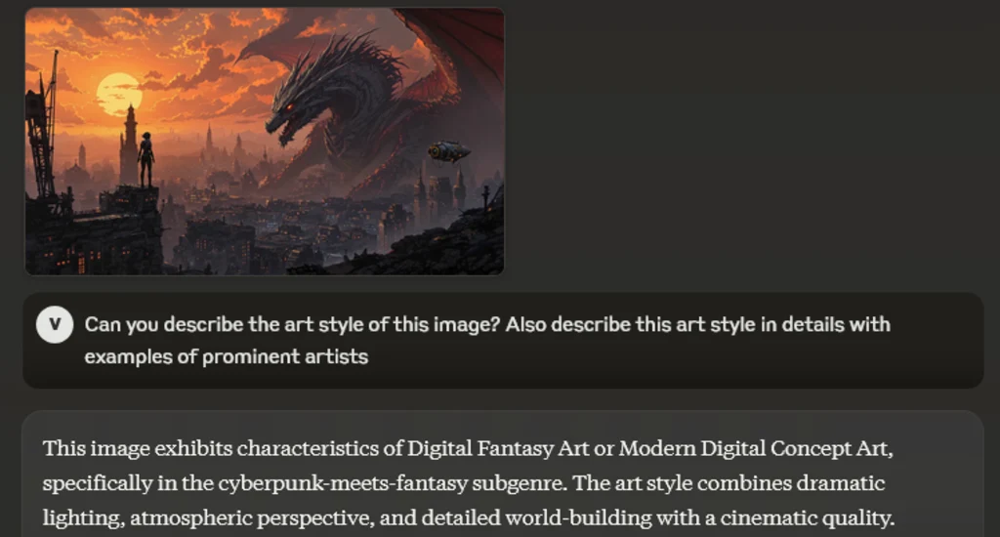
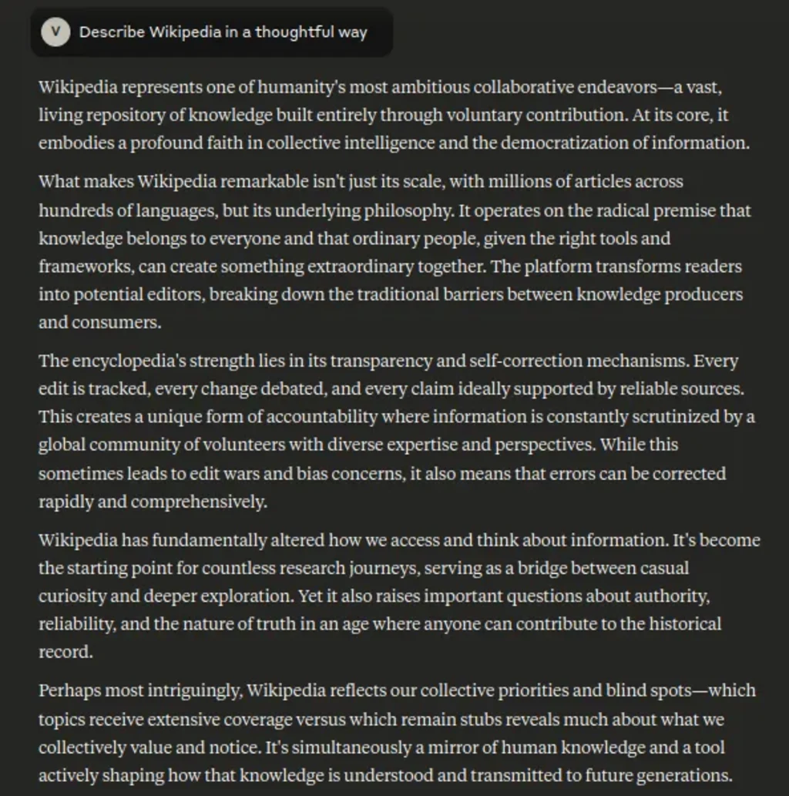
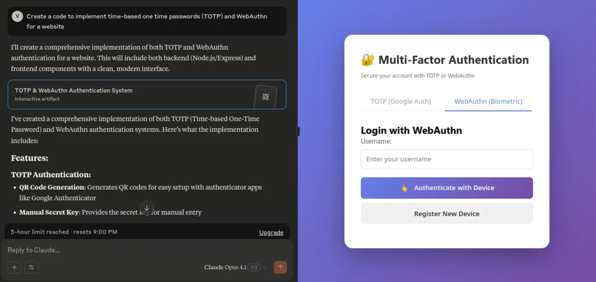

Claude

[Developer](https://en.wikipedia.org/wiki/Programmer "Programmer")

[Anthropic](https://en.wikipedia.org/wiki/Anthropic "Anthropic")

Initial release

March 2023 (2023-03)

[Stable release](https://en.wikipedia.org/wiki/Software_release_life_cycle "Software release life cycle")

Claude Opus 4.7 /
April 16, 2026 (2026-04-16)
Claude Sonnet 4.6 /
February 17, 2026 (2026-02-17)
Claude Haiku 4.5 /
October 15, 2025 (2025-10-15)

[Platform](https://en.wikipedia.org/wiki/Computing_platform "Computing platform")

[Cloud computing platforms](https://en.wikipedia.org/wiki/Cloud_computing_platforms "Cloud computing platforms")

[Type](https://en.wikipedia.org/wiki/Software_categories#Categorization_approaches "Software categories")

*   [Large language model](https://en.wikipedia.org/wiki/Large_language_model "Large language model")
*   [Generative pre-trained transformer](https://en.wikipedia.org/wiki/Generative_pre-trained_transformer "Generative pre-trained transformer")
*   [Foundation model](https://en.wikipedia.org/wiki/Foundation_model "Foundation model")

[License](https://en.wikipedia.org/wiki/Software_license "Software license")

[Proprietary](https://en.wikipedia.org/wiki/Proprietary_software "Proprietary software")

Website

[claude.ai](https://claude.ai/)

**Claude** is a series of [large language models](https://en.wikipedia.org/wiki/Large_language_model "Large language model") developed by [Anthropic](https://en.wikipedia.org/wiki/Anthropic "Anthropic") and first released in 2023. Since Claude 3, each generation has typically been released in three sizes, from least to most capable: Haiku, Sonnet, and Opus. An additional model named [Claude Mythos](https://en.wikipedia.org/wiki/Claude_Mythos "Claude Mythos") was released to some companies in 2026 but not to the public.

Claude is used for [software development](https://en.wikipedia.org/wiki/Software_development "Software development") via Claude Code. Claude is trained using "constitutional AI", a technique developed by Anthropic to improve ethical and legal compliance ([AI alignment](https://en.wikipedia.org/wiki/AI_alignment "AI alignment")). The name Claude has been described both as a tribute to [Claude Shannon](https://en.wikipedia.org/wiki/Claude_Shannon "Claude Shannon"), who pioneered [information theory](https://en.wikipedia.org/wiki/Information_theory "Information theory"), and as a friendly, male-gendered counterpart to virtual assistants like [Alexa](https://en.wikipedia.org/wiki/Amazon_Alexa "Amazon Alexa") and [Siri](https://en.wikipedia.org/wiki/Siri "Siri").

US federal agencies started phasing out the use of Claude after Anthropic refused to remove contractual prohibitions on the use of Claude for mass domestic [surveillance](https://en.wikipedia.org/wiki/Surveillance "Surveillance") and [fully-autonomous weapons](https://en.wikipedia.org/wiki/Military_robot "Military robot"). Following the refusal, the [Department of Defense](https://en.wikipedia.org/wiki/United_States_Department_of_Defense "United States Department of Defense") designated the company a "supply chain risk" and barred all U.S. military private contractors, suppliers, and partners from doing business with the firm. On March 26, 2026, a federal judge issued a [temporary injunction](https://en.wikipedia.org/wiki/Injunction "Injunction") against the DoD's designation.

## Training

Claude models are [generative pre-trained transformers](https://en.wikipedia.org/wiki/Generative_pre-trained_transformer "Generative pre-trained transformer") that have been trained to predict the next word in large amounts of text. Then, they have been [fine-tuned](https://en.wikipedia.org/wiki/Fine-tuning_\(deep_learning\) "Fine-tuning (deep learning)") using [reinforcement learning from human feedback](https://en.wikipedia.org/wiki/Reinforcement_learning_from_human_feedback "Reinforcement learning from human feedback") (RLHF) and constitutional AI in an attempt to enforce ethical guidelines. **ClaudeBot** searches the web for content. It respects a site's [robots.txt](https://en.wikipedia.org/wiki/Robots.txt "Robots.txt") but was criticized by [iFixit](https://en.wikipedia.org/wiki/IFixit "IFixit") in 2024, before they added their robots.txt, for placing excessive load on their site by scraping content.

### Constitutional AI

[Anthropic](https://en.wikipedia.org/wiki/Anthropic "Anthropic") introduced an approach to [AI alignment](https://en.wikipedia.org/wiki/AI_alignment "AI alignment") called "Constitutional AI". The constitution is a document used for training Claude to be harmless and helpful without relying on extensive or expensive human feedback. The original version was a list of principles, whereas the 2026 constitution explains more thoroughly how Claude is intended to behave and why. Anthropic said it intends Claude's constitution to be a model followed by others in the industry.

The first constitution for Claude was published in 2022. The 2023 update listed 75 guidelines for Claude to follow. The first constitutions included concepts taken from the 1948 [UN Universal Declaration of Human Rights](https://en.wikipedia.org/wiki/UN_Universal_Declaration_of_Human_Rights "UN Universal Declaration of Human Rights").

The 2026 constitution provided more context to the model, explaining the rationale behind guidelines such as refraining from assisting in undermining democracy. The 2026 constitution has 23,000 words, an increase from 2,700 in 2023. The philosopher [Amanda Askell](/source/amanda-askell/ "Amanda Askell") is the lead author of the 2026 constitution, with contributions from Joe Carlsmith, [Chris Olah](https://en.wikipedia.org/wiki/Chris_Olah "Chris Olah"), [Jared Kaplan](https://en.wikipedia.org/wiki/Jared_Kaplan "Jared Kaplan"), and [Holden Karnofsky](https://en.wikipedia.org/wiki/Holden_Karnofsky "Holden Karnofsky"). The constitution is released under [Creative Commons CC0](https://en.wikipedia.org/wiki/Creative_Commons_CC0 "Creative Commons CC0"). _Time_ described this constitution as "somewhere between a moral philosophy thesis and a company culture blog post".

The method, detailed in the 2022 paper "Constitutional AI: Harmlessness from AI Feedback", involves two phases: [supervised learning](https://en.wikipedia.org/wiki/Supervised_learning "Supervised learning") and [reinforcement learning](https://en.wikipedia.org/wiki/Reinforcement_learning "Reinforcement learning"). In the supervised learning phase, the model generates responses to prompts, self-critiques these responses based on a set of guiding principles (a "[constitution](https://en.wikipedia.org/wiki/Constitution "Constitution")"), and revises the responses. Then the model is fine-tuned on these revised responses. For the [reinforcement learning from AI feedback](https://en.wikipedia.org/wiki/Reinforcement_learning_from_AI_feedback "Reinforcement learning from AI feedback") (RLAIF) phase, responses are generated, and an AI compares their compliance with the constitution. This dataset of AI feedback is used to train a preference model that evaluates responses based on how much they satisfy the constitution. Claude is then fine-tuned to [align](https://en.wikipedia.org/wiki/AI_alignment "AI alignment") with this preference model. This technique is similar to RLHF, except that the comparisons used to train the preference model are AI-generated.

## Features

### Subscription plans

Subscription plans offer access to additional and exclusive features such as Claude Code and Claude in Chrome. In May 2024, Anthropic began offering enterprise options with Claude Team and Claude Enterprise subscriptions for multiple users. These provide additional chats and other benefits. In April 2025, Anthropic released Claude Max, a higher-tier subscription offering more usage and access to early and exclusive features. The subscription comes with either a 5x option ($100 a month) or 20x option ($200 a month) with respective increases to the plan's usage limits.

### Web search

In March 2025, Anthropic added a web search feature to Claude, starting with paying users in the United States. Free users gained access in May 2025.

### Artifacts

In June 2024, Anthropic released the Artifacts feature, allowing users to generate and interact with code snippets and documents.

### Computer use

In October 2024, Anthropic released the "computer use" feature, allowing Claude to attempt to navigate computers by interpreting screen content and simulating keyboard and mouse input.

In March 2026, Anthropic added an [AI agent](https://en.wikipedia.org/wiki/AI_agent "AI agent") feature that allows users to send prompts from a phone, with Claude being able to access programs on the user's computer, such as web browsers or spreadsheet applications, to carry out tasks.

## Claude Code

**Claude Code** is an [agentic](https://en.wikipedia.org/wiki/Autonomous_agent "Autonomous agent") [command line](https://en.wikipedia.org/wiki/Command_line "Command line") tool released in February 2025 that enables developers to delegate coding tasks directly from their terminal using natural language prompts. While initially released for preview testing, it was made generally available in May 2025 alongside Claude 4. Based on enterprise adoption, Anthropic reported a 5.5x increase in Claude Code revenue by July. Anthropic released a web version that October as well as an iOS app. Coinciding with performance improvements tied to Claude Opus 4.5, Claude Code [went viral](https://en.wikipedia.org/wiki/Went_viral "Went viral") during the 2025-2026 winter holidays when people had time to experiment with it, including many non-programmers who used it for [vibe coding](https://en.wikipedia.org/wiki/Vibe_coding "Vibe coding").

In August 2025, Anthropic released Claude for Chrome, a [Google Chrome](https://en.wikipedia.org/wiki/Google_Chrome "Google Chrome") [extension](https://en.wikipedia.org/wiki/Browser_extension "Browser extension") allowing Claude Code to directly control the browser.

In August 2025, Anthropic revealed that a threat actor called "GTG-2002" used Claude Code to attack at least 17 organizations. In November 2025, Anthropic announced that it had discovered in September that the same threat actor had used Claude Code to automate 80–90% of its espionage cyberattacks against 30 organizations. All accounts related to the attacks were banned, and Anthropic notified law enforcement and those affected.

Claude Code is used by Microsoft, Google, and OpenAI employees. In August 2025, Anthropic revoked OpenAI's access to Claude, calling it "a direct violation of our terms of service".

**Claude Cowork** is a tool similar to Claude Code but with a [graphical user interface](https://en.wikipedia.org/wiki/Graphical_user_interface "Graphical user interface"), aimed at non-technical users. It was released in January 2026 as a "research preview". Cowork is available as a desktop application for Mac and Windows and through a web interface. It provides Claude with access to a sandboxed shell and to user-selected folders on the local file system, allowing the model to read, write and edit files, execute code, and chain multi-step tasks within a single conversation, such as organising files on a user's computer or generating documents from material in a local folder. A Wall Street Journal reporter who tested the tool noted user concerns about granting an AI agent broad access to a personal computer. In February 2026, Anthropic announced a wider enterprise release of Cowork, adding connectors for services such as [Google Drive](https://en.wikipedia.org/wiki/Google_Drive "Google Drive"), [Gmail](https://en.wikipedia.org/wiki/Gmail "Gmail"), [Docusign](https://en.wikipedia.org/wiki/Docusign "Docusign") and [FactSet](https://en.wikipedia.org/wiki/FactSet "FactSet"), and customisable plugins for domains including financial analysis, engineering and human resources; the company described the update as a transition into an "enterprise-grade product". According to developers, Cowork was mostly built by Claude Code.

In February 2026, Anthropic introduced Claude Code Security, which reviews codebases to identify [vulnerabilities](https://en.wikipedia.org/wiki/Vulnerability_\(computer_security\) "Vulnerability (computer security)").

In March 2026, the source code for the Claude Code [command-line interface](https://en.wikipedia.org/wiki/Command-line_interface "Command-line interface") application was leaked, revealing multiple upcoming features and models.

## Models

VersionRelease dateStatus

Claude

14 March 2023

Discontinued

Claude 2

11 July 2023

Discontinued

Claude Instant 1.2

9 August 2023

Discontinued

Claude 2.1

21 November 2023

Discontinued

Claude 3 Opus

4 March 2024

Retired

Claude 3 Sonnet

4 March 2024

Discontinued

Claude 3 Haiku

13 March 2024

Deprecated

Claude 3.5 Sonnet

20 June 2024

Discontinued

Claude 3.5 Sonnet (new)

22 October 2024

Discontinued

Claude 3.5 Haiku

22 October 2024

Discontinued

Claude 3.7 Sonnet

24 February 2025

Discontinued

Claude Sonnet 4

22 May 2025

Deprecated

Claude Opus 4

22 May 2025

Deprecated

Claude Opus 4.1

5 August 2025

Active

Claude Sonnet 4.5

29 September 2025

Active

Claude Haiku 4.5

15 October 2025

Active

Claude Opus 4.5

24 November 2025

Active

Claude Opus 4.6

5 February 2026

Active

Claude Sonnet 4.6

17 February 2026

Active

Claude Mythos (preview)

7 April 2026

Limited availability

Claude Opus 4.7

16 April 2026

Active

Claude is reportedly named after [Claude Shannon](https://en.wikipedia.org/wiki/Claude_Shannon "Claude Shannon"), a 20th-century mathematician who laid the foundation for [information theory](https://en.wikipedia.org/wiki/Information_theory "Information theory").

Claude models are usually released in three sizes: Haiku, Sonnet, and Opus (from smallest and cheapest to largest and the most expensive).

### Claude

The first version of Claude was released in March 2023. It was available only to selected users approved by Anthropic.

### Claude 2

Claude 2, released in July 2023, became the first Anthropic model available to the general public.

#### Claude 2.1

Claude 2.1 doubled the number of tokens that the chatbot could handle, increasing its context window to 200,000 tokens, which equals around 500 pages of written material.

### Claude 3

Claude 3 was released on March 4, 2024. It drew attention for demonstrating an apparent ability to realize it is being artificially tested during 'needle in a haystack' tests.

#### Claude 3.5

Example of Claude 3.5 Sonnet's output

On June 20, 2024, Anthropic released Claude 3.5 Sonnet, which, according to the company's own benchmarks, performed better than the larger Claude 3 Opus. Released alongside 3.5 Sonnet was the new Artifacts capability in which Claude was able to create code in a separate window in the interface and preview in real time the rendered output, such as SVG graphics or websites.

An upgraded version of Claude 3.5 Sonnet was introduced in October 22, 2024, along with Claude 3.5 Haiku. A feature, "computer use", was also released in public beta. This allowed Claude 3.5 Sonnet to interact with a computer's desktop environment by moving the cursor, clicking buttons, and typing text. This development allows the AI to attempt to perform multi-step tasks across different applications.

On November 4, 2024, Anthropic announced that they would be increasing the price of the model.

### Claude 4

Screenshot of a Claude Sonnet 4 answer describing [Wikipedia](https://en.wikipedia.org/wiki/Wikipedia "Wikipedia")

On May 22, 2025, Anthropic released two more models: Claude Sonnet 4 and Claude Opus 4. Anthropic added API features for developers: a code execution tool, "connectors" to external tools using its [Model Context Protocol](https://en.wikipedia.org/wiki/Model_Context_Protocol "Model Context Protocol"), and Files API. It classified Opus 4 as a "Level 3" model on the company's four-point safety scale, meaning they consider it so powerful that it poses "significantly higher risk". Anthropic reported that during a safety test involving a fictional scenario, Claude and other frontier LLMs often send a blackmail email to an engineer in order to prevent their replacement.

#### Claude Opus 4.1

Screenshot of Claude Opus 4.1 showing both prompt and generated [web application](https://en.wikipedia.org/wiki/Web_application "Web application") ([multi-factor authentication](https://en.wikipedia.org/wiki/Multi-factor_authentication "Multi-factor authentication") with [TOTP](https://en.wikipedia.org/wiki/Time-based_one-time_password "Time-based one-time password") and [WebAuthn](https://en.wikipedia.org/wiki/WebAuthn "WebAuthn"))

In August 2025 Anthropic released Opus 4.1. It also enabled a capability for Opus 4 and 4.1 to end conversations that remain "persistently harmful or abusive" as a last resort after multiple refusals.

#### Claude 4.5

Anthropic released Haiku 4.5 on October 15, 2025. Reporting by _[Inc.](https://en.wikipedia.org/wiki/Inc._\(magazine\) "Inc. (magazine)")_ described Haiku 4.5 as targeting smaller companies that needed a faster and cheaper assistant, highlighting its availability on the Claude website and mobile app.

Anthropic released Opus 4.5 on November 24, 2025. The main improvements are in coding and workplace tasks like producing spreadsheets. Anthropic introduced a feature called "Infinite Chats" that addresses context window limit errors.

#### Claude 4.6

Anthropic released Opus 4.6 on February 5, 2026. The main improvements included an agent team and Claude in PowerPoint. As of February 20, 2026, it is the model with the longest task-completion time horizon as estimated by [METR](https://en.wikipedia.org/wiki/METR "METR"), having a 50%-time horizon of 14 hours and 30 minutes and a 80%-time horizon of 1 hour 3 minutes.

Anthropic released Sonnet 4.6 on February 17, 2026.

#### Claude 4.7

Anthropic released Opus 4.7 on April 16, 2026.

### Claude Mythos

The existence of a model named Claude Mythos had become publicly known on March 26 due to leaked blog post drafts.

On April 7, 2026, Anthropic announced a preview of Claude Mythos ("Project Glasswing/Claude Mythos Preview") would be made available to 11 companies and organizations to find and fix [cybersecurity vulnerabilities](https://en.wikipedia.org/wiki/Vulnerability_\(computer_security\) "Vulnerability (computer security)"). Anthropic has stated that it does not plan to make Claude Mythos Preview generally available. Anthropic said that Mythos is capable of finding critical vulnerabilities in major operating systems and web browsers. The [UK AI Security Institute](https://en.wikipedia.org/wiki/UK_AI_Security_Institute "UK AI Security Institute") reported that Claude Mythos was able to solve a 32-step [cyber range](https://en.wikipedia.org/wiki/Cyber_range "Cyber range") called "The Last Ones" 3 out of 10 times, becoming the first model to do so end-to-end. (The next best models on this [evaluation](https://en.wikipedia.org/wiki/Evaluation "Evaluation") were Claude Opus 4.6, followed by a tie between [GPT-5.4](https://en.wikipedia.org/wiki/GPT-5.4 "GPT-5.4") and [GPT-5.3 Codex](https://en.wikipedia.org/wiki/GPT-5.3_Codex "GPT-5.3 Codex").)

Two weeks after the limited release, [Mozilla](https://en.wikipedia.org/wiki/Mozilla "Mozilla") announced that it had found and patched 271 security vulnerabilities in [Firefox](https://en.wikipedia.org/wiki/Firefox "Firefox") using Mythos Preview.

Reportedly, a few users in a private Discord channel gained access to Mythos the same day it was announced, using details from the recent [Mercor](https://en.wikipedia.org/wiki/Mercor "Mercor") data breach. The [NSA](https://en.wikipedia.org/wiki/NSA "NSA") has also used Mythos, despite the fact that the [US Department of Defense](https://en.wikipedia.org/wiki/US_Department_of_Defense "US Department of Defense"), its parent organization, had blacklisted Anthropic after [a dispute](https://en.wikipedia.org/wiki/Anthropic–United_States_Department_of_Defense_dispute "Anthropic–United States Department of Defense dispute").

## Model retirement

Anthropic committed to preserve the weights of the retired models "for at least as long as the company exists"; the company also conducts "exit interviews" with models before their retirement.

Anthropic gave its retired Claude 3 Opus model, deprecated in January 2026, its own [Substack](https://en.wikipedia.org/wiki/Substack "Substack") blog called "Claude's Corner". The newsletter will run for at least three months with weekly unedited essays. Claude 3 Opus was later brought back for paying customers and is available by request via API, though Anthropic still refers to it as "retired".

## Research

In May 2024, Anthropic issued a [mechanistic interpretability](https://en.wikipedia.org/wiki/Mechanistic_interpretability "Mechanistic interpretability") paper identifying "features" (internal representations of concepts) in Claude 3 Sonnet, and released "Golden Gate Claude", a model for which the [Golden Gate Bridge](https://en.wikipedia.org/wiki/Golden_Gate_Bridge "Golden Gate Bridge") feature was strongly activated, leading Claude to be "effectively obsessed" with the bridge.

In June 2025, Anthropic tested how Claude 3.7 Sonnet could run a vending machine in the company's office. The instance initially performed its assigned tasks, although poorly, until it eventually malfunctioned and insisted it was a human, contacted the company's security office, and attempted to fire human workers. In December 2025, the experiment continued with Sonnet 4.0 and 4.5.

In November 2025, Anthropic tested Claude's ability to assist humans in programming a [robot dog](https://en.wikipedia.org/wiki/Robot_dog "Robot dog").

In February 2025, Claude 3.7 Sonnet playing 1996 game _[Pokemon Red](https://en.wikipedia.org/wiki/Pokemon_Red "Pokemon Red")_ started to be livestreamed on Twitch, gathering thousands of viewers. Similar livestreams were later set with Claude 4.5 Opus, OpenAI's [GPT-5.2](https://en.wikipedia.org/wiki/GPT-5.2 "GPT-5.2"), and Google's [Gemini](https://en.wikipedia.org/wiki/Gemini_\(language_model\) "Gemini (language model)") 3 Pro. Both Claude models were unable to finish the game.

In February 2026, Anthropic's researcher [Nicholas Carlini](https://en.wikipedia.org/wiki/Nicholas_Carlini "Nicholas Carlini") reported that 16 Claude Opus 4.6 agents were able to write a [C compiler](https://en.wikipedia.org/wiki/C_compiler "C compiler") in [Rust](/source/rust-language/ "Rust (programming language)") from scratch, "capable of compiling the [Linux kernel](https://en.wikipedia.org/wiki/Linux_kernel "Linux kernel")". The experiment cost nearly $20,000; Carlini noted that even though the compiler is not very efficient, Opus 4.6 is the first model able to write it.

## Usage

In December 2025, Claude was used to plan a route for NASA's Mars rover, _[Perseverance](https://en.wikipedia.org/wiki/Perseverance_\(rover\) "Perseverance (rover)")_. NASA engineers used Claude Code to prepare a route of around 400 meters using the Rover Markup Language.

In February 2026, Norway's $2.2 trillion sovereign wealth fund began using Claude to screen its portfolio for ESG risks, enabling earlier divestments and improved monitoring of issues like forced labour and corruption.

During a two-week scan in 2026, Claude found over 100 bugs in the [Mozilla Firefox](https://en.wikipedia.org/wiki/Mozilla_Firefox "Mozilla Firefox") web browser, of which 14 were considered high severity.

On 9 March 2026, Microsoft said that it will be making the latest Claude Sonnet model available to Microsoft 365 Copilot users. Later that month, social media platform [Bluesky](https://en.wikipedia.org/wiki/Bluesky "Bluesky") released Attie, a Claude-based chatbot and curator.

### Military usage

In November 2024, Anthropic partnered with [Palantir](https://en.wikipedia.org/wiki/Palantir "Palantir") and [Amazon Web Services](https://en.wikipedia.org/wiki/Amazon_Web_Services "Amazon Web Services") to provide the Claude model to U.S. intelligence and defense agencies. In June 2025, Anthropic announced a "Claude Gov" model. _[Ars Technica](https://en.wikipedia.org/wiki/Ars_Technica "Ars Technica")_ reported that as of June 2025 it was in use at multiple U.S. national security agencies. As of February 2026, Anthropic's partnership with Palantir makes Claude the only AI model used in classified missions.

According to _[The Wall Street Journal](https://en.wikipedia.org/wiki/The_Wall_Street_Journal "The Wall Street Journal")_, the U.S. military used Claude in its [2026 raid on Venezuela](https://en.wikipedia.org/wiki/2026_United_States_intervention_in_Venezuela "2026 United States intervention in Venezuela"). While it isn't known to what capacity Claude was used, the operation resulted in the deaths of 83 people, two of which were civilians, and the capture of [Nicolás Maduro](https://en.wikipedia.org/wiki/Nicolás_Maduro "Nicolás Maduro").

Anthropic's usage policy prohibits directly using Claude for domestic surveillance or in lethal autonomous weapons. These restrictions led to members of the [FBI](https://en.wikipedia.org/wiki/FBI "FBI") and [Secret Service](https://en.wikipedia.org/wiki/United_States_Secret_Service "United States Secret Service") being unable to use it, and to tensions with [the Pentagon](https://en.wikipedia.org/wiki/The_Pentagon "The Pentagon") and the Trump administration. In February 2026, the _[Financial Times](https://en.wikipedia.org/wiki/Financial_Times "Financial Times")_ reported that Defense Secretary [Pete Hegseth](https://en.wikipedia.org/wiki/Pete_Hegseth "Pete Hegseth") threatened to cut Anthropic out of the DoD's supply chain if Anthropic did not permit unrestricted use of Claude, or to invoke the [Defense Production Act](https://en.wikipedia.org/wiki/Defense_Production_Act_of_1950 "Defense Production Act of 1950") to assert unrestricted use without an agreement. On February 27, Hegseth declared Anthropic a supply chain risk and President Trump directed all federal agencies to stop using technology from Anthropic, with six months to phase it out. Anthropic announced that it would challenge the supply chain risk designation in court.

Despite the ban, Claude was reportedly used by the military during the [US strikes on Iran](https://en.wikipedia.org/wiki/2026_Israeli–United_States_strikes_on_Iran "2026 Israeli–United States strikes on Iran").

In lawsuits filed by Anthropic against the Department of Defense (DoD), Anthropic described the ban as retaliatory. Several large technology companies with DoD contracts filed [amicus briefs](https://en.wikipedia.org/wiki/Amicus_brief "Amicus brief") in support of Anthropic. On March 26, 2026, [Rita F. Lin](https://en.wikipedia.org/wiki/Rita_F._Lin "Rita F. Lin"), the federal judge presiding over the case, issued a temporary injunction against the Pentagon's actions, stating in the order that it "appears to be classic First Amendment retaliation."

### User base

_[Wired](https://en.wikipedia.org/wiki/Wired_\(magazine\) "Wired (magazine)")_ journalist Kylie Robison wrote that Claude's "fan base is unique", comparing it to more ordinary [ChatGPT](https://en.wikipedia.org/wiki/ChatGPT "ChatGPT") users. In July 2025, when Anthropic retired its Claude 3 Sonnet model, around 200 people gathered in San Francisco for a "funeral".

According to Robison,

> I've never seen such a devoted fanbase to what is, at the end of the day, a software tool. Sure, Linux users wear the operating system like a badge of honor. But the Claude fan base goes way beyond that—bordering on the fanatical. As my reporting makes clear, some users see the model as a confidant—and even (in Steinberger's case) an addiction. That only makes sense if they believe there is something alive in the machine. Or at least some "magic lodged within" it.
