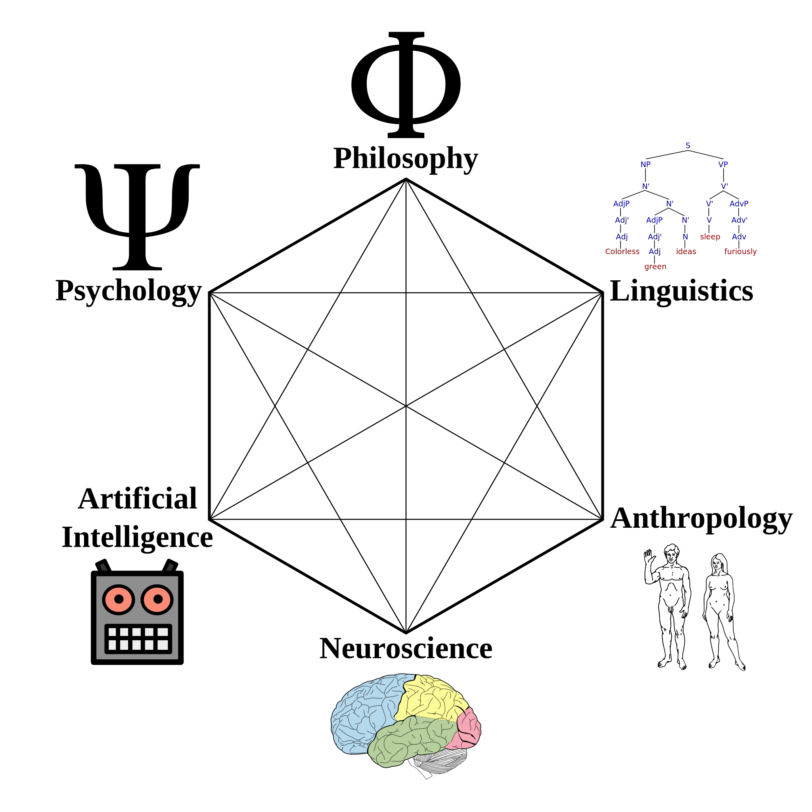
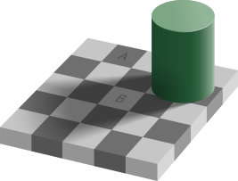
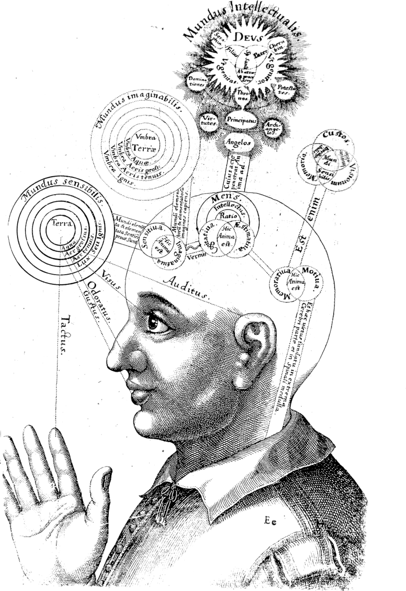
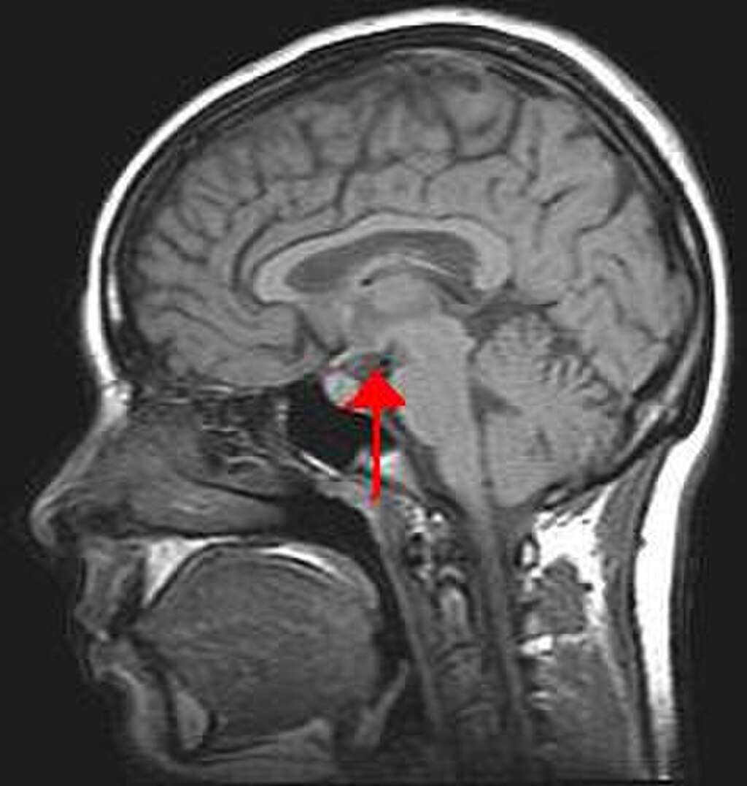
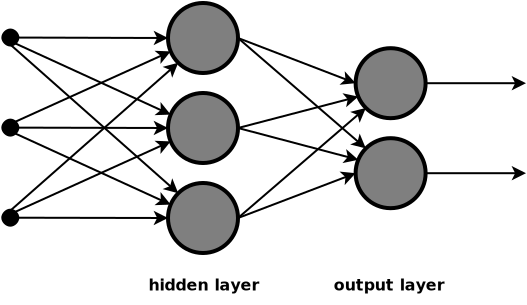

Figure illustrating the fields that contributed to the birth of cognitive science, including [philosophy of mind](/source/philosophy-of-mind/ "Philosophy of mind"), [linguistics](https://en.wikipedia.org/wiki/Linguistics "Linguistics"), [neuroscience](https://en.wikipedia.org/wiki/Neuroscience "Neuroscience"), [artificial intelligence](/source/artificial-intelligence/ "Artificial intelligence"), [anthropology](https://en.wikipedia.org/wiki/Anthropology "Anthropology"), and [psychology](https://en.wikipedia.org/wiki/Cognitive_psychology "Cognitive psychology")

**Cognitive science** is the [interdisciplinary](https://en.wikipedia.org/wiki/Interdisciplinary "Interdisciplinary"), scientific study of the [mind](https://en.wikipedia.org/wiki/Mind "Mind") and its processes. It examines the nature, the tasks, and the functions of [cognition](https://en.wikipedia.org/wiki/Cognition "Cognition") (in a broad sense). Mental faculties of concern to cognitive scientists include [perception](/source/perception/ "Perception"), [memory](https://en.wikipedia.org/wiki/Memory "Memory"), [attention](https://en.wikipedia.org/wiki/Attention "Attention"), [reasoning](https://en.wikipedia.org/wiki/Reasoning "Reasoning"), [language](/source/language/ "Language"), and [emotion](https://en.wikipedia.org/wiki/Emotion "Emotion"). To understand these faculties, cognitive scientists borrow from fields such as [psychology](https://en.wikipedia.org/wiki/Psychology "Psychology"), [philosophy](/source/philosophy-of-mind/ "Philosophy of mind"), [artificial intelligence](/source/artificial-intelligence/ "Artificial intelligence"), [neuroscience](https://en.wikipedia.org/wiki/Neuroscience "Neuroscience"), [linguistics](https://en.wikipedia.org/wiki/Linguistics "Linguistics"), and [anthropology](https://en.wikipedia.org/wiki/Anthropology "Anthropology"). The typical analysis of cognitive science spans many levels of organization, from learning and decision-making to logic and planning; from [neural](https://en.wikipedia.org/wiki/Neuron "Neuron") circuitry to modular brain organization. One of the fundamental concepts of cognitive science is that "thinking can best be understood in terms of representational structures in the mind and computational procedures that operate on those structures."

## History

The cognitive sciences began as an intellectual movement in the 1950s, called the [cognitive revolution](https://en.wikipedia.org/wiki/Cognitive_revolution "Cognitive revolution"). Cognitive science has a prehistory traceable back to ancient Greek philosophical texts (see [Plato](https://en.wikipedia.org/wiki/Plato "Plato")'s _[Meno](https://en.wikipedia.org/wiki/Meno "Meno")_ and [Aristotle](https://en.wikipedia.org/wiki/Aristotle "Aristotle")'s _[De Anima](https://en.wikipedia.org/wiki/De_Anima "De Anima")_).

The modern culture of cognitive science can be traced back to the early [cyberneticists](https://en.wikipedia.org/wiki/Cybernetics "Cybernetics") in the 1930s and 1940s, such as [Warren McCulloch](https://en.wikipedia.org/wiki/Warren_McCulloch "Warren McCulloch") and [Walter Pitts](https://en.wikipedia.org/wiki/Walter_Pitts "Walter Pitts"), who sought to understand the organizing principles of the mind. McCulloch and Pitts developed the first variants of what are now known as [artificial neural networks](https://en.wikipedia.org/wiki/Artificial_neural_networks "Artificial neural networks"), models of computation inspired by the structure of [biological neural networks](https://en.wikipedia.org/wiki/Biological_neural_networks "Biological neural networks").

Another precursor was the early development of the [theory of computation](https://en.wikipedia.org/wiki/Theory_of_computation "Theory of computation") and the [digital computer](https://en.wikipedia.org/wiki/Digital_computer "Digital computer") in the 1940s and 1950s. [Kurt Gödel](https://en.wikipedia.org/wiki/Kurt_Gödel "Kurt Gödel"), [Alonzo Church](https://en.wikipedia.org/wiki/Alonzo_Church "Alonzo Church"), [Claude Shannon](https://en.wikipedia.org/wiki/Claude_Shannon "Claude Shannon"), [Alan Turing](https://en.wikipedia.org/wiki/Alan_Turing "Alan Turing"), and [John von Neumann](https://en.wikipedia.org/wiki/John_von_Neumann "John von Neumann") were instrumental in these developments. The modern computer, or [Von Neumann machine](https://en.wikipedia.org/wiki/Von_Neumann_architecture "Von Neumann architecture"), would play a central role in cognitive science, both as a metaphor for the mind and as a tool for investigation.

The first instance of cognitive science experiments being conducted at an academic institution occurred at [MIT Sloan School of Management](https://en.wikipedia.org/wiki/MIT_Sloan_School_of_Management "MIT Sloan School of Management"), where [J.C.R. Licklider](https://en.wikipedia.org/wiki/J.C.R._Licklider "J.C.R. Licklider") worked in the psychology department and conducted experiments using computer memory as a model of human cognition. In 1959, [Noam Chomsky](https://en.wikipedia.org/wiki/Noam_Chomsky "Noam Chomsky") published a scathing review of [B. F. Skinner](https://en.wikipedia.org/wiki/B._F._Skinner "B. F. Skinner")'s book _[Verbal Behavior](https://en.wikipedia.org/wiki/Verbal_Behavior "Verbal Behavior")_. At the time, Skinner's [behaviorist](https://en.wikipedia.org/wiki/Behaviorist "Behaviorist") paradigm dominated the field of psychology within the United States. Most psychologists focused on functional relations between stimulus and response, without positing internal representations. Chomsky argued that to explain language, we needed a theory like [generative grammar](https://en.wikipedia.org/wiki/Generative_grammar "Generative grammar"), which not only posited internal representations but also characterized their underlying order.

The term _cognitive science_ was coined by [Christopher Longuet-Higgins](https://en.wikipedia.org/wiki/Christopher_Longuet-Higgins "Christopher Longuet-Higgins") in his 1973 commentary on the [Lighthill report](https://en.wikipedia.org/wiki/Lighthill_report "Lighthill report"), which concerned the then-current state of [artificial intelligence](/source/artificial-intelligence/ "Artificial intelligence") research. In the same decade, the journal _[Cognitive Science](https://en.wikipedia.org/wiki/Cognitive_Science_\(journal\) "Cognitive Science (journal)")_ and the [Cognitive Science Society](https://en.wikipedia.org/wiki/Cognitive_Science_Society "Cognitive Science Society") were founded. The founding meeting of the [Cognitive Science Society](https://en.wikipedia.org/wiki/Cognitive_Science_Society "Cognitive Science Society") was held at the [University of California, San Diego](https://en.wikipedia.org/wiki/University_of_California,_San_Diego "University of California, San Diego") in 1979, which resulted in cognitive science becoming an internationally visible enterprise. In 1972, [Hampshire College](https://en.wikipedia.org/wiki/Hampshire_College "Hampshire College") started the first undergraduate education program in Cognitive Science, led by Neil Stillings. In 1982, with assistance from Professor Stillings, [Vassar College](https://en.wikipedia.org/wiki/Vassar_College "Vassar College") became the first institution in the world to grant an undergraduate degree in Cognitive Science. In 1986, the first Cognitive Science Department in the world was founded at the [University of California, San Diego](https://en.wikipedia.org/wiki/University_of_California,_San_Diego "University of California, San Diego").

In the 1970s and early 1980s, as access to computers increased, [artificial intelligence](/source/artificial-intelligence/ "Artificial intelligence") research expanded. Researchers such as [Marvin Minsky](https://en.wikipedia.org/wiki/Marvin_Minsky "Marvin Minsky") would write computer programs in languages such as [LISP](https://en.wikipedia.org/wiki/LISP "LISP") to attempt to formally characterize the steps that human beings went through, for instance, in making decisions and solving problems, in the hope of better understanding human [thought](https://en.wikipedia.org/wiki/Thought "Thought"), and also in the hope of creating artificial minds. This approach is known as "symbolic AI".

Eventually, the limits of the symbolic AI research program became apparent. For instance, it seemed to be unrealistic to comprehensively list human knowledge in a form usable by a symbolic computer program. The late 80s and 90s saw the rise of [neural networks](https://en.wikipedia.org/wiki/Neural_networks "Neural networks") and [connectionism](https://en.wikipedia.org/wiki/Connectionism "Connectionism") as a research paradigm. From this point of view, often attributed to [James McClelland](https://en.wikipedia.org/wiki/James_McClelland_\(psychologist\) "James McClelland (psychologist)") and [David Rumelhart](https://en.wikipedia.org/wiki/David_Rumelhart "David Rumelhart"), the mind can be characterized as a set of complex associations represented as a layered network. Critics argue that symbolic models better capture some phenomena, and that connectionist models are often so complex as to have little explanatory power. Recently, symbolic and connectionist models have been combined, enabling the use of both forms of explanation. While both connectionism and symbolic approaches have proven useful for testing various hypotheses and exploring approaches to understanding aspects of cognition and lower level brain functions, neither are biologically realistic and therefore, both suffer from a lack of neuroscientific plausibility. Connectionism has proven useful for exploring computationally how cognition emerges in development and occurs in the human brain, and has provided alternatives to strictly domain-specific / domain general approaches. For example, scientists such as Jeff Elman, Liz Bates, and Annette Karmiloff-Smith have posited that brain networks emerge from the dynamic interaction between them and environmental input.

Recent developments in [quantum computation](https://en.wikipedia.org/wiki/Quantum_computation "Quantum computation"), including the ability to run quantum circuits on quantum computers such as the [IBM Quantum Platform](https://en.wikipedia.org/wiki/IBM_Quantum_Platform "IBM Quantum Platform"), have accelerated research into cognitive models that incorporate elements of quantum mechanics.

## Principles

### Levels of analysis

A central tenet of cognitive science is that a complete understanding of the mind/brain cannot be attained by studying only a single level. An example would be the problem of remembering a phone number and recalling it later. One approach to understanding this process would be to study behavior through direct observation, or [naturalistic observation](https://en.wikipedia.org/wiki/Naturalistic_observation "Naturalistic observation"). A person could be presented with a phone number and asked to recall it after a delay; the accuracy of the response could then be measured. Another approach to measuring cognitive ability would be to study the firing of individual [neurons](https://en.wikipedia.org/wiki/Neuron "Neuron") while a person is trying to remember a phone number. Neither of these experiments on its own would fully explain how the process of remembering a phone number works. Even if the technology to map every neuron in the brain in real time were available, and it were known when each neuron fired, it would still be impossible to know how a particular firing of neurons translates into the observed behavior. Thus, an understanding of how these two levels relate is imperative. [Francisco Varela](https://en.wikipedia.org/wiki/Francisco_Varela "Francisco Varela"), in _The Embodied Mind: Cognitive Science and Human Experience_, argues that "the new sciences of the mind need to enlarge their horizon to encompass both lived human experience and the possibilities for transformation inherent in human experience". On the classic cognitivist view, this can be provided by a functional level account of the process. Studying a phenomenon at multiple levels provides a better understanding of the brain processes that give rise to a particular behavior. [Marr](https://en.wikipedia.org/wiki/David_Marr_\(psychologist\) "David Marr (psychologist)") gave a famous description of three levels of analysis:

1.  The _computational theory_, specifying the goals of the computation;
2.  _Representation and algorithms_, giving a representation of the inputs and outputs and the algorithms which transform one into the other; and
3.  The _hardware implementation_, or how algorithm and representation may be physically realized.

### Interdisciplinary nature

Cognitive science is an interdisciplinary field with contributors from various fields, including [psychology](https://en.wikipedia.org/wiki/Psychology "Psychology"), [neuroscience](https://en.wikipedia.org/wiki/Neuroscience "Neuroscience"), [linguistics](https://en.wikipedia.org/wiki/Linguistics "Linguistics"), [philosophy of mind](/source/philosophy-of-mind/ "Philosophy of mind"), [computer science](https://en.wikipedia.org/wiki/Computer_science "Computer science"), [anthropology](https://en.wikipedia.org/wiki/Anthropology "Anthropology"), and [biology](https://en.wikipedia.org/wiki/Biology "Biology"). Cognitive scientists work collectively in the hope of understanding the mind and its interactions with the surrounding world, much like scientists in other fields. The field regards itself as compatible with the physical sciences. It uses the [scientific method](https://en.wikipedia.org/wiki/Scientific_method "Scientific method") as well as [simulation](https://en.wikipedia.org/wiki/Simulation "Simulation") or [modeling](https://en.wikipedia.org/wiki/Model_\(abstract\) "Model (abstract)"), often comparing model outputs with aspects of human cognition. Similar to the field of psychology, there is some doubt whether there is a unified cognitive science, which has led some researchers to prefer 'cognitive sciences' in plural.

Many, but not all, who consider themselves cognitive scientists hold a [functionalist](https://en.wikipedia.org/wiki/Functionalism_\(philosophy_of_mind\) "Functionalism (philosophy of mind)") view of the mind—the view that mental states and processes should be explained by their function – what they do. According to the [multiple realizability](https://en.wikipedia.org/wiki/Multiple_realizability "Multiple realizability") account of functionalism, even non-human systems such as robots and computers can be ascribed as having cognitive states.

### _Cognitive_ science, the term

The term "cognitive" in "cognitive science" is used for "any kind of mental operation or structure that can be studied in precise terms" ([Lakoff](https://en.wikipedia.org/wiki/George_Lakoff "George Lakoff") and [Johnson](https://en.wikipedia.org/wiki/Mark_Johnson_\(professor\) "Mark Johnson (professor)"), 1999). This conceptualization is very broad and should not be confused with the use of "cognitive" in some traditions of [analytic philosophy](https://en.wikipedia.org/wiki/Analytic_philosophy "Analytic philosophy"), where "cognitive" concerns only formal rules and [truth-conditional semantics](https://en.wikipedia.org/wiki/Truth-conditional_semantics "Truth-conditional semantics").

The earliest entries for the word "_cognitive_" in the [OED](https://en.wikipedia.org/wiki/OED "OED") take it to mean roughly _"pertaining to the action or process of knowing"_. The first entry, from 1586, shows that the word was once used in discussions of [Platonic](https://en.wikipedia.org/wiki/Plato "Plato") theories of [knowledge](https://en.wikipedia.org/wiki/Knowledge "Knowledge"). Most in cognitive science, however, presumably do not believe their field is the study of anything as certain as the knowledge sought by Plato.

## Scope

Cognitive science is a large field that covers a wide array of topics in cognition. However, it should be recognized that cognitive science has not always been equally concerned with every topic that might bear relevance to the nature and operation of minds. Classical cognitivists have largely de-emphasized or avoided social and cultural factors, embodiment, emotion, consciousness, [animal cognition](https://en.wikipedia.org/wiki/Animal_cognition "Animal cognition"), and [comparative](https://en.wikipedia.org/wiki/Comparative_psychology "Comparative psychology") and [evolutionary](https://en.wikipedia.org/wiki/Evolutionary_psychology "Evolutionary psychology") psychologies. However, with the decline of [behaviorism](https://en.wikipedia.org/wiki/Behaviorism "Behaviorism"), internal states such as affects and emotions, as well as awareness and covert attention, became approachable again. For example, situated and [embodied cognition](https://en.wikipedia.org/wiki/Embodied_cognition "Embodied cognition") theories take into account the current state of the environment and the body's role in cognition. With the newfound emphasis on information processing, observable behavior was no longer the hallmark of psychological theory, but the modeling or recording of mental states.

Below are some of the main topics that cognitive science is concerned with; see [List of cognitive science topics](https://en.wikipedia.org/wiki/List_of_cognitive_science_topics "List of cognitive science topics") for a more exhaustive list.

### Artificial intelligence

Artificial intelligence (AI) involves the study of cognitive phenomena in machines. One of the practical goals of AI is to implement aspects of human intelligence in computers. Computers are also widely used as tools for studying cognitive phenomena. [Computational modeling](https://en.wikipedia.org/wiki/Computational_modeling "Computational modeling") uses simulations to study how human intelligence may be structured. (See [§ Computational modeling](/source/cognitive-science/#Computational_modeling).)

There is some debate in the field as to whether the mind is best viewed as a vast array of small but individually feeble elements (i.e., neurons) or as a collection of higher-level structures such as symbols, schemes, plans, and rules. The former view uses [connectionism](https://en.wikipedia.org/wiki/Connectionism "Connectionism") to study the mind, whereas the latter emphasizes [symbolic artificial intelligence](https://en.wikipedia.org/wiki/Symbolic_artificial_intelligence "Symbolic artificial intelligence"). One way to view the issue is whether it is possible to accurately simulate a human brain on a computer without accurately simulating the neurons that make it up.

### Attention

Attention is the selection of important information. The human mind is bombarded with millions of stimuli, and it must have a way of deciding which of this information to process. Attention is sometimes seen as a spotlight, meaning one can only shine the light on a particular set of information. Experiments that support this metaphor include the [dichotic listening](https://en.wikipedia.org/wiki/Dichotic_listening "Dichotic listening") task (Cherry, 1957) and studies of [inattentional blindness](https://en.wikipedia.org/wiki/Inattentional_blindness "Inattentional blindness") (Mack and Rock, 1998). In the dichotic listening task, subjects are bombarded with two different messages, one in each ear, and are told to focus on only one. At the end of the experiment, when asked about the content of the unattended message, subjects were unable to report it.

The psychological construct of attention is sometimes confused with the concept of [intentionality](https://en.wikipedia.org/wiki/Intentionality "Intentionality") due to some degree of semantic ambiguity in their [definitions](https://en.wikipedia.org/wiki/Definition "Definition"). At the beginning of experimental research on attention, [Wilhelm Wundt](https://en.wikipedia.org/wiki/Wilhelm_Wundt "Wilhelm Wundt") defined this term as "that psychical process, which is operative in the clear perception of the narrow region of the content of consciousness." His experiments showed the limits of attention in space and time, which were 3-6 letters during an exposition of 1/10 s. Because this notion develops within the framework of the original meaning during a hundred years of research, the definition of attention would reflect the sense when it accounts for the main features initially attributed to this term – it is a process of controlling thought that continues over time. While intentionality is the power of minds to be about something, attention is the concentration of awareness on some [phenomenon](https://en.wikipedia.org/wiki/Phenomenon "Phenomenon") during a period of time, which is necessary to elevate the clear [perception](/source/perception/ "Perception") of the narrow region of the content of [consciousness](https://en.wikipedia.org/wiki/Consciousness "Consciousness") and which is feasible to control this focus in [mind](https://en.wikipedia.org/wiki/Mind "Mind").

The significance of knowledge about the scope of attention in the study of [cognition](https://en.wikipedia.org/wiki/Cognition "Cognition") is that it defines the cognitive functions of cognition, such as apprehension, judgment, reasoning, and working memory. The development of attention scope increases the set of faculties responsible for the [mind](https://en.wikipedia.org/wiki/Mind "Mind"), which relies on how it perceives, remembers, considers, and evaluates in making decisions. The ground of this statement is that the more details (associated with an event) the mind may grasp for their comparison, association, and categorization, the closer the apprehension, judgment, and reasoning of the event are in accord with reality. According to Latvian professor Sandra Mihailova and professor Igor Val Danilov, the more elements of the phenomenon (or phenomena ) the mind can keep in the scope of attention simultaneously, the greater the number of reasonable combinations within that event it can achieve, enhancing the probability of better understanding the features and particularity of the phenomenon (phenomena). For example, three items in the focal point of consciousness yield six possible combinations (3 factorial) and four items – 24 (4 factorial) combinations. The number of reasonable combinations becomes significant for a focal point with six items, yielding 720 possible combinations (6 factorial).

### Bodily processes related to cognition

[Embodied cognition](https://en.wikipedia.org/wiki/Embodied_cognition "Embodied cognition") approaches to cognitive science emphasize the role of body and environment in cognition. This includes both neural and extra-neural bodily processes, and factors that range from affective and emotional processes, to posture, motor control, [proprioception](https://en.wikipedia.org/wiki/Proprioception "Proprioception"), and kinaesthesis, to autonomic processes that involve heartbeat and respiration, to the role of the enteric gut microbiome. It also includes accounts of how the body engages with or is coupled to social and physical environments. [4E cognition](https://en.wikipedia.org/wiki/4E_cognition "4E cognition") includes a broad range of views about brain-body-environment interaction, from causal embeddedness to stronger claims about how the mind extends to include tools and instruments, as well as the role of social interactions, action-oriented processes, and affordances. 4E theories range from those closer to classic cognitivism (so-called "weak" embodied cognition) to stronger extended and enactive versions that are sometimes referred to as radical embodied cognitive science.

A hypothesis of pre-perceptual multimodal integration supports embodied cognition approaches and converges two competing naturalist and constructivist viewpoints about cognition and the development of emotions. According to this hypothesis, supported by empirical data, cognition and emotion development are initiated by the association of affective cues with stimuli responsible for triggering the neuronal pathways of simple reflexes. This pre-perceptual multimodal integration can succeed owing to neuronal coherence in mother-child dyads beginning from pregnancy. These cognitive-reflex and emotion-reflex stimuli conjunctions further form simple innate neuronal assemblies, shaping the cognitive and emotional neuronal patterns in statistical learning that are continuously connected with the neuronal pathways of reflexes.

### Knowledge and processing of language

A [well known example](https://en.wikipedia.org/wiki/Colorless_green_ideas_sleep_furiously "Colorless green ideas sleep furiously") of a [phrase structure tree](https://en.wikipedia.org/wiki/Phrase_structure_rules "Phrase structure rules"). This is one way to represent human language, showing how its components are organized hierarchically.

The ability to learn and understand language is an extremely complex process. Language is acquired within the first few years of life, and under normal circumstances, all humans can do so proficiently. A major driving force in the theoretical linguistic field is discovering the nature that language must have in the abstract to be learned in such a fashion. Some of the driving research questions in studying how the brain itself processes language include: (1) To what extent is linguistic knowledge innate or learned?, (2) Why is it more difficult for adults to acquire a second language than it is for infants to acquire their first language?, and (3) How are humans able to understand novel sentences?

The study of language processing ranges from the investigation of the sound patterns of speech to the meaning of words and whole sentences. [Linguistics](https://en.wikipedia.org/wiki/Linguistics "Linguistics") often divides language processing into [orthography](https://en.wikipedia.org/wiki/Orthography "Orthography"), [phonetics](https://en.wikipedia.org/wiki/Phonetics "Phonetics"), [phonology](https://en.wikipedia.org/wiki/Phonology "Phonology"), [morphology](https://en.wikipedia.org/wiki/Morphology_\(linguistics\) "Morphology (linguistics)"), [syntax](https://en.wikipedia.org/wiki/Syntax "Syntax"), [semantics](https://en.wikipedia.org/wiki/Semantics "Semantics"), and [pragmatics](https://en.wikipedia.org/wiki/Pragmatics "Pragmatics"). Many aspects of language can be studied from each of these components and from their interaction.

The study of language processing in _cognitive science_ is closely tied to the field of linguistics. Linguistics was traditionally studied as part of the humanities, alongside history, art, and literature. In the last fifty years or so, more and more researchers have studied knowledge and use of language as a cognitive phenomenon, with the main problems being how language knowledge can be acquired and used, and what precisely it consists of. [Linguists](https://en.wikipedia.org/wiki/Linguists "Linguists") have found that, while humans form sentences in ways apparently governed by very complex systems, they are remarkably unaware of the rules that govern their own speech. Thus, linguists must resort to indirect methods to determine what those rules might be, if indeed rules as such exist. In any event, if rules indeed govern speech, they appear to be opaque to any conscious consideration.

### Learning and development

Learning and development are the processes by which we acquire knowledge and information over time. Infants are born with little or no knowledge (depending on how knowledge is defined). Yet, they rapidly acquire the ability to use language, walk, and [recognize people and objects](https://en.wikipedia.org/wiki/Cognitive_neuroscience_of_visual_object_recognition "Cognitive neuroscience of visual object recognition"). Research in learning and development aims to explain the mechanisms underlying these processes.

A major question in the study of cognitive development is the extent to which certain abilities are [innate](https://en.wikipedia.org/wiki/Innate "Innate") or learned. This is often framed in terms of the [nature and nurture](https://en.wikipedia.org/wiki/Nature_and_nurture "Nature and nurture") debate. The [nativist](https://en.wikipedia.org/wiki/Psychological_nativism "Psychological nativism") view emphasizes that certain features are innate to an organism and are determined by its [genetic](https://en.wikipedia.org/wiki/Genetics "Genetics") endowment. The [empiricist](https://en.wikipedia.org/wiki/Empiricist "Empiricist") view, on the other hand, emphasizes that certain abilities are learned from the environment. Although clearly both genetic and environmental input is needed for a child to develop normally, considerable debate remains about _how_ genetic information might guide cognitive development. In the area of [language acquisition](https://en.wikipedia.org/wiki/Language_acquisition "Language acquisition"), for example, some (such as [Steven Pinker](https://en.wikipedia.org/wiki/Steven_Pinker "Steven Pinker")) have argued that specific information containing universal grammatical rules must be contained in the genes, whereas others (such as Jeffrey Elman and colleagues in [Rethinking Innateness](https://en.wikipedia.org/wiki/Rethinking_Innateness "Rethinking Innateness")) have argued that Pinker's claims are biologically unrealistic. They argue that genes determine the architecture of a learning system, but that specific "facts" about how grammar works can only be learned through experience.

### Memory

Memory allows us to store information for later retrieval. Memory is often thought of as consisting of both a long-term and short-term store. Long-term memory allows us to store information over prolonged periods (days, weeks, years). We do not yet know the practical limit of long-term memory capacity. Short-term memory allows us to store information over short time scales (seconds or minutes).

Memory is also often grouped into declarative and procedural forms. [Declarative memory](https://en.wikipedia.org/wiki/Declarative_memory "Declarative memory")—grouped into subsets of [semantic](https://en.wikipedia.org/wiki/Semantic_memory "Semantic memory") and [episodic forms of memory](https://en.wikipedia.org/wiki/Episodic_memory "Episodic memory")—refers to our memory for facts and specific knowledge, specific meanings, and specific experiences (e.g. "Are apples food?", or "What did I eat for breakfast four days ago?"). [Procedural memory](https://en.wikipedia.org/wiki/Procedural_memory "Procedural memory") allows us to remember actions and motor sequences (e.g., how to ride a bicycle) and is often referred to as implicit knowledge or memory.

Cognitive scientists study memory just as psychologists do, but tend to focus more on how memory relates to [cognitive processes](https://en.wikipedia.org/wiki/Cognitive_process "Cognitive process") and the interrelationship between cognition and memory. One example of this could be: what mental processes does a person go through to retrieve a long-lost memory? Or, what differentiates between the cognitive process of recognition (seeing hints of something before remembering it, or memory in context) and recall (retrieving a memory, as in "fill-in-the-blank")?

### Perception and action

[The Necker cube](https://en.wikipedia.org/wiki/The_Necker_cube "The Necker cube"), an example of an optical illusionAn optical illusion. The square A is the same shade of gray as square B. See [checker shadow illusion](https://en.wikipedia.org/wiki/Checker_shadow_illusion "Checker shadow illusion").

Perception is the ability to take in information via the [senses](https://en.wikipedia.org/wiki/Senses "Senses") and process it in some way. [Vision](https://en.wikipedia.org/wiki/Visual_perception "Visual perception") and [hearing](https://en.wikipedia.org/wiki/Hearing "Hearing") are two dominant senses that allow us to perceive the environment. Some questions in the study of visual perception, for example, include: (1) How are we able to recognize objects?, (2) Why do we perceive a continuous visual environment, even though we only see small bits of it at any one time? One tool for studying visual perception is by looking at how people process [optical illusions](https://en.wikipedia.org/wiki/Optical_illusion "Optical illusion"). The image on the right, a Necker cube, is an example of a bistable percept; that is, the cube can be interpreted as oriented in two different directions.

The study of [haptic](https://en.wikipedia.org/wiki/Haptic_perception "Haptic perception") ([tactile](https://en.wikipedia.org/wiki/Touch "Touch")), [olfactory](https://en.wikipedia.org/wiki/Olfactory "Olfactory"), and [gustatory](https://en.wikipedia.org/wiki/Gustatory "Gustatory") stimuli also fall into the domain of perception.

Action is taken to refer to the output of a system. In humans, this is accomplished through motor responses. Spatial planning and movement, speech production, and complex motor movements are all aspects of action.

### Consciousness

17th-century representation of consciousness by [Robert Fludd](https://en.wikipedia.org/wiki/Robert_Fludd "Robert Fludd"), an English [Paracelsian](https://en.wikipedia.org/wiki/Paracelsianism "Paracelsianism") physician

[Consciousness](https://en.wikipedia.org/wiki/Consciousness "Consciousness") is being aware of something internal to one's self or of states or objects in one's external environment. It has been the topic of extensive explanations, analyses, and debate among philosophers, scientists, and theologians for millennia. There is no consensus on _what_ exactly needs to be studied, or even if consciousness can be considered a scientific concept. In some explanations, it is synonymous with mind, while in others it is considered an aspect of it.

In the past, consciousness meant one's "inner [life](https://en.wikipedia.org/wiki/Life "Life")": the world of [introspection](https://en.wikipedia.org/wiki/Introspection "Introspection"), private thought, imagination, and [volition](https://en.wikipedia.org/wiki/Volition_\(psychology\) "Volition (psychology)"). Today, it often includes various forms of [cognition](https://en.wikipedia.org/wiki/Cognition "Cognition"), experience, feeling, or perception. It may be awareness, awareness of awareness, [metacognition](https://en.wikipedia.org/wiki/Metacognition "Metacognition"), or [self-awareness](https://en.wikipedia.org/wiki/Self-awareness "Self-awareness"), either continuously changing or not. There is also a medical definition that helps, for example, to discern "[coma](https://en.wikipedia.org/wiki/Coma "Coma")" from other states. The disparate range of research, notions, and speculations raises some curiosity about whether the right questions are being asked.

Examples of the range of descriptions, definitions and explanations are: ordered distinction between self and environment, simple wakefulness, one's sense of selfhood or [soul](https://en.wikipedia.org/wiki/Soul "Soul") explored by "looking within", being a metaphorical ["stream" of contents](https://en.wikipedia.org/wiki/Stream_of_consciousness_\(psychology\) "Stream of consciousness (psychology)"), or being a [mental state](https://en.wikipedia.org/wiki/Mental_state "Mental state"), [mental event](https://en.wikipedia.org/wiki/Mental_event "Mental event"), or [mental process](https://en.wikipedia.org/wiki/Mental_process "Mental process") of the brain.

## Research methods

Many different methodologies are used to study cognitive science. As the field is highly interdisciplinary, research often spans multiple areas of study, drawing on methods from [psychology](https://en.wikipedia.org/wiki/Psychology "Psychology"), [neuroscience](https://en.wikipedia.org/wiki/Neuroscience "Neuroscience"), [computer science](https://en.wikipedia.org/wiki/Computer_science "Computer science"), and [systems theory](https://en.wikipedia.org/wiki/Systems_theory "Systems theory").

### Behavioral experiments

To describe what constitutes intelligent behavior, one must study behavior itself. This type of research is closely tied to that in [cognitive psychology](https://en.wikipedia.org/wiki/Cognitive_psychology "Cognitive psychology") and [psychophysics](https://en.wikipedia.org/wiki/Psychophysics "Psychophysics"). By measuring behavioral responses to different stimuli, one can understand something about how those stimuli are processed. Lewandowski & Strohmetz (2009) reviewed a collection of innovative uses of behavioral measurement in psychology, including behavioral traces, behavioral observations, and behavioral choice. Behavioral traces are pieces of evidence that indicate behavior occurred, but the actor is not present (e.g., litter in a parking lot or readings on an electric meter). Behavioral observations involve directly witnessing the actor engaging in the behavior (e.g., observing how close a person sits to another). Behavioral choices are decisions a person makes among two or more options (e.g., voting behavior, choosing a punishment for another participant).

*   _Reaction time._ The time between the presentation of a stimulus and an appropriate response can indicate differences between two cognitive processes and reveal aspects of their nature. For example, if, in a search task, reaction times vary proportionally with the number of elements, then it is evident that this cognitive process of searching involves serial rather than parallel processing.
*   _Psychophysical responses._ Psychophysical experiments are an old psychological technique that has been adopted by cognitive psychology. They typically involve making judgments of some physical property, e.g., the loudness of a sound. Correlations of subjective scales between individuals can reveal cognitive or sensory biases relative to actual physical measurements. Some examples include:
    *   sameness judgments for colors, tones, textures, etc.
    *   threshold differences for colors, tones, textures, etc.
*   _[Eye tracking](https://en.wikipedia.org/wiki/Eye_tracking "Eye tracking")._ This methodology is used to study a variety of cognitive processes, most notably visual perception and language processing. The point of fixation of the eyes is linked to an individual's attentional focus. Thus, by monitoring eye movements, we can study what information is being processed at a given time. Eye tracking allows us to study cognitive processes on extremely short time scales. Eye movements reflect online decision-making during a task and provide insight into how those decisions may be processed.

### Brain imaging

Image of the human head with the brain. The arrow indicates the position of the [hypothalamus](https://en.wikipedia.org/wiki/Hypothalamus "Hypothalamus").

Brain imaging involves analyzing brain activity while performing various tasks. This allows us to link behavior and brain function to help understand how information is processed. Different types of imaging techniques vary in their temporal (time-based) and spatial (location-based) resolution. Brain imaging is often used in [cognitive neuroscience](https://en.wikipedia.org/wiki/Cognitive_neuroscience "Cognitive neuroscience").

*   _[Single-photon emission computed tomography](https://en.wikipedia.org/wiki/Single-photon_emission_computed_tomography "Single-photon emission computed tomography")_ and _[positron emission tomography](https://en.wikipedia.org/wiki/Positron_emission_tomography "Positron emission tomography")_. SPECT and PET use radioactive isotopes, which are injected into the subject's bloodstream and taken up by the brain. By observing which areas of the brain take up the radioactive isotope, we can see which areas are more active than others. PET has a similar spatial resolution to fMRI but extremely poor temporal resolution.
*   _[Electroencephalography](https://en.wikipedia.org/wiki/Electroencephalography "Electroencephalography")_. EEG measures the electrical fields generated by large populations of neurons in the cortex by placing a series of electrodes on the scalp of the subject. This technique has an extremely high temporal resolution, but a relatively poor spatial resolution.
*   _[Functional magnetic resonance imaging](https://en.wikipedia.org/wiki/Functional_magnetic_resonance_imaging "Functional magnetic resonance imaging")_. fMRI measures the relative amount of oxygenated blood flowing to different parts of the brain. More oxygenated blood in a particular region is assumed to correlate with an increase in neural activity in that part of the brain. This allows us to localize particular functions within different brain regions. fMRI has moderate spatial and temporal resolution.
*   _[Optical imaging](https://en.wikipedia.org/wiki/Optical_imaging "Optical imaging")_. This technique uses infrared transmitters and receivers to measure the amount of light reflectance by blood near different areas of the brain. Since oxygenated and deoxygenated blood reflect light to different extents, we can study which areas are more active (i.e., those with more oxygenated blood). Optical imaging has moderate temporal resolution, but poor spatial resolution. It also has the advantage of being extremely safe and suitable for studying infants' brains.
*   _[Magnetoencephalography](https://en.wikipedia.org/wiki/Magnetoencephalography "Magnetoencephalography")._ MEG measures magnetic fields resulting from cortical activity. It is similar to [EEG](https://en.wikipedia.org/wiki/EEG "EEG"), except that it has improved spatial resolution since the magnetic fields it measures are not as blurred or attenuated by the scalp, meninges, and so forth as the electrical activity measured in EEG is. MEG uses SQUID sensors to detect tiny magnetic fields.

### Computational modeling

An [artificial neural network](https://en.wikipedia.org/wiki/Artificial_neural_network "Artificial neural network") with two layers

[Computational models](https://en.wikipedia.org/wiki/Computer_model "Computer model") require a mathematically and logically formal representation of a problem. Computer models are used to simulate and experimentally verify specific and general [properties](https://en.wikipedia.org/wiki/Property "Property") of [intelligence](https://en.wikipedia.org/wiki/Intelligence "Intelligence"). Computational modeling can help us understand the functional organization of a particular cognitive phenomenon. Approaches to cognitive modeling can be categorized as: (1) symbolic, on abstract mental functions of an intelligent mind by means of symbols; (2) subsymbolic, on the neural and associative properties of the human brain; and (3) across the symbolic–subsymbolic border, including hybrid.

*   _Symbolic modeling_ evolved from the computer science paradigms using the technologies of [knowledge-based systems](https://en.wikipedia.org/wiki/Knowledge-based_systems "Knowledge-based systems"), as well as a philosophical perspective (e.g., "Good Old-Fashioned Artificial Intelligence" ([GOFAI](https://en.wikipedia.org/wiki/GOFAI "GOFAI"))). The first cognitive researchers developed them, and they were later used in [information engineering](https://en.wikipedia.org/wiki/Information_engineering "Information engineering") for [expert systems](https://en.wikipedia.org/wiki/Expert_system "Expert system"). Since the early 1990s, it was generalized in [systemics](https://en.wikipedia.org/wiki/Systemics "Systemics") for the investigation of functional human-like intelligence models, such as [personoids](https://en.wikipedia.org/wiki/Personoid "Personoid"), and, in parallel, developed as the [SOAR](https://en.wikipedia.org/wiki/Soar_\(cognitive_architecture\) "Soar (cognitive architecture)") environment. Recently, especially in the context of cognitive decision-making, symbolic cognitive modeling has been extended to the [socio-cognitive](https://en.wikipedia.org/wiki/Socio-cognitive "Socio-cognitive") approach, which encompasses social and organizational cognition and is interrelated with a sub-symbolic, non-conscious layer.
*   _Subsymbolic modeling_ includes _[connectionist/neural network models](https://en.wikipedia.org/wiki/Connectionism "Connectionism")._ Connectionism relies on the idea that the mind/brain is composed of simple nodes and its problem-solving capacity derives from the connections between them. [Neural nets](https://en.wikipedia.org/wiki/Neural_nets "Neural nets") are textbook implementations of this approach. Some critics of this approach feel that while these models represent biological reality as a description of how the system works, they lack explanatory power because, even in systems endowed with simple connection rules, the emergent high complexity makes them less interpretable at the connection level than they appear to be at the macroscopic level.
*   Other approaches gaining in popularity include (1) [dynamical systems](https://en.wikipedia.org/wiki/Cognitive_model#Dynamical_systems "Cognitive model") theory, (2) mapping symbolic models onto connectionist models (Neural-symbolic integration or [hybrid intelligent systems](https://en.wikipedia.org/wiki/Hybrid_intelligent_systems "Hybrid intelligent systems")), and (3) and [Bayesian models](https://en.wikipedia.org/wiki/Bayesian_cognitive_science "Bayesian cognitive science"), which are often drawn from [machine learning](https://en.wikipedia.org/wiki/Machine_learning "Machine learning").

All the above approaches tend either to be generalized to the form of integrated computational models of a synthetic/abstract intelligence (i.e. [cognitive architecture](https://en.wikipedia.org/wiki/Cognitive_architecture "Cognitive architecture")) to be applied to the explanation and improvement of individual and social/organizational [decision-making](https://en.wikipedia.org/wiki/Decision-making "Decision-making") and [reasoning](https://en.wikipedia.org/wiki/Psychology_of_reasoning "Psychology of reasoning") or to focus on single simulative programs (or microtheories/"middle-range" theories) modeling specific cognitive faculties (e.g., vision, language, categorization, etc.).

### Neurobiological methods

Research methods borrowed directly from [neuroscience](https://en.wikipedia.org/wiki/Neuroscience "Neuroscience") and [neuropsychology](https://en.wikipedia.org/wiki/Neuropsychology "Neuropsychology") can also help us to understand aspects of intelligence. These methods allow us to understand how intelligent behavior is implemented in a physical system.

*   [Single-unit recording](https://en.wikipedia.org/wiki/Single-unit_recording "Single-unit recording")
*   [Direct brain stimulation](https://en.wikipedia.org/wiki/Transcranial_direct_current_stimulation "Transcranial direct current stimulation")
*   [Animal models](https://en.wikipedia.org/wiki/Animal_models "Animal models")
*   [Postmortem studies](https://en.wikipedia.org/wiki/Postmortem_studies "Postmortem studies")

## Key findings

Cognitive science has given rise to models of human [cognitive bias](https://en.wikipedia.org/wiki/Cognitive_bias "Cognitive bias") and [risk](https://en.wikipedia.org/wiki/Risk "Risk") perception and has been influential in the development of [behavioral finance](https://en.wikipedia.org/wiki/Behavioral_finance "Behavioral finance"), a subfield of [economics](https://en.wikipedia.org/wiki/Economics "Economics"). It has also given rise to a new theory of the [philosophy of mathematics](https://en.wikipedia.org/wiki/Philosophy_of_mathematics "Philosophy of mathematics") (related to denotational mathematics), and many theories of [artificial intelligence](/source/artificial-intelligence/ "Artificial intelligence"), [persuasion](https://en.wikipedia.org/wiki/Persuasion "Persuasion"), and [coercion](https://en.wikipedia.org/wiki/Coercion "Coercion"). It has made its presence known in the [philosophy of language](https://en.wikipedia.org/wiki/Philosophy_of_language "Philosophy of language") and [epistemology](https://en.wikipedia.org/wiki/Epistemology "Epistemology") as well as constituting a substantial wing of modern [linguistics](https://en.wikipedia.org/wiki/Linguistics "Linguistics"). Fields of cognitive science have been influential in understanding the brain's particular functional systems (and functional deficits), ranging from speech production to auditory processing and visual perception. It has made progress in understanding how damage to particular areas of the brain affects cognition, and has helped uncover the root causes and consequences of specific dysfunctions, such as [dyslexia](https://en.wikipedia.org/wiki/Dyslexia "Dyslexia"), [anopsia](https://en.wikipedia.org/wiki/Anopsia "Anopsia"), and [hemispatial neglect](https://en.wikipedia.org/wiki/Hemispatial_neglect "Hemispatial neglect").

## Notable researchers

NameYear of birthYear of contributionContribution(s)

[David Chalmers](https://en.wikipedia.org/wiki/David_Chalmers "David Chalmers")

1966

1995

[Dualism](https://en.wikipedia.org/wiki/Dualism_\(philosophy_of_mind\) "Dualism (philosophy of mind)"), [hard problem of consciousness](https://en.wikipedia.org/wiki/Hard_problem_of_consciousness "Hard problem of consciousness")

[Daniel Dennett](https://en.wikipedia.org/wiki/Daniel_Dennett "Daniel Dennett")

1942

1987

Offered a computational systems perspective ([multiple drafts model](https://en.wikipedia.org/wiki/Multiple_drafts_model "Multiple drafts model"))

[John Searle](https://en.wikipedia.org/wiki/John_Searle_\(American_philosopher\) "John Searle (American philosopher)")

1932

1980

[Chinese room](https://en.wikipedia.org/wiki/Chinese_room "Chinese room")

[Douglas Hofstadter](https://en.wikipedia.org/wiki/Douglas_Hofstadter "Douglas Hofstadter")

1945

1979

_[Gödel, Escher, Bach](https://en.wikipedia.org/wiki/Gödel,_Escher,_Bach "Gödel, Escher, Bach")_

[Jerry Fodor](https://en.wikipedia.org/wiki/Jerry_Fodor "Jerry Fodor")

1935

1968, 1975

[Functionalism](https://en.wikipedia.org/wiki/Functionalism_\(philosophy_of_mind\) "Functionalism (philosophy of mind)")

[Alan Baddeley](https://en.wikipedia.org/wiki/Alan_Baddeley "Alan Baddeley")

1934

1974

[Baddeley's model of working memory](https://en.wikipedia.org/wiki/Baddeley's_model_of_working_memory "Baddeley's model of working memory")

[Marvin Minsky](https://en.wikipedia.org/wiki/Marvin_Minsky "Marvin Minsky")

1927

1970s, early 1980s

Wrote computer programs in languages such as LISP to attempt to formally characterize the steps that human beings go through, such as making decisions and solving problems

[Christopher Longuet-Higgins](https://en.wikipedia.org/wiki/Christopher_Longuet-Higgins "Christopher Longuet-Higgins")

1923

1973

Coined the term _cognitive science_

[Noam Chomsky](https://en.wikipedia.org/wiki/Noam_Chomsky "Noam Chomsky")

1928

1959

Published a review of B.F. Skinner's book _[Verbal Behavior](https://en.wikipedia.org/wiki/Verbal_Behavior "Verbal Behavior")_ which began cognitivism against then-dominant behaviorism

[George Miller](https://en.wikipedia.org/wiki/George_Armitage_Miller "George Armitage Miller")

1920

1956

Wrote about the capacities of human thinking through mental representations

[Herbert Simon](https://en.wikipedia.org/wiki/Herbert_A._Simon "Herbert A. Simon")

1916

1956

Co-created [Logic Theory Machine](https://en.wikipedia.org/wiki/Logic_Theory_Machine "Logic Theory Machine") and [General Problem Solver](https://en.wikipedia.org/wiki/General_Problem_Solver "General Problem Solver") with [Allen Newell](https://en.wikipedia.org/wiki/Allen_Newell "Allen Newell"), [EPAM](https://en.wikipedia.org/wiki/EPAM "EPAM") (Elementary Perceiver and Memorizer) theory, and organizational decision-making

[John McCarthy](/source/john-mccarthy/ "John McCarthy (computer scientist)")

1927

1955

Coined the term _artificial intelligence_ and organized the famous [Dartmouth conference](https://en.wikipedia.org/wiki/Dartmouth_conference "Dartmouth conference") in Summer 1956, which started AI as a field

[McCulloch](https://en.wikipedia.org/wiki/Warren_Sturgis_McCulloch "Warren Sturgis McCulloch") and [Pitts](https://en.wikipedia.org/wiki/Walter_Pitts "Walter Pitts")

1930s–1940s

Developed early artificial neural networks

[Lila R. Gleitman](https://en.wikipedia.org/wiki/Lila_R._Gleitman "Lila R. Gleitman")

1929

1970s-2010s

Wide-ranging contributions to understanding the cognition of [language acquisition](https://en.wikipedia.org/wiki/Language_acquisition "Language acquisition"), including [syntactic bootstrapping theory](https://en.wikipedia.org/wiki/Syntactic_bootstrapping "Syntactic bootstrapping")

[Eleanor Rosch](https://en.wikipedia.org/wiki/Eleanor_Rosch "Eleanor Rosch")

1938

1976

Development of the [Prototype Theory](https://en.wikipedia.org/wiki/Prototype_Theory "Prototype Theory") of [categorisation](https://en.wikipedia.org/wiki/Categorisation "Categorisation")

[Philip N. Johnson-Laird](https://en.wikipedia.org/wiki/Philip_N._Johnson-Laird "Philip N. Johnson-Laird")

1936

1980

Introduced the idea of [mental models](https://en.wikipedia.org/wiki/Mental_model "Mental model") in cognitive science

[Dedre Gentner](https://en.wikipedia.org/wiki/Dedre_Gentner "Dedre Gentner")

1944

1983

Development of the [Structure-mapping Theory](https://en.wikipedia.org/wiki/Structure-mapping_theory "Structure-mapping theory") of [analogical reasoning](https://en.wikipedia.org/wiki/Analogical_reasoning "Analogical reasoning")

[Allen Newell](https://en.wikipedia.org/wiki/Allen_Newell "Allen Newell")

1927

1990

Development of the field of [Cognitive architecture](https://en.wikipedia.org/wiki/Cognitive_architecture "Cognitive architecture") in cognitive modelling and artificial intelligence

[Annette Karmiloff-Smith](https://en.wikipedia.org/wiki/Annette_Karmiloff-Smith "Annette Karmiloff-Smith")

1938

1992

Integrating [neuroscience](https://en.wikipedia.org/wiki/Neuroscience "Neuroscience") and [computational modelling](https://en.wikipedia.org/wiki/Computational_modelling "Computational modelling") into theories of [cognitive development](https://en.wikipedia.org/wiki/Cognitive_development "Cognitive development")

[David Marr (neuroscientist)](https://en.wikipedia.org/wiki/David_Marr_\(neuroscientist\) "David Marr (neuroscientist)")

1945

1990

Proponent of the Three-Level Hypothesis of levels of analysis of computational systems

[Peter Gärdenfors](https://en.wikipedia.org/wiki/Peter_Gärdenfors "Peter Gärdenfors")

1949

2000

Creator of the [conceptual space](https://en.wikipedia.org/wiki/Conceptual_space "Conceptual space") framework used in cognitive modeling and artificial intelligence.

[Linda B. Smith](https://en.wikipedia.org/wiki/Linda_B._Smith "Linda B. Smith")

1951

1993

Together with [Esther Thelen](https://en.wikipedia.org/wiki/Esther_Thelen "Esther Thelen"), created a [dynamical systems](https://en.wikipedia.org/wiki/Dynamical_systems_theory "Dynamical systems theory") approach to understanding [cognitive development](https://en.wikipedia.org/wiki/Cognitive_development "Cognitive development")

Some of the more recognized names in cognitive science are usually either the most controversial or the most cited. Within philosophy, some familiar names include [Daniel Dennett](https://en.wikipedia.org/wiki/Daniel_Dennett "Daniel Dennett"), who writes from a computational systems perspective, [John Searle](https://en.wikipedia.org/wiki/John_Searle_\(American_philosopher\) "John Searle (American philosopher)"), known for his controversial [Chinese room](https://en.wikipedia.org/wiki/Chinese_room "Chinese room") argument, and [Jerry Fodor](https://en.wikipedia.org/wiki/Jerry_Fodor "Jerry Fodor"), who advocates [functionalism](https://en.wikipedia.org/wiki/Functionalism_\(philosophy_of_mind\) "Functionalism (philosophy of mind)").

Others include [David Chalmers](https://en.wikipedia.org/wiki/David_Chalmers "David Chalmers"), who advocates [Dualism](https://en.wikipedia.org/wiki/Dualism_\(philosophy_of_mind\) "Dualism (philosophy of mind)") and is also known for articulating [the hard problem of consciousness](https://en.wikipedia.org/wiki/The_hard_problem_of_consciousness "The hard problem of consciousness"), and [Douglas Hofstadter](https://en.wikipedia.org/wiki/Douglas_Hofstadter "Douglas Hofstadter"), famous for writing _[Gödel, Escher, Bach](https://en.wikipedia.org/wiki/Gödel,_Escher,_Bach "Gödel, Escher, Bach")_, which questions the nature of words and thought.

In the realm of linguistics, [Noam Chomsky](https://en.wikipedia.org/wiki/Noam_Chomsky "Noam Chomsky") and [George Lakoff](https://en.wikipedia.org/wiki/George_Lakoff "George Lakoff") have been influential (both have also become notable as political commentators). In [artificial intelligence](/source/artificial-intelligence/ "Artificial intelligence"), [Marvin Minsky](https://en.wikipedia.org/wiki/Marvin_Minsky "Marvin Minsky"), [Herbert A. Simon](https://en.wikipedia.org/wiki/Herbert_A._Simon "Herbert A. Simon"), and [Allen Newell](https://en.wikipedia.org/wiki/Allen_Newell "Allen Newell") are prominent.

Popular names in the discipline of psychology include [George A. Miller](https://en.wikipedia.org/wiki/George_Armitage_Miller "George Armitage Miller"), [James McClelland](https://en.wikipedia.org/wiki/James_McClelland_\(psychologist\) "James McClelland (psychologist)"), [Philip Johnson-Laird](https://en.wikipedia.org/wiki/Philip_Johnson-Laird "Philip Johnson-Laird"), [Lawrence Barsalou](https://en.wikipedia.org/wiki/Lawrence_Barsalou "Lawrence Barsalou"), [Vittorio Guidano](https://en.wikipedia.org/wiki/Vittorio_Guidano "Vittorio Guidano"), [Howard Gardner](https://en.wikipedia.org/wiki/Howard_Gardner "Howard Gardner") and [Steven Pinker](https://en.wikipedia.org/wiki/Steven_Pinker "Steven Pinker"). Anthropologists [Dan Sperber](https://en.wikipedia.org/wiki/Dan_Sperber "Dan Sperber"), [Edwin Hutchins](https://en.wikipedia.org/wiki/Edwin_Hutchins "Edwin Hutchins"), [Bradd Shore](https://en.wikipedia.org/wiki/Bradd_Shore "Bradd Shore"), [James Wertsch](https://en.wikipedia.org/wiki/James_Wertsch "James Wertsch"), and [Scott Atran](https://en.wikipedia.org/wiki/Scott_Atran "Scott Atran"), have been involved in collaborative projects with cognitive and social psychologists, political scientists and evolutionary biologists in attempts to develop general theories of culture formation, religion, and political association.

Computational theories (with models and simulations) have also been developed by [David Rumelhart](https://en.wikipedia.org/wiki/David_Rumelhart "David Rumelhart"), [James McClelland](https://en.wikipedia.org/wiki/James_McClelland_\(psychologist\) "James McClelland (psychologist)"), and [Philip Johnson-Laird](https://en.wikipedia.org/wiki/Philip_Johnson-Laird "Philip Johnson-Laird").

## Epistemics

**Epistemics** is a term coined in 1969 by the [University of Edinburgh](https://en.wikipedia.org/wiki/University_of_Edinburgh "University of Edinburgh") with the foundation of its School of Epistemics. Epistemics is to be distinguished from [epistemology](https://en.wikipedia.org/wiki/Epistemology "Epistemology") in that epistemology is the philosophical theory of knowledge, whereas epistemics signifies the scientific study of knowledge.

[Christopher Longuet-Higgins](https://en.wikipedia.org/wiki/Christopher_Longuet-Higgins "Christopher Longuet-Higgins") has defined it as "the construction of formal models of the processes (perceptual, intellectual, and linguistic) by which knowledge and understanding are achieved and communicated." In his 1978 essay "Epistemics: The Regulative Theory of Cognition", [Alvin I. Goldman](https://en.wikipedia.org/wiki/Alvin_I._Goldman "Alvin I. Goldman") claims to have coined the term "epistemics" to describe a reorientation of epistemology. Goldman maintains that his epistemics is continuous with traditional epistemology, and that the new term is only meant to avoid opposition. Epistemics, in Goldman's version, differs only slightly from traditional epistemology in its alliance with the psychology of cognition; epistemics stresses the detailed study of mental processes and information-processing mechanisms that lead to knowledge or beliefs.

In the mid-1980s, the School of Epistemics was renamed as The Centre for Cognitive Science (CCS). In 1998, CCS was incorporated into the University of Edinburgh's [School of Informatics](https://en.wikipedia.org/wiki/University_of_Edinburgh_School_of_Informatics "University of Edinburgh School of Informatics").

## Binding problem in cognitive science

One of the core aims of cognitive science is to achieve an integrated theory of cognition. This requires integrative mechanisms that explain how the information processing occurring simultaneously in spatially segregated (sub-)cortical areas of the brain is coordinated and bound together to give rise to coherent perceptual and symbolic representations. One approach is to solve this "[Binding problem](https://en.wikipedia.org/wiki/Binding_problem "Binding problem")" (that is, the problem of dynamically representing conjunctions of informational elements, from the most basic perceptual representations ("feature binding") to the most complex cognitive representations, like symbol structures ("variable binding")), by means of integrative synchronization mechanisms. In other words, one of the coordinating mechanisms appears to be the temporal (phase) synchronization of neural activity based on dynamical self-organizing processes in neural networks, described by the [Binding-by-synchrony](https://en.wikipedia.org/wiki/Binding-by-synchrony "Binding-by-synchrony") (BBS) Hypothesis from neurophysiology. Connectionist cognitive neuroarchitectures have been developed that use integrative synchronization mechanisms to solve this binding problem in perceptual cognition and in language cognition. In perceptual cognition, the problem is to explain how elementary object properties and object relations, like the object color or the object form, can be dynamically bound together or can be integrated into a representation of this perceptual object by means of a synchronization mechanism ("feature binding", "feature linking"). In language cognition, the problem is to explain how semantic concepts and syntactic roles can be dynamically bound together or can be integrated into complex cognitive representations like systematic and compositional symbol structures and propositions by means of a synchronization mechanism ("variable binding") (see also the "Symbolism vs. connectionism debate" in [connectionism](https://en.wikipedia.org/wiki/Connectionism "Connectionism")).

However, despite significant advances in understanding the integrated theory of cognition (specifically the [Binding problem](https://en.wikipedia.org/wiki/Binding_problem "Binding problem")), the debate over the origins of cognition is still ongoing. From the different perspectives noted above, this problem can be reduced to the question of how organisms at the simple-reflex stage of development overcome the threshold of environmental chaos in sensory stimuli: electromagnetic waves, chemical interactions, and pressure fluctuations. The so-called Primary Data Entry (PDE) thesis poses doubts about the ability of such an organism to overcome this cue threshold on its own. In terms of mathematical tools, the PDE thesis underlines the insurmountable high threshold of the cacophony of environmental stimuli (the stimuli noise) for young organisms at the onset of life. It argues that the temporal (phase) synchronization of neural activity based on dynamical self-organizing processes in neural networks, any dynamical bound together or integration to a representation of the perceptual object by means of a synchronization mechanism can not help organisms in distinguishing relevant cue (informative stimulus) for overcome this noise threshold.
