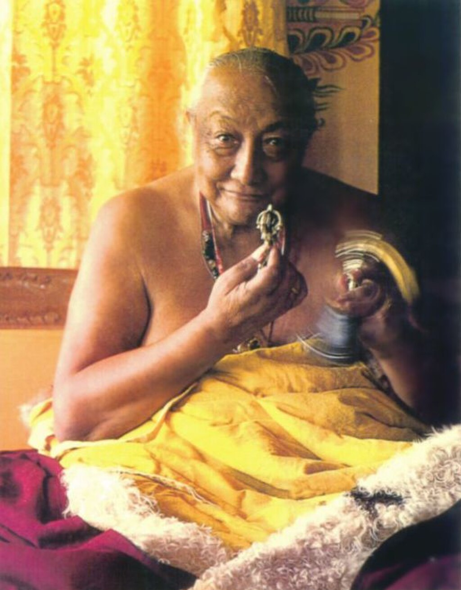
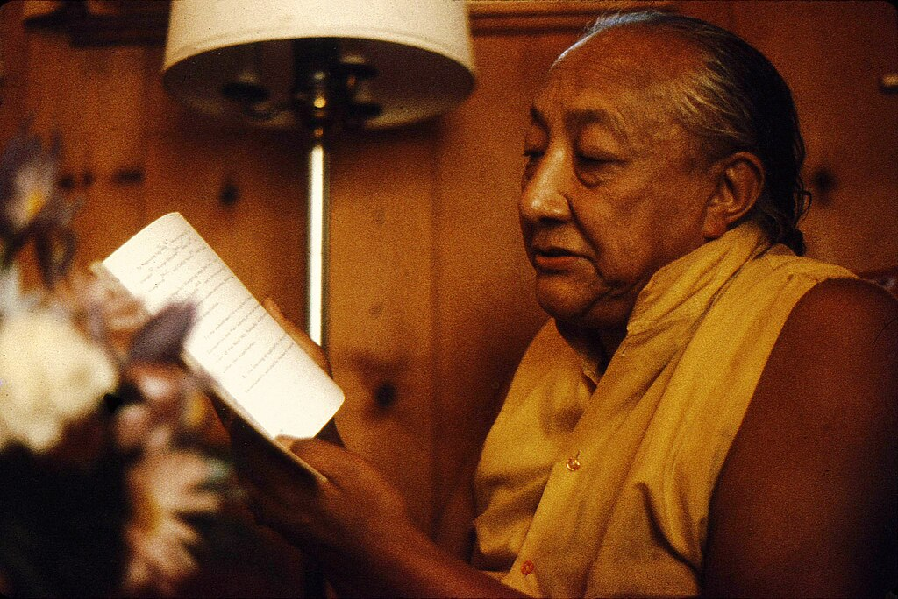
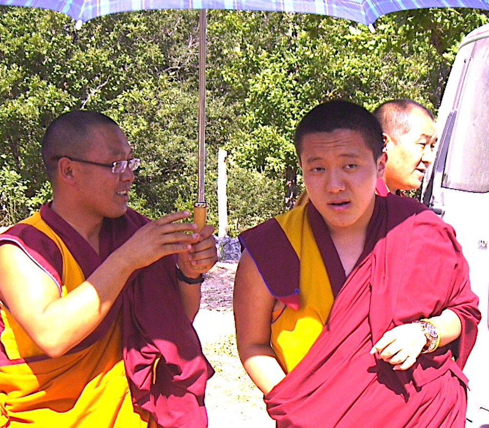
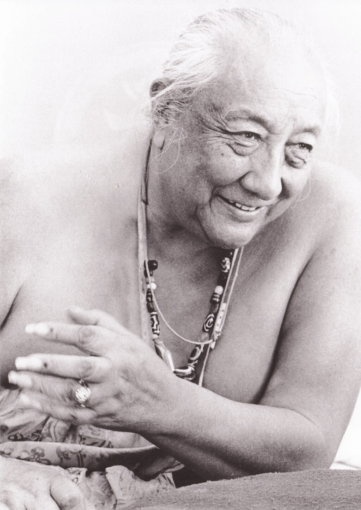
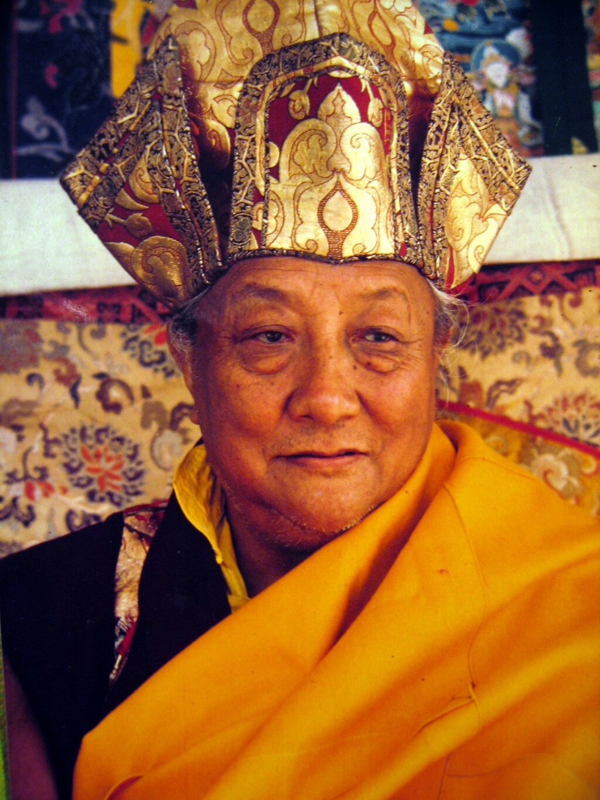
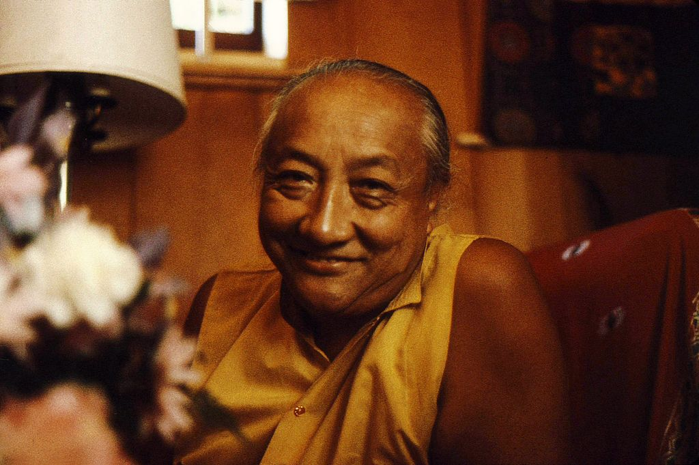
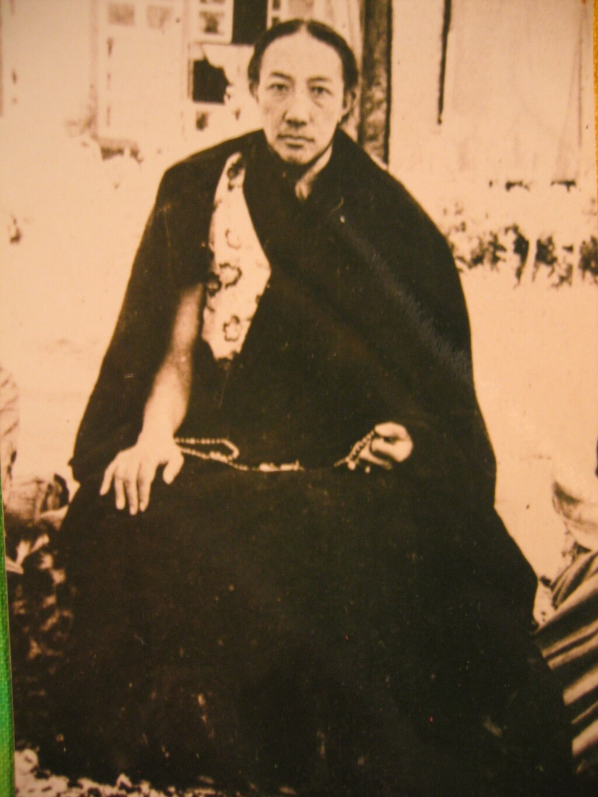

Dilgo Khyentse

Title

[Kyabje](https://en.wikipedia.org/wiki/Kyabje "Kyabje") (His Holiness), [Rinpoche](https://en.wikipedia.org/wiki/Rinpoche "Rinpoche")

Personal life

Born

1910 (1910)

Denkok Valley, [Derge](https://en.wikipedia.org/wiki/Derge "Derge"), [Kham](https://en.wikipedia.org/wiki/Kham "Kham"), [Tibet](https://en.wikipedia.org/wiki/Tibet "Tibet")

Died

September 28, 1991(1991-09-28) (aged 80–81)

[Bhutan](https://en.wikipedia.org/wiki/Bhutan "Bhutan")

Spouse

[Khandro Lhamo](https://en.wikipedia.org/wiki/Khandro_Lhamo "Khandro Lhamo")

Religious life

Religion

[Tibetan Buddhism](https://en.wikipedia.org/wiki/Tibetan_Buddhism "Tibetan Buddhism")

School

[Nyingma](/source/nyingma/ "Nyingma") and [Rimé](https://en.wikipedia.org/wiki/Rimé_movement "Rimé movement")

Senior posting

[Reincarnation](https://en.wikipedia.org/wiki/Reincarnation "Reincarnation")

[Jamyang Khyentse Wangpo](https://en.wikipedia.org/wiki/Jamyang_Khyentse_Wangpo "Jamyang Khyentse Wangpo")

**Dilgo Khyentse Rinpoche, Tashi Paljor** ([Tibetan](https://en.wikipedia.org/wiki/Tibetan_script "Tibetan script"): དིལ་མགོ་མཁྱེན་བརྩེ་, [Wylie](https://en.wikipedia.org/wiki/Wylie_transliteration "Wylie transliteration"): dil mgo mkhyen brtse) (c. 1910 – 28 September 1991) was a [Vajrayana](/source/vajrayana/ "Vajrayana") master, [Terton](https://en.wikipedia.org/wiki/Terton "Terton"), scholar, poet, teacher, and recognized by Buddhists as one of the greatest realized masters. Head of the [Nyingma](/source/nyingma/ "Nyingma") school of [Tibetan Buddhism](https://en.wikipedia.org/wiki/Tibetan_Buddhism "Tibetan Buddhism") from 1988 to 1991, he is also considered an eminent proponent of the [Rime](https://en.wikipedia.org/wiki/Rimé_movement "Rimé movement") tradition.

As the primary custodian of the vast collection of teachings both authored by and recovered by [Jamyang Khyentse Wangpo](https://en.wikipedia.org/wiki/Jamyang_Khyentse_Wangpo "Jamyang Khyentse Wangpo"), Dilgo Khyentse was the _de facto_ custodian of a vast majority of Tibetan Buddhist teachings. He taught many eminent teachers, including the [14th Dalai Lama](https://en.wikipedia.org/wiki/14th_Dalai_Lama "14th Dalai Lama"). After the Chinese invasion of Tibet, his personal effort was crucial in the preservation of Tibetan Buddhism.

## Biography

### Early life, ancestry

Dilgo Khyentse was born on the 3rd day of the 3rd lunar month of the Iron Dog Year (1910), in the Denma region of [Derge](https://en.wikipedia.org/wiki/Derge "Derge"), in Denkok Valley, in [Kham](https://en.wikipedia.org/wiki/Kham "Kham"), Eastern [Tibet](https://en.wikipedia.org/wiki/Tibet "Tibet"), during a teaching on the Kalachakra Tantra given in his house by [Ju Mipham](https://en.wikipedia.org/wiki/Ju_Mipham "Ju Mipham"). Ju Mipham conferred the name Tashi Paljor. The Dilgo family directly descended from Tibet's eighth-century King [Trisong Detsen](https://en.wikipedia.org/wiki/Trisong_Detsen "Trisong Detsen"), and both his father and mother were children of ministers to the [King of Dege](https://en.wikipedia.org/wiki/Kingdom_of_Dege "Kingdom of Dege"), based in Derge. His family and their associates were major patrons of [Jamyang Khyentse Wangpo](https://en.wikipedia.org/wiki/Jamyang_Khyentse_Wangpo "Jamyang Khyentse Wangpo"). He had three brothers: the eldest brother Sanggye; another older brother who became the 9th Benchen Sanggye Nyenpa, Karma Shedrub Tenpai Nyima; and a third older brother that died at a young age.

When Dilgo Khyentse was a year old, he was declared to be a [reincarnation](https://en.wikipedia.org/wiki/Reincarnation "Reincarnation") of Jamyang Khyentse Wangpo by a disciple of Khyentse Wangpo's. Several high Rinpoches from the Nyingma, Karma Kagyu, and Sakya schools were to request Dilgo Khyentse be sent to their monasteries, but Ju Mipham advised his father to keep young Dilgo Khyentse Tashi Paljor at home.

In 1912, the [4th Shechen Gyaltsap Pema Namgyal](https://en.wikipedia.org/wiki/Shechen_Gyaltsab "Shechen Gyaltsab") (1871–1926) of [Shechen Monastery](https://en.wikipedia.org/wiki/Shechen_Monastery "Shechen Monastery") requested Tashi Paljor for his monastery, and the request was accepted. Shechen Monastery is one of the six principal _Mother Monasteries_ of the [Nyingma](/source/nyingma/ "Nyingma") school, where Dilgo Khyentse received novice vows in 1919, and where he was formally enthroned by Shechen Gyaltsab in 1925 as the tulku of Jamyang Khyentse Wangpo, and given the name Gyurme Tekchok Tenpai Gyeltsen.

During these years, Dilgo Khyentse travelled close to Shechen Monastery to receive teachings in Buddhist philosophy from several masters, including Shechen Kongtrul Pema Drime (1901–1960), the [11th Tai Situ](https://en.wikipedia.org/wiki/11th_Tai_Situ "11th Tai Situ"), Pema Wangchok Gyelpo of [Palpung Monastery](https://en.wikipedia.org/wiki/Palpung_Monastery "Palpung Monastery") where he seriously studied, from masters at Dzogchen Monastery, Jamyang Khyentse Chokyi Lodro, and Khenpo Zhenga of Jyegu Dondrub Ling at Jyekundo. Additionally, he received teachings on the ancient [Guhyagarbha](https://en.wikipedia.org/wiki/Guhyagarbha "Guhyagarbha") [Tantra](https://en.wikipedia.org/wiki/Tantra "Tantra") and its various commentaries from Khenpo Tubga at Kyangma Ritro. In all, he studied with more than 50 teachers from the Nyingma school's oral (_[kama](https://en.wikipedia.org/wiki/Kama "Kama")_) and practice lineages within [Tibetan Buddhism](https://en.wikipedia.org/wiki/Tibetan_Buddhism "Tibetan Buddhism").

His root [guru](https://en.wikipedia.org/wiki/Guru "Guru") was Shechen Gyaltsap Rinpoche, and [Dzongsar Khyentse Chokyi Lodro](https://en.wikipedia.org/wiki/Dzongsar_Khyentse_Chokyi_Lodro "Dzongsar Khyentse Chokyi Lodro") (1893–1959) was his other main spiritual master. He completed what is known as the [Ngöndro](https://en.wikipedia.org/wiki/Ngöndro "Ngöndro"), or Preliminary Practice.

His eldest brother Sanggye was his constant travelling and practice companion, and they entered many brief retreats between teachings which included the _Bodhisattvacaryāvatāra_, the _Madhamikāvatāra_, Nagarjuna's _Mūlamadhyamakakārikā_, the _Guhyagarbha Tantra_, works by many masters including Ju Mipham, Terdak Lingpa, Mindroling, Guru Chowang, Jamgon Kongtrul, and by other great masters. His classic training would automatically include training in [meditation](https://en.wikipedia.org/wiki/Meditation "Meditation"), in the study of the [Kangyur](https://en.wikipedia.org/wiki/Kangyur "Kangyur") and [Tengyur](https://en.wikipedia.org/wiki/Tengyur "Tengyur"), and in the [tantra](https://en.wikipedia.org/wiki/Tantra "Tantra") teachings specifically. He also received training in grammar and poetics in addition to the numerous teachings, transmissions, and empowerments. He remained in close proximity to Shechen Monastery until 1926, when Shechen Gyaltsab passed.

From 1926 until 1934, Dilgo Khyentse remained in solitary retreat in a cave in Denkok, near his birthplace, but attended the enthronement of the 5th Shechen Gyeltsab at Shechen Monastery in 1925, and received the transmissions and teachings. Dilgo Khyentse requested to spend the rest of his life in solitary meditation. In response, Khyentse Chokyi Lodro told him that "(t)he time has come for you to teach and transmit to others the countless precious teachings you have received."

Two years later while in retreat, a severe fever occurred at the age of 25, and he then decided to become a tantric practitioner with a consort, which supported his transition as a [terton](https://en.wikipedia.org/wiki/Terton "Terton"). He married [Khandro Lhamo](https://en.wikipedia.org/wiki/Khandro_Lhamo "Khandro Lhamo"), a [traditional Tibetan medicine](https://en.wikipedia.org/wiki/Traditional_Tibetan_medicine "Traditional Tibetan medicine") doctor (_Amchi_) from a modest Kham family while both Khyentse Chokyi Lodro and the 10th Zurmang Trungpa, Karma Chokyi Nyingche, had urged him to pursue terma treasure revelations. A teacher had prophesied that a cure for his illness would be marriage, despite the fact he was uninterested in it. Khandro Lhamo became a well-known expert in Tibetan medicine, a supporter of Shechen Monastery and his life-long companion. They had two daughters, the elder being Dechen Wangmo, and the younger being Chime Wangmo.

### Student and master

Dilgo Khyentse then spent the next 21 years as an active [Terton](https://en.wikipedia.org/wiki/Terton "Terton"), while also traveling and teaching. In 1936, he revealed a section of "one of his most celebrated treasures", _Pema's Heart Essence of Longevity (pad+ma tshe yi snying thig)_, which he discovered in [the Kingdom of Nangchen](https://en.wikipedia.org/wiki/Nangchen "Nangchen"). Additional sections were revealed the following year.

At the age of 34, Dilgo Khyentse spent two years with Dzongzar Khyentse Chokyi Lodro, receiving teachings and revealing terma. He was a close student, and specifically received Jamgon Kongtrul's [Rinchen Terdzod](https://en.wikipedia.org/wiki/Rinchen_Terdzod "Rinchen Terdzod"), a collection of [Revealed Terma Treasures](https://en.wikipedia.org/wiki/Terma_\(Buddhism\) "Terma (Buddhism)"), and his _Treasury of Knowledge (shes bya kun khyab)_. In 1946, Dilgo Khyentse travelled in Kham and strengthened his connections to the lineage of another Terton, [Chokgyur Lingpa](https://en.wikipedia.org/wiki/Chokgyur_Lingpa "Chokgyur Lingpa") when he discovered and decoded a sheet of paper which became the treasure cycle of the _Kabgye (bka' brgyad)_.

He continued his revelations as a Terton while travelling and teaching at Derge, Nangchen, Rebkong, Amye Machen, and other places in Do Kham during the early years of China's invasion. His treasure cycle of _Nyak Kilaya (gnyag lugs phur ba)_ was revealed in Nangchen.

Later on, the [14th Dalai Lama](https://en.wikipedia.org/wiki/14th_Dalai_Lama "14th Dalai Lama") regarded Dilgo Khyentse as both his principal teacher of the Nyingma school lineage, and his [Dzogpa chenpo](/source/dzogchen/ "Dzogchen") teacher. Dilgo Khyentse was also one of the main teachers of [Chögyam Trungpa](/source/chogyam-trungpa/#Acclaim "Chögyam Trungpa"), whom is held in high regard. After his death, many of Chogyam Trungpa's students became Dilgo Khyentse's students. Dilgo Khyentse was also a considered a master to many qualified teachers from all four schools of Tibetan Buddhism.

### Escape from Tibet, teachings in exile

In the mid-1950s, when widespread rebellions broke out in [Kham](https://en.wikipedia.org/wiki/Kham "Kham") and the Chinese Communists began bombing monasteries and massacring people and livestock, the Chinese forces were also specifically hunting certain tulkus, among them Dilgo Khyentse. Khandro Lhamo refused to divulge his whereabouts for weeks in 1956, before Dilgo Khyentse and his family spontaneously migrated with masses of other Tibetans to Central Tibet and [Lhasa](https://en.wikipedia.org/wiki/Lhasa "Lhasa"), leaving behind his library of dharma books and most of his own writings. Shechen Monastery in Kham was destroyed by the Chinese forces.

Then, during the [1959 Tibetan uprising](https://en.wikipedia.org/wiki/1959_Tibetan_uprising "1959 Tibetan uprising"), the 14th Dalai Lama escaped from [Lhasa](https://en.wikipedia.org/wiki/Lhasa "Lhasa"), and Dilgo Khyentse together with his family and a few students also escaped from Tibet, including his brother, the 9th Sangye Nyenpa Rinpoche and [Tenga Rinpoche](https://en.wikipedia.org/wiki/Tenga_Rinpoche "Tenga Rinpoche"). They headed for the border at [Bhutan](https://en.wikipedia.org/wiki/Bhutan "Bhutan") where they stayed in camps before being permitted to cross into [India](https://en.wikipedia.org/wiki/India "India"), where they moved and stayed for several years with [Dudjom Rinpoche](https://en.wikipedia.org/wiki/Dudjom_Rinpoche "Dudjom Rinpoche") at Kalimpong. From 1961 to 1962, he taught in Bhutan in response to an invitation, and later he was again invited to Bhutan by [Nyimalung Monastery](https://en.wikipedia.org/wiki/Nyimalung_Monastery "Nyimalung Monastery") in 1965 after which Bhutan became his primary home.

He made frequent visits to India to give teachings to the 14th Dalai Lama at [Dharamasala](https://en.wikipedia.org/wiki/Dharamsala,_Himachal_Pradesh "Dharamsala, Himachal Pradesh"), and he dedicated himself to preserving the Nyingma school lineage by travelling extensively in India, Nepal, and Bhutan. His first journey to the West was in 1975, and he established a three-year retreat center in the [Dordogne](https://en.wikipedia.org/wiki/Dordogne "Dordogne"), [France](https://en.wikipedia.org/wiki/France "France").

He also engaged in scholarship and composed numerous poems, meditation texts and commentaries. He was a [Terton](https://en.wikipedia.org/wiki/Terton "Terton"), a discoverer of spiritual treasures, and is credited with discovering numerous [termas](https://en.wikipedia.org/wiki/Terma_\(Buddhism\) "Terma (Buddhism)"). He was one of the foremost masters of [Dzogchen](/source/dzogchen/ "Dzogchen"), the [Great Perfection](https://en.wikipedia.org/wiki/Great_Perfection "Great Perfection"), for which he bestowed pith instructions, and is one of the principal holders of the [Longchen Nyingtik](/source/longchen-nyingtik/ "Longchen Nyingtik") lineage.

In 1980, he reconstructed Shechen Monastery in [Nepal](https://en.wikipedia.org/wiki/Nepal "Nepal"), when he founded the Shechen Tennyi Dargyeling Monastery in [Boudhanath](https://en.wikipedia.org/wiki/Boudhanath "Boudhanath"), [Kathmandu](https://en.wikipedia.org/wiki/Kathmandu "Kathmandu"), which was the earliest of the Tibetan Buddhist monasteries in Boudhanath to be built. He rebuilt the Shechen Monastery near the great and spiritually significant [Jarung Kashor stupa](https://en.wikipedia.org/wiki/Boudhanath "Boudhanath") of Boudhanath, in Kathmandu valley, which is also a [UNESCO World Heritage Site](https://en.wikipedia.org/wiki/UNESCO_World_Heritage_Site "UNESCO World Heritage Site").

He travelled to Tibet three times, in 1985, 1988, and 1990, during which he funded and advised rebuilding projects, including the consecration of a statue of [Padmasambhava](/source/padmasambhava/ "Padmasambhava") at the [Jokhang](https://en.wikipedia.org/wiki/Jokhang "Jokhang"), the re-consecration of [Samye Monastery](https://en.wikipedia.org/wiki/Samye_Monastery "Samye Monastery"), the re-consecration of the [Derge](https://en.wikipedia.org/wiki/Derge "Derge") printing house, and he visited several rebuilt Nyingma school monasteries including Dzogchen, Palyul, Katok, and Shechen Monastery where he was able to stay and bestow public teachings. In between his travels to Tibet, he gave many teachings over the years to hundreds of other monks, nuns, [lamas](https://en.wikipedia.org/wiki/Lama "Lama"), Khenpos and Khenmos, Rinpoches, disciples, laypeople, and to numerous international students. His senior student is [Trulshik Rinpoche](https://en.wikipedia.org/wiki/Trulshik_Rinpoche "Trulshik Rinpoche"), whom he named as a spiritual heir.

During this same period and until his [paranirvana](https://en.wikipedia.org/wiki/Paranirvana "Paranirvana") on 27 September 1991 in Bhutan, Dilgo Khyentse was also involved in publishing as many Tibetan Buddhist teachings as possible, counting more than 300 volumes altogether.

### Final years

He was one of the few great Tibetan Rinpoches accorded the honorific title _Kyabje_, or "His Holiness". Following the death of Kyabje [Dudjom Rinpoche](https://en.wikipedia.org/wiki/Dudjom_Rinpoche "Dudjom Rinpoche") in 1987, he became the head of the Nyingma School, and remained so until his death in [Bhutan](https://en.wikipedia.org/wiki/Bhutan "Bhutan") on 27 September 1991.

Student [Matthieu Ricard](https://en.wikipedia.org/wiki/Matthieu_Ricard "Matthieu Ricard") remarked:

> "his disciples were as numerous as stars in the autumn sky...we felt that the sun had vanished from the world."

In November 1992, the ritual [cremation](https://en.wikipedia.org/wiki/Cremation "Cremation") ceremony for Dilgo Khyentse was consecrated for three-days near [Paro](https://en.wikipedia.org/wiki/Paro,_Bhutan "Paro, Bhutan") in Bhutan, and was attended by over 100 lamas and ordained monks and nuns, the Royal Family and ministers of Bhutan, 500 western disciples and 50,000 devotees and lay people.

## Preservation of lineages

Dilgo Khyentse Rinpoche in Seattle, 1976

Dilgo Khyentse Rinpoche has been described as a perfect example of an impartial preserver of Tibetan Buddhist lineages, and a Rime master, since in exile he was instrumental in safeguarding all of the lineages of Tibetan Buddhism without partiality. He received and gave empowerments, and wrote volumes of texts that revitalized and interpreted important transmissions and teachings from all four Tibetan Buddhist schools.

Gyatrul Rinpoche (b. 1924), in a purport to [Karma Chagmé](https://en.wikipedia.org/wiki/Karma_Chagmé "Karma Chagmé") Rinpoche ([Wylie](https://en.wikipedia.org/wiki/Wylie_transliteration "Wylie transliteration"): karma-chags-med, fl. 17th century), conveys Dilgo Khyentse's [samaya](https://en.wikipedia.org/wiki/Samaya "Samaya"), diligence and humility in receiving empowerments (Tib: དབང,  Wylie: _dbang_) and oral [Dharma transmissions](https://en.wikipedia.org/wiki/Dharma_transmission "Dharma transmission") (Tib: ལུང, Wylie: _lung_). [B. Alan Wallace](https://en.wikipedia.org/wiki/B._Alan_Wallace "B. Alan Wallace") elaborates:

> With respect to oral transmissions, even if the lineage is impure, it is not a problem. Dilgo Khyentse Rinpoche often sought out and received any oral transmission he thought was on the verge of disappearing. It made no difference who was giving it. He would receive it and, in turn, pass it on to make sure that the lineage remained unbroken.

## Reincarnation

 Reincarnation of Dilgo Khyentse, Dilgo Khyentse Yangsi, 2010

The reincarnation (or Yangsi) of Kyabje Dilgo Rinpoche is informally called Dilgo Khyentse Yangsi Rinpoche. Formally, he is called **Kyabje Dilgo Khyentse Rinpoche** or **Ugyen Tenzin Jigme Lhundrup** (Tib. ཨོ་རྒྱན་བསྟན་འཛིན་འཇིགས་མེད་ལྷུང་གྲུབ་, [Wylie](https://en.wikipedia.org/wiki/Wylie_transliteration "Wylie transliteration") __o rgyan bstan 'dzin 'jigs med lhun grub__).

The reincarnation was born in [Nepal](https://en.wikipedia.org/wiki/Nepal "Nepal") on the 11th day of the 5th lunar month of the Female Water Bird Year (30 June 1993) in [Kathmandu](https://en.wikipedia.org/wiki/Kathmandu "Kathmandu"), on the day following [Guru Rinpoche](https://en.wikipedia.org/wiki/Guru_Rinpoche "Guru Rinpoche")'s birthday. His father is [Tsikey Chokling Rinpoche](https://en.wikipedia.org/wiki/Tsikey_Chokling_Rinpoche "Tsikey Chokling Rinpoche"), the son of [Tulku Urgyen Rinpoche](https://en.wikipedia.org/wiki/Tulku_Urgyen_Rinpoche "Tulku Urgyen Rinpoche"), and his mother is Sangyum Dechen Paldron. His siblings are [Phakchok Rinpoche](https://en.wikipedia.org/wiki/Phakchok_Rinpoche "Phakchok Rinpoche"), Mingyur Paldron, and Kelsang Bhuti.

> Khyentse Yangsi Rinpoche was born in Nepal on June 30, 1993. When Khyentse Rinpoche passed away, his close students requested [Trulshik Rinpoche](https://en.wikipedia.org/wiki/Trulshik_Rinpoche "Trulshik Rinpoche"), his most senior and accomplished disciple, to find his incarnation.

Trulshik Rinpoche is said to have had numerous visions concerning the Yangsi, which he shared with Shechen Rabjam Rinpoche, Dilgo Khyentse's grandson. His recognition was also confirmed by the [14th Dalai Lama](https://en.wikipedia.org/wiki/14th_Dalai_Lama "14th Dalai Lama"). On 29 December 1995 Trulshik Rinpoche performed the Yangsi's formal name offering ceremony, in Nepal. Dilgo Khyentse Yangsi Rinpoche was enthroned in December 1996. Trulshik Rinpoche also offered a Long Life prayer which he composed for Dilgo Khyentse II of Shechen, at the sacred Maratika Cave.

Shechen Rabjam Rinpoche personally supervised the upbringing of Dilgo Khyentse Yangsi Rinpoche, in Nepal and also in Bhutan where Khenpo Yeshe Gyaltsen focused on providing Dilgo Khyentse Yangsi Rinpoche's _[Shedra](https://en.wikipedia.org/wiki/Shedra "Shedra")_ education.

In 2010, Dilgo Khyentse Yangsi Rinpoche marked the century anniversary of the birth of Kyabje Dilgo Khyentse Rinpoche, and his own 17th year, with celebrations in Nepal and Bhutan and with a major tour of Europe, North America, and Asia. The tour began in [France](https://en.wikipedia.org/wiki/France "France") at La Sonnerie in the Dordogne, since La Sonnerie is the main European seat of Dilgo Khyentse, and is the French seat of Dudjom Rinpoche.

Afterwards, Dilgo Khentse Yangsi Rinpoche visited and gave teachings at [Lerab Ling](https://en.wikipedia.org/wiki/Lerab_Ling "Lerab Ling") in France, before continuing with Shechen Rabjam Rinpoche and [Matthieu Ricard](https://en.wikipedia.org/wiki/Matthieu_Ricard "Matthieu Ricard") to the Americas - [U.S.](https://en.wikipedia.org/wiki/U.S. "U.S."), [Canada](https://en.wikipedia.org/wiki/Canada "Canada") and [Mexico](https://en.wikipedia.org/wiki/Mexico "Mexico"). The North American leg of the tour included events in New York state, in Boulder, Colorado, Vermont, and in Canada before the tour traveled to Mexico.

In 2014, Dilgo Khyentse Yangsi Rinpoche and Matthieu Ricard gave talks and teachings in France and in the U.K.. At Nyima Dzong in Paris, an empowerment was given for the Dilgo Khyentse Terma of Vajra Vidharana (Dorje Namjon), and Dilgo Khyentse Yangsi Rinpoche celebrated his birthday. Afterwards, teachings were given at Lerab Ling and at Chanteloube. In the U.K., talks were given at Rigpa London, and a series of talks and empowerments were given at the newly opened [Buddhist Community Centre UK](https://en.wikipedia.org/wiki/Aldershot_Buddhist_Centre "Aldershot Buddhist Centre") in [Aldershot](https://en.wikipedia.org/wiki/Aldershot "Aldershot"), hosted by the Nepali Buddhist Community.

Later in July 2014, Dilgo Khyentse Yangsi Rinpoche returned to Mexico and to his center Shechen Mexico, and held two talks and gave a teaching on Rangjung Pema Nyingtik ngondro practice. In Toronto, Canada, at Riwoche gompa, Dilgo Khyentse Rinpoche gave empowerments on Namgyalma and Vajrakilaya.

In July 2024, Dilgo Khyentse Yangsi Rinpoche gave an eight-day Kurukulle, Guru Padmasambhava, and Yeshe Tsogyal drubchen and puja, in the historic E Maha Viraha ("Yempi Mahaviraha") in Patan, Kathmandu, Nepal, where [Guru Padmasambhava](https://en.wikipedia.org/wiki/Guru_Padmasambhava "Guru Padmasambhava") had taught.

## Film

The film _Spirit of Tibet: Journey to Enlightenment, The Life and World of Dilgo Khyentse Rinpoche_ was released in 1998. It was made by [Matthieu Ricard](https://en.wikipedia.org/wiki/Matthieu_Ricard "Matthieu Ricard"), a French student, photographer, Buddhist monk, and author who had traveled with Khyentse for 14 years. It tells Dilgo Khyentse's story from birth to death, to rebirth. The film also tells of his escape from Tibet, following China's brutal invasion of Kham and Central Tibet, and of Dilgo Khyentse's determination to preserve and transmit Buddhist teachings far and wide. The film reveals Tibet's profound and sacred art, ritual philosophy, and the sacred _cham_ dances. Along with rarely photographed areas of Tibet, Bhutan and Nepal, the film features interviews with the 14th Dalai Lama, who also speaks about his own spiritual life.

The film _Brilliant Moon: Glimpses of Dilgo Khyentse Rinpoche_, written and directed by [Neten Chokling](https://en.wikipedia.org/wiki/Neten_Chokling "Neten Chokling") Rinpoche, and narrated by [Richard Gere](https://en.wikipedia.org/wiki/Richard_Gere "Richard Gere") and [Lou Reed](https://en.wikipedia.org/wiki/Lou_Reed "Lou Reed"), uses animation, previously unseen archival footage and photos along with new interviews of Tibet's qualified masters to tell Dilgo Khyentse's life story.

## Publications

*   Khyentse, Dilgo (1993), [_Enlightened Courage: An Explanation of Atisha's Seven Point Mind Training_](https://archive.org/details/enlightenedcoura00rabg), [Snow Lion Publications](https://en.wikipedia.org/wiki/Snow_Lion_Publications "Snow Lion Publications"), [ISBN](https://en.wikipedia.org/wiki/ISBN_\(identifier\) "ISBN (identifier)") [1-55939-023-9](https://en.wikipedia.org/wiki/Special:BookSources/1-55939-023-9 "Special:BookSources/1-55939-023-9").
*   Khyentse, Dilgo; [Rinpoche, Patrul](https://en.wikipedia.org/wiki/Patrul_Rinpoche "Patrul Rinpoche") (1993), _The Heart Treasure of the Enlightened Ones_, [Shambhala Publications](https://en.wikipedia.org/wiki/Shambhala_Publications "Shambhala Publications"), [ISBN](https://en.wikipedia.org/wiki/ISBN_\(identifier\) "ISBN (identifier)") [978-0877734932](https://en.wikipedia.org/wiki/Special:BookSources/978-0877734932 "Special:BookSources/978-0877734932").
*   Khyentse, Dilgo (1996), _The Excellent Path to Enlightenment_, [Snow Lion Publications](https://en.wikipedia.org/wiki/Snow_Lion_Publications "Snow Lion Publications"), [ISBN](https://en.wikipedia.org/wiki/ISBN_\(identifier\) "ISBN (identifier)") [1-55939-064-6](https://en.wikipedia.org/wiki/Special:BookSources/1-55939-064-6 "Special:BookSources/1-55939-064-6").
*   Khyentse, Dilgo; [Ricard, Mattieu](https://en.wikipedia.org/wiki/Matthieu_Ricard "Matthieu Ricard") (1996), [_Journey to Enlightenment: The Life and World of Khyentse Rinpoche, Spiritual Teacher from Tibet_](https://archive.org/details/journeytoenlight0000rica), Aperture, [ISBN](https://en.wikipedia.org/wiki/ISBN_\(identifier\) "ISBN (identifier)") [0-89381-679-5](https://en.wikipedia.org/wiki/Special:BookSources/0-89381-679-5 "Special:BookSources/0-89381-679-5").
*   Khyentse, Dilgo; [Ricard, Matthieu](https://en.wikipedia.org/wiki/Matthieu_Ricard "Matthieu Ricard") (1999), _Guru Yoga: According to the Preliminary Practice of Longchen Nyingtik_, [Snow Lion Publications](https://en.wikipedia.org/wiki/Snow_Lion_Publications "Snow Lion Publications"), [ISBN](https://en.wikipedia.org/wiki/ISBN_\(identifier\) "ISBN (identifier)") [1-55939-121-9](https://en.wikipedia.org/wiki/Special:BookSources/1-55939-121-9 "Special:BookSources/1-55939-121-9").
*   Khyentse, Dilgo (1999), _The Wish-Fulfilling Jewel_, [Shambhala Publications](https://en.wikipedia.org/wiki/Shambhala_Publications "Shambhala Publications"), [ISBN](https://en.wikipedia.org/wiki/ISBN_\(identifier\) "ISBN (identifier)") [1-57062-452-6](https://en.wikipedia.org/wiki/Special:BookSources/1-57062-452-6 "Special:BookSources/1-57062-452-6").
*   Khyentse, Dilgo; Pema Kunsang, Erik; [Rangdrol, Tsele Natsok](https://en.wikipedia.org/wiki/Tsele_Natsok_Rangdrol "Tsele Natsok Rangdrol"); Tsogyal, Yeshe (2004), _The Lotus-Born: The Life Story of Padmasambhava_, North Atlantic Books, [ISBN](https://en.wikipedia.org/wiki/ISBN_\(identifier\) "ISBN (identifier)") [962-7341-55-X](https://en.wikipedia.org/wiki/Special:BookSources/962-7341-55-X "Special:BookSources/962-7341-55-X").
*   Khyentse, Dilgo; Sangye, Padama (2005), _The Hundred Verses of Advice: Tibetan Buddhist Teachings on What Matters Most_, [Shambhala Publications](https://en.wikipedia.org/wiki/Shambhala_Publications "Shambhala Publications"), [ISBN](https://en.wikipedia.org/wiki/ISBN_\(identifier\) "ISBN (identifier)") [1-59030-154-4](https://en.wikipedia.org/wiki/Special:BookSources/1-59030-154-4 "Special:BookSources/1-59030-154-4").
*   Khyentse, Dilgo; Jinba Palmo, Ani (2008), _Brilliant Moon: The Autobiography of Dilgo Khyentse_, [Shambhala Publications](https://en.wikipedia.org/wiki/Shambhala_Publications "Shambhala Publications"), [ISBN](https://en.wikipedia.org/wiki/ISBN_\(identifier\) "ISBN (identifier)") [978-1590302842](https://en.wikipedia.org/wiki/Special:BookSources/978-1590302842 "Special:BookSources/978-1590302842").
*   Khyentse, Dilgo (2011), _The Collected Works of Dilgo Khyentse Vols. 1-3_, [Shambhala Publications](https://en.wikipedia.org/wiki/Shambhala_Publications "Shambhala Publications"), [ISBN](https://en.wikipedia.org/wiki/ISBN_\(identifier\) "ISBN (identifier)") [978-1-59030-887-5](https://en.wikipedia.org/wiki/Special:BookSources/978-1-59030-887-5 "Special:BookSources/978-1-59030-887-5").
*   Khyentse, Dilgo; Mipham, Jamgon (2020), _Lion of Speech: The Life of Mipham Rinpoche_, [Shambhala Publications](https://en.wikipedia.org/wiki/Shambhala_Publications "Shambhala Publications"), [ISBN](https://en.wikipedia.org/wiki/ISBN_\(identifier\) "ISBN (identifier)") [978-1559394949](https://en.wikipedia.org/wiki/Special:BookSources/978-1559394949 "Special:BookSources/978-1559394949").

*   

    Undated late photo

*   

    In regalia

*   

    Khyentse in 1976

*   

    The younger Khyentse
