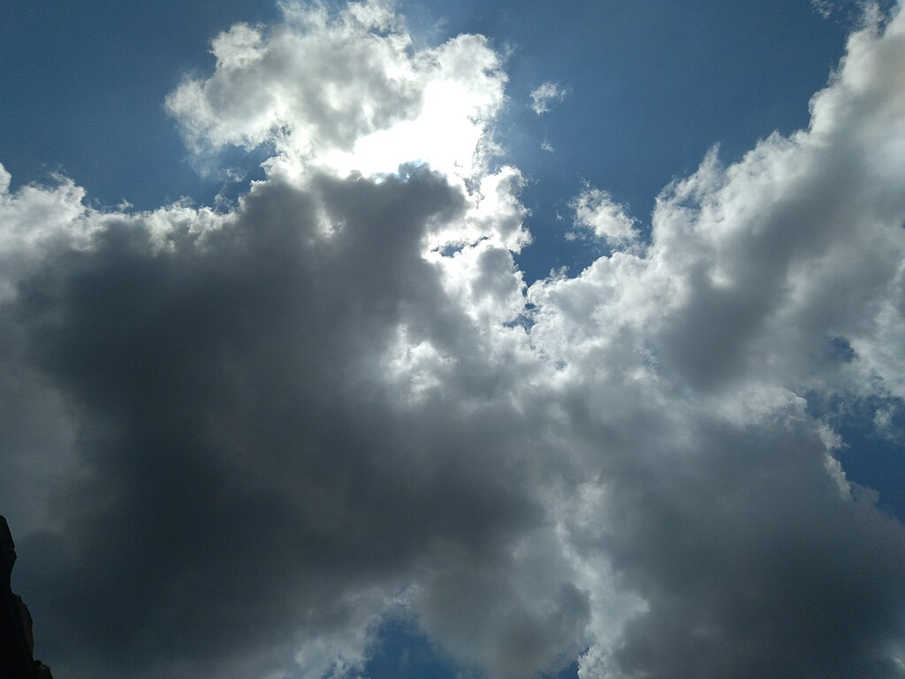
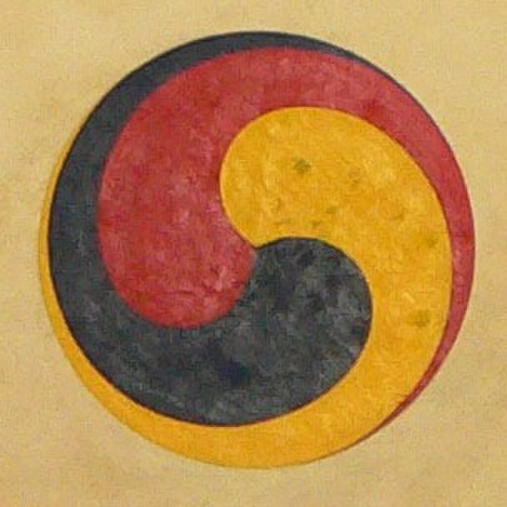
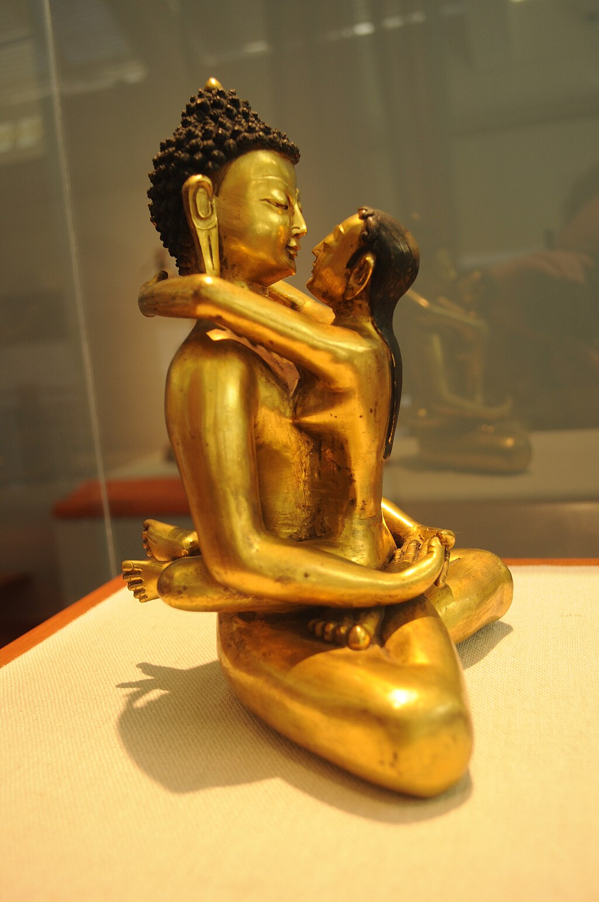
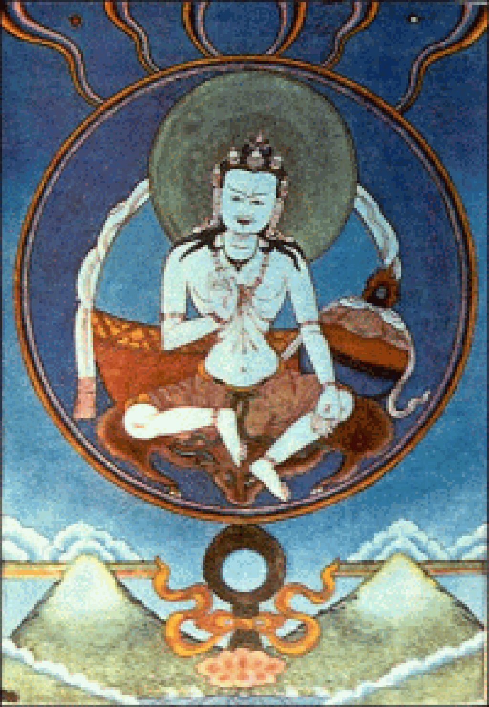
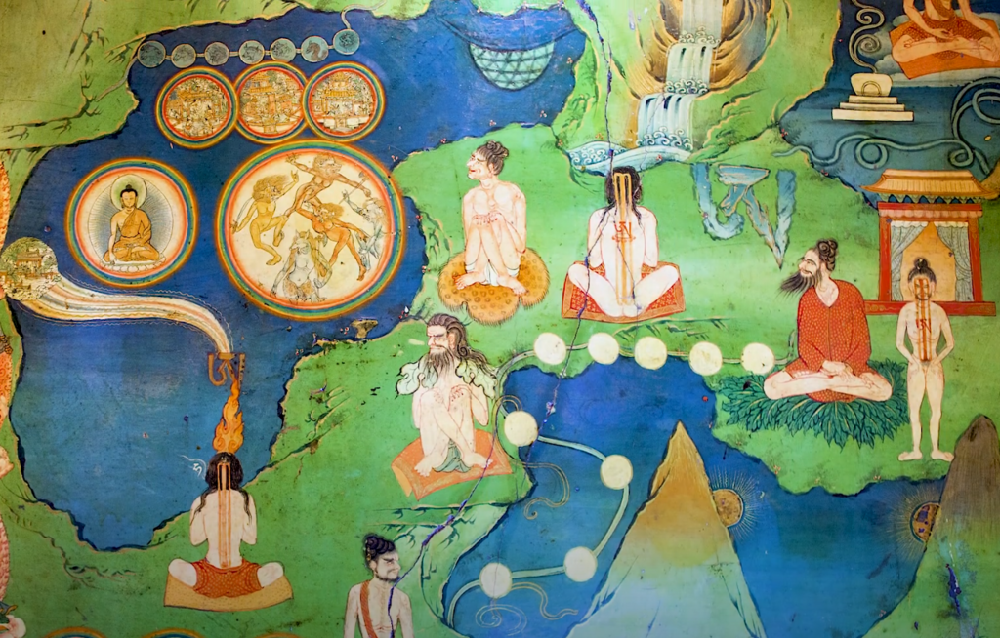
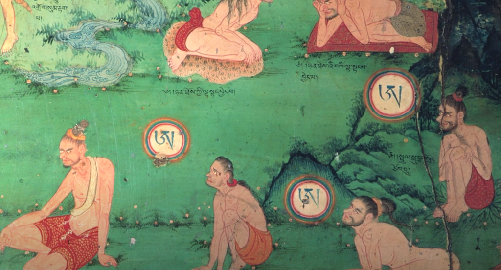
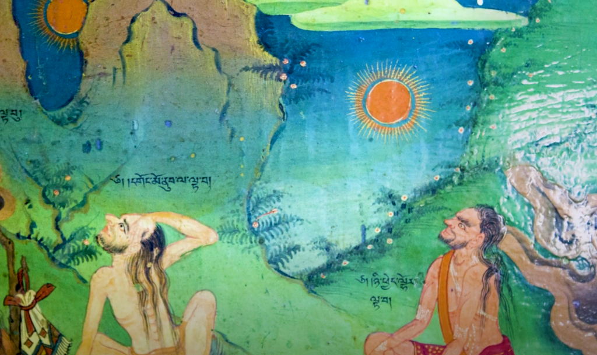
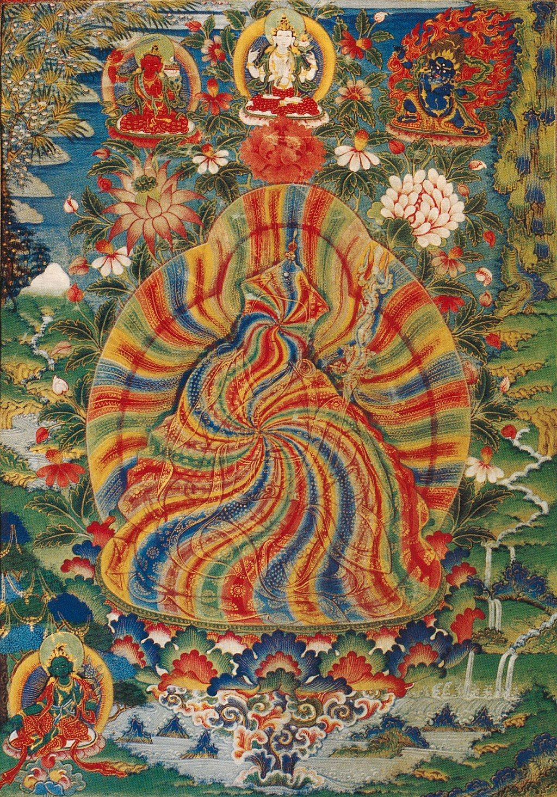

A white [Tibetan](https://en.wikipedia.org/wiki/Tibetan_script "Tibetan script") letter A inside a rainbow [thigle](https://en.wikipedia.org/wiki/Bindu_\(symbol\) "Bindu (symbol)") is a common symbol of Dzogchen. [The Sanskrit letter A](https://en.wikipedia.org/wiki/A_in_Buddhism "A in Buddhism") is also a common symbol for non-arising in Mahayana Buddhism.

Dzogchen

[Tibetan](https://en.wikipedia.org/wiki/Standard_Tibetan "Standard Tibetan") name

[Tibetan](https://en.wikipedia.org/wiki/Tibetan_script "Tibetan script")

 རྫོགས་ཆེན་

Transcriptions

[Wylie](https://en.wikipedia.org/wiki/Wylie_transliteration "Wylie transliteration")

rdzogs chen
(rdzogs pa chen po)

[THL](https://en.wikipedia.org/wiki/THL_Simplified_Phonetic_Transcription "THL Simplified Phonetic Transcription")

Dzokchen

[Tibetan Pinyin](https://en.wikipedia.org/wiki/Tibetan_pinyin "Tibetan pinyin")

Zogqên

[Lhasa](https://en.wikipedia.org/wiki/Standard_Tibetan "Standard Tibetan") [IPA](https://en.wikipedia.org/wiki/Help:IPA/Tibetan "Help:IPA/Tibetan")

[\[tsɔktɕʰẽ\]](https://en.wikipedia.org/wiki/Help:IPA/Tibetan "Help:IPA/Tibetan")

[Chinese](https://en.wikipedia.org/wiki/Chinese_language "Chinese language") name

[Traditional Chinese](https://en.wikipedia.org/wiki/Traditional_Chinese_characters "Traditional Chinese characters")

大究竟、
[大圓滿](https://en.wiktionary.org/wiki/大圓滿 "wikt:大圓滿")、
大成就

[Simplified Chinese](https://en.wikipedia.org/wiki/Simplified_Chinese_characters "Simplified Chinese characters")

大究竟、
[大圆满](https://en.wiktionary.org/wiki/大圆满 "wikt:大圆满")、
大成就

Transcriptions

[Standard Mandarin](https://en.wikipedia.org/wiki/Standard_Chinese "Standard Chinese")

[Hanyu Pinyin](https://en.wikipedia.org/wiki/Hanyu_Pinyin "Hanyu Pinyin")

dàjiūjìng,
dàyuánmǎn,
dàchéngjiù

**Dzogchen** ([Tibetan](https://en.wikipedia.org/wiki/Tibetan_script "Tibetan script"): རྫོགས་ཆེན་, [Wylie](https://en.wikipedia.org/wiki/Wylie_transliteration "Wylie transliteration"): rdzogs chen 'Great Completion' or 'Great Perfection'), also known as _atiyoga_ ([utmost yoga](https://en.wikipedia.org/wiki/Classes_of_Tantra_in_Tibetan_Buddhism#Nyingma_classification "Classes of Tantra in Tibetan Buddhism")), is a tradition of teachings in [Indo-Tibetan Buddhism](https://en.wikipedia.org/wiki/Tibetan_Buddhism "Tibetan Buddhism") and [Bön](https://en.wikipedia.org/wiki/Bon "Bon") aimed at discovering and remaining in the ultimate [ground](https://en.wikipedia.org/wiki/Ground_\(Dzogchen\) "Ground (Dzogchen)") of existence. The goal of Dzogchen is the direct experience of this basis, called _[rigpa](https://en.wikipedia.org/wiki/Rigpa "Rigpa")_ ([Sanskrit](/source/sanskrit/ "Sanskrit"): _[_vidyā_](https://en.wikipedia.org/wiki/Vidya_\(Knowledge\) "Vidya (Knowledge)")_). There are spiritual practices taught in various Dzogchen systems for discovering _rigpa_.

Dzogchen emerged during the first dissemination of [Buddhism in Tibet](https://en.wikipedia.org/wiki/Buddhism_in_Tibet "Buddhism in Tibet"), around the 7th to 9th centuries CE. While it is considered a Tibetan development by some scholars, it draws upon key ideas from Indian sources. The earliest Dzogchen texts appeared in the 9th century, attributed to Indian masters. These texts, known as the Eighteen Great Scriptures, form the "Mind Series" and are attributed to figures like [Śrī Siṅgha](https://en.wikipedia.org/wiki/Śrī_Siṅgha "Śrī Siṅgha") and [Vimalamitra](/source/vimalamitra/ "Vimalamitra"). Early Dzogchen was marked by a departure from normative [Vajrayāna](/source/vajrayana/ "Vajrayana") practices, focusing instead on simple calming contemplations leading to a direct immersion in awareness. During the Tibetan renaissance era (10th to early 12th century), Dzogchen underwent significant development, incorporating new practices and teachings from India. This period saw the emergence of new Dzogchen traditions like the "Instruction Class series" and the "Seminal Heart" ([Tibetan](https://en.wikipedia.org/wiki/Tibetan_script "Tibetan script"): སྙིང་ཐིག་, [Wylie](https://en.wikipedia.org/wiki/Wylie_transliteration "Wylie transliteration"): snying thig).

Dzogchen is classified into three series: the Semdé (Mind Series, [Tibetan](https://en.wikipedia.org/wiki/Tibetan_script "Tibetan script"): སེམས་སྡེ་, [Wylie](https://en.wikipedia.org/wiki/Wylie_transliteration "Wylie transliteration"): sems sde), Longdé (Space Series, [Tibetan](https://en.wikipedia.org/wiki/Tibetan_script "Tibetan script"): ཀློང་སྡེ་, [Wylie](https://en.wikipedia.org/wiki/Wylie_transliteration "Wylie transliteration"): klong sde), and Menngaggidé (Instruction Series, [Tibetan](https://en.wikipedia.org/wiki/Tibetan_script "Tibetan script"): མན་ངག་གི་སྡེ་, [Wylie](https://en.wikipedia.org/wiki/Wylie_transliteration "Wylie transliteration"): man ngag gi sde). The Dzogchen path comprises the Base, the Path, and the Fruit. The Base represents the original state of existence, characterized by [emptiness](https://en.wikipedia.org/wiki/Śūnyatā "Śūnyatā") (_stong pa nyid_), clarity (_gsal ba_, associated with [luminous clarity](https://en.wikipedia.org/wiki/Luminous_mind "Luminous mind")), and [compassionate](https://en.wikipedia.org/wiki/Karuṇā "Karuṇā") energy (_snying rje_). The Path involves gaining a direct understanding of the mind's pure nature through meditation and specific Dzogchen methods. The Fruit is the realization of one's true nature, leading to complete [non-dual](https://en.wikipedia.org/wiki/Non-dual "Non-dual") awareness and the dissolution of dualities.

Dzogchen practitioners aim for self-liberation ([Tibetan](https://en.wikipedia.org/wiki/Tibetan_script "Tibetan script"): རང་གྲོལ་, [Wylie](https://en.wikipedia.org/wiki/Wylie_transliteration "Wylie transliteration"): rang grol), where all experiences are integrated with awareness of one's true nature. This process may culminate in the attainment of a [rainbow body](https://en.wikipedia.org/wiki/Rainbow_body "Rainbow body") at the moment of death, symbolizing full [Buddhahood](https://en.wikipedia.org/wiki/Buddhahood "Buddhahood"). Critics point to tensions between gradual and simultaneous practice within Dzogchen traditions, but practitioners argue these approaches cater to different levels of ability and understanding. Overall, Dzogchen offers a direct path to realizing the innate wisdom and compassion of the mind.

## History

Dzogchen arose in the era of the [first dissemination of Buddhism in Tibet](https://en.wikipedia.org/wiki/History_of_Tibetan_Buddhism "History of Tibetan Buddhism") (7th to 9th centuries CE) during the [Tibetan Empire](https://en.wikipedia.org/wiki/Tibetan_Empire "Tibetan Empire") and continued during the [Era of Fragmentation](https://en.wikipedia.org/wiki/Era_of_Fragmentation "Era of Fragmentation") (9th to 11th centuries). American Tibetologist [David Germano](https://en.wikipedia.org/wiki/David_Germano "David Germano") argues that Dzogchen is likely a Tibetan Buddhist development. However, numerous ideas key to Dzogchen (like [emptiness](https://en.wikipedia.org/wiki/Shunyata "Shunyata") and [luminosity](https://en.wikipedia.org/wiki/Luminous_mind "Luminous mind")) can be found in Indian sources, like the [Buddhist tantras](https://en.wikipedia.org/wiki/Tantras_\(Buddhism\) "Tantras (Buddhism)"), [buddha-nature](https://en.wikipedia.org/wiki/Buddha-nature "Buddha-nature") literature and other [Mahāyāna](https://en.wikipedia.org/wiki/Mahayana "Mahayana") sources like the _[Laṅkāvatāra Sūtra](https://en.wikipedia.org/wiki/Laṅkāvatāra_Sūtra "Laṅkāvatāra Sūtra")_. Furthermore, scholars like [Sam van Schaik](https://en.wikipedia.org/wiki/Sam_van_Schaik "Sam van Schaik") see Dzogchen as having arisen out of tantric Buddhist [completion stage](https://en.wikipedia.org/wiki/Deity_yoga "Deity yoga") practices.

The earliest Dzogchen sources appeared in the first half of the 9th century, with a series of short texts attributed to Indian saints. The most of important of these are the "Eighteen Great Scriptures", which are today known as the ["Mind Series" (_Semdé_)](https://en.wikipedia.org/wiki/Semde "Semde") and are attributed to Indian masters like [Śrī Siṅgha](https://en.wikipedia.org/wiki/Sri_Singha "Sri Singha"), [Vairotsana](https://en.wikipedia.org/wiki/Vairotsana "Vairotsana") and [Vimalamitra](/source/vimalamitra/ "Vimalamitra")_._ The later Semdé compilation tantra titled the _All-Creating King ([Kunjed Gyalpo](https://en.wikipedia.org/wiki/Kulayarāja_Tantra "Kulayarāja Tantra"), kun byed rgyal po)_ is one of the most important and widely quoted of all Dzogchen scriptures.

Germano sees the early Dzogchen of the Tibetan Empire period as characterized by the rejection of normative [Vajrayana](/source/vajrayana/ "Vajrayana") practice. Germano calls the early Dzogchen traditions "pristine Great Perfection" since it is marked "by the absence of presentations of detailed ritual and contemplative technique" as well as a lack of funerary, charnel ground and death imagery found in some Buddhist tantras. According to Germano, instead of tantric [deity yoga](https://en.wikipedia.org/wiki/Deity_yoga "Deity yoga") methods, early Dzogchen mainly focused on simple calming ([śamatha](https://en.wikipedia.org/wiki/Samatha-vipassana "Samatha-vipassana")) contemplations leading to a "technique free immersion in the bare immediacy of one's own deepest levels of awareness". Similarly, Christopher Hatchell explains that since for early Dzogchen "all beings and all appearances are themselves the singular enlightened gnosis of the buddha All Good (Samantabhadra, _Kuntu Zangpo_)", there is nothing to do but to recognize this inherent awakened mind, relax and let go.

During the [Tibetan renaissance era](https://en.wikipedia.org/wiki/History_of_Tibet#Tibetan_Renaissance_\(10th-12th_century\) "History of Tibet") (10th century to the early 12th century) many new Vajrayāna texts, teachings and practices were introduced from India. At this time, the [Nyingma](/source/nyingma/ "Nyingma") school and its Dzogchen traditions reinvented themselves, producing many new scriptures and developing new practices influenced by the Sarma traditions. These new influences were absorbed into Dzogchen through the practice of finding [treasure texts (_terma_)](https://en.wikipedia.org/wiki/Terma_\(religion\) "Terma (religion)") that were discovered by "treasure revealers" (_[tertons](https://en.wikipedia.org/wiki/Tertön "Tertön")_). These tantric elements included [subtle body](https://en.wikipedia.org/wiki/Subtle_body "Subtle body") practices, visionary practices like [dark retreat](https://en.wikipedia.org/wiki/Dark_retreat "Dark retreat"), and a focus on death-motifs and practices (such as funerary and relic rituals, [bardo](https://en.wikipedia.org/wiki/Bardo "Bardo") teachings, [phowa](https://en.wikipedia.org/wiki/Phowa "Phowa"), etc).

These new methods and teachings were part of several new traditions such as the "Secret Cycle" (_gsang skor_), "Ultra Pith" (_yang tig_), "Brahmin's tradition" (_bram ze'i lugs_), the "[Space Class](https://en.wikipedia.org/wiki/Longdé "Longdé") Series," and especially the "Instruction Class series" (_[Menngagde](https://en.wikipedia.org/wiki/Menngagde "Menngagde")_), which culminated in the "Seminal Heart" (_snying thig_), which emerged in the late 11th and early 12th century. The most influential texts in this period are [Seventeen Tantras](https://en.wikipedia.org/wiki/Seventeen_tantras "Seventeen tantras") (_rgyud bcu bdun_). The most important scholarly figure in the systematization of these new traditions was [Longchenpa Rabjampa](/source/longchenpa/ "Longchenpa") (1308–1364).

Later figures who also revealed important treasure text cycles include [Karma Lingpa](https://en.wikipedia.org/wiki/Karma_Lingpa "Karma Lingpa"), (1326–1386, who revealed the _[bar-do thos-grol](https://en.wikipedia.org/wiki/Bardo_Thodol "Bardo Thodol")_), [Rigdzin Gödem](https://en.wikipedia.org/wiki/Rigdzin_Gödem "Rigdzin Gödem") (1337–1409), [Jigme Lingpa](https://en.wikipedia.org/wiki/Jigme_Lingpa "Jigme Lingpa") (1730–1798), who revealed the influential _[Longchen Nyingthig](https://en.wikipedia.org/wiki/Longchen_Nyingthig "Longchen Nyingthig")_ and [Dudjom Lingpa](https://en.wikipedia.org/wiki/Dudjom_Lingpa "Dudjom Lingpa") (1835–1904).

## Etymology and concepts

_Dzogchen_ is composed of two terms:

*   _rdzogs_ – perfection, completion
*   _chen_ – great

According to the [fourteenth Dalai Lama](https://en.wikipedia.org/wiki/14th_Dalai_Lama "14th Dalai Lama"), the term _dzogchen_ may be a rendering of the [Sanskrit](/source/sanskrit/ "Sanskrit") term _mahāsandhi_.

The term initially referred to the "highest perfection" of Vajrayāna [deity yoga](https://en.wikipedia.org/wiki/Deity_yoga "Deity yoga"). Specifically, it refers to the stage after the [deity visualisation](https://en.wikipedia.org/wiki/Deity_visualisation "Deity visualisation") has been dissolved and one rests in the natural state of the innately [luminous and pure mind](https://en.wikipedia.org/wiki/Luminous_mind "Luminous mind"). According to [Sam van Schaik](https://en.wikipedia.org/wiki/Sam_van_Schaik "Sam van Schaik"), in the 8th-century tantra _Sarvabuddhasamāyoga,_ the term refers to "a realization of the nature of reality" which arises through the practice of tantric [anuyoga](https://en.wikipedia.org/wiki/Anuyoga "Anuyoga") practices which produce bliss. In the 10th and 11th centuries, when _Dzogchen_ emerged as a separate vehicle to liberation in the [Nyingma](/source/nyingma/ "Nyingma") tradition, the term was used synonymously with the Sanskrit term _ati yoga_ (primordial yoga).

### _Rigpa_ (knowledge) and _ma rigpa_ (delusion)

A widespread metaphor for ignorance is the obscuration of the sun by clouds.

_[Rigpa](https://en.wikipedia.org/wiki/Rigpa "Rigpa")_ (Sanskrit: _vidyā_, "knowledge") is a central concept in Dzogchen. According to Ācārya Malcolm Smith:

> A text from the _Heart Essence of Vimalamitra_ called the _Lamp Summarizing Vidyā_ (_Rig pa bsdus pa’i sgronma_) defines vidyā in the following way: "...vidyā is knowing, clear, and unchanging" In Sanskrit, the term vidyā and all its cognates imply consciousness, knowing, knowledge, science, intelligence, and so on. Simply put, vidyā means unconfused knowledge of the basis that is its own state.

_Ma rigpa_ ([_avidyā_](https://en.wikipedia.org/wiki/Avidyā_\(Buddhism\) "Avidyā (Buddhism)")) is the opposite of _rigpa_ or knowledge. _Ma rigpa_ is ignorance, delusion, or unawareness, the failure to recognize the nature of the basis. An important theme in Dzogchen texts is explaining how ignorance arises from the basis or [dharmatā](https://en.wikipedia.org/wiki/Dharmata "Dharmata"), which is associated with _ye shes_ or pristine consciousness. Automatically arising unawareness (_lhan skyes ma rig pa_) exists because the basis has a natural cognitive potentiality which gives rise to appearances. This is the ground for [saṁsāra](https://en.wikipedia.org/wiki/Samsara "Samsara") and [nirvāṇa](https://en.wikipedia.org/wiki/Nirvana "Nirvana").

### Traditional exegesis

_[The Mirror of the Heart of Vajrasattva](https://en.wikipedia.org/wiki/The_Mirror_of_the_Heart_of_Vajrasattva "The Mirror of the Heart of Vajrasattva")_ (_Dorje Sempa Nyinggi Melong_, _rdo rje sems dpa' snying gi me long_), a major [Dzogchen tantra](https://en.wikipedia.org/wiki/Seventeen_tantras "Seventeen tantras"), explains the term _Dzog_ (Perfection) as follows:

> Because _[rigpa](https://en.wikipedia.org/wiki/Rigpa "Rigpa")_ is perfect wisdom in the realm beyond effort, it is perfection. Because meditation is perfect stainless wisdom in the realm beyond concepts, it is perfection. Because behavior is perfect universal wisdom in the realm beyond correction, it is perfection. Because view is perfect non-conceptual wisdom in the realm beyond achievement, it is perfection. Because fruit is the perfect twenty-five wisdoms in the realm beyond frame of reference, it is perfection.

_The Mirror of the Heart of Vajrasattva_ explains that Dzogchen is "great" because:

*   It is the pinnacle of all vehicles, views, meditations, behaviors, goals.
*   It is "never moving from the natural state."
*   It functions "without obstacles in the realm beyond change."
*   It manifests "beyond concepts in the realm beyond attachment."
*   It manifests "without attachment in the realm beyond desire"
*   It manifests "in great bliss in the realm beyond speech."
*   It is "the source that pervades pure enlightenment."
*   It is "non-substantial _rigpa_ beyond action and effort."
*   It remains "in equality without moving from the realm of total bliss" and "without moving from the essential meaning."
*   It exists "everywhere without being a dimension of grasping."
*   It is "the essence of everything without being established with words and syllables."

## Three series

The Three Series of Dzogchen ([Tibetan](https://en.wikipedia.org/wiki/Tibetan_script "Tibetan script"): རྫོགས་ཆེན་སྡེ་གསུམ་, [Wylie](https://en.wikipedia.org/wiki/Wylie_transliteration "Wylie transliteration"): rdzogs chen sde gsum) are a traditional [Tibetan Buddhist](https://en.wikipedia.org/wiki/Tibetan_Buddhism "Tibetan Buddhism") classification which divides the teachings of the [Nyingma](/source/nyingma/ "Nyingma") school's Dzogchen tradition into three series, divisions or sections. These three are: the _[Semde](https://en.wikipedia.org/wiki/Semde "Semde")_ ('Mind Series'), the _[Longdé](https://en.wikipedia.org/wiki/Longdé "Longdé")_ ('Space Series') and the _[Menngagde](https://en.wikipedia.org/wiki/Menngagde "Menngagde")_ ('Instruction Series'). Traditional accounts of the [Nyingma](/source/nyingma/ "Nyingma") school attribute this schema to the Indian master [Mañjuśrīmitra](https://en.wikipedia.org/wiki/Mañjuśrīmitra "Mañjuśrīmitra") (c. 8th century).

According to modern [Tibetologists](https://en.wikipedia.org/wiki/Tibetology "Tibetology"), this [doxographic](https://en.wikipedia.org/wiki/Doxography "Doxography") schema actually developed in the literature of the Instruction Series (c. 11th century onwards) as a way to distinguish and categorize the various Dzogchen teachings at the time. According to Instruction Series texts, the Mind Series is based on understanding that one's own mind is the basis of all appearances and that this basis, called mind itself, is empty and luminous. The Space series meanwhile is focused on [emptiness](https://en.wikipedia.org/wiki/Śūnyatā "Śūnyatā") (Skt. _śūnyatā,_ T. _stong-pa nyid_). Finally, the Instruction Series itself is seen as the most direct kind of realization, without the need to meditate on emptiness or mind. Over time, the Instruction Series came to dominate the Dzogchen tradition and it remains the series that is most widely practiced and taught while the other two series are rarely practiced today (with the exception of a few masters like [Namkhai Norbu](https://en.wikipedia.org/wiki/Namkhai_Norbu "Namkhai Norbu")).

According to [Namkhai Norbu](https://en.wikipedia.org/wiki/Namkhai_Norbu "Namkhai Norbu"), the three series are three modes of presenting and introducing the state of Dzogchen. Norbu states that Mennagde is a more direct form of introduction, Longde is closely associated with symbolic forms of introducing Dzogchen and Semde is more focused on oral forms of introduction. Germano writes that the Mind Series serves as a classification for the earlier texts and forms of Dzogchen "prior to the development of the Seminal Heart movements" which focused on meditations based on tantric understandings of [bodhicitta](https://en.wikipedia.org/wiki/Bodhicitta "Bodhicitta") (_byang chub kyi sems_). This referred to the ultimate nature of the mind, which is empty (_stong pa_), luminous ('_od gsal ba_), and pure. According to Germano, the Space and Instruction Series are associated with later (historical) developments of Dzogchen "which increasingly experimented with re-incorporating [tantric contemplative techniques](https://en.wikipedia.org/wiki/Tibetan_tantric_practice "Tibetan tantric practice") centered on the body and vision, as well as the consequent philosophical shifts his became interwoven with."

## Base, Path, and Fruit

A [gankyil](https://en.wikipedia.org/wiki/Gankyil "Gankyil"), a Tibetan symbol which can symbolize various triple part ideas, such as the ground, path and fruit

In Dzogchen, there are three central aspects: the _Base_, the _Path_ and the _Fruit_. The _Base_ represents the original, unchanging state of existence, characterized by emptiness, clarity, and compassionate energy.

The _Path_ comprises three key elements: view, practice, and conduct. The view focuses on gaining a direct understanding of the pure nature of the mind. Practice involves meditation techniques and specific Dzogchen methods. Conduct means integrating these practices into daily life.

The _Fruit_ represents the ultimate goal – realizing one's true nature and achieving Buddhahood. This involves discovering the inherent state of the base and integrating all experiences with one's awareness of it. Ultimately, it leads to complete non-dual awareness, transcending egoic limitations, and dissolving dualities.

### The Base or Ground

An image of the Primordial Buddha [Samantabhadra](https://en.wikipedia.org/wiki/Adi-Buddha "Adi-Buddha") with his consort Samantabhadri. These images are said to symbolize the union of space (emptiness, the female aspect) and clarity - awareness (male).

A key concept in Dzogchen is the "base", "ground", or "primordial state" (Tibetan: _gzhi_, Sanskrit: _āśraya_), also called the general ground (_spyi gzhi_) or the original ground (_gdod ma'i gzhi_). The basis is the original state "before realization produced _buddha_s and nonrealization produced sentient beings". It is atemporal and unchanging and yet it is "noetically potent", giving rise to mind (_sems,_ Skt. _[citta](https://en.wikipedia.org/wiki/Citta "Citta")_), consciousness (_shes pa,_ Skt. _[vijñāna](https://en.wikipedia.org/wiki/Vijñāna "Vijñāna")_), delusion (_ma rig pa,_ Skt. _[avidyā](https://en.wikipedia.org/wiki/Avidyā_\(Buddhism\) "Avidyā (Buddhism)")_) and knowledge (_[rigpa](https://en.wikipedia.org/wiki/Rigpa "Rigpa")_, Skt. _vidyā_). Furthermore, Hatchell notes that the Dzogchen tradition portrays ultimate reality as something which is "beyond the concepts of one and many."

#### Three qualities

According to the Dzogchen-teachings, the _Ground_ or [Buddha-nature](https://en.wikipedia.org/wiki/Buddha-nature "Buddha-nature") has three qualities:

*   _ngo bo_, "essence", oneness or emptiness ([Wylie](https://en.wikipedia.org/wiki/Wylie_transliteration "Wylie transliteration"): ngo bo stong pa),
*   _rang bzhin_, "nature", luminosity, lucidity or clarity (as in the [luminous mind](https://en.wikipedia.org/wiki/Luminous_mind "Luminous mind") of the [Five Pure Lights](https://en.wikipedia.org/wiki/Five_Pure_Lights "Five Pure Lights")) ([Wylie](https://en.wikipedia.org/wiki/Wylie_transliteration "Wylie transliteration"): rang bzhin gsal ba),
*   _thugs rje_, "power", universal [compassionate energy](https://en.wikipedia.org/wiki/Karuṇā "Karuṇā") ([Wylie](https://en.wikipedia.org/wiki/Wylie_transliteration "Wylie transliteration"): thugs rje kun khyab), unobstructed ([Wylie](https://en.wikipedia.org/wiki/Wylie_transliteration "Wylie transliteration"): ma 'gags pa).

[Herbert V. Guenther](https://en.wikipedia.org/wiki/Herbert_V._Guenther "Herbert V. Guenther") points out that this _Ground_ is both a static potential and a dynamic unfolding. They give a [process-orientated](https://en.wikipedia.org/wiki/Process_philosophy "Process philosophy") translation, to avoid any essentialist associations, since

> _ngo-bo_ (facticity) has nothing to do with nor can even be reduced to the (essentialist) categories of substance and quality; \[...\] _rang-bzhin_ (actuality) remains open-dimensional, rather than being or turning into a rigid essence despite its being what it is; and that _thugs-rje_ (resonance) is an atemporal sensitivity and response, rather than a distinct and narrowly circumscribed operation.

The 19th–20th-century Tibetan Buddhist scholar, Shechen Gyaltsap Gyurme Pema Namgyal, sees the Buddha-nature as ultimate truth, nirvana, which is constituted of profundity, primordial peace and radiance:

> Buddha-nature is immaculate. It is profound, serene, unfabricated suchness, an uncompounded expanse of luminosity; nonarising, unceasing, primordial peace, spontaneously present nirvana.

#### Direct introduction

Direct introduction is called the "Empowerment of Awareness" ([Wylie](https://en.wikipedia.org/wiki/Wylie_transliteration "Wylie transliteration"): rig pa'i rtsal dbang, pronounced "rigpay sall wahng"), a technical term employed within the Dzogchen lineages for a particular lineage of empowerment propagated by [Jigme Lingpa](https://en.wikipedia.org/wiki/Jigme_Lingpa "Jigme Lingpa"). This empowerment consists of the direct introduction of the student to the intrinsic nature of their own mind-essence, [rigpa](https://en.wikipedia.org/wiki/Rigpa "Rigpa"), by their empowering master.

#### Pointing-out instruction

In Dzogchen tradition, pointing-out instruction ([Tibetan](https://en.wikipedia.org/wiki/Tibetan_script "Tibetan script"): ངོ་སྤྲོད་ཀྱི་གདམས་པ་, [Wylie](https://en.wikipedia.org/wiki/Wylie_transliteration "Wylie transliteration"): ngo sprod kyi gdams pa, [THL](https://en.wikipedia.org/wiki/THL_Simplified_Phonetic_Transcription "THL Simplified Phonetic Transcription"): ngo-trö kyi dam-pa) is also referred to as "pointing out the nature of mind" ([Tibetan](https://en.wikipedia.org/wiki/Tibetan_script "Tibetan script"): སེམས་ཀྱི་ངོ་སྤྲོད་, [Wylie](https://en.wikipedia.org/wiki/Wylie_transliteration "Wylie transliteration"): sems kyi ngo sprod, [THL](https://en.wikipedia.org/wiki/THL_Simplified_Phonetic_Transcription "THL Simplified Phonetic Transcription"): sem kyi ngo-trö), "pointing out transmission", or "introduction to the nature of mind". The pointing-out instruction (_ngo sprod_) is an introduction to the [nature of mind](https://en.wikipedia.org/wiki/Rigpa "Rigpa").

### The Path

There are three major divisions of the Dzogchen path, known as the "Three Dharmas of the Path." These are _tawa_, _gompa_, and _chöpa_. Namkhai Norbu translates these three terms as 'view,' 'practice,' and 'conduct.'

#### Garab Dorje's three statements

[Garab Dorje](https://en.wikipedia.org/wiki/Garab_Dorje "Garab Dorje") (c. 665), an Indian sage purportedly from [Oddiyana](https://en.wikipedia.org/wiki/Oddiyana "Oddiyana"). He is traditionally held to be the first human teacher of Dzogchen.

[Garab Dorje](https://en.wikipedia.org/wiki/Garab_Dorje "Garab Dorje") (c. 665) epitomized the Dzogchen teaching in three principles, known as "Striking the Vital Point in Three Statements" (_Tsik Sum Né Dek_), said to be his last words. They give in short the development a student has to undergo:

Garab Dorje's three statements were integrated into the _Nyingthig_ traditions, the most popular of which in the _[Longchen Nyingthig](https://en.wikipedia.org/wiki/Longchen_Nyingthig "Longchen Nyingthig")_ by [Jigme Lingpa](https://en.wikipedia.org/wiki/Jigme_Lingpa "Jigme Lingpa") (1730–1798). The statements are:

1.  **Introducing directly the face of rigpa itself** (_ngo rang tok tu tré_). Dudjom Rinpoche states this refers to: "Introducing directly the face of the naked mind as the rigpa itself, the innate primordial wisdom."
2.  **Deciding upon one thing and one thing only** (_tak chik tok tu ché_). Dudjom states: "Because all phenomena, whatever manifests, whether saṃsāra or nirvāṇa, are none other than the rigpa’s own play, there is complete and direct decision that there is nothing other than the abiding of the continual flow of rigpa."
3.  **Confidence directly in the liberation of rising thoughts** (_deng drol tok tu cha_). Dudjom comments: "In the recognition of _namtok_ \[arising thoughts\], whatever arises, whether gross or subtle, there is direct confidence in the simultaneity of the arising and dissolution in the expanse of dharmakāya, which is the unity of rigpa and _śūnyatā_."

#### View

The metaphors of sky and spaciousness are often used to describe the nature of mind in Dzogchen.

[Nyingma](/source/nyingma/ "Nyingma") Dzogchen texts use unique terminology to describe the Dzogchen view (Tib. _tawa_). Some of these terms deal with the different elements and features of the mind and are drawn from classic Buddhist thought. The generic term for consciousness is _shes pa_ (_Skt. [vijñāna](https://en.wikipedia.org/wiki/Vijñāna "Vijñāna")_), and includes the six sense consciousnesses. [Worldly](https://en.wikipedia.org/wiki/Saṃsāra "Saṃsāra"), impure and dualistic forms of consciousness are generally referred to with terms such as _sems_ (_citta,_ mind), _yid_ (_[mānas](https://en.wikipedia.org/wiki/Manas-vijnana "Manas-vijnana")_) and _blo_ (_buddhi_). On the other hand, [nirvanic](https://en.wikipedia.org/wiki/Nirvana_\(Buddhism\) "Nirvana (Buddhism)") or [liberated](https://en.wikipedia.org/wiki/Vimutti "Vimutti") forms of consciousness are described with terms such as _ye shes_ (_[jñāna](https://en.wikipedia.org/wiki/Jñāna "Jñāna")_, 'pristine consciousness') and _shes rab_ ([_prajñā_](https://en.wikipedia.org/wiki/Prajñā_\(Buddhism\) "Prajñā (Buddhism)"), wisdom). According to [Sam van Schaik](https://en.wikipedia.org/wiki/Sam_van_Schaik "Sam van Schaik"), two significant terms used in Dzogchen literature is the ground (_gzhi_) and gnosis (_rig pa_), which represent the "[ontological](https://en.wikipedia.org/wiki/Ontology "Ontology") and [gnoseological](https://en.wikipedia.org/wiki/Gnosis "Gnosis") aspects of the nirvanic state" respectively.

Nyingma Dzogchen literature also describes nirvana as the "expanse" or "space" (_klong_ or _dbyings_) or the "expanse of Dharma" (_chos dbyings_, Sanskrit: _[Dharmadhatu](https://en.wikipedia.org/wiki/Dharmadhatu "Dharmadhatu")_). The term _[Dharmakaya](https://en.wikipedia.org/wiki/Dharmakaya "Dharmakaya")_ (Dharma body) is also often associated with these terms in Dzogchen, as explained by [Tulku Urgyen](https://en.wikipedia.org/wiki/Tulku_Urgyen "Tulku Urgyen"):

> Dharmakaya is like space. You cannot say there is any limit to space in any direction. No matter how far you go, you never reach a point where space stops and that is the end of space. Space is infinite in all directions; so is dharmakaya. Dharmakaya is all-pervasive and totally infinite, beyond any confines or limitations. This is so for the dharmakaya of all buddhas. There is no individual dharmakaya for each buddha, as there is no individual space for each country.

The Dzogchen [View](https://en.wikipedia.org/wiki/View_\(Dzogchen\) "View (Dzogchen)") of the [secret instruction series](https://en.wikipedia.org/wiki/Secret_instruction_series "Secret instruction series") (_man ngag sde_) is classically explained through the [eleven vajra topics](https://en.wikipedia.org/wiki/Eleven_vajra_topics "Eleven vajra topics"). These can be found in the _String of Pearls Tantra_ (_Mu tig phreng ba_), the _Great Commentary by Vimalamitra_ as well as in [Longchenpa](/source/longchenpa/ "Longchenpa")'s _Treasury of Word and Meaning_ (_Tsik Dön Dzö)._

#### Practice

[Lukhang Temple](https://en.wikipedia.org/wiki/Lukhang "Lukhang") mural depicting Dzogchen [anuyoga](https://en.wikipedia.org/wiki/Anuyoga "Anuyoga") practices such as [tummo](https://en.wikipedia.org/wiki/Tummo "Tummo") which work with the [subtle body](https://en.wikipedia.org/wiki/Subtle_body "Subtle body") channelsYogis meditating on the letter A inside a thigle (circular rainbow), Lukhang TempleLukhang Temple mural depicting the visionary _[tögal](https://en.wikipedia.org/wiki/Tögal "Tögal")_ practice of [sky gazing](https://en.wikipedia.org/wiki/Sky_gazing_\(Dzogchen\) "Sky gazing (Dzogchen)").

Dzogchen practice (_gom_) relies on the Dzogchen view which is a "direct, non-dual, non-conceptual knowledge" of the pure nature. This is achieved through one's relationship with a [guru](https://en.wikipedia.org/wiki/Guru "Guru") or [lama](https://en.wikipedia.org/wiki/Lama "Lama") who introduces one to our own primordial state and provides instruction on how to practice. This "direct introduction" and transmission from a Dzogchen master is considered absolutely essential.

The Dzogchen tradition contains numerous systems of practices, including various forms of meditation, tantric yogas and unique Dzogchen methods. The earliest form of Dzogchen practice (the _Semde_, "Mind" series) generally emphasized non-symbolic "formless" practices (as opposed to [tantric deity yoga](https://en.wikipedia.org/wiki/Deity_yoga "Deity yoga")).

Later developments led to the main Dzogchen practices becoming more infused with various [preliminary](https://en.wikipedia.org/wiki/Ngöndro "Ngöndro") and tantric methods like deity yoga, semdzin (holding the mind), rushen (separating samsara and nirvana), and [_vipasyana_](https://en.wikipedia.org/wiki/Vipassanā "Vipassanā") (_lhagthong_), which are all seen as skillful means to achieve the basic state of contemplation of the primordially pure state.

The key Dzogchen meditation methods, which are unique to the tradition are _[trekchö](https://en.wikipedia.org/wiki/Trekchö "Trekchö")_ ("cutting tension") and _[tögal](https://en.wikipedia.org/wiki/Tögal "Tögal")_, along with unique Dzogchen teachings on awakening in the _[bardo](https://en.wikipedia.org/wiki/Bardo "Bardo")_ (intermediate state between death and [rebirth](https://en.wikipedia.org/wiki/Rebirth_\(Buddhism\) "Rebirth (Buddhism)")). In _trekchö,_ one first identifies the innate pure awareness, and then sustains recognition of it in all activities. In _tögal_ ("crossing over"), a yogi works with various gazes and postures which lead to various forms of visions (in [dark retreat](https://en.wikipedia.org/wiki/Dark_retreat "Dark retreat") or through [sky gazing](https://en.wikipedia.org/wiki/Sky_gazing_\(Dzogchen\) "Sky gazing (Dzogchen)")).

The most comprehensive study of sky-gazing meditation, known as _[tögal](https://en.wikipedia.org/wiki/Tögal "Tögal")_ or _[thod rgal](https://en.wikipedia.org/wiki/Thod_rgal "Thod rgal")_, has been written by Flavio A. Geisshuesler. Although the term _thod rgal_ is generally translated as "Direct Transcendence" or "Leap Over," Geisshuesler argues that the expression really means "Skullward Leap" as it consists of the Tibetan words _thod_ ("above," "over," but also "head wrapper," "turban," "skull") and _rgal_ ("to leap over"). In the larger Tibetan cultural area, it is the most elevated part of the human body—the skull or, its extension in the form of a turban-like headdress—that allows the religious practitioner to gain access to the source of vitality located in the heavens. Both the head and the headdress have deep resonances with animals—particularly deer and sheep—which are central for the sky-gazing practice because of their ability to ascend and descend vertically to move in between various realms of existence.

#### Conduct

Norbu notes that "Tantric practices may be used as secondary practices by the practitioner of Dzogchen, alongside the principal practice of contemplation." Similarly, physical yoga (Tib. _[trulkhor](https://en.wikipedia.org/wiki/Trul_khor "Trul khor")_) may also be used as supporting practices.

### The Fruit

#### Self-liberation

According to Namkhai Norbu, in Dzogchen, "to become realized simply means to discover and manifest that which from the very beginning has been our own true condition: the Zhi (gzhi) or Base." Since the basis, the path of practice and the fruit or result of practice are non-dual from the ultimate perspective, in Dzogchen understands the path as not separate from the result or fruit of the path (i.e. [Buddhahood](https://en.wikipedia.org/wiki/Buddhahood "Buddhahood")). Once a Dzogchen practitioner has recognized their true nature (and "do not remain in doubt" regarding this), the path consists of the integration (_sewa_) of all experiences in their life with the state of rigpa. All these experiences are self-liberated ('auto-liberated') through this integration or mixing.

This process is often explained through three "liberations" or capacities of a Dzogchen practitioner:

*   **Cherdrol** ("one observes and it liberates") - This is when an ordinary appearance occurs and one sees its true nature, which leads to its self-liberation. It is compared to how a drop of dew evaporates when the sunlight shines on it.
*   **Shardrol** ("as soon as it arises it liberates itself") - This occurs when any sense contact or passion arises self-liberates automatically and effortlessly. This is compared to how snow melts immediately on falling into the sea.
*   **Rangdrol** ("of itself it liberates itself"), according to Norbu, this is "completely non-dual and all-at-once, instantaneous self-liberation. Here the illusory separation of subject and object collapses of itself, and one's habitual vision, the limited cage, the trap of ego, opens out into the spacious vision of what is". The [simile](https://en.wikipedia.org/wiki/Simile "Simile") used here is a snake effortlessly unwinding its own body.

Advanced Dzogchen practitioners are also said to sometimes manifest supranormal knowledge (Skt. _abhijñā,_ Tib. _mngon shes_), such as [clairvoyance](https://en.wikipedia.org/wiki/Clairvoyance "Clairvoyance") and [telepathy](https://en.wikipedia.org/wiki/Telepathy "Telepathy").

#### Rainbow body

19th century [thangka](https://en.wikipedia.org/wiki/Thangka "Thangka") depicting Padmasambhava's rainbow body.

_Tögal_ practice may lead to full [Buddhahood](https://en.wikipedia.org/wiki/Buddhahood "Buddhahood") and the self-liberation of the human body into a [rainbow body](https://en.wikipedia.org/wiki/Rainbow_body "Rainbow body") at the moment of death, when all fixation and grasping has been exhausted. Tibetan Buddhism holds that the rainbow body is a nonmaterial [body of light](https://en.wikipedia.org/wiki/Body_of_light "Body of light") with the ability to exist and abide wherever and whenever as pointed by one's compassion. It is a manifestation of the [sambhogakāya](https://en.wikipedia.org/wiki/Sambhogakāya "Sambhogakāya") and its attainment is said to be accompanied by the appearance of lights and rainbows.

Some exceptional practitioners are held to have realized a higher type of rainbow body without dying (these include the 24 [Bön](https://en.wikipedia.org/wiki/Bön "Bön") masters from the oral tradition of [Zhang Zhung](https://en.wikipedia.org/wiki/Zhang_Zhung "Zhang Zhung"), [Tapihritsa](https://en.wikipedia.org/wiki/Tapihritsa "Tapihritsa"), [Padmasambhava](/source/padmasambhava/ "Padmasambhava"), and [Vimalamitra](/source/vimalamitra/ "Vimalamitra")). Having completed the four visions before death, the individual focuses on the lights that surround the fingers. His or her physical body self-liberates into a nonmaterial body of light with the ability to exist and abide wherever and whenever as pointed by one's compassion.

## Critique

### Simultaneous and gradual practice

As noted by van Schaik, there is a tension in the [Longchen Nyingtik](/source/longchen-nyingtik/ "Longchen Nyingtik") tradition of Dzogchen between methods which emphasize gradual practice and attainments, and methods which emphasize primordial liberation, simultaneous enlightenment, and non-activity. This seeming contradiction is explained by authors of the tradition as being related to the different levels of ability of different practitioners.

For example, the works of Jigme Lingpa contain criticisms of methods which rely on cause and effect as well as methods that rely on intellectual analysis. Since Buddhahood is uncaused and transcendent of the intellect, these contrived and conceptual meditations are contrasted with "effortless" and "instantaneous" approaches in the works of Jigme Lingpa, who writes that as soon as a thought arises, it is to be seen nakedly, without analysis or examination. Similarly, a common theme of Dzogchen literature is the elevation of Dzogchen above all other "lower" (_'og ma_) vehicles and a criticism of these lower vehicles which are seen as inferior (_dman pa_) approaches.

In spite of these critiques, Dzogchen cycles like Jigme Lingpa's _[Longchen Nyingthig](https://en.wikipedia.org/wiki/Longchen_Nyingthig "Longchen Nyingthig")_ do contain numerous practices which are not instantaneous or effortless, such as tantric Mahayoga practice like [deity yoga](https://en.wikipedia.org/wiki/Tibetan_Tantric_Practice "Tibetan Tantric Practice") and preliminary methods such as [ngondro](https://en.wikipedia.org/wiki/Ngöndro "Ngöndro") (which are equated with the [path of accumulation](https://en.wikipedia.org/wiki/Bhūmi_\(Buddhism\)#Five_Paths "Bhūmi (Buddhism)")). Furthermore, Jigme Lingpa and Longchenpa also criticize those who teach the simultaneous method to everyone and teach them to dispense with all other methods at once.

In response to the idea that the gradualist teachings found in the Longchen Nyingtik texts contradict the Dzogchen view of primordial liberation, Jigme Lingpa states:

> This is not correct because [Vajradhara](https://en.wikipedia.org/wiki/Vajradhara "Vajradhara") using his skill in means, taught according to the categories of best, middling, and worst faculties, subdivided into the nine levels from sravaka to atiyoga. Although the Great Perfection is the path for those of the sharpest faculties, entrants are not composed exclusively of those types. With this in mind, having ascertained the features of the middling and inferior faculties of awareness holders, the tradition was established in this way.

This division of practices according to level of ability is also found in Longchenpa's _Tegchö Dzö._ However, as van Schaik notes, "the system should not be taken too literally. It is likely that all three types of instruction contained in the threefold structure of YL \[_Yeshe Lama_\] would be given to any one person." Therefore, though the instructions would be given to all student types, the actual capacity of the practitioner would determine how they would attain awakening (through Dzogchen meditation, in the bardo of death, or through transference of consciousness). Jigme Lingpa also believed that students of the superior faculties were extremely rare. He held that for most people, a gradual path of training is what is needed to reach realization.
