Earth

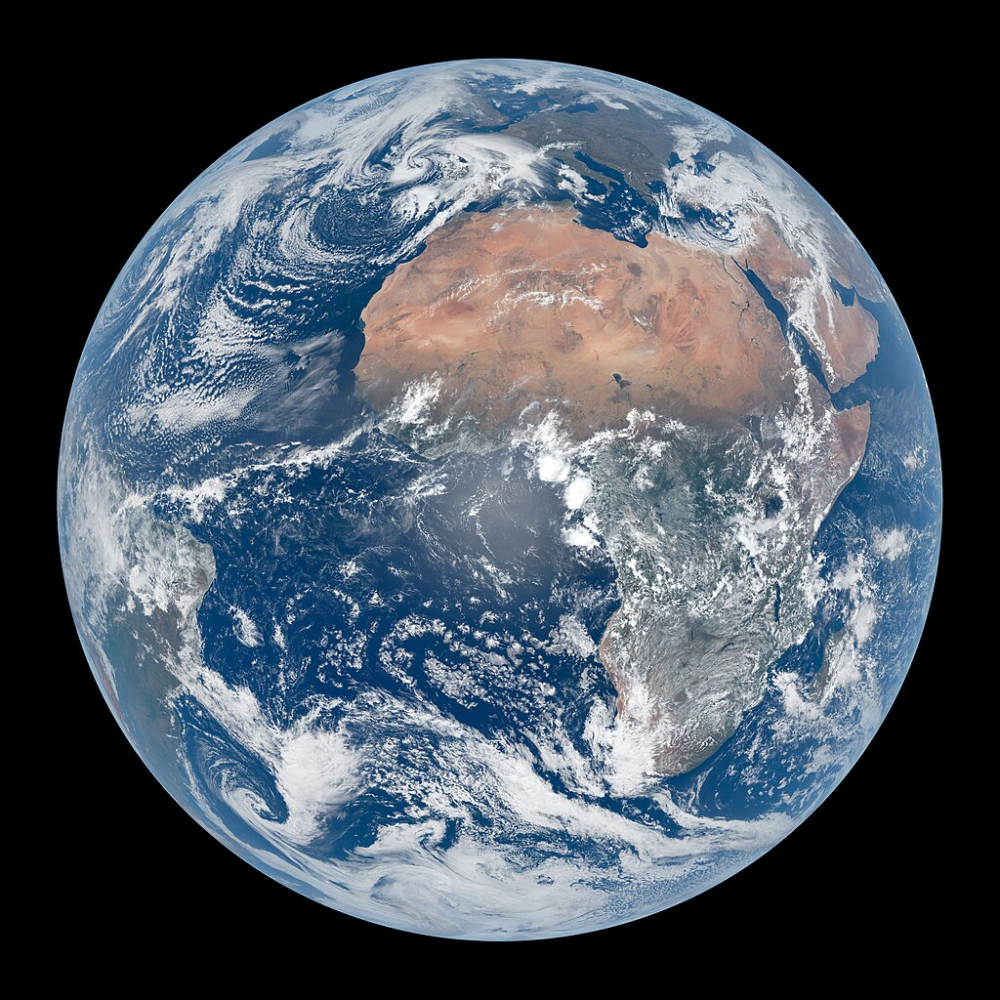

Earth as seen from [Meteosat-12](https://en.wikipedia.org/wiki/Meteosat_12 "Meteosat 12") in 2025, during the [March equinox](https://en.wikipedia.org/wiki/March_equinox "March equinox")

Designations

[Alternative names](https://en.wikipedia.org/wiki/Provisional_designation_in_astronomy "Provisional designation in astronomy")

*   The [world](https://en.wikipedia.org/wiki/World "World")
*   The [globe](https://en.wikipedia.org/wiki/Globe "Globe")
*   [Terra](https://en.wikipedia.org/wiki/Terra_\(mythology\) "Terra (mythology)")
*   [Tellus](https://en.wikipedia.org/wiki/Terra_\(mythology\) "Terra (mythology)")
*   [Gaia](https://en.wikipedia.org/wiki/Gaia "Gaia")

[Adjectives](https://en.wikipedia.org/wiki/List_of_adjectivals_and_demonyms_of_astronomical_bodies "List of adjectivals and demonyms of astronomical bodies")

*   Earthly
*   Terrestrial
*   Terran
*   Tellurian

[Symbol](https://en.wikipedia.org/wiki/Planet_symbols "Planet symbols")

 and 

[Orbital characteristics](https://en.wikipedia.org/wiki/Osculating_orbit "Osculating orbit")

[Epoch](https://en.wikipedia.org/wiki/Epoch_\(astronomy\) "Epoch (astronomy)") [J2000](https://en.wikipedia.org/wiki/J2000.0 "J2000.0")

[Aphelion](https://en.wikipedia.org/wiki/Perihelion_and_aphelion "Perihelion and aphelion")

152097597 km

[Perihelion](https://en.wikipedia.org/wiki/Perihelion_and_aphelion "Perihelion and aphelion")

147098450 km

[Semi-major axis](https://en.wikipedia.org/wiki/Semi-major_and_semi-minor_axes "Semi-major and semi-minor axes")

149598023 km

[Eccentricity](https://en.wikipedia.org/wiki/Orbital_eccentricity "Orbital eccentricity")

0.0167086

[Orbital period (sidereal)](https://en.wikipedia.org/wiki/Orbital_period "Orbital period")

365.256363004 d
(1.00001742096 [a](https://en.wikipedia.org/wiki/Annum "Annum")[j](https://en.wikipedia.org/wiki/Julian_year_\(astronomy\) "Julian year (astronomy)"))

Average [orbital speed](https://en.wikipedia.org/wiki/Orbital_speed "Orbital speed")

29.7827 km/s

[Mean anomaly](https://en.wikipedia.org/wiki/Mean_anomaly#Mean_anomaly_at_epoch "Mean anomaly")

358.617°

[Inclination](https://en.wikipedia.org/wiki/Orbital_inclination "Orbital inclination")

*   7.155° – [Sun](https://en.wikipedia.org/wiki/Sun "Sun")'s equator;
*   1.57869° – [invariable plane](https://en.wikipedia.org/wiki/Invariable_plane "Invariable plane");
*   0.00005° – J2000 [ecliptic](https://en.wikipedia.org/wiki/Ecliptic "Ecliptic")

[Longitude of ascending node](https://en.wikipedia.org/wiki/Longitude_of_the_ascending_node "Longitude of the ascending node")

−11.26064° – J2000 ecliptic

[Time of perihelion](https://en.wikipedia.org/wiki/Apsis "Apsis")

3 January 2026

[Argument of perihelion](https://en.wikipedia.org/wiki/Argument_of_periapsis "Argument of periapsis")

114.20783°

[Satellites](https://en.wikipedia.org/wiki/Natural_satellite "Natural satellite")

1, the [Moon](https://en.wikipedia.org/wiki/Moon "Moon")

Physical characteristics

[Mean radius](https://en.wikipedia.org/wiki/Mean_radius_\(astronomy\) "Mean radius (astronomy)")

6371.0 km

[Equatorial](https://en.wikipedia.org/wiki/Equator "Equator") radius

6378.137 km

[Polar](https://en.wikipedia.org/wiki/Geographical_pole "Geographical pole") radius

6356.752 km

[Flattening](https://en.wikipedia.org/wiki/Flattening "Flattening")

1/298.257222101 ([ETRS89](https://en.wikipedia.org/wiki/ETRS89 "ETRS89"))

Circumference

*   40075.017 km[equatorial](https://en.wikipedia.org/wiki/Equator "Equator")
*   40007.86 km[meridional](https://en.wikipedia.org/wiki/Meridian_\(geography\) "Meridian (geography)")

[Surface area](https://en.wikipedia.org/wiki/Spheroid#Area "Spheroid")

*   510072000 km2
*   Land: 148940000 km2
*   Water: 361132000 km2

[Volume](https://en.wikipedia.org/wiki/Volume "Volume")

1.08321×1012 km3

[Mass](https://en.wikipedia.org/wiki/Mass "Mass")

(5.97217±0.00028)×1024 kg

Mean [density](https://en.wikipedia.org/wiki/Density "Density")

5.513 g/cm3

[Surface gravity](https://en.wikipedia.org/wiki/Surface_gravity "Surface gravity")

9.80665 m/s2
(exactly 1 [g0](https://en.wikipedia.org/wiki/Standard_gravity "Standard gravity"))

[Moment of inertia factor](https://en.wikipedia.org/wiki/Moment_of_inertia_factor "Moment of inertia factor")

0.3307

[Escape velocity](https://en.wikipedia.org/wiki/Escape_velocity "Escape velocity")

11.186 km/s

[Synodic rotation period](https://en.wikipedia.org/wiki/Synodic_rotation_period "Synodic rotation period")

1.0 d
(24h 00 m 00s)

[Sidereal rotation period](https://en.wikipedia.org/wiki/Sidereal_rotation_period "Sidereal rotation period")

0.99726968 d
(23h 56 m 4.100s)

Equatorial rotation velocity

1674.\. km/h

[Axial tilt](https://en.wikipedia.org/wiki/Axial_tilt "Axial tilt")

23.4392811°

[Albedo](https://en.wikipedia.org/wiki/Albedo "Albedo")

*   0.43\. [geometric](https://en.wikipedia.org/wiki/Geometric_albedo "Geometric albedo")
*   0.29\. [Bond](https://en.wikipedia.org/wiki/Bond_albedo "Bond albedo")

[Temperature](https://en.wikipedia.org/wiki/Temperature "Temperature")

255 K (−18 °C)
([blackbody temperature](https://en.wikipedia.org/wiki/Effective_temperature "Effective temperature"))

Surface [temp.](https://en.wikipedia.org/wiki/Temperature "Temperature")minmeanmax

−89.2 °C

14.76 °C

56.7 °C

Surface [equivalent dose](https://en.wikipedia.org/wiki/Equivalent_dose "Equivalent dose") [rate](https://en.wikipedia.org/wiki/Dose_rate "Dose rate")

0.274 μSv/h

[Absolute magnitude _(H)_](https://en.wikipedia.org/wiki/Absolute_magnitude#Solar_System_bodies_\(H\) "Absolute magnitude")

−3.99

Atmosphere

Surface [pressure](https://en.wikipedia.org/wiki/Atmospheric_pressure "Atmospheric pressure")

101.325 [kPa](https://en.wikipedia.org/wiki/Pascal_\(unit\) "Pascal (unit)") (at sea level)

[Composition by volume](https://en.wikipedia.org/wiki/Atmospheric_chemistry#Atmospheric_composition "Atmospheric chemistry")

*   78.08% [nitrogen](https://en.wikipedia.org/wiki/Nitrogen "Nitrogen") (dry air)
*   20.95% [oxygen](https://en.wikipedia.org/wiki/Oxygen "Oxygen") (dry air)
*   ≤1% [water vapor](https://en.wikipedia.org/wiki/Water_vapor "Water vapor") (variable)
*   0.9340% [argon](https://en.wikipedia.org/wiki/Argon "Argon")
*   0.0430% [carbon dioxide](https://en.wikipedia.org/wiki/Carbon_dioxide "Carbon dioxide")
*   0.00182% [neon](https://en.wikipedia.org/wiki/Neon "Neon")
*   0.00052% [helium](https://en.wikipedia.org/wiki/Helium "Helium")
*   0.00017% [methane](https://en.wikipedia.org/wiki/Methane "Methane")
*   0.00011% [krypton](https://en.wikipedia.org/wiki/Krypton "Krypton")
*   0.00006% [hydrogen](https://en.wikipedia.org/wiki/Hydrogen "Hydrogen")

Source:

**Earth** is the third [planet](https://en.wikipedia.org/wiki/Planet "Planet") from the [Sun](https://en.wikipedia.org/wiki/Sun "Sun") and the only [astronomical object](https://en.wikipedia.org/wiki/Astronomical_object "Astronomical object") known to [harbor life](https://en.wikipedia.org/wiki/Planetary_habitability "Planetary habitability"). This is made possible by Earth having a stable atmosphere, as well as being an [ocean world](https://en.wikipedia.org/wiki/Ocean_world "Ocean world"), the only one in the [Solar System](https://en.wikipedia.org/wiki/Solar_System "Solar System") sustaining [liquid](https://en.wikipedia.org/wiki/Liquid "Liquid") [surface water](https://en.wikipedia.org/wiki/Surface_water "Surface water"). Almost all of Earth's water is contained in its global ocean, covering [70.8%](https://en.wikipedia.org/wiki/Water_distribution_on_Earth "Water distribution on Earth") of [Earth's crust](/source/earths-crust/ "Earth's crust"). The remaining 29.2% of Earth's crust is land, most of which is located in the form of [continental](https://en.wikipedia.org/wiki/Continent "Continent") [landmasses](https://en.wikipedia.org/wiki/Landmass "Landmass") within Earth's [land hemisphere](https://en.wikipedia.org/wiki/Land_hemisphere "Land hemisphere"). Most of Earth's land is at least somewhat [humid](https://en.wikipedia.org/wiki/Humid "Humid") and covered by vegetation, while large [ice sheets](https://en.wikipedia.org/wiki/Ice_sheet "Ice sheet") at Earth's [polar deserts](https://en.wikipedia.org/wiki/Polar_desert "Polar desert") retain more water than Earth's [groundwater](https://en.wikipedia.org/wiki/Groundwater "Groundwater"), lakes, rivers, and [atmospheric water](https://en.wikipedia.org/wiki/Water_vapor#In_Earth's_atmosphere "Water vapor") combined. Earth's crust consists of slowly moving [tectonic plates](https://en.wikipedia.org/wiki/Tectonic_plates "Tectonic plates"), which interact to produce mountain ranges, [volcanoes](https://en.wikipedia.org/wiki/Volcano "Volcano"), and earthquakes. [Earth has a liquid outer core](/source/earths-outer-core/ "Earth's outer core") that generates a [magnetosphere](https://en.wikipedia.org/wiki/Magnetosphere "Magnetosphere") capable of deflecting most of the destructive [solar winds](https://en.wikipedia.org/wiki/Solar_wind "Solar wind") and [cosmic radiation](https://en.wikipedia.org/wiki/Cosmic_radiation "Cosmic radiation").

Earth has [a dynamic atmosphere](https://en.wikipedia.org/wiki/Atmosphere_of_Earth "Atmosphere of Earth"), which sustains Earth's surface conditions and protects it from most [meteoroids](https://en.wikipedia.org/wiki/Meteoroid "Meteoroid") and [UV-light at entry](https://en.wikipedia.org/wiki/Ozone_layer "Ozone layer"). It is composed primarily of [nitrogen](https://en.wikipedia.org/wiki/Nitrogen "Nitrogen") and [oxygen](https://en.wikipedia.org/wiki/Oxygen "Oxygen"). [Water vapor](https://en.wikipedia.org/wiki/Water_vapor "Water vapor") is widely present in the atmosphere, [forming clouds](https://en.wikipedia.org/wiki/Cloud#Formation "Cloud") that cover most of the planet. The water vapor acts as a [greenhouse gas](https://en.wikipedia.org/wiki/Greenhouse_gas "Greenhouse gas") and, together with other greenhouse gases in the atmosphere, particularly [carbon dioxide](https://en.wikipedia.org/wiki/Carbon_dioxide "Carbon dioxide") (CO2), creates the conditions for both liquid surface water and water vapor to persist via the capturing of [energy from the Sun's light](https://en.wikipedia.org/wiki/Solar_irradiance "Solar irradiance"). This process maintains the current average surface temperature of 14.76 °C (58.57 °F), at which water is liquid under normal [atmospheric pressure](https://en.wikipedia.org/wiki/Atmospheric_pressure "Atmospheric pressure"). Differences in the amount of captured energy between geographic regions (as with the [equatorial region](https://en.wikipedia.org/wiki/Equatorial_region "Equatorial region") receiving more sunlight than the polar regions) drive [atmospheric](https://en.wikipedia.org/wiki/Atmospheric_circulation "Atmospheric circulation") and [ocean currents](https://en.wikipedia.org/wiki/Ocean_current "Ocean current"), producing a global [climate system](https://en.wikipedia.org/wiki/Climate_system "Climate system") with different [climate regions](https://en.wikipedia.org/wiki/Climate_region "Climate region"), and a range of weather phenomena such as [precipitation](https://en.wikipedia.org/wiki/Precipitation "Precipitation"), allowing components such as [carbon](https://en.wikipedia.org/wiki/Carbon_cycle "Carbon cycle") and [nitrogen](https://en.wikipedia.org/wiki/Nitrogen_cycle "Nitrogen cycle") to [cycle](https://en.wikipedia.org/wiki/Biogeochemical_cycle "Biogeochemical cycle").

Earth is [rounded](https://en.wikipedia.org/wiki/Hydrostatic_equilibrium "Hydrostatic equilibrium") into [an ellipsoid](https://en.wikipedia.org/wiki/Earth_ellipsoid "Earth ellipsoid") with [a circumference](https://en.wikipedia.org/wiki/Earth's_circumference "Earth's circumference") of about 40,000 kilometers (24,900 miles). It is the [densest planet in the Solar System](https://en.wikipedia.org/wiki/List_of_Solar_System_objects_by_size "List of Solar System objects by size"). Of the four [rocky planets](https://en.wikipedia.org/wiki/Rocky_planets "Rocky planets"), it is the largest and most massive. Earth is about eight [light-minutes](https://en.wikipedia.org/wiki/Light-minute "Light-minute") (1 [AU](https://en.wikipedia.org/wiki/Astronomical_Unit "Astronomical Unit")) away from the Sun and [orbits it](https://en.wikipedia.org/wiki/Earth's_orbit "Earth's orbit"), taking a year (about 365.25 days) to complete one revolution. [Earth rotates](https://en.wikipedia.org/wiki/Earth's_rotation "Earth's rotation") around its own axis in slightly less than a day (in about 23 hours and 56 minutes). [Earth's axis of rotation](/source/earth/#Axial_tilt_and_seasons) is tilted with respect to the perpendicular to its orbital plane around the Sun, producing seasons. Earth is [orbited](https://en.wikipedia.org/wiki/Orbit "Orbit") by one permanent [natural satellite](https://en.wikipedia.org/wiki/Natural_satellite "Natural satellite"), the [Moon](https://en.wikipedia.org/wiki/Moon "Moon"), which orbits Earth at 384,400 km (238,855 mi)—1.28 light seconds—and is roughly a quarter as wide as Earth. The Moon's gravity helps stabilize Earth's axis, causes [tides](https://en.wikipedia.org/wiki/Tide "Tide") and [gradually slows Earth's rotation](https://en.wikipedia.org/wiki/Tidal_acceleration "Tidal acceleration"). Likewise, Earth's gravitational pull has already made the Moon's rotation [tidally locked](https://en.wikipedia.org/wiki/Tidally_locked "Tidally locked"), keeping the same [near side](https://en.wikipedia.org/wiki/Near_side_of_the_Moon "Near side of the Moon") facing Earth.

Earth, like most other bodies in the Solar System, [formed about 4.5 billion years ago](https://en.wikipedia.org/wiki/Age_of_Earth "Age of Earth") from gas and dust in the [early Solar System](https://en.wikipedia.org/wiki/Formation_and_evolution_of_the_Solar_System "Formation and evolution of the Solar System"). The formation of the ocean and the subsequent [development of life](https://en.wikipedia.org/wiki/Abiogenesis "Abiogenesis") occurred during the first billion years of [Earth's history](https://en.wikipedia.org/wiki/Earth's_history "Earth's history"). Life spread globally and has been altering Earth's atmosphere and surface, leading to the [Great Oxidation Event](https://en.wikipedia.org/wiki/Great_Oxidation_Event "Great Oxidation Event") two billion years ago. [Humans](https://en.wikipedia.org/wiki/Human "Human") emerged 300,000 years ago in Africa and have spread across every continent on Earth. Humans depend on Earth's [biosphere](https://en.wikipedia.org/wiki/Biosphere "Biosphere") and natural resources for their survival, but have [increasingly impacted the planet's environment](https://en.wikipedia.org/wiki/Human_impact_on_the_environment "Human impact on the environment"). Humanity's current impact on Earth's climate and biosphere is unsustainable, threatening the livelihood of humans and many other forms of life, and [causing widespread extinctions](https://en.wikipedia.org/wiki/Holocene_extinction "Holocene extinction").

## Etymology

The [Modern English](https://en.wikipedia.org/wiki/Modern_English "Modern English") word _Earth_ developed, via [Middle English](https://en.wikipedia.org/wiki/Middle_English "Middle English"), from an [Old English](https://en.wikipedia.org/wiki/Old_English "Old English") noun most often spelled _[eorðe](https://en.wiktionary.org/wiki/eorðe#Old_English "wikt:eorðe")_. It has cognates in every [Germanic language](https://en.wikipedia.org/wiki/Germanic_language "Germanic language"), from which [Proto-Germanic](https://en.wikipedia.org/wiki/Proto-Germanic "Proto-Germanic") \*_erþō_ has been reconstructed. In its earliest attestation, the word __eorðe__ was used to translate the many senses of Latin _[terra](https://en.wiktionary.org/wiki/terra#Latin "wikt:terra")_ and Greek _[gē](https://en.wiktionary.org/wiki/γῆ#Ancient_Greek "wikt:γῆ")_: the ground, its soil, dry land, the human world, the surface of the world (including the sea), and the globe itself. As with [Roman](https://en.wikipedia.org/wiki/Roman_Empire "Roman Empire") [Terra](https://en.wikipedia.org/wiki/Terra_\(goddess\) "Terra (goddess)") (or Tellus) and [Greek](https://en.wikipedia.org/wiki/Greeks "Greeks") [Gaia](https://en.wikipedia.org/wiki/Gaia "Gaia"), Earth may have been a [personified goddess](https://en.wikipedia.org/wiki/Earth_goddess "Earth goddess") in [Germanic paganism](https://en.wikipedia.org/wiki/Germanic_paganism "Germanic paganism"): late [Norse mythology](https://en.wikipedia.org/wiki/Norse_mythology "Norse mythology") included [Jörð](https://en.wikipedia.org/wiki/Jörð "Jörð") ('Earth'), a giantess often given as the mother of [Thor](https://en.wikipedia.org/wiki/Thor "Thor").

Historically, _Earth_ has been written in lowercase. During the [Early Middle English](https://en.wikipedia.org/wiki/Early_Middle_English "Early Middle English") period, its [definite sense](https://en.wikipedia.org/wiki/Definite_article "Definite article") as "the globe" began being expressed using the phrase _the earth_. By the period of [Early Modern English](https://en.wikipedia.org/wiki/Early_Modern_English "Early Modern English"), [capitalization of nouns began to prevail](https://en.wikipedia.org/wiki/Capitalization_in_English#History_of_English_capitalization "Capitalization in English"), and _the earth_ was also written _the Earth_, particularly when referenced along with other heavenly bodies. More recently, the name is sometimes simply given as _Earth_, by analogy with the names of the [other planets](https://en.wikipedia.org/wiki/Solar_System "Solar System"), though _earth_ and forms with _the earth_ remain common. [House styles](https://en.wikipedia.org/wiki/Style_guide "Style guide") now vary: [Oxford spelling](https://en.wikipedia.org/wiki/Oxford_spelling "Oxford spelling") recognizes the lowercase form as the more common, with the capitalized form an acceptable variant. Another convention capitalizes _Earth_ when appearing as a name, such as a description of the "Earth's atmosphere", but employs the lowercase when it is preceded by _the_, such as "the atmosphere of the earth". It almost always appears in lowercase in colloquial expressions such as "what on earth are you doing?"

The name _Terra_ [/ˈtɛrə/](https://en.wikipedia.org/wiki/Help:IPA/English "Help:IPA/English") [_TERR-ə_](https://en.wikipedia.org/wiki/Help:Pronunciation_respelling_key "Help:Pronunciation respelling key") is occasionally used in scientific writing; it also sees use in science fiction to distinguish humanity's inhabited planet from others, while in poetry _Tellus_ [/ˈtɛləs/](https://en.wikipedia.org/wiki/Help:IPA/English "Help:IPA/English") [_TELL-əs_](https://en.wikipedia.org/wiki/Help:Pronunciation_respelling_key "Help:Pronunciation respelling key") has been used to denote personification of the Earth. _Terra_ is also the name of the planet in some [Romance languages](https://en.wikipedia.org/wiki/Romance_languages "Romance languages"), languages that evolved from Latin, like Italian and Portuguese, while in other Romance languages the word gave rise to names with slightly altered spellings, like the Spanish _Tierra_ and the French _Terre_. The Latinate form _Gaea_ (English: [/ˈdʒiː.ə/](https://en.wikipedia.org/wiki/Help:IPA/English "Help:IPA/English") [_DJEE-ə_](https://en.wikipedia.org/wiki/Help:Pronunciation_respelling_key "Help:Pronunciation respelling key")) of the Greek poetic name _[Gaia](https://en.wikipedia.org/wiki/Gaia "Gaia")_ ([\[ɡâi̯.a\]](https://en.wikipedia.org/wiki/Help:IPA/Greek "Help:IPA/Greek") or [\[ɡâj.ja\]](https://en.wikipedia.org/wiki/Help:IPA/Greek "Help:IPA/Greek")) is rare, though the alternative spelling _Gaia_ has become common due to the [Gaia hypothesis](https://en.wikipedia.org/wiki/Gaia_hypothesis "Gaia hypothesis"), in which case its pronunciation is [/ˈɡaɪ.ə/](https://en.wikipedia.org/wiki/Help:IPA/English "Help:IPA/English") [_GYE-ə_](https://en.wikipedia.org/wiki/Help:Pronunciation_respelling_key "Help:Pronunciation respelling key") rather than the more traditional English [/ˈɡeɪ.ə/](https://en.wikipedia.org/wiki/Help:IPA/English "Help:IPA/English") [_GAY-ə_](https://en.wikipedia.org/wiki/Help:Pronunciation_respelling_key "Help:Pronunciation respelling key").

There are a number of adjectives for the planet Earth. The word _earthly_ is derived from _Earth_. From the Latin _Terra_ comes _terran_ [/ˈtɛrən/](https://en.wikipedia.org/wiki/Help:IPA/English "Help:IPA/English") [_TERR-ən_](https://en.wikipedia.org/wiki/Help:Pronunciation_respelling_key "Help:Pronunciation respelling key"), _terrestrial_ [/təˈrɛstriəl/](https://en.wikipedia.org/wiki/Help:IPA/English "Help:IPA/English") [_tərr-EHST-ree-əl_](https://en.wikipedia.org/wiki/Help:Pronunciation_respelling_key "Help:Pronunciation respelling key"), and (via French) _terrene_ [/təˈriːn/](https://en.wikipedia.org/wiki/Help:IPA/English "Help:IPA/English") [_tə-REEN_](https://en.wikipedia.org/wiki/Help:Pronunciation_respelling_key "Help:Pronunciation respelling key"), and from the Latin _Tellus_ comes _tellurian_ [/tɛˈlʊəriən/](https://en.wikipedia.org/wiki/Help:IPA/English "Help:IPA/English") [_teh-LUURR-ee-ən_](https://en.wikipedia.org/wiki/Help:Pronunciation_respelling_key "Help:Pronunciation respelling key") and _telluric_.

## Natural history

### Formation

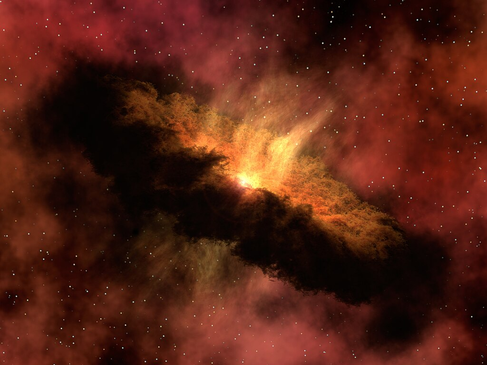A depiction of the early [Solar System](https://en.wikipedia.org/wiki/Solar_System "Solar System")'s [protoplanetary disk](https://en.wikipedia.org/wiki/Protoplanetary_disk "Protoplanetary disk") from which Earth and other Solar System bodies were formed

The oldest material found in the [Solar System](https://en.wikipedia.org/wiki/Solar_System "Solar System") is dated to 4.5682+0.0002
−0.0004 [Ga](https://en.wikipedia.org/wiki/Gigaannum "Gigaannum") (billion years) ago. By 4.54±0.04 Ga the primordial Earth had formed. The bodies in [the Solar System formed and evolved](https://en.wikipedia.org/wiki/Formation_and_evolution_of_the_Solar_System "Formation and evolution of the Solar System") with the Sun. In theory, a [solar nebula](https://en.wikipedia.org/wiki/Solar_nebula "Solar nebula") partitions a volume out of a [molecular cloud](https://en.wikipedia.org/wiki/Molecular_cloud "Molecular cloud") by gravitational collapse, which begins to spin and flatten into a [circumstellar disk](https://en.wikipedia.org/wiki/Circumstellar_disk "Circumstellar disk"), and then the planets grow out of that disk with the Sun. A nebula contains gas, ice grains, and [dust](https://en.wikipedia.org/wiki/Cosmic_dust "Cosmic dust") (including [primordial nuclides](https://en.wikipedia.org/wiki/Primordial_nuclide "Primordial nuclide")). According to [nebular theory](https://en.wikipedia.org/wiki/Nebular_theory "Nebular theory"), [planetesimals](https://en.wikipedia.org/wiki/Planetesimal "Planetesimal") formed by [accretion](https://en.wikipedia.org/wiki/Accretion_\(astrophysics\) "Accretion (astrophysics)"), with the primordial Earth being estimated as likely taking anywhere from 70 to 100 million years to form.

Estimates of the age of the Moon range from 4.5 Ga to significantly younger. A [leading hypothesis](https://en.wikipedia.org/wiki/Giant_impact_hypothesis "Giant impact hypothesis") is that it was formed by accretion from material loosed from Earth after a [Mars](https://en.wikipedia.org/wiki/Mars "Mars")-sized object with about 10% of Earth's mass, named [Theia](https://en.wikipedia.org/wiki/Theia_\(hypothetical_planet\) "Theia (hypothetical planet)"), collided with Earth. It hit Earth with a glancing blow and some of its mass merged with Earth. Between approximately 4.0 and 3.8 Ga, numerous [asteroid impacts](https://en.wikipedia.org/wiki/Impact_event "Impact event") during the [Late Heavy Bombardment](https://en.wikipedia.org/wiki/Late_Heavy_Bombardment "Late Heavy Bombardment") caused significant changes to the greater surface environment of the Moon and, by inference, to that of Earth.

### After formation

[Earth's atmosphere](https://en.wikipedia.org/wiki/Atmosphere_of_Earth "Atmosphere of Earth") and oceans were formed by [volcanic activity](https://en.wikipedia.org/wiki/Volcanism "Volcanism") and [outgassing](https://en.wikipedia.org/wiki/Outgassing "Outgassing"). Water vapor from these sources [condensed](https://en.wikipedia.org/wiki/Origin_of_water_on_Earth "Origin of water on Earth") into the oceans, augmented by water and ice from asteroids, [protoplanets](https://en.wikipedia.org/wiki/Protoplanet "Protoplanet"), and [comets](https://en.wikipedia.org/wiki/Comet "Comet"). Sufficient water to fill the oceans may have been on Earth since it formed. In this model, atmospheric [greenhouse gases](https://en.wikipedia.org/wiki/Greenhouse_gas "Greenhouse gas") kept the oceans from freezing when the newly forming Sun [had only 70%](https://en.wikipedia.org/wiki/Faint_young_Sun_paradox "Faint young Sun paradox") of its [current luminosity](https://en.wikipedia.org/wiki/Solar_luminosity "Solar luminosity"). By 3.5 Ga, [Earth's magnetic field](https://en.wikipedia.org/wiki/Earth's_magnetic_field "Earth's magnetic field") was established, which helped prevent the atmosphere from being stripped away by the [solar wind](https://en.wikipedia.org/wiki/Solar_wind "Solar wind").

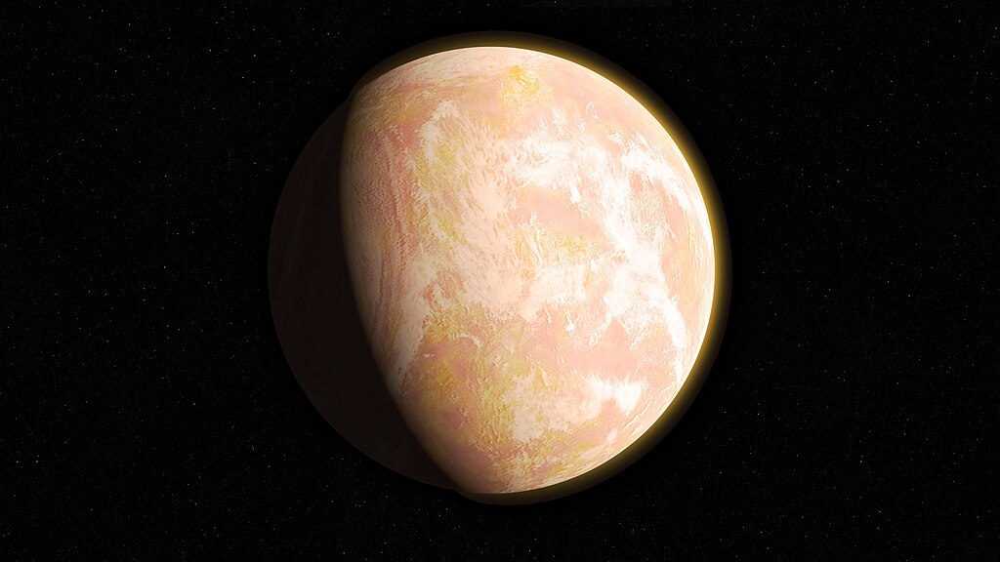_Pale orange dot_, an impression of [Early Earth](https://en.wikipedia.org/wiki/Early_Earth "Early Earth"), featuring its tinted orange [methane](https://en.wikipedia.org/wiki/Methane "Methane")-rich [early atmosphere](https://en.wikipedia.org/wiki/Prebiotic_atmosphere "Prebiotic atmosphere")

As the molten outer layer of Earth cooled it [formed](https://en.wikipedia.org/wiki/Phase_transition "Phase transition") the first solid [crust](/source/earths-crust/ "Earth's crust"), which is thought to have been [mafic](https://en.wikipedia.org/wiki/Mafic "Mafic") in composition. The first [continental crust](https://en.wikipedia.org/wiki/Continental_crust "Continental crust"), which was more [felsic](https://en.wikipedia.org/wiki/Felsic "Felsic") in composition, formed by the partial melting of this mafic crust. [Hadean-aged zircon](https://en.wikipedia.org/wiki/Hadean_zircon "Hadean zircon") grains found in [Western Australia](https://en.wikipedia.org/wiki/Western_Australia "Western Australia"), dating back as far as 4.4 Ga, provide the oldest direct evidence of Earth's surface, indicating that felsic continental crust and liquid water existed within 140–160 million years of the planet's formation. There are two main models of how this initial small volume of continental crust evolved to reach its current abundance: (1) a relatively steady growth up to the present day, which is supported by the radiometric dating of continental crust globally and (2) an initial rapid growth in the volume of continental crust during the [Archean](https://en.wikipedia.org/wiki/Archean "Archean"), forming the bulk of the continental crust that now exists, which is supported by isotopic evidence from [hafnium](https://en.wikipedia.org/wiki/Hafnium "Hafnium") in [zircons](https://en.wikipedia.org/wiki/Zircon "Zircon") and [neodymium](https://en.wikipedia.org/wiki/Neodymium "Neodymium") in sedimentary rocks. The two models and the data that support them can be reconciled by large-scale [recycling of the continental crust](https://en.wikipedia.org/wiki/Crustal_recycling "Crustal recycling"), particularly during the early stages of Earth's history.

New continental crust forms as a result of [plate tectonics](https://en.wikipedia.org/wiki/Plate_tectonics "Plate tectonics"), a process ultimately driven by the continuous loss of heat from Earth's interior. Over [the period](https://en.wikipedia.org/wiki/Geologic_time_scale "Geologic time scale") of hundreds of millions of years, tectonic forces have caused areas of continental crust to group together to form [supercontinents](https://en.wikipedia.org/wiki/Supercontinent "Supercontinent") that have subsequently broken apart. At approximately 750 [Ma](https://en.wikipedia.org/wiki/Megaannum "Megaannum"), one of the earliest known supercontinents, [Rodinia](https://en.wikipedia.org/wiki/Rodinia "Rodinia"), began to break apart. The continents later recombined to form [Pannotia](https://en.wikipedia.org/wiki/Pannotia "Pannotia") at 600–540 Ma, then finally [Pangaea](https://en.wikipedia.org/wiki/Pangaea "Pangaea"), which also began to break apart at 180 Ma.

The most recent pattern of [ice ages](https://en.wikipedia.org/wiki/Ice_age "Ice age") began about 40 Ma, and then intensified during the [Pleistocene](https://en.wikipedia.org/wiki/Pleistocene "Pleistocene") about 3 Ma. [High-](https://en.wikipedia.org/wiki/High_latitude "High latitude") and [middle-latitude](https://en.wikipedia.org/wiki/Middle_latitude "Middle latitude") regions have since undergone repeated cycles of glaciation and thaw, repeating about every 21,000, 41,000, and 100,000 years. The [Last Glacial Period](https://en.wikipedia.org/wiki/Last_Glacial_Period "Last Glacial Period"), colloquially called the "last ice age", covered large parts of the continents, to the middle latitudes, in ice and ended about 11,700 years ago.

### Future

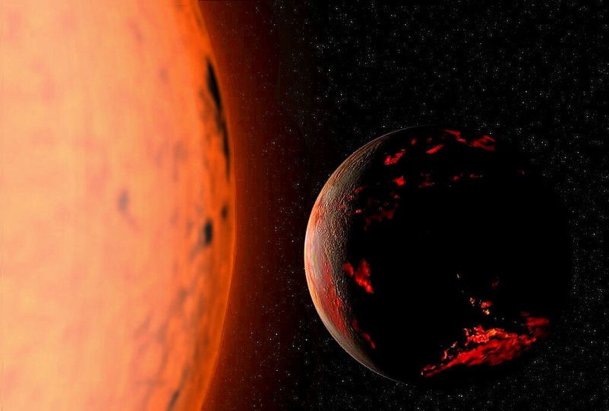A conception of the scorched Earth after the [Sun](https://en.wikipedia.org/wiki/Sun "Sun") has entered the [red giant](https://en.wikipedia.org/wiki/Red_giant "Red giant") phase, about 5–7 billion years in the future

Earth's expected long-term future is tied to that of the Sun. Over the next 1.1 billion years, solar luminosity will increase by 10%, and over the next 3.5 billion years by 40%. Earth's increasing surface temperature will accelerate the [inorganic carbon cycle](https://en.wikipedia.org/wiki/Carbonate–silicate_cycle "Carbonate–silicate cycle"), possibly reducing CO2 concentration to levels lethally low for current plants (10 [ppm](https://en.wikipedia.org/wiki/Parts_per_million "Parts per million") for [C4 photosynthesis](https://en.wikipedia.org/wiki/C4_carbon_fixation "C4 carbon fixation")) in approximately 100–900 million years. A lack of vegetation would result in the loss of oxygen in the atmosphere, making current animal life impossible. Due to the increased luminosity, Earth's mean temperature may reach 100 °C (212 °F) in 1.5 billion years, and all ocean water will evaporate and be lost to space, which may trigger a [runaway greenhouse effect](https://en.wikipedia.org/wiki/Runaway_greenhouse_effect "Runaway greenhouse effect"), within an estimated 1.6 to 3 billion years. Even if the Sun were stable and eternal, a significant fraction of the water in the modern oceans would descend into the [mantle](/source/mantle/ "Mantle (geology)"), due to reduced steam venting from mid-ocean ridges as the core of the Earth slowly cools.

The Sun will [evolve](https://en.wikipedia.org/wiki/Stellar_evolution "Stellar evolution") to become a [red giant](https://en.wikipedia.org/wiki/Red_giant "Red giant") in about 5 billion years. Models predict that the Sun will expand to roughly 1 [AU](https://en.wikipedia.org/wiki/Astronomical_unit "Astronomical unit") (150 million km; 93 million mi), about 250 times its present radius. Earth's fate is less clear. As a red giant, the Sun will lose roughly 30% of its mass, so, without tidal effects, Earth will move to an orbit 1.7 AU (250 million km; 160 million mi) from the Sun when the star reaches its maximum radius, otherwise, with tidal effects, it may enter the Sun's atmosphere and be vaporized, with the heavier elements sinking to the core of the dying sun.

## Bulk properties

### Size and shape

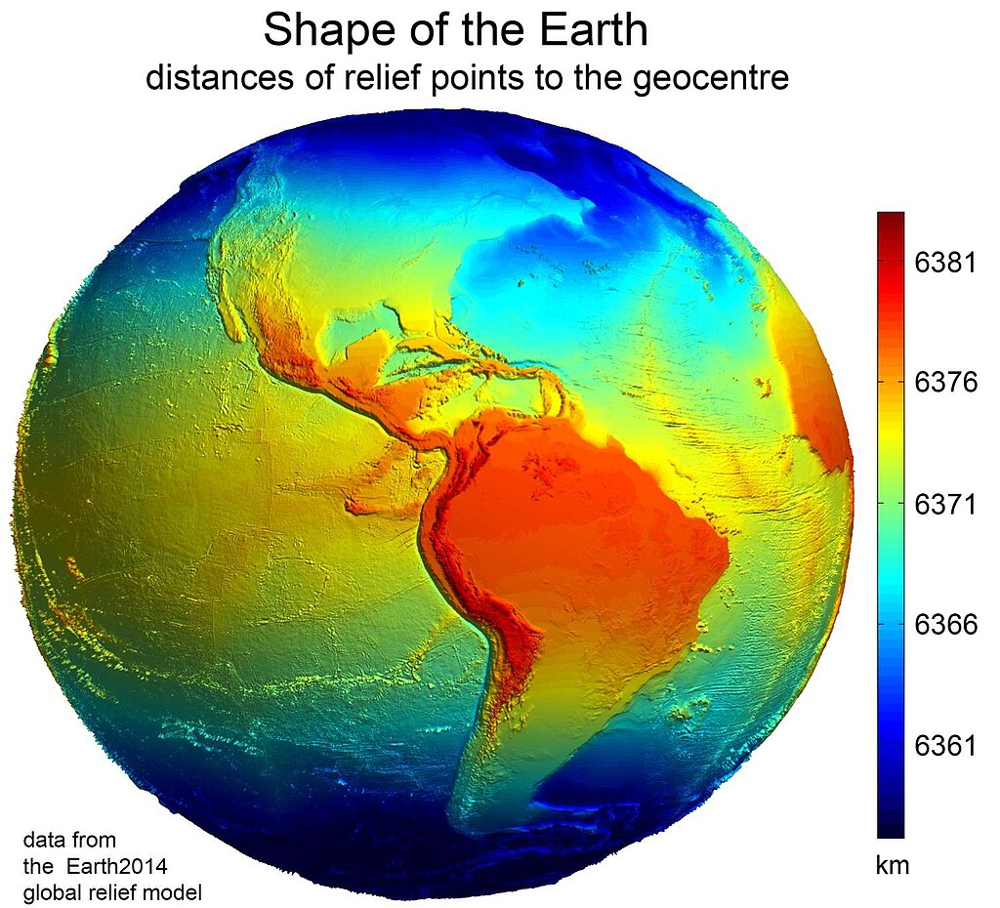Earth's [Western Hemisphere](https://en.wikipedia.org/wiki/Western_Hemisphere "Western Hemisphere") showing topography relative to Earth's center instead of to [mean sea level](https://en.wikipedia.org/wiki/Mean_sea_level "Mean sea level"), as in common topographic maps

[Earth has a rounded shape](https://en.wikipedia.org/wiki/Figure_of_the_Earth "Figure of the Earth"), through [hydrostatic equilibrium](https://en.wikipedia.org/wiki/Hydrostatic_equilibrium "Hydrostatic equilibrium"), with an average diameter of 12,742 kilometers (7,918 mi), making it the [fifth largest](https://en.wikipedia.org/wiki/List_of_Solar_System_objects_by_size "List of Solar System objects by size") [planetary sized](https://en.wikipedia.org/wiki/Planet#Planetary-mass_object "Planet") and largest [terrestrial object](https://en.wikipedia.org/wiki/Terrestrial_planet "Terrestrial planet") of the [Solar System](https://en.wikipedia.org/wiki/Solar_System "Solar System").

Due to [Earth's rotation](https://en.wikipedia.org/wiki/Earth's_rotation "Earth's rotation") it has the shape of an [ellipsoid](https://en.wikipedia.org/wiki/Earth_ellipsoid "Earth ellipsoid"), [bulging at its equator](https://en.wikipedia.org/wiki/Equatorial_bulge "Equatorial bulge"); its diameter is 43 kilometers (27 mi) longer there than at its [poles](https://en.wikipedia.org/wiki/Geographical_pole "Geographical pole"). Earth's shape also has local [topographic](https://en.wikipedia.org/wiki/Topography "Topography") variations; the largest local variations, like the [Mariana Trench](https://en.wikipedia.org/wiki/Mariana_Trench "Mariana Trench") (10,925 meters or 35,843 feet below local sea level), shortens Earth's average radius by 0.17% and [Mount Everest](https://en.wikipedia.org/wiki/Mount_Everest "Mount Everest") (8,848 meters or 29,029 feet above local sea level) lengthens it by 0.14%. Since Earth's surface is farthest out from its [center of mass](https://en.wikipedia.org/wiki/Center_of_mass "Center of mass") at its equatorial bulge, the summit of the volcano [Chimborazo](https://en.wikipedia.org/wiki/Chimborazo "Chimborazo") in Ecuador (6,384.4 km or 3,967.1 mi) is its farthest point out. Parallel to the rigid land topography [the ocean exhibits a more dynamic topography](https://en.wikipedia.org/wiki/Ocean_surface_topography "Ocean surface topography").

To measure the local variation of Earth's topography, [geodesy](https://en.wikipedia.org/wiki/Geodesy "Geodesy") employs an idealized Earth producing a [geoid](https://en.wikipedia.org/wiki/Geoid "Geoid") shape. Such a shape is gained if the ocean is idealized, covering Earth completely and without any perturbations such as tides and winds. The result is a smooth but irregular geoid surface, providing a mean sea level as a reference level for topographic measurements.

### Internal structure

Geologic layers of Earth

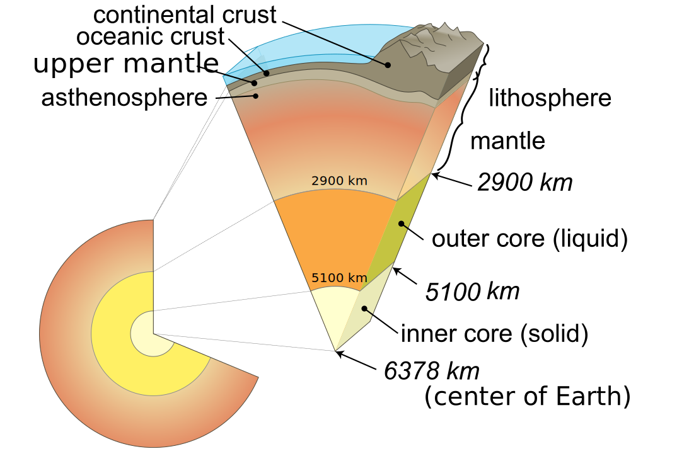Illustration of Earth's cutaway, not to scale

Depth
(km)Component
layer nameDensity
(g/cm3)

0–60

[Lithosphere](https://en.wikipedia.org/wiki/Earth's_lithosphere "Earth's lithosphere")

—

0–35

[Crust](/source/earths-crust/ "Earth's crust")

2.2–2.9

35–660

[Upper mantle](https://en.wikipedia.org/wiki/Upper_mantle_\(Earth\) "Upper mantle (Earth)")

3.4–4.4

660–2,890

[Lower mantle](https://en.wikipedia.org/wiki/Lower_mantle_\(Earth\) "Lower mantle (Earth)")

3.4–5.6

100–700

[Asthenosphere](https://en.wikipedia.org/wiki/Asthenosphere "Asthenosphere")

—

2,890–5,100

[Outer core](/source/earths-outer-core/ "Earth's outer core")

9.9–12.2

5,100–6,378

[Inner core](/source/earths-inner-core/ "Earth's inner core")

12.8–13.1

Earth's interior, like that of the other terrestrial planets, is divided into layers by their [chemical](https://en.wikipedia.org/wiki/Chemical "Chemical") or physical ([rheological](https://en.wikipedia.org/wiki/Rheology "Rheology")) properties. The outer layer is a chemically distinct [silicate](https://en.wikipedia.org/wiki/Silicate_minerals "Silicate minerals") solid crust, which is underlain by a highly [viscous](https://en.wikipedia.org/wiki/Viscous "Viscous") solid mantle. The crust is separated from the mantle by the [Mohorovičić discontinuity](https://en.wikipedia.org/wiki/Mohorovičić_discontinuity "Mohorovičić discontinuity"). The thickness of the crust varies from about 6 kilometers (3.7 mi) under the oceans to 30–50 km (19–31 mi) for the continents. The crust and the cold, rigid, top of the [upper mantle](https://en.wikipedia.org/wiki/Upper_mantle "Upper mantle") are collectively known as the lithosphere, which is divided into independently moving tectonic plates.

Beneath the lithosphere is the [asthenosphere](https://en.wikipedia.org/wiki/Asthenosphere "Asthenosphere"), a relatively low-viscosity layer on which the lithosphere rides. Important changes in crystal structure within the mantle occur at 410 and 660 km (250 and 410 mi) below the surface, spanning a [transition zone](https://en.wikipedia.org/wiki/Transition_zone_\(Earth\) "Transition zone (Earth)") that separates the upper and lower mantle. Beneath the mantle, an extremely low viscosity liquid [outer core](https://en.wikipedia.org/wiki/Outer_core "Outer core") lies above a solid [inner core](/source/earths-inner-core/ "Earth's inner core"). Earth's inner core may be rotating at a slightly higher [angular velocity](https://en.wikipedia.org/wiki/Angular_velocity "Angular velocity") than the remainder of the planet, advancing by 0.1–0.5° per year, although both somewhat higher and much lower rates have also been proposed. The radius of the inner core is about one-fifth of that of Earth. The density increases with depth. Among the Solar System's planetary-sized objects, Earth is the [object with the highest density](https://en.wikipedia.org/wiki/List_of_Solar_System_objects_by_size "List of Solar System objects by size").

### Chemical composition

[Earth's mass](https://en.wikipedia.org/wiki/Earth_mass "Earth mass") is approximately 5.97×1024 [kg](https://en.wikipedia.org/wiki/Kilogram "Kilogram") (5.97 [Rg](https://en.wikipedia.org/wiki/Ronnagram "Ronnagram")). It is composed mostly of iron (32.1% [by mass](https://en.wikipedia.org/wiki/Mass_fraction_\(chemistry\) "Mass fraction (chemistry)")), [oxygen](https://en.wikipedia.org/wiki/Oxygen "Oxygen") (30.1%), [silicon](https://en.wikipedia.org/wiki/Silicon "Silicon") (15.1%), [magnesium](https://en.wikipedia.org/wiki/Magnesium "Magnesium") (13.9%), [sulfur](https://en.wikipedia.org/wiki/Sulfur "Sulfur") (2.9%), [nickel](https://en.wikipedia.org/wiki/Nickel "Nickel") (1.8%), [calcium](https://en.wikipedia.org/wiki/Calcium "Calcium") (1.5%), and [aluminum](https://en.wikipedia.org/wiki/Aluminium "Aluminium") (1.4%), with the remaining 1.2% consisting of trace amounts of other elements. Due to [gravitational separation](https://en.wikipedia.org/wiki/Planetary_differentiation#Gravitational_separation "Planetary differentiation"), the core is primarily composed of the denser elements: iron (88.8%), with smaller amounts of nickel (5.8%), sulfur (4.5%), and less than 1% trace elements. The most common rock constituents of the crust are [oxides](https://en.wikipedia.org/wiki/Oxide "Oxide"). Over 99% of the [crust](/source/earths-crust/ "Earth's crust") is composed of various oxides of eleven elements, principally oxides containing silicon (the [silicate minerals](https://en.wikipedia.org/wiki/Silicate_mineral "Silicate mineral")), aluminum, iron, calcium, magnesium, potassium, or sodium.

### Internal heat

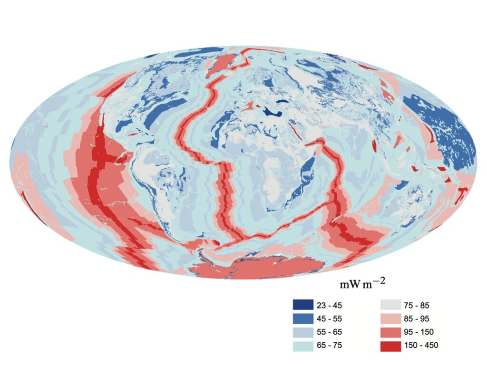A map of [heat flow](https://en.wikipedia.org/wiki/Heat_flow "Heat flow") from Earth's interior to the surface of Earth's crust, mostly along the [oceanic ridges](https://en.wikipedia.org/wiki/Oceanic_ridge "Oceanic ridge")

The major contributors to Earth's internal heat are primordial heat (heat left over from Earth's formation) and radiogenic heat (heat produced by radioactive decay). The major heat-producing [isotopes](https://en.wikipedia.org/wiki/Isotope "Isotope") within Earth are [potassium-40](https://en.wikipedia.org/wiki/Potassium-40 "Potassium-40"), [uranium-238](https://en.wikipedia.org/wiki/Uranium-238 "Uranium-238"), and [thorium-232](https://en.wikipedia.org/wiki/Thorium-232 "Thorium-232"). At the center, the temperature may be up to 6,000 °C (10,830 °F), and the pressure could reach 360 [GPa](https://en.wikipedia.org/wiki/Pascal_\(unit\) "Pascal (unit)") (52 million [psi](https://en.wikipedia.org/wiki/Pound_per_square_inch "Pound per square inch")). Because much of the heat is provided by radioactive decay, scientists postulate that early in Earth's history, before isotopes with short half-lives were depleted, Earth's heat production was much higher. At approximately 3 [Gyr](https://en.wikipedia.org/wiki/Billion_years "Billion years"), twice the present-day heat would have been produced, increasing the rates of [mantle convection](https://en.wikipedia.org/wiki/Mantle_convection "Mantle convection") and plate tectonics, and allowing the production of uncommon [igneous rocks](https://en.wikipedia.org/wiki/Igneous_rock "Igneous rock") such as [komatiites](https://en.wikipedia.org/wiki/Komatiite "Komatiite") that are rarely formed today.

The mean heat loss from Earth is 87 mW/m2, for a global heat loss of 4.42×1013 W. A portion of the core's thermal energy is transported toward the crust by [mantle plumes](https://en.wikipedia.org/wiki/Mantle_plume "Mantle plume"), a form of convection consisting of upwellings of higher-temperature rock. These plumes can produce [hotspots](https://en.wikipedia.org/wiki/Hotspot_\(geology\) "Hotspot (geology)") and [flood basalts](https://en.wikipedia.org/wiki/Flood_basalt "Flood basalt"). More of the heat in Earth is lost through plate tectonics, by mantle upwelling associated with [mid-ocean ridges](https://en.wikipedia.org/wiki/Mid-ocean_ridge "Mid-ocean ridge"). The final major mode of heat loss is through conduction through the lithosphere, the majority of which occurs under the oceans.

### Magnetic field

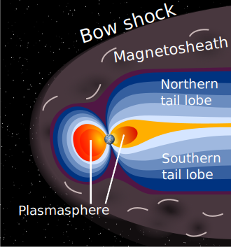A schematic view of Earth's magnetosphere with [solar wind](https://en.wikipedia.org/wiki/Solar_wind "Solar wind") flowing from left to right

The main part of Earth's magnetic field is generated in the core, the site of a [dynamo](https://en.wikipedia.org/wiki/Dynamo_theory "Dynamo theory") process that converts the kinetic energy of thermally and compositionally driven convection into electrical and magnetic field energy. The field extends outwards from the core, through the mantle, and up to Earth's surface, where it is approximately a [dipole](https://en.wikipedia.org/wiki/Dipole "Dipole"). The poles of the dipole are located close to Earth's geographic poles. At the equator of the magnetic field, the magnetic-field strength at the surface is 3.05×10−5 [T](https://en.wikipedia.org/wiki/Tesla_\(unit\) "Tesla (unit)"), with a [magnetic dipole moment](https://en.wikipedia.org/wiki/Magnetic_dipole_moment "Magnetic dipole moment") of 7.79×1022 Am2 at epoch 2000, decreasing nearly 6% per century (although it still remains stronger than its long time average). The convection movements in the core are chaotic; the magnetic poles drift and periodically change alignment. This causes [secular variation](https://en.wikipedia.org/wiki/Geomagnetic_secular_variation "Geomagnetic secular variation") of the main field and [field reversals](https://en.wikipedia.org/wiki/Geomagnetic_reversal "Geomagnetic reversal") at irregular intervals averaging a few times every million years. The most recent reversal occurred approximately 700,000 years ago.

The extent of Earth's magnetic field in space defines the [magnetosphere](https://en.wikipedia.org/wiki/Magnetosphere "Magnetosphere"). Ions and electrons of the solar wind are deflected by the magnetosphere; solar wind pressure compresses the day-side of the magnetosphere, to about 10 Earth radii, and extends the night-side magnetosphere into a long tail. Because the velocity of the solar wind is greater than the speed at which waves propagate through the solar wind, a supersonic [bow shock](https://en.wikipedia.org/wiki/Bow_shock "Bow shock") precedes the day-side magnetosphere within the solar wind. [Charged particles](https://en.wikipedia.org/wiki/Charged_particle "Charged particle") are contained within the magnetosphere; the plasmasphere is defined by low-energy particles that essentially follow magnetic field lines as Earth rotates. The ring current is defined by medium-energy [particles](https://en.wikipedia.org/wiki/Particle "Particle") that drift relative to the geomagnetic field, but with paths that are still dominated by the magnetic field, and the [Van Allen radiation belts](https://en.wikipedia.org/wiki/Van_Allen_radiation_belt "Van Allen radiation belt") are formed by high-energy particles whose motion is essentially random, but contained in the magnetosphere. During [magnetic storms](https://en.wikipedia.org/wiki/Magnetic_storm "Magnetic storm") and [substorms](https://en.wikipedia.org/wiki/Substorm "Substorm"), charged particles can be deflected from the outer magnetosphere and especially the magnetotail, directed along field lines into Earth's [ionosphere](https://en.wikipedia.org/wiki/Ionosphere "Ionosphere"), where atmospheric atoms can be excited and ionized, causing an [aurora](https://en.wikipedia.org/wiki/Aurora "Aurora").

## Surface environment

A [composite](https://en.wikipedia.org/wiki/Compositing "Compositing") image of Earth, with its different types of surface discernible: Earth's surface dominating Ocean (blue), Africa with lush (green) to dry (brown) land and Earth's polar ice in the form of [Antarctic sea ice](https://en.wikipedia.org/wiki/Antarctic_sea_ice "Antarctic sea ice") (grey) covering the [Antarctic or Southern Ocean](https://en.wikipedia.org/wiki/Southern_Ocean "Southern Ocean") and the [Antarctic ice sheet](https://en.wikipedia.org/wiki/Antarctic_ice_sheet "Antarctic ice sheet") (white) covering [Antarctica](https://en.wikipedia.org/wiki/Antarctica "Antarctica").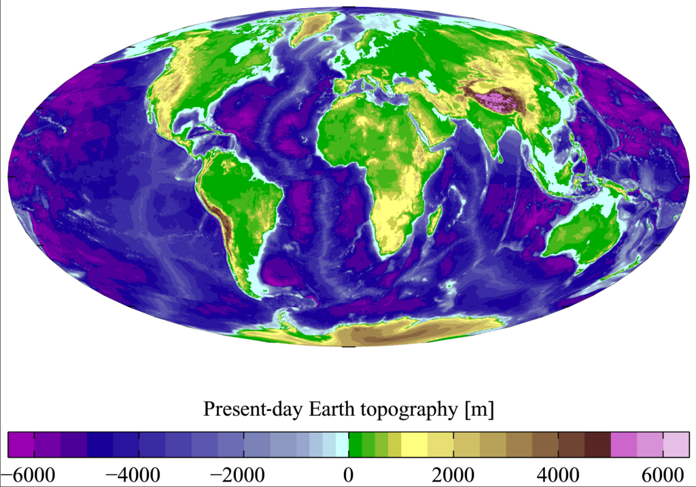[Relief](https://en.wikipedia.org/wiki/Terrain "Terrain") of [Earth's crust](/source/earths-crust/ "Earth's crust")

Earth's surface is the boundary between the atmosphere and the solid Earth and oceans. Defined in this way, it has an area of about 510 million km2 (197 million sq mi). Earth can be divided into two [hemispheres](https://en.wikipedia.org/wiki/Hemispheres_of_Earth "Hemispheres of Earth"): by [latitude](https://en.wikipedia.org/wiki/Latitude "Latitude") into the polar [Northern](https://en.wikipedia.org/wiki/Northern_Hemisphere "Northern Hemisphere") and [Southern](https://en.wikipedia.org/wiki/Southern_Hemisphere "Southern Hemisphere") hemispheres; or by [longitude](https://en.wikipedia.org/wiki/Longitude "Longitude") into the continental [Eastern](https://en.wikipedia.org/wiki/Eastern_Hemisphere "Eastern Hemisphere") and [Western](https://en.wikipedia.org/wiki/Western_Hemisphere "Western Hemisphere") hemispheres. Earth's surface is continually being shaped by internal [plate tectonic](https://en.wikipedia.org/wiki/Plate_tectonic "Plate tectonic") processes including [earthquakes](https://en.wikipedia.org/wiki/Earthquakes "Earthquakes") and [volcanism](https://en.wikipedia.org/wiki/Volcanism "Volcanism"); by [weathering](https://en.wikipedia.org/wiki/Weathering "Weathering") and [erosion](https://en.wikipedia.org/wiki/Erosion "Erosion") driven by ice, water, wind and temperature; and by [biological processes](https://en.wikipedia.org/wiki/Biological_processes "Biological processes") including the growth and decomposition of [biomass](https://en.wikipedia.org/wiki/Biomass "Biomass") into [soil](https://en.wikipedia.org/wiki/Soil "Soil").

Most of Earth's surface is ocean water: 70.8% or 361 million km2 (139 million sq mi). This vast pool of salty water is often called the _world ocean_, and makes Earth with its dynamic [hydrosphere](https://en.wikipedia.org/wiki/Hydrosphere "Hydrosphere") a water world or [ocean world](https://en.wikipedia.org/wiki/Ocean_world "Ocean world"). Indeed, in Earth's early history the ocean may have covered Earth completely. The world ocean is commonly divided into the Pacific Ocean, Atlantic Ocean, Indian Ocean, Southern Ocean, and Arctic Ocean, from largest to smallest. The ocean covers [Earth's oceanic crust](https://en.wikipedia.org/wiki/Oceanic_crust "Oceanic crust"), with the [shelf seas](https://en.wikipedia.org/wiki/Shelf_sea "Shelf sea") covering the [shelves](https://en.wikipedia.org/wiki/Continental_shelf "Continental shelf") of the [continental crust](https://en.wikipedia.org/wiki/Continental_crust "Continental crust") to a lesser extent. The oceanic crust forms large [oceanic basins](https://en.wikipedia.org/wiki/Oceanic_basin "Oceanic basin") with features like [abyssal plains](https://en.wikipedia.org/wiki/Abyssal_plain "Abyssal plain"), [seamounts](https://en.wikipedia.org/wiki/Seamount "Seamount"), [submarine volcanoes](https://en.wikipedia.org/wiki/Submarine_volcano "Submarine volcano"), [oceanic trenches](https://en.wikipedia.org/wiki/Oceanic_trench "Oceanic trench"), [submarine canyons](https://en.wikipedia.org/wiki/Submarine_canyon "Submarine canyon"), [oceanic plateaus](https://en.wikipedia.org/wiki/Oceanic_plateau "Oceanic plateau"), and a globe-spanning [mid-ocean ridge](https://en.wikipedia.org/wiki/Mid-ocean_ridge "Mid-ocean ridge") system. At Earth's [polar regions](https://en.wikipedia.org/wiki/Polar_regions_of_Earth "Polar regions of Earth"), the [ocean surface](https://en.wikipedia.org/wiki/Ocean_surface "Ocean surface") is covered by seasonally variable amounts of [sea ice](https://en.wikipedia.org/wiki/Sea_ice "Sea ice") that often connects with polar land, [permafrost](https://en.wikipedia.org/wiki/Permafrost "Permafrost") and [ice sheets](https://en.wikipedia.org/wiki/Ice_sheet "Ice sheet"), forming [polar ice caps](https://en.wikipedia.org/wiki/Polar_ice_cap "Polar ice cap").

Earth's land covers 29.2%, or 149 million km2 (58 million sq mi) of Earth's surface. The land surface includes many [islands](https://en.wikipedia.org/wiki/Island "Island") around the globe, but most of the land surface is taken by the four continental [landmasses](https://en.wikipedia.org/wiki/Landmass "Landmass"), which are (in descending order): [Africa-Eurasia](https://en.wikipedia.org/wiki/Afro-Eurasia "Afro-Eurasia"), [America](https://en.wikipedia.org/wiki/Americas "Americas"), [Antarctica](https://en.wikipedia.org/wiki/Antarctica "Antarctica"), and [Australia](https://en.wikipedia.org/wiki/Mainland_Australia "Mainland Australia"). These landmasses are further broken down and grouped into the [continents](https://en.wikipedia.org/wiki/Continent "Continent"). Land can be [covered](https://en.wikipedia.org/wiki/Land_cover "Land cover") by [surface water](https://en.wikipedia.org/wiki/Surface_water "Surface water"), snow, ice, artificial structures or vegetation. Most of Earth's land hosts vegetation, but considerable amounts of land are [ice sheets](https://en.wikipedia.org/wiki/Ice_sheet "Ice sheet") (10%, not including the equally large area of land under [permafrost](https://en.wikipedia.org/wiki/Permafrost "Permafrost")) or [deserts](https://en.wikipedia.org/wiki/Desert "Desert") (33%).

The [pedosphere](https://en.wikipedia.org/wiki/Pedosphere "Pedosphere") is the outermost layer of Earth's land surface and is composed of soil and subject to [soil formation](https://en.wikipedia.org/wiki/Soil_formation "Soil formation") processes. Soil is crucial for land to be arable. Earth's total [arable land](https://en.wikipedia.org/wiki/Arable_land "Arable land") is 10.7% of the land surface, with 1.3% being permanent cropland. Earth has an estimated 16.7 million km2 (6.4 million sq mi) of cropland and 33.5 million km2 (12.9 million sq mi) of pastureland.

The land surface and the [ocean floor](https://en.wikipedia.org/wiki/Ocean_floor "Ocean floor") form the top of [Earth's crust](/source/earths-crust/ "Earth's crust"), which together with parts of the [upper mantle](https://en.wikipedia.org/wiki/Upper_mantle_\(Earth\) "Upper mantle (Earth)") form [Earth's lithosphere](https://en.wikipedia.org/wiki/Lithosphere#Earth's_lithosphere "Lithosphere"). Earth's crust may be divided into [oceanic](https://en.wikipedia.org/wiki/Oceanic_crust "Oceanic crust") and [continental](https://en.wikipedia.org/wiki/Continental_crust "Continental crust") crust. Beneath the ocean-floor sediments, the oceanic crust is predominantly [basaltic](https://en.wikipedia.org/wiki/Basalt "Basalt"), while the continental crust may include lower density materials such as [granite](https://en.wikipedia.org/wiki/Granite "Granite"), sediments and metamorphic rocks. Nearly 75% of the continental surfaces are covered by sedimentary rocks, although they form about 5% of the mass of the crust.

Earth's surface [topography](https://en.wikipedia.org/wiki/Topography "Topography") comprises both the [topography of the ocean surface](https://en.wikipedia.org/wiki/Ocean_surface_topography "Ocean surface topography"), and the [shape](https://en.wikipedia.org/wiki/Hypsometry "Hypsometry") of Earth's land surface. The [terrain](https://en.wikipedia.org/wiki/Terrain "Terrain") of the land surface varies greatly and consists of mountains, [deserts](https://en.wikipedia.org/wiki/Desert "Desert"), [plains](https://en.wikipedia.org/wiki/Plain "Plain"), [plateaus](https://en.wikipedia.org/wiki/Plateau "Plateau"), and other [landforms](https://en.wikipedia.org/wiki/Landform "Landform"). The elevation of the land surface varies from a low point of −418 m (−1,371 ft) at the [Dead Sea](https://en.wikipedia.org/wiki/Dead_Sea "Dead Sea"), to a maximum altitude of 8,848 m (29,029 ft) at the top of [Mount Everest](https://en.wikipedia.org/wiki/Mount_Everest "Mount Everest"). The mean height of land above sea level is about 797 m (2,615 ft). The submarine terrain of the ocean floor has an average [bathymetric](https://en.wikipedia.org/wiki/Bathymetric "Bathymetric") depth of 4 km, and is as varied as the terrain above sea level.

### Tectonic plates

[Earth's major plates](https://en.wikipedia.org/wiki/List_of_tectonic_plates "List of tectonic plates"), which are:

*    [Pacific Plate](https://en.wikipedia.org/wiki/Pacific_Plate "Pacific Plate")
*    [African Plate](https://en.wikipedia.org/wiki/African_Plate "African Plate")
*    [North American Plate](https://en.wikipedia.org/wiki/North_American_Plate "North American Plate")
*    [Eurasian Plate](https://en.wikipedia.org/wiki/Eurasian_Plate "Eurasian Plate")
*    [Antarctic Plate](https://en.wikipedia.org/wiki/Antarctic_Plate "Antarctic Plate")
*    [Indo-Australian Plate](https://en.wikipedia.org/wiki/Indo-Australian_Plate "Indo-Australian Plate")
*    [South American Plate](https://en.wikipedia.org/wiki/South_American_Plate "South American Plate")

Earth's mechanically rigid outer layer of [Earth's crust](/source/earths-crust/ "Earth's crust") and [upper mantle](https://en.wikipedia.org/wiki/Upper_mantle_\(Earth\) "Upper mantle (Earth)"), the [lithosphere](https://en.wikipedia.org/wiki/Lithosphere "Lithosphere"), is divided into [tectonic plates](https://en.wikipedia.org/wiki/List_of_tectonic_plates "List of tectonic plates"). These plates are rigid segments that move relative to each other at one of three boundaries types: at [convergent boundaries](https://en.wikipedia.org/wiki/Convergent_boundary "Convergent boundary"), two plates come together; at [divergent boundaries](https://en.wikipedia.org/wiki/Divergent_boundary "Divergent boundary"), two plates are pulled apart; and at [transform boundaries](https://en.wikipedia.org/wiki/Transform_fault "Transform fault"), two plates slide past one another laterally. Along these plate boundaries, earthquakes, [volcanic activity](https://en.wikipedia.org/wiki/Volcanism "Volcanism"), [mountain-building](https://en.wikipedia.org/wiki/Orogeny "Orogeny"), and [oceanic trench](https://en.wikipedia.org/wiki/Oceanic_trench "Oceanic trench") formation can occur. The tectonic plates ride on top of the [asthenosphere](https://en.wikipedia.org/wiki/Asthenosphere "Asthenosphere"), the solid but less-viscous part of the upper mantle that can flow and move along with the plates.

As the tectonic plates migrate, oceanic crust is [subducted](https://en.wikipedia.org/wiki/Subduction "Subduction") under the leading edges of the plates at convergent boundaries. At the same time, the upwelling of mantle material at divergent boundaries creates mid-ocean ridges. The combination of these processes recycles the oceanic crust back into the mantle. Due to this recycling, most of the ocean floor is less than 100 Ma old. The oldest oceanic crust is located in the Western Pacific and is estimated to be 200 Ma old. By comparison, the oldest dated continental crust is 4,030 Ma, although zircons have been found preserved as clasts within Eoarchean sedimentary rocks that give ages up to 4,400 Ma, indicating that at least some continental crust existed at that time.

The seven major plates are the [Pacific](https://en.wikipedia.org/wiki/Pacific_Plate "Pacific Plate"), [North American](https://en.wikipedia.org/wiki/North_American_Plate "North American Plate"), [Eurasian](https://en.wikipedia.org/wiki/Eurasian_Plate "Eurasian Plate"), [African](https://en.wikipedia.org/wiki/African_Plate "African Plate"), [Antarctic](https://en.wikipedia.org/wiki/Antarctic_Plate "Antarctic Plate"), [Indo-Australian](https://en.wikipedia.org/wiki/Indo-Australian_Plate "Indo-Australian Plate"), and [South American](https://en.wikipedia.org/wiki/South_American_Plate "South American Plate"). Other notable plates include the [Arabian Plate](https://en.wikipedia.org/wiki/Arabian_Plate "Arabian Plate"), the [Caribbean Plate](https://en.wikipedia.org/wiki/Caribbean_Plate "Caribbean Plate"), the [Nazca Plate](https://en.wikipedia.org/wiki/Nazca_Plate "Nazca Plate") off the west coast of South America and the [Scotia Plate](https://en.wikipedia.org/wiki/Scotia_Plate "Scotia Plate") in the southern Atlantic Ocean. The Australian Plate fused with the Indian Plate between 50 and 55 Ma. The fastest-moving plates are the oceanic plates, with the [Cocos Plate](https://en.wikipedia.org/wiki/Cocos_Plate "Cocos Plate") advancing at a rate of 75 mm/a (3.0 in/year) and the Pacific Plate moving 52–69 mm/a (2.0–2.7 in/year). At the other extreme, the slowest-moving plate is the South American Plate, progressing at a typical rate of 10.6 mm/a (0.42 in/year).

### Hydrosphere

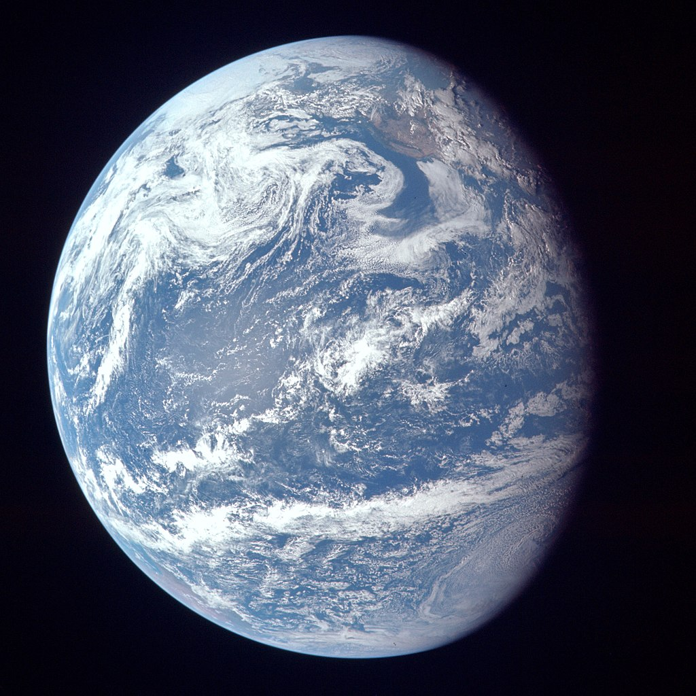A view of Earth with its [global ocean](https://en.wikipedia.org/wiki/Global_ocean "Global ocean") and [cloud cover](https://en.wikipedia.org/wiki/Cloud_cover "Cloud cover"), which dominate Earth's surface and [hydrosphere](https://en.wikipedia.org/wiki/Hydrosphere "Hydrosphere"); at Earth's [polar](https://en.wikipedia.org/wiki/Polar_regions_of_Earth "Polar regions of Earth") regions, its hydrosphere forms larger areas of ice cover.

Earth's hydrosphere is the sum of Earth's water and its distribution. Most of Earth's hydrosphere consists of Earth's global ocean. Earth's hydrosphere also consists of water in the atmosphere and on land, including clouds, inland seas, lakes, rivers, and underground waters. The mass of the oceans is approximately 1.35×1018 [metric tons](https://en.wikipedia.org/wiki/Metric_ton "Metric ton") or about 1/4400 of Earth's total mass. The oceans cover an area of 361.8 million km2 (139.7 million mi2) with a mean depth of 3,682 m (12,080 ft), resulting in an estimated volume of 1.332 billion km3 (320 million cu mi).

If all of Earth's crustal surface were at the same elevation as a smooth sphere, the depth of the resulting world ocean would be 2.\. to 2.8 km (1.68 to 1.74 mi). About 97.5% of the water is [saline](https://en.wikipedia.org/wiki/Saline_water "Saline water"); the remaining 2.5% is [fresh water](https://en.wikipedia.org/wiki/Fresh_water "Fresh water"). Most fresh water, about 68.7%, is present as ice in [ice caps](https://en.wikipedia.org/wiki/Ice_cap "Ice cap") and [glaciers](https://en.wikipedia.org/wiki/Glacier "Glacier"). The remaining 30% is [ground water](https://en.wikipedia.org/wiki/Ground_water "Ground water"), 1% [surface water](https://en.wikipedia.org/wiki/Surface_water "Surface water") (covering only 2.8% of Earth's land) and other small forms of fresh water deposits such as [permafrost](https://en.wikipedia.org/wiki/Permafrost "Permafrost"), [water vapor](https://en.wikipedia.org/wiki/Water_vapor "Water vapor") in the atmosphere, biological binding, etc.

In Earth's coldest regions, snow survives over the summer and [changes into ice](https://en.wikipedia.org/wiki/Ice_formation "Ice formation"). This accumulated snow and ice eventually forms into [glaciers](https://en.wikipedia.org/wiki/Glacier "Glacier"), bodies of ice that flow under the influence of their own gravity. [Alpine glaciers](https://en.wikipedia.org/wiki/Alpine_glaciers "Alpine glaciers") form in mountainous areas, whereas vast [ice sheets](https://en.wikipedia.org/wiki/Ice_sheets "Ice sheets") form over land in polar regions. The flow of glaciers erodes the surface, changing it dramatically, with the formation of [U-shaped valleys](https://en.wikipedia.org/wiki/U-shaped_valley "U-shaped valley") and other landforms. [Sea ice](https://en.wikipedia.org/wiki/Sea_ice "Sea ice") in the Arctic covers an area about as big as the United States, although it is quickly retreating as a consequence of climate change.

The average [salinity](https://en.wikipedia.org/wiki/Salinity "Salinity") of Earth's oceans is about 35 grams of salt per kilogram of seawater (3.5% salt). Most of this salt was released from volcanic activity or extracted from cool igneous rocks. The oceans are also a reservoir of dissolved atmospheric gases, which are essential for the survival of many aquatic life forms. Sea water has an important influence on the world's climate, with the oceans acting as a large [heat reservoir](https://en.wikipedia.org/wiki/Heat_reservoir "Heat reservoir"). Shifts in the oceanic temperature distribution can cause significant weather shifts, such as the [El Niño–Southern Oscillation](https://en.wikipedia.org/wiki/El_Niño–Southern_Oscillation "El Niño–Southern Oscillation").

The abundance of water, particularly liquid water, on Earth's surface is a unique feature that distinguishes it from other planets in the [Solar System](https://en.wikipedia.org/wiki/Solar_System "Solar System"). Solar System planets with considerable atmospheres do partly host atmospheric water vapor, but they lack surface conditions for stable surface water. Despite some [moons](https://en.wikipedia.org/wiki/Natural_satellite "Natural satellite") showing signs of large reservoirs of [extraterrestrial liquid water](https://en.wikipedia.org/wiki/Extraterrestrial_liquid_water "Extraterrestrial liquid water"), with possibly even more volume than Earth's ocean, all of them are [large bodies of water](https://en.wikipedia.org/wiki/List_of_largest_lakes_and_seas_in_the_Solar_System "List of largest lakes and seas in the Solar System") under a kilometers-thick frozen surface layer.

### Atmosphere

A view of Earth with different layers of its atmosphere visible: the [troposphere](https://en.wikipedia.org/wiki/Troposphere "Troposphere") with its clouds casting shadows, a band of [stratospheric](https://en.wikipedia.org/wiki/Stratospheric "Stratospheric") blue sky at the horizon, and a line of green [airglow](https://en.wikipedia.org/wiki/Airglow "Airglow") of the lower [thermosphere](https://en.wikipedia.org/wiki/Thermosphere "Thermosphere") around an [altitude of 100 km, at the edge of space](https://en.wikipedia.org/wiki/Kármán_line "Kármán line")

The [atmospheric pressure](https://en.wikipedia.org/wiki/Atmospheric_pressure "Atmospheric pressure") at Earth's sea level averages 101.325 kPa (14.696 psi), with a [scale height](https://en.wikipedia.org/wiki/Scale_height "Scale height") of about 8.5 km (5.3 mi). A dry atmosphere is composed of 78.084% [nitrogen](https://en.wikipedia.org/wiki/Nitrogen "Nitrogen"), 20.946% oxygen, 0.934% [argon](https://en.wikipedia.org/wiki/Argon "Argon"), and trace amounts of carbon dioxide and other gaseous molecules. [Water vapor](https://en.wikipedia.org/wiki/Water_vapor "Water vapor") content varies between 0.01% and 4% but averages about 1%. [Clouds cover](https://en.wikipedia.org/wiki/Cloud_cover "Cloud cover") around two-thirds of Earth's surface, more so over oceans than land. The height of the [troposphere](https://en.wikipedia.org/wiki/Troposphere "Troposphere") varies with latitude, ranging between 8 km (5 mi) at the poles to 17 km (11 mi) at the equator, with some variation resulting from weather and seasonal factors.

Earth's [biosphere](https://en.wikipedia.org/wiki/Biosphere "Biosphere") has significantly altered its [atmosphere](https://en.wikipedia.org/wiki/Atmosphere_of_Earth "Atmosphere of Earth"). [Oxygenic photosynthesis](https://en.wikipedia.org/wiki/Oxygen_evolution#Oxygen_evolution_in_nature "Oxygen evolution") evolved 2.7 Gya, [forming](https://en.wikipedia.org/wiki/Oxygen_catastrophe "Oxygen catastrophe") the primarily nitrogen–oxygen atmosphere of today. This change enabled the proliferation of [aerobic organisms](https://en.wikipedia.org/wiki/Aerobic_organisms "Aerobic organisms") and, indirectly, the formation of the ozone layer due to the subsequent [conversion of atmospheric O2 into O3](https://en.wikipedia.org/wiki/Ozone–oxygen_cycle "Ozone–oxygen cycle"). The ozone layer blocks ultraviolet [solar radiation](https://en.wikipedia.org/wiki/Solar_radiation "Solar radiation"), permitting life on land. Other atmospheric functions important to life include transporting water vapor, providing useful gases, causing small meteors to burn up before they strike the surface, and moderating temperature. This last phenomenon is the [greenhouse effect](https://en.wikipedia.org/wiki/Greenhouse_effect "Greenhouse effect"): trace molecules within the atmosphere serve to capture [thermal energy](https://en.wikipedia.org/wiki/Thermal_energy "Thermal energy") emitted from the surface, thereby raising the average temperature. Water vapor, carbon dioxide, [methane](https://en.wikipedia.org/wiki/Methane "Methane"), [nitrous oxide](https://en.wikipedia.org/wiki/Nitrous_oxide "Nitrous oxide"), and [ozone](https://en.wikipedia.org/wiki/Ozone "Ozone") are the primary greenhouse gases in the atmosphere. Without this heat-retention effect, the average surface temperature would be −18 °C (−0.4 °F), in contrast to the current +15 °C (59 °F), and life on Earth probably would not exist in its current form.

#### Upper atmosphere

Earth's night-side upper atmosphere appearing from the bottom as bands of [afterglow](https://en.wikipedia.org/wiki/Afterglow "Afterglow") illuminating the [troposphere](https://en.wikipedia.org/wiki/Troposphere "Troposphere") in orange with silhouettes of clouds, and the [stratosphere](https://en.wikipedia.org/wiki/Stratosphere "Stratosphere") in white and blue. Next the [mesosphere](https://en.wikipedia.org/wiki/Mesosphere "Mesosphere") (pink area) extends to the orange and faintly green line of the lowest [airglow](https://en.wikipedia.org/wiki/Airglow "Airglow"), at about one hundred kilometers at the [edge of space](https://en.wikipedia.org/wiki/Outer_space#Boundary "Outer space") and the lower edge of the [thermosphere](https://en.wikipedia.org/wiki/Thermosphere "Thermosphere") (invisible). Continuing with green and red bands of [aurorae](https://en.wikipedia.org/wiki/Aurora "Aurora") stretching over several hundred kilometers.

The upper atmosphere, the atmosphere above the troposphere, is usually divided into the [stratosphere](https://en.wikipedia.org/wiki/Stratosphere "Stratosphere"), [mesosphere](https://en.wikipedia.org/wiki/Mesosphere "Mesosphere"), and [thermosphere](https://en.wikipedia.org/wiki/Thermosphere "Thermosphere"). Each layer has a different lapse rate, defining the rate of change in temperature with height. Beyond these, the [exosphere](https://en.wikipedia.org/wiki/Exosphere "Exosphere") thins out into the magnetosphere, where the geomagnetic fields interact with the solar wind. Within the stratosphere is the ozone layer, a component that partially shields the surface from ultraviolet light and thus is important for life on Earth. The [Kármán line](https://en.wikipedia.org/wiki/Kármán_line "Kármán line"), defined as 100 km (62 mi) above Earth's surface, is a working definition for the boundary between the atmosphere and [outer space](https://en.wikipedia.org/wiki/Outer_space "Outer space").

Thermal energy causes some of the molecules at the outer edge of the atmosphere to increase their velocity to the point where they can escape from Earth's gravity. This causes a slow but steady [loss of the atmosphere into space](https://en.wikipedia.org/wiki/Atmospheric_escape "Atmospheric escape"). Because unfixed [hydrogen](https://en.wikipedia.org/wiki/Hydrogen "Hydrogen") has a low [molecular mass](https://en.wikipedia.org/wiki/Molecular_mass "Molecular mass"), it can achieve [escape velocity](https://en.wikipedia.org/wiki/Escape_velocity "Escape velocity") more readily, and it leaks into outer space at a greater rate than other gases. The leakage of hydrogen into space contributes to the shifting of Earth's atmosphere and surface from an initially [reducing](https://en.wikipedia.org/wiki/Redox "Redox") state to its current oxidizing one. Photosynthesis provided a source of free oxygen, but the loss of reducing agents such as hydrogen is thought to have been a necessary precondition for the widespread accumulation of oxygen in the atmosphere. Hence the ability of hydrogen to escape from the atmosphere may have influenced the nature of life that developed on Earth. In the current, oxygen-rich atmosphere most hydrogen is converted into water before it has an opportunity to escape. Instead, most of the hydrogen loss comes from the destruction of methane in the upper atmosphere.

### Weather and climate

Earth's atmosphere has no definite boundary, gradually becoming thinner and fading into outer space. Three-quarters of the atmosphere's mass is contained within the first 11 km (6.8 mi) of the surface; this lowest layer is called the troposphere. Energy from the Sun heats this layer, and the surface below, causing expansion of the air. This lower-density air then rises and is replaced by cooler, higher-density air. The result is [atmospheric circulation](https://en.wikipedia.org/wiki/Atmospheric_circulation "Atmospheric circulation") that drives the weather and climate through redistribution of thermal energy.

The primary atmospheric circulation bands consist of the [trade winds](https://en.wikipedia.org/wiki/Trade_winds "Trade winds") in the equatorial region below 30° latitude and the [westerlies](https://en.wikipedia.org/wiki/Westerlies "Westerlies") in the mid-latitudes between 30° and 60°. [Ocean heat content](https://en.wikipedia.org/wiki/Ocean_heat_content "Ocean heat content") and [currents](https://en.wikipedia.org/wiki/Ocean_current "Ocean current") are also important factors in determining climate, particularly the [thermohaline circulation](https://en.wikipedia.org/wiki/Thermohaline_circulation "Thermohaline circulation") that distributes thermal energy from the equatorial oceans to the polar regions.

Earth receives 1361 W/m2 of [solar irradiance](https://en.wikipedia.org/wiki/Solar_irradiance "Solar irradiance"). The amount of solar energy that reaches Earth's surface decreases with increasing latitude. At higher latitudes, the sunlight reaches the surface at lower angles, and it must pass through thicker columns of the atmosphere. As a result, the mean annual air temperature at sea level decreases by about 0.4 °C (0.7 °F) per degree of latitude from the equator. Earth's surface can be subdivided into specific latitudinal belts of approximately homogeneous climate. Ranging from the equator to the polar regions, these are the tropical (or equatorial), [subtropical](https://en.wikipedia.org/wiki/Subtropics "Subtropics"), [temperate](https://en.wikipedia.org/wiki/Temperate "Temperate") and [polar](https://en.wikipedia.org/wiki/Polar_region "Polar region") climates.

Further factors that affect a location's climates are its [proximity to oceans](https://en.wikipedia.org/wiki/Continentality "Continentality"), the oceanic and atmospheric circulation, and topology. Places close to oceans typically have colder summers and warmer winters, due to the fact that oceans can store large amounts of heat. The wind transports the cold or the heat of the ocean to the land. Atmospheric circulation also plays an important role: San Francisco and Washington DC are both coastal cities at about the same latitude. San Francisco's climate is significantly more moderate as the prevailing wind direction is from sea to land. Finally, temperatures [decrease with height](https://en.wikipedia.org/wiki/Lapse_rate "Lapse rate") causing mountainous areas to be colder than low-lying areas.

Water vapor generated through surface evaporation is transported by circulatory patterns in the atmosphere. When atmospheric conditions permit an uplift of warm, humid air, this water condenses and falls to the surface as [precipitation](https://en.wikipedia.org/wiki/Precipitation "Precipitation"). Most of the water is then transported to lower elevations by river systems and usually returned to the oceans or deposited into lakes. This [water cycle](https://en.wikipedia.org/wiki/Water_cycle "Water cycle") is a vital mechanism for supporting life on land and is a primary factor in the erosion of surface features over geological periods. Precipitation patterns vary widely, ranging from several meters of water per year to less than a millimeter. Atmospheric circulation, topographic features, and temperature differences determine the average precipitation that falls in each region.

The commonly used [Köppen climate classification](https://en.wikipedia.org/wiki/Köppen_climate_classification "Köppen climate classification") system has five broad groups ([humid tropics](https://en.wikipedia.org/wiki/Tropical_climate "Tropical climate"), [arid](https://en.wikipedia.org/wiki/Arid "Arid"), [humid middle latitudes](https://en.wikipedia.org/wiki/Humid_subtropical_climate "Humid subtropical climate"), [continental](https://en.wikipedia.org/wiki/Continental_climate "Continental climate") and cold [polar](https://en.wikipedia.org/wiki/Polar_climate "Polar climate")), which are further divided into more specific subtypes. The Köppen system rates regions based on observed temperature and precipitation. Surface [air temperature can rise to](https://en.wikipedia.org/wiki/Highest_temperature_recorded_on_Earth "Highest temperature recorded on Earth") around 55 °C (131 °F) in [hot deserts](https://en.wikipedia.org/wiki/Hot_desert "Hot desert"), such as [Death Valley](https://en.wikipedia.org/wiki/Death_Valley_National_Park "Death Valley National Park"), and [can fall as low as](https://en.wikipedia.org/wiki/Lowest_temperature_recorded_on_Earth "Lowest temperature recorded on Earth") −89 °C (−128 °F) in [Antarctica](https://en.wikipedia.org/wiki/Antarctica "Antarctica").

*   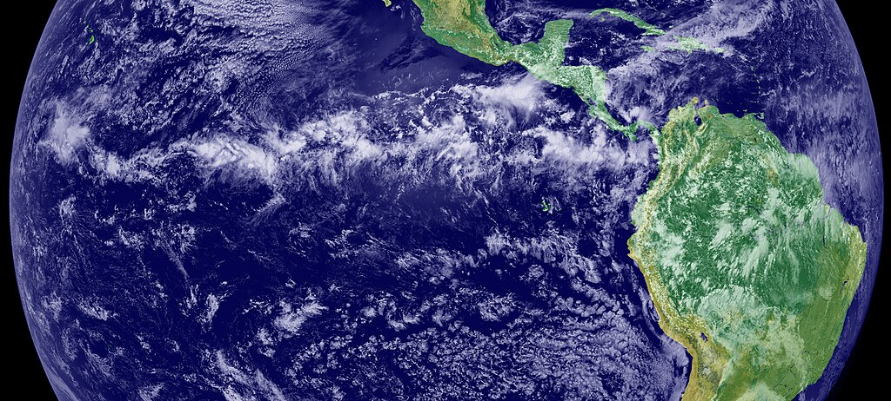

    The [ITCZ](https://en.wikipedia.org/wiki/ITCZ "ITCZ")'s band of clouds over the Eastern Pacific and the Americas as seen from space

*   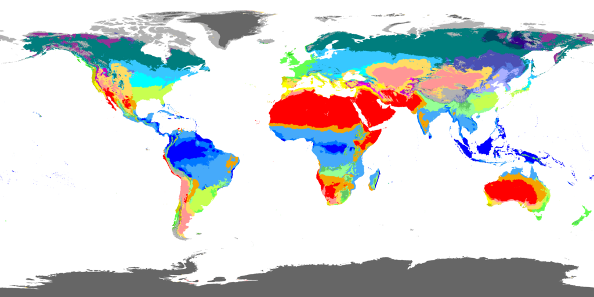

    Worldwide [Köppen climate classifications](https://en.wikipedia.org/wiki/Köppen_climate_classification "Köppen climate classification")

## Orbit and rotation

### Rotation

Satellite [time-lapse imagery](https://en.wikipedia.org/wiki/Time-lapse_photography "Time-lapse photography") of Earth's rotation showing axis tilt

Earth's rotation period relative to the Sun—its mean solar day—is 86,400 seconds of mean solar time (86,400.0025 [SI](https://en.wikipedia.org/wiki/SI "SI") seconds). Because Earth's solar day is now slightly longer than it was during the 19th century due to [tidal deceleration](https://en.wikipedia.org/wiki/Tidal_acceleration "Tidal acceleration"), each day varies between 0 and 2 [ms](https://en.wikipedia.org/wiki/Millisecond "Millisecond") longer than the mean solar day.

Earth's rotation period relative to the [fixed stars](https://en.wikipedia.org/wiki/Fixed_star "Fixed star"), called its _stellar day_ by the [International Earth Rotation and Reference Systems Service](https://en.wikipedia.org/wiki/International_Earth_Rotation_and_Reference_Systems_Service "International Earth Rotation and Reference Systems Service") (IERS), is 86,164.0989 seconds of mean solar time ([UT1](https://en.wikipedia.org/wiki/UT1 "UT1")), or 23h 56m 4.0989s. Earth's rotation period relative to the [precessing](https://en.wikipedia.org/wiki/Precession_\(astronomy\) "Precession (astronomy)") or moving mean [March equinox](https://en.wikipedia.org/wiki/March_equinox "March equinox") (when the Sun is at 90° on the equator), is 86,164.0905 seconds of mean solar time (UT1) (23h 56m 4.0905s). Thus the sidereal day is shorter than the stellar day by about 8.4 ms.

Apart from meteors within the atmosphere and low-orbiting satellites, the main apparent motion of celestial bodies in Earth's sky is to the west at a rate of 15°/h = 15'/min. For bodies near the [celestial equator](https://en.wikipedia.org/wiki/Celestial_equator "Celestial equator"), this is equivalent to an apparent diameter of the Sun or the Moon every two minutes; from Earth's surface, the apparent sizes of the Sun and the Moon are approximately the same.

### Orbit and location

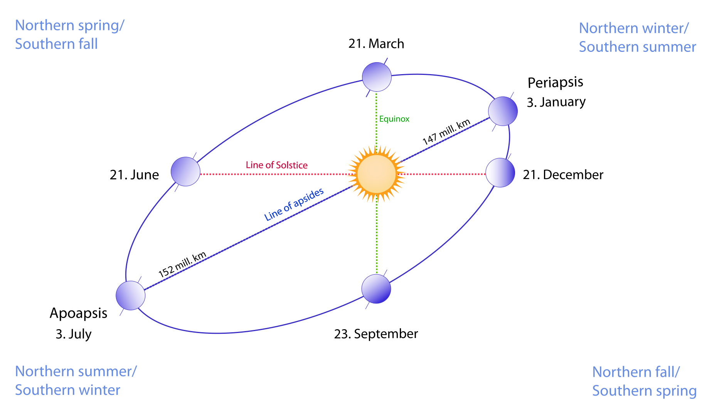Exaggerated illustration of Earth's elliptical orbit around the Sun, marking that the orbital extreme points ([apoapsis](https://en.wikipedia.org/wiki/Apoapsis "Apoapsis") and [periapsis](https://en.wikipedia.org/wiki/Periapsis "Periapsis")) are not the same as the four seasonal extreme points, the [equinox](https://en.wikipedia.org/wiki/Equinox "Equinox") and [solstice](https://en.wikipedia.org/wiki/Solstice "Solstice")

Earth orbits the Sun at an average distance is about 150 million km (93 million mi). This makes Earth the third-closest planet to the Sun and part of the [inner Solar System](https://en.wikipedia.org/wiki/Inner_Solar_System "Inner Solar System"). Its orbital distance is the basis for the [astronomical unit](https://en.wikipedia.org/wiki/Astronomical_unit "Astronomical unit") (AU) and is equal to roughly 8.3 [light minutes](https://en.wikipedia.org/wiki/Light_minute "Light minute") or 380 times [Earth's distance to the Moon](https://en.wikipedia.org/wiki/Lunar_distance "Lunar distance"). Earth orbits the Sun every 365.2564 mean [solar days](https://en.wikipedia.org/wiki/Solar_day "Solar day"), or one [sidereal year](https://en.wikipedia.org/wiki/Sidereal_year "Sidereal year"). With an apparent movement of the Sun in Earth's sky at a rate of about 1°/day eastward, which is one apparent Sun or Moon diameter every 12 hours. Due to this motion, on average it takes 24 hours—a solar day—for Earth to complete a full rotation about its axis so that the Sun returns to the [meridian](https://en.wikipedia.org/wiki/Meridian_\(astronomy\) "Meridian (astronomy)"), slightly longer than the sidereal day.

The orbital speed of Earth averages at 29.7827 km/s (107,218 km/h; 66,622 mph), which is fast enough to travel a distance equal to Earth's diameter, about 12,742 km (7,918 mi), in seven minutes, and the distance from Earth to the Moon, 384,400 km (238,855 mi), in about 3.5 hours. Viewed from a vantage point above the Sun and Earth's north poles, Earth orbits in a counterclockwise direction about the Sun. Earth, along with all of the other planets in the Solar System, orbits roughly in the same flat plane, known as the [invariable plane](https://en.wikipedia.org/wiki/Invariable_plane "Invariable plane"). Earth's inclination to this plane is about 1.58°.

Earth, along with rest of the Solar System, is situated in the [Milky Way](https://en.wikipedia.org/wiki/Milky_Way "Milky Way") and orbits about 28,000 [light-years](https://en.wikipedia.org/wiki/Light-year "Light-year") from its center. It is about 20 light-years above the [galactic plane](https://en.wikipedia.org/wiki/Galactic_plane "Galactic plane") in the [Orion Arm](https://en.wikipedia.org/wiki/Orion_Arm "Orion Arm").

### Axial tilt and seasons

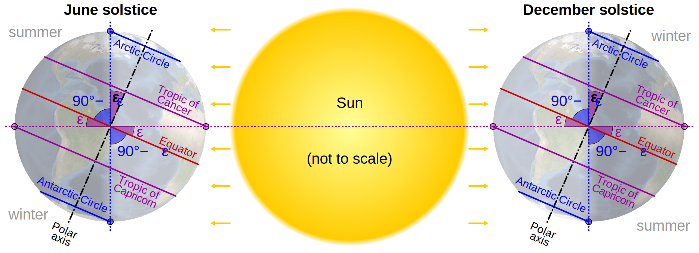Earth's axial tilt causing different angles of seasonal illumination at different orbital positions around the Sun

The axial tilt of Earth is approximately 23.439281° with the axis of the plane of [Earth's orbit](https://en.wikipedia.org/wiki/Earth's_orbit "Earth's orbit") by definition pointing always towards the [Celestial Poles](https://en.wikipedia.org/wiki/Celestial_Poles "Celestial Poles"). Due to Earth's axial tilt, the amount of sunlight reaching any given point on the surface varies over the course of the year. This causes the seasonal change in climate, with summer in the [Northern Hemisphere](https://en.wikipedia.org/wiki/Northern_Hemisphere "Northern Hemisphere") occurring when the [Tropic of Cancer](https://en.wikipedia.org/wiki/Tropic_of_Cancer "Tropic of Cancer") is facing the Sun, and in the [Southern Hemisphere](https://en.wikipedia.org/wiki/Southern_Hemisphere "Southern Hemisphere") when the [Tropic of Capricorn](https://en.wikipedia.org/wiki/Tropic_of_Capricorn "Tropic of Capricorn") faces the Sun. In each instance, winter occurs simultaneously in the opposite hemisphere.

During the summer, the day lasts longer, and the Sun climbs higher in the sky. In winter, the climate becomes cooler and the days shorter. Above the [Arctic Circle](https://en.wikipedia.org/wiki/Arctic_Circle "Arctic Circle") and below the [Antarctic Circle](https://en.wikipedia.org/wiki/Antarctic_Circle "Antarctic Circle") there is no daylight at all for part of the year, causing a [polar night](https://en.wikipedia.org/wiki/Polar_night "Polar night"), and this night extends for several months at the poles themselves. These same latitudes also experience a [midnight sun](https://en.wikipedia.org/wiki/Midnight_sun "Midnight sun"), where the sun remains visible all day.

By astronomical convention, the four seasons can be determined by the solstices—the points in the orbit of maximum axial tilt toward or away from the Sun—and the [equinoxes](https://en.wikipedia.org/wiki/Equinox "Equinox"), when Earth's rotational axis is aligned with its orbital axis. In the Northern Hemisphere, [winter solstice](https://en.wikipedia.org/wiki/Winter_solstice "Winter solstice") currently occurs around 21 December; [summer solstice](https://en.wikipedia.org/wiki/Summer_solstice "Summer solstice") is near 21 June, spring equinox is around 20 March and [autumnal equinox](https://en.wikipedia.org/wiki/September_equinox "September equinox") is about 22 or 23 September. In the Southern Hemisphere, the situation is reversed, with the summer and winter solstices exchanged and the spring and autumnal equinox dates swapped.

The angle of Earth's axial tilt is relatively stable over long periods of time. Its axial tilt does undergo [nutation](https://en.wikipedia.org/wiki/Astronomical_nutation "Astronomical nutation"); a slight, irregular motion with a main period of 18.6 years. The orientation (rather than the angle) of Earth's axis also changes over time, [precessing](https://en.wikipedia.org/wiki/Axial_precession "Axial precession") around in a complete circle over each 25,800-year cycle; this precession is the reason for the difference between a sidereal year and a [tropical year](https://en.wikipedia.org/wiki/Tropical_year "Tropical year"). Both of these motions are caused by the varying attraction of the Sun and the Moon on Earth's equatorial bulge. The poles also migrate a few meters across Earth's surface. This [polar motion](https://en.wikipedia.org/wiki/Polar_motion "Polar motion") has multiple, cyclical components, which collectively are termed [quasiperiodic motion](https://en.wikipedia.org/wiki/Quasiperiodic_motion "Quasiperiodic motion"). In addition to an annual component to this motion, there is a 14-month cycle called the [Chandler wobble](https://en.wikipedia.org/wiki/Chandler_wobble "Chandler wobble"). Earth's rotational velocity also varies in a phenomenon known as length-of-day variation.

Earth's orbit is slightly elliptical rather than perfectly circular, and its closest approach to the Sun is called [perihelion](https://en.wikipedia.org/wiki/Perihelion "Perihelion"). In modern times, Earth's perihelion occurs around 3 January, and its [aphelion](https://en.wikipedia.org/wiki/Aphelion "Aphelion") around 4 July. These dates shift over time due to precession and changes to the orbit, the latter of which follows cyclical patterns known as [Milankovitch cycles](https://en.wikipedia.org/wiki/Milankovitch_cycles "Milankovitch cycles"). The annual change in the Earth–Sun distance causes an increase of about 6.8% in solar energy reaching Earth at perihelion relative to aphelion. Because the Southern Hemisphere is tilted toward the Sun at about the same time that Earth reaches the closest approach to the Sun, the Southern Hemisphere receives slightly more energy from the Sun than does the northern over the course of a year. This effect is much less significant than the total energy change due to the axial tilt, and most of the excess energy is absorbed by the higher proportion of water in the Southern Hemisphere.

## Gravitational domain and influence

### Gravitational field

The gravity of Earth is the [acceleration](https://en.wikipedia.org/wiki/Acceleration "Acceleration") that is imparted to objects due to the distribution of mass within Earth. Near Earth's surface, [gravitational acceleration](https://en.wikipedia.org/wiki/Gravitational_acceleration "Gravitational acceleration") is approximately 9.8 m/s2 (32 ft/s2). Local differences in topography, geology, and deeper tectonic structure cause local and broad regional differences in Earth's gravitational field, known as [gravity anomalies](https://en.wikipedia.org/wiki/Gravity_anomaly "Gravity anomaly"). The [Hill sphere](https://en.wikipedia.org/wiki/Hill_sphere "Hill sphere"), or the [sphere of gravitational influence](https://en.wikipedia.org/wiki/Sphere_of_influence_\(astrodynamics\) "Sphere of influence (astrodynamics)"), of Earth is about 1.5 million km (930,000 mi) in radius. This is the maximum distance at which Earth's gravitational influence is stronger than that of the more distant Sun and planets. Objects must orbit Earth within this radius, or they can become unbound by the gravitational perturbation of the Sun.

### Moon

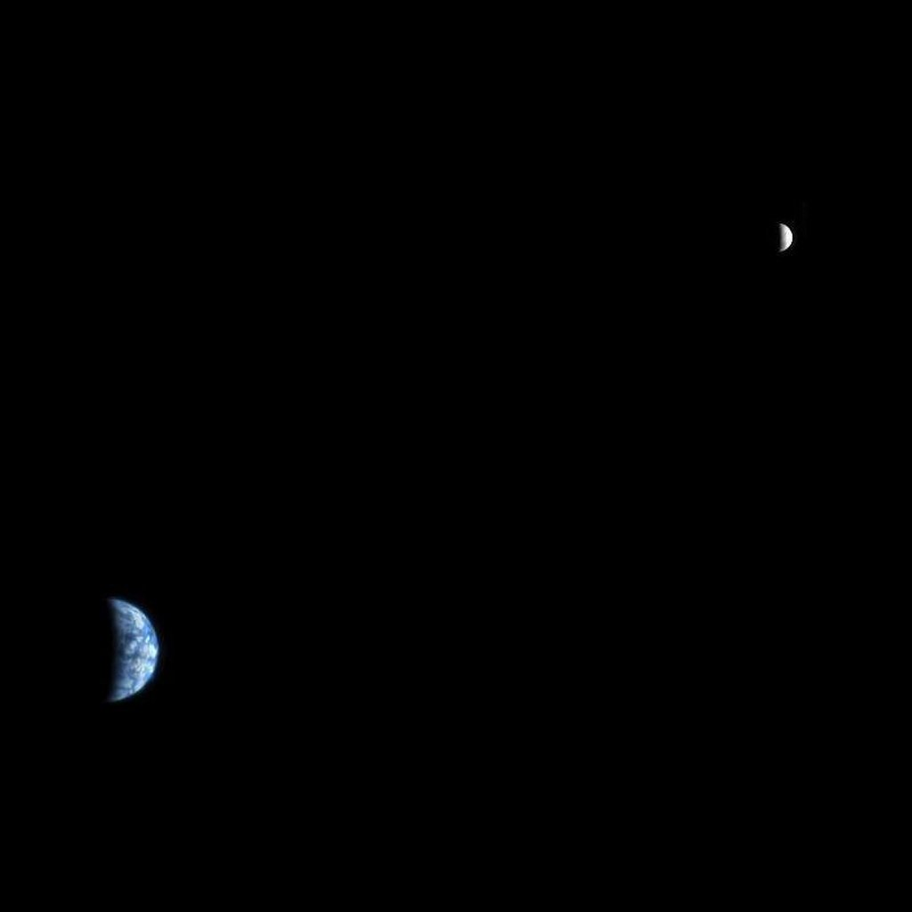Earth and the Moon as seen from [Mars](https://en.wikipedia.org/wiki/Mars "Mars") by the _[Mars Reconnaissance Orbiter](https://en.wikipedia.org/wiki/Mars_Reconnaissance_Orbiter "Mars Reconnaissance Orbiter")_

The Moon is a relatively large, [terrestrial](https://en.wikipedia.org/wiki/Terrestrial_planet "Terrestrial planet"), [planet-like natural satellite](https://en.wikipedia.org/wiki/Planetary-mass_moon "Planetary-mass moon"), with a diameter about one-quarter of Earth's. It is the largest moon in the Solar System relative to the size of its planet, although [Charon](https://en.wikipedia.org/wiki/Charon_\(moon\) "Charon (moon)") is larger relative to the dwarf planet [Pluto](https://en.wikipedia.org/wiki/Pluto "Pluto"). The natural satellites of other planets are also referred to as "moons", after Earth's. The Moon and Earth orbit a common [barycenter](https://en.wikipedia.org/wiki/Barycenter "Barycenter") every 27.32 days relative to the background stars. When combined with the Earth–Moon system's common orbit around the Sun, the period of the [synodic month](https://en.wikipedia.org/wiki/Synodic_month "Synodic month"), from new moon to new moon, is 29.53 days.

Viewed from the [celestial north pole](https://en.wikipedia.org/wiki/Celestial_pole "Celestial pole"), the motion of Earth, the Moon, and their axial rotations are all [counterclockwise](https://en.wikipedia.org/wiki/Counterclockwise "Counterclockwise"). Viewed from Earth, the Moon is just far enough away to have almost the same apparent-sized disk as the Sun. The [angular size](https://en.wikipedia.org/wiki/Angular_size "Angular size") (or [solid angle](https://en.wikipedia.org/wiki/Solid_angle "Solid angle")) of these two bodies match because, although the Sun's diameter is about 400 times as large as the Moon's, it is also 400 times more distant. This allows total and annular solar eclipses to occur on Earth. The orbital planes are not precisely aligned: the Earth-Moon plane is tilted up to ±5.1 degrees against the Earth–Sun plane (the [ecliptic](https://en.wikipedia.org/wiki/Ecliptic "Ecliptic")). Without this tilt, there would be an eclipse every two weeks, alternating between [lunar eclipses](https://en.wikipedia.org/wiki/Lunar_eclipse "Lunar eclipse") and [solar eclipses](https://en.wikipedia.org/wiki/Solar_eclipse "Solar eclipse").

The gravitational attraction between Earth and the Moon causes [lunar tides](https://en.wikipedia.org/wiki/Lunar_tide "Lunar tide") on Earth. The same effect on the Moon has led to its [tidal locking](https://en.wikipedia.org/wiki/Tidal_locking "Tidal locking"): its rotation period is the same as the time it takes to orbit Earth. As a result, it always presents the same face to the planet. As the Moon orbits Earth, different parts of its face are illuminated by the Sun, leading to the [lunar phases](https://en.wikipedia.org/wiki/Lunar_phase "Lunar phase"). Due to their [tidal interaction](https://en.wikipedia.org/wiki/Tidal_interactions "Tidal interactions"), the Moon recedes from Earth at the rate of approximately 38 mm/a (1+1⁄2 in/year). Over millions of years, these tiny modifications—and the lengthening of Earth's day by about 23 [μs](https://en.wikipedia.org/wiki/Microsecond "Microsecond")/yr—add up to significant changes. During the [Ediacaran](https://en.wikipedia.org/wiki/Ediacaran "Ediacaran") period, for example, (approximately 620 Ma) there were 400±7 days in a year, with each day lasting 21.9±0.4 hours.

The Moon may have dramatically affected the development of life by moderating the planet's climate. [Paleontological](https://en.wikipedia.org/wiki/Paleontology "Paleontology") evidence and computer simulations show that Earth's axial tilt is stabilized by tidal interactions with the Moon. Some theorists think that without this stabilization against the [torques](https://en.wikipedia.org/wiki/Torque "Torque") applied by the Sun and planets to Earth's equatorial bulge, the rotational axis might be chaotically unstable, exhibiting large changes over millions of years, as is the case for Mars, though this is disputed.

The most widely accepted theory of the Moon's origin, the [giant-impact hypothesis](https://en.wikipedia.org/wiki/Giant-impact_hypothesis "Giant-impact hypothesis"), states that it formed from the collision of a Mars-size protoplanet called Theia with the early Earth. This hypothesis explains the Moon's relative lack of iron and volatile elements and the fact that its composition is nearly identical to that of Earth's crust. Computer simulations suggest that two blob-like remnants of this protoplanet could be inside the Earth.

### Asteroids and artificial satellites

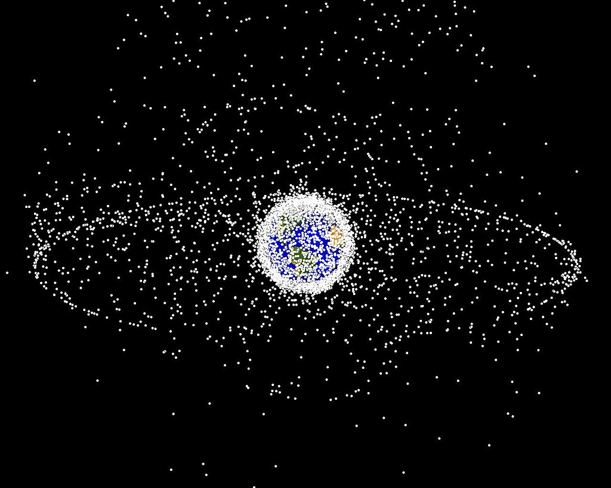A computer-generated image mapping the prevalence of [artificial satellites](https://en.wikipedia.org/wiki/Artificial_satellite "Artificial satellite") and [space debris](https://en.wikipedia.org/wiki/Space_debris "Space debris") around Earth in [geosynchronous](https://en.wikipedia.org/wiki/Geosynchronous_orbit "Geosynchronous orbit") and [low Earth orbit](https://en.wikipedia.org/wiki/Low_Earth_orbit "Low Earth orbit")

Earth's [co-orbital asteroids](https://en.wikipedia.org/wiki/Co-orbital_configuration "Co-orbital configuration") population consists of [quasi-satellites](https://en.wikipedia.org/wiki/Quasi-satellite "Quasi-satellite"), objects with a [horseshoe orbit](https://en.wikipedia.org/wiki/Horseshoe_orbit "Horseshoe orbit") and [trojans](https://en.wikipedia.org/wiki/Trojan_\(celestial_body\) "Trojan (celestial body)"). There are at least seven quasi-satellites, including [469219 Kamoʻoalewa](https://en.wikipedia.org/wiki/469219_Kamoʻoalewa "469219 Kamoʻoalewa"), ranging in diameter from 10 m to 5000 m. A [trojan asteroid](https://en.wikipedia.org/wiki/Earth_trojan "Earth trojan") companion, [2010 TK7](https://en.wikipedia.org/wiki/2010_TK7 "2010 TK7"), is [librating](https://en.wikipedia.org/wiki/Libration "Libration") around the leading [Lagrange triangular point](https://en.wikipedia.org/wiki/Lagrangian_point "Lagrangian point"), L4, in [Earth's orbit](https://en.wikipedia.org/wiki/Earth's_orbit "Earth's orbit") around the Sun. The tiny [near-Earth asteroid](https://en.wikipedia.org/wiki/Near-Earth_asteroid "Near-Earth asteroid") [2006 RH120](https://en.wikipedia.org/wiki/2006_RH120 "2006 RH120") makes close approaches to the Earth–Moon system roughly every twenty years. During these approaches, it can orbit Earth for brief periods of time.

As of September 2021, there are 4,550 operational, human-made [satellites](https://en.wikipedia.org/wiki/Satellite "Satellite") orbiting Earth. There are also inoperative satellites, including [Vanguard 1](https://en.wikipedia.org/wiki/Vanguard_1 "Vanguard 1"), the oldest satellite currently in orbit, and over 16,000 pieces of tracked [space debris](https://en.wikipedia.org/wiki/Space_debris "Space debris"). Earth's largest artificial satellite is the [International Space Station](https://en.wikipedia.org/wiki/International_Space_Station "International Space Station") (ISS).

## Life on Earth

An animation of the changing density of [productive](https://en.wikipedia.org/wiki/Primary_production "Primary production") vegetation on land (low in brown; heavy in dark green) and phytoplankton at the [ocean surface](https://en.wikipedia.org/wiki/Ocean_surface "Ocean surface") (low in purple; high in yellow)

Earth is the only known place that has ever been [habitable](https://en.wikipedia.org/wiki/Planetary_habitability "Planetary habitability") for life. Earth's life developed in Earth's early bodies of water some hundred million years after Earth formed, roughly 4 billion years ago. Earth provides liquid water—an environment where complex [organic molecules](https://en.wikipedia.org/wiki/Organic_compound "Organic compound") can assemble and interact, and sufficient energy to sustain a [metabolism](https://en.wikipedia.org/wiki/Metabolism "Metabolism"). Plants and other organisms take up [nutrients](https://en.wikipedia.org/wiki/Nutrient "Nutrient") from water, soils and the atmosphere. These nutrients are constantly recycled between different species.

Earth's life has been shaping and inhabiting many particular [ecosystems](https://en.wikipedia.org/wiki/Ecosystem "Ecosystem") on Earth and has eventually expanded globally forming an overarching biosphere. Earth's life has also over time greatly diversified, allowing the biosphere to have different [biomes](https://en.wikipedia.org/wiki/Biome "Biome"), which are inhabited by comparatively similar plants and animals. The different biomes developed at distinct elevations or [water depths](https://en.wikipedia.org/wiki/Ocean_depths "Ocean depths"), planetary temperature [latitudes](https://en.wikipedia.org/wiki/Latitude "Latitude") and on land also with different [humidity](https://en.wikipedia.org/wiki/Humidity "Humidity"). [Earth's species diversity](https://en.wikipedia.org/wiki/Latitudinal_gradients_in_species_diversity "Latitudinal gradients in species diversity") and [biomass](https://en.wikipedia.org/wiki/Biomass_\(ecology\) "Biomass (ecology)") reaches a peak in shallow waters and with [forests, particularly in equatorial, warm and humid conditions](https://en.wikipedia.org/wiki/Tropical_rainforest "Tropical rainforest"). While freezing [polar regions](https://en.wikipedia.org/wiki/Polar_regions_of_Earth "Polar regions of Earth") and [high altitudes](https://en.wikipedia.org/wiki/Alpine_tundra "Alpine tundra"), or [extremely arid areas](https://en.wikipedia.org/wiki/Desert "Desert") are relatively barren of plant and animal life.

Therefore, life has impacted Earth, significantly altering Earth's atmosphere and surface over long periods of time, causing changes like the [Great Oxidation Event](https://en.wikipedia.org/wiki/Great_Oxidation_Event "Great Oxidation Event"). Humans furthermore have impacted Earth, its life and development.

### Origin of life and evolution

An impression of the [Archean](https://en.wikipedia.org/wiki/Archean "Archean"), the [eon](https://en.wikipedia.org/wiki/Geologic_time_scale#Divisions_of_geologic_time "Geologic time scale") after Earth's formation, featuring round [stromatolites](https://en.wikipedia.org/wiki/Stromatolite "Stromatolite"), which are early oxygen-producing forms of life from billions of years ago. After the [Late Heavy Bombardment](https://en.wikipedia.org/wiki/Late_Heavy_Bombardment "Late Heavy Bombardment"), [Earth's crust](/source/earths-crust/ "Earth's crust") had cooled, its water-rich barren [surface](https://en.wikipedia.org/wiki/Planetary_surface "Planetary surface") is marked by [continents](https://en.wikipedia.org/wiki/Continent "Continent") and [volcanoes](https://en.wikipedia.org/wiki/Volcano "Volcano"), with the Moon still orbiting Earth half as far as it is today, appearing 2.8 times larger and producing strong [tides](https://en.wikipedia.org/wiki/Tide "Tide").

[Chemical reactions](https://en.wikipedia.org/wiki/Chemical_reaction "Chemical reaction") led to the first self-replicating molecules about four billion years ago. A half billion years later, the [last common ancestor of all current life](https://en.wikipedia.org/wiki/Last_universal_common_ancestor "Last universal common ancestor") arose. The evolution of [photosynthesis](https://en.wikipedia.org/wiki/Photosynthesis "Photosynthesis") allowed the Sun's energy to be harvested directly by life forms. The resultant [molecular oxygen](https://en.wikipedia.org/wiki/Molecular_oxygen "Molecular oxygen") (O2) accumulated in the atmosphere and due to interaction with ultraviolet solar radiation, formed a protective [ozone layer](https://en.wikipedia.org/wiki/Ozone_layer "Ozone layer") (O3) in the upper atmosphere. The incorporation of smaller cells within larger ones resulted in the [development of complex cells](https://en.wikipedia.org/wiki/Endosymbiotic_theory "Endosymbiotic theory") called [eukaryotes](https://en.wikipedia.org/wiki/Eukaryote "Eukaryote"). True multicellular organisms formed as cells within [colonies](https://en.wikipedia.org/wiki/Colony_\(biology\) "Colony (biology)") became increasingly specialized. Aided by the absorption of harmful [ultraviolet radiation](https://en.wikipedia.org/wiki/Ultraviolet_radiation "Ultraviolet radiation") by the ozone layer, life colonized Earth's surface. Among the earliest [fossil](https://en.wikipedia.org/wiki/Fossil "Fossil") evidence for life is [microbial mat](https://en.wikipedia.org/wiki/Microbial_mat "Microbial mat") fossils found in 3.48 billion-year-old [sandstone](https://en.wikipedia.org/wiki/Sandstone "Sandstone") in [Western Australia](https://en.wikipedia.org/wiki/Western_Australia "Western Australia"), [biogenic](https://en.wikipedia.org/wiki/Biogenic_substance "Biogenic substance") [graphite](https://en.wikipedia.org/wiki/Graphite "Graphite") found in 3.7 billion-year-old [metasedimentary](https://en.wikipedia.org/wiki/Metasediment "Metasediment") rocks in [Western Greenland](https://en.wikipedia.org/wiki/Western_Greenland "Western Greenland"), and remains of [biotic material](https://en.wikipedia.org/wiki/Biotic_material "Biotic material") found in 4.1 billion-year-old rocks in Western Australia. The [earliest direct evidence of life](https://en.wikipedia.org/wiki/Earliest_known_life_forms "Earliest known life forms") on Earth is contained in 3.45 billion-year-old [Australian](https://en.wikipedia.org/wiki/Australia_\(continent\) "Australia (continent)") rocks showing fossils of [microorganisms](https://en.wikipedia.org/wiki/Microorganism "Microorganism").

During the [Neoproterozoic](https://en.wikipedia.org/wiki/Neoproterozoic "Neoproterozoic"), 1000 to 539 Ma, much of Earth might have been covered in ice. This hypothesis has been termed "[Snowball Earth](https://en.wikipedia.org/wiki/Snowball_Earth "Snowball Earth")", and it is of particular interest because it preceded the [Cambrian explosion](https://en.wikipedia.org/wiki/Cambrian_explosion "Cambrian explosion"), when multicellular life forms significantly increased in complexity. Following the Cambrian explosion, 535 Ma, there have been at least five major [mass extinctions](https://en.wikipedia.org/wiki/Extinction_event "Extinction event") and many minor ones. Apart from the proposed current [Holocene extinction](https://en.wikipedia.org/wiki/Holocene_extinction "Holocene extinction") event, the [most recent](https://en.wikipedia.org/wiki/Cretaceous–Paleogene_extinction_event "Cretaceous–Paleogene extinction event") was 66 Ma, when [an asteroid impact](https://en.wikipedia.org/wiki/Chicxulub_impactor "Chicxulub impactor") triggered the extinction of non-avian dinosaurs and other large reptiles, but largely spared small animals, such as insects, [mammals](https://en.wikipedia.org/wiki/Mammal "Mammal"), lizards, and birds. Mammalian life has diversified over the past 66 Mys, and several million years ago, an African [ape](https://en.wikipedia.org/wiki/Ape "Ape") species gained the ability to stand upright. This facilitated tool use and encouraged communication that provided the nutrition and stimulation needed for a larger brain, which led to the [evolution of humans](https://en.wikipedia.org/wiki/Human_evolution "Human evolution"). The [development of agriculture](https://en.wikipedia.org/wiki/History_of_agriculture "History of agriculture"), and then [civilization](https://en.wikipedia.org/wiki/List_of_ancient_civilizations "List of ancient civilizations"), led to humans having an [influence on Earth](https://en.wikipedia.org/wiki/Human_impact_on_the_environment "Human impact on the environment") and the nature and quantity of other life forms that continues to this day.

### Challenges for life on Earth

[Extreme weather](https://en.wikipedia.org/wiki/Extreme_weather "Extreme weather"), such as [tropical cyclones](https://en.wikipedia.org/wiki/Tropical_cyclone "Tropical cyclone"), occurs over most of Earth's surface and has a large impact on life in those areas. From 1980 to 2000, these events caused an average of 11,800 human deaths per year. Many places are subject to [earthquakes](https://en.wikipedia.org/wiki/Earthquake "Earthquake"), [landslides](https://en.wikipedia.org/wiki/Landslide "Landslide"), [tsunamis](https://en.wikipedia.org/wiki/Tsunami "Tsunami"), [volcanic eruptions](https://en.wikipedia.org/wiki/Volcanic_eruption "Volcanic eruption"), [tornadoes](https://en.wikipedia.org/wiki/Tornado "Tornado"), [blizzards](https://en.wikipedia.org/wiki/Blizzard "Blizzard"), [floods](https://en.wikipedia.org/wiki/Flood "Flood"), [droughts](https://en.wikipedia.org/wiki/Drought "Drought"), [wildfires](https://en.wikipedia.org/wiki/Wildfire "Wildfire"), and other calamities and disasters. [Human impact](https://en.wikipedia.org/wiki/Human_impact_on_the_environment "Human impact on the environment") is felt in many areas due to pollution of the air and water, [acid rain](https://en.wikipedia.org/wiki/Acid_rain "Acid rain"), loss of vegetation ([overgrazing](https://en.wikipedia.org/wiki/Overgrazing "Overgrazing"), [deforestation](https://en.wikipedia.org/wiki/Deforestation "Deforestation"), [desertification](https://en.wikipedia.org/wiki/Desertification "Desertification")), loss of wildlife, species [extinction](https://en.wikipedia.org/wiki/Extinction "Extinction"), [soil degradation](https://en.wikipedia.org/wiki/Soil_degradation "Soil degradation"), [soil depletion](https://en.wikipedia.org/wiki/Soil_depletion "Soil depletion") and [erosion](https://en.wikipedia.org/wiki/Erosion "Erosion"). Human activities release greenhouse gases into the atmosphere which cause [global warming](https://en.wikipedia.org/wiki/Global_warming "Global warming"). This is driving [changes](https://en.wikipedia.org/wiki/Effects_of_climate_change "Effects of climate change") such as the [melting of glaciers and ice sheets](https://en.wikipedia.org/wiki/Retreat_of_glaciers_since_1850 "Retreat of glaciers since 1850"), a [global rise in average sea levels](https://en.wikipedia.org/wiki/Sea_level_rise "Sea level rise"), increased risk of drought and wildfires, and migration of species to colder areas.

## Earth and humans

### Human geography

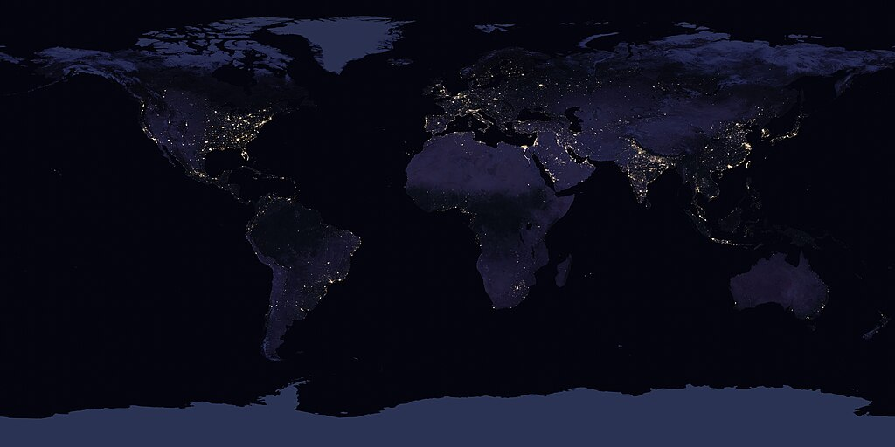A composite image of [artificial light emissions](https://en.wikipedia.org/wiki/Light_pollution "Light pollution") at night on a map of Earth

Humans, who originated from earlier [primates](https://en.wikipedia.org/wiki/Primate "Primate") in Eastern Africa 300,000years ago, [have since been migrating](https://en.wikipedia.org/wiki/History_of_human_migration "History of human migration") around Earth, and with the advent of agriculture in the 10th millennium BCE, have been increasingly [settling](https://en.wikipedia.org/wiki/Sedentism "Sedentism") Earth's land. In the 20th century, [Antarctica](https://en.wikipedia.org/wiki/Antarctica "Antarctica") became the last continent to be explored and settled by humans, although human presence there remains limited. Since the 19th century, the [human population](https://en.wikipedia.org/wiki/World_population "World population") has grown exponentially to eight billion in the 2020s, and is projected to peak at around ten billion in the second half of the 21st century. Most of the growth is expected to take place in [sub-Saharan Africa](https://en.wikipedia.org/wiki/Sub-Saharan_Africa "Sub-Saharan Africa").

Distribution and [density of human population](https://en.wikipedia.org/wiki/Population_density#Human_population_density "Population density") varies greatly around the world with the majority living in south to eastern Asia and 90% inhabiting the [Northern Hemisphere](https://en.wikipedia.org/wiki/Northern_Hemisphere "Northern Hemisphere") of Earth, partly due to the [hemispherical predominance of the world's land mass](https://en.wikipedia.org/wiki/Land_hemisphere "Land hemisphere"), with 68% of the world's land mass being in the Northern Hemisphere. Furthermore, since the 19th century humans have increasingly converged into [urban areas](https://en.wikipedia.org/wiki/Urban_area "Urban area"), with the majority living in urban areas by the 21st century.

Beyond Earth's surface, humans have lived only in a few special-purpose deep [underground](https://en.wikipedia.org/wiki/Underground_living "Underground living") and [underwater](https://en.wikipedia.org/wiki/Underwater_living "Underwater living") presences and a few [space stations](https://en.wikipedia.org/wiki/Space_station "Space station"). The human population virtually completely remains on Earth's surface, fully depending on Earth and the environment it sustains. Since the second half of the 20th century, some hundreds of humans have temporarily [stayed beyond Earth](https://en.wikipedia.org/wiki/List_of_space_travellers_by_first_flight "List of space travellers by first flight"), a tiny fraction of whom have reached another celestial body, the Moon.

Earth has been subject to extensive human settlement, and humans have developed diverse societies and cultures. Most of Earth's land has been territorially claimed since the 19th century by [sovereign states](https://en.wikipedia.org/wiki/Sovereign_state "Sovereign state") (countries) separated by [political borders](https://en.wikipedia.org/wiki/Border "Border"), and [205 such states](https://en.wikipedia.org/wiki/List_of_sovereign_states "List of sovereign states") exist today, with only parts of Antarctica and a few small regions [remaining unclaimed](https://en.wikipedia.org/wiki/Terra_nullius "Terra nullius"). Together, most of these states form the [United Nations](https://en.wikipedia.org/wiki/United_Nations "United Nations"), the leading worldwide [intergovernmental organization](https://en.wikipedia.org/wiki/Intergovernmental_organization "Intergovernmental organization"), which extends human governance [over the ocean](https://en.wikipedia.org/wiki/Law_of_the_Sea "Law of the Sea") and [Antarctica](https://en.wikipedia.org/wiki/Antarctic_Treaty_System "Antarctic Treaty System"), and therefore all of Earth.

### Natural resources and land use

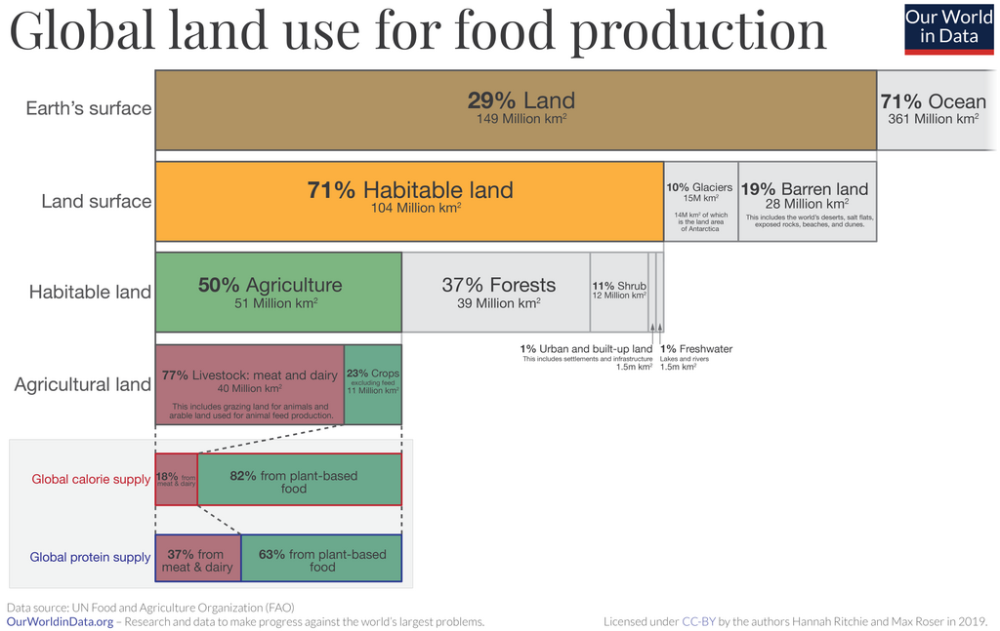Earth's land use for human agriculture in 2019

Earth has resources that have been exploited by humans. Those termed [non-renewable resources](https://en.wikipedia.org/wiki/Non-renewable_resource "Non-renewable resource"), such as [fossil fuels](https://en.wikipedia.org/wiki/Fossil_fuel "Fossil fuel"), are only replenished over geological timescales. Large deposits of fossil fuels are obtained from Earth's crust, consisting of coal, petroleum, and natural gas. These deposits are used by humans both for energy production and as feedstock for chemical production. Mineral [ore](https://en.wikipedia.org/wiki/Ore "Ore") bodies have also been formed within the crust through a process of [ore genesis](https://en.wikipedia.org/wiki/Ore_genesis "Ore genesis"), resulting from actions of [magmatism](https://en.wikipedia.org/wiki/Magmatism "Magmatism"), erosion, and plate tectonics. These metals and other elements are extracted by mining, a process which often causes environmental and health damage.

Earth's biosphere produces many useful biological products for humans, including food, wood, [pharmaceuticals](https://en.wikipedia.org/wiki/Pharmaceutical "Pharmaceutical"), oxygen, and the recycling of organic waste. The land-based ecosystem depends upon [topsoil](https://en.wikipedia.org/wiki/Topsoil "Topsoil") and fresh water, and the oceanic ecosystem depends on dissolved nutrients washed down from the land. In 2019, 39 million km2 (15 million sq mi) of Earth's land surface consisted of forest and woodlands, 12 million km2 (4.6 million sq mi) was shrub and grassland, 40 million km2 (15 million sq mi) were used for animal feed production and grazing, and 11 million km2 (4.2 million sq mi) were cultivated as croplands. Of the 12–14% of ice-free land that is used for croplands, 2 [percentage points](https://en.wikipedia.org/wiki/Percentage_point "Percentage point") were irrigated in 2015. Humans use natural and manufactured [building materials](https://en.wikipedia.org/wiki/Building_material "Building material") to construct shelters and infrastructure.

### Environmental impact

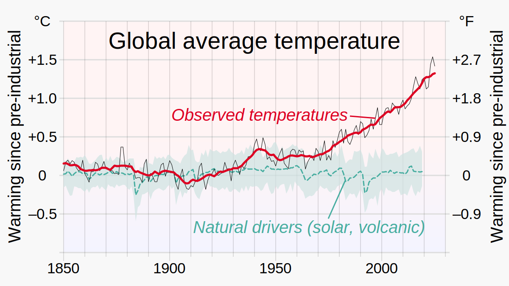Overall increase in average surface air temperature juxtaposed with natural drivers: human activity has caused increased temperatures, with natural forces adding some variability.

Human activities have impacted Earth's environments. Through activities such as the burning of fossil fuels, humans have been increasing the amount of [greenhouse gases](https://en.wikipedia.org/wiki/Greenhouse_gas "Greenhouse gas") in the atmosphere, altering [Earth's energy budget](https://en.wikipedia.org/wiki/Earth's_energy_budget "Earth's energy budget") and climate. It is estimated that global temperatures in the year 2020 were 1.2 °C (2.2 °F) warmer than the preindustrial baseline. This increase in temperature, known as [global warming](https://en.wikipedia.org/wiki/Global_warming "Global warming"), has contributed to the [melting of glaciers](https://en.wikipedia.org/wiki/Retreat_of_glaciers_since_1850 "Retreat of glaciers since 1850"), [rising sea levels](https://en.wikipedia.org/wiki/Sea_level_rise "Sea level rise"), increased risk of drought and wildfires, and migration of species to colder areas.

The concept of [planetary boundaries](https://en.wikipedia.org/wiki/Planetary_boundaries "Planetary boundaries") was introduced to quantify humanity's impact on Earth. Of the nine identified boundaries, five have been crossed: [Biosphere integrity](https://en.wikipedia.org/wiki/Biodiversity_loss "Biodiversity loss"), climate change, chemical pollution, destruction of wild habitats and the [nitrogen cycle](https://en.wikipedia.org/wiki/Nitrogen_cycle "Nitrogen cycle") are thought to have passed the safe threshold. As of 2018, no country meets the basic needs of its population without transgressing planetary boundaries. It is thought possible to provide all basic physical needs globally within sustainable levels of resource use.

### Cultural and historical viewpoint

[Human cultures](https://en.wikipedia.org/wiki/Culture "Culture") have developed many views of the planet. The standard [astronomical symbols](https://en.wikipedia.org/wiki/Astronomical_symbols "Astronomical symbols") of Earth are a quartered circle, , representing the [four corners of the world](https://en.wikipedia.org/wiki/Four_corners_of_the_world "Four corners of the world"), and a [globus cruciger](https://en.wikipedia.org/wiki/Globus_cruciger "Globus cruciger"), . Earth is sometimes [personified](https://en.wikipedia.org/wiki/Personification "Personification") as a [deity](https://en.wikipedia.org/wiki/Deity "Deity"). In many cultures, it is a [mother goddess](https://en.wikipedia.org/wiki/Mother_goddess "Mother goddess") that is also the primary [fertility deity](https://en.wikipedia.org/wiki/Fertility_deity "Fertility deity"). [Creation myths](https://en.wikipedia.org/wiki/Creation_myth "Creation myth") in many religions involve the creation of Earth by a supernatural deity or deities. The [Gaia hypothesis](https://en.wikipedia.org/wiki/Gaia_hypothesis "Gaia hypothesis"), developed in the mid-20th century, compared Earth's environments and life as a single self-regulating organism leading to broad stabilization of the conditions of habitability.

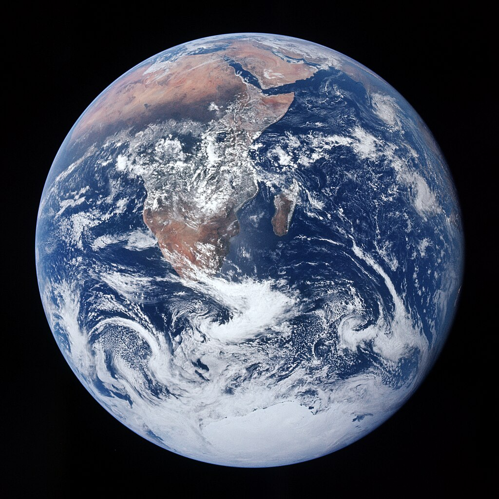

_[The Blue Marble](https://en.wikipedia.org/wiki/The_Blue_Marble "The Blue Marble")_, a photograph of Earth from [Apollo 17](https://en.wikipedia.org/wiki/Apollo_17 "Apollo 17").

_[Hello, World](https://en.wikipedia.org/wiki/Hello,_World_\(NASA\) "Hello, World (NASA)")_, a photograph of Earth from [Artemis II](https://en.wikipedia.org/wiki/Artemis_II "Artemis II").

[Images of Earth taken from space](https://en.wikipedia.org/wiki/Timeline_of_first_images_of_Earth_from_space "Timeline of first images of Earth from space"), particularly _[Earthrise](https://en.wikipedia.org/wiki/Earthrise "Earthrise")_ and _[The Blue Marble](https://en.wikipedia.org/wiki/The_Blue_Marble "The Blue Marble")_, have been credited with altering the way that people viewed the planet that they lived on, called the [overview effect](https://en.wikipedia.org/wiki/Overview_effect "Overview effect"), emphasizing its beauty, uniqueness and apparent fragility. In particular, this caused a realization of the scope of effects from human activity on Earth's environment. Enabled by science, particularly [Earth observation](https://en.wikipedia.org/wiki/Earth_observation "Earth observation"), humans have started to take [action on environmental issues](https://en.wikipedia.org/wiki/Environmentalism "Environmentalism") globally, acknowledging the impact of humans and the [interconnectedness of Earth's environments](https://en.wikipedia.org/wiki/Ecological_network "Ecological network").

Scientific investigation has resulted in several culturally transformative shifts in people's view of the planet. Initial belief in a [flat Earth](https://en.wikipedia.org/wiki/Flat_Earth "Flat Earth") was gradually displaced in [Ancient Greece](https://en.wikipedia.org/wiki/Ancient_Greece "Ancient Greece") by the idea of a [spherical Earth](https://en.wikipedia.org/wiki/Spherical_Earth "Spherical Earth"), which was attributed to both the philosophers [Pythagoras](https://en.wikipedia.org/wiki/Pythagoras "Pythagoras") and [Parmenides](https://en.wikipedia.org/wiki/Parmenides "Parmenides"). Earth was generally believed to be [the center of the universe](https://en.wikipedia.org/wiki/Geocentrism "Geocentrism") until the 16th century, when scientists first concluded that it was [a moving object](https://en.wikipedia.org/wiki/Heliocentrism "Heliocentrism"), one of the planets of the Solar System.

It was only during the 19th century that geologists realized [Earth's age](https://en.wikipedia.org/wiki/Earth's_age "Earth's age") was at least many millions of years. [Lord Kelvin](https://en.wikipedia.org/wiki/Lord_Kelvin "Lord Kelvin") used [thermodynamics](https://en.wikipedia.org/wiki/Thermodynamics "Thermodynamics") to estimate the age of Earth to be between 20 million and 400 million years in 1864, sparking a vigorous debate on the subject; it was only when radioactivity and [radioactive dating](https://en.wikipedia.org/wiki/Radiometric_dating "Radiometric dating") were discovered in the late 19th and early 20th centuries that a reliable mechanism for determining Earth's age was established, proving the planet to be billions of years old.
