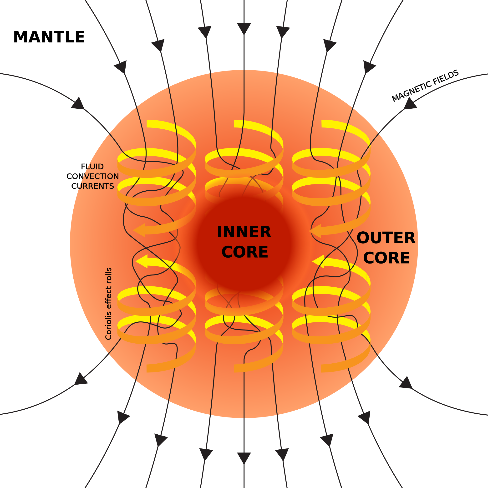

The internal structure of EarthSchematic view of [Earth's interior structure](/source/internal-structure-of-earth/ "Internal structure of Earth").

1.   [continental crust](https://en.wikipedia.org/wiki/Continental_crust "Continental crust")

2.   [oceanic crust](https://en.wikipedia.org/wiki/Oceanic_crust "Oceanic crust")

3.   upper [mantle](https://en.wikipedia.org/wiki/Earth's_mantle "Earth's mantle")

4.   lower mantle

5.   [outer core](/source/earths-outer-core/ "Earth's outer core")

6.   inner core

1.  [Mohorovičić discontinuity](https://en.wikipedia.org/wiki/Mohorovičić_discontinuity "Mohorovičić discontinuity")
2.  [core–mantle boundary](https://en.wikipedia.org/wiki/Core–mantle_boundary "Core–mantle boundary")
3.  outer core–inner core boundary

**Earth's inner core** is the innermost [geologic layer](/source/internal-structure-of-earth/ "Internal structure of Earth") of the planet [Earth](/source/earth/ "Earth"). It is primarily a [solid](https://en.wikipedia.org/wiki/Solid "Solid") [ball](https://en.wikipedia.org/wiki/Ball_\(mathematics\) "Ball (mathematics)") with a [radius](https://en.wikipedia.org/wiki/Radius "Radius") of about 1,230 km (760 mi), which is about 20% of Earth's radius or 70% of the [Moon](https://en.wikipedia.org/wiki/Moon "Moon")'s radius.

There are no samples of the core accessible for direct measurement, as there are for [Earth's mantle](https://en.wikipedia.org/wiki/Earth's_mantle "Earth's mantle"). The characteristics of the core have been deduced mostly from measurements of [seismic waves](https://en.wikipedia.org/wiki/Seismic_waves "Seismic waves") and [Earth's magnetic field](https://en.wikipedia.org/wiki/Earth's_magnetic_field "Earth's magnetic field"). The inner core is believed to be composed of an [iron–nickel alloy](https://en.wikipedia.org/wiki/Iron–nickel_alloy "Iron–nickel alloy") with some other elements. The temperature at its surface is estimated to be approximately 5,700 K (5,430 °C; 9,800 °F), about the temperature at the surface of the [Sun](https://en.wikipedia.org/wiki/Sun "Sun").

The inner core is solid at high temperature because of its high pressure, in accordance with the [Simon-Glatzel equation](https://en.wikipedia.org/wiki/Simon-Glatzel_equation "Simon-Glatzel equation").

## Scientific history

Earth was discovered to have a solid inner core distinct from its molten [outer core](/source/earths-outer-core/ "Earth's outer core") in 1936, by the Danish seismologist [Inge Lehmann](https://en.wikipedia.org/wiki/Inge_Lehmann "Inge Lehmann")'s study of seismograms from earthquakes in [New Zealand](https://en.wikipedia.org/wiki/New_Zealand "New Zealand"), detected by sensitive [seismographs](https://en.wikipedia.org/wiki/Seismographs "Seismographs") on the Earth's surface. She deduced that the seismic waves reflect off the boundary of the inner core and inferred a radius of 1,400 km (870 mi) for the inner core, not far from the currently accepted value of 1,221 km (759 mi). In 1938, [Beno Gutenberg](https://en.wikipedia.org/wiki/Beno_Gutenberg "Beno Gutenberg") and [Charles Richter](https://en.wikipedia.org/wiki/Charles_Richter "Charles Richter") analyzed a more extensive set of data and estimated the thickness of the outer core as 1,950 km (1,210 mi) with a steep but continuous 300 km (190 mi) thick transition to the inner core, implying a radius between 1,230 and 1,530 km (760 and 950 mi) for the inner core.

A few years later, in 1940, it was hypothesized that this inner core was made of solid iron. In 1952, [Francis Birch](https://en.wikipedia.org/wiki/Francis_Birch_\(geophysicist\) "Francis Birch (geophysicist)") published a detailed analysis of the available data and concluded that the inner core was probably crystalline iron.

The boundary between the inner and outer cores is sometimes called the "Lehmann discontinuity", although the name usually refers to [another discontinuity](https://en.wikipedia.org/wiki/Lehmann_discontinuity "Lehmann discontinuity"). The name "Bullen" or "Lehmann-Bullen discontinuity", after [Keith Edward Bullen](https://en.wikipedia.org/wiki/Keith_Edward_Bullen "Keith Edward Bullen"), has been proposed, but its use seems to be rare. The rigidity of the inner core was confirmed in 1971.

[Adam Dziewonski](https://en.wikipedia.org/wiki/Adam_Dziewonski "Adam Dziewonski") and [James Freeman Gilbert](https://en.wikipedia.org/wiki/James_Freeman_Gilbert "James Freeman Gilbert") established that measurements of [normal modes](https://en.wikipedia.org/wiki/Normal_mode "Normal mode") of [vibration](https://en.wikipedia.org/wiki/Vibration "Vibration") of Earth caused by large earthquakes were consistent with a liquid outer core. In 2005, [shear waves](https://en.wikipedia.org/wiki/S-waves "S-waves") were detected passing through the inner core; these claims were initially controversial, but are now gaining acceptance.

## Data sources

### Seismic waves

Almost all measurements that scientists have about the physical properties of the inner core are the seismic waves that pass through it. Deep earthquakes generate the most informative waves, 30 km or more below the surface of the Earth (where the mantle is relatively more homogeneous) and are recorded by [seismographs](https://en.wikipedia.org/wiki/Seismograph "Seismograph") as they reach the surface, all over the world.

Seismic waves include "P" (primary or pressure) [compressional waves](https://en.wikipedia.org/wiki/Compressional_wave "Compressional wave") that can travel through solid or liquid materials, and "S" (secondary or shear) [shear waves](https://en.wikipedia.org/wiki/Shear_waves "Shear waves") that can only propagate through rigid elastic solids. The two waves have different velocities and are [damped](https://en.wikipedia.org/wiki/Damping_ratio "Damping ratio") at different rates as they travel through the same material.

Of particular interest are the so-called "PKiKP" waves—pressure waves (P) that start near the surface, cross the mantle-core boundary, travel through the core (K), are reflected at the inner core boundary (i), cross the liquid core (K) again, cross back into the mantle, and are detected as pressure waves (P) at the surface. Also of interest are the "PKIKP" waves, that travel through the inner core (I) instead of being reflected at its surface (i). Those signals are easier to interpret when the path from source to detector is close to a straight line—namely, when the receiver is just above the source for the reflected PKiKP waves, and [antipodal](https://en.wikipedia.org/wiki/Antipodes "Antipodes") to it for the transmitted PKIKP waves.

While S waves cannot reach or leave the inner core as such, P waves can be converted into S waves, and vice versa, as they hit the boundary between the inner and outer core at an oblique angle. The "PKJKP" waves are similar to the PKIKP waves, but are converted into S waves when they enter the inner core, travel through it as S waves (J), and are converted again into P waves when they exit the inner core. Thanks to this phenomenon, it is known that the inner core can propagate S waves, and therefore must be solid.

### Other sources

Other sources of information about the inner core include

*   the [Earth's magnetic field](https://en.wikipedia.org/wiki/Earth's_magnetic_field "Earth's magnetic field"). While it seems to be generated mostly by fluid and electric currents in the outer core, those currents are strongly affected by the presence of the solid inner core and by the heat that flows out of it. (Although made of iron, the core is not [ferromagnetic](https://en.wikipedia.org/wiki/Ferromagnetism "Ferromagnetism"), due to being above the [Curie temperature](https://en.wikipedia.org/wiki/Curie_temperature "Curie temperature").)
*   the Earth's mass, its [gravitational field](https://en.wikipedia.org/wiki/Earth's_gravity "Earth's gravity"), and its [angular inertia](https://en.wikipedia.org/wiki/Moment_of_inertia "Moment of inertia"). These are all affected by the density and dimensions of the inner layers.
*   the natural oscillation frequencies and [modes](https://en.wikipedia.org/wiki/Oscillation_mode "Oscillation mode") of the whole Earth oscillations, when large earthquakes make the planet "ring" like a [bell](https://en.wikipedia.org/wiki/Bell "Bell"). These oscillations also depend strongly on the inner layers' density, size, and shape.

## Physical properties

### Seismic wave velocity

The velocity of the S waves in the core varies smoothly from about 3.7 km/s at the center to about 3.5 km/s at the surface. That is considerably less than the velocity of S waves in the lower crust (about 4.5 km/s) and less than half the velocity in the deep mantle, just above the outer core (about 7.3 km/s).

The velocity of the P-waves in the core also varies smoothly through the inner core, from about 11.4 km/s at the center to about 11.1 km/s at the surface. Then the speed drops abruptly at the inner-outer core boundary to about 10.4 km/s.

### Size and shape

On the basis of the seismic data, the inner core is estimated to be about 1221 km in radius (2442 km in diameter), which is about 19% of the radius of the Earth and 70% of the radius of the Moon.

Its volume is about 7.6 billion cubic km (7.\. × 1018 m3), which is about 1⁄146 (0.69%) of the volume of the whole Earth.

Its shape is believed to be close to an [oblate ellipsoid](https://en.wikipedia.org/wiki/Oblate_ellipsoid "Oblate ellipsoid") of revolution, like the surface of the Earth, only more spherical: the [flattening](https://en.wikipedia.org/wiki/Equatorial_bulge "Equatorial bulge")  _f_  is estimated to be between 1⁄400 and 1⁄416, meaning that the radius along the Earth's axis is estimated to be about 3 km shorter than the radius at the equator. In comparison, the flattening of the Earth as a whole is close to 1⁄300, and the polar radius is 21 km shorter than the equatorial one.

### Pressure and gravity

The pressure in the Earth's inner core is slightly higher than it is at the boundary between the outer and inner cores: It ranges from about 330 to 360 gigapascals (3,300,000 to 3,600,000 atm).

The [acceleration of gravity](https://en.wikipedia.org/wiki/Gravitational_acceleration "Gravitational acceleration") at the surface of the inner core can be computed to be 4.3 m/s2; which is less than half the value at the surface of the Earth (9.8 m/s2).

### Density and mass

The density of the inner core is believed to vary smoothly from about 13.0 kg/L (= g/cm3 = [t](https://en.wikipedia.org/wiki/Metric_ton "Metric ton")/m3) at the center to about 12.8 kg/L at the surface. As it happens with other material properties, the density drops suddenly at that surface: The liquid just above the inner core is believed to be significantly less dense, at about 12.1 kg/L. For comparison, the average density in the upper 100 km of the Earth is about 3.4 kg/L.

That density implies a mass of about 1023 kg for the inner core, which is 1⁄60 (1.7%) of the mass of the whole Earth.

### Temperature

The temperature of the inner core can be estimated from the melting temperature of impure iron at the pressure which iron is under at the boundary of the inner core (about 330 [GPa](https://en.wikipedia.org/wiki/GPa "GPa")). From these considerations, in 2002, D. Alfè and others estimated its temperature as between 5,400 K (5,100 °C; 9,300 °F) and 5,700 K (5,400 °C; 9,800 °F). However, in 2013, S. Anzellini and others obtained experimentally a substantially higher temperature for the [melting point](https://en.wikipedia.org/wiki/Melting_point "Melting point") of iron, 6,230 ± 500 K (5,957 ± 500 °C; 10,754 ± 900 °F).

Iron can be solid at such high temperatures only because its melting temperature increases dramatically at pressures of that magnitude (see the [Clausius–Clapeyron relation](https://en.wikipedia.org/wiki/Clausius–Clapeyron_relation "Clausius–Clapeyron relation")).

### Magnetic field

In 2010, Bruce Buffett determined that the average [magnetic field](https://en.wikipedia.org/wiki/Geomagnetic_field "Geomagnetic field") in the liquid outer core is about 2.5 [milliteslas](https://en.wikipedia.org/wiki/Millitesla "Millitesla") (25 [gauss](https://en.wikipedia.org/wiki/Gauss_\(unit\) "Gauss (unit)")), which is about 40 times the maximum strength at the surface. He started from the known fact that the Moon and Sun cause [tides](https://en.wikipedia.org/wiki/Tides "Tides") in the liquid outer core, just as they do on the [oceans](https://en.wikipedia.org/wiki/Ocean "Ocean") on the surface. He observed that motion of the liquid through the local magnetic field creates [electric currents](https://en.wikipedia.org/wiki/Electric_current "Electric current"), that dissipate energy as heat according to [Ohm's law](https://en.wikipedia.org/wiki/Ohm's_law "Ohm's law"). This dissipation, in turn, damps the tidal motions and explains previously detected anomalies in Earth's [nutation](https://en.wikipedia.org/wiki/Nutation "Nutation"). From the magnitude of the latter effect he could calculate the magnetic field. The field inside the inner core presumably has a similar strength. While indirect, this measurement does not depend significantly on any assumptions about the evolution of the Earth or the composition of the core.

### Viscosity

Although seismic waves propagate through the core as if it were solid, [the measurements](https://en.wikipedia.org/wiki/Seismometry "Seismometry") cannot distinguish a solid material from an extremely [viscous](https://en.wikipedia.org/wiki/Viscosity "Viscosity") one. Some scientists have therefore considered whether there may be slow convection in the inner core (as is believed to exist in the mantle). That could be an explanation for the [anisotropy](https://en.wikipedia.org/wiki/Anisotropy "Anisotropy") detected in seismic studies. In 2009, B. Buffett estimated the viscosity of the inner core at 1018 [Pa](https://en.wikipedia.org/wiki/Pascal_\(unit\) "Pascal (unit)")·s, which is a sextillion times the viscosity of water, and more than a billion times that of [pitch](https://en.wikipedia.org/wiki/Pitch_\(resin\) "Pitch (resin)").

## Composition

There is still no direct evidence about the composition of the inner core. However, based on the relative prevalence of various chemical elements in the [Solar System](https://en.wikipedia.org/wiki/Solar_System "Solar System"), the theory of [planetary formation](https://en.wikipedia.org/wiki/Formation_and_evolution_of_the_Solar_System#Terrestrial_planets "Formation and evolution of the Solar System"), and constraints imposed or implied by the chemistry of the rest of the Earth's volume, the inner core is believed to consist primarily of an [iron–nickel alloy](https://en.wikipedia.org/wiki/Iron–nickel_alloy "Iron–nickel alloy").

At the estimated pressures and temperatures of the core, it is predicted that pure iron could be solid, but its density would exceed the known density of the core by approximately 3%. That result implies the presence of lighter elements in the core, such as [silicon](https://en.wikipedia.org/wiki/Silicon "Silicon"), [oxygen](https://en.wikipedia.org/wiki/Oxygen "Oxygen"), or [sulfur](https://en.wikipedia.org/wiki/Sulfur "Sulfur"), in addition to the probable presence of nickel. Recent estimates (2007) allow for up to 10% nickel and 2–3% of unidentified lighter elements.

According to computations by D. Alfè and others, the liquid outer core contains 8–13% of oxygen, but as the iron crystallizes out to form the inner core the oxygen is mostly left in the liquid.

Laboratory experiments and analysis of seismic wave velocities seem to indicate that the inner core consists specifically of [ε-iron](https://en.wikipedia.org/wiki/Ε-iron "Ε-iron"), a crystalline form of the metal with the hexagonal close-packed (hcp) structure. That structure can still admit the inclusion of small amounts of nickel and other elements.

## Structure

Many scientists had initially expected that the inner core would be found to be [homogeneous](https://en.wikipedia.org/wiki/Homogeneous_mixture "Homogeneous mixture"), because that same process should have proceeded uniformly during its entire formation. It was even suggested that Earth's inner core might be a [single crystal](https://en.wikipedia.org/wiki/Single_crystal "Single crystal") of iron.

### Axis-aligned anisotropy

In 1983, G. Poupinet and others observed that the travel time of PKIKP waves (P waves that travel through the inner core) was about 2 seconds less for straight north–south paths than straight paths on the equatorial plane. Even taking into account the flattening of the Earth at the poles (about 0.33% for the whole Earth, 0.25% for the inner core) and crust and [upper mantle](https://en.wikipedia.org/wiki/Upper_mantle "Upper mantle") heterogeneities, this difference implied that P waves (of a broad range of [wavelengths](https://en.wikipedia.org/wiki/Wavelengths "Wavelengths")) travel through the inner core about 1% faster in the north–south direction than along directions perpendicular to that.

This P wave speed [anisotropy](https://en.wikipedia.org/wiki/Anisotropy "Anisotropy") has been confirmed by later studies, including more seismic data and study of the free oscillations of the whole Earth. Some authors have claimed higher values for the difference, up to 4.8%; however, in 2017 [Daniel Frost](https://en.wikipedia.org/wiki/Daniel_Frost_\(earth_scientist\) "Daniel Frost (earth scientist)") and [Barbara Romanowicz](https://en.wikipedia.org/wiki/Barbara_Romanowicz "Barbara Romanowicz") confirmed that the value is between 0.5% and 1.5%.

### Non-axial anisotropy

Some authors have claimed that P wave speed is faster in directions that are oblique or perpendicular to the N−S axis, at least in some regions of the inner core. However, these claims have been disputed by Frost and Romanowicz, who instead claim that the direction of maximum speed is as close to the [Earth's rotation](https://en.wikipedia.org/wiki/Earth's_rotation "Earth's rotation") axis as can be determined.

### Causes of anisotropy

Laboratory data and theoretical computations indicate that the propagation of pressure waves in the hcp crystals of ε-iron are strongly anisotropic, too, with one "fast" axis and two equally "slow" ones. A preference for the crystals in the core to align in the north–south direction could account for the observed seismic anomaly.

One phenomenon that could cause such partial alignment is slow flow ("creep") inside the inner core, from the equator towards the poles or vice versa. That flow would cause the crystals to partially reorient themselves according to the direction of the flow. In 1996, S. Yoshida and others proposed that such a flow could be caused by higher rate of freezing at the equator than at polar latitudes. An equator-to-pole flow then would set up in the inner core, tending to restore the [isostatic equilibrium](https://en.wikipedia.org/wiki/Isostatic_equilibrium "Isostatic equilibrium") of its surface.

Others suggested that the required flow could be caused by slow [thermal convection](https://en.wikipedia.org/wiki/Thermal_convection "Thermal convection") inside the inner core. T. Yukutake claimed in 1998 that such convective motions were unlikely. However, B. Buffet in 2009 estimated the viscosity of the inner core and found that such convection could have happened, especially when the core was smaller.

On the other hand, M. Bergman in 1997 proposed that the anisotropy was due to an observed tendency of iron crystals to grow faster when their crystallographic axes are aligned with the direction of the cooling heat flow. He, therefore, proposed that the heat flow out of the inner core would be biased towards the radial direction.

In 1998, S. Karato proposed that changes in the magnetic field might also deform the inner core slowly over time.

### Multiple layers

In 2002, M. Ishii and A. Dziewoński presented evidence that the solid inner core contained an "innermost inner core" (IMIC) with somewhat different properties than the shell around it. The nature of the differences and radius of the IMIC are still unresolved as of 2019, with proposals for the latter ranging from 300 km to 750 km.

A. Wang and X. Song proposed, in 2018, a three-layer model, with an "inner inner core" (IIC) with about 500 km radius, an "outer inner core" (OIC) layer about 600 km thick, and an isotropic shell 100 km thick. In this model, the "faster P wave" direction would be parallel to the Earth's axis in the OIC, but perpendicular to that axis in the IIC. However, the conclusion has been disputed by claims that there need not be sharp discontinuities in the inner core, only a gradual change of properties with depth.

In 2023, a study reported new evidence "for an anisotropically-distinctive innermost inner core" – a ~650-km thick innermost ball – "and its transition to a weakly anisotropic outer shell, which could be a fossilized record of a significant global event from the past." They suggest that atoms in the IIC atoms are \[packed\] slightly differently than its outer layer, causing seismic waves to pass through the IIC at different speeds than through the surrounding core (P-wave speeds ~4% slower at ~50° from the Earth's rotation axis).

### Lateral variation

In 1997, S. Tanaka and H. Hamaguchi claimed, on the basis of seismic data, that the anisotropy of the inner core material, while oriented N−S, was more pronounced in "eastern" hemisphere of the inner core (at about 110 °E longitude, roughly under [Borneo](https://en.wikipedia.org/wiki/Borneo "Borneo")) than in the "western" hemisphere (at about 70 °W, roughly under [Colombia](https://en.wikipedia.org/wiki/Colombia "Colombia")).

Alboussère and others proposed that this asymmetry could be due to melting in the [Eastern hemisphere](https://en.wikipedia.org/wiki/Eastern_Hemisphere "Eastern Hemisphere") and re-crystallization in the Western one. C. Finlay conjectured that this process could explain the asymmetry in the Earth's magnetic field.

However, in 2017 Frost and Romanowicz disputed those earlier inferences, claiming that the data shows only a weak anisotropy, with the speed in the N−S direction being only 0.5% to 1.5% faster than in equatorial directions, and no clear signs of E−W variation.

### Other structure

Other researchers claim that the properties of the inner core's surface vary from place to place across distances as small as 1 km. This variation is surprising since lateral temperature variations along the inner-core boundary are known to be extremely small (this conclusion is confidently constrained by [magnetic field](https://en.wikipedia.org/wiki/Magnetic_field "Magnetic field") observations).

## Growth

Schematic of the Earth's inner core and outer core motion and the magnetic field it generates.

The Earth's inner core is thought to be slowly growing as the liquid outer core at the boundary with the inner core cools and solidifies due to the gradual cooling of the Earth's interior (about 100 degrees Celsius per billion years).

According to calculations by Alfé and others, as the iron crystallizes onto the inner core, the liquid just above it becomes enriched in oxygen, and therefore less dense than the rest of the outer core. This process creates convection currents in the outer core, which are thought to be the prime driver for the currents that create the Earth's magnetic field.

The existence of the inner core also affects the dynamic motions of liquid in the outer core, and thus may help fix the magnetic field.

## Dynamics

Because the inner core is not rigidly connected to the Earth's solid mantle, the possibility that it [rotates](https://en.wikipedia.org/wiki/Rotation "Rotation") slightly more quickly or slowly than the rest of Earth has long been considered. In the 1990s, seismologists made various claims about detecting [this kind of super-rotation](https://en.wikipedia.org/wiki/Inner_core_super-rotation "Inner core super-rotation") by observing changes in the characteristics of seismic waves passing through the inner core over several decades, using the aforementioned property that it transmits waves more quickly in some directions. In 1996, X. Song and P. Richards estimated this "super-rotation" of the inner core relative to the mantle as about one degree per year. In 2005, they and J. Zhang compared recordings of "seismic doublets" (recordings by the same station of earthquakes occurring in the same location on the opposite side of the Earth, years apart), and revised that estimate to 0.3 to 0.5 degree per year. In 2023, it was reported that the core stopped spinning faster than the [planet](https://en.wikipedia.org/wiki/Planet "Planet")'s surface around 2009 and likely is now rotating slower than it. This is not thought to have major effects and one cycle of the oscillation is thought to be about seven decades, coinciding with several other geophysical periodicities, "especially the length of day and magnetic field".

In 1999, M. Greff-Lefftz and H. Legros noted that the gravitational fields of the [Sun](https://en.wikipedia.org/wiki/Sun "Sun") and Moon that are responsible for ocean [tides](https://en.wikipedia.org/wiki/Tide "Tide") also apply [torques](https://en.wikipedia.org/wiki/Torque "Torque") to the Earth, affecting its axis of rotation and a [slowing down of its rotation rate](https://en.wikipedia.org/wiki/Tidal_acceleration "Tidal acceleration"). Those torques are felt mainly by the crust and mantle, so that their rotation axis and speed may differ from overall rotation of the fluid in the outer core and the rotation of the inner core. The dynamics is complicated because of the currents and magnetic fields in the inner core. They find that the axis of the inner core wobbles ([nutates](https://en.wikipedia.org/wiki/Nutation "Nutation")) slightly with a period of about 1 day. With some assumptions on the evolution of the Earth, they conclude that the fluid motions in the outer core would have entered [resonance](https://en.wikipedia.org/wiki/Resonance "Resonance") with the tidal forces at several times in the past (3.0, 1.8, and 0.3 billion years ago). During those epochs, which lasted 200–300 million years each, the extra heat generated by stronger fluid motions might have stopped the growth of the inner core.

## Age

Theories about the age of the core are part of theories of the [history of Earth](https://en.wikipedia.org/wiki/History_of_Earth "History of Earth"). It is widely believed that the Earth's solid inner core formed out of an initially completely liquid core as the Earth cooled. However, the time when this process started is unknown.

**Age estimates in billion years from
different studies and methods**

**T** = thermodynamic modeling
**P** = paleomagnetism analysis
**(R)** = with radioactive elements
**(N)** = without them

DateAuthorsAgeMethod

2001

Labrosse et al.

1±0.5

**T(N)**

2003

Labrosse

\~2

**T(R)**

2011

Smirnov et al.

2–3.5

**P**

2014

Driscoll and Bercovici

0.65

**T**

2015

Labrosse

< 0.7

**T**

2015

Biggin et al.

1–1.5

**P**

2016

Ohta et al.

< 0.7

**T**

2016

Konôpková et al.

< 4.2

**T**

2019

Bono et al.

0.5

**P**

Two main approaches have been used to infer the age of the inner core: [thermodynamic](https://en.wikipedia.org/wiki/Thermodynamics "Thermodynamics") modeling of the cooling of the Earth, and analysis of [paleomagnetic](https://en.wikipedia.org/wiki/Paleomagnetism "Paleomagnetism") evidence. The estimates yielded by these methods vary from 0.5 to 2 billion years old.

### Thermodynamic evidence

Heat flow of the inner Earth, according to S.T. Dye and R. Arevalo.

One of the ways to estimate the age of the inner core is by modeling the cooling of the Earth, constrained by a minimum value for the [heat flux](https://en.wikipedia.org/wiki/Heat_flux "Heat flux") at the [core–mantle boundary](https://en.wikipedia.org/wiki/Core–mantle_boundary "Core–mantle boundary"). That estimate is based on the prevailing theory that the Earth's magnetic field is primarily triggered by [convection](https://en.wikipedia.org/wiki/Convection "Convection") currents in the liquid part of the core, and the fact that a minimum heat flux is required to sustain those currents. The heat flux at the core–mantle boundary at present time can be reliably estimated because it is related to the measured heat flux at Earth's surface and to the measured rate of [mantle convection](https://en.wikipedia.org/wiki/Mantle_convection "Mantle convection").

In 2001, S. Labrosse and others, assuming that there were no [radioactive elements](https://en.wikipedia.org/wiki/Radionuclide "Radionuclide") in the core, gave an estimate of 1±0.5 billion years for the age of the inner core — considerably less than the estimated [age of the Earth](https://en.wikipedia.org/wiki/Age_of_Earth "Age of Earth") and of its liquid core (about 4.5 billion years) In 2003, the same group concluded that, if the core contained a reasonable amount of radioactive elements, the inner core's age could be a few hundred million years older.

In 2012, theoretical computations by M. Pozzo and others indicated that the [electrical conductivity](https://en.wikipedia.org/wiki/Electrical_resistivity_and_conductivity "Electrical resistivity and conductivity") of iron and other hypothetical core materials, at the high pressures and temperatures expected there, were two or three times higher than assumed in previous research. These predictions were confirmed in 2013 by measurements by Gomi and others. The higher values for electrical conductivity led to increased estimates of the [thermal conductivity](https://en.wikipedia.org/wiki/Thermal_conductivity "Thermal conductivity"), to 90 W/m·K; which, in turn, lowered estimates of its age to less than 700 million years old.

However, in 2016 Konôpková and others directly measured the thermal conductivity of solid iron at inner core conditions, and obtained a much lower value, 18–44 W/m·K. With those values, they obtained an upper bound of 4.2 billion years for the age of the inner core, compatible with the paleomagnetic evidence.

In 2014, Driscoll and Bercovici published a [thermal history of the Earth](https://en.wikipedia.org/wiki/Thermal_history_of_the_Earth "Thermal history of the Earth") that avoided the so-called mantle _[thermal catastrophe](https://en.wikipedia.org/wiki/Thermal_history_of_Earth#Thermal_catastrophe "Thermal history of Earth")_ and _[new core paradox](https://en.wikipedia.org/wiki/Thermal_history_of_Earth#New_Core_Paradox "Thermal history of Earth")_ by invoking 3 TW of radiogenic heating by the decay of 40
K in the core. Such high abundances of K in the core are not supported by experimental partitioning studies, so such a thermal history remains highly debatable.

### Paleomagnetic evidence

Another way to estimate the age of the Earth is to analyze changes in the [magnetic field of Earth](https://en.wikipedia.org/wiki/Geomagnetic_field "Geomagnetic field") during its history, as trapped in rocks that formed at various times (the "paleomagnetic record"). The presence or absence of the solid inner core could result in different dynamic processes in the core that could lead to noticeable changes in the magnetic field.

In 2011, Smirnov and others published an analysis of the paleomagnetism in a large sample of rocks that formed in the [Neoarchean](https://en.wikipedia.org/wiki/Neoarchean "Neoarchean") (2.8–2.5 billion years ago) and the [Proterozoic](https://en.wikipedia.org/wiki/Proterozoic "Proterozoic") (2.5–0.541 billion). They found that the geomagnetic field was closer to that of a magnetic [dipole](https://en.wikipedia.org/wiki/Dipole "Dipole") during the Neoarchean than after it. They interpreted that change as evidence that the dynamo effect was more deeply seated in the core during that epoch, whereas in the later time currents closer to the core-mantle boundary grew in importance. They further speculate that the change may have been due to growth of the solid inner core between 3.5–2.0 billion years ago.

In 2015, Biggin and others published the analysis of an extensive and carefully selected set of [Precambrian](https://en.wikipedia.org/wiki/Precambrian "Precambrian") samples and observed a prominent increase in the Earth's magnetic field strength and variance around 1.0–1.5 billion years ago. This change had not been noticed before due to the lack of sufficient robust measurements. They speculated that the change could be due to the birth of Earth's solid inner core. From their age estimate they derived a rather modest value for the thermal conductivity of the outer core, that allowed for simpler models of the Earth's thermal evolution.

In 2016, P. Driscoll published a numerical _evolving dynamo_ model that made a detailed prediction of the paleomagnetic field evolution over 0.0–2.0 Ga. The _evolving dynamo_ model was driven by time-variable boundary conditions produced by the thermal history solution in Driscoll and Bercovici (2014). The _evolving dynamo_ model predicted a strong-field dynamo prior to 1.7 Ga that is multipolar, a strong-field dynamo from 1.0–1.7 Ga that is predominantly dipolar, a weak-field dynamo from 0.6–1.0 Ga that is a non-axial dipole, and a strong-field dynamo after inner core nucleation from 0.0–0.6 Ga that is predominantly dipolar.

An analysis of rock samples from the [Ediacaran](https://en.wikipedia.org/wiki/Ediacaran "Ediacaran") epoch (formed about 565 million years ago), published by Bono and others in 2019, revealed unusually low intensity and two distinct directions for the geomagnetic field during that time that provides support for the predictions by Driscoll (2016). Considering other evidence of high frequency of [magnetic field reversals](https://en.wikipedia.org/wiki/Geomagnetic_reversal "Geomagnetic reversal") around that time, they speculate that those anomalies could be due to the onset of formation of the inner core, which would then be 0.5 billion years old. A _News and Views_ by P. Driscoll summarizes the state of the field following the Bono results. New paleomagnetic data from the Cambrian appear to support this hypothesis.
