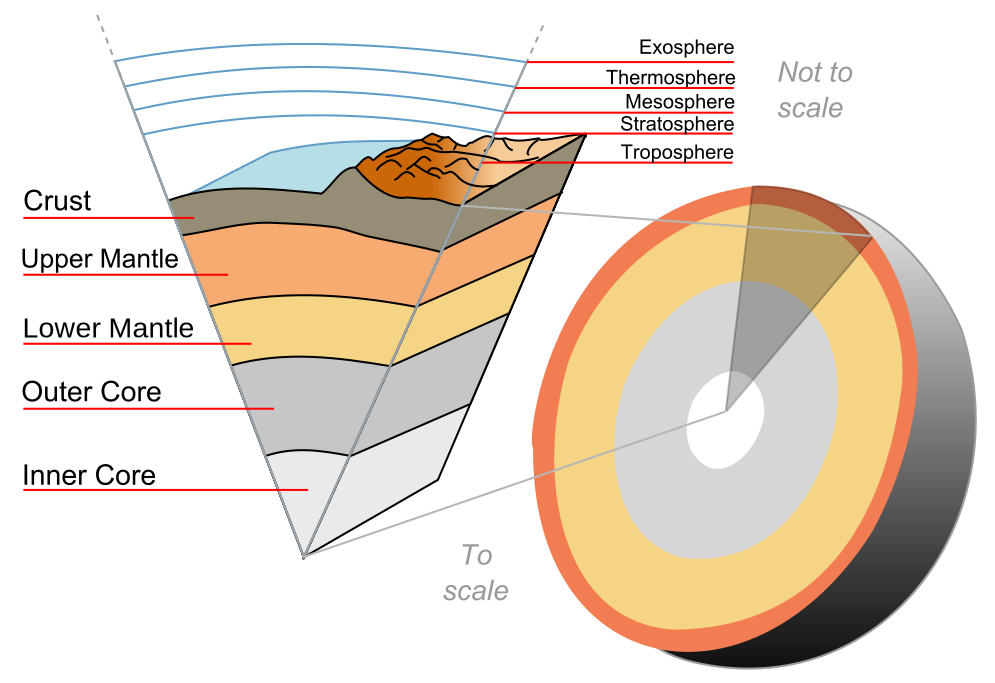
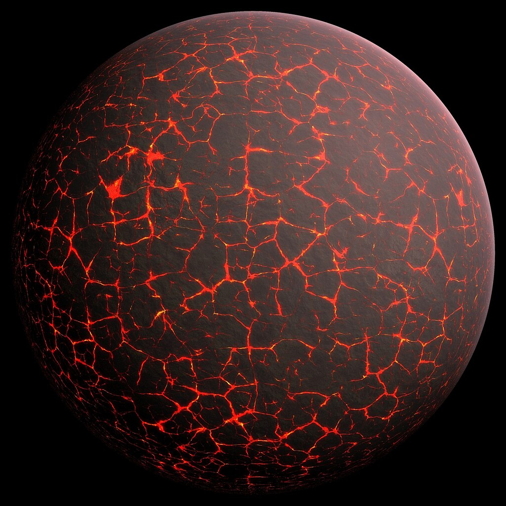
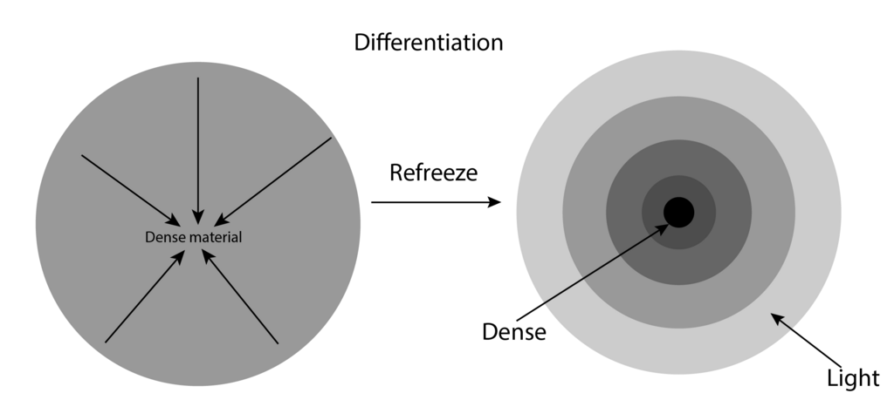

Earth and atmosphere structure

**Earth's outer core** is a fluid layer about 2,260 km (1,400 mi) thick, composed of mostly [iron](https://en.wikipedia.org/wiki/Iron "Iron") and [nickel](https://en.wikipedia.org/wiki/Nickel "Nickel") that lies above Earth's solid [inner core](/source/earths-inner-core/ "Earth's inner core") and below its [mantle](https://en.wikipedia.org/wiki/Earth's_mantle "Earth's mantle"). The outer core begins approximately 2,889 km (1,795 mi) beneath Earth's surface at the [core-mantle boundary](https://en.wikipedia.org/wiki/Core–mantle_boundary "Core–mantle boundary") and ends 5,150 km (3,200 mi) beneath Earth's surface at the inner core boundary.

## Properties

The outer core of Earth is liquid, unlike its [inner core](/source/earths-inner-core/ "Earth's inner core"), which is solid. Evidence for a fluid outer core includes [seismology](https://en.wikipedia.org/wiki/Seismology "Seismology") which shows that [seismic](https://en.wikipedia.org/wiki/Seismic_wave "Seismic wave") [shear-waves](https://en.wikipedia.org/wiki/S_wave "S wave") are not transmitted through the outer core. Although having a composition similar to Earth's solid inner core, the outer core remains liquid as there is not enough pressure to keep it in a solid state.

Seismic inversions of [body waves](https://en.wikipedia.org/wiki/Seismic_wave#Body_waves "Seismic wave") and [normal modes](https://en.wikipedia.org/wiki/Seismic_wave#Normal_modes "Seismic wave") constrain the radius of the outer core to be 3483 km with an uncertainty of 5 km, while that of the inner core is 1220±10 km.

Estimates for the [temperature](https://en.wikipedia.org/wiki/Temperature "Temperature") of the outer core are about 3,000–4,500 K (2,700–4,200 °C; 4,900–7,600 °F) in its outer region and 4,000–8,000 K (3,700–7,700 °C; 6,700–14,000 °F) near the inner core. Modeling has shown that the outer core, because of its high temperature, is a low-[viscosity](https://en.wikipedia.org/wiki/Viscosity "Viscosity") fluid that convects [turbulently](https://en.wikipedia.org/wiki/Turbulence "Turbulence"). The [dynamo theory](https://en.wikipedia.org/wiki/Dynamo_theory "Dynamo theory") sees [eddy currents](https://en.wikipedia.org/wiki/Eddy_current "Eddy current") in the nickel-iron fluid of the outer core as the principal source of [Earth's magnetic field](https://en.wikipedia.org/wiki/Earth's_magnetic_field "Earth's magnetic field"). The average [magnetic field](https://en.wikipedia.org/wiki/Magnetic_field "Magnetic field") strength in Earth's outer core is estimated to be 2.5 [millitesla](https://en.wikipedia.org/wiki/Tesla_\(unit\) "Tesla (unit)"), 50 times stronger than the magnetic field at the surface.

As Earth's core cools, the liquid at the inner core boundary freezes, causing the solid inner core to grow at the expense of the outer core, at an estimated rate of 1 mm per year. This is approximately 80,000 tonnes of iron per second.

## Light elements

### Composition

Earth's outer core cannot be entirely constituted of iron or iron-nickel [alloy](https://en.wikipedia.org/wiki/Alloy "Alloy") because their densities are higher than geophysical measurements of the [density](https://en.wikipedia.org/wiki/Density "Density") of Earth's outer core. The outer core is approximately 5 to 10 percent lower density than [iron](https://en.wikipedia.org/wiki/Iron "Iron") at Earth's core [temperatures](https://en.wikipedia.org/wiki/Temperature "Temperature") and [pressures](https://en.wikipedia.org/wiki/Pressure "Pressure"). Hence it has been proposed that light [elements](https://en.wikipedia.org/wiki/Chemical_element "Chemical element") with low [atomic numbers](https://en.wikipedia.org/wiki/Atomic_number "Atomic number") compose part of Earth's outer core, as the only feasible way to lower its density.

Although Earth's outer core is inaccessible to direct sampling, the composition of light [elements](https://en.wikipedia.org/wiki/Chemical_element "Chemical element") can be meaningfully constrained by high-[pressure](https://en.wikipedia.org/wiki/Pressure "Pressure") experiments, calculations based on [seismic](https://en.wikipedia.org/wiki/Seismic "Seismic") measurements, models of [Earth's accretion](https://en.wikipedia.org/wiki/Accretion_\(astrophysics\) "Accretion (astrophysics)"), and [carbonaceous chondrite meteorite](https://en.wikipedia.org/wiki/Chondrite "Chondrite") comparisons with [bulk silicate Earth (BSE)](https://en.wikipedia.org/wiki/Primitive_mantle "Primitive mantle"). As of 2023, estimates are that Earth's outer core is composed of [iron](https://en.wikipedia.org/wiki/Iron "Iron") along with 0 to 0.26 percent [hydrogen](https://en.wikipedia.org/wiki/Hydrogen "Hydrogen"), 0.2 percent [carbon](https://en.wikipedia.org/wiki/Carbon "Carbon"), 0.8 to 5.3 percent [oxygen](https://en.wikipedia.org/wiki/Oxygen "Oxygen"), 0 to 4.0 percent [silicon](https://en.wikipedia.org/wiki/Silicon "Silicon"), 1.7 percent [sulfur](https://en.wikipedia.org/wiki/Sulfur "Sulfur"), and 5 percent [nickel](https://en.wikipedia.org/wiki/Nickel "Nickel") by weight, and the [temperature](https://en.wikipedia.org/wiki/Temperature "Temperature") of the [core-mantle boundary](https://en.wikipedia.org/wiki/Core-mantle_boundary "Core-mantle boundary") and the inner core boundary ranges from 4,137 to 4,300 [K](https://en.wikipedia.org/wiki/Kelvin "Kelvin") and from 5,400 to 6,300 [K](https://en.wikipedia.org/wiki/Kelvin "Kelvin") respectively.

#### Constraints

##### Accretion

An artist's illustration of what Earth might have looked like early in its formation.

The variety of light elements present in Earth's outer core is constrained in part by [Earth's accretion](https://en.wikipedia.org/wiki/Accretion_\(astrophysics\) "Accretion (astrophysics)"). Namely, the light elements contained must have been abundant during Earth's formation, must be able to partition into [liquid](https://en.wikipedia.org/wiki/Liquid "Liquid") iron at low [pressures](https://en.wikipedia.org/wiki/Pressure "Pressure"), and must not volatilize and escape during Earth's accretionary process.

##### CI chondrites

[CI chondritic meteorites](https://en.wikipedia.org/wiki/CI_chondrite "CI chondrite") are believed to contain the same planet-forming elements in the same [proportions](https://en.wikipedia.org/wiki/Ratio "Ratio") as in the early [Solar System](https://en.wikipedia.org/wiki/Solar_System "Solar System"), so differences between CI meteorites and [BSE](https://en.wikipedia.org/wiki/Primitive_mantle "Primitive mantle") can provide insights into the light element composition of Earth's outer core. For instance, the depletion of [silicon](https://en.wikipedia.org/wiki/Silicon "Silicon") in Earth's [primitive mantle](https://en.wikipedia.org/wiki/Primitive_mantle "Primitive mantle") compared to CI meteorites may indicate that silicon was absorbed into Earth's core; however, a wide range of silicon concentrations in Earth's outer and [inner core](/source/earths-inner-core/ "Earth's inner core") is still possible.

### Implications for Earth's accretion and core formation history

Tighter constraints on the concentrations of light elements in Earth's outer core would provide a better understanding of [Earth's accretion](https://en.wikipedia.org/wiki/Accretion_\(astrophysics\) "Accretion (astrophysics)") and [core formation](/source/internal-structure-of-earth/ "Internal structure of Earth") history.

#### Consequences for Earth's accretion

Models of Earth's accretion could be better tested if we had better constraints on light element [concentrations](https://en.wikipedia.org/wiki/Concentration "Concentration") in Earth's outer core. For example, accretionary models based on core-mantle element partitioning tend to support proto-Earths constructed from reduced, condensed, and volatile-free material, despite the possibility that [oxidized](https://en.wikipedia.org/wiki/Redox "Redox") material from the outer [Solar System](https://en.wikipedia.org/wiki/Solar_System "Solar System") was accreted towards the conclusion of [Earth's accretion](https://en.wikipedia.org/wiki/Accretion_\(astrophysics\) "Accretion (astrophysics)"). If we could better constrain the concentrations of [hydrogen](https://en.wikipedia.org/wiki/Hydrogen "Hydrogen"), [oxygen](https://en.wikipedia.org/wiki/Oxygen "Oxygen"), and [silicon](https://en.wikipedia.org/wiki/Silicon "Silicon") in Earth's outer core, models of Earth's accretion that match these concentrations would presumably better constrain Earth's formation.

#### Consequences for Earth's core formation

A diagram of Earth's differentiation. The light elements sulfur, silicon, oxygen, carbon, and hydrogen may constitute part of the outer core due to their abundance and ability to partition into liquid iron under certain conditions.

The depletion of [siderophile elements](https://en.wikipedia.org/wiki/Goldschmidt_classification#Siderophile_elements "Goldschmidt classification") in [Earth's mantle](https://en.wikipedia.org/wiki/Earth's_mantle "Earth's mantle") compared to chondritic meteorites is attributed to metal-silicate reactions during formation of Earth's core. These reactions are dependent on [oxygen](https://en.wikipedia.org/wiki/Oxygen "Oxygen"), [silicon](https://en.wikipedia.org/wiki/Silicon "Silicon"), and [sulfur](https://en.wikipedia.org/wiki/Sulfur "Sulfur"), so better constraints on [concentrations](https://en.wikipedia.org/wiki/Concentration "Concentration") of these elements in Earth's outer core will help elucidate the conditions of formation of [Earth's core](https://en.wikipedia.org/wiki/Earth's_core "Earth's core").

In another example, the possible presence of [hydrogen](https://en.wikipedia.org/wiki/Hydrogen "Hydrogen") in Earth's outer core suggests that the [accretion](https://en.wikipedia.org/wiki/Accretion_\(astrophysics\) "Accretion (astrophysics)") of Earth's [water](https://en.wikipedia.org/wiki/Water "Water") was not limited to the final stages of [Earth's accretion](https://en.wikipedia.org/wiki/Accretion_\(astrophysics\) "Accretion (astrophysics)") and that [water](https://en.wikipedia.org/wiki/Water "Water") may have been absorbed into core-forming metals through a hydrous [magma ocean](https://en.wikipedia.org/wiki/Magma_ocean "Magma ocean").

### Implications for Earth's magnetic field

A diagram of Earth's geodynamo and magnetic field, which could have been driven in Earth's early history by the crystallization of [magnesium oxide](https://en.wikipedia.org/wiki/Magnesium_oxide "Magnesium oxide"), [silicon dioxide](https://en.wikipedia.org/wiki/Silicon_dioxide "Silicon dioxide"), and [iron(II) oxide](https://en.wikipedia.org/wiki/Iron\(II\)_oxide "Iron(II) oxide").

[Earth's magnetic field](https://en.wikipedia.org/wiki/Earth's_magnetic_field "Earth's magnetic field") is driven by [thermal convection](https://en.wikipedia.org/wiki/Convection_\(heat_transfer\) "Convection (heat transfer)") and also by chemical convection, the exclusion of light elements from the inner core, which float upward within the fluid outer core while [denser](https://en.wikipedia.org/wiki/Density "Density") elements sink. This chemical convection releases [gravitational energy](https://en.wikipedia.org/wiki/Gravitational_energy "Gravitational energy") that is then available to power the [geodynamo](https://en.wikipedia.org/wiki/Dynamo_theory "Dynamo theory") that produces Earth's magnetic field. [Carnot efficiencies](https://en.wikipedia.org/wiki/Carnot_cycle "Carnot cycle") with large uncertainties suggest that compositional and thermal convection contribute about 80 percent and 20 percent respectively to the power of Earth's geodynamo.

Traditionally it was thought that prior to the formation of [Earth's inner core](/source/earths-inner-core/#Age "Earth's inner core"), Earth's geodynamo was mainly driven by thermal convection. However, as of 2020, claims that the [thermal conductivity](https://en.wikipedia.org/wiki/Thermal_conductivity "Thermal conductivity") of [iron](https://en.wikipedia.org/wiki/Iron "Iron") at core [temperatures](https://en.wikipedia.org/wiki/Temperature "Temperature") and pressures is much higher than previously thought imply that core cooling was largely by conduction not convection, limiting the ability of thermal convection to drive the geodynamo. This conundrum is known as the new "core paradox." An alternative process that could have sustained Earth's geodynamo requires Earth's core to have initially been hot enough to dissolve [oxygen](https://en.wikipedia.org/wiki/Oxygen "Oxygen"), [magnesium](https://en.wikipedia.org/wiki/Magnesium "Magnesium"), [silicon](https://en.wikipedia.org/wiki/Silicon "Silicon"), and other light elements. As the Earth's core began to cool, it would become [supersaturated](https://en.wikipedia.org/wiki/Supersaturation "Supersaturation") in these light elements that would then [precipitate](https://en.wikipedia.org/wiki/Precipitation_\(chemistry\) "Precipitation (chemistry)") into the [lower mantle](https://en.wikipedia.org/wiki/Lower_mantle_\(Earth\) "Lower mantle (Earth)") forming [oxides](https://en.wikipedia.org/wiki/Oxide "Oxide") leading to a different variant of chemical convection.

The magnetic field generated by core flow is essential to protect life from interplanetary radiation and prevent the atmosphere from dissipating in the [solar wind](https://en.wikipedia.org/wiki/Solar_wind "Solar wind"). The rate of cooling by conduction and convection is uncertain, but one estimate is that the core would not be expected to freeze up for approximately 91 billion years, which is well after the Sun is expected to expand, sterilize the surface of the planet, and then burn out.
