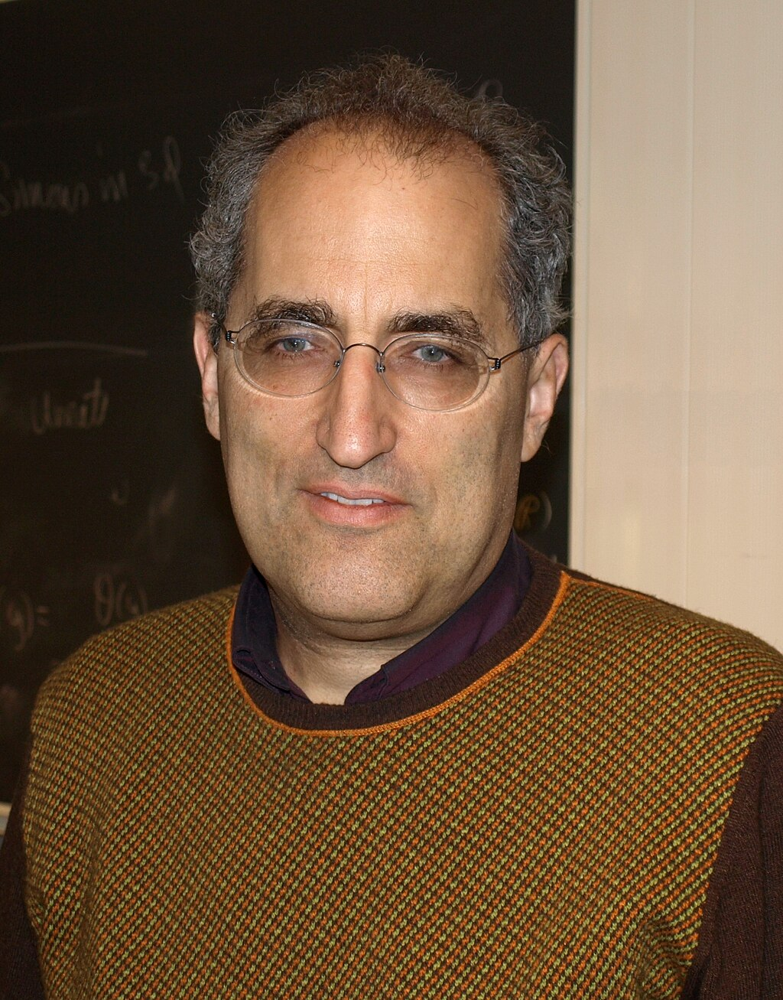
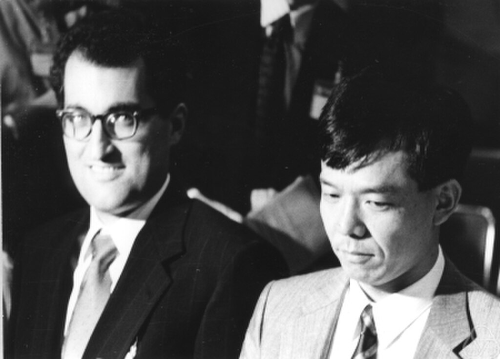
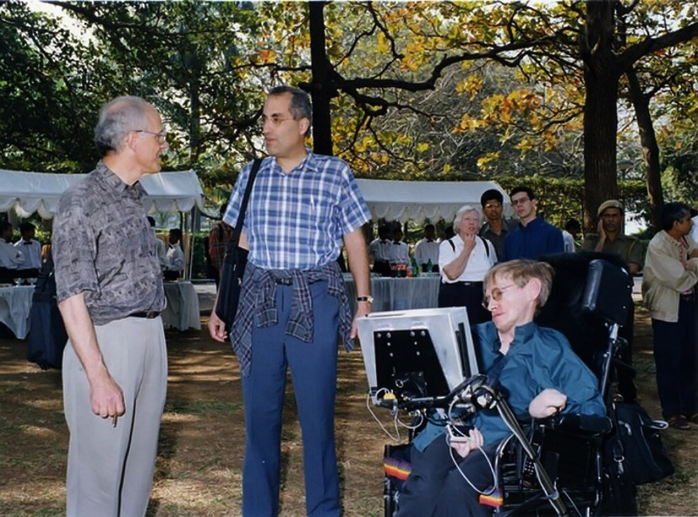

Edward Witten

Witten in 2008

Born

 (1951-08-26) August 26, 1951

[Baltimore](https://en.wikipedia.org/wiki/Baltimore "Baltimore"), Maryland, U.S.

Education

*   [Brandeis University](https://en.wikipedia.org/wiki/Brandeis_University "Brandeis University") ([BA](https://en.wikipedia.org/wiki/Bachelor_of_Arts "Bachelor of Arts"))
*   [Princeton University](https://en.wikipedia.org/wiki/Princeton_University "Princeton University") ([MA](https://en.wikipedia.org/wiki/Master_of_Arts "Master of Arts"), [PhD](https://en.wikipedia.org/wiki/PhD "PhD"))

Known for

*   [M-theory](/source/m-theory/ "M-theory")
*   [Seiberg–Witten theory](https://en.wikipedia.org/wiki/Seiberg–Witten_theory "Seiberg–Witten theory")
*   [Seiberg–Witten invariants](https://en.wikipedia.org/wiki/Seiberg–Witten_invariants "Seiberg–Witten invariants")
*   [Seiberg–Witten moduli space](https://en.wikipedia.org/wiki/Seiberg–Witten_moduli_space "Seiberg–Witten moduli space")
*   [Seiberg–Witten flow](https://en.wikipedia.org/wiki/Seiberg–Witten_flow "Seiberg–Witten flow")
*   [Seiberg–Witten map](https://en.wikipedia.org/wiki/Seiberg–Witten_map "Seiberg–Witten map")
*   [Wess–Zumino–Witten model](https://en.wikipedia.org/wiki/Wess–Zumino–Witten_model "Wess–Zumino–Witten model")
*   [Weinberg–Witten theorem](https://en.wikipedia.org/wiki/Weinberg–Witten_theorem "Weinberg–Witten theorem")
*   [Gromov–Witten invariant](https://en.wikipedia.org/wiki/Gromov–Witten_invariant "Gromov–Witten invariant")
*   [Hořava–Witten domain wall](https://en.wikipedia.org/wiki/Hořava–Witten_domain_wall "Hořava–Witten domain wall")
*   [Vafa–Witten theorem](https://en.wikipedia.org/wiki/Vafa–Witten_theorem "Vafa–Witten theorem")
*   [Witten index](https://en.wikipedia.org/wiki/Witten_index "Witten index")
*   [BCFW recursion](https://en.wikipedia.org/wiki/BCFW_recursion "BCFW recursion")
*   [Topological quantum field theory](/source/topological-qft/ "Topological quantum field theory") ([Witten-type TQFTs](/source/topological-qft/#Witten-type_TQFTs "Topological quantum field theory"))
*   [Topological string theory](https://en.wikipedia.org/wiki/Topological_string_theory "Topological string theory")
*   [Topological twist](https://en.wikipedia.org/wiki/Topological_twist "Topological twist")
*   [CSW rules](https://en.wikipedia.org/wiki/CSW_rules "CSW rules")
*   [Witten conjecture](https://en.wikipedia.org/wiki/Witten_conjecture "Witten conjecture")
*   [Witten zeta function](https://en.wikipedia.org/wiki/Witten_zeta_function "Witten zeta function")
*   [Hanany–Witten transition](https://en.wikipedia.org/wiki/Hanany–Witten_transition "Hanany–Witten transition")
*   [Twistor string theory](https://en.wikipedia.org/wiki/Twistor_string_theory "Twistor string theory")
*   [Chern–Simons theory](https://en.wikipedia.org/wiki/Chern–Simons_theory "Chern–Simons theory")
*   [Positive energy theorem](https://en.wikipedia.org/wiki/Positive_energy_theorem "Positive energy theorem")
*   [Witten–Veneziano mechanism](https://en.wikipedia.org/wiki/Eta_and_eta_prime_mesons#General "Eta and eta prime mesons")
*   [Bubble of nothing](https://en.wikipedia.org/wiki/Bubble_of_nothing "Bubble of nothing")

Spouse

[Chiara Nappi](https://en.wikipedia.org/wiki/Chiara_Nappi "Chiara Nappi")

Children

3, including [Ilana B.](https://en.wikipedia.org/wiki/Ilana_B._Witten "Ilana B. Witten") and [Daniela](https://en.wikipedia.org/wiki/Daniela_Witten "Daniela Witten")

Father

[Louis Witten](https://en.wikipedia.org/wiki/Louis_Witten "Louis Witten")

Relatives

*   [Matt Witten](https://en.wikipedia.org/wiki/Matt_Witten "Matt Witten") (brother)
*   [Benjamin Witten](https://en.wikipedia.org/wiki/Benjamin_Witten "Benjamin Witten") (uncle)

Awards

*   [MacArthur Fellowship](https://en.wikipedia.org/wiki/MacArthur_Fellowship "MacArthur Fellowship") (1982)
*   [Albert Einstein Medal](https://en.wikipedia.org/wiki/Albert_Einstein_Medal "Albert Einstein Medal") (1985)
*   [ICTP Dirac Medal](https://en.wikipedia.org/wiki/Dirac_Medal_\(ICTP\) "Dirac Medal (ICTP)") (1985)
*   [Alan T. Waterman Award](https://en.wikipedia.org/wiki/Alan_T._Waterman_Award "Alan T. Waterman Award") (1986)
*   [Fields Medal](https://en.wikipedia.org/wiki/Fields_Medal "Fields Medal") (1990)
*   [Dannie Heineman Prize](https://en.wikipedia.org/wiki/Dannie_Heineman_Prize_for_Mathematical_Physics "Dannie Heineman Prize for Mathematical Physics") (1998)
*   [Nemmers Prize](https://en.wikipedia.org/wiki/Nemmers_Prize_in_Mathematics "Nemmers Prize in Mathematics") (2000)
*   [National Medal of Science](https://en.wikipedia.org/wiki/National_Medal_of_Science "National Medal of Science") (2002)
*   [Harvey Prize](https://en.wikipedia.org/wiki/Harvey_Prize "Harvey Prize") (2005)
*   [Henri Poincaré Prize](https://en.wikipedia.org/wiki/Henri_Poincaré_Prize "Henri Poincaré Prize") (2006)
*   [Crafoord Prize](https://en.wikipedia.org/wiki/Crafoord_Prize "Crafoord Prize") (2008)
*   [Lorentz Medal](https://en.wikipedia.org/wiki/Lorentz_Medal "Lorentz Medal") (2010)
*   [Isaac Newton Medal](https://en.wikipedia.org/wiki/Isaac_Newton_Medal "Isaac Newton Medal") (2010)
*   [Breakthrough Prize in](https://en.wikipedia.org/wiki/Breakthrough_Prize_in_Fundamental_Physics "Breakthrough Prize in Fundamental Physics")
*   [Fundamental Physics](https://en.wikipedia.org/wiki/Breakthrough_Prize_in_Fundamental_Physics "Breakthrough Prize in Fundamental Physics") (2012)
*   [Kyoto Prize](https://en.wikipedia.org/wiki/Kyoto_Prize "Kyoto Prize") (2014)
*   [Albert Einstein Award](https://en.wikipedia.org/wiki/Albert_Einstein_World_Award_of_Science "Albert Einstein World Award of Science") (2016)

**Scientific career**

Fields

*   [Theoretical physics](https://en.wikipedia.org/wiki/Theoretical_physics "Theoretical physics")
*   [Mathematical physics](https://en.wikipedia.org/wiki/Mathematical_physics "Mathematical physics")
*   [Superstring theory](https://en.wikipedia.org/wiki/Superstring_theory "Superstring theory")

Institutions

*   [Institute for Advanced Study](https://en.wikipedia.org/wiki/Institute_for_Advanced_Study "Institute for Advanced Study")
*   [Harvard University](https://en.wikipedia.org/wiki/Harvard_University "Harvard University")
*   [Oxford University](https://en.wikipedia.org/wiki/Oxford_University "Oxford University")
*   [California Institute of Technology](https://en.wikipedia.org/wiki/California_Institute_of_Technology "California Institute of Technology")
*   [Princeton University](https://en.wikipedia.org/wiki/Princeton_University "Princeton University")

[Thesis](https://en.wikipedia.org/wiki/Thesis "Thesis")

_[Some Problems in the Short Distance Analysis of Gauge Theories](https://www.proquest.com/docview/302811319)_ (1976)

[Doctoral advisor](https://en.wikipedia.org/wiki/Doctoral_advisor "Doctoral advisor")

*   [David Gross](https://en.wikipedia.org/wiki/David_Gross "David Gross")
*   [Michael Atiyah](https://en.wikipedia.org/wiki/Michael_Atiyah "Michael Atiyah")

Other academic advisors

[Sidney Coleman](https://en.wikipedia.org/wiki/Sidney_Coleman "Sidney Coleman")

Doctoral students

*   [Jonathan Bagger](https://en.wikipedia.org/wiki/Jonathan_Bagger "Jonathan Bagger") (1983)
*   [Cumrun Vafa](https://en.wikipedia.org/wiki/Cumrun_Vafa "Cumrun Vafa") (1985)
*   [Xiao-Gang Wen](https://en.wikipedia.org/wiki/Xiao-Gang_Wen "Xiao-Gang Wen") (1987)
*   [Dror Bar-Natan](https://en.wikipedia.org/wiki/Dror_Bar-Natan "Dror Bar-Natan") (1991)
*   [Shamit Kachru](https://en.wikipedia.org/wiki/Shamit_Kachru "Shamit Kachru") (1994)
*   [Eva Silverstein](https://en.wikipedia.org/wiki/Eva_Silverstein "Eva Silverstein") (1996)
*   [Sergei Gukov](https://en.wikipedia.org/wiki/Sergei_Gukov "Sergei Gukov") (2001)

Website

[ias.edu/sns/witten](https://ias.edu/sns/witten)

**Edward Witten** (born August 26, 1951) is an American [theoretical physicist](https://en.wikipedia.org/wiki/Theoretical_physics "Theoretical physics") known for his contributions to [string theory](/source/string-theory/ "String theory"), [topological quantum field theory](/source/topological-qft/ "Topological quantum field theory"), and various areas of [mathematics](https://en.wikipedia.org/wiki/Mathematics "Mathematics"). He is a professor emeritus in the school of [natural sciences](https://en.wikipedia.org/wiki/Natural_science "Natural science") at the [Institute for Advanced Study](https://en.wikipedia.org/wiki/Institute_for_Advanced_Study "Institute for Advanced Study") in [Princeton](https://en.wikipedia.org/wiki/Princeton,_New_Jersey "Princeton, New Jersey"). Witten is a researcher in [string theory](/source/string-theory/ "String theory"), [quantum gravity](https://en.wikipedia.org/wiki/Quantum_gravity "Quantum gravity"), [supersymmetric quantum field theories](/source/supersymmetry/ "Supersymmetry"), and other areas of mathematical physics. Witten's work has also significantly impacted pure mathematics. In 1990, he became the first physicist to be awarded a [Fields Medal](https://en.wikipedia.org/wiki/Fields_Medal "Fields Medal") by the [International Mathematical Union](https://en.wikipedia.org/wiki/International_Mathematical_Union "International Mathematical Union"), for his mathematical insights in physics, such as his 1981 proof of the [positive energy theorem](https://en.wikipedia.org/wiki/Positive_energy_theorem "Positive energy theorem") in [general relativity](/source/general-relativity/ "General relativity"), and his interpretation of the [Jones](https://en.wikipedia.org/wiki/Vaughan_Jones "Vaughan Jones") invariants of knots as [Feynman integrals](https://en.wikipedia.org/wiki/Feynman_integral "Feynman integral"). He is considered the practical founder of [M-theory](/source/m-theory/ "M-theory").

## Early life and education

Witten was born on August 26, 1951, in [Baltimore](https://en.wikipedia.org/wiki/Baltimore "Baltimore"), Maryland, to a [Jewish](https://en.wikipedia.org/wiki/Jewish "Jewish") family, as the eldest of four children. His brother [Matt Witten](https://en.wikipedia.org/wiki/Matt_Witten "Matt Witten") became a writer, and his brother Jesse Amnon Witten became a law partner in the firm [Faegre Drinker Biddle & Reath](https://en.wikipedia.org/wiki/Faegre_Drinker_Biddle_&_Reath "Faegre Drinker Biddle & Reath"). Their sister Celia M. Witten earned a Ph.D. in mathematics from [Stanford University](https://en.wikipedia.org/wiki/Stanford_University "Stanford University") and then an M.D. from the [University of Miami](https://en.wikipedia.org/wiki/University_of_Miami "University of Miami"). Edward Witten is the son of Lorraine (born Wollach) Witten and [Louis Witten](https://en.wikipedia.org/wiki/Louis_Witten "Louis Witten"), a [theoretical physicist](https://en.wikipedia.org/wiki/Theoretical_physicist "Theoretical physicist") specializing in [gravitation](https://en.wikipedia.org/wiki/Gravity "Gravity") and [general relativity](/source/general-relativity/ "General relativity").

Witten attended the [Park School of Baltimore](https://en.wikipedia.org/wiki/Park_School_of_Baltimore "Park School of Baltimore") (class of 1968), and received his [Bachelor of Arts](https://en.wikipedia.org/wiki/Bachelor_of_Arts "Bachelor of Arts") degree with a major in [history](https://en.wikipedia.org/wiki/History "History") and minor in [linguistics](https://en.wikipedia.org/wiki/Linguistics "Linguistics") from [Brandeis University](https://en.wikipedia.org/wiki/Brandeis_University "Brandeis University") in 1971.

He had aspirations in journalism and politics and published articles in both _[The New Republic](https://en.wikipedia.org/wiki/The_New_Republic "The New Republic")_ and _[The Nation](https://en.wikipedia.org/wiki/The_Nation "The Nation")_ in the late 1960s. In 1972, he worked for six months on [George McGovern's presidential campaign](https://en.wikipedia.org/wiki/George_McGovern_1972_presidential_campaign "George McGovern 1972 presidential campaign").

Witten attended the [University of Michigan](https://en.wikipedia.org/wiki/University_of_Michigan "University of Michigan") for one semester as an economics graduate student before dropping out. He returned to academia, enrolling in [applied mathematics](https://en.wikipedia.org/wiki/Applied_mathematics "Applied mathematics") at [Princeton University](https://en.wikipedia.org/wiki/Princeton_University "Princeton University") in 1973, then shifting departments and receiving a [PhD](https://en.wikipedia.org/wiki/PhD "PhD") in physics in 1976 and completing a dissertation, "Some problems in the short distance analysis of gauge theories", under the supervision of [David Gross](https://en.wikipedia.org/wiki/David_Gross "David Gross"). He was a [National Radio Astronomy Observatory](https://en.wikipedia.org/wiki/National_Radio_Astronomy_Observatory "National Radio Astronomy Observatory") summer student (1974), held a fellowship at [Harvard University](https://en.wikipedia.org/wiki/Harvard_University "Harvard University") (1976–77), visited [Oxford University](https://en.wikipedia.org/wiki/Oxford_University "Oxford University") (1977–78), was a junior fellow in the Harvard Society of Fellows (1977–1980), and held a [MacArthur Foundation](https://en.wikipedia.org/wiki/MacArthur_Fellows_Program "MacArthur Fellows Program") fellowship (1982).

## Research

### Fields medal work

Witten was awarded the [Fields Medal](https://en.wikipedia.org/wiki/Fields_Medal "Fields Medal") by the [International Mathematical Union](https://en.wikipedia.org/wiki/International_Mathematical_Union "International Mathematical Union") in 1990.

In a written address to the [ICM](https://en.wikipedia.org/wiki/International_Congress_of_Mathematicians "International Congress of Mathematicians"), [Michael Atiyah](https://en.wikipedia.org/wiki/Michael_Atiyah "Michael Atiyah") said of Witten:

> Although he is definitely a physicist (as his list of publications clearly shows) his command of mathematics is rivaled by few mathematicians, and his ability to interpret physical ideas in mathematical form is quite unique. Time and again he has surprised the mathematical community by a brilliant application of physical insight leading to new and deep mathematical theorems ... He has made a profound impact on contemporary mathematics. In his hands physics is once again providing a rich source of inspiration and insight in mathematics.

Edward Witten (left) with mathematician [Shigefumi Mori](https://en.wikipedia.org/wiki/Shigefumi_Mori "Shigefumi Mori"), probably at the [ICM](https://en.wikipedia.org/wiki/International_Congress_of_Mathematicians "International Congress of Mathematicians") in 1990, where they received the [Fields Medal](https://en.wikipedia.org/wiki/Fields_Medal "Fields Medal")

As an example of Witten's work in pure mathematics, Atiyah cites his application of techniques from [quantum field theory](https://en.wikipedia.org/wiki/Quantum_field_theory "Quantum field theory") to the mathematical subject of [low-dimensional topology](https://en.wikipedia.org/wiki/Low-dimensional_topology "Low-dimensional topology"). In the late 1980s, Witten coined the term _[topological quantum field theory](/source/topological-qft/ "Topological quantum field theory")_ for a certain type of physical theory in which the [expectation values](https://en.wikipedia.org/wiki/Expectation_value "Expectation value") of observable quantities encode information about the [topology](https://en.wikipedia.org/wiki/Topology "Topology") of [spacetime](https://en.wikipedia.org/wiki/Spacetime "Spacetime"). In particular, Witten realized that a physical theory now called [Chern–Simons theory](https://en.wikipedia.org/wiki/Chern–Simons_theory "Chern–Simons theory") could provide a framework for understanding the mathematical theory of [knots](https://en.wikipedia.org/wiki/Knot_\(mathematics\) "Knot (mathematics)") and [3-manifolds](https://en.wikipedia.org/wiki/3-manifold "3-manifold"). Although Witten's work was based on the mathematically ill-defined notion of a [Feynman path integral](https://en.wikipedia.org/wiki/Feynman_path_integral "Feynman path integral") and therefore not [mathematically rigorous](https://en.wikipedia.org/wiki/Mathematical_rigor "Mathematical rigor"), mathematicians were able to systematically develop Witten's ideas, leading to the theory of [Reshetikhin–Turaev invariants](https://en.wikipedia.org/wiki/Reshetikhin–Turaev_invariant "Reshetikhin–Turaev invariant").

Another result for which Witten was awarded the Fields Medal was his proof in 1981 of the [positive energy theorem](https://en.wikipedia.org/wiki/Positive_energy_theorem "Positive energy theorem") in [general relativity](/source/general-relativity/ "General relativity"). This theorem asserts that (under appropriate assumptions) the total [energy](https://en.wikipedia.org/wiki/Energy "Energy") of a gravitating system is always positive and can be zero only if the geometry of [spacetime](https://en.wikipedia.org/wiki/Spacetime "Spacetime") is that of flat [Minkowski space](https://en.wikipedia.org/wiki/Minkowski_space "Minkowski space"). It establishes Minkowski space as a stable ground state of the [gravitational field](https://en.wikipedia.org/wiki/Gravitational_field "Gravitational field"). While the original proof of this result due to [Richard Schoen](https://en.wikipedia.org/wiki/Richard_Schoen "Richard Schoen") and [Shing-Tung Yau](https://en.wikipedia.org/wiki/Shing-Tung_Yau "Shing-Tung Yau") used [variational methods](https://en.wikipedia.org/wiki/Variational_methods "Variational methods"), Witten's proof used ideas from [supergravity theory](https://en.wikipedia.org/wiki/Supergravity_theory "Supergravity theory") to simplify the argument.

A third area mentioned in Atiyah's address is Witten's work relating [supersymmetry](/source/supersymmetry/ "Supersymmetry") and [Morse theory](https://en.wikipedia.org/wiki/Morse_theory "Morse theory"), a branch of mathematics that studies the [topology](https://en.wikipedia.org/wiki/Topology "Topology") of [manifolds](https://en.wikipedia.org/wiki/Manifolds "Manifolds") using the concept of a [differentiable function](https://en.wikipedia.org/wiki/Differentiable_function "Differentiable function"). Witten's work gave a physical proof of a classical result, the [Morse inequalities](https://en.wikipedia.org/wiki/Morse_theory#Morse_inequalities "Morse theory"), by interpreting the theory in terms of [supersymmetric quantum mechanics](https://en.wikipedia.org/wiki/Supersymmetric_quantum_mechanics "Supersymmetric quantum mechanics").

### M-theory

By the mid 1990s, physicists working on [string theory](/source/string-theory/ "String theory") had developed five different consistent versions of the theory. These versions are known as [type I](https://en.wikipedia.org/wiki/Type_I_string "Type I string"), [type IIA](https://en.wikipedia.org/wiki/Type_IIA_string "Type IIA string"), [type IIB](https://en.wikipedia.org/wiki/Type_IIB_string "Type IIB string"), and the two flavors of [heterotic string](https://en.wikipedia.org/wiki/Heterotic_string "Heterotic string") theory ([SO(32)](https://en.wikipedia.org/wiki/Special_orthogonal_group "Special orthogonal group") and [E8×E8](https://en.wikipedia.org/wiki/E8_\(mathematics\) "E8 (mathematics)")). The thinking was that of these five candidate theories, only one was the actual correct [theory of everything](https://en.wikipedia.org/wiki/Theory_of_everything "Theory of everything"), and that theory was the one whose low-energy limit matched the physics observed in our world today.

Speaking at [Strings](https://en.wikipedia.org/wiki/Strings_\(conference\) "Strings (conference)") '95 conference at [University of Southern California](https://en.wikipedia.org/wiki/University_of_Southern_California "University of Southern California"), Witten made the surprising suggestion that these five string theories were in fact not distinct theories, but different limits of a single theory, which he called [M-theory](/source/m-theory/ "M-theory"). Witten's proposal was based on the observation that the five string theories can be mapped to one another by certain rules called [dualities](https://en.wikipedia.org/wiki/String_duality "String duality") and are identified by these dualities. It led to a flurry of work now known as the [second superstring revolution](https://en.wikipedia.org/wiki/Second_superstring_revolution "Second superstring revolution").

### Other work

Edward Witten (center) with [David Gross](https://en.wikipedia.org/wiki/David_Gross "David Gross") and [Stephen Hawking](https://en.wikipedia.org/wiki/Stephen_Hawking "Stephen Hawking") at [Strings 2001](https://en.wikipedia.org/wiki/Strings_\(conference\) "Strings (conference)") at TIFR in Mumbai, India

Another of Witten's contributions to physics was to the result of gauge/gravity duality. In 1997, [Juan Maldacena](https://en.wikipedia.org/wiki/Juan_Maldacena "Juan Maldacena") formulated a result known as the [AdS/CFT correspondence](/source/ads-cft-correspondence/ "AdS/CFT correspondence"), which establishes a relationship between certain [quantum field theories](https://en.wikipedia.org/wiki/Quantum_field_theories "Quantum field theories") and theories of [quantum gravity](https://en.wikipedia.org/wiki/Quantum_gravity "Quantum gravity"). Maldacena's discovery has dominated high-energy theoretical physics for the past 15 years because of its applications to theoretical problems in quantum gravity and quantum field theory. Witten's foundational work following Maldacena's result has shed light on this relationship.

In collaboration with [Nathan Seiberg](https://en.wikipedia.org/wiki/Nathan_Seiberg "Nathan Seiberg"), Witten established several powerful results in quantum field theories. In their paper on string theory and [noncommutative geometry](https://en.wikipedia.org/wiki/Noncommutative_geometry "Noncommutative geometry"), Seiberg and Witten studied certain [noncommutative quantum field theories](https://en.wikipedia.org/wiki/Noncommutative_quantum_field_theory "Noncommutative quantum field theory") that arise as limits of string theory. In another well-known paper, they studied aspects of [supersymmetric gauge theory](https://en.wikipedia.org/wiki/Supersymmetric_gauge_theory "Supersymmetric gauge theory"). The latter paper, combined with Witten's earlier work on topological quantum field theory, led to developments in the topology of [smooth](https://en.wikipedia.org/wiki/Smooth_manifold "Smooth manifold") [4-manifolds](https://en.wikipedia.org/wiki/4-manifold "4-manifold"), in particular the notion of [Seiberg–Witten invariants](https://en.wikipedia.org/wiki/Seiberg–Witten_invariant "Seiberg–Witten invariant").

With [Anton Kapustin](https://en.wikipedia.org/wiki/Anton_Kapustin "Anton Kapustin"), Witten has made deep mathematical connections between S-duality of gauge theories and the [geometric Langlands correspondence](https://en.wikipedia.org/wiki/Geometric_Langlands_correspondence "Geometric Langlands correspondence"). Partly in collaboration with Seiberg, one of his recent interests includes aspects of field theoretical description of topological phases in condensed matter and non-supersymmetric dualities in field theories that, among other things, are of high relevance in condensed matter theory. In 2016, he has also brought tensor models to the relevance of holographic and quantum gravity theories, by using them as a generalization of the [Sachdev–Ye–Kitaev model](https://en.wikipedia.org/wiki/Sachdev–Ye–Kitaev_model "Sachdev–Ye–Kitaev model").

Witten has published influential and insightful work in many aspects of quantum field theories and mathematical physics, including the physics and mathematics of anomalies, integrability, dualities, localization, and homologies. Many of his results have deeply influenced areas in theoretical physics (often well beyond the original context of his results), including string theory, quantum gravity and topological condensed matter. In particular, Witten is known for collaborating with [Ruth Britto](https://en.wikipedia.org/wiki/Ruth_Britto "Ruth Britto") on a method calculating scattering amplitudes known as the [BCFW recursion relations](https://en.wikipedia.org/wiki/BCFW_recursion "BCFW recursion").

## Awards and honors

Witten has been honored with numerous awards including a [MacArthur Grant](https://en.wikipedia.org/wiki/MacArthur_Fellowship "MacArthur Fellowship") (1982), the [Fields Medal](https://en.wikipedia.org/wiki/Fields_Medal "Fields Medal") (1990), the Golden Plate Award of the [American Academy of Achievement](https://en.wikipedia.org/wiki/Academy_of_Achievement "Academy of Achievement") (1997), the [Nemmers Prize in Mathematics](https://en.wikipedia.org/wiki/Nemmers_Prize_in_Mathematics "Nemmers Prize in Mathematics") (2000), the [National Medal of Science](https://en.wikipedia.org/wiki/National_Medal_of_Science "National Medal of Science") (2002), Pythagoras Award (2005), the [Henri Poincaré Prize](https://en.wikipedia.org/wiki/Henri_Poincaré_Prize "Henri Poincaré Prize") (2006), the [Crafoord Prize](https://en.wikipedia.org/wiki/Crafoord_Prize "Crafoord Prize") (2008), the [Lorentz Medal](https://en.wikipedia.org/wiki/Lorentz_Medal "Lorentz Medal") (2010) the [Isaac Newton Medal](https://en.wikipedia.org/wiki/Isaac_Newton_Medal "Isaac Newton Medal") (2010) and the [Breakthrough Prize in Fundamental Physics](https://en.wikipedia.org/wiki/Breakthrough_Prize_in_Fundamental_Physics "Breakthrough Prize in Fundamental Physics") (2012). Since 1999, he has been a Foreign Member of the [Royal Society](https://en.wikipedia.org/wiki/Royal_Society "Royal Society") (London), and in March 2016 was elected an Honorary Fellow of the [Royal Society of Edinburgh](https://en.wikipedia.org/wiki/Royal_Society_of_Edinburgh "Royal Society of Edinburgh"). [Pope Benedict XVI](https://en.wikipedia.org/wiki/Pope_Benedict_XVI "Pope Benedict XVI") appointed Witten as a member of the [Pontifical Academy of Sciences](https://en.wikipedia.org/wiki/Pontifical_Academy_of_Sciences "Pontifical Academy of Sciences") (2006). He also appeared in the list of _[Time](https://en.wikipedia.org/wiki/Time_\(magazine\) "Time (magazine)")_ magazine's [100 most influential people](https://en.wikipedia.org/wiki/Time_100 "Time 100") of 2004. In 2012, he became a fellow of the [American Mathematical Society](https://en.wikipedia.org/wiki/American_Mathematical_Society "American Mathematical Society"). Witten was elected as a member of the [American Academy of Arts and Sciences](https://en.wikipedia.org/wiki/American_Academy_of_Arts_and_Sciences "American Academy of Arts and Sciences") in 1984, a member of the [National Academy of Sciences](https://en.wikipedia.org/wiki/National_Academy_of_Sciences "National Academy of Sciences") in 1988, and a member of the [American Philosophical Society](https://en.wikipedia.org/wiki/American_Philosophical_Society "American Philosophical Society") in 1993. In May 2022 he was awarded an honorary Doctor of Sciences from the [University of Pennsylvania](https://en.wikipedia.org/wiki/University_of_Pennsylvania "University of Pennsylvania").

In an informal poll at a 1990 cosmology conference, Witten received the largest number of mentions as "the smartest living physicist".

## Personal life

Witten has been married to [Chiara Nappi](https://en.wikipedia.org/wiki/Chiara_Nappi "Chiara Nappi"), a professor of physics at [Princeton University](https://en.wikipedia.org/wiki/Princeton_University "Princeton University"), since 1979. They have two daughters and a son. Their daughter [Ilana B. Witten](https://en.wikipedia.org/wiki/Ilana_B._Witten "Ilana B. Witten") is a neuroscientist at Princeton University, and daughter [Daniela Witten](https://en.wikipedia.org/wiki/Daniela_Witten "Daniela Witten") is a biostatistician at the [University of Washington](https://en.wikipedia.org/wiki/University_of_Washington "University of Washington").

Witten sits on the board of directors of [Americans for Peace Now](https://en.wikipedia.org/wiki/Americans_for_Peace_Now "Americans for Peace Now") and on the advisory council of [J Street](https://en.wikipedia.org/wiki/J_Street_\(advocacy_group\) "J Street (advocacy group)"). He supports the [two-state solution](https://en.wikipedia.org/wiki/Two-state_solution "Two-state solution") and advocates a boycott of Israeli institutions and economic activity beyond its 1967 borders, though not of Israel itself. Witten lived in Israel for a year in the 1960s.

## Selected publications

*   _Some Problems in the Short Distance Analysis of Gauge Theories_. [Princeton University](https://en.wikipedia.org/wiki/Princeton_University "Princeton University"), 1976. ([Dissertation](https://en.wikipedia.org/wiki/Dissertation "Dissertation").)
*   [Roman Jackiw](https://en.wikipedia.org/wiki/Roman_Jackiw "Roman Jackiw"), [David Gross](https://en.wikipedia.org/wiki/David_Gross "David Gross"), [Sam B. Treiman](https://en.wikipedia.org/wiki/Sam_B._Treiman "Sam B. Treiman"), Edward Witten, [Bruno Zumino](https://en.wikipedia.org/wiki/Bruno_Zumino "Bruno Zumino"). _Current Algebra and Anomalies: A Set of Lecture Notes and Papers_. World Scientific, 1985.
*   [Green, M.](https://en.wikipedia.org/wiki/Michael_Green_\(physicist\) "Michael Green (physicist)"), [John H. Schwarz](https://en.wikipedia.org/wiki/John_H._Schwarz "John H. Schwarz"), and E. Witten. _Superstring Theory. Vol. 1, Introduction_. Cambridge Monographs on Mathematical Physics. Cambridge, UK: Cambridge University Press, 1988. [ISBN](https://en.wikipedia.org/wiki/ISBN_\(identifier\) "ISBN (identifier)") [978-0-521-35752-4](https://en.wikipedia.org/wiki/Special:BookSources/978-0-521-35752-4 "Special:BookSources/978-0-521-35752-4").
*   Green, M., John H. Schwarz, and E. Witten. _Superstring Theory. Vol. 2, Loop Amplitudes, Anomalies and Phenomenology_. Cambridge, UK: Cambridge University Press, 1988. [ISBN](https://en.wikipedia.org/wiki/ISBN_\(identifier\) "ISBN (identifier)") [978-0-521-35753-1](https://en.wikipedia.org/wiki/Special:BookSources/978-0-521-35753-1 "Special:BookSources/978-0-521-35753-1").
*   _Quantum fields and strings: a course for mathematicians_. Vols. 1, 2. Material from the Special Year on Quantum Field Theory held at the Institute for Advanced Study, Princeton, NJ, 1996–1997. Edited by [Pierre Deligne](https://en.wikipedia.org/wiki/Pierre_Deligne "Pierre Deligne"), [Pavel Etingof](https://en.wikipedia.org/wiki/Pavel_Etingof "Pavel Etingof"), [Daniel S. Freed](https://en.wikipedia.org/wiki/Daniel_S._Freed "Daniel S. Freed"), [Lisa C. Jeffrey](https://en.wikipedia.org/wiki/Lisa_C._Jeffrey "Lisa C. Jeffrey"), [David Kazhdan](https://en.wikipedia.org/wiki/David_Kazhdan "David Kazhdan"), [John W. Morgan](https://en.wikipedia.org/wiki/John_Morgan_\(mathematician\) "John Morgan (mathematician)"), [David R. Morrison](https://en.wikipedia.org/wiki/David_R._Morrison_\(mathematician\) "David R. Morrison (mathematician)") and Edward Witten. American Mathematical Society, Providence, RI; Institute for Advanced Study (IAS), Princeton, NJ, 1999. Vol. 1: xxii+723 pp.; Vol. 2: pp. i–xxiv and 727–1501. [ISBN](https://en.wikipedia.org/wiki/ISBN_\(identifier\) "ISBN (identifier)") [0-8218-1198-3](https://en.wikipedia.org/wiki/Special:BookSources/0-8218-1198-3 "Special:BookSources/0-8218-1198-3"), 81–06 (81T30 81Txx).
