Eye

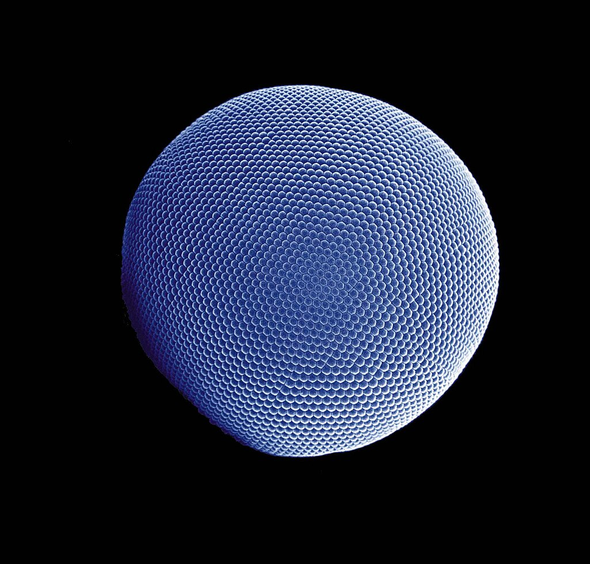

[Compound eye](https://en.wikipedia.org/wiki/Compound_eye "Compound eye") of an [Antarctic krill](https://en.wikipedia.org/wiki/Antarctic_krill "Antarctic krill")

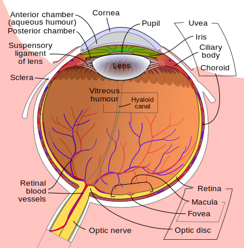

Diagram of a [human eye](https://en.wikipedia.org/wiki/Human_eye "Human eye")

Details

[System](https://en.wikipedia.org/wiki/Organ_system "Organ system")

[Nervous](https://en.wikipedia.org/wiki/Nervous_system "Nervous system")

Identifiers

[Latin](https://en.wikipedia.org/wiki/Latin "Latin")

_oculus_

[Greek](https://en.wikipedia.org/wiki/Ancient_Greek "Ancient Greek")

_ὀφθαλμός (ophthalmós)_

[TA98](https://en.wikipedia.org/wiki/Terminologia_Anatomica "Terminologia Anatomica")

[A15.2.00.001](https://ifaa.unifr.ch/Public/EntryPage/TA98%20Tree/Entity%20TA98%20EN/15.2.00.001%20Entity%20TA98%20EN.htm)
[A01.1.00.007](https://ifaa.unifr.ch/Public/EntryPage/TA98%20Tree/Entity%20TA98%20EN/01.1.00.007%20Entity%20TA98%20EN.htm)

[TA2](https://en.wikipedia.org/wiki/Terminologia_Anatomica "Terminologia Anatomica")

[113](https://ta2viewer.openanatomy.org/?id=113), [6734](https://ta2viewer.openanatomy.org/?id=6734)

[Anatomical terminology](https://en.wikipedia.org/wiki/Anatomical_terminology "Anatomical terminology")

An **eye** is a [sensory organ](https://en.wikipedia.org/wiki/Sensory_organ "Sensory organ") that allows an [organism](https://en.wikipedia.org/wiki/Organism "Organism") to perceive [visual](https://en.wikipedia.org/wiki/Visual_perception "Visual perception") information. It detects [light](https://en.wikipedia.org/wiki/Light "Light") and converts it into electro-chemical impulses in [neurons](https://en.wikipedia.org/wiki/Neurons "Neurons") (neurones). It is part of an organism's [visual system](https://en.wikipedia.org/wiki/Visual_system "Visual system").

In higher organisms, the eye is a complex [optical](https://en.wikipedia.org/wiki/Optics "Optics") system that collects light from the surrounding environment, regulates its intensity through a [diaphragm](https://en.wikipedia.org/wiki/Iris_\(anatomy\) "Iris (anatomy)"), [focuses](https://en.wikipedia.org/wiki/Focus_\(optics\) "Focus (optics)") it through an adjustable assembly of [lenses](https://en.wikipedia.org/wiki/Lens_\(anatomy\) "Lens (anatomy)") to form an [image](https://en.wikipedia.org/wiki/Image "Image"), converts this image into a set of electrical signals, and transmits these signals to the [brain](https://en.wikipedia.org/wiki/Brain "Brain") through neural pathways that connect the eye via the [optic nerve](https://en.wikipedia.org/wiki/Optic_nerve "Optic nerve") to the [visual cortex](https://en.wikipedia.org/wiki/Visual_cortex "Visual cortex") and other areas of the brain.

Eyes with resolving power have come in ten fundamentally different forms, classified into [compound eyes](https://en.wikipedia.org/wiki/Compound_eye "Compound eye") and non-compound eyes. Compound eyes are made up of multiple small visual units, and are common on [insects](https://en.wikipedia.org/wiki/Insect "Insect") and [crustaceans](https://en.wikipedia.org/wiki/Crustacean "Crustacean"). Non-compound eyes have a single lens and focus light onto the retina to form a single image. This type of eye is common in mammals, including humans.

The simplest eyes are pit eyes. They are eye-spots which may be set into a pit to reduce the angle of light that enters and affects the eye-spot, to allow the organism to deduce the angle of incoming light.

Eyes enable several photo response functions that are independent of vision. In an organism that has more complex eyes, retinal [photosensitive ganglion cells](https://en.wikipedia.org/wiki/Photosensitive_ganglion_cell "Photosensitive ganglion cell") send signals along the [retinohypothalamic tract](https://en.wikipedia.org/wiki/Retinohypothalamic_tract "Retinohypothalamic tract") to the [suprachiasmatic nuclei](https://en.wikipedia.org/wiki/Suprachiasmatic_nucleus "Suprachiasmatic nucleus") to effect circadian adjustment and to the [pretectal area](https://en.wikipedia.org/wiki/Pretectal_area "Pretectal area") to control the [pupillary light reflex](https://en.wikipedia.org/wiki/Pupillary_light_reflex "Pupillary light reflex").

## Overview

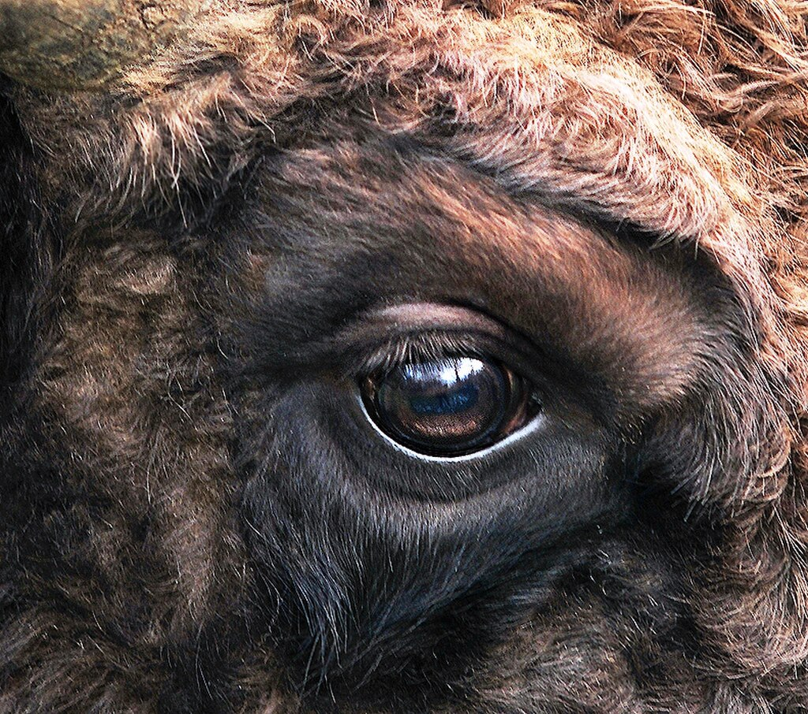Eye of a [European bison](https://en.wikipedia.org/wiki/European_bison "European bison")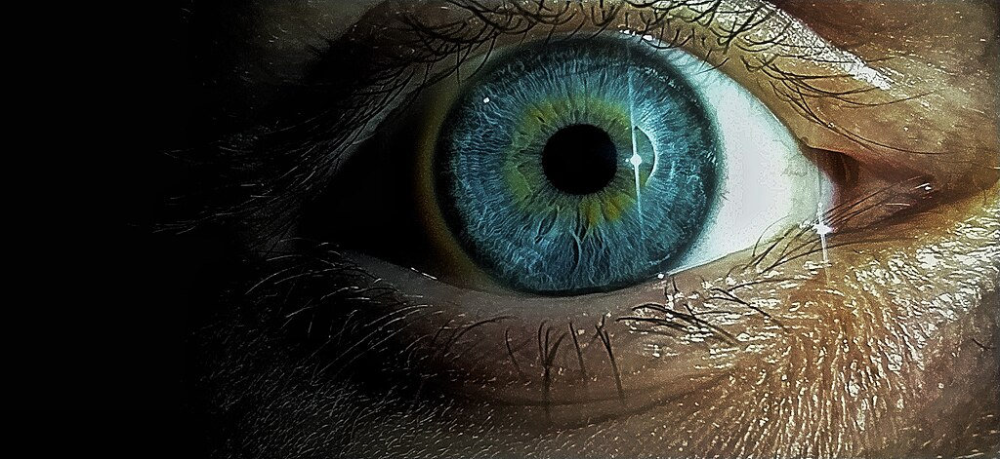[Human eye](https://en.wikipedia.org/wiki/Human_eye "Human eye")

Complex eyes distinguish shapes and [colours](https://en.wikipedia.org/wiki/Colour "Colour"). The [visual](https://en.wikipedia.org/wiki/Visual_perception "Visual perception") fields of many organisms, especially predators, involve large areas of [binocular vision](https://en.wikipedia.org/wiki/Binocular_vision "Binocular vision") for [depth perception](https://en.wikipedia.org/wiki/Depth_perception "Depth perception"). In other organisms, particularly prey animals, eyes are located to maximise the field of view, such as in [rabbits](https://en.wikipedia.org/wiki/Rabbit "Rabbit") and [horses](https://en.wikipedia.org/wiki/Horse "Horse"), which have [monocular vision](https://en.wikipedia.org/wiki/Monocular_vision "Monocular vision").

The first proto-eyes evolved among animals [600](https://geoltime.github.io/?Ma=600) million years ago about the time of the [Cambrian explosion](https://en.wikipedia.org/wiki/Cambrian_explosion "Cambrian explosion"). The last common ancestor of animals possessed the biochemical toolkit necessary for vision, and more advanced eyes have evolved in 96% of animal species in six of the ~35 main [phyla](https://en.wikipedia.org/wiki/Phylum "Phylum"). In most [vertebrates](https://en.wikipedia.org/wiki/Vertebrate "Vertebrate") and some [molluscs](https://en.wikipedia.org/wiki/Mollusc "Mollusc"), the eye allows light to enter and project onto a light-sensitive layer of [cells](https://en.wikipedia.org/wiki/Cell_\(biology\) "Cell (biology)") known as the [retina](https://en.wikipedia.org/wiki/Retina "Retina"). The [cone cells](https://en.wikipedia.org/wiki/Cone_cell "Cone cell") (for colour) and the [rod cells](https://en.wikipedia.org/wiki/Rod_cell "Rod cell") (for low-light contrasts) in the retina detect and convert light into neural signals which are transmitted to the [brain](https://en.wikipedia.org/wiki/Brain "Brain") via the [optic nerve](https://en.wikipedia.org/wiki/Optic_nerve "Optic nerve") to produce vision. Such eyes are typically spheroid, filled with the [transparent](https://en.wikipedia.org/wiki/Transparency_\(optics\) "Transparency (optics)") gel-like [vitreous humour](https://en.wikipedia.org/wiki/Vitreous_humour "Vitreous humour"), possess a focusing [lens](https://en.wikipedia.org/wiki/Lens_\(anatomy\) "Lens (anatomy)"), and often an [iris](https://en.wikipedia.org/wiki/Iris_\(anatomy\) "Iris (anatomy)"). Muscles around the iris change the size of the [pupil](https://en.wikipedia.org/wiki/Pupil "Pupil"), regulating the amount of light that enters the eye and reducing aberrations when there is enough light. The eyes of most [cephalopods](https://en.wikipedia.org/wiki/Cephalopod "Cephalopod"), [fish](https://en.wikipedia.org/wiki/Fish "Fish"), [amphibians](https://en.wikipedia.org/wiki/Amphibian "Amphibian") and [snakes](https://en.wikipedia.org/wiki/Snake "Snake") have fixed lens shapes, and focusing is achieved by telescoping the lens in a similar manner to that of a [camera](https://en.wikipedia.org/wiki/Camera "Camera").

The compound eyes of the [arthropods](https://en.wikipedia.org/wiki/Arthropod "Arthropod") are composed of many simple facets which, depending on anatomical detail, may give either a single pixelated image or multiple images per eye. Each sensor has its own lens and photosensitive cell(s). Some eyes have up to 28,000 such sensors arranged hexagonally, which can give a full 360° field of vision. Compound eyes are very sensitive to motion. Some arthropods, including many [Strepsiptera](https://en.wikipedia.org/wiki/Strepsiptera "Strepsiptera"), have compound eyes of only a few facets, each with a retina capable of creating an image. With each eye producing a different image, a fused, high-resolution image is produced in the brain.

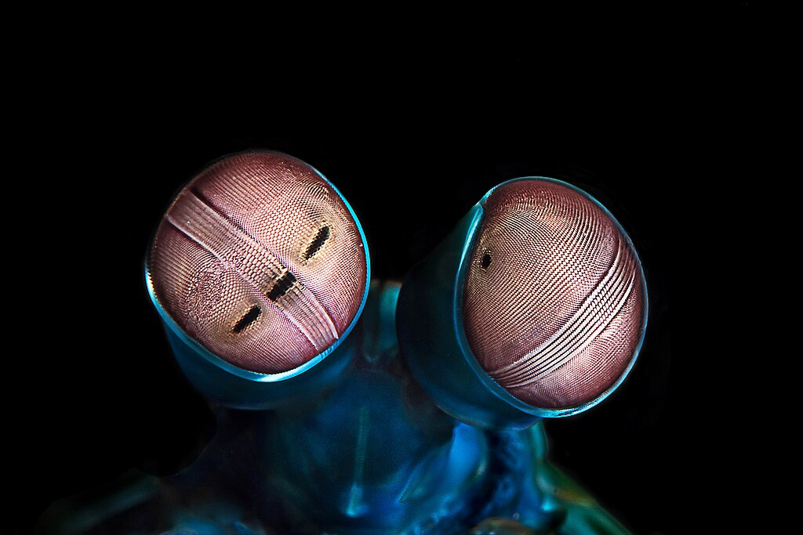The eyes of a mantis shrimp (here _[Odontodactylus scyllarus](https://en.wikipedia.org/wiki/Odontodactylus_scyllarus "Odontodactylus scyllarus")_) are considered the most complex in the animal kingdom.

The [mantis shrimp](https://en.wikipedia.org/wiki/Mantis_shrimp "Mantis shrimp") has the world's most complex colour vision system. It has detailed [hyperspectral](https://en.wikipedia.org/wiki/Hyperspectral "Hyperspectral") colour vision.

[Trilobites](https://en.wikipedia.org/wiki/Trilobite "Trilobite"), now extinct, had unique compound eyes. Clear [calcite](https://en.wikipedia.org/wiki/Calcite "Calcite") crystals formed the lenses of their eyes. They differ in this from most other arthropods, which have soft eyes. The number of lenses in such an eye varied widely; some trilobites had only one while others had thousands of lenses per eye.

In contrast to compound eyes, simple eyes have a single lens. [Jumping spiders](https://en.wikipedia.org/wiki/Jumping_spider "Jumping spider") have one pair of large simple eyes with a narrow [field of view](https://en.wikipedia.org/wiki/Field_of_view "Field of view"), augmented by an array of smaller eyes for [peripheral vision](https://en.wikipedia.org/wiki/Peripheral_vision "Peripheral vision"). Some insect [larvae](https://en.wikipedia.org/wiki/Larva "Larva"), like [caterpillars](https://en.wikipedia.org/wiki/Caterpillar "Caterpillar"), have a type of simple eye ([stemmata](https://en.wikipedia.org/wiki/Stemmata "Stemmata")) which usually provides only a rough image, but (as in [sawfly](https://en.wikipedia.org/wiki/Sawfly "Sawfly") larvae) can possess resolving powers of 4 degrees of arc, be polarization-sensitive, and capable of increasing its absolute sensitivity at night by a factor of 1,000 or more. [Ocelli](https://en.wikipedia.org/wiki/Ocellus "Ocellus"), some of the simplest eyes, are found in animals such as some of the [snails](https://en.wikipedia.org/wiki/Snail "Snail"). They have [photosensitive](https://en.wikipedia.org/wiki/Photosensitive "Photosensitive") cells but no lens or other means of projecting an image onto those cells. They can distinguish between light and dark but no more, enabling them to avoid direct [sunlight](https://en.wikipedia.org/wiki/Sunlight "Sunlight"). In organisms dwelling near [deep-sea vents](https://en.wikipedia.org/wiki/Hydrothermal_vent "Hydrothermal vent"), compound eyes are adapted to see the [infra-red light](https://en.wikipedia.org/wiki/Infrared "Infrared") produced by the hot vents, allowing the creatures to avoid being boiled alive.

## Types

There are ten different eye layouts. Eye types can be categorised into "simple eyes", with one concave photoreceptive surface, and "compound eyes", which comprise a number of individual lenses laid out on a convex surface. "Simple" does not imply a reduced level of complexity or acuity. Indeed, any eye type can be adapted for almost any behaviour or environment. The only limitations specific to eye types are that of resolution—the physics of [compound eyes](https://en.wikipedia.org/wiki/Compound_eyes "Compound eyes") prevents them from achieving a resolution better than 1°. Also, [superposition eyes](/source/eye/#Superposition_eyes) can achieve greater sensitivity than [apposition eyes](https://en.wikipedia.org/wiki/Apposition_eye "Apposition eye"), so are better suited to dark-dwelling creatures.

Eyes also fall into two groups on the basis of their photoreceptor's cellular construction, with the photoreceptor cells either being ciliated (as in the vertebrates) or [rhabdomeric](https://en.wikipedia.org/wiki/Rhabdomeric "Rhabdomeric"). These two groups are not monophyletic; the [Cnidaria](https://en.wikipedia.org/wiki/Cnidaria "Cnidaria") also possess ciliated cells, and some [gastropods](https://en.wikipedia.org/wiki/Gastropoda "Gastropoda") and [annelids](https://en.wikipedia.org/wiki/Annelid "Annelid") possess both.

Some organisms have [photosensitive](https://en.wikipedia.org/wiki/Photosensitivity "Photosensitivity") cells that do nothing but detect whether the surroundings are light or [dark](https://en.wikipedia.org/wiki/Darkness "Darkness"), which is sufficient for the [entrainment](https://en.wikipedia.org/wiki/Entrainment_\(chronobiology\) "Entrainment (chronobiology)") of [circadian rhythms](https://en.wikipedia.org/wiki/Circadian_rhythm "Circadian rhythm"). These are not considered eyes because they lack enough structure to be considered an organ, and do not produce an image.

Every technological method of capturing an optical image that humans commonly use occurs in nature, with the exception of [zoom](https://en.wikipedia.org/wiki/Zoom_lens "Zoom lens") and [Fresnel lenses](https://en.wikipedia.org/wiki/Fresnel_lens "Fresnel lens").

### Non-compound eyes

Simple eyes are rather ubiquitous, and lens-bearing eyes have evolved at least seven times in [vertebrates](https://en.wikipedia.org/wiki/Vertebrate "Vertebrate"), [cephalopods](https://en.wikipedia.org/wiki/Cephalopod "Cephalopod"), [annelids](https://en.wikipedia.org/wiki/Annelid "Annelid"), [crustaceans](https://en.wikipedia.org/wiki/Crustacean "Crustacean") and [Cubozoa](https://en.wikipedia.org/wiki/Cubozoa "Cubozoa").

#### Pit eyes

Pit eyes, also known as [stemmata](https://en.wikipedia.org/wiki/Simple_eyes_in_invertebrates#Stemmata "Simple eyes in invertebrates"), are eye-spots which may be set into a pit to reduce the angles of light that enters and affects the eye-spot, to allow the organism to deduce the angle of incoming light. Found in about 85% of phyla, these basic forms were probably the precursors to more advanced types of "simple eyes". They are small, comprising up to about 100 cells covering about 100 μm. The directionality can be improved by reducing the size of the aperture, by incorporating a reflective layer behind the receptor cells, or by filling the pit with a refractile material.

[Pit vipers](https://en.wikipedia.org/wiki/Crotalinae "Crotalinae") have developed pits that function as eyes by sensing thermal infra-red radiation, in addition to their optical wavelength eyes like those of other vertebrates (see [infrared sensing in snakes](https://en.wikipedia.org/wiki/Infrared_sensing_in_snakes "Infrared sensing in snakes")). However, pit organs are fitted with receptors rather different from photoreceptors, namely a specific [transient receptor potential channel](https://en.wikipedia.org/wiki/Transient_receptor_potential_channel "Transient receptor potential channel") (TRP channels) called [TRPV1](https://en.wikipedia.org/wiki/TRPV1 "TRPV1"). The main difference is that photoreceptors are [G-protein coupled receptors](https://en.wikipedia.org/wiki/G_protein-coupled_receptor "G protein-coupled receptor") but TRP are [ion channels](https://en.wikipedia.org/wiki/Ion_channel "Ion channel").

#### Spherical lens eye

The resolution of pit eyes can be greatly improved by incorporating a material with a higher [refractive index](https://en.wikipedia.org/wiki/Refractive_index "Refractive index") to form a lens, which may greatly reduce the blur radius encountered—hence increasing the resolution obtainable. The most basic form, seen in some gastropods and annelids, consists of a lens of one refractive index. A far sharper image can be obtained using materials with a high refractive index, decreasing to the edges; this decreases the focal length and thus allows a sharp image to form on the retina. This also allows a larger aperture for a given sharpness of image, allowing more light to enter the lens; and a flatter lens, reducing [spherical aberration](https://en.wikipedia.org/wiki/Spherical_aberration "Spherical aberration"). Such a non-homogeneous lens is necessary for the focal length to drop from about 4 times the lens radius, to 2.5 radii.

So-called under-focused lens eyes, found in gastropods and polychaete worms, have eyes that are intermediate between lens-less cup eyes and real camera eyes. Also [box jellyfish](https://en.wikipedia.org/wiki/Box_jellyfish "Box jellyfish") have eyes with a spherical lens, cornea and retina, but the vision is blurry.

Heterogeneous eyes have evolved at least nine times: four or more times in [gastropods](https://en.wikipedia.org/wiki/Sensory_organs_of_gastropods "Sensory organs of gastropods"), once in the [copepods](https://en.wikipedia.org/wiki/Copepod "Copepod"), once in the [annelids](https://en.wikipedia.org/wiki/Annelid "Annelid"), once in the [cephalopods](https://en.wikipedia.org/wiki/Cephalopod "Cephalopod"), and once in the [chitons](https://en.wikipedia.org/wiki/Chiton "Chiton"), which have [aragonite](https://en.wikipedia.org/wiki/Aragonite "Aragonite") lenses. No extant aquatic organisms possess homogeneous lenses; presumably the evolutionary pressure for a heterogeneous lens is great enough for this stage to be quickly "outgrown".

This eye creates an image that is sharp enough that motion of the eye can cause significant blurring. To minimise the effect of eye motion while the animal moves, most such eyes have stabilising eye muscles.

The [ocelli](https://en.wikipedia.org/wiki/Ocellus "Ocellus") of insects bear a simple lens, but their focal point usually lies behind the retina; consequently, those can not form a sharp image. Ocelli (pit-type eyes of arthropods) blur the image across the whole retina, and are consequently excellent at responding to rapid changes in light intensity across the whole visual field; this fast response is further accelerated by the large nerve bundles which rush the information to the brain. Focusing the image would also cause the sun's image to be focused on a few receptors, with the possibility of damage under the intense light; shielding the receptors would block out some light and thus reduce their sensitivity. This fast response has led to suggestions that the ocelli of insects are used mainly in flight, because they can be used to detect sudden changes in which way is up (because light, especially UV light which is absorbed by vegetation, usually comes from above).

#### Multiple lenses

Some marine organisms bear more than one lens; for instance the [copepod](https://en.wikipedia.org/wiki/Copepod "Copepod") _[Pontella](https://en.wikipedia.org/wiki/Pontella "Pontella")_ has three. The outer has a parabolic surface, countering the effects of spherical aberration while allowing a sharp image to be formed. Another copepod, _[Copilia](https://en.wikipedia.org/wiki/Copilia "Copilia")_, has two lenses in each eye, arranged like those in a telescope. Such arrangements are rare and poorly understood, but represent an alternative construction.

Multiple lenses are seen in some hunters such as eagles and jumping spiders, which have a refractive cornea: these have a negative lens, enlarging the observed image by up to 50% over the receptor cells, thus increasing their optical resolution.

#### Refractive cornea

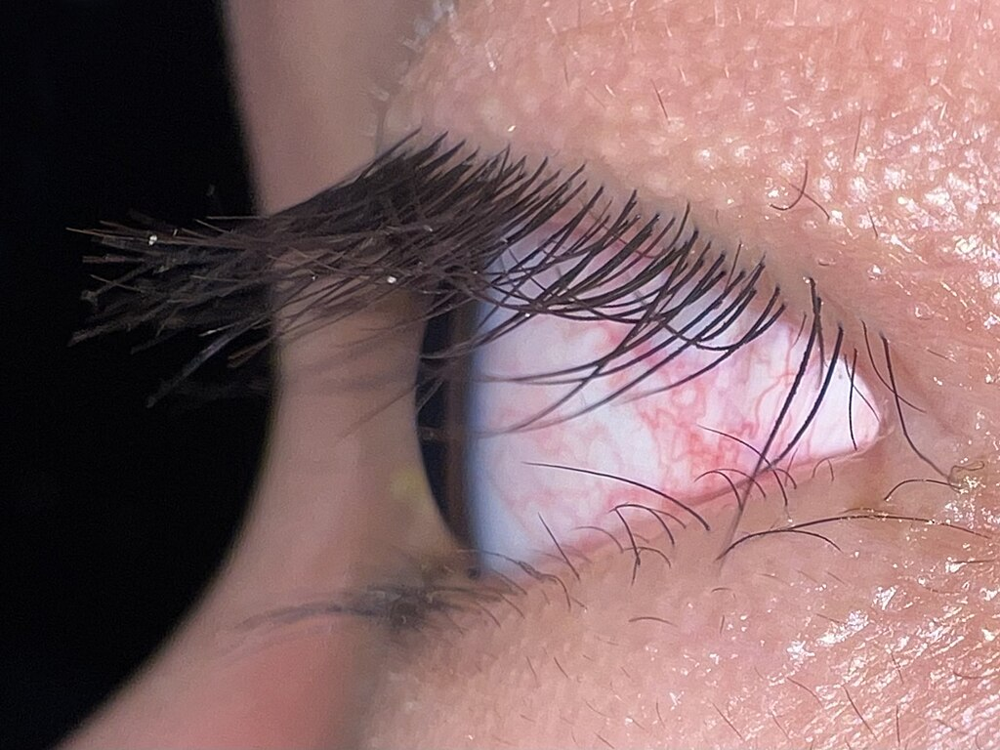A refractive cornea type eye of a human. The cornea is the clear domed part covering the [anterior chamber of the eye](https://en.wikipedia.org/wiki/Anterior_chamber_of_eyeball "Anterior chamber of eyeball").

In the [eyes of most mammals](https://en.wikipedia.org/wiki/Mammalian_eye "Mammalian eye"), [birds](https://en.wikipedia.org/wiki/Bird_vision#Anatomy_of_the_eye "Bird vision"), reptiles, and most other terrestrial vertebrates (along with spiders and some insect larvae) the vitreous fluid has a higher refractive index than the air. In general, the lens is not spherical. Spherical lenses produce spherical aberration. In refractive corneas, the lens tissue is corrected with inhomogeneous lens material (see [Luneburg lens](https://en.wikipedia.org/wiki/Luneburg_lens "Luneburg lens")), or with an aspheric shape. Flattening the lens has a disadvantage; the quality of vision is diminished away from the main line of focus. Thus, animals that have evolved with a wide field-of-view often have eyes that make use of an inhomogeneous lens.

As mentioned above, a refractive cornea is only useful out of water. In water, there is little difference in refractive index between the vitreous fluid and the surrounding water. Hence creatures that have returned to the water—penguins and seals, for example—lose their highly curved cornea and return to lens-based vision. An alternative solution, borne by some divers, is to have a very strongly focusing cornea.

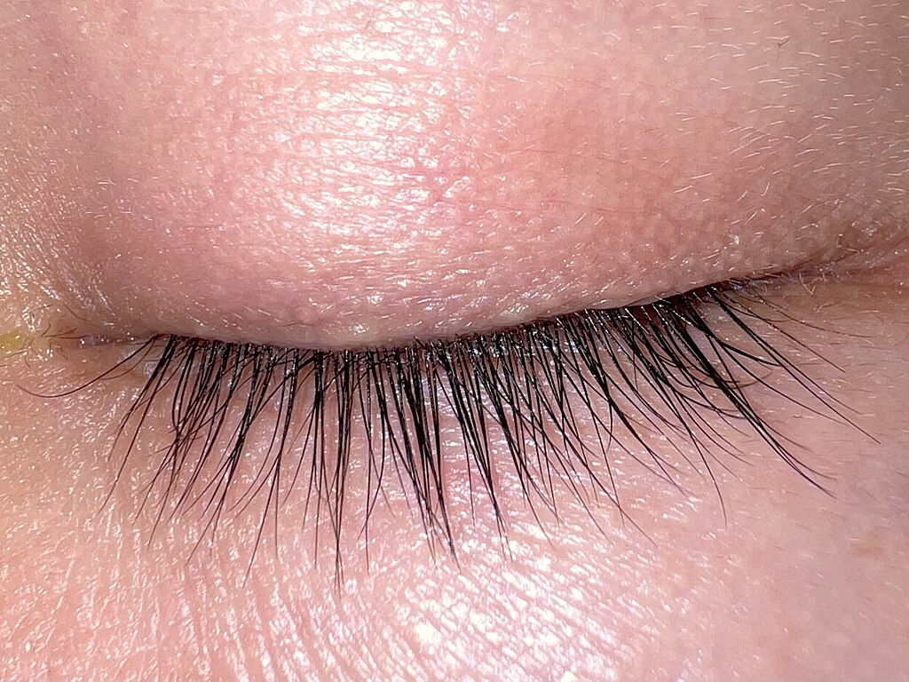[Eyelids](https://en.wikipedia.org/wiki/Eyelid "Eyelid") and [eyelashes](https://en.wikipedia.org/wiki/Eyelash "Eyelash") are a unique characteristic of most mammalian eyes, both of which are evolutionary features to protect the eye.

A unique feature of most mammal eyes is the presence of [eyelids](https://en.wikipedia.org/wiki/Eyelid "Eyelid") which wipe the eye and spread [tears](https://en.wikipedia.org/wiki/Tears "Tears") across the cornea to prevent dehydration. These eyelids are also supplemented by the presence of [eyelashes](https://en.wikipedia.org/wiki/Eyelash "Eyelash"), multiple rows of highly innervated and sensitive hairs which grow from the eyelid margins to protect the eye from fine particles and small irritants such as insects.

#### Reflector eyes

An alternative to a lens is to line the inside of the eye with "mirrors", and reflect the image to focus at a central point. The nature of these eyes means that if one were to peer into the pupil of an eye, one would see the same image that the organism would see, reflected back out.

Many small organisms such as [rotifers](https://en.wikipedia.org/wiki/Rotifer "Rotifer"), copepods and [flatworms](https://en.wikipedia.org/wiki/Flatworm "Flatworm") use such organs, but these are too small to produce usable images. Some larger organisms, such as [scallops](https://en.wikipedia.org/wiki/Scallop "Scallop"), also use reflector eyes. The scallop _[Pecten](https://en.wikipedia.org/wiki/Pecten_\(bivalve\) "Pecten (bivalve)")_ has up to 100 millimetre-scale reflector eyes fringing the edge of its shell. It detects moving objects as they pass successive lenses.

There is at least one vertebrate, the [spookfish](https://en.wikipedia.org/wiki/Brownsnout_spookfish "Brownsnout spookfish"), whose eyes include reflective optics for focusing of light. Each of the two eyes of a spookfish collects light from both above and below; the light coming from above is focused by a lens, while that coming from below, by a curved mirror composed of many layers of small reflective plates made of [guanine](https://en.wikipedia.org/wiki/Guanine "Guanine") [crystals](https://en.wikipedia.org/wiki/Crystal "Crystal").

### Compound eyes

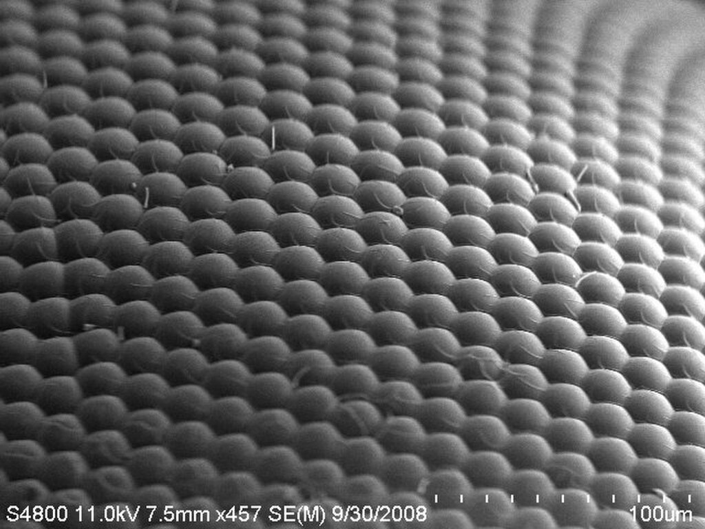An image of a house fly compound eye surface by using [scanning electron microscope](https://en.wikipedia.org/wiki/Scanning_electron_microscope "Scanning electron microscope")Anatomy of the compound eye of an insect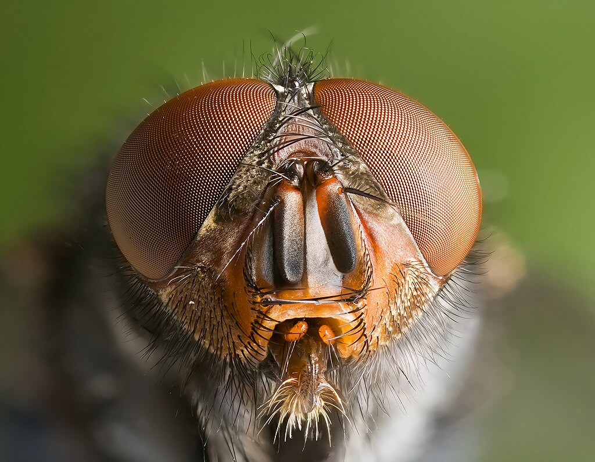Arthropods such as this [blue bottle fly](https://en.wikipedia.org/wiki/Calliphora_vomitoria "Calliphora vomitoria") have compound eyes.

A compound eye may consist of thousands of individual photoreceptor units or ommatidia ([ommatidium](https://en.wikipedia.org/wiki/Ommatidium "Ommatidium"), singular). The image perceived is a combination of inputs from the numerous ommatidia (individual "eye units"), which are located on a convex surface, thus pointing in slightly different directions. Compared with simple eyes, compound eyes possess a very large view angle, and can detect fast movement and, in some cases, the [polarisation](https://en.wikipedia.org/wiki/Polarization_\(waves\) "Polarization (waves)") of light. Because the individual lenses are so small, the effects of [diffraction](https://en.wikipedia.org/wiki/Diffraction "Diffraction") impose a limit on the possible resolution that can be obtained (assuming that they do not function as [phased arrays](https://en.wikipedia.org/wiki/Phased_array "Phased array")). This can only be countered by increasing lens size and number. To see with a resolution comparable to our simple eyes, humans would require very large compound eyes, around 11 metres (36 ft) in radius.

Compound eyes fall into two groups: apposition eyes, which form multiple inverted images, and superposition eyes, which form a single erect image. Compound eyes are common in arthropods, annelids and some bivalved molluscs. Compound eyes in arthropods grow at their margins by the addition of new ommatidia.

#### Apposition eyes

Apposition eyes are the most common form of eyes and are presumably the ancestral form of compound eyes. They are found in all [arthropod](https://en.wikipedia.org/wiki/Arthropod "Arthropod") groups, although they may have evolved more than once within this phylum. Some [annelids](https://en.wikipedia.org/wiki/Annelids "Annelids") and [bivalves](https://en.wikipedia.org/wiki/Bivalves "Bivalves") also have apposition eyes. They are also possessed by _[Limulus](https://en.wikipedia.org/wiki/Limulus "Limulus")_, the horseshoe crab, and there are suggestions that other chelicerates developed their simple eyes by reduction from a compound starting point. (Some caterpillars appear to have evolved compound eyes from simple eyes in the opposite fashion.)

Apposition eyes work by gathering a number of images, one from each eye, and combining them in the brain, with each eye typically contributing a single point of information. The typical apposition eye has a lens focusing light from one direction on the rhabdom, while light from other directions is absorbed by the dark wall of the [ommatidium](https://en.wikipedia.org/wiki/Ommatidium "Ommatidium").

#### Superposition eyes

The second type is named the superposition eye. The superposition eye is divided into three types:

*   refracting,
*   reflecting and
*   parabolic superposition

The refracting superposition eye has a gap between the lens and the rhabdom, and no side wall. Each lens takes light at an angle to its axis and reflects it to the same angle on the other side. The result is an image at half the radius of the eye, which is where the tips of the rhabdoms are. This type of compound eye, for which a minimal size exists below which effective superposition cannot occur, is normally found in nocturnal insects, because it can create images up to 1000 times brighter than equivalent apposition eyes, though at the cost of reduced resolution. In the parabolic superposition compound eye type, seen in arthropods such as [mayflies](https://en.wikipedia.org/wiki/Mayfly "Mayfly"), the parabolic surfaces of the inside of each facet focus light from a reflector to a sensor array. Long-bodied [decapod crustaceans](https://en.wikipedia.org/wiki/Decapoda "Decapoda") such as [shrimp](https://en.wikipedia.org/wiki/Shrimp "Shrimp"), [prawns](https://en.wikipedia.org/wiki/Prawn "Prawn"), [crayfish](https://en.wikipedia.org/wiki/Crayfish "Crayfish") and [lobsters](https://en.wikipedia.org/wiki/Lobster "Lobster") are alone in having reflecting superposition eyes, which also have a transparent gap but use corner [mirrors](https://en.wikipedia.org/wiki/Mirror "Mirror") instead of lenses.

#### Parabolic superposition

This eye type functions by refracting light, then using a parabolic mirror to focus the image; it combines features of superposition and apposition eyes.

#### Other

Another kind of compound eye, found in males of Order [Strepsiptera](https://en.wikipedia.org/wiki/Strepsiptera "Strepsiptera"), employs a series of simple eyes—eyes having one opening that provides light for an entire image-forming retina. Several of these _eyelets_ together form the strepsipteran compound eye, which is similar to the 'schizochroal' compound eyes of some [trilobites](https://en.wikipedia.org/wiki/Trilobites "Trilobites"). Because each eyelet is a simple eye, it produces an inverted image; those images are combined in the brain to form one unified image. Because the aperture of an eyelet is larger than the facets of a compound eye, this arrangement allows vision under low light levels.

Good fliers such as flies or honey bees, or prey-catching insects such as [praying mantis](https://en.wikipedia.org/wiki/Praying_mantis "Praying mantis") or [dragonflies](https://en.wikipedia.org/wiki/Dragonfly "Dragonfly"), have specialised zones of [ommatidia](https://en.wikipedia.org/wiki/Ommatidium "Ommatidium") organised into a [fovea](https://en.wikipedia.org/wiki/Fovea_centralis "Fovea centralis") area which gives acute vision. In the acute zone, the eyes are flattened and the facets larger. The flattening allows more ommatidia to receive light from a spot and therefore higher resolution. The black spot that can be seen on the compound eyes of such insects, which always seems to look directly at the observer, is called a [pseudopupil](https://en.wikipedia.org/wiki/Pseudopupil "Pseudopupil"). This occurs because the [ommatidia](https://en.wikipedia.org/wiki/Ommatidia "Ommatidia") which one observes "head-on" (along their [optical axes](https://en.wikipedia.org/wiki/Optical_axis "Optical axis")) absorb the [incident light](https://en.wikipedia.org/wiki/Incident_light "Incident light"), while those to one side reflect it.

There are some exceptions from the types mentioned above. Some insects have a so-called single lens compound eye, a transitional type which is something between a superposition type of the multi-lens compound eye and the single lens eye found in animals with simple eyes. Then there is the [mysid](https://en.wikipedia.org/wiki/Mysid "Mysid") shrimp, _Dioptromysis paucispinosa_. The shrimp has an eye of the refracting superposition type, in the rear behind this in each eye there is a single large facet that is three times in diameter the others in the eye and behind this is an enlarged crystalline cone. This projects an upright image on a specialised retina. The resulting eye is a mixture of a simple eye within a compound eye.

Another version is a compound eye often referred to as "pseudofaceted", as seen in _[Scutigera](https://en.wikipedia.org/wiki/Scutigera "Scutigera")_. This type of eye consists of a cluster of numerous [ommatidia](https://en.wikipedia.org/wiki/Ommatidia "Ommatidia") on each side of the head, organised in a way that resembles a true compound eye.

The body of _[Ophiocoma wendtii](https://en.wikipedia.org/wiki/Ophiocoma_wendtii "Ophiocoma wendtii")_, a type of [brittle star](https://en.wikipedia.org/wiki/Brittle_star "Brittle star"), is covered with ommatidia, turning its whole skin into a compound eye. The same is true of many [chitons](https://en.wikipedia.org/wiki/Chiton "Chiton"). The tube feet of sea urchins contain photoreceptor proteins, which together act as a compound eye; they lack screening pigments, but can detect the directionality of light by the shadow cast by its opaque body.

#### Nutrients

The **ciliary body** is triangular in horizontal section and is coated by a double layer, the ciliary epithelium. The inner layer is transparent and covers the vitreous body, and is continuous from the neural tissue of the retina. The outer layer is highly pigmented, continuous with the retinal pigment epithelium, and constitutes the cells of the dilator muscle.

The **vitreous** is the transparent, colourless, gelatinous mass that fills the space between the lens of the eye and the retina lining the back of the eye. It is produced by certain retinal cells. It is of rather similar composition to the cornea, but contains very few cells (mostly phagocytes which remove unwanted cellular debris in the visual field, as well as the hyalocytes of Balazs of the surface of the vitreous, which reprocess the [hyaluronic acid](https://en.wikipedia.org/wiki/Hyaluronic_acid "Hyaluronic acid")), no blood vessels, and 98–99% of its volume is water (as opposed to 75% in the cornea) with salts, sugars, vitrosin (a type of collagen), a network of collagen type II fibres with the [mucopolysaccharide](https://en.wikipedia.org/wiki/Mucopolysaccharide "Mucopolysaccharide") hyaluronic acid, and also a wide array of proteins in micro amounts. Amazingly, with so little solid matter, it tautly holds the eye.

## Evolution

Evolution of the eye

Photoreception is [phylogenetically](https://en.wikipedia.org/wiki/Phylogenetics "Phylogenetics") very old, with various theories of phylogenesis. The common origin ([monophyly](https://en.wikipedia.org/wiki/Monophyly "Monophyly")) of all animal eyes is now widely accepted as fact. This is based upon the shared genetic features of all eyes; that is, all modern eyes, varied as they are, have their origins in a proto-eye believed to have evolved some 650-600 million years ago, and the [PAX6](https://en.wikipedia.org/wiki/PAX6 "PAX6") gene is considered a key factor in this. The majority of the advancements in early eyes are believed to have taken only a few million years to develop, since the first predator to gain true imaging would have touched off an "arms race" among all species that did not flee the photopic environment. Prey animals and competing predators alike would be at a distinct disadvantage without such capabilities and would be less likely to survive and reproduce. Hence multiple eye types and subtypes developed in parallel (except those of groups, such as the vertebrates, that were only forced into the photopic environment at a late stage).

Eyes in various animals show adaptation to their requirements. For example, the eye of a [bird of prey](https://en.wikipedia.org/wiki/Bird_of_prey "Bird of prey") has much greater visual acuity than a [human eye](https://en.wikipedia.org/wiki/Human_eye "Human eye"), and in some cases can detect [ultraviolet](https://en.wikipedia.org/wiki/Ultraviolet "Ultraviolet") radiation. The different forms of eye in, for example, vertebrates and molluscs are examples of [parallel evolution](https://en.wikipedia.org/wiki/Parallel_evolution "Parallel evolution"), despite their distant common ancestry. Phenotypic convergence of the geometry of cephalopod and most vertebrate eyes creates the impression that the vertebrate eye evolved from an imaging [cephalopod eye](https://en.wikipedia.org/wiki/Cephalopod_eye "Cephalopod eye"), but this is not the case, as the reversed roles of their respective ciliary and rhabdomeric opsin classes and different lens crystallins show.

The very earliest "eyes", called eye-spots, were simple patches of [photoreceptor protein](https://en.wikipedia.org/wiki/Photoreceptor_protein "Photoreceptor protein") in unicellular animals. In multicellular beings, multicellular eyespots evolved, physically similar to the receptor patches for taste and smell. These eyespots could only sense ambient brightness: they could distinguish light and dark, but not the direction of the light source.

Through gradual change, the eye-spots of species living in well-lit environments depressed into a shallow "cup" shape. The ability to slightly discriminate directional brightness was achieved by using the angle at which the light hit certain cells to identify the source. The pit deepened over time, the opening diminished in size, and the number of photoreceptor cells increased, forming an effective [pinhole camera](https://en.wikipedia.org/wiki/Pinhole_camera "Pinhole camera") that was capable of dimly distinguishing shapes. However, the ancestors of modern [hagfish](https://en.wikipedia.org/wiki/Hagfish "Hagfish"), thought to be the protovertebrate, were evidently pushed to very deep, dark waters, where they were less vulnerable to sighted predators, and where it is advantageous to have a convex eye-spot, which gathers more light than a flat or concave one. This would have led to a somewhat different evolutionary trajectory for the vertebrate eye than for other animal eyes.

The thin overgrowth of transparent cells over the eye's aperture, originally formed to prevent damage to the eyespot, allowed the segregated contents of the eye chamber to specialise into a transparent humour that optimised colour filtering, blocked harmful radiation, improved the eye's [refractive index](https://en.wikipedia.org/wiki/Refractive_index "Refractive index"), and allowed functionality outside of water. The transparent protective cells eventually split into two layers, with circulatory fluid in between that allowed wider viewing angles and greater imaging resolution, and the thickness of the transparent layer gradually increased, in most species with the transparent [crystallin](https://en.wikipedia.org/wiki/Crystallin "Crystallin") protein.

The gap between tissue layers naturally formed a biconvex shape, an optimally ideal structure for a normal refractive index. Independently, a transparent layer and a nontransparent layer split forward from the lens: the [cornea](https://en.wikipedia.org/wiki/Cornea "Cornea") and [iris](https://en.wikipedia.org/wiki/Iris_\(anatomy\) "Iris (anatomy)"). Separation of the forward layer again formed a humour, the [aqueous humour](https://en.wikipedia.org/wiki/Aqueous_humour "Aqueous humour"). This increased refractive power and again eased circulatory problems. Formation of a nontransparent ring allowed more blood vessels, more circulation, and larger eye sizes.

### Relationship to life requirements

Eyes are generally adapted to the environment and life requirements of the organism which bears them. For instance, the distribution of photoreceptors tends to match the area in which the highest acuity is required, with horizon-scanning organisms, such as those that live on the [African](https://en.wikipedia.org/wiki/Africa "Africa") plains, having a horizontal line of high-density ganglia, while tree-dwelling creatures which require good all-round vision tend to have a symmetrical distribution of ganglia, with acuity decreasing outwards from the centre.

Of course, for most eye types, it is impossible to diverge from a spherical form, so only the density of optical receptors can be altered. In organisms with compound eyes, it is the number of ommatidia rather than ganglia that reflects the region of highest data acquisition. Optical superposition eyes are constrained to a spherical shape, but other forms of compound eyes may deform to a shape where more ommatidia are aligned to, say, the horizon, without altering the size or density of individual ommatidia. Eyes of horizon-scanning organisms have stalks so they can be easily aligned to the horizon when this is inclined, for example, if the animal is on a slope.

An extension of this concept is that the eyes of predators typically have a zone of very acute vision at their centre, to assist in the identification of prey. In deep water organisms, it may not be the centre of the eye that is enlarged. The [hyperiid](https://en.wikipedia.org/wiki/Hyperiid "Hyperiid") [amphipods](https://en.wikipedia.org/wiki/Amphipod "Amphipod") are deep water animals that feed on organisms above them. Their eyes are almost divided into two, with the upper region thought to be involved in detecting the silhouettes of potential prey—or predators—against the faint light of the sky above. Accordingly, deeper water hyperiids, where the light against which the silhouettes must be compared is dimmer, have larger "upper-eyes", and may lose the lower portion of their eyes altogether. In the giant Antarctic isopod [Glyptonotus](https://en.wikipedia.org/wiki/Glyptonotus_antarcticus "Glyptonotus antarcticus") a small ventral compound eye is physically completely separated from the much larger dorsal compound eye. Depth perception can be enhanced by having eyes which are enlarged in one direction; distorting the eye slightly allows the distance to the object to be estimated with a high degree of accuracy.

Acuity is higher among male organisms that mate in mid-air, as they need to be able to spot and assess potential mates against a very large backdrop. On the other hand, the eyes of organisms which operate in low light levels, such as around dawn and dusk or in deep water, tend to be larger to increase the amount of light that can be captured.

It is not only the shape of the eye that may be affected by lifestyle. Eyes can be the most visible parts of organisms, and this can act as a pressure on organisms to have more transparent eyes at the cost of function.

Eyes may be mounted on stalks to provide better all-round vision, by lifting them above an organism's carapace; this also allows them to track predators or prey without moving the head.

## Physiology

### Visual acuity

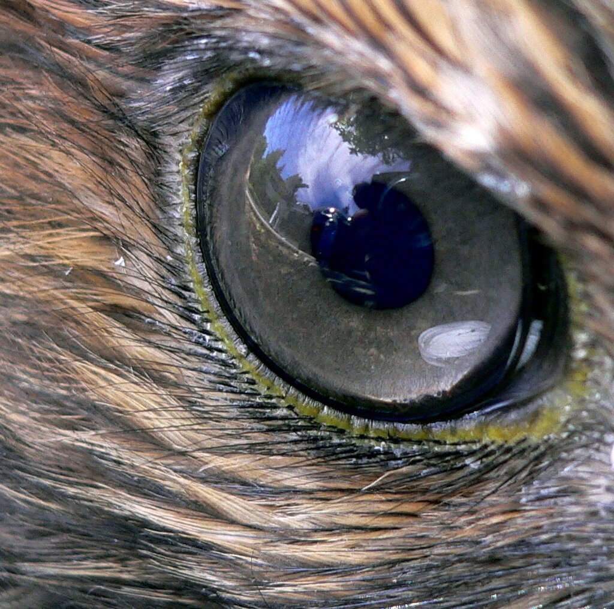The eye of a [red-tailed hawk](https://en.wikipedia.org/wiki/Red-tailed_hawk "Red-tailed hawk")

[Visual acuity](https://en.wikipedia.org/wiki/Visual_acuity "Visual acuity"), or resolving power, is "the ability to distinguish fine detail" and is the property of [cone cells](https://en.wikipedia.org/wiki/Cone_cells "Cone cells"). It is often measured in _cycles per [degree](https://en.wikipedia.org/wiki/Degree_\(angle\) "Degree (angle)")_ (CPD), which measures an [angular resolution](https://en.wikipedia.org/wiki/Angular_resolution "Angular resolution"), or how much an eye can differentiate one object from another in terms of visual angles. Resolution in CPD can be measured by bar charts of different numbers of white/black stripe cycles. For example, if each pattern is 1.75 cm wide and is placed at 1 m distance from the eye, it will subtend an angle of 1 degree, so the number of white/black bar pairs on the pattern will be a measure of the cycles per degree of that pattern. The highest such number that the eye can resolve as stripes, or distinguish from a grey block, is then the measurement of visual acuity of the eye.

For a human eye with excellent acuity, the maximum theoretical resolution is 50 CPD (1.2 [arcminute](https://en.wikipedia.org/wiki/Arcminute "Arcminute") per line pair, or a 0.35 mm line pair, at 1 m). A rat can resolve only about 1 to 2 CPD. A horse has higher acuity through most of the visual field of its eyes than a human has, but does not match the high acuity of the human eye's central [fovea](https://en.wikipedia.org/wiki/Fovea_centralis "Fovea centralis") region.

Spherical aberration limits the resolution of a 7 mm pupil to about 3 arcminutes per line pair. At a pupil diameter of 3 mm, the spherical aberration is greatly reduced, resulting in an improved resolution of approximately 1.7 arcminutes per line pair. A resolution of 2 arcminutes per line pair, equivalent to a 1 arcminute gap in an [optotype](https://en.wikipedia.org/wiki/Optotype "Optotype"), corresponds to 20/20 ([normal vision](https://en.wikipedia.org/wiki/Normal_vision "Normal vision")) in humans.

However, in the compound eye, the resolution is related to the size of individual ommatidia and the distance between neighbouring ommatidia. Physically these cannot be reduced in size to achieve the acuity seen with single lensed eyes as in mammals. Compound eyes have a much lower acuity than vertebrate eyes.

### Colour perception

"Colour vision is the faculty of the organism to distinguish lights of different spectral qualities." All organisms are restricted to a small range of electromagnetic spectrum; this varies from creature to creature, but is mainly between wavelengths of 400 and 700 nm. This is a rather small section of the electromagnetic spectrum, probably reflecting the submarine evolution of the organ: water blocks out all but two small windows of the EM spectrum, and there has been no evolutionary pressure among land animals to broaden this range.

The most sensitive pigment, [rhodopsin](https://en.wikipedia.org/wiki/Rhodopsin "Rhodopsin"), has a peak response at 500 nm. Small changes to the genes coding for this protein can tweak the peak response by a few nm; pigments in the lens can also filter incoming light, changing the peak response. Many organisms are unable to discriminate between colours, seeing instead in shades of grey; colour vision necessitates a range of pigment cells which are primarily sensitive to smaller ranges of the spectrum. In primates, geckos, and other organisms, these take the form of [cone cells](https://en.wikipedia.org/wiki/Cone_cell "Cone cell"), from which the more sensitive [rod cells](https://en.wikipedia.org/wiki/Rod_cell "Rod cell") evolved. Even if organisms are physically capable of discriminating different colours, this does not necessarily mean that they can perceive the different colours; only with behavioural tests can this be deduced.

Most organisms with colour vision can detect ultraviolet light. This high energy light can be damaging to receptor cells. With a few exceptions (snakes, placental mammals), most organisms avoid these effects by having absorbent oil droplets around their cone cells. The alternative, developed by organisms that had lost these oil droplets in the course of evolution, is to make the lens impervious to UV light—this precludes the possibility of any UV light being detected, as it does not even reach the retina.

### Rods and cones

The retina contains two major types of light-sensitive [photoreceptor cells](https://en.wikipedia.org/wiki/Photoreceptor_cell "Photoreceptor cell") used for vision: the [rods](https://en.wikipedia.org/wiki/Rod_cell "Rod cell") and the [cones](https://en.wikipedia.org/wiki/Cone_cell "Cone cell").

Rods cannot distinguish colours, but are responsible for low-light ([scotopic](https://en.wikipedia.org/wiki/Scotopic "Scotopic")) monochrome ([black-and-white](https://en.wikipedia.org/wiki/Black-and-white "Black-and-white")) vision; they work well in dim light as they contain a pigment, rhodopsin (visual purple), which is sensitive at low light intensity, but saturates at higher ([photopic](https://en.wikipedia.org/wiki/Photopic "Photopic")) intensities. Rods are distributed throughout the retina but there are none at the [fovea](https://en.wikipedia.org/wiki/Fovea_centralis "Fovea centralis") and none at the [blind spot](https://en.wikipedia.org/wiki/Blind_spot_\(vision\) "Blind spot (vision)"). Rod density is greater in the peripheral retina than in the central retina.

Cones are responsible for [colour vision](https://en.wikipedia.org/wiki/Color_vision "Color vision"). They require brighter light to function than rods require. In humans, there are three types of cones, maximally sensitive to long-wavelength, medium-wavelength, and short-wavelength light (often referred to as red, green, and blue, respectively, though the sensitivity peaks are not actually at these colours). The colour seen is the combined effect of [stimuli](https://en.wikipedia.org/wiki/Stimulus_\(physiology\) "Stimulus (physiology)") to, and [responses](https://en.wikipedia.org/wiki/Stimulus–response_model "Stimulus–response model") from, these three types of cone cells. Cones are mostly concentrated in and near the fovea. Only a few are present at the sides of the retina. Objects are seen most sharply in focus when their images fall on the fovea, as when one looks at an object directly. Cone cells and rods are connected through intermediate cells in the retina to nerve fibres of the [optic nerve](https://en.wikipedia.org/wiki/Optic_nerve "Optic nerve"). When rods and cones are stimulated by light, they connect through adjoining cells within the retina to send an electrical signal to the optic nerve fibres. The optic nerves send off impulses through these fibres to the brain.

## Pigmentation

The pigment molecules used in the eye are various, but can be used to define the evolutionary distance between different groups, and can also be an aid in determining which are closely related—although problems of convergence do exist.

[Opsins](https://en.wikipedia.org/wiki/Opsin "Opsin") are the pigments involved in photoreception. Other pigments, such as [melanin](https://en.wikipedia.org/wiki/Melanin "Melanin"), are used to shield the photoreceptor cells from light leaking in from the sides. The opsin protein group evolved long before the last common ancestor of animals, and has continued to diversify since.

There are two types of opsin involved in vision; c-opsins, which are associated with ciliary-type photoreceptor cells, and r-opsins, associated with rhabdomeric photoreceptor cells. The eyes of vertebrates usually contain ciliary cells with c-opsins, and (bilaterian) invertebrates have rhabdomeric cells in the eye with r-opsins. However, some _ganglion_ cells of vertebrates express r-opsins, suggesting that their [ancestors](https://en.wikipedia.org/wiki/Ancestor "Ancestor") used this pigment in vision, and that remnants survive in the eyes. Likewise, c-opsins have been found to be expressed in the _brain_ of some invertebrates. They may have been expressed in ciliary cells of larval eyes, which were subsequently [resorbed](https://en.wiktionary.org/wiki/resorb "wikt:resorb") into the brain on metamorphosis to the adult form. C-opsins are also found in some derived bilaterian-invertebrate eyes, such as the pallial eyes of the bivalve molluscs; however, the lateral eyes (which were presumably the ancestral type for this group, if eyes evolved once there) always use r-opsins. [Cnidaria](https://en.wikipedia.org/wiki/Cnidaria "Cnidaria"), which are an outgroup to the taxa mentioned above, express c-opsins—but r-opsins are yet to be found in this group. Incidentally, the melanin produced in the cnidaria is produced in the same fashion as that in vertebrates, suggesting the common descent of this pigment.

## Additional images

*   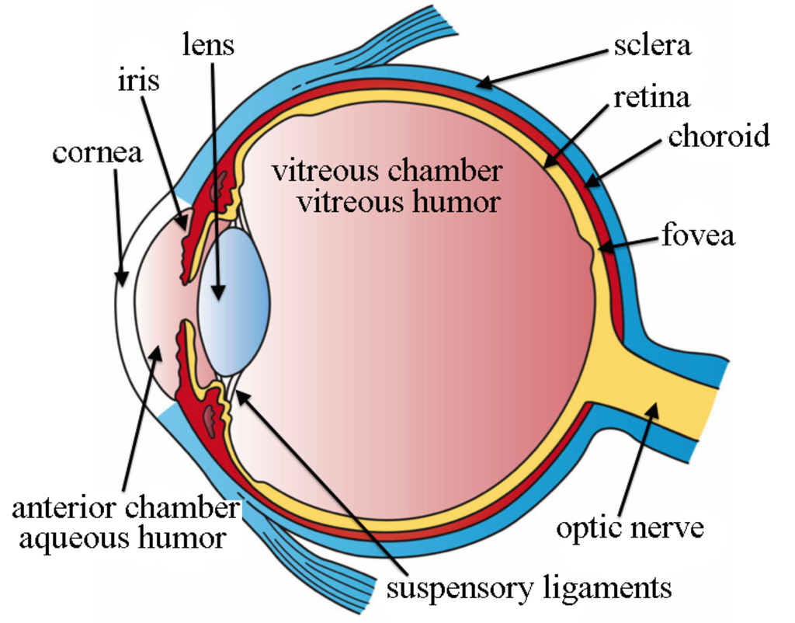

    The structures of the eye labelled

*   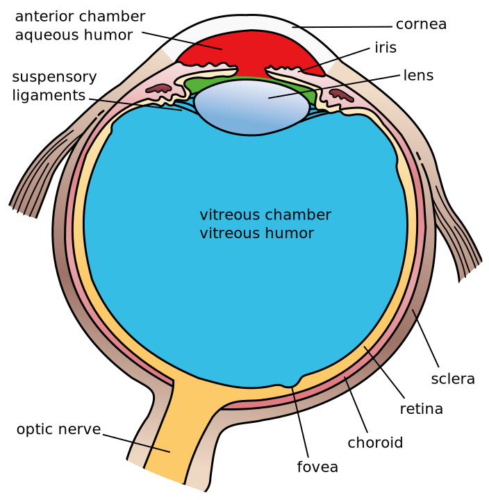

    Another view of the eye and the structures of the eye labelled
