**General relativity**, also known as the **general theory of relativity**, and as **Einstein's theory of gravity**, is the [geometric](https://en.wikipedia.org/wiki/Differential_geometry "Differential geometry") theory of [gravitation](https://en.wikipedia.org/wiki/Gravitation "Gravitation") published by [Albert Einstein](https://en.wikipedia.org/wiki/Albert_Einstein "Albert Einstein") in May 1916 and is the accepted description of the gravitation of macroscopic objects in [modern physics](https://en.wikipedia.org/wiki/Modern_physics "Modern physics"). General [relativity](https://en.wikipedia.org/wiki/Theory_of_relativity "Theory of relativity") generalizes [special relativity](https://en.wikipedia.org/wiki/Special_relativity "Special relativity") and refines [Isaac Newton](https://en.wikipedia.org/wiki/Isaac_Newton "Isaac Newton")'s [law of universal gravitation](https://en.wikipedia.org/wiki/Law_of_universal_gravitation "Law of universal gravitation"), providing a unified description of gravity as a geometric property of [space](https://en.wikipedia.org/wiki/Space "Space") and [time](https://en.wikipedia.org/wiki/Time_in_physics "Time in physics"), or four-dimensional [spacetime](https://en.wikipedia.org/wiki/Spacetime "Spacetime"). In particular, the _[curvature](https://en.wikipedia.org/wiki/Curvature "Curvature") of spacetime_ is directly related to the [energy](https://en.wikipedia.org/wiki/Energy "Energy"), [momentum](https://en.wikipedia.org/wiki/Momentum "Momentum"), and [stress](https://en.wikipedia.org/wiki/Stress_\(mechanics\) "Stress (mechanics)") of whatever is present, including [matter](https://en.wikipedia.org/wiki/Matter "Matter") and [radiation](https://en.wikipedia.org/wiki/Radiation "Radiation"). The relation is specified by the [Einstein field equations](https://en.wikipedia.org/wiki/Einstein_field_equations "Einstein field equations"), a system of second-order [partial differential equations](https://en.wikipedia.org/wiki/Partial_differential_equation "Partial differential equation"). [John Archibald Wheeler](https://en.wikipedia.org/wiki/John_Archibald_Wheeler "John Archibald Wheeler") summarized it: "Space-time tells matter how to move; matter tells space-time how to curve."

Newton's law of universal gravitation, which describes gravity in classical mechanics, can be seen as a prediction of general relativity for the almost flat spacetime geometry around stationary mass distributions. Some predictions of general relativity, however, are beyond Newton's law of universal gravitation in [classical physics](https://en.wikipedia.org/wiki/Classical_physics "Classical physics"). These predictions concern the passage of time, the [geometry](https://en.wikipedia.org/wiki/Geometry "Geometry") of space, the motion of bodies in [free fall](https://en.wikipedia.org/wiki/Free_fall "Free fall"), and the propagation of light, and include [gravitational time dilation](https://en.wikipedia.org/wiki/Gravitational_time_dilation "Gravitational time dilation"), [gravitational lensing](https://en.wikipedia.org/wiki/Gravitational_lens "Gravitational lens"), the [gravitational redshift](https://en.wikipedia.org/wiki/Gravitational_redshift "Gravitational redshift") of light, the [Shapiro time delay](https://en.wikipedia.org/wiki/Shapiro_time_delay "Shapiro time delay"), [singularities](https://en.wikipedia.org/wiki/Gravitational_singularity "Gravitational singularity") and [black holes](https://en.wikipedia.org/wiki/Black_hole "Black hole"). So far, all [tests of general relativity](https://en.wikipedia.org/wiki/Tests_of_general_relativity "Tests of general relativity") have been in agreement with the theory. The time-dependent solutions of general relativity enable us to extrapolate the history of the universe into the past and future, and have provided the modern framework for [cosmology](https://en.wikipedia.org/wiki/Cosmology "Cosmology"), thus leading to the discovery of the [Big Bang](https://en.wikipedia.org/wiki/Big_Bang "Big Bang") and [cosmic microwave background](https://en.wikipedia.org/wiki/Cosmic_microwave_background "Cosmic microwave background") radiation. Despite the introduction of a number of [alternative theories](https://en.wikipedia.org/wiki/Alternatives_to_general_relativity "Alternatives to general relativity"), general relativity continues to be the simplest theory consistent with [experimental data](https://en.wikipedia.org/wiki/Experimental_data "Experimental data").

Reconciliation of general relativity with the laws of [quantum physics](/source/quantum-mechanics/ "Quantum mechanics") remains a problem, however, as no self-consistent theory of [quantum gravity](https://en.wikipedia.org/wiki/Quantum_gravity "Quantum gravity") has been found. It is not yet known how gravity can be [unified](https://en.wikipedia.org/wiki/Theory_of_everything "Theory of everything") with the three non-gravitational interactions: [strong](https://en.wikipedia.org/wiki/Strong_interaction "Strong interaction"), [weak](https://en.wikipedia.org/wiki/Weak_interaction "Weak interaction") and [electromagnetic](https://en.wikipedia.org/wiki/Electromagnetism "Electromagnetism").

Einstein's theory has [astrophysical](https://en.wikipedia.org/wiki/Astrophysical "Astrophysical") implications, including the prediction of [black holes](https://en.wikipedia.org/wiki/Black_hole "Black hole")—regions of space in which space and time are distorted in such a way that nothing, not even [light](https://en.wikipedia.org/wiki/Photon "Photon"), can escape from them. Black holes are the end-state for [massive stars](https://en.wikipedia.org/wiki/Massive_star "Massive star"). [Microquasars](https://en.wikipedia.org/wiki/Microquasar "Microquasar") and [active galactic nuclei](https://en.wikipedia.org/wiki/Active_galactic_nucleus "Active galactic nucleus") are believed to be [stellar black holes](https://en.wikipedia.org/wiki/Stellar_black_hole "Stellar black hole") and [supermassive black holes](https://en.wikipedia.org/wiki/Supermassive_black_hole "Supermassive black hole"). It also predicts [gravitational lensing](https://en.wikipedia.org/wiki/Gravitational_lensing "Gravitational lensing"), where the bending of light results in distorted and multiple images of the same distant astronomical phenomenon. Other predictions include the existence of [gravitational waves](https://en.wikipedia.org/wiki/Gravitational_wave "Gravitational wave"), which have been [observed directly](https://en.wikipedia.org/wiki/List_of_gravitational_wave_observations "List of gravitational wave observations") by the physics collaboration [LIGO](https://en.wikipedia.org/wiki/LIGO "LIGO") and other observatories. In addition, general relativity has provided the basis for [cosmological](https://en.wikipedia.org/wiki/Physical_cosmology "Physical cosmology") models of an [expanding universe](https://en.wikipedia.org/wiki/Metric_expansion_of_space "Metric expansion of space").

Widely acknowledged as a theory of extraordinary [mathematical beauty](https://en.wikipedia.org/wiki/Mathematical_beauty "Mathematical beauty"), general relativity has often been described as the most beautiful of all existing physical theories.

## History

[Henri Poincaré](https://en.wikipedia.org/wiki/Henri_Poincaré "Henri Poincaré")'s 1905 theory of the dynamics of the electron was a relativistic theory which he applied to all forces, including gravity. While others thought that gravity was instantaneous or of electromagnetic origin, he suggested that relativity was "something due to our methods of measurement". In his theory, he proposed that [gravitational waves](https://en.wikipedia.org/wiki/Gravitational_waves "Gravitational waves") propagate at the [speed of light](https://en.wikipedia.org/wiki/Speed_of_light "Speed of light"). Soon afterwards, Einstein started thinking about how to incorporate [gravity](https://en.wikipedia.org/wiki/Gravity "Gravity") into his relativistic framework. In 1907, beginning with a simple [thought experiment](https://en.wikipedia.org/wiki/Thought_experiment "Thought experiment") involving an observer in free fall (FFO), he embarked on what would be an eight-year search for a relativistic theory of gravity. After numerous detours and false starts, his work culminated in the presentation to the [Prussian Academy of Science](https://en.wikipedia.org/wiki/Prussian_Academy_of_Science "Prussian Academy of Science") in November 1915 of what are known as the Einstein field equations, which form the core of Einstein's general theory of relativity. These equations specify how the geometry of space and time is influenced by whatever matter and radiation are present. A version of [non-Euclidean geometry](https://en.wikipedia.org/wiki/Non-Euclidean_geometry "Non-Euclidean geometry"), called [Riemannian geometry](https://en.wikipedia.org/wiki/Riemannian_geometry "Riemannian geometry"), enabled Einstein to develop general relativity by providing the key mathematical framework on which he fit his physical ideas of gravity. This idea was pointed out by mathematician [Marcel Grossmann](https://en.wikipedia.org/wiki/Marcel_Grossmann "Marcel Grossmann") and published by Grossmann and Einstein in 1913.

The Einstein field equations are [nonlinear](https://en.wikipedia.org/wiki/Nonlinear_differential_equation "Nonlinear differential equation") and are considered difficult to solve. Einstein used approximation methods in working out initial predictions of the theory. But in 1916, the astrophysicist [Karl Schwarzschild](https://en.wikipedia.org/wiki/Karl_Schwarzschild "Karl Schwarzschild") found the first non-trivial exact solution to the Einstein field equations, the [Schwarzschild metric](https://en.wikipedia.org/wiki/Schwarzschild_metric "Schwarzschild metric"). This solution laid the groundwork for the description of the final stages of gravitational collapse, and the objects known today as black holes. In the same year, the first steps towards generalizing Schwarzschild's solution to [electrically charged](https://en.wikipedia.org/wiki/Electrical_charge "Electrical charge") objects were taken, eventually resulting in the [Reissner–Nordström solution](https://en.wikipedia.org/wiki/Reissner–Nordström_metric "Reissner–Nordström metric"), which is associated with [electrically charged black holes](https://en.wikipedia.org/wiki/Charged_black_hole "Charged black hole"). In 1917, Einstein applied his theory to the [universe](https://en.wikipedia.org/wiki/Universe "Universe") as a whole, initiating the field of relativistic cosmology. In line with contemporary thinking, he assumed a static universe, adding a new parameter to his original field equations—the [cosmological constant](https://en.wikipedia.org/wiki/Cosmological_constant "Cosmological constant")—to match that observational presumption. By 1929, however, the work of [Hubble](https://en.wikipedia.org/wiki/Edwin_Hubble "Edwin Hubble") and others had shown that the universe is expanding. This is readily described by the expanding cosmological solutions found by [Friedmann](https://en.wikipedia.org/wiki/Alexander_Friedmann "Alexander Friedmann") in 1922, which do not require a cosmological constant. [Lemaître](https://en.wikipedia.org/wiki/Georges_Lemaître "Georges Lemaître") used these solutions to formulate the earliest version of the [Big Bang](https://en.wikipedia.org/wiki/Big_Bang "Big Bang") models, in which the universe has evolved from an extremely hot and dense earlier state. Einstein later declared the cosmological constant the biggest blunder of his life.

During that period, general relativity remained something of a curiosity among physical theories. It was clearly superior to [Newtonian gravity](https://en.wikipedia.org/wiki/Newtonian_gravity "Newtonian gravity"), being consistent with special relativity and accounting for several effects unexplained by the Newtonian theory. Einstein showed in 1915 how his theory explained the [anomalous perihelion advance](https://en.wikipedia.org/wiki/Perihelion_precession_of_Mercury "Perihelion precession of Mercury") of the planet [Mercury](https://en.wikipedia.org/wiki/Mercury_\(planet\) "Mercury (planet)") without any arbitrary parameters ("[fudge factors](https://en.wiktionary.org/wiki/fudge%20factor "wikt:fudge factor")"), and in 1919 an expedition led by [Eddington](https://en.wikipedia.org/wiki/Arthur_Eddington "Arthur Eddington") confirmed general relativity's prediction for the deflection of starlight by the Sun during the total [solar eclipse of 29 May 1919](https://en.wikipedia.org/wiki/Solar_eclipse_of_29_May_1919 "Solar eclipse of 29 May 1919"), instantly making Einstein famous. Yet the theory remained outside the mainstream of [theoretical physics](https://en.wikipedia.org/wiki/Theoretical_physics "Theoretical physics") and astrophysics until developments between approximately 1960 and 1975 known as the [golden age of general relativity](https://en.wikipedia.org/wiki/History_of_general_relativity#Golden_age "History of general relativity"). Physicists began to understand the concept of a black hole, and to identify [quasars](https://en.wikipedia.org/wiki/Quasar "Quasar") as one of these objects' astrophysical manifestations. Ever more precise solar system tests confirmed the theory's predictive power, and relativistic cosmology also became amenable to direct observational tests.

General relativity has acquired a reputation as a theory of extraordinary beauty. [Subrahmanyan Chandrasekhar](https://en.wikipedia.org/wiki/Subrahmanyan_Chandrasekhar "Subrahmanyan Chandrasekhar") has noted that at multiple levels, general relativity exhibits what [Francis Bacon](https://en.wikipedia.org/wiki/Francis_Bacon "Francis Bacon") has termed a "strangeness in the proportion" (_i.e._ elements that excite wonderment and surprise). It juxtaposes fundamental concepts (space and time _versus_ matter and motion) which had previously been considered as entirely independent. Chandrasekhar also noted that Einstein's only guides in his search for an exact theory were the principle of equivalence and his sense that a proper description of gravity should be geometrical at its basis, so that there was an "element of revelation" in the manner in which Einstein arrived at his theory. Other elements of beauty associated with the general theory of relativity are its simplicity and symmetry, the manner in which it incorporates invariance and unification, and its perfect logical consistency.

In the preface to _[Relativity: The Special and the General Theory](https://en.wikipedia.org/wiki/Relativity:_The_Special_and_the_General_Theory "Relativity: The Special and the General Theory")_, Einstein said "The present book is intended, as far as possible, to give an exact insight into the theory of Relativity to those readers who, from a general scientific and philosophical point of view, are interested in the theory, but who are not conversant with the mathematical apparatus of theoretical physics. The work presumes a standard of education corresponding to that of a university matriculation examination, and, despite the shortness of the book, a fair amount of patience and force of will on the part of the reader. The author has spared himself no pains in his endeavour to present the main ideas in the simplest and most intelligible form, and on the whole, in the sequence and connection in which they actually originated."

## From classical mechanics to general relativity

General relativity can be understood by examining its similarities with and departures from classical physics. The first step is the realization that classical mechanics and Newton's law of gravity admit a geometric description. The combination of this description with the laws of special relativity results in a [heuristic](https://en.wikipedia.org/wiki/Heuristic "Heuristic") derivation of general relativity.

### Geometry of Newtonian gravity

According to general relativity, objects in a gravitational field behave similarly to objects within an accelerating enclosure. For example, an observer will see a ball fall the same way in a rocket (left) as it does on Earth (right), provided that the acceleration of the rocket is equal to 9.8 m/s2 (the acceleration due to gravity on the surface of the Earth).

At the base of [classical mechanics](https://en.wikipedia.org/wiki/Classical_mechanics "Classical mechanics") is the notion that a [body](https://en.wikipedia.org/wiki/Physical_body "Physical body")'s motion can be described as a combination of free (or [inertial](https://en.wikipedia.org/wiki/Inertia "Inertia")) motion, and deviations from this free motion. Such deviations are caused by external forces acting on a body in accordance with Newton's second [law of motion](https://en.wikipedia.org/wiki/Newton's_laws_of_motion "Newton's laws of motion"), which states that the net [force](https://en.wikipedia.org/wiki/Force "Force") acting on a body is equal to that body's (inertial) [mass](https://en.wikipedia.org/wiki/Mass "Mass") multiplied by its [acceleration](https://en.wikipedia.org/wiki/Acceleration "Acceleration"). The preferred inertial motions are related to the geometry of space and time: in the standard [reference frames](https://en.wikipedia.org/wiki/Frame_of_reference "Frame of reference") of classical mechanics, objects in free motion move along straight lines at constant speed. In modern parlance, their paths are [geodesics](https://en.wikipedia.org/wiki/Geodesic "Geodesic"), straight [world lines](https://en.wikipedia.org/wiki/World_lines "World lines") in [curved spacetime](https://en.wikipedia.org/wiki/Curved_spacetime "Curved spacetime").

Conversely, one might expect that inertial motions, once identified by observing the actual motions of bodies and making allowances for the external forces (such as [electromagnetism](https://en.wikipedia.org/wiki/Electromagnetism "Electromagnetism") or [friction](https://en.wikipedia.org/wiki/Friction "Friction")), can be used to define the geometry of space, as well as a time [coordinate](https://en.wikipedia.org/wiki/Coordinate "Coordinate"). However, there is an ambiguity once gravity comes into play. According to Newton's law of gravity, and independently verified by experiments such as that of [Eötvös](https://en.wikipedia.org/wiki/Loránd_Eötvös "Loránd Eötvös") and its successors (see _[Eötvös experiment](https://en.wikipedia.org/wiki/Eötvös_experiment "Eötvös experiment")_), there is a universality of free fall (also known as the weak [equivalence principle](https://en.wikipedia.org/wiki/Equivalence_principle "Equivalence principle"), or the universal equality of inertial and passive-gravitational mass): the trajectory of a [test body](https://en.wikipedia.org/wiki/Test_body "Test body") in free fall depends only on its position and initial speed, but not on any of its material properties. A simplified version of this is embodied in **Einstein's elevator experiment**, illustrated in the figure on the right: for an observer in an enclosed room, it is impossible to decide, by mapping the trajectory of bodies such as a dropped ball, whether the room is stationary in a gravitational field and the ball accelerating, or in free space aboard a rocket that is accelerating at a rate equal to that of the gravitational field versus the ball which upon release has nil acceleration.

Given the universality of free fall, there is no observable distinction between inertial motion and motion under the influence of the gravitational force. This suggests the definition of a new class of inertial motion, namely that of objects in free fall under the influence of gravity. This new class of preferred motions, too, defines a geometry of space and time—in mathematical terms, it is the geodesic motion associated with a specific [connection](https://en.wikipedia.org/wiki/Connection_\(mathematics\) "Connection (mathematics)") which depends on the [gradient](https://en.wikipedia.org/wiki/Gradient "Gradient") of the [gravitational potential](https://en.wikipedia.org/wiki/Gravitational_potential "Gravitational potential"). Space, in this construction, still has the ordinary [Euclidean geometry](https://en.wikipedia.org/wiki/Euclidean_geometry "Euclidean geometry"). However, space_time_ as a whole is more complicated. As can be shown using simple thought experiments following the free-fall trajectories of different test particles, the result of transporting spacetime vectors that can denote a particle's velocity (time-like vectors) will vary with the particle's trajectory; mathematically speaking, the Newtonian connection is not [integrable](https://en.wikipedia.org/wiki/Integrable_systems "Integrable systems"). From this, one can deduce that spacetime is curved. The resulting [Newton–Cartan theory](https://en.wikipedia.org/wiki/Newton–Cartan_theory "Newton–Cartan theory") is a geometric formulation of Newtonian gravity using only [covariant](https://en.wikipedia.org/wiki/Covariance_and_contravariance_of_vectors#Informal_usage "Covariance and contravariance of vectors") concepts, i.e. a description which is valid in any desired coordinate system. In this geometric description, [tidal effects](https://en.wikipedia.org/wiki/Tidal_effect "Tidal effect")—the relative acceleration of bodies in free fall—are related to the derivative of the connection, showing how the modified geometry is caused by the presence of mass.

### Relativistic generalization

[Light cone](https://en.wikipedia.org/wiki/Light_cone "Light cone") of event A

As intriguing as geometric Newtonian gravity may be, its basis, classical mechanics, is merely a [limiting case](https://en.wikipedia.org/wiki/Limiting_case_\(philosophy_of_science\) "Limiting case (philosophy of science)") of (special) relativistic mechanics. In the language of [symmetry](https://en.wikipedia.org/wiki/Symmetry "Symmetry"): where gravity can be neglected, physics is [Lorentz invariant](https://en.wikipedia.org/wiki/Lorentz_invariance "Lorentz invariance") as in special relativity rather than [Galilei invariant](https://en.wikipedia.org/wiki/Galilean_invariance "Galilean invariance") as in classical mechanics. (The defining symmetry of special relativity is the [Poincaré group](https://en.wikipedia.org/wiki/Poincaré_group "Poincaré group"), which includes translations, rotations, boosts and reflections.) The differences between the two become significant when dealing with speeds approaching the [speed of light](https://en.wikipedia.org/wiki/Speed_of_light "Speed of light"), and with high-energy phenomena.

With Lorentz symmetry, additional structures come into play. They are defined by the set of light cones (see image). The light-cones define a causal structure: for each [event](https://en.wikipedia.org/wiki/Event_\(relativity\) "Event (relativity)") A, there is a set of events that can, in principle, either influence or be influenced by A via signals or interactions that do not need to travel faster than light (such as event B in the image), and a set of events for which such an influence is impossible (such as event C in the image). These sets are [observer](https://en.wikipedia.org/wiki/Frame_of_reference "Frame of reference")-independent. In conjunction with the world-lines of freely falling particles, the light-cones can be used to reconstruct the spacetime's semi-Riemannian metric, at least up to a positive scalar factor. In mathematical terms, this defines a [conformal structure](https://en.wikipedia.org/wiki/Conformal_structure "Conformal structure") or conformal geometry.

Special relativity is defined in the absence of gravity. For practical applications, it is a suitable model whenever gravity can be neglected. Bringing gravity into play, and assuming the universality of free fall motion, an analogous reasoning as in the previous section applies: there are no global [inertial frames](https://en.wikipedia.org/wiki/Inertial_frame "Inertial frame"). Instead there are approximate inertial frames moving alongside freely falling particles. Translated into the language of spacetime: the straight [time-like](https://en.wikipedia.org/wiki/Time-like "Time-like") lines that define a gravity-free inertial frame are deformed to lines that are curved relative to each other, suggesting that the inclusion of gravity necessitates a change in spacetime geometry.

A priori, it is not clear whether the new local frames in free fall coincide with the reference frames in which the laws of special relativity hold—that theory is based on the propagation of light, and thus on electromagnetism, which could have a different set of [preferred frames](https://en.wikipedia.org/wiki/Preferred_frame "Preferred frame"). But using different assumptions about the special-relativistic frames (such as their being earth-fixed, or in free fall), one can derive different predictions for the gravitational redshift, that is, the way in which the frequency of light shifts as the light propagates through a gravitational field (cf. [below](/source/general-relativity/#Gravitational_time_dilation_and_frequency_shift)). The actual measurements show that free-falling frames are the ones in which light propagates as it does in special relativity. The generalization of this statement, namely that the laws of special relativity hold to good approximation in freely falling (and non-rotating) reference frames, is known as the [Einstein equivalence principle](https://en.wikipedia.org/wiki/Equivalence_Principle#The_Einstein_equivalence_principle "Equivalence Principle"), a crucial guiding principle for generalizing special-relativistic physics to include gravity.

The same experimental data shows that time as measured by clocks in a gravitational field—[proper time](https://en.wikipedia.org/wiki/Proper_time "Proper time"), to give the technical term—does not follow the rules of special relativity. In the language of spacetime geometry, it is not measured by the [Minkowski metric](https://en.wikipedia.org/wiki/Minkowski_metric "Minkowski metric"). As in the Newtonian case, this is suggestive of a more general geometry. At small scales, all reference frames that are in free fall are equivalent, and approximately Minkowskian. Consequently, we are dealing with a curved generalization of Minkowski space. The [metric tensor](https://en.wikipedia.org/wiki/Metric_tensor_\(general_relativity\) "Metric tensor (general relativity)") that defines the geometry—in particular, how lengths and angles are measured—is not the Minkowski metric of special relativity, it is a generalization known as a semi- or [pseudo-Riemannian](https://en.wikipedia.org/wiki/Pseudo-Riemannian "Pseudo-Riemannian") metric. Furthermore, each Riemannian metric is naturally associated with one particular kind of connection, the [Levi-Civita connection](https://en.wikipedia.org/wiki/Levi-Civita_connection "Levi-Civita connection"), and this is, in fact, the connection that satisfies the equivalence principle and makes space locally Minkowskian (that is, in suitable [locally inertial coordinates](https://en.wikipedia.org/wiki/Local_reference_frame "Local reference frame"), the metric is Minkowskian, and its first partial derivatives and the connection coefficients vanish).

### Einstein's equations

Having formulated the relativistic, geometric version of the effects of gravity, the question of gravity's source remains. In Newtonian gravity, the source is mass. In special relativity, mass turns out to be part of a more general quantity called the [stress–energy tensor](https://en.wikipedia.org/wiki/Stress–energy_tensor "Stress–energy tensor"), which includes both [energy](https://en.wikipedia.org/wiki/Energy_density "Energy density") and momentum [densities](https://en.wikipedia.org/wiki/Density "Density") as well as [stress](https://en.wikipedia.org/wiki/Stress_\(mechanics\) "Stress (mechanics)"): [pressure](https://en.wikipedia.org/wiki/Pressure "Pressure") and shear. Using the equivalence principle, this tensor is readily generalized to curved spacetime. Drawing further upon the analogy with geometric Newtonian gravity, it is natural to assume that the [field equation](https://en.wikipedia.org/wiki/Field_equation "Field equation") for gravity relates this tensor and the [Ricci tensor](https://en.wikipedia.org/wiki/Ricci_curvature "Ricci curvature"), which describes a particular class of tidal effects: the change in volume for a small cloud of test particles that are initially at rest, and then fall freely. In special relativity, [conservation of energy](https://en.wikipedia.org/wiki/Conservation_of_energy "Conservation of energy")–momentum corresponds to the statement that the stress–energy tensor is [divergence](https://en.wikipedia.org/wiki/Divergence "Divergence")-free. This formula, too, is readily generalized to curved spacetime by replacing partial derivatives with their curved-[manifold](https://en.wikipedia.org/wiki/Manifold "Manifold") counterparts, [covariant derivatives](https://en.wikipedia.org/wiki/Covariant_derivative "Covariant derivative") studied in differential geometry. With this additional condition—the covariant divergence of the stress–energy tensor, and hence of whatever is on the other side of the equation, is zero—the simplest nontrivial set of equations are what are called Einstein's (field) equations:

**Einstein's field equations**

$G_{\mu\nu}\equiv R_{\mu\nu} - \tfrac{1}{2}R\,g_{\mu\nu} = \kappa T_{\mu\nu}\,$

On the left-hand side is the [Einstein tensor](https://en.wikipedia.org/wiki/Einstein_tensor "Einstein tensor"), $G_{\mu\nu}$, which is symmetric and a specific divergence-free combination of the Ricci tensor $R_{\mu\nu}$ and the metric. In particular, $$
R=g^{\mu\nu}R_{\mu\nu}
$$ is the curvature scalar. The Ricci tensor itself is related to the more general [Riemann curvature tensor](https://en.wikipedia.org/wiki/Riemann_curvature_tensor "Riemann curvature tensor") as $$
R_{\mu\nu}={R^\alpha}_{\mu\alpha\nu}.
$$

On the right-hand side, $\kappa$ is a constant and $T_{\mu\nu}$ is the stress–energy tensor. All tensors are written in [abstract index notation](https://en.wikipedia.org/wiki/Abstract_index_notation "Abstract index notation"). Matching the theory's prediction to observational results for [planetary](https://en.wikipedia.org/wiki/Planet "Planet") [orbits](https://en.wikipedia.org/wiki/Orbit "Orbit") or, equivalently, assuring that the weak-gravity, low-speed limit is Newtonian mechanics, the proportionality constant $\kappa$ is found to be $\kappa={8\pi G}/{c^4}$, where $G$ is the [Newtonian constant of gravitation](https://en.wikipedia.org/wiki/Newtonian_constant_of_gravitation "Newtonian constant of gravitation") and $c$ the speed of light in vacuum. When there is no matter present, so that the stress–energy tensor vanishes, the results are the vacuum Einstein equations, $$
R_{\mu\nu}=0.
$$

In general relativity, the [world line](https://en.wikipedia.org/wiki/World_line "World line") of a particle free from all external, non-gravitational force is a particular type of geodesic in curved spacetime. In other words, a freely moving or falling particle always moves along a geodesic.

The [geodesic equation](https://en.wikipedia.org/wiki/Geodesics_in_general_relativity "Geodesics in general relativity") is: $$
{d^2 x^\mu \over ds^2}+\Gamma^\mu {}_{\alpha \beta}{d x^\alpha \over ds}{d x^\beta \over ds}=0,
$$ where $s$ is a scalar parameter of motion (e.g. the [proper time](https://en.wikipedia.org/wiki/Proper_time "Proper time")), and $\Gamma^\mu {}_{\alpha \beta}$ are [Christoffel symbols](https://en.wikipedia.org/wiki/Christoffel_symbols "Christoffel symbols") (sometimes called the [affine connection](https://en.wikipedia.org/wiki/Affine_connection "Affine connection") coefficients or [Levi-Civita connection](https://en.wikipedia.org/wiki/Levi-Civita_connection "Levi-Civita connection") coefficients) which is symmetric in the two lower indices. Greek indices may take the values: 0, 1, 2, 3 and the [summation convention](https://en.wikipedia.org/wiki/Summation_convention "Summation convention") is used for repeated indices $\alpha$ and $\beta$. The quantity on the left-hand-side of this equation is the acceleration of a particle, and so this equation is analogous to [Newton's laws of motion](https://en.wikipedia.org/wiki/Newton's_laws_of_motion "Newton's laws of motion") which likewise provide formulae for the acceleration of a particle. This equation of motion employs the [Einstein notation](https://en.wikipedia.org/wiki/Einstein_notation "Einstein notation"), meaning that repeated indices are summed (i.e. from zero to three). The Christoffel symbols are functions of the four spacetime coordinates, and so are independent of the velocity or acceleration or other characteristics of a [test particle](https://en.wikipedia.org/wiki/Test_particle "Test particle") whose motion is described by the geodesic equation.

### Total force in general relativity

In general relativity, the effective [gravitational potential energy](https://en.wikipedia.org/wiki/Gravitational_potential_energy "Gravitational potential energy") of an object of mass _m_ revolving around a massive central body _M_ is given by $$
U_f(r) =-\frac{GMm}{r}+\frac{L^{2}}{2mr^{2}}-\frac{GML^{2}}{mc^{2}r^{3}}
$$

A conservative total [force](https://en.wikipedia.org/wiki/Force "Force") can then be obtained as its [negative gradient](https://en.wikipedia.org/wiki/Force#Potential_energy "Force") $$
F_f(r)=-\frac{GMm}{r^{2}}+\frac{L^{2}}{mr^{3}}-\frac{3GML^{2}}{mc^{2}r^{4}}
$$ where _L_ is the [angular momentum](https://en.wikipedia.org/wiki/Angular_momentum "Angular momentum"). The first term represents the [force of Newtonian gravity](https://en.wikipedia.org/wiki/Newton's_law_of_universal_gravitation "Newton's law of universal gravitation"), which is described by the inverse-square law. The second term represents the [centrifugal force](https://en.wikipedia.org/wiki/Centrifugal_force "Centrifugal force") in the circular motion. The third term represents the relativistic effect.

### Alternatives to general relativity

There are [alternatives to general relativity](https://en.wikipedia.org/wiki/Alternatives_to_general_relativity "Alternatives to general relativity") built upon the same premises, which include additional rules and/or constraints, leading to different field equations. Examples are [Whitehead's theory](https://en.wikipedia.org/wiki/Whitehead's_theory_of_gravitation "Whitehead's theory of gravitation"), [Brans–Dicke theory](https://en.wikipedia.org/wiki/Brans–Dicke_theory "Brans–Dicke theory"), [teleparallelism](https://en.wikipedia.org/wiki/Teleparallelism "Teleparallelism"), [_f_(_R_) gravity](https://en.wikipedia.org/wiki/F\(R\)_gravity "F(R) gravity") and [Einstein–Cartan theory](https://en.wikipedia.org/wiki/Einstein–Cartan_theory "Einstein–Cartan theory").

## Definition and basic applications

The derivation outlined in the previous section contains all the information needed to define general relativity, describe its key properties, and address a question of crucial importance in physics, namely how the theory can be used for model-building.

### Definition and basic properties

General relativity is a [metric](https://en.wikipedia.org/wiki/Metric_\(general_relativity\) "Metric (general relativity)") theory of gravitation. At its core are [Einstein's equations](https://en.wikipedia.org/wiki/Einstein's_equations "Einstein's equations"), which describe the relation between the geometry of a four-dimensional [pseudo-Riemannian manifold](https://en.wikipedia.org/wiki/Pseudo-Riemannian_manifold "Pseudo-Riemannian manifold") representing spacetime, and the [distribution of energy, momentum and stress](https://en.wikipedia.org/wiki/Stress–energy_tensor "Stress–energy tensor") contained in that spacetime. Phenomena that in classical mechanics are ascribed to the action of the force of gravity (such as [free-fall](https://en.wikipedia.org/wiki/Free-fall "Free-fall"), orbital motion, and [spacecraft](https://en.wikipedia.org/wiki/Spacecraft "Spacecraft") [trajectories](https://en.wikipedia.org/wiki/Trajectory "Trajectory")), correspond to inertial motion within a curved geometry of spacetime in general relativity; there is no gravitational force deflecting objects from their natural, straight paths. Instead, gravity corresponds to changes in the properties of space and time, which in turn changes the straightest-possible paths that objects will naturally follow. The curvature is, in turn, caused by the stress–energy of matter. Paraphrasing the relativist [John Archibald Wheeler](https://en.wikipedia.org/wiki/John_Archibald_Wheeler "John Archibald Wheeler"), spacetime tells matter how to move; matter tells spacetime how to curve.

While general relativity replaces the [scalar](https://en.wikipedia.org/wiki/Scalar_field "Scalar field") gravitational potential of classical physics by a symmetric [rank](https://en.wikipedia.org/wiki/Tensor#As_multidimensional_arrays "Tensor")-two [tensor](https://en.wikipedia.org/wiki/Tensor "Tensor"), the latter reduces to the former in certain [limiting cases](https://en.wikipedia.org/wiki/Correspondence_principle#Generalized_correspondence_principle "Correspondence principle"). For [weak gravitational fields](https://en.wikipedia.org/wiki/Weak-field_approximation "Weak-field approximation") and [low speed](https://en.wikipedia.org/wiki/Slow-motion_approximation "Slow-motion approximation") relative to the speed of light, the theory's predictions converge on those of Newton's law of universal gravitation.

As it is constructed using tensors, general relativity exhibits [general covariance](https://en.wikipedia.org/wiki/General_covariance "General covariance"): its laws—and further laws formulated within the general relativistic framework—take on the same form in all [coordinate systems](https://en.wikipedia.org/wiki/Coordinate_system "Coordinate system"). Furthermore, the theory does not contain any invariant geometric background structures, i.e. it is [background-independent](https://en.wikipedia.org/wiki/Background_independence "Background independence"). It thus satisfies a more stringent [general principle of relativity](https://en.wikipedia.org/wiki/General_principle_of_relativity "General principle of relativity"), namely that the [laws of physics](https://en.wikipedia.org/wiki/Physical_law "Physical law") are the same for all observers. [Locally](https://en.wikipedia.org/wiki/Local_spacetime_structure "Local spacetime structure"), as expressed in the equivalence principle, spacetime is [Minkowskian](https://en.wikipedia.org/wiki/Minkowski_space "Minkowski space"), and the laws of physics exhibit [local Lorentz invariance](https://en.wikipedia.org/wiki/Local_Lorentz_invariance "Local Lorentz invariance").

### Model-building and basic applications

The core concept of general-relativistic model-building is that of a [solution of Einstein's equations](https://en.wikipedia.org/wiki/Solutions_of_the_Einstein_field_equations "Solutions of the Einstein field equations"). Given both Einstein's equations and suitable equations for the properties of matter, such a solution consists of a specific semi-[Riemannian manifold](https://en.wikipedia.org/wiki/Riemannian_manifold "Riemannian manifold") (usually defined by giving the metric in specific coordinates), and specific matter fields defined on that manifold. Matter and geometry must satisfy Einstein's equations, so in particular, the matter's stress–energy tensor must be divergence-free. The matter must, of course, also satisfy whatever additional equations were imposed on its properties. In short, such a solution is a model universe that satisfies the laws of general relativity, and possibly additional laws governing whatever matter might be present.

Einstein's equations are nonlinear partial differential equations and, as such, difficult to solve exactly. Nevertheless, a number of [exact solutions](https://en.wikipedia.org/wiki/Exact_solutions_in_general_relativity "Exact solutions in general relativity") are known, although only a few have direct physical applications. The best-known exact solutions, and also those most interesting from a physics point of view, are the [Schwarzschild solution](https://en.wikipedia.org/wiki/Schwarzschild_solution "Schwarzschild solution"), the [Reissner–Nordström solution](https://en.wikipedia.org/wiki/Reissner–Nordström_solution "Reissner–Nordström solution") and the [Kerr metric](https://en.wikipedia.org/wiki/Kerr_metric "Kerr metric"), each corresponding to a certain type of black hole in an otherwise empty universe, and the [Friedmann–Lemaître–Robertson–Walker](https://en.wikipedia.org/wiki/Friedmann–Lemaître–Robertson–Walker_metric "Friedmann–Lemaître–Robertson–Walker metric") and [de Sitter universes](https://en.wikipedia.org/wiki/De_Sitter_universe "De Sitter universe"), each describing an expanding cosmos. Exact solutions of great theoretical interest include the [Gödel universe](https://en.wikipedia.org/wiki/Gödel_metric "Gödel metric") (which opens up the intriguing possibility of [time travel](https://en.wikipedia.org/wiki/Time_travel "Time travel") in curved spacetimes), the [Taub–NUT solution](https://en.wikipedia.org/wiki/Taub–NUT_space "Taub–NUT space") (a model universe that is [homogeneous](https://en.wikipedia.org/wiki/Homogeneity_\(physics\) "Homogeneity (physics)"), but [anisotropic](https://en.wikipedia.org/wiki/Anisotropic "Anisotropic")), and [anti-de Sitter space](https://en.wikipedia.org/wiki/Anti-de_Sitter_space "Anti-de Sitter space") (which has recently come to prominence in the context of what is called the [Maldacena conjecture](https://en.wikipedia.org/wiki/Maldacena_conjecture "Maldacena conjecture")).

Given the difficulty of finding exact solutions, Einstein's field equations are also solved frequently by [numerical integration](https://en.wikipedia.org/wiki/Numerical_integration "Numerical integration") on a computer, or by considering small perturbations of exact solutions. In the field of [numerical relativity](https://en.wikipedia.org/wiki/Numerical_relativity "Numerical relativity"), powerful computers are employed to simulate the geometry of spacetime and to solve Einstein's equations for interesting situations such as two colliding black holes. In principle, such methods may be applied to any system, given sufficient computer resources, and may address fundamental questions such as [naked singularities](https://en.wikipedia.org/wiki/Naked_singularity "Naked singularity"). Approximate solutions may also be found by [perturbation theories](https://en.wikipedia.org/wiki/Perturbation_theory "Perturbation theory") such as [linearized gravity](https://en.wikipedia.org/wiki/Linearized_gravity "Linearized gravity") and its generalization, the [post-Newtonian expansion](https://en.wikipedia.org/wiki/Post-Newtonian_expansion "Post-Newtonian expansion"), both of which were developed by Einstein. The latter provides a systematic approach to solving for the geometry of a spacetime that contains a distribution of matter that moves slowly compared with the speed of light. The expansion involves a series of terms; the first terms represent Newtonian gravity, whereas the later terms represent ever smaller corrections to Newton's theory due to general relativity. An extension of this expansion is the parametrized post-Newtonian (PPN) formalism, which allows quantitative comparisons between the predictions of general relativity and alternative theories.

## Consequences of Einstein's theory

General relativity has a number of physical consequences. Some follow directly from the theory's axioms, whereas others have become clear only in the course of many years of research that followed Einstein's initial publication.

### Gravitational time dilation and frequency shift

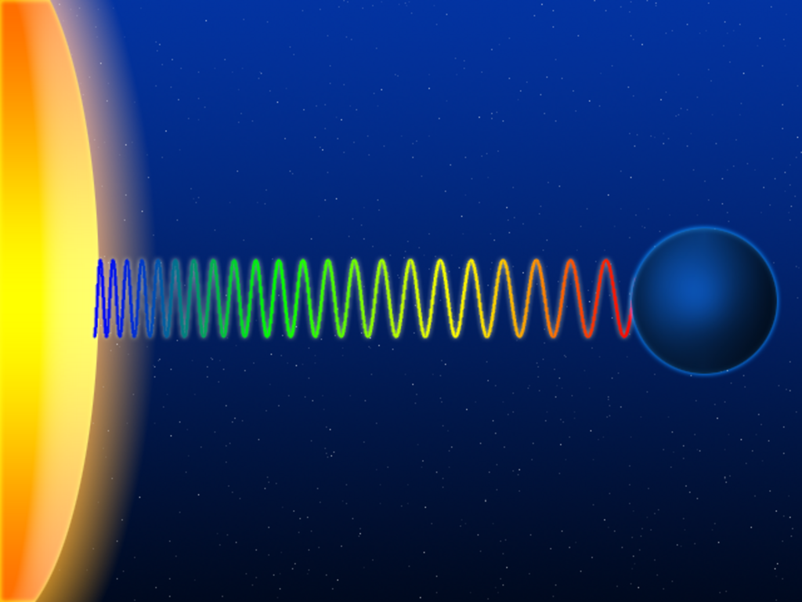Schematic representation of the gravitational redshift of a light wave escaping from the surface of a massive body

Assuming that the equivalence principle holds, gravity influences the passage of time. Light sent down into a [gravity well](https://en.wikipedia.org/wiki/Gravity_well "Gravity well") is [blueshifted](https://en.wikipedia.org/wiki/Blueshift "Blueshift"), whereas light sent in the opposite direction (i.e., climbing out of the gravity well) is [redshifted](https://en.wikipedia.org/wiki/Redshift "Redshift"); collectively, these two effects are known as the gravitational frequency shift. More generally, processes close to a massive body run more slowly when compared with processes taking place farther away; this effect is known as gravitational time dilation.

Gravitational redshift has been measured in the laboratory and using astronomical observations. Gravitational time dilation in the Earth's gravitational field has been measured numerous times using [atomic clocks](https://en.wikipedia.org/wiki/Atomic_clocks "Atomic clocks"), while ongoing validation is provided as a side effect of the operation of the [Global Positioning System](https://en.wikipedia.org/wiki/Global_Positioning_System "Global Positioning System") (GPS). Tests in stronger gravitational fields are provided by the observation of [binary pulsars](https://en.wikipedia.org/wiki/Binary_pulsar "Binary pulsar"). All results are in agreement with general relativity. However, at the existing level of accuracy, these observations cannot distinguish between general relativity and other theories in which the equivalence principle is valid.

In the vicinity of a non-rotating sphere, the time dilation due to gravity, derived from the Schwarzschild metric, is

$t_0 = t_f \sqrt{1 - \frac{2GM}{rc^2}}$

where

*   $t_0$ is the proper time between two events for an observer close to the massive sphere, i.e. deep within the gravitational field
*   $t_f$ is the coordinate time between the events for an observer at an arbitrarily large distance from the massive object (this assumes the far-away observer is using [Schwarzschild coordinates](https://en.wikipedia.org/wiki/Schwarzschild_coordinates "Schwarzschild coordinates"), a coordinate system where a clock at infinite distance from the massive sphere would tick at one second per second of coordinate time, while closer clocks would tick at less than that rate),
*   $G$ is the [gravitational constant](https://en.wikipedia.org/wiki/Gravitational_constant "Gravitational constant"),
*   $M$ is the [mass](https://en.wikipedia.org/wiki/Mass "Mass") of the object creating the gravitational field,
*   $r$ is the radial coordinate of the observer within the gravitational field (this coordinate is analogous to the classical distance from the center of the object, but is actually a Schwarzschild coordinate; the equation in this form has real solutions for $r > r_{\rm s}$),
*   $c$ is the [speed of light](https://en.wikipedia.org/wiki/Speed_of_light "Speed of light").

### Light deflection and gravitational time delay

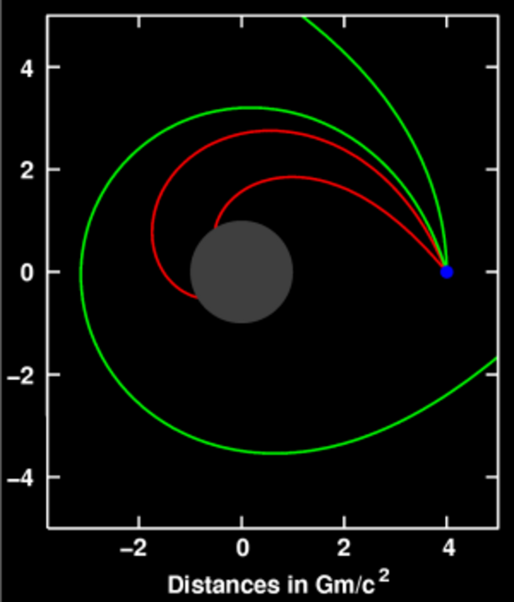Deflection of light (sent out from the location shown in blue) near a compact body (shown in gray)

General relativity predicts that the path of light will follow the curvature of spacetime as it passes near a massive object. This effect was initially confirmed by observing the light of stars or distant quasars being deflected as it passes the [Sun](https://en.wikipedia.org/wiki/Sun "Sun").

This and related predictions follow from the fact that light follows what is called a light-like or [null geodesic](https://en.wikipedia.org/wiki/Geodesic_\(general_relativity\) "Geodesic (general relativity)")—a generalization of the straight lines along which light travels in classical physics. Such geodesics are the generalization of the [invariance](https://en.wikipedia.org/wiki/Invariant_\(mathematics\) "Invariant (mathematics)") of lightspeed in special relativity. As one examines suitable model spacetimes (either the exterior Schwarzschild solution or, for more than a single mass, the post-Newtonian expansion), several effects of gravity on light propagation emerge. Although the bending of light can also be derived by extending the universality of free fall to light, the angle of deflection resulting from such calculations is only half the value given by general relativity.

Closely related to light deflection is the Shapiro time delay, the phenomenon that light signals take longer to move through a gravitational field than they would in the absence of that field. There have been numerous successful tests of this prediction. In the [parameterized post-Newtonian formalism](https://en.wikipedia.org/wiki/Parameterized_post-Newtonian_formalism "Parameterized post-Newtonian formalism") (PPN), measurements of both the deflection of light and the gravitational time delay determine a parameter called _γ_, which encodes the influence of gravity on the geometry of space.

### Gravitational waves

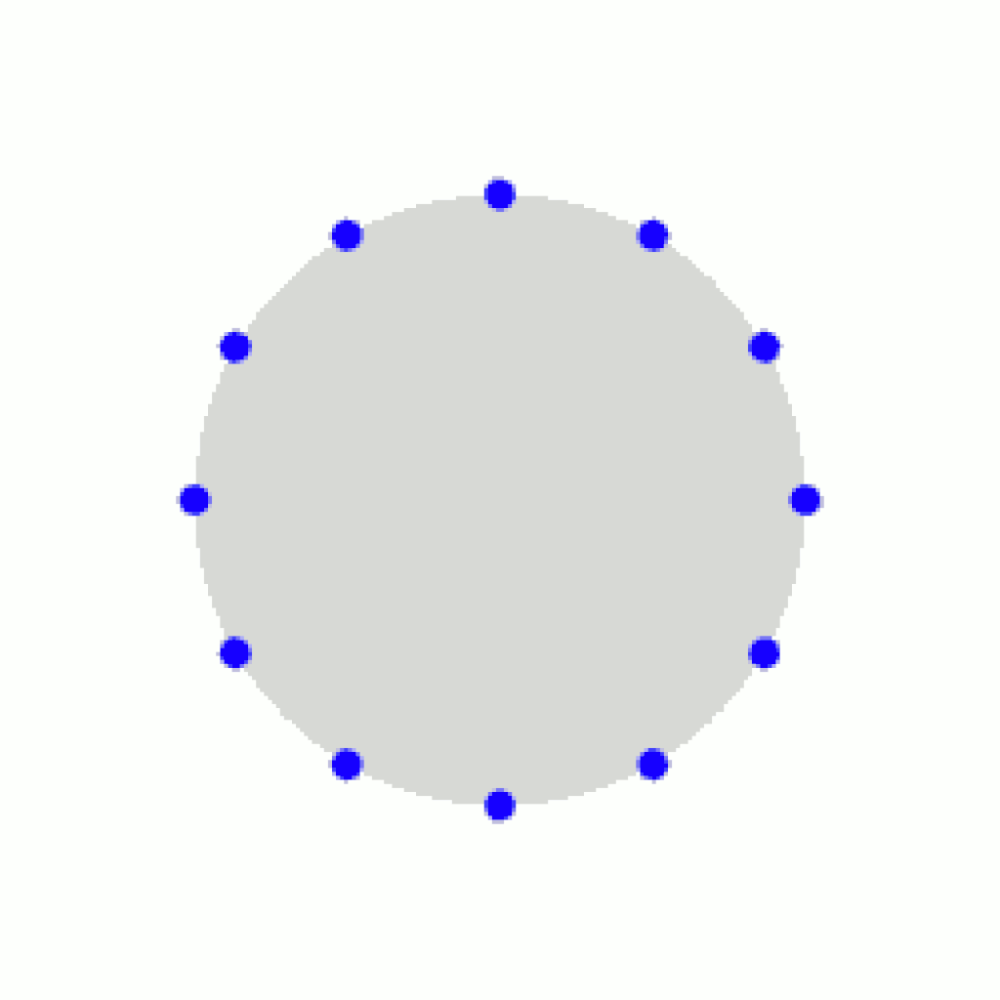Ring of test particles deformed by a passing (linearized, amplified for better visibility) gravitational wave

Predicted in 1916 by Albert Einstein, there are gravitational waves: ripples in the metric of spacetime that propagate at the speed of light. These are one of several analogies between weak-field gravity and electromagnetism in that, they are analogous to [electromagnetic waves](https://en.wikipedia.org/wiki/Electromagnetic_wave "Electromagnetic wave"). On 11 February 2016, the Advanced LIGO team announced that they had [directly detected gravitational waves](https://en.wikipedia.org/wiki/Gravitational_wave_observation "Gravitational wave observation") from a [pair](https://en.wikipedia.org/wiki/Binary_black_hole "Binary black hole") of black holes [merging](https://en.wikipedia.org/wiki/Stellar_collision "Stellar collision").

The simplest type of such a wave can be visualized by its action on a ring of freely floating particles. A sine wave propagating through such a ring towards the reader distorts the ring in a characteristic, rhythmic fashion (animated image to the right). Since Einstein's equations are [non-linear](https://en.wikipedia.org/wiki/Non-linear "Non-linear"), arbitrarily strong gravitational waves do not obey [linear superposition](https://en.wikipedia.org/wiki/Linear_superposition "Linear superposition"), making their description difficult. However, linear approximations of gravitational waves are sufficiently accurate to describe the exceedingly weak waves that are expected to arrive here on Earth from far-off cosmic events, which typically result in relative distances increasing and decreasing by 10−21 or less. Data analysis methods routinely make use of the fact that these linearized waves can be [Fourier decomposed](https://en.wikipedia.org/wiki/Fourier_decomposition "Fourier decomposition").

Some exact solutions describe gravitational waves without any approximation, e.g., a wave train traveling through empty space or [Gowdy universes](https://en.wikipedia.org/wiki/Gowdy_universe "Gowdy universe"), varieties of an expanding cosmos filled with gravitational waves. But for gravitational waves produced in astrophysically relevant situations, such as the merger of two black holes, numerical methods are the only way to construct appropriate models.

### Orbital effects and the relativity of direction

General relativity differs from classical mechanics in a number of predictions concerning orbiting bodies. It predicts an overall rotation ([precession](https://en.wikipedia.org/wiki/Precession "Precession")) of planetary orbits, as well as orbital decay caused by the emission of gravitational waves and effects related to the relativity of direction.

#### Precession of apsides

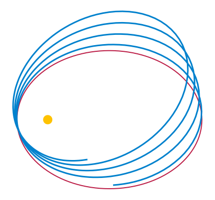Newtonian (red) vs. Einsteinian orbit (blue) of a lone planet orbiting a star. The influence of other planets is ignored.

In general relativity, the [apsides](https://en.wikipedia.org/wiki/Apsis "Apsis") of any orbit (the point of the orbiting body's closest approach to the system's [center of mass](https://en.wikipedia.org/wiki/Center_of_mass "Center of mass")) will [precess](https://en.wikipedia.org/wiki/Apsidal_precession "Apsidal precession"); the orbit is not an [ellipse](https://en.wikipedia.org/wiki/Ellipse "Ellipse"), but akin to an ellipse that rotates on its focus, resulting in a [rose curve](https://en.wikipedia.org/wiki/Rose_\(mathematics\) "Rose (mathematics)")-like shape (see image). Einstein first derived this result by using an approximate metric representing the Newtonian limit and treating the orbiting body as a [test particle](https://en.wikipedia.org/wiki/Test_particle "Test particle"). For him, the fact that his theory gave a straightforward explanation of Mercury's anomalous perihelion shift, discovered earlier by [Urbain Le Verrier](https://en.wikipedia.org/wiki/Urbain_Le_Verrier "Urbain Le Verrier") in 1859, was important evidence that he had at last identified the correct form of the gravitational field equations.

The effect can also be derived by using either the exact Schwarzschild metric (describing spacetime around a spherical mass) or the much more general [post-Newtonian formalism](https://en.wikipedia.org/wiki/Post-Newtonian_formalism "Post-Newtonian formalism"). It is due to the influence of gravity on the geometry of space and to the contribution of [self-energy](https://en.wikipedia.org/wiki/Self-energy "Self-energy") to a body's gravity (encoded in the [nonlinearity](https://en.wikipedia.org/wiki/Nonlinearity "Nonlinearity") of Einstein's equations). Relativistic precession has been observed for all planets that allow for accurate precession measurements (Mercury, Venus, and Earth), as well as in binary pulsar systems, where it is larger by five [orders of magnitude](https://en.wikipedia.org/wiki/Order_of_magnitude "Order of magnitude").

In general relativity the perihelion shift $\sigma$, expressed in radians per revolution, is approximately given by: $$
\sigma=\frac {24\pi^3L^2} {T^2c^2(1-e^2)} \ ,
$$ where:

*   $L$ is the [semi-major axis](https://en.wikipedia.org/wiki/Semi-major_axis "Semi-major axis")
*   $T$ is the [orbital period](https://en.wikipedia.org/wiki/Orbital_period "Orbital period")
*   $c$ is the speed of light in a vacuum
*   $e$ is the [orbital eccentricity](https://en.wikipedia.org/wiki/Orbital_eccentricity "Orbital eccentricity")

#### Orbital decay

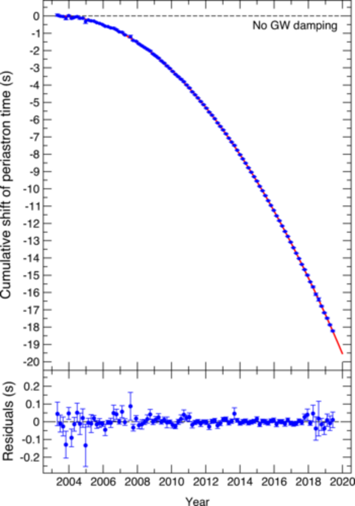Orbital decay for PSR J0737−3039: time shift, tracked over 16 years (2021).

According to general relativity, a [binary system](https://en.wikipedia.org/wiki/Binary_system_\(astronomy\) "Binary system (astronomy)") will emit gravitational waves, thereby losing energy. Due to this loss, the distance between the two orbiting bodies decreases, and so does their orbital period. Within the [Solar System](https://en.wikipedia.org/wiki/Solar_System "Solar System") or for ordinary [double stars](https://en.wikipedia.org/wiki/Double_star "Double star"), the effect is too small to be observable. This is not the case for a close binary pulsar, a system of two orbiting [neutron stars](https://en.wikipedia.org/wiki/Neutron_star "Neutron star"), one of which is a [pulsar](https://en.wikipedia.org/wiki/Pulsar "Pulsar"): from the pulsar, observers on Earth receive a regular series of radio pulses that can serve as a highly accurate clock, which allows precise measurements of the orbital period. Because neutron stars are immensely compact, significant amounts of energy are emitted in the form of gravitational radiation.

The first observation of a decrease in orbital period due to the emission of gravitational waves was made by [Hulse](https://en.wikipedia.org/wiki/Russell_Alan_Hulse "Russell Alan Hulse") and [Taylor](https://en.wikipedia.org/wiki/Joseph_Hooton_Taylor,_Jr. "Joseph Hooton Taylor, Jr."), using the binary pulsar [PSR1913+16](https://en.wikipedia.org/wiki/PSR1913+16 "PSR1913+16") they had discovered in 1974. This was the first detection of gravitational waves, albeit indirect, for which they were awarded the 1993 [Nobel Prize](https://en.wikipedia.org/wiki/Nobel_Prize "Nobel Prize") in physics. Since then, several other binary pulsars have been found, in particular the double pulsar [PSR J0737−3039](https://en.wikipedia.org/wiki/PSR_J0737−3039 "PSR J0737−3039"), where both stars are pulsars and which was last reported to also be in agreement with general relativity in 2021 after 16 years of observations.

#### Geodetic precession and frame-dragging

Several relativistic effects are directly related to the relativity of direction. One is [geodetic precession](https://en.wikipedia.org/wiki/Geodetic_effect "Geodetic effect"): the axis direction of a [gyroscope](https://en.wikipedia.org/wiki/Gyroscope "Gyroscope") in free fall in curved spacetime will change when compared, for instance, with the direction of light received from distant stars—even though such a gyroscope represents the way of keeping a direction as stable as possible ("[parallel transport](https://en.wikipedia.org/wiki/Parallel_transport "Parallel transport")"). For the Moon–Earth system, this effect has been measured with the help of [lunar laser ranging](https://en.wikipedia.org/wiki/Lunar_laser_ranging "Lunar laser ranging"). More recently, it has been measured for test masses aboard the satellite [Gravity Probe B](https://en.wikipedia.org/wiki/Gravity_Probe_B "Gravity Probe B") to a precision of better than 0.3%.

Near a rotating mass, there are gravitomagnetic or [frame-dragging](https://en.wikipedia.org/wiki/Frame-dragging "Frame-dragging") effects. A distant observer will determine that objects close to the mass get "dragged around". This is most extreme for [rotating black holes](https://en.wikipedia.org/wiki/Kerr_solution "Kerr solution") where, for any object entering a zone known as the [ergosphere](https://en.wikipedia.org/wiki/Ergosphere "Ergosphere"), rotation is inevitable. Such effects can again be tested through their influence on the orientation of gyroscopes in free fall. Somewhat controversial tests have been performed using the [LAGEOS](https://en.wikipedia.org/wiki/LAGEOS "LAGEOS") satellites, confirming the relativistic prediction. Also the [Mars Global Surveyor](https://en.wikipedia.org/wiki/Mars_Global_Surveyor "Mars Global Surveyor") probe around Mars has been used.

## Astrophysical applications

### Gravitational lensing

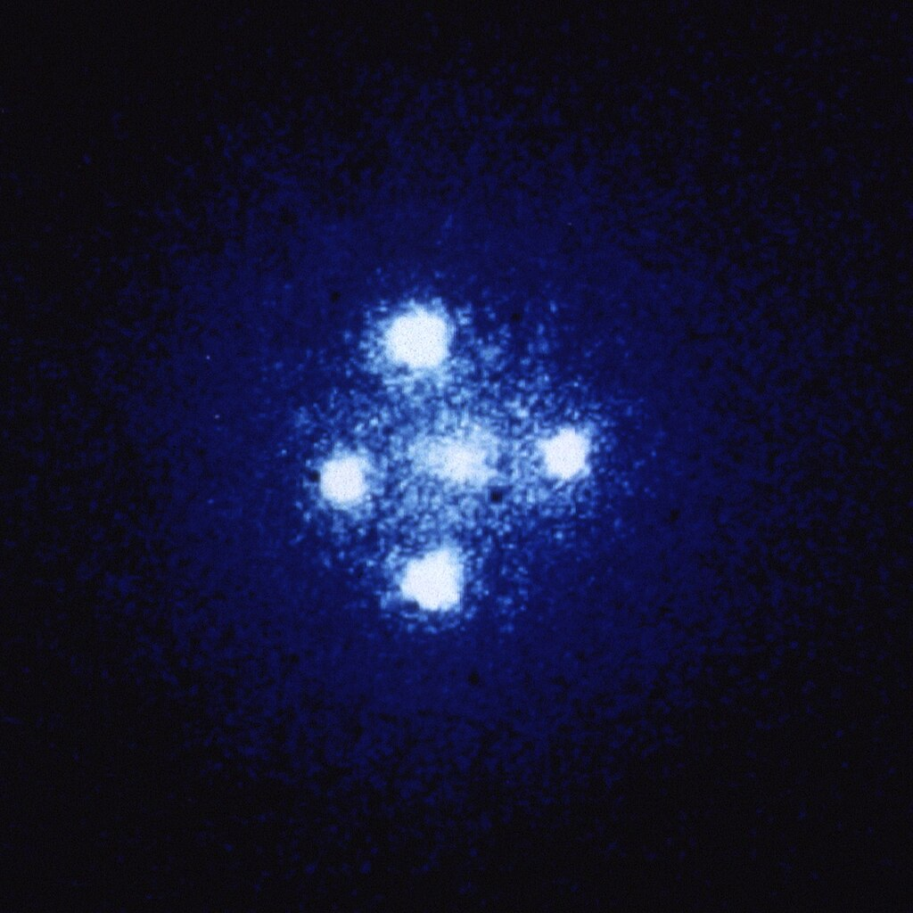[Einstein cross](https://en.wikipedia.org/wiki/Einstein_cross "Einstein cross"): four images of the same astronomical object, produced by a gravitational lens

The deflection of light by gravity is responsible for a new class of astronomical phenomena. If a massive object is situated between the astronomer and a distant target object with appropriate mass and relative distances, the astronomer will see multiple distorted images of the target. Such effects are known as gravitational lensing. Depending on the configuration, scale, and mass distribution, there can be two or more images, a bright ring known as an [Einstein ring](https://en.wikipedia.org/wiki/Einstein_ring "Einstein ring"), or partial rings called arcs. The [earliest example](https://en.wikipedia.org/wiki/Twin_Quasar "Twin Quasar") was discovered in 1979; since then, more than a hundred gravitational lenses have been observed. Even if the multiple images are too close to each other to be resolved, the effect can still be measured, e.g., as an overall brightening of the target object; a number of such "[microlensing](https://en.wikipedia.org/wiki/Microlensing "Microlensing") events" have been observed.

Gravitational lensing has developed into a tool of [observational astronomy](https://en.wikipedia.org/wiki/Observational_astronomy "Observational astronomy"). It is used to detect the presence and distribution of [dark matter](https://en.wikipedia.org/wiki/Dark_matter "Dark matter"), provide a "natural telescope" for observing distant galaxies, and to obtain an independent estimate of the [Hubble constant](https://en.wikipedia.org/wiki/Hubble_constant "Hubble constant"). Statistical evaluations of lensing data provide valuable insight into the structural evolution of [galaxies](https://en.wikipedia.org/wiki/Galaxy "Galaxy").

### Gravitational-wave astronomy

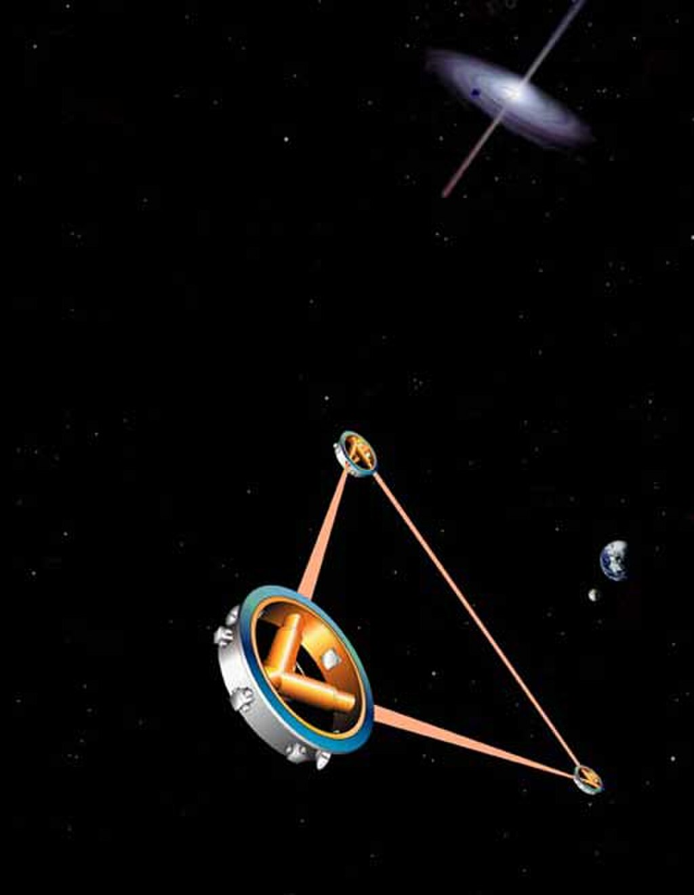Artist's impression of the space-borne gravitational wave detector [LISA](https://en.wikipedia.org/wiki/Laser_Interferometer_Space_Antenna "Laser Interferometer Space Antenna")

Observations of binary pulsars provide strong indirect evidence for the existence of gravitational waves (see [Orbital decay](/source/general-relativity/#Orbital_decay), above). Detection of these waves is a major goal of contemporary relativity-related research. Several land-based [gravitational wave detectors](https://en.wikipedia.org/wiki/Gravitational_wave_detector "Gravitational wave detector") are in operation, for example the [interferometric detectors](https://en.wikipedia.org/wiki/Interferometric_gravitational_wave_detector "Interferometric gravitational wave detector") [GEO 600](https://en.wikipedia.org/wiki/GEO_600 "GEO 600"), [LIGO](https://en.wikipedia.org/wiki/LIGO "LIGO") (two detectors), [TAMA 300](https://en.wikipedia.org/wiki/TAMA_300 "TAMA 300") and [VIRGO](https://en.wikipedia.org/wiki/Virgo_interferometer "Virgo interferometer"). Various [pulsar timing arrays](https://en.wikipedia.org/wiki/Pulsar_timing_array "Pulsar timing array") are using [millisecond pulsars](https://en.wikipedia.org/wiki/Millisecond_pulsar "Millisecond pulsar") to detect gravitational waves in the 10−9 to 10−6 [hertz](https://en.wikipedia.org/wiki/Hertz "Hertz") frequency range, which originate from binary supermassive black holes. A European space-based detector, [eLISA / NGO](https://en.wikipedia.org/wiki/Laser_Interferometer_Space_Antenna "Laser Interferometer Space Antenna"), is under development, with a precursor mission ([LISA Pathfinder](https://en.wikipedia.org/wiki/LISA_Pathfinder "LISA Pathfinder")) having launched in December 2015.

Observations of gravitational waves promise to complement observations in the [electromagnetic spectrum](https://en.wikipedia.org/wiki/Electromagnetic_spectrum "Electromagnetic spectrum"). They are expected to yield information about black holes and other dense objects such as neutron stars and white dwarfs, about certain kinds of [supernova](https://en.wikipedia.org/wiki/Supernova "Supernova") implosions, and about processes in the very early universe, including the signature of certain types of hypothetical [cosmic string](https://en.wikipedia.org/wiki/Cosmic_string "Cosmic string"). In February 2016, the Advanced LIGO team announced that they had detected gravitational waves from a black hole merger.

### Black holes and other compact objects

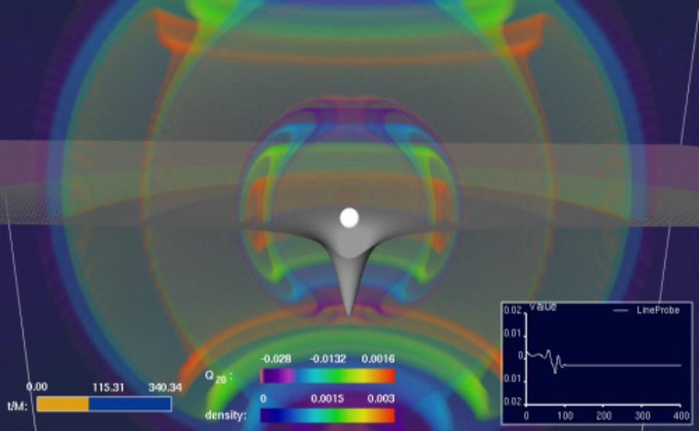Simulation based on the equations of general relativity: a star collapsing to form a black hole while emitting gravitational waves

Whenever the ratio of an object's mass to its radius becomes sufficiently large, general relativity predicts the formation of a black hole, a region of space from which nothing, not even light, can escape. In the accepted models of [stellar evolution](https://en.wikipedia.org/wiki/Stellar_evolution "Stellar evolution"), neutron stars of around 1.4 [solar masses](https://en.wikipedia.org/wiki/Solar_mass "Solar mass"), and stellar black holes with a few to a few dozen solar masses, are thought to be the final state for the evolution of massive stars. Usually a galaxy has one [supermassive black hole](https://en.wikipedia.org/wiki/Supermassive_black_hole "Supermassive black hole") with a few million to a few [billion](https://en.wikipedia.org/wiki/1000000000_\(number\) "1000000000 (number)") solar masses in its center, and its presence is thought to have played an important role in the formation of the galaxy and larger cosmic structures.

Astronomically, the most important property of compact objects is that they provide a supremely efficient mechanism for converting gravitational energy into electromagnetic radiation. [Accretion](https://en.wikipedia.org/wiki/Accretion_\(astrophysics\) "Accretion (astrophysics)"), the falling of dust or gaseous matter onto stellar or supermassive black holes, is thought to be responsible for some spectacularly luminous astronomical objects, especially diverse kinds of active galactic nuclei on galactic scales and stellar-size objects such as microquasars. In particular, accretion can lead to [relativistic jets](https://en.wikipedia.org/wiki/Relativistic_jet "Relativistic jet"), focused beams of highly energetic particles that are being flung into space at almost light speed. General relativity plays a central role in modelling all these phenomena, and observations provide strong evidence for the existence of black holes with the properties predicted by the theory.

Black holes are also sought-after targets in the search for gravitational waves (cf. section [§ Gravitational waves](/source/general-relativity/#Gravitational_waves), above). Merging [black hole binaries](https://en.wikipedia.org/wiki/Binary_black_hole "Binary black hole") should lead to some of the strongest gravitational wave signals reaching detectors on Earth, and the phase directly before the merger ("chirp") could be used as a "[standard candle](https://en.wikipedia.org/wiki/Standard_candle "Standard candle")" to deduce the distance to the merger events–and hence serve as a probe of cosmic expansion at large distances. The gravitational waves produced as a stellar black hole plunges into a supermassive one should provide direct information about the supermassive black hole's geometry.

### Cosmology

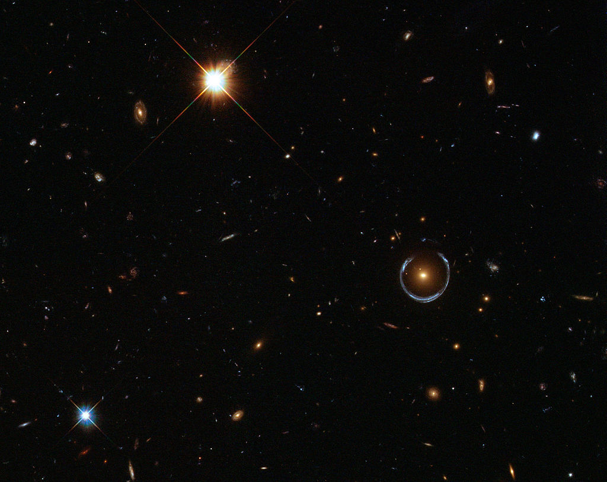This blue horseshoe is a distant galaxy that has been magnified and warped into a nearly complete ring by the strong gravitational pull of the massive foreground luminous red galaxy.

The existing models of cosmology are based on [Einstein's field equations](https://en.wikipedia.org/wiki/Einstein's_field_equations "Einstein's field equations"), which include the cosmological constant $\Lambda$ since it has important influence on the large-scale dynamics of the cosmos, $$
R_{\mu\nu} - {\textstyle 1 \over 2}R\,g_{\mu\nu} + \Lambda\ g_{\mu\nu} = \frac{8\pi G}{c^{4}}\, T_{\mu\nu}
$$ where _$g_{\mu\nu}$_ is the spacetime metric. [Isotropic](https://en.wikipedia.org/wiki/Isotropic "Isotropic") and homogeneous solutions of these enhanced equations, the [Friedmann–Lemaître–Robertson–Walker solutions](https://en.wikipedia.org/wiki/Friedmann–Lemaître–Robertson–Walker_metric "Friedmann–Lemaître–Robertson–Walker metric"), allow physicists to model a universe that has evolved over the past 14 [billion](https://en.wikipedia.org/wiki/1000000000_\(number\) "1000000000 (number)") years from a hot, early Big Bang phase. Once a small number of parameters (for example the universe's mean matter density) have been fixed by astronomical observation, further observational data can be used to put the models to the test. Predictions, all successful, include the initial abundance of chemical elements formed in a period of [primordial nucleosynthesis](https://en.wikipedia.org/wiki/Big_Bang_nucleosynthesis "Big Bang nucleosynthesis"), the large-scale structure of the universe, and the existence and properties of a "[thermal](https://en.wikipedia.org/wiki/Thermal_radiation "Thermal radiation") echo" from the early cosmos, the [cosmic background radiation](https://en.wikipedia.org/wiki/Cosmic_background_radiation "Cosmic background radiation").

Astronomical observations of the cosmological expansion rate allow the total amount of matter in the universe to be estimated, although the nature of that matter remains mysterious in part. About 90% of all matter appears to be dark matter, which has mass (or, equivalently, gravitational influence), but does not interact electromagnetically and, hence, cannot be observed directly. There is no generally accepted description of this new kind of matter, within the framework of known [particle physics](https://en.wikipedia.org/wiki/Particle_physics "Particle physics") or otherwise. Observational evidence from redshift surveys of distant supernovae and measurements of the cosmic background radiation also show that the evolution of the universe is significantly influenced by a cosmological constant resulting in an acceleration of cosmic expansion or, equivalently, by a form of energy with an unusual [equation of state](https://en.wikipedia.org/wiki/Equation_of_state "Equation of state"), known as [dark energy](https://en.wikipedia.org/wiki/Dark_energy "Dark energy"), the nature of which remains unclear.

An [inflationary phase](https://en.wikipedia.org/wiki/Cosmic_inflation "Cosmic inflation"), an additional phase of strongly accelerated expansion at cosmic times of around 10−33 seconds, was hypothesized in 1980 to account for several puzzling observations that were unexplained by classical cosmological models, such as the nearly perfect homogeneity of the cosmic background radiation. Recent measurements of the cosmic background radiation have resulted in the first evidence for this scenario. However, there are a bewildering variety of possible inflationary scenarios, which cannot be restricted by existing observations. An even larger question is the physics of the earliest universe, prior to the inflationary phase and close to where the classical models predict the big bang [singularity](https://en.wikipedia.org/wiki/Gravitational_singularity "Gravitational singularity"). An authoritative answer would require a complete theory of quantum gravity, which has not yet been developed (cf. the section on [quantum gravity](/source/general-relativity/#Quantum_gravity), below).

### Exotic solutions: time travel, warp drives

[Kurt Gödel](https://en.wikipedia.org/wiki/Kurt_Gödel "Kurt Gödel") showed that solutions to Einstein's equations exist that contain [closed timelike curves](https://en.wikipedia.org/wiki/Closed_timelike_curve "Closed timelike curve") (CTCs), which allow for loops in time. The solutions require extreme physical conditions unlikely ever to occur in practice, and it remains an open question whether further laws of physics will eliminate them completely. Since then, other—similarly impractical—GR solutions containing CTCs have been found, such as the [Tipler cylinder](https://en.wikipedia.org/wiki/Tipler_cylinder "Tipler cylinder") and [traversable wormholes](https://en.wikipedia.org/wiki/Wormhole#Traversable_wormholes "Wormhole"). [Stephen Hawking](https://en.wikipedia.org/wiki/Stephen_Hawking "Stephen Hawking") introduced [chronology protection conjecture](https://en.wikipedia.org/wiki/Chronology_protection_conjecture "Chronology protection conjecture"), which is an assumption beyond those of standard general relativity to prevent [time travel](https://en.wikipedia.org/wiki/Time_travel "Time travel").

Some [exact solutions in general relativity](https://en.wikipedia.org/wiki/Exact_solutions_in_general_relativity "Exact solutions in general relativity") such as [Alcubierre drive](https://en.wikipedia.org/wiki/Alcubierre_drive "Alcubierre drive") offer examples of [warp drive](https://en.wikipedia.org/wiki/Warp_drive "Warp drive") but these solutions require exotic matter distribution, and generally suffer from semiclassical instability.

## Advanced concepts

### Asymptotic symmetries

The spacetime symmetry group for [special relativity](https://en.wikipedia.org/wiki/Special_relativity "Special relativity") is the [Poincaré group](https://en.wikipedia.org/wiki/Poincaré_group "Poincaré group"), which is a ten-dimensional group of three Lorentz boosts, three rotations, and four spacetime translations. It is logical to ask what symmetries, if any, might apply in General Relativity. A tractable case might be to consider the symmetries of spacetime as seen by observers located far away from all sources of the gravitational field. The naive expectation for asymptotically flat spacetime symmetries might be simply to extend and reproduce the symmetries of flat spacetime of special relativity, _viz._, the Poincaré group.

In 1962 [Hermann Bondi](https://en.wikipedia.org/wiki/Hermann_Bondi "Hermann Bondi"), M. G. van der Burg, A. W. Metzner and [Rainer K. Sachs](https://en.wikipedia.org/wiki/Rainer_K._Sachs "Rainer K. Sachs") addressed this [asymptotic symmetry](https://en.wikipedia.org/wiki/Bondi–Metzner–Sachs_group "Bondi–Metzner–Sachs group") problem in order to investigate the flow of energy at infinity due to propagating [gravitational waves](https://en.wikipedia.org/wiki/Gravitational_wave "Gravitational wave"). Their first step was to decide on some physically sensible boundary conditions to place on the gravitational field at light-like infinity to characterize what it means to say a metric is asymptotically flat, making no _a priori_ assumptions about the nature of the asymptotic symmetry group—not even the assumption that such a group exists. Then after designing what they considered to be the most sensible boundary conditions, they investigated the nature of the resulting asymptotic symmetry transformations that leave invariant the form of the boundary conditions appropriate for asymptotically flat gravitational fields. What they found was that the asymptotic symmetry transformations actually do form a group and the structure of this group does not depend on the particular gravitational field that happens to be present. This means that, as expected, one can separate the kinematics of spacetime from the dynamics of the gravitational field at least at spatial infinity. The puzzling surprise in 1962 was their discovery of a rich infinite-dimensional group (the so-called BMS group) as the asymptotic symmetry group, instead of the finite-dimensional Poincaré group, which is a subgroup of the BMS group. Not only are the Lorentz transformations asymptotic symmetry transformations, there are also additional transformations that are not Lorentz transformations but are asymptotic symmetry transformations. In fact, they found an additional infinity of transformation generators known as _supertranslations_. This implies the conclusion that General Relativity (GR) does _not_ reduce to special relativity in the case of weak fields at long distances. It turns out that the BMS symmetry, suitably modified, could be seen as a restatement of the universal [soft graviton theorem](https://en.wikipedia.org/wiki/Soft_graviton_theorem "Soft graviton theorem") in [quantum field theory](https://en.wikipedia.org/wiki/Quantum_field_theory "Quantum field theory") (QFT), which relates universal infrared (soft) QFT with GR asymptotic spacetime symmetries.

### Causal structure and global geometry

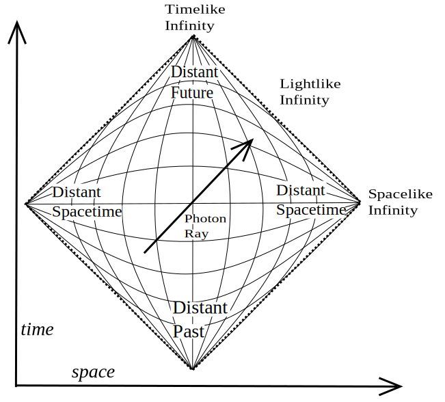Penrose–Carter diagram of an infinite [Minkowski universe](https://en.wikipedia.org/wiki/Minkowski_space "Minkowski space")

In general relativity, no material body can catch up with or overtake a light pulse. No influence from an event _A_ can reach any other location _X_ before light sent out at _A_ to _X_. In consequence, an exploration of all light worldlines ([null geodesics](https://en.wikipedia.org/wiki/Geodesics_in_general_relativity "Geodesics in general relativity")) yields key information about the spacetime's causal structure. This structure can be displayed using [Penrose–Carter diagrams](https://en.wikipedia.org/wiki/Penrose_diagram "Penrose diagram") in which infinitely large regions of space and infinite time intervals are shrunk ("[compactified](https://en.wikipedia.org/wiki/Compactification_\(mathematics\) "Compactification (mathematics)")") so as to fit onto a finite map, while light still travels along diagonals as in standard [spacetime diagrams](https://en.wikipedia.org/wiki/Spacetime_diagram "Spacetime diagram").

Aware of the importance of causal structure, [Roger Penrose](https://en.wikipedia.org/wiki/Roger_Penrose "Roger Penrose") and others developed what is known as [global geometry](https://en.wikipedia.org/wiki/Spacetime_topology "Spacetime topology"). In global geometry, the object of study is not one particular solution (or family of solutions) to Einstein's equations. Rather, relations that hold true for all geodesics, such as the [Raychaudhuri equation](https://en.wikipedia.org/wiki/Raychaudhuri_equation "Raychaudhuri equation"), and additional non-specific assumptions about the nature of matter (usually in the form of [energy conditions](https://en.wikipedia.org/wiki/Energy_conditions "Energy conditions")) are used to derive general results.

### Event horizons

Using global geometry, some spacetimes can be shown to contain boundaries called [horizons](https://en.wikipedia.org/wiki/Event_horizon "Event horizon"), which demarcate one region from the rest of spacetime. The best-known examples are black holes: if mass is compressed into a sufficiently compact region of space (as specified in the [hoop conjecture](https://en.wikipedia.org/wiki/Hoop_conjecture "Hoop conjecture"), the relevant length scale is the [Schwarzschild radius](https://en.wikipedia.org/wiki/Schwarzschild_radius "Schwarzschild radius"), given by the equation $r_\text{s} = \frac{2 G M}{c^2} ,$), no light from inside can escape to the outside. Since no object can overtake a light pulse, all interior matter is imprisoned as well. Passage from the exterior to the interior is still possible, showing that the boundary, the black hole's _horizon_, is not a physical barrier.

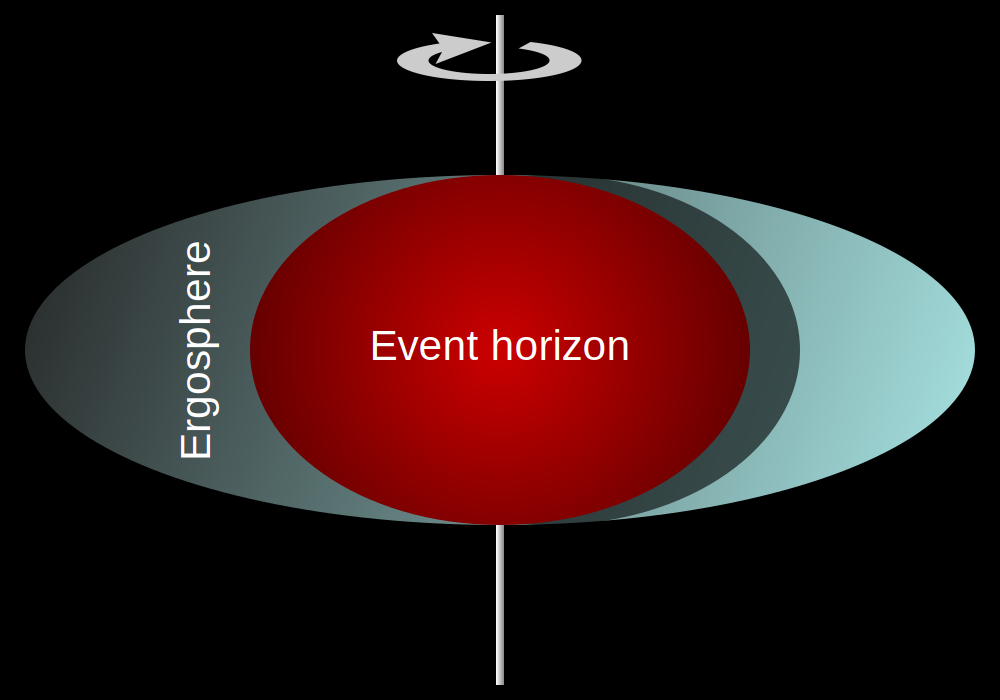The ergosphere of a rotating black hole, which plays a key role when it comes to extracting energy from such a black hole

Early studies of black holes relied on explicit solutions of Einstein's equations, notably the spherically symmetric Schwarzschild solution (used to describe a [static](https://en.wikipedia.org/wiki/Static_spacetime "Static spacetime") black hole) and the axisymmetric [Kerr solution](https://en.wikipedia.org/wiki/Kerr_solution "Kerr solution") (used to describe a rotating, [stationary](https://en.wikipedia.org/wiki/Stationary_spacetime "Stationary spacetime") black hole, and introducing interesting features such as the ergosphere). Using global geometry, later studies have revealed more general properties of black holes. With time they become rather simple objects characterized by eleven parameters specifying: electric charge, mass–energy, [linear momentum](https://en.wikipedia.org/wiki/Linear_momentum "Linear momentum"), [angular momentum](https://en.wikipedia.org/wiki/Angular_momentum "Angular momentum"), and location at a specified time. This is stated by the [black hole uniqueness theorem](https://en.wikipedia.org/wiki/No_hair_theorem "No hair theorem"): "black holes have no hair", that is, no distinguishing marks like the hairstyles of humans. Irrespective of the complexity of a gravitating object collapsing to form a black hole, the object that results (having emitted gravitational waves) is very simple.

Even more remarkably, there is a general set of laws known as [black hole mechanics](https://en.wikipedia.org/wiki/Black_hole_mechanics "Black hole mechanics"), which is analogous to the [laws of thermodynamics](https://en.wikipedia.org/wiki/Laws_of_thermodynamics "Laws of thermodynamics"). For instance, by the second law of black hole mechanics, the area of the event horizon of a general black hole will never decrease with time, analogous to the [entropy](https://en.wikipedia.org/wiki/Entropy "Entropy") of a thermodynamic system. This limits the energy that can be extracted by classical means from a rotating black hole (e.g. by the [Penrose process](https://en.wikipedia.org/wiki/Penrose_process "Penrose process")). There is strong evidence that the laws of black hole mechanics are, in fact, a subset of the laws of thermodynamics, and that the black hole area is proportional to its entropy. This leads to a modification of the original laws of black hole mechanics: for instance, as the second law of black hole mechanics becomes part of the second law of thermodynamics, it is possible for the black hole area to decrease as long as other processes ensure that entropy increases overall. As thermodynamical objects with nonzero temperature, black holes should emit [thermal radiation](https://en.wikipedia.org/wiki/Thermal_radiation "Thermal radiation"). Semiclassical calculations indicate that indeed they do, with the surface gravity playing the role of temperature in [Planck's law](https://en.wikipedia.org/wiki/Planck's_law "Planck's law"). This radiation is known as [Hawking radiation](https://en.wikipedia.org/wiki/Hawking_radiation "Hawking radiation") (cf. the [quantum theory section](/source/general-relativity/#Quantum_field_theory_in_curved_spacetime), below).

There are many other types of horizons. In an expanding universe, an observer may find that some regions of the past cannot be observed ("[particle horizon](https://en.wikipedia.org/wiki/Particle_horizon "Particle horizon")"), and some regions of the future cannot be influenced (event horizon). Even in flat Minkowski space, when described by an accelerated observer ([Rindler space](https://en.wikipedia.org/wiki/Rindler_space "Rindler space")), there will be horizons associated with a semiclassical radiation known as [Unruh radiation](https://en.wikipedia.org/wiki/Unruh_effect "Unruh effect").

### Singularities

Another general feature of general relativity is the appearance of spacetime boundaries known as singularities. Spacetime can be explored by following up on timelike and lightlike geodesics—all possible ways that light and particles in free fall can travel. But some solutions of Einstein's equations have "ragged edges"—regions known as [spacetime singularities](https://en.wikipedia.org/wiki/Spacetime_singularity "Spacetime singularity"), where the paths of light and falling particles come to an abrupt end, and geometry becomes ill-defined. In the more interesting cases, these are "curvature singularities", where geometrical quantities characterizing spacetime curvature, such as the [Ricci scalar](https://en.wikipedia.org/wiki/Ricci_scalar "Ricci scalar"), take on infinite values. Well-known examples of spacetimes with future singularities—where worldlines end—are the Schwarzschild solution, which describes a singularity inside an eternal static black hole, or the Kerr solution with its ring-shaped singularity inside an eternal rotating black hole. The Friedmann–Lemaître–Robertson–Walker solutions and other spacetimes describing universes have past singularities on which worldlines begin, namely Big Bang singularities, and some have future singularities ([Big Crunch](https://en.wikipedia.org/wiki/Big_Crunch "Big Crunch")) as well.

Given that these examples are all highly symmetric—and thus simplified—it is tempting to conclude that the occurrence of singularities is an artifact of idealization. The famous [singularity theorems](https://en.wikipedia.org/wiki/Singularity_theorems "Singularity theorems"), proved using the methods of global geometry, say otherwise: singularities are a generic feature of general relativity, and unavoidable once the collapse of an object with realistic matter properties has proceeded beyond a certain stage and also at the beginning of a wide class of expanding universes. However, the theorems say little about the properties of singularities, and much of current research is devoted to characterizing these entities' generic structure (hypothesized e.g. by the [BKL conjecture](https://en.wikipedia.org/wiki/BKL_singularity "BKL singularity")). The [cosmic censorship hypothesis](https://en.wikipedia.org/wiki/Cosmic_censorship_hypothesis "Cosmic censorship hypothesis") states that all realistic future singularities (no perfect symmetries, matter with realistic properties) are safely hidden away behind a horizon, and thus invisible to all distant observers. While no formal proof yet exists, numerical simulations offer supporting evidence of its validity.

### Evolution equations

Each solution of Einstein's equation encompasses the whole history of a universe—it is not just some snapshot of how things are, but a whole, possibly matter-filled, spacetime. It describes the state of matter and geometry everywhere and at every moment in that particular universe. Due to its general covariance, Einstein's theory is not sufficient by itself to determine the [time evolution](https://en.wikipedia.org/wiki/Time_evolution "Time evolution") of the metric tensor. It must be combined with a [coordinate condition](https://en.wikipedia.org/wiki/Coordinate_condition "Coordinate condition"), which is analogous to [gauge fixing](https://en.wikipedia.org/wiki/Gauge_fixing "Gauge fixing") in other field theories.

To understand Einstein's equations as partial differential equations, it is helpful to formulate them in a way that describes the evolution of the universe over time. This is done in "3+1" formulations, where spacetime is split into three space dimensions and one time dimension. The best-known example is the [ADM formalism](https://en.wikipedia.org/wiki/ADM_formalism "ADM formalism"). These decompositions show that the spacetime evolution equations of general relativity are well-behaved: solutions always [exist](https://en.wikipedia.org/wiki/Existence_theorem "Existence theorem"), and are uniquely defined, once suitable initial conditions have been specified. Such formulations of Einstein's field equations are the basis of numerical relativity.

### Global and quasi-local quantities

The notion of evolution equations is intimately tied in with another aspect of general relativistic physics. In Einstein's theory, it turns out to be impossible to find a general definition for a seemingly simple property such as a system's total mass (or energy). The main reason is that the gravitational field—like any physical field—must be ascribed a certain energy, but that it proves to be fundamentally impossible to localize that energy.

Nevertheless, there are possibilities to define a system's total mass, either using a hypothetical "infinitely distant observer" ([ADM mass](https://en.wikipedia.org/wiki/ADM_mass "ADM mass")) or suitable symmetries ([Komar mass](https://en.wikipedia.org/wiki/Komar_mass "Komar mass")). If one excludes from the system's total mass the energy being carried away to infinity by gravitational waves, the result is the [Bondi mass](https://en.wikipedia.org/wiki/Mass_in_general_relativity#ADM_and_Bondi_masses_in_asymptotically_flat_space-times "Mass in general relativity") at null infinity. Just as in [classical physics](https://en.wikipedia.org/wiki/Physics_in_the_Classical_Limit "Physics in the Classical Limit"), it can be shown that these masses are positive. Corresponding global definitions exist for momentum and angular momentum. There have also been a number of attempts to define _quasi-local_ quantities, such as the mass of an isolated system formulated using only quantities defined within a finite region of space containing that system. The hope is to obtain a quantity useful for general statements about [isolated systems](https://en.wikipedia.org/wiki/Isolated_system "Isolated system"), such as a more precise formulation of the hoop conjecture.

## Relationship with quantum theory

If general relativity were considered to be one of the two pillars of modern physics, then quantum theory, the basis of understanding matter from elementary particles to [solid-state physics](https://en.wikipedia.org/wiki/Solid-state_physics "Solid-state physics"), would be the other. However, how to reconcile quantum theory with general relativity is still an open question.

### Quantum field theory in curved spacetime

Ordinary [quantum field theories](https://en.wikipedia.org/wiki/Quantum_field_theory "Quantum field theory"), which form the basis of modern elementary particle physics, are defined in flat Minkowski space, which is an excellent approximation when it comes to describing the behavior of microscopic particles in weak gravitational fields like those found on Earth. In order to describe situations in which gravity is strong enough to influence (quantum) matter, yet not strong enough to require quantization itself, physicists have formulated quantum field theories in curved spacetime. These theories rely on general relativity to describe a curved background spacetime, and define a generalized quantum field theory to describe the behavior of quantum matter within that spacetime. Using this formalism, it can be shown that black holes emit a blackbody spectrum of particles known as [Hawking radiation](https://en.wikipedia.org/wiki/Hawking_radiation "Hawking radiation") leading to the possibility that they [evaporate](https://en.wikipedia.org/wiki/Black_hole_evaporation "Black hole evaporation") over time. As briefly mentioned [above](/source/general-relativity/#Horizons), this radiation plays an important role for the thermodynamics of black holes.

### Quantum gravity

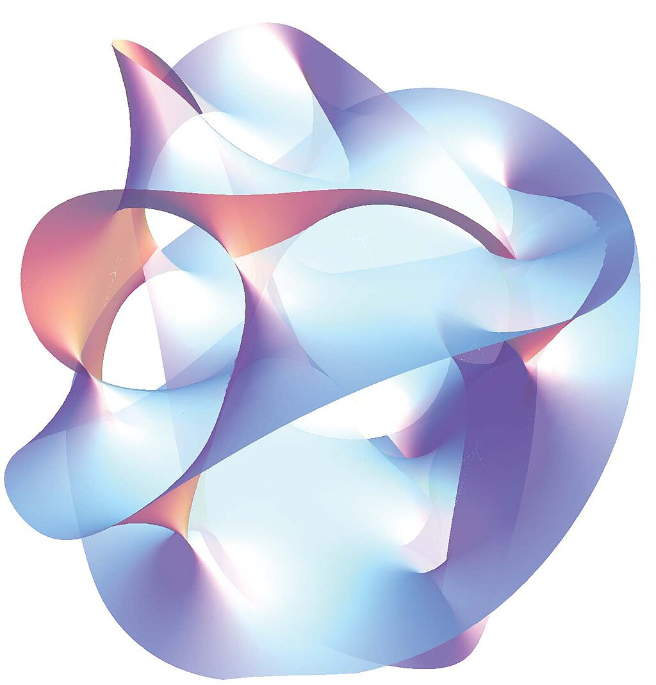Projection of a [Calabi–Yau manifold](https://en.wikipedia.org/wiki/Calabi–Yau_manifold "Calabi–Yau manifold"), one of the ways of [compactifying](https://en.wikipedia.org/wiki/Compactification_\(physics\) "Compactification (physics)") the extra dimensions posited by string theory

The demand for consistency between a quantum description of matter and a geometric description of spacetime, as well as the appearance of singularities (where curvature length scales become microscopic), indicate the need for a full theory of quantum gravity: for an adequate description of the interior of black holes, and of the very early universe, a theory is required in which gravity and the associated geometry of spacetime are described in the language of quantum physics. Despite major efforts, no complete and consistent theory of quantum gravity is currently known, even though a number of candidates exist.

Attempts to generalize ordinary quantum field theories, used in elementary particle physics to describe fundamental interactions, so as to include gravity have led to serious problems. Some have argued that at low energies, this approach proves successful, in that it results in an acceptable [effective (quantum) field theory](https://en.wikipedia.org/wiki/Effective_field_theory "Effective field theory") of gravity. At very high energies, however, the perturbative results are badly divergent and lead to models devoid of predictive power ("perturbative [non-renormalizability](https://en.wikipedia.org/wiki/Non-renormalizable "Non-renormalizable")").

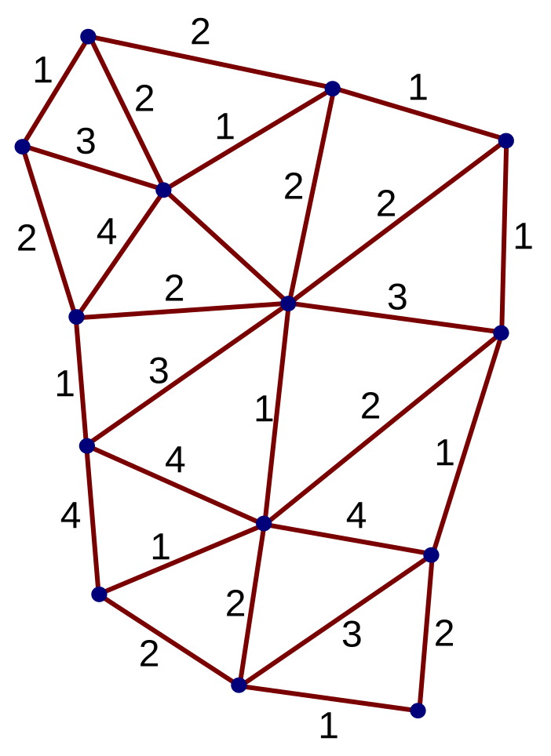Simple [spin network](https://en.wikipedia.org/wiki/Spin_network "Spin network") of the type used in loop quantum gravity

One attempt to overcome these limitations is [string theory](/source/string-theory/ "String theory"), a quantum theory not of [point particles](https://en.wikipedia.org/wiki/Point_particle "Point particle"), but of minute one-dimensional extended objects. The theory promises to be a [unified description](https://en.wikipedia.org/wiki/Theory_of_everything "Theory of everything") of all particles and interactions, including gravity; the price to pay is unusual features such as six [extra dimensions](https://en.wikipedia.org/wiki/Superstring_theory#Extra_dimensions "Superstring theory") of space in addition to the usual three. In what is called the [second superstring revolution](https://en.wikipedia.org/wiki/Second_superstring_revolution "Second superstring revolution"), it was conjectured that both string theory and a unification of general relativity and [supersymmetry](/source/supersymmetry/ "Supersymmetry") known as [supergravity](https://en.wikipedia.org/wiki/Supergravity "Supergravity") form part of a hypothesized eleven-dimensional model known as [M-theory](/source/m-theory/ "M-theory"), which would constitute a uniquely defined and consistent theory of quantum gravity.

Another approach starts with the [canonical quantization](https://en.wikipedia.org/wiki/Canonical_quantization "Canonical quantization") procedures of quantum theory. Using the initial-value-formulation of general relativity (cf. [evolution equations](/source/general-relativity/#Evolution_equations) above), the result is the [Wheeler–deWitt equation](https://en.wikipedia.org/wiki/Wheeler–deWitt_equation "Wheeler–deWitt equation") (an analogue of the [Schrödinger equation](https://en.wikipedia.org/wiki/Schrödinger_equation "Schrödinger equation")) which turns out to be ill-defined without a proper ultraviolet (lattice) cutoff. However, with the introduction of what are now known as [Ashtekar variables](https://en.wikipedia.org/wiki/Ashtekar_variables "Ashtekar variables"), this leads to a model known as [loop quantum gravity](https://en.wikipedia.org/wiki/Loop_quantum_gravity "Loop quantum gravity"). Space is represented by a web-like structure called a [spin network](https://en.wikipedia.org/wiki/Spin_network "Spin network"), evolving over time in discrete steps.

Depending on which features of general relativity and quantum theory are accepted unchanged, and on what level changes are introduced, there are numerous other attempts to arrive at a viable theory of quantum gravity, some examples being the lattice theory of gravity based on the Feynman [Path Integral](https://en.wikipedia.org/wiki/Path_integral_formulation "Path integral formulation") approach and [Regge calculus](https://en.wikipedia.org/wiki/Regge_calculus "Regge calculus"), [dynamical triangulations](https://en.wikipedia.org/wiki/Causal_dynamical_triangulation "Causal dynamical triangulation"), [causal sets](https://en.wikipedia.org/wiki/Causal_sets "Causal sets"), twistor models or the path integral based models of [quantum cosmology](https://en.wikipedia.org/wiki/Quantum_cosmology "Quantum cosmology").

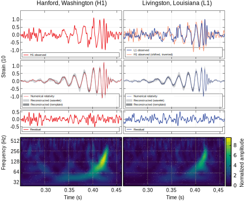Observation of gravitational waves from binary black hole merger GW150914

All candidate theories still have major formal and conceptual problems to overcome. They also face the common problem that, as yet, there is no way to put quantum gravity predictions to experimental tests (and thus to decide between the candidates where their predictions vary), although there is hope for this to change as future data from cosmological observations and particle physics experiments becomes available.

## Current status

General relativity has emerged as a highly successful model of gravitation and cosmology, which has so far unambiguously fitted observational and experimental data. However, there are strong theoretical reasons to consider the theory to be incomplete. The problem of quantum gravity and the question of the reality of spacetime singularities remain open. Observational data that is taken as evidence for dark energy and dark matter could also indicate the need to consider [alternatives or modifications of general relativity](https://en.wikipedia.org/wiki/Alternatives_to_general_relativity "Alternatives to general relativity").

Even taken as is, general relativity provides many possibilities for further exploration. Mathematical relativists seek to understand the nature of singularities and the fundamental properties of Einstein's equations, while numerical relativists run increasingly powerful computer simulations, such as those describing merging black holes. In February 2016, it was announced that gravitational waves were directly detected by the Advanced LIGO team on 14 September 2015. A century after its introduction, general relativity remains a highly active area of research.
