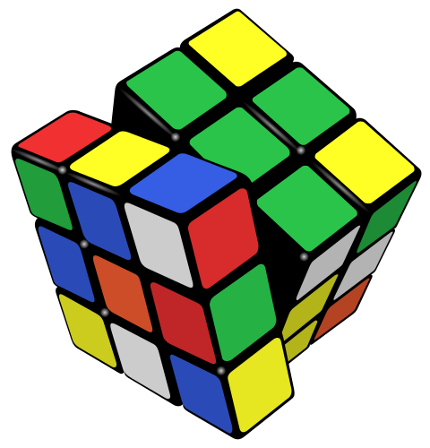The manipulations of the [Rubik's Cube](https://en.wikipedia.org/wiki/Rubik's_Cube "Rubik's Cube") form the [Rubik's Cube group](https://en.wikipedia.org/wiki/Rubik's_Cube_group "Rubik's Cube group").

In [mathematics](https://en.wikipedia.org/wiki/Mathematics "Mathematics"), a **group** is a [set](https://en.wikipedia.org/wiki/Set_\(mathematics\) "Set (mathematics)") with an [operation](https://en.wikipedia.org/wiki/Binary_operation "Binary operation") that combines any two elements of the set to produce a third element within the same set and the following conditions must hold: the operation is [associative](https://en.wikipedia.org/wiki/Associative_property "Associative property"), it has an [identity element](https://en.wikipedia.org/wiki/Identity_element "Identity element"), and every element of the set has an [inverse element](https://en.wikipedia.org/wiki/Inverse_element "Inverse element"). For example, the [integers](https://en.wikipedia.org/wiki/Integer "Integer") with the [addition operation](https://en.wikipedia.org/wiki/Addition "Addition") form a group.

The concept of a group was elaborated for handling, in a unified way, many mathematical structures such as numbers, [geometric shapes](https://en.wikipedia.org/wiki/Geometric_shape "Geometric shape") and [polynomial roots](https://en.wikipedia.org/wiki/Polynomial_root "Polynomial root"). Because the concept of groups is ubiquitous in numerous areas both within and outside mathematics, some authors consider it as a central organizing principle of contemporary mathematics.

In [geometry](https://en.wikipedia.org/wiki/Geometry "Geometry"), groups arise naturally in the study of [symmetries](https://en.wikipedia.org/wiki/Symmetries "Symmetries") and [geometric transformations](https://en.wikipedia.org/wiki/Geometric_transformation "Geometric transformation"): the symmetries of an object form a group, called the [symmetry group](https://en.wikipedia.org/wiki/Symmetry_group "Symmetry group") of the object, and the transformations of a given type form a general group. [Lie groups](https://en.wikipedia.org/wiki/Lie_group "Lie group") appear in symmetry groups in geometry, and also in the [Standard Model](https://en.wikipedia.org/wiki/Standard_Model "Standard Model") of [particle physics](https://en.wikipedia.org/wiki/Particle_physics "Particle physics"). The [Poincaré group](https://en.wikipedia.org/wiki/Poincaré_group "Poincaré group") is a Lie group consisting of the symmetries of [spacetime](https://en.wikipedia.org/wiki/Spacetime "Spacetime") in [special relativity](https://en.wikipedia.org/wiki/Special_relativity "Special relativity"). [Point groups](https://en.wikipedia.org/wiki/Point_group "Point group") describe [symmetry in molecular chemistry](https://en.wikipedia.org/wiki/Molecular_symmetry "Molecular symmetry").

The concept of a group arose in the study of [polynomial equations](https://en.wikipedia.org/wiki/Polynomial_equation "Polynomial equation"). [Évariste Galois](https://en.wikipedia.org/wiki/Évariste_Galois "Évariste Galois"), in the 1830s, introduced the term _group_ (French: _groupe_) for the symmetry group of the [roots](https://en.wikipedia.org/wiki/Zero_of_a_function "Zero of a function") of an equation, now called a [Galois group](https://en.wikipedia.org/wiki/Galois_group "Galois group"). After contributions from other fields such as [number theory](https://en.wikipedia.org/wiki/Number_theory "Number theory") and geometry, the group notion was generalized and firmly established around 1870. Modern [group theory](/source/group-theory/ "Group theory")—an active mathematical discipline—studies groups in their own right. To explore groups, mathematicians have devised various notions to break groups into smaller, better-understandable pieces, such as [subgroups](https://en.wikipedia.org/wiki/Subgroup "Subgroup"), [quotient groups](https://en.wikipedia.org/wiki/Quotient_group "Quotient group") and [simple groups](https://en.wikipedia.org/wiki/Simple_group "Simple group"). In addition to their [abstract properties](https://en.wikipedia.org/wiki/Abstraction_\(mathematics\) "Abstraction (mathematics)"), group theorists also study the different ways in which a group can be expressed concretely, both from a point of view of [representation theory](https://en.wikipedia.org/wiki/Representation_theory "Representation theory") (that is, through the [representations of the group](https://en.wikipedia.org/wiki/Group_representation "Group representation")) and of [computational group theory](https://en.wikipedia.org/wiki/Computational_group_theory "Computational group theory"). A theory has been developed for [finite groups](https://en.wikipedia.org/wiki/Finite_group "Finite group"), which culminated with the [classification of finite simple groups](https://en.wikipedia.org/wiki/Classification_of_finite_simple_groups "Classification of finite simple groups"), completed in 2004. Since the mid-1980s, [geometric group theory](https://en.wikipedia.org/wiki/Geometric_group_theory "Geometric group theory"), which studies [finitely generated groups](https://en.wikipedia.org/wiki/Finitely_generated_group "Finitely generated group") as geometric objects, has become an active area in group theory.

## Definition and illustration

### First example: the integers

One of the more familiar groups is the set of [integers](https://en.wikipedia.org/wiki/Integer "Integer") $$
\Z = \{\ldots,-4,-3,-2,-1,0,1,2,3,4,\ldots\}
$$ together with [addition](https://en.wikipedia.org/wiki/Addition "Addition"). For any two integers $a$ and ⁠$b$⁠, the [sum](https://en.wikipedia.org/wiki/Summation "Summation") $a+b$ is also an integer; this _[closure](https://en.wikipedia.org/wiki/Closure_\(mathematics\) "Closure (mathematics)")_ property says that $+$ is a [binary operation](https://en.wikipedia.org/wiki/Binary_operation "Binary operation") on ⁠$\Z$⁠. The following properties of integer addition serve as a model for the group [axioms](https://en.wikipedia.org/wiki/Axiom "Axiom") in the definition below.

*   For all integers ⁠$a$⁠, $b$ and ⁠$c$⁠, one has ⁠$(a+b)+c=a+(b+c)$⁠. Expressed in words, adding $a$ to $b$ first, and then adding the result to $c$ gives the same final result as adding $a$ to the sum of $b$ and ⁠$c$⁠. This property is known as _[associativity](https://en.wikipedia.org/wiki/Associativity "Associativity")_.
*   If $a$ is any integer, then $0+a=a$ and ⁠$a+0=a$⁠. [Zero](https://en.wikipedia.org/wiki/Zero "Zero") is called the _[identity element](https://en.wikipedia.org/wiki/Identity_element "Identity element")_ of addition because adding it to any integer returns the same integer.
*   For every integer ⁠$a$⁠, there is an integer $b$ such that $a+b=0$ and ⁠$b+a=0$⁠. The integer $b$ is called the _[inverse element](https://en.wikipedia.org/wiki/Inverse_element "Inverse element")_ of the integer $a$ and is denoted ⁠$-a$⁠.

The integers, together with the operation ⁠$+$⁠, form a mathematical object belonging to a broad class sharing similar structural aspects. To appropriately understand these structures as a collective, the following definition is developed.

### Definition

A group is a [set](https://en.wikipedia.org/wiki/Set_\(mathematics\) "Set (mathematics)") $G$ together with a [binary operation](https://en.wikipedia.org/wiki/Binary_operation "Binary operation") on ⁠$G$⁠, here denoted "⁠$\cdot$⁠", that combines any two [elements](https://en.wikipedia.org/wiki/Element_\(mathematics\) "Element (mathematics)") $a$ and $b$ of $G$ to form an element of ⁠$G$⁠, denoted ⁠$a\cdot b$⁠, such that the following three requirements, known as **group axioms**, are satisfied:

\*\*Associativity\*\* : For all ⁠$a$⁠, ⁠$b$⁠, ⁠$c$⁠ in ⁠$G$⁠, one has ⁠$(a\cdot b)\cdot c=a\cdot(b\cdot c)$⁠. \*\*Identity element\*\* : There exists an element $e$ in $G$ such that, for every $a$ in ⁠$G$⁠, one has ⁠$e\cdot a=a$⁠ and ⁠$a\cdot e=a$⁠. : Such an element $e$ is unique. It is called the identity element (or sometimes neutral element) of the group. \*\*Inverse element\*\* : For each $a$ in ⁠$G$⁠, there exists an element $b$ in $G$ such that $a\cdot b=e$ and ⁠$b\cdot a=e$⁠, where $e$ is the identity element. : For each ⁠$a$⁠, the element $b$ is unique; it is called the inverse of $a$ and is commonly denoted ⁠$a^{-1}$⁠.

Note: [Uniqueness of the identity](/source/group-mathematics/#Uniqueness_of_identity_element) and [uniqueness of inverse elements](/source/group-mathematics/#Uniqueness_of_inverses) are not part of the axioms; they are _consequences_ of the three axioms.

### Notation and terminology

Formally, a group is an [ordered pair](https://en.wikipedia.org/wiki/Ordered_pair "Ordered pair") of a set and a binary operation on this set that satisfies the [group axioms](https://en.wikipedia.org/wiki/Group_axioms "Group axioms"). The set is called the _underlying set_ of the group, and the operation is called the _group operation_ or the _group law_.

A group and its underlying set are thus two different [mathematical objects](https://en.wikipedia.org/wiki/Mathematical_object "Mathematical object"). To avoid cumbersome notation, it is common to [abuse notation](https://en.wikipedia.org/wiki/Abuse_of_notation "Abuse of notation") by using the same symbol to denote both. This reflects also an informal way of thinking: that the group is the same as the set except that it has been enriched by additional structure provided by the operation.

For example, consider the set of [real numbers](https://en.wikipedia.org/wiki/Real_number "Real number") ⁠$\R$⁠, which has the operations of addition $a+b$ and [multiplication](https://en.wikipedia.org/wiki/Multiplication "Multiplication") ⁠$ab$⁠. Formally, $\R$ is a set, $(\R,+)$ is a group, and $(\R,+,\cdot)$ is a [field](https://en.wikipedia.org/wiki/Field_\(mathematics\) "Field (mathematics)"). But it is common to write $\R$ to denote any of these three objects.

The _additive group_ of the field $\R$ is the group whose underlying set is $\R$ and whose operation is addition. The _multiplicative group_ of the field $\R$ is the group $\R^{\times}$ whose underlying set is the set of nonzero real numbers $\R \smallsetminus \{0\}$ and whose operation is multiplication.

More generally, one speaks of an _additive group_ whenever the group operation is notated as addition; in this case, the identity is typically denoted ⁠$0$⁠, and the inverse of an element $x$ is denoted ⁠$-x$⁠. Similarly, one speaks of a _multiplicative group_ whenever the group operation is notated as multiplication; in this case, the identity is typically denoted ⁠$1$⁠, and the inverse of an element $x$ is denoted ⁠$x^{-1}$⁠. In a multiplicative group, the operation symbol is usually omitted entirely, so that the operation is denoted by juxtaposition, $ab$ instead of ⁠$a\cdot b$⁠.

The definition of a group does not require that $a\cdot b=b\cdot a$ for all elements $a$ and $b$ in ⁠$G$⁠. If this additional condition holds, then the operation is said to be [commutative](https://en.wikipedia.org/wiki/Commutative "Commutative"), and the group is called an [abelian group](https://en.wikipedia.org/wiki/Abelian_group "Abelian group"). It is a common convention that for an abelian group either additive or multiplicative notation may be used, but for a nonabelian group only multiplicative notation is used.

Several other notations are commonly used for groups whose elements are not numbers. For a group whose elements are [functions](https://en.wikipedia.org/wiki/Function_\(mathematics\) "Function (mathematics)"), the operation is often [function composition](https://en.wikipedia.org/wiki/Function_composition "Function composition") ⁠$f\circ g$⁠; then the identity may be denoted id. In the more specific cases of [geometric transformation](https://en.wikipedia.org/wiki/Geometric_transformation "Geometric transformation") groups, [symmetry](https://en.wikipedia.org/wiki/Symmetry_\(mathematics\) "Symmetry (mathematics)") groups, [permutation groups](https://en.wikipedia.org/wiki/Permutation_group "Permutation group"), and [automorphism groups](https://en.wikipedia.org/wiki/Automorphism_group "Automorphism group"), the symbol $\circ$ is often omitted, as for multiplicative groups. Many other variants of notation may be encountered.

### Second example: a symmetry group

The elements of the symmetry group of the square, ⁠$\mathrm{D}_4$⁠. Vertices are identified by color or number.

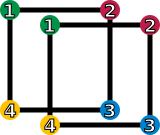

$\mathrm{id}$ (keeping it as it is)

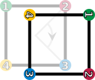

$r_1$ (rotation by 90° clockwise)

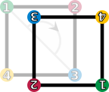

$r_2$ (rotation by 180°)

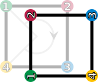

$r_3$ (rotation by 270° clockwise)

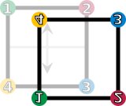

$f_{\mathrm{v}}$ (vertical reflection)

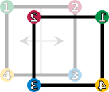

$f_{\mathrm{h}}$ (horizontal reflection)

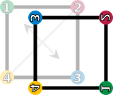

$f_{\mathrm{d}}$ (diagonal reflection)

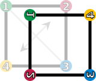

$f_{\mathrm{c}}$ (counter-diagonal reflection)

Two figures in the [plane](https://en.wikipedia.org/wiki/Plane_\(geometry\) "Plane (geometry)") are [congruent](https://en.wikipedia.org/wiki/Congruence_\(geometry\) "Congruence (geometry)") if one can be changed into the other using a combination of [rotations](https://en.wikipedia.org/wiki/Rotation_\(mathematics\) "Rotation (mathematics)"), [reflections](https://en.wikipedia.org/wiki/Reflection_\(mathematics\) "Reflection (mathematics)"), and [translations](https://en.wikipedia.org/wiki/Translation_\(geometry\) "Translation (geometry)"). Any figure is congruent to itself. However, some figures are congruent to themselves in more than one way, and these extra congruences are called [symmetries](https://en.wikipedia.org/wiki/Symmetry "Symmetry"). A [square](https://en.wikipedia.org/wiki/Square "Square") has eight symmetries. These are:

*   the [identity operation](https://en.wikipedia.org/wiki/Identity_operation "Identity operation") leaving everything unchanged, denoted $\operatorname{id}$;
*   rotations of the square around its center by 90°, 180°, and 270° clockwise, denoted by ⁠$r_1$⁠, $r_2$ and ⁠$r_3$⁠, respectively;
*   reflections about the horizontal and vertical middle line (⁠$f_{\mathrm{v} }$⁠ and ⁠$f_{\mathrm{h} }$⁠), or through the two [diagonals](https://en.wikipedia.org/wiki/Diagonal "Diagonal") (⁠$f_{\mathrm{d} }$⁠ and ⁠$f_{\mathrm{c} }$⁠).

These symmetries are functions. Each sends a point in the square to the corresponding point under the symmetry. For example, $r_1$ sends a point to its rotation 90° clockwise around the square's center, and $f_{\mathrm{h}}$ sends a point to its reflection across the square's vertical middle line. Composing two of these symmetries gives another symmetry. These symmetries determine a group called the [dihedral group](https://en.wikipedia.org/wiki/Dihedral_group "Dihedral group") of degree four, denoted ⁠$\mathrm{D}_4$⁠. The underlying set of the group is the above set of symmetries, and the group operation is function composition. Two symmetries are combined by composing them as functions, that is, applying the first one to the square, and the second one to the result of the first application. The result of performing first $a$ and then $b$ is written symbolically _from right to left_ as $b\circ a$ ("apply the symmetry $b$ after performing the symmetry ⁠$a$⁠"). This is the usual notation for the composition of functions.

A [Cayley table](https://en.wikipedia.org/wiki/Cayley_table "Cayley table") lists the results of all such compositions possible. For example, rotating by 270° clockwise (⁠$r_3$⁠) and then reflecting horizontally (⁠$f_{\mathrm{h} }$⁠) is the same as performing a reflection along the diagonal (⁠$f_{\mathrm{d} }$⁠). Using the above symbols, highlighted in blue in the Cayley table: $$
f_\mathrm h \circ r_3= f_\mathrm d.
$$

[Cayley table](https://en.wikipedia.org/wiki/Cayley_table "Cayley table") of $\mathrm{D}_4$

$\circ$$\mathrm{id}$$r_1$$r_2$$r_3$$f_{\mathrm{v}}$$f_{\mathrm{h}}$$f_{\mathrm{d}}$$f_{\mathrm{c}}$

$\mathrm{id}$

$\mathrm{id}$

$r_1$

$r_2$

$r_3$

$f_{\mathrm{v}}$

$f_{\mathrm{h}}$

$f_{\mathrm{d}}$

$f_{\mathrm{c}}$

$r_1$

$r_1$

$r_2$

$r_3$

$\mathrm{id}$

$f_{\mathrm{c}}$

$f_{\mathrm{d}}$

$f_{\mathrm{v}}$

$f_{\mathrm{h}}$

$r_2$

$r_2$

$r_3$

$\mathrm{id}$

$r_1$

$f_{\mathrm{h}}$

$f_{\mathrm{v}}$

$f_{\mathrm{c}}$

$f_{\mathrm{d}}$

$r_3$

$r_3$

$\mathrm{id}$

$r_1$

$r_2$

$f_{\mathrm{d}}$

$f_{\mathrm{c}}$

$f_{\mathrm{h}}$

$f_{\mathrm{v}}$

$f_{\mathrm{v}}$

$f_{\mathrm{v}}$

$f_{\mathrm{d}}$

$f_{\mathrm{h}}$

$f_{\mathrm{c}}$

$\mathrm{id}$

$r_2$

$r_1$

$r_3$

$f_{\mathrm{h}}$

$f_{\mathrm{h}}$

$f_{\mathrm{c}}$

$f_{\mathrm{v}}$

$f_{\mathrm{d}}$

$r_2$

$\mathrm{id}$

$r_3$

$r_1$

$f_{\mathrm{d}}$

$f_{\mathrm{d}}$

$f_{\mathrm{h}}$

$f_{\mathrm{c}}$

$f_{\mathrm{v}}$

$r_3$

$r_1$

$\mathrm{id}$

$r_2$

$f_{\mathrm{c}}$

$f_{\mathrm{c}}$

$f_{\mathrm{v}}$

$f_{\mathrm{d}}$

$f_{\mathrm{h}}$

$r_1$

$r_3$

$r_2$

$\mathrm{id}$

The elements ⁠$\mathrm{id}$⁠, ⁠$r_1$⁠, ⁠$r_2$⁠, and ⁠$r_3$⁠ form a [subgroup](https://en.wikipedia.org/wiki/Subgroup "Subgroup") whose Cayley table is highlighted in red (upper left region). A left and right [coset](https://en.wikipedia.org/wiki/Coset "Coset") of this subgroup are highlighted in green (in the last row) and yellow (last column), respectively. The result of the composition ⁠$f_{\mathrm{h} }\circ r_3$⁠, the symmetry ⁠$f_{\mathrm{d} }$⁠, is highlighted in blue (below table center).

Given this set of symmetries and the described operation, the group axioms can be understood as follows:

*   _Binary operation_: Composition is a binary operation. That is, $a\circ b$ is a symmetry for any two symmetries $a$ and ⁠$b$⁠. For example, $$
r_3\circ f_\mathrm h = f_\mathrm c.
$$ That is, rotating 270° clockwise after reflecting horizontally equals reflecting along the counter-diagonal (⁠$f_{\mathrm{c} }$⁠). Indeed, every other combination of two symmetries still gives a symmetry, as can be checked using the Cayley table.
*   _Associativity_: The associativity axiom deals with composing more than two symmetries: Starting with three elements ⁠$a$⁠, ⁠$b$⁠ and ⁠$c$⁠ of ⁠$\mathrm{D}_4$⁠, there are two possible ways of using these three symmetries in this order to determine a symmetry of the square. One of these ways is to first compose $a$ and $b$ into a single symmetry, then to compose that symmetry with ⁠$c$⁠. The other way is to first compose $b$ and ⁠$c$⁠, then to compose the resulting symmetry with ⁠$a$⁠. These two ways must always give the same result, that is, $$
(a\circ b)\circ c = a\circ (b\circ c).
$$ For example, $(f_{\mathrm{d}}\circ f_{\mathrm{v}})\circ r_2=f_{\mathrm{d}}\circ (f_{\mathrm{v}}\circ r_2)$ can be checked using the Cayley table: $$
\begin{align}
(f_\mathrm d\circ f_\mathrm v)\circ r_2 &=r_3\circ r_2=r_1\\
f_\mathrm d\circ (f_\mathrm v\circ r_2) &=f_\mathrm d\circ f_\mathrm h =r_1.
\end{align}
$$
*   _Identity element_: The identity element is ⁠$\mathrm{id}$⁠, as it does not change any symmetry $a$ when composed with it either on the left or on the right.
*   _Inverse element_: Each symmetry has an inverse: ⁠$\mathrm{id}$⁠, the reflections ⁠$f_{\mathrm{h} }$⁠, ⁠$f_{\mathrm{v} }$⁠, ⁠$f_{\mathrm{d} }$⁠, ⁠$f_{\mathrm{c} }$⁠ and the 180° rotation $r_2$ are their own inverse, because performing them twice brings the square back to its original orientation. The rotations $r_3$ and $r_1$ are each other's inverses, because rotating 90° and then rotating 270° (or vice versa) yields a rotation over 360° which leaves the square unchanged. This is easily verified in the table.

In contrast to the group of integers above, where the order of the operation is immaterial, it does matter in ⁠$\mathrm{D}_4$⁠, as, for example, $f_{\mathrm{h}}\circ r_1=f_{\mathrm{c}}$ but ⁠$r_1\circ f_{\mathrm{h} }=f_{\mathrm{d} }$⁠. In other words, $\mathrm{D}_4$ is not abelian.

## History

The modern concept of an [abstract group](https://en.wikipedia.org/wiki/Abstract_group "Abstract group") developed out of several fields of mathematics. The original motivation for group theory was the quest for solutions of [polynomial equations](https://en.wikipedia.org/wiki/Polynomial_equation "Polynomial equation") of degree higher than 4. The 19th-century French mathematician [Évariste Galois](https://en.wikipedia.org/wiki/Évariste_Galois "Évariste Galois"), extending prior work of [Paolo Ruffini](https://en.wikipedia.org/wiki/Paolo_Ruffini_\(mathematician\) "Paolo Ruffini (mathematician)") and [Joseph-Louis Lagrange](https://en.wikipedia.org/wiki/Joseph-Louis_Lagrange "Joseph-Louis Lagrange"), gave a criterion for the [solvability](https://en.wikipedia.org/wiki/Equation_solving "Equation solving") of a particular polynomial equation in terms of the [symmetry group](https://en.wikipedia.org/wiki/Symmetry_group "Symmetry group") of its [roots](https://en.wikipedia.org/wiki/Root_of_a_function "Root of a function") (solutions). The elements of such a [Galois group](https://en.wikipedia.org/wiki/Galois_group "Galois group") correspond to certain [permutations](https://en.wikipedia.org/wiki/Permutation "Permutation") of the roots. At first, Galois's ideas were rejected by his contemporaries, and published only posthumously. More general permutation groups were investigated in particular by [Augustin Louis Cauchy](https://en.wikipedia.org/wiki/Augustin_Louis_Cauchy "Augustin Louis Cauchy"). [Arthur Cayley](https://en.wikipedia.org/wiki/Arthur_Cayley "Arthur Cayley")'s _On the theory of groups, as depending on the symbolic equation $\theta^n=1$_ (1854) gives the first abstract definition of a [finite group](https://en.wikipedia.org/wiki/Finite_group "Finite group").

Geometry was a second field in which groups were used systematically, especially symmetry groups as part of [Felix Klein](https://en.wikipedia.org/wiki/Felix_Klein "Felix Klein")'s 1872 [Erlangen program](https://en.wikipedia.org/wiki/Erlangen_program "Erlangen program"). After novel geometries such as [hyperbolic](https://en.wikipedia.org/wiki/Hyperbolic_geometry "Hyperbolic geometry") and [projective geometry](https://en.wikipedia.org/wiki/Projective_geometry "Projective geometry") had emerged, Klein used group theory to organize them in a more coherent way. Further advancing these ideas, [Sophus Lie](https://en.wikipedia.org/wiki/Sophus_Lie "Sophus Lie") founded the study of [Lie groups](https://en.wikipedia.org/wiki/Lie_group "Lie group") in 1884.

The third field contributing to group theory was [number theory](https://en.wikipedia.org/wiki/Number_theory "Number theory"). Certain abelian group structures had been used implicitly in [Carl Friedrich Gauss](https://en.wikipedia.org/wiki/Carl_Friedrich_Gauss "Carl Friedrich Gauss")'s number-theoretical work _[Disquisitiones Arithmeticae](https://en.wikipedia.org/wiki/Disquisitiones_Arithmeticae "Disquisitiones Arithmeticae")_ (1798), and more explicitly by [Leopold Kronecker](https://en.wikipedia.org/wiki/Leopold_Kronecker "Leopold Kronecker"). In 1847, [Ernst Kummer](https://en.wikipedia.org/wiki/Ernst_Kummer "Ernst Kummer") made early attempts to prove [Fermat's Last Theorem](https://en.wikipedia.org/wiki/Fermat's_Last_Theorem "Fermat's Last Theorem") by developing [groups describing factorization](https://en.wikipedia.org/wiki/Class_group "Class group") into [prime numbers](https://en.wikipedia.org/wiki/Prime_number "Prime number").

The convergence of these various sources into a uniform theory of groups started with [Jordan (1870)](/source/group-mathematics/#CITEREFJordan1870)'s _Traité des substitutions et des équations algébriques_. [von Dyck (1882)](/source/group-mathematics/#CITEREFvon_Dyck1882) introduced the idea of specifying a group by means of generators and relations, and was also the first to give an axiomatic definition of an "abstract group", in the terminology of the time. As of the 20th century, groups gained wide recognition by the pioneering work of [Ferdinand Georg Frobenius](https://en.wikipedia.org/wiki/Ferdinand_Georg_Frobenius "Ferdinand Georg Frobenius") and [William Burnside](https://en.wikipedia.org/wiki/William_Burnside "William Burnside"), who worked on [representation theory](https://en.wikipedia.org/wiki/Representation_theory "Representation theory") of finite groups and wrote the first book about group theory in the English language: _Theory of Groups of Finite Order_, [Richard Brauer](https://en.wikipedia.org/wiki/Richard_Brauer "Richard Brauer")'s [modular representation theory](https://en.wikipedia.org/wiki/Modular_representation_theory "Modular representation theory") and [Issai Schur](https://en.wikipedia.org/wiki/Issai_Schur "Issai Schur")'s papers. The theory of Lie groups, and more generally [locally compact groups](https://en.wikipedia.org/wiki/Locally_compact_group "Locally compact group") was studied by [Hermann Weyl](https://en.wikipedia.org/wiki/Hermann_Weyl "Hermann Weyl"), [Élie Cartan](https://en.wikipedia.org/wiki/Élie_Cartan "Élie Cartan") and many others. Its [algebraic](https://en.wikipedia.org/wiki/Algebra "Algebra") counterpart, the theory of [algebraic groups](https://en.wikipedia.org/wiki/Algebraic_group "Algebraic group"), was first shaped by [Claude Chevalley](https://en.wikipedia.org/wiki/Claude_Chevalley "Claude Chevalley") (from the late 1930s) and later by the work of [Armand Borel](https://en.wikipedia.org/wiki/Armand_Borel "Armand Borel") and [Jacques Tits](https://en.wikipedia.org/wiki/Jacques_Tits "Jacques Tits").

The [University of Chicago](https://en.wikipedia.org/wiki/University_of_Chicago "University of Chicago")'s 1960–61 Group Theory Year brought together group theorists such as [Daniel Gorenstein](https://en.wikipedia.org/wiki/Daniel_Gorenstein "Daniel Gorenstein"), [John G. Thompson](https://en.wikipedia.org/wiki/John_G._Thompson "John G. Thompson") and [Walter Feit](https://en.wikipedia.org/wiki/Walter_Feit "Walter Feit"), laying the foundation of a collaboration that, with input from numerous other mathematicians, led to the [classification of finite simple groups](https://en.wikipedia.org/wiki/Classification_of_finite_simple_groups "Classification of finite simple groups"), with the final step taken by [Aschbacher](https://en.wikipedia.org/wiki/Michael_Aschbacher "Michael Aschbacher") and Smith in 2004. This project exceeded previous mathematical endeavours by its sheer size, in both length of [proof](https://en.wikipedia.org/wiki/Mathematical_proof "Mathematical proof") and number of researchers. Research concerning this classification proof is ongoing. Group theory remains a highly active mathematical branch, impacting many other fields, as the [examples below](/source/group-mathematics/#Examples_and_applications) illustrate.

## Elementary consequences of the group axioms

Basic facts about all groups that can be obtained directly from the group axioms are commonly subsumed under _elementary group theory_. For example, [repeated](https://en.wikipedia.org/wiki/Mathematical_induction "Mathematical induction") applications of the associativity axiom show that the unambiguity of $$
a\cdot b\cdot c=(a\cdot b)\cdot c=a\cdot(b\cdot c)
$$ generalizes to more than three factors (for example, $a\cdot b\cdot c\cdot d$ is also unambiguous). Because this implies that [parentheses](https://en.wikipedia.org/wiki/Bracket#Parentheses_in_mathematics "Bracket") can be inserted anywhere within such a series of terms, parentheses are usually omitted.

### Uniqueness of identity element

The group axioms imply that the identity element is unique; that is, there exists only one identity element: any two identity elements $e$ and $f$ of a group are equal, because the group axioms imply ⁠$e=e\cdot f=f$⁠. It is thus customary to speak of _the_ identity element of the group.

### Uniqueness of inverses

The group axioms also imply that the inverse of each element is unique. Let a group element $a$ have both $b$ and $c$ as inverses. Then

: $\begin{align}
b &=  b\cdot e 
    && \text{(}e \text { is the identity element)}\\
  &=  b\cdot (a \cdot c) 
    && \text{(}c \text { and } a \text{ are inverses of each other)}\\
  &=  (b\cdot a) \cdot c 
    && \text{(associativity)}\\
  &=  e \cdot c 
    && \text{(}b \text { is an inverse of } a\text{)}\\
  &=  c 
    && \text{(}e \text { is the identity element and } b=c\text{)}
\end{align}$

Therefore, it is customary to speak of _the_ inverse of an element.

### Division

Given elements $a$ and $b$ of a group $G$, there is a unique solution $x$ in $G$ to the equation $a\cdot x=b$, namely $a^{-1}\cdot b$. It follows that for each $a$ in $G$, the function $G\to G$ that maps each $x$ to $a\cdot x$ is a [bijection](https://en.wikipedia.org/wiki/Bijection "Bijection"); it is called _left multiplication_ by $a$ or _left translation_ by $a$.

Similarly, given $a$ and $b$ in $G$, the unique solution $x$ to $x\cdot a=b$ is $b\cdot a^{-1}$. For each $a$, the function $G\to G$ that maps each $x$ to $x\cdot a$ is a bijection called _right multiplication_ by $a$ or _right translation_ by $a$.

### Equivalent definition with relaxed axioms

The group axioms for identity and inverses may be "weakened" to assert only the existence of a [left identity](https://en.wikipedia.org/wiki/Left_identity "Left identity") and [left inverses](https://en.wikipedia.org/wiki/Left_inverse_element "Left inverse element"). From these _one-sided axioms_, one can prove that the left identity is also a right identity and a left inverse is also a right inverse for the same element. Since they define exactly the same structures as groups, collectively the axioms are not weaker.

In particular, assuming associativity and the existence of a left identity $e$ (that is, ⁠$e\cdot f=f$⁠) and a left inverse $f^{-1}$ for each element $f$ (that is, ⁠$f^{-1}\cdot f=e$⁠), it follows that every left inverse is also a right inverse of the same element as follows. Indeed, one has

: $\begin{align}
f \cdot f^{-1}
  &=e \cdot (f \cdot f^{-1}) 
       && \text{(left identity)}\\
  &=((f^{-1})^{-1} \cdot f^{-1}) \cdot (f \cdot f^{-1})
       && \text{(left inverse)}\\
  &=(f^{-1})^{-1} \cdot ((f^{-1} \cdot f) \cdot f^{-1})
       && \text{(associativity)}\\
  &=(f^{-1})^{-1} \cdot (e \cdot f^{-1})
       && \text{(left inverse)}\\
  &=(f^{-1})^{-1} \cdot f^{-1}
       && \text{(left identity)}\\
  &=e
       && \text{(left inverse)}
\end{align}$

Similarly, the left identity is also a right identity:

: $\begin{align}
f\cdot e 
  &= f \cdot ( f^{-1} \cdot f)
       && \text{(left inverse)}\\
  &= (f \cdot  f^{-1}) \cdot f
       && \text{(associativity)}\\
  &= e \cdot f
       && \text{(right inverse)}\\
  &= f
       && \text{(left identity)}
\end{align}$

These results do not hold if any of these axioms (associativity, existence of left identity and existence of left inverse) is removed. For a structure with a looser definition (like a [semigroup](https://en.wikipedia.org/wiki/Semigroup "Semigroup")) one may have, for example, that a left identity is not necessarily a right identity.

The same result can be obtained by only assuming the existence of a right identity and a right inverse.

However, only assuming the existence of a _left_ identity and a _right_ inverse (or vice versa) is not sufficient to define a group. For example, consider the set $G = \{ e,f \}$ with the operator $\,\!\cdot$ satisfying $e \cdot e = f \cdot e = e$ and ⁠$e \cdot f = f \cdot f = f$⁠. This structure does have a left identity (namely, ⁠$e$⁠), and each element has a right inverse (which is $e$ for both elements). Furthermore, this operation is associative (since the product of any number of elements is always equal to the rightmost element in that product, regardless of the order in which these operations are applied). However, $( G , \cdot )$ is not a group, since it lacks a right identity.

## Basic concepts

When studying sets, one uses concepts such as [subset](https://en.wikipedia.org/wiki/Subset "Subset"), function, and [quotient by an equivalence relation](https://en.wikipedia.org/wiki/Quotient_by_an_equivalence_relation "Quotient by an equivalence relation"). When studying groups, one uses instead [subgroups](https://en.wikipedia.org/wiki/Subgroup "Subgroup"), [homomorphisms](https://en.wikipedia.org/wiki/Group_homomorphism "Group homomorphism"), and [quotient groups](https://en.wikipedia.org/wiki/Quotient_group "Quotient group"). These are the analogues that take the group structure into account.

### Group homomorphisms

Group homomorphisms are functions that respect group structure; they may be used to relate two groups. A _homomorphism_ from a group $(G,\cdot)$ to a group $(H,*)$ is a function $\varphi : G\to H$ such that

$\varphi(a\cdot b)=\varphi(a)*\varphi(b)$ for all elements $a$ and $b$ in ⁠$G$⁠.

It would be natural to require also that $\varphi$ respect identities, ⁠$\varphi(1_G)=1_H$⁠, and inverses, $\varphi(a^{-1})=\varphi(a)^{-1}$ for all $a$ in ⁠$G$⁠. However, these additional requirements need not be included in the definition of homomorphisms, because they are already implied by the requirement of respecting the group operation.

The _identity homomorphism_ of a group $G$ is the homomorphism $\iota_G : G\to G$ that maps each element of $G$ to itself. An _inverse homomorphism_ of a homomorphism $\varphi : G\to H$ is a homomorphism $\psi : H\to G$ such that $\psi\circ\varphi=\iota_G$ and ⁠$\varphi\circ\psi=\iota_H$⁠, that is, such that $\psi\bigl(\varphi(g)\bigr)=g$ for all $g$ in $G$ and such that $\varphi\bigl(\psi(h)\bigr)=h$ for all $h$ in ⁠$H$⁠. An _[isomorphism](https://en.wikipedia.org/wiki/Group_isomorphism "Group isomorphism")_ is a homomorphism that has an inverse homomorphism; equivalently, it is a [bijective](https://en.wikipedia.org/wiki/Bijective "Bijective") homomorphism. Groups $G$ and $H$ are called _isomorphic_ if there exists an isomorphism ⁠$\varphi : G\to H$⁠. In this case, $H$ can be obtained from $G$ simply by renaming its elements according to the function ⁠$\varphi$⁠; then any statement true for $G$ is true for ⁠$H$⁠, provided that any specific elements mentioned in the statement are also renamed.

The collection of all groups, together with the homomorphisms between them, form a [category](https://en.wikipedia.org/wiki/Category_\(mathematics\) "Category (mathematics)"), the [category of groups](https://en.wikipedia.org/wiki/Category_of_groups "Category of groups").

An [injective](https://en.wikipedia.org/wiki/Injective "Injective") homomorphism $\phi : G' \to G$ factors canonically as an isomorphism followed by an inclusion, $G' \;\stackrel{\sim}{\to}\; H \hookrightarrow G$ for some subgroup ⁠$H$⁠ of ⁠$G$⁠. Injective homomorphisms are the [monomorphisms](https://en.wikipedia.org/wiki/Monomorphism "Monomorphism") in the category of groups.

### Subgroups

Informally, a _subgroup_ is a group $H$ contained within a bigger one, ⁠$G$⁠: it has a subset of the elements of ⁠$G$⁠, with the same operation. Concretely, this means that the identity element of $G$ must be contained in ⁠$H$⁠, and whenever $h_1$ and $h_2$ are both in ⁠$H$⁠, then so are $h_1\cdot h_2$ and ⁠$h_1^{-1}$⁠, so the elements of ⁠$H$⁠, equipped with the group operation on $G$ restricted to ⁠$H$⁠, indeed form a group. In this case, the inclusion map $H \to G$ is a homomorphism.

In the example of symmetries of a square, the identity and the rotations constitute a subgroup ⁠$R=\{\mathrm{id},r_1,r_2,r_3\}$⁠, highlighted in red in the Cayley table of the example: any two rotations composed are still a rotation, and a rotation can be undone by (i.e., is inverse to) the complementary rotations 270° for 90°, 180° for 180°, and 90° for 270°. The [subgroup test](https://en.wikipedia.org/wiki/Subgroup_test "Subgroup test") provides a [necessary and sufficient condition](https://en.wikipedia.org/wiki/Necessary_and_sufficient_conditions "Necessary and sufficient conditions") for a nonempty subset ⁠$H$⁠ of a group ⁠$G$⁠ to be a subgroup: it is sufficient to check that $g^{-1}\cdot h\in H$ for all elements $g$ and $h$ in ⁠$H$⁠. Knowing a group's [subgroups](https://en.wikipedia.org/wiki/Lattice_of_subgroups "Lattice of subgroups") is important in understanding the group as a whole.

Given any subset $S$ of a group ⁠$G$⁠, the subgroup [generated](https://en.wikipedia.org/wiki/Generating_set_of_a_group "Generating set of a group") by $S$ consists of all products of elements of $S$ and their inverses. It is the smallest subgroup of $G$ containing ⁠$S$⁠. In the example of symmetries of a square, the subgroup generated by $r_2$ and $f_{\mathrm{v}}$ consists of these two elements, the identity element ⁠$\mathrm{id}$⁠, and the element ⁠$f_{\mathrm{h} }=f_{\mathrm{v} }\cdot r_2$⁠. Again, this is a subgroup, because combining any two of these four elements or their inverses (which are, in this particular case, these same elements) yields an element of this subgroup.

### Cosets

In many situations it is desirable to consider two group elements the same if they differ by an element of a given subgroup. For example, in the symmetry group of a square, once any reflection is performed, rotations alone cannot return the square to its original position, so one can think of the reflected positions of the square as all being equivalent to each other, and as inequivalent to the unreflected positions; the rotation operations are irrelevant to the question whether a reflection has been performed. Cosets are used to formalize this insight: a subgroup $H$ determines left and right cosets, which can be thought of as translations of $H$ by an arbitrary group element ⁠$g$⁠. In symbolic terms, the _left_ and _right_ cosets of ⁠$H$⁠, containing an element ⁠$g$⁠, are

$gH=\{g\cdot h\mid h\in H\}$ and ⁠$Hg=\{h\cdot g\mid h\in H\}$⁠, respectively.

The left cosets of any subgroup $H$ form a [partition](https://en.wikipedia.org/wiki/Partition_of_a_set "Partition of a set") of ⁠$G$⁠; that is, the [union](https://en.wikipedia.org/wiki/Union_\(set_theory\) "Union (set theory)") of all left cosets is equal to $G$ and two left cosets are either equal or have an [empty](https://en.wikipedia.org/wiki/Empty_set "Empty set") [intersection](https://en.wikipedia.org/wiki/Intersection_\(set_theory\) "Intersection (set theory)"). The first case $g_1H=g_2H$ happens [precisely when](https://en.wikipedia.org/wiki/If_and_only_if "If and only if") ⁠$g_1^{-1}\cdot g_2\in H$⁠, i.e., when the two elements differ by an element of ⁠$H$⁠. Similar considerations apply to the right cosets of ⁠$H$⁠. The left cosets of $H$ may or may not be the same as its right cosets. If they are (that is, if all $g$ in $G$ satisfy ⁠$gH=Hg$⁠), then $H$ is said to be a _[normal subgroup](https://en.wikipedia.org/wiki/Normal_subgroup "Normal subgroup")_.

In ⁠$\mathrm{D}_4$⁠, the group of symmetries of a square, with its subgroup $R$ of rotations, the left cosets $gR$ are either equal to ⁠$R$⁠, if $g$ is an element of $R$ itself, or otherwise equal to $U=f_{\mathrm{c}}R=\{f_{\mathrm{c}},f_{\mathrm{d}},f_{\mathrm{v}},f_{\mathrm{h}}\}$ (highlighted in green in the Cayley table of ⁠$\mathrm{D}_4$⁠). The subgroup $R$ is normal, because $f_{\mathrm{c}}R=U=Rf_{\mathrm{c}}$ and similarly for the other elements of the group. (In fact, in the case of ⁠$\mathrm{D}_4$⁠, the cosets generated by reflections are all equal: ⁠$f_{\mathrm{h} }R=f_{\mathrm{v} }R=f_{\mathrm{d} }R=f_{\mathrm{c} }R$⁠.)

### Quotient groups

Suppose that $N$ is a normal subgroup of a group ⁠$G$⁠, and $$
G/N = \{gN \mid g\in G\}
$$ denotes its set of cosets. Then there is a unique group law on $G/N$ for which the map $G\to G/N$ sending each element $g$ to $gN$ is a homomorphism. Explicitly, the product of two cosets $gN$ and $hN$ is ⁠$(gh)N$⁠, the coset $eN = N$ serves as the identity of ⁠$G/N$⁠, and the inverse of $gN$ in the quotient group is ⁠$(gN)^{-1} = \left(g^{-1}\right)N$⁠. The group ⁠$G/N$⁠, read as "⁠$G$⁠ modulo ⁠$N$⁠", is called a _quotient group_ or _factor group_. The quotient group can alternatively be characterized by a [universal property](https://en.wikipedia.org/wiki/Universal_property "Universal property").

Cayley table of the quotient group $\mathrm{D}_4/R$

$\cdot$$R$$U$

$R$

$R$

$U$

$U$

$U$

$R$

The elements of the quotient group $\mathrm{D}_4/R$ are $R$ and ⁠$U=f_{\mathrm{v} }R$⁠. The group operation on the quotient is shown in the table. For example, ⁠$U\cdot U=f_{\mathrm{v} }R\cdot f_{\mathrm{v} }R=(f_{\mathrm{v} }\cdot f_{\mathrm{v} })R=R$⁠. Both the subgroup $R=\{\mathrm{id},r_1,r_2,r_3\}$ and the quotient $\mathrm{D}_4/R$ are abelian, but $\mathrm{D}_4$ is not. Sometimes a group can be reconstructed from a subgroup and quotient (plus some additional data), by the [semidirect product](https://en.wikipedia.org/wiki/Semidirect_product "Semidirect product") construction; $\mathrm{D}_4$ is an example.

The [first isomorphism theorem](https://en.wikipedia.org/wiki/First_isomorphism_theorem "First isomorphism theorem") implies that any [surjective](https://en.wikipedia.org/wiki/Surjective "Surjective") homomorphism $\phi : G \to H$ factors canonically as a quotient homomorphism followed by an isomorphism: ⁠$G \to G/\ker \phi \;\stackrel{\sim}{\to}\; H$⁠. Surjective homomorphisms are the [epimorphisms](https://en.wikipedia.org/wiki/Epimorphism "Epimorphism") in the category of groups.

### Presentations

Every group is isomorphic to a quotient of a [free group](https://en.wikipedia.org/wiki/Free_group "Free group"), in many ways.

For example, the dihedral group $\mathrm{D}_4$ is generated by the right rotation $r_1$ and the reflection $f_{\mathrm{v}}$ in a vertical line (every element of $\mathrm{D}_4$ is a finite product of copies of these and their inverses). Hence there is a surjective homomorphism ⁠$\phi$⁠ from the free group $\langle r,f \rangle$ on two generators to $\mathrm{D}_4$ sending $r$ to $r_1$ and $f$ to ⁠$f_1$⁠. Elements in $\ker \phi$ are called _relations_; examples include ⁠$r^4,f^2,(r \cdot f)^2$⁠. In fact, it turns out that $\ker \phi$ is the smallest normal subgroup of $\langle r,f \rangle$ containing these three elements; in other words, all relations are consequences of these three. The quotient of the free group by this normal subgroup is denoted ⁠$\langle r,f \mid r^4=f^2=(r\cdot f)^2=1 \rangle$⁠. This is called a _[presentation](https://en.wikipedia.org/wiki/Presentation_of_a_group "Presentation of a group")_ of $\mathrm{D}_4$ by generators and relations, because the first isomorphism theorem for ⁠$\phi$⁠ yields an isomorphism ⁠$\langle r,f \mid r^4=f^2=(r\cdot f)^2=1 \rangle \to \mathrm{D}_4$⁠.

A presentation of a group can be used to construct the [Cayley graph](https://en.wikipedia.org/wiki/Cayley_graph "Cayley graph"), a graphical depiction of a [discrete group](https://en.wikipedia.org/wiki/Discrete_group "Discrete group").

## Examples and applications

A periodic wallpaper pattern gives rise to a [wallpaper group](https://en.wikipedia.org/wiki/Wallpaper_group "Wallpaper group").

Examples and applications of groups abound. A starting point is the group $\Z$ of integers with addition as group operation, introduced above. If, instead of addition, multiplication is considered, one obtains [multiplicative groups](https://en.wikipedia.org/wiki/Multiplicative_group "Multiplicative group"). These groups are predecessors of important constructions in [abstract algebra](/source/abstract-algebra/ "Abstract algebra").

Groups are also applied in many other mathematical areas. Mathematical objects are often examined by [associating](https://en.wikipedia.org/wiki/Functor "Functor") groups to them and studying the properties of the corresponding groups. For example, [Henri Poincaré](https://en.wikipedia.org/wiki/Henri_Poincaré "Henri Poincaré") founded what is now called [algebraic topology](https://en.wikipedia.org/wiki/Algebraic_topology "Algebraic topology") by introducing the [fundamental group](https://en.wikipedia.org/wiki/Fundamental_group "Fundamental group"). By means of this connection, [topological properties](https://en.wikipedia.org/wiki/Glossary_of_topology "Glossary of topology") such as [proximity](https://en.wikipedia.org/wiki/Neighbourhood_\(mathematics\) "Neighbourhood (mathematics)") and [continuity](https://en.wikipedia.org/wiki/Continuous_function "Continuous function") translate into properties of groups.

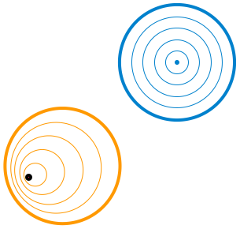The fundamental group of a plane minus a point (bold) consists of loops around the missing point. This group is isomorphic to the integers under addition.

Elements of the fundamental group of a [topological space](https://en.wikipedia.org/wiki/Topological_space "Topological space") are [equivalence classes](https://en.wikipedia.org/wiki/Equivalence_class "Equivalence class") of loops, where loops are considered equivalent if one can be [smoothly deformed](/source/homotopy/ "Homotopy") into another, and the group operation is "concatenation" (tracing one loop then the other). For example, as shown in the figure, if the topological space is the plane with one point removed, then loops which do not wrap around the missing point (blue) [can be smoothly contracted to a single point](https://en.wikipedia.org/wiki/Null-homotopic "Null-homotopic") and are the identity element of the fundamental group. A loop which wraps around the missing point $k$ times cannot be deformed into a loop which wraps $m$ times (with ⁠$m\neq k$⁠), because the loop cannot be smoothly deformed across the hole, so each class of loops is characterized by its [winding number](https://en.wikipedia.org/wiki/Winding_number "Winding number") around the missing point. The resulting group is isomorphic to the integers under addition.

In more recent applications, the influence has also been reversed to motivate geometric constructions by a group-theoretical background. In a similar vein, [geometric group theory](https://en.wikipedia.org/wiki/Geometric_group_theory "Geometric group theory") employs geometric concepts, for example in the study of [hyperbolic groups](https://en.wikipedia.org/wiki/Hyperbolic_group "Hyperbolic group"). Further branches crucially applying groups include [algebraic geometry](https://en.wikipedia.org/wiki/Algebraic_geometry "Algebraic geometry") and number theory.

In addition to the above theoretical applications, many practical applications of groups exist. [Cryptography](https://en.wikipedia.org/wiki/Cryptography "Cryptography") relies on the combination of the abstract group theory approach together with [algorithmical](https://en.wikipedia.org/wiki/Algorithm "Algorithm") knowledge obtained in [computational group theory](https://en.wikipedia.org/wiki/Computational_group_theory "Computational group theory"), in particular when implemented for finite groups. Applications of group theory are not restricted to mathematics; sciences such as [physics](/source/physics/ "Physics"), [chemistry](https://en.wikipedia.org/wiki/Chemistry "Chemistry") and [computer science](https://en.wikipedia.org/wiki/Computer_science "Computer science") benefit from the concept.

### Numbers

Many number systems, such as the integers and the [rationals](https://en.wikipedia.org/wiki/Rational_number "Rational number"), enjoy a naturally given group structure. In some cases, such as with the rationals, both addition and multiplication operations give rise to group structures. Such number systems are predecessors to more general algebraic structures known as [rings](https://en.wikipedia.org/wiki/Ring_\(mathematics\) "Ring (mathematics)") and [fields](https://en.wikipedia.org/wiki/Field_\(mathematics\) "Field (mathematics)"). Further abstract algebraic concepts such as [modules](https://en.wikipedia.org/wiki/Module_\(mathematics\) "Module (mathematics)"), [vector spaces](https://en.wikipedia.org/wiki/Vector_space "Vector space") and [algebras](https://en.wikipedia.org/wiki/Algebra_over_a_field "Algebra over a field") also form groups.

#### Integers

The group of integers $\Z$ under addition, denoted ⁠$\left(\Z,+\right)$⁠, has been described above. The integers, with the operation of multiplication instead of addition, $\left(\Z,\cdot\right)$ do _not_ form a group. The associativity and identity axioms are satisfied, but inverses do not exist: for example, $a=2$ is an integer, but the only solution to the equation $a\cdot b=1$ in this case is ⁠$b=\tfrac{1}{2}$⁠, which is a rational number, but not an integer. Hence not every element of $\Z$ has a (multiplicative) inverse.

#### Rationals

The desire for the existence of multiplicative inverses suggests considering [fractions](https://en.wikipedia.org/wiki/Fraction_\(mathematics\) "Fraction (mathematics)") $$
\frac{a}{b}.
$$

Fractions of integers (with $b$ nonzero) are known as [rational numbers](https://en.wikipedia.org/wiki/Rational_number "Rational number"). The set of all such irreducible fractions is commonly denoted ⁠$\Q$⁠. There is still a minor obstacle for ⁠$\left(\Q,\cdot\right)$⁠, the rationals with multiplication, being a group: because zero does not have a multiplicative inverse (i.e., there is no $x$ such that ⁠$x\cdot 0=1$⁠), $\left(\Q,\cdot\right)$ is still not a group.

However, the set of all _nonzero_ rational numbers $\Q\smallsetminus\left\{0\right\}=\left\{q\in\Q\mid q\neq 0\right\}$ does form an abelian group under multiplication, also denoted ⁠$\Q^{\times}$⁠. Associativity and identity element axioms follow from the properties of integers. The closure requirement still holds true after removing zero, because the product of two nonzero rationals is never zero. Finally, the inverse of $a/b$ is ⁠$b/a$⁠, therefore the axiom of the inverse element is satisfied.

The rational numbers (including zero) also form a group under addition. Intertwining addition and multiplication operations yields more complicated structures called rings and – if [division](https://en.wikipedia.org/wiki/Division_\(mathematics\) "Division (mathematics)") by other than zero is possible, such as in $\Q$ – fields, which occupy a central position in abstract algebra. Group theoretic arguments therefore underlie parts of the theory of those entities.

### Modular arithmetic

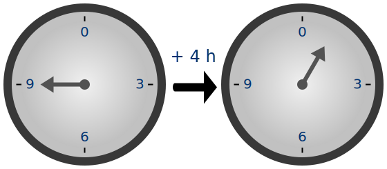The hours on a clock form a group that uses [addition modulo](https://en.wikipedia.org/wiki/Modular_arithmetic "Modular arithmetic") 12. Here, 9 + 4 ≡ 1.

Modular arithmetic for a _modulus_ $n$ defines any two elements $a$ and $b$ that differ by a multiple of $n$ to be equivalent, denoted by ⁠$a \equiv b\pmod{n}$⁠. Every integer is equivalent to one of the integers from $0$ to ⁠$n-1$⁠, and the operations of modular arithmetic modify normal arithmetic by replacing the result of any operation by its equivalent [representative](https://en.wikipedia.org/wiki/Representative_\(mathematics\) "Representative (mathematics)"). Modular addition, defined in this way for the integers from $0$ to ⁠$n-1$⁠, forms a group, denoted as $\mathrm{Z}_n$ or ⁠$(\Z/n\Z,+)$⁠, with $0$ as the identity element and $n-a$ as the inverse element of ⁠$a$⁠.

A familiar example is addition of hours on the face of a [clock](https://en.wikipedia.org/wiki/12-hour_clock "12-hour clock"), where 12 rather than 0 is chosen as the representative of the identity. If the hour hand is on $9$ and is advanced $4$ hours, it ends up on ⁠$1$⁠, as shown in the illustration. This is expressed by saying that $9+4$ is congruent to $1$ "modulo ⁠$12$⁠" or, in symbols, $$
9+4\equiv 1 \pmod{12}.
$$

For any prime number ⁠$p$⁠, there is also the [multiplicative group of integers modulo ⁠$p$⁠](https://en.wikipedia.org/wiki/Multiplicative_group_of_integers_modulo_n "Multiplicative group of integers modulo n"). Its elements can be represented by $1$ to ⁠$p-1$⁠. The group operation, multiplication modulo ⁠$p$⁠, replaces the usual product by its representative, the [remainder](https://en.wikipedia.org/wiki/Remainder "Remainder") of division by ⁠$p$⁠. For example, for ⁠$p=5$⁠, the four group elements can be represented by ⁠$1,2,3,4$⁠. In this group, ⁠$4\cdot 4\equiv 1\pmod{5}$⁠, because the usual product $16$ is equivalent to ⁠$1$⁠: when divided by $5$ it yields a remainder of ⁠$1$⁠. The primality of $p$ ensures that the usual product of two representatives is not divisible by ⁠$p$⁠, and therefore that the modular product is nonzero. The identity element is represented by ⁠$1$⁠, and associativity follows from the corresponding property of the integers. Finally, the inverse element axiom requires that given an integer $a$ not divisible by ⁠$p$⁠, there exists an integer $b$ such that $$
a\cdot b\equiv 1\pmod{p},
$$ that is, such that $p$ evenly divides ⁠$a\cdot b-1$⁠. The inverse $b$ can be found by using [Bézout's identity](https://en.wikipedia.org/wiki/Bézout's_identity "Bézout's identity") and the fact that the [greatest common divisor](https://en.wikipedia.org/wiki/Greatest_common_divisor "Greatest common divisor") $\gcd(a,p)$ equals ⁠$1$⁠. In the case $p=5$ above, the inverse of the element represented by $4$ is that represented by ⁠$4$⁠, and the inverse of the element represented by $3$ is represented by ⁠$2$⁠, as ⁠$3\cdot 2=6\equiv 1\pmod{5}$⁠. Hence all group axioms are fulfilled. This example is similar to $\left(\Q\smallsetminus\left\{0\right\},\cdot\right)$ above: it consists of exactly those elements in the ring $\Z/p\Z$ that have a multiplicative inverse. These groups, denoted ⁠$\mathbb F_p^\times$⁠, are crucial to [public-key cryptography](https://en.wikipedia.org/wiki/Public-key_cryptography "Public-key cryptography").

### Cyclic groups

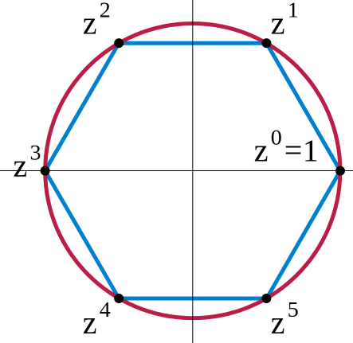The 6th complex roots of unity form a cyclic group. $z$ is a primitive element, but $z^2$ is not, because the odd powers of $z$ are not a power of ⁠$z^2$⁠.

A _cyclic group_ is a group all of whose elements are [powers](https://en.wikipedia.org/wiki/Power_\(mathematics\) "Power (mathematics)") of a particular element ⁠$a$⁠. In multiplicative notation, the elements of the group are $$
\dots, a^{-3}, a^{-2}, a^{-1}, a^0, a, a^2, a^3, \dots,
$$ where $a^2$ means ⁠$a\cdot a$⁠, $a^{-3}$ stands for ⁠$a^{-1}\cdot a^{-1}\cdot a^{-1}=(a\cdot a\cdot a)^{-1}$⁠, etc. Such an element $a$ is called a generator or a [primitive element](https://en.wikipedia.org/wiki/Primitive_root_modulo_n "Primitive root modulo n") of the group. In additive notation, the requirement for an element to be primitive is that each element of the group can be written as $$
\dots, (-a)+(-a), -a, 0, a, a+a, \dots.
$$

In the groups $(\Z/n\Z,+)$ introduced above, the element $1$ is primitive, so these groups are cyclic. Indeed, each element is expressible as a sum all of whose terms are ⁠$1$⁠. Any cyclic group with $n$ elements is isomorphic to this group. A second example for cyclic groups is the group of ⁠$n$⁠th [complex roots of unity](https://en.wikipedia.org/wiki/Root_of_unity "Root of unity"), given by [complex numbers](https://en.wikipedia.org/wiki/Complex_number "Complex number") $z$ satisfying ⁠$z^n=1$⁠. These numbers can be visualized as the [vertices](https://en.wikipedia.org/wiki/Vertex_\(graph_theory\) "Vertex (graph theory)") on a regular $n$-gon, as shown in blue in the image for ⁠$n=6$⁠. The group operation is multiplication of complex numbers. In the picture, multiplying with $z$ corresponds to a [counter-clockwise](https://en.wikipedia.org/wiki/Clockwise "Clockwise") rotation by 60°. From [field theory](https://en.wikipedia.org/wiki/Field_theory_\(mathematics\) "Field theory (mathematics)"), the group $\mathbb F_p^\times$ is cyclic for prime $p$: for example, if ⁠$p=5$⁠, $3$ is a generator since ⁠$3^1=3$⁠, ⁠$3^2=9\equiv 4$⁠, ⁠$3^3\equiv 2$⁠, and ⁠$3^4\equiv 1$⁠.

Some cyclic groups have an infinite number of elements. In these groups, for every non-zero element ⁠$a$⁠, all the powers of $a$ are distinct; despite the name "cyclic group", the powers of the elements do not cycle. An infinite cyclic group is isomorphic to ⁠$(\Z, +)$⁠, the group of integers under addition introduced above. As these two prototypes are both abelian, so are all cyclic groups.

The study of finitely generated abelian groups is quite mature, including the [fundamental theorem of finitely generated abelian groups](https://en.wikipedia.org/wiki/Fundamental_theorem_of_finitely_generated_abelian_groups "Fundamental theorem of finitely generated abelian groups"); and reflecting this state of affairs, many group-related notions, such as [center](https://en.wikipedia.org/wiki/Center_\(group_theory\) "Center (group theory)") and [commutator](https://en.wikipedia.org/wiki/Commutator "Commutator"), describe the extent to which a given group is not abelian.

### Symmetry groups

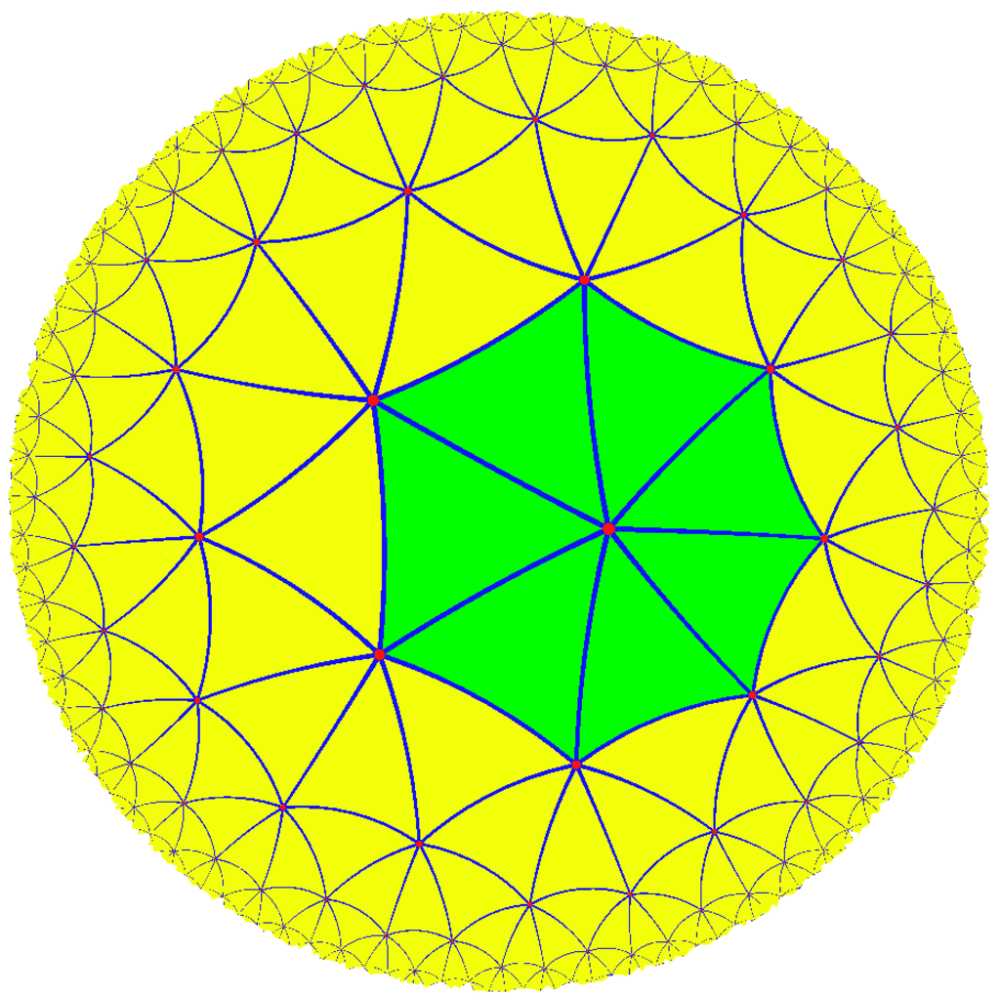The (2,3,7) triangle group, a hyperbolic reflection group, acts on this [tiling](https://en.wikipedia.org/wiki/Tessellation "Tessellation") of the [hyperbolic](https://en.wikipedia.org/wiki/Hyperbolic_geometry "Hyperbolic geometry") plane

_Symmetry groups_ are groups consisting of symmetries of given mathematical objects, principally geometric entities, such as the symmetry group of the square given as an introductory example above, although they also arise in algebra such as the symmetries among the roots of polynomial equations dealt with in Galois theory (see below). Conceptually, group theory can be thought of as the study of symmetry. [Symmetries in mathematics](https://en.wikipedia.org/wiki/Symmetry_in_mathematics "Symmetry in mathematics") greatly simplify the study of [geometrical](https://en.wikipedia.org/wiki/Geometry "Geometry") or [analytical](https://en.wikipedia.org/wiki/Mathematical_analysis "Mathematical analysis") objects. A group is said to [act](https://en.wikipedia.org/wiki/Group_action "Group action") on another mathematical object ⁠$X$⁠ if every group element can be associated to some operation on ⁠$X$⁠ and the composition of these operations follows the group law. For example, an element of the [(2,3,7) triangle group](https://en.wikipedia.org/wiki/\(2,3,7\)_triangle_group "(2,3,7) triangle group") acts on a triangular [tiling](https://en.wikipedia.org/wiki/Tessellation "Tessellation") of the [hyperbolic plane](https://en.wikipedia.org/wiki/Hyperbolic_plane "Hyperbolic plane") by permuting the triangles. By a group action, the group pattern is connected to the structure of the object being acted on.

In chemistry, [point groups](https://en.wikipedia.org/wiki/Point_group "Point group") describe [molecular symmetries](https://en.wikipedia.org/wiki/Molecular_symmetry "Molecular symmetry"), while [space groups](https://en.wikipedia.org/wiki/Space_group "Space group") describe crystal symmetries in [crystallography](https://en.wikipedia.org/wiki/Crystallography "Crystallography"). These symmetries underlie the chemical and physical behavior of these systems, and group theory enables simplification of [quantum mechanical](/source/quantum-mechanics/ "Quantum mechanics") analysis of these properties. For example, group theory is used to show that optical transitions between certain quantum levels cannot occur simply because of the symmetry of the states involved.

Group theory helps predict the changes in physical properties that occur when a material undergoes a [phase transition](https://en.wikipedia.org/wiki/Phase_transition "Phase transition"), for example, from a cubic to a tetrahedral crystalline form. An example is [ferroelectric](https://en.wikipedia.org/wiki/Ferroelectric "Ferroelectric") materials, where the change from a paraelectric to a ferroelectric state occurs at the [Curie temperature](https://en.wikipedia.org/wiki/Curie_temperature "Curie temperature") and is related to a change from the high-symmetry paraelectric state to the lower symmetry ferroelectric state, accompanied by a so-called soft [phonon](https://en.wikipedia.org/wiki/Phonon "Phonon") mode, a vibrational lattice mode that goes to zero frequency at the transition.

Such [spontaneous symmetry breaking](https://en.wikipedia.org/wiki/Spontaneous_symmetry_breaking "Spontaneous symmetry breaking") has found further application in elementary particle physics, where its occurrence is related to the appearance of [Goldstone bosons](https://en.wikipedia.org/wiki/Goldstone_boson "Goldstone boson").

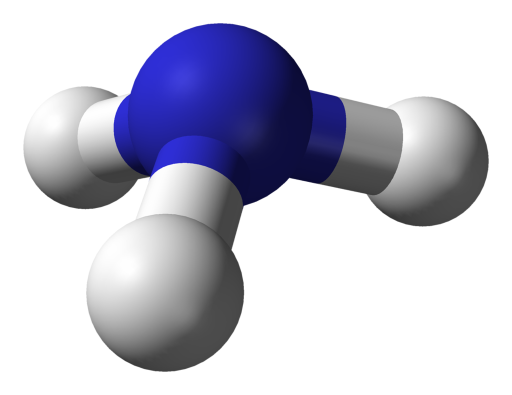

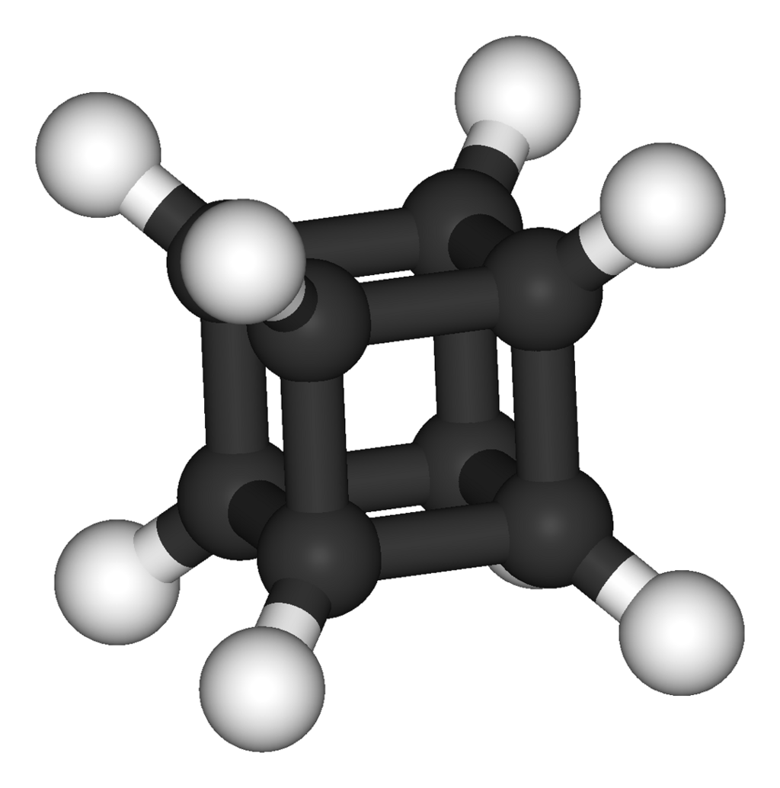

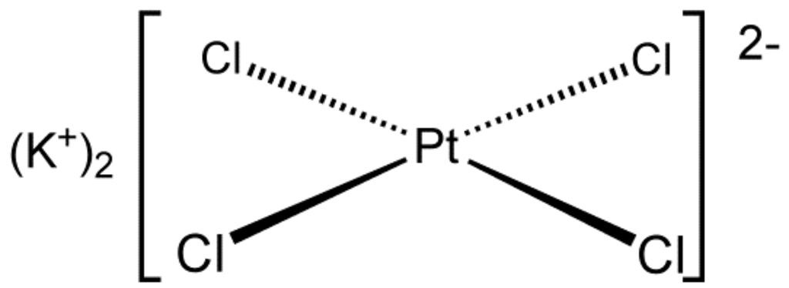

[Buckminsterfullerene](https://en.wikipedia.org/wiki/Buckminsterfullerene "Buckminsterfullerene") displays
[icosahedral symmetry](https://en.wikipedia.org/wiki/Icosahedral_symmetry "Icosahedral symmetry")

[Ammonia](https://en.wikipedia.org/wiki/Ammonia "Ammonia"), NH3. Its symmetry group is of order 6, generated by a 120° rotation and a reflection.

[Cubane](https://en.wikipedia.org/wiki/Cubane "Cubane") C8H8 features
[octahedral symmetry](https://en.wikipedia.org/wiki/Octahedral_symmetry "Octahedral symmetry").

The [tetrachloroplatinate(II)](https://en.wikipedia.org/wiki/Potassium_tetrachloroplatinate "Potassium tetrachloroplatinate") ion, \[PtCl4\]2− exhibits square-planar geometry

Finite symmetry groups such as the [Mathieu groups](https://en.wikipedia.org/wiki/Mathieu_group "Mathieu group") are used in [coding theory](https://en.wikipedia.org/wiki/Coding_theory "Coding theory"), which is in turn applied in [error correction](https://en.wikipedia.org/wiki/Forward_error_correction "Forward error correction") of transmitted data, and in [CD players](https://en.wikipedia.org/wiki/CD_player "CD player"). Another application is [differential Galois theory](https://en.wikipedia.org/wiki/Differential_Galois_theory "Differential Galois theory"), which characterizes functions having [antiderivatives](https://en.wikipedia.org/wiki/Antiderivative "Antiderivative") of a prescribed form, giving group-theoretic criteria for when solutions of certain [differential equations](https://en.wikipedia.org/wiki/Differential_equation "Differential equation") are well-behaved. Geometric properties that remain stable under group actions are investigated in [(geometric)](https://en.wikipedia.org/wiki/Geometric_invariant_theory "Geometric invariant theory") [invariant theory](https://en.wikipedia.org/wiki/Invariant_theory "Invariant theory").

### General linear group and representation theory

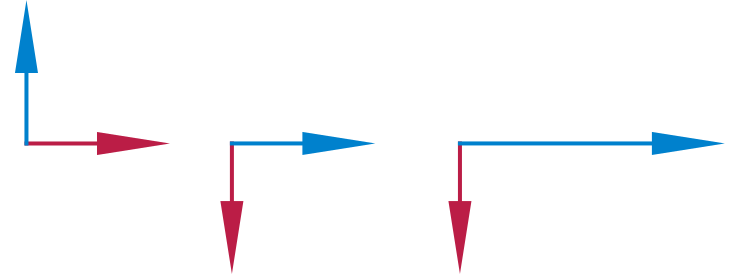Two [vectors](https://en.wikipedia.org/wiki/Vector_\(mathematics\) "Vector (mathematics)") (the left illustration) multiplied by matrices (the middle and right illustrations). The middle illustration represents a clockwise rotation by 90°, while the right-most one stretches the ⁠$x$⁠-coordinate by factor 2.

[Matrix groups](https://en.wikipedia.org/wiki/Matrix_group "Matrix group") consist of [matrices](https://en.wikipedia.org/wiki/Matrix_\(mathematics\) "Matrix (mathematics)") together with [matrix multiplication](https://en.wikipedia.org/wiki/Matrix_multiplication "Matrix multiplication"). The _general linear group_ $\mathrm {GL}(n, \R)$ consists of all [invertible](https://en.wikipedia.org/wiki/Invertible_matrix "Invertible matrix") ⁠$n$⁠-by-⁠$n$⁠ matrices with real entries. Its subgroups are referred to as _matrix groups_ or _[linear groups](https://en.wikipedia.org/wiki/Linear_group "Linear group")_. The dihedral group example mentioned above can be viewed as a (very small) matrix group. Another important matrix group is the [special orthogonal group](https://en.wikipedia.org/wiki/Special_orthogonal_group "Special orthogonal group") ⁠$\mathrm{SO}(n)$⁠. It describes all possible rotations in $n$ dimensions. [Rotation matrices](https://en.wikipedia.org/wiki/Rotation_matrix "Rotation matrix") in this group are used in [computer graphics](https://en.wikipedia.org/wiki/Computer_graphics "Computer graphics").

_Representation theory_ is both an application of the group concept and important for a deeper understanding of groups. It studies the group by its group actions on other spaces. A broad class of [group representations](https://en.wikipedia.org/wiki/Group_representation "Group representation") are linear representations in which the group acts on a vector space, such as the three-dimensional [Euclidean space](https://en.wikipedia.org/wiki/Euclidean_space "Euclidean space") ⁠$\R^3$⁠. A representation of a group $G$ on an $n$-[dimensional](https://en.wikipedia.org/wiki/Dimension "Dimension") real vector space is simply a group homomorphism $\rho : G \to \mathrm {GL}(n, \R)$ from the group to the general linear group. This way, the group operation, which may be abstractly given, translates to the multiplication of matrices making it accessible to explicit computations.

A group action gives further means to study the object being acted on. On the other hand, it also yields information about the group. Group representations are an organizing principle in the theory of finite groups, Lie groups, algebraic groups and [topological groups](https://en.wikipedia.org/wiki/Topological_group "Topological group"), especially (locally) [compact groups](https://en.wikipedia.org/wiki/Compact_group "Compact group").

### Galois groups

_Galois groups_ were developed to help solve polynomial equations by capturing their symmetry features. For example, the solutions of the [quadratic equation](https://en.wikipedia.org/wiki/Quadratic_equation "Quadratic equation") $ax^2+bx+c=0$ are given by $$
x = \frac{-b \pm \sqrt {b^2-4ac}}{2a}.
$$ Each solution can be obtained by replacing the $\pm$ sign by $+$ or ⁠$-$⁠; analogous formulae are known for [cubic](https://en.wikipedia.org/wiki/Cubic_equation "Cubic equation") and [quartic equations](https://en.wikipedia.org/wiki/Quartic_equation "Quartic equation"), but do _not_ exist in general for [degree 5](https://en.wikipedia.org/wiki/Quintic_equation "Quintic equation") and higher. In the [quadratic formula](https://en.wikipedia.org/wiki/Quadratic_formula "Quadratic formula"), changing the sign (permuting the resulting two solutions) can be viewed as a (very simple) group operation. Analogous Galois groups act on the solutions of higher-degree polynomial equations and are closely related to the existence of formulas for their solution. Abstract properties of these groups (in particular their [solvability](https://en.wikipedia.org/wiki/Solvable_group "Solvable group")) give a criterion for the ability to express the solutions of these polynomials using solely addition, multiplication, and [roots](https://en.wikipedia.org/wiki/Nth_root "Nth root") similar to the formula above.

Modern [Galois theory](https://en.wikipedia.org/wiki/Galois_theory "Galois theory") generalizes the above type of Galois groups by shifting to field theory and considering [field extensions](https://en.wikipedia.org/wiki/Field_extension "Field extension") formed as the [splitting field](https://en.wikipedia.org/wiki/Splitting_field "Splitting field") of a polynomial. This theory establishes—via the [fundamental theorem of Galois theory](https://en.wikipedia.org/wiki/Fundamental_theorem_of_Galois_theory "Fundamental theorem of Galois theory")—a precise relationship between fields and groups, underlining once again the ubiquity of groups in mathematics.

## Finite groups

A group is called _finite_ if it has a [finite number of elements](https://en.wikipedia.org/wiki/Finite_set "Finite set"). The number of elements is called the [order](https://en.wikipedia.org/wiki/Order_of_a_group "Order of a group") of the group. An important class is the _[symmetric groups](https://en.wikipedia.org/wiki/Symmetric_group "Symmetric group")_ ⁠$\mathrm{S}_N$⁠, the groups of permutations of $N$ objects. For example, the [symmetric group on 3 letters](https://en.wikipedia.org/wiki/Dihedral_group_of_order_6 "Dihedral group of order 6") $\mathrm{S}_3$ is the group of all possible reorderings of the objects. The three letters ABC can be reordered into ABC, ACB, BAC, BCA, CAB, CBA, forming in total 6 ([factorial](https://en.wikipedia.org/wiki/Factorial "Factorial") of 3) elements. The group operation is composition of these reorderings, and the identity element is the reordering operation that leaves the order unchanged. This class is fundamental insofar as any finite group can be expressed as a subgroup of a symmetric group $\mathrm{S}_N$ for a suitable integer ⁠$N$⁠, according to [Cayley's theorem](https://en.wikipedia.org/wiki/Cayley's_theorem "Cayley's theorem"). Parallel to the group of symmetries of the square above, $\mathrm{S}_3$ can also be interpreted as the group of symmetries of an [equilateral triangle](https://en.wikipedia.org/wiki/Equilateral_triangle "Equilateral triangle").

The order of an element $a$ in a group $G$ is the least positive integer $n$ such that ⁠$a^n=e$⁠, where $a^n$ represents $$
\underbrace{a \cdots a}_{n \text{ factors}},
$$ that is, application of the operation "⁠$\cdot$⁠" to $n$ copies of ⁠$a$⁠. (If "⁠$\cdot$⁠" represents multiplication, then $a^n$ corresponds to the ⁠$n$⁠th power of ⁠$a$⁠.) In infinite groups, such an $n$ may not exist, in which case the order of $a$ is said to be infinity. The order of an element equals the order of the cyclic subgroup generated by this element.

More sophisticated counting techniques, for example, counting cosets, yield more precise statements about finite groups: [Lagrange's Theorem](https://en.wikipedia.org/wiki/Lagrange's_theorem_\(group_theory\) "Lagrange's theorem (group theory)") states that for a finite group $G$ the order of any finite subgroup $H$ [divides](https://en.wikipedia.org/wiki/Divisor "Divisor") the order of ⁠$G$⁠. The [Sylow theorems](https://en.wikipedia.org/wiki/Sylow_theorems "Sylow theorems") give a partial converse.

The dihedral group $\mathrm{D}_4$ of symmetries of a square is a finite group of order 8. In this group, the order of $r_1$ is 4, as is the order of the subgroup $R$ that this element generates. The order of the reflection elements $f_{\mathrm{v}}$ etc. is 2. Both orders divide 8, as predicted by Lagrange's theorem. The groups $\mathbb F_p^\times$ of multiplication modulo a prime $p$ have order ⁠$p-1$⁠.

### Finite abelian groups

Any finite abelian group is isomorphic to a [product](https://en.wikipedia.org/wiki/Direct_product "Direct product") of finite cyclic groups; this statement is part of the [fundamental theorem of finitely generated abelian groups](https://en.wikipedia.org/wiki/Fundamental_theorem_of_finitely_generated_abelian_groups "Fundamental theorem of finitely generated abelian groups").

Any group of prime order $p$ is isomorphic to the cyclic group $\mathrm{Z}_p$ (a consequence of [Lagrange's theorem](https://en.wikipedia.org/wiki/Lagrange's_theorem_\(group_theory\) "Lagrange's theorem (group theory)")). Any group of order $p^2$ is abelian, isomorphic to $\mathrm{Z}_{p^2}$ or ⁠$\mathrm{Z}_p \times \mathrm{Z}_p$⁠. But there exist nonabelian groups of order ⁠$p^3$⁠; the dihedral group $\mathrm{D}_4$ of order $2^3$ above is an example.

### Simple groups

When a group $G$ has a normal subgroup $N$ other than $\{1\}$ and $G$ itself, questions about $G$ can sometimes be reduced to questions about $N$ and ⁠$G/N$⁠. A nontrivial group is called _[simple](https://en.wikipedia.org/wiki/Simple_group "Simple group")_ if it has no such normal subgroup. Finite simple groups are to finite groups as prime numbers are to positive integers: they serve as building blocks, in a sense made precise by the [Jordan–Hölder theorem](https://en.wikipedia.org/wiki/Jordan–Hölder_theorem "Jordan–Hölder theorem").

### Classification of finite simple groups

[Computer algebra systems](https://en.wikipedia.org/wiki/Computer_algebra_system "Computer algebra system") have been used to [list all groups of order up to 2000](https://en.wikipedia.org/wiki/List_of_small_groups "List of small groups"). But [classifying](https://en.wikipedia.org/wiki/Classification_theorems "Classification theorems") all finite groups is a problem considered too hard to be solved.

> The axioms for a group are short and natural ... Yet somehow hidden behind these axioms is the [monster simple group](https://en.wikipedia.org/wiki/Monster_group "Monster group"), a huge and extraordinary mathematical object, which appears to rely on numerous bizarre coincidences to exist. The axioms for groups give no obvious hint that anything like this exists.

— [Richard Borcherds](https://en.wikipedia.org/wiki/Richard_Borcherds "Richard Borcherds"), _Mathematicians: An Outer View of the Inner World_

The classification of all finite _simple_ groups was a major achievement in contemporary group theory. There are [several infinite families](https://en.wikipedia.org/wiki/List_of_finite_simple_groups "List of finite simple groups") of such groups, as well as 26 "[sporadic groups](https://en.wikipedia.org/wiki/Sporadic_groups "Sporadic groups")" that do not belong to any of the families. The largest [sporadic group](https://en.wikipedia.org/wiki/Sporadic_group "Sporadic group") is called the [monster group](https://en.wikipedia.org/wiki/Monster_group "Monster group"). The [monstrous moonshine](https://en.wikipedia.org/wiki/Monstrous_moonshine "Monstrous moonshine") conjectures, proved by [Richard Borcherds](https://en.wikipedia.org/wiki/Richard_Borcherds "Richard Borcherds"), relate the monster group to certain [modular functions](https://en.wikipedia.org/wiki/Modular_function "Modular function").

The gap between the classification of simple groups and the classification of all groups lies in the [extension problem](https://en.wikipedia.org/wiki/Extension_problem "Extension problem").

## Groups with additional structure

An equivalent definition of group consists of replacing the "there exist" part of the group axioms by operations whose result is the element that must exist. So, a group is a set $G$ equipped with a binary operation $G \times G \rightarrow G$ (the group operation), a [unary operation](https://en.wikipedia.org/wiki/Unary_operation "Unary operation") $G \rightarrow G$ (which provides the inverse) and a [nullary operation](https://en.wikipedia.org/wiki/Nullary_operation "Nullary operation"), which has no operand and results in the identity element. Otherwise, the group axioms are exactly the same. This variant of the definition avoids [existential quantifiers](https://en.wikipedia.org/wiki/Existential_quantifier "Existential quantifier") and is used in computing with groups and for [computer-aided proofs](https://en.wikipedia.org/wiki/Computer-aided_proof "Computer-aided proof").

This way of defining groups lends itself to generalizations such as the notion of [group object](https://en.wikipedia.org/wiki/Group_object "Group object") in a category. Briefly, this is an object with [morphisms](https://en.wikipedia.org/wiki/Morphism "Morphism") that mimic the group axioms.

### Topological groups

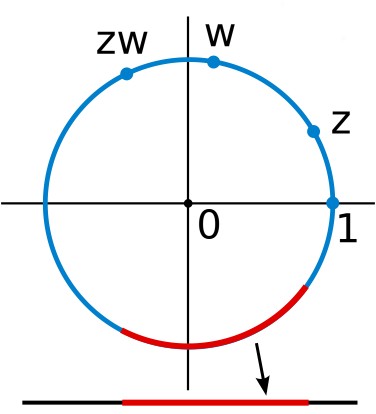The [unit circle](https://en.wikipedia.org/wiki/Unit_circle "Unit circle") in the [complex plane](https://en.wikipedia.org/wiki/Complex_plane "Complex plane") under complex multiplication is a Lie group and, therefore, a topological group. It is topological since complex multiplication and division are continuous. It is a manifold and thus a Lie group, because every [small piece](https://en.wikipedia.org/wiki/Neighbourhood_\(mathematics\) "Neighbourhood (mathematics)"), such as the red arc in the figure, looks like a part of the [real line](https://en.wikipedia.org/wiki/Real_line "Real line") (shown at the bottom).

Some [topological spaces](https://en.wikipedia.org/wiki/Topological_space "Topological space") may be endowed with a group law. In order for the group law and the topology to interweave well, the group operations must be continuous functions; informally, $g \cdot h$ and $g^{-1}$ must not vary wildly if $g$ and $h$ vary only a little. Such groups are called _topological groups,_ and they are the group objects in the [category of topological spaces](https://en.wikipedia.org/wiki/Category_of_topological_spaces "Category of topological spaces"). The most basic examples are the group of real numbers under addition and the group of nonzero real numbers under multiplication. Similar examples can be formed from any other [topological field](https://en.wikipedia.org/wiki/Topological_field "Topological field"), such as the field of complex numbers or the field of [_p_-adic numbers](https://en.wikipedia.org/wiki/P-adic_number "P-adic number"). These examples are [locally compact](https://en.wikipedia.org/wiki/Locally_compact_topological_group "Locally compact topological group"), so they have [Haar measures](https://en.wikipedia.org/wiki/Haar_measure "Haar measure") and can be studied via [harmonic analysis](https://en.wikipedia.org/wiki/Harmonic_analysis "Harmonic analysis"). Other locally compact topological groups include the group of points of an algebraic group over a [local field](https://en.wikipedia.org/wiki/Local_field "Local field") or [adele ring](https://en.wikipedia.org/wiki/Adele_ring "Adele ring"); these are basic to number theory Galois groups of infinite algebraic field extensions are equipped with the [Krull topology](https://en.wikipedia.org/wiki/Krull_topology "Krull topology"), which plays a role in [infinite Galois theory](https://en.wikipedia.org/wiki/Fundamental_theorem_of_Galois_theory#Infinite_case "Fundamental theorem of Galois theory"). A generalization used in algebraic geometry is the [étale fundamental group](https://en.wikipedia.org/wiki/Étale_fundamental_group "Étale fundamental group").

### Lie groups

A _Lie group_ is a group that also has the structure of a [differentiable manifold](https://en.wikipedia.org/wiki/Differentiable_manifold "Differentiable manifold"); informally, this means that it [looks locally like](https://en.wikipedia.org/wiki/Diffeomorphism "Diffeomorphism") a Euclidean space of some fixed dimension. Again, the definition requires the additional structure, here the manifold structure, to be compatible: the multiplication and inverse maps are required to be [smooth](https://en.wikipedia.org/wiki/Smooth_map "Smooth map").

A standard example is the general linear group introduced above: it is an [open subset](https://en.wikipedia.org/wiki/Open_subset "Open subset") of the space of all $n$-by-$n$ matrices, because it is given by the inequality $$
\det (A) \ne 0,
$$ where $A$ denotes an $n$-by-$n$ matrix.

Lie groups are of fundamental importance in modern physics: [Noether's theorem](https://en.wikipedia.org/wiki/Noether's_theorem "Noether's theorem") links continuous symmetries to [conserved quantities](https://en.wikipedia.org/wiki/Conserved_quantities "Conserved quantities"). [Rotation](https://en.wikipedia.org/wiki/Rotation "Rotation"), as well as translations in [space](https://en.wikipedia.org/wiki/Space "Space") and [time](https://en.wikipedia.org/wiki/Time "Time"), are basic symmetries of the laws of [mechanics](https://en.wikipedia.org/wiki/Mechanics "Mechanics"). They can, for instance, be used to construct simple models—imposing, say, axial symmetry on a situation will typically lead to significant simplification in the equations one needs to solve to provide a physical description. Another example is the group of [Lorentz transformations](https://en.wikipedia.org/wiki/Lorentz_transformation "Lorentz transformation"), which relate measurements of time and velocity of two observers in motion relative to each other. They can be deduced in a purely group-theoretical way, by expressing the transformations as a rotational symmetry of [Minkowski space](https://en.wikipedia.org/wiki/Minkowski_space "Minkowski space"). The latter serves—in the absence of significant [gravitation](https://en.wikipedia.org/wiki/Gravitation "Gravitation")—as a model of [spacetime](https://en.wikipedia.org/wiki/Spacetime "Spacetime") in [special relativity](https://en.wikipedia.org/wiki/Special_relativity "Special relativity"). The full symmetry group of Minkowski space, i.e., including translations, is known as the [Poincaré group](https://en.wikipedia.org/wiki/Poincaré_group "Poincaré group"). By the above, it plays a pivotal role in special relativity and, by implication, for [quantum field theories](https://en.wikipedia.org/wiki/Quantum_field_theories "Quantum field theories"). [Symmetries that vary with location](https://en.wikipedia.org/wiki/Local_symmetry "Local symmetry") are central to the modern description of physical interactions with the help of [gauge theory](https://en.wikipedia.org/wiki/Gauge_theory "Gauge theory"). An important example of a gauge theory is the [Standard Model](https://en.wikipedia.org/wiki/Standard_Model "Standard Model"), which describes three of the four known [fundamental forces](https://en.wikipedia.org/wiki/Fundamental_force "Fundamental force") and classifies all known [elementary particles](https://en.wikipedia.org/wiki/Elementary_particle "Elementary particle").

## Generalizations

Group-like structures

[Total](https://en.wikipedia.org/wiki/Total_function "Total function")[Associative](https://en.wikipedia.org/wiki/Associative_property "Associative property")[Identity](https://en.wikipedia.org/wiki/Identity_element "Identity element")[Divisible](https://en.wikipedia.org/wiki/Quasigroup "Quasigroup")

[Partial magma](https://en.wikipedia.org/wiki/Partial_groupoid "Partial groupoid")

Unneeded

Unneeded

Unneeded

Unneeded

[Semigroupoid](https://en.wikipedia.org/wiki/Semigroupoid "Semigroupoid")

Unneeded

Required

Unneeded

Unneeded

[Small category](https://en.wikipedia.org/wiki/Category_\(mathematics\) "Category (mathematics)")

Unneeded

Required

Required

Unneeded

[Groupoid](https://en.wikipedia.org/wiki/Groupoid "Groupoid")

Unneeded

Required

Required

Required

[Magma](https://en.wikipedia.org/wiki/Magma_\(algebra\) "Magma (algebra)")

Required

Unneeded

Unneeded

Unneeded

[Quasigroup](https://en.wikipedia.org/wiki/Quasigroup "Quasigroup")

Required

Unneeded

Unneeded

Required

[Unital magma](https://en.wikipedia.org/wiki/Unital_magma "Unital magma")

Required

Unneeded

Required

Unneeded

[Loop](https://en.wikipedia.org/wiki/Loop_\(algebra\) "Loop (algebra)")

Required

Unneeded

Required

Required

[Semigroup](https://en.wikipedia.org/wiki/Semigroup "Semigroup")

Required

Required

Unneeded

Unneeded

Associative [quasigroup](https://en.wikipedia.org/wiki/Quasigroup "Quasigroup")

Required

Required

Unneeded

Required

[Monoid](https://en.wikipedia.org/wiki/Monoid "Monoid")

Required

Required

Required

Unneeded

[Group](/source/group-mathematics/)

Required

Required

Required

Required

More general structures may be defined by relaxing some of the axioms defining a group. The table gives a list of several structures generalizing groups.

For example, if the requirement that every element has an inverse is eliminated, the resulting algebraic structure is called a [monoid](https://en.wikipedia.org/wiki/Monoid "Monoid"). The [natural numbers](https://en.wikipedia.org/wiki/Natural_number "Natural number") $\mathbb N$ (including zero) under addition form a monoid, as do the nonzero integers under multiplication ⁠$(\Z \smallsetminus \{0\}, \cdot)$⁠. Adjoining inverses of all elements of the monoid $(\Z \smallsetminus \{0\}, \cdot)$ produces a group ⁠$(\Q \smallsetminus \{0 \}, \cdot)$⁠, and likewise adjoining inverses to any (abelian) monoid ⁠$M$⁠ produces a group known as the [Grothendieck group](https://en.wikipedia.org/wiki/Grothendieck_group "Grothendieck group") of ⁠$M$⁠.

A group can be thought of as a [small category](https://en.wikipedia.org/wiki/Small_category "Small category") with one object ⁠$x$⁠ in which every morphism is an isomorphism: given such a category, the set $\operatorname{Hom}(x,x)$ is a group; conversely, given a group ⁠$G$⁠, one can build a small category with one object ⁠$x$⁠ in which ⁠$\operatorname{Hom}(x,x) \simeq G$⁠. More generally, a [groupoid](https://en.wikipedia.org/wiki/Groupoid "Groupoid") is any small category in which every morphism is an isomorphism. In a groupoid, the set of all morphisms in the category is usually not a group, because the composition is only partially defined: ⁠$fg$⁠ is defined only when the source of ⁠$f$⁠ matches the target of ⁠$g$⁠. Groupoids arise in topology (for instance, the [fundamental groupoid](https://en.wikipedia.org/wiki/Fundamental_groupoid "Fundamental groupoid")) and in the theory of [stacks](https://en.wikipedia.org/wiki/Stack_\(mathematics\) "Stack (mathematics)").

Finally, it is possible to generalize any of these concepts by replacing the binary operation with an [n-ary](https://en.wikipedia.org/wiki/Arity "Arity") operation (i.e., an operation taking n arguments, for some nonnegative integer n). With the proper generalization of the group axioms, this gives a notion of [n-ary group](https://en.wikipedia.org/wiki/N-ary_group "N-ary group").

Examples

Set [Natural numbers](https://en.wikipedia.org/wiki/Natural_number "Natural number")
⁠$\N$⁠ [Integers](https://en.wikipedia.org/wiki/Integer "Integer")
⁠$\Z$⁠ [Rational numbers](https://en.wikipedia.org/wiki/Rational_number "Rational number") ⁠$\Q$⁠
[Real numbers](https://en.wikipedia.org/wiki/Real_number "Real number") ⁠$\R$⁠
[Complex numbers](https://en.wikipedia.org/wiki/Complex_number "Complex number") ⁠$\C$⁠ [Integers modulo 3](https://en.wikipedia.org/wiki/Integers_modulo_n "Integers modulo n")
⁠$\Z / n\Z = \{0, 1, 2\}$⁠

Operation + × + × + − × ÷ + ×

[Total](https://en.wikipedia.org/wiki/Total_function "Total function")

yes

yes

yes

yes

yes

yes

yes

no

yes

yes

Identity

yes

yes

yes

yes

yes

no

yes

no

yes

yes

Inverse

no

no

yes

no

yes

no

only if ⁠$a \ne 0$⁠

no

yes

only if ⁠$a \ne 0$⁠

Divisibility

no

no

yes

no

yes

yes

only if ⁠$a \ne 0$⁠

only if ⁠$a \ne 0$⁠

yes

no

Associative

yes

yes

yes

yes

yes

no

yes

no

yes

yes

Commutative

yes

yes

yes

yes

yes

no

yes

no

yes

yes

Structure

[monoid](https://en.wikipedia.org/wiki/Monoid "Monoid")

[monoid](https://en.wikipedia.org/wiki/Monoid "Monoid")

[abelian group](https://en.wikipedia.org/wiki/Abelian_group "Abelian group")

[monoid](https://en.wikipedia.org/wiki/Monoid "Monoid")

[abelian group](https://en.wikipedia.org/wiki/Abelian_group "Abelian group")

[quasigroup](https://en.wikipedia.org/wiki/Quasigroup "Quasigroup")

[monoid](https://en.wikipedia.org/wiki/Monoid "Monoid")

[quasigroup](https://en.wikipedia.org/wiki/Quasigroup "Quasigroup")
(with 0 removed)

[abelian group](https://en.wikipedia.org/wiki/Abelian_group "Abelian group")

[monoid](https://en.wikipedia.org/wiki/Monoid "Monoid")
