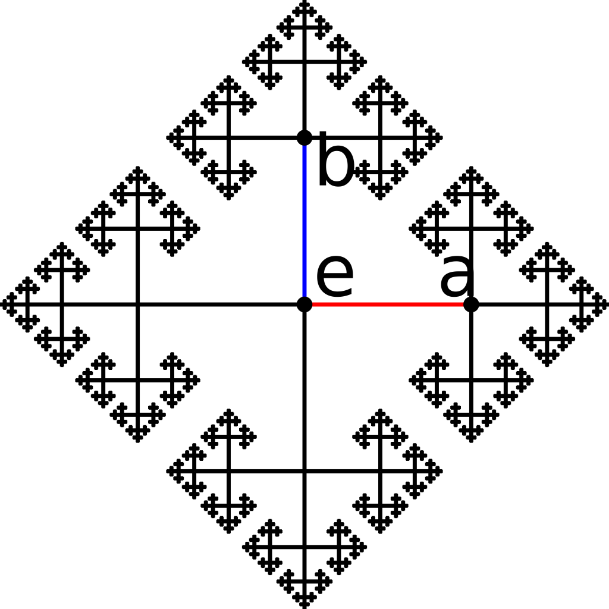
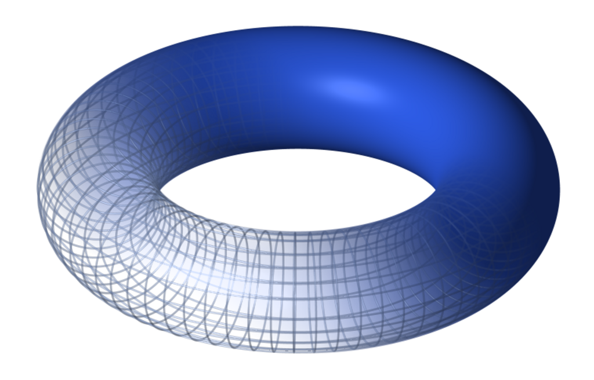
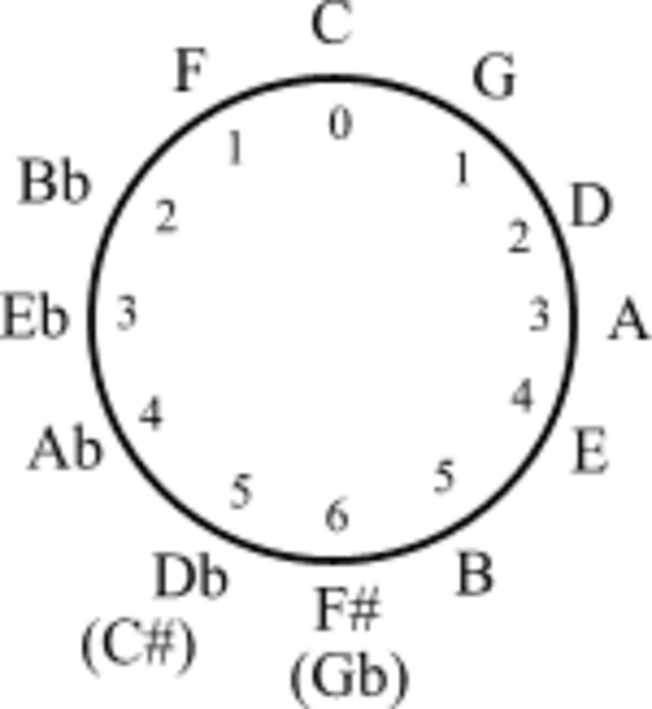
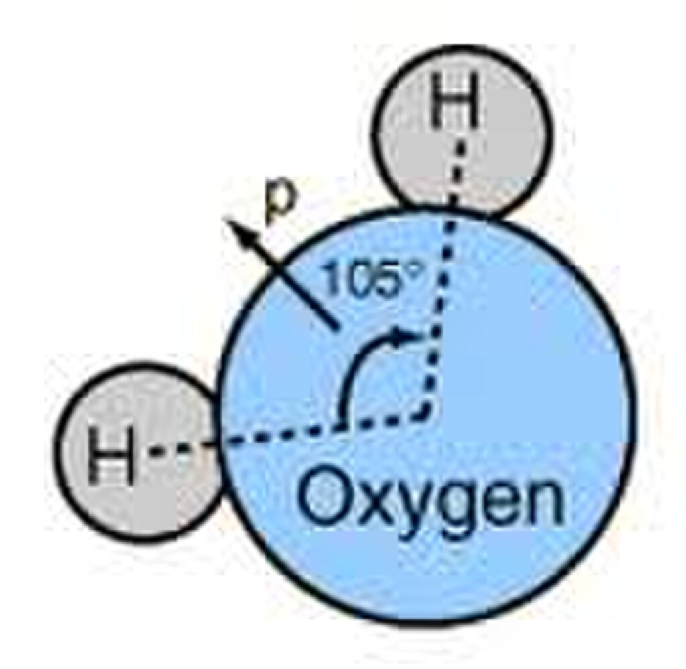
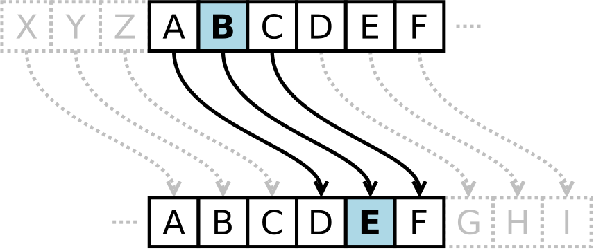

The popular [Rubik's Cube](https://en.wikipedia.org/wiki/Rubik's_Cube "Rubik's Cube") puzzle, invented in 1974 by [Ernő Rubik](https://en.wikipedia.org/wiki/Ernő_Rubik "Ernő Rubik"), has been used as an illustration of [permutation groups](https://en.wikipedia.org/wiki/Permutation_group "Permutation group"). See [Rubik's Cube group](https://en.wikipedia.org/wiki/Rubik's_Cube_group "Rubik's Cube group").

In [abstract algebra](/source/abstract-algebra/ "Abstract algebra"), **group theory** studies the [algebraic structures](/source/algebraic-structure/ "Algebraic structure") known as [groups](/source/group-mathematics/ "Group (mathematics)"). The concept of a group is central to abstract algebra: other well-known algebraic structures, such as [rings](https://en.wikipedia.org/wiki/Ring_\(mathematics\) "Ring (mathematics)"), [fields](https://en.wikipedia.org/wiki/Field_\(mathematics\) "Field (mathematics)"), and [vector spaces](https://en.wikipedia.org/wiki/Vector_space "Vector space"), can all be seen as groups endowed with additional [operations](https://en.wikipedia.org/wiki/Operation_\(mathematics\) "Operation (mathematics)") and [axioms](https://en.wikipedia.org/wiki/Axiom "Axiom"). Groups recur throughout mathematics, and the methods of group theory have influenced many parts of algebra. [Linear algebraic groups](https://en.wikipedia.org/wiki/Linear_algebraic_group "Linear algebraic group") and [Lie groups](https://en.wikipedia.org/wiki/Lie_group "Lie group") are two branches of group theory that have experienced advances and have become subject areas in their own right.

Various physical systems, such as [crystals](https://en.wikipedia.org/wiki/Crystal "Crystal") and the [hydrogen atom](https://en.wikipedia.org/wiki/Hydrogen_atom "Hydrogen atom"), and [three of the four](https://en.wikipedia.org/wiki/Standard_Model "Standard Model") known fundamental forces in the universe, may be modelled by [symmetry groups](https://en.wikipedia.org/wiki/Symmetry_group "Symmetry group"). Thus group theory and the closely related [representation theory](https://en.wikipedia.org/wiki/Representation_theory "Representation theory") have many important applications in [physics](/source/physics/ "Physics"), [chemistry](https://en.wikipedia.org/wiki/Chemistry "Chemistry"), and [materials science](https://en.wikipedia.org/wiki/Materials_science "Materials science"). Group theory is also central to [public key cryptography](https://en.wikipedia.org/wiki/Public_key_cryptography "Public key cryptography").

The early [history of group theory](/source/history-of-group-theory/ "History of group theory") dates from the 19th century. One of the most important mathematical achievements of the 20th century was the collaborative effort, taking up more than 10,000 journal pages and mostly published between 1960 and 2004, that culminated in a complete [classification of finite simple groups](https://en.wikipedia.org/wiki/Classification_of_finite_simple_groups "Classification of finite simple groups").

## History

Group theory has three main historical sources: [number theory](https://en.wikipedia.org/wiki/Number_theory "Number theory"), the theory of [algebraic equations](https://en.wikipedia.org/wiki/Algebraic_equation "Algebraic equation"), and [geometry](https://en.wikipedia.org/wiki/Geometry "Geometry"). The number-theoretic strand was begun by [Leonhard Euler](https://en.wikipedia.org/wiki/Leonhard_Euler "Leonhard Euler"), and developed by [Gauss's](https://en.wikipedia.org/wiki/Carl_Friedrich_Gauss "Carl Friedrich Gauss") work on [modular arithmetic](https://en.wikipedia.org/wiki/Modular_arithmetic "Modular arithmetic") and additive and multiplicative groups related to [quadratic fields](https://en.wikipedia.org/wiki/Quadratic_field "Quadratic field"). Early results about permutation groups were obtained by [Lagrange](https://en.wikipedia.org/wiki/Joseph_Louis_Lagrange "Joseph Louis Lagrange"), [Ruffini](https://en.wikipedia.org/wiki/Paolo_Ruffini_\(mathematician\) "Paolo Ruffini (mathematician)"), and [Abel](https://en.wikipedia.org/wiki/Niels_Henrik_Abel "Niels Henrik Abel") in their quest for general solutions of polynomial equations of high degree. [Évariste Galois](https://en.wikipedia.org/wiki/Évariste_Galois "Évariste Galois") coined the term "group" and established a connection, now known as [Galois theory](https://en.wikipedia.org/wiki/Galois_theory "Galois theory"), between the nascent theory of groups and [field theory](https://en.wikipedia.org/wiki/Field_theory_\(mathematics\) "Field theory (mathematics)"). In geometry, groups first became important in [projective geometry](https://en.wikipedia.org/wiki/Projective_geometry "Projective geometry") and, later, [non-Euclidean geometry](https://en.wikipedia.org/wiki/Non-Euclidean_geometry "Non-Euclidean geometry"). [Felix Klein](https://en.wikipedia.org/wiki/Felix_Klein "Felix Klein")'s [Erlangen program](https://en.wikipedia.org/wiki/Erlangen_program "Erlangen program") proclaimed group theory to be the organizing principle of geometry.

[Galois](https://en.wikipedia.org/wiki/Évariste_Galois "Évariste Galois"), in the 1830s, was the first to employ groups to determine the solvability of [polynomial equations](https://en.wikipedia.org/wiki/Polynomial_equation "Polynomial equation"). [Arthur Cayley](https://en.wikipedia.org/wiki/Arthur_Cayley "Arthur Cayley") and [Augustin Louis Cauchy](https://en.wikipedia.org/wiki/Augustin_Louis_Cauchy "Augustin Louis Cauchy") pushed these investigations further by creating the theory of permutation groups. The second historical source for groups stems from [geometrical](https://en.wikipedia.org/wiki/Geometry "Geometry") situations. In an attempt to come to grips with possible geometries (such as [euclidean](https://en.wikipedia.org/wiki/Euclidean_geometry "Euclidean geometry"), [hyperbolic](https://en.wikipedia.org/wiki/Hyperbolic_geometry "Hyperbolic geometry") or [projective geometry](https://en.wikipedia.org/wiki/Projective_geometry "Projective geometry")) using group theory, [Felix Klein](https://en.wikipedia.org/wiki/Felix_Klein "Felix Klein") initiated the [Erlangen programme](https://en.wikipedia.org/wiki/Erlangen_programme "Erlangen programme"). [Sophus Lie](https://en.wikipedia.org/wiki/Sophus_Lie "Sophus Lie"), in 1884, started using groups (now called [Lie groups](https://en.wikipedia.org/wiki/Lie_group "Lie group")) attached to [analytic](https://en.wikipedia.org/wiki/Analysis_\(mathematics\) "Analysis (mathematics)") problems. Thirdly, groups were, at first implicitly and later explicitly, used in [algebraic number theory](https://en.wikipedia.org/wiki/Algebraic_number_theory "Algebraic number theory").

The different scope of these early sources resulted in different notions of groups. The theory of groups was unified starting around 1880. Since then, the impact of group theory has been ever growing, giving rise to the birth of [abstract algebra](/source/abstract-algebra/ "Abstract algebra") in the early 20th century, [representation theory](https://en.wikipedia.org/wiki/Representation_theory "Representation theory"), and many more influential spin-off domains. The [classification of finite simple groups](https://en.wikipedia.org/wiki/Classification_of_finite_simple_groups "Classification of finite simple groups") is a vast body of work from the mid 20th century, classifying all the [finite](https://en.wikipedia.org/wiki/Finite_set "Finite set") [simple groups](https://en.wikipedia.org/wiki/Simple_group "Simple group").

## Main classes of groups

The range of groups being considered has gradually expanded from finite permutation groups and special examples of [matrix groups](https://en.wikipedia.org/wiki/Matrix_group "Matrix group") to abstract groups that may be specified through a [presentation](https://en.wikipedia.org/wiki/Presentation_of_a_group "Presentation of a group") by [generators](https://en.wikipedia.org/wiki/Generating_set_of_a_group "Generating set of a group") and [relations](https://en.wikipedia.org/wiki/Binary_relation "Binary relation").

### Permutation groups

The first [class](https://en.wikipedia.org/wiki/Class_\(set_theory\) "Class (set theory)") of groups to undergo a systematic study was [permutation groups](https://en.wikipedia.org/wiki/Permutation_group "Permutation group"). Given any set _X_ and a collection _G_ of [bijections](https://en.wikipedia.org/wiki/Bijection "Bijection") of _X_ into itself (known as _permutations_) that is closed under compositions and inverses, _G_ is a group [acting](https://en.wikipedia.org/wiki/Group_action_\(mathematics\) "Group action (mathematics)") on _X_. If _X_ consists of _n_ elements and _G_ consists of _all_ permutations, _G_ is the [symmetric group](https://en.wikipedia.org/wiki/Symmetric_group "Symmetric group") S_n_; in general, any permutation group _G_ is a [subgroup](https://en.wikipedia.org/wiki/Subgroup "Subgroup") of the symmetric group of _X_. An early construction due to [Cayley](https://en.wikipedia.org/wiki/Arthur_Cayley "Arthur Cayley") exhibited any group as a permutation group, acting on itself (_X_ = _G_) by means of the left [regular representation](https://en.wikipedia.org/wiki/Regular_representation "Regular representation").

In many cases, the structure of a permutation group can be studied using the properties of its action on the corresponding set. For example, in this way one proves that for _n_ ≥ 5, the [alternating group](https://en.wikipedia.org/wiki/Alternating_group "Alternating group") A_n_ is [simple](https://en.wikipedia.org/wiki/Simple_group "Simple group"), i.e. does not admit any proper [normal subgroups](https://en.wikipedia.org/wiki/Normal_subgroup "Normal subgroup"). This fact plays a key role in the [impossibility of solving a general algebraic equation of degree _n_ ≥ 5 in radicals](https://en.wikipedia.org/wiki/Abel–Ruffini_theorem "Abel–Ruffini theorem").

### Matrix groups

The next important class of groups is given by _matrix groups_, or [linear groups](https://en.wikipedia.org/wiki/Linear_group "Linear group"). Here _G_ is a set consisting of invertible [matrices](https://en.wikipedia.org/wiki/Matrix_\(mathematics\) "Matrix (mathematics)") of given order _n_ over a [field](https://en.wikipedia.org/wiki/Field_\(mathematics\) "Field (mathematics)") _K_ that is closed under the products and inverses. Such a group acts on the _n_-dimensional vector space _K__n_ by [linear transformations](https://en.wikipedia.org/wiki/Linear_transformation "Linear transformation"). This action makes matrix groups conceptually similar to permutation groups, and the geometry of the action may be usefully exploited to establish properties of the group _G_.

### Transformation groups

Permutation groups and matrix groups are special cases of [transformation groups](https://en.wikipedia.org/wiki/Transformation_group "Transformation group"): groups that act on a certain space _X_ preserving its inherent structure. In the case of permutation groups, _X_ is a set; for matrix groups, _X_ is a [vector space](https://en.wikipedia.org/wiki/Vector_space "Vector space"). The concept of a transformation group is closely related with the concept of a [symmetry group](https://en.wikipedia.org/wiki/Symmetry_group "Symmetry group"): transformation groups frequently consist of _all_ transformations that preserve a certain structure.

The theory of transformation groups forms a bridge connecting group theory with [differential geometry](https://en.wikipedia.org/wiki/Differential_geometry "Differential geometry"). A long line of research, originating with [Lie](https://en.wikipedia.org/wiki/Sophus_Lie "Sophus Lie") and [Klein](https://en.wikipedia.org/wiki/Felix_Klein "Felix Klein"), considers group actions on [manifolds](https://en.wikipedia.org/wiki/Manifold "Manifold") by [homeomorphisms](https://en.wikipedia.org/wiki/Homeomorphism "Homeomorphism") or [diffeomorphisms](https://en.wikipedia.org/wiki/Diffeomorphism "Diffeomorphism"). The groups themselves may be [discrete](https://en.wikipedia.org/wiki/Discrete_group "Discrete group") or [continuous](https://en.wikipedia.org/wiki/Continuous_group "Continuous group").

### Abstract groups

Most groups considered in the first stage of the development of group theory were "concrete", having been realized through numbers, permutations, or matrices. It was not until the late nineteenth century that the idea of an **abstract group** began to take hold, where "abstract" means that the nature of the elements are ignored in such a way that two [isomorphic groups](https://en.wikipedia.org/wiki/Group_isomorphism "Group isomorphism") are considered as the same group. A typical way of specifying an abstract group is through a [presentation](https://en.wikipedia.org/wiki/Presentation_of_a_group "Presentation of a group") by _generators and relations_,

: $G = \langle S|R\rangle.$

A significant source of abstract groups is given by the construction of a _factor group_, or [quotient group](https://en.wikipedia.org/wiki/Quotient_group "Quotient group"), _G_/_H_, of a group _G_ by a [normal subgroup](https://en.wikipedia.org/wiki/Normal_subgroup "Normal subgroup") _H_. [Class groups](https://en.wikipedia.org/wiki/Class_group "Class group") of [algebraic number fields](https://en.wikipedia.org/wiki/Algebraic_number_field "Algebraic number field") were among the earliest examples of factor groups, of much interest in [number theory](https://en.wikipedia.org/wiki/Number_theory "Number theory"). If a group _G_ is a permutation group on a set _X_, the factor group _G_/_H_ is no longer acting on _X_; but the idea of an abstract group permits one not to worry about this discrepancy.

The change of perspective from concrete to abstract groups makes it natural to consider properties of groups that are independent of a particular realization, or in modern language, invariant under [isomorphism](https://en.wikipedia.org/wiki/Isomorphism "Isomorphism"), as well as the classes of group with a given such property: [finite groups](https://en.wikipedia.org/wiki/Finite_group "Finite group"), [periodic groups](https://en.wikipedia.org/wiki/Periodic_group "Periodic group"), [simple groups](https://en.wikipedia.org/wiki/Simple_group "Simple group"), [solvable groups](https://en.wikipedia.org/wiki/Solvable_group "Solvable group"), and so on. Rather than exploring properties of an individual group, one seeks to establish results that apply to a whole class of groups. The new paradigm was of paramount importance for the development of mathematics: it foreshadowed the creation of [abstract algebra](/source/abstract-algebra/ "Abstract algebra") in the works of [Hilbert](https://en.wikipedia.org/wiki/David_Hilbert "David Hilbert"), [Emil Artin](https://en.wikipedia.org/wiki/Emil_Artin "Emil Artin"), [Emmy Noether](https://en.wikipedia.org/wiki/Emmy_Noether "Emmy Noether"), and mathematicians of their school.

### Groups with additional structure

An important elaboration of the concept of a group occurs if _G_ is endowed with additional structure, notably, of a [topological space](https://en.wikipedia.org/wiki/Topological_space "Topological space"), [differentiable manifold](https://en.wikipedia.org/wiki/Differentiable_manifold "Differentiable manifold"), or [algebraic variety](https://en.wikipedia.org/wiki/Algebraic_variety "Algebraic variety"). If the multiplication and inversion of the group are compatible with this structure, that is, they are [continuous](https://en.wikipedia.org/wiki/Continuous_map "Continuous map"), [smooth](https://en.wikipedia.org/wiki/Smooth_map "Smooth map") or [regular](https://en.wikipedia.org/wiki/Regular_map_\(algebraic_geometry\) "Regular map (algebraic geometry)") (in the sense of algebraic geometry) maps, then _G_ is a [topological group](https://en.wikipedia.org/wiki/Topological_group "Topological group"), a [Lie group](https://en.wikipedia.org/wiki/Lie_group "Lie group"), or an [algebraic group](https://en.wikipedia.org/wiki/Algebraic_group "Algebraic group").

The presence of extra structure relates these types of groups with other mathematical disciplines and means that more tools are available in their study. Topological groups form a natural domain for [abstract harmonic analysis](https://en.wikipedia.org/wiki/Abstract_harmonic_analysis "Abstract harmonic analysis"), whereas [Lie groups](https://en.wikipedia.org/wiki/Lie_group "Lie group") (frequently realized as transformation groups) are the mainstays of [differential geometry](https://en.wikipedia.org/wiki/Differential_geometry "Differential geometry") and unitary [representation theory](https://en.wikipedia.org/wiki/Representation_theory "Representation theory"). Certain classification questions that cannot be solved in general can be approached and resolved for special subclasses of groups. Thus, [compact connected Lie groups](https://en.wikipedia.org/wiki/Compact_Lie_group "Compact Lie group") have been completely classified. There is a fruitful relation between infinite abstract groups and topological groups: whenever a group _Γ_ can be realized as a [lattice](https://en.wikipedia.org/wiki/Lattice_\(discrete_subgroup\) "Lattice (discrete subgroup)") in a topological group _G_, the geometry and analysis pertaining to _G_ yield important results about _Γ_. A comparatively recent trend in the theory of finite groups exploits their connections with compact topological groups ([profinite groups](https://en.wikipedia.org/wiki/Profinite_group "Profinite group")): for example, a single [_p_-adic analytic group](https://en.wikipedia.org/wiki/Powerful_p-group "Powerful p-group") _G_ has a family of quotients which are finite [_p_-groups](https://en.wikipedia.org/wiki/P-group "P-group") of various orders, and properties of _G_ translate into the properties of its finite quotients.

## Branches of group theory

### Finite group theory

During the twentieth century, mathematicians investigated some aspects of the theory of finite groups in great depth, especially the [local theory](https://en.wikipedia.org/wiki/Local_analysis "Local analysis") of finite groups and the theory of [solvable](https://en.wikipedia.org/wiki/Solvable_group "Solvable group") and [nilpotent groups](https://en.wikipedia.org/wiki/Nilpotent_group "Nilpotent group"). As a consequence, the complete [classification of finite simple groups](https://en.wikipedia.org/wiki/Classification_of_finite_simple_groups "Classification of finite simple groups") was achieved, meaning that all those [simple groups](https://en.wikipedia.org/wiki/Simple_group "Simple group") from which all finite groups can be built are now known.

During the second half of the twentieth century, mathematicians such as [Chevalley](https://en.wikipedia.org/wiki/Claude_Chevalley "Claude Chevalley") and [Steinberg](https://en.wikipedia.org/wiki/Robert_Steinberg "Robert Steinberg") also increased our understanding of finite analogs of [classical groups](https://en.wikipedia.org/wiki/Classical_group "Classical group"), and other related groups. One such family of groups is the family of [general linear groups](https://en.wikipedia.org/wiki/General_linear_group "General linear group") over [finite fields](https://en.wikipedia.org/wiki/Finite_field "Finite field"). Finite groups often occur when considering [symmetry](https://en.wikipedia.org/wiki/Symmetry "Symmetry") of mathematical or physical objects, when those objects admit just a finite number of structure-preserving transformations. The theory of [Lie groups](https://en.wikipedia.org/wiki/Lie_group "Lie group"), which may be viewed as dealing with "[continuous symmetry](https://en.wikipedia.org/wiki/Continuous_symmetry "Continuous symmetry")", is strongly influenced by the associated [Weyl groups](https://en.wikipedia.org/wiki/Weyl_group "Weyl group"). These are finite groups generated by reflections which act on a finite-dimensional [Euclidean space](https://en.wikipedia.org/wiki/Euclidean_space "Euclidean space"). The properties of finite groups can thus play a role in subjects such as [theoretical physics](https://en.wikipedia.org/wiki/Theoretical_physics "Theoretical physics") and [chemistry](https://en.wikipedia.org/wiki/Chemistry "Chemistry").

### Representation of groups

Saying that a group _G_ _[acts](https://en.wikipedia.org/wiki/Group_action_\(mathematics\) "Group action (mathematics)")_ on a set _X_ means that every element of _G_ defines a bijective map on the set _X_ in a way compatible with the group structure. When _X_ has more structure, it is useful to restrict this notion further: a representation of _G_ on a [vector space](https://en.wikipedia.org/wiki/Vector_space "Vector space") _V_ is a [group homomorphism](https://en.wikipedia.org/wiki/Group_homomorphism "Group homomorphism"):

: $\rho:G \to \operatorname{GL}(V),$

where [GL](https://en.wikipedia.org/wiki/General_linear_group "General linear group")(_V_) consists of the invertible [linear transformations](https://en.wikipedia.org/wiki/Linear_map "Linear map") of _V_. In other words, to every group element _g_ is assigned an [automorphism](https://en.wikipedia.org/wiki/Automorphism "Automorphism") _ρ_(_g_) such that _ρ_(_g_) ∘ _ρ_(_h_) = _ρ_(_gh_) for any _h_ in _G_.

This definition can be understood in two directions, both of which give rise to whole new domains of mathematics. On the one hand, it may yield new information about the group _G_: often, the group operation in _G_ is abstractly given, but via _ρ_, it corresponds to the [multiplication of matrices](https://en.wikipedia.org/wiki/Matrix_multiplication "Matrix multiplication"), which is very explicit. On the other hand, given a well-understood group acting on a complicated object, this simplifies the study of the object in question. For example, if _G_ is finite, it is known that _V_ above decomposes into [irreducible parts](https://en.wikipedia.org/wiki/Irreducible_representation "Irreducible representation") (see [Maschke's theorem](https://en.wikipedia.org/wiki/Maschke's_theorem "Maschke's theorem")). These parts, in turn, are much more easily manageable than the whole _V_ (via [Schur's lemma](https://en.wikipedia.org/wiki/Schur's_lemma "Schur's lemma")).

Given a group _G_, [representation theory](https://en.wikipedia.org/wiki/Representation_theory "Representation theory") then asks what representations of _G_ exist. There are several settings, and the employed methods and obtained results are rather different in every case: [representation theory of finite groups](https://en.wikipedia.org/wiki/Representation_theory_of_finite_groups "Representation theory of finite groups") and representations of [Lie groups](https://en.wikipedia.org/wiki/Lie_group "Lie group") are two main subdomains of the theory. The totality of representations is governed by the group's [characters](https://en.wikipedia.org/wiki/Character_theory "Character theory"). For example, [Fourier polynomials](https://en.wikipedia.org/wiki/Fourier_series "Fourier series") can be interpreted as the characters of [U(1)](https://en.wikipedia.org/wiki/Unitary_group "Unitary group"), the group of [complex numbers](https://en.wikipedia.org/wiki/Complex_numbers "Complex numbers") of [absolute value](https://en.wikipedia.org/wiki/Absolute_value "Absolute value") _1_, acting on the [_L_2](https://en.wikipedia.org/wiki/Lp_space "Lp space")-space of periodic functions.

### Lie theory

A [Lie group](https://en.wikipedia.org/wiki/Lie_group "Lie group") is a [group](/source/group-mathematics/ "Group (mathematics)") that is also a [differentiable manifold](https://en.wikipedia.org/wiki/Differentiable_manifold "Differentiable manifold"), with the property that the group operations are compatible with the [smooth structure](https://en.wikipedia.org/wiki/Differential_structure "Differential structure"). Lie groups are named after [Sophus Lie](https://en.wikipedia.org/wiki/Sophus_Lie "Sophus Lie"), who laid the foundations of the theory of continuous [transformation groups](https://en.wikipedia.org/wiki/Transformation_group "Transformation group"). The term _groupes de Lie_ first appeared in French in 1893 in the thesis of Lie's student [Arthur Tresse](https://pt.wikipedia.org/wiki/Arthur%20Tresse "pt:Arthur Tresse"), page 3.

Lie groups represent the best-developed theory of [continuous symmetry](https://en.wikipedia.org/wiki/Continuous_symmetry "Continuous symmetry") of [mathematical objects](https://en.wikipedia.org/wiki/Mathematical_object "Mathematical object") and [structures](https://en.wikipedia.org/wiki/Mathematical_structure "Mathematical structure"), which makes them indispensable tools for many parts of contemporary mathematics, as well as for modern [theoretical physics](https://en.wikipedia.org/wiki/Theoretical_physics "Theoretical physics"). They provide a natural framework for analysing the continuous symmetries of [differential equations](https://en.wikipedia.org/wiki/Differential_equations "Differential equations") ([differential Galois theory](https://en.wikipedia.org/wiki/Differential_Galois_theory "Differential Galois theory")), in much the same way as permutation groups are used in [Galois theory](https://en.wikipedia.org/wiki/Galois_theory "Galois theory") for analysing the discrete symmetries of [algebraic equations](https://en.wikipedia.org/wiki/Algebraic_equations "Algebraic equations"). An extension of Galois theory to the case of continuous symmetry groups was one of Lie's principal motivations.

### Combinatorial and geometric group theory

Groups can be described in different ways. Finite groups can be described by writing down the [group table](https://en.wikipedia.org/wiki/Group_table "Group table") consisting of all possible multiplications _g_ • _h_. A more compact way of defining a group is by _generators and relations_, also called the _presentation_ of a group. Given any set _F_ of generators $\{g_i\}_{i\in I}$, the [free group](https://en.wikipedia.org/wiki/Free_group "Free group") generated by _F_ surjects onto the group _G_. The kernel of this map is called the subgroup of relations, generated by some subset _D_. The presentation is usually denoted by $\langle F \mid D\rangle.$ For example, the group presentation $\langle a,b\mid aba^{-1}b^{-1}\rangle$ describes a group which is isomorphic to $\mathbb{Z}\times\mathbb{Z}.$ A string consisting of generator symbols and their inverses is called a _word_.

[Combinatorial group theory](https://en.wikipedia.org/wiki/Combinatorial_group_theory "Combinatorial group theory") studies groups from the perspective of generators and relations. It is particularly useful where finiteness assumptions are satisfied, for example finitely generated groups, or finitely presented groups (i.e. in addition the relations are finite). The area makes use of the connection of [graphs](https://en.wikipedia.org/wiki/Graph_\(discrete_mathematics\) "Graph (discrete mathematics)") via their [fundamental groups](https://en.wikipedia.org/wiki/Fundamental_group "Fundamental group"). A fundamental theorem of this area is that every subgroup of a free group is free.

There are several natural questions arising from giving a group by its presentation. The _[word problem](https://en.wikipedia.org/wiki/Word_problem_for_groups "Word problem for groups")_ asks whether two words are effectively the same group element. By relating the problem to [Turing machines](https://en.wikipedia.org/wiki/Turing_machine "Turing machine"), one can show that there is in general no [algorithm](https://en.wikipedia.org/wiki/Algorithm "Algorithm") solving this task. Another, generally harder, algorithmically insoluble problem is the [group isomorphism problem](https://en.wikipedia.org/wiki/Group_isomorphism_problem "Group isomorphism problem"), which asks whether two groups given by different presentations are actually isomorphic. For example, the group with presentation $\langle x,y \mid xyxyx = e \rangle,$ is isomorphic to the additive group **Z** of integers, although this may not be immediately apparent. (Writing $z=xy$, one has $G \cong \langle z,y \mid z^3 = y\rangle \cong \langle z\rangle.$)

The Cayley graph of ⟨ x, y ∣ ⟩, the free group of rank 2

[Geometric group theory](https://en.wikipedia.org/wiki/Geometric_group_theory "Geometric group theory") attacks these problems from a geometric viewpoint, either by viewing groups as geometric objects, or by finding suitable geometric objects a group acts on. The first idea is made precise by means of the [Cayley graph](https://en.wikipedia.org/wiki/Cayley_graph "Cayley graph"), whose vertices correspond to group elements and edges correspond to right multiplication in the group. Given two elements, one constructs the [word metric](https://en.wikipedia.org/wiki/Word_metric "Word metric") given by the length of the minimal path between the elements. A theorem of [Milnor](https://en.wikipedia.org/wiki/John_Milnor "John Milnor") and Svarc then says that given a group _G_ acting in a reasonable manner on a [metric space](https://en.wikipedia.org/wiki/Metric_space "Metric space") _X_, for example a [compact manifold](https://en.wikipedia.org/wiki/Compact_manifold "Compact manifold"), then _G_ is [quasi-isometric](https://en.wikipedia.org/wiki/Quasi-isometry "Quasi-isometry") (i.e. looks similar from a distance) to the space _X_.

## Connection of groups and symmetry

Given a structured object _X_ of any sort, a [symmetry](https://en.wikipedia.org/wiki/Symmetry "Symmetry") is a mapping of the object onto itself which preserves the structure. This occurs in many cases, for example

*   If _X_ is a set with no additional structure, a symmetry is a [bijective](https://en.wikipedia.org/wiki/Bijection "Bijection") map from the set to itself, giving rise to permutation groups.
*   If the object _X_ is a set of points in the plane with its [metric](https://en.wikipedia.org/wiki/Metric_space "Metric space") structure or any other [metric space](https://en.wikipedia.org/wiki/Metric_space "Metric space"), a symmetry is a [bijection](https://en.wikipedia.org/wiki/Bijection "Bijection") of the set to itself which preserves the distance between each pair of points (an [isometry](https://en.wikipedia.org/wiki/Isometry "Isometry")). The corresponding group is called [isometry group](https://en.wikipedia.org/wiki/Isometry_group "Isometry group") of _X_.
*   If instead [angles](https://en.wikipedia.org/wiki/Angle "Angle") are preserved, one speaks of [conformal maps](https://en.wikipedia.org/wiki/Conformal_map "Conformal map"). Conformal maps give rise to [Kleinian groups](https://en.wikipedia.org/wiki/Kleinian_group "Kleinian group"), for example.
*   Symmetries are not restricted to geometrical objects, but include algebraic objects as well. For instance, the equation $x^2-3=0$ has the two solutions $\sqrt{3}$ and $-\sqrt{3}$. In this case, the group that exchanges the two roots is the [Galois group](https://en.wikipedia.org/wiki/Galois_group "Galois group") belonging to the equation. Every polynomial equation in one variable has a Galois group, that is a certain permutation group on its roots.

The axioms of a group formalize the essential aspects of [symmetry](https://en.wikipedia.org/wiki/Symmetry "Symmetry"). Symmetries form a group: they are [closed](https://en.wikipedia.org/wiki/Closure_\(mathematics\) "Closure (mathematics)") because if you take a symmetry of an object, and then apply another symmetry, the result will still be a symmetry. The identity keeping the object fixed is always a symmetry of an object. Existence of inverses is guaranteed by undoing the symmetry and the associativity comes from the fact that symmetries are functions on a space, and composition of functions is associative.

[Frucht's theorem](https://en.wikipedia.org/wiki/Frucht's_theorem "Frucht's theorem") says that every group is the symmetry group of some [graph](https://en.wikipedia.org/wiki/Graph_\(discrete_mathematics\) "Graph (discrete mathematics)"). So every abstract group is actually the symmetries of some explicit object.

The saying of "preserving the structure" of an object can be made precise by working in a [category](https://en.wikipedia.org/wiki/Category_\(mathematics\) "Category (mathematics)"). Maps preserving the structure are then the [morphisms](https://en.wikipedia.org/wiki/Morphism "Morphism"), and the symmetry group is the [automorphism group](https://en.wikipedia.org/wiki/Automorphism_group "Automorphism group") of the object in question.

## Applications of group theory

Applications of group theory abound. Almost all structures in [abstract algebra](/source/abstract-algebra/ "Abstract algebra") are special cases of groups. [Rings](https://en.wikipedia.org/wiki/Ring_\(mathematics\) "Ring (mathematics)"), for example, can be viewed as [abelian groups](https://en.wikipedia.org/wiki/Abelian_group "Abelian group") (corresponding to addition) together with a second operation (corresponding to multiplication). Therefore, group theoretic arguments underlie large parts of the theory of those entities.

### Galois theory

Galois theory uses groups to describe the symmetries of the roots of a polynomial (or more precisely the automorphisms of the algebras generated by these roots). The [fundamental theorem of Galois theory](https://en.wikipedia.org/wiki/Fundamental_theorem_of_Galois_theory "Fundamental theorem of Galois theory") provides a link between [algebraic field extensions](https://en.wikipedia.org/wiki/Algebraic_field_extension "Algebraic field extension") and group theory. It gives an effective criterion for the solvability of polynomial equations in terms of the solvability of the corresponding [Galois group](https://en.wikipedia.org/wiki/Galois_group "Galois group"). For example, _S_5, the [symmetric group](https://en.wikipedia.org/wiki/Symmetric_group "Symmetric group") in 5 elements, is not solvable which implies that the general [quintic equation](https://en.wikipedia.org/wiki/Quintic_equation "Quintic equation") cannot be solved by radicals in the way equations of lower degree can. The theory, being one of the historical roots of group theory, is still fruitfully applied to yield new results in areas such as [class field theory](https://en.wikipedia.org/wiki/Class_field_theory "Class field theory").

### Algebraic topology

[Algebraic topology](https://en.wikipedia.org/wiki/Algebraic_topology "Algebraic topology") is another domain which prominently [associates](https://en.wikipedia.org/wiki/Functor "Functor") groups to the objects the theory is interested in. There, groups are used to describe certain invariants of [topological spaces](https://en.wikipedia.org/wiki/Topological_space "Topological space"). They are called "invariants" because they are defined in such a way that they do not change if the space is subjected to some [deformation](https://en.wikipedia.org/wiki/Homeomorphism "Homeomorphism"). For example, the [fundamental group](https://en.wikipedia.org/wiki/Fundamental_group "Fundamental group") "counts" how many paths in the space are essentially different. The [Poincaré conjecture](https://en.wikipedia.org/wiki/Poincaré_conjecture "Poincaré conjecture"), proved in 2002/2003 by [Grigori Perelman](https://en.wikipedia.org/wiki/Grigori_Perelman "Grigori Perelman"), is a prominent application of this idea. The influence is not unidirectional, though. For example, algebraic topology makes use of [Eilenberg–MacLane spaces](https://en.wikipedia.org/wiki/Eilenberg–MacLane_space "Eilenberg–MacLane space") which are spaces with prescribed [homotopy groups](https://en.wikipedia.org/wiki/Homotopy_groups "Homotopy groups"). Similarly [algebraic K-theory](https://en.wikipedia.org/wiki/Algebraic_K-theory "Algebraic K-theory") relies in a way on [classifying spaces](https://en.wikipedia.org/wiki/Classifying_space "Classifying space") of groups. Finally, the name of the [torsion subgroup](https://en.wikipedia.org/wiki/Torsion_subgroup "Torsion subgroup") of an infinite group shows the legacy of topology in group theory.

A torus. Its abelian group structure is induced from the map **C** → **C**/(**Z** + _τ_**Z**), where _τ_ is a parameter living in the [upper half plane](https://en.wikipedia.org/wiki/Upper_half_plane "Upper half plane").

### Algebraic geometry

[Algebraic geometry](https://en.wikipedia.org/wiki/Algebraic_geometry "Algebraic geometry") likewise uses group theory in many ways. [Abelian varieties](https://en.wikipedia.org/wiki/Abelian_variety "Abelian variety") have been introduced above. The presence of the group operation yields additional information which makes these varieties particularly accessible. They also often serve as a test for new conjectures. (For example the [Hodge conjecture](https://en.wikipedia.org/wiki/Hodge_conjecture "Hodge conjecture") (in certain cases).) The one-dimensional case, namely [elliptic curves](https://en.wikipedia.org/wiki/Elliptic_curve "Elliptic curve") is studied in particular detail. They are both theoretically and practically intriguing. In another direction, [toric varieties](https://en.wikipedia.org/wiki/Toric_variety "Toric variety") are [algebraic varieties](https://en.wikipedia.org/wiki/Algebraic_variety "Algebraic variety") acted on by a [torus](https://en.wikipedia.org/wiki/Torus "Torus"). Toroidal embeddings have recently led to advances in [algebraic geometry](https://en.wikipedia.org/wiki/Algebraic_geometry "Algebraic geometry"), in particular [resolution of singularities](https://en.wikipedia.org/wiki/Resolution_of_singularities "Resolution of singularities").

### Algebraic number theory

[Algebraic number theory](https://en.wikipedia.org/wiki/Algebraic_number_theory "Algebraic number theory") makes uses of groups for some important applications. For example, [Euler's product formula](https://en.wikipedia.org/wiki/Euler_product "Euler product"),

: $\begin{align}
\sum_{n\geq 1}\frac{1}{n^s}& = \prod_{p \text{ prime}} \frac{1}{1-p^{-s}}, \\
\end{align}
\!$

captures [the fact](https://en.wikipedia.org/wiki/Fundamental_theorem_of_arithmetic "Fundamental theorem of arithmetic") that any integer decomposes in a unique way into [primes](https://en.wikipedia.org/wiki/Prime_number "Prime number"). The failure of this statement for [more general rings](https://en.wikipedia.org/wiki/Dedekind_ring "Dedekind ring") gives rise to [class groups](https://en.wikipedia.org/wiki/Class_group "Class group") and [regular primes](https://en.wikipedia.org/wiki/Regular_prime "Regular prime"), which feature in [Kummer's](https://en.wikipedia.org/wiki/Ernst_Kummer "Ernst Kummer") treatment of [Fermat's Last Theorem](https://en.wikipedia.org/wiki/Fermat's_Last_Theorem "Fermat's Last Theorem").

### Harmonic analysis

Analysis on Lie groups and certain other groups is called [harmonic analysis](https://en.wikipedia.org/wiki/Harmonic_analysis "Harmonic analysis"). [Haar measures](https://en.wikipedia.org/wiki/Haar_measure "Haar measure"), that is, integrals invariant under the translation in a Lie group, are used for [pattern recognition](https://en.wikipedia.org/wiki/Pattern_recognition "Pattern recognition") and other [image processing](https://en.wikipedia.org/wiki/Image_processing "Image processing") techniques.

### Combinatorics

In [combinatorics](https://en.wikipedia.org/wiki/Combinatorics "Combinatorics"), the notion of [permutation](https://en.wikipedia.org/wiki/Permutation "Permutation") group and the concept of group action are often used to simplify the counting of a set of objects; see in particular [Burnside's lemma](https://en.wikipedia.org/wiki/Burnside's_lemma "Burnside's lemma").

The circle of fifths may be endowed with a cyclic group structure.

### Music

The presence of the 12-[periodicity](https://en.wikipedia.org/wiki/Periodic_group "Periodic group") in the [circle of fifths](https://en.wikipedia.org/wiki/Circle_of_fifths "Circle of fifths") yields applications of [elementary group theory](https://en.wikipedia.org/wiki/Elementary_group_theory "Elementary group theory") in [musical set theory](https://en.wikipedia.org/wiki/Set_theory_\(music\) "Set theory (music)"). [Transformational theory](https://en.wikipedia.org/wiki/Transformational_theory "Transformational theory") models musical transformations as elements of a mathematical group.

### Physics

In [physics](/source/physics/ "Physics"), groups are important because they describe the symmetries which the laws of physics seem to obey. According to [Noether's theorem](https://en.wikipedia.org/wiki/Noether's_theorem "Noether's theorem"), every continuous symmetry of a physical system corresponds to a [conservation law](https://en.wikipedia.org/wiki/Conservation_law_\(physics\) "Conservation law (physics)") of the system. Physicists are very interested in group representations, especially of Lie groups, since these representations often point the way to the "possible" physical theories. Examples of the use of groups in physics include the [Standard Model](https://en.wikipedia.org/wiki/Standard_Model "Standard Model"), [gauge theory](https://en.wikipedia.org/wiki/Gauge_theory "Gauge theory"), the [Lorentz group](https://en.wikipedia.org/wiki/Lorentz_group "Lorentz group"), and the [Poincaré group](https://en.wikipedia.org/wiki/Poincaré_group "Poincaré group").

Group theory can be used to resolve the incompleteness of the statistical interpretations of mechanics developed by [Willard Gibbs](https://en.wikipedia.org/wiki/Josiah_Willard_Gibbs "Josiah Willard Gibbs"), relating to the summing of an infinite number of probabilities to yield a meaningful solution.

### Chemistry and materials science

In [chemistry](https://en.wikipedia.org/wiki/Chemistry "Chemistry") and [materials science](https://en.wikipedia.org/wiki/Materials_science "Materials science"), [point groups](https://en.wikipedia.org/wiki/Point_group "Point group") are used to classify regular polyhedra, and the [symmetries of molecules](https://en.wikipedia.org/wiki/Molecular_symmetry "Molecular symmetry"), and [space groups](https://en.wikipedia.org/wiki/Space_group "Space group") to classify [crystal structures](https://en.wikipedia.org/wiki/Crystal_structure "Crystal structure"). The assigned groups can then be used to determine physical properties (such as [chemical polarity](https://en.wikipedia.org/wiki/Chemical_polarity "Chemical polarity") and [chirality](https://en.wikipedia.org/wiki/Chirality_\(chemistry\) "Chirality (chemistry)")), spectroscopic properties (particularly useful for [Raman spectroscopy](https://en.wikipedia.org/wiki/Raman_spectroscopy "Raman spectroscopy"), [infrared spectroscopy](https://en.wikipedia.org/wiki/Infrared_spectroscopy "Infrared spectroscopy"), circular dichroism spectroscopy, magnetic circular dichroism spectroscopy, UV/Vis spectroscopy, and fluorescence spectroscopy), and to construct [molecular orbitals](https://en.wikipedia.org/wiki/Molecular_orbital "Molecular orbital").

[Molecular symmetry](https://en.wikipedia.org/wiki/Molecular_symmetry "Molecular symmetry") is responsible for many physical and spectroscopic properties of compounds and provides relevant information about how chemical reactions occur. In order to assign a point group for any given molecule, it is necessary to find the set of symmetry operations present on it. The symmetry operation is an action, such as a rotation around an axis or a reflection through a mirror plane. In other words, it is an operation that moves the molecule such that it is indistinguishable from the original configuration. In group theory, the rotation axes and mirror planes are called "symmetry elements". These elements can be a point, line or plane with respect to which the symmetry operation is carried out. The symmetry operations of a molecule determine the specific point group for this molecule.

Water molecule with symmetry axis

In [chemistry](https://en.wikipedia.org/wiki/Chemistry "Chemistry"), there are five important symmetry operations. They are identity operation (**E**), rotation operation or proper rotation (**C_n_**), reflection operation (**σ**), inversion (**i**) and rotation reflection operation or improper rotation (**S_n_**). The identity operation (**E**) consists of leaving the molecule as it is. This is equivalent to any number of full rotations around any axis. This is a symmetry of all molecules, whereas the symmetry group of a [chiral](https://en.wikipedia.org/wiki/Chiral "Chiral") molecule consists of only the identity operation. An identity operation is a characteristic of every molecule even if it has no symmetry. Rotation around an axis (**C_n_**) consists of rotating the molecule around a specific axis by a specific angle. It is rotation through the angle 360°/_n_, where _n_ is an integer, about a rotation axis. For example, if a [water](https://en.wikipedia.org/wiki/Water "Water") molecule rotates 180° around the axis that passes through the [oxygen](https://en.wikipedia.org/wiki/Oxygen "Oxygen") atom and between the [hydrogen](https://en.wikipedia.org/wiki/Hydrogen "Hydrogen") atoms, it is in the same configuration as it started. In this case, _n_ = 2, since applying it twice produces the identity operation. In molecules with more than one rotation axis, the Cn axis having the largest value of n is the highest order rotation axis or principal axis. For example in [boron trifluoride](https://en.wikipedia.org/wiki/Boron_trifluoride "Boron trifluoride") (BF3), the highest order of rotation axis is **C3**, so the principal axis of rotation is **C3**.

In the reflection operation (**σ**) many molecules have mirror planes, although they may not be obvious. The reflection operation exchanges left and right, as if each point had moved perpendicularly through the plane to a position exactly as far from the plane as when it started. When the plane is perpendicular to the principal axis of rotation, it is called **σ_h_** (horizontal). Other planes, which contain the principal axis of rotation, are labeled vertical (**σ_v_**) or dihedral (**σ_d_**).

Inversion (i ) is a more complex operation. Each point moves through the center of the molecule to a position opposite the original position and as far from the central point as where it started. Many molecules that seem at first glance to have an inversion center do not; for example, [methane](https://en.wikipedia.org/wiki/Methane "Methane") and other [tetrahedral](https://en.wikipedia.org/wiki/Tetrahedron "Tetrahedron") molecules lack inversion symmetry. To see this, hold a methane model with two hydrogen atoms in the vertical plane on the right and two hydrogen atoms in the horizontal plane on the left. Inversion results in two hydrogen atoms in the horizontal plane on the right and two hydrogen atoms in the vertical plane on the left. Inversion is therefore not a symmetry operation of methane, because the orientation of the molecule following the inversion operation differs from the original orientation. And the last operation is improper rotation or rotation reflection operation (**S_n_**) requires rotation of  360°/_n_, followed by reflection through a plane perpendicular to the axis of rotation.

### Cryptography

The [cyclic group](https://en.wikipedia.org/wiki/Cyclic_group "Cyclic group") **Z**26 underlies [Caesar's cipher](https://en.wikipedia.org/wiki/Caesar's_cipher "Caesar's cipher").

Very large groups of prime order constructed in [elliptic curve cryptography](https://en.wikipedia.org/wiki/Elliptic_curve_cryptography "Elliptic curve cryptography") serve for [public-key cryptography](https://en.wikipedia.org/wiki/Public-key_cryptography "Public-key cryptography"). Cryptographical methods of this kind benefit from the flexibility of the geometric objects, hence their group structures, together with the complicated structure of these groups, which make the [discrete logarithm](https://en.wikipedia.org/wiki/Discrete_logarithm "Discrete logarithm") very hard to calculate. One of the earliest encryption protocols, [Caesar's cipher](https://en.wikipedia.org/wiki/Caesar_cipher "Caesar cipher"), may also be interpreted as a (very easy) group operation. Most cryptographic schemes use groups in some way. In particular [Diffie–Hellman key exchange](https://en.wikipedia.org/wiki/Diffie–Hellman_key_exchange "Diffie–Hellman key exchange") uses finite [cyclic groups](https://en.wikipedia.org/wiki/Cyclic_group "Cyclic group"). So the term [group-based cryptography](https://en.wikipedia.org/wiki/Group-based_cryptography "Group-based cryptography") refers mostly to [cryptographic protocols](https://en.wikipedia.org/wiki/Cryptographic_protocol "Cryptographic protocol") that use infinite [non-abelian groups](https://en.wikipedia.org/wiki/Non-abelian_group "Non-abelian group") such as a [braid group](https://en.wikipedia.org/wiki/Braid_group "Braid group").
