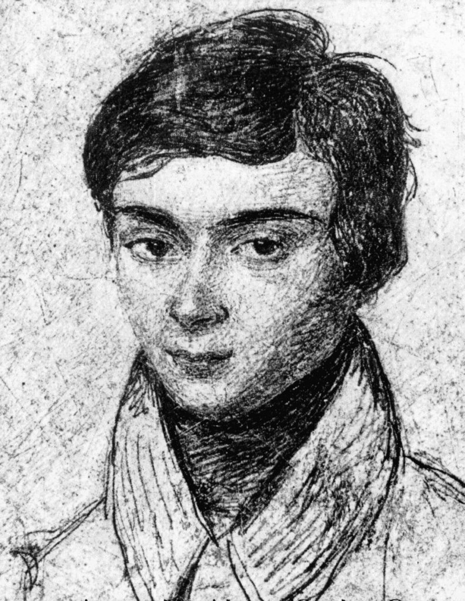
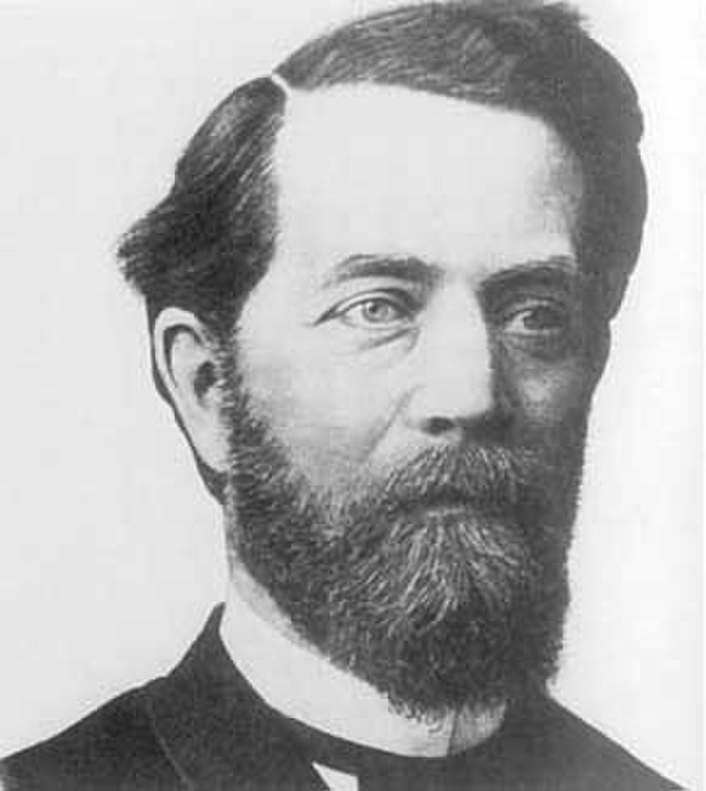
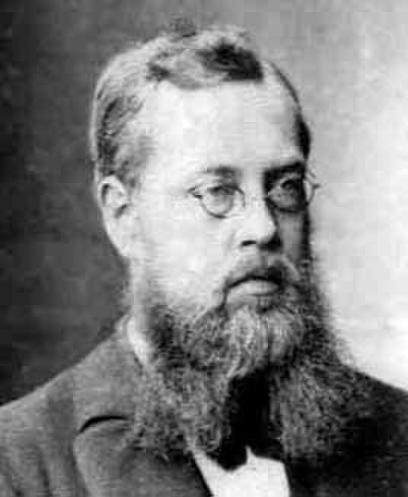
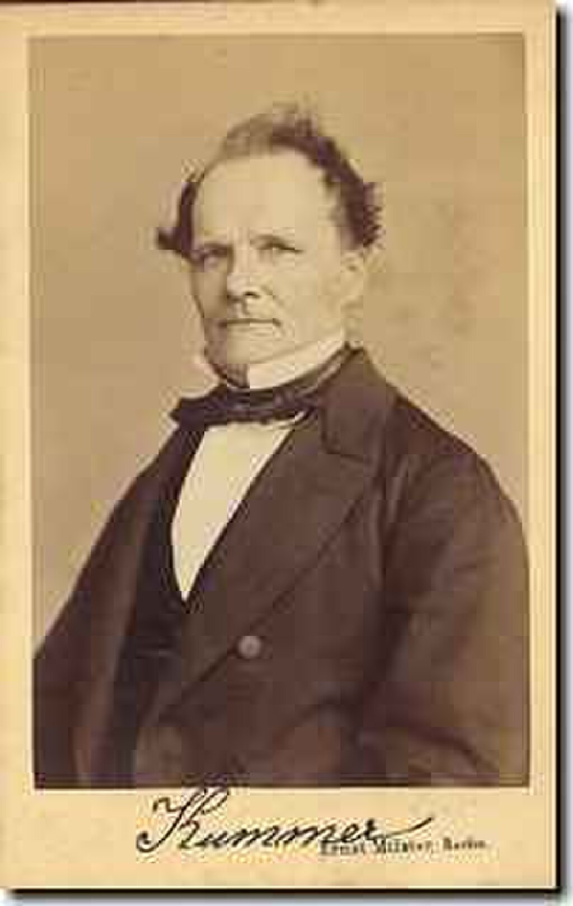
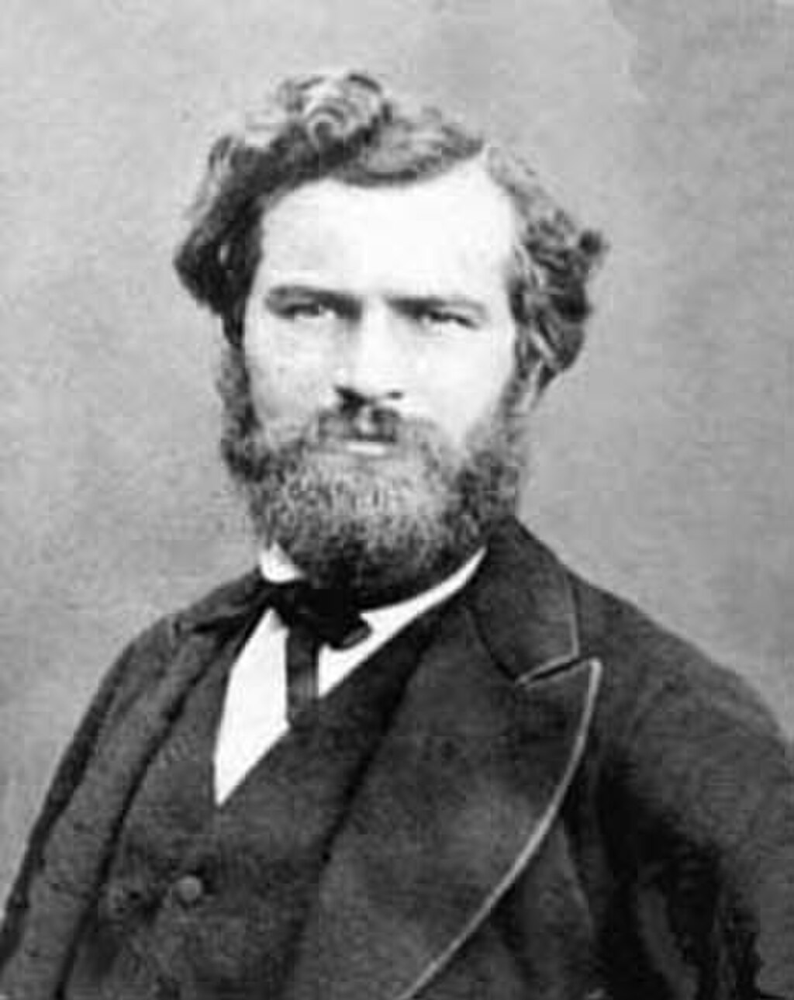

The **history of group theory**, a [mathematical](https://en.wikipedia.org/wiki/Mathematics "Mathematics") domain studying [groups](/source/group-mathematics/ "Group (mathematics)") in their various forms, has evolved in various parallel threads. There are three historical roots of [group theory](/source/group-theory/ "Group theory"): the theory of [algebraic equations](https://en.wikipedia.org/wiki/Algebraic_equation "Algebraic equation"), [number theory](https://en.wikipedia.org/wiki/Number_theory "Number theory") and [geometry](https://en.wikipedia.org/wiki/Geometry "Geometry"). [Joseph Louis Lagrange](https://en.wikipedia.org/wiki/Joseph_Louis_Lagrange "Joseph Louis Lagrange"), [Paolo Ruffini](https://en.wikipedia.org/wiki/Paolo_Ruffini "Paolo Ruffini"), [Niels Henrik Abel](https://en.wikipedia.org/wiki/Niels_Henrik_Abel "Niels Henrik Abel") and [Évariste Galois](https://en.wikipedia.org/wiki/Évariste_Galois "Évariste Galois") were early researchers in the field of group theory.

## Early 19th century

The earliest study of groups as such probably goes back to the work of Lagrange in the late 18th century. However, this work was somewhat isolated, and 1846 publications of [Augustin Louis Cauchy](https://en.wikipedia.org/wiki/Augustin_Louis_Cauchy "Augustin Louis Cauchy") and Galois are more commonly referred to as the beginning of group theory. The theory did not develop in a vacuum, and so three important threads in its pre-history are developed here.

### Development of permutation groups

One foundational root of group theory was the quest of solutions of [polynomial equations](https://en.wikipedia.org/wiki/Polynomial_equation "Polynomial equation") of [degree](https://en.wikipedia.org/wiki/Degree_of_a_polynomial "Degree of a polynomial") higher than 4.

An early source occurs in the problem of forming an equation of degree _m_ having as its [roots](https://en.wikipedia.org/wiki/Root_of_a_polynomial "Root of a polynomial") _m_ of the roots of a given equation of degree $n > m$. For simple cases, the problem goes back to [Johann van Waveren Hudde](https://en.wikipedia.org/wiki/Johann_van_Waveren_Hudde "Johann van Waveren Hudde") (1659). [Nicholas Saunderson](https://en.wikipedia.org/wiki/Nicholas_Saunderson "Nicholas Saunderson") (1740) noted that the determination of the [quadratic](https://en.wikipedia.org/wiki/Quadratic_polynomial "Quadratic polynomial") factors of a biquadratic expression necessarily leads to a [sextic equation](https://en.wikipedia.org/wiki/Sextic_equation "Sextic equation"), and Thomas Le Seur (1703–1770) (1748) and [Edward Waring](https://en.wikipedia.org/wiki/Edward_Waring "Edward Waring") (1762 to 1782) still further elaborated the idea. Waring [proved](https://en.wikipedia.org/wiki/Mathematical_proof "Mathematical proof") the [fundamental theorem of symmetric polynomials](https://en.wikipedia.org/wiki/Fundamental_theorem_of_symmetric_polynomials "Fundamental theorem of symmetric polynomials"), and specially considered the relation between the roots of a [quartic equation](https://en.wikipedia.org/wiki/Quartic_equation "Quartic equation") and its resolvent cubic.

Lagrange's goal (1770, 1771) was to understand why equations of third and fourth degree admit formulas for solutions, and a key object was the group of [permutations](https://en.wikipedia.org/wiki/Permutation "Permutation") of the roots. On this was built the theory of substitutions. He discovered that the roots of all [Lagrange resolvents](https://en.wikipedia.org/wiki/Lagrange_resolvents "Lagrange resolvents") (_résolvantes, réduites_) which he examined are rational functions of the roots of the respective equations. To study the properties of these functions, he invented a _Calcul des Combinaisons_. The contemporary work of [Alexandre-Théophile Vandermonde](https://en.wikipedia.org/wiki/Alexandre-Théophile_Vandermonde "Alexandre-Théophile Vandermonde") (1770) developed the theory of [symmetric functions](https://en.wikipedia.org/wiki/Symmetric_function "Symmetric function") and solution of [cyclotomic polynomials](https://en.wikipedia.org/wiki/Cyclotomic_polynomial "Cyclotomic polynomial"). [Leopold Kronecker](https://en.wikipedia.org/wiki/Leopold_Kronecker "Leopold Kronecker") has been quoted as saying that a new boom in algebra began with Vandermonde's first paper. Similarly Cauchy gave credit to both Lagrange and Vandermonde for studying symmetric functions and permutations of variables.

[Paolo Ruffini](https://en.wikipedia.org/wiki/Paolo_Ruffini_\(mathematician\) "Paolo Ruffini (mathematician)") (1799) attempted a proof of the impossibility of solving the [quintic](https://en.wikipedia.org/wiki/Quintic_equation "Quintic equation") and higher equations. Ruffini was the first person to explore ideas in the theory of [permutation groups](https://en.wikipedia.org/wiki/Permutation_group "Permutation group") such as the [order](https://en.wikipedia.org/wiki/Order_\(group_theory\) "Order (group theory)") of an element of a group, [conjugacy](https://en.wikipedia.org/wiki/Conjugacy_class "Conjugacy class"), and the [cycle decomposition](https://en.wikipedia.org/wiki/Cycle_decomposition_\(group_theory\) "Cycle decomposition (group theory)") of elements of permutation groups. Ruffini distinguished what are now called intransitive and [transitive](https://en.wikipedia.org/wiki/Group_action#Types_of_actions "Group action"), and imprimitive and [primitive](https://en.wikipedia.org/wiki/Primitive_permutation_group "Primitive permutation group") groups, and (1801) uses the group of an equation under the name _l'assieme delle permutazioni_. He also published a letter from [Pietro Abbati](https://en.wikipedia.org/wiki/Pietro_Abbati "Pietro Abbati") to himself, in which the group idea is prominent. However, he never formalized the concept of a group, or even of a permutation group.

Galois age fifteen, drawn by a classmate.

[Évariste Galois](https://en.wikipedia.org/wiki/Évariste_Galois "Évariste Galois") is honored as the first mathematician linking group theory and [field theory](https://en.wikipedia.org/wiki/Field_theory_\(mathematics\) "Field theory (mathematics)"), with the theory that is now called [Galois theory](https://en.wikipedia.org/wiki/Galois_theory "Galois theory"). Galois also contributed to the theory of [modular equations](https://en.wikipedia.org/wiki/Modular_equation "Modular equation") and to that of [elliptic functions](https://en.wikipedia.org/wiki/Elliptic_function "Elliptic function"). His first publication on group theory was made at the age of eighteen (1829), but his contributions attracted little attention until the posthumous publication of his collected papers in 1846 (Liouville, Vol. XI). He considered for the first time what is now called the [closure](https://en.wikipedia.org/wiki/Closure_\(mathematics\) "Closure (mathematics)") property of a group of permutations, which he expressed as

> if in such a group one has the substitutions S and T then one has the substitution ST.

Galois found that if $r_1, r_2, \ldots, r_n$ are the _n_ roots of an equation, there is always a group of permutations of the _r'_s such that

*   every function of the roots invariable by the substitutions of the group is rationally known, and
*   conversely, every rationally determinable function of the roots is invariant under the substitutions of the group.

In modern terms, the [solvability](https://en.wikipedia.org/wiki/Solvable_group "Solvable group") of the [Galois group](https://en.wikipedia.org/wiki/Galois_group "Galois group") attached to the equation determines the [solvability](https://en.wikipedia.org/wiki/Solvable_by_radicals "Solvable by radicals") of the equation with radicals.

Galois was the first to use the words _group_ (_groupe_ in French) and _primitive_ in their modern meanings. He did not use _primitive group_ but called _equation primitive_ an equation whose Galois group is [primitive](https://en.wikipedia.org/wiki/Primitive_group "Primitive group"). He discovered the notion of [normal](https://en.wikipedia.org/wiki/Normal_subgroup "Normal subgroup") [subgroups](https://en.wikipedia.org/wiki/Subgroup "Subgroup") and found that a solvable primitive group may be identified to a subgroup of the [affine group](https://en.wikipedia.org/wiki/Affine_group "Affine group") of an [affine space](https://en.wikipedia.org/wiki/Affine_space "Affine space") over a [finite field](https://en.wikipedia.org/wiki/Finite_field "Finite field") of [prime](https://en.wikipedia.org/wiki/Prime_number "Prime number") order.

Groups similar to Galois groups are (today) called [permutation groups](https://en.wikipedia.org/wiki/Permutation_group "Permutation group"). The theory of permutation groups received further far-reaching development in the hands of [Augustin Cauchy](https://en.wikipedia.org/wiki/Augustin_Cauchy "Augustin Cauchy") and [Camille Jordan](https://en.wikipedia.org/wiki/Camille_Jordan "Camille Jordan"), both through introduction of new concepts and, primarily, a great wealth of results about special classes of permutation groups and even some general theorems. Among other things, Jordan defined a notion of [isomorphism](https://en.wikipedia.org/wiki/Group_isomorphism "Group isomorphism"), although limited to the context of permutation groups. It was also Jordan who put the term _group_ in wide use.

An _abstract_ notion of a ([finite](https://en.wikipedia.org/wiki/Finite_group "Finite group")) group appeared for the first time in [Arthur Cayley](https://en.wikipedia.org/wiki/Arthur_Cayley "Arthur Cayley")'s 1854 paper _On the theory of groups, as depending on the symbolic equation $\theta^n = 1$_. Cayley proposed that any finite group is isomorphic to a subgroup of a permutation group, a result known today as [Cayley's theorem](https://en.wikipedia.org/wiki/Cayley's_theorem "Cayley's theorem"). In succeeding years, Cayley systematically investigated infinite groups and the algebraic properties of [matrices](https://en.wikipedia.org/wiki/Matrix_\(mathematics\) "Matrix (mathematics)"), such as the [associativity](https://en.wikipedia.org/wiki/Associativity "Associativity") of multiplication, existence of [inverses](https://en.wikipedia.org/wiki/Inverse_matrix "Inverse matrix"), and [characteristic polynomials](https://en.wikipedia.org/wiki/Characteristic_polynomial "Characteristic polynomial").

### Groups related to geometry

Felix KleinSophus Lie

Secondly, the systematic use of groups in geometry, mainly in the guise of [symmetry groups](https://en.wikipedia.org/wiki/Symmetry_group "Symmetry group"), was initiated by [Felix Klein](https://en.wikipedia.org/wiki/Felix_Klein "Felix Klein")'s 1872 [Erlangen program](https://en.wikipedia.org/wiki/Erlangen_program "Erlangen program"). The study of what are now called [Lie groups](https://en.wikipedia.org/wiki/Lie_group "Lie group") started systematically in 1884 with [Sophus Lie](https://en.wikipedia.org/wiki/Sophus_Lie "Sophus Lie"), followed by work of [Wilhelm Killing](https://en.wikipedia.org/wiki/Wilhelm_Killing "Wilhelm Killing"), [Eduard Study](https://en.wikipedia.org/wiki/Eduard_Study "Eduard Study"), [Issai Schur](https://en.wikipedia.org/wiki/Issai_Schur "Issai Schur"), [Ludwig Maurer](https://en.wikipedia.org/wiki/Ludwig_Maurer "Ludwig Maurer"), and [Élie Cartan](https://en.wikipedia.org/wiki/Élie_Cartan "Élie Cartan"). The discontinuous ([discrete group](https://en.wikipedia.org/wiki/Discrete_group "Discrete group")) theory was built up by Klein, Lie, [Henri Poincaré](https://en.wikipedia.org/wiki/Henri_Poincaré "Henri Poincaré"), and [Charles Émile Picard](https://en.wikipedia.org/wiki/Charles_Émile_Picard "Charles Émile Picard"), in connection in particular with [modular forms](https://en.wikipedia.org/wiki/Modular_form "Modular form") and [monodromy](https://en.wikipedia.org/wiki/Monodromy "Monodromy").

### Appearance of groups in number theory

Ernst Kummer

The third root of group theory was [number theory](https://en.wikipedia.org/wiki/Number_theory "Number theory"). [Leonhard Euler](https://en.wikipedia.org/wiki/Leonhard_Euler "Leonhard Euler") considered [algebraic operations](https://en.wikipedia.org/wiki/Algebraic_operation "Algebraic operation") on numbers modulo an integer—[modular arithmetic](https://en.wikipedia.org/wiki/Modular_arithmetic "Modular arithmetic")—in [his generalization](https://en.wikipedia.org/wiki/Euler's_theorem "Euler's theorem") of [Fermat's little theorem](https://en.wikipedia.org/wiki/Fermat's_little_theorem "Fermat's little theorem"). These investigations were taken much further by [Carl Friedrich Gauss](https://en.wikipedia.org/wiki/Carl_Friedrich_Gauss "Carl Friedrich Gauss"), who considered the structure of [multiplicative groups of residues mod _n_](https://en.wikipedia.org/wiki/Multiplicative_group_of_integers_modulo_n "Multiplicative group of integers modulo n") and established many properties of [cyclic](https://en.wikipedia.org/wiki/Cyclic_group "Cyclic group") and more general [abelian](https://en.wikipedia.org/wiki/Abelian_group "Abelian group") groups that arise in this way. In his investigations of [composition of binary quadratic forms](https://en.wikipedia.org/wiki/Composition_of_binary_quadratic_forms "Composition of binary quadratic forms"), Gauss explicitly stated the associative law for the composition of forms. In 1870, [Leopold Kronecker](https://en.wikipedia.org/wiki/Leopold_Kronecker "Leopold Kronecker") gave a definition of an abelian group in the context of [ideal class groups](https://en.wikipedia.org/wiki/Ideal_class_group "Ideal class group") of a [number field](https://en.wikipedia.org/wiki/Number_field "Number field"), generalizing Gauss's work. [Ernst Kummer](https://en.wikipedia.org/wiki/Ernst_Kummer "Ernst Kummer")'s attempts to prove [Fermat's Last Theorem](https://en.wikipedia.org/wiki/Fermat's_Last_Theorem "Fermat's Last Theorem") resulted in work introducing [groups describing factorization](https://en.wikipedia.org/wiki/Class_group "Class group") into prime numbers. In 1882, [Heinrich M. Weber](https://en.wikipedia.org/wiki/Heinrich_M._Weber "Heinrich M. Weber") realized the connection between permutation groups and abelian groups and gave a definition that included a two-sided [cancellation property](https://en.wikipedia.org/wiki/Cancellation_property "Cancellation property") but omitted the existence of the [inverse element](https://en.wikipedia.org/wiki/Inverse_element "Inverse element"), which was sufficient in his context (finite groups).

### Convergence

Camille Jordan

Group theory as an increasingly independent subject was popularized by [Serret](https://en.wikipedia.org/wiki/Joseph_Alfred_Serret "Joseph Alfred Serret"), who devoted section IV of his algebra to the theory; by [Camille Jordan](https://en.wikipedia.org/wiki/Camille_Jordan "Camille Jordan"), whose _[Traité des substitutions et des équations algébriques](https://en.wikipedia.org/wiki/List_of_important_publications_in_mathematics#Traité_des_substitutions_et_des_équations_algébriques "List of important publications in mathematics")_ (1870) is a classic; and to [Eugen Netto](https://en.wikipedia.org/wiki/Eugen_Netto "Eugen Netto") (1882), whose _Theory of Substitutions and its Applications to Algebra_ was translated into English by Cole (1892). Other group theorists of the 19th century were [Joseph Louis François Bertrand](https://en.wikipedia.org/wiki/Joseph_Louis_François_Bertrand "Joseph Louis François Bertrand"), [Charles Hermite](https://en.wikipedia.org/wiki/Charles_Hermite "Charles Hermite"), [Ferdinand Georg Frobenius](https://en.wikipedia.org/wiki/Ferdinand_Georg_Frobenius "Ferdinand Georg Frobenius"), [Leopold Kronecker](https://en.wikipedia.org/wiki/Leopold_Kronecker "Leopold Kronecker"), and [Émile Mathieu](https://en.wikipedia.org/wiki/Émile_Léonard_Mathieu "Émile Léonard Mathieu"); as well as [William Burnside](https://en.wikipedia.org/wiki/William_Burnside "William Burnside"), [Leonard Eugene Dickson](https://en.wikipedia.org/wiki/Leonard_Eugene_Dickson "Leonard Eugene Dickson"), [Otto Hölder](https://en.wikipedia.org/wiki/Otto_Hölder "Otto Hölder"), [E. H. Moore](https://en.wikipedia.org/wiki/E._H._Moore "E. H. Moore"), [Ludwig Sylow](https://en.wikipedia.org/wiki/Peter_Ludwig_Mejdell_Sylow "Peter Ludwig Mejdell Sylow"), and [Heinrich Martin Weber](https://en.wikipedia.org/wiki/Heinrich_Martin_Weber "Heinrich Martin Weber").

The convergence of the above three sources into a uniform theory started with Jordan's _Traité_ and [Walther von Dyck](https://en.wikipedia.org/wiki/Walther_von_Dyck "Walther von Dyck") (1882) who first defined a group in the full modern sense. The textbooks of Weber and Burnside helped establish group theory as a discipline. The abstract group formulation did not apply to a large portion of 19th century group theory, and an alternative formalism was given in terms of [Lie algebras](https://en.wikipedia.org/wiki/Lie_algebra "Lie algebra").

## Late 19th century

Groups in the 1870-1900 period were described as the continuous groups of Lie, the discontinuous groups, finite groups of substitutions of roots (gradually being called permutations), and finite groups of linear substitutions (usually of finite fields). During the 1880-1920 period, groups described by [presentations](https://en.wikipedia.org/wiki/Presentation_of_a_group "Presentation of a group") came into a life of their own through the work of Cayley, [Walther von Dyck](https://en.wikipedia.org/wiki/Walther_von_Dyck "Walther von Dyck"), [Max Dehn](https://en.wikipedia.org/wiki/Max_Dehn "Max Dehn"), [Jakob Nielsen](https://en.wikipedia.org/wiki/Jakob_Nielsen_\(mathematician\) "Jakob Nielsen (mathematician)"), [Otto Schreier](https://en.wikipedia.org/wiki/Otto_Schreier "Otto Schreier"), and continued in the 1920-1940 period with the work of [H. S. M. Coxeter](https://en.wikipedia.org/wiki/Harold_Scott_MacDonald_Coxeter "Harold Scott MacDonald Coxeter"), [Wilhelm Magnus](https://en.wikipedia.org/wiki/Wilhelm_Magnus "Wilhelm Magnus"), and others to form the field of [combinatorial group theory](https://en.wikipedia.org/wiki/Combinatorial_group_theory "Combinatorial group theory").

Finite groups in the 1870-1900 period saw such highlights as the [Sylow theorems](https://en.wikipedia.org/wiki/Sylow_theorem "Sylow theorem"), Hölder's classification of groups of [square-free](https://en.wikipedia.org/wiki/Square-free_integer "Square-free integer") order, and the early beginnings of the [character theory](https://en.wikipedia.org/wiki/Character_theory "Character theory") of Frobenius. Already by 1860, the [groups of automorphisms](https://en.wikipedia.org/wiki/Automorphism_group "Automorphism group") of the [finite projective planes](https://en.wikipedia.org/wiki/Finite_projective_plane "Finite projective plane") had been studied (by Mathieu), and in the 1870s Klein's group-theoretic vision of geometry was being realized in his [Erlangen program](https://en.wikipedia.org/wiki/Erlangen_program "Erlangen program"). The automorphism groups of higher dimensional projective spaces were studied by Jordan in his _Traité_ and included composition series for most of the so-called [classical groups](https://en.wikipedia.org/wiki/Classical_group "Classical group"), though he avoided non-prime fields and omitted the [unitary groups](https://en.wikipedia.org/wiki/Unitary_group "Unitary group"). The study was continued by Moore and Burnside, and brought into comprehensive textbook form by [Leonard Dickson](https://en.wikipedia.org/wiki/Leonard_Dickson "Leonard Dickson") in 1901. The role of [simple groups](https://en.wikipedia.org/wiki/Simple_group "Simple group") was emphasized by Jordan, and criteria for non-simplicity were developed by Hölder until he was able to classify the simple groups of order less than 200. The study was continued by [Frank Nelson Cole](https://en.wikipedia.org/wiki/Frank_Nelson_Cole "Frank Nelson Cole") (up to 660) and Burnside (up to 1092), and finally in an early "millennium project", up to 2001 by Miller and Ling in 1900.

Continuous groups in the 1870-1900 period developed rapidly. Killing and Lie's foundational papers were published, Hilbert's theorem in [invariant theory](https://en.wikipedia.org/wiki/Invariant_theory "Invariant theory") 1882, etc.

## Early 20th century

In the period 1900–1940, infinite "discontinuous" groups (now called [discrete groups](https://en.wikipedia.org/wiki/Discrete_group "Discrete group")) gained life of their own. [Burnside's famous problem](https://en.wikipedia.org/wiki/Burnside_problem "Burnside problem") ushered in the study of arbitrary subgroups of finite-dimensional [linear groups](https://en.wikipedia.org/wiki/Linear_group "Linear group") over arbitrary fields, and indeed arbitrary groups. [Fundamental groups](https://en.wikipedia.org/wiki/Fundamental_group "Fundamental group") and [reflection groups](https://en.wikipedia.org/wiki/Reflection_group "Reflection group") encouraged the developments of [J. A. Todd](https://en.wikipedia.org/wiki/J._A._Todd "J. A. Todd") and Coxeter, such as the [Todd–Coxeter algorithm](https://en.wikipedia.org/wiki/Todd–Coxeter_algorithm "Todd–Coxeter algorithm") in combinatorial group theory. [Algebraic groups](https://en.wikipedia.org/wiki/Algebraic_group "Algebraic group"), defined as solutions of polynomial equations (rather than acting on them, as in the earlier century), benefited heavily from the continuous theory of Lie. [Bernard Neumann](https://en.wikipedia.org/wiki/Bernard_Neumann "Bernard Neumann") and [Hanna Neumann](https://en.wikipedia.org/wiki/Hanna_Neumann "Hanna Neumann") produced their study of [varieties of groups](https://en.wikipedia.org/wiki/Variety_\(universal_algebra\) "Variety (universal algebra)"), groups defined by group-theoretic equations rather than polynomial ones.

Continuous groups also had explosive growth in the 1900-1940 period. [Topological groups](https://en.wikipedia.org/wiki/Topological_group "Topological group") began to be studied as such. There were many great achievements in continuous groups: Cartan's classification of [semisimple Lie algebras](https://en.wikipedia.org/wiki/Semisimple_Lie_algebra "Semisimple Lie algebra"), [Hermann Weyl](https://en.wikipedia.org/wiki/Hermann_Weyl "Hermann Weyl")'s theory of representations of [compact groups](https://en.wikipedia.org/wiki/Compact_group "Compact group"), [Alfréd Haar](https://en.wikipedia.org/wiki/Alfréd_Haar "Alfréd Haar")'s work in the [locally compact](https://en.wikipedia.org/wiki/Locally_compact_group "Locally compact group") case.

Finite groups in the 1900-1940 grew immensely. This period witnessed the birth of [character theory](https://en.wikipedia.org/wiki/Character_theory "Character theory") by Frobenius, Burnside, and Schur which helped answer many of the 19th century questions in permutation groups, and opened the way to entirely new techniques in abstract finite groups. This period saw the work of [Philip Hall](https://en.wikipedia.org/wiki/Philip_Hall "Philip Hall"): on a generalization of Sylow's theorem to arbitrary sets of primes which revolutionized the study of finite [soluble groups](https://en.wikipedia.org/wiki/Soluble_group "Soluble group"), and on the power-commutator structure of [_p_-groups](https://en.wikipedia.org/wiki/P-group "P-group"), including the ideas of [regular _p_-groups](https://en.wikipedia.org/wiki/Regular_p-group "Regular p-group") and [isoclinism of groups](https://en.wikipedia.org/wiki/Isoclinism_of_groups "Isoclinism of groups"), which revolutionized the study of _p_-groups and was the first major result in this area since Sylow. This period saw [Hans Zassenhaus](https://en.wikipedia.org/wiki/Hans_Zassenhaus "Hans Zassenhaus")'s famous [Schur-Zassenhaus theorem](https://en.wikipedia.org/wiki/Schur-Zassenhaus_theorem "Schur-Zassenhaus theorem") on the existence of complements to Hall's generalization of Sylow subgroups, as well as his progress on [Frobenius groups](https://en.wikipedia.org/wiki/Frobenius_group "Frobenius group"), and a near classification of [Zassenhaus groups](https://en.wikipedia.org/wiki/Zassenhaus_group "Zassenhaus group").

## Mid-20th century

Both depth, breadth and also the impact of group theory subsequently grew. The domain started branching out into areas such as [algebraic groups](https://en.wikipedia.org/wiki/Algebraic_group "Algebraic group"), [group extensions](https://en.wikipedia.org/wiki/Group_extension "Group extension"), and [representation theory](https://en.wikipedia.org/wiki/Representation_theory "Representation theory"). Starting in the 1950s, in a huge collaborative effort, group theorists succeeded to [classify all finite simple groups](https://en.wikipedia.org/wiki/Classification_of_finite_simple_groups "Classification of finite simple groups") in 1982. Completing and simplifying the proof of the classification are areas of active research.

[Anatoly Maltsev](https://en.wikipedia.org/wiki/Anatoly_Maltsev "Anatoly Maltsev") also made important contributions to group theory during this time; his early work was in [logic](https://en.wikipedia.org/wiki/Mathematical_logic "Mathematical logic") in the 1930s, but in the 1940s he proved important embedding properties of [semigroups](https://en.wikipedia.org/wiki/Semigroup "Semigroup") into groups, studied the isomorphism problem of [group rings](https://en.wikipedia.org/wiki/Group_ring "Group ring"), established the Malçev correspondence for [polycyclic groups](https://en.wikipedia.org/wiki/Polycyclic_group "Polycyclic group"), and in the 1960s return to logic proving various theories within the study of groups to be [undecidable](https://en.wikipedia.org/wiki/Decidability_\(logic\)#Decidability_of_a_theory "Decidability (logic)"). Earlier, [Alfred Tarski](https://en.wikipedia.org/wiki/Alfred_Tarski "Alfred Tarski") proved elementary group theory undecidable.

The period of 1960-1980 was one of excitement in many areas of group theory.

In finite groups, there were many independent milestones. One had the discovery of 22 new [sporadic groups](https://en.wikipedia.org/wiki/Sporadic_group "Sporadic group"), and the completion of the first generation of the [classification of finite simple groups](https://en.wikipedia.org/wiki/Classification_of_finite_simple_groups "Classification of finite simple groups"). One had the influential idea of the [Carter subgroup](https://en.wikipedia.org/wiki/Carter_subgroup "Carter subgroup"), and the subsequent creation of formation theory and the theory of classes of groups. One had the remarkable extensions of Clifford theory by Green to the [indecomposable modules](https://en.wikipedia.org/wiki/Indecomposable_module "Indecomposable module") of group algebras. During this era, the field of [computational group theory](https://en.wikipedia.org/wiki/Computational_group_theory "Computational group theory") became a recognized field of study, due in part to its tremendous success during the first generation classification.

In discrete groups, the geometric methods of [Jacques Tits](https://en.wikipedia.org/wiki/Jacques_Tits "Jacques Tits") and the availability the surjectivity of [Serge Lang](https://en.wikipedia.org/wiki/Serge_Lang "Serge Lang")'s map allowed a revolution in algebraic groups. The [Burnside problem](https://en.wikipedia.org/wiki/Burnside_problem "Burnside problem") had tremendous progress, with better [counterexamples](https://en.wikipedia.org/wiki/Counterexample "Counterexample") constructed in the 1960s and early 1980s, but the finishing touches "for all but finitely many" were not completed until the 1990s. The work on the Burnside problem increased interest in Lie algebras in exponent _p_, and the methods of [Michel Lazard](https://en.wikipedia.org/wiki/Michel_Lazard "Michel Lazard") began to see a wider impact, especially in the study of _p_-groups.

Continuous groups broadened considerably, with [_p_-adic](https://en.wikipedia.org/wiki/P-adic_number "P-adic number") analytic questions becoming important. Many [conjectures](https://en.wikipedia.org/wiki/Conjecture "Conjecture") were made during this time, including the coclass conjectures.

## Late 20th century

The last twenty years of the 20th century enjoyed the successes of over one hundred years of study in group theory.

In finite groups, post classification results included the [O'Nan–Scott theorem](https://en.wikipedia.org/wiki/O'Nan–Scott_theorem "O'Nan–Scott theorem"), the Aschbacher classification, the classification of multiply transitive finite groups, the determination of the [maximal subgroups](https://en.wikipedia.org/wiki/Maximal_subgroup "Maximal subgroup") of the simple groups and the corresponding classifications of [primitive groups](https://en.wikipedia.org/wiki/Primitive_group "Primitive group"). In [finite geometry](https://en.wikipedia.org/wiki/Finite_geometry "Finite geometry") and [combinatorics](https://en.wikipedia.org/wiki/Combinatorics "Combinatorics"), many problems could now be settled. The [modular representation theory](https://en.wikipedia.org/wiki/Modular_representation_theory "Modular representation theory") entered a new era as the techniques of the classification were axiomatized, including fusion systems, Luis Puig's theory of pairs and nilpotent blocks. The theory of finite soluble groups was likewise transformed by the influential book of Klaus Doerk and Trevor Hawkes which brought the theory of projectors and injectors to a wider audience.

In discrete groups, several areas of geometry came together to produce exciting new fields. Work on [knot theory](https://en.wikipedia.org/wiki/Knot_theory "Knot theory"), [orbifolds](https://en.wikipedia.org/wiki/Orbifold "Orbifold"), [hyperbolic manifolds](https://en.wikipedia.org/wiki/Hyperbolic_manifold "Hyperbolic manifold"), and groups acting on trees (the [Bass–Serre theory](https://en.wikipedia.org/wiki/Bass–Serre_theory "Bass–Serre theory")), much enlivened the study of [hyperbolic groups](https://en.wikipedia.org/wiki/Hyperbolic_group "Hyperbolic group"), [automatic groups](https://en.wikipedia.org/wiki/Automatic_group "Automatic group"). Questions such as [William Thurston](https://en.wikipedia.org/wiki/William_Thurston "William Thurston")'s 1982 [geometrization conjecture](https://en.wikipedia.org/wiki/Geometrization_conjecture "Geometrization conjecture"), inspired entirely new techniques in [geometric group theory](https://en.wikipedia.org/wiki/Geometric_group_theory "Geometric group theory") and [low-dimensional topology](https://en.wikipedia.org/wiki/Low-dimensional_topology "Low-dimensional topology"), and was involved in the solution of one of the [Millennium Prize Problems](https://en.wikipedia.org/wiki/Millennium_Prize_Problems "Millennium Prize Problems"), the [Poincaré conjecture](https://en.wikipedia.org/wiki/Poincaré_conjecture "Poincaré conjecture").

Continuous groups saw the solution of the problem of [hearing the shape of a drum](https://en.wikipedia.org/wiki/Hearing_the_shape_of_a_drum "Hearing the shape of a drum") in 1992 using symmetry groups of the [laplacian operator](https://en.wikipedia.org/wiki/Laplacian_operator "Laplacian operator"). Continuous techniques were applied to many aspects of group theory using [function spaces](https://en.wikipedia.org/wiki/Function_space "Function space") and [quantum groups](https://en.wikipedia.org/wiki/Quantum_group "Quantum group"). Many 18th and 19th century problems are now revisited in this more general setting, and many questions in the theory of the representations of groups have answers.

## Today

Group theory continues to be an intensely studied matter. Its importance to contemporary mathematics as a whole may be seen from the 2008 [Abel Prize](https://en.wikipedia.org/wiki/Abel_Prize "Abel Prize"), awarded to [John Griggs Thompson](https://en.wikipedia.org/wiki/John_Griggs_Thompson "John Griggs Thompson") and [Jacques Tits](https://en.wikipedia.org/wiki/Jacques_Tits "Jacques Tits") for their contributions to group theory.
