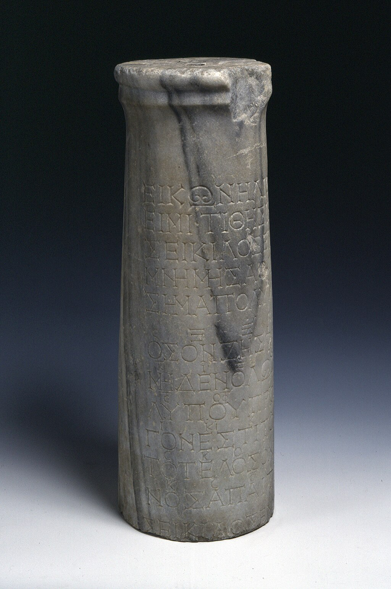

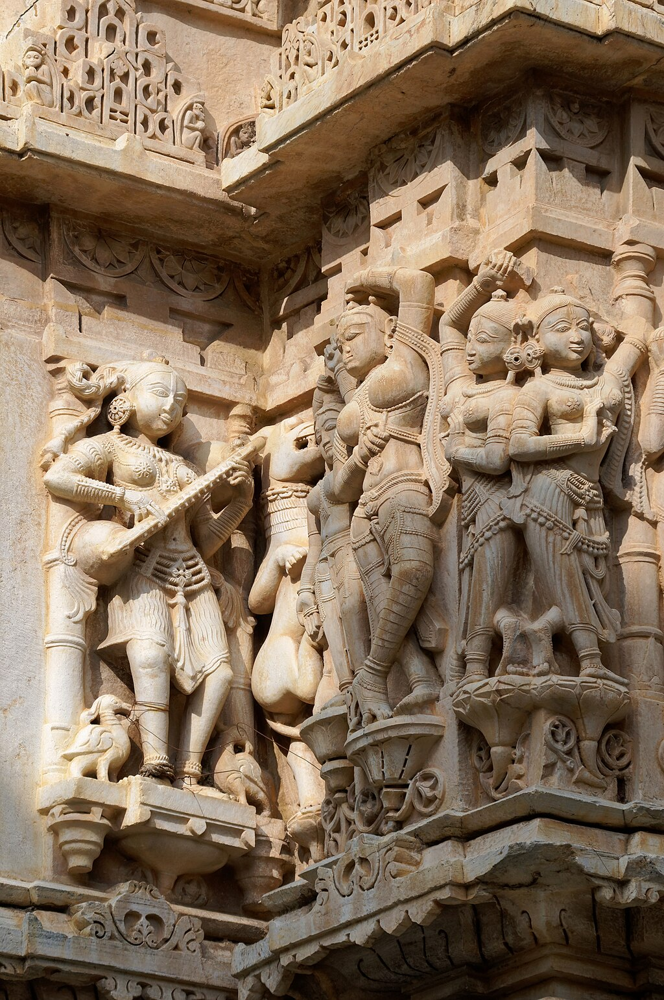

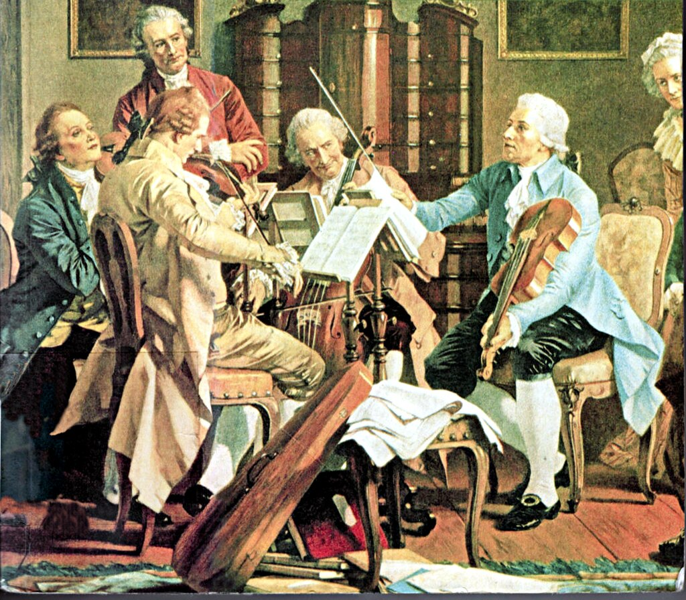

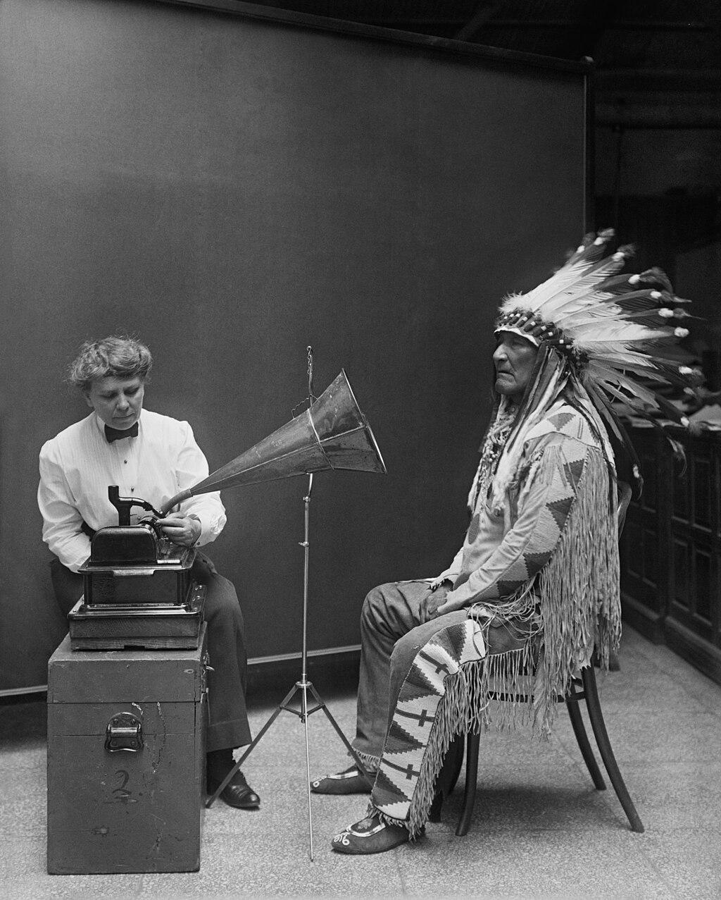

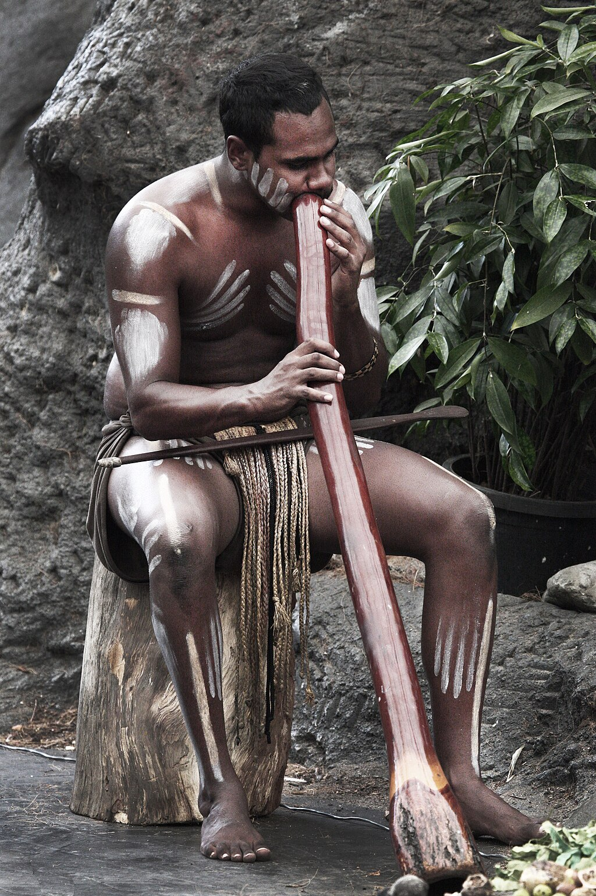

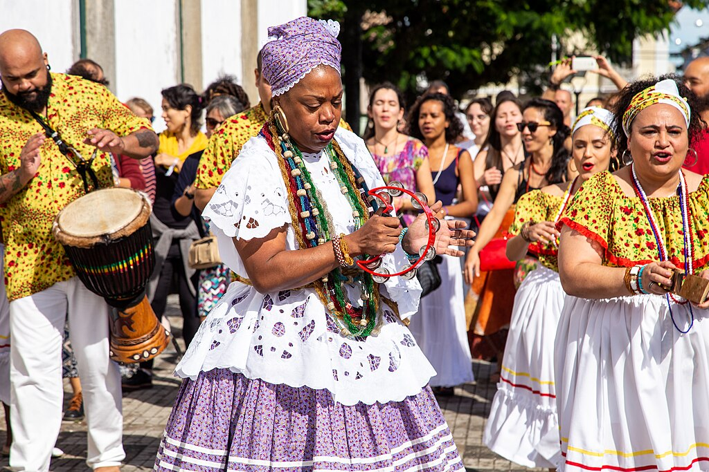

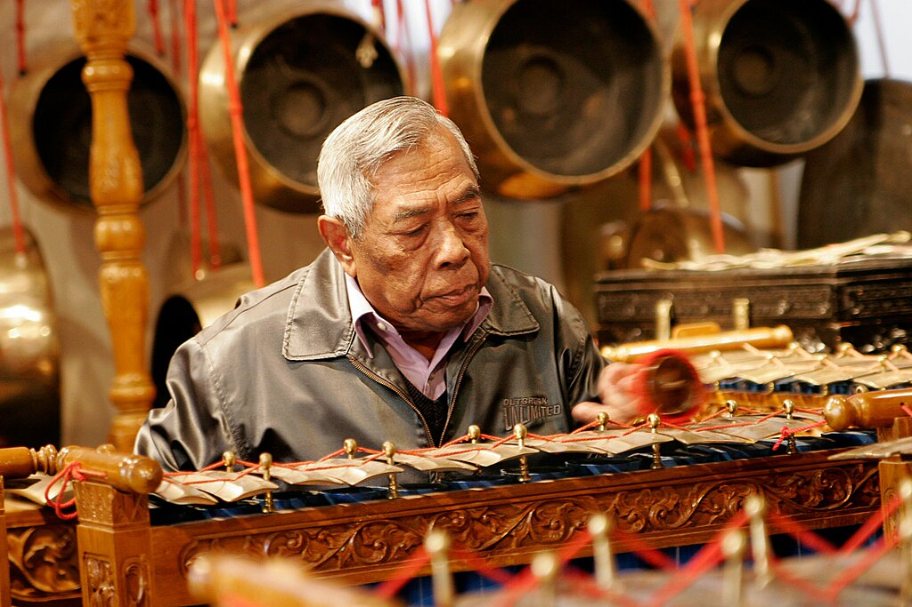

Clockwise, from top left:

*   [Seikilos epitaph](https://en.wikipedia.org/wiki/Seikilos_epitaph "Seikilos epitaph"), the oldest extant complete composition with [musical notation](https://en.wikipedia.org/wiki/Musical_notation "Musical notation")
*   Sculptures on the [Jagdish Temple, Udaipur](https://en.wikipedia.org/wiki/Jagdish_Temple,_Udaipur "Jagdish Temple, Udaipur") of [musicians](https://en.wikipedia.org/wiki/Musician "Musician"), one of which plays an [instrument](https://en.wikipedia.org/wiki/Musical_instrument "Musical instrument") similar to the _[Rudra veena](https://en.wikipedia.org/wiki/Rudra_veena "Rudra veena")_
*   [Blackfoot](https://en.wikipedia.org/wiki/Blackfoot "Blackfoot") chief [Mountain Chief](https://en.wikipedia.org/wiki/Mountain_Chief "Mountain Chief") listening to a recording by [Frances Densmore](https://en.wikipedia.org/wiki/Frances_Densmore "Frances Densmore") in [1916](https://en.wikipedia.org/wiki/1916 "1916")
*   Performers in the Samba de Roda festival, a music and dance celebration in the [Bahia](https://en.wikipedia.org/wiki/Bahia "Bahia") region of [Brazil](https://en.wikipedia.org/wiki/Brazil "Brazil")
*   A man playing the [gendèr](https://en.wikipedia.org/wiki/Gendèr "Gendèr") outside of the [Embassy of Indonesia, Canberra](https://en.wikipedia.org/wiki/Embassy_of_Indonesia,_Canberra "Embassy of Indonesia, Canberra")
*   A man playing the [didgeridoo](https://en.wikipedia.org/wiki/Didgeridoo "Didgeridoo"), an [indigenous instrument of Australia](https://en.wikipedia.org/wiki/Indigenous_music_of_Australia "Indigenous music of Australia")
*   [Joseph Haydn](https://en.wikipedia.org/wiki/Joseph_Haydn "Joseph Haydn") playing in a [string quartet](https://en.wikipedia.org/wiki/String_quartet "String quartet"), in a painting from before [1790](https://en.wikipedia.org/wiki/1790 "1790")

Although [definitions of music](https://en.wikipedia.org/wiki/Definition_of_music "Definition of music") vary wildly throughout the world, every known [culture](https://en.wikipedia.org/wiki/Culture "Culture") partakes in it, and it is thus considered a [cultural universal](https://en.wikipedia.org/wiki/Cultural_universal "Cultural universal"). The [origins of music](/source/history-of-music/#Origins) remain highly contentious; commentators often relate it to the [origin of language](https://en.wikipedia.org/wiki/Origin_of_language "Origin of language"), with much disagreement surrounding whether music arose before, after or simultaneously with [language](/source/language/ "Language"). Many theories have been proposed by scholars from a wide range of disciplines, though none has achieved broad approval. Most cultures have their own [mythical origins](https://en.wikipedia.org/wiki/Origin_myth "Origin myth") concerning the invention of music, generally rooted in their respective mythological, religious or philosophical beliefs.

While [Édouard-Léon Scott de Martinville](https://en.wikipedia.org/wiki/Édouard-Léon_Scott_de_Martinville "Édouard-Léon Scott de Martinville") was the first ever person to record sound the [music of prehistoric cultures](https://en.wikipedia.org/wiki/Prehistoric_music "Prehistoric music") is first firmly dated to c. 38,000 [BC](https://en.wikipedia.org/wiki/Before_Christ "Before Christ") of the [Upper Paleolithic](https://en.wikipedia.org/wiki/Upper_Paleolithic "Upper Paleolithic") by evidence of [bone flutes](https://en.wikipedia.org/wiki/Bone_flutes "Bone flutes"), though it remains unclear whether or not the actual origins lie in the earlier [Middle Paleolithic](https://en.wikipedia.org/wiki/Middle_Paleolithic "Middle Paleolithic") period (300,000 to [50,000 BP](https://en.wikipedia.org/wiki/50,000_BP "50,000 BP")). There is little known about prehistoric music, with traces mainly limited to some simple flutes and percussion instruments. However, such evidence indicates that music existed to some extent in prehistoric societies such as the [Xia dynasty](https://en.wikipedia.org/wiki/Xia_dynasty "Xia dynasty") and the [Indus Valley civilisation](https://en.wikipedia.org/wiki/Indus_Valley_civilisation "Indus Valley civilisation"). Upon the development of writing, the music of [literate](https://en.wikipedia.org/wiki/Literate "Literate") civilizations—[ancient music](https://en.wikipedia.org/wiki/Ancient_music "Ancient music")—was present in the major Chinese, Egyptian, Greek, Indian, Persian, Mesopotamian, and Middle Eastern societies. It is difficult to make many generalizations about ancient music as a whole, but from what is known it was often characterized by [monophony](https://en.wikipedia.org/wiki/Monophony "Monophony") and [improvisation](https://en.wikipedia.org/wiki/Improvisation "Improvisation"). In ancient [song](https://en.wikipedia.org/wiki/Song "Song") forms, the texts were closely aligned with music, and though the oldest extant musical notation survives from this period, many texts survive without their accompanying music, such as the _[Rigveda](https://en.wikipedia.org/wiki/Rigveda "Rigveda")_ and the [_Shijing_ Classic of Poetry](https://en.wikipedia.org/wiki/Shijing "Shijing"). The eventual emergence of the [Silk Road](https://en.wikipedia.org/wiki/Silk_Road "Silk Road") and increasing contact between cultures led to the transmission and exchange of musical ideas, practices, and instruments. Such interaction led to the [Tang dynasty](https://en.wikipedia.org/wiki/Tang_dynasty "Tang dynasty")'s music being heavily influenced by Central Asian traditions, while the Tang dynasty's music, the Japanese _[gagaku](https://en.wikipedia.org/wiki/Gagaku "Gagaku")_ and [Korean court music](https://en.wikipedia.org/wiki/Korean_court_music "Korean court music") each influenced each other.

Historically, religions have often been catalysts for music. The [Vedas](https://en.wikipedia.org/wiki/Vedas "Vedas") of [Hinduism](https://en.wikipedia.org/wiki/Hinduism "Hinduism") immensely influenced [Indian classical music](https://en.wikipedia.org/wiki/Indian_classical_music "Indian classical music"), and the [Five Classics](https://en.wikipedia.org/wiki/Five_Classics "Five Classics") of [Confucianism](https://en.wikipedia.org/wiki/Confucianism "Confucianism") laid the basis for subsequent [Chinese music](https://en.wikipedia.org/wiki/Chinese_music "Chinese music"). Following the rapid [spread of Islam](https://en.wikipedia.org/wiki/Spread_of_Islam "Spread of Islam") in the 7th century, [Islamic music](https://en.wikipedia.org/wiki/Islamic_music "Islamic music") dominated Persia and the Arab world, and the [Islamic Golden Age](https://en.wikipedia.org/wiki/Islamic_Golden_Age "Islamic Golden Age") saw the presence of numerous important music theorists. Music written for and by the [early Christian Church](https://en.wikipedia.org/wiki/Early_Christian_Church "Early Christian Church") properly inaugurates the [Western classical music](https://en.wikipedia.org/wiki/Western_classical_music "Western classical music") tradition, which continues into [medieval music](/source/medieval-music/ "Medieval music") where [polyphony](https://en.wikipedia.org/wiki/Polyphony "Polyphony"), [staff notation](https://en.wikipedia.org/wiki/Staff_notation "Staff notation") and nascent forms of many modern instruments developed. In addition to religion or the lack thereof, a society's music is influenced by all other aspects of its culture, including social and economic organization and experience, climate, and access to technology. Many cultures have coupled music with other art forms, such as the Chinese [four arts](https://en.wikipedia.org/wiki/Four_arts "Four arts") and the medieval _[quadrivium](https://en.wikipedia.org/wiki/Quadrivium "Quadrivium")_. The emotions and ideas that music expresses, the situations in which music is played and listened to, and the attitudes toward [musicians](https://en.wikipedia.org/wiki/Musician "Musician") and [composers](https://en.wikipedia.org/wiki/Composer "Composer") all vary between regions and periods. Many cultures have or continue to distinguish between [art music](https://en.wikipedia.org/wiki/Art_music "Art music") (or 'classical music'), [folk music](https://en.wikipedia.org/wiki/Folk_music "Folk music"), and [popular music](https://en.wikipedia.org/wiki/Popular_music "Popular music").

## Origins

> "But that music is a language by whose means messages are elaborated, that such messages can be understood by the many but sent out only by the few, and that it alone among all language unites the contradictory character of being at once intelligible and untranslatable—these facts make the creator of music a being like the gods and make music itself the supreme mystery of human knowledge."

— [Claude Lévi-Strauss](https://en.wikipedia.org/wiki/Claude_Lévi-Strauss "Claude Lévi-Strauss"), _[The Raw and the Cooked](https://en.wikipedia.org/wiki/The_Raw_and_the_Cooked "The Raw and the Cooked")_

[Music](https://en.wikipedia.org/wiki/Music "Music") is regarded as a [cultural universal](https://en.wikipedia.org/wiki/Cultural_universal "Cultural universal"), though [definitions](https://en.wikipedia.org/wiki/Definition_of_music "Definition of music") of it vary depending on culture and throughout history. As with many aspects of [human cognition](https://en.wikipedia.org/wiki/Human_cognition "Human cognition"), it remains debated as to what extent the origins of music will ever be understood, with scholars often taking polarizing positions. The origin of music is often discussed alongside the [origin of language](https://en.wikipedia.org/wiki/Origin_of_language "Origin of language"), with the nature of their connection being the subject of much debate. However, before the mid-late 20th century, both topics were seldom given substantial attention by academics. Since the topic's resurgence, the principal source of contention is divided into three perspectives: whether music began as a kind of [proto-language](https://en.wikipedia.org/wiki/Proto-language "Proto-language") (a result of [adaptation](https://en.wikipedia.org/wiki/Adaptation "Adaptation")) that led to language; if music is a [spandrel](https://en.wikipedia.org/wiki/Spandrel_\(biology\) "Spandrel (biology)") (a [phenotypic](https://en.wikipedia.org/wiki/Phenotype "Phenotype") by-product of evolution) that was the result of language; or if music and language both derived from a common antecedent.

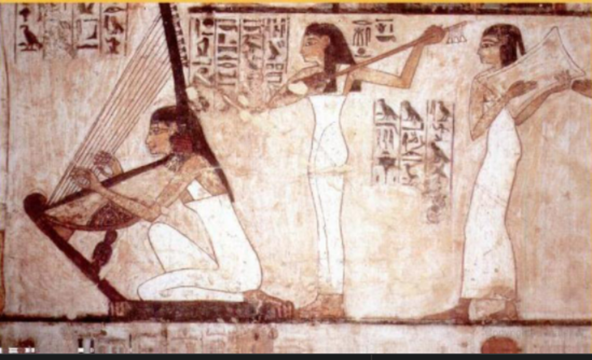An [ancient Egyptian](https://en.wikipedia.org/wiki/Ancient_Egyptian "Ancient Egyptian") mural of people playing [music](https://en.wikipedia.org/wiki/Music_of_Egypt "Music of Egypt").

There is little consensus on any particular theory for the origin of music, which have included contributions from archaeologists, cognitive scientists, [ethnomusicologists](https://en.wikipedia.org/wiki/Ethnomusicologists "Ethnomusicologists"), [evolutionary biologists](https://en.wikipedia.org/wiki/Evolutionary_biologists "Evolutionary biologists"), linguists, [neuroscientists](https://en.wikipedia.org/wiki/Neuroscientist "Neuroscientist"), [paleoanthropologists](https://en.wikipedia.org/wiki/Paleoanthropologists "Paleoanthropologists"), philosophers, and psychologists ([developmental](https://en.wikipedia.org/wiki/Developmental_psychology "Developmental psychology") and [social](https://en.wikipedia.org/wiki/Social_psychology "Social psychology")). Some of the most prominent theories are as follows:

*   Music arose as an elaborate form of [sexual selection](https://en.wikipedia.org/wiki/Sexual_selection "Sexual selection"), perhaps arising in mating calls. This theory, perhaps the first significant one on music's origins, is generally credited to [Charles Darwin](https://en.wikipedia.org/wiki/Charles_Darwin "Charles Darwin"). It first appeared in Darwin's 1871 book _[The Descent of Man, and Selection in Relation to Sex](https://en.wikipedia.org/wiki/The_Descent_of_Man,_and_Selection_in_Relation_to_Sex "The Descent of Man, and Selection in Relation to Sex")_, and has since been criticized as there is no evidence that either human sex is "more musical" thus no evidence of [sexual dimorphism](https://en.wikipedia.org/wiki/Sexual_dimorphism "Sexual dimorphism"); there are currently no other examples of sexual selection that do not include considerable sexual dimorphism. Recent commentators, citing music's use in other animals's mating systems, have nonetheless propagated and developed Darwin's theory; such scholars include Peter J.B. Slater, [Katy Payne](https://en.wikipedia.org/wiki/Katy_Payne "Katy Payne"), [Björn Merker](https://en.wikipedia.org/wiki/Björn_Merker "Björn Merker"), [Geoffrey Miller](https://en.wikipedia.org/wiki/Geoffrey_Miller_\(psychologist\) "Geoffrey Miller (psychologist)") and Peter Todd.
*   Music arose alongside language, both of which supposedly descend from a "shared precursor". The biologist [Herbert Spencer](https://en.wikipedia.org/wiki/Herbert_Spencer "Herbert Spencer") was an important early proponent of this theory, as was the composer [Richard Wagner](https://en.wikipedia.org/wiki/Richard_Wagner "Richard Wagner"), who termed the music and language's shared ancestor as "speech-music". Since the 21st-century, a number of scholars have supported this theory, particularly the archeologist [Steven Mithen](https://en.wikipedia.org/wiki/Steven_Mithen "Steven Mithen").
*   Music arose to fulfill a practical need. Propositions include:
    *   To assist in organizing cohesive labor, first proposed by the economist [Karl Bücher](https://en.wikipedia.org/wiki/Karl_Bücher "Karl Bücher").
    *   To improve the ease and range of long-distance communication, first proposed by the musicologist [Carl Stumpf](https://en.wikipedia.org/wiki/Carl_Stumpf "Carl Stumpf").
    *   To enhance communication with the [divine](https://en.wikipedia.org/wiki/Divine "Divine") or otherwise [supernatural](https://en.wikipedia.org/wiki/Supernatural "Supernatural"), first proposed by the anthropologist [Siegfried Nadel](https://en.wikipedia.org/wiki/Siegfried_Nadel "Siegfried Nadel").
    *   To assist in "coordination, cohesion and cooperation", particularly in the context of families or communities.
    *   To be a means for frightening off predators or enemies of some kind.
*   Music had two origins, "from speech (logogenic) and from emotional expression (pathogenic)", first proposed by the musicologist [Curt Sachs](https://en.wikipedia.org/wiki/Curt_Sachs "Curt Sachs"). Reflecting on the diversity of music around the world, Sachs noted that some music confines to either a communicative or expressionistic form, suggesting that these aspects developed separately.
*   Music presents sounds that are based on two primary origins: 1) the sounds heard by the fetus in the womb and 2) emotionally generated vocalizations, according to the theory of the [emotional origins of music](https://en.wikipedia.org/wiki/Emotional_origins_of_music "Emotional origins of music") first proposed by [David Teie](https://en.wikipedia.org/wiki/David_Teie "David Teie"). This theory accounts for musical elements found in all cultures, including pulse, meter, discreet single-frequency segments (notes), continuousness, and instruments that create resonance-enhanced periodic sounds.

Many cultures have their own [mythical origins](https://en.wikipedia.org/wiki/Origin_myth "Origin myth") on the creation of music. Specific figures are sometimes credited with inventing music, such as [Jubal](https://en.wikipedia.org/wiki/Jubal_\(Bible\) "Jubal (Bible)") in [Christian mythology](https://en.wikipedia.org/wiki/Christian_mythology "Christian mythology"), the legendary [Shah](https://en.wikipedia.org/wiki/Shah "Shah") [Jamshid](https://en.wikipedia.org/wiki/Jamshid "Jamshid") in [Persian/Iranian mythology](https://en.wikipedia.org/wiki/Persian_mythology "Persian mythology"), the goddess [Saraswati](https://en.wikipedia.org/wiki/Saraswati "Saraswati") in [Hinduism](https://en.wikipedia.org/wiki/Hinduism "Hinduism"), and the [muses](https://en.wikipedia.org/wiki/Muses "Muses") in [Ancient Greek mythology](https://en.wikipedia.org/wiki/Ancient_Greek_mythology "Ancient Greek mythology"). Some cultures credit multiple originators of music; ancient [Egyptian mythology](https://en.wikipedia.org/wiki/Egyptian_mythology "Egyptian mythology") associates it with numerous deities, including [Amun](https://en.wikipedia.org/wiki/Amun "Amun"), [Hathor](https://en.wikipedia.org/wiki/Hathor "Hathor"), [Isis](https://en.wikipedia.org/wiki/Isis "Isis") and [Osiris](https://en.wikipedia.org/wiki/Osiris "Osiris"), but especially [Ihy](https://en.wikipedia.org/wiki/Ihy "Ihy"). There are many stories relating to music's origins in [Chinese mythology](https://en.wikipedia.org/wiki/Chinese_mythology "Chinese mythology"), but the most prominent is that of the musician [Ling Lun](https://en.wikipedia.org/wiki/Ling_Lun "Ling Lun"), who—on the orders of the [Yellow Emperor](https://en.wikipedia.org/wiki/Yellow_Emperor "Yellow Emperor") (Huangdi)—invented [bamboo flute](https://en.wikipedia.org/wiki/Bamboo_flute "Bamboo flute") by imitating the song of the mythical _[fenghuang](https://en.wikipedia.org/wiki/Fenghuang "Fenghuang")_ birds.

## Prehistory

[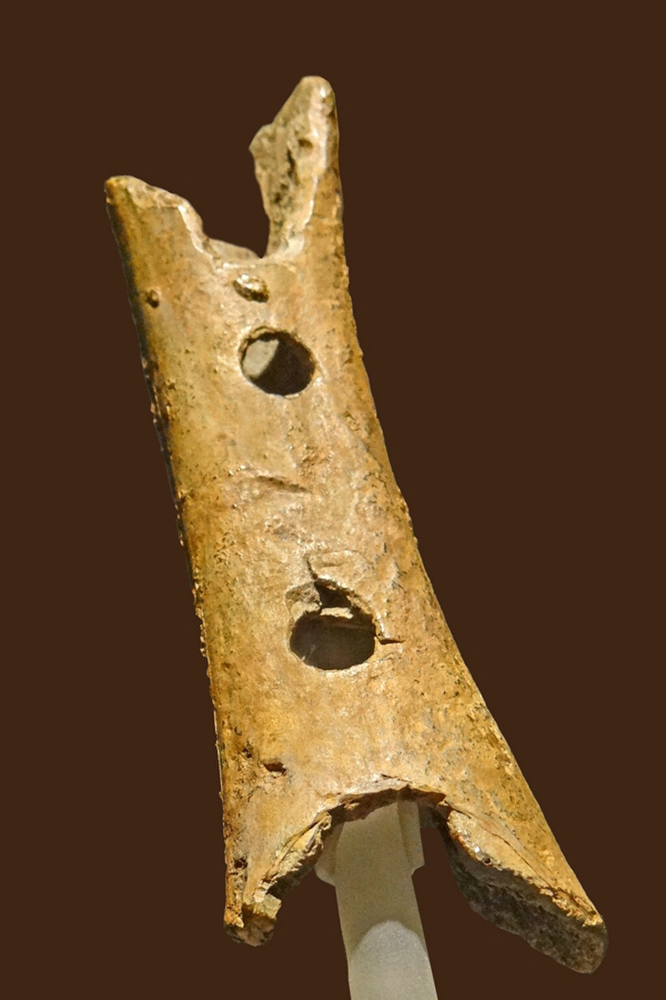](https://en.wikipedia.org/wiki/Divje_Babe_Flute "Divje Babe Flute")

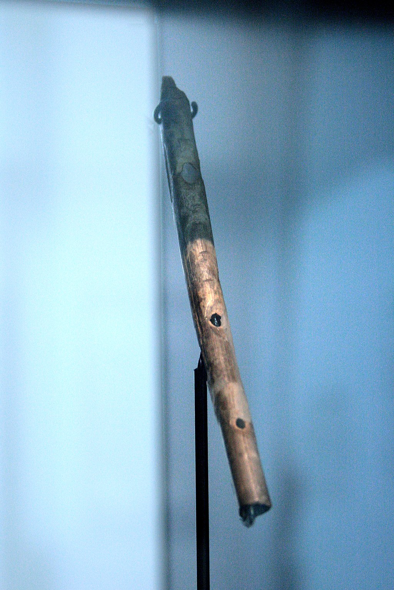

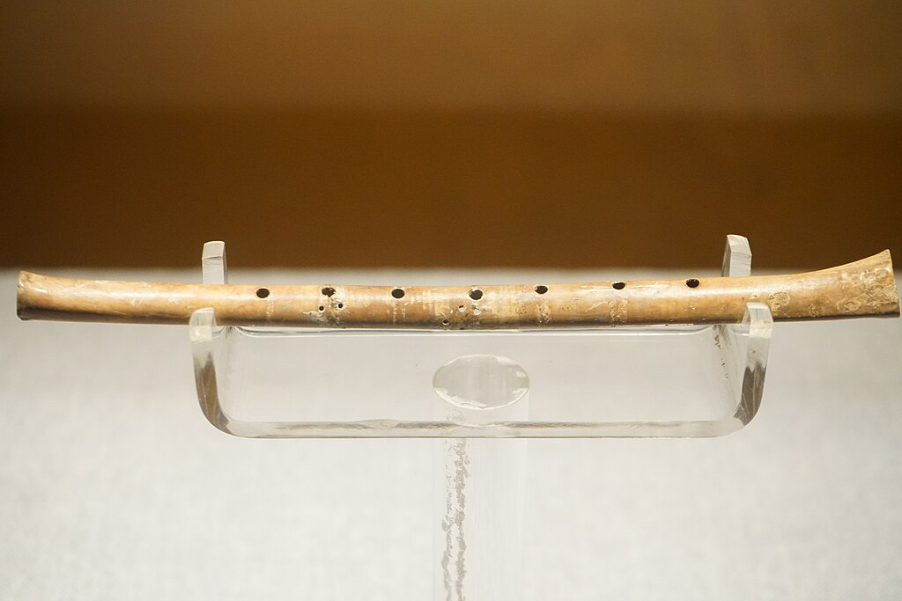

_Top left_, the purported [Divje Babe Flute](https://en.wikipedia.org/wiki/Divje_Babe_Flute "Divje Babe Flute") from [Divje Babe](https://en.wikipedia.org/wiki/Divje_Babe "Divje Babe"), Slovenia; _top right_ a [Aurignacian](https://en.wikipedia.org/wiki/Aurignacian "Aurignacian")[bone flute](https://en.wikipedia.org/wiki/Paleolithic_flutes "Paleolithic flutes") from [Geissenklösterle](https://en.wikipedia.org/wiki/Geissenklösterle "Geissenklösterle"), Germany; _bottom_ a [_gudi_ bone flute](https://en.wikipedia.org/wiki/Gudi_\(instrument\) "Gudi (instrument)") in the modern-day [Jiahu](https://en.wikipedia.org/wiki/Jiahu "Jiahu"), [Wuyang](https://en.wikipedia.org/wiki/Wuyang_County "Wuyang County"), [Henan Province](https://en.wikipedia.org/wiki/Henan_Province "Henan Province").

In the broadest sense, [prehistoric music](https://en.wikipedia.org/wiki/Prehistoric_music "Prehistoric music")—more commonly termed primitive music in the past—encompasses all music produced in [preliterate](https://en.wikipedia.org/wiki/Literate "Literate") cultures ([prehistory](https://en.wikipedia.org/wiki/Prehistory "Prehistory")), beginning at least 6 million years ago when [humans](https://en.wikipedia.org/wiki/Human "Human") and [chimpanzees](https://en.wikipedia.org/wiki/Chimpanzee "Chimpanzee") [last had a common ancestor](https://en.wikipedia.org/wiki/Chimpanzee–human_last_common_ancestor "Chimpanzee–human last common ancestor"). Music first arose in the [Paleolithic](https://en.wikipedia.org/wiki/Paleolithic "Paleolithic") period, though it remains unclear as to whether this was the [Middle](https://en.wikipedia.org/wiki/Middle_Paleolithic "Middle Paleolithic") (300,000 to 50,000 [BP](https://en.wikipedia.org/wiki/Before_Present "Before Present")) or [Upper Paleolithic](https://en.wikipedia.org/wiki/Upper_Paleolithic "Upper Paleolithic") (50,000 to 12,000 BP). The vast majority of Paleolithic instruments have been found in Europe and date to the Upper Paleolithic. It is certainly possible that singing emerged far before this time, though this is essentially impossible to confirm. The potentially oldest instrument is the [Divje Babe Flute](https://en.wikipedia.org/wiki/Divje_Babe_Flute "Divje Babe Flute") from the [Divje Babe](https://en.wikipedia.org/wiki/Divje_Babe "Divje Babe") cave in Slovenia, dated to 43,000 and 82,000 and made from a young [cave bear](https://en.wikipedia.org/wiki/Cave_bear "Cave bear") [femur](https://en.wikipedia.org/wiki/Femur "Femur"). Purportedly used by [Neanderthals](https://en.wikipedia.org/wiki/Neanderthal "Neanderthal"), the Divje Babe Flute has received extensive scholarly attention, and whether it is truly a musical instrument or an object formed by animals is the subject of intense debate. If the former, it would be the oldest known musical instrument and evidence of a musical culture in the Middle Paleolithic. Other than the Divje Babe Flute and three other doubtful flutes, there is virtually no surviving Middle Paleolithic musical evidence of any certainty, similar to the [situation in regards to visual art](https://en.wikipedia.org/wiki/Art_of_the_Middle_Paleolithic "Art of the Middle Paleolithic"). The earliest objects whose designations as musical instruments are widely accepted are [bone flutes](https://en.wikipedia.org/wiki/Paleolithic_flutes "Paleolithic flutes") from the [Swabian Jura](https://en.wikipedia.org/wiki/Swabian_Jura "Swabian Jura"), Germany, namely from the [Geissenklösterle](https://en.wikipedia.org/wiki/Geissenklösterle "Geissenklösterle"), [Hohle Fels](https://en.wikipedia.org/wiki/Hohle_Fels "Hohle Fels") and [Vogelherd](https://en.wikipedia.org/wiki/Vogelherd_Cave "Vogelherd Cave") caves. Dated to the [Aurignacian](https://en.wikipedia.org/wiki/Aurignacian "Aurignacian") (of the Upper Paleolithic) and used by [Early European modern humans](https://en.wikipedia.org/wiki/Early_European_modern_humans "Early European modern humans"), from all three caves there are eight examples, four made from the [wing bones](https://en.wikipedia.org/wiki/Bird's_wing "Bird's wing") of birds and four from [mammoth ivory](https://en.wikipedia.org/wiki/Mammoth_ivory "Mammoth ivory"); three of these are near complete. Three flutes from the Geissenklösterle are dated as the oldest, c. 43,150–39,370 BP.

Considering the relative complexity of flutes, it is likely earlier instruments existed, akin to objects that are common in later [hunter and gatherer](https://en.wikipedia.org/wiki/Hunter_and_gatherer "Hunter and gatherer") societies, such as [rattles](https://en.wikipedia.org/wiki/Rattle_\(percussion_instrument\) "Rattle (percussion instrument)"), [shakers](https://en.wikipedia.org/wiki/Shaker_\(musical_instrument\) "Shaker (musical instrument)"), and [drums](https://en.wikipedia.org/wiki/Drum "Drum"). The absence of other instruments from and before this time may be due to their use of weaker—and thus more [biodegradable](https://en.wikipedia.org/wiki/Biodegradation "Biodegradation")—materials, such as reeds, gourds, skins, and bark. A painting in the [Cave of the Trois-Frères](https://en.wikipedia.org/wiki/Cave_of_the_Trois-Frères "Cave of the Trois-Frères") dating to c. 15,000 BCE is thought to depict a [shaman](https://en.wikipedia.org/wiki/Shaman "Shaman") playing a [musical bow](https://en.wikipedia.org/wiki/Musical_bow "Musical bow").

Prehistoric cultures are thought to have had a wide variety of uses for music, with little unification between different societies. Music was likely of particular value when food and other basic needs were scarce. It is also probable that prehistoric cultures viewed music as intrinsically connected with nature, and may have believed its use influenced the natural world directly.

The earliest instruments found in prehistoric China are 12 [_gudi_ bone flutes](https://en.wikipedia.org/wiki/Gudi_\(instrument\) "Gudi (instrument)") in the modern-day [Jiahu](https://en.wikipedia.org/wiki/Jiahu "Jiahu"), [Wuyang](https://en.wikipedia.org/wiki/Wuyang_County "Wuyang County"), [Henan Province](https://en.wikipedia.org/wiki/Henan_Province "Henan Province") from c. 6000 BCE. The only instruments dated to the prehistoric [Xia dynasty](https://en.wikipedia.org/wiki/Xia_dynasty "Xia dynasty") (c. 2070–1600) are two _[qing](https://en.wikipedia.org/wiki/Sounding_stone "Sounding stone")_, two small bells (one [earthenware](https://en.wikipedia.org/wiki/Earthenware "Earthenware"), one [bronze](https://en.wikipedia.org/wiki/Bronze "Bronze")), and a _[xun](https://en.wikipedia.org/wiki/Xun_\(instrument\) "Xun (instrument)")_. Due to this extreme scarcity of surviving instruments and the general uncertainty surrounding most of the Xia, creating a musical narrative of the period is impractical. In the [Indian subcontinent](https://en.wikipedia.org/wiki/Indian_subcontinent "Indian subcontinent"), the prehistoric [Indus Valley civilisation](https://en.wikipedia.org/wiki/Indus_Valley_civilisation "Indus Valley civilisation") (from c. 2500–2000 BCE in its mature state) has archeological evidence that indicates simple [rattles](https://en.wikipedia.org/wiki/Rattle_\(percussion_instrument\) "Rattle (percussion instrument)") and [vessel flutes](https://en.wikipedia.org/wiki/Vessel_flute "Vessel flute") were used, while iconographical evidence suggests early harps and drums also existed. An [ideogram](https://en.wikipedia.org/wiki/Ideogram "Ideogram") in the later IVC contains the earliest known depiction of an [arched harp](https://en.wikipedia.org/wiki/Arched_harp "Arched harp"), dated sometime before 1800 BCE.

## Antiquity

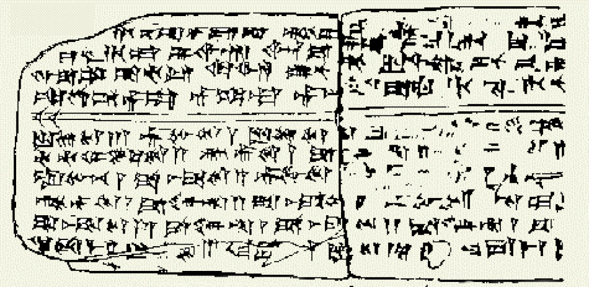Drawing of the tablet with the Hymn to [Nikkal](https://en.wikipedia.org/wiki/Nikkal "Nikkal") (c. 1400 BCE), the oldest of the [Hurrian songs](https://en.wikipedia.org/wiki/Hurrian_songs "Hurrian songs")

Following the [advent of writing](https://en.wikipedia.org/wiki/History_of_writing "History of writing"), literate civilizations are termed part of the [ancient world](https://en.wikipedia.org/wiki/Ancient_world "Ancient world"), the first of which is [Sumerian literature](https://en.wikipedia.org/wiki/Sumerian_literature "Sumerian literature") of [Abu Salabikh](https://en.wikipedia.org/wiki/Abu_Salabikh "Abu Salabikh") (now Southern Iraq) of c. 2600 BCE. Though the [music of Ancient societies](https://en.wikipedia.org/wiki/Ancient_music "Ancient music") was extremely diverse, some fundamental concepts arise prominently in virtually all of them, namely [monophony](https://en.wikipedia.org/wiki/Monophony "Monophony"), [improvisation](https://en.wikipedia.org/wiki/Improvisation "Improvisation") and the dominance of text in musical settings. Varying [song](https://en.wikipedia.org/wiki/Song "Song") forms were present in Ancient cultures, including China, Egypt, Greece, India, Mesopotamia, Rome, and the Middle East. The text, rhythm, and melodies of these songs were closely aligned, as was music in general, with magic, science, and religion. Complex song forms developed in later ancient societies, particularly the national festivals of China, Greece, and India. Later Ancient societies also saw increased trade and transmission of musical ideas and instruments, often shepherded by the [Silk Road](https://en.wikipedia.org/wiki/Silk_Road "Silk Road"). For example, a tuning key for a _qin_-zither from 4th–5th centuries BCE China includes considerable Persian iconography. In general, not enough information exists to make many other generalizations about ancient music between cultures.

The few actual examples of ancient music notation that survive usually exist on [papyrus](https://en.wikipedia.org/wiki/Papyrus "Papyrus") or [clay tablets](https://en.wikipedia.org/wiki/Clay_tablets "Clay tablets"). Information on musical practices, genres, and thought is mainly available through literature, visual depictions, and increasingly as the period progresses, instruments. The oldest surviving written music is the [Hurrian songs](https://en.wikipedia.org/wiki/Hurrian_songs "Hurrian songs") from [Ugarit](https://en.wikipedia.org/wiki/Ugarit "Ugarit"), Syria. Of these, the oldest is the Hymn to [Nikkal](https://en.wikipedia.org/wiki/Nikkal "Nikkal") (hymn no. 6; h. 6), which is somewhat complete and dated to c. 1400 BCE. However, the [Seikilos epitaph](https://en.wikipedia.org/wiki/Seikilos_epitaph "Seikilos epitaph") is the earliest entirely complete noted musical composition. Dated to the 2nd Century CE or later, it is an [epitaph](https://en.wikipedia.org/wiki/Epitaph "Epitaph"), perhaps for the wife of the unknown Seikilos.

### China

#### Shang and Zhou

> They strike the bells, _kin_, _kin_,
> They play the _se_-zither, play the _qin_-zither,
> The mouth organ and chime stones sound together;
> They sing the _Ya_ and _Nan_ Odes,
> And perform flawlessly upon their flutes.

— _[Shijing](https://en.wikipedia.org/wiki/Shijing "Shijing")_, Ode 208, _Gu Zhong_
Translated by John S. Major

By the mid-13th century BCE, the [Late Shang](https://en.wikipedia.org/wiki/Late_Shang "Late Shang") dynasty had developed writing, which mostly exists as divinatory [inscriptions](https://en.wikipedia.org/wiki/Oracle_bone_script "Oracle bone script") on the ritualistic [oracle bones](https://en.wikipedia.org/wiki/Oracle_bone "Oracle bone") but also as [bronze inscriptions](https://en.wikipedia.org/wiki/Chinese_bronze_inscriptions "Chinese bronze inscriptions"). As many as 11 oracle script characters may refer to music to some extent, some of which could be iconographical representations of instruments themselves. The stone bells _qing_ appears to have been particularly popular with the Shang ruling class, and while no surviving flutes have been dated to the Shang, oracle script evidence suggests they used [ocarinas](https://en.wikipedia.org/wiki/Ocarinas "Ocarinas") (_xun_), [transverse flute](https://en.wikipedia.org/wiki/Transverse_flute "Transverse flute") (_[xiao](https://en.wikipedia.org/wiki/Xiao_\(flute\) "Xiao (flute)")_ and _[dizi](https://en.wikipedia.org/wiki/Dizi_\(instrument\) "Dizi (instrument)")_), douple pipes, the mouthorgan (_[sheng](https://en.wikipedia.org/wiki/Sheng_\(instrument\) "Sheng (instrument)")_), and maybe the [pan flute](https://en.wikipedia.org/wiki/Pan_flute "Pan flute") (_[paixiao](https://en.wikipedia.org/wiki/Paixiao "Paixiao")_). Due to the [advent of the bronze in 2000 BCE](https://en.wikipedia.org/wiki/Bronze_Age_China "Bronze Age China"), the Shang used the material for bells—the _ling_ (鈴), _nao_ (鐃) and _zhong_ (鐘)—that can be differentiated in two ways: those with or without a clapper and those struck on the inside or outside. Drums, which are not found from before the Shang, sometimes used bronze, though they were more often wooden (_[bangu](https://en.wikipedia.org/wiki/Bangu_\(drum\) "Bangu (drum)")_). The aforementioned wind instruments certainly existed by the [Zhou dynasty](https://en.wikipedia.org/wiki/Zhou_dynasty "Zhou dynasty") (1046–256 BCE), as did the first Chinese string instruments: the _[qin](https://en.wikipedia.org/wiki/Guqin "Guqin")_ (or _guqin_) and _[se](https://en.wikipedia.org/wiki/Se_\(instrument\) "Se (instrument)")_ [zithers](https://en.wikipedia.org/wiki/Zither "Zither"). The Zhou saw the emergence of major court ensembles and the well known [Tomb of Marquis Yi of Zeng](https://en.wikipedia.org/wiki/Tomb_of_Marquis_Yi_of_Zeng "Tomb of Marquis Yi of Zeng") (after 433 BCE) contains a variety of complex and decorated instruments. Of the tomb, the by-far most notable instrument is the monumental [set of 65 tuned _bianzhong_ bells](https://en.wikipedia.org/wiki/Bianzhong_of_Marquis_Yi_of_Zeng "Bianzhong of Marquis Yi of Zeng"), which range five octaves requiring at least five players; they are still playable and include rare inscriptions on music.

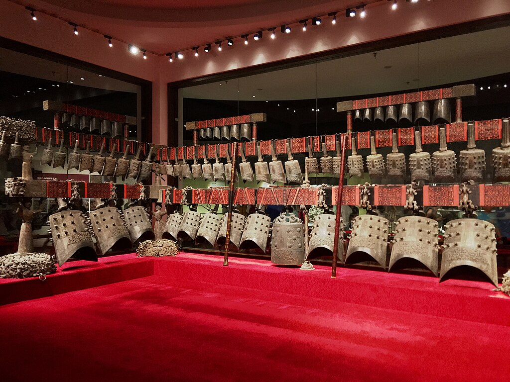The monumental [Bianzhong of Marquis Yi of Zeng](https://en.wikipedia.org/wiki/Bianzhong_of_Marquis_Yi_of_Zeng "Bianzhong of Marquis Yi of Zeng"), c. 5th century BCE, from [Hubei](https://en.wikipedia.org/wiki/Hubei "Hubei")

Ancient Chinese instruments served both practical and ceremonial means. People used them to appeal to [supernatural](https://en.wikipedia.org/wiki/Supernatural "Supernatural") forces for survival needs, while pan flutes may have been used to attract birds while hunting, and drums were common in sacrifices and military ceremonies. Chinese music has always been closely associated with dance, literature and fine arts; many early Chinese thinkers also equated music with proper morality and governance of society. Throughout the Shang and Zhou music was a symbol of power for the Imperial court, being used in religious services as well as the [celebration of ancestors](https://en.wikipedia.org/wiki/Ancestor_veneration_in_China "Ancestor veneration in China") and heroes. [Confucius](https://en.wikipedia.org/wiki/Confucius "Confucius") (c. 551–479) formally designated the music concerned with ritual and ideal morality as the superior _[yayue](https://en.wikipedia.org/wiki/Yayue "Yayue")_ (雅樂; "proper music"), in opposition to _suyue_ (俗樂; "vernacular/popular music"), which included virtually all non-ceremonial music, but particularly any that was considered excessive or lascivious. During the [Warring States Period](https://en.wikipedia.org/wiki/Warring_States_Period "Warring States Period") when of Confucius's lifetime, officials often ignored this distinction, preferring more lively _suyue_ music and using the older _yayue_ traditional solely for political means. Confucius and disciples such as [Mencius](https://en.wikipedia.org/wiki/Mencius "Mencius") considered this preference virtueless and saw ill of the leaders' ignorance of _[ganying](https://en.wikipedia.org/wiki/Ganying "Ganying")_, a theory that held music was intrinsically connected to the universe. Thus, many aspects of Ancient Chinese music were aligned with cosmology: the 12 pitch [shí-èr-lǜ](https://en.wikipedia.org/wiki/Shí-èr-lǜ "Shí-èr-lǜ") system corresponded equally with certain weights and measurements; the [pentatonic scale](https://en.wikipedia.org/wiki/Pentatonic_scale "Pentatonic scale") with the five _[wuxing](https://en.wikipedia.org/wiki/Wuxing_\(Chinese_philosophy\) "Wuxing (Chinese philosophy)")_; and the eight tone classification of [Chinese instruments](https://en.wikipedia.org/wiki/List_of_Chinese_instruments "List of Chinese instruments") of _bayin_ with the eight symbols of _[bagua](https://en.wikipedia.org/wiki/Bagua "Bagua")_. No actual music or texts on the performance practices of Ancient Chinese musicians survive. The [Five Classics](https://en.wikipedia.org/wiki/Five_Classics "Five Classics") of the Zhou dynasty include musical commentary; the _[I Ching](https://en.wikipedia.org/wiki/I_Ching "I Ching")_ and [_Chunqiu_ Spring and Autumn Annals](https://en.wikipedia.org/wiki/Spring_and_Autumn_Annals "Spring and Autumn Annals") make references, while the [_Liji_ Book of Rites](https://en.wikipedia.org/wiki/Liji "Liji") contains a substantial discussion (see the chapter [_Yue Ji_ Record of Music](https://en.wikipedia.org/wiki/Record_of_Music "Record of Music")). While the [_Yue Jing_ Classic of Music](https://en.wikipedia.org/wiki/Classic_of_Music "Classic of Music") is lost, the [_Shijing_ Classic of Poetry](https://en.wikipedia.org/wiki/Shijing "Shijing") contains 160 texts to now lost songs from the [Western Zhou](https://en.wikipedia.org/wiki/Western_Zhou "Western Zhou") period (1045–771).

#### Qin and Han

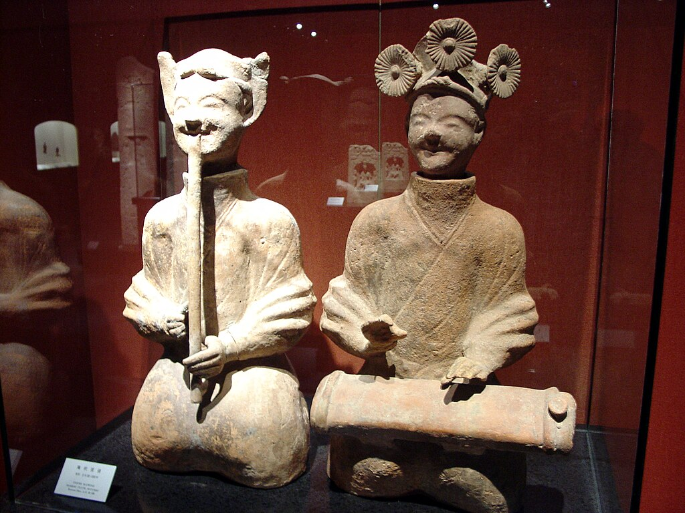Two musicians of the [Eastern Han Dynasty](https://en.wikipedia.org/wiki/Eastern_Han_Dynasty "Eastern Han Dynasty") (25–220 CE), [Shanghai Museum](https://en.wikipedia.org/wiki/Shanghai_Museum "Shanghai Museum")

The [Qin dynasty](https://en.wikipedia.org/wiki/Qin_dynasty "Qin dynasty") (221–206 BCE), established by [Qin Shi Huang](https://en.wikipedia.org/wiki/Qin_Shi_Huang "Qin Shi Huang"), lasted for only 15 years, but the purported [burning of books](https://en.wikipedia.org/wiki/Burning_of_books_and_burying_of_scholars "Burning of books and burying of scholars") resulted in a substantial loss of previous musical literature. The Qin saw the _[guzheng](https://en.wikipedia.org/wiki/Guzheng "Guzheng")_ become a particularly popular instrument; as a more portable and louder zither, it meet the needs of an emerging popular music scene. During the [Han dynasty](https://en.wikipedia.org/wiki/Han_dynasty "Han dynasty") (202 BCE – 220 CE), there were attempts to reconstruct the music of the Shang and Zhou, as it was now "idealized as perfect". A [Music Bureau](https://en.wikipedia.org/wiki/Music_Bureau "Music Bureau"), the _Yuefu_, was founded or at its height by at least 120 BCE under [Emperor Wu of Han](https://en.wikipedia.org/wiki/Emperor_Wu_of_Han "Emperor Wu of Han"), and was responsible for collecting folksongs. The purpose of this was twofold; it allowed the Imperial Court to properly understand the thoughts of the common people, and it was also an opportunity for the Imperial Court to adapt and manipulate the songs to suit propaganda and political purposes. Employing ceremonial, entertainment-oriented and military musicians, the Bureau also performed at a variety of venues, wrote new music, and set music to commissioned poetry by noted figures such as [Sima Xiangru](https://en.wikipedia.org/wiki/Sima_Xiangru "Sima Xiangru"). The Han dynasty had officially adopted [Confucianism](https://en.wikipedia.org/wiki/Confucianism "Confucianism") as the state philosophy, and the _ganying_ theories became a dominant philosophy. In practice, however, many officials ignored or downplayed Confucius's high regard for _yayue_ over _suyue_ music, preferring to engage in the more lively and informal later. By 7 BCE the Bureau employed 829 musicians; that year [Emperor Ai](https://en.wikipedia.org/wiki/Emperor_Ai_of_Han "Emperor Ai of Han") either disbanded or downsized the department, due to financial limitations, and the Bureau's increasingly prominent _suyue_ music which conflicted with Confucianism. The Han dynasty saw a preponderance of foreign musical influences from the [Middle East](https://en.wikipedia.org/wiki/Middle_East "Middle East") and [Central Asia](https://en.wikipedia.org/wiki/Central_Asia "Central Asia"): the emerging Silk Road led to the exchange of musical instruments, and allowed travelers such as [Zhang Qian](https://en.wikipedia.org/wiki/Zhang_Qian "Zhang Qian") to relay with new musical genres and techniques. Instruments from said cultural transmission include metal trumpets and instruments similar to the modern [oboe](https://en.wikipedia.org/wiki/Oboe "Oboe") and [oud](https://en.wikipedia.org/wiki/Oud "Oud") lute, the latter which became the [pipa](https://en.wikipedia.org/wiki/Pipa "Pipa"). Other preexisting instruments greatly increased in popularity, such as the _qing_, panpipes, and particularly the _qin_-zither (or _guqin_), which was from then on the most revered instrument, associated with good character and morality.

### Greece

Greek written history extends far back into [Ancient Greece](https://en.wikipedia.org/wiki/Ancient_Greece "Ancient Greece"), and was a major part of ancient [Greek theatre](https://en.wikipedia.org/wiki/Theatre_of_ancient_Greece "Theatre of ancient Greece"). In ancient Greece, mixed-gender choruses performed for entertainment, celebration and spiritual reasons. Instruments included the most important wind instrument, the double-reed [aulos](https://en.wikipedia.org/wiki/Aulos "Aulos"), as well as the plucked [string instrument](https://en.wikipedia.org/wiki/String_instrument "String instrument"), the [lyre](https://en.wikipedia.org/wiki/Lyre "Lyre"), especially the special kind called a [kithara](https://en.wikipedia.org/wiki/Kithara "Kithara").

### India

The principal sources on the [music of ancient India](https://en.wikipedia.org/wiki/Music_in_ancient_India "Music in ancient India") are textual and iconographical; specifically, some theoretical treatises in [Sanskrit](/source/sanskrit/ "Sanskrit") survive, there are brief mentions in general literature and many sculptures of Ancient Indian musicians and their instruments exist. Ancient [Sanskrit](https://en.wikipedia.org/wiki/Sanskrit_literature "Sanskrit literature"), [Pali](https://en.wikipedia.org/wiki/Pali_literature "Pali literature"), and [Prakrit literature](https://en.wikipedia.org/wiki/Prakrit_literature "Prakrit literature") frequently contains musical references, from the [Vedas](https://en.wikipedia.org/wiki/Vedas "Vedas") to the works of [Kalidasa](https://en.wikipedia.org/wiki/Kalidasa "Kalidasa") and the [Ilango Adigal](https://en.wikipedia.org/wiki/Ilango_Adigal "Ilango Adigal")'s epic _[Silappatikaram](https://en.wikipedia.org/wiki/Silappatikaram "Silappatikaram")_. Despite this, little is known on the actual musical practices of ancient India and the information available forces a somewhat homogeneous perspective on the music of the time, even though evidence indicates that in reality, it was far more diverse.

The monumental arts treatise _[Natya Shastra](https://en.wikipedia.org/wiki/Natya_Shastra "Natya Shastra")_ is among the earliest and chief sources for Ancient Indian music; the music portions alone are likely from the [Gupta period](https://en.wikipedia.org/wiki/Gupta_Empire "Gupta Empire") (4th century to 6th century CE).

### Persia and Mesopotamia

#### Up to the Achaemenid period

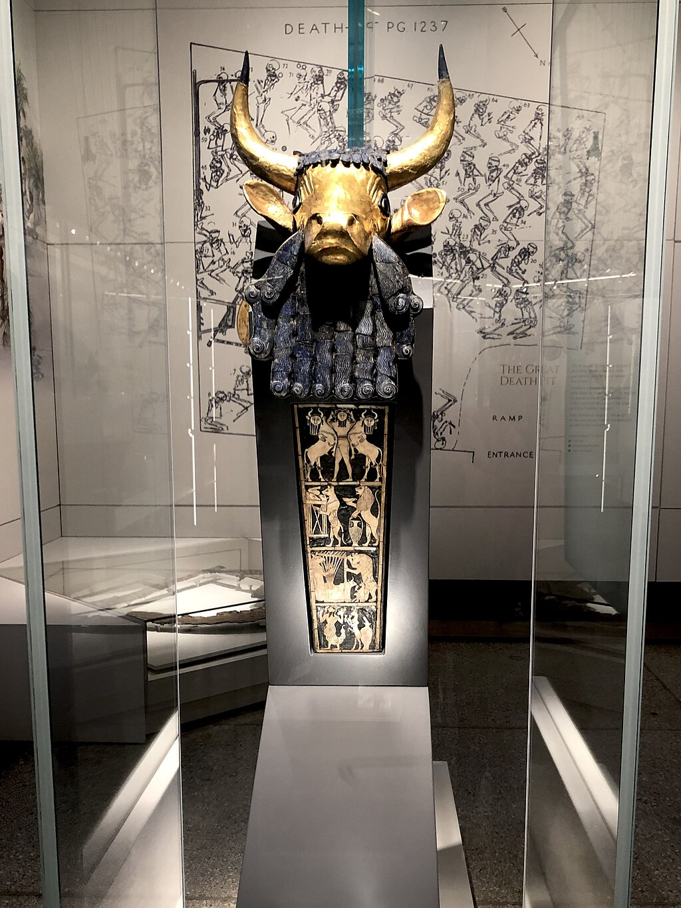The [Bull Headed Lyre of Ur](https://en.wikipedia.org/wiki/Bull_Headed_Lyre_of_Ur "Bull Headed Lyre of Ur"), found in the [Royal Cemetery at Ur](https://en.wikipedia.org/wiki/Royal_Cemetery_at_Ur "Royal Cemetery at Ur"), is the best known of the ancient [Lyres of Ur](https://en.wikipedia.org/wiki/Lyres_of_Ur "Lyres of Ur")

In general, it is impossible to create a thorough outline of the earliest music in Persia due to a paucity of surviving records. Evidenced by c. 3300–3100 BCE [Elam](https://en.wikipedia.org/wiki/Elam "Elam") depictions, arched harps are the first affirmation of Persian music, though it is probable that they existed well before their artistic depictions. Elamite bull lyres from c. 2450 have been found in [Susa](https://en.wikipedia.org/wiki/Susa "Susa"), while more than 40 small Oxus [trumpets](https://en.wikipedia.org/wiki/Trumpet "Trumpet") have been found in [Bactria](https://en.wikipedia.org/wiki/Bactria "Bactria") and [Margiana](https://en.wikipedia.org/wiki/Margiana "Margiana"), dated to the c. 2200–1750 [Bactria–Margiana Archaeological Complex](https://en.wikipedia.org/wiki/Bactria–Margiana_Archaeological_Complex "Bactria–Margiana Archaeological Complex"). The oxus trumpets seem to have had a close association with both religion and animals; a [Zoroastrian](https://en.wikipedia.org/wiki/Zoroastrian "Zoroastrian") myth in which Jamshid attract animals with the trumpet suggests that the Elamites used them for hunting. In many ways the earliest known musical cultures of Iran are strongly connected with those of Mesopotamia. Ancient arched harps (c. 3000) also exist in the latter and the scarcity of instruments makes it unclear as to which culture the harp originated. [Far more bull lyres](https://en.wikipedia.org/wiki/Lyres_of_Ur "Lyres of Ur") survive in [Ur](https://en.wikipedia.org/wiki/Ur "Ur") of Mesopotamia, notably the [Bull Headed Lyre of Ur](https://en.wikipedia.org/wiki/Bull_Headed_Lyre_of_Ur "Bull Headed Lyre of Ur"), though they are nearly identical to their contemporary Elamite counterparts. From the evidence in terracotta plaques, by the 2nd-century BCE the arched harp was displaced by the [angular harps](https://en.wikipedia.org/wiki/Angular_harp "Angular harp"), which existed in 20-string vertical and nine-string horizontal variants. Lutes were purportedly used in Mesopotamia by at least 2300 BCE, but not until c. 1300 BCE do they appear in Iran, where they became the dominant string instruments of [Western Iran](https://en.wikipedia.org/wiki/Western_Iran "Western Iran"), though the available evidence suggests its popularity was outside of the elite. The [rock reliefs](https://en.wikipedia.org/wiki/Rock_relief "Rock relief") of [Kul-e Farah](https://en.wikipedia.org/wiki/Kul-e_Farah "Kul-e Farah") show that sophisticated Persian court ensembles emerged in the 1st-century BCE, in the which the central instrument was the arched harp. The prominence of musicians in these certain rock reliefs suggests they were essential in religious ceremonies.

Like earlier periods, extremely little contemporary information on the music of the [Achaemenid Empire](https://en.wikipedia.org/wiki/Achaemenid_Empire "Achaemenid Empire") (550–330 BCE) exists. Most knowledge on the Achaemenid musical culture comes from Greek historians. In his _[Histories](https://en.wikipedia.org/wiki/Histories_\(Herodotus\) "Histories (Herodotus)")_, [Herodotus](https://en.wikipedia.org/wiki/Herodotus "Herodotus") noted that Achaemenid priests did not use [aulos](https://en.wikipedia.org/wiki/Aulos "Aulos") music in their ceremonies, while [Xenophon](https://en.wikipedia.org/wiki/Xenophon "Xenophon") reflected on his visit to Persia in the _[Cyropaedia](https://en.wikipedia.org/wiki/Cyropaedia "Cyropaedia")_, mentioning the presence of many female singers at court. [Athenaeus](https://en.wikipedia.org/wiki/Athenaeus "Athenaeus") also mentions female singers when noting that 329 of them had been taken from the [King of Kings](https://en.wikipedia.org/wiki/King_of_Kings "King of Kings") [Darius III](https://en.wikipedia.org/wiki/Darius_III "Darius III") by Macedonian general [Parmenion](https://en.wikipedia.org/wiki/Parmenion "Parmenion"). Later Persian texts assert that _[gōsān](https://en.wikipedia.org/wiki/Gusans "Gusans")_ poet-musician [minstrels](https://en.wikipedia.org/wiki/Minstrel "Minstrel") were prominent and of considerable status in court.

#### Parthian and Sasanian periods

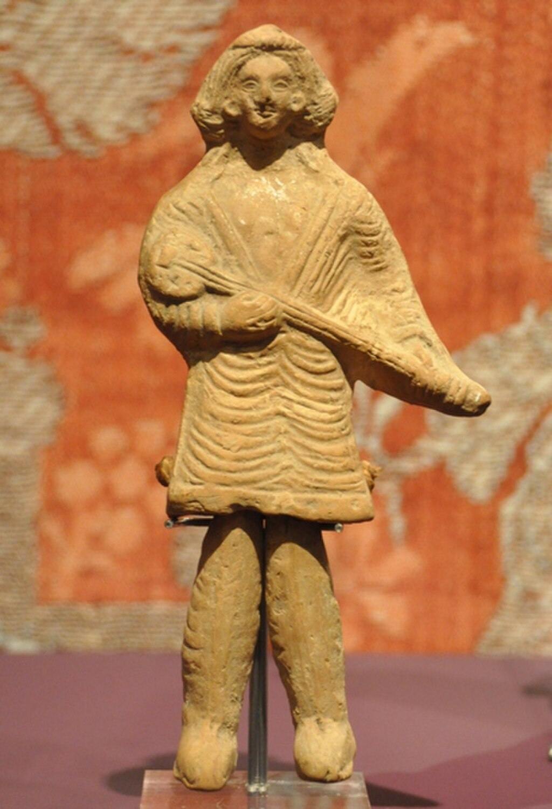Terracotta statue of a Parthian lute player

The [Parthian Empire](https://en.wikipedia.org/wiki/Parthian_Empire "Parthian Empire") (247 BCE to 224 CE) saw an increase in textual and iconographical depictions of musical activity and instruments. 2nd century BCE Parthian _[rhuta](https://en.wikipedia.org/wiki/Rhyton "Rhyton")_ (drinking horns) found in the ancient capital of [Nisa](https://en.wikipedia.org/wiki/Nisa,_Turkmenistan "Nisa, Turkmenistan") include some of the most vivid depictions of musicians from the time. Pictorial evidence such as [terracotta](https://en.wikipedia.org/wiki/Terracotta "Terracotta") plaques show female harpists, while plaques from [Babylon](https://en.wikipedia.org/wiki/Babylon "Babylon") show [panpipes](https://en.wikipedia.org/wiki/Panpipes "Panpipes"), as well as string (harps, lutes and lyres) and percussion instruments ([tambourines](https://en.wikipedia.org/wiki/Tambourines "Tambourines") and [clappers](https://en.wikipedia.org/wiki/Clapper_\(musical_instrument\) "Clapper (musical instrument)")). Bronze statues from [Dura-Europos](https://en.wikipedia.org/wiki/Dura-Europos "Dura-Europos") depict larger panpipes and double aulos. Music was evidently used in ceremonies and celebrations; a Parthian-era stone [frieze](https://en.wikipedia.org/wiki/Frieze "Frieze") in [Hatra](https://en.wikipedia.org/wiki/Hatra "Hatra") shows a wedding where musicians are included, playing trumpets, tambourines, and a variety of flutes. Other textual and iconographical evidence indicates the continued prominence of _gōsān_ minstrels. However, like the Achaemenid period, Greek writers continue to be a major source for information on Parthian music. [Strabo](https://en.wikipedia.org/wiki/Strabo "Strabo") recorded that the _gōsān_ learned songs telling tales of gods and noblemen, while [Plutarch](https://en.wikipedia.org/wiki/Plutarch "Plutarch") similarly records the _gōsān_ lauding Parthian heroes and mocking Roman ones. Plutarch also records, much to his bafflement, that _[rhoptra](https://en.wikipedia.org/wiki/Rhoptra "Rhoptra")_ (large drums) were used by the [Parthian army](https://en.wikipedia.org/wiki/Parthian_army "Parthian army") to prepare for war.

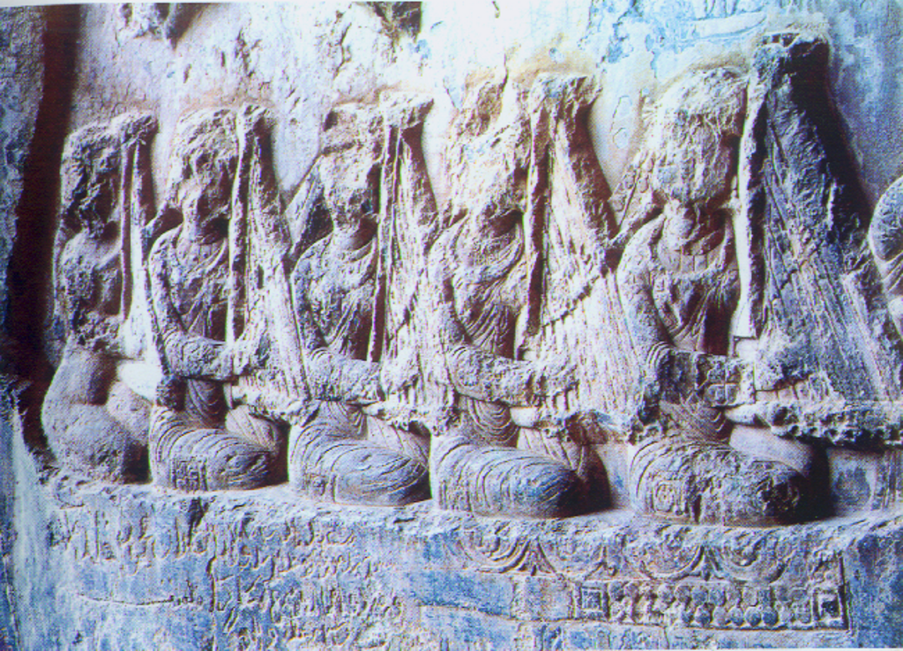c. 379 CE [Bas relief](https://en.wikipedia.org/wiki/Bas_relief "Bas relief") of [Sassanid](https://en.wikipedia.org/wiki/Sassanid "Sassanid") women playing the _[chang](https://en.wikipedia.org/wiki/Chang_\(instrument\) "Chang (instrument)")_ in [Taq-e Bostan](https://en.wikipedia.org/wiki/Taq-e_Bostan "Taq-e Bostan"), Iran

The [Sasanian](https://en.wikipedia.org/wiki/Sasanian "Sasanian") period (226–651 CE), however, has left ample evidence of music. This influx of Sasanian records suggests a prominent musical culture in the Empire, especially in the areas dominated by [Zoroastrianism](https://en.wikipedia.org/wiki/Zoroastrianism "Zoroastrianism"). Many Sassanian [Shahanshahs](https://en.wikipedia.org/wiki/Shahanshah "Shahanshah") were ardent supporters of music, including the founder of the empire [Ardashir I](https://en.wikipedia.org/wiki/Ardashir_I "Ardashir I") and [Bahram V](https://en.wikipedia.org/wiki/Bahram_V "Bahram V"). [Khosrow II](https://en.wikipedia.org/wiki/Khosrow_II "Khosrow II") (r. 590–628) was the most outstanding [patron](https://en.wikipedia.org/wiki/Patron "Patron"), his reign being regarded as a [golden age](https://en.wikipedia.org/wiki/Golden_age "Golden age") of Persian music. Musicians in Khosrow's service include Āzādvar-e Changi (or Āzād), [Bamshad](https://en.wikipedia.org/wiki/Bamshad "Bamshad"), the harpist [Nagisa](https://en.wikipedia.org/wiki/Nagisa_\(harpist\) "Nagisa (harpist)") (Nakisa), Ramtin, [Sarkash](https://en.wikipedia.org/wiki/Sarkash "Sarkash") and [Barbad](https://en.wikipedia.org/wiki/Barbad "Barbad"), who was the most famous. These musicians were usually active as [minstrels](https://en.wikipedia.org/wiki/Minstrel "Minstrel"), which were performers who worked as both court poets and musicians; in the Sassanian Empire there was little distinction between poetry and music.

### Other Arab and African cultures

The Western African [Nok culture](https://en.wikipedia.org/wiki/Nok_culture "Nok culture") (modern-day Nigeria) existed from c. 500–200 BCE and left a considerable amount of sculptures. Among these are depictions of music, such as a man who shakes two objects thought to be [maracas](https://en.wikipedia.org/wiki/Maraca "Maraca"). Another sculpture includes a man with his mouth opening (possibly singing) while there is also a sculpture of a man playing a drum.

## Post-classical era

### Japanese _gagaku_ music

The imperial court of Japan developed _[gagaku](https://en.wikipedia.org/wiki/Gagaku "Gagaku")_ ((雅楽); lit.'elegant music') music, originating from the _Gagakuryō_ imperial music academy established in 700 CE during the [Asuka period](https://en.wikipedia.org/wiki/Asuka_period "Asuka period"). Though the word _gagaku_ derives from the Chinese _yayue_ music, the latter originally referred to Confucian ritual music, while _gagaku_ extends to many genres, styles and instruments. In the tradition's early history, the three main genres were _wagaku_ (native Japanese music), _sankangaku_ (music from the [Three Kingdoms of Korea](https://en.wikipedia.org/wiki/Three_Kingdoms_of_Korea "Three Kingdoms of Korea")) and _tōgaku_ (music from China's [Tang dynasty](https://en.wikipedia.org/wiki/Tang_dynasty "Tang dynasty")), as well as more minor genres such as _toragaku_, _gigaku_, and _rin’yūgaku_. Uniquely among Asian music of this time, there are numerous extant scores of _gagaku_ music from the 8th to 11th centuries.

A major shift in _gagaku_ music occurred in the 9th century, namely the development of a distinction between _[tōgaku](https://en.wikipedia.org/wiki/Tōgaku "Tōgaku")_ and _[komagaku](https://en.wikipedia.org/wiki/Komagaku "Komagaku")_ music. _Tōgaku_ was a Chinese-influenced style, which combined with the _rin’yūgaku_ tradition, referred to as "Music of the Left" (_sahō_). _Komagaku_ was then referred to as "Music of the Right" (_uhō_), encompassing music influenced by both Korea (_sankangaku_) and [Balhae](https://en.wikipedia.org/wiki/Balhae "Balhae") (_bokkaigaku_). Though this division was prominent, it was not strict and the _tōgaku_ and _komagaku_ styles nonetheless interlaced and influenced each other. The long [Heian period](https://en.wikipedia.org/wiki/Heian_period "Heian period") (794–1185) saw much patronage of _gagaku_ music from the court, as it accompanied many festivals and celebrations. Numerous new genres emerged at this time, such as the _[saibara](https://en.wikipedia.org/wiki/Saibara "Saibara")_ and _rōei_ song forms. _Gagaku_ ensembles consist of a wide variety of instruments and are the largest such formations in [traditional Japanese music](https://en.wikipedia.org/wiki/Traditional_Japanese_music "Traditional Japanese music").

### Medieval Europe

_Alleluia nativitas_ by [Perotin](https://en.wikipedia.org/wiki/Perotin "Perotin") from the Codex Guelf.1099

Modern scholars generally define '[Medieval music](/source/medieval-music/ "Medieval music")' as the music of [Western Europe](https://en.wikipedia.org/wiki/Western_Europe "Western Europe") during the [Middle Ages](https://en.wikipedia.org/wiki/Middle_Ages "Middle Ages"), from approximately the 6th to 15th centuries. Music was certainly prominent in the [Early Middle Ages](https://en.wikipedia.org/wiki/Early_Middle_Ages "Early Middle Ages"), as attested by artistic depictions of instruments, writings about music, and other records; however, the only repertory of music which has survived from before 800 to the present day is the [plainsong](https://en.wikipedia.org/wiki/Plainsong "Plainsong") liturgical music of the Roman Catholic Church, the largest part of which is called [Gregorian chant](https://en.wikipedia.org/wiki/Gregorian_chant "Gregorian chant"). [Pope Gregory I](https://en.wikipedia.org/wiki/Pope_Gregory_I "Pope Gregory I"), who gave his name to the musical repertory and may himself have been a composer, is usually claimed to be the originator of the musical portion of the liturgy in its present form, though the sources giving details on his contribution date from more than a hundred years after his death. Many scholars believe that his reputation has been exaggerated by legend. Most of the chant repertory was composed anonymously in the centuries between the time of Gregory and [Charlemagne](https://en.wikipedia.org/wiki/Charlemagne "Charlemagne").

During the 9th century, several important developments took place. First, there was a major effort by the Church to unify the many chant traditions and suppress many of them in favor of the Gregorian liturgy. Second, the earliest [polyphonic](https://en.wikipedia.org/wiki/Polyphony "Polyphony") music was sung, a form of parallel singing known as [organum](https://en.wikipedia.org/wiki/Organum "Organum"). Third, and of the greatest significance for music history, [notation](https://en.wikipedia.org/wiki/Music_notation "Music notation") was reinvented after a lapse of about five hundred years, though it would be several more centuries before a system of pitch and rhythm notation evolved having the precision and flexibility that modern musicians take for granted.

Several schools of polyphony flourished in the period after 1100: the [St. Martial school](https://en.wikipedia.org/wiki/St._Martial_school "St. Martial school") of organum, the music of which was often characterized by a swiftly moving part over a single sustained line; the [Notre Dame school](https://en.wikipedia.org/wiki/Notre_Dame_school "Notre Dame school") of polyphony, which included the composers [Léonin](https://en.wikipedia.org/wiki/Léonin "Léonin") and [Pérotin](https://en.wikipedia.org/wiki/Pérotin "Pérotin"), and which produced the first music for more than two parts around 1200; the musical melting-pot of [Santiago de Compostela](https://en.wikipedia.org/wiki/Santiago_de_Compostela "Santiago de Compostela") in [Galicia](https://en.wikipedia.org/wiki/Galicia_\(Spain\) "Galicia (Spain)"), a pilgrimage destination and site where musicians from many traditions came together in the late Middle Ages, the music of whom survives in the [Codex Calixtinus](https://en.wikipedia.org/wiki/Codex_Calixtinus "Codex Calixtinus"); and the English school, the music of which survives in the [Worcester Fragments](https://en.wikipedia.org/wiki/Worcester_Fragments "Worcester Fragments") and the [Old Hall Manuscript](https://en.wikipedia.org/wiki/Old_Hall_Manuscript "Old Hall Manuscript"). Alongside these schools of sacred music a vibrant tradition of the secular song developed, as exemplified in the music of the [troubadours](https://en.wikipedia.org/wiki/Troubadour "Troubadour"), [trouvères](https://en.wikipedia.org/wiki/Trouvère "Trouvère"), and [Minnesänger](https://en.wikipedia.org/wiki/Minnesinger "Minnesinger"). Much of the later secular music of the early [Renaissance](https://en.wikipedia.org/wiki/Renaissance "Renaissance") evolved from the forms, ideas, and the musical aesthetic of the troubadours, courtly poets, and itinerant musicians, whose culture was largely exterminated during the [Albigensian Crusade](https://en.wikipedia.org/wiki/Albigensian_Crusade "Albigensian Crusade") in the early 13th century.

Forms of sacred music which developed during the late 13th century included the [motet](https://en.wikipedia.org/wiki/Motet "Motet"), [conductus](https://en.wikipedia.org/wiki/Conductus "Conductus"), [discant](https://en.wikipedia.org/wiki/Discant "Discant"), and [clausulae](https://en.wikipedia.org/wiki/Clausula_\(music\) "Clausula (music)"). One unusual development was the _[Geisslerlieder](https://en.wikipedia.org/wiki/Geisslerlieder "Geisslerlieder")_, the music of wandering bands of [flagellants](https://en.wikipedia.org/wiki/Flagellant "Flagellant") during two periods: the middle of the 13th century (until they were suppressed by the Church); and the period during and immediately following the [Black Death](https://en.wikipedia.org/wiki/Black_Death "Black Death"), around 1350, when their activities were vividly recorded and well-documented with notated music. Their music mixed folk song styles with penitential or apocalyptic texts. The 14th century in European music history is dominated by the style of the _[ars nova](https://en.wikipedia.org/wiki/Ars_nova "Ars nova")_, which by convention is grouped with the medieval era in music, even though it had much in common with early Renaissance ideals and [aesthetics](https://en.wikipedia.org/wiki/Aesthetics "Aesthetics"). Much of the surviving music of the time is secular, and tends to use the [formes fixes](https://en.wikipedia.org/wiki/Formes_fixes "Formes fixes"): the [ballade](https://en.wikipedia.org/wiki/Ballade_\(forme_fixe\) "Ballade (forme fixe)"), the [virelai](https://en.wikipedia.org/wiki/Virelai "Virelai"), the [lai](https://en.wikipedia.org/wiki/Lai_\(poetic_form\) "Lai (poetic form)"), the [rondeau](https://en.wikipedia.org/wiki/Rondeau_\(music\) "Rondeau (music)"), which correspond to poetic forms of the same names. Most pieces in these forms are for one to three voices, likely with instrumental accompaniment: famous composers include [Guillaume de Machaut](https://en.wikipedia.org/wiki/Guillaume_de_Machaut "Guillaume de Machaut") and [Francesco Landini](https://en.wikipedia.org/wiki/Francesco_Landini "Francesco Landini").

### Byzantine

[Prominent and diverse musical practices](https://en.wikipedia.org/wiki/Byzantine_music "Byzantine music") were present in the [Byzantine Empire](https://en.wikipedia.org/wiki/Byzantine_Empire "Byzantine Empire"), which existed by 395 to 1453. Both sacred and secular music were commonplace, with [sacred music](https://en.wikipedia.org/wiki/Sacred_music "Sacred music") frequently used in church services and [secular music](https://en.wikipedia.org/wiki/Secular_music "Secular music") in many events including, ceremonies dramas, ballets, banquets, festivals and sports games. However, despite its popularity, secular Byzantine music was harshly criticized by the [Church Fathers](https://en.wikipedia.org/wiki/Church_Fathers "Church Fathers"), particularly [Jerome](https://en.wikipedia.org/wiki/Jerome "Jerome"). Composers of sacred music, especially hymns and chants, are generally well documented throughout the history of Byzantine music. However, those before the reign of [Justinian I](https://en.wikipedia.org/wiki/Justinian_I "Justinian I") are virtually unknown; the monks Anthimos, Auxentios and Timokles are said to have written [troparia](https://en.wikipedia.org/wiki/Troparia "Troparia"), but only the text to a single one by Auxentios survives. The first major form was the [kontakion](https://en.wikipedia.org/wiki/Kontakion "Kontakion"), of which [Romanos the Melodist](https://en.wikipedia.org/wiki/Romanos_the_Melodist "Romanos the Melodist") was the foremost composer. In the late 7th century the [kanōn](https://en.wikipedia.org/wiki/Canon_\(hymnography\) "Canon (hymnography)") overtook the kontakion in popularity; [Andrew of Crete](https://en.wikipedia.org/wiki/Andrew_of_Crete "Andrew of Crete") became its first significant composer, and is traditionally credited as the genre's originator, though modern scholars now doubt this attribution. The kañon reached its peak with the music of [John of Damascus](https://en.wikipedia.org/wiki/John_of_Damascus "John of Damascus") and [Cosmas of Maiuma](https://en.wikipedia.org/wiki/Cosmas_of_Maiuma "Cosmas of Maiuma") and later [Theodore of Stoudios](https://en.wikipedia.org/wiki/Theodore_of_Stoudios "Theodore of Stoudios") and [Theophanes the Branded](https://en.wikipedia.org/wiki/Theophanes_the_Branded "Theophanes the Branded") in the 8th and 9th centuries respectively. Composers of secular music are considerably less documented. Not until late in the empire's history are composers known by name, with [Joannes Koukouzeles](https://en.wikipedia.org/wiki/Joannes_Koukouzeles "Joannes Koukouzeles"), [Xenos Korones](https://en.wikipedia.org/wiki/Xenos_Korones "Xenos Korones") and Joannes Glykys as the leading figures.

Like their Western counterparts of the same period, Byzantine composers were primarily men. [Kassia](https://en.wikipedia.org/wiki/Kassia "Kassia") is a major exception to this; she was a prolific and important composer of [sticheron](https://en.wikipedia.org/wiki/Sticheron "Sticheron") hymns and the only woman whose works entered the [Byzantine liturgy](https://en.wikipedia.org/wiki/Byzantine_liturgy "Byzantine liturgy"). A few other women are known to have been composers, Thekla, Theodosia, Martha and the daughter of [John Kladas](https://en.wikipedia.org/wiki/John_Kladas "John Kladas") (her given name is unrecorded). Only the latter has any surviving work, a single [antiphon](https://en.wikipedia.org/wiki/Antiphon "Antiphon"). Some [Byzantine emperors](https://en.wikipedia.org/wiki/Byzantine_emperor "Byzantine emperor") are known to have been composers, such as [Leo VI the Wise](https://en.wikipedia.org/wiki/Leo_VI_the_Wise "Leo VI the Wise") and [Constantine VII](https://en.wikipedia.org/wiki/Constantine_VII "Constantine VII").

## Early modern and modern periods

### Indian classical music

During the ancient and medieval periods, the [classical music](https://en.wikipedia.org/wiki/Art_music "Art music") of the [Indian subcontinent](https://en.wikipedia.org/wiki/Indian_subcontinent "Indian subcontinent") was a largely unified practice. By the 14th century, socio-political turmoil inaugurated by the [Delhi Sultanate](https://en.wikipedia.org/wiki/Delhi_Sultanate "Delhi Sultanate") began to isolate Northern and Southern India, and independent traditions in each region began emerging. By the 16th-century two distinct styles had formed: the [Hindustani classical music](https://en.wikipedia.org/wiki/Hindustani_classical_music "Hindustani classical music") of the North and the [Carnatic classical music](https://en.wikipedia.org/wiki/Carnatic_classical_music "Carnatic classical music") of the South. One of the major differences between them is that the Northern Hindustani vein was considerably influenced by the Persian and Arab musical practices of the time. Carnatic music is largely devotional; the majority of the songs are addressed to the Hindu deities.

Indian classical music (marga) is monophonic and based on a single melody line or [raga](https://en.wikipedia.org/wiki/Raga "Raga") rhythmically organized through [talas](https://en.wikipedia.org/wiki/Tala_\(music\) "Tala (music)").

### Western classical music

#### Renaissance

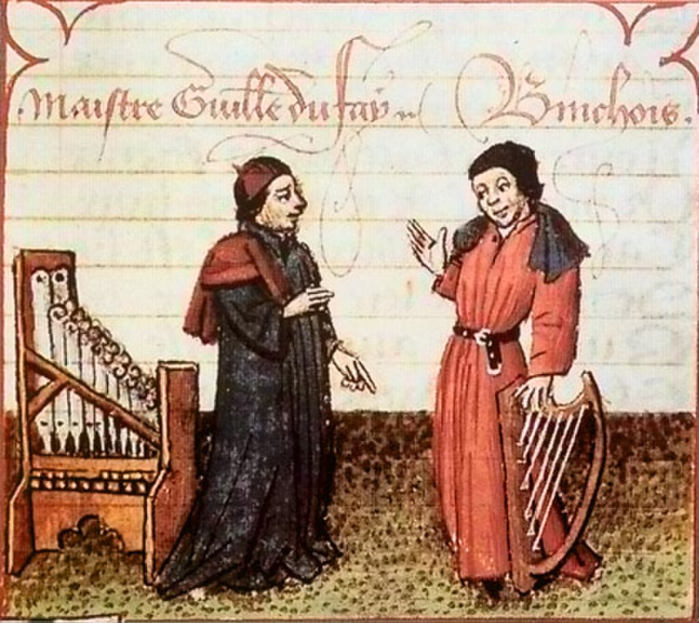[Guillaume Du Fay](https://en.wikipedia.org/wiki/Guillaume_Du_Fay "Guillaume Du Fay") (left), with [Gilles Binchois](https://en.wikipedia.org/wiki/Gilles_Binchois "Gilles Binchois") (right) in a c. 1440 [Illuminated manuscript](https://en.wikipedia.org/wiki/Illuminated_manuscript "Illuminated manuscript") copy of [Martin le Franc's](https://en.wikipedia.org/wiki/Martin_le_Franc "Martin le Franc") _Le champion des dames_

The beginning of the Renaissance in music is not as clearly marked as the beginning of the Renaissance in the other arts, and unlike in the other arts, it did not begin in [Italy](https://en.wikipedia.org/wiki/Italy "Italy"), but in northern Europe, specifically in the area currently comprising central and northern [France](https://en.wikipedia.org/wiki/France "France"), the [Netherlands](https://en.wikipedia.org/wiki/Netherlands "Netherlands"), and [Belgium](https://en.wikipedia.org/wiki/Belgium "Belgium"). The style of the [Burgundian](https://en.wikipedia.org/wiki/Burgundian_school "Burgundian school") composers, as the first generation of the [Franco-Flemish](https://en.wikipedia.org/wiki/Dutch_School_\(music\) "Dutch School (music)") school is known, was at first a reaction against the excessive complexity and mannered style of the late 14th century _[ars subtilior](https://en.wikipedia.org/wiki/Ars_subtilior "Ars subtilior")_, and contained clear, singable melody and balanced [polyphony](https://en.wikipedia.org/wiki/Polyphony "Polyphony") in all voices. The most famous composers of the Burgundian school in the mid-15th century are [Guillaume Dufay](https://en.wikipedia.org/wiki/Guillaume_Dufay "Guillaume Dufay"), [Gilles Binchois](https://en.wikipedia.org/wiki/Gilles_Binchois "Gilles Binchois"), and [Antoine Busnois](https://en.wikipedia.org/wiki/Antoine_Busnois "Antoine Busnois").

By the middle of the 15th century, composers and singers from the [Low Countries](https://en.wikipedia.org/wiki/Low_Countries "Low Countries") and adjacent areas began to spread across Europe, especially into Italy, where they were employed by the papal chapel and the aristocratic patrons of the arts (such as the [Medici](https://en.wikipedia.org/wiki/Medici "Medici"), the [Este](https://en.wikipedia.org/wiki/House_of_Este "House of Este"), and the [Sforza](https://en.wikipedia.org/wiki/Sforza "Sforza") families). They carried their style with them: smooth polyphony which could be adapted for sacred or secular use as appropriate. Principal forms of sacred musical composition at the time were the [mass](https://en.wikipedia.org/wiki/Mass_\(music\) "Mass (music)"), the [motet](https://en.wikipedia.org/wiki/Motet "Motet"), and the [laude](https://en.wikipedia.org/wiki/Laude "Laude"); secular forms included the [chanson](https://en.wikipedia.org/wiki/Chanson "Chanson"), the [frottola](https://en.wikipedia.org/wiki/Frottola "Frottola"), and later the [madrigal](https://en.wikipedia.org/wiki/Madrigal_\(music\) "Madrigal (music)").

The invention of [printing](https://en.wikipedia.org/wiki/Printing "Printing") had an immense influence on the dissemination of musical styles, and along with the movement of the Franco-Flemish musicians, contributed to the establishment of the first truly international style in European music since the unification of Gregorian chant under Charlemagne. Composers of the middle generation of the Franco-Flemish school included [Johannes Ockeghem](https://en.wikipedia.org/wiki/Johannes_Ockeghem "Johannes Ockeghem"), who wrote music in a contrapuntally complex style, with varied texture and an elaborate use of [canonical](https://en.wikipedia.org/wiki/Canon_\(music\) "Canon (music)") devices; [Jacob Obrecht](https://en.wikipedia.org/wiki/Jacob_Obrecht "Jacob Obrecht"), one of the most famous composers of masses in the last decades of the 15th century; and [Josquin des Prez](https://en.wikipedia.org/wiki/Josquin_des_Prez "Josquin des Prez"), probably the most famous composer in Europe before [Palestrina](/source/palestrina/ "Giovanni Pierluigi da Palestrina"), and who during the 16th century was renowned as one of the greatest artists in any form. Music in the generation after Josquin explored increasing complexity of [counterpoint](https://en.wikipedia.org/wiki/Counterpoint "Counterpoint"); possibly the most extreme expression is in the music of [Nicolas Gombert](https://en.wikipedia.org/wiki/Nicolas_Gombert "Nicolas Gombert"), whose contrapuntal complexities influenced early instrumental music, such as the [canzona](https://en.wikipedia.org/wiki/Canzona "Canzona") and the [ricercar](https://en.wikipedia.org/wiki/Ricercar "Ricercar"), ultimately culminating in [Baroque](https://en.wikipedia.org/wiki/Baroque_music "Baroque music") [fugal](https://en.wikipedia.org/wiki/Fugue "Fugue") forms.

By the middle of the 16th century, the international style began to break down, and several highly diverse stylistic trends became evident: a trend towards simplicity in sacred music, as directed by the [Counter-Reformation](https://en.wikipedia.org/wiki/Counter-Reformation "Counter-Reformation") [Council of Trent](https://en.wikipedia.org/wiki/Council_of_Trent "Council of Trent"), exemplified in the music of [Giovanni Pierluigi da Palestrina](/source/palestrina/ "Giovanni Pierluigi da Palestrina"); a trend towards complexity and [chromaticism](https://en.wikipedia.org/wiki/Chromaticism "Chromaticism") in the madrigal, which reached its extreme expression in the [avant-garde](https://en.wikipedia.org/wiki/Avant-garde "Avant-garde") style of the [Ferrara School](https://en.wikipedia.org/wiki/Ferrara_School "Ferrara School") of [Luzzaschi](https://en.wikipedia.org/wiki/Luzzasco_Luzzaschi "Luzzasco Luzzaschi") and the late century madrigalist [Carlo Gesualdo](https://en.wikipedia.org/wiki/Carlo_Gesualdo "Carlo Gesualdo"); and the grandiose, sonorous music of the [Venetian school](https://en.wikipedia.org/wiki/Venetian_School_\(music\) "Venetian School (music)"), which used the architecture of the Basilica [San Marco di Venezia](https://en.wikipedia.org/wiki/San_Marco_di_Venezia "San Marco di Venezia") to create [antiphonal](https://en.wikipedia.org/wiki/Polychoral "Polychoral") contrasts. The music of the Venetian school included the development of [orchestration](https://en.wikipedia.org/wiki/Orchestration "Orchestration"), ornamented instrumental parts, and [continuo](https://en.wikipedia.org/wiki/Basso_continuo "Basso continuo") bass parts, all of which occurred within a span of several decades around 1600. Famous composers in [Venice](https://en.wikipedia.org/wiki/Venice "Venice") included the Gabrielis, [Andrea](https://en.wikipedia.org/wiki/Andrea_Gabrieli "Andrea Gabrieli") and [Giovanni](https://en.wikipedia.org/wiki/Giovanni_Gabrieli "Giovanni Gabrieli"), as well as [Claudio Monteverdi](https://en.wikipedia.org/wiki/Claudio_Monteverdi "Claudio Monteverdi"), one of the most significant innovators at the end of the era.

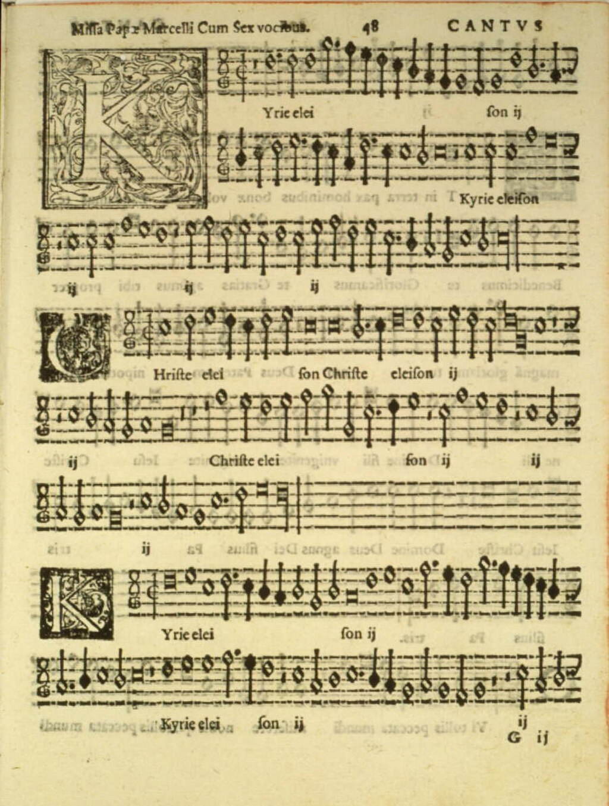Sheet music for part of the _[Missa Papae Marcelli](https://en.wikipedia.org/wiki/Missa_Papae_Marcelli "Missa Papae Marcelli")_ by [Giovanni Pierluigi da Palestrina](/source/palestrina/ "Giovanni Pierluigi da Palestrina")

Most parts of Europe had active and well-differentiated musical traditions by late in the century. In England, composers such as [Thomas Tallis](https://en.wikipedia.org/wiki/Thomas_Tallis "Thomas Tallis") and [William Byrd](https://en.wikipedia.org/wiki/William_Byrd "William Byrd") wrote sacred music in a style similar to that written on the continent, while an active group of home-grown madrigalists adapted the Italian form for English tastes: famous composers included [Thomas Morley](https://en.wikipedia.org/wiki/Thomas_Morley "Thomas Morley"), [John Wilbye](https://en.wikipedia.org/wiki/John_Wilbye "John Wilbye") and [Thomas Weelkes](https://en.wikipedia.org/wiki/Thomas_Weelkes "Thomas Weelkes"). Spain developed instrumental and vocal styles of its own, with [Tomás Luis de Victoria](https://en.wikipedia.org/wiki/Tomás_Luis_de_Victoria "Tomás Luis de Victoria") writing refined music similar to that of Palestrina, and numerous other composers writing for the new guitar. Germany cultivated polyphonic forms built on the Protestant [chorales](https://en.wikipedia.org/wiki/Chorale "Chorale"), which replaced the Roman Catholic Gregorian Chant as a basis for sacred music, and imported the style of the Venetian school (the appearance of which defined the start of the Baroque era there). In addition, Dutch and German composers, particularly [Jan Pieterszoon Sweelinck](https://en.wikipedia.org/wiki/Jan_Pieterszoon_Sweelinck "Jan Pieterszoon Sweelinck"), wrote enormous amounts of [organ](https://en.wikipedia.org/wiki/Organ_\(music\) "Organ (music)") music, establishing the basis for the later Baroque organ style which culminated in the work of [J.S. Bach](/source/johann-sebastian-bach/ "Johann Sebastian Bach"). France developed a unique style of musical diction known as [musique mesurée](https://en.wikipedia.org/wiki/Musique_mesurée "Musique mesurée"), used in secular chansons, with composers such as [Guillaume Costeley](https://en.wikipedia.org/wiki/Guillaume_Costeley "Guillaume Costeley") and [Claude Le Jeune](https://en.wikipedia.org/wiki/Claude_Le_Jeune "Claude Le Jeune") prominent in the movement.

One of the most revolutionary movements in the era took place in Florence in the 1570s and 1580s, with the work of the [Florentine Camerata](https://en.wikipedia.org/wiki/Florentine_Camerata "Florentine Camerata"), who ironically had a reactionary intent: dissatisfied with what they saw as contemporary musical depravities, their goal was to restore the music of the ancient Greeks. Chief among them were [Vincenzo Galilei](https://en.wikipedia.org/wiki/Vincenzo_Galilei "Vincenzo Galilei"), the father of the astronomer, and [Giulio Caccini](https://en.wikipedia.org/wiki/Giulio_Caccini "Giulio Caccini"). The fruits of their labors was a declamatory melodic singing style known as [monody](https://en.wikipedia.org/wiki/Monody "Monody"), and a corresponding staged dramatic form: a form known today as [opera](https://en.wikipedia.org/wiki/Opera "Opera"). The first operas, written around 1600, also define the end of the Renaissance and the beginning of the Baroque eras.

Music prior to 1600 was [modal](https://en.wikipedia.org/wiki/Musical_mode "Musical mode") rather than [tonal](https://en.wikipedia.org/wiki/Tonality "Tonality"). Several theoretical developments late in the 16th century, such as the writings on scales on [modes](https://en.wikipedia.org/wiki/Mode_\(music\) "Mode (music)") by [Gioseffo Zarlino](https://en.wikipedia.org/wiki/Gioseffo_Zarlino "Gioseffo Zarlino") and [Franchinus Gaffurius](https://en.wikipedia.org/wiki/Franchinus_Gaffurius "Franchinus Gaffurius"), led directly to the development of common practice tonality. The major and minor scales began to predominate over the old [church modes](https://en.wikipedia.org/wiki/Church_modes "Church modes"), a feature which was at first most obvious at cadential points in compositions, but gradually became pervasive. Music after 1600, beginning with the tonal music of the Baroque era, is often referred to as belonging to the [common practice period](https://en.wikipedia.org/wiki/Common_practice_period "Common practice period").

#### Baroque

[J. S. Bach](https://en.wikipedia.org/wiki/J._S._Bach "J. S. Bach")

The Baroque era took place from 1600 to 1750, as the [Baroque artistic style](https://en.wikipedia.org/wiki/Baroque "Baroque") flourished across Europe and, during this time, music expanded in its range and complexity. Baroque music began when the first operas (dramatic solo vocal music accompanied by orchestra) were written. During the Baroque era, [polyphonic](https://en.wikipedia.org/wiki/Polyphony "Polyphony") [contrapuntal](https://en.wikipedia.org/wiki/Counterpoint "Counterpoint") music, in which multiple, simultaneous independent melody lines were used, remained important (counterpoint was important in the vocal music of the medieval era). German, Italian, French, Dutch, Polish, Spanish, Portuguese, and English Baroque composers wrote for small [ensembles](https://en.wikipedia.org/wiki/Musical_ensemble "Musical ensemble") including [strings](https://en.wikipedia.org/wiki/String_section "String section"), [brass](https://en.wikipedia.org/wiki/Brass_instrument "Brass instrument"), and [woodwinds](https://en.wikipedia.org/wiki/Woodwind_instrument "Woodwind instrument"), as well as for [choirs](https://en.wikipedia.org/wiki/Choir "Choir") and keyboard instruments such as [pipe organ](https://en.wikipedia.org/wiki/Organ_\(music\) "Organ (music)"), [harpsichord](https://en.wikipedia.org/wiki/Harpsichord "Harpsichord"), and [clavichord](https://en.wikipedia.org/wiki/Clavichord "Clavichord"). During this period several major music forms were defined that lasted into later periods when they were expanded and evolved further, including the [fugue](https://en.wikipedia.org/wiki/Fugue "Fugue"), the [invention](https://en.wikipedia.org/wiki/Invention_\(musical_composition\) "Invention (musical composition)"), the [sonata](https://en.wikipedia.org/wiki/Sonata "Sonata"), and the concerto. The late Baroque style was polyphonically complex and richly ornamented. Important composers from the Baroque era include [Jan Pieterszoon Sweelinck](https://en.wikipedia.org/wiki/Jan_Pieterszoon_Sweelinck "Jan Pieterszoon Sweelinck"), [Johann Sebastian Bach](/source/johann-sebastian-bach/ "Johann Sebastian Bach"), [Arcangelo Corelli](https://en.wikipedia.org/wiki/Arcangelo_Corelli "Arcangelo Corelli"), [François Couperin](https://en.wikipedia.org/wiki/François_Couperin "François Couperin"), [Girolamo Frescobaldi](https://en.wikipedia.org/wiki/Girolamo_Frescobaldi "Girolamo Frescobaldi"), [George Frideric Handel](https://en.wikipedia.org/wiki/George_Frideric_Handel "George Frideric Handel"), [Jean-Baptiste Lully](https://en.wikipedia.org/wiki/Jean-Baptiste_Lully "Jean-Baptiste Lully"), [Jean-Philippe Rameau](https://en.wikipedia.org/wiki/Jean-Philippe_Rameau "Jean-Philippe Rameau"), [Claudio Monteverdi](https://en.wikipedia.org/wiki/Claudio_Monteverdi "Claudio Monteverdi"), [Georg Philipp Telemann](https://en.wikipedia.org/wiki/Georg_Philipp_Telemann "Georg Philipp Telemann"), [Domenico Scarlatti](https://en.wikipedia.org/wiki/Domenico_Scarlatti "Domenico Scarlatti") and [Antonio Vivaldi](https://en.wikipedia.org/wiki/Antonio_Vivaldi "Antonio Vivaldi").

#### Classical

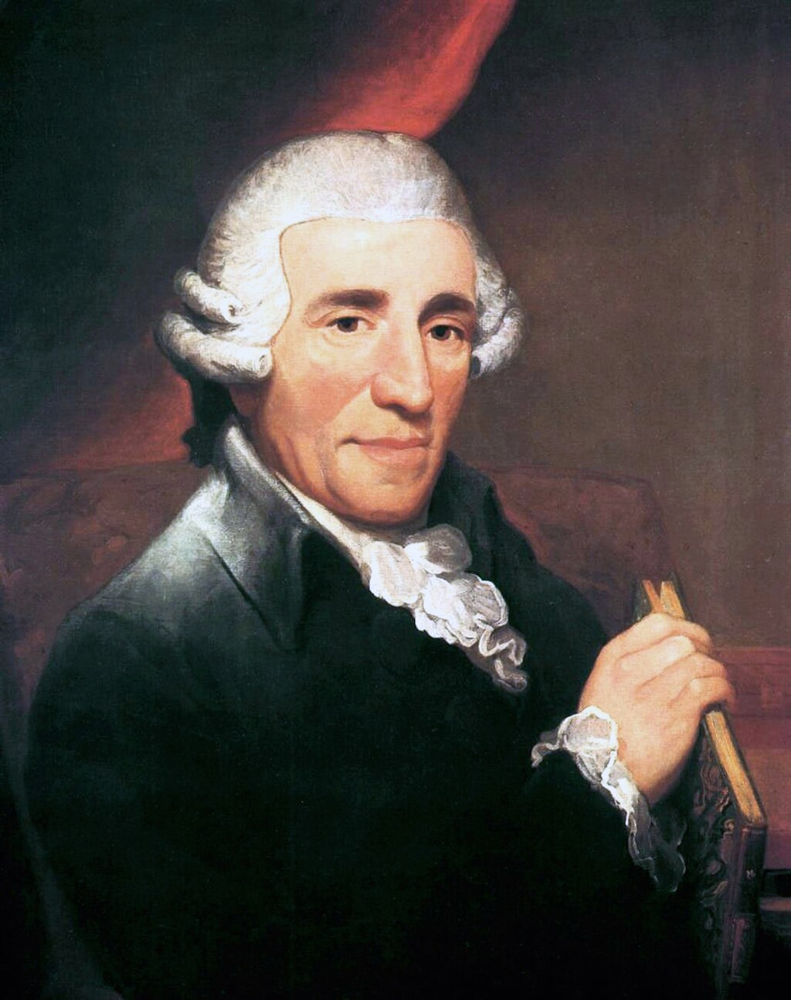

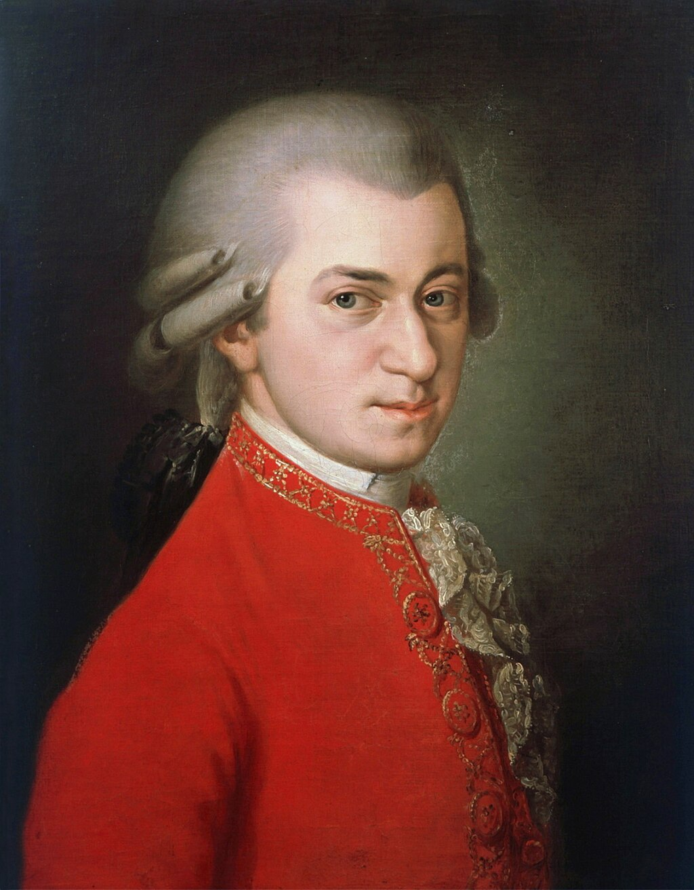

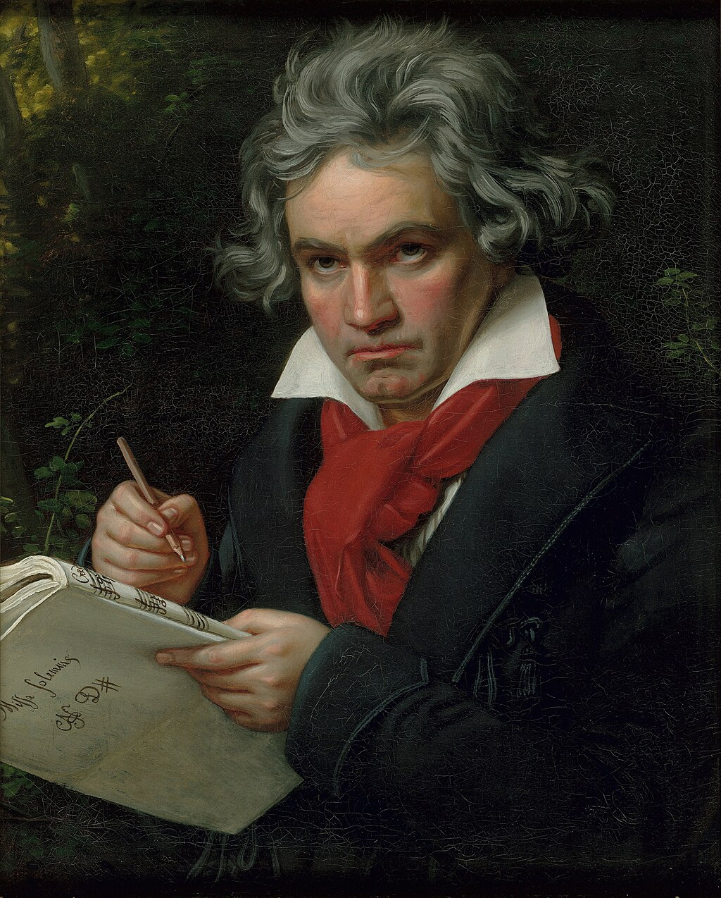

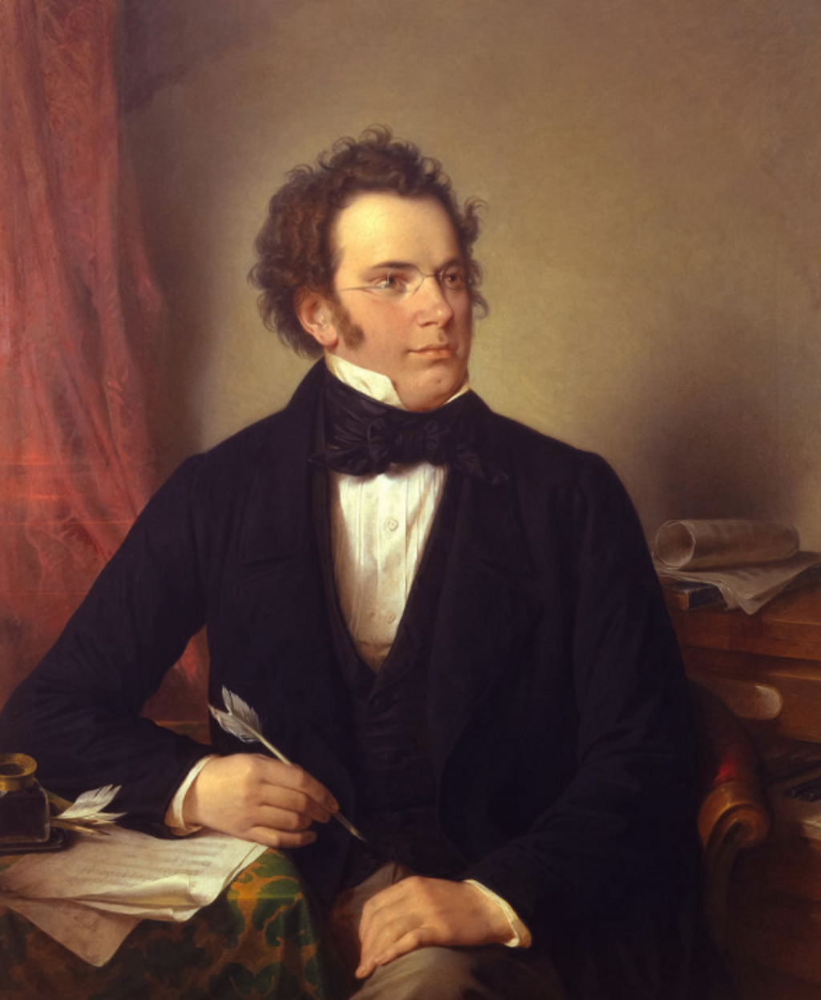

The principal composers of the [Classical](https://en.wikipedia.org/wiki/Classical_period_\(music\) "Classical period (music)") period and the [transition to Romanticism](https://en.wikipedia.org/wiki/Transition_from_Classical_to_Romantic_music "Transition from Classical to Romantic music"), collectively known as the [First Viennese School](https://en.wikipedia.org/wiki/First_Viennese_School "First Viennese School"). Clockwise, from top left: [Joseph Haydn](https://en.wikipedia.org/wiki/Joseph_Haydn "Joseph Haydn") ([Hardy](https://en.wikipedia.org/wiki/Thomas_Hardy_\(English_painter\) "Thomas Hardy (English painter)"), 1791); [Wolfgang Amadeus Mozart](https://en.wikipedia.org/wiki/Wolfgang_Amadeus_Mozart "Wolfgang Amadeus Mozart") ([della Croce](https://en.wikipedia.org/wiki/Johann_Nepomuk_della_Croce "Johann Nepomuk della Croce"), 1781); [Ludwig van Beethoven](https://en.wikipedia.org/wiki/Ludwig_van_Beethoven "Ludwig van Beethoven") ([Stieler](https://en.wikipedia.org/wiki/Joseph_Karl_Stieler "Joseph Karl Stieler"), 1820); and [Franz Schubert](https://en.wikipedia.org/wiki/Franz_Schubert "Franz Schubert") ([Rieder](https://en.wikipedia.org/wiki/Wilhelm_August_Rieder "Wilhelm August Rieder"), 1875).

The music of the [Classical period](https://en.wikipedia.org/wiki/Classical_period_\(music\) "Classical period (music)") is characterized by [homophonic texture](https://en.wikipedia.org/wiki/Homophonic_texture "Homophonic texture"), or an obvious [melody](https://en.wikipedia.org/wiki/Melody "Melody") with [accompaniment](https://en.wikipedia.org/wiki/Accompaniment "Accompaniment"). These new melodies tended to be almost voice-like and singable, allowing composers to actually replace singers as the focus of the music. Instrumental music therefore quickly replaced [opera](https://en.wikipedia.org/wiki/Opera "Opera") and other sung forms (such as [oratorio](https://en.wikipedia.org/wiki/Oratorio "Oratorio")) as the favorite of the musical audience and the epitome of great composition. However, opera did not disappear: during the classical period, several composers began producing operas for the general public in their native languages (previous operas were generally in Italian).

Along with the gradual displacement of the voice in favor of stronger, clearer melodies, counterpoint also typically became a decorative flourish, often used near the end of a work or for a single [movement](https://en.wikipedia.org/wiki/Movement_\(music\) "Movement (music)"). In its stead, simple patterns, such as arpeggios and, in piano music, [Alberti bass](https://en.wikipedia.org/wiki/Alberti_bass "Alberti bass") (an accompaniment with a repeated pattern typically in the left hand), were used to liven the movement of the piece without creating a confusing additional voice. The now-popular instrumental music was dominated by several well-defined forms: the [sonata](https://en.wikipedia.org/wiki/Sonata_\(music\) "Sonata (music)"), the [symphony](https://en.wikipedia.org/wiki/Symphony "Symphony"), and the [concerto](https://en.wikipedia.org/wiki/Concerto "Concerto"), though none of these were specifically defined or taught at the time as they are now in [music theory](/source/music-theory/ "Music theory"). All three derive from [sonata form](https://en.wikipedia.org/wiki/Sonata_form "Sonata form"), which is both the overlying form of an entire work and the structure of a single movement. Sonata form matured during the Classical era to become the primary form of instrumental compositions throughout the 19th century.

The early Classical period was ushered in by the [Mannheim School](https://en.wikipedia.org/wiki/Mannheim_School "Mannheim School"), which included such composers as [Johann Stamitz](https://en.wikipedia.org/wiki/Johann_Stamitz "Johann Stamitz"), [Franz Xaver Richter](https://en.wikipedia.org/wiki/Franz_Xaver_Richter "Franz Xaver Richter"), [Carl Stamitz](https://en.wikipedia.org/wiki/Carl_Stamitz "Carl Stamitz"), and [Christian Cannabich](https://en.wikipedia.org/wiki/Christian_Cannabich "Christian Cannabich"). It exerted a profound influence on [Joseph Haydn](https://en.wikipedia.org/wiki/Joseph_Haydn "Joseph Haydn") and, through him, on all subsequent European music. [Wolfgang Amadeus Mozart](https://en.wikipedia.org/wiki/Wolfgang_Amadeus_Mozart "Wolfgang Amadeus Mozart") was the central figure of the Classical period, and his phenomenal and varied output in all genres defines our perception of the period. [Ludwig van Beethoven](https://en.wikipedia.org/wiki/Ludwig_van_Beethoven "Ludwig van Beethoven") and [Franz Schubert](https://en.wikipedia.org/wiki/Franz_Schubert "Franz Schubert") were transitional composers, leading into the Romantic period, with their expansion of existing genres, forms, and even functions of music.

#### Romantic

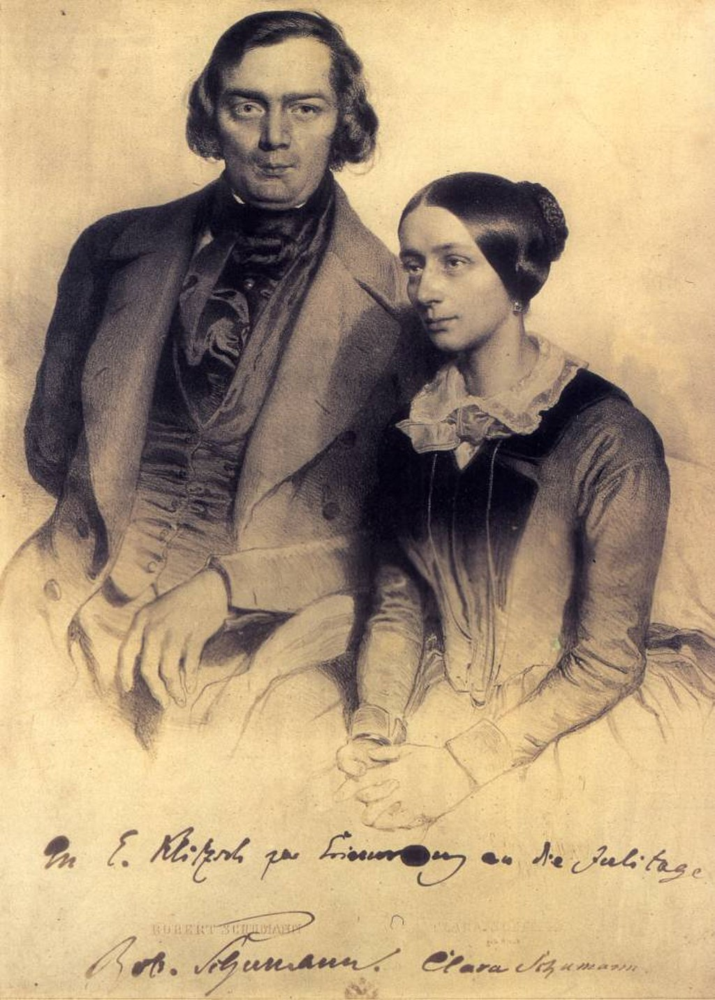[Clara](https://en.wikipedia.org/wiki/Clara_Schumann "Clara Schumann") and [Robert Schumann](https://en.wikipedia.org/wiki/Robert_Schumann "Robert Schumann")

In the Romantic period, music became more expressive and emotional, expanding to encompass literature, art, and philosophy. Famous early Romantic composers include [Schumann](https://en.wikipedia.org/wiki/Robert_Schumann "Robert Schumann"), [Chopin](https://en.wikipedia.org/wiki/Frédéric_Chopin "Frédéric Chopin"), [Mendelssohn](https://en.wikipedia.org/wiki/Felix_Mendelssohn "Felix Mendelssohn"), [Bellini](https://en.wikipedia.org/wiki/Vincenzo_Bellini "Vincenzo Bellini"), [Donizetti](https://en.wikipedia.org/wiki/Gaetano_Donizetti "Gaetano Donizetti"), and [Berlioz](https://en.wikipedia.org/wiki/Hector_Berlioz "Hector Berlioz"). The late 19th century saw a dramatic expansion in the size of the [orchestra](https://en.wikipedia.org/wiki/Orchestra "Orchestra"), and in the role of concerts as part of [urban](https://en.wikipedia.org/wiki/Urban_culture "Urban culture") society. Famous composers from the second half of the century include [Johann Strauss II](https://en.wikipedia.org/wiki/Johann_Strauss_II "Johann Strauss II"), [Brahms](https://en.wikipedia.org/wiki/Johannes_Brahms "Johannes Brahms"), [Liszt](https://en.wikipedia.org/wiki/Franz_Liszt "Franz Liszt"), [Tchaikovsky](https://en.wikipedia.org/wiki/Pyotr_Ilyich_Tchaikovsky "Pyotr Ilyich Tchaikovsky"), [Verdi](https://en.wikipedia.org/wiki/Giuseppe_Verdi "Giuseppe Verdi"), and [Wagner](https://en.wikipedia.org/wiki/Richard_Wagner "Richard Wagner"). Between 1890 and 1910, a third wave of composers including [Grieg](https://en.wikipedia.org/wiki/Edvard_Grieg "Edvard Grieg"), [Dvořák](https://en.wikipedia.org/wiki/Antonín_Dvořák "Antonín Dvořák"), [Mahler](https://en.wikipedia.org/wiki/Gustav_Mahler "Gustav Mahler"), [Richard Strauss](https://en.wikipedia.org/wiki/Richard_Strauss "Richard Strauss"), [Puccini](https://en.wikipedia.org/wiki/Giacomo_Puccini "Giacomo Puccini"), and [Sibelius](https://en.wikipedia.org/wiki/Jean_Sibelius "Jean Sibelius") built on the work of middle Romantic composers to create even more complex – and often much longer – musical works. A prominent mark of late 19th-century music is its nationalistic fervor, as exemplified by such figures as Dvořák, Sibelius, and Grieg. Other prominent late-century figures include [Saint-Saëns](https://en.wikipedia.org/wiki/Camille_Saint-Saëns "Camille Saint-Saëns"), [Fauré](https://en.wikipedia.org/wiki/Gabriel_Fauré "Gabriel Fauré"), [Rachmaninoff](https://en.wikipedia.org/wiki/Sergei_Rachmaninoff "Sergei Rachmaninoff"), [Franck](https://en.wikipedia.org/wiki/César_Franck "César Franck"), [Debussy](/source/claude-debussy/ "Claude Debussy") and [Rimsky-Korsakov](https://en.wikipedia.org/wiki/Nikolai_Rimsky-Korsakov "Nikolai Rimsky-Korsakov").

## 20th century

The 20th century saw a revolution in music listening as the [radio](https://en.wikipedia.org/wiki/Radio "Radio") gained popularity worldwide and new media and technologies were developed to record, edit and distribute music. Music performances became increasingly visual with the broadcast and recording of performances.

20th-century music brought new freedom and wide experimentation with new musical styles and forms that challenged the accepted rules of music of earlier periods. The invention of musical [amplification](https://en.wikipedia.org/wiki/Amplifier "Amplifier") and [electronic instruments](https://en.wikipedia.org/wiki/Electronic_instrument "Electronic instrument"), especially the synthesizer, in the mid-20th century revolutionized classical and popular music, and accelerated the development of new forms of music.

As for classical music, two fundamental schools determined the course of the century: that of [Arnold Schoenberg](https://en.wikipedia.org/wiki/Arnold_Schoenberg "Arnold Schoenberg") and that of [Igor Stravinsky](https://en.wikipedia.org/wiki/Igor_Stravinsky "Igor Stravinsky"). However, other composers also had a notable influence. For example: [Béla Bartók](https://en.wikipedia.org/wiki/Béla_Bartók "Béla Bartók"), [Anton Webern](https://en.wikipedia.org/wiki/Anton_Webern "Anton Webern"), [Dmitri Shostakovich](https://en.wikipedia.org/wiki/Dmitri_Shostakovich "Dmitri Shostakovich"), [Olivier Messiaen](/source/olivier-messiaen/ "Olivier Messiaen"), [John Cage](https://en.wikipedia.org/wiki/John_Cage "John Cage"), [Benjamin Britten](https://en.wikipedia.org/wiki/Benjamin_Britten "Benjamin Britten"), [Karlheinz Stockhausen](https://en.wikipedia.org/wiki/Karlheinz_Stockhausen "Karlheinz Stockhausen"), [Sofia Gubaidulina](https://en.wikipedia.org/wiki/Sofia_Gubaidulina "Sofia Gubaidulina"), [Krzysztof Penderecki](https://en.wikipedia.org/wiki/Krzysztof_Penderecki "Krzysztof Penderecki"), [Brian Ferneyhough](https://en.wikipedia.org/wiki/Brian_Ferneyhough "Brian Ferneyhough"), [Kaija Saariaho](https://en.wikipedia.org/wiki/Kaija_Saariaho "Kaija Saariaho").

The 20th century saw the unprecedented dissemination of [popular music](https://en.wikipedia.org/wiki/Popular_music "Popular music"), that is, music with a wide appeal. The term has its roots in the music of the American [Tin Pan Alley](https://en.wikipedia.org/wiki/Tin_Pan_Alley "Tin Pan Alley"), a group of prominent musicians and publishers who began to emerge during the 1880s in New York City. Although popular music is sometimes known as "pop music", the terms are not always interchangeable. Popular music refers to a variety of music genres that appeal to the tastes of a large segment of the population, whereas [pop music](https://en.wikipedia.org/wiki/Pop_music "Pop music") usually refers to a specific genre _within_ popular music. Popular music songs and pieces typically have easily singable [melodies](https://en.wikipedia.org/wiki/Melody "Melody"). The song structure of popular music commonly involves repetition of sections, with the [verse](https://en.wikipedia.org/wiki/Verse_\(popular_music\) "Verse (popular music)") and chorus or [refrain](https://en.wikipedia.org/wiki/Refrain "Refrain") repeating throughout the song and the [bridge](https://en.wikipedia.org/wiki/Bridge_\(music\) "Bridge (music)") providing a contrasting and transitional section within a piece.
