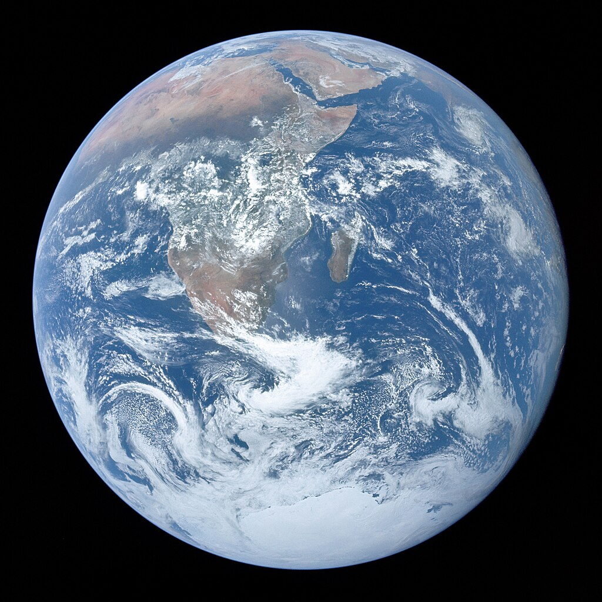
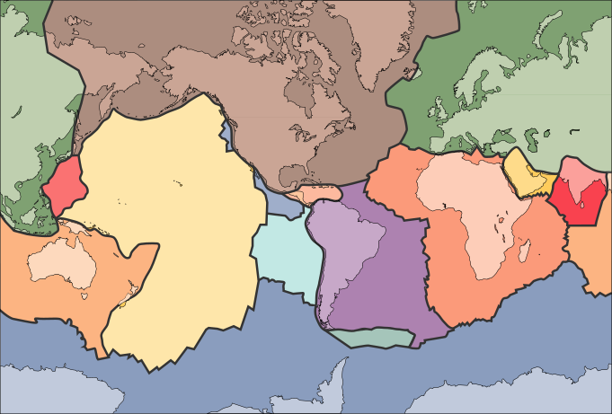

Geological cross section of Earth, showing the different layers of the interior.

The **internal structure of Earth** is the spatial variation of chemical and physical properties in the [non gas and vapor Earth](https://en.wikipedia.org/wiki/Solid_earth "Solid earth"). The primary [structure](https://en.wikipedia.org/wiki/Structure "Structure") is a series of layers: an outer [silicate](https://en.wikipedia.org/wiki/Silicate_mineral "Silicate mineral") [crust](https://en.wikipedia.org/wiki/Crust_\(geology\) "Crust (geology)"), a mechanically weak [asthenosphere](https://en.wikipedia.org/wiki/Asthenosphere "Asthenosphere"), a solid [mantle](/source/mantle/ "Mantle (geology)"), a liquid [outer core](/source/earths-outer-core/ "Earth's outer core") whose flow generates the [Earth's magnetic field](https://en.wikipedia.org/wiki/Earth's_magnetic_field "Earth's magnetic field"), and a solid [inner core](/source/earths-inner-core/ "Earth's inner core").

Scientific understanding of the internal structure of [Earth](/source/earth/ "Earth") is based on observations of [topography](https://en.wikipedia.org/wiki/Topography "Topography") and [bathymetry](https://en.wikipedia.org/wiki/Bathymetry "Bathymetry"), [observations](https://en.wikipedia.org/wiki/Observation "Observation") of [rock](https://en.wikipedia.org/wiki/Rock_\(geology\) "Rock (geology)") in [outcrop](https://en.wikipedia.org/wiki/Outcrop "Outcrop"), samples brought to the surface from greater depths by [volcanoes](https://en.wikipedia.org/wiki/Volcano "Volcano") or volcanic activity, analysis of the [seismic waves](https://en.wikipedia.org/wiki/Seismic_wave "Seismic wave") that pass through Earth, measurements of the [gravitational](https://en.wikipedia.org/wiki/Gravity_of_Earth "Gravity of Earth") and [magnetic fields](https://en.wikipedia.org/wiki/Earth's_magnetic_field "Earth's magnetic field") of Earth, and experiments with crystalline solids at pressures and temperatures characteristic of Earth's deep interior.

## Global properties

Chemical composition of the upper internal structure of [Earth](/source/earth/ "Earth")

Chemical element/oxideChondrite model (1) (%)Chondrite model (2) (%)

[MgO](https://en.wikipedia.org/wiki/Magnesium_oxide "Magnesium oxide")

26.3

38.1

[Al2O3](https://en.wikipedia.org/wiki/Aluminium_oxide "Aluminium oxide")

2.7

3.9

[SiO2](https://en.wikipedia.org/wiki/Silicon_dioxide "Silicon dioxide")

29.8

43.2

[CaO](https://en.wikipedia.org/wiki/Calcium_oxide "Calcium oxide")

2.6

3.9

[FeO](https://en.wikipedia.org/wiki/Iron\(II\)_oxide "Iron(II) oxide")

6.4

9.3

Other oxides

N/A

5.5

[Fe](https://en.wikipedia.org/wiki/Iron "Iron")

25.8

N/A

[Ni](https://en.wikipedia.org/wiki/Nickel "Nickel")

1.7

N/A

[Si](https://en.wikipedia.org/wiki/Silicon "Silicon")

3.5

N/A

Note: In chondrite model (1), the light element in the core is assumed to be Si. Chondrite model (2) is a model of chemical composition of the mantle corresponding to the model of core shown in chondrite model (1).

A [photograph of Earth](https://en.wikipedia.org/wiki/The_Blue_Marble "The Blue Marble") taken by the crew of [Apollo 17](https://en.wikipedia.org/wiki/Apollo_17 "Apollo 17") in 1972. A processed version became widely known as _[The Blue Marble](https://en.wikipedia.org/wiki/The_Blue_Marble "The Blue Marble")_.

Measurements of the force exerted by [Earth's gravity](https://en.wikipedia.org/wiki/Earth's_gravity "Earth's gravity") can be used to calculate its [mass](https://en.wikipedia.org/wiki/Mass "Mass"). Astronomers can also calculate [Earth's mass](https://en.wikipedia.org/wiki/Earth_mass "Earth mass") by observing the motion of orbiting [satellites](https://en.wikipedia.org/wiki/Satellite "Satellite"). Earth's average [density](https://en.wikipedia.org/wiki/Density "Density") can be determined through gravimetric experiments, which have historically involved [pendulums](https://en.wikipedia.org/wiki/Pendulum "Pendulum"). The mass of Earth is about 6×1024 kg. The average density of Earth is 5.515 [g/cm3](https://en.wikipedia.org/wiki/Gram_per_cubic_centimetre "Gram per cubic centimetre").

## Layers

Schematic view of Earth's interior structure.

1.   [continental crust](https://en.wikipedia.org/wiki/Continental_crust "Continental crust")

2.   [oceanic crust](https://en.wikipedia.org/wiki/Oceanic_crust "Oceanic crust")

3.   upper [mantle](https://en.wikipedia.org/wiki/Earth's_mantle "Earth's mantle")

4.   lower mantle

5.   [outer core](/source/earths-outer-core/ "Earth's outer core")

6.   [inner core](https://en.wikipedia.org/wiki/Inner_core "Inner core")

1.  [Mohorovičić discontinuity](https://en.wikipedia.org/wiki/Mohorovičić_discontinuity "Mohorovičić discontinuity")
2.  [core–mantle boundary](https://en.wikipedia.org/wiki/Core–mantle_boundary "Core–mantle boundary")
3.  outer core–inner core boundary

The structure of Earth can be defined in two ways: by mechanical properties such as [rheology](https://en.wikipedia.org/wiki/Rheology "Rheology"), or chemically. Mechanically, it can be divided into [lithosphere](https://en.wikipedia.org/wiki/Lithosphere "Lithosphere"), [asthenosphere](https://en.wikipedia.org/wiki/Asthenosphere "Asthenosphere"), [mesospheric mantle](https://en.wikipedia.org/wiki/Mesosphere_\(mantle\) "Mesosphere (mantle)"), [outer core](/source/earths-outer-core/ "Earth's outer core"), and the [inner core](/source/earths-inner-core/ "Earth's inner core"). Chemically, Earth can be divided into the crust, upper mantle, lower mantle, outer core, and inner core. The geologic component layers of Earth are at increasing depths below the surface.

### Crust and lithosphere

[Earth's major plates](https://en.wikipedia.org/wiki/List_of_tectonic_plates "List of tectonic plates"), which are:

*    [Pacific Plate](https://en.wikipedia.org/wiki/Pacific_Plate "Pacific Plate")
*    [African Plate](https://en.wikipedia.org/wiki/African_Plate "African Plate")
*    [North American Plate](https://en.wikipedia.org/wiki/North_American_Plate "North American Plate")
*    [Eurasian Plate](https://en.wikipedia.org/wiki/Eurasian_Plate "Eurasian Plate")
*    [Antarctic Plate](https://en.wikipedia.org/wiki/Antarctic_Plate "Antarctic Plate")
*    [Indo-Australian Plate](https://en.wikipedia.org/wiki/Indo-Australian_Plate "Indo-Australian Plate")
*    [South American Plate](https://en.wikipedia.org/wiki/South_American_Plate "South American Plate")

Earth's crust ranges from 5 to 70 kilometres (3.1–43.5 mi) in depth and is the outermost layer. The thin parts are the [oceanic crust](https://en.wikipedia.org/wiki/Oceanic_crust "Oceanic crust"), which underlies the ocean basins (5–10 km) and is [mafic](https://en.wikipedia.org/wiki/Mafic "Mafic")-rich (dense iron-magnesium [silicate mineral](https://en.wikipedia.org/wiki/Silicate_mineral "Silicate mineral") or [igneous rock](https://en.wikipedia.org/wiki/Igneous_rock "Igneous rock")). The thicker crust is the [continental crust](https://en.wikipedia.org/wiki/Continental_crust "Continental crust"), which is less dense and is [felsic](https://en.wikipedia.org/wiki/Felsic "Felsic")-rich (igneous rocks rich in elements that form [feldspar](https://en.wikipedia.org/wiki/Feldspar "Feldspar") and [quartz](https://en.wikipedia.org/wiki/Quartz "Quartz")). The rocks of the crust fall into two major categories – [sial](https://en.wikipedia.org/wiki/Sial "Sial") (aluminium silicate) and [sima](https://en.wikipedia.org/wiki/Sima_\(geology\) "Sima (geology)") (magnesium silicate). It is estimated that sima starts about 11 km below the [Conrad discontinuity](https://en.wikipedia.org/wiki/Conrad_discontinuity "Conrad discontinuity"), though the discontinuity is not distinct and can be absent in some continental regions.

Earth's lithosphere consists of the crust and the uppermost [mantle](https://en.wikipedia.org/wiki/Earth's_mantle "Earth's mantle"). The crust-mantle boundary occurs as two physically different phenomena. The [Mohorovičić discontinuity](https://en.wikipedia.org/wiki/Mohorovičić_discontinuity "Mohorovičić discontinuity") is a distinct change of [seismic wave](https://en.wikipedia.org/wiki/Seismic_wave "Seismic wave") velocity. This is caused by a change in the rock's density – immediately above the Moho, the velocities of primary seismic waves ([P wave](https://en.wikipedia.org/wiki/P_wave "P wave")) are consistent with those through [basalt](https://en.wikipedia.org/wiki/Basalt "Basalt") (6.7–7.2 km/s), and below they are similar to those through [peridotite](https://en.wikipedia.org/wiki/Peridotite "Peridotite") or [dunite](https://en.wikipedia.org/wiki/Dunite "Dunite") (7.6–8.6 km/s). Second, in oceanic crust, there is a chemical discontinuity between [ultramafic](https://en.wikipedia.org/wiki/Ultramafic "Ultramafic") cumulates and tectonized [harzburgites](https://en.wikipedia.org/wiki/Peridotite "Peridotite"), which has been observed from deep parts of the oceanic crust that have been [obducted](https://en.wikipedia.org/wiki/Obduction "Obduction") onto the continental crust and preserved as [ophiolite sequences](https://en.wikipedia.org/wiki/Ophiolites "Ophiolites").

Many rocks making up Earth's crust formed less than 100 [million years](https://en.wikipedia.org/wiki/Million_years "Million years") ago; however, the oldest known mineral grains are about 4.4 [billion years](https://en.wikipedia.org/wiki/Billion_years "Billion years") old, indicating that Earth has had a solid crust for at least 4.4 billion years.

### Mantle

Earth's crust and mantle, [Mohorovičić discontinuity](https://en.wikipedia.org/wiki/Mohorovičić_discontinuity "Mohorovičić discontinuity") between bottom of crust and solid uppermost mantle

Earth's mantle extends to a depth of 2,890 km (1,800 mi), making it the planet's thickest layer. \[This is 45% of the 6,371 km (3,959 mi) radius, and 83.7% of the volume - 0.6% of the volume is the crust\]. The mantle is divided into [upper](https://en.wikipedia.org/wiki/Upper_mantle "Upper mantle") and [lower mantle](https://en.wikipedia.org/wiki/Lower_mantle "Lower mantle") separated by a [transition zone](https://en.wikipedia.org/wiki/Transition_zone_\(Earth\) "Transition zone (Earth)"). The lowest part of the mantle next to the [core-mantle boundary](https://en.wikipedia.org/wiki/Core-mantle_boundary "Core-mantle boundary") is known as the D″ (D-double-prime) layer. The [pressure](https://en.wikipedia.org/wiki/Pressure "Pressure") at the bottom of the mantle is ≈140 G[Pa](https://en.wikipedia.org/wiki/Pascal_\(unit\) "Pascal (unit)") (1.4 M[atm](https://en.wikipedia.org/wiki/Atmosphere_\(unit\) "Atmosphere (unit)")). The mantle is composed of [silicate](https://en.wikipedia.org/wiki/Silicate "Silicate") rocks richer in iron and magnesium than the overlying crust. Although solid, the mantle's extremely hot silicate material can [flow](https://en.wikipedia.org/wiki/Ductility "Ductility") over very long timescales. [Convection](https://en.wikipedia.org/wiki/Convection "Convection") of the mantle propels the [motion of the tectonic plates](https://en.wikipedia.org/wiki/Plate_tectonics "Plate tectonics") in the crust. The [source of heat](/source/earths-internal-heat-budget/ "Earth's internal heat budget") that drives this motion is the decay of [radioactive isotopes](https://en.wikipedia.org/wiki/Radioactive_isotopes "Radioactive isotopes") in Earth's crust and mantle combined with the initial heat from the planet's formation (from the [potential energy](https://en.wikipedia.org/wiki/Potential_energy "Potential energy") released by collapsing a large amount of matter into a [gravity well](https://en.wikipedia.org/wiki/Gravity_well "Gravity well"), and the [kinetic energy](https://en.wikipedia.org/wiki/Kinetic_energy "Kinetic energy") of accreted matter).

Due to increasing pressure deeper in the mantle, the lower part flows less easily, though chemical changes within the mantle may also be important. The viscosity of the mantle ranges between 1021 and 1024 [pascal-second](https://en.wikipedia.org/wiki/Pascal_second "Pascal second"), increasing with depth. In comparison, the viscosity of water at 300 K (27 °C; 80 °F) is 0.89 millipascal-second and [pitch](https://en.wikipedia.org/wiki/Pitch_\(resin\) "Pitch (resin)") is (2.3 ± 0.5) × 108 pascal-second.

### Core

A diagram of Earth's geodynamo and magnetic field, which could have been driven in Earth's early history by the crystallization of [magnesium oxide](https://en.wikipedia.org/wiki/Magnesium_oxide "Magnesium oxide"), [silicon dioxide](https://en.wikipedia.org/wiki/Silicon_dioxide "Silicon dioxide"), and [iron(II) oxide](https://en.wikipedia.org/wiki/Iron\(II\)_oxide "Iron(II) oxide")

Earth's outer core is a fluid layer about 2,260 km (1,400 mi) in height (i.e. distance from the highest point to the lowest point at the edge of the inner core) \[36% of the Earth's radius, 15.6% of the volume\] and composed of mostly [iron](https://en.wikipedia.org/wiki/Iron "Iron") and [nickel](https://en.wikipedia.org/wiki/Nickel "Nickel") that lies above Earth's solid [inner core](/source/earths-inner-core/ "Earth's inner core") and below its [mantle](/source/mantle/ "Mantle (geology)"). Its outer boundary lies 2,890 km (1,800 mi) beneath Earth's surface. The transition between the inner core and outer core is located approximately 5,150 km (3,200 mi) beneath Earth's surface. Earth's inner core is the innermost [geologic layer](https://en.wikipedia.org/wiki/Structure_of_the_Earth "Structure of the Earth") of the planet [Earth](/source/earth/ "Earth"). It is primarily a solid ball with a radius of about 1,220 km (760 mi), which is about 19% of [Earth's radius](https://en.wikipedia.org/wiki/Earth_radius "Earth radius") \[0.7% of volume\] or 70% of the [Moon](https://en.wikipedia.org/wiki/Moon "Moon")'s radius.

The inner core was discovered in 1936 by [Inge Lehmann](https://en.wikipedia.org/wiki/Inge_Lehmann "Inge Lehmann") and is composed primarily of iron and some nickel. Since this layer is able to transmit shear waves (transverse seismic waves), it must be solid. Experimental evidence has at times been inconsistent with current crystal models of the core. Other experimental studies show a discrepancy under high pressure: diamond anvil (static) studies at core pressures yield melting temperatures that are approximately 2000 K below those from shock laser (dynamic) studies. The laser studies create plasma, and the results are suggestive that constraining inner core conditions will depend on whether the inner core is a solid or is a plasma with the density of a solid. This is an area of active research.

In early stages of Earth's formation about 4.6 billion years ago, melting would have caused denser substances to sink toward the center in a process called [planetary differentiation](https://en.wikipedia.org/wiki/Planetary_differentiation "Planetary differentiation") (see also the [iron catastrophe](https://en.wikipedia.org/wiki/Iron_catastrophe "Iron catastrophe")), while less-dense materials would have migrated to the [crust](https://en.wikipedia.org/wiki/Crust_\(geology\) "Crust (geology)"). The core is thus believed to largely be composed of iron (80%), along with [nickel](https://en.wikipedia.org/wiki/Nickel "Nickel") and one or more light elements, whereas other dense elements, such as [lead](https://en.wikipedia.org/wiki/Lead "Lead") and [uranium](https://en.wikipedia.org/wiki/Uranium "Uranium"), either are too rare to be significant or tend to bind to lighter elements and thus remain in the crust (see [felsic materials](https://en.wikipedia.org/wiki/Felsic "Felsic")). Some have argued that the inner core may be in the form of a single iron [crystal](https://en.wikipedia.org/wiki/Crystal "Crystal").

Under laboratory conditions a sample of iron–nickel alloy was subjected to the core-like pressure by gripping it in a vise between 2 diamond tips ([diamond anvil cell](https://en.wikipedia.org/wiki/Diamond_anvil_cell "Diamond anvil cell")), and then heating to approximately 4000 K. The sample was observed with x-rays, and strongly supported the theory that Earth's inner core was made of giant crystals running north to south.

The composition of Earth bears strong similarities to that of certain [chondrite](https://en.wikipedia.org/wiki/Chondrite "Chondrite") meteorites, and even to some elements in the outer portion of the Sun. Beginning as early as 1940, scientists, including [Francis Birch](https://en.wikipedia.org/wiki/Francis_Birch_\(geophysicist\) "Francis Birch (geophysicist)"), built geophysics upon the premise that Earth is like ordinary chondrites, the most common type of meteorite observed impacting Earth. This ignores the less abundant [enstatite](https://en.wikipedia.org/wiki/Enstatite "Enstatite") chondrites, which formed under extremely limited available oxygen, leading to certain normally oxyphile elements existing either partially or wholly in the alloy portion that corresponds to the core of Earth.

[Dynamo theory](https://en.wikipedia.org/wiki/Dynamo_theory "Dynamo theory") suggests that convection in the outer core, combined with the [Coriolis effect](https://en.wikipedia.org/wiki/Coriolis_effect "Coriolis effect"), gives rise to [Earth's magnetic field](https://en.wikipedia.org/wiki/Earth's_magnetic_field "Earth's magnetic field"). The solid inner core is too hot to hold a permanent magnetic field (see [Curie temperature](https://en.wikipedia.org/wiki/Curie_temperature "Curie temperature")) but probably acts to stabilize the magnetic field generated by the liquid outer core. The average magnetic field in Earth's outer core is estimated to measure 2.\. milliteslas (25 gauss), 50 times stronger than the magnetic field at the surface.

The magnetic field generated by core flow is essential to protect life from interplanetary radiation and prevent the atmosphere from dissipating in the [solar wind](https://en.wikipedia.org/wiki/Solar_wind "Solar wind"). The rate of cooling by conduction and convection is uncertain, but one estimate is that the core would not be expected to freeze up for approximately 91 billion years, which is well after the Sun is expected to expand, sterilize the surface of the planet, and then burn out.

## Seismology

The layering of Earth has been inferred indirectly using the time of travel of refracted and reflected seismic waves created by earthquakes. The core does not allow shear waves to pass through it, while the speed of travel ([seismic velocity](https://en.wikipedia.org/wiki/Seismic_velocity "Seismic velocity")) is different in other layers. The changes in seismic velocity between different layers causes refraction owing to [Snell's law](https://en.wikipedia.org/wiki/Snell's_law "Snell's law"), like light bending as it passes through a prism. Likewise, reflections are caused by a large increase in seismic velocity and are similar to light reflecting from a mirror.
