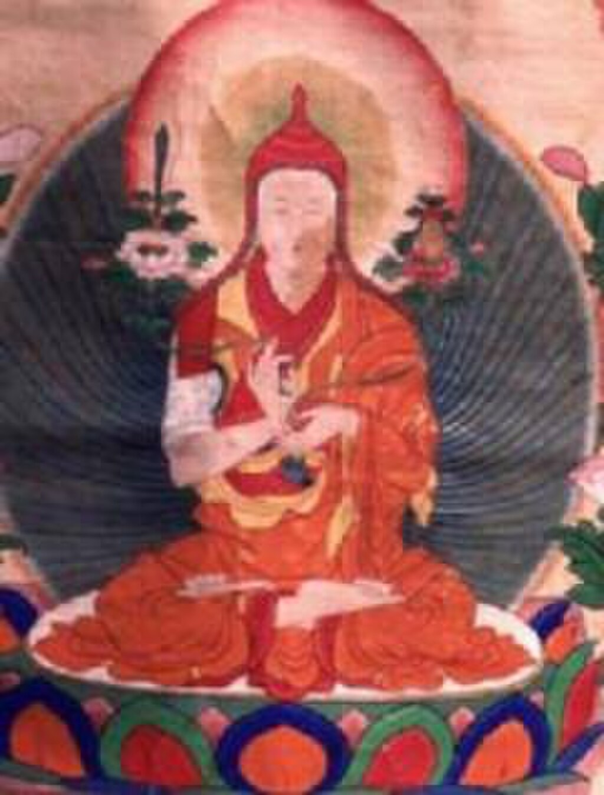
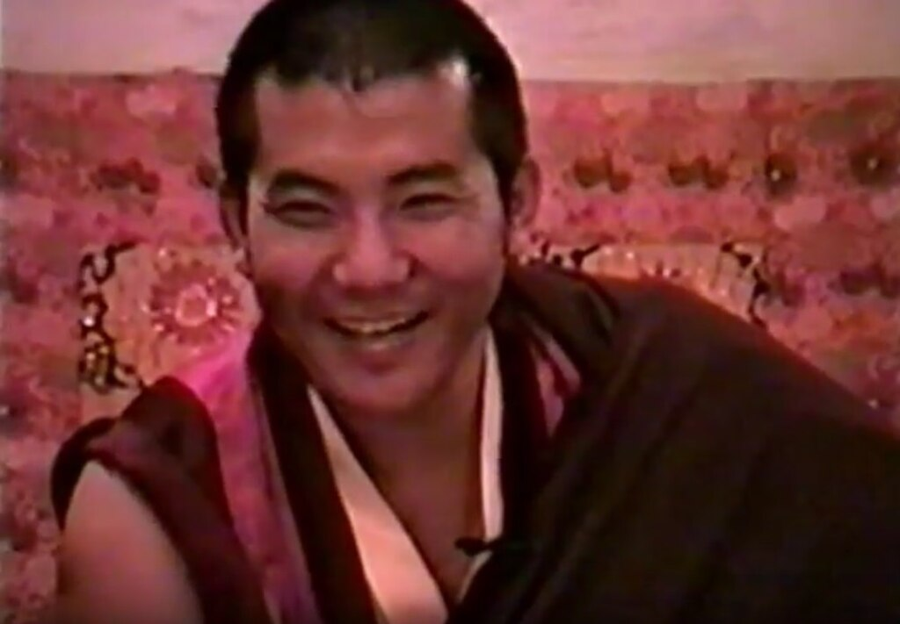

Jamgön Kongtrül Lodrö Thayé

**Jamgön Kongtrül Lodrö Thayé** ([Tibetan](https://en.wikipedia.org/wiki/Tibetan_script "Tibetan script"): འཇམ་མགོན་ཀོང་སྤྲུལ་བློ་གྲོས་མཐའ་ཡས་, [Wylie](https://en.wikipedia.org/wiki/Wylie_transliteration "Wylie transliteration"): ʽjam mgon kong sprul blo gros mthaʽ yas, 1813–1899), also known as **Jamgön Kongtrül the Great,** was a Tibetan Buddhist scholar, poet, artist, physician, [tertön](https://en.wikipedia.org/wiki/Tertön "Tertön") and polymath. He is credited as one of the founders of the [Rimé movement](https://en.wikipedia.org/wiki/Rimé_movement "Rimé movement") (non-sectarian), compiling what is known as the "Five Great Treasuries". He achieved great renown as a scholar and writer, especially among the [Nyingma](/source/nyingma/ "Nyingma") and [Kagyu](/source/kagyu/ "Kagyu") lineages and composed over 90 volumes of Buddhist writing, including his magnum opus, _[The Treasury of Knowledge](https://en.wikipedia.org/wiki/Sheja_Dzö "Sheja Dzö")_.

## Overview

Kongtrül was born in Rongyab (rong rgyab), [Kham](https://en.wikipedia.org/wiki/Kham "Kham"), then part of the [Derge Kingdom](https://en.wikipedia.org/wiki/Kingdom_of_Derge "Kingdom of Derge"). He was first [tonsured](https://en.wikipedia.org/wiki/Tonsure "Tonsure") at a [Bon](https://en.wikipedia.org/wiki/Bon "Bon") monastery, and then at 20 became a monk at Shechen, a major [Nyingma](/source/nyingma/ "Nyingma") monastery in the region, later moving on to the Kagyu [Palpung monastery](https://en.wikipedia.org/wiki/Palpung_Monastery "Palpung Monastery") in 1833 under the Ninth [Tai Situ](https://en.wikipedia.org/wiki/Tai_Situpa "Tai Situpa"), Pema Nyinje Wangpo (1775-1853). He studied many fields at Palpung, including [Buddhist philosophy](https://en.wikipedia.org/wiki/Buddhist_philosophy "Buddhist philosophy"), [tantra](/source/vajrayana/ "Vajrayana"), medicine, architecture, poetics and [Sanskrit](/source/sanskrit/ "Sanskrit"). By thirty he had received teachings and [empowerments](https://en.wikipedia.org/wiki/Empowerment_\(Vajrayana\) "Empowerment (Vajrayana)") from more than sixty masters from the different schools of Tibetan Buddhism. Kongtrül studied and practiced mainly in the Kagyu and Nyingma traditions, including [Mahamudra](https://en.wikipedia.org/wiki/Mahamudra "Mahamudra") and [Dzogchen](/source/dzogchen/ "Dzogchen"), but also studied and taught [Jonang](https://en.wikipedia.org/wiki/Jonang "Jonang") [Kalachakra](https://en.wikipedia.org/wiki/Kalachakra "Kalachakra"). He also went on tour with the [fourteenth Karmapa](https://en.wikipedia.org/wiki/Thekchok_Dorje,_14th_Karmapa_Lama "Thekchok Dorje, 14th Karmapa Lama") and taught him Sanskrit. He became an influential figure in Kham and eastern Tibet, in matters of religion as well as in secular administration and diplomacy. He was influential in saving Palpung monastery when an army from the [Tibetan government](https://en.wikipedia.org/wiki/Ganden_Phodrang "Ganden Phodrang") of Central Tibet occupied Kham in 1865.

Kongtrül was affected by the political and inter-religious conflict going on in Tibet during his life and worked together with other influential figures, mainly [Jamyang Khyentse Wangpo](https://en.wikipedia.org/wiki/Jamyang_Khyentse_Wangpo "Jamyang Khyentse Wangpo") (1820–1892) and also with the Nyingma treasure revealer [Chogyur Lingpa](https://en.wikipedia.org/wiki/Chogyur_Lingpa "Chogyur Lingpa") (1829–1870) and [Ju Mipham](https://en.wikipedia.org/wiki/Ju_Mipham "Ju Mipham") Gyatso (1846–1912). Kongtrül and his colleagues worked together to compile, exchange and revive the teachings of the [Sakya](https://en.wikipedia.org/wiki/Sakya_\(Tibetan_Buddhist_school\) "Sakya (Tibetan Buddhist school)"), [Kagyu](/source/kagyu/ "Kagyu") and [Nyingma](/source/nyingma/ "Nyingma"), including many near-extinct teachings. This movement came to be named Rimé (_Ris med_), “nonsectarian,” or “impartial,” because it held that there was value in all Buddhist traditions, and all were worthy of study and preservation. According to Sam van Schaik, without this collecting and printing of rare works, the later suppression of Buddhism by the Communists would have been much more final.

Jamgon Kongtrül's personal hermitage was Kunzang Dechen Osel Ling (_kun bzang bde chen 'od gsal gling_), "the Garden of Auspicious Bliss and Clear Light", and was built on a rocky outcrop above Palpung monastery. It became an important center for the practice of three year retreats. This is also where he composed most of his major works. Kongtrül's works, especially his 10 volume _[The Treasury of Knowledge](https://en.wikipedia.org/wiki/Sheja_Dzö "Sheja Dzö")._ has been very influential, especially in the [Kagyu](/source/kagyu/ "Kagyu") and [Nyingma](/source/nyingma/ "Nyingma") schools.

## Philosophy

Besides promoting a general inclusiveness and non-sectarian attitude towards all the different Buddhist lineages and schools, Kongtrül was known to promote a [shentong](https://en.wikipedia.org/wiki/Rangtong-Shentong "Rangtong-Shentong") view of [emptiness](https://en.wikipedia.org/wiki/Śūnyatā "Śūnyatā") as the highest view.

His view of [Prasangika](https://en.wikipedia.org/wiki/Svatantrika–Prasaṅgika_distinction "Svatantrika–Prasaṅgika distinction") [Madhyamaka](/source/madhyamaka/ "Madhyamaka") is outlined in the following verse from the _Treasury of Knowledge_:

> Conceptual imputations are abandoned; all things are merely designations.
> Compounded phenomena are deceptive; nirvana is not deceptive.
> The root of [samsara](https://en.wikipedia.org/wiki/Saṃsāra "Saṃsāra") is clinging to true existence, which generates the obscuration of the afflictive emotions.
> Since the first three [yanas](https://en.wikipedia.org/wiki/Yana_\(Buddhism\) "Yana (Buddhism)") have the same way of seeing reality, there is only one path of seeing.
> All phenomena dissolve such that ones enlightenment only appears for the perception of others.

According to Kongtrül, the difference between [prasangika and svatantrika](https://en.wikipedia.org/wiki/Svatantrika–Prasaṅgika_distinction "Svatantrika–Prasaṅgika distinction") [Madhyamaka](/source/madhyamaka/ "Madhyamaka") is:

> These schools differ in the way the ultimate view is generated in one's being. There is no difference in what they assert the ultimate nature to be. All the great scholars who are unbiased say that both of these schools are authentic Madhyamaka.

Kongtrül also held that "[Shentong](https://en.wikipedia.org/wiki/Rangtong-Shentong "Rangtong-Shentong") Madhyamaka" was a valid form of Madhyamaka, which was also based on the Buddha nature teachings of the third turning and [Nagarjuna's](https://en.wikipedia.org/wiki/Nagarjuna "Nagarjuna") "Collection of Praises". For him, this Shentong Madhyamaka is the view which holds that the Ultimate truth, the "primordial wisdom nature, the dharmata":

> ways exists in its own nature and never changes, so it is never empty of its own nature and it is there all the time.

However, he makes it clear that "The Shentong view is free of the fault of saying that the ultimate is an entity." Furthermore, Kongtrül states:

> The ultimate truth is the primordial wisdom of emptiness free of elaborations. Primordial wisdom is there in its very nature and is present within the impure, mistaken consciousness. Even while consciousness is temporarily stained, it remains in the wisdom nature. The defilements are separable and can be abandoned because they are not the true nature. Therefore, the ultimate truth is also free of the two extremes of nihilism and eternalism. Since emptiness is truly established, then the extreme of nihilism is avoided; and since all phenomena and concepts of subject-object grasping do not truly exist, then the extreme of eternalism is avoided.

Finally, on the difference between [Rangtong and Shentong](https://en.wikipedia.org/wiki/Rangtong-Shentong "Rangtong-Shentong"), Kongtrül writes in the _Treasury of Knowledge_:

> For both Rangtong and Shentong the relative level is empty, and in meditation, all fabricated extremes have ceased. However, they differ in their terminology about whether dharmata is there or not there in post-meditation, and in the ultimate analysis, whether primordial wisdom is truly established or not.
>
> Shentong says that if the ultimate truth had no established nature and was a mere absolute negation, then it would be a vacuous nothingness. Instead, the ultimate is nondual, self-aware primordial wisdom. Shentong presents a profound view which joins the sutras and tantras.

## Tulkus

There have been several recognized [tulkus](https://en.wikipedia.org/wiki/Tulku "Tulku") (incarnations) of Lodro Thaye.

### 2nd Jamgon Kongtrul (1902–1952)

The biography of [Khakyab Dorje, 15th Karmapa Lama](https://en.wikipedia.org/wiki/Khakyab_Dorje,_15th_Karmapa_Lama "Khakyab Dorje, 15th Karmapa Lama") mentions he had a vision in which he saw 25 simultaneous emanations of the master Jamgön Kongtrül. Preeminent among these was Karsé Kongtrül ([Tibetan](https://en.wikipedia.org/wiki/Tibetan_script "Tibetan script"): ཀར་སྲས་ཀོང་སྤྲུལ་, [Wylie](https://en.wikipedia.org/wiki/Wylie_transliteration "Wylie transliteration"): kar sras kong sprul, 1904–10 May 1952). Karsé Kongtrül was born as the son of the 15th Karmapa: _Karsé_ means "son of the Karmapa". His formal religious name was as Jamyang Khyentsé Özer ([Wylie](https://en.wikipedia.org/wiki/Wylie_transliteration "Wylie transliteration"): 'jam dbyangs mkhyen brtse'i 'od zer).

Karsé Kongtrül was identified and enthroned by his father at age twelve in 1902, in Samdrub Choling at the monastery of Dowolung Tsurphu. Karsé Kongtrül resided at Tsadra Rinchen Drak, the seat of his predecessor in eastern Tibet. He received the full education and lineage transmission from the Karmapa. Among his other teachers were Surmang Trungpa Chökyi Nyinche, the 10th Trungpa tulku. He attained realization of the ultimate lineage, was one of the most renowned [Mahamudra](https://en.wikipedia.org/wiki/Mahamudra "Mahamudra") masters and transmitted the innermost teachings to [Rangjung Rigpe Dorje, 16th Karmapa](https://en.wikipedia.org/wiki/Rangjung_Rigpe_Dorje,_16th_Karmapa "Rangjung Rigpe Dorje, 16th Karmapa"). On many occasions he gave teachings, empowerments, and reading transmissions from the old and new traditions, such as the _Treasury of Precious Termas_ (_Rinchen Terdzö_), and he rebuilt the retreat center of Tsandra Rinchen Drak, his residence at Palpung Monastery. Karsé Kongtrül died on 10 May 1952 at the age of 49.

3rd Jamgon Kongtrul Rinpoche

### 3rd Jamgon Kongtrul (1954–1992)

The 3rd Jamgon Kongtrul, Karma Lodrö Chökyi Senge, a tulku of Khyentse Özer, was born on 1 October 1954 matrilineal grandson of (later Lt Gen) [Ngapoi Ngawang Jigme](https://en.wikipedia.org/wiki/Ngapoi_Ngawang_Jigme "Ngapoi Ngawang Jigme"). He fled to [India](https://en.wikipedia.org/wiki/India "India") in 1959 in the aftermath of the [1959 Tibetan uprising](https://en.wikipedia.org/wiki/1959_Tibetan_uprising "1959 Tibetan uprising") and grew up at [Rumtek Monastery](https://en.wikipedia.org/wiki/Rumtek_Monastery "Rumtek Monastery") in Sikkim under the care of [Rangjung Rigpe Dorje, 16th Karmapa](https://en.wikipedia.org/wiki/Rangjung_Rigpe_Dorje,_16th_Karmapa "Rangjung Rigpe Dorje, 16th Karmapa"). Recognized as an incarnation of the previous Jamgon Kongtrul by the [Karmapa](https://en.wikipedia.org/wiki/Karmapa "Karmapa").

Jamgon Kongtrul Rinpoche travelled with the [Karmapa](https://en.wikipedia.org/wiki/Karmapa "Karmapa") to the United States in 1976 and 1980. He engaged in building monasteries and initiated plans for a home for the elderly and a health clinic in Nepal.

On 26 April 1992, a mysterious accident occurred in Darjeeling District, India, with Jamgon Kongtrul as a passenger, when a new BMW veered off the road into a tree. He was thirty-seven years old. The accident took place near Rinpoche's monastery and a residential school that he founded for young monks and orphans.

### 4th Jamgon Kongtrul (1995 to present)

The 4th Jamgon Kongtrul, Lodro Choyki Nyima Tenpey Dronme, was born in the wood pig year in Central Tibet on the 26th of November 1995. His birth was prophesied by the Seventeenth Karmapa, [Ogyen Trinley Dorje](https://en.wikipedia.org/wiki/Ogyen_Trinley_Dorje "Ogyen Trinley Dorje"), who also recognised, confirmed the authenticity of his incarnation, and proclaimed it to the world. The prophecy, the search, and the recognition of the Fourth Jamgon Kongtrul Rinpoche are told in the book E MA HO! published by the Jamgon Kongtrul Labrang and can be obtained from Pullahari Monastery and viewed on www.jamgonkongtrul.org. He spent time between Kagyu Tekchen Ling and Pullahari Monastery, the monastic seats in India and Nepal founded by the Third Jamgon Kongtrul Rinpoche. Jamgon Kongtrul Labrang gave his studies, training, and the receiving transmissions from the Lineage Masters. Annually, he also attended the Kagyu Monlam in Bodhgaya, India, led by the Seventeenth Gyalwa Karmapa, and led the Kagyu Monlam in Kathmandu, Nepal. On April 14, 2016, the Jamgon Yangsi left Pullahari monastery and his monastic vows, stating he wanted to pursue his 'dream of becoming a doctor.

The 4th Jamgon Kongtrul Mingyur Drakpa Senge was born on 17 December 1995 in Nepal, the son of the [Second Beru Khyentse](https://en.wikipedia.org/wiki/Second_Beru_Khyentse "Second Beru Khyentse"). The day before he was born, the late Chogye Trichen Rinpoche said in front of many Lamas and Tulkus: "Like prophesied ... today Jamgon Rinpoche arrived."

In 1996, when the Seventeenth Karmapa [Trinley Thaye Dorje](https://en.wikipedia.org/wiki/Trinley_Thaye_Dorje "Trinley Thaye Dorje"), arrived in Bodhgaya,he met the young Jamgon Rinpoche for the first time. Yangsi Rinpoche despite his young age was able to spontaneously pick up some rice and toss it into the air as a mandala offering, Straight away he exclaimed: "This is the Jamgon Yangsi (Reincarnation) indeed!" He then issued a recognition letter and gave him a name Karma Migyur Drakpa Senge Trinley Kunkhyab Palzangpo.

In 1998, when the [Dalai Lama](https://en.wikipedia.org/wiki/Dalai_Lama "Dalai Lama") was visiting Bodhgaya, the Yangsi Rinpoche had a private audience with him, where they showed him the recognition letter and the 14th Dalai Lama performed the hair cutting ceremony for the 4th Jamgon Yangsi. In 2000, Drubwang Pema Norbu (Penor Rinpoche), was invited to the Karma Monastery in Bodhgaya, and he performed the vast and profound enthronement ceremony of 4th Jamgon Kongtrul Rinpoche, again reconfirmed Jamgon Yangsi as a reincarnation of the great Jamgon Kongtrul.

During his teenage years, he studied at the Sakya College, From 2018 to 2022, Rinpoche completed a traditional Kagyu three-year retreat in Pharping, Nepal.

Rinpoche now divides his time between retreat and teaching activities.

## Works

The main corpus of Jamgön Kongtrül Lodrö Thaye vast scholarly activities (comprising more than ninety volumes of works in all) is known as the Great Treasuries:

*   The Treasury of Encyclopedic Knowledge (__shes bya kun la khyab pa'i mdzod__), summarizing the entire sutric and tantric paths.
*   The Treasury of Precious Instructions (__gdams ngag rin po che'i mdzod__), a compendium of empowerments and oral instructions of what he formulated as the "Eight Great Chariots" of the instruction lineages in Tibet.
*   The Treasury of Kagyü Mantras (__bka' brgyud sngags kyi mdzod__), a compendium of rituals, empowerments and oral instructions for the Yangdak, [Vajrakilaya](https://en.wikipedia.org/wiki/Vajrakilaya "Vajrakilaya") and [Yamantaka](https://en.wikipedia.org/wiki/Yamantaka "Yamantaka") deities of the Nyingma kama tradition, and the tantra cycles from the [Sarma](https://en.wikipedia.org/wiki/Sarma_\(Tibetan_Buddhism\) "Sarma (Tibetan Buddhism)") lineages of Marpa and Ngok.
*   The Treasury of Precious Termas (__rin chen gter mdzod__), a massive compilation of termas.
*   The Uncommon Treasury (__thun mong ma yin pa'i mdzod__), which contains Jamgön Kongtrül Lodrö Thaye's own profound terma revelations.
*   The Treasury of Extensive Teachings (__rgya chen bka' mdzod__), which includes various related works, such as praises and advice, as well as compositions on medicine, science and so on.

### _The Treasury of Knowledge_

Jamgon Kongtrul's (1813–1899) _The Infinite Ocean of Knowledge_ ([Tibetan](https://en.wikipedia.org/wiki/Tibetan_script "Tibetan script"): ཤེས་བྱ་མཐའ་ཡས་པའི་རྒྱ་མཚོ, [Wylie](https://en.wikipedia.org/wiki/Wylie_transliteration "Wylie transliteration"): shes bya mtha' yas pa'i rgya mtsho) consists of ten books or sections and is itself a commentary on the root verses 'The Encompassment of All Knowledge' ([Tibetan](https://en.wikipedia.org/wiki/Tibetan_script "Tibetan script"): ཤེས་བྱ་ཀུན་ཁྱབ, [Wylie](https://en.wikipedia.org/wiki/Wylie_transliteration "Wylie transliteration"): shes bya kun khyab) which is also the work of Jamgon Kongtrul. _The Encompassment of All Knowledge_ are the root verses to Kongtrul's autocommentary _The Infinite Ocean of Knowledge_ and these two works together are known as 'The Treasury of Knowledge' ([Tibetan](https://en.wikipedia.org/wiki/Tibetan_script "Tibetan script"): ཤེས་བྱ་མཛོད, [Wylie](https://en.wikipedia.org/wiki/Wylie_transliteration "Wylie transliteration"): shes bya mdzod). [Tibetan Text](http://www.dharmadownload.net/pages/english/Sungbum/008_shes-bya-kun-khyab/index.htm)

Of the Five, the _Treasury of Knowledge_ was Jamgon Kongtrul's _magnum opus_, covering the full spectrum of Buddhist history, philosophy and practice. There is an ongoing effort to translate it into English. It is divided up as follows:

*   Book One: Myriad Worlds (Snow Lion, 2003. [ISBN](https://en.wikipedia.org/wiki/ISBN_\(identifier\) "ISBN (identifier)") [1-55939-188-X](https://en.wikipedia.org/wiki/Special:BookSources/1-55939-188-X "Special:BookSources/1-55939-188-X"))
*   Book Two: The Advent of the Buddha (parts 2, 3, and 4 forthcoming) : Part One: The Teacher's Path to Awakening : Part Two: The Buddha's Enlightenment : Part Three: The Buddha's Twelve Deeds : Part Four: Enlightenment's Bodies and Realms
*   Book Three: The Buddha's Doctrine—The Sacred Teachings : Part One: What Are the Sacred Teachings? : Part Two: Cycles of Scriptural Transmission : Part Three: Compilations of the Buddha's Word : Part Four: Origins of the Original Translations' Ancient Tradition (Nyingma)
*   Book Four: Buddhism's Spread Throughout the World : Part One: Buddhism's Spread in India : Part Two: How Buddhist Monastic Discipline and Philosophy Came to Tibet : Part Three: Tibet's Eight Vehicles of Tantric Meditation Practice : Part Four: The Origins of Buddhist Culture
*   Book Five: Buddhist Ethics (Snow Lion, 2003. [ISBN](https://en.wikipedia.org/wiki/ISBN_\(identifier\) "ISBN (identifier)") [1-55939-191-X](https://en.wikipedia.org/wiki/Special:BookSources/1-55939-191-X "Special:BookSources/1-55939-191-X"))
*   Book Six: The Topics for Study Part One: A Presentation of the Common Fields of Knowledge and Worldly Paths Part Two: The General Topics of Knowledge in the Hinayana and Mahayana Part Three: Frameworks of Buddhist Philosophy (Snow Lion, 2007. [ISBN](https://en.wikipedia.org/wiki/ISBN_\(identifier\) "ISBN (identifier)") [1-55939-277-0](https://en.wikipedia.org/wiki/Special:BookSources/1-55939-277-0 "Special:BookSources/1-55939-277-0")) Part Four: Systems of Buddhist Tantra (Snow Lion, 2005. [ISBN](https://en.wikipedia.org/wiki/ISBN_\(identifier\) "ISBN (identifier)") [1-55939-210-X](https://en.wikipedia.org/wiki/Special:BookSources/1-55939-210-X "Special:BookSources/1-55939-210-X"))
*   Book Seven: The Training in Higher Wisdom : Part One: Gaining Certainty about the Keys to Understanding : Part Two: Gaining Certainty about the Provisional and Definitive Meanings in the Three Turnings of the Wheel of Dharma, the Two Truths and Dependent Arising : Part Three: Gaining Certainty about the View : Part Four: Gaining Certainty about the Four Thoughts that Turn the Mind
*   Book Eight: The Training in Higher Meditative Absorption (Samadhi) Part One, Two: Shamatha and Vipashyana; The Stages of Meditation in the Cause-Based Approaches (forthcoming) Part Three: The Elements of Tantric Practice (Snow Lion, 2008). [ISBN](https://en.wikipedia.org/wiki/ISBN_\(identifier\) "ISBN (identifier)") [1-55939-305-X](https://en.wikipedia.org/wiki/Special:BookSources/1-55939-305-X "Special:BookSources/1-55939-305-X") Part Four: Esoteric Instructions, A Detailed Presentation of the Process of Meditation in Vajrayana (Snow Lion, 2008. [ISBN](https://en.wikipedia.org/wiki/ISBN_\(identifier\) "ISBN (identifier)") [1-55939-284-3](https://en.wikipedia.org/wiki/Special:BookSources/1-55939-284-3 "Special:BookSources/1-55939-284-3"))
*   Book Nine: An Analysis of the Paths and levels to Be Traversed (forthcoming) : Part One: The Paths and Levels in the Cause-Based Dialectical Approach : Part Two: The Levels and Paths in the Vajrayana : Part Three: The Process of Enlightenment : Part Four: the Levels in the Three Yogas
*   Book Ten: An Analysis of the Consummate Fruition State (forthcoming) : Part One: the Fruition in the Dialectical Approach : Part Two: The More Common Attainment in the Vajrayana : Part Three: The Fruition in the Vajrayana : Part Four: The Fruition State in the Nyingma School

### Other works published in English translation

*   _Jamgon Kongtrul's Retreat Manual_. Translated by Ngawang Zangpo. Snow Lion Publications. 1994. [ISBN](https://en.wikipedia.org/wiki/ISBN_\(identifier\) "ISBN (identifier)") [1-55939-029-8](https://en.wikipedia.org/wiki/Special:BookSources/1-55939-029-8 "Special:BookSources/1-55939-029-8").
*   _Enthronement: The Recognition of the Reincarnate Masters of Tibet and the Himalayas_. Snow Lion Publications. 1997. [ISBN](https://en.wikipedia.org/wiki/ISBN_\(identifier\) "ISBN (identifier)") [1-55939-083-2](https://en.wikipedia.org/wiki/Special:BookSources/1-55939-083-2 "Special:BookSources/1-55939-083-2").
*   Padmasambhava; Jamgon Kongtrul (1999). _Light of Wisdom_. Vol. 1. Translated by Erik Pema Kunsang. Rangjung Yeshe Publications. [ISBN](https://en.wikipedia.org/wiki/ISBN_\(identifier\) "ISBN (identifier)") [962-7341-37-1](https://en.wikipedia.org/wiki/Special:BookSources/962-7341-37-1 "Special:BookSources/962-7341-37-1").
*   Padmasambhava; Jamgon Kongtrul (1999). _Light of Wisdom_. Vol. II. Translated by Erik Pema Kunsang. Rangjung Yeshe Publications. [ISBN](https://en.wikipedia.org/wiki/ISBN_\(identifier\) "ISBN (identifier)") [962-7341-33-9](https://en.wikipedia.org/wiki/Special:BookSources/962-7341-33-9 "Special:BookSources/962-7341-33-9").
*   _The Teacher-Student Relationship_. Snow Lion Publications. 1999. [ISBN](https://en.wikipedia.org/wiki/ISBN_\(identifier\) "ISBN (identifier)") [1-55939-096-4](https://en.wikipedia.org/wiki/Special:BookSources/1-55939-096-4 "Special:BookSources/1-55939-096-4").
*   Arya Maitreya; Jamgon Kongtrul Lodro Thaye; Khenpo Tsultrim Gyamtso Rinpoche (2000). _Buddha Nature, The Mahayana Uttaratantra Shastra with Commentary_. Snow Lion. [ISBN](https://en.wikipedia.org/wiki/ISBN_\(identifier\) "ISBN (identifier)") [1-55939-128-6](https://en.wikipedia.org/wiki/Special:BookSources/1-55939-128-6 "Special:BookSources/1-55939-128-6").
*   _Essence of Benefit and Joy_. Siddhi Publications. 2000. [ISBN](https://en.wikipedia.org/wiki/ISBN_\(identifier\) "ISBN (identifier)") [0-9687689-5-4](https://en.wikipedia.org/wiki/Special:BookSources/0-9687689-5-4 "Special:BookSources/0-9687689-5-4").
*   _The Great Path of Awakening: The Classic Guide to Using the Mahayana Buddhist Slogans to Tame the Mind and Awaken the Heart_. Translated by Ken McLeod. Shambhala. 2000. [ISBN](https://en.wikipedia.org/wiki/ISBN_\(identifier\) "ISBN (identifier)") [1-57062-587-5](https://en.wikipedia.org/wiki/Special:BookSources/1-57062-587-5 "Special:BookSources/1-57062-587-5").
*   _The Torch of Certainty_. Shambhala. 2000. [ISBN](https://en.wikipedia.org/wiki/ISBN_\(identifier\) "ISBN (identifier)") [1-57062-713-4](https://en.wikipedia.org/wiki/Special:BookSources/1-57062-713-4 "Special:BookSources/1-57062-713-4").
*   Padmasambhava; Jamgon Kongtrul (2001). _Light of Wisdom_. Vol. IV. Translated by Erik Pema Kunsang. Rangjung Yeshe Publications. [ISBN](https://en.wikipedia.org/wiki/ISBN_\(identifier\) "ISBN (identifier)") [962-7341-43-6](https://en.wikipedia.org/wiki/Special:BookSources/962-7341-43-6 "Special:BookSources/962-7341-43-6"). (restricted circulation)
*   _Sacred Ground: Jamgon Kongtrul on Pilgrimage and Sacred Geography_. Snow Lion Publications. 2001. [ISBN](https://en.wikipedia.org/wiki/ISBN_\(identifier\) "ISBN (identifier)") [1-55939-164-2](https://en.wikipedia.org/wiki/Special:BookSources/1-55939-164-2 "Special:BookSources/1-55939-164-2").
*   _Creation and Completion: Essential Points of Tantric Meditation_. Translated by Sarah Harding. Wisdom Publications. 2002. [ISBN](https://en.wikipedia.org/wiki/ISBN_\(identifier\) "ISBN (identifier)") [0-86171-312-5](https://en.wikipedia.org/wiki/Special:BookSources/0-86171-312-5 "Special:BookSources/0-86171-312-5").
*   _The Autobiography of Jamgon Kongtrul: A Gem of Many Colors_. Translated by Richard Barron. Snow Lion Publications. 2003. [ISBN](https://en.wikipedia.org/wiki/ISBN_\(identifier\) "ISBN (identifier)") [1-55939-184-7](https://en.wikipedia.org/wiki/Special:BookSources/1-55939-184-7 "Special:BookSources/1-55939-184-7").
*   _Timeless Rapture: Inspired Verse from the Shangpa Masters_. Snow Lion. 2003. [ISBN](https://en.wikipedia.org/wiki/ISBN_\(identifier\) "ISBN (identifier)") [1-55939-204-5](https://en.wikipedia.org/wiki/Special:BookSources/1-55939-204-5 "Special:BookSources/1-55939-204-5").
