Jazz

Etymology

See: [Jazz (word)](https://en.wikipedia.org/wiki/Jazz_\(word\) "Jazz (word)")

Stylistic origins

*   [Blues](https://en.wikipedia.org/wiki/Blues "Blues")
*   [ragtime](https://en.wikipedia.org/wiki/Ragtime "Ragtime") (including [classical ragtime](https://en.wikipedia.org/wiki/Classical_ragtime "Classical ragtime"))
*   [spirituals](https://en.wikipedia.org/wiki/Spirituals "Spirituals")
*   [folk](https://en.wikipedia.org/wiki/Folk_music "Folk music")
*   [marches](https://en.wikipedia.org/wiki/American_march_music "American march music")
*   [European classical music](https://en.wikipedia.org/wiki/Classical_music "Classical music")
*   [West African music](https://en.wikipedia.org/wiki/West_African_music "West African music")

Cultural origins

Late 19th century, [New Orleans](https://en.wikipedia.org/wiki/New_Orleans "New Orleans"), U.S.

Typical instruments

*   [Double bass](https://en.wikipedia.org/wiki/Double_bass "Double bass")
*   [drums](https://en.wikipedia.org/wiki/Drum_kit "Drum kit")
*   [guitar](https://en.wikipedia.org/wiki/Guitar "Guitar")
*   [piano](https://en.wikipedia.org/wiki/Piano "Piano")
*   [saxophone](https://en.wikipedia.org/wiki/Saxophone "Saxophone")
*   [trumpet](https://en.wikipedia.org/wiki/Trumpet "Trumpet")
*   [clarinet](https://en.wikipedia.org/wiki/Clarinet "Clarinet")
*   [trombone](https://en.wikipedia.org/wiki/Trombone "Trombone")
*   [tuba](https://en.wikipedia.org/wiki/Tuba "Tuba")
*   [vocals](https://en.wikipedia.org/wiki/Singing "Singing")
*   [vibraphone](https://en.wikipedia.org/wiki/Vibraphone "Vibraphone")
*   [bass guitar](https://en.wikipedia.org/wiki/Bass_guitar "Bass guitar")
*   [Hammond organ](https://en.wikipedia.org/wiki/Hammond_organ "Hammond organ")
*   [flute](https://en.wikipedia.org/wiki/Western_concert_flute "Western concert flute")
*   [violin](https://en.wikipedia.org/wiki/Violin "Violin")
*   [bass clarinet](https://en.wikipedia.org/wiki/Bass_clarinet "Bass clarinet")
*   [french horn](https://en.wikipedia.org/wiki/French_horn "French horn")
*   [harmonica](https://en.wikipedia.org/wiki/Harmonica "Harmonica")

Derivative forms

*   [Rock and roll](https://en.wikipedia.org/wiki/Rock_and_roll "Rock and roll")
*   [rock](https://en.wikipedia.org/wiki/Rock_music "Rock music")
*   [jump blues](https://en.wikipedia.org/wiki/Jump_blues "Jump blues")
*   [traditional pop](https://en.wikipedia.org/wiki/Traditional_pop "Traditional pop")
*   [reggae](https://en.wikipedia.org/wiki/Reggae "Reggae")
*   [R&B](https://en.wikipedia.org/wiki/Rhythm_and_blues "Rhythm and blues")
*   [soul](https://en.wikipedia.org/wiki/Soul_music "Soul music")
*   [ska](https://en.wikipedia.org/wiki/Ska "Ska")
*   [funk](https://en.wikipedia.org/wiki/Funk "Funk")
*   [hip-hop](https://en.wikipedia.org/wiki/Hip-hop "Hip-hop")
*   [house](https://en.wikipedia.org/wiki/House_music "House music")
*   [lounge](https://en.wikipedia.org/wiki/Lounge_music "Lounge music")
*   [contemporary R&B](https://en.wikipedia.org/wiki/Contemporary_R&B "Contemporary R&B")

Subgenres

Subgenres

*   [Avant-garde jazz](https://en.wikipedia.org/wiki/Avant-garde_jazz "Avant-garde jazz")
*   [bebop](https://en.wikipedia.org/wiki/Bebop "Bebop")
*   [big band](https://en.wikipedia.org/wiki/Big_band "Big band")
*   [chamber jazz](https://en.wikipedia.org/wiki/Chamber_jazz "Chamber jazz")
*   [cool jazz](/source/cool-jazz/ "Cool jazz")
*   [free jazz](https://en.wikipedia.org/wiki/Free_jazz "Free jazz")
*   [gypsy jazz](https://en.wikipedia.org/wiki/Gypsy_jazz "Gypsy jazz")
*   [hard bop](https://en.wikipedia.org/wiki/Hard_bop "Hard bop")
*   [Latin jazz](https://en.wikipedia.org/wiki/Latin_jazz "Latin jazz")
*   [mainstream jazz](https://en.wikipedia.org/wiki/Mainstream_jazz "Mainstream jazz")
*   [modal jazz](https://en.wikipedia.org/wiki/Modal_jazz "Modal jazz")
*   [M-Base](https://en.wikipedia.org/wiki/M-Base "M-Base")
*   [neo-bop](https://en.wikipedia.org/wiki/Neo-bop_jazz "Neo-bop jazz")
*   [orchestral jazz](https://en.wikipedia.org/wiki/Orchestral_jazz "Orchestral jazz")
*   [post-bop](https://en.wikipedia.org/wiki/Post-bop "Post-bop")
*   [progressive jazz](https://en.wikipedia.org/wiki/Progressive_jazz "Progressive jazz")
*   [soul jazz](https://en.wikipedia.org/wiki/Soul_jazz "Soul jazz")
*   [straight-ahead jazz](https://en.wikipedia.org/wiki/Straight-ahead_jazz "Straight-ahead jazz")
*   [swing](https://en.wikipedia.org/wiki/Swing_music "Swing music")
*   [third stream](https://en.wikipedia.org/wiki/Third_stream "Third stream")
*   [traditional jazz](https://en.wikipedia.org/wiki/Trad_jazz "Trad jazz")

([complete list](https://en.wikipedia.org/wiki/List_of_jazz_genres "List of jazz genres"))

Fusion genres

Fusion genres

*   [Acid jazz](https://en.wikipedia.org/wiki/Acid_jazz "Acid jazz")
*   [Afrobeat](https://en.wikipedia.org/wiki/Afrobeat "Afrobeat")
*   [Afro fusion](https://en.wikipedia.org/wiki/Afro_fusion "Afro fusion")
*   [bluegrass](https://en.wikipedia.org/wiki/Bluegrass_music "Bluegrass music")
*   [bossa nova](https://en.wikipedia.org/wiki/Bossa_nova "Bossa nova")
*   [dansband](https://en.wikipedia.org/wiki/Dansband "Dansband")
*   [folk jazz](https://en.wikipedia.org/wiki/Folk_jazz "Folk jazz")
*   [free funk](https://en.wikipedia.org/wiki/Free_funk "Free funk")
*   [humppa](https://en.wikipedia.org/wiki/Humppa "Humppa")
*   [Indo jazz](https://en.wikipedia.org/wiki/Indo_jazz "Indo jazz")
*   [jam band](https://en.wikipedia.org/wiki/Jam_band "Jam band")
*   [jazzcore](https://en.wikipedia.org/wiki/Jazzcore "Jazzcore")
*   [jazz-funk](https://en.wikipedia.org/wiki/Jazz-funk "Jazz-funk")
*   [jazz fusion](https://en.wikipedia.org/wiki/Jazz_fusion "Jazz fusion")
*   [jazz rap](https://en.wikipedia.org/wiki/Jazz_rap "Jazz rap")
*   [kwela](https://en.wikipedia.org/wiki/Kwela "Kwela")
*   [mambo](https://en.wikipedia.org/wiki/Mambo_\(music\) "Mambo (music)")
*   [Manila sound](https://en.wikipedia.org/wiki/Manila_sound "Manila sound")
*   [nu jazz](https://en.wikipedia.org/wiki/Nu_jazz "Nu jazz")
*   [neo soul](https://en.wikipedia.org/wiki/Neo_soul "Neo soul")
*   [punk jazz](https://en.wikipedia.org/wiki/Punk_jazz "Punk jazz")
*   [ska jazz](https://en.wikipedia.org/wiki/Ska_jazz "Ska jazz")
*   [smooth jazz](https://en.wikipedia.org/wiki/Smooth_jazz "Smooth jazz")
*   [swing revival](https://en.wikipedia.org/wiki/Swing_revival "Swing revival")
*   [Western swing](https://en.wikipedia.org/wiki/Western_swing "Western swing")
*   [world fusion](https://en.wikipedia.org/wiki/World_fusion "World fusion")

Regional scenes

Regional scenes

*   [Australia](https://en.wikipedia.org/wiki/Australian_jazz "Australian jazz")
*   [Armenia](https://en.wikipedia.org/wiki/Armenian_jazz "Armenian jazz")
*   [Azerbaijan](https://en.wikipedia.org/wiki/Azerbaijani_jazz "Azerbaijani jazz")
*   [Balkans](https://en.wikipedia.org/wiki/Balkan_jazz "Balkan jazz") ([Bulgaria](https://en.wikipedia.org/wiki/Bulgarian_jazz "Bulgarian jazz"))
*   [Baltimore](https://en.wikipedia.org/wiki/Baltimore_jazz "Baltimore jazz")
*   [Belgium](https://en.wikipedia.org/wiki/Belgian_jazz "Belgian jazz")
*   [Brazil](https://en.wikipedia.org/wiki/Brazilian_jazz "Brazilian jazz")
*   [Canada](https://en.wikipedia.org/wiki/Canadian_jazz "Canadian jazz")
*   [Chicago](https://en.wikipedia.org/wiki/Dixieland#Chicago_style "Dixieland")
*   [Cuba](https://en.wikipedia.org/wiki/Cuban_jazz "Cuban jazz")
*   [Denmark](https://en.wikipedia.org/wiki/Danish_jazz "Danish jazz")
*   [Ethiopia](https://en.wikipedia.org/wiki/Ethio-jazz "Ethio-jazz")
*   [France](https://en.wikipedia.org/wiki/French_jazz "French jazz")
*   [Germany](https://en.wikipedia.org/wiki/German_jazz "German jazz")
*   [Haiti](https://en.wikipedia.org/wiki/Mini-jazz "Mini-jazz")
*   [India](https://en.wikipedia.org/wiki/Indian_jazz "Indian jazz")
*   [Iran](https://en.wikipedia.org/wiki/Iranian_jazz "Iranian jazz")
*   [Italy](https://en.wikipedia.org/wiki/Italian_jazz "Italian jazz")
*   [Japan](https://en.wikipedia.org/wiki/Japanese_jazz "Japanese jazz")
*   [Kansas City](https://en.wikipedia.org/wiki/Kansas_City_jazz "Kansas City jazz")
*   [Malawi](https://en.wikipedia.org/wiki/Music_of_Malawi "Music of Malawi")
*   [Mexico](https://en.wikipedia.org/wiki/Mexican_jazz "Mexican jazz")
*   [Netherlands](https://en.wikipedia.org/wiki/Dutch_jazz "Dutch jazz")
*   [New Orleans](https://en.wikipedia.org/wiki/Dixieland "Dixieland")
*   [New York City](https://en.wikipedia.org/wiki/Orchestral_jazz "Orchestral jazz")
*   [Poland](https://en.wikipedia.org/wiki/Polish_jazz "Polish jazz")
*   [South Africa](https://en.wikipedia.org/wiki/South_African_jazz "South African jazz") ([Cape jazz](https://en.wikipedia.org/wiki/Cape_jazz "Cape jazz"))
*   [Spain](https://en.wikipedia.org/wiki/Spanish_jazz "Spanish jazz")
*   [Sweden](https://en.wikipedia.org/wiki/Swedish_jazz "Swedish jazz")
*   [UK](https://en.wikipedia.org/wiki/British_jazz "British jazz")
*   [U.S. West Coast](https://en.wikipedia.org/wiki/West_Coast_jazz "West Coast jazz")
*   [Washington, D.C.](https://en.wikipedia.org/wiki/Music_of_Washington,_D.C. "Music of Washington, D.C.")

Other topics

*   [Jazz clubs](https://en.wikipedia.org/wiki/List_of_jazz_clubs "List of jazz clubs")
*   [Jazz poetry](https://en.wikipedia.org/wiki/Jazz_poetry "Jazz poetry")
*   [Jazz standard](https://en.wikipedia.org/wiki/Jazz_standard "Jazz standard")
*   [Jazz (word)](https://en.wikipedia.org/wiki/Jazz_\(word\) "Jazz (word)")

 _[2026 in jazz](https://en.wikipedia.org/wiki/2026_in_jazz "2026 in jazz")_

**Jazz** is a [music genre](https://en.wikipedia.org/wiki/Music_genre "Music genre") that originated in the [African-American](https://en.wikipedia.org/wiki/African_Americans "African Americans") communities of [New Orleans](https://en.wikipedia.org/wiki/New_Orleans "New Orleans"), Louisiana, in the late 19th and early 20th centuries. Its roots are in [blues](https://en.wikipedia.org/wiki/Blues "Blues"), [ragtime](https://en.wikipedia.org/wiki/Ragtime "Ragtime"), European [harmony](https://en.wikipedia.org/wiki/Harmony "Harmony"), African rhythmic rituals, [spirituals](https://en.wikipedia.org/wiki/Spirituals "Spirituals"), [hymns](https://en.wikipedia.org/wiki/Hymns "Hymns"), [marches](https://en.wikipedia.org/wiki/March_\(music\) "March (music)"), [vaudeville](https://en.wikipedia.org/wiki/Vaudeville "Vaudeville") song, and [dance music](https://en.wikipedia.org/wiki/Dance_music "Dance music"). Since the 1920s [Jazz Age](https://en.wikipedia.org/wiki/Jazz_Age "Jazz Age"), it has been recognized as a major form of musical expression in [traditional](https://en.wikipedia.org/wiki/Traditional_music "Traditional music") and [popular music](https://en.wikipedia.org/wiki/Popular_music "Popular music"). Jazz is characterized by [swing](https://en.wikipedia.org/wiki/Swung_note "Swung note") and [blue notes](https://en.wikipedia.org/wiki/Blue_note "Blue note"), complex [chords](https://en.wikipedia.org/wiki/Chord_\(music\) "Chord (music)"), [call and response vocals](https://en.wikipedia.org/wiki/Call_and_response_\(music\) "Call and response (music)"), [polyrhythms](https://en.wikipedia.org/wiki/Polyrhythm "Polyrhythm") and [improvisation](https://en.wikipedia.org/wiki/Jazz_improvisation "Jazz improvisation").

As jazz spread around the world, it drew on national, regional, and local musical cultures, which gave rise to different styles. [New Orleans jazz](https://en.wikipedia.org/wiki/Dixieland "Dixieland") began in the early 1910s, combining earlier [brass band](https://en.wikipedia.org/wiki/Brass_band "Brass band") marches, French [quadrilles](https://en.wikipedia.org/wiki/Quadrille "Quadrille"), [biguine](https://en.wikipedia.org/wiki/Biguine "Biguine"), ragtime and blues with collective [polyphonic](https://en.wikipedia.org/wiki/Polyphony "Polyphony") [improvisation](https://en.wikipedia.org/wiki/Musical_improvisation "Musical improvisation"). However, jazz did not begin as a single musical tradition in New Orleans or elsewhere. In the 1930s, arranged dance-oriented [swing](https://en.wikipedia.org/wiki/Swing_\(music\) "Swing (music)") [big bands](https://en.wikipedia.org/wiki/Big_band "Big band"), [Kansas City jazz](https://en.wikipedia.org/wiki/Kansas_City_jazz "Kansas City jazz") (a hard-swinging, bluesy, improvisational style), and [gypsy jazz](https://en.wikipedia.org/wiki/Gypsy_jazz "Gypsy jazz") (a style that emphasized [musette](https://en.wikipedia.org/wiki/Bal-musette "Bal-musette") waltzes) were the prominent styles. [Bebop](https://en.wikipedia.org/wiki/Bebop "Bebop") emerged in the 1940s, shifting jazz from danceable popular music toward a more challenging "musician's music" which was played at faster tempos and used more chord-based improvisation. [Cool jazz](/source/cool-jazz/ "Cool jazz") developed near the end of the 1940s, introducing calmer, smoother sounds and long, linear melodic lines.

The mid-1950s saw the emergence of [hard bop](https://en.wikipedia.org/wiki/Hard_bop "Hard bop"), which introduced influences from [rhythm and blues](https://en.wikipedia.org/wiki/Rhythm_and_blues "Rhythm and blues"), [gospel](https://en.wikipedia.org/wiki/Gospel_music "Gospel music"), and blues to small groups and particularly to saxophone and piano. [Modal jazz](https://en.wikipedia.org/wiki/Modal_jazz "Modal jazz") developed in the late 1950s, using the [mode](https://en.wikipedia.org/wiki/Musical_mode "Musical mode"), or musical scale, as the basis of musical structure and improvisation, as did [free jazz](https://en.wikipedia.org/wiki/Free_jazz "Free jazz"), which explored playing without regular meter, beat and formal structures. [Jazz fusion](https://en.wikipedia.org/wiki/Jazz_fusion "Jazz fusion") appeared in the late 1960s and early 1970s, combining jazz improvisation with [rock music](https://en.wikipedia.org/wiki/Rock_music "Rock music")'s rhythms, electric instruments, and highly amplified stage sound. In the early 1980s, a commercial form of jazz fusion called [smooth jazz](https://en.wikipedia.org/wiki/Smooth_jazz "Smooth jazz") became successful, garnering significant radio airplay. Other styles and genres abound in the 21st century, such as [Latin](https://en.wikipedia.org/wiki/Latin_jazz "Latin jazz") and [Afro-Cuban jazz](https://en.wikipedia.org/wiki/Afro-Cuban_jazz "Afro-Cuban jazz").

## Etymology and definition

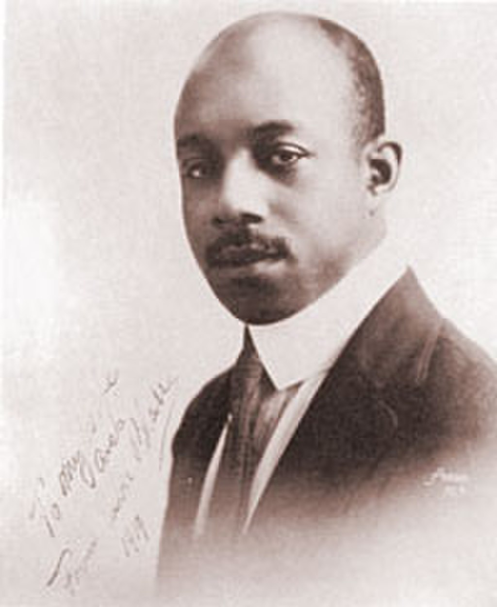American jazz composer, lyricist, and pianist [Eubie Blake](https://en.wikipedia.org/wiki/Eubie_Blake "Eubie Blake") made an early contribution to the genre's etymology.

The origin of the word _[jazz](https://en.wikipedia.org/wiki/Jazz_\(word\) "Jazz (word)")_ has resulted in considerable research, and its history is well documented. It is believed to be related to _jasm_, a slang term dating back to 1860 meaning 'pep, energy'. The earliest written record of the word is in a 1912 article in the _[Los Angeles Times](https://en.wikipedia.org/wiki/Los_Angeles_Times "Los Angeles Times")_ in which a minor league baseball pitcher described a pitch which he called a 'jazz ball' "because it wobbles and you simply can't do anything with it".

The use of the word in a musical context was documented as early as 1915 in the _[Chicago Daily Tribune](https://en.wikipedia.org/wiki/Chicago_Daily_Tribune "Chicago Daily Tribune")._ Its first documented use in a musical context in New Orleans was in a November 14, 1916, _[Times-Picayune](https://en.wikipedia.org/wiki/Times-Picayune "Times-Picayune")_ article about "jas bands". In an interview with [National Public Radio](https://en.wikipedia.org/wiki/National_Public_Radio "National Public Radio"), musician [Eubie Blake](https://en.wikipedia.org/wiki/Eubie_Blake "Eubie Blake") offered his recollections of the slang connotations of the term, saying: "When Broadway picked it up, they called it 'J-A-Z-Z'. It wasn't called that. It was spelled 'J-A-S-S'. That was dirty, and if you knew what it was, you wouldn't say it in front of ladies." The [American Dialect Society](https://en.wikipedia.org/wiki/American_Dialect_Society "American Dialect Society") named it the [Word of the 20th Century](https://en.wikipedia.org/wiki/Word_of_the_year "Word of the year").

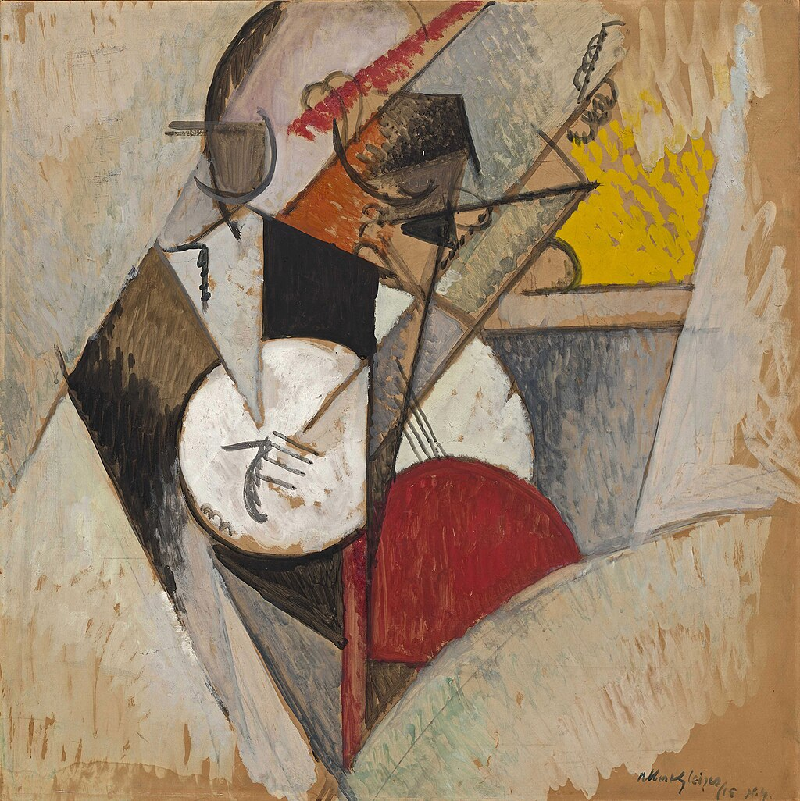[Albert Gleizes](https://en.wikipedia.org/wiki/Albert_Gleizes "Albert Gleizes"), 1915, _[Composition for "Jazz"](./Composition_for_"Jazz" "Composition for \"Jazz\"")_ from the Solomon R. Guggenheim Museum, New York

Jazz is difficult to define because it encompasses a wide range of music spanning a period of over 100 years, from [ragtime](https://en.wikipedia.org/wiki/Ragtime "Ragtime") to [rock](https://en.wikipedia.org/wiki/Rock_music "Rock music")-infused [fusion](https://en.wikipedia.org/wiki/Jazz_fusion "Jazz fusion"). Attempts have been made to define jazz from the perspective of other musical traditions, such as European music history or African music. But critic [Joachim-Ernst Berendt](https://en.wikipedia.org/wiki/Joachim-Ernst_Berendt "Joachim-Ernst Berendt") argues that its terms of reference and its definition should be broader, defining jazz as a "form of [art music](https://en.wikipedia.org/wiki/Art_music "Art music") which originated in the United States through the confrontation of the Negro with European music" and arguing that it differs from European music in that jazz has a "special relationship to time defined as 'swing'". Jazz involves "a spontaneity and vitality of musical production in which improvisation plays a role" and contains a "sonority and manner of phrasing which mirror the individuality of the performing jazz musician".

A broader definition that encompasses different eras of jazz has been proposed by Travis Jackson: "it is music that includes qualities such as swing, improvising, group interaction, developing an 'individual voice', and being open to different musical possibilities". Krin Gabbard argued that "jazz is a construct" which designates "a number of musics with enough in common to be understood as part of a coherent tradition". [Duke Ellington](https://en.wikipedia.org/wiki/Duke_Ellington "Duke Ellington"), one of jazz's most famous figures, said, "It's all music."

## Elements

### Improvisation

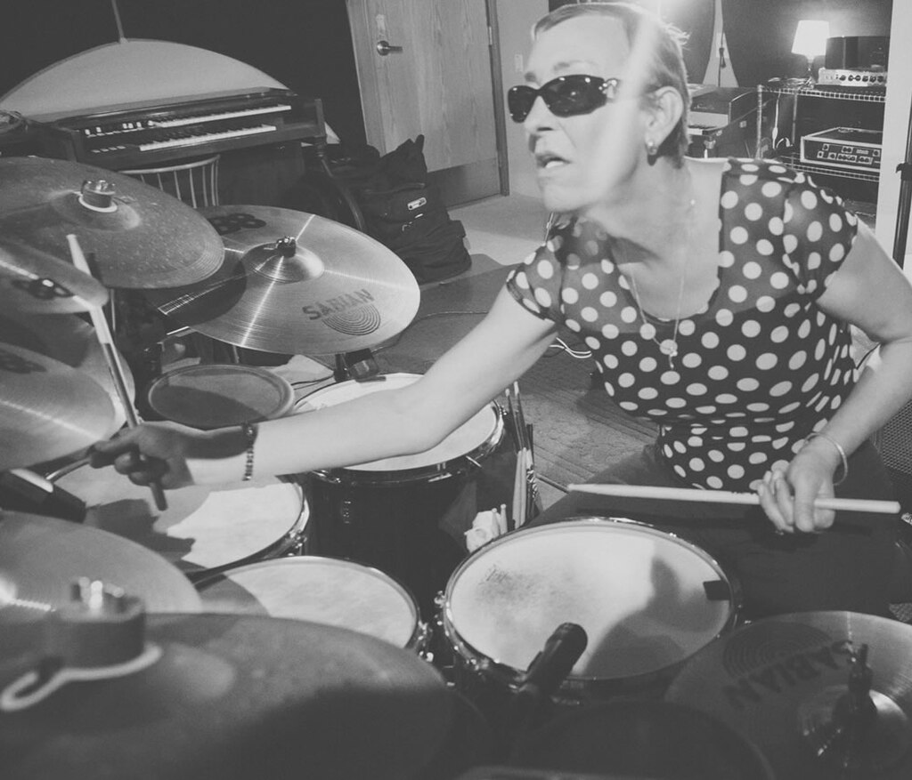Billie Davies, avante garde jazz drummer

Although jazz is considered difficult to define, in part because it contains many subgenres, [improvisation](https://en.wikipedia.org/wiki/Musical_improvisation "Musical improvisation") is one of its defining elements. The centrality of improvisation is attributed to the influence of earlier forms of music such as [blues](https://en.wikipedia.org/wiki/Blues "Blues"), a form of folk music which arose in part from the [work songs](https://en.wikipedia.org/wiki/Work_song "Work song") and [field hollers](https://en.wikipedia.org/wiki/Field_holler "Field holler") of African-American slaves on plantations. These work songs were commonly structured around a repetitive [call-and-response](https://en.wikipedia.org/wiki/Call_and_response_\(music\) "Call and response (music)") pattern, but early blues was also improvisational. [Classical music](https://en.wikipedia.org/wiki/Classical_music "Classical music") performance is evaluated more by its fidelity to the [musical score](https://en.wikipedia.org/wiki/Sheet_music "Sheet music"), with less attention given to interpretation, ornamentation, and accompaniment. The classical performer's goal is to play the composition as it was written. In contrast, jazz is often characterized by the product of interaction and collaboration, placing less value on the contribution of the composer, if there is one, and more on the performer. The jazz performer interprets a tune in individual ways, never playing the same composition twice. Depending on the performer's mood, experience, and interaction with band members or audience members, the performer may change melodies, harmonies, and time signatures.

In early [Dixieland](https://en.wikipedia.org/wiki/Dixieland "Dixieland"), a.k.a. New Orleans jazz, performers took turns playing melodies and improvising [countermelodies](https://en.wikipedia.org/wiki/Countermelodies "Countermelodies"). In the [swing](https://en.wikipedia.org/wiki/Swing_music "Swing music") era of the 1920s–1940s, [big bands](https://en.wikipedia.org/wiki/Big_band "Big band") relied more on [arrangements](https://en.wikipedia.org/wiki/Arrangement "Arrangement") which were written or learned by ear and memorized. Soloists improvised within these arrangements. In the [bebop](https://en.wikipedia.org/wiki/Bebop "Bebop") era of the 1940s, big bands gave way to small groups and minimal arrangements in which the melody was stated briefly at the beginning and most of the piece was improvised. [Modal jazz](https://en.wikipedia.org/wiki/Modal_jazz "Modal jazz") abandoned [chord progressions](https://en.wikipedia.org/wiki/Chord_progressions "Chord progressions") to allow musicians to improvise even more. In many forms of jazz, a soloist is supported by a [rhythm section](https://en.wikipedia.org/wiki/Rhythm_section "Rhythm section") of one or more chordal instruments (piano, guitar), double bass, and drums. The rhythm section plays chords and rhythms that outline the composition structure and complement the soloist. In [avant-garde](https://en.wikipedia.org/wiki/Avant-garde_jazz "Avant-garde jazz") and [free jazz](https://en.wikipedia.org/wiki/Free_jazz "Free jazz"), the separation of soloist and band is reduced, and there is license, or even a requirement, for the abandoning of chords, scales, and meters.

### Traditionalism

Since the emergence of bebop, forms of jazz that are commercially oriented or influenced by popular music have been criticized. According to Bruce Johnson, there has always been a "tension between jazz as a commercial music and an art form". Regarding the [Dixieland jazz](https://en.wikipedia.org/wiki/Dixieland_jazz "Dixieland jazz") revival of the 1940s, Black musicians rejected it as being shallow nostalgia entertainment for white audiences. On the other hand, traditional jazz enthusiasts have dismissed bebop, free jazz, and [jazz fusion](https://en.wikipedia.org/wiki/Jazz_fusion "Jazz fusion") as forms of debasement and betrayal. An alternative view is that jazz can absorb and transform diverse musical styles. By avoiding the creation of norms, jazz allows avant-garde styles to emerge.

## Diversity in jazz

### Jazz and race

For some African Americans, jazz has drawn attention to African-American contributions to culture and history. For others, jazz is a reminder of "an oppressive and racist society and restrictions on their artistic visions". [Amiri Baraka](https://en.wikipedia.org/wiki/Amiri_Baraka "Amiri Baraka") argues that there is a "white jazz" genre that expresses [whiteness](https://en.wikipedia.org/wiki/Whiteness_studies "Whiteness studies"). White jazz musicians appeared in the Midwest and in other areas throughout the U.S. [Papa Jack Laine](https://en.wikipedia.org/wiki/Papa_Jack_Laine "Papa Jack Laine"), who ran the Reliance band in New Orleans in the 1910s, was called "the father of white jazz". The [Original Dixieland Jazz Band](https://en.wikipedia.org/wiki/Original_Dixieland_Jazz_Band "Original Dixieland Jazz Band"), whose members were white, were the first jazz group to record, and [Bix Beiderbecke](https://en.wikipedia.org/wiki/Bix_Beiderbecke "Bix Beiderbecke") was one of the most prominent jazz soloists of the 1920s. The Chicago Style was developed by white musicians such as [Eddie Condon](https://en.wikipedia.org/wiki/Eddie_Condon "Eddie Condon"), [Bud Freeman](https://en.wikipedia.org/wiki/Bud_Freeman "Bud Freeman"), [Jimmy McPartland](https://en.wikipedia.org/wiki/Jimmy_McPartland "Jimmy McPartland"), and [Dave Tough](https://en.wikipedia.org/wiki/Dave_Tough "Dave Tough"). Others from Chicago such as [Benny Goodman](https://en.wikipedia.org/wiki/Benny_Goodman "Benny Goodman") and [Gene Krupa](https://en.wikipedia.org/wiki/Gene_Krupa "Gene Krupa") became leading members of swing during the 1930s. Many bands included both Black and white musicians. These musicians helped change attitudes toward race in the U.S.

### Roles of women

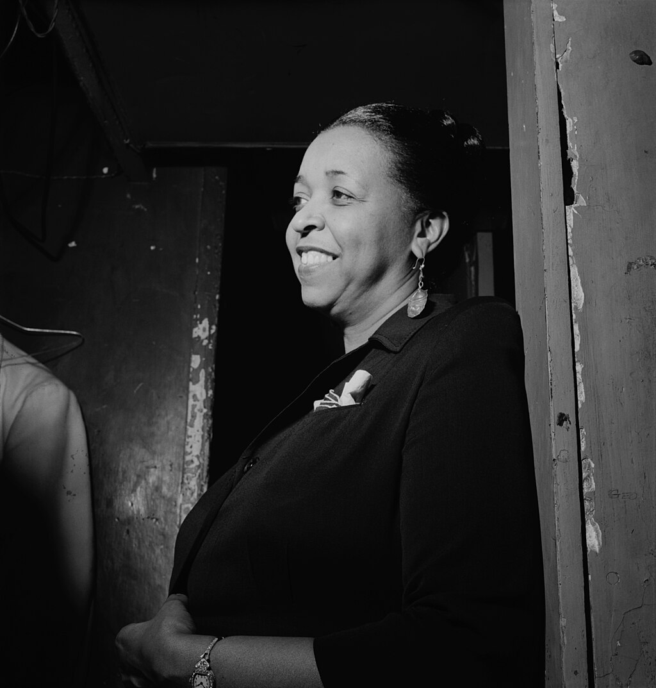[Ethel Waters](https://en.wikipedia.org/wiki/Ethel_Waters "Ethel Waters") sang "[Stormy Weather](https://en.wikipedia.org/wiki/Stormy_Weather_\(song\) "Stormy Weather (song)")" at the [Cotton Club](https://en.wikipedia.org/wiki/Cotton_Club "Cotton Club").

Female jazz performers and composers have contributed to jazz throughout its history. Although [Betty Carter](https://en.wikipedia.org/wiki/Betty_Carter "Betty Carter"), [Ella Fitzgerald](https://en.wikipedia.org/wiki/Ella_Fitzgerald "Ella Fitzgerald"), [Adelaide Hall](https://en.wikipedia.org/wiki/Adelaide_Hall "Adelaide Hall"), [Billie Holiday](https://en.wikipedia.org/wiki/Billie_Holiday "Billie Holiday"), [Peggy Lee](https://en.wikipedia.org/wiki/Peggy_Lee "Peggy Lee"), [Abbey Lincoln](https://en.wikipedia.org/wiki/Abbey_Lincoln "Abbey Lincoln"), [Anita O'Day](https://en.wikipedia.org/wiki/Anita_O'Day "Anita O'Day"), [Dinah Washington](https://en.wikipedia.org/wiki/Dinah_Washington "Dinah Washington"), and [Ethel Waters](https://en.wikipedia.org/wiki/Ethel_Waters "Ethel Waters") were recognized for their vocal talent, less familiar were bandleaders, composers, and instrumentalists such as pianist [Lil Hardin Armstrong](https://en.wikipedia.org/wiki/Lil_Hardin_Armstrong "Lil Hardin Armstrong"), trumpeter [Valaida Snow](https://en.wikipedia.org/wiki/Valaida_Snow "Valaida Snow"), and songwriters [Irene Higginbotham](https://en.wikipedia.org/wiki/Irene_Higginbotham "Irene Higginbotham") and [Dorothy Fields](https://en.wikipedia.org/wiki/Dorothy_Fields "Dorothy Fields"). Women began playing instruments in jazz in the early 1920s, drawing particular recognition on piano.

When male jazz musicians were drafted during World War II, many [all-female bands](https://en.wikipedia.org/wiki/All-female_bands "All-female bands") replaced them. [The International Sweethearts of Rhythm](https://en.wikipedia.org/wiki/The_International_Sweethearts_of_Rhythm "The International Sweethearts of Rhythm"), which was founded in 1937, was a popular band that became the first all-female integrated band in the U.S. and the first to travel with the [USO](https://en.wikipedia.org/wiki/USO "USO"), touring Europe in 1945. Women were members of the big bands of [Woody Herman](https://en.wikipedia.org/wiki/Woody_Herman "Woody Herman") and [Gerald Wilson](https://en.wikipedia.org/wiki/Gerald_Wilson "Gerald Wilson"). Beginning in the 1950s, many women jazz instrumentalists were prominent, some sustaining long careers. Some of the most distinctive improvisers, composers, and bandleaders in jazz have been women. Trombonist [Melba Liston](https://en.wikipedia.org/wiki/Melba_Liston "Melba Liston") is acknowledged as the first female horn player to work in major bands and to make a real impact on jazz, not only as a musician but also as a respected composer and arranger, particularly through her collaborations with [Randy Weston](https://en.wikipedia.org/wiki/Randy_Weston "Randy Weston") from the late 1950s into the 1990s.

### Jews in jazz

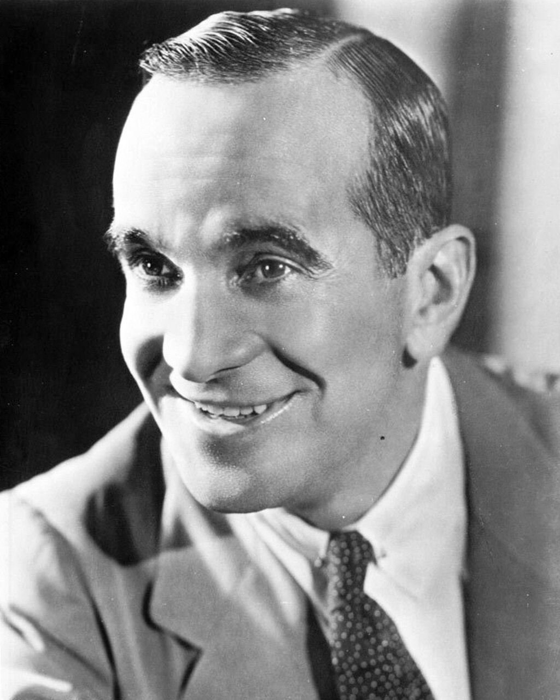[Al Jolson](https://en.wikipedia.org/wiki/Al_Jolson "Al Jolson") in 1925

Jewish Americans played a significant role in jazz. As jazz spread, it developed to encompass many different cultures, and the work of Jewish composers in [Tin Pan Alley](https://en.wikipedia.org/wiki/Tin_Pan_Alley "Tin Pan Alley") helped shape the many different sounds that jazz came to incorporate.

Jewish Americans were able to thrive in Jazz because of the probationary whiteness that they were allotted at the time. George Bornstein wrote that African Americans were sympathetic to the plight of the Jewish American and vice versa. As disenfranchised minorities themselves, Jewish composers of popular music saw themselves as natural allies with African Americans.

_[The Jazz Singer](https://en.wikipedia.org/wiki/The_Jazz_Singer "The Jazz Singer")_ with [Al Jolson](https://en.wikipedia.org/wiki/Al_Jolson "Al Jolson") is one example of how Jewish Americans were able to bring jazz, music that African Americans developed, into popular culture. [Benny Goodman](https://en.wikipedia.org/wiki/Benny_Goodman "Benny Goodman") was a vital Jewish American to the progression of Jazz. Goodman was the leader of a racially integrated band named King of Swing. His jazz concert in the [Carnegie Hall](https://en.wikipedia.org/wiki/Carnegie_Hall "Carnegie Hall") in 1938 was the first ever to be played there. The concert was described by Bruce Eder as "the single most important jazz or popular music concert in history".

[Shep Fields](https://en.wikipedia.org/wiki/Shep_Fields "Shep Fields") also helped to popularize [sweet jazz](https://en.wikipedia.org/wiki/Sweet_jazz "Sweet jazz") through his appearances and [big band remote](https://en.wikipedia.org/wiki/Big_band_remote "Big band remote") broadcasts from such landmark venues as Chicago's [Palmer House](https://en.wikipedia.org/wiki/Palmer_House_Hilton "Palmer House Hilton"), Broadway's [Paramount Theater](https://en.wikipedia.org/wiki/Paramount_Theater_\(New_York_City\) "Paramount Theater (New York City)") and the Starlight Roof at the famed [Waldorf-Astoria Hotel](https://en.wikipedia.org/wiki/Waldorf-Astoria_Hotel "Waldorf-Astoria Hotel"). He entertained audiences with a light elegant musical style which remained popular with audiences for nearly three decades from the 1930s until the late 1950s.

## Early development

Jazz originated in the late-19th to early-20th century. It developed out of many forms of music, including [blues](https://en.wikipedia.org/wiki/Blues "Blues"), [ragtime](https://en.wikipedia.org/wiki/Ragtime "Ragtime"), European [harmony](https://en.wikipedia.org/wiki/Harmony "Harmony"), African rhythmic rituals, [spirituals](https://en.wikipedia.org/wiki/Spirituals "Spirituals"), [hymns](https://en.wikipedia.org/wiki/Hymns "Hymns"), [marches](https://en.wikipedia.org/wiki/March_\(music\) "March (music)"), [vaudeville](https://en.wikipedia.org/wiki/Vaudeville "Vaudeville") song, and [dance music](https://en.wikipedia.org/wiki/Dance_music "Dance music"). It also incorporated interpretations of American and European classical music, entwined with African and slave folk songs and the influences of West African culture. Its composition and style have changed many times throughout the years with each performer's personal interpretation and improvisation, which is also one of the greatest appeals of the genre.

### Blended African and European music sensibilities

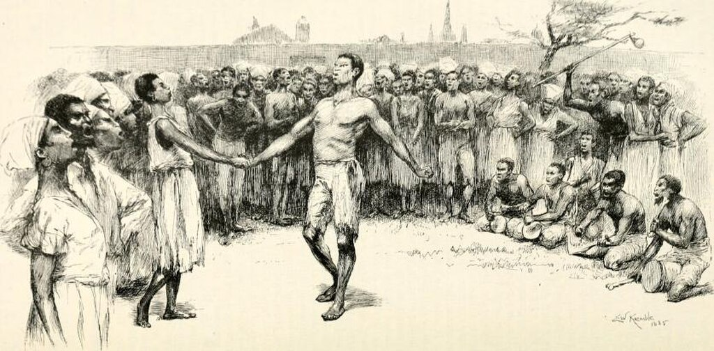Dance in Congo Square in the late 1700s, artist's conception by [E. W. Kemble](https://en.wikipedia.org/wiki/E._W._Kemble "E. W. Kemble") from a century later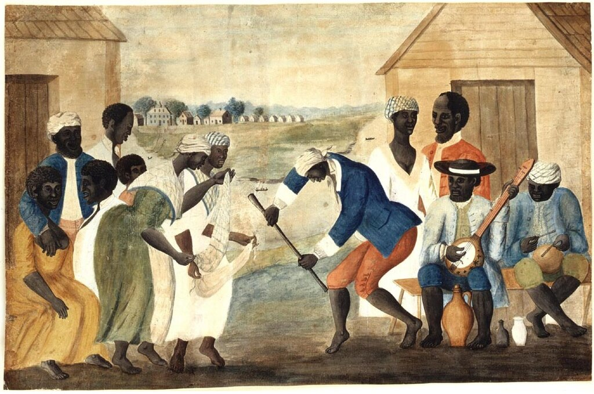The late 18th-century painting _[The Old Plantation](https://en.wikipedia.org/wiki/The_Old_Plantation "The Old Plantation")_, depicting African-Americans on a [Virginia](https://en.wikipedia.org/wiki/Virginia "Virginia") plantation dancing to percussion and a banjo

By the 18th century, slaves in the New Orleans area gathered socially at a special market, in an area which later became known as [Congo Square](https://en.wikipedia.org/wiki/Congo_Square "Congo Square"), famous for its African dances.

By 1866, the [Atlantic slave trade](https://en.wikipedia.org/wiki/Atlantic_slave_trade "Atlantic slave trade") had brought nearly 400,000 Africans to North America. The slaves came largely from [West Africa](https://en.wikipedia.org/wiki/West_Africa "West Africa") and the greater [Congo River](https://en.wikipedia.org/wiki/Congo_River "Congo River") basin and brought strong musical traditions with them. The African traditions primarily use a single-line melody and [call-and-response](https://en.wikipedia.org/wiki/Call_and_response_\(music\) "Call and response (music)") pattern, and the rhythms have a [counter-metric](https://en.wikipedia.org/wiki/Cross-beat "Cross-beat") structure and reflect African speech patterns.

An 1885 account says that they were making strange music (Creole) on an equally strange variety of 'instruments'—washboards, washtubs, jugs, boxes beaten with sticks or bones and a drum made by stretching skin over a flour-barrel.

Lavish festivals with African-based dances to drums were organized on Sundays at Place Congo, or Congo Square, in New Orleans until 1843. There are historical accounts of other music and dance gatherings elsewhere in the southern United States. [Robert Palmer](https://en.wikipedia.org/wiki/Robert_Palmer_\(American_writer\) "Robert Palmer (American writer)") said of percussive slave music:

> Usually such music was associated with annual festivals, when the year's crop was harvested and several days were set aside for celebration. As late as 1861, a traveler in North Carolina saw dancers dressed in costumes that included horned headdresses and cow tails and heard music provided by a sheepskin-covered "gumbo box", apparently a frame drum; triangles and jawbones furnished the auxiliary percussion. There are quite a few \[accounts\] from the southeastern states and Louisiana dating from the period 1820–1850. Some of the earliest \[Mississippi\] Delta settlers came from the vicinity of New Orleans, where drumming was never actively discouraged for very long and homemade drums were used to accompany public dancing until the outbreak of the Civil War.

Another influence came from the harmonic style of [hymns](https://en.wikipedia.org/wiki/Hymn "Hymn") of the church, which black slaves had learned and incorporated into their own music as [spirituals](https://en.wikipedia.org/wiki/Spirituals "Spirituals"). The [origins of the blues](https://en.wikipedia.org/wiki/Origins_of_the_blues "Origins of the blues") are undocumented, though they can be seen as the secular counterpart of the spirituals. However, as [Gerhard Kubik](https://en.wikipedia.org/wiki/Gerhard_Kubik "Gerhard Kubik") points out, whereas the spirituals are [homophonic](https://en.wikipedia.org/wiki/Homophony "Homophony"), rural blues and early jazz "was largely based on concepts of [heterophony](https://en.wikipedia.org/wiki/Heterophony "Heterophony")".

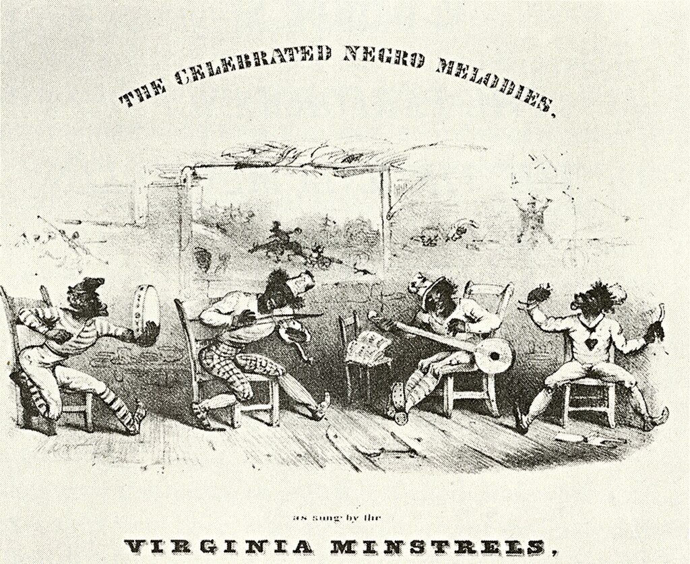The blackface [Virginia Minstrels](https://en.wikipedia.org/wiki/Virginia_Minstrels "Virginia Minstrels") in 1843, featuring tambourine, fiddle, banjo, and [bones](https://en.wikipedia.org/wiki/Bones_\(instrument\) "Bones (instrument)")

During the early 19th century an increasing number of black musicians learned to play European instruments, particularly the violin, which they used to parody European dance music in their own [cakewalk](https://en.wikipedia.org/wiki/Cakewalk "Cakewalk") dances. In turn, European American [minstrel show](https://en.wikipedia.org/wiki/Minstrel_show "Minstrel show") performers in [blackface](https://en.wikipedia.org/wiki/Blackface "Blackface") popularized the music internationally, combining [syncopation](https://en.wikipedia.org/wiki/Syncopation "Syncopation") with European harmonic accompaniment. In the mid-1800s the white New Orleans composer [Louis Moreau Gottschalk](https://en.wikipedia.org/wiki/Louis_Moreau_Gottschalk "Louis Moreau Gottschalk") adapted slave rhythms and melodies from Cuba and other Caribbean islands into piano salon music. New Orleans was the main nexus between the Afro-Caribbean and African American cultures.

### African rhythmic retention

The [Black Codes](https://en.wikipedia.org/wiki/Black_Codes_\(United_States\) "Black Codes (United States)") outlawed drumming by slaves, which meant that African drumming traditions were not preserved in North America, unlike in Cuba, Haiti, and elsewhere in the Caribbean. African-based rhythmic patterns were retained in the United States in large part through "body rhythms" such as stomping, clapping, and [patting juba dancing](https://en.wikipedia.org/wiki/Juba_dance "Juba dance").

In the opinion of jazz historian [Ernest Borneman](https://en.wikipedia.org/wiki/Ernest_Borneman "Ernest Borneman"), what preceded New Orleans jazz before 1890 was "Afro-Latin music", similar to what was played in the Caribbean at the time. A three-stroke pattern known in Cuban music as [_tresillo_](https://en.wikipedia.org/wiki/Tresillo_\(rhythm\) "Tresillo (rhythm)") is a fundamental rhythmic figure heard in many different slave musics of the Caribbean, as well as the [Afro-Caribbean](https://en.wikipedia.org/wiki/Afro-Caribbean_music "Afro-Caribbean music") folk dances performed in New Orleans Congo Square and Gottschalk's compositions (for example "Souvenirs From Havana" (1859)). Tresillo (shown below) is the most basic and most prevalent duple-pulse rhythmic [cell](https://en.wikipedia.org/wiki/Cell_\(music\) "Cell (music)") in [sub-Saharan African music traditions](https://en.wikipedia.org/wiki/Sub-Saharan_African_music_traditions "Sub-Saharan African music traditions") and the music of the [African Diaspora](https://en.wikipedia.org/wiki/African_Diaspora "African Diaspora").

![\new RhythmicStaff {
\clef percussion
\time 2/4
\repeat volta 2 { c8. c16 r8[ c] }
}](../media/jazz/clpo3cch.png)

[Tresillo](https://en.wikipedia.org/wiki/Tresillo_\(rhythm\) "Tresillo (rhythm)") is heard prominently in New Orleans [second line](https://en.wikipedia.org/wiki/Second_line_\(parades\) "Second line (parades)") music and in other forms of popular music from that city from the turn of the 20th century to present. "By and large the simpler African rhythmic patterns survived in jazz ... because they could be adapted more readily to European rhythmic conceptions," jazz historian [Gunther Schuller](https://en.wikipedia.org/wiki/Gunther_Schuller "Gunther Schuller") observed. "Some survived, others were discarded as the Europeanization progressed."

In the post-Civil War period (after 1865), African Americans were able to obtain surplus military bass drums, snare drums and fifes, and an original African-American drum and fife music emerged, featuring tresillo and related syncopated rhythmic figures. This was a drumming tradition that was distinct from its Caribbean counterparts, expressing a uniquely African-American sensibility. "The snare and bass drummers played syncopated [cross-rhythms](https://en.wikipedia.org/wiki/Cross_beat "Cross beat")," observed the writer Robert Palmer, speculating that "this tradition must have dated back to the latter half of the nineteenth century, and it could have not have developed in the first place if there hadn't been a reservoir of polyrhythmic sophistication in the culture it nurtured."

### Afro-Cuban influence

[African-American music](https://en.wikipedia.org/wiki/African-American_music "African-American music") began incorporating [Afro-Cuban](https://en.wikipedia.org/wiki/Afro-Cuban "Afro-Cuban") rhythmic motifs in the 19th century when the [habanera](https://en.wikipedia.org/wiki/Habanera_\(music\) "Habanera (music)") (Cuban [contradanza](https://en.wikipedia.org/wiki/Contradanza "Contradanza")) gained international popularity. Musicians from [Havana](https://en.wikipedia.org/wiki/Havana "Havana") and New Orleans would take the twice-daily ferry between both cities to perform, and the habanera quickly took root in the musically fertile Crescent City. [John Storm Roberts](https://en.wikipedia.org/wiki/John_Storm_Roberts "John Storm Roberts") states that the musical genre habanera "reached the U.S. twenty years before the first rag was published." For the more than quarter-century in which the [cakewalk](https://en.wikipedia.org/wiki/Cakewalk "Cakewalk"), [ragtime](https://en.wikipedia.org/wiki/Ragtime "Ragtime"), and proto-jazz were forming and developing, the habanera was a consistent part of African-American popular music.

Habaneras were widely available as sheet music and were the first written music which was rhythmically based on an African motif (1803). From the perspective of African-American music, the "habanera rhythm" (also known as "congo"), "tango-congo", or [tango](https://en.wikipedia.org/wiki/Tango_\(music\) "Tango (music)"). can be thought of as a combination of [tresillo](https://en.wikipedia.org/wiki/Tresillo_\(rhythm\) "Tresillo (rhythm)") and the [backbeat](https://en.wikipedia.org/wiki/Beat_\(music\) "Beat (music)"). The habanera was the first of many Cuban music genres which enjoyed periods of popularity in the United States and reinforced and inspired the use of tresillo-based rhythms in African-American music.

New Orleans native [Louis Moreau Gottschalk](https://en.wikipedia.org/wiki/Louis_Moreau_Gottschalk "Louis Moreau Gottschalk")'s piano piece "Ojos Criollos (Danse Cubaine)" (1860) was influenced by the composer's studies in Cuba: the habanera rhythm is clearly heard in the left hand. In Gottschalk's symphonic work "A Night in the Tropics" (1859), the tresillo variant [cinquillo](https://en.wikipedia.org/wiki/Cinquillo "Cinquillo") appears extensively. The figure was later used by Scott Joplin and other ragtime composers.

![\new RhythmicStaff {
\clef percussion
\time 2/4
\repeat volta 2 { c8 c16 c r[ c c r] }
}](../media/jazz/940h4o3f.png)

Comparing the music of New Orleans with the music of Cuba, [Wynton Marsalis](https://en.wikipedia.org/wiki/Wynton_Marsalis "Wynton Marsalis") observes that [tresillo](https://en.wikipedia.org/wiki/Tresillo_\(rhythm\) "Tresillo (rhythm)") is the New Orleans "clavé", a Spanish word meaning "code" or "key", as in the key to a puzzle, or mystery. Although the pattern is only half a [clave](https://en.wikipedia.org/wiki/Clave_\(rhythm\) "Clave (rhythm)"), Marsalis makes the point that the single-celled figure is the [guide-pattern](https://en.wikipedia.org/wiki/Bell_pattern "Bell pattern") of New Orleans music. [Jelly Roll Morton](https://en.wikipedia.org/wiki/Jelly_Roll_Morton "Jelly Roll Morton") called the rhythmic figure the [Spanish tinge](https://en.wikipedia.org/wiki/Spanish_tinge "Spanish tinge") and considered it an essential ingredient of jazz.

### Ragtime

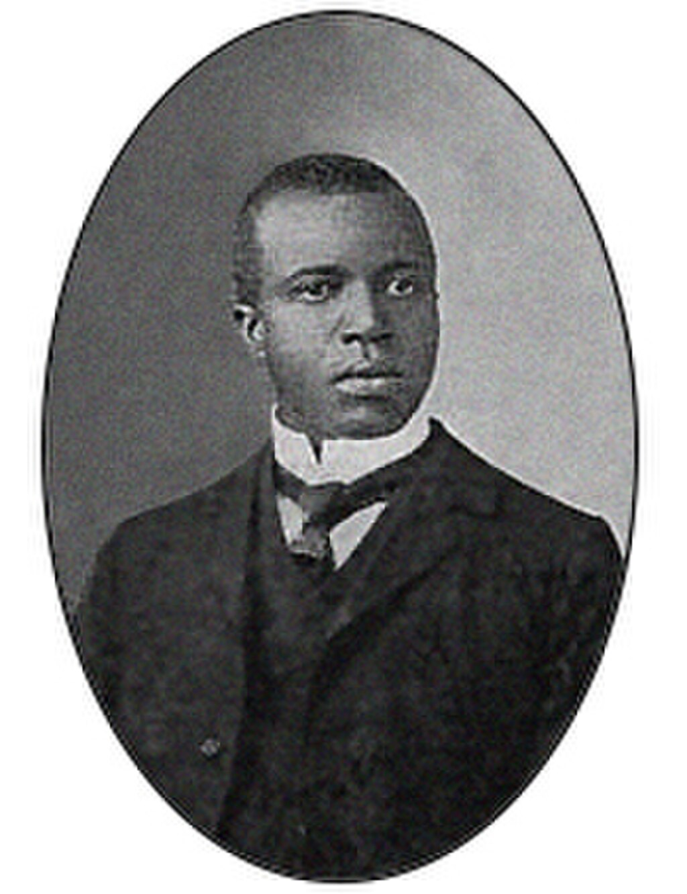[Scott Joplin](https://en.wikipedia.org/wiki/Scott_Joplin "Scott Joplin") in 1903

The abolition of [slavery](https://en.wikipedia.org/wiki/Slavery "Slavery") in 1865 led to new opportunities for the education of freed African Americans. Although strict segregation limited employment opportunities for most blacks, many were able to find work in entertainment. Black musicians were able to provide entertainment in dances, [minstrel shows](https://en.wikipedia.org/wiki/Minstrel_show "Minstrel show"), and in [vaudeville](https://en.wikipedia.org/wiki/Vaudeville "Vaudeville"), during which time many marching bands were formed. Black pianists played in bars, clubs, and brothels, as [ragtime](https://en.wikipedia.org/wiki/Ragtime "Ragtime") developed.

Ragtime appeared as sheet music, popularized by African-American musicians such as the entertainer [Ernest Hogan](https://en.wikipedia.org/wiki/Ernest_Hogan "Ernest Hogan"), whose hit songs appeared in 1895. Two years later, [Vess Ossman](https://en.wikipedia.org/wiki/Vess_Ossman "Vess Ossman") recorded a medley of these songs as a [banjo](https://en.wikipedia.org/wiki/Banjo "Banjo") solo known as "Rag Time Medley". Also in 1897, the white composer [William Krell](https://en.wikipedia.org/wiki/William_Krell "William Krell") published his "[Mississippi Rag](https://en.wikipedia.org/wiki/Mississippi_Rag "Mississippi Rag")" as the first written piano instrumental ragtime piece, and [Tom Turpin](https://en.wikipedia.org/wiki/Tom_Turpin "Tom Turpin") published his "Harlem Rag", the first rag published by an African-American.

Classically trained pianist [Scott Joplin](https://en.wikipedia.org/wiki/Scott_Joplin "Scott Joplin") produced his "[Original Rags](https://en.wikipedia.org/wiki/Original_Rags "Original Rags")" in 1898 and, in 1899, had an international hit with "[Maple Leaf Rag](https://en.wikipedia.org/wiki/Maple_Leaf_Rag "Maple Leaf Rag")", a multi-[strain](https://en.wikipedia.org/wiki/Strain_\(music\) "Strain (music)") ragtime [march](https://en.wikipedia.org/wiki/March_\(music\) "March (music)") with four parts that feature recurring themes and a bass line with copious [seventh chords](https://en.wikipedia.org/wiki/Seventh_chord "Seventh chord"). Its structure was the basis for many other rags, and the [syncopations](https://en.wikipedia.org/wiki/Syncopation "Syncopation") in the right hand, especially in the transition between the first and second strain, were novel at the time. The last four measures of Scott Joplin's "Maple Leaf Rag" (1899) are shown below.

![{
\new PianoStaff <<
\new Staff <<
\new Voice \relative c' {
\clef treble \key aes \major \time 2/4
<f aes>16 bes <f aes>8 <fes aes> <fes bes>16 <es aes>~
<es aes> bes' <es, c'> aes bes <es, c'>8 <d aes'>16~
<d aes'> bes' <d, c'> aes' r <des, bes'>8 es16
<c aes'>8 <g' des' es> <aes c es aes>
}
>>
\new Staff <<
\relative c, {
\clef bass \key aes \major \time 2/4
<des des'>8 <des des'> <bes bes'> <d d'>
<es es'> <es' aes c> <es, es'> <e e'>
<f f'> <f f'> <g g'> <g g'> <aes aes'> <es es'> <aes, aes'> \bar \"|.\"
}
>>
>>
}](../media/jazz/dvtm4x2u.png)

African-based rhythmic patterns such as [tresillo](https://en.wikipedia.org/wiki/Tresillo_\(rhythm\) "Tresillo (rhythm)") and its variants, the habanera rhythm and [cinquillo](https://en.wikipedia.org/wiki/Cinquillo "Cinquillo"), are heard in the ragtime compositions of Joplin and Turpin. Joplin's "[Solace](https://en.wikipedia.org/wiki/Solace_\(Joplin\) "Solace (Joplin)")" (1909) is generally considered to be in the habanera genre: both of the pianist's hands play in a syncopated fashion, completely abandoning any sense of a [march](https://en.wikipedia.org/wiki/March_\(music\) "March (music)") rhythm. [Ned Sublette](https://en.wikipedia.org/wiki/Ned_Sublette "Ned Sublette") postulates that the tresillo/habanera rhythm "found its way into ragtime and the cakewalk," whilst Roberts suggests that "the habanera influence may have been part of what freed black music from ragtime's European bass".

### Ragtime in other regions

In the northeastern United States, a "hot" style of playing ragtime had developed, notably [James Reese Europe](https://en.wikipedia.org/wiki/James_Reese_Europe "James Reese Europe")'s symphonic [Clef Club](https://en.wikipedia.org/wiki/Clef_Club "Clef Club") orchestra in New York City, which played a benefit concert at [Carnegie Hall](https://en.wikipedia.org/wiki/Carnegie_Hall "Carnegie Hall") in 1912. The Baltimore rag style of [Eubie Blake](https://en.wikipedia.org/wiki/Eubie_Blake "Eubie Blake") influenced [James P. Johnson](https://en.wikipedia.org/wiki/James_P._Johnson "James P. Johnson")'s development of [stride piano](https://en.wikipedia.org/wiki/Stride_piano "Stride piano") playing, in which the right hand plays the melody, while the left hand provides the rhythm and bassline.

In Ohio and elsewhere in the mid-west the major influence was ragtime, until about 1919. Around 1912, when the four-string banjo and saxophone came in, musicians began to improvise the melody line, but the harmony and rhythm remained unchanged. A contemporary account states that blues could only be heard in jazz in the gut-bucket cabarets, which were generally looked down upon by the Black middle-class.

### Blues

#### African genesis

Audio playback is not supported in your browser. You can [download the audio file](https://upload.wikimedia.org/score/o/s/oskrw0rbn1il1pydfxhqprxvrqtfruw/oskrw0rb.mp3).

Audio playback is not supported in your browser. You can [download the audio file](https://upload.wikimedia.org/score/d/7/d74czl67ctqn9k636axwdfnw4v4j5s3/d74czl67.mp3).

A hexatonic [blues scale](https://en.wikipedia.org/wiki/Blues_scale "Blues scale") on C, ascending

Blues is the name given to both a musical form and a music genre, which originated in [African-American](https://en.wikipedia.org/wiki/African-American "African-American") communities of primarily the [Deep South](https://en.wikipedia.org/wiki/Deep_South "Deep South") of the United States at the end of the 19th century from their [spirituals](https://en.wikipedia.org/wiki/Spiritual_\(music\) "Spiritual (music)"), [work songs](https://en.wikipedia.org/wiki/Work_song "Work song"), [field hollers](https://en.wikipedia.org/wiki/Field_holler "Field holler"), [shouts](https://en.wikipedia.org/wiki/Ring_shout "Ring shout") and [chants](https://en.wikipedia.org/wiki/Chant "Chant") and rhymed simple narrative [ballads](https://en.wikipedia.org/wiki/Ballad_\(music\) "Ballad (music)").

The African use of pentatonic scales contributed to the development of [blue notes](https://en.wikipedia.org/wiki/Blue_note "Blue note") in blues and jazz. As Kubik explains:

> Many of the rural blues of the Deep South are _stylistically_ an extension and merger of basically two broad accompanied song-style traditions in the west central Sudanic belt:
>
> *   A strongly Arabic/Islamic song style, as found for example among the [Hausa](https://en.wikipedia.org/wiki/Hausa_people "Hausa people"). It is characterized by melisma, wavy intonation, pitch instabilities within a pentatonic framework, and a declamatory voice.
> *   An ancient west central Sudanic stratum of pentatonic song composition, often associated with simple work rhythms in a regular meter, but with notable off-beat accents.

#### W. C. Handy: early published blues

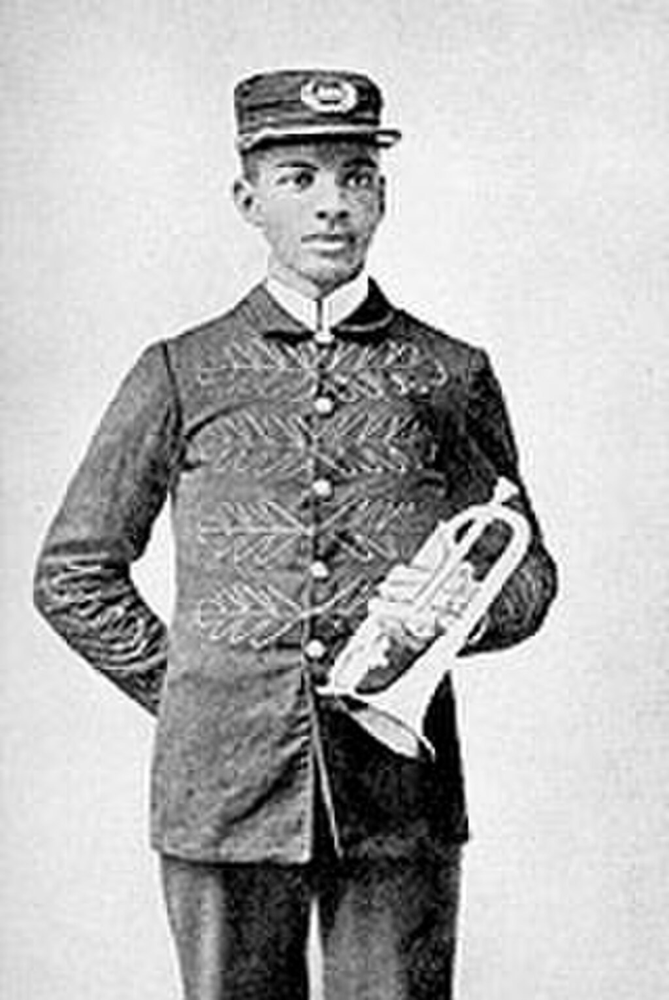[W. C. Handy](https://en.wikipedia.org/wiki/W._C._Handy "W. C. Handy") at 19, 1892

[W. C. Handy](https://en.wikipedia.org/wiki/W._C._Handy "W. C. Handy") became interested in folk blues of the Deep South while traveling through the Mississippi Delta. In this folk blues form, the singer would improvise freely within a limited melodic range, sounding like a field holler, and the guitar accompaniment was slapped rather than strummed, like a small drum which responded in syncopated accents, functioning as another "voice". Handy and his band members were formally trained African-American musicians who had not grown up with the blues, yet he was able to adapt the blues to a larger band instrument format and arrange them in a popular music form.

Handy wrote about his adopting of the blues:

> The primitive southern Negro, as he sang, was sure to bear down on the third and seventh tone of the scale, slurring between major and minor. Whether in the cotton field of the Delta or on the Levee up St. Louis way, it was always the same. Till then, however, I had never heard this slur used by a more sophisticated Negro, or by any white man. I tried to convey this effect ... by introducing flat thirds and sevenths (now called blue notes) into my song, although its prevailing key was major ... , and I carried this device into my melody as well.

The publication of his "[Memphis Blues](https://en.wikipedia.org/wiki/The_Memphis_Blues "The Memphis Blues")" sheet music in 1912 introduced the 12-bar blues to the world (although [Gunther Schuller](https://en.wikipedia.org/wiki/Gunther_Schuller "Gunther Schuller") argues that it is not really a blues, but "more like a cakewalk"). This composition, as well as his later "[St. Louis Blues](https://en.wikipedia.org/wiki/St._Louis_Blues_\(song\) "St. Louis Blues (song)")" and others, included the habanera rhythm, and would become [jazz standards](https://en.wikipedia.org/wiki/Jazz_standard "Jazz standard"). Handy's music career began in the pre-jazz era and contributed to the codification of jazz through the publication of some of the first jazz sheet music.

### New Orleans origins

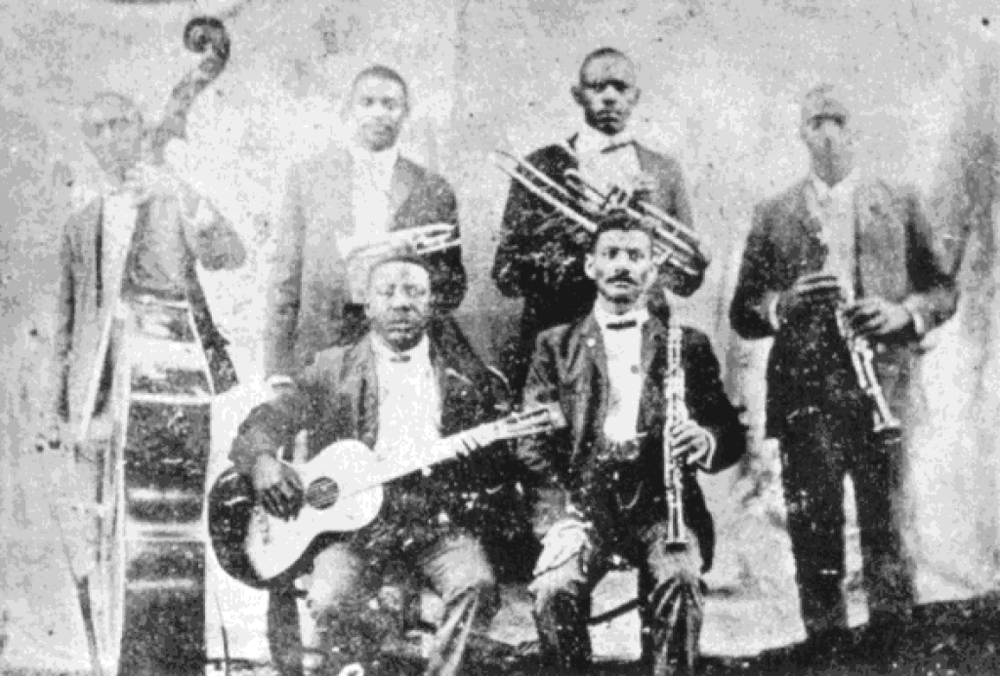[The Bolden Band](https://en.wikipedia.org/wiki/Buddy_Bolden "Buddy Bolden") around 1905

The music of [New Orleans](https://en.wikipedia.org/wiki/New_Orleans "New Orleans"), Louisiana, had a profound effect on the creation of early jazz. In New Orleans, slaves could practice elements of their culture such as [voodoo](https://en.wikipedia.org/wiki/Louisiana_Voodoo "Louisiana Voodoo") and playing drums. Many early jazz musicians played in the bars and brothels of the red-light district around Basin Street called [Storyville](https://en.wikipedia.org/wiki/Storyville,_New_Orleans "Storyville, New Orleans"). In addition to dance bands, there were marching bands which played at lavish funerals (later called [jazz funerals](https://en.wikipedia.org/wiki/Jazz_funeral "Jazz funeral")). The instruments used by marching bands and dance bands became the instruments of jazz: brass, drums, and reeds tuned in the European 12-tone scale. Small bands contained a combination of self-taught and formally educated musicians, many from the funeral procession tradition. These bands traveled in black communities in the deep south. Beginning in 1914, [Louisiana Creole](https://en.wikipedia.org/wiki/Louisiana_Creole_people "Louisiana Creole people") and African-American musicians played in [vaudeville](https://en.wikipedia.org/wiki/Vaudeville "Vaudeville") shows which carried jazz to cities in the northern and western parts of the U.S. Jazz became international in 1914, when the Creole Band with cornettist [Freddie Keppard](https://en.wikipedia.org/wiki/Freddie_Keppard "Freddie Keppard") performed the first ever jazz concert outside the United States, at the [Pantages Playhouse Theatre](https://en.wikipedia.org/wiki/Pantages_Playhouse_Theatre "Pantages Playhouse Theatre") in [Winnipeg](https://en.wikipedia.org/wiki/Winnipeg "Winnipeg"), Canada.

In New Orleans, a white bandleader named [Papa Jack Laine](https://en.wikipedia.org/wiki/Papa_Jack_Laine "Papa Jack Laine") integrated blacks and whites in his marching band. He was known as "the father of white jazz" because of the many top players he employed, such as [George Brunies](https://en.wikipedia.org/wiki/George_Brunies "George Brunies"), [Sharkey Bonano](https://en.wikipedia.org/wiki/Sharkey_Bonano "Sharkey Bonano"), and future members of the [Original Dixieland Jass Band](https://en.wikipedia.org/wiki/Original_Dixieland_Jass_Band "Original Dixieland Jass Band"). During the early 1900s, jazz was mostly performed in African-American and [mulatto](https://en.wikipedia.org/wiki/Mulatto "Mulatto") communities due to segregation laws. Storyville brought jazz to a wider audience through tourists who visited the port city of New Orleans. Many jazz musicians from African-American communities were hired to perform in bars and brothels. These included [Buddy Bolden](https://en.wikipedia.org/wiki/Buddy_Bolden "Buddy Bolden") and [Jelly Roll Morton](https://en.wikipedia.org/wiki/Jelly_Roll_Morton "Jelly Roll Morton") in addition to those from other communities, such as [Lorenzo Tio](https://en.wikipedia.org/wiki/Lorenzo_Tio "Lorenzo Tio") and [Alcide Nunez](https://en.wikipedia.org/wiki/Alcide_Nunez "Alcide Nunez"). [Louis Armstrong](https://en.wikipedia.org/wiki/Louis_Armstrong "Louis Armstrong") started his career in Storyville and found success in Chicago. Storyville was shut down by the U.S. government in 1917.

#### Syncopation

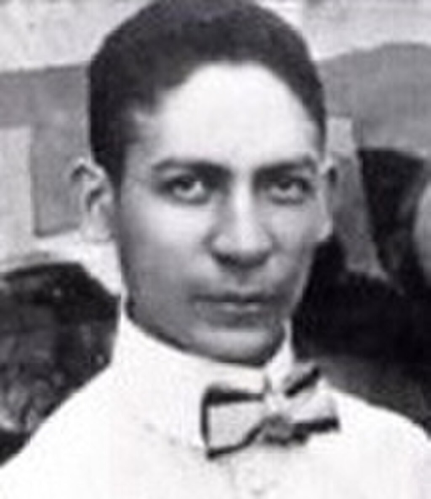[Jelly Roll Morton](https://en.wikipedia.org/wiki/Jelly_Roll_Morton "Jelly Roll Morton"), a [Louisiana Creole](https://en.wikipedia.org/wiki/Louisiana_Creole_people "Louisiana Creole people") jazz artist, c. 1917 or 1918

Cornetist Buddy Bolden played in New Orleans from 1895 to 1906. No recordings by him exist. His band is credited with creating the big four: the first syncopated bass drum pattern to deviate from the standard on-the-beat march. As the example below shows, the second half of the big four pattern is the habanera rhythm.

Afro-Creole pianist Jelly Roll Morton began his career in Storyville. Beginning in 1904, he toured with vaudeville shows to southern cities, Chicago, and New York City. In 1905, he composed "[Jelly Roll Blues](https://en.wikipedia.org/wiki/Jelly_Roll_Blues "Jelly Roll Blues")", which became the first jazz arrangement in print when it was published in 1915. It introduced more musicians to the New Orleans style.

Morton considered the tresillo/habanera, which he called the [Spanish tinge](https://en.wikipedia.org/wiki/Spanish_tinge "Spanish tinge"), an essential ingredient of jazz. "Now in one of my earliest tunes, 'New Orleans Blues,' you can notice the Spanish tinge. In fact, if you can't manage to put tinges of Spanish in your tunes, you will never be able to get the right seasoning, I call it, for jazz."

An excerpt of "New Orleans Blues" is shown below. In the excerpt, the left hand plays the tresillo rhythm, while the right hand plays variations on cinquillo.

Morton was a crucial innovator in the evolution from the early jazz form known as ragtime to [jazz piano](https://en.wikipedia.org/wiki/Jazz_piano "Jazz piano"), and could perform pieces in either style; in 1938, Morton made a series of recordings for the [Library of Congress](https://en.wikipedia.org/wiki/Library_of_Congress "Library of Congress") in which he demonstrated the difference between the two styles. Morton's solos, however, were still close to ragtime, and were not merely improvisations over chord changes as in later jazz, but his use of the blues was of equal importance.

#### Swing in the early 20th century

![\new RhythmicStaff {
\clef percussion
\time 4/4
\repeat volta 2 { c8[^\markup { \"Swung correlative\" } \tuplet 3/2 { c16 r c] }  c8[ \tuplet 3/2 { c16 r c] }  c8[ \tuplet 3/2 { c16 r c] }  c8[ \tuplet 3/2 { c16 r c] } }
}](../media/jazz/ajyovpjo.png)

Morton loosened ragtime's rigid rhythmic feeling, decreasing its embellishments and employing a [swing](https://en.wikipedia.org/wiki/Swing_\(jazz_performance_style\) "Swing (jazz performance style)") feeling. Swing is the most important and enduring African-based rhythmic technique used in jazz. An oft quoted definition of swing by Louis Armstrong is: "if you don't feel it, you'll never know it." _The New Harvard Dictionary of Music_ states that swing is: "An intangible rhythmic momentum in jazz...Swing defies analysis; claims to its presence may inspire arguments." The dictionary does nonetheless provide the useful description of triple subdivisions of the beat contrasted with duple subdivisions: swing superimposes six subdivisions of the beat over a basic pulse structure or four subdivisions. This aspect of swing is far more prevalent in African-American music than in Afro-Caribbean music. One aspect of swing, which is heard in more rhythmically complex Diaspora musics, places strokes in-between the triple and duple-pulse "grids".

New Orleans brass bands are a lasting influence, contributing horn players to the world of professional jazz with the distinct sound of the city whilst helping black children escape poverty. The leader of New Orleans's [Camelia Brass Band](https://en.wikipedia.org/wiki/Camelia_Brass_Band "Camelia Brass Band"), D'Jalma Ganier, taught Louis Armstrong to play trumpet; Armstrong would then popularize the New Orleans style of trumpet playing, and then expand it. Like Jelly Roll Morton, Armstrong is also credited with the abandonment of ragtime's stiffness in favor of swung notes. Armstrong, perhaps more than any other musician, codified the rhythmic technique of swing in jazz and broadened the jazz solo vocabulary.

The [Original Dixieland Jass Band](https://en.wikipedia.org/wiki/Original_Dixieland_Jass_Band "Original Dixieland Jass Band") made the music's first recordings early in 1917, and their "[Livery Stable Blues](https://en.wikipedia.org/wiki/Livery_Stable_Blues "Livery Stable Blues")" became the earliest released jazz record. That year, numerous other bands made recordings featuring "jazz" in the title or band name, but most were ragtime or novelty records rather than jazz. In February 1918 during World War I, James Reese Europe's ["Hellfighters" infantry](https://en.wikipedia.org/wiki/369th_Infantry_Regiment_\(United_States\) "369th Infantry Regiment (United States)") band took ragtime to Europe, then on their return recorded Dixieland standards including "[Darktown Strutters' Ball](https://en.wikipedia.org/wiki/Darktown_Strutters'_Ball "Darktown Strutters' Ball")".

## The Jazz Age

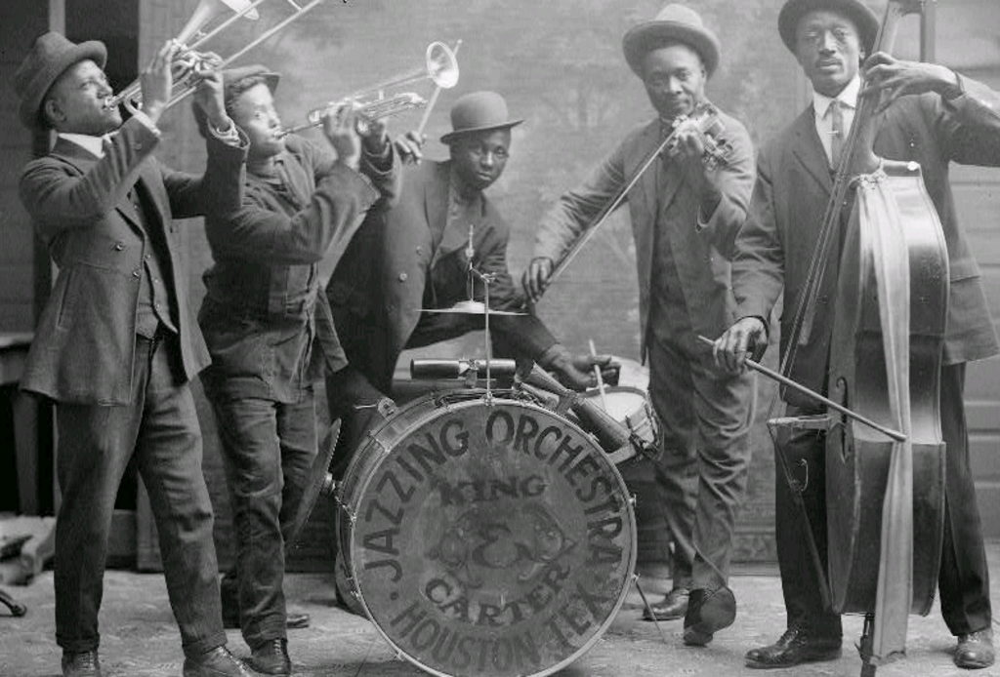The King & Carter Jazzing Orchestra photographed in Houston, Texas, January 1921

From 1920 to 1933, [Prohibition in the United States](https://en.wikipedia.org/wiki/Prohibition_in_the_United_States "Prohibition in the United States") banned the sale of alcoholic drinks, resulting in illicit speakeasies which became lively venues of the "Jazz Age", hosting popular music, dance songs, novelty songs, and show tunes. Jazz began to get a reputation as immoral, and many members of the older generations saw it as a threat to the old cultural values by promoting the decadent values of the Roaring 20s. [Henry van Dyke](https://en.wikipedia.org/wiki/Henry_van_Dyke "Henry van Dyke") of Princeton University wrote, "... it is not music at all. It's merely an irritation of the nerves of hearing, a sensual teasing of the strings of physical passion." _[The New York Times](https://en.wikipedia.org/wiki/The_New_York_Times "The New York Times")_ reported that Siberian villagers used jazz to scare away bears, but the villagers had used pots and pans; another story claimed that the fatal heart attack of a celebrated conductor was caused by jazz.

In 1919, [Kid Ory](https://en.wikipedia.org/wiki/Kid_Ory "Kid Ory")'s Original Creole Jazz Band of musicians from New Orleans began playing in San Francisco and Los Angeles, where in 1922 they became the first black jazz band of New Orleans origin to make recordings. During the same year, [Bessie Smith](https://en.wikipedia.org/wiki/Bessie_Smith "Bessie Smith") made her first recordings. Chicago was developing "[Hot Jazz](https://en.wikipedia.org/wiki/Hot_Jazz "Hot Jazz")", and [King Oliver](./Joe_"King"_Oliver "Joe \"King\" Oliver") joined [Bill Johnson](https://en.wikipedia.org/wiki/Bill_Johnson_\(double-bassist\) "Bill Johnson (double-bassist)"). Bix Beiderbecke formed The Wolverines in 1924.

Despite its Southern black origins, there was a larger market for jazzy dance music played by white orchestras. In 1918, [Paul Whiteman](https://en.wikipedia.org/wiki/Paul_Whiteman "Paul Whiteman") and his orchestra became a hit in San Francisco. He signed a contract with [Victor](https://en.wikipedia.org/wiki/Victor_Talking_Machine_Company "Victor Talking Machine Company") and became the top bandleader of the 1920s, giving hot jazz a white component, hiring white musicians such as [Bix Beiderbecke](https://en.wikipedia.org/wiki/Bix_Beiderbecke "Bix Beiderbecke"), [Jimmy Dorsey](https://en.wikipedia.org/wiki/Jimmy_Dorsey "Jimmy Dorsey"), [Tommy Dorsey](https://en.wikipedia.org/wiki/Tommy_Dorsey "Tommy Dorsey"), [Frankie Trumbauer](https://en.wikipedia.org/wiki/Frankie_Trumbauer "Frankie Trumbauer"), and [Joe Venuti](https://en.wikipedia.org/wiki/Joe_Venuti "Joe Venuti"). In 1924, Whiteman commissioned [George Gershwin](https://en.wikipedia.org/wiki/George_Gershwin "George Gershwin")'s _[Rhapsody in Blue](https://en.wikipedia.org/wiki/Rhapsody_in_Blue "Rhapsody in Blue")_, which was premiered by his orchestra. Jazz began to be recognized as a notable musical form. [Olin Downes](https://en.wikipedia.org/wiki/Olin_Downes "Olin Downes"), reviewing the concert in _The New York Times_, wrote, "This composition shows extraordinary talent, as it shows a young composer with aims that go far beyond those of his ilk, struggling with a form of which he is far from being master. ... In spite of all this, he has expressed himself in a significant and, on the whole, highly original form. ... His first theme ... is no mere dance-tune ... it is an idea, or several ideas, correlated and combined in varying and contrasting rhythms that immediately intrigue the listener."

After Whiteman's band successfully toured Europe, huge hot jazz orchestras in theater pits caught on with other whites, including [Fred Waring](https://en.wikipedia.org/wiki/Fred_Waring "Fred Waring"), [Jean Goldkette](https://en.wikipedia.org/wiki/Jean_Goldkette "Jean Goldkette"), and [Nathaniel Shilkret](https://en.wikipedia.org/wiki/Nathaniel_Shilkret "Nathaniel Shilkret"). According to Mario Dunkel, Whiteman's success was based on a "rhetoric of domestication" according to which he had elevated and rendered valuable (read "white") a previously inchoate (read "black") kind of music.

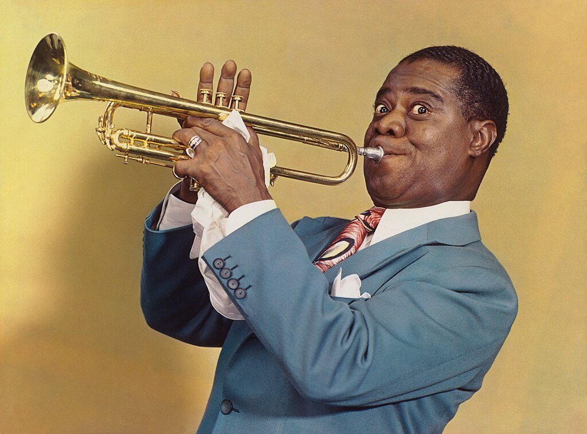[Louis Armstrong](https://en.wikipedia.org/wiki/Louis_Armstrong "Louis Armstrong") began his career in New Orleans and became one of jazz's most recognizable performers.

Whiteman's success caused black artists to follow suit, including [Earl Hines](https://en.wikipedia.org/wiki/Earl_Hines "Earl Hines") (who opened in The Grand Terrace Cafe in Chicago in 1928), Washington, D.C.-native [Duke Ellington](https://en.wikipedia.org/wiki/Duke_Ellington "Duke Ellington") (who opened at the [Cotton Club](https://en.wikipedia.org/wiki/Cotton_Club "Cotton Club") in Harlem in 1927), [Lionel Hampton](https://en.wikipedia.org/wiki/Lionel_Hampton "Lionel Hampton"), [Fletcher Henderson](https://en.wikipedia.org/wiki/Fletcher_Henderson "Fletcher Henderson"), [Claude Hopkins](https://en.wikipedia.org/wiki/Claude_Hopkins "Claude Hopkins"), and [Don Redman](https://en.wikipedia.org/wiki/Don_Redman "Don Redman"), with Henderson and Redman developing the "talking to one another" formula for "hot" swing music.

In 1924, Louis Armstrong joined the Fletcher Henderson dance band for a year, as featured soloist. By 1924, one of [Armstrong](https://en.wikipedia.org/wiki/Louis_Armstrong "Louis Armstrong")'s favorite "sweet jazz" [big bands](https://en.wikipedia.org/wiki/Big_bands "Big bands") was also formed in Canada by [Guy Lombardo](https://en.wikipedia.org/wiki/Guy_Lombardo "Guy Lombardo"). His Royal Canadians Orchestra specialized in performances of "the Sweetest music this side of Heaven" which transcended racial boundaries. The original New Orleans style was polyphonic, with theme variation and simultaneous collective improvisation. Armstrong was a master of his hometown style, but by the time he joined Henderson's band, he was already a trailblazer in a new phase of jazz, with its emphasis on arrangements and soloists. Armstrong's solos went well beyond the theme-improvisation concept and extemporized on chords, rather than melodies. According to Schuller, by comparison, the solos by Armstrong's bandmates (including a young [Coleman Hawkins](https://en.wikipedia.org/wiki/Coleman_Hawkins "Coleman Hawkins")), sounded "stiff, stodgy", with "jerky rhythms and a grey undistinguished tone quality". The following example shows a short excerpt of the straight melody of "Mandy, Make Up Your Mind" by [George W. Meyer](https://en.wikipedia.org/wiki/George_W._Meyer "George W. Meyer") and Arthur Johnston (top), compared with Armstrong's solo improvisations (below) (recorded 1924). Armstrong's solos were a significant factor in making jazz a true 20th-century language. After leaving Henderson's group, Armstrong formed his [Hot Five](https://en.wikipedia.org/wiki/Louis_Armstrong_and_his_Hot_Five "Louis Armstrong and his Hot Five") band, where he popularized [scat singing](https://en.wikipedia.org/wiki/Scat_singing "Scat singing").

### Swing in the 1920s and 1930s

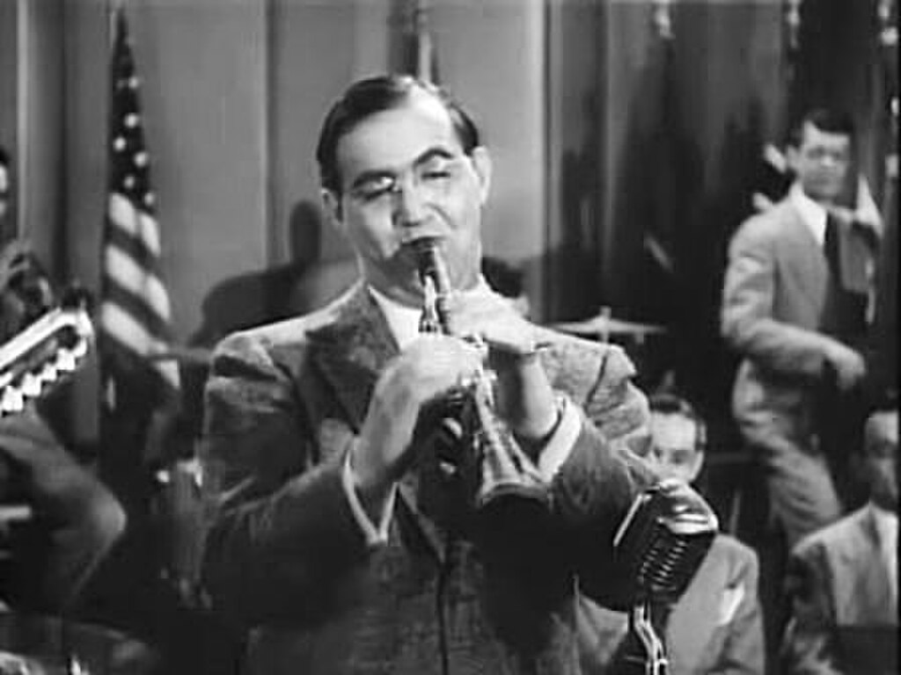[Benny Goodman](https://en.wikipedia.org/wiki/Benny_Goodman "Benny Goodman") (1943)

The 1930s belonged to popular [swing](https://en.wikipedia.org/wiki/Swing_\(music\) "Swing (music)") big bands, in which some virtuoso soloists became as famous as the band leaders. Key figures in developing the "big" jazz band included bandleaders and arrangers [Count Basie](https://en.wikipedia.org/wiki/Count_Basie "Count Basie"), [Cab Calloway](https://en.wikipedia.org/wiki/Cab_Calloway "Cab Calloway"), [Jimmy](https://en.wikipedia.org/wiki/Jimmy_Dorsey "Jimmy Dorsey") and [Tommy Dorsey](https://en.wikipedia.org/wiki/Tommy_Dorsey "Tommy Dorsey"), [Duke Ellington](https://en.wikipedia.org/wiki/Duke_Ellington "Duke Ellington"), [Benny Goodman](https://en.wikipedia.org/wiki/Benny_Goodman "Benny Goodman"), [Fletcher Henderson](https://en.wikipedia.org/wiki/Fletcher_Henderson "Fletcher Henderson"), [Earl Hines](https://en.wikipedia.org/wiki/Earl_Hines "Earl Hines"), [Harry James](https://en.wikipedia.org/wiki/Harry_James "Harry James"), [Jimmie Lunceford](https://en.wikipedia.org/wiki/Jimmie_Lunceford "Jimmie Lunceford"), [Glenn Miller](https://en.wikipedia.org/wiki/Glenn_Miller "Glenn Miller") and [Artie Shaw](https://en.wikipedia.org/wiki/Artie_Shaw "Artie Shaw"). Although it was a collective sound, swing also offered individual musicians a chance to "solo" and improvise melodic, thematic solos which could at times be complex "important" music.

Over time, social strictures regarding racial segregation began to relax in America: white bandleaders began to recruit black musicians and black bandleaders white ones. In the mid-1930s, Benny Goodman hired pianist [Teddy Wilson](https://en.wikipedia.org/wiki/Teddy_Wilson "Teddy Wilson"), vibraphonist [Lionel Hampton](https://en.wikipedia.org/wiki/Lionel_Hampton "Lionel Hampton") and guitarist [Charlie Christian](https://en.wikipedia.org/wiki/Charlie_Christian "Charlie Christian") to join small groups. In the 1930s, Kansas City Jazz as exemplified by tenor saxophonist [Lester Young](https://en.wikipedia.org/wiki/Lester_Young "Lester Young") marked the transition from big bands to the bebop influence of the 1940s. An early 1940s style known as "jumping the blues" or [jump blues](https://en.wikipedia.org/wiki/Jump_blues "Jump blues") used small combos, uptempo music and blues chord progressions, drawing on [boogie-woogie](https://en.wikipedia.org/wiki/Boogie_woogie_\(music\) "Boogie woogie (music)") from the 1930s.

### The influence of Duke Ellington

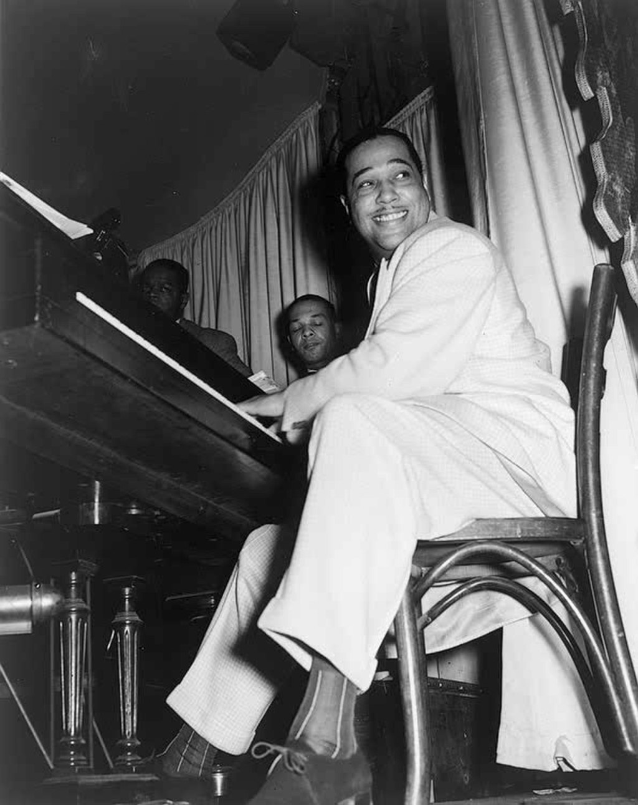Duke Ellington at the Hurricane Club (1943)

While swing was reaching the height of its popularity, [Duke Ellington](https://en.wikipedia.org/wiki/Duke_Ellington "Duke Ellington") spent the late 1920s and 1930s in Washington, D.C.'s jazz scene, developing an innovative musical idiom for his orchestra. Abandoning the conventions of swing, he experimented with orchestral sounds, harmony, and [musical form](https://en.wikipedia.org/wiki/Musical_form "Musical form") with complex compositions that still translated well for popular audiences; some of his tunes became [hits](https://en.wikipedia.org/wiki/Hit_single "Hit single"), and his own popularity spanned from the United States to Europe.

Ellington called his music _American Music_, rather than _jazz_, and liked to describe those who impressed him as "beyond category". These included many musicians from his orchestra, some of whom are considered among the best in jazz in their own right, but it was Ellington who melded them into one of the most popular jazz orchestras in the history of jazz. He often composed for the style and skills of these individuals, such as "Jeep's Blues" for [Johnny Hodges](https://en.wikipedia.org/wiki/Johnny_Hodges "Johnny Hodges"), "Concerto for Cootie" for [Cootie Williams](https://en.wikipedia.org/wiki/Cootie_Williams "Cootie Williams") (which later became "[Do Nothing Till You Hear from Me](https://en.wikipedia.org/wiki/Do_Nothing_Till_You_Hear_from_Me "Do Nothing Till You Hear from Me")" with [Bob Russell](https://en.wikipedia.org/wiki/Bob_Russell_\(songwriter\) "Bob Russell (songwriter)")'s lyrics), and "The Mooche" for [Tricky Sam Nanton](https://en.wikipedia.org/wiki/Tricky_Sam_Nanton "Tricky Sam Nanton") and [Bubber Miley](https://en.wikipedia.org/wiki/Bubber_Miley "Bubber Miley"). He also recorded compositions written by his bandsmen, such as [Juan Tizol](https://en.wikipedia.org/wiki/Juan_Tizol "Juan Tizol")'s "[Caravan](https://en.wikipedia.org/wiki/Caravan_\(1937_song\) "Caravan (1937 song)")" and "[Perdido](https://en.wikipedia.org/wiki/Perdido_\(song\) "Perdido (song)")", which brought the "Spanish Tinge" to big-band jazz. Several members of the orchestra remained with him for several decades. The band reached a creative peak in the early 1940s, when Ellington and a small hand-picked group of his composers and arrangers wrote for an orchestra of distinctive voices who displayed tremendous creativity.

### Beginnings of European jazz

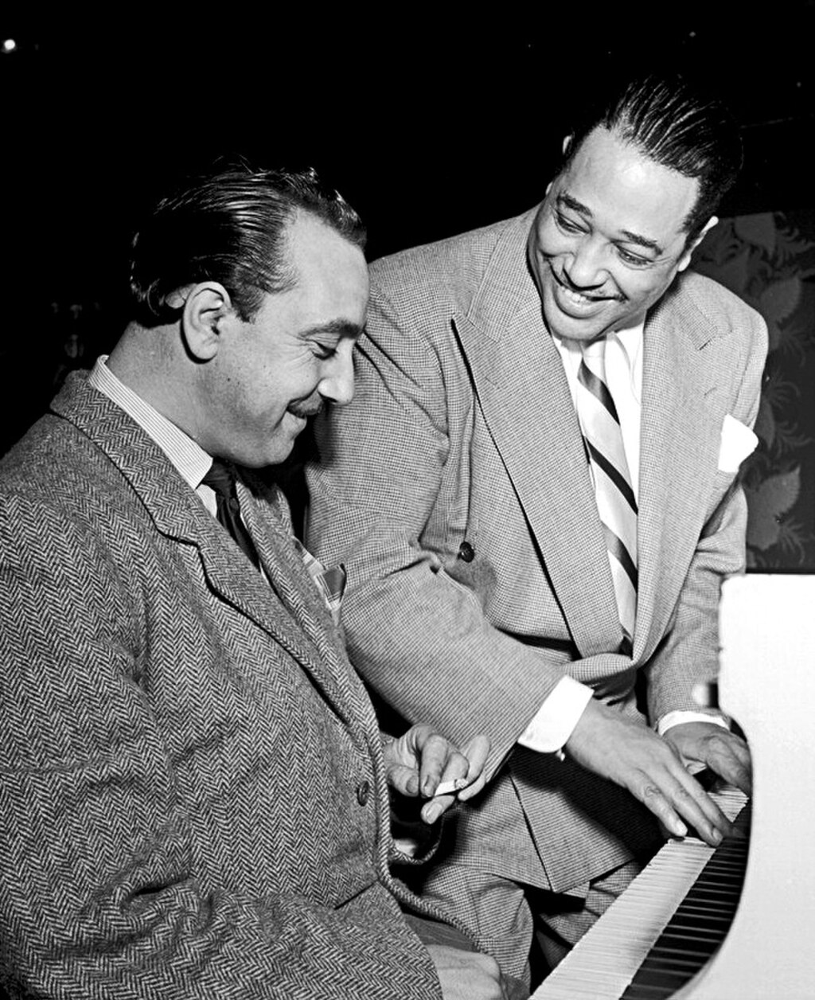[Django Reinhardt](https://en.wikipedia.org/wiki/Django_Reinhardt "Django Reinhardt") and [Duke Ellington](https://en.wikipedia.org/wiki/Duke_Ellington "Duke Ellington").

As only a limited number of American jazz records were released in Europe, European jazz traces many of its roots to American artists such as James Reese Europe, Paul Whiteman, and [Lonnie Johnson](https://en.wikipedia.org/wiki/Lonnie_Johnson_\(musician\) "Lonnie Johnson (musician)"), who visited Europe during and after World War I. It was their live performances which inspired European audiences' interest in jazz, as well as the interest in all things American (and therefore exotic) which accompanied the economic and political woes of Europe during this time. The beginnings of a distinct European style of jazz began to emerge in this interwar period.

British jazz began with a [tour by the Original Dixieland Jazz Band in 1919](https://en.wikipedia.org/wiki/Original_Dixieland_Jass_Band#London_tour "Original Dixieland Jass Band"). In 1926, [Fred Elizalde](https://en.wikipedia.org/wiki/Fred_Elizalde "Fred Elizalde") and His Cambridge Undergraduates began broadcasting on the BBC. Thereafter jazz became an important element in many leading dance orchestras, and jazz instrumentalists became numerous.

This style entered full swing in France with the [Quintette du Hot Club de France](https://en.wikipedia.org/wiki/Quintette_du_Hot_Club_de_France "Quintette du Hot Club de France"), which began in 1934. Much of this French jazz was a combination of African-American jazz and the symphonic styles in which French musicians were well-trained; in this, it is easy to see the inspiration taken from Paul Whiteman since his style was also a fusion of the two. Belgian guitarist [Django Reinhardt](https://en.wikipedia.org/wiki/Django_Reinhardt "Django Reinhardt") popularized [gypsy jazz](https://en.wikipedia.org/wiki/Gypsy_jazz "Gypsy jazz"), a mix of 1930s American swing, French dance hall "[musette](https://en.wikipedia.org/wiki/Bal-musette "Bal-musette")", and Eastern European folk with a languid, seductive feel; the main instruments were steel stringed guitar, violin, and double bass. Solos pass from one player to another as guitar and bass form the rhythm section. Some researchers believe [Eddie Lang](https://en.wikipedia.org/wiki/Eddie_Lang "Eddie Lang") and [Joe Venuti](https://en.wikipedia.org/wiki/Joe_Venuti "Joe Venuti") pioneered the guitar-violin partnership characteristic of the genre, which was brought to France after they had been heard live or on [Okeh Records](https://en.wikipedia.org/wiki/Okeh_Records "Okeh Records") in the late 1920s.

## Post-war jazz

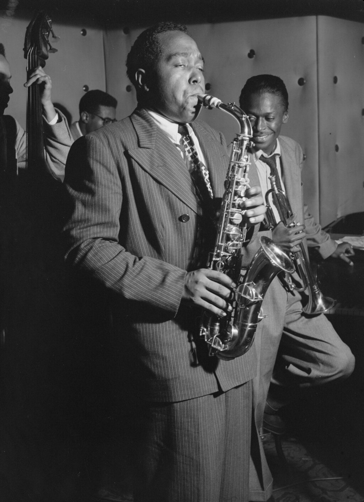The "classic quintet": [Charlie Parker](https://en.wikipedia.org/wiki/Charlie_Parker "Charlie Parker"), [Tommy Potter](https://en.wikipedia.org/wiki/Tommy_Potter "Tommy Potter"), [Miles Davis](/source/miles-davis/ "Miles Davis"), [Dizzy Gillespie](https://en.wikipedia.org/wiki/Dizzy_Gillespie "Dizzy Gillespie"), and [Max Roach](https://en.wikipedia.org/wiki/Max_Roach "Max Roach") performing at Three Deuces in [New York City](https://en.wikipedia.org/wiki/New_York_City "New York City"). Photograph by [William P. Gottlieb](https://en.wikipedia.org/wiki/William_P._Gottlieb "William P. Gottlieb") (August 1947), [Library of Congress](https://en.wikipedia.org/wiki/Library_of_Congress "Library of Congress").

The outbreak of [World War II](https://en.wikipedia.org/wiki/World_War_II "World War II") marked a turning point for jazz. The swing-era jazz of the previous decade had challenged other popular music as being representative of the nation's culture, with big bands reaching the height of the style's success by the early 1940s; swing acts and big bands traveled with U.S. military overseas to Europe, where it also became popular. Stateside, however, the war presented difficulties for the big-band format: conscription shortened the number of musicians available; the military's need for [shellac](https://en.wikipedia.org/wiki/Shellac "Shellac") (commonly used for pressing [gramophone records](https://en.wikipedia.org/wiki/Gramophone_records "Gramophone records")) limited record production; a shortage of rubber (also due to the war effort) discouraged bands from touring via road travel; and a demand by the musicians' union for a commercial recording ban limited music distribution between 1942 and 1944.

Many of the big bands who were deprived of experienced musicians because of the war effort began to enlist young players who were below the age for conscription, as was the case with saxophonist [Stan Getz](https://en.wikipedia.org/wiki/Stan_Getz "Stan Getz")'s entry in a band as a teenager. This coincided with a nationwide resurgence in the Dixieland style of pre-swing jazz; performers such as clarinetist [George Lewis](https://en.wikipedia.org/wiki/George_Lewis_\(clarinetist\) "George Lewis (clarinetist)"), cornetist [Bill Davison](https://en.wikipedia.org/wiki/Bill_Davison "Bill Davison"), and trombonist [Turk Murphy](https://en.wikipedia.org/wiki/Turk_Murphy "Turk Murphy") were hailed by conservative jazz critics as more authentic than the big bands. Elsewhere, with the limitations on recording, small groups of young musicians developed a more uptempo, improvisational style of jazz, collaborating and experimenting with new ideas for melodic development, rhythmic language, and [harmonic substitution](https://en.wikipedia.org/wiki/Harmonic_substitution "Harmonic substitution"), during informal, late-night jam sessions hosted in small clubs and apartments. Key figures in this development were largely based in New York and included pianists [Thelonious Monk](https://en.wikipedia.org/wiki/Thelonious_Monk "Thelonious Monk") and [Bud Powell](https://en.wikipedia.org/wiki/Bud_Powell "Bud Powell"), drummers [Max Roach](https://en.wikipedia.org/wiki/Max_Roach "Max Roach") and [Kenny Clarke](https://en.wikipedia.org/wiki/Kenny_Clarke "Kenny Clarke"), saxophonist [Charlie Parker](https://en.wikipedia.org/wiki/Charlie_Parker "Charlie Parker"), and trumpeter [Dizzy Gillespie](https://en.wikipedia.org/wiki/Dizzy_Gillespie "Dizzy Gillespie"). This musical development became known as [bebop](https://en.wikipedia.org/wiki/Bebop "Bebop").

Bebop and subsequent post-war jazz developments featured [a wider set of notes](https://en.wikipedia.org/wiki/Bebop_scale "Bebop scale"), played in more complex [patterns](https://en.wikipedia.org/wiki/Melodic_pattern "Melodic pattern") and at faster tempos than previous jazz. According to [Clive James](https://en.wikipedia.org/wiki/Clive_James "Clive James"), bebop was "the post-war musical development which tried to ensure that jazz would no longer be the spontaneous sound of joy ... Students of race relations in America are generally agreed that the exponents of post-war jazz were determined, with good reason, to present themselves as challenging artists rather than tame entertainers." The end of the war marked "a revival of the spirit of experimentation and musical pluralism under which it had been conceived", along with "the beginning of a decline in the popularity of jazz music in America", according to American academic Michael H. Burchett.

With the rise of bebop and the end of the swing era after the war, jazz lost its cachet as [pop music](https://en.wikipedia.org/wiki/Pop_music "Pop music"). Vocalists of the famous big bands moved on to being marketed and performing as solo pop singers; these included [Frank Sinatra](https://en.wikipedia.org/wiki/Frank_Sinatra "Frank Sinatra"), [Peggy Lee](https://en.wikipedia.org/wiki/Peggy_Lee "Peggy Lee"), [Dick Haymes](https://en.wikipedia.org/wiki/Dick_Haymes "Dick Haymes"), and [Doris Day](https://en.wikipedia.org/wiki/Doris_Day "Doris Day"). Older musicians who still performed their pre-war jazz, such as Armstrong and Ellington, were gradually viewed in the mainstream as passé. Other younger performers, such as singer [Big Joe Turner](https://en.wikipedia.org/wiki/Big_Joe_Turner "Big Joe Turner") and saxophonist [Louis Jordan](https://en.wikipedia.org/wiki/Louis_Jordan "Louis Jordan"), who were discouraged by bebop's increasing complexity, pursued more lucrative endeavors in rhythm and blues, [jump blues](https://en.wikipedia.org/wiki/Jump_blues "Jump blues"), and eventually [rock and roll](https://en.wikipedia.org/wiki/Rock_and_roll "Rock and roll"). Some, including Gillespie, composed intricate yet danceable pieces for bebop musicians in an effort to make them more accessible, but bebop largely remained on the fringes of American audiences' purview. "The new direction of postwar jazz drew a wealth of critical acclaim, but it steadily declined in popularity as it developed a reputation as an academic genre that was largely inaccessible to mainstream audiences", Burchett said. "The quest to make jazz more relevant to popular audiences, while retaining its artistic integrity, is a constant and prevalent theme in the history of postwar jazz." During its swing period, jazz had been an uncomplicated musical scene; according to [Paul Trynka](https://en.wikipedia.org/wiki/Paul_Trynka "Paul Trynka"), this changed in the post-war years:

> Suddenly jazz was no longer straightforward. There was bebop and its variants, there was the last gasp of swing, there were strange new brews like the [progressive jazz](https://en.wikipedia.org/wiki/Progressive_jazz "Progressive jazz") of [Stan Kenton](https://en.wikipedia.org/wiki/Stan_Kenton "Stan Kenton"), and there was a completely new phenomenon called revivalism – the rediscovery of jazz from the past, either on old records or performed live by aging players brought out of retirement. From now on it was no good saying that you liked jazz, you had to specify what kind of jazz. And that is the way it has been ever since, only more so. Today, the word 'jazz' is virtually meaningless without further definition.

### Bebop

In the early 1940s, bebop-style performers began to shift jazz from danceable popular music toward a more challenging "musician's music". The most influential bebop musicians included saxophonist Charlie Parker, pianists [Bud Powell](https://en.wikipedia.org/wiki/Bud_Powell "Bud Powell") and [Thelonious Monk](https://en.wikipedia.org/wiki/Thelonious_Monk "Thelonious Monk"), trumpeters Dizzy Gillespie and [Clifford Brown](https://en.wikipedia.org/wiki/Clifford_Brown "Clifford Brown"), and drummer [Max Roach](https://en.wikipedia.org/wiki/Max_Roach "Max Roach"). Divorcing itself from dance music, bebop established itself more as an art form, thus lessening its potential popular and commercial appeal.

Composer [Gunther Schuller](https://en.wikipedia.org/wiki/Gunther_Schuller "Gunther Schuller") wrote: "In 1943 I heard the great Earl Hines band which had Bird in it and all those other great musicians. They were playing all the flatted fifth chords and all the modern harmonies and substitutions and Dizzy Gillespie runs in the trumpet section work. Two years later I read that that was 'bop' and the beginning of modern jazz ... but the band never made recordings."

Dizzy Gillespie wrote: "People talk about the Hines band being 'the incubator of bop' and the leading exponents of that music ended up in the Hines band. But people also have the erroneous impression that the music was new. It was not. The music evolved from what went before. It was the same basic music. The difference was in how you got from here to here to here...naturally each age has got its own shit."

Since bebop was meant to be listened to, not danced to, it could use faster tempos. Drumming shifted to a more elusive and explosive style, in which the [ride cymbal](https://en.wikipedia.org/wiki/Ride_cymbal "Ride cymbal") was used to keep time while the snare and bass drum were used for accents. This led to a highly syncopated music with a linear rhythmic complexity.

Bebop musicians employed several harmonic devices which were not previously typical in jazz, engaging in a more abstracted form of chord-based improvisation. Bebop scales are traditional scales with an added chromatic passing note; bebop also uses "passing" chords, [substitute chords](https://en.wikipedia.org/wiki/Substitute_chord "Substitute chord"), and [altered chords](https://en.wikipedia.org/wiki/Altered_chord "Altered chord"). New forms of [chromaticism](https://en.wikipedia.org/wiki/Chromaticism "Chromaticism") and [dissonance](https://en.wikipedia.org/wiki/Consonance_and_dissonance "Consonance and dissonance") were introduced into jazz, and the dissonant [tritone](https://en.wikipedia.org/wiki/Tritone "Tritone") (or "flatted fifth") interval became the "most important interval of bebop" Chord progressions for bebop tunes were often taken directly from popular swing-era tunes and reused with a new and more complex melody or reharmonized with more complex chord progressions to form new compositions, a practice which was already well-established in earlier jazz, but came to be central to the bebop style. Bebop made use of several relatively common chord progressions, such as blues (at base, I–IV–V, but often infused with ii–V motion) and "[rhythm changes](https://en.wikipedia.org/wiki/Rhythm_changes "Rhythm changes")" (I-vi-ii-V) – the chords to the 1930s pop standard "[I Got Rhythm](https://en.wikipedia.org/wiki/I_Got_Rhythm "I Got Rhythm")". Late bop also moved towards extended forms that represented a departure from pop and show tunes.

The harmonic development in bebop is often traced back to a moment experienced by Charlie Parker while performing "Cherokee" at [Clark Monroe's Uptown House](https://en.wikipedia.org/wiki/Clark_Monroe's_Uptown_House "Clark Monroe's Uptown House"), New York, in early 1942. "I'd been getting bored with the stereotyped changes that were being used...and I kept thinking there's bound to be something else. I could hear it sometimes. I couldn't play it...I was working over 'Cherokee,' and, as I did, I found that by using the higher intervals of a chord as a melody line and backing them with appropriately related changes, I could play the thing I'd been hearing. It came alive." [Gerhard Kubik](https://en.wikipedia.org/wiki/Gerhard_Kubik "Gerhard Kubik") postulates that harmonic development in bebop sprang from blues and [African-related tonal sensibilities](https://en.wikipedia.org/wiki/Traditional_sub-Saharan_African_harmony "Traditional sub-Saharan African harmony") rather than 20th-century Western classical music. "Auditory inclinations were the African legacy in \[Parker's\] life, reconfirmed by the experience of the blues tonal system, a sound world at odds with the Western diatonic chord categories. Bebop musicians eliminated Western-style functional harmony in their music while retaining the strong central tonality of the blues as a basis for drawing upon various African matrices."

Samuel Floyd states that blues was both the bedrock and propelling force of bebop, bringing about a new harmonic conception using extended chord structures that led to unprecedented harmonic and melodic variety, a developed and even more highly syncopated, linear rhythmic complexity and a melodic angularity in which the blue note of the fifth degree was established as an important melodic-harmonic device; and reestablishment of the blues as the primary organizing and functional principle. Kubik wrote:

> While for an outside observer, the harmonic innovations in bebop would appear to be inspired by experiences in Western "serious" music, from [Claude Debussy](/source/claude-debussy/ "Claude Debussy") to [Arnold Schoenberg](https://en.wikipedia.org/wiki/Arnold_Schoenberg "Arnold Schoenberg"), such a scheme cannot be sustained by the evidence from a cognitive approach. Claude Debussy did have some influence on jazz, for example, on Bix Beiderbecke's piano playing. And it is also true that Duke Ellington adopted and reinterpreted some harmonic devices in European contemporary music. West Coast jazz would run into such debts as would several forms of cool jazz, but bebop has hardly any such debts in the sense of direct borrowings. On the contrary, ideologically, bebop was a strong statement of rejection of any kind of eclecticism, propelled by a desire to activate something deeply buried in self. Bebop then revived tonal-harmonic ideas transmitted through the blues and reconstructed and expanded others in a basically non-Western harmonic approach. The ultimate significance of all this is that the experiments in jazz during the 1940s brought back to [African-American music](https://en.wikipedia.org/wiki/African-American_music "African-American music") several structural principles and techniques rooted in African traditions.

These divergences from the jazz mainstream of the time met a divided, sometimes hostile response among fans and musicians, especially swing players who bristled at the new harmonic sounds. To hostile critics, bebop seemed filled with "racing, nervous phrases". But despite the friction, by the 1950s bebop had become an accepted part of the jazz vocabulary.

### Afro-Cuban jazz (cu-bop)

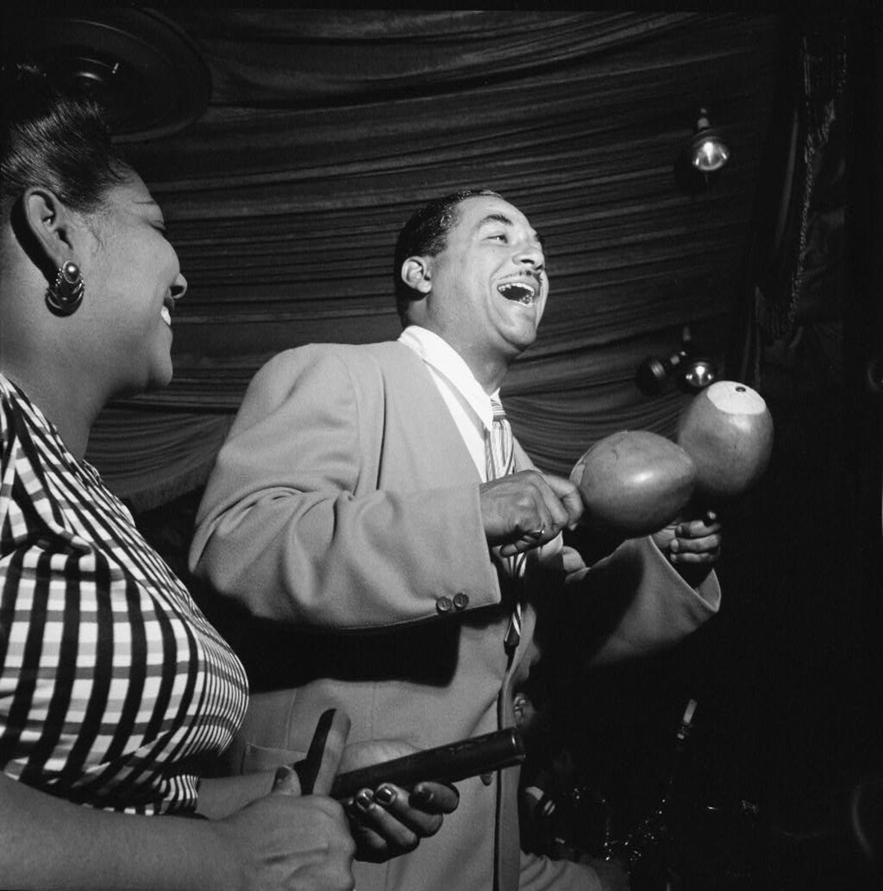Machito (maracas) and his sister Graciella Grillo (claves)

#### Machito and Mario Bauza

The general consensus among musicians and musicologists is that the first original jazz piece to be overtly based in clave was "Tanga" (1943), composed by Cuban-born [Mario Bauza](https://en.wikipedia.org/wiki/Mario_Bauza "Mario Bauza") and recorded by [Machito](https://en.wikipedia.org/wiki/Machito "Machito") and his Afro-Cubans in New York City. "Tanga" began as a spontaneous [descarga](https://en.wikipedia.org/wiki/Descarga "Descarga") (Cuban jam session), with jazz solos superimposed on top.

This was the birth of [Afro-Cuban jazz](https://en.wikipedia.org/wiki/Afro-Cuban_jazz "Afro-Cuban jazz"). The use of clave brought the African _timeline_, or _[key pattern](https://en.wikipedia.org/wiki/Bell_pattern "Bell pattern")_, into jazz. Music organized around key patterns convey a two-celled (binary) structure, which is a complex level of African [cross-rhythm](https://en.wikipedia.org/wiki/Cross_beat "Cross beat"). Within the context of jazz, however, harmony is the primary referent, not rhythm. The harmonic progression can begin on either side of clave, and the harmonic "one" is always understood to be "one". If the progression begins on the "three-side" of clave, it is said to be in _3–2 clave_ (shown below). If the progression begins on the "two-side", it is in _2–3 clave_.

![\new RhythmicStaff {
\clef percussion
\time 4/4
\repeat volta 2 { c8. c16 r8[ c] r[ c] c4 }
}](../media/jazz/jskj952g.png)

#### Dizzy Gillespie and Chano Pozo

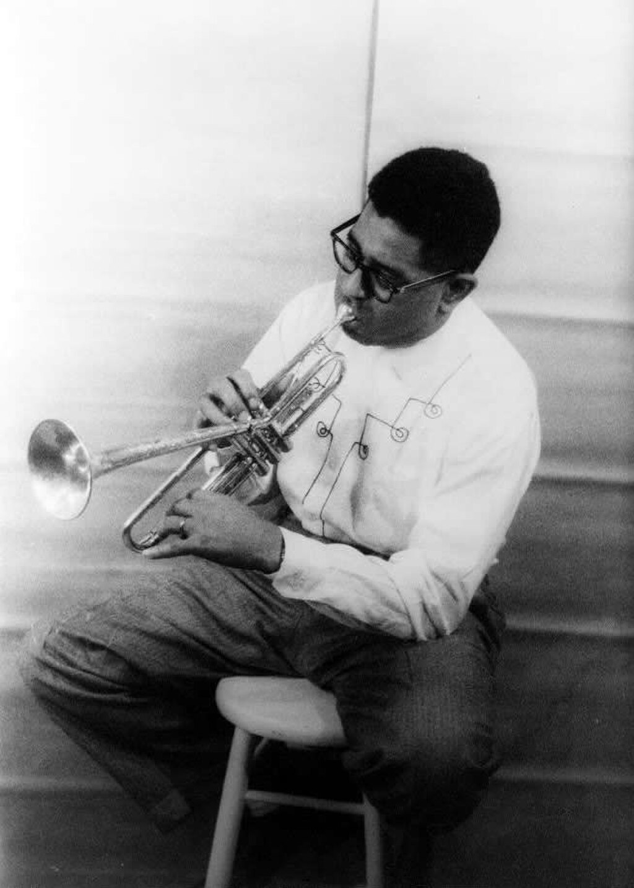Dizzy Gillespie, 1955

[Mario Bauzá](https://en.wikipedia.org/wiki/Mario_Bauzá "Mario Bauzá") introduced bebop innovator Dizzy Gillespie to Cuban conga drummer and composer [Chano Pozo](https://en.wikipedia.org/wiki/Chano_Pozo "Chano Pozo"). Gillespie and Pozo's brief collaboration produced some of the most enduring Afro-Cuban jazz standards. "[Manteca](https://en.wikipedia.org/wiki/Manteca_\(song\) "Manteca (song)")" (1947) is the first jazz standard to be rhythmically based on clave. According to Gillespie, Pozo composed the layered, contrapuntal [guajeos](https://en.wikipedia.org/wiki/Guajeo "Guajeo") (Afro-Cuban [ostinatos](https://en.wikipedia.org/wiki/Ostinato "Ostinato")) of the A section and the introduction, while Gillespie wrote the bridge. Gillespie recounted: "If I'd let it go like \[Chano\] wanted it, it would have been strictly Afro-Cuban all the way. There wouldn't have been a bridge. I thought I was writing an eight-bar bridge, but ... I had to keep going and ended up writing a sixteen-bar bridge." The bridge gave "Manteca" a typical jazz harmonic structure, setting the piece apart from Bauza's modal "Tanga" of a few years earlier.

Gillespie's collaboration with Pozo brought specific African-based rhythms into bebop. While pushing the boundaries of harmonic improvisation, _cu-bop_ also drew from African rhythm. Jazz arrangements with a Latin A section and a swung B section, with all choruses swung during solos, became common practice with many Latin tunes of the jazz standard repertoire. This approach can be heard on pre-1980 recordings of "Manteca", "[A Night in Tunisia](https://en.wikipedia.org/wiki/A_Night_in_Tunisia "A Night in Tunisia")", "Tin Tin Deo", and "[On Green Dolphin Street](https://en.wikipedia.org/wiki/On_Green_Dolphin_Street_\(song\) "On Green Dolphin Street (song)")".

#### "Un Poco Loco"

Another jazz composition critical to the development of Afro-Cuban jazz was Bud Powell's "[Un Poco Loco](https://en.wikipedia.org/wiki/Un_Poco_Loco "Un Poco Loco")," recorded with [Curley Russell](https://en.wikipedia.org/wiki/Curley_Russell "Curley Russell") on bass and Max Roach on drums. Noted for its "frenetic energy" and "clanging cowbell and polyrhythmic accompaniment," the composition combined Afro-Cuban rhythm with polytonality and preceded further use of modality and avant-garde harmony in Latin jazz.

#### African cross-rhythm

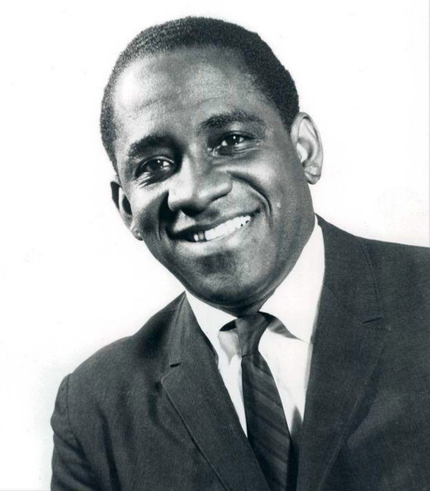Mongo Santamaria (1969)

Cuban percussionist [Mongo Santamaria](https://en.wikipedia.org/wiki/Mongo_Santamaria "Mongo Santamaria") first recorded his composition "[Afro Blue](https://en.wikipedia.org/wiki/Afro_Blue "Afro Blue")" in 1959. "Afro Blue" was the first jazz standard built upon a typical African three-against-two (3:2) [cross-rhythm](https://en.wikipedia.org/wiki/Cross-rhythm "Cross-rhythm"), or [hemiola](https://en.wikipedia.org/wiki/Hemiola "Hemiola"). The piece begins with the bass repeatedly playing 6 cross-beats per each measure of **12**
**8**, or 6 cross-beats per 4 main beats—6:4 (two cells of 3:2).

The following example shows the original [ostinato](https://en.wikipedia.org/wiki/Ostinato "Ostinato") "Afro Blue" bass line. The cross noteheads indicate the main [beats](https://en.wikipedia.org/wiki/Beat_music "Beat music") (not bass notes).

When [John Coltrane](/source/john-coltrane/ "John Coltrane") covered "Afro Blue" in 1963, he inverted the metric hierarchy, interpreting the tune as a **3**
**4** jazz waltz with duple cross-beats superimposed (2:3). Originally a B♭ [pentatonic](https://en.wikipedia.org/wiki/Pentatonic_scale "Pentatonic scale") blues, Coltrane expanded the harmonic structure of "Afro Blue".

Perhaps the most respected [Afro-cuban jazz](https://en.wikipedia.org/wiki/Afro-cuban_jazz "Afro-cuban jazz") combo of the late 1950s was vibraphonist [Cal Tjader](https://en.wikipedia.org/wiki/Cal_Tjader "Cal Tjader")'s band. Tjader had [Mongo Santamaria](https://en.wikipedia.org/wiki/Mongo_Santamaria "Mongo Santamaria"), [Armando Peraza](https://en.wikipedia.org/wiki/Armando_Peraza "Armando Peraza"), and [Willie Bobo](https://en.wikipedia.org/wiki/Willie_Bobo "Willie Bobo") on his early recording dates.

### Dixieland revival

In the late 1940s, there was a revival of [Dixieland](https://en.wikipedia.org/wiki/Dixieland "Dixieland"), harking back to the contrapuntal New Orleans style. This was driven in large part by record company reissues of jazz classics by the Oliver, Morton, and Armstrong bands of the 1930s. There were two types of musicians involved in the revival: the first group was made up of those who had begun their careers playing in the traditional style and were returning to it (or continuing what they had been playing all along), such as [Bob Crosby](https://en.wikipedia.org/wiki/Bob_Crosby "Bob Crosby")'s Bobcats, [Max Kaminsky](https://en.wikipedia.org/wiki/Max_Kaminsky_\(musician\) "Max Kaminsky (musician)"), [Eddie Condon](https://en.wikipedia.org/wiki/Eddie_Condon "Eddie Condon"), and [Wild Bill Davison](https://en.wikipedia.org/wiki/Wild_Bill_Davison "Wild Bill Davison"). Most of these players were originally Midwesterners, although there were a small number of New Orleans musicians involved. The second group of revivalists consisted of younger musicians, such as those in the [Lu Watters](https://en.wikipedia.org/wiki/Lu_Watters "Lu Watters") band, [Conrad Janis](https://en.wikipedia.org/wiki/Conrad_Janis "Conrad Janis"), and [Ward Kimball](https://en.wikipedia.org/wiki/Ward_Kimball "Ward Kimball") and his [Firehouse Five Plus Two](https://en.wikipedia.org/wiki/Firehouse_Five_Plus_Two "Firehouse Five Plus Two") Jazz Band. By the late 1940s, Louis Armstrong's Allstars band became a leading ensemble. Through the 1950s and 1960s, Dixieland was one of the most commercially popular jazz styles in the US, Europe, and Japan, although critics paid little attention to it.

### Hard bop

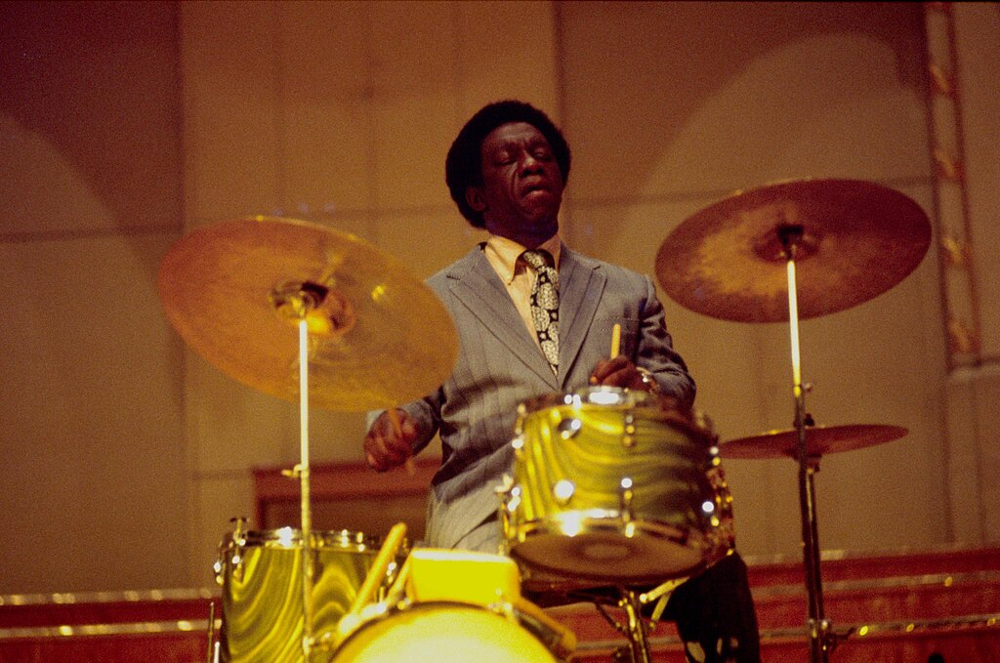[Art Blakey](https://en.wikipedia.org/wiki/Art_Blakey "Art Blakey") in 1973

Hard bop is an extension of bebop (or "bop") music that incorporates influences from blues, rhythm and blues, and gospel, especially in saxophone and piano playing. Hard bop was developed in the mid-1950s, coalescing in 1953 and 1954; it developed partly in response to the vogue for cool jazz in the early 1950s and paralleled the rise of rhythm and blues. It has been described as "funky" and can be considered a relative of [soul jazz](https://en.wikipedia.org/wiki/Soul_jazz "Soul jazz"). Some elements of the genre were simplified from their bebop roots.

Miles Davis's 1954 performance of "Walkin'" at the first [Newport Jazz Festival](https://en.wikipedia.org/wiki/Newport_Jazz_Festival "Newport Jazz Festival") introduced the style to the jazz world. Further leaders of hard bop's development included the [Clifford Brown](https://en.wikipedia.org/wiki/Clifford_Brown "Clifford Brown")/Max Roach Quintet, Art Blakey's [Jazz Messengers](https://en.wikipedia.org/wiki/The_Jazz_Messengers "The Jazz Messengers"), the Horace Silver Quintet, and trumpeters [Lee Morgan](https://en.wikipedia.org/wiki/Lee_Morgan "Lee Morgan") and [Freddie Hubbard](https://en.wikipedia.org/wiki/Freddie_Hubbard "Freddie Hubbard"). The late 1950s to early 1960s saw hard boppers form their own bands as a new generation of blues- and bebop-influenced musicians entered the jazz world, from pianists [Wynton Kelly](https://en.wikipedia.org/wiki/Wynton_Kelly "Wynton Kelly") and [Tommy Flanagan](https://en.wikipedia.org/wiki/Tommy_Flanagan_\(musician\) "Tommy Flanagan (musician)") to saxophonists [Joe Henderson](https://en.wikipedia.org/wiki/Joe_Henderson "Joe Henderson") and [Hank Mobley](https://en.wikipedia.org/wiki/Hank_Mobley "Hank Mobley"). Coltrane, [Johnny Griffin](https://en.wikipedia.org/wiki/Johnny_Griffin "Johnny Griffin"), Mobley, and Morgan all participated on the album _[A Blowin' Session](https://en.wikipedia.org/wiki/A_Blowin'_Session "A Blowin' Session")_ (1957), considered by Al Campbell to have been one of the high points of the hard bop era.

Hard bop was prevalent within jazz for about a decade spanning from 1955 to 1965, but has remained highly influential on mainstream or "straight-ahead" jazz. It went into decline in the late 1960s through the 1970s due to the emergence of other styles such as jazz fusion, but again became influential following the Young Lions Movement and the emergence of [neo-bop](https://en.wikipedia.org/wiki/Neo-bop "Neo-bop").

### Modal jazz

Modal jazz is a development which began in the later 1950s which takes the [mode](https://en.wikipedia.org/wiki/Musical_mode "Musical mode"), or musical scale, as the basis of musical structure and improvisation. Previously, a solo was meant to fit into a given [chord progression](https://en.wikipedia.org/wiki/Chord_progression "Chord progression"), but with modal jazz, the soloist creates a melody using one (or a small number of) modes. The emphasis is thus shifted from harmony to melody: "Historically, this caused a seismic shift among jazz musicians, away from thinking vertically (the chord), and towards a more horizontal approach (the scale)", explained pianist [Mark Levine](https://en.wikipedia.org/wiki/Mark_Levine_\(musician\) "Mark Levine (musician)").

The modal theory stems from a work by [George Russell](https://en.wikipedia.org/wiki/George_Russell_\(composer\) "George Russell (composer)"). Miles Davis introduced the concept to the greater jazz world with _[Kind of Blue](https://en.wikipedia.org/wiki/Kind_of_Blue "Kind of Blue")_ (1959), an exploration of the possibilities of modal jazz which would become the best selling jazz album of all time. In contrast to Davis's earlier work with hard bop and its complex chord progression and improvisation, _Kind of Blue_ was composed as a series of modal sketches in which the musicians were given scales that defined the parameters of their improvisation and style.

"I didn't write out the music for _Kind of Blue_, but brought in sketches for what everybody was supposed to play because I wanted a lot of spontaneity," recalled Davis. The track "So What" has only two chords: [D-7](https://en.wikipedia.org/wiki/Dominant_seventh_chord "Dominant seventh chord") and E♭-7.

Other innovators in this style include [Jackie McLean](https://en.wikipedia.org/wiki/Jackie_McLean "Jackie McLean"), and two of the musicians who had also played on _Kind of Blue_: John Coltrane and Bill Evans.

### Free jazz

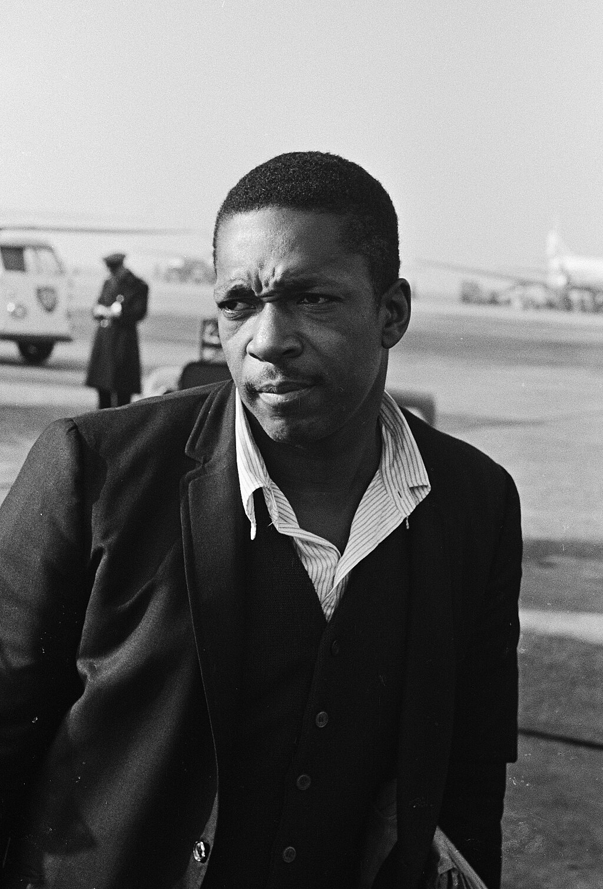John Coltrane, 1963

Free jazz, and the related form of [avant-garde jazz](https://en.wikipedia.org/wiki/Avant-garde_jazz "Avant-garde jazz"), broke through into an open space of "free tonality" in which meter, beat, and formal symmetry all disappeared, and a range of [world music](https://en.wikipedia.org/wiki/World_music "World music") from India, Africa, and Arabia were melded into an intense, even religiously ecstatic or orgiastic style of playing. While loosely inspired by bebop, free jazz tunes gave players much more latitude; the loose harmony and tempo was deemed controversial when this approach was first developed. The bassist [Charles Mingus](https://en.wikipedia.org/wiki/Charles_Mingus "Charles Mingus") is also frequently associated with the avant-garde in jazz, although his compositions draw from myriad styles and genres.

The first major stirrings came in the 1950s with the early work of [Ornette Coleman](https://en.wikipedia.org/wiki/Ornette_Coleman "Ornette Coleman") (whose 1960 album _[Free Jazz: A Collective Improvisation](https://en.wikipedia.org/wiki/Free_Jazz:_A_Collective_Improvisation "Free Jazz: A Collective Improvisation")_ coined the term) and [Cecil Taylor](https://en.wikipedia.org/wiki/Cecil_Taylor "Cecil Taylor"). In the 1960s, exponents included [Albert Ayler](https://en.wikipedia.org/wiki/Albert_Ayler "Albert Ayler"), [Gato Barbieri](https://en.wikipedia.org/wiki/Gato_Barbieri "Gato Barbieri"), [Carla Bley](https://en.wikipedia.org/wiki/Carla_Bley "Carla Bley"), [Don Cherry](https://en.wikipedia.org/wiki/Don_Cherry_\(trumpeter\) "Don Cherry (trumpeter)"), [Larry Coryell](https://en.wikipedia.org/wiki/Larry_Coryell "Larry Coryell"), [John Coltrane](/source/john-coltrane/ "John Coltrane"), [Bill Dixon](https://en.wikipedia.org/wiki/Bill_Dixon "Bill Dixon"), [Jimmy Giuffre](https://en.wikipedia.org/wiki/Jimmy_Giuffre "Jimmy Giuffre"), [Steve Lacy](https://en.wikipedia.org/wiki/Steve_Lacy_\(saxophonist\) "Steve Lacy (saxophonist)"), [Michael Mantler](https://en.wikipedia.org/wiki/Michael_Mantler "Michael Mantler"), [Sun Ra](https://en.wikipedia.org/wiki/Sun_Ra "Sun Ra"), [Roswell Rudd](https://en.wikipedia.org/wiki/Roswell_Rudd "Roswell Rudd"), [Pharoah Sanders](https://en.wikipedia.org/wiki/Pharoah_Sanders "Pharoah Sanders"), and [John Tchicai](https://en.wikipedia.org/wiki/John_Tchicai "John Tchicai"). In developing his late style, Coltrane was especially influenced by the dissonance of Ayler's trio with bassist [Gary Peacock](https://en.wikipedia.org/wiki/Gary_Peacock "Gary Peacock") and drummer [Sunny Murray](https://en.wikipedia.org/wiki/Sunny_Murray "Sunny Murray"), a rhythm section honed with [Cecil Taylor](https://en.wikipedia.org/wiki/Cecil_Taylor "Cecil Taylor") as leader. In November 1961, Coltrane played a gig at the Village Vanguard, which resulted in the classic _Chasin' the 'Trane_, which _DownBeat_ magazine panned as "anti-jazz". On his 1961 tour of France, he was booed, but persevered, signing with the new [Impulse! Records](https://en.wikipedia.org/wiki/Impulse!_Records "Impulse! Records") in 1960 and turning it into "the house that Trane built", while championing many younger free jazz musicians, notably [Archie Shepp](https://en.wikipedia.org/wiki/Archie_Shepp "Archie Shepp"), who often played with trumpeter [Bill Dixon](https://en.wikipedia.org/wiki/Bill_Dixon "Bill Dixon"), who organized the 4-day "[October Revolution in Jazz](https://en.wikipedia.org/wiki/October_Revolution_in_Jazz "October Revolution in Jazz")" in Manhattan in 1964, the first free jazz festival.

A series of recordings with the Classic Quartet in the first half of 1965 show Coltrane's playing becoming increasingly abstract, with greater incorporation of devices like [multiphonics](https://en.wikipedia.org/wiki/Multiphonics "Multiphonics"), utilization of overtones, and playing in the [altissimo](https://en.wikipedia.org/wiki/Altissimo "Altissimo") register, as well as a mutated return to Coltrane's [sheets of sound](https://en.wikipedia.org/wiki/Sheets_of_sound "Sheets of sound"). In the studio, he all but abandoned his soprano to concentrate on the tenor saxophone. In addition, the quartet responded to the leader by playing with increasing freedom. The group's evolution can be traced through the recordings _[The John Coltrane Quartet Plays](https://en.wikipedia.org/wiki/The_John_Coltrane_Quartet_Plays "The John Coltrane Quartet Plays")_, _[Living Space](https://en.wikipedia.org/wiki/Living_Space_\(album\) "Living Space (album)")_ and _[Transition](https://en.wikipedia.org/wiki/Transition_\(John_Coltrane_album\) "Transition (John Coltrane album)")_ (both June 1965), _[New Thing at Newport](https://en.wikipedia.org/wiki/New_Thing_at_Newport "New Thing at Newport")_ (July 1965), _[Sun Ship](https://en.wikipedia.org/wiki/Sun_Ship "Sun Ship")_ (August 1965), and _[First Meditations](https://en.wikipedia.org/wiki/First_Meditations "First Meditations")_ (September 1965).

In June 1965, Coltrane and 10 other musicians recorded _[Ascension](https://en.wikipedia.org/wiki/Ascension_\(John_Coltrane_album\) "Ascension (John Coltrane album)")_, a 40-minute-long piece without breaks that included adventurous solos by young avant-garde musicians as well as Coltrane, and was controversial primarily for the collective improvisation sections that separated the solos. [Dave Liebman](https://en.wikipedia.org/wiki/Dave_Liebman "Dave Liebman") later called it "the torch that lit the free jazz thing". After recording with the quartet over the next few months, Coltrane invited Pharoah Sanders to join the band in September 1965. While Coltrane used over-blowing frequently as an emotional exclamation-point, Sanders would opt to overblow his entire solo, resulting in a constant screaming and screeching in the altissimo range of the instrument.

#### Free jazz in Europe

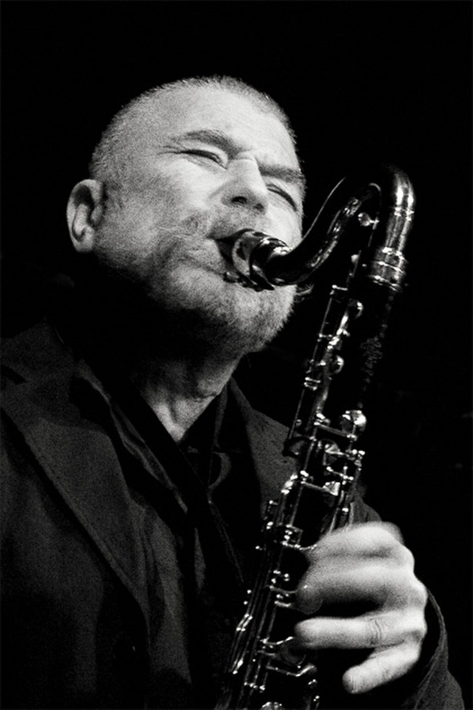[Peter Brötzmann](https://en.wikipedia.org/wiki/Peter_Brötzmann "Peter Brötzmann") is a key figure in European free jazz.

Free jazz was played in Europe in part because musicians such as Ayler, Taylor, [Steve Lacy](https://en.wikipedia.org/wiki/Steve_Lacy_\(saxophonist\) "Steve Lacy (saxophonist)"), and [Eric Dolphy](https://en.wikipedia.org/wiki/Eric_Dolphy "Eric Dolphy") spent extended periods of time there, and European musicians such as [Michael Mantler](https://en.wikipedia.org/wiki/Michael_Mantler "Michael Mantler") and [John Tchicai](https://en.wikipedia.org/wiki/John_Tchicai "John Tchicai") traveled to the U.S. to experience American music firsthand. European contemporary jazz was shaped by [Peter Brötzmann](https://en.wikipedia.org/wiki/Peter_Brötzmann "Peter Brötzmann"), [John Surman](https://en.wikipedia.org/wiki/John_Surman "John Surman"), [Krzysztof Komeda](https://en.wikipedia.org/wiki/Krzysztof_Komeda "Krzysztof Komeda"), [Zbigniew Namysłowski](https://en.wikipedia.org/wiki/Zbigniew_Namysłowski "Zbigniew Namysłowski"), [Tomasz Stańko](https://en.wikipedia.org/wiki/Tomasz_Stańko "Tomasz Stańko"), [Lars Gullin](https://en.wikipedia.org/wiki/Lars_Gullin "Lars Gullin"), [Joe Harriott](https://en.wikipedia.org/wiki/Joe_Harriott "Joe Harriott"), [Albert Mangelsdorff](https://en.wikipedia.org/wiki/Albert_Mangelsdorff "Albert Mangelsdorff"), [Kenny Wheeler](https://en.wikipedia.org/wiki/Kenny_Wheeler "Kenny Wheeler"), [Graham Collier](https://en.wikipedia.org/wiki/Graham_Collier "Graham Collier"), [Michael Garrick](https://en.wikipedia.org/wiki/Michael_Garrick "Michael Garrick") and [Mike Westbrook](https://en.wikipedia.org/wiki/Mike_Westbrook "Mike Westbrook"). They were eager to develop approaches to music that reflected their heritage.

Since the 1960s, creative centers of jazz in Europe have developed, such as the creative jazz scene in Amsterdam. Following the work of drummer [Han Bennink](https://en.wikipedia.org/wiki/Han_Bennink "Han Bennink") and pianist [Misha Mengelberg](https://en.wikipedia.org/wiki/Misha_Mengelberg "Misha Mengelberg"), musicians started to explore by improvising collectively until a form (melody, rhythm, a famous song) is found Jazz critic [Kevin Whitehead](https://en.wikipedia.org/wiki/Kevin_Whitehead "Kevin Whitehead") documented the free jazz scene in Amsterdam and some of its main exponents such as the ICP (Instant Composers Pool) orchestra in his book _New Dutch Swing_. Since the 1990s Keith Jarrett has defended free jazz from criticism. British writer [Stuart Nicholson](https://en.wikipedia.org/wiki/Stuart_Nicholson_\(jazz_historian\) "Stuart Nicholson (jazz historian)") has argued European contemporary jazz has an identity different from American jazz and follows a different trajectory.

### Latin jazz

Latin jazz is jazz that employs Latin American rhythms and is generally understood to have a more specific meaning than simply jazz from Latin America. A more precise term might be _Afro-Latin jazz_, as the jazz subgenre typically employs rhythms that either have a direct analog in Africa or exhibit an African rhythmic influence beyond what is ordinarily heard in other jazz. The two main categories of Latin jazz are [Afro-Cuban jazz](https://en.wikipedia.org/wiki/Afro-Cuban_jazz "Afro-Cuban jazz") and Brazilian jazz.

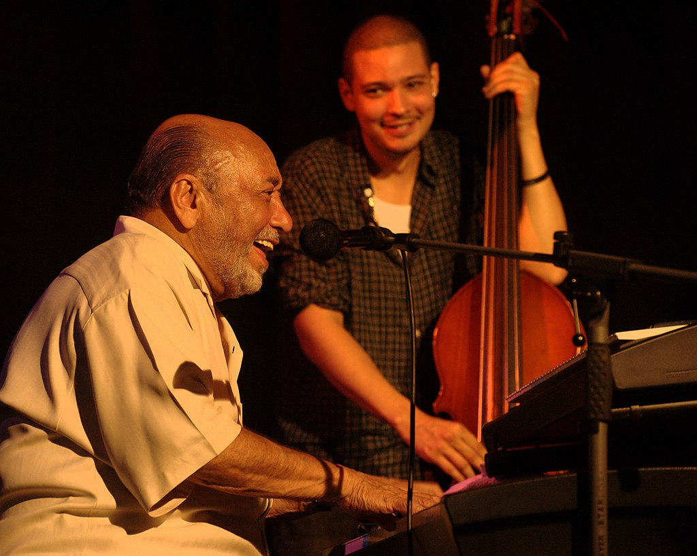[Eddie Palmieri](https://en.wikipedia.org/wiki/Eddie_Palmieri "Eddie Palmieri").

In the 1960s and 1970s, many jazz musicians had only a basic understanding of Cuban and Brazilian music, and jazz compositions which used Cuban or Brazilian elements were often referred to as "Latin tunes", with no distinction between a Cuban [son montuno](https://en.wikipedia.org/wiki/Son_montuno "Son montuno") and a Brazilian [bossa nova](https://en.wikipedia.org/wiki/Bossa_nova "Bossa nova"). Even as late as 2000, in Mark Gridley's _Jazz Styles: History and Analysis_, a bossa nova bass line is referred to as a "Latin bass figure". It was not uncommon during the 1960s and 1970s to hear a conga playing a Cuban [tumbao](https://en.wikipedia.org/wiki/Tumbao "Tumbao") while the drumset and bass played a Brazilian bossa nova pattern. Many jazz standards such as "Manteca", "On Green Dolphin Street" and "Song for My Father" have a "Latin" A section and a swung B section. Typically, the band would only play an even-eighth "Latin" feel in the A section of the head and swing throughout all of the solos. Latin jazz specialists like [Cal Tjader](https://en.wikipedia.org/wiki/Cal_Tjader "Cal Tjader") tended to be the exception. For example, on a 1959 live Tjader recording of "A Night in Tunisia", pianist [Vince Guaraldi](https://en.wikipedia.org/wiki/Vince_Guaraldi "Vince Guaraldi") soloed through the entire form over an authentic [mambo](https://en.wikipedia.org/wiki/Mambo_\(music\) "Mambo (music)").

#### Afro-Cuban jazz renaissance

For most of its history, Afro-Cuban jazz had been a matter of superimposing jazz phrasing over Cuban rhythms. But by the end of the 1970s, a new generation of New York City musicians had emerged who were fluent in both [salsa](https://en.wikipedia.org/wiki/Salsa_\(music\) "Salsa (music)") dance music and jazz, leading to a new level of integration of jazz and Cuban rhythms. This era of creativity and vitality is best represented by the Gonzalez brothers Jerry (congas and trumpet) and Andy (bass). During 1974–1976, they were members of one of [Eddie Palmieri](https://en.wikipedia.org/wiki/Eddie_Palmieri "Eddie Palmieri")'s most experimental salsa groups: salsa was the medium, but Palmieri was stretching the form in new ways. He incorporated parallel fourths, with McCoy Tyner-type vamps. The innovations of Palmieri, the Gonzalez brothers and others led to an Afro-Cuban jazz renaissance in New York City.

This occurred in parallel with developments in Cuba The first Cuban band of this new wave was [Irakere](https://en.wikipedia.org/wiki/Irakere "Irakere"). Their "Chékere-son" (1976) introduced a style of "Cubanized" bebop-flavored horn lines that departed from the more angular guajeo-based lines which were typical of Cuban popular music and Latin jazz up until that time. It was based on Charlie Parker's composition "Billie's Bounce", jumbled together in a way that fused clave and bebop horn lines. In spite of the ambivalence of some band members towards Irakere's Afro-Cuban folkloric / jazz fusion, their experiments forever changed Cuban jazz: their innovations are still heard in the high level of harmonic and rhythmic complexity in Cuban jazz and in the jazzy and complex contemporary form of popular dance music known as [timba](https://en.wikipedia.org/wiki/Timba "Timba").

#### Afro-Brazilian jazz

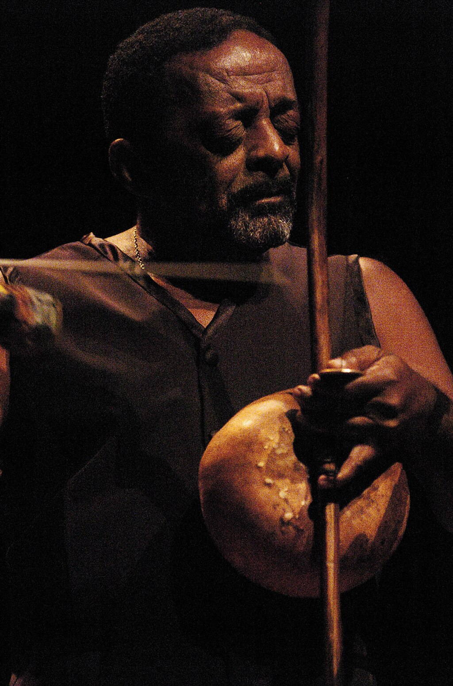[Naná Vasconcelos](https://en.wikipedia.org/wiki/Naná_Vasconcelos "Naná Vasconcelos") playing the Afro-Brazilian [Berimbau](https://en.wikipedia.org/wiki/Berimbau "Berimbau")

Brazilian jazz, such as [bossa nova](https://en.wikipedia.org/wiki/Bossa_nova "Bossa nova"), is derived from [samba](https://en.wikipedia.org/wiki/Samba "Samba"), with influences from jazz and other 20th-century classical and popular music styles. Bossa is generally moderately paced, with melodies sung in Portuguese or English, whilst the related jazz-samba is an adaptation of street samba into jazz.

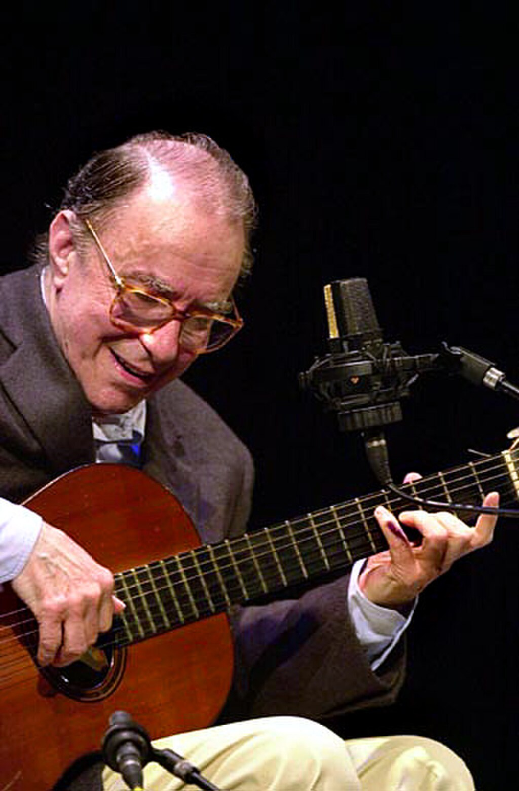[João Gilberto](https://en.wikipedia.org/wiki/João_Gilberto "João Gilberto").

The bossa nova style was pioneered by Brazilians [João Gilberto](https://en.wikipedia.org/wiki/João_Gilberto "João Gilberto") and [Antônio Carlos Jobim](https://en.wikipedia.org/wiki/Antônio_Carlos_Jobim "Antônio Carlos Jobim") and was made popular by [Elizete Cardoso](https://en.wikipedia.org/wiki/Elizete_Cardoso "Elizete Cardoso")'s recording of "[Chega de Saudade](https://en.wikipedia.org/wiki/Chega_de_Saudade "Chega de Saudade")" on the _[Canção do Amor Demais](https://en.wikipedia.org/wiki/Canção_do_Amor_Demais "Canção do Amor Demais")_ LP. Gilberto's initial releases, and the 1959 film _[Black Orpheus](https://en.wikipedia.org/wiki/Black_Orpheus "Black Orpheus")_, achieved significant popularity in [Latin America](https://en.wikipedia.org/wiki/Latin_America "Latin America"); this spread to North America via visiting American jazz musicians. The resulting recordings by [Charlie Byrd](https://en.wikipedia.org/wiki/Charlie_Byrd "Charlie Byrd") and Stan Getz cemented bossa nova's popularity and led to a worldwide boom, with 1963's _[Getz/Gilberto](https://en.wikipedia.org/wiki/Getz/Gilberto "Getz/Gilberto")_, numerous recordings by famous jazz performers such as [Ella Fitzgerald](https://en.wikipedia.org/wiki/Ella_Fitzgerald "Ella Fitzgerald") and [Frank Sinatra](https://en.wikipedia.org/wiki/Frank_Sinatra "Frank Sinatra"), and the eventual entrenchment of the bossa nova style as a lasting influence in world music.

Brazilian percussionists such as [Airto Moreira](https://en.wikipedia.org/wiki/Airto_Moreira "Airto Moreira") and [Naná Vasconcelos](https://en.wikipedia.org/wiki/Naná_Vasconcelos "Naná Vasconcelos") also influenced jazz internationally by introducing Afro-Brazilian folkloric instruments and rhythms into a wide variety of jazz styles, thus attracting a greater audience to them.

While bossa nova has been labeled as jazz by music critics, namely those from outside of Brazil, it has been rejected by many prominent bossa nova musicians such as Jobim, who once said "Bossa nova is not Brazilian jazz."

### African-inspired

#### Rhythm

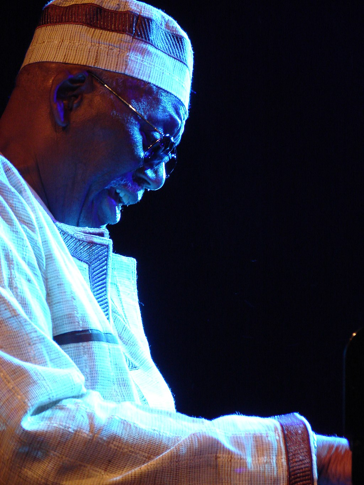Randy Weston

The first [jazz standard](https://en.wikipedia.org/wiki/Jazz_standard "Jazz standard") composed by a non-Latino to use an overt African **12**
**8** cross-rhythm was [Wayne Shorter](https://en.wikipedia.org/wiki/Wayne_Shorter "Wayne Shorter")'s "[Footprints](https://en.wikipedia.org/wiki/Footprints_\(composition\) "Footprints (composition)")" (1967). On the version recorded on _Miles Smiles_ by [Miles Davis](/source/miles-davis/ "Miles Davis"), the bass switches to a **4**
**4** [tresillo](https://en.wikipedia.org/wiki/Tresillo_\(rhythm\) "Tresillo (rhythm)") figure at 2:20. "Footprints" is not, however, a [Latin jazz](https://en.wikipedia.org/wiki/Latin_jazz "Latin jazz") tune: African rhythmic structures are accessed directly by [Ron Carter](https://en.wikipedia.org/wiki/Ron_Carter "Ron Carter") (bass) and [Tony Williams](https://en.wikipedia.org/wiki/Tony_Williams_\(drummer\) "Tony Williams (drummer)") (drums) via the rhythmic sensibilities of [swing](https://en.wikipedia.org/wiki/Swing_\(jazz_performance_style\) "Swing (jazz performance style)"). Throughout the piece, the four beats, whether sounded or not, are maintained as the temporal referent. The following example shows the **12**
**8** and **4**
**4** forms of the bass line. The slashed noteheads indicate the main [beats](https://en.wikipedia.org/wiki/Beat_music "Beat music") (not bass notes), where one ordinarily taps their foot to "keep time".

![{
\relative c, <<
\new Staff <<
\new voice {
\clef bass \time 12/8 \key c \minor
\set Score.tempoHideNote = ##t \tempo 4 = 100
\stemDown \override NoteHead.style = #'cross \repeat volta 2 { es4. es es es }
}
\new voice {
\set Score.tempoHideNote = ##t \tempo 4 = 100
\time 12/8
\stemUp \repeat volta 2 { c'4 g'8~ g c4 es4.~ es4 g,8 } \bar \":|.\"
} >>
\new Staff <<
\new voice {
\clef bass \time 12/8 \key c \minor
\set Staff.timeSignatureFraction = 4/4
\scaleDurations 3/2 {
\set Score.tempoHideNote = ##t \tempo 8 = 100
\stemDown \override NoteHead.style = #'cross \repeat volta 2 { es,4 es es es }
}
}
\new voice \relative c' {
\time 12/8
\set Staff.timeSignatureFraction = 4/4
\scaleDurations 3/2 {
\set Score.tempoHideNote = ##t \tempo 4 = 100
\stemUp \repeat volta 2 { c,8. g'16~ g8 c es4~ es8. g,16 } \bar \":|.\"
}
} >>
>> }](../media/jazz/d1kaqrg1.png)

#### Pentatonic scales

The use of [pentatonic scales](https://en.wikipedia.org/wiki/Pentatonic_scale "Pentatonic scale") was another trend associated with Africa. The use of pentatonic scales in Africa probably goes back thousands of years.

[McCoy Tyner](https://en.wikipedia.org/wiki/McCoy_Tyner "McCoy Tyner") perfected the use of the pentatonic scale in his solos, and also used parallel fifths and fourths, which are common harmonies in West Africa.

The minor pentatonic scale is often used in blues improvisation, and like a blues scale, a minor pentatonic scale can be played over all of the chords in a blues. The following pentatonic lick was played over blues changes by [Joe Henderson](https://en.wikipedia.org/wiki/Joe_Henderson "Joe Henderson") on [Horace Silver](https://en.wikipedia.org/wiki/Horace_Silver "Horace Silver")'s "African Queen" (1965).

Jazz pianist, theorist, and educator [Mark Levine](https://en.wikipedia.org/wiki/Mark_Levine_\(musician\) "Mark Levine (musician)") refers to the scale generated by beginning on the fifth step of a pentatonic scale as the _V pentatonic scale_.

C pentatonic scale beginning on the I (C pentatonic), IV (F pentatonic), and V (G pentatonic) steps of the scale.

Levine points out that the V pentatonic scale works for all three chords of the standard II–V–I jazz progression. This is a very common progression, used in pieces such as Miles Davis's "Tune Up". The following example shows the V pentatonic scale over a II–V–I progression.

V pentatonic scale over II–V–I chord progression

Accordingly, John Coltrane's "[Giant Steps](https://en.wikipedia.org/wiki/Giant_Steps "Giant Steps")" (1960), with its 26 chords per 16 bars, can be played using only three pentatonic scales. Coltrane studied [Nicolas Slonimsky](https://en.wikipedia.org/wiki/Nicolas_Slonimsky "Nicolas Slonimsky")'s _Thesaurus of Scales and Melodic Patterns_, which contains material that is virtually identical to portions of "Giant Steps". The harmonic complexity of "Giant Steps" is on the level of the most advanced 20th-century art music. Superimposing the pentatonic scale over "Giant Steps" is not merely a matter of harmonic simplification, but also a sort of "Africanizing" of the piece, which provides an alternate approach for soloing. Mark Levine observes that when mixed in with more conventional "playing the changes", pentatonic scales provide "structure and a feeling of increased space".

### Sacred and liturgical jazz

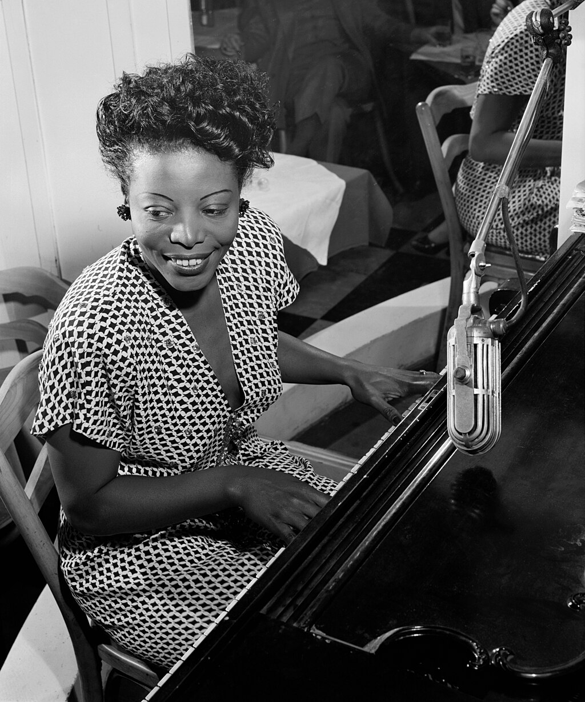[Mary Lou Williams](https://en.wikipedia.org/wiki/Mary_Lou_Williams "Mary Lou Williams").

As noted above, jazz has incorporated from its inception aspects of African-American sacred music including spirituals and hymns. Secular jazz musicians often performed renditions of spirituals and hymns as part of their repertoire or isolated compositions such as "Come Sunday", part of "Black and Beige Suite" by [Duke Ellington](https://en.wikipedia.org/wiki/Duke_Ellington "Duke Ellington"). Later many other jazz artists borrowed from black [gospel music](https://en.wikipedia.org/wiki/Gospel_music "Gospel music"). However, it was only after World War II that a few jazz musicians began to compose and perform extended works intended for religious settings or as religious expression. Since the 1950s, sacred and liturgical music has been performed and recorded by many prominent jazz composers and musicians. The "Abyssinian Mass" by [Wynton Marsalis](https://en.wikipedia.org/wiki/Wynton_Marsalis "Wynton Marsalis") (Blueengine Records, 2016) is a recent example.

Relatively little has been written about sacred and liturgical jazz. In a 2013 doctoral dissertation, Angelo Versace examined the development of sacred jazz in the 1950s using disciplines of musicology and history. He noted that the traditions of black gospel music and jazz were combined in the 1950s to produce a new genre, "sacred jazz". Versace maintained that the religious intent separates sacred from secular jazz. Most prominent in initiating the sacred jazz movement were pianist and composer [Mary Lou Williams](https://en.wikipedia.org/wiki/Mary_Lou_Williams "Mary Lou Williams"), known for her jazz masses in the 1950s and [Duke Ellington](https://en.wikipedia.org/wiki/Duke_Ellington "Duke Ellington"). Prior to his death in 1974 in response to contacts from Grace Cathedral in San Francisco, [Duke Ellington](https://en.wikipedia.org/wiki/Duke_Ellington "Duke Ellington") wrote three Sacred Concerts: 1965 – A Concert of Sacred Music; 1968 – Second Sacred Concert; 1973 – Third Sacred Concert.

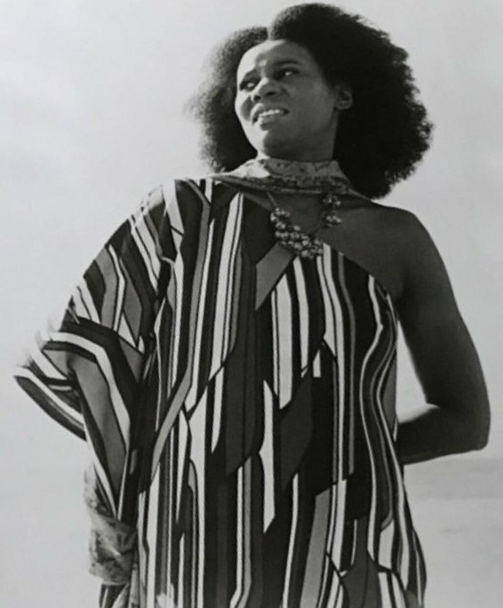[Alice Coltrane](https://en.wikipedia.org/wiki/Alice_Coltrane "Alice Coltrane").

The most prominent form of sacred and liturgical jazz is the jazz mass. Although most often performed in a concert setting rather than church worship setting, this form has many examples. An eminent example of composers of the jazz mass was [Mary Lou Williams](https://en.wikipedia.org/wiki/Mary_Lou_Williams "Mary Lou Williams"). Williams converted to Catholicism in 1957, and proceeded to compose three masses in the jazz idiom. One was composed in 1968 to honor the [recently assassinated Martin Luther King Jr.](https://en.wikipedia.org/wiki/Assassination_of_Martin_Luther_King_Jr. "Assassination of Martin Luther King Jr.") and the third was commissioned by a pontifical commission. It was performed once in 1975 in St Patrick's Cathedral in New York City. However the [Catholic Church](https://en.wikipedia.org/wiki/Catholic_Church "Catholic Church") has not embraced jazz as appropriate for worship. In 1966 Joe Masters recorded "Jazz Mass" for Columbia Records. A jazz ensemble was joined by soloists and choir using the English text of the Roman Catholic Mass. Other examples include "Jazz Mass in Concert" by [Lalo Schiffrin](https://en.wikipedia.org/wiki/Lalo_Schiffrin "Lalo Schiffrin") (Aleph Records, 1998, UPC 0651702632725) and "Jazz Mass" by [Vince Guaraldi](https://en.wikipedia.org/wiki/Vince_Guaraldi "Vince Guaraldi") (Fantasy Records, 1965). In England, classical composer [Will Todd](https://en.wikipedia.org/wiki/Will_Todd "Will Todd") recorded his "Jazz Missa Brevis" with a jazz ensemble, soloists and the St Martin's Voices on a 2018 Signum Records release, "Passion Music/Jazz Missa Brevis" also released as "Mass in Blue", and jazz organist James Taylor composed "The Rochester Mass" (Cherry Red Records, 2015). In 2013, Versace put forth bassist [Ike Sturm](https://en.wikipedia.org/wiki/Ike_Sturm "Ike Sturm") and New York composer Deanna Witkowski as contemporary exemplars of sacred and liturgical jazz.

### Jazz fusion

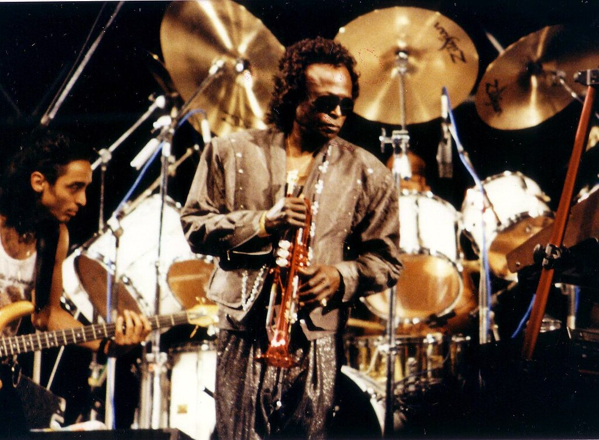Fusion trumpeter [Miles Davis](/source/miles-davis/ "Miles Davis") in 1989

In the late 1960s and early 1970s, the hybrid form of jazz-rock [fusion](https://en.wikipedia.org/wiki/Jazz_fusion "Jazz fusion") was developed by combining jazz improvisation with rock rhythms, electric instruments and the highly amplified stage sound of rock musicians such as [Jimi Hendrix](https://en.wikipedia.org/wiki/Jimi_Hendrix "Jimi Hendrix") and [Frank Zappa](https://en.wikipedia.org/wiki/Frank_Zappa "Frank Zappa"). Jazz fusion often uses mixed meters, odd time signatures, syncopation, complex chords, and harmonies.

According to [AllMusic](https://en.wikipedia.org/wiki/AllMusic "AllMusic"):

> ... until around 1967, the worlds of jazz and rock were nearly completely separate. \[However, ...\] as rock became more creative and its musicianship improved, and as some in the jazz world became bored with [hard bop](https://en.wikipedia.org/wiki/Hard_bop "Hard bop") and did not want to play strictly [avant-garde music](https://en.wikipedia.org/wiki/Free_jazz "Free jazz"), the two different idioms began to trade ideas and occasionally combine forces.

#### Miles Davis's new directions

In 1969, Davis fully embraced the electric instrument approach to jazz with _[In a Silent Way](https://en.wikipedia.org/wiki/In_a_Silent_Way "In a Silent Way")_, which can be considered his first fusion album. Composed of two side-long suites edited heavily by producer [Teo Macero](https://en.wikipedia.org/wiki/Teo_Macero "Teo Macero"), this quiet, static album would be equally influential to the development of [ambient music](https://en.wikipedia.org/wiki/Ambient_music "Ambient music").

As Davis recalls:

> The music I was really listening to in 1968 was [James Brown](https://en.wikipedia.org/wiki/James_Brown "James Brown"), the great guitar player [Jimi Hendrix](https://en.wikipedia.org/wiki/Jimi_Hendrix "Jimi Hendrix"), and a new group who had just come out with a hit record, "[Dance to the Music](https://en.wikipedia.org/wiki/Dance_to_the_Music_\(Sly_and_the_Family_Stone_album\) "Dance to the Music (Sly and the Family Stone album)")", [Sly and the Family Stone](https://en.wikipedia.org/wiki/Sly_and_the_Family_Stone "Sly and the Family Stone") ... I wanted to make it more like rock. When we recorded _In a Silent Way_ I just threw out all the chord sheets and told everyone to play off of that.

Two contributors to _In a Silent Way_ also joined organist [Larry Young](https://en.wikipedia.org/wiki/Larry_Young_\(musician\) "Larry Young (musician)") to create one of the early acclaimed fusion albums: [_Emergency!_](https://en.wikipedia.org/wiki/Emergency!_\(album\) "Emergency! (album)") (1969) by [The Tony Williams Lifetime](https://en.wikipedia.org/wiki/The_Tony_Williams_Lifetime "The Tony Williams Lifetime").

#### Psychedelic-jazz

##### Weather Report

[Weather Report](https://en.wikipedia.org/wiki/Weather_Report "Weather Report")'s self-titled electronic and psychedelic _[Weather Report](https://en.wikipedia.org/wiki/Weather_Report_\(1971_album\) "Weather Report (1971 album)")_ debut album caused a sensation in the jazz world on its arrival in 1971, thanks to the pedigree of the group's members (including percussionist [Airto Moreira](https://en.wikipedia.org/wiki/Airto_Moreira "Airto Moreira")), and their unorthodox approach to music. The album featured a softer sound than would be the case in later years (predominantly using acoustic bass with Shorter exclusively playing [soprano saxophone](https://en.wikipedia.org/wiki/Soprano_saxophone "Soprano saxophone"), and with no [synthesizers](https://en.wikipedia.org/wiki/Synthesizer "Synthesizer") involved), but is still considered a classic of early fusion. It built on the avant-garde experiments which [Joe Zawinul](https://en.wikipedia.org/wiki/Joe_Zawinul "Joe Zawinul") and Shorter had pioneered with Miles Davis on _[Bitches Brew](https://en.wikipedia.org/wiki/Bitches_Brew "Bitches Brew")_, including an avoidance of head-and-chorus composition in favor of continuous rhythm and movement – but took the music further. To emphasize the group's rejection of standard methodology, the album opened with the inscrutable avant-garde atmospheric piece "Milky Way", which featured by Shorter's extremely muted saxophone inducing vibrations in Zawinul's piano strings while the latter pedaled the instrument. _[DownBeat](https://en.wikipedia.org/wiki/DownBeat "DownBeat")_ described the album as "music beyond category", and awarded it Album of the Year in the magazine's polls that year.

Weather Report's subsequent releases were creative funk-jazz works.

#### Jazz-rock

Although some jazz purists protested against the blend of jazz and rock, many jazz innovators crossed over from the contemporary hard bop scene into fusion. As well as the electric instruments of rock (such as electric guitar, electric bass, electric piano and synthesizer keyboards), fusion also used the powerful amplification, ["fuzz" pedals](https://en.wikipedia.org/wiki/Distortion_\(music\) "Distortion (music)"), [wah-wah pedals](https://en.wikipedia.org/wiki/Wah-wah_pedal "Wah-wah pedal") and other effects that were used by 1970s-era rock bands. Notable performers of jazz fusion included Miles Davis, [Eddie Harris](https://en.wikipedia.org/wiki/Eddie_Harris "Eddie Harris"), keyboardists [Joe Zawinul](https://en.wikipedia.org/wiki/Joe_Zawinul "Joe Zawinul"), [Chick Corea](https://en.wikipedia.org/wiki/Chick_Corea "Chick Corea"), and Herbie Hancock, vibraphonist [Gary Burton](https://en.wikipedia.org/wiki/Gary_Burton "Gary Burton"), drummer [Tony Williams](https://en.wikipedia.org/wiki/Tony_Williams_\(drummer\) "Tony Williams (drummer)"), violinist [Jean-Luc Ponty](https://en.wikipedia.org/wiki/Jean-Luc_Ponty "Jean-Luc Ponty"), guitarists [Larry Coryell](https://en.wikipedia.org/wiki/Larry_Coryell "Larry Coryell"), [Al Di Meola](https://en.wikipedia.org/wiki/Al_Di_Meola "Al Di Meola"), [John McLaughlin](https://en.wikipedia.org/wiki/John_McLaughlin_\(musician\) "John McLaughlin (musician)"), [Ryo Kawasaki](https://en.wikipedia.org/wiki/Ryo_Kawasaki "Ryo Kawasaki"), and [Frank Zappa](https://en.wikipedia.org/wiki/Frank_Zappa "Frank Zappa"), saxophonist Wayne Shorter and bassists [Jaco Pastorius](https://en.wikipedia.org/wiki/Jaco_Pastorius "Jaco Pastorius") and [Stanley Clarke](https://en.wikipedia.org/wiki/Stanley_Clarke "Stanley Clarke"). Jazz fusion was also popular in Japan, where the band [Casiopea](https://en.wikipedia.org/wiki/Casiopea "Casiopea") released more than thirty fusion albums.

According to jazz writer Stuart Nicholson, "just as free jazz appeared on the verge of creating a whole new musical language in the 1960s ... jazz-rock briefly suggested the promise of doing the same" with albums such as Williams's _[Emergency!](https://en.wikipedia.org/wiki/Emergency!_\(album\) "Emergency! (album)")_ (1970) and Davis's _[Agharta](https://en.wikipedia.org/wiki/Agharta_\(album\) "Agharta (album)")_ (1975), which Nicholson said "suggested the potential of evolving into something that might eventually define itself as a wholly independent genre quite apart from the sound and conventions of anything that had gone before." This development was stifled by commercialism, Nicholson said, as the genre "mutated into a peculiar species of jazz-inflected pop music that eventually took up residence on FM radio" at the end of the 1970s.

#### Electronic music

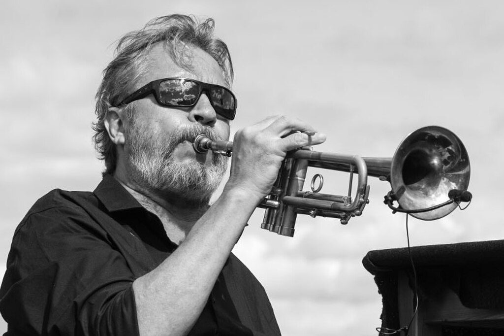[Nils Petter Molvær](https://en.wikipedia.org/wiki/Nils_Petter_Molvær "Nils Petter Molvær") is considered a pioneer of future jazz, a genre that fuses jazz and electronic music.

Although jazz-rock fusion reached the height of its popularity in the 1970s, the use of electronic instruments and rock-derived musical elements in jazz continued in the 1990s and 2000s. Musicians using this approach include [Pat Metheny](https://en.wikipedia.org/wiki/Pat_Metheny "Pat Metheny"), [John Abercrombie](https://en.wikipedia.org/wiki/John_Abercrombie_\(guitarist\) "John Abercrombie (guitarist)"), [John Scofield](https://en.wikipedia.org/wiki/John_Scofield "John Scofield") and the Swedish group [e.s.t.](https://en.wikipedia.org/wiki/Esbjörn_Svensson_Trio "Esbjörn Svensson Trio") Since the beginning of the 1990s, electronic music had significant technical improvements that popularized and created new possibilities for the genre. Jazz elements such as improvisation, rhythmic complexities and harmonic textures were introduced to the genre and consequently had a big impact in new listeners and in some ways kept the versatility of jazz relatable to a newer generation that did not necessarily relate to what the traditionalists call real jazz (bebop, cool and modal jazz). Artists such as [Squarepusher](https://en.wikipedia.org/wiki/Squarepusher "Squarepusher"), [Aphex Twin](https://en.wikipedia.org/wiki/Aphex_Twin "Aphex Twin"), [Flying Lotus](https://en.wikipedia.org/wiki/Flying_Lotus "Flying Lotus") and sub genres like [IDM](https://en.wikipedia.org/wiki/Intelligent_dance_music "Intelligent dance music"), [drum 'n' bass](https://en.wikipedia.org/wiki/Drum_'n'_bass "Drum 'n' bass"), [jungle](https://en.wikipedia.org/wiki/Jungle_music "Jungle music") and [techno](https://en.wikipedia.org/wiki/Techno "Techno") ended up incorporating a lot of these elements. Squarepusher being cited as one big influence for jazz performers drummer [Mark Guiliana](https://en.wikipedia.org/wiki/Mark_Guiliana "Mark Guiliana") and pianist [Brad Mehldau](https://en.wikipedia.org/wiki/Brad_Mehldau "Brad Mehldau"), showing the correlations between jazz and electronic music are a two-way street.

### Jazz-funk

By the mid-1970s, the sound known as jazz-funk had developed, characterized by a strong [back beat](https://en.wikipedia.org/wiki/Beat_\(music\) "Beat (music)") ([groove](https://en.wikipedia.org/wiki/Groove_\(music\) "Groove (music)")), electrified sounds and, often, the presence of electronic [analog synthesizers](https://en.wikipedia.org/wiki/Analog_synthesizers "Analog synthesizers"). Jazz-funk also draws influences from traditional African music, Afro-Cuban rhythms and Jamaican [reggae](https://en.wikipedia.org/wiki/Reggae "Reggae"), notably Kingston bandleader [Sonny Bradshaw](https://en.wikipedia.org/wiki/Sonny_Bradshaw "Sonny Bradshaw"). Another feature is the shift of emphasis from improvisation to composition: arrangements, melody and overall writing became important. The integration of [funk](https://en.wikipedia.org/wiki/Funk "Funk"), [soul](https://en.wikipedia.org/wiki/Soul_music "Soul music"), and [R&B](https://en.wikipedia.org/wiki/Rhythm_and_blues "Rhythm and blues") music into jazz resulted in the creation of a genre whose spectrum is wide and ranges from strong [jazz improvisation](https://en.wikipedia.org/wiki/Musical_improvisation#Jazz_improvisation "Musical improvisation") to soul, funk or disco with jazz arrangements, jazz [riffs](https://en.wikipedia.org/wiki/Riff "Riff") and jazz solos, and sometimes soul vocals.

Early examples are Herbie Hancock's [Headhunters](https://en.wikipedia.org/wiki/The_Headhunters "The Headhunters") band and Miles Davis's _[On the Corner](https://en.wikipedia.org/wiki/On_the_Corner "On the Corner")_ album, which, in 1972, began Davis's foray into jazz-funk and was, he claimed, an attempt at reconnecting with the young black audience which had largely forsaken jazz for [rock](https://en.wikipedia.org/wiki/Rock_and_roll "Rock and roll") and funk. While there is a discernible rock and funk influence in the [timbres](https://en.wikipedia.org/wiki/Timbre "Timbre") of the instruments employed, other tonal and rhythmic textures, such as the Indian tambora and tablas and Cuban congas and bongos, create a multi-layered soundscape. The album was a culmination of sorts of the _[musique concrète](https://en.wikipedia.org/wiki/Musique_concrète "Musique concrète")_ approach that Davis and producer [Teo Macero](https://en.wikipedia.org/wiki/Teo_Macero "Teo Macero") had begun to explore in the late 1960s.

### Straight-ahead jazz

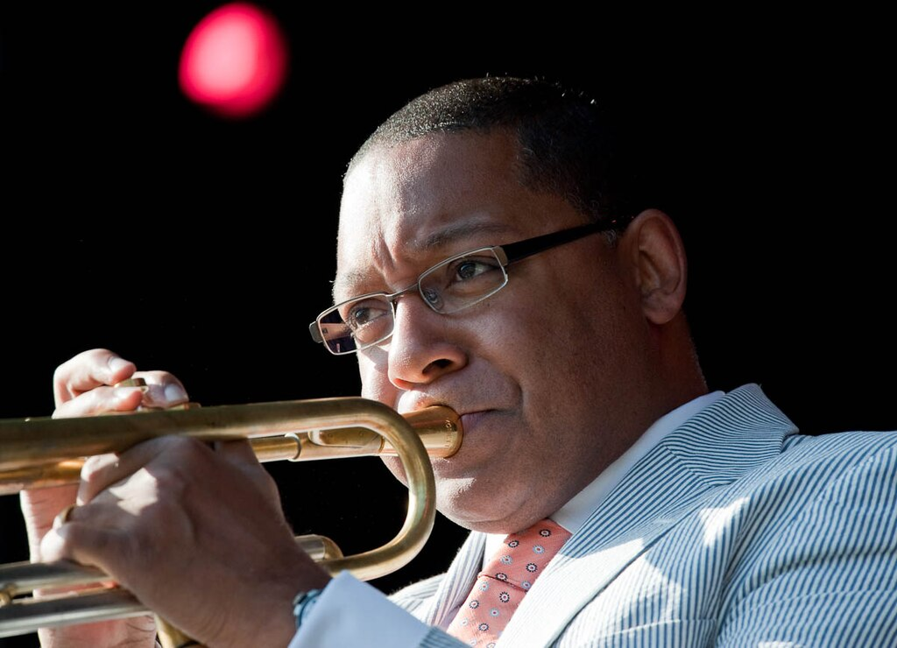[Wynton Marsalis](https://en.wikipedia.org/wiki/Wynton_Marsalis "Wynton Marsalis")

The 1980s saw something of a reaction against the fusion and free jazz that had dominated the 1970s. Trumpeter [Wynton Marsalis](https://en.wikipedia.org/wiki/Wynton_Marsalis "Wynton Marsalis") emerged early in the decade, and strove to create music within what he believed was the tradition, rejecting both fusion and free jazz and creating extensions of the small and large forms initially pioneered by artists such as [Louis Armstrong](https://en.wikipedia.org/wiki/Louis_Armstrong "Louis Armstrong") and [Duke Ellington](https://en.wikipedia.org/wiki/Duke_Ellington "Duke Ellington"), as well as the hard bop of the 1950s. It is debatable whether Marsalis's critical and commercial success was a cause or a symptom of the reaction against Fusion and Free Jazz and the resurgence of interest in the kind of jazz pioneered in the 1960s (particularly [modal jazz](https://en.wikipedia.org/wiki/Modal_jazz "Modal jazz") and [post-bop](https://en.wikipedia.org/wiki/Post-bop "Post-bop")); nonetheless there were many other manifestations of a resurgence of traditionalism, even if fusion and free jazz were by no means abandoned and continued to develop and evolve.

For example, several musicians who had been prominent in the [fusion](https://en.wikipedia.org/wiki/Jazz_fusion "Jazz fusion") genre during the 1970s began to record acoustic jazz once more, including [Chick Corea](https://en.wikipedia.org/wiki/Chick_Corea "Chick Corea") and [Herbie Hancock](https://en.wikipedia.org/wiki/Herbie_Hancock "Herbie Hancock"). Other musicians who had experimented with electronic instruments in the previous decade had abandoned them by the 1980s; for example, [Bill Evans](https://en.wikipedia.org/wiki/Bill_Evans "Bill Evans"), [Joe Henderson](https://en.wikipedia.org/wiki/Joe_Henderson "Joe Henderson"), and [Stan Getz](https://en.wikipedia.org/wiki/Stan_Getz "Stan Getz"). Even the 1980s music of [Miles Davis](/source/miles-davis/ "Miles Davis"), although certainly still fusion, adopted a far more accessible and recognizably jazz-oriented approach than his abstract work of the mid-1970s, such as a return to a theme-and-solos approach.

A similar reaction took place against free jazz. According to [Ted Gioia](https://en.wikipedia.org/wiki/Ted_Gioia "Ted Gioia"):

> the very leaders of the avant garde started to signal a retreat from the core principles of free jazz. Anthony Braxton began recording standards over familiar chord changes. [Cecil Taylor](https://en.wikipedia.org/wiki/Cecil_Taylor "Cecil Taylor") played duets in concert with [Mary Lou Williams](https://en.wikipedia.org/wiki/Mary_Lou_Williams "Mary Lou Williams"), and let her set out structured harmonies and familiar jazz vocabulary under his blistering keyboard attack. And the next generation of progressive players would be even more accommodating, moving inside and outside the changes without thinking twice. Musicians such as David Murray or [Don Pullen](https://en.wikipedia.org/wiki/Don_Pullen "Don Pullen") may have felt the call of free-form jazz, but they never forgot all the other ways one could play African-American music for fun and profit.

Pianist [Keith Jarrett](https://en.wikipedia.org/wiki/Keith_Jarrett "Keith Jarrett")—whose bands of the 1970s had played only original compositions with prominent free jazz elements—established his so-called 'Standards Trio' in 1983, which, although also occasionally exploring collective improvisation, has primarily performed and recorded jazz standards. Chick Corea similarly began exploring jazz standards in the 1980s, having neglected them for the 1970s.

In 1987, the United States House of Representatives and Senate passed a bill proposed by Democratic Representative [John Conyers Jr.](https://en.wikipedia.org/wiki/John_Conyers_Jr. "John Conyers Jr.") to define jazz as a unique form of American music, stating "jazz is hereby designated as a rare and valuable national American treasure to which we should devote our attention, support and resources to make certain it is preserved, understood and promulgated." It passed in the House on September 23, 1987, and in the Senate on November 4, 1987.

In 2001, [Ken Burns](https://en.wikipedia.org/wiki/Ken_Burns "Ken Burns")'s documentary _[Jazz](https://en.wikipedia.org/wiki/Jazz_\(TV_series\) "Jazz (TV series)")_ premiered on [PBS](https://en.wikipedia.org/wiki/Public_Broadcasting_Service "Public Broadcasting Service"), featuring Wynton Marsalis and other experts reviewing the entire history of American jazz to that time. It received some criticism, however, for its failure to reflect the many distinctive non-American traditions and styles in jazz that had developed, and its limited representation of US developments in the last quarter of the 20th century.

#### Neo-bop

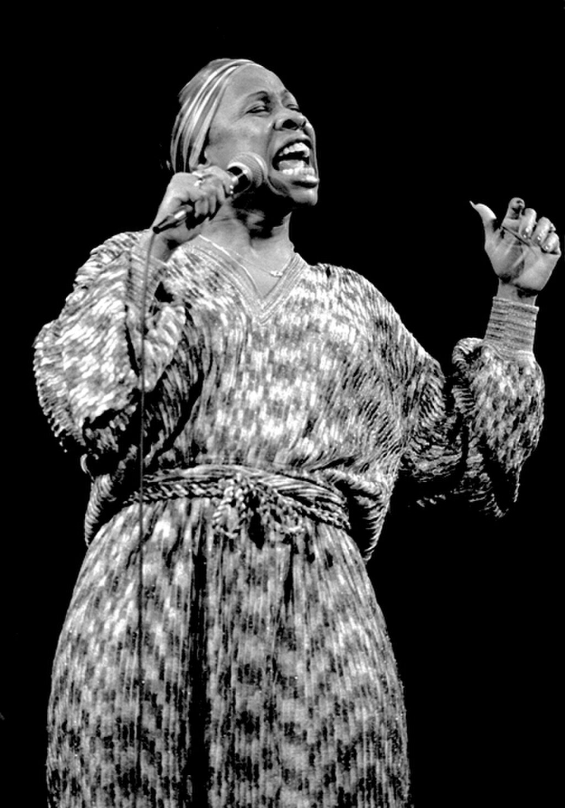[Betty Carter](https://en.wikipedia.org/wiki/Betty_Carter "Betty Carter").

The emergence of young jazz talent beginning to perform in older, established musicians' groups further impacted the resurgence of traditionalism in the jazz community. In the 1970s, the groups of [Betty Carter](https://en.wikipedia.org/wiki/Betty_Carter "Betty Carter") and [Art Blakey and the Jazz Messengers](https://en.wikipedia.org/wiki/The_Jazz_Messengers "The Jazz Messengers") retained their conservative jazz approaches in the midst of fusion and jazz-rock, and in addition to difficulty booking their acts, struggled to find younger generations of personnel to authentically play traditional styles such as [hard bop](https://en.wikipedia.org/wiki/Hard_bop "Hard bop") and [bebop](https://en.wikipedia.org/wiki/Bebop "Bebop"). In the late 1970s, however, a resurgence of younger jazz players in Blakey's band began to occur. This movement included musicians such as [Valery Ponomarev](https://en.wikipedia.org/wiki/Valery_Ponomarev "Valery Ponomarev") and [Bobby Watson](https://en.wikipedia.org/wiki/Bobby_Watson_\(American_musician\) "Bobby Watson (American musician)"), [Dennis Irwin](https://en.wikipedia.org/wiki/Dennis_Irwin "Dennis Irwin") and [James Williams](https://en.wikipedia.org/wiki/James_Williams_\(musician\) "James Williams (musician)"). In the 1980s, in addition to [Wynton](https://en.wikipedia.org/wiki/Wynton_Marsalis "Wynton Marsalis") and [Branford Marsalis](https://en.wikipedia.org/wiki/Branford_Marsalis "Branford Marsalis"), the emergence of pianists in the Jazz Messengers such as [Donald Brown](https://en.wikipedia.org/wiki/Donald_Brown_\(musician\) "Donald Brown (musician)"), [Mulgrew Miller](https://en.wikipedia.org/wiki/Mulgrew_Miller "Mulgrew Miller"), and later, Benny Green, bassists such as [Charles Fambrough](https://en.wikipedia.org/wiki/Charles_Fambrough "Charles Fambrough"), [Lonnie Plaxico](https://en.wikipedia.org/wiki/Lonnie_Plaxico "Lonnie Plaxico") (and later, [Peter Washington](https://en.wikipedia.org/wiki/Peter_Washington "Peter Washington") and Essiet Essiet) horn players such as [Bill Pierce](https://en.wikipedia.org/wiki/Bill_Pierce_\(saxophonist\) "Bill Pierce (saxophonist)"), [Donald Harrison](https://en.wikipedia.org/wiki/Donald_Harrison "Donald Harrison") and later [Javon Jackson](https://en.wikipedia.org/wiki/Javon_Jackson "Javon Jackson") and [Terence Blanchard](https://en.wikipedia.org/wiki/Terence_Blanchard "Terence Blanchard") emerged as talented jazz musicians, all of whom made significant contributions in the 1990s and 2000s.

The young Jazz Messengers' contemporaries, including [Roy Hargrove](https://en.wikipedia.org/wiki/Roy_Hargrove "Roy Hargrove"), [Marcus Roberts](https://en.wikipedia.org/wiki/Marcus_Roberts "Marcus Roberts"), [Wallace Roney](https://en.wikipedia.org/wiki/Wallace_Roney "Wallace Roney") and [Mark Whitfield](https://en.wikipedia.org/wiki/Mark_Whitfield "Mark Whitfield") were also influenced by [Wynton Marsalis](https://en.wikipedia.org/wiki/Wynton_Marsalis "Wynton Marsalis")'s emphasis toward jazz tradition. These younger rising stars rejected avant-garde approaches and instead championed the acoustic jazz sound of Charlie Parker, [Thelonious Monk](https://en.wikipedia.org/wiki/Thelonious_Monk "Thelonious Monk") and early recordings of the first [Miles Davis](/source/miles-davis/ "Miles Davis") quintet. This group of "Young Lions" sought to reaffirm jazz as a high art tradition comparable to the discipline of classical music.

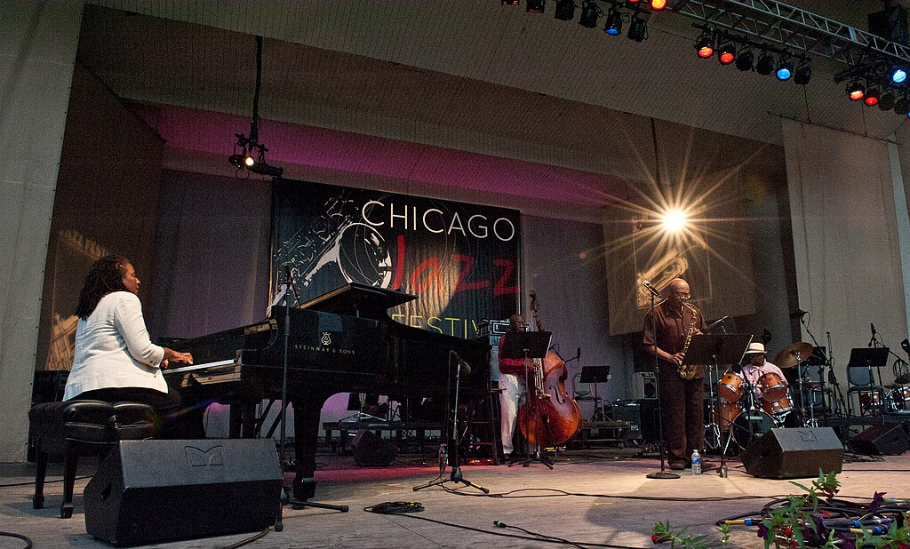[Geri Allen](https://en.wikipedia.org/wiki/Geri_Allen "Geri Allen") with Reggie Workman and Oliver Lake.

In addition, [Betty Carter](https://en.wikipedia.org/wiki/Betty_Carter "Betty Carter")'s rotation of young musicians in her group foreshadowed many of New York's preeminent traditional jazz players later in their careers. Among these musicians were Jazz Messenger alumni [Benny Green](https://en.wikipedia.org/wiki/Benny_Green_\(pianist\) "Benny Green (pianist)"), [Branford Marsalis](https://en.wikipedia.org/wiki/Branford_Marsalis "Branford Marsalis") and [Ralph Peterson Jr.](https://en.wikipedia.org/wiki/Ralph_Peterson_Jr. "Ralph Peterson Jr."), as well as [Kenny Washington](https://en.wikipedia.org/wiki/Kenny_Washington_\(musician\) "Kenny Washington (musician)"), [Lewis Nash](https://en.wikipedia.org/wiki/Lewis_Nash "Lewis Nash"), [Curtis Lundy](https://en.wikipedia.org/wiki/Curtis_Lundy "Curtis Lundy"), [Cyrus Chestnut](https://en.wikipedia.org/wiki/Cyrus_Chestnut "Cyrus Chestnut"), [Mark Shim](https://en.wikipedia.org/wiki/Mark_Shim "Mark Shim"), [Craig Handy](https://en.wikipedia.org/wiki/Craig_Handy "Craig Handy"), Greg Hutchinson and [Marc Cary](https://en.wikipedia.org/wiki/Marc_Cary "Marc Cary"), [Taurus Mateen](https://en.wikipedia.org/wiki/Taurus_Mateen "Taurus Mateen") and [Geri Allen](https://en.wikipedia.org/wiki/Geri_Allen "Geri Allen"). [O.T.B.](https://en.wikipedia.org/wiki/Out_of_the_Blue_\(American_band\) "Out of the Blue (American band)") ensemble included a rotation of young jazz musicians such as [Kenny Garrett](https://en.wikipedia.org/wiki/Kenny_Garrett "Kenny Garrett"), [Steve Wilson](https://en.wikipedia.org/wiki/Steve_Wilson_\(jazz_musician\) "Steve Wilson (jazz musician)"), [Kenny Davis](https://en.wikipedia.org/wiki/Kenny_Davis_\(musician\) "Kenny Davis (musician)"), [Renee Rosnes](https://en.wikipedia.org/wiki/Renee_Rosnes "Renee Rosnes"), [Ralph Peterson Jr.](https://en.wikipedia.org/wiki/Ralph_Peterson_Jr. "Ralph Peterson Jr."), [Billy Drummond](https://en.wikipedia.org/wiki/Billy_Drummond "Billy Drummond"), and [Robert Hurst](https://en.wikipedia.org/wiki/Robert_Hurst_\(musician\) "Robert Hurst (musician)").

Starting in the 1990s, a number of players from largely straight-ahead or post-bop backgrounds emerged as a result of the rise of neo-traditionalist jazz, including pianists [Jason Moran](https://en.wikipedia.org/wiki/Jason_Moran_\(musician\) "Jason Moran (musician)") and [Vijay Iyer](https://en.wikipedia.org/wiki/Vijay_Iyer "Vijay Iyer"), guitarist [Kurt Rosenwinkel](https://en.wikipedia.org/wiki/Kurt_Rosenwinkel "Kurt Rosenwinkel"), vibraphonist [Stefon Harris](https://en.wikipedia.org/wiki/Stefon_Harris "Stefon Harris"), trumpeters [Roy Hargrove](https://en.wikipedia.org/wiki/Roy_Hargrove "Roy Hargrove") and [Terence Blanchard](https://en.wikipedia.org/wiki/Terence_Blanchard "Terence Blanchard"), saxophonists [Chris Potter](https://en.wikipedia.org/wiki/Chris_Potter_\(jazz_saxophonist\) "Chris Potter (jazz saxophonist)") and [Joshua Redman](https://en.wikipedia.org/wiki/Joshua_Redman "Joshua Redman"), clarinetist [Ken Peplowski](https://en.wikipedia.org/wiki/Ken_Peplowski "Ken Peplowski") and bassist [Christian McBride](https://en.wikipedia.org/wiki/Christian_McBride "Christian McBride").

### Smooth jazz

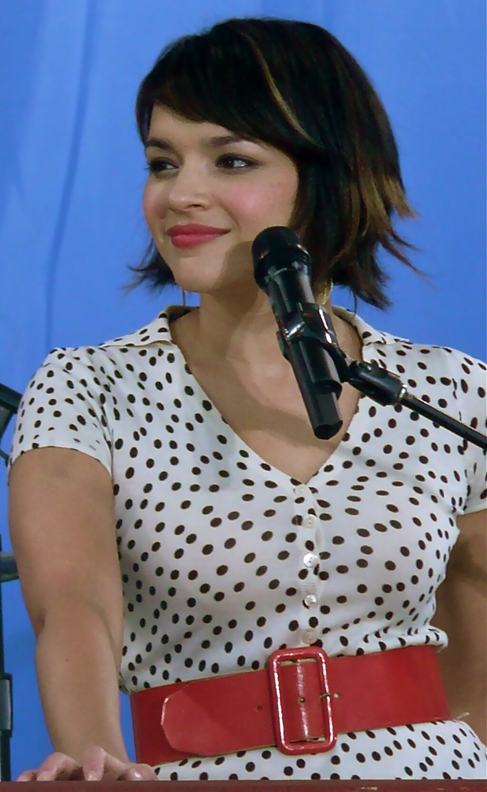[Norah Jones](https://en.wikipedia.org/wiki/Norah_Jones "Norah Jones").

In the early 1980s, a commercial form of jazz fusion called "pop fusion" or "smooth jazz" became successful, garnering significant radio airplay in "[quiet storm](https://en.wikipedia.org/wiki/Quiet_storm "Quiet storm")" time slots at radio stations in urban markets across the U.S. This helped to establish or bolster the careers of vocalists including [Al Jarreau](https://en.wikipedia.org/wiki/Al_Jarreau "Al Jarreau"), [Anita Baker](https://en.wikipedia.org/wiki/Anita_Baker "Anita Baker"), [Chaka Khan](https://en.wikipedia.org/wiki/Chaka_Khan "Chaka Khan"), and [Sade](https://en.wikipedia.org/wiki/Sade_Adu "Sade Adu"), as well as saxophonists including [Grover Washington Jr.](https://en.wikipedia.org/wiki/Grover_Washington_Jr. "Grover Washington Jr."), [Kenny G](https://en.wikipedia.org/wiki/Kenny_G "Kenny G"), [Kirk Whalum](https://en.wikipedia.org/wiki/Kirk_Whalum "Kirk Whalum"), [Boney James](https://en.wikipedia.org/wiki/Boney_James "Boney James"), and [David Sanborn](https://en.wikipedia.org/wiki/David_Sanborn "David Sanborn"). In general, smooth jazz is downtempo (the most widely played tracks are of 90–105 [beats per minute](https://en.wikipedia.org/wiki/Beats_per_minute "Beats per minute")), and has a lead melody-playing instrument (saxophone, especially soprano and tenor, and [legato](https://en.wikipedia.org/wiki/Legato "Legato") electric guitar are popular).

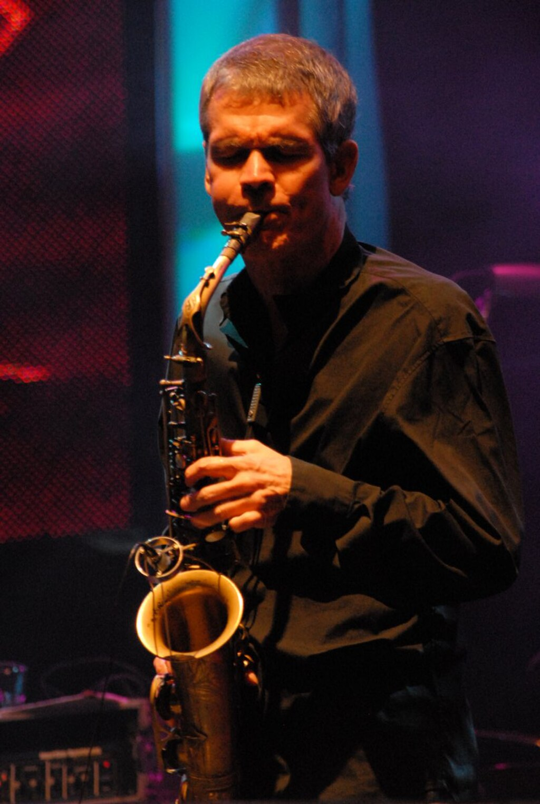[David Sanborn](https://en.wikipedia.org/wiki/David_Sanborn "David Sanborn"), 2008

In his _[Newsweek](https://en.wikipedia.org/wiki/Newsweek "Newsweek")_ article "The Problem With Jazz Criticism", [Stanley Crouch](https://en.wikipedia.org/wiki/Stanley_Crouch "Stanley Crouch") considers Miles Davis's playing of fusion to be a turning point that led to smooth jazz. Critic Aaron J. West has countered the often negative perceptions of smooth jazz, stating:

> I challenge the prevalent marginalization and malignment of smooth jazz in the standard jazz narrative. Furthermore, I question the assumption that smooth jazz is an unfortunate and unwelcomed evolutionary outcome of the jazz-fusion era. Instead, I argue that smooth jazz is a long-lived musical style that merits multi-disciplinary analyses of its origins, critical dialogues, performance practice, and reception.

### Acid jazz, nu jazz, and jazz rap

[Acid jazz](https://en.wikipedia.org/wiki/Acid_jazz "Acid jazz") developed in the UK in the 1980s and 1990s, influenced by [jazz-funk](https://en.wikipedia.org/wiki/Jazz-funk "Jazz-funk") and [electronic dance music](https://en.wikipedia.org/wiki/Electronic_music "Electronic music"). Acid jazz often contains various types of electronic composition (sometimes including [sampling](https://en.wikipedia.org/wiki/Sampling_\(music\) "Sampling (music)") or live DJ cutting and [scratching](https://en.wikipedia.org/wiki/Scratching "Scratching")), but it is just as likely to be played live by musicians, who often showcase jazz interpretation as part of their performance. Richard S. Ginell of AllMusic considers [Roy Ayers](https://en.wikipedia.org/wiki/Roy_Ayers "Roy Ayers") "one of the prophets of acid jazz".

[Nu jazz](https://en.wikipedia.org/wiki/Nu_jazz "Nu jazz") is influenced by jazz harmony and melodies, and there are usually no improvisational aspects. It can be very experimental in nature and can vary widely in sound and concept. It ranges from the combination of live instrumentation with the beats of jazz [house](https://en.wikipedia.org/wiki/House_music "House music") (as exemplified by [St Germain](https://en.wikipedia.org/wiki/Saint_Germain_\(musician\) "Saint Germain (musician)"), [Jazzanova](https://en.wikipedia.org/wiki/Jazzanova "Jazzanova"), and [Fila Brazillia](https://en.wikipedia.org/wiki/Fila_Brazillia "Fila Brazillia")) to more band-based improvised jazz with electronic elements (for example, [The Cinematic Orchestra](https://en.wikipedia.org/wiki/The_Cinematic_Orchestra "The Cinematic Orchestra"), [Kobol](https://en.wikipedia.org/wiki/Kobol_\(band\) "Kobol (band)") and the Norwegian "future jazz" style pioneered by [Bugge Wesseltoft](https://en.wikipedia.org/wiki/Bugge_Wesseltoft "Bugge Wesseltoft"), [Jaga Jazzist](https://en.wikipedia.org/wiki/Jaga_Jazzist "Jaga Jazzist"), and [Nils Petter Molvær](https://en.wikipedia.org/wiki/Nils_Petter_Molvær "Nils Petter Molvær")).

[Jazz rap](https://en.wikipedia.org/wiki/Jazz_rap "Jazz rap") developed in the late 1980s and early 1990s and incorporates jazz influences into [hip-hop](https://en.wikipedia.org/wiki/Hip-hop "Hip-hop"). In 1988, [Gang Starr](https://en.wikipedia.org/wiki/Gang_Starr "Gang Starr") released the debut single "Words I Manifest", which sampled Dizzy Gillespie's 1962 "Night in Tunisia", and [Stetsasonic](https://en.wikipedia.org/wiki/Stetsasonic "Stetsasonic") released "Talkin' All That Jazz", which sampled [Lonnie Liston Smith](https://en.wikipedia.org/wiki/Lonnie_Liston_Smith "Lonnie Liston Smith"). Gang Starr's debut LP _[No More Mr. Nice Guy](https://en.wikipedia.org/wiki/No_More_Mr._Nice_Guy_\(Gang_Starr_album\) "No More Mr. Nice Guy (Gang Starr album)")_ (1989) and their 1990 track "Jazz Thing" sampled Charlie Parker and [Ramsey Lewis](https://en.wikipedia.org/wiki/Ramsey_Lewis "Ramsey Lewis"). The groups which made up the [Native Tongues Posse](https://en.wikipedia.org/wiki/Native_Tongues_Posse "Native Tongues Posse") tended toward jazzy releases: these include the [Jungle Brothers](https://en.wikipedia.org/wiki/Jungle_Brothers "Jungle Brothers")' debut _[Straight Out the Jungle](https://en.wikipedia.org/wiki/Straight_Out_the_Jungle "Straight Out the Jungle")_ (1988), and [A Tribe Called Quest](https://en.wikipedia.org/wiki/A_Tribe_Called_Quest "A Tribe Called Quest")'s _[People's Instinctive Travels and the Paths of Rhythm](https://en.wikipedia.org/wiki/People's_Instinctive_Travels_and_the_Paths_of_Rhythm "People's Instinctive Travels and the Paths of Rhythm")_ (1990) and _[The Low End Theory](https://en.wikipedia.org/wiki/The_Low_End_Theory "The Low End Theory")_ (1991). Rap duo [Pete Rock & CL Smooth](https://en.wikipedia.org/wiki/Pete_Rock_&_CL_Smooth "Pete Rock & CL Smooth") incorporated jazz influences on their 1992 debut _[Mecca and the Soul Brother](https://en.wikipedia.org/wiki/Mecca_and_the_Soul_Brother "Mecca and the Soul Brother")_. Rapper [Guru](https://en.wikipedia.org/wiki/Guru_\(rapper\) "Guru (rapper)")'s [Jazzmatazz](https://en.wikipedia.org/wiki/Jazzmatazz,_Vol._1 "Jazzmatazz, Vol. 1") series began in 1993 using jazz musicians during the studio recordings.

Although jazz rap had achieved little mainstream success, Miles Davis's final album _[Doo-Bop](https://en.wikipedia.org/wiki/Doo-Bop "Doo-Bop")_ (released posthumously in 1992) was based on hip-hop beats and collaborations with producer [Easy Mo Bee](https://en.wikipedia.org/wiki/Easy_Mo_Bee "Easy Mo Bee"). Davis's ex-bandmate [Herbie Hancock](https://en.wikipedia.org/wiki/Herbie_Hancock "Herbie Hancock") also absorbed hip-hop influences in the mid-1990s, releasing the album _[Dis Is da Drum](https://en.wikipedia.org/wiki/Dis_Is_da_Drum "Dis Is da Drum")_ in 1994.

The mid-2010s saw an increased influence of R&B, hip-hop, and pop music on jazz. In 2015, [Kendrick Lamar](https://en.wikipedia.org/wiki/Kendrick_Lamar "Kendrick Lamar") released his third studio album, _[To Pimp a Butterfly](https://en.wikipedia.org/wiki/To_Pimp_a_Butterfly "To Pimp a Butterfly")_. The album heavily featured prominent contemporary jazz artists such as [Thundercat](https://en.wikipedia.org/wiki/Thundercat_\(musician\) "Thundercat (musician)") and redefined jazz rap with a larger focus on improvisation and live soloing rather than simply sampling. In that same year, saxophonist [Kamasi Washington](https://en.wikipedia.org/wiki/Kamasi_Washington "Kamasi Washington") released his nearly three-hour long debut, _[The Epic](https://en.wikipedia.org/wiki/The_Epic_\(album\) "The Epic (album)")_. Its hip-hop inspired beats and R&B vocal interludes was not only acclaimed by critics for being innovative in keeping jazz relevant, but also sparked a small resurgence in jazz on the internet.

### Punk jazz and jazzcore

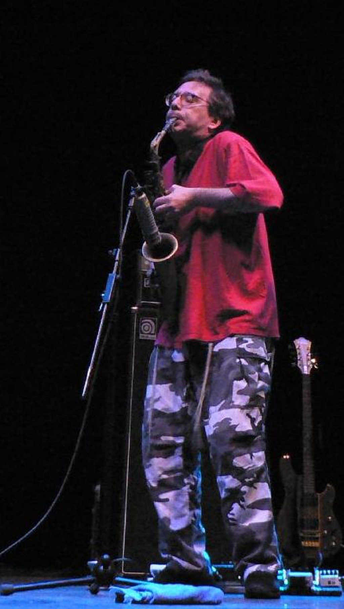[John Zorn](https://en.wikipedia.org/wiki/John_Zorn "John Zorn") performing in 2006

The relaxation of orthodoxy which was concurrent with [post-punk](https://en.wikipedia.org/wiki/Post-punk "Post-punk") in London and New York City led to a new appreciation of jazz. In London, [the Pop Group](https://en.wikipedia.org/wiki/The_Pop_Group "The Pop Group") began to mix free jazz and dub reggae into their brand of punk rock. In New York, [No Wave](https://en.wikipedia.org/wiki/No_Wave "No Wave") took direct inspiration from both free jazz and punk. Examples of this style include [Lydia Lunch](https://en.wikipedia.org/wiki/Lydia_Lunch "Lydia Lunch")'s _Queen of Siam_, Gray, the work of [James Chance and the Contortions](https://en.wikipedia.org/wiki/James_Chance_and_the_Contortions "James Chance and the Contortions") (who mixed [Soul](https://en.wikipedia.org/wiki/Soul_music "Soul music") with free jazz and [punk](https://en.wikipedia.org/wiki/Punk_rock "Punk rock")) and the [Lounge Lizards](https://en.wikipedia.org/wiki/Lounge_Lizards "Lounge Lizards") (the first group to call themselves "[punk jazz](https://en.wikipedia.org/wiki/Punk_jazz "Punk jazz")").

[John Zorn](https://en.wikipedia.org/wiki/John_Zorn "John Zorn") took note of the emphasis on speed and dissonance that was becoming prevalent in punk rock, and incorporated this into free jazz with the release of the _[Spy vs. Spy](https://en.wikipedia.org/wiki/Spy_vs_Spy_\(album\) "Spy vs Spy (album)")_ album in 1986, a collection of [Ornette Coleman](https://en.wikipedia.org/wiki/Ornette_Coleman "Ornette Coleman") tunes done in the contemporary [thrashcore](https://en.wikipedia.org/wiki/Thrashcore "Thrashcore") style. In the same year, [Sonny Sharrock](https://en.wikipedia.org/wiki/Sonny_Sharrock "Sonny Sharrock"), [Peter Brötzmann](https://en.wikipedia.org/wiki/Peter_Brötzmann "Peter Brötzmann"), [Bill Laswell](https://en.wikipedia.org/wiki/Bill_Laswell "Bill Laswell"), and [Ronald Shannon Jackson](https://en.wikipedia.org/wiki/Ronald_Shannon_Jackson "Ronald Shannon Jackson") recorded the first album under the name [Last Exit](https://en.wikipedia.org/wiki/Last_Exit_\(free_jazz_band\) "Last Exit (free jazz band)"), a similarly aggressive blend of thrash and free jazz. These developments are the origins of _jazzcore_, the fusion of free jazz with [hardcore punk](https://en.wikipedia.org/wiki/Hardcore_punk "Hardcore punk").

### M-Base

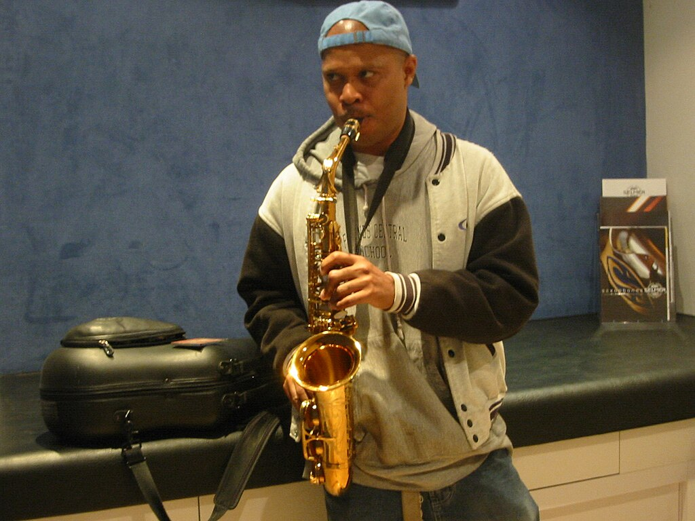[Steve Coleman](https://en.wikipedia.org/wiki/Steve_Coleman "Steve Coleman") in [Paris](https://en.wikipedia.org/wiki/Paris "Paris"), July 2004

The [M-Base](https://en.wikipedia.org/wiki/M-Base "M-Base") movement started in the 1980s, when a loose collective of young African-American musicians in New York that included [Steve Coleman](https://en.wikipedia.org/wiki/Steve_Coleman "Steve Coleman"), [Greg Osby](https://en.wikipedia.org/wiki/Greg_Osby "Greg Osby"), and [Gary Thomas](https://en.wikipedia.org/wiki/Gary_Thomas_\(musician\) "Gary Thomas (musician)") developed a complex but grooving sound.

In the 1990s, most M-Base participants turned to more conventional music, but Coleman, the most active participant, continued developing his music in accordance with the M-Base concept.

Coleman's audience decreased, but his music and concepts influenced many musicians, according to pianist Vijay Iver and critic Ben Ratlifff of _The New York Times_.

M-Base changed from a movement of a loose collective of young musicians to a kind of informal Coleman "school", with a much advanced but already originally implied concept. Steve Coleman's music and [M-Base](https://en.wikipedia.org/wiki/M-Base "M-Base") concept gained recognition as "next logical step" after Charlie Parker, John Coltrane, and Ornette Coleman.

### Jazz pluralism

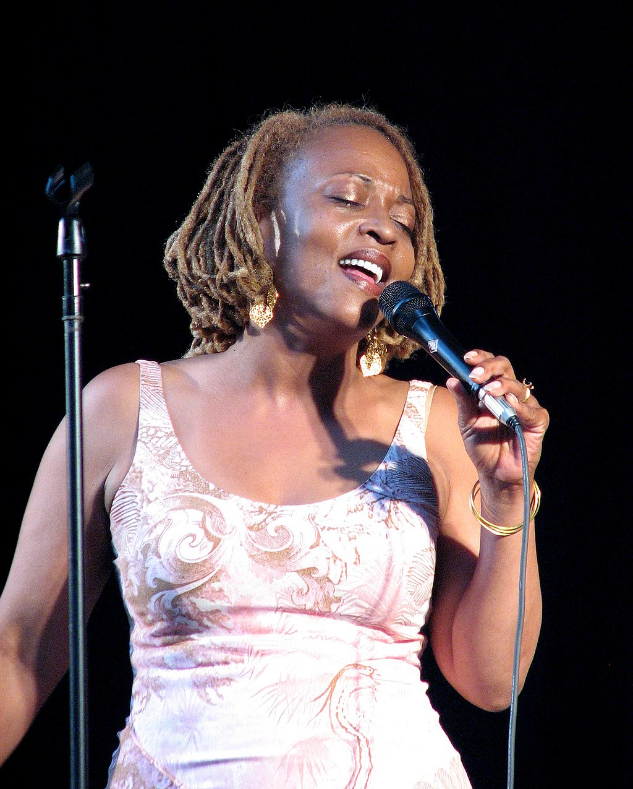[Cassandra Wilson](https://en.wikipedia.org/wiki/Cassandra_Wilson "Cassandra Wilson").

Since the 1990s, jazz has been characterized by a pluralism in which no one style dominates, but rather a wide range of styles and genres are popular. Individual performers often play in a variety of styles, sometimes in the same performance. Pianist [Brad Mehldau](https://en.wikipedia.org/wiki/Brad_Mehldau "Brad Mehldau") and [The Bad Plus](https://en.wikipedia.org/wiki/The_Bad_Plus "The Bad Plus") have explored contemporary rock music within the context of the traditional jazz acoustic piano trio, recording instrumental jazz versions of songs by rock musicians. The Bad Plus have also incorporated elements of free jazz into their music. A firm avant-garde or free jazz stance has been maintained by some players, such as saxophonists [Greg Osby](https://en.wikipedia.org/wiki/Greg_Osby "Greg Osby") and [Charles Gayle](https://en.wikipedia.org/wiki/Charles_Gayle "Charles Gayle"), while others, such as [James Carter](https://en.wikipedia.org/wiki/James_Carter_\(musician\) "James Carter (musician)"), have incorporated free jazz elements into a more traditional framework.

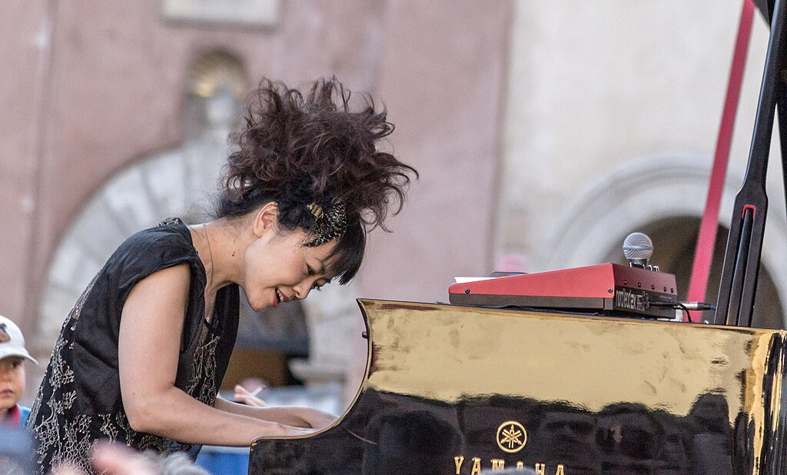[Hiromi Uehara](https://en.wikipedia.org/wiki/Hiromi_Uehara "Hiromi Uehara") Japanese jazz pianist and composer known for her virtuosic playing and innovative fusion of jazz, classical, and progressive rock elements in her music.

[Harry Connick Jr.](https://en.wikipedia.org/wiki/Harry_Connick_Jr. "Harry Connick Jr.") began his career playing stride piano and the Dixieland jazz of his home, New Orleans, beginning with his first recording when he was 10 years old. Some of his earliest lessons were at the home of pianist [Ellis Marsalis](https://en.wikipedia.org/wiki/Ellis_Marsalis_Jr. "Ellis Marsalis Jr."). Connick had success on the pop charts after recording the soundtrack to the movie _[When Harry Met Sally](https://en.wikipedia.org/wiki/When_Harry_Met_Sally "When Harry Met Sally")_, which sold over two million copies. Crossover success has also been achieved by [Diana Krall](https://en.wikipedia.org/wiki/Diana_Krall "Diana Krall"), [Norah Jones](https://en.wikipedia.org/wiki/Norah_Jones "Norah Jones"), [Cassandra Wilson](https://en.wikipedia.org/wiki/Cassandra_Wilson "Cassandra Wilson"), [Kurt Elling](https://en.wikipedia.org/wiki/Kurt_Elling "Kurt Elling"), and [Jamie Cullum](https://en.wikipedia.org/wiki/Jamie_Cullum "Jamie Cullum").

Additionally, the era saw the release of recordings and videos from the previous century, such as a Just Jazz tape broadcast by a band led by [Gene Ammons](https://en.wikipedia.org/wiki/Gene_Ammons "Gene Ammons") and studio archives such as _Just Coolin'_ by [Art Blakey and the Jazz Messengers](https://en.wikipedia.org/wiki/The_Jazz_Messengers "The Jazz Messengers").

#### Social media

An internet-aided trend of 2010s jazz was that of extreme [reharmonization](https://en.wikipedia.org/wiki/Reharmonization "Reharmonization"), inspired by both virtuosic players known for their speed and rhythm such as [Art Tatum](https://en.wikipedia.org/wiki/Art_Tatum "Art Tatum"), as well as players known for their ambitious voicings and chords such as Bill Evans. Supergroup [Snarky Puppy](https://en.wikipedia.org/wiki/Snarky_Puppy "Snarky Puppy") adopted this trend, allowing players like [Cory Henry](https://en.wikipedia.org/wiki/Cory_Henry "Cory Henry") to shape the grooves and harmonies of modern jazz soloing. [YouTube](https://en.wikipedia.org/wiki/YouTube "YouTube") phenomenon [Jacob Collier](https://en.wikipedia.org/wiki/Jacob_Collier "Jacob Collier") also gained recognition for his ability to play an incredibly large number of instruments and his ability to use [microtones](https://en.wikipedia.org/wiki/Microtones "Microtones"), advanced polyrhythms, and blend a spectrum of genres in his largely homemade production process.

Other jazz musicians gained popularity through social media during the 2010s and 2020s. These included [Joan Chamorro](https://en.wikipedia.org/wiki/Joan_Chamorro "Joan Chamorro"), a bassist and bandleader based in [Barcelona](https://en.wikipedia.org/wiki/Barcelona "Barcelona") whose big band and jazz combo videos have received tens of millions of views on YouTube, and [Emmet Cohen](https://en.wikipedia.org/wiki/Emmet_Cohen "Emmet Cohen"), who broadcast a series of performances live from New York starting in March 2020.
