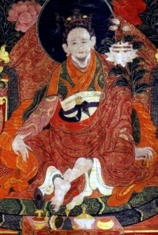

**Jikme Lingpa**

**Jikme Lingpa** (Tib. འཇིགས་མེད་གླིང་པ་, [Wyl.](https://www.rigpawiki.org/index.php?title=Wyl. "Wyl.") _'jigs med gling pa_) (1730-1798) is regarded as one of the most important figures in the [Nyingma](/source/nyingma/ "Nyingma") lineage. Also known as ‘Khyentse Özer’, ‘Rays of Compassion and Wisdom’, he was a great scholar and visionary, and discovered the [Longchen Nyingtik](/source/longchen-nyingtik/ "Longchen Nyingtik") cycle of teachings and practice through a series of visions from the great fourteenth century master, [Longchenpa](/source/longchenpa/ "Longchenpa"). With the patronage of the [Dergé](https://www.rigpawiki.org/index.php?title=Dergé "Dergé") royal family, Jikme Lingpa published the compilation of Nyingma [tantras](https://www.rigpawiki.org/index.php?title=Tantra "Tantra") known as the [Nyingma Gyübum](https://www.rigpawiki.org/index.php?title=Nyingma_Gyübum "Nyingma Gyübum") and composed a catalogue to accompany it.

## Biography

### Revelation of the Longchen Nyingtik

Jikme Lingpa discovered the Longchen Nyingtik teachings as [mind ter](https://www.rigpawiki.org/index.php?title=Mind_terma "Mind terma") at the age of twenty-eight. Tulku Thondup writes:

: In the evening of the twenty-fifth day of the tenth month of the Fire Ox year of the thirteenth Rabjung cycle (1757), Jikme Lingpa went to bed with an unbearable devotion to Guru Rinpoche in his heart; a stream of tears of sadness continuously wet his face because he was not in Guru Rinpoche’s presence, and unceasing words of prayers kept singing in his breath. : He remained in the depths of that meditation experience of clear luminosity for a long time. While being absorbed in that luminous clarity, he experienced flying a long distance through the sky while riding a white lion. He finally reached a circular path, which he thought to be the circumambulation path of Jarung Khashor, now known as Boudhanath Stupa, an important Buddhist monument of giant structure in Nepal.

In this vision, the wisdom dakinis gave Jikme Lingpa a casket containing five yellow scrolls and seven crystal beads. One of the scrolls contained the [prophetic guide](https://www.rigpawiki.org/index.php?title=Prophetic_guide "Prophetic guide") of Longchen Nyingtik, called _Nechang Thukkyi Drombu_. At the instruction of a [dakini](https://www.rigpawiki.org/index.php?title=Dakini "Dakini"), he ate the yellow scrolls and crystal beads, and all the words and meaning of the Longchen Nyingtik terma were awakened in his mind.

Jikme Lingpa kept this terma secret for years, and he did not even transcribe the terma until he entered another retreat in which he had a series of visions of [Longchen Rabjam](https://www.rigpawiki.org/index.php?title=Longchen_Rabjam "Longchen Rabjam"). Tulku Thondup explains:

: In the earth-hare year (1759) he started another three-year retreat, at Chimpu near Samye monastery. During that retreat, because he was inspired by three successive pure visions of Longchen Rabjam, and he was urged by repeated requests of dakinis, he transcribed his terma as the cycle of Longchen Nyingtik. On the tenth day of the sixth month (monkey month) of the monkey year (1764) he made his terma public for the first time by conferring the transmission of empowerment and the instructions upon fifteen disciples.

## Writings

He composed many original texts of which the _[Treasury of Precious Qualities](https://www.rigpawiki.org/index.php?title=Treasury_of_Precious_Qualities "Treasury of Precious Qualities")_ (_Yönten Dzö_) is the most well known. His collected writings fill some fourteen volumes in the Adzom Chögar edition and nine volumes in the set produced in Dergé.

*   _[Detailed Commentary on the Lama Gongdü](https://www.rigpawiki.org/index.php?title=Detailed_Commentary_on_the_Lama_Gongdü "Detailed Commentary on the Lama Gongdü")_
*   _[Staircase to Akanishtha](https://www.rigpawiki.org/index.php?title=Staircase_to_Akanishtha "Staircase to Akanishtha")_
*   _The Steps to Liberation_. Translated in English in _Steps to the Great Perfection: The Mind-Training Tradition of the Dzogchen Masters_, translated by Cortland Dahl (Ithaca: Snow Lion, 2016)
*   _[Treasury of Precious Qualities](https://www.rigpawiki.org/index.php?title=Treasury_of_Precious_Qualities "Treasury of Precious Qualities")_ (Tib. ཡོན་ཏན་མཛོད་, _Yönten Dzö_)
*   _[Yeshe Lama](https://www.rigpawiki.org/index.php?title=Yeshe_Lama "Yeshe Lama")_

He was also instrumental in the transmission of the [Collected Tantras](https://www.rigpawiki.org/index.php?title=Nyingma_Gyübum "Nyingma Gyübum") of the Nyingma school. He compiled a new edition, expanding on [Ratna Lingpa](https://www.rigpawiki.org/index.php?title=Ratna_Lingpa "Ratna Lingpa")'s edition, and also compiled a catalogue. The work was begun in 1771 and lasted until the summer of the next year, during which new printing blocks were carved.

## Teachers

A list of Jigme Lingpa's teachers mainly based on his record of received teachings (_tob-yik_).

*   Gomchen Dharmakīrti or Gomchen Chö or Gomdrak Chö (_sgom chen_, _sgom chen chos, sgom grags chos_)
*   Shrīnātha (same as [Drubwang Palgön](https://www.rigpawiki.org/index.php?title=Drubwang_Palgön "Drubwang Palgön") in Gyatso 1998, p289) (_grub dbang dpal mgon_)
*   Neten Kunzang Özer or Kunzang Drolchok (_gnas-brten kun bzang ‘od zer, kun bzang grol mchog_)
*   Tangdrok Pema Rikdzin Wangpo or Tangdrok Kukyé (Tangdrok Monastery was established by [Tsele Natsok Rangdrol](https://www.rigpawiki.org/index.php?title=Tsele_Natsok_Rangdrol "Tsele Natsok Rangdrol")) (_thang ‘brog pad+ma rig-‘dzin dbang po, thang ‘brog sku-skye_)
*   Tangdrok Wönpo Gyurme Pema Chokdrub or Wönpo kukyé (_thang ‘brog dbon po rgyur med pad+ma mchog sgrub, dbon po sku skye_)
*   Tukchok Dorje (_thugs mchog rdo rje_)
*   Samantabhadra
*   Kongpo or Kongnyön Trati Ngakchang Rikpe Dorje (also known elsewhere as Könnyön Bepe Naljor) (_kong po, kong smyon kra ti sngags ‘chang rig pa’i rdo rje, kon smyon sbas pa’i rnal byor_)
*   Chakzam Tulku Tendzin Yeshe Lhündrub (_lcag zam sprul sku bstan ‘dzin ye shes lhun grub_)
*   Gomri Orgyen Longyang or Gomri Lama or Druk Gamri Lama (_sgom ri o rgyan klong yangs, sgom ri bla ma, ‘brug sgam ri bla ma_)
*   Tekchen Lingpa or Drime Lingpa (_theg chen gling pa, dri med gling pa_)
*   Tsogyal Tulku Ngawang Lozang Pema (_mtsho rgyal sprul sku ngag dbang blo bzang pad+ma_)
*   Rigdzin Trinle (_rig ‘dzin phrin las_)

The following are only responsible for one transmission in his record of received teachings.

*   Jortse Trulpe Ku (_sbyor rtse sprul pa’i sku_)
*   Gelong Namgyal (_dge slong rnam rgyal_)
*   Dzangkar Dargye (_rdzang kar dar rgyas_)
*   Odi Karma (_o di kar+ma_)

There are two early teachers whom Jikme Lingpa did not include in his record of received teachings.

*   Lobpön Bön Tsenpa (_slob dpon bon btsan pa_) (Namthar page 16)
*   Damchö Losal Wangpo (_dam chos blo gsal dbang po_) (Namthar page 19)

## Students

Jikme Lingpa's foremost disciples were known as the '[Four Jikmes](https://www.rigpawiki.org/index.php?title=Four_Jikmes "Four Jikmes")'. They were

1.  [Dodrupchen Jikme Trinle Özer](https://www.rigpawiki.org/index.php?title=Dodrupchen_Jikme_Trinle_Özer "Dodrupchen Jikme Trinle Özer") of [Golok](https://www.rigpawiki.org/index.php?title=Golok "Golok")
2.  [Jikme Gyalwe Nyugu](https://www.rigpawiki.org/index.php?title=Jikme_Gyalwe_Nyugu "Jikme Gyalwe Nyugu") of [Dzachukha](https://www.rigpawiki.org/index.php?title=Dzachukha "Dzachukha")
3.  [Jikme Ngotsar](https://www.rigpawiki.org/index.php?title=Jikme_Ngotsar "Jikme Ngotsar") of Dzachukha
4.  Lopön Jikme Küntröl, or [Jikme Kundrol Namgyal](https://www.rigpawiki.org/index.php?title=Jikme_Kundrol_Namgyal "Jikme Kundrol Namgyal") of Bhutan

## Incarnations

In his biography of [Patrul Rinpoche](https://www.rigpawiki.org/index.php?title=Patrul_Rinpoche "Patrul Rinpoche"), [Khenpo Kunpal](https://www.rigpawiki.org/index.php?title=Khenpo_Kunpal "Khenpo Kunpal") tells us that Jikme Lingpa had three incarnations:

*   [Do Khyentse](https://www.rigpawiki.org/index.php?title=Do_Khyentse "Do Khyentse") was the mind incarnation,
*   [Patrul Rinpoche](https://www.rigpawiki.org/index.php?title=Patrul_Rinpoche "Patrul Rinpoche") the speech incarnation, and
*   [Jamyang Khyentse Wangpo](https://www.rigpawiki.org/index.php?title=Jamyang_Khyentse_Wangpo "Jamyang Khyentse Wangpo") the body incarnation.

See [Jikme Lingpa Incarnation Line](https://www.rigpawiki.org/index.php?title=Jikme_Lingpa_Incarnation_Line "Jikme Lingpa Incarnation Line") for more details

## Alternative Names

*   Dzogchenpa Rangjung Dorjé (Wyl. _rdzogs chen pa rang byung rdo rje_)
*   Khyentse Özer

## Notes

## Teachings Given to the [Rigpa](https://www.rigpawiki.org/index.php?title=About_Rigpa "About Rigpa") Sangha

*   [Khenchen Pema Sherab](https://www.rigpawiki.org/index.php?title=Khenchen_Pema_Sherab "Khenchen Pema Sherab"), [Lerab Ling](https://www.rigpawiki.org/index.php?title=Lerab_Ling "Lerab Ling"), 29-30 January 2022

## Further Reading

*   [Dudjom Rinpoche](https://www.rigpawiki.org/index.php?title=Dudjom_Rinpoche "Dudjom Rinpoche"), _The Nyingma School of Tibetan Buddhism, Its Fundamentals and History_, trans. and ed. Gyurme Dorje (Boston: Wisdom, 1991), vol.1 pp.835-840
*   Janet Gyatso, _Apparitions of the Self_, Princeton: University of Princeton Press, 1998
*   Michael Aris, 'Jigs-Med-Gling-Pa's Discourse on India of 1789: A Critical Edition and Annotated Translation of the Lho-Phyogs Rgya-Gar-Gyi Gtam Brtag-Pa Brgyad-Kyi Me-Long', The International Institute for Buddhist Studies of ICABS, 1995
*   Nyoshul Khenpo, _A Marvelous Garland of Rare Gems: Biographies of Masters of Awareness in the Dzogchen Lineage_, Padma Publications, 2005
*   Sam van Schaik, _Approaching the Great Perfection: Simultaneous and Gradual Methods of Dzogchen Practice in the Longchen Nyingtig_, Boston: Wisdom Publications, 2003
*   Sam van Schaik, 'Sun and Moon Earrings: the Teachings Received by ‘Jigs med gling pa' in _The Tibet Journal_ 25.4 (2000): 3–32. [Also available online here](http://earlytibet.files.wordpress.com/2007/06/vanschaik_2000b.pdf)
*   Steven D. Goodman, 'Rig-'dzin Jigs-med gling-pa and the kLong-Chen sNying-Thig' in _Tibetan Buddhism: Reason and Revelation_ edited by Steven D Goodman and Ronald M. Davidson, SUNY, 1992
*   [Tulku Thondup](https://www.rigpawiki.org/index.php?title=Tulku_Thondup "Tulku Thondup"), _Masters of Meditation and Miracles_, Boston: Shambhala, 1996, pp.118-135
*   Jamgön Kongtrul Lodrö Taye, _The Hundred Tertöns_, translated by Yeshe Gyamtso (Woodstock: KTD Publications, 2011), pages 366-372.
*   [Guru Tashi](https://www.rigpawiki.org/index.php?title=Guru_Tashi "Guru Tashi")'s History
*   The catalogue of the Longchen Nyingtik by Gyurme Kalden Gyatso and the catalogue by Katok Getse [Gyurme Tsewang Chokdrup](https://www.rigpawiki.org/index.php?title=Gyurme_Tsewang_Chokdrup "Gyurme Tsewang Chokdrup") of his collected works.
*   A Concise History of the Nyingmapa Tradition of Tibetan Buddhism. Dalhousie: Damchoe Sangpo, 1976.
*   [Shechen Gyaltsab](https://www.rigpawiki.org/index.php?title=Shechen_Gyaltsab "Shechen Gyaltsab")'s History

## Internal Links

*   [Jikme Lingpa Timeline](https://www.rigpawiki.org/index.php?title=Jikme_Lingpa_Timeline "Jikme Lingpa Timeline")
*   [Jikme Lingpa Incarnation Line](https://www.rigpawiki.org/index.php?title=Jikme_Lingpa_Incarnation_Line "Jikme Lingpa Incarnation Line")
*   [Jikme Lingpa Collected works](https://www.rigpawiki.org/index.php?title=Jikme_Lingpa_Collected_works "Jikme Lingpa Collected works")
*   [Longchen Nyingtik Root Volumes](https://www.rigpawiki.org/index.php?title=Longchen_Nyingtik_Root_Volumes "Longchen Nyingtik Root Volumes")
*   [Prayer to Jikme Lingpa](https://www.rigpawiki.org/index.php?title=Prayer_to_Jikme_Lingpa "Prayer to Jikme Lingpa")
*   [Tsering Jong](https://www.rigpawiki.org/index.php?title=Tsering_Jong "Tsering Jong")

## External Links

*   [Jikme Lingpa Series on Lotsawa House](http://www.lotsawahouse.org/tibetan-masters/jigme-lingpa)
*   [TBRC Profile](https://www.tbrc.org/link/?RID=P314)
*   [Biography at Treasury of Lives](http://treasuryoflives.org/biographies/view/Jigme-Lingpa/5457)
