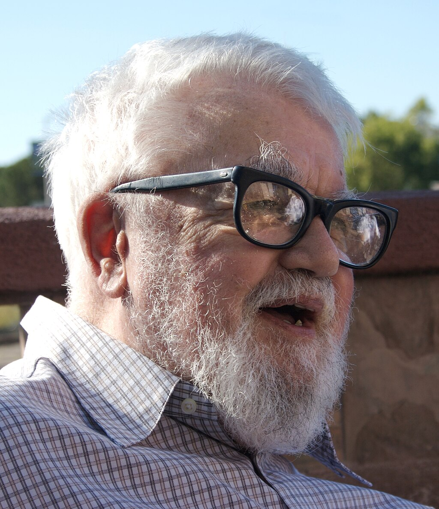
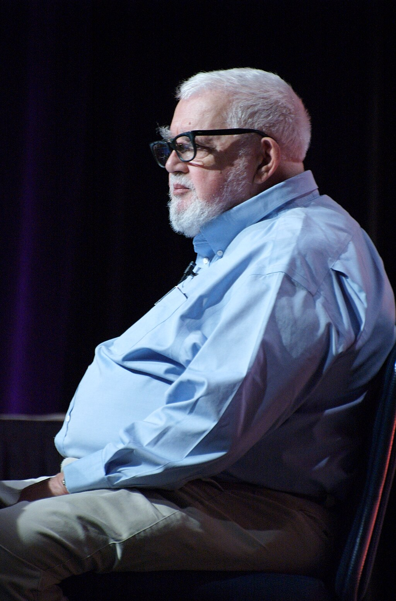

John McCarthy

McCarthy at a conference in 2006

Born

(1927-09-04)September 4, 1927

[Boston, Massachusetts](https://en.wikipedia.org/wiki/Boston,_Massachusetts "Boston, Massachusetts"), U.S.

Died

October 24, 2011(2011-10-24) (aged 84)

[Stanford, California](https://en.wikipedia.org/wiki/Stanford,_California "Stanford, California"), U.S.

Education

[California Institute of Technology](https://en.wikipedia.org/wiki/California_Institute_of_Technology "California Institute of Technology") ([BS](https://en.wikipedia.org/wiki/Bachelor_of_Science "Bachelor of Science"))
[Princeton University](https://en.wikipedia.org/wiki/Princeton_University "Princeton University") ([MS](https://en.wikipedia.org/wiki/Master_of_Science "Master of Science"), [PhD](https://en.wikipedia.org/wiki/Doctor_of_Philosophy "Doctor of Philosophy"))

Known for

[Artificial intelligence](/source/artificial-intelligence/ "Artificial intelligence"), [Lisp](/source/lisp-language/ "Lisp (programming language)"), [circumscription](https://en.wikipedia.org/wiki/Circumscription_\(logic\) "Circumscription (logic)"), [situation calculus](https://en.wikipedia.org/wiki/Situation_calculus "Situation calculus")

Spouse(s)

Martha Coyote
[Vera Watson](https://en.wikipedia.org/wiki/Vera_Watson "Vera Watson") (her death, 1978)
[Carolyn Talcott](https://en.wikipedia.org/wiki/Carolyn_Talcott "Carolyn Talcott")

Awards

[Turing Award](https://en.wikipedia.org/wiki/Turing_Award "Turing Award") (1971)
[Computer Pioneer Award](https://en.wikipedia.org/wiki/Computer_Pioneer_Award "Computer Pioneer Award") (1985)
[IJCAI Award for Research Excellence](https://en.wikipedia.org/wiki/IJCAI_Award_for_Research_Excellence "IJCAI Award for Research Excellence") (1985)
[Kyoto Prize](https://en.wikipedia.org/wiki/Kyoto_Prize "Kyoto Prize") (1988)
[National Medal of Science](https://en.wikipedia.org/wiki/National_Medal_of_Science "National Medal of Science") (1990)
[Benjamin Franklin Medal](https://en.wikipedia.org/wiki/Benjamin_Franklin_Medal_\(Franklin_Institute\) "Benjamin Franklin Medal (Franklin Institute)") (2003)

**Scientific career**

Fields

[Computer science](https://en.wikipedia.org/wiki/Computer_science "Computer science")

Institutions

[Stanford University](https://en.wikipedia.org/wiki/Stanford_University "Stanford University"), [Massachusetts Institute of Technology](https://en.wikipedia.org/wiki/Massachusetts_Institute_of_Technology "Massachusetts Institute of Technology"), [Dartmouth College](https://en.wikipedia.org/wiki/Dartmouth_College "Dartmouth College"), [Princeton University](https://en.wikipedia.org/wiki/Princeton_University "Princeton University")

[Doctoral advisor](https://en.wikipedia.org/wiki/Doctoral_advisor "Doctoral advisor")

[Donald C. Spencer](https://en.wikipedia.org/wiki/Donald_C._Spencer "Donald C. Spencer")

Doctoral students

[Ruzena Bajcsy](https://en.wikipedia.org/wiki/Ruzena_Bajcsy "Ruzena Bajcsy")
[Ramanathan V. Guha](https://en.wikipedia.org/wiki/Ramanathan_V._Guha "Ramanathan V. Guha")
[Barbara Liskov](https://en.wikipedia.org/wiki/Barbara_Liskov "Barbara Liskov")
[Hans Moravec](https://en.wikipedia.org/wiki/Hans_Moravec "Hans Moravec")
[Raj Reddy](https://en.wikipedia.org/wiki/Raj_Reddy "Raj Reddy")

**John McCarthy** (September 4, 1927 – October 24, 2011) was an American [computer scientist](https://en.wikipedia.org/wiki/Computer_scientist "Computer scientist") and [cognitive scientist](https://en.wikipedia.org/wiki/Cognitive_scientist "Cognitive scientist"). He was one of the founders of the discipline of [artificial intelligence](/source/artificial-intelligence/ "Artificial intelligence"), and part of just a small group of artificial intelligence researchers in the 1950s and 1960s. He co-authored the proposal for the [Dartmouth workshop](/source/dartmouth-workshop/ "Dartmouth workshop") which coined the term "artificial intelligence" (AI), led the development of the symbolic [programming language](https://en.wikipedia.org/wiki/Programming_language "Programming language") family [Lisp](/source/lisp-language/ "Lisp (programming language)") and had a large influence in the language [ALGOL](https://en.wikipedia.org/wiki/ALGOL "ALGOL"), popularized [time-sharing](https://en.wikipedia.org/wiki/Time-sharing "Time-sharing"), and created [garbage collection](https://en.wikipedia.org/wiki/Garbage_collection_\(computer_science\) "Garbage collection (computer science)").

McCarthy spent most of his career at [Stanford University](https://en.wikipedia.org/wiki/Stanford_University "Stanford University"). He received many accolades and honors, such as the 1971 [Turing Award](https://en.wikipedia.org/wiki/Turing_Award "Turing Award") for his contributions to the topic of AI, the United States [National Medal of Science](https://en.wikipedia.org/wiki/National_Medal_of_Science "National Medal of Science"), and the [Kyoto Prize](https://en.wikipedia.org/wiki/Kyoto_Prize "Kyoto Prize").

## Early life and education

John McCarthy was born in [Boston, Massachusetts](https://en.wikipedia.org/wiki/Boston,_Massachusetts "Boston, Massachusetts"), on September 4, 1927, to an [Irish](https://en.wikipedia.org/wiki/Irish_people "Irish people") immigrant father and a [Lithuanian Jewish](https://en.wikipedia.org/wiki/Lithuanian_Jewish "Lithuanian Jewish") immigrant mother, John Patrick and Ida (Glatt) McCarthy. The family was obliged to relocate frequently during the [Great Depression](https://en.wikipedia.org/wiki/Great_Depression "Great Depression"), until McCarthy's father found work as an organizer for the [Amalgamated Clothing Workers](https://en.wikipedia.org/wiki/Amalgamated_Clothing_Workers "Amalgamated Clothing Workers") in [Los Angeles, California](https://en.wikipedia.org/wiki/Los_Angeles,_California "Los Angeles, California"). His father came from [Cromane](https://en.wikipedia.org/wiki/Cromane "Cromane"), a small fishing village in [County Kerry](https://en.wikipedia.org/wiki/County_Kerry "County Kerry"), Ireland. His mother died in 1957.

Both parents were active members of the [Communist Party](https://en.wikipedia.org/wiki/Communist_Party_USA "Communist Party USA") during the 1930s, and they encouraged learning and critical thinking. Before he attended high school, McCarthy became interested in science by reading a translation of [_100,000 Whys_](https://en.wikipedia.org/wiki/One_Hundred_Thousand_Whys "One Hundred Thousand Whys"), a popular Russian science book for children. He was fluent in the [Russian language](https://en.wikipedia.org/wiki/Russian_language "Russian language") and made friends with Russian scientists during multiple trips to the [Soviet Union](https://en.wikipedia.org/wiki/Soviet_Union "Soviet Union"), but distanced himself after making visits to the [Soviet Bloc](https://en.wikipedia.org/wiki/Soviet_Bloc "Soviet Bloc"), which led to him becoming a [conservative](https://en.wikipedia.org/wiki/Conservatism_in_the_United_States "Conservatism in the United States") [Republican](https://en.wikipedia.org/wiki/Republican_Party_\(United_States\) "Republican Party (United States)").

McCarthy graduated from [Belmont High School](https://en.wikipedia.org/wiki/Belmont_High_School_\(Los_Angeles\) "Belmont High School (Los Angeles)") two years early and was accepted into Caltech in 1944.

He showed an early aptitude for [mathematics](https://en.wikipedia.org/wiki/Mathematics "Mathematics"); during his teens, he taught himself college math by studying the textbooks used at the nearby [California Institute of Technology](https://en.wikipedia.org/wiki/California_Institute_of_Technology "California Institute of Technology") (Caltech). As a result, he was able to skip the first two years of math at Caltech. He was suspended from Caltech for failure to attend [physical education](https://en.wikipedia.org/wiki/Physical_education "Physical education") courses. He then served in the [US Army](https://en.wikipedia.org/wiki/US_Army "US Army") and was readmitted, receiving a Bachelor of Science ([BS](https://en.wikipedia.org/wiki/Bachelor_of_Science "Bachelor of Science")) in [mathematics](https://en.wikipedia.org/wiki/Mathematics "Mathematics") in 1948.

It was at Caltech that he attended a lecture by [John von Neumann](https://en.wikipedia.org/wiki/John_von_Neumann "John von Neumann") that inspired his future endeavors.

McCarthy completed his graduate studies at Caltech before moving to [Princeton University](https://en.wikipedia.org/wiki/Princeton_University "Princeton University"), where he received a [PhD](https://en.wikipedia.org/wiki/PhD "PhD") in mathematics in 1951 with his dissertation "[Projection operators](https://en.wikipedia.org/wiki/Projection_\(linear_algebra\) "Projection (linear algebra)") and [partial differential equations](https://en.wikipedia.org/wiki/Partial_differential_equation "Partial differential equation")", under the supervision of [Donald C. Spencer](https://en.wikipedia.org/wiki/Donald_C._Spencer "Donald C. Spencer").

## Academic career

After short-term appointments at Princeton and [Stanford University](https://en.wikipedia.org/wiki/Stanford_University "Stanford University"), McCarthy became an assistant professor at [Dartmouth College](https://en.wikipedia.org/wiki/Dartmouth_College "Dartmouth College") in 1955.

A year later, he moved to [MIT](https://en.wikipedia.org/wiki/MIT "MIT") as a research [fellow](https://en.wikipedia.org/wiki/Fellow "Fellow") in the autumn of 1956. By the end of his years at Massachusetts Institute of Technology (MIT) he was already affectionately referred to as "Uncle John" by his students.

In 1962, he became a full [professor](https://en.wikipedia.org/wiki/Professor "Professor") at Stanford, where he remained until his retirement in 2000.

McCarthy championed mathematics such as [lambda calculus](https://en.wikipedia.org/wiki/Lambda_calculus "Lambda calculus") and [invented logics](https://en.wikipedia.org/wiki/Logic "Logic") for achieving [common sense](https://en.wikipedia.org/wiki/Commonsense_reasoning "Commonsense reasoning") in artificial intelligence.

## Contributions in computer science

McCarthy in 2008

John McCarthy is one of the "founding fathers" of artificial intelligence, together with [Alan Turing](https://en.wikipedia.org/wiki/Alan_Turing "Alan Turing"), [Marvin Minsky](https://en.wikipedia.org/wiki/Marvin_Minsky "Marvin Minsky"), [Allen Newell](https://en.wikipedia.org/wiki/Allen_Newell "Allen Newell"), and [Herbert A. Simon](https://en.wikipedia.org/wiki/Herbert_A._Simon "Herbert A. Simon"). McCarthy, Minsky, [Nathaniel Rochester](https://en.wikipedia.org/wiki/Nathaniel_Rochester_\(computer_scientist\) "Nathaniel Rochester (computer scientist)") and [Claude E. Shannon](https://en.wikipedia.org/wiki/Claude_E._Shannon "Claude E. Shannon") coined the term "artificial intelligence" in a proposal that they wrote for the famous [Dartmouth conference](/source/dartmouth-workshop/ "Dartmouth workshop") in Summer 1956. This conference started AI as a field. (Minsky later joined McCarthy at MIT in 1959.)

In 1958, he proposed the [advice taker](https://en.wikipedia.org/wiki/Advice_taker "Advice taker"), which inspired later work on question-answering and [logic programming](https://en.wikipedia.org/wiki/Logic_programming "Logic programming").

In the late 1950s, McCarthy discovered that [primitive recursive functions](https://en.wikipedia.org/wiki/Primitive_recursive_function "Primitive recursive function") could be extended to compute with symbolic expressions, producing the [Lisp programming language](/source/lisp-language/ "Lisp (programming language)"). That functional programming seminal paper also introduced the lambda notation borrowed from the syntax of [lambda calculus](https://en.wikipedia.org/wiki/Lambda_calculus "Lambda calculus") in which later dialects like [Scheme](https://en.wikipedia.org/wiki/Scheme_\(programming_language\) "Scheme (programming language)") based its semantics. Lisp soon became the programming language of choice for AI applications after its publication in 1960.

In 1958, McCarthy served on an [Association for Computing Machinery](https://en.wikipedia.org/wiki/Association_for_Computing_Machinery "Association for Computing Machinery") ad hoc committee on Languages that became part of the committee that designed [ALGOL 60](https://en.wikipedia.org/wiki/ALGOL_60 "ALGOL 60"). In August 1959 he proposed the use of recursion and conditional expressions, which became part of ALGOL. He then became involved with developing [international standards](https://en.wikipedia.org/wiki/International_standard "International standard") in programming and informatics, as a member of the [International Federation for Information Processing](https://en.wikipedia.org/wiki/International_Federation_for_Information_Processing "International Federation for Information Processing") (IFIP) [Working Group 2.1](https://en.wikipedia.org/wiki/IFIP_Working_Group_2.1 "IFIP Working Group 2.1") on Algorithmic Languages and Calculi, which [specified](https://en.wikipedia.org/wiki/Specification_\(technical_standard\) "Specification (technical standard)"), maintains, and supports ALGOL 60 and [ALGOL 68](https://en.wikipedia.org/wiki/ALGOL_68 "ALGOL 68").

Around 1959, he invented so-called "[garbage collection](https://en.wikipedia.org/wiki/Garbage_collection_\(computer_science\) "Garbage collection (computer science)")" methods, a kind of automatic [memory management](https://en.wikipedia.org/wiki/Memory_management "Memory management"), to solve problems in Lisp.

During his time at [MIT](https://en.wikipedia.org/wiki/MIT "MIT"), he helped motivate the creation of [Project MAC](https://en.wikipedia.org/wiki/Project_MAC "Project MAC"), and while at Stanford University, he helped establish the [Stanford AI Laboratory](https://en.wikipedia.org/wiki/Stanford_AI_Laboratory "Stanford AI Laboratory"), for many years a friendly rival to Project MAC.

McCarthy was instrumental in the creation of three of the very earliest [time-sharing systems](https://en.wikipedia.org/wiki/Time-sharing "Time-sharing") ([Compatible Time-Sharing System](https://en.wikipedia.org/wiki/Compatible_Time-Sharing_System "Compatible Time-Sharing System"), [BBN Time-Sharing System](https://en.wikipedia.org/wiki/BBN_Time-Sharing_System "BBN Time-Sharing System"), and [Dartmouth Time-Sharing System](https://en.wikipedia.org/wiki/Dartmouth_Time-Sharing_System "Dartmouth Time-Sharing System")). His colleague [Lester Earnest](https://en.wikipedia.org/wiki/Lester_Earnest "Lester Earnest") told the Los Angeles Times:

> The Internet would not have happened nearly as soon as it did except for the fact that John initiated the development of time-sharing systems. We keep inventing new names for time-sharing. It came to be called servers ... Now we call it cloud computing. That is still just time-sharing. John started it.

— Lester Earnest

In 1961, he was perhaps the first to suggest publicly the idea of [utility computing](https://en.wikipedia.org/wiki/Utility_computing "Utility computing"), in a speech given to celebrate MIT's centennial: that computer [time-sharing](https://en.wikipedia.org/wiki/Time-sharing "Time-sharing") technology might result in a future in which computing power and even specific applications could be sold through the [utility](https://en.wikipedia.org/wiki/Utility "Utility") business model (like [water](https://en.wikipedia.org/wiki/Water "Water") or [electricity](https://en.wikipedia.org/wiki/Electricity "Electricity")). This idea of a computer or information utility was very popular during the late 1960s, but had faded by the mid-1990s. However, since 2000, the idea has resurfaced in new forms (see [application service provider](https://en.wikipedia.org/wiki/Application_service_provider "Application service provider"), [grid computing](https://en.wikipedia.org/wiki/Grid_computing "Grid computing"), and [cloud computing](https://en.wikipedia.org/wiki/Cloud_computing "Cloud computing")).

In 1966, McCarthy and his team at Stanford wrote a computer program used to play a series of [chess](https://en.wikipedia.org/wiki/Chess "Chess") games with counterparts in the [Soviet Union](https://en.wikipedia.org/wiki/Soviet_Union "Soviet Union"); McCarthy's team lost two games and [drew](https://en.wikipedia.org/wiki/Draw_\(chess\) "Draw (chess)") two games (see [Kotok-McCarthy](https://en.wikipedia.org/wiki/Kotok-McCarthy "Kotok-McCarthy")).

From 1978 to 1986, McCarthy developed the [circumscription](https://en.wikipedia.org/wiki/Circumscription_\(logic\) "Circumscription (logic)") method of [non-monotonic reasoning](https://en.wikipedia.org/wiki/Non-monotonic_reasoning "Non-monotonic reasoning").

In 1982, he seems to have originated the idea of the [space fountain](https://en.wikipedia.org/wiki/Space_fountain "Space fountain"), a type of tower extending into space and kept vertical by the outward force of a stream of pellets propelled from Earth along a sort of conveyor belt which returns the pellets to Earth. Payloads would ride the conveyor belt upward.

## Other activities

McCarthy often commented on world affairs on the [Usenet](https://en.wikipedia.org/wiki/Usenet "Usenet") forums. Some of his ideas can be found in his sustainability Web page, which is "aimed at showing that human material progress is desirable and sustainable". McCarthy was an avid book reader, an optimist, and a staunch supporter of free speech. His best Usenet interaction is visible in rec.arts.books archives. He actively attended San Francisco (SF) Bay Area dinners in [Palo Alto](https://en.wikipedia.org/wiki/Palo_Alto "Palo Alto") of r.a.b. readers, called rab-fests. He went on to defend free speech criticism involving European ethnic jokes at Stanford.

McCarthy saw the importance of mathematics and mathematics education. His [Usenet](https://en.wikipedia.org/wiki/Usenet "Usenet") signature block ([.sig](https://en.wikipedia.org/wiki/.sig ".sig")) for years was, "He who refuses to do arithmetic is doomed to talk nonsense"; his license plate cover read, similarly, "Do the arithmetic or be doomed to talk nonsense." He advised 30 PhD graduates.

His 2001 short story "The Robot and the Baby" farcically explored the question of whether robots should have (or simulate having) emotions, and anticipated aspects of Internet culture and [social networking](https://en.wikipedia.org/wiki/Social_networking "Social networking") that became increasingly prominent during ensuing decades.

## Personal life

McCarthy was married three times. His second wife was [Vera Watson](https://en.wikipedia.org/wiki/Vera_Watson "Vera Watson"), a programmer and [mountaineer](https://en.wikipedia.org/wiki/Mountaineering "Mountaineering") who died in 1978 attempting to scale [Annapurna I Central](https://en.wikipedia.org/wiki/Annapurna_I_Central "Annapurna I Central") as part of an [all-women expedition](https://en.wikipedia.org/wiki/American_Women's_Himalayan_Expedition "American Women's Himalayan Expedition"). He later married [Carolyn Talcott](https://en.wikipedia.org/wiki/Carolyn_Talcott "Carolyn Talcott"), a computer scientist at Stanford and later Scientific Research Institute [(SRI) International](https://en.wikipedia.org/wiki/SRI_International "SRI International").

McCarthy declared himself an atheist in a speech about artificial intelligence at [Stanford Memorial Church](https://en.wikipedia.org/wiki/Stanford_Memorial_Church "Stanford Memorial Church"). Raised as a [Communist](https://en.wikipedia.org/wiki/Communism "Communism"), he became a conservative [Republican](https://en.wikipedia.org/wiki/Republican_Party_\(United_States\) "Republican Party (United States)") after a visit to [Czechoslovakia](https://en.wikipedia.org/wiki/Czechoslovakia "Czechoslovakia") in 1968 after the [Soviet invasion](https://en.wikipedia.org/wiki/Soviet_invasion_of_Czechoslovakia "Soviet invasion of Czechoslovakia"). He died at his home in Stanford on October 24, 2011.

## Philosophy of artificial intelligence

In 1979 McCarthy wrote an article entitled "Ascribing Mental Qualities to Machines". In it he wrote, "Machines as simple as [thermostats](https://en.wikipedia.org/wiki/Thermostat "Thermostat") can be said to have beliefs, and having beliefs seems to be a characteristic of most machines capable of problem-solving performance." In 1980 the philosopher [John Searle](https://en.wikipedia.org/wiki/John_Searle "John Searle") responded with his famous [Chinese Room](https://en.wikipedia.org/wiki/Chinese_Room "Chinese Room") Argument, disagreeing with McCarthy and taking the stance that machines cannot have beliefs simply because they are not conscious. Searle argues that machines lack [intentionality](https://en.wikipedia.org/wiki/Intentionality "Intentionality").

In a 1989 television interview with Jeffrey Mishlove for [ThinkingAllowedTV](https://en.wikipedia.org/wiki/Thinking_Allowed "Thinking Allowed"), McCarthy was asked about intuition being a philosophically differentiating character between humans and computers. He responded by saying that there are people who believe humans have some spiritual or transcendent [intuition](https://en.wikipedia.org/wiki/Intuition "Intuition") that is not physically accessible, but that view has been in a steady decline for a few centuries. McCarthy thought that realizing human consciousness in machines presented many difficult challenges, but he expected to overcome them.

John McCarthy was an [artificial intelligence](/source/artificial-intelligence/ "Artificial intelligence") optimist. He was specifically confident in [logic-based artificial intelligence](https://en.wikipedia.org/wiki/Logic-based_artificial_intelligence "Logic-based artificial intelligence") and the philosophy that every aspect of human intelligence could be formalized precisely enough that it could be programmed into a machine. [Hubert Dreyfus](https://en.wikipedia.org/wiki/Hubert_Dreyfus "Hubert Dreyfus") was a philosophy professor at [Berkeley University](https://en.wikipedia.org/wiki/University_of_California,_Berkeley "University of California, Berkeley") and perhaps the most famous skeptic of early artificial intelligence. Dreyfus fundamentally disagreed with McCarthy, and viewed human reasoning as something more than just [logic](https://en.wikipedia.org/wiki/Logic "Logic"). Instead, he saw looking into human understanding as going deeper into understanding existential questions about the good life and [nihilism](https://en.wikipedia.org/wiki/Nihilism "Nihilism"). They debated their entire professional careers, with McCarthy remaining outwardly optimistic about logic-based artificial intelligence.

## Awards and honors

*   [Turing Award](https://en.wikipedia.org/wiki/Turing_Award "Turing Award") from the [Association for Computing Machinery](https://en.wikipedia.org/wiki/Association_for_Computing_Machinery "Association for Computing Machinery") (1971)
*   [Kyoto Prize](https://en.wikipedia.org/wiki/Kyoto_Prize "Kyoto Prize") (1988)
*   [National Medal of Science](https://en.wikipedia.org/wiki/National_Medal_of_Science "National Medal of Science") (US) in Mathematical, Statistical, and Computational Sciences (1990)
*   Inducted as a Fellow of the [Computer History Museum](https://en.wikipedia.org/wiki/Computer_History_Museum "Computer History Museum") "for his co-founding of the fields of Artificial Intelligence (AI) and timesharing systems, and for major contributions to mathematics and computer science" (1999)
*   [Benjamin Franklin Medal](https://en.wikipedia.org/wiki/Benjamin_Franklin_Medal_\(Franklin_Institute\) "Benjamin Franklin Medal (Franklin Institute)") in Computer and Cognitive Science from the [Franklin Institute](https://en.wikipedia.org/wiki/Franklin_Institute "Franklin Institute") (2003)
*   Inducted into [IEEE Intelligent Systems](https://en.wikipedia.org/wiki/IEEE_Intelligent_Systems "IEEE Intelligent Systems")' AI's Hall of Fame (2011), for the "significant contributions to the field of AI and intelligent systems"
*   Named as one of the 2012 [Stanford](https://en.wikipedia.org/wiki/Stanford_University "Stanford University") Engineering Heroes

## Major publications

*   McCarthy, J. 1959. ["Programs with Common Sense"](https://web.archive.org/web/20131004215444/http://www-formal.stanford.edu/jmc/mcc59.html) at the [Wayback Machine](https://en.wikipedia.org/wiki/Wayback_Machine "Wayback Machine")(archived October 4, 2013). In _Proceedings of the Teddington Conference on the Mechanisation of Thought Processes_, 756–91. London: Her Majesty's Stationery Office.
*   McCarthy, J. 1960. ["Recursive functions of symbolic expressions and their computation by machine"](https://web.archive.org/web/20131004215327/http://www-formal.stanford.edu/jmc/recursive.html) at the [Wayback Machine](https://en.wikipedia.org/wiki/Wayback_Machine "Wayback Machine")(archived October 4, 2013). _Communications of the ACM_ 3(4):184-195.
*   McCarthy, J. 1963a "A basis for a mathematical theory of computation". In _Computer Programming and formal systems_. North-Holland.
*   McCarthy, J. 1963b. Situations, actions, and causal laws. Technical report, Stanford University.
*   McCarthy, J., and Hayes, P. J. 1969. [Some philosophical problems from the standpoint of artificial intelligence](https://web.archive.org/web/20130825025836/http://www-formal.stanford.edu/jmc/mcchay69.pdf) at the [Wayback Machine](https://en.wikipedia.org/wiki/Wayback_Machine "Wayback Machine")(archived August 25, 2013). In Meltzer, B., and Michie, D., eds., _Machine Intelligence_ 4. Edinburgh: Edinburgh University Press. 463–502.
*   McCarthy, J. 1977. "Epistemological problems of artificial intelligence". In _[IJCAI](https://en.wikipedia.org/wiki/IJCAI "IJCAI")_, 1038–1044.
*   McCarthy, J (1980). "Circumscription: A form of non-monotonic reasoning". _[Artificial Intelligence](https://en.wikipedia.org/wiki/Artificial_Intelligence_\(journal\) "Artificial Intelligence (journal)")_. **13** (1–2): 23–79\. [doi](https://en.wikipedia.org/wiki/Doi_\(identifier\) "Doi (identifier)"):[10.1016/0004-3702(80)90011-9](https://doi.org/10.1016%2F0004-3702%2880%2990011-9).
*   McCarthy, J (1986). "Applications of circumscription to common sense reasoning". _Artificial Intelligence_. **28** (1): 89–116\. [CiteSeerX](https://en.wikipedia.org/wiki/CiteSeerX_\(identifier\) "CiteSeerX (identifier)") [10.1.1.29.5268](https://citeseerx.ist.psu.edu/viewdoc/summary?doi=10.1.1.29.5268). [doi](https://en.wikipedia.org/wiki/Doi_\(identifier\) "Doi (identifier)"):[10.1016/0004-3702(86)90032-9](https://doi.org/10.1016%2F0004-3702%2886%2990032-9).
*   McCarthy, J. 1990. "Generality in artificial intelligence". In Lifschitz, V., ed., _Formalizing Common Sense_. Ablex. 226–236.
*   McCarthy, J. 1993. "Notes on formalizing context". In _IJCAI_, 555–562.
*   McCarthy, J., and Buvac, S. 1997. "Formalizing context: Expanded notes". In Aliseda, A.; van Glabbeek, R.; and Westerstahl, D., eds., _Computing Natural Language_. Stanford University. Also available as Stanford Technical Note STAN-CS-TN-94-13.
*   McCarthy, J. 1998. "Elaboration tolerance". In _Working Papers of the Fourth International Symposium on Logical formalizations of Commonsense Reasoning_, Commonsense-1998.
*   Costello, T., and McCarthy, J. 1999. "Useful counterfactuals". _[Electronic Transactions on Artificial Intelligence](https://en.wikipedia.org/wiki/Electronic_Transactions_on_Artificial_Intelligence "Electronic Transactions on Artificial Intelligence")_ 3(A):51-76
*   McCarthy, J. 2002. "Actions and other events in situation calculus". In Fensel, D.; Giunchiglia, F.; McGuinness, D.; and Williams, M., eds., _Proceedings of KR-2002_, 615–628.
