Kharosthi

𐨑𐨪𐨆𐨮𐨿𐨛𐨁𐨌

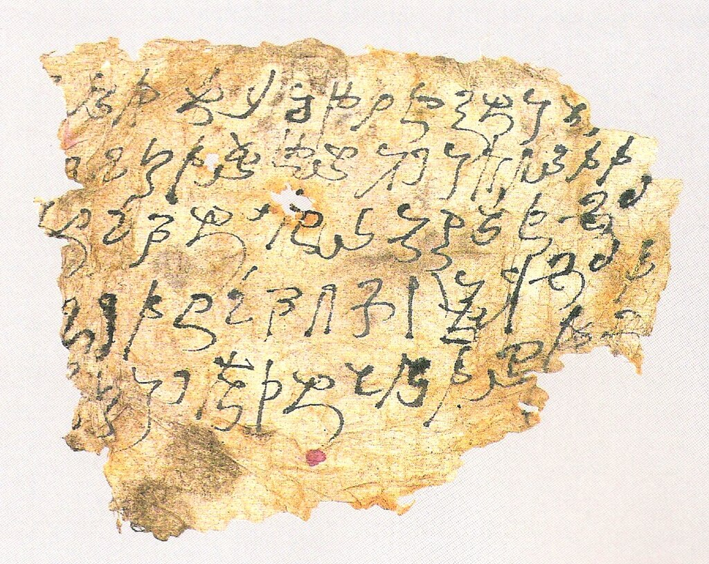

Script type

[Abugida](https://en.wikipedia.org/wiki/Abugida "Abugida")

Period

4th century BCE – 3rd century CE

Direction

[Right-to-left script](https://en.wikipedia.org/wiki/Right-to-left_script "Right-to-left script") 

Languages

*   [Gandhari Prakrit](https://en.wikipedia.org/wiki/Gāndhārī_language "Gāndhārī language")
*   [Pali](https://en.wikipedia.org/wiki/Pali "Pali")
*   [Saka](https://en.wikipedia.org/wiki/Saka_language "Saka language")
*   [Sanskrit](/source/sanskrit/ "Sanskrit")

Related scripts

Parent systems

[Egyptian hieroglyphs](https://en.wikipedia.org/wiki/Egyptian_hieroglyphs "Egyptian hieroglyphs")

*   [Proto-Sinaitic script](/source/proto-sinaitic-script/ "Proto-Sinaitic script")
    *   [Phoenician alphabet](https://en.wikipedia.org/wiki/Phoenician_alphabet "Phoenician alphabet")
        *   [Aramaic alphabet](https://en.wikipedia.org/wiki/Aramaic_alphabet "Aramaic alphabet")
            *   Kharosthi

Sister systems

*   [Nabataean alphabet](https://en.wikipedia.org/wiki/Nabataean_alphabet "Nabataean alphabet")
*   [Brahmi script](https://en.wikipedia.org/wiki/Brahmi_script "Brahmi script")
*   [Syriac alphabet](https://en.wikipedia.org/wiki/Syriac_alphabet "Syriac alphabet")
*   [Palmyrene alphabet](https://en.wikipedia.org/wiki/Palmyrene_alphabet "Palmyrene alphabet")
*   [Mandaic alphabet](https://en.wikipedia.org/wiki/Mandaic_alphabet "Mandaic alphabet")
*   [Pahlavi scripts](https://en.wikipedia.org/wiki/Pahlavi_scripts "Pahlavi scripts")
*   [Sogdian alphabet](https://en.wikipedia.org/wiki/Sogdian_alphabet "Sogdian alphabet")

ISO 15924

[ISO 15924](https://en.wikipedia.org/wiki/ISO_15924 "ISO 15924")

Khar (305), ​Kharoshthi

[Unicode](https://en.wikipedia.org/wiki/Unicode "Unicode")

Unicode alias

Kharoshthi

[Unicode range](https://en.wikipedia.org/wiki/Unicode_range "Unicode range")

[U+10A00–U+10A5F](http://unicode.org/charts/PDF/U10A00.pdf)

**Kharosthi script** ([Gāndhārī](https://en.wikipedia.org/wiki/Gāndhārī_language "Gāndhārī language"): 𐨑𐨪𐨆𐨮𐨿𐨛𐨁𐨌 𐨫𐨁𐨤𐨁, romanized: _kharoṣṭhī lipi_), also known as the **Gandhari script** (𐨒𐨌𐨣𐨿𐨢𐨌𐨪𐨁𐨌 𐨫𐨁𐨤𐨁, _gāndhārī lipi_), was an ancient Indic script originally developed in the [Gandhara Region](/source/gandhara/ "Gandhara") of the north-western [Indian subcontinent](https://en.wikipedia.org/wiki/Indian_subcontinent "Indian subcontinent"), between the 5th and 3rd century BCE. Primarily used by the people of [Gandhara](/source/gandhara/ "Gandhara") in various parts of [South Asia](https://en.wikipedia.org/wiki/South_Asia "South Asia") and [Central Asia](https://en.wikipedia.org/wiki/Central_Asia "Central Asia"), Kharosthi remained in use until it died out in its homeland around the 5th century CE. It was also in use in [Bactria](https://en.wikipedia.org/wiki/Bactria "Bactria"), the [Kushan Empire](https://en.wikipedia.org/wiki/Kushan_Empire "Kushan Empire"), [Sogdia](https://en.wikipedia.org/wiki/Sogdia "Sogdia"), and along the [Silk Road](https://en.wikipedia.org/wiki/Silk_Road "Silk Road"). There is some evidence it may have survived until the [7th century](https://en.wikipedia.org/wiki/7th_century "7th century") in [Khotan](https://en.wikipedia.org/wiki/Khotan "Khotan") and [Niya](https://en.wikipedia.org/wiki/Niya_\(Tarim_Basin\) "Niya (Tarim Basin)"), both cities in [Tarim Basin](https://en.wikipedia.org/wiki/Tarim_Basin "Tarim Basin").

## History

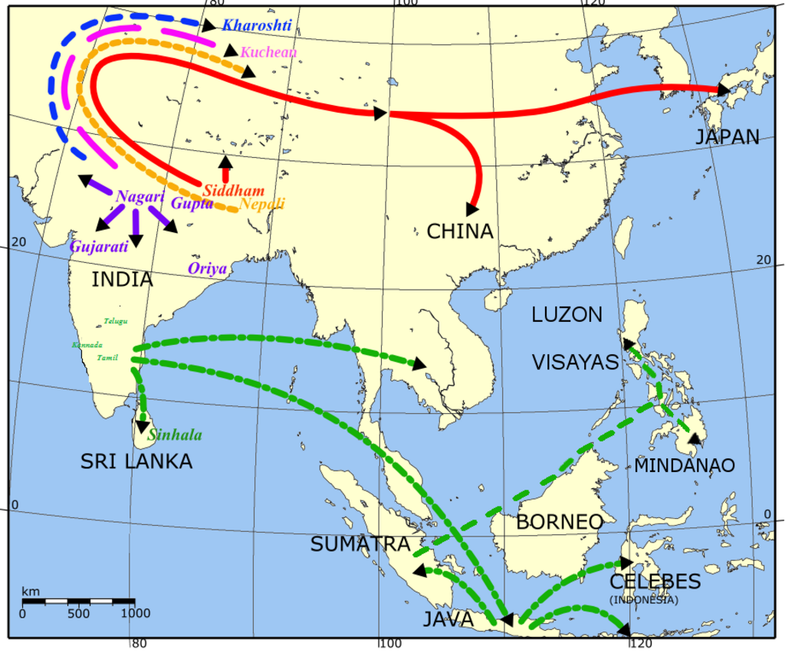Routes of ancient scripts of the subcontinent traveling to other parts of Asia (Kharosthi shown in blue)

The name Kharosthi may derive from the Hebrew _kharosheth_, a Semitic word for writing, or from [Old Iranian](https://en.wikipedia.org/wiki/Old_Iranian "Old Iranian") \*_xšaθra-pištra_, which means "royal writing". The script was earlier also known as _Indo-Bactrian script_, _Kabul script_ and _Arian-Pali_.

Scholars are not in agreement as to whether the Kharosthi script evolved gradually, or was the deliberate work of a single inventor. An analysis of the script forms shows a clear dependency on the [Aramaic alphabet](https://en.wikipedia.org/wiki/Aramaic_alphabet "Aramaic alphabet") but with extensive modifications. Kharosthi seems to be derived from a form of Aramaic, which was used in administrative work during the reign of [Darius the Great](https://en.wikipedia.org/wiki/Darius_the_Great "Darius the Great") (in contrast with the monumental [Old Persian](https://en.wikipedia.org/wiki/Old_Persian "Old Persian") [cuneiform](https://en.wikipedia.org/wiki/Cuneiform "Cuneiform") used for public inscriptions). One theory suggests that the Aramaic script arrived with the [Achaemenid conquest of the Indus Valley](https://en.wikipedia.org/wiki/Achaemenid_conquest_of_the_Indus_Valley "Achaemenid conquest of the Indus Valley") in 500 BCE and evolved over the next 200+ years to reach its final form by the 3rd century BCE where it appears in some of the Edicts of Ashoka. However, no intermediate forms have yet been found to confirm this evolutionary model, and rock and coin inscriptions from the 3rd century BCE onward show a unified and standard form. An inscription in Aramaic dating back to the 4th century BCE was found in [Sirkap](https://en.wikipedia.org/wiki/Sirkap "Sirkap"), testifying to the presence of the Aramaic script in present-day Pakistan. According to [Sir John Marshall](https://en.wikipedia.org/wiki/John_Marshall_\(archaeologist\) "John Marshall (archaeologist)"), this seems to confirm that Kharoshthi was later developed from Aramaic.

While the Brahmi script remained in use for centuries, Kharosthi seems to have been abandoned after the 2nd–3rd century AD. Because of the substantial differences between the Semitic-derived Kharosthi script and its successors, knowledge of Kharosthi may have declined rapidly once the script was supplanted by Brahmi-derived scripts, until its re-discovery by Western scholars in the 19th century.

The Kharosthi script was deciphered separately almost concomitantly by [James Prinsep](https://en.wikipedia.org/wiki/James_Prinsep "James Prinsep") (in 1835, published in the _Journal of the Asiatic society of Bengal_, India) and by [Carl Ludwig Grotefend](https://en.wikipedia.org/wiki/Carl_Ludwig_Grotefend "Carl Ludwig Grotefend") (in 1836, published in _Blätter für Münzkunde_, Germany), with Grotefend "evidently not aware" of Prinsep's article, followed by [Christian Lassen](https://en.wikipedia.org/wiki/Christian_Lassen "Christian Lassen") (1838). They all used the bilingual coins of the [Indo-Greek Kingdom](https://en.wikipedia.org/wiki/Indo-Greek_Kingdom "Indo-Greek Kingdom") (obverse in Greek, reverse in [Pali](https://en.wikipedia.org/wiki/Pali "Pali"), using the Kharosthi script). This in turn led to the reading of the [Edicts of Ashoka](/source/edicts-of-ashoka/ "Edicts of Ashoka"), some of which were written in the Kharosthi script (the [Major Rock Edicts](https://en.wikipedia.org/wiki/Major_Rock_Edicts "Major Rock Edicts") at [Mansehra](https://en.wikipedia.org/wiki/Mansehra "Mansehra") and [Shahbazgarhi](https://en.wikipedia.org/wiki/Shahbazgarhi "Shahbazgarhi")).

The study of the Kharosthi script was recently invigorated by the discovery of the [Gandhāran Buddhist texts](https://en.wikipedia.org/wiki/Gandhāran_Buddhist_texts "Gandhāran Buddhist texts"), a set of [birch bark manuscripts](https://en.wikipedia.org/wiki/Birch_bark_manuscript "Birch bark manuscript") written in Kharosthi, discovered near the Afghan city of [Hadda](https://en.wikipedia.org/wiki/Hadda,_Afghanistan "Hadda, Afghanistan") just west of the [Khyber Pass](https://en.wikipedia.org/wiki/Khyber_Pass "Khyber Pass") in [Pakistan](https://en.wikipedia.org/wiki/Pakistan "Pakistan"). The manuscripts were donated to the [British Library](https://en.wikipedia.org/wiki/British_Library "British Library") in 1994. The entire set of British Library manuscripts are dated to the 1st century CE, although other collections from different institutions contain Kharosthi manuscripts from 1st century BCE to 3rd century CE, making them the oldest Buddhist manuscripts yet discovered.

## Alphabet

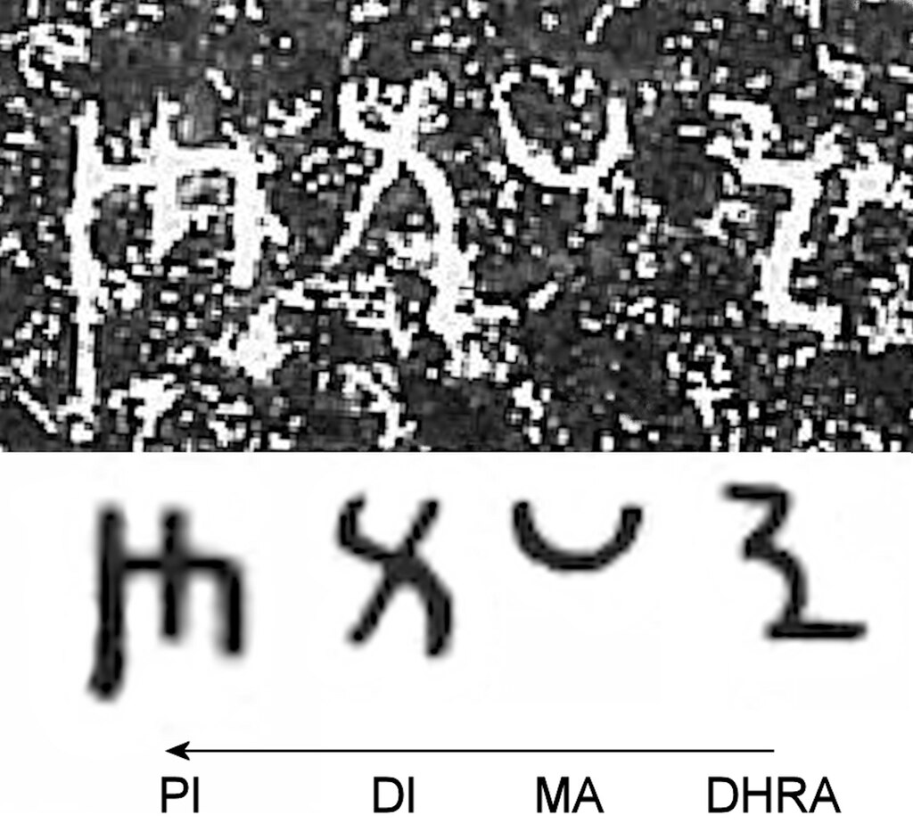The words _inscription of the [dharma](https://en.wikipedia.org/wiki/Dharma "Dharma")_ ([Prakrit](https://en.wikipedia.org/wiki/Prakrit "Prakrit"): 𐨢𐨌𐨨𐨡𐨁𐨤𐨁, romanized: _dhrāma dipu_) in Edict No. 1 of the [Major Rock Edict](https://en.wikipedia.org/wiki/Major_Rock_Edict "Major Rock Edict") of [Ashoka](https://en.wikipedia.org/wiki/Ashoka "Ashoka") (circa 250 BCE).

Kharosthi is mostly written right to left. Some variations in both the number and order of syllables occur in extant texts.

The Kharosthi alphabet is also known as the arapacana alphabet, and follows the order.

: a ra pa ca na : la da ba ḍa ṣa : va ta ya ṣṭa : ka sa ma ga stha : ja śva dha śa kha : kṣa sta jñā rtha (or ha) : bha cha sma hva tsa : gha ṭha ṇa pha ska : ysa śca ṭa ḍha

This alphabet was used in [Gandharan Buddhism](https://en.wikipedia.org/wiki/Gandharan_Buddhism "Gandharan Buddhism") as a mnemonic for the [Pañcaviṃśatisāhasrikā Prajñāpāramitā Sūtra](https://en.wikipedia.org/wiki/Large_Prajñāpāramitā_Sūtras#Pañcaviṃśatisāhasrikā_Prajñāpāramitā_Sūtra "Large Prajñāpāramitā Sūtras"), a series of verses on the nature of phenomena; this is analogous to the [Shiva Sutras](https://en.wikipedia.org/wiki/Shiva_Sutras "Shiva Sutras") of Brahmic scripts. In modern Himalayan and East Asian Buddhism, the first line _arapacana_ is preserved in the [mantra](https://en.wikipedia.org/wiki/Mantra "Mantra") of [Manjushri](https://en.wikipedia.org/wiki/Manjushri "Manjushri"), the Bodhisattva of transcendent wisdom.

### Consonants

[Unvoiced](https://en.wikipedia.org/wiki/Unvoiced_consonant "Unvoiced consonant")[Voiced](https://en.wikipedia.org/wiki/Voiced_consonant "Voiced consonant")[Nasal](https://en.wikipedia.org/wiki/Nasal_consonant "Nasal consonant")[Semivowel](https://en.wikipedia.org/wiki/Semivowel "Semivowel")[Sibilant](https://en.wikipedia.org/wiki/Sibilant "Sibilant")[Fricative](https://en.wikipedia.org/wiki/Fricative_consonant "Fricative consonant")

Unaspirated[Aspirated](https://en.wikipedia.org/wiki/Aspirated_consonant "Aspirated consonant")UnaspiratedAspirated

[Velar](https://en.wikipedia.org/wiki/Velar_consonant "Velar consonant")

𐨐

k

IPA: /[k](https://en.wikipedia.org/wiki/Voiceless_velar_plosive "Voiceless velar plosive")/

𐨑

kh

𐨒

g

IPA: /[ɡ](https://en.wikipedia.org/wiki/Voiced_velar_plosive "Voiced velar plosive")/

𐨓

gh

𐨱

h

IPA: /[h](https://en.wikipedia.org/wiki/Voiceless_glottal_fricative "Voiceless glottal fricative")/

[Palatal](https://en.wikipedia.org/wiki/Palatal_consonant "Palatal consonant")

𐨕

c

IPA: /[c](https://en.wikipedia.org/wiki/Voiceless_palatal_plosive "Voiceless palatal plosive")/

𐨖

ch

𐨗

j

IPA: /[ɟ](https://en.wikipedia.org/wiki/Voiced_palatal_plosive "Voiced palatal plosive")/

𐨙

ñ

IPA: /[ɲ](https://en.wikipedia.org/wiki/Voiced_palatal_nasal "Voiced palatal nasal")/

𐨩

y

IPA: /[j](https://en.wikipedia.org/wiki/Voiced_palatal_approximant "Voiced palatal approximant")/

𐨭

ś

IPA: /[ɕ](https://en.wikipedia.org/wiki/Voiceless_alveolo-palatal_fricative "Voiceless alveolo-palatal fricative")/

[Retroflex](https://en.wikipedia.org/wiki/Retroflex_consonant "Retroflex consonant")

𐨚

ṭ

IPA: /[ʈ](https://en.wikipedia.org/wiki/Voiceless_retroflex_plosive "Voiceless retroflex plosive")/

𐨛

ṭh

𐨜

ḍ

IPA: /[ɖ](https://en.wikipedia.org/wiki/Voiced_retroflex_plosive "Voiced retroflex plosive")/

𐨝

ḍh

𐨞

ṇ

IPA: /[ɳ](https://en.wikipedia.org/wiki/Voiced_retroflex_nasal "Voiced retroflex nasal")/

𐨪

r

IPA: /[r](https://en.wikipedia.org/wiki/Voiced_alveolar_trill "Voiced alveolar trill")/

𐨮

ṣ

IPA: /[ʂ](https://en.wikipedia.org/wiki/Voiceless_retroflex_fricative "Voiceless retroflex fricative")/

[Dental](https://en.wikipedia.org/wiki/Dental_consonant "Dental consonant")

𐨟

t

IPA: /[t](https://en.wikipedia.org/wiki/Voiceless_alveolar_plosive "Voiceless alveolar plosive")/

𐨠

th

𐨡

d

IPA: /[d](https://en.wikipedia.org/wiki/Voiced_alveolar_plosive "Voiced alveolar plosive")/

𐨢

dh

𐨣

n

IPA: /[n](https://en.wikipedia.org/wiki/Voiced_alveolar_nasal "Voiced alveolar nasal")/

𐨫

l

𐨯

s

𐨰

z

[Labial](https://en.wikipedia.org/wiki/Labial_consonant "Labial consonant")

𐨤

p

IPA: /[p](https://en.wikipedia.org/wiki/Voiceless_bilabial_plosive "Voiceless bilabial plosive")/

𐨥

ph

𐨦

b

IPA: /[b](https://en.wikipedia.org/wiki/Voiced_bilabial_plosive "Voiced bilabial plosive")/

𐨧

bh

𐨨

m

IPA: /[m](https://en.wikipedia.org/wiki/Voiced_bilabial_nasal "Voiced bilabial nasal")/

𐨬

v

Other

𐨲

ḱ

𐨳

ṭ́h

A bar above a consonant ⟨𐨸⟩ can be used to indicate various modified pronunciations depending on the consonant, such as nasalization or aspiration. It is used with k, ṣ, g, c, j, n, m, ś, ṣ, s, and h.

The _cauda_ ⟨𐨹⟩ changes how consonants are pronounced in various ways, particularly [fricativization](https://en.wikipedia.org/wiki/Fricative_consonant "Fricative consonant"). It is used with g, j, ḍ, t, d, p, y, v, ś, and s.

The dot below ⟨𐨺⟩ is used with m and h, but its precise phonetic function is unknown.

### Vowels and syllables

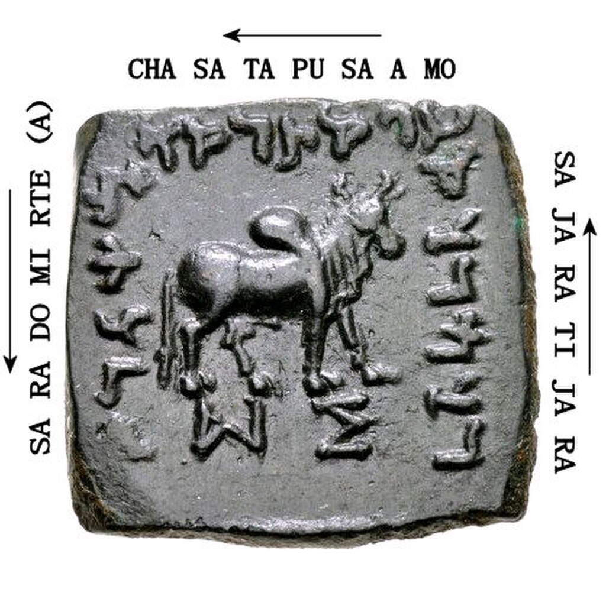Kharoshthi on a coin of [Indo-Greek](https://en.wikipedia.org/wiki/Indo-Greek "Indo-Greek") king [Artemidoros Aniketos](https://en.wikipedia.org/wiki/Artemidoros_Aniketos "Artemidoros Aniketos"), reading _[Maues](https://en.wikipedia.org/wiki/Maues "Maues"), King of kings and son of [Artemidorus](https://en.wikipedia.org/wiki/Artemidoros_Aniketos "Artemidoros Aniketos")_, ([Gāndhārī](https://en.wikipedia.org/wiki/Gāndhārī_language "Gāndhārī language"): 𐨪𐨗𐨟𐨁𐨪𐨗𐨯𐨨𐨆𐨀𐨯𐨤𐨂𐨟𐨯𐨕𐨪𐨿𐨟𐨅𐨨𐨁𐨡𐨆𐨪𐨯, romanized: _Rajatirajasa Moasa putasa cha Artemidorasa_).

Kharosthi includes only one standalone vowel character, which is used for initial vowels in words. Other initial vowels use the _a_ character modified by diacritics. Each syllable includes the short /a/ sound by default, with other vowels being indicated by diacritic marks.

Long vowels are marked with the diacritic ⟨𐨌⟩. An [anusvara](https://en.wikipedia.org/wiki/Anusvara "Anusvara") ⟨𐨎⟩ indicates [nasalization](https://en.wikipedia.org/wiki/Nasalization "Nasalization") of the vowel or a nasal segment following the vowel. A [visarga](https://en.wikipedia.org/wiki/Visarga "Visarga") ⟨𐨏⟩ indicates the unvoiced syllable-final /h/. It can also be used as a vowel length marker. A further diacritic, the _double ring below_ ⟨𐨍⟩ appears with vowels -a and -u in some Central Asian documents, but its precise phonetic function is unknown.

Salomon has established that the vowel order is /a e i o u/, akin to Semitic scripts, rather than the usual vowel order for Indic scripts /a i u e o/.

Vowels

VowelsOther syllable
diacritics

diacritics

◌

◌𐨅

◌𐨁

◌𐨆

◌𐨂

◌𐨃

𐨎

𐨏

short vowels

𐨀

IPA: /ə/

a

𐨀𐨅

IPA: /e/

e

𐨀𐨁

IPA: /i/

i

𐨀𐨆

IPA: /o/

o

𐨀𐨂

IPA: /u/

u

𐨀𐨃

IPA: /r̩/

r̥

𐨀𐨎

aṃ

𐨀𐨏

aḥ

long vowels

𐨀𐨌

IPA: /aː/

ā

𐨀𐨅𐨌

IPA: /ɐi̯/

ai

𐨀𐨁𐨌

IPA: /iː/

ī

𐨀𐨆𐨌

IPA: /ɐu̯/

au

𐨀𐨂𐨌

IPA: /uː/

ū

𐨀𐨃𐨌

IPA: /r̩ː/

r̥̄

𐨀𐨌𐨎

āṃ

𐨀𐨌𐨏

āḥ

examples with ⟨𐨤⟩

𐨤

pa

𐨤𐨅

pe

𐨤𐨁

pi

𐨤𐨆

po

𐨤𐨂

pu

𐨤𐨃

pr̥

𐨤𐨎

paṃ

𐨤𐨏

paḥ

examples with ⟨𐨨⟩

𐨨

ma

𐨨𐨅

me

𐨨𐨁

mi

𐨨𐨆

mo

𐨨𐨂

mu

𐨨𐨃

mr̥

𐨨𐨎

maṃ

𐨨𐨏

maḥ

## Additional marks

Various additional marks are used to modify vowels and consonants:

MarkTrans.ExampleDescription

𐨌

◌̄

𐨨 + 𐨌 → ‎𐨨𐨌

The vowel _length mark_ may be used with -a, -i, -u, and -r̥ to indicate the equivalent long vowel (-ā, -ī, -ū, and r̥̄ respectively). When used with -e it indicates the diphthong -ai. When used with -o it indicates the diphthong -au.

𐨍

◌͚

𐨯 + 𐨍 → ‎𐨯𐨍

The vowel modifier _double ring below_ appears in some Central Asian documents with vowels -a and -u. Its precise phonetic function is unknown.

𐨎

ṃ

𐨀 + 𐨎 → ‎𐨀𐨎

An [anusvara](https://en.wikipedia.org/wiki/Anusvara "Anusvara") indicates nasalization of the vowel or a nasal segment following the vowel. It can be used with -a, -i, -u, -r̥, -e, and -o.

𐨏

ḥ

𐨐 + 𐨏 → ‎𐨐𐨏

A [visarga](https://en.wikipedia.org/wiki/Visarga "Visarga") indicates the unvoiced syllable-final /h/. It can also be used as a vowel length marker. Visarga is used with -a, -i, -u, -r̥, -e, and -o.

𐨸

◌̄

𐨗 + 𐨸 → ‎𐨗𐨸

A _bar above_ a consonant can be used to indicate various modified pronunciations depending on the consonant, such as nasalization or aspiration. It is used with k, ṣ, g, c, j, n, m, ś, ṣ, s, and h.

𐨹

◌́ or ◌̱

𐨒 + 𐨹 → ‎𐨒𐨹

The _cauda_ changes how consonants are pronounced in various ways, particularly [fricativization](https://en.wikipedia.org/wiki/Fricative_consonant "Fricative consonant"). It is used with g, j, ḍ, t, d, p, y, v, ś, and s.

𐨺

◌̣

𐨨 + 𐨺 → ‎𐨨𐨺

The precise phonetic function of the _dot below_ is unknown. It is used with m and h.

𐨿

(n/a)

A [virama](https://en.wikipedia.org/wiki/Virama "Virama") is used to suppress the [inherent vowel](https://en.wikipedia.org/wiki/Inherent_vowel "Inherent vowel") that otherwise occurs with every consonant letter. Its effect varies based on situation:

‎𐨢 + ‎𐨁 + ‎𐨐 + ‎𐨿 → ‎𐨢𐨁𐨐𐨿

When not followed by a consonant the virama causes the preceding consonant to be written as a subscript to the left of the letter before that consonant.

‎𐨐 + ‎𐨿 + ‎𐨮 → ‎𐨐𐨿𐨮

When the virama is followed by another consonant, it will trigger a combined form consisting of two or more consonants.
This may be a ligature, a special combining form, or a combining full form depending on the consonants involved.
The result takes into account any other combining marks.

‎𐨯 + ‎𐨿 + ‎𐨩 → ‎𐨯𐨿𐨩

‎𐨐 + ‎𐨿 + ‎𐨟 → ‎𐨐𐨿𐨟

## Punctuation

Nine Kharosthi punctuation marks have been identified:

𐩐

dot

𐩓

crescent bar

𐩖

danda

𐩑

small circle

𐩔

mangalam

𐩗

double danda

𐩒

circle

𐩕

lotus

𐩘

lines

## Numerals

Kharosthi included a set of numerals that are reminiscent of [Roman numerals](https://en.wikipedia.org/wiki/Roman_numerals "Roman numerals") and [Psalter Pahlavi](https://en.wikipedia.org/wiki/Psalter_Pahlavi "Psalter Pahlavi") Numerals. The system is based on an additive and a multiplicative principle, but does not have the subtractive feature used in the Roman numeral system.

Numerals

𐩀

1

𐩁

2

𐩂

3

𐩃

4

𐩄

10

𐩅

20

𐩆

100

𐩇

1000

The numerals, like the letters, are written from right to left. There is no zero and no separate signs for the digits 5–9. Numbers are written additively, so, for example, the number 1996 would be written as 𐩇𐩃𐩃𐩀𐩆𐩅𐩅𐩅𐩅𐩄𐩃𐩁.

𐩅𐩅𐩅𐩅𐩄𐩃𐩁

(2+4+10+20+20+20+20) +

𐩃𐩃𐩀𐩆

100x(1+4+4) +

𐩇

1000

𐩅𐩅𐩅𐩅𐩄𐩃𐩁 𐩃𐩃𐩀𐩆 𐩇

(2+4+10+20+20+20+20) + 100x(1+4+4) + 1000

## Unicode

Kharosthi was added to the [Unicode](https://en.wikipedia.org/wiki/Unicode "Unicode") Standard in March 2005 with the release of version 4.1.

The Unicode block for Kharosthi is U+10A00–U+10A5F:

**[Kharoshthi](https://en.wikipedia.org/wiki/Kharoshthi_\(Unicode_block\) "Kharoshthi (Unicode block)")**[\[1\]](/source/kharosthi/#endnote_U10A00_as_of_Unicode_version)[\[2\]](/source/kharosthi/#endnote_U10A00_grey)
[Official Unicode Consortium code chart](https://www.unicode.org/charts/PDF/U10A00.pdf) (PDF)

0

1

2

3

4

5

6

7

8

9

A

B

C

D

E

F

U+10A0x

𐨀

 𐨁

 𐨂

 𐨃

 𐨅

 𐨆

 𐨌

 𐨍

 𐨎

 𐨏

U+10A1x

𐨐

𐨑

𐨒

𐨓

𐨕

𐨖

𐨗

𐨙

𐨚

𐨛

𐨜

𐨝

𐨞

𐨟

U+10A2x

𐨠

𐨡

𐨢

𐨣

𐨤

𐨥

𐨦

𐨧

𐨨

𐨩

𐨪

𐨫

𐨬

𐨭

𐨮

𐨯

U+10A3x

𐨰

𐨱

𐨲

𐨳

𐨴

𐨵

 𐨸

 𐨹

 𐨺

 𐨿

U+10A4x

𐩀

𐩁

𐩂

𐩃

𐩄

𐩅

𐩆

𐩇

𐩈

U+10A5x

𐩐

𐩑

𐩒

𐩓

𐩔

𐩕

𐩖

𐩗

𐩘

**Notes** : 1.^As of Unicode version 17.0 : 2.^Grey areas indicate non-assigned code points

## Gallery

*   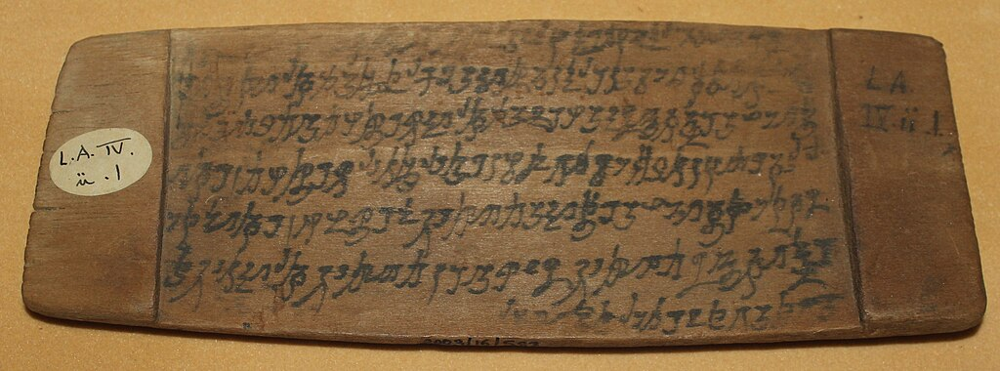

    Kharosthi script on a wooden plate in the [National Museum of India](https://en.wikipedia.org/wiki/National_Museum,_New_Delhi "National Museum, New Delhi") in New Delhi

*   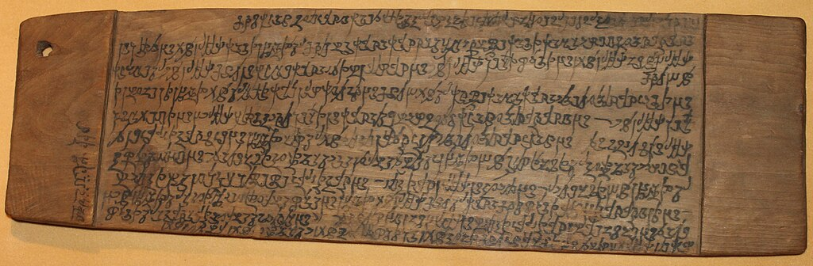

    Kharosthi script on a wooden plate in the National Museum of India in New Delhi

*   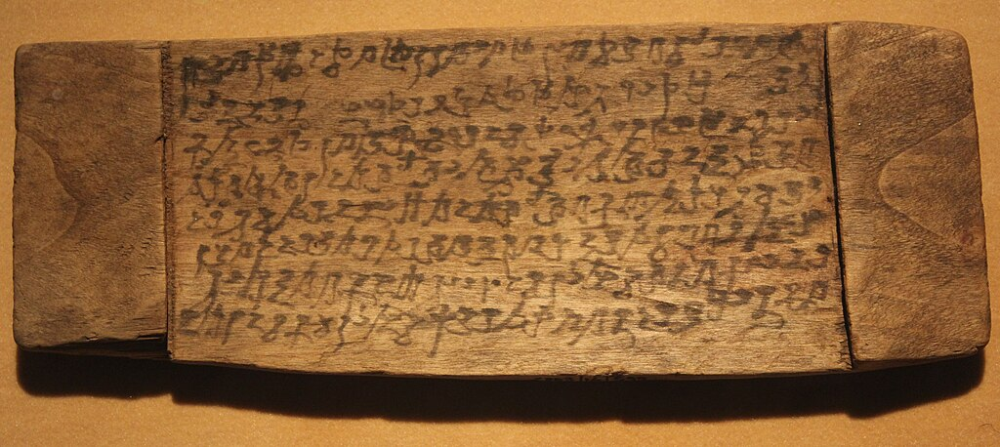

    Kharosthi script on a wooden plate in the National Museum of India in New Delhi

*   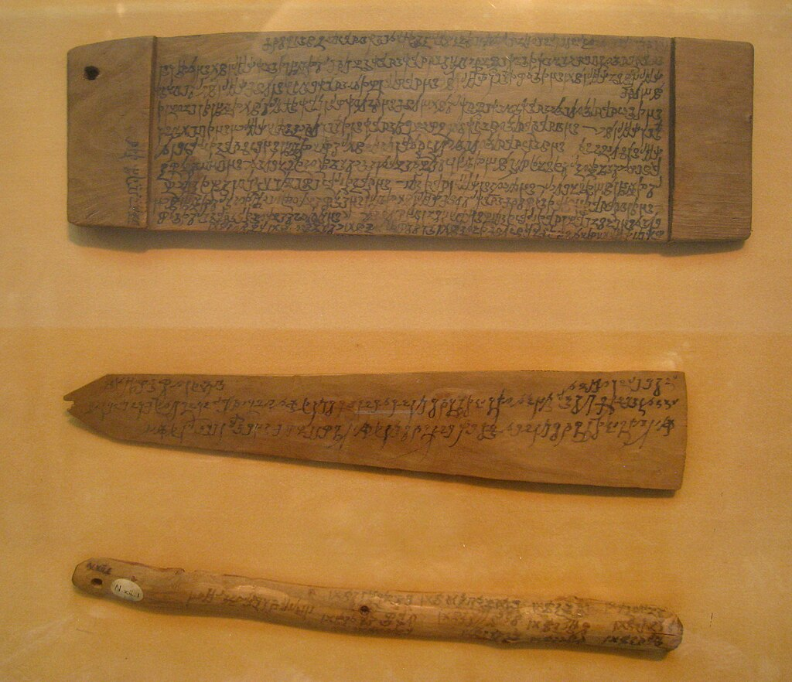

    Kharosthi script on wood from [Niya](https://en.wikipedia.org/wiki/Niya_\(Tarim_Basin\) "Niya (Tarim Basin)"), 3rd century CE

*   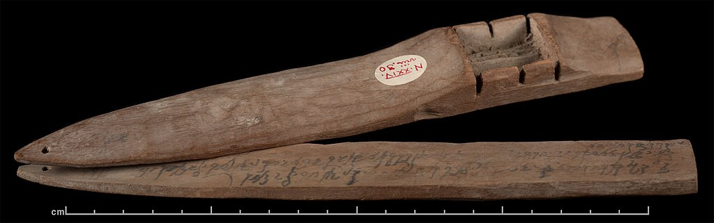

    Double-wedged wooden tablet in [Gandhari](https://en.wikipedia.org/wiki/Gāndhārī_language "Gāndhārī language") written in Kharosthi script, 2nd to 4th century CE

*   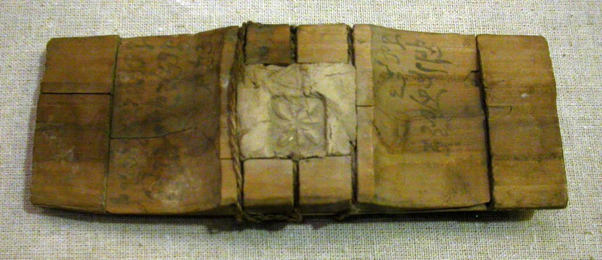

    Wooden tablet inscribed with Kharosthi characters (2nd–3rd century CE). Excavated at the [Niya](https://en.wikipedia.org/wiki/Niya_\(Tarim_Basin\) "Niya (Tarim Basin)") ruins in [Xinjiang](https://en.wikipedia.org/wiki/Xinjiang "Xinjiang"), China. Collection of the [Xinjiang Museum](https://en.wikipedia.org/wiki/Xinjiang_Region_Museum "Xinjiang Region Museum").

*   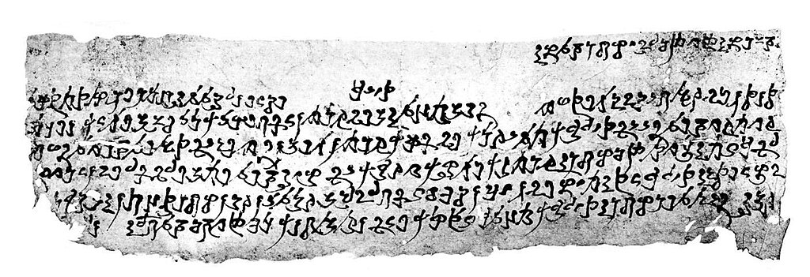

    Wooden Kharosthi document found at [Loulan, China](https://en.wikipedia.org/wiki/Loulan_Kingdom "Loulan Kingdom") by [Aurel Stein](https://en.wikipedia.org/wiki/Aurel_Stein "Aurel Stein")

*   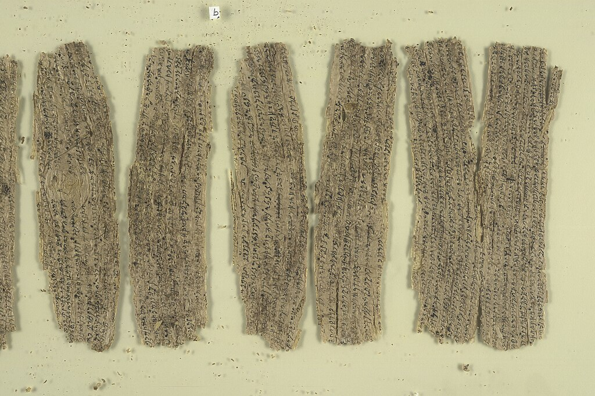

    Fragmentary Kharosthi Buddhist text on birchbark (Part of a group of early manuscripts from [Gandhara](/source/gandhara/ "Gandhara")), first half of 1st century CE. Collection of the [British Library](https://en.wikipedia.org/wiki/British_Library "British Library") in [London](https://en.wikipedia.org/wiki/London "London")

*   

    Silver bilingual [tetradrachm](https://en.wikipedia.org/wiki/Tetradrachm "Tetradrachm") of [Menander I](https://en.wikipedia.org/wiki/Menander_I "Menander I") (155-130 BCE). _Obverse:_[Greek](https://en.wikipedia.org/wiki/Greek_alphabet "Greek alphabet") legend, ΒΑΣΙΛΕΩΣ ΣΩΤΗΡΟΣ ΜΕΝΑΝΔΡΟΥ (BASILEOS SOTEROS MENANDROU), literally, "Of Saviour King Menander". _Reverse:_ Kharosthi legend: MAHARAJA TRATARASA MENADRASA "Saviour King Menander". [Athena](https://en.wikipedia.org/wiki/Athena "Athena") advancing right, with thunderbolt and shield. [Taxila](https://en.wikipedia.org/wiki/Taxila "Taxila") mint mark.

*   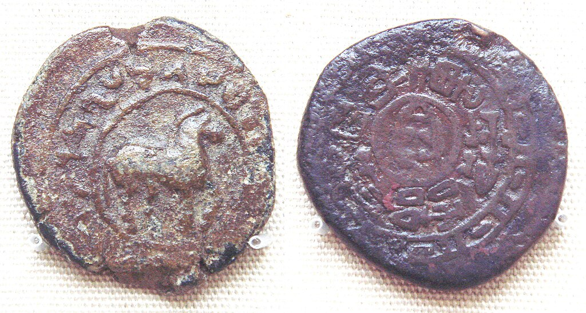

    Coin of King [Gurgamoya](https://en.wikipedia.org/wiki/Gurgamoya "Gurgamoya") of [Khotan](https://en.wikipedia.org/wiki/Kingdom_of_Khotan "Kingdom of Khotan") (1st century CE). _Obverse_: Kharoshthi legend "Of the great king of kings, king of Khotan, Gurgamoya. _Reverse_: Chinese legend: "Twenty-four grain copper coin".

*   

    Coin of [Menander II Dikaiou](https://en.wikipedia.org/wiki/Menander_II "Menander II")_Obverse_: Menander wearing a [diadem](https://en.wikipedia.org/wiki/Diadem "Diadem"). Greek legend: ΒΑΣΙΛΕΩΣ ΔΙΚΑΙΟΥ ΜΕΝΑΝΔΡΟΥ "King Menander the Just". _Reverse_: Winged figure bearing diadem and palm, with [halo](https://en.wikipedia.org/wiki/Halo_\(religious_iconography\) "Halo (religious iconography)"), probably [Nike](https://en.wikipedia.org/wiki/Nike_\(mythology\) "Nike (mythology)"). The Kharoshthi legend reads MAHARAJASA DHARMIKASA MENADRASA "Great King, Menander, follower of the [Dharma](https://en.wikipedia.org/wiki/Dharma "Dharma"), Menander".

*   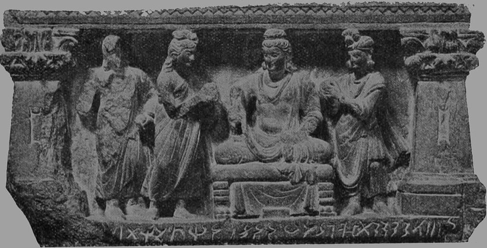

    The Indo-Greek [Hashtnagar](https://en.wikipedia.org/wiki/Hashtnagar "Hashtnagar") Pedestal symbolizes [bodhisattva](https://en.wikipedia.org/wiki/Bodhisattva "Bodhisattva") and ancient Kharosthi script. Found near Rajar in [Gandhara](/source/gandhara/ "Gandhara"), [Pakistan](https://en.wikipedia.org/wiki/Pakistan "Pakistan"). Exhibited at the [British Museum](https://en.wikipedia.org/wiki/British_Museum "British Museum") in London.

*   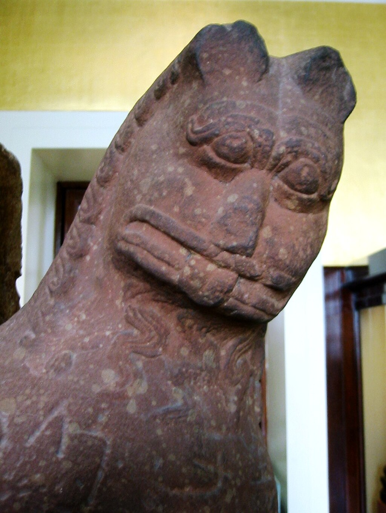

    [Mathura lion capital](https://en.wikipedia.org/wiki/Mathura_lion_capital "Mathura lion capital") with [addorsed](https://en.wikipedia.org/wiki/Attitude_\(heraldry\)#Addorsed "Attitude (heraldry)") lions and [Prakrit](https://en.wikipedia.org/wiki/Prakrit "Prakrit") inscriptions in Kharoshthi script

*   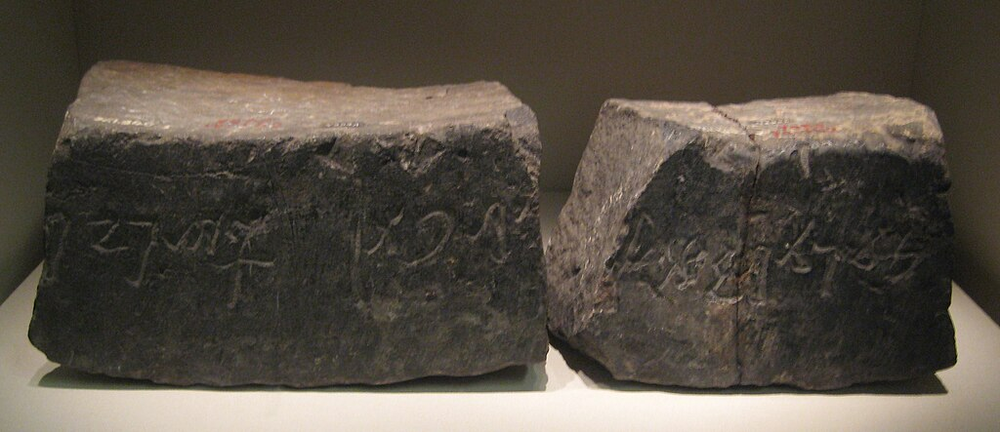

    Fragments of stone well railings with a Buddhist inscription written in Kharoshthi script (late Han period to the [Three Kingdoms](https://en.wikipedia.org/wiki/Three_Kingdoms "Three Kingdoms") era). Discovered at [Luoyang](https://en.wikipedia.org/wiki/Luoyang "Luoyang"), China in 1924.

*   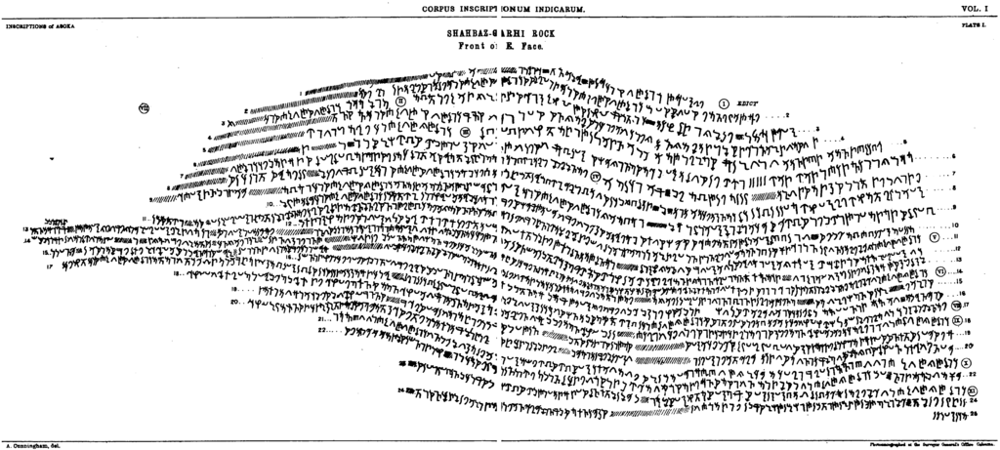

    Portion of Emperor [Ashoka](https://en.wikipedia.org/wiki/Ashoka "Ashoka")'s [Rock Edicts](/source/edicts-of-ashoka/ "Edicts of Ashoka") at [Shahbaz Garhi](https://en.wikipedia.org/wiki/Shahbaz_Garhi "Shahbaz Garhi")

*   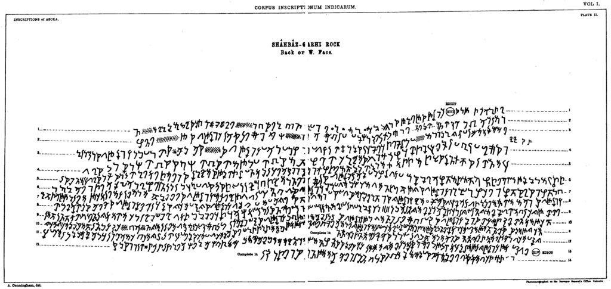

    Portion of Emperor Ashoka's Rock Edicts at Shahbaz Garhi

*   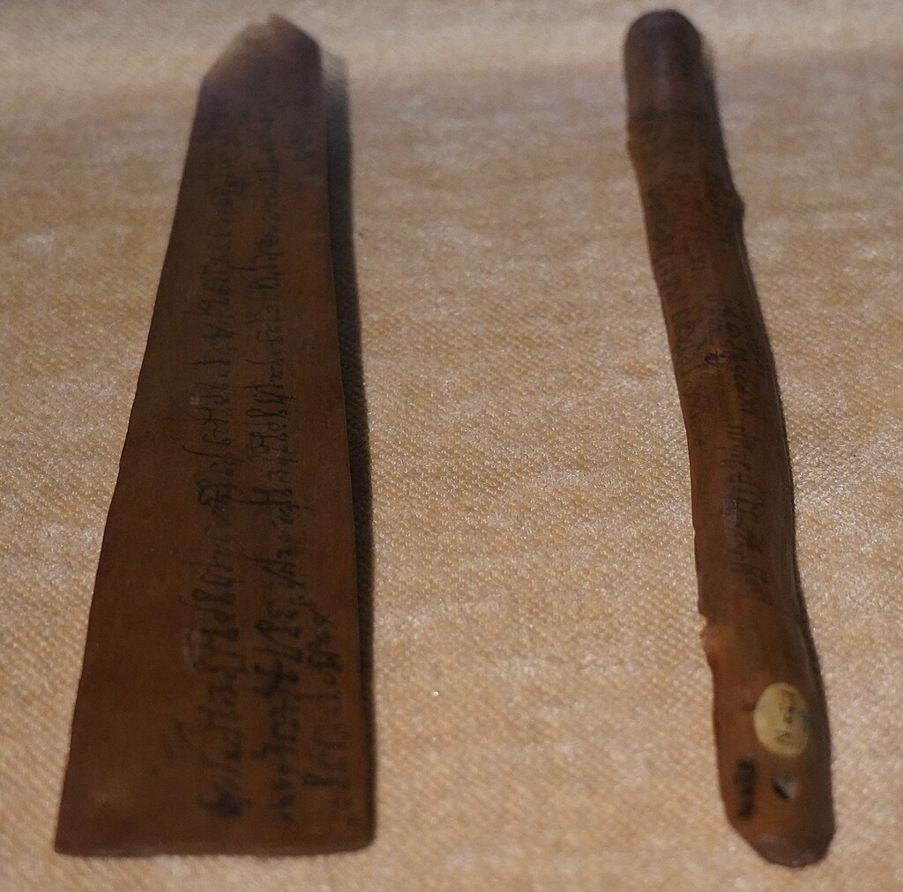

    Document on Wooden Stick written in Kharoshthi script, 3rd-4th century CE.

## Further reading

*   Dani, Ahmad Hassan (1979). _Kharoshthi Primer_. Lahore Museum Publication Series. Vol. 16. Lahore Museum. [OCLC](https://en.wikipedia.org/wiki/OCLC_\(identifier\) "OCLC (identifier)") [10695864](https://search.worldcat.org/oclc/10695864).`{{[cite book](https://en.wikipedia.org/wiki/Template:Cite_book "Template:Cite book")}}`: CS1 maint: location missing publisher ([link](https://en.wikipedia.org/wiki/Category:CS1_maint:_location_missing_publisher "Category:CS1 maint: location missing publisher"))
*   [Daniels, Peter T.](https://en.wikipedia.org/wiki/Peter_T._Daniels "Peter T. Daniels"); [Bright, William](https://en.wikipedia.org/wiki/William_O._Bright "William O. Bright"), eds. (1996). [_The World's Writing Systems_](https://archive.org/details/isbn_9780195079937/page/373). Oxford University Press, Inc. pp. [373–383](https://archive.org/details/isbn_9780195079937/page/373). [ISBN](https://en.wikipedia.org/wiki/ISBN_\(identifier\) "ISBN (identifier)") [978-0195079937](https://en.wikipedia.org/wiki/Special:BookSources/978-0195079937 "Special:BookSources/978-0195079937").
*   Falk, Harry (1993). _Schrift im alten Indien: Ein Forschungsbericht mit Anmerkungen_. Script Oralia (in German). Vol. 56. Tübingen: Gunter Narr. [ISBN](https://en.wikipedia.org/wiki/ISBN_\(identifier\) "ISBN (identifier)") [978-3-8233-4271-7](https://en.wikipedia.org/wiki/Special:BookSources/978-3-8233-4271-7 "Special:BookSources/978-3-8233-4271-7").
*   Fussman, Gérard. "Les premiers systèmes d'écriture en Inde". _Annuaire du Collège de France 1988–1989_ (in French). pp. 507–514.
*   von Hinüber, Oscar (1990). _Der Beginn der Schrift und frühe Schriftlichkeit in Indien_ (in German). Franz Steiner. [ISBN](https://en.wikipedia.org/wiki/ISBN_\(identifier\) "ISBN (identifier)") [978-3-515-05627-4](https://en.wikipedia.org/wiki/Special:BookSources/978-3-515-05627-4 "Special:BookSources/978-3-515-05627-4").
*   Nasim Khan, M., ed. (2009). _Kharoshthi Manuscripts from Gandhara_ (2nd ed.). Higher Education Commission of Pakistan.
*   Nasim Khan, M. (2004). "Kharoshthi Manuscripts from Gandhara". _Journal of Humanities and Social Sciences_. **XII** (1–2): 9–15.
*   Nasim Khan, M. (July 1999). "Two Dated Kharoshthi Inscriptions from Gandhara". _Journal of Asian Civilizations_. **XXII** (1): 99–103.
*   Nasim Khan, M. (September 1997). "Kharoshthi Inscription from Swabi – Gandhara". _The Journal of Humanities and Social Sciences_. **V** (2): 49–52.
*   Nasim Khan, M. (March 1997). "An Inscribed Relic-Casket from Dir". _The Journal of Humanities and Social Sciences_. **V** (1): 21–33.
*   Nasim Khan, M (1997). "Ashokan Inscriptions: A Palaeographical Study". _Atthariyyat_. Vol. I. Peshawar. pp. 131–150.`{{[cite book](https://en.wikipedia.org/wiki/Template:Cite_book "Template:Cite book")}}`: CS1 maint: location missing publisher ([link](https://en.wikipedia.org/wiki/Category:CS1_maint:_location_missing_publisher "Category:CS1 maint: location missing publisher"))
*   Norman, Kenneth R. (1992). "The development of writing in India and its effect upon the Pāli canon". _Wiener Zeitschrift für die Kunde Südasiens_. **36**: 239–249\. [JSTOR](https://en.wikipedia.org/wiki/JSTOR_\(identifier\) "JSTOR (identifier)") [24010823](https://www.jstor.org/stable/24010823).
*   Salomon, Richard (1990). "New Evidence for a Gāndhārī Origin of the Arapacana Syllabary". _Journal of the American Oriental Society_. **110** (2): 255–273\. [doi](https://en.wikipedia.org/wiki/Doi_\(identifier\) "Doi (identifier)"):[10.2307/604529](https://doi.org/10.2307%2F604529). [JSTOR](https://en.wikipedia.org/wiki/JSTOR_\(identifier\) "JSTOR (identifier)") [604529](https://www.jstor.org/stable/604529).
*   Salomon, Richard (1 April 1993). "An additional note on Aracapana". _The Journal of the American Oriental Society_. **113** (2): 275–277\. [doi](https://en.wikipedia.org/wiki/Doi_\(identifier\) "Doi (identifier)"):[10.2307/603034](https://doi.org/10.2307%2F603034). [JSTOR](https://en.wikipedia.org/wiki/JSTOR_\(identifier\) "JSTOR (identifier)") [603034](https://www.jstor.org/stable/603034). [Gale](https://en.wikipedia.org/wiki/Gale_\(publisher\) "Gale (publisher)") [A14474853](https://go.gale.com/ps/anonymous?id=GALE%7CA14474853).
*   Salomon, Richard (1998). _Indian Epigraphy: A Guide to the Study of Inscriptions in Sanskrit, Prakrit, and the other Indo-Aryan Languages_. Oxford University Press. [ISBN](https://en.wikipedia.org/wiki/ISBN_\(identifier\) "ISBN (identifier)") [978-0-19-535666-3](https://en.wikipedia.org/wiki/Special:BookSources/978-0-19-535666-3 "Special:BookSources/978-0-19-535666-3").
*   Salomon, Richard (2006). "Kharoṣṭhī syllables used as location markers in Gāndhāran stūpa architecture". In Faccenna, Domenico (ed.). _Architetti, Capomastri, Artigiani: L'organizzazione Dei Cantieri E Della Produzione Artistica Nell'Asia Ellenistica: Studi Offerti a Domenico Faccenna Nel Suo Ottantesimo Compleanno_. Istituto italiano per l'Africa e l'Oriente. pp. 181–224\. [ISBN](https://en.wikipedia.org/wiki/ISBN_\(identifier\) "ISBN (identifier)") [978-88-85320-36-9](https://en.wikipedia.org/wiki/Special:BookSources/978-88-85320-36-9 "Special:BookSources/978-88-85320-36-9").
*   Salomon, Richard (1995). "On the Origin of the Early Indian Scripts". _Journal of the American Oriental Society_. **115** (2): 271–279\. [doi](https://en.wikipedia.org/wiki/Doi_\(identifier\) "Doi (identifier)"):[10.2307/604670](https://doi.org/10.2307%2F604670). [JSTOR](https://en.wikipedia.org/wiki/JSTOR_\(identifier\) "JSTOR (identifier)") [604670](https://www.jstor.org/stable/604670). [ProQuest](https://en.wikipedia.org/wiki/ProQuest "ProQuest") [217141859](https://www.proquest.com/docview/217141859).
