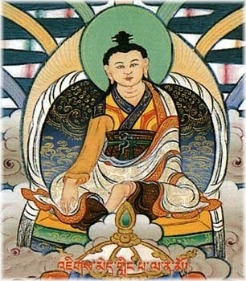
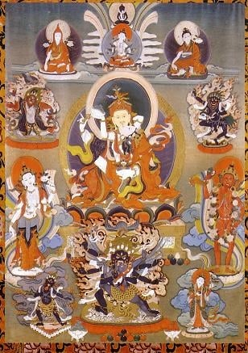

Rigdzin [Jikmé Lingpa](https://www.rigpawiki.org/index.php?title=Jikmé_Lingpa "Jikmé Lingpa"), who revealed the Longchen Nyingtik

**Longchen Nyingtik** (Tib. [ཀློང་ཆེན་སྙིང་ཐིག་](https://www.rigpawiki.org/index.php?title=ཀློང་ཆེན་སྙིང་ཐིག་ "ཀློང་ཆེན་སྙིང་ཐིག་"), [Wyl.](https://www.rigpawiki.org/index.php?title=Wyl. "Wyl.") _klong chen snying thig_) — a [Nyingma](/source/nyingma/ "Nyingma") cycle of teachings and practice, which was discovered by [Jikmé Lingpa](https://www.rigpawiki.org/index.php?title=Jikmé_Lingpa "Jikmé Lingpa") as [mind terma](https://www.rigpawiki.org/index.php?title=Mind_terma "Mind terma").

## The Revelation of Longchen Nyingtik

Regarding the revelation of the Longchen Nyingtik teachings, [Tulku Thondup](https://www.rigpawiki.org/index.php?title=Tulku_Thondup "Tulku Thondup") writes:

: While Guru Rinpoche was visiting Tibet…he conferred the Longchen Nyingtik teachings on King Trisong Detsen, Khandro Yeshe Tsogyal, and Vairochana… He gave prophetic empowerments by saying that the teachings would be discovered by Jikmé Lingpa, an incarnation (tulku) of King Trisong Detsen. : So centuries later, when the prophetic empowerments of Guru Rinpoche ripened and the favorable circumstances came to fruition, the concealed Longchen Nyingtik teachings were accordingly awakened in the enlightened mind of Jikmé Lingpa as mind ter.

Jikmé Lingpa discovered the Longchen Nyingtik teachings as mind ter at the age of twenty-eight. Tulku Thondup writes:

: In the evening of the twenty-fifth day of the tenth month of the Fire Ox year of the thirteenth Rabjung cycle (1757), Jikmé Lingpa went to bed with an unbearable devotion to Guru Rinpoche in his heart; a stream of tears of sadness continuously wet his face because he was not in Guru Rinpoche’s presence, and unceasing words of prayers kept singing in his breath. : He remained in the depths of that meditation experience of clear luminosity for a long time. While being absorbed in that luminous clarity, he experienced flying a long distance through the sky while riding a white lion. He finally reached a circular path, which he thought to be the circumambulation path of Jarung Khashor, now known as Boudhanath Stupa, an important Buddhist monument of giant structure in Nepal.

In this vision, the wisdom dakinis gave Jikmé Lingpa a casket containing five yellow scrolls and seven crystal beads. One of the scrolls contained the prophetic guide of Longchen Nyingtik, called _Nechang Thukkyi Drombu_. At the instruction of a [dakini](https://www.rigpawiki.org/index.php?title=Dakini "Dakini"), he ate the yellow scrolls and crystal beads, and all the words and meaning of the Longchen Nyingtik terma were awakened in his mind.

Jikmé Lingpa kept this terma secret for years, and he did not even transcribe the terma until he entered another retreat in which he had a series of visions of [Longchen Rabjam](https://www.rigpawiki.org/index.php?title=Longchen_Rabjam "Longchen Rabjam"). Tulku Thondup explains:

: In the earth-hare year (1759) he started another three-year retreat, at Chimpu near Samye monastery. During that retreat, because he was inspired by three successive pure visions of Longchen Rabjam, and he was urged by repeated requests of dakinis, he transcribed his terma as the cycle of Longchen Nyingtik. On the tenth day of the sixth month (monkey month) of the monkey year (1764) he made his terma public for the first time by conferring the transmission of empowerment and the instructions upon fifteen disciples.

The Longchen Nyingtik terma consists of tantric sadhanas and teachings.

## The Nyingtik Teachings

The Nyingtik teachings are the innermost secret teachings of [Dzogchen](/source/dzogchen/ "Dzogchen"). The Dzogchen teachings were revealed to [Prahevajra (Tib. Garab Dorje)](https://www.rigpawiki.org/index.php?title=Garab_Dorje "Garab Dorje") by [Vajrasattva](https://www.rigpawiki.org/index.php?title=Vajrasattva "Vajrasattva"), and passed down through an unbroken lineage to present day masters. Within the Dzogchen teachings, there are [three categories](https://www.rigpawiki.org/index.php?title=Three_categories "Three categories") of teachings suitable to students of different capacity. The Nyingtik is the innermost secret cycle of teachings of the [Category of Pith Instructions](https://www.rigpawiki.org/index.php?title=Category_of_Pith_Instructions "Category of Pith Instructions"); this cycle is the most direct approach for students of the highest capacity.

Within the Nyingtik teachings, there are tantras and instructional texts. Regarding the instructional texts, [Tulku Thondup](https://www.rigpawiki.org/index.php?title=Tulku_Thondup "Tulku Thondup") explains:

: The instructional teachings are elucidated and condensed in two major traditions of Nyingtik. The first one is the detailed teachings for/of the scholars, brought to Tibet by Vimalamitra and known as Vima Nyingtik. It is mainly based on the Seventeen Tantras and the Troma tantra. The second one is the profound teachings for/of mendicants \[or yogis\], brought to Tibet by Guru Padmasambhava and known as Khandro Nyingtik. It is mainly based on the Longsal Barma tantra.

In the fourteenth century in Tibet, the great master [Longchen Rabjam](https://www.rigpawiki.org/index.php?title=Longchen_Rabjam "Longchen Rabjam") became the lineage holder of both of these Nyingtik traditions, and wrote a commentary on each tradition.

## Longchen Rabjam, Jikmé Lingpa, and the Longchen Nyingtik Lineage

Longchen Rabjam (1308-1364)

[Longchen Rabjam](https://www.rigpawiki.org/index.php?title=Longchen_Rabjam "Longchen Rabjam") (1308-1364), also known as Longchenpa, was one of the greatest Dzogchen masters in the Nyingma tradition, and amongst the most brilliant and original writers in Tibetan Buddhist literature. He brought together into a cohesive system the teachings of Vima Nyingtik and Khandro Nyingtik, on which he wrote the ‘Three Yangtik’ or Inner Essencess.

Four centuries later, Jikmé Lingpa was tremendously inspired by the teachings of Longchenpa. After Jikmé Lingpa discovered the terma of Longchen Nyingtik (which included tantric sadhanas and teachings) he entered into a three-year retreat in the caves of Chimphu in which he fervently invoked Longchenpa with a [Guru Yoga](https://www.rigpawiki.org/index.php?title=Guru_Yoga "Guru Yoga") he had composed. Longchenpa appeared to him in three visions, through which he received the blessing and transmission of the wisdom body, speech and mind of Longchenpa, empowering him with the responsibility of preserving the meaning of the teachings of Longchenpa, and of spreading them. As a result, Jikmé Lingpa’s mind became one with the wisdom mind of Longchenpa.

In this way, Jikmé Lingpa became the lineage holder of Longchenpa’s teachings on the Vima Nyingtik and Khandro Nyingtik. Jikmé Lingpa was a reincarnation of both King Trisong Detsen and Vimilamitra. Therefore, the Nyingtik teachings of these two major lineages flowed together in Jikmé Lingpa.

The Longchen Nyingtik lineage includes both the terma of Longchen Nyingtik discovered by Jikmé Lingpa, and teachings of Longchen Rabjam on Vima Nyingtik and Khandro Nyingtik that were revealed to Jikmé Lingpa in a series of visions.

Most of the rituals and [mudras](https://www.rigpawiki.org/index.php?title=Mudra "Mudra") of the Longchen Nyingtik tradition find their source in the [Lama Gongdü](https://www.rigpawiki.org/index.php?title=Lama_Gongdü "Lama Gongdü"), on which Jikmé Lingpa wrote his famous commentary, called a _[Detailed Commentary on the Lama Gongdü](https://www.rigpawiki.org/index.php?title=Detailed_Commentary_on_the_Lama_Gongdü "Detailed Commentary on the Lama Gongdü")_. The Lama Gondü is therefore held in high regard.

## The Stages of Practice

[Dilgo Khyentse Rinpoche](https://www.rigpawiki.org/index.php?title=Dilgo_Khyentse_Rinpoche "Dilgo Khyentse Rinpoche") said:

: The cycle of the Longchen Nyingtik is composed of many sections. It includes the preliminary and main practices, the development and completion stages, and, most important, the practice of Ati Yoga, or Dzogchen. It thus constitutes a complete path to enlightenment.

In the Longchen Nyingtik tradition, the preliminary (or [ngöndro](https://www.rigpawiki.org/index.php?title=Ngöndro "Ngöndro")) practices are commonly referred to as the [Longchen Nyingtik Ngöndro](https://www.rigpawiki.org/index.php?title=Longchen_Nyingtik_Ngöndro "Longchen Nyingtik Ngöndro").

After completing the ngondro, training in the development and completion stages is done through [sadhana](https://www.rigpawiki.org/index.php?title=Sadhana "Sadhana") practices such as [Rigdzin Dupa](https://www.rigpawiki.org/index.php?title=Rigdzin_Dupa "Rigdzin Dupa"). Traditionally, a student trains in a series of three sadhanas known as the [Three Roots](https://www.rigpawiki.org/index.php?title=Three_Roots "Three Roots").

Finally, if the student is sufficiently prepared, a qualified teacher may give the students instructions in [Dzogchen](/source/dzogchen/ "Dzogchen"), which focus on the direct realization of the nature of mind.

## The Major Texts

A [thangka](https://www.rigpawiki.org/index.php?title=Thangka "Thangka") showing the deities of Longchen Nyingtik, including the lama [Rigdzin Düpa](https://www.rigpawiki.org/index.php?title=Rigdzin_Düpa "Rigdzin Düpa"), the yidam [Palchen Düpa](https://www.rigpawiki.org/index.php?title=Palchen_Düpa "Palchen Düpa"), the khandro [Yumka Dechen Gyalmo](https://www.rigpawiki.org/index.php?title=Yumka_Dechen_Gyalmo "Yumka Dechen Gyalmo"), along with [Dukngal Rangdrol](https://www.rigpawiki.org/index.php?title=Dukngal_Rangdrol "Dukngal Rangdrol"), [Takhyung Barwa](https://www.rigpawiki.org/index.php?title=Takhyung_Barwa "Takhyung Barwa"), [Senge Dongma](https://www.rigpawiki.org/index.php?title=Senge_Dongma "Senge Dongma") and the protective deities.

The major texts of Longchen Nyingtik are as follows:

### Original Tantras

1.  The root tantra: _Tantra of the Root Expanse of Samantabhadra_ (Tib. _Kuntuzangpo Yeshe Longki Gyü_)
2.  The subsequent tantra: _Subsequent Tantra of Dzogchen Instructions_ (Tib. _Gyü Chima_)
3.  Teachings: _Experiencing the Enlightened Mind of Samantabhadra_ (Tib. _Kuntuzangpö Gong-nyam_)
4.  Instructions

: a. Instructions: Distinguishing the Three Essential Points of the Great Perection (Tib. Nesum Shenje) and Vajra Verses on the Natural State (Tib. Neluk Dorje Tsigang) b. Their commentaries: Yeshe Lama with its supporting texts

### Sadhanas

1\. Male [vidyadharas](https://www.rigpawiki.org/index.php?title=Vidyadhara "Vidyadhara")

a. Peaceful: outer: [Guru Yoga](https://www.rigpawiki.org/index.php?title=Guru_Yoga "Guru Yoga")
 inner: [Rigdzin Düpa](https://www.rigpawiki.org/index.php?title=Rigdzin_Düpa "Rigdzin Düpa")
 secret: [Dukngal Rangdrol](https://www.rigpawiki.org/index.php?title=Dukngal_Rangdrol "Dukngal Rangdrol")
 innermost secret: Ladrup [Tiklé Gyachen](https://www.rigpawiki.org/index.php?title=Tiklé_Gyachen "Tiklé Gyachen")
 b. Wrathful: blue: [Palchen Düpa](https://www.rigpawiki.org/index.php?title=Palchen_Düpa "Palchen Düpa")
 red: [Takhyung Barwa](https://www.rigpawiki.org/index.php?title=Takhyung_Barwa "Takhyung Barwa")

2\. Female [vidyadharas](https://www.rigpawiki.org/index.php?title=Vidyadhara "Vidyadhara")

a. Peaceful: root sadhana: [Yumka Dechen Gyalmo](https://www.rigpawiki.org/index.php?title=Yumka_Dechen_Gyalmo "Yumka Dechen Gyalmo")
 b. Wrathful: secret sadhana: [Senge Dongchen](https://www.rigpawiki.org/index.php?title=Senge_Dongma "Senge Dongma")

## The Detailed Longchen Nyingtik Lineage

Some of the main lineage holders of the Longchen Nyingtik lineage are listed below.

**First stage**

: Samantabhadra, the Dharmakaya Vajrasattva, the Sambhogakaya Prahevajra (Tib. Garab Dorje), the Nirmanakaya; the first human master of Dzogpa Chenpo Hitting the Essence in Three Words Mañjushrimitra Six Experiences of Meditation Shri Singha Seven Nails Jñanasutra Four Means of Abiding Vimalamitra Vima Nyingtik Guru Rinpoche Khandro Nyingtik King Trisong Detsen, received Nyingtik teachings from Guru Rinpoche and Vimalamitra Yeshe Tsogyal Vairotsana Longchen Rabjam Rigdzin Jigmé Lingpa, revealed the Longchen Nyingtik teachings

**Later stages**

: Dodrupchen I Jikmé Trinlé Özer, the direct disciple of Jigme Lingpa, he arranged and expanded on Jigme Lingpa’s revelation Jikmé Gyalwé Nyugu Dola Jikmé Kalzang Fourth Dzogchen Mingyur Namkhé Dorje Do Khyentse Yeshe Dorje Gyalsé Shenpen Tayé Dzogchen Khenpo Pema Dorje Patrul Jigme Chokyi Wangpo A Brief Guide to the Stages of Visualization The Words of My Perfect Teacher The Mirror for Seeing Clearly Special Teaching of the Wise and Glorious King Dodrupchen II Jikmé Puntsok Jungné Jamyang Khyentse Wangpo Illuminating the Excellent Path to Omniscience Nyoshul Lungtok Tenpé Nyima Orgyen Tendzin Norbu Adzom Drukpa Drodul Pawo Dorje Lushul Khenpo Könchok Drönme Dodrupchen III Jikmé Tenpé Nyima Lochen Chönyi Zangmo Thupten Chökyi Dorje Khenpo Kunpal Yukhok Chatralwa Chöying Rangdrol Ngöndro Compendium Khenpo Ngawang Palzang A Guide to the Words of My Perfect Teacher Chökyi Drakpa A Torch for the Path to Omniscience Alak Zenkar Pema Ngödrup Rölwe Dorje Jamyang Khyentsé Chökyi Lodrö Khenpo Chechok Thöndrup The Words of the Vidyadhara which Bestow the Majesty of Great Bliss Dilgo Khyentse Tashi Paljor

**Present day teachers**
There are many present-day masters of the Longchen Nyingtik lineage; the list below includes some of the teachers most familiar to [Rigpa](https://www.rigpawiki.org/index.php?title=About_Rigpa "About Rigpa") students.

: Chatral Sangye Dorje Trulshik Rinpoche Dodrupchen IV Sogyal Rinpoche Khangsar Tenpé Wangchuk Alak Zenkar Rinpoche Pema Wangyal Rinpoche Dzongsar Khyentse Rinpoche Dzigar Kongtrul Rinpoche Dzogchen Rinpoche VII Shechen Rabjam Rinpoche Khenpo Chöga

## Alternative Translations

*   Heart Essence of the Vast Expanse
*   Innermost Spirituality of Longchenpa (Gyurme Dorje)

## Teachings Given to the [Rigpa](https://www.rigpawiki.org/index.php?title=About_Rigpa "About Rigpa") Sangha

*   [Steven Goodman](https://www.rigpawiki.org/index.php?title=Steven_Goodman "Steven Goodman"), Rigpa Berkeley, 28 February-2 March 1997, _The Longchen Nyingtik Revelations—Historical, Textual and Experiential Dimensions_
*   Steven Goodman, Berkley, U.S.A., 24 January 1998
*   [Tulku Thondup](https://www.rigpawiki.org/index.php?title=Tulku_Thondup "Tulku Thondup"), Munich, Germany, 25 April 2006, _Longchen Nyingtik—The Heart Essence of Infinite Expanse_
*   [Khenchen Pema Sherab](https://www.rigpawiki.org/index.php?title=Khenchen_Pema_Sherab "Khenchen Pema Sherab"), [Lerab Ling](https://www.rigpawiki.org/index.php?title=Lerab_Ling "Lerab Ling"), 18, 25 & 28 April 2021: the Longchen Nyingtik lineage

## Further Reading

*   [Dilgo Khyentse Rinpoche](https://www.rigpawiki.org/index.php?title=Dilgo_Khyentse_Rinpoche "Dilgo Khyentse Rinpoche"), _The Wish-Fulfilling Jewel: The Practice of Guru Yoga According to the Longchen Nyingtik Tradition_, Shambhala Publications
*   Anne C. Klein, _Heart Essence of the Vast Expanse: A Story of Transmission_ (Snow Lion Publications, 2009)
*   [Patrul Rinpoche](https://www.rigpawiki.org/index.php?title=Patrul_Rinpoche "Patrul Rinpoche"), _[The Words of My Perfect Teacher](https://www.rigpawiki.org/index.php?title=The_Words_of_My_Perfect_Teacher "The Words of My Perfect Teacher")_, translated by the Padmakara Translation Group, Shambhala 1994, revised ed. 1998
*   Sam van Schaik, _Approaching the Great Perfection: Simultaneous and Gradual Methods of Dzogchen Practice in the Longchen Nyingtig_, Boston: Wisdom Publications, 2003
*   Steven D. Goodman, 'Rig-'dzin Jigs-med gling-pa and the kLong-Chen sNying-Thig' in _Tibetan Buddhism: Reason and Revelation_ edited by Steven D Goodman and Ronald M. Davidson, SUNY, 1992
*   [Tulku Thondup](https://www.rigpawiki.org/index.php?title=Tulku_Thondup "Tulku Thondup"), _Enlightened Journey_, Boston & London, Shambhala, 1995
*   [Tulku Thondup](https://www.rigpawiki.org/index.php?title=Tulku_Thondup "Tulku Thondup"), _Masters of Meditation and Miracles_, Shambhala, 1996

## Notes

## Internal Links

*   [Longchen Nyingtik Root Volumes](https://www.rigpawiki.org/index.php?title=Longchen_Nyingtik_Root_Volumes "Longchen Nyingtik Root Volumes")

## External Links

*   [Longchen Nyingtik Series on Lotsawa House](http://www.lotsawahouse.org/topics/longchen-nyingtik)
*   [The Longchen Nyingtik Project](http://longchennyingtik.org)
*   [Longchen Nyingtik outline page at Himalayan Art Resources](http://www.himalayanart.org/pages/longchen/index.html)
*   [Orgyen Tobyal Rinpoche about the Longchen Nyingtik Ritual tradition](https://all-otr.org/vajrayana/32-about-longchen-nyingtik-ritual-tradition)
