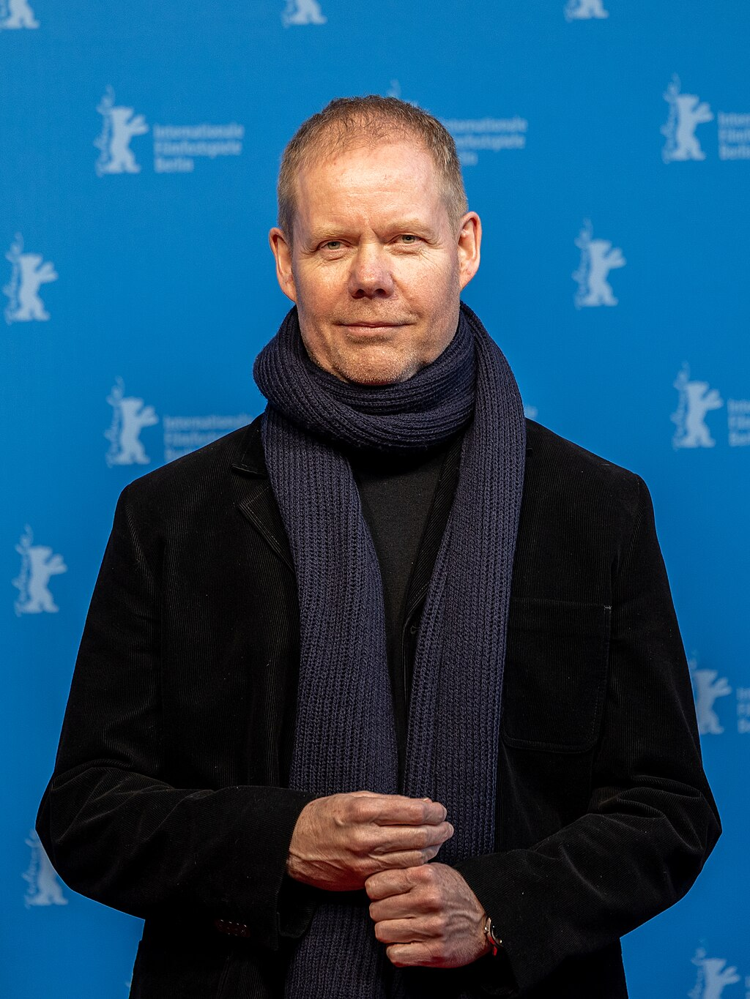

Max Richter

Richter in 2026

Background information

Born

 (1966-03-22) 22 March 1966

[Hamelin](https://en.wikipedia.org/wiki/Hamelin "Hamelin"), [Lower Saxony](https://en.wikipedia.org/wiki/Lower_Saxony "Lower Saxony"), [West Germany](https://en.wikipedia.org/wiki/West_Germany "West Germany")

Origin

[Hamelin](https://en.wikipedia.org/wiki/Hamelin "Hamelin"), Germany

Education

[University of Edinburgh](https://en.wikipedia.org/wiki/University_of_Edinburgh "University of Edinburgh");
[Royal Academy of Music](https://en.wikipedia.org/wiki/Royal_Academy_of_Music "Royal Academy of Music")

Genres

*   [Contemporary classical](https://en.wikipedia.org/wiki/Contemporary_classical_music "Contemporary classical music")
*   [ambient](https://en.wikipedia.org/wiki/Ambient_Music "Ambient Music")
*   [minimalism](https://en.wikipedia.org/wiki/Minimal_music "Minimal music")
*   [post-minimalism](https://en.wikipedia.org/wiki/Postminimalism "Postminimalism")

Occupations

*   Composer
*   pianist
*   producer

Instruments

*   Piano
*   organ
*   synthesizer

Years active

1994–present

Labels

*   Studio Richter-Mahr
*   [Deutsche Grammophon](https://en.wikipedia.org/wiki/Deutsche_Grammophon "Deutsche Grammophon")
*   [130701](https://en.wikipedia.org/wiki/FatCat_Records#Series_and_sublabels "FatCat Records")
*   [FatCat](https://en.wikipedia.org/wiki/FatCat_Records "FatCat Records")
*   [Universal](https://en.wikipedia.org/wiki/Universal_Music_Group "Universal Music Group")
*   [Universal Classics and Jazz](https://en.wikipedia.org/wiki/Universal_Classics_and_Jazz "Universal Classics and Jazz")
*   Late Junction
*   [Mute](https://en.wikipedia.org/wiki/Mute_Records "Mute Records")
*   Delabel
*   [Milan](https://en.wikipedia.org/wiki/Milan_Records "Milan Records")
*   [CAM](https://en.wikipedia.org/wiki/CAM_\(record_company\) "CAM (record company)")
*   Colosseum
*   JADE
*   [Fontana](https://en.wikipedia.org/wiki/Fontana_Distribution "Fontana Distribution")
*   Silva Screen
*   7hings

Website

[maxrichtermusic.com](http://maxrichtermusic.com)

**Max Richter** ([/ˈrɪxtər/](https://en.wikipedia.org/wiki/Help:IPA/English "Help:IPA/English"); German:[\[ˈʁɪçtɐ\]](https://en.wikipedia.org/wiki/Help:IPA/Standard_German "Help:IPA/Standard German"); born 22 March 1966) is a German-born British composer and pianist. He works within [postminimalist](https://en.wikipedia.org/wiki/Postminimalist "Postminimalist") and [contemporary classical](https://en.wikipedia.org/wiki/Contemporary_classical_music "Contemporary classical music") styles. Richter is classically trained, having graduated in composition from the [University of Edinburgh](https://en.wikipedia.org/wiki/University_of_Edinburgh "University of Edinburgh"), the [Royal Academy of Music](https://en.wikipedia.org/wiki/Royal_Academy_of_Music "Royal Academy of Music") in London, and studied with [Luciano Berio](https://en.wikipedia.org/wiki/Luciano_Berio "Luciano Berio") in Italy.

Richter [arranges](https://en.wikipedia.org/wiki/Arrangement "Arrangement"), performs, and composes music for stage, opera, ballet, and screen. He has collaborated with other musicians, as well as with performance, installation, and media artists. He has recorded eight solo albums, and his music is widely used in cinema. As of December 2019, Richter has passed one billion streams and one million album sales.

Richter has been called a "major figure of contemporary music" and his work has been described as "transcending genres" by the former controller of [BBC Radio 3](https://en.wikipedia.org/wiki/BBC_Radio_3 "BBC Radio 3"), [Alan Davey](https://en.wikipedia.org/wiki/Alan_Davey_\(civil_servant\) "Alan Davey (civil servant)"). His 2004 album, _The Blue Notebooks_, has been called "one of the best classical works of the century". In 2026, he was nominated for an Academy Award for his work on the soundtrack of _[Hamnet](https://en.wikipedia.org/wiki/Hamnet_\(film\) "Hamnet (film)")_.

## Early life and career

Richter was born in [Hamelin](https://en.wikipedia.org/wiki/Hamelin "Hamelin"), Lower Saxony, West Germany. He grew up in [Bedford](https://en.wikipedia.org/wiki/Bedford "Bedford"), England, United Kingdom, and his education was at [Bedford Modern School](https://en.wikipedia.org/wiki/Bedford_Modern_School "Bedford Modern School") and [Mander College of Further Education](https://en.wikipedia.org/wiki/Bedford_College_of_Higher_Education "Bedford College of Higher Education").

He had piano lessons and music classes, and at 12 or 13, heard a BBC documentary using the opening to [Kraftwerk](https://en.wikipedia.org/wiki/Kraftwerk "Kraftwerk")'s _[Autobahn](https://en.wikipedia.org/wiki/Autobahn_\(song\) "Autobahn (song)"),_ which later became the first record he bought. It inspired him to research how to build [synthesizers](https://en.wikipedia.org/wiki/Synthesizer "Synthesizer"), and led on to listening to artists like [Tangerine Dream](https://en.wikipedia.org/wiki/Tangerine_Dream "Tangerine Dream"), [Klaus Schulze](https://en.wikipedia.org/wiki/Klaus_Schulze "Klaus Schulze") and [Vangelis](https://en.wikipedia.org/wiki/Vangelis "Vangelis"). At around the same time, the local [milkman](https://en.wikipedia.org/wiki/Milkman "Milkman") introduced him to [minimalist music](https://en.wikipedia.org/wiki/Minimalist_music "Minimalist music") by the likes of [Terry Riley](https://en.wikipedia.org/wiki/Terry_Riley "Terry Riley"), [Philip Glass](/source/philip-glass/ "Philip Glass") and [John Cage](https://en.wikipedia.org/wiki/John_Cage "John Cage").

Richter studied composition and piano at the [University of Edinburgh](https://en.wikipedia.org/wiki/University_of_Edinburgh "University of Edinburgh") and at the [Royal Academy of Music](https://en.wikipedia.org/wiki/Royal_Academy_of_Music "Royal Academy of Music"), though he had some reservations about the syllabus being focused on a [Polish School](https://en.wikipedia.org/wiki/Polish_School_\(music\) "Polish School (music)") modernist canon to the detriment of other minimalist works. This led him to study with [Luciano Berio](https://en.wikipedia.org/wiki/Luciano_Berio "Luciano Berio") in [Florence](https://en.wikipedia.org/wiki/Florence "Florence") which struck him as "opening a door" to "music which was more various".

Richter became involved in performing minimal and post-minimal music, and co-founded the contemporary classical ensemble [Piano Circus](https://en.wikipedia.org/wiki/Piano_Circus "Piano Circus"). He stayed with the group for ten years, commissioning and performing works by minimalist musicians such as [Arvo Pärt](/source/arvo-part/ "Arvo Pärt"), [Brian Eno](https://en.wikipedia.org/wiki/Brian_Eno "Brian Eno"), Philip Glass, [Julia Wolfe](https://en.wikipedia.org/wiki/Julia_Wolfe "Julia Wolfe"), and [Steve Reich](https://en.wikipedia.org/wiki/Steve_Reich "Steve Reich"). The ensemble was signed to [Decca](https://en.wikipedia.org/wiki/Decca_Records "Decca Records")/[Argo](https://en.wikipedia.org/wiki/Argo_Records_\(UK\) "Argo Records (UK)"), producing five albums.

In 1996, Richter collaborated with [Future Sound of London](https://en.wikipedia.org/wiki/Future_Sound_of_London "Future Sound of London") on the album _[Dead Cities](https://en.wikipedia.org/wiki/Dead_Cities_\(album\) "Dead Cities (album)")_, first as a pianist, but ultimately working on several tracks and co-writing the track "Max". He worked with the band for two years, also contributing to the albums _[The Isness](https://en.wikipedia.org/wiki/The_Isness "The Isness")_ and _[The Peppermint Tree and Seeds of Superconsciousness](https://en.wikipedia.org/wiki/The_Peppermint_Tree_and_Seeds_of_Superconsciousness "The Peppermint Tree and Seeds of Superconsciousness")_. In 2000, Richter worked with [Mercury Prize](https://en.wikipedia.org/wiki/Mercury_Prize "Mercury Prize") winner [Roni Size](https://en.wikipedia.org/wiki/Roni_Size "Roni Size") on the [Reprazent](https://en.wikipedia.org/wiki/Reprazent "Reprazent") album _[In the Mode](https://en.wikipedia.org/wiki/In_the_Mode "In the Mode")_. Additionally, he produced [Vashti Bunyan](https://en.wikipedia.org/wiki/Vashti_Bunyan "Vashti Bunyan")'s 2005 album _[Lookaftering](https://en.wikipedia.org/wiki/Lookaftering "Lookaftering")_ and [Kelli Ali](https://en.wikipedia.org/wiki/Kelli_Ali "Kelli Ali")'s 2008 album _[Rocking Horse](https://en.wikipedia.org/wiki/Rocking_Horse_\(album\) "Rocking Horse (album)")_.

Richter released his first solo album in 2002, _Memoryhouse,_ to critical praise, and has produced another eight studio albums since. In 2015, he released _Sleep_, which has been described as the “most streamed classical record of all time".

Alongside his solo work, he has worked on film and television scores, producing over fifty. In 2022, Richter and his partner [Yulia Mahr](https://en.wikipedia.org/wiki/Yulia_Mahr "Yulia Mahr") founded [Studio Richter Mahr](/source/max-richter/#Studio_Richter_Mahr), a studio and recording space that supports young artists.

## Solo work

Richter's solo albums include:

### _Memoryhouse_ (2002)

During a trip to [Lantau island](https://en.wikipedia.org/wiki/Lantau_Island "Lantau Island") in 1994, Richter saw a gate to an old [Zen](https://en.wikipedia.org/wiki/Zen "Zen") monastery bearing the inscription "Time does not exist. What is memory?", sparking his interest in memory. Reviewed by Andy Gill as "a landmark work of contemporary classical music", Richter's solo debut, _[Memoryhouse](https://en.wikipedia.org/wiki/Memoryhouse_\(album\) "Memoryhouse (album)")_, an experimental album of "documentary music" recorded with the [BBC Philharmonic Orchestra](https://en.wikipedia.org/wiki/BBC_Philharmonic_Orchestra "BBC Philharmonic Orchestra"), explores real and imaginary stories and histories. Several of the tracks, such as "Sarajevo", "November", "Arbenita", and "Last Days", deal with the aftermath of the [Kosovo conflict](https://en.wikipedia.org/wiki/Kosovo_War "Kosovo War"), while others are of childhood memories (e.g. "Laika's Journey"). The music combines ambient sounds, voices (including that of [John Cage](https://en.wikipedia.org/wiki/John_Cage "John Cage")), and poetry readings from the work of [Marina Tsvetaeva](https://en.wikipedia.org/wiki/Marina_Tsvetaeva "Marina Tsvetaeva"). [BBC Music](https://en.wikipedia.org/wiki/BBC_Music "BBC Music") called the album "a masterpiece in neoclassical composition". _Memoryhouse_ was first played live by Richter at the [Barbican Centre](https://en.wikipedia.org/wiki/Barbican_Centre "Barbican Centre") on 24 January 2014 to coincide with a vinyl re-release of the album.

_[Pitchfork](https://en.wikipedia.org/wiki/Pitchfork_\(website\) "Pitchfork (website)")_ gave the re-release an 8.7 rating, commenting on its extensive influence:

> In 2002, Richter's ability to weave subtle electronics against the grand BBC Philharmonic Orchestra helped suggest new possibilities and locate fresh audiences that composers such as [Nico Muhly](https://en.wikipedia.org/wiki/Nico_Muhly "Nico Muhly") and [Michał Jacaszek](https://en.wikipedia.org/wiki/Jacaszek "Jacaszek") have since pursued. As you listen to new work by [Julianna Barwick](https://en.wikipedia.org/wiki/Julianna_Barwick "Julianna Barwick") or [Jóhann Jóhannsson](https://en.wikipedia.org/wiki/Jóhann_Jóhannsson "Jóhann Jóhannsson"), thank Richter; just as [Sigur Rós](https://en.wikipedia.org/wiki/Sigur_Rós "Sigur Rós") did with its widescreen rock, Richter showed that crossover wasn't necessarily an artistic curse.

### _The Blue Notebooks_ (2004)

Named by _[The Guardian](https://en.wikipedia.org/wiki/The_Guardian "The Guardian")_ in 2019 as one of the best classical works of the century, _[The Blue Notebooks](https://en.wikipedia.org/wiki/The_Blue_Notebooks "The Blue Notebooks")_, released in 2004, featured the actress [Tilda Swinton](https://en.wikipedia.org/wiki/Tilda_Swinton "Tilda Swinton") reading from [Kafka](https://en.wikipedia.org/wiki/Kafka "Kafka")'s _[The Blue Octavo Notebooks](https://en.wikipedia.org/wiki/The_Blue_Octavo_Notebooks "The Blue Octavo Notebooks")_ and the work of [Czesław Miłosz](https://en.wikipedia.org/wiki/Czesław_Miłosz "Czesław Miłosz"). Upon release, _Pitchfork_ described the album as "Not only one of the finest record of the last six months, but one of the most affecting and universal contemporary classical records in recent memory."

Richter has said that _The Blue Notebooks_ is a protest album about the [Iraq War](https://en.wikipedia.org/wiki/Iraq_War "Iraq War"), as well as a meditation on his own troubled childhood. This album is "more interior in nature" to the previous _Memoryhouse,_ but certain themes are present in both, with the main theme of _Memoryhouse_ played by a cello in "Europe after the Rain", present in "[On the Nature of Daylight](https://en.wikipedia.org/wiki/On_the_Nature_of_Daylight "On the Nature of Daylight")", this time played by a violin.

The second track, "On the Nature of Daylight", is used in both the opening and closing sequences of the sci-fi film _[Arrival](https://en.wikipedia.org/wiki/Arrival_\(film\) "Arrival (film)")_ and on the soundtracks of [Martin Scorsese](https://en.wikipedia.org/wiki/Martin_Scorsese "Martin Scorsese")'s _[Shutter Island](https://en.wikipedia.org/wiki/Shutter_Island_\(film\) "Shutter Island (film)")_ and [Chloé Zhao](https://en.wikipedia.org/wiki/Chloé_Zhao "Chloé Zhao")’s _[Hamnet](https://en.wikipedia.org/wiki/Hamnet_\(film\) "Hamnet (film)")_. It is also used in episode 3, "[Long, Long Time](https://en.wikipedia.org/wiki/Long,_Long_Time_\(The_Last_of_Us\) "Long, Long Time (The Last of Us)")", of the HBO series _[The Last of Us](https://en.wikipedia.org/wiki/The_Last_of_Us_\(TV_series\) "The Last of Us (TV series)")_.

To mark the 10th anniversary of its release, Richter created a track-by-track commentary for _[Drowned in Sound](https://en.wikipedia.org/wiki/Drowned_in_Sound "Drowned in Sound")_, in which he described the album as a series of interconnected dreams and an exploration of the chasm between lived experience and imagination.

On the eve of its 2018 reissue, marking the 15th anniversary of its release, _[Fact](https://en.wikipedia.org/wiki/Fact_\(UK_magazine\) "Fact (UK magazine)")_ named the album "one of the most iconic pieces of classical and protest music of the 21st century." The re-release included a new cover design and several new tracks that were originally composed for the project. Richter also released another single, "Cypher", an 8-minute classical-electronic track based upon the theme of "On the Nature of Daylight".

### _Songs from Before_ (2006)

In 2006, Richter released his third solo album, _[Songs from Before](https://en.wikipedia.org/wiki/Songs_from_Before_\(Max_Richter_album\) "Songs from Before (Max Richter album)")_, which features [Robert Wyatt](https://en.wikipedia.org/wiki/Robert_Wyatt "Robert Wyatt") reading texts by [Haruki Murakami](https://en.wikipedia.org/wiki/Haruki_Murakami "Haruki Murakami") inbetween strings, electronic sounds and "dream struck piano". It expanded on the minimalist soundscapes of his earlier work. Writing in The Guardian, critic John L Waters awarded it four stars, and described it as "rewarding repeated listening" with its strong melodies complementing its atmospherics. [Pitchfork](https://en.wikipedia.org/wiki/Pitchfork_\(website\) "Pitchfork (website)") described is as "his most cohesive album to date", commenting on his use of [rubato](https://en.wikipedia.org/wiki/Tempo_rubato "Tempo rubato") conjuring "an overwhelming emotional tizzy, bouts of rhythmic unpredictably guiding the familiar patterns of Richter's beloved minor triads".

### _24 Postcards in Full Colour_ (2008)

Richter released his fourth solo album _[24 Postcards in Full Colour](https://en.wikipedia.org/wiki/24_Postcards_in_Full_Colour "24 Postcards in Full Colour")_, a collection of 24 classically composed miniatures for [ringtones](https://en.wikipedia.org/wiki/Ringtone "Ringtone"), in 2008. The pieces are a series of variations on the basic material, scored for strings, piano, and electronics.

Discussing the album with NPR Classical in 2017, Richter said: "People were downloading ringtones at the time and I felt this was a missed opportunity for composers—that there was a space opening up, maybe a billion little loudspeakers walking around the planet, but nobody was really thinking of this as a space for creative music. So I set out to make these tiny little fragments and then, of course, in the poetic sense, the idea of these little sounds carrying objects traversing the planet—I started to think of these as a connection, as a sort of postcard into somebody's life, into their space."

### _Infra_ (2010)

Richter's 2010 album _[Infra](https://en.wikipedia.org/wiki/Infra_\(album\) "Infra (album)")_ takes as its central theme the [2005 terrorist bombings in London](https://en.wikipedia.org/wiki/7_July_2005_London_bombings "7 July 2005 London bombings"), and is an extension of his 25-minute score for a ballet of the same name choreographed by [Wayne McGregor](https://en.wikipedia.org/wiki/Wayne_McGregor "Wayne McGregor") and staged at the [Royal Opera House](https://en.wikipedia.org/wiki/Royal_Opera_House "Royal Opera House"). Richter expanded his score to create a cycle, taking inspiration from [Franz Schubert](https://en.wikipedia.org/wiki/Franz_Schubert "Franz Schubert")'s [Winterreisse](https://en.wikipedia.org/wiki/Winterreise "Winterreise"), [T.S Eliot](https://en.wikipedia.org/wiki/T._S._Eliot "T. S. Eliot")'s "[The Wasteland](https://en.wikipedia.org/wiki/The_Waste_Land "The Waste Land")" and the works of [Wilhelm Müller](https://en.wikipedia.org/wiki/Wilhelm_Müller "Wilhelm Müller").

_Infra_ comprises music written for piano, electronics, and string quintet, plus the full performance score and material that developed from the construction of the album. The work consists of eight movements of varying instrumentation. On the theme, Richter described music as a "catalyzer of a thought; a reflection and I hope people will come to that music in that way."

_[Pitchfork](https://en.wikipedia.org/wiki/Pitchfork_\(website\) "Pitchfork (website)")_ called the album "achingly gorgeous" and _[The Independent](https://en.wikipedia.org/wiki/The_Independent "The Independent")_ characterised it as "a journey in 13 episodes, emerging from a blur of static and finding its way in a repeated phrase that grows in loveliness".

### _Recomposed by Max Richter: Vivaldi – The Four Seasons_ (2012)

Richter's 'recomposed' version of [Vivaldi](https://en.wikipedia.org/wiki/Antonio_Vivaldi "Antonio Vivaldi")'s [_The Four Seasons_](https://en.wikipedia.org/wiki/The_Four_Seasons_\(Vivaldi\) "The Four Seasons (Vivaldi)"), _[Recomposed by Max Richter: Vivaldi – The Four Seasons](https://en.wikipedia.org/wiki/Recomposed_by_Max_Richter:_Vivaldi_–_The_Four_Seasons "Recomposed by Max Richter: Vivaldi – The Four Seasons")_, was premiered in the UK at the [Barbican Centre](https://en.wikipedia.org/wiki/Barbican_Centre "Barbican Centre") on 31 October 2012 by the [Britten Sinfonia](https://en.wikipedia.org/wiki/Britten_Sinfonia "Britten Sinfonia"), conducted by [André de Ridder](https://en.wikipedia.org/wiki/André_de_Ridder "André de Ridder") with violinist [Daniel Hope](https://en.wikipedia.org/wiki/Daniel_Hope_\(violinist\) "Daniel Hope (violinist)"). The work is an example of "musical borrowing" as coined by musicologist [J. Peter Burkholder](https://en.wikipedia.org/wiki/J._Peter_Burkholder "J. Peter Burkholder"), taking something new from a from an existing piece of music and using it in a new piece. It was put on the syllabus of the French [baccalaureate](https://en.wikipedia.org/wiki/Baccalauréat "Baccalauréat") exams in 2019 and 2020, with an accompanying monograph, with the foreword by the national schools inspector stating that musical education "cannot restrict itself to the past".

Richter said he had discarded 75% of Vivaldi's original material, but the parts he kept are phased and looped, emphasising his grounding in [postmodern](https://en.wikipedia.org/wiki/Postmodernism#Music "Postmodernism") and [minimalist music](https://en.wikipedia.org/wiki/Minimalist_music "Minimalist music"), and leading one critic to quip parenthetically, "(Perhaps you could call Richter a baroque _de_composer?)." The album topped the [iTunes](https://en.wikipedia.org/wiki/ITunes "ITunes") classical chart in the UK, Germany, and the US. The US launch concert in New York at [Le Poisson Rouge](https://en.wikipedia.org/wiki/\(Le\)_Poisson_Rouge "(Le) Poisson Rouge") was recorded by [NPR](https://en.wikipedia.org/wiki/NPR "NPR") and streamed.

Over the four seasons, Richter uses various techniques such as adjusting the tempo, changing the rhythm to something less "regimented" than Vivaldi's original, instructing particular [dynamics](https://en.wikipedia.org/wiki/Dynamics_\(music\) "Dynamics (music)"), and changing instrumentation, such as a viola swapped to a cello in _Spring 2._ Richter has also referred to the musical breaks in the work as "[jump cuts](https://en.wikipedia.org/wiki/Jump_cut "Jump cut")", a cinematic term, used in this instance to describe the breaks creating "leaps" or the sense of a "trap-door opening".

### _Sleep_ and _From Sleep_ (2015)

In 2015, Richter released his most ambitious project to date, a collaboration with visual artist and creative partner [Yulia Mahr](https://en.wikipedia.org/wiki/Yulia_Mahr "Yulia Mahr") titled _[Sleep](https://en.wikipedia.org/wiki/Sleep_\(album\) "Sleep (album)")_, an 8.5-hour listening experience targeted to fit a full night's rest. The album contains 31 compositions, most of them 20–30 minutes in duration, all based on variations of 4-5 themes. The music is calm, slow, and mellow, and composed for piano, cello, two violas, two violins, organ, soprano vocals, synthesisers, and electronics. Strings are played by the American Contemporary Music Ensemble (Ben Russell, Yuki Numata Resnik, Caleb Burhans, Clarice Jensen, and Brian Snow), vocals are by Grace Davidson, and the piano, synthesisers, and electronics are played by Richter.

Richter also released a one-hour version of the project, _From Sleep_, that contains roughly one shortened version of every "theme" from Sleep (hence its title) and is supposed to act as a shorter listening experience for the Sleep project.

Richter has called _Sleep_ an eight-hour-long lullaby. The work was strongly influenced by [Gustav Mahler](https://en.wikipedia.org/wiki/Gustav_Mahler "Gustav Mahler")'s symphonic works.

The entire composition was performed from midnight to 8 A.M. on 27 September 2015 as the climax of the "Science and Music" weekend on [BBC Radio 3](https://en.wikipedia.org/wiki/BBC_Radio_3 "BBC Radio 3"). The performance broke several records, including the longest live broadcast of a single musical composition in the network's history.

[Jarvis Cocker](https://en.wikipedia.org/wiki/Jarvis_Cocker "Jarvis Cocker") chose _Sleep_ as the [BBC Radio 6](https://en.wikipedia.org/wiki/BBC_Radio_6_Music "BBC Radio 6 Music") album of the year for 2015. _[Pitchfork](https://en.wikipedia.org/wiki/Pitchfork_\(website\) "Pitchfork (website)")_ named it one of the 50 best ambient albums of all time.

Richter has performed the full-length _Sleep_ live at the Concertgebouw (Grote Zaal) Amsterdam; the Sydney Opera House; in Berlin (as part of Berliner Festspiele's Maerz Musik Festival); in Madrid (as part of Veranos de la Villa); and in London (at the Barbican). In November 2017, _Sleep_ was played at the Philharmonie de Paris.

_Sleep_ was performed for its first outdoor performance and largest performance to date in [Los Angeles](https://en.wikipedia.org/wiki/Los_Angeles "Los Angeles") on 27–28 July and 28–29 July 2018. The performances took place in [Grand Park](https://en.wikipedia.org/wiki/Grand_Park "Grand Park"), opposite [Los Angeles Music Center](https://en.wikipedia.org/wiki/Los_Angeles_Music_Center "Los Angeles Music Center"). Each performance had 560 beds and was timed so the final movement, "Dream 0 (till break of day)", would occur at dawn. Richter played with members of the American Contemporary Music Ensemble.

In September 2018, _Sleep_ was played in the Antwerp cathedral for an audience of 400, who were given beds for the night. In August 2019, it was performed in Helsinki, as part of the [Helsinki Festival](https://en.wikipedia.org/wiki/Helsinki_Festival "Helsinki Festival"), in the tent arena, with half the audience in two-person tents.

In March 2025, a full-length performance took place in the [Vienna Arsenal](https://en.wikipedia.org/wiki/Vienna_Arsenal "Vienna Arsenal"), in the Malersaal, a location normally used as a painter's workshop for opera and stage production decor and backdrops.

"I think of it as a piece of protest music," Richter has said. "It's protest music against this sort of very super-industrialised, intense, mechanised way of living right now. It's a political work in that sense. It's a call to arms to stop what we're doing.

### _Three Worlds: Music from Woolf Works_ (2017)

_Three Worlds: Music From Woolf Works_ is Richter's eighth album, released in January 2017. The music is taken from his score for the ballet _[Woolf Works](https://en.wikipedia.org/wiki/Woolf_Works "Woolf Works")_, choreographed by [Wayne McGregor](https://en.wikipedia.org/wiki/Wayne_McGregor "Wayne McGregor") at the [Royal Opera House](https://en.wikipedia.org/wiki/Royal_Opera_House,_London "Royal Opera House, London") in London, which follows a three-part structure offering evocations of three books by [Virginia Woolf](https://en.wikipedia.org/wiki/Virginia_Woolf "Virginia Woolf"): _[Mrs Dalloway](https://en.wikipedia.org/wiki/Mrs_Dalloway "Mrs Dalloway")_, _[Orlando](https://en.wikipedia.org/wiki/Orlando:_A_Biography "Orlando: A Biography")_, and _[The Waves](https://en.wikipedia.org/wiki/The_Waves "The Waves")_. The album features classical and electronic sound as well as a voice recording of Woolf herself.

### _Voices_ (2020)

Richter's _Voices_ project, a collaboration with visual artist [Yulia Mahr](https://en.wikipedia.org/wiki/Yulia_Mahr "Yulia Mahr"), is inspired by the [Universal Declaration of Human Rights](https://en.wikipedia.org/wiki/Universal_Declaration_of_Human_Rights "Universal Declaration of Human Rights") and features an 'upside down' orchestra, a concept he developed to reflect his dismay about post-truth politics in the 21st century. The album contains readings of the declaration by [Eleanor Roosevelt](https://en.wikipedia.org/wiki/Eleanor_Roosevelt "Eleanor Roosevelt") and actress [KiKi Layne](https://en.wikipedia.org/wiki/KiKi_Layne "KiKi Layne"), with another 70 readings crowd-sourced from around the world.

Mahr's accompanying videos deal with the artist's own experiences of migration. The video 'Mercy' won a BAFTA award.

[Yo-Yo Ma](https://en.wikipedia.org/wiki/Yo-Yo_Ma "Yo-Yo Ma") played the album's opening piece at his concert "A New Equilibrium" honouring the 75th anniversary of the [UN](https://en.wikipedia.org/wiki/United_Nations "United Nations")'s creation.

### _Voices 2_ (2021)

A follow up to _Voices_ (2020), described as "a more restful, almost ambient affair" compared to the previous album, and reflecting "Richter's dismay with post-truth politics".

### _Exiles_ (2021)

On 6 August 2021, the album _Exiles_ was released. It was recorded in 2019, in [Tallinn](https://en.wikipedia.org/wiki/Tallinn "Tallinn"), [Estonia](https://en.wikipedia.org/wiki/Estonia "Estonia"), with the collaboration of conductor [Kristjan Järvi](https://en.wikipedia.org/wiki/Kristjan_Järvi "Kristjan Järvi") and the [Baltic Sea Philharmonic](https://en.wikipedia.org/wiki/Baltic_Sea_Philharmonic "Baltic Sea Philharmonic"). _Exiles_ includes extended versions of previously released works such as "The Haunted Ocean", "Infra 5", "Flowers Of Herself", "On The Nature Of Daylight" and "Sunlight". Richter has called the album a serious work because of its subject, which has an emotional texture.

### _In a Landscape_ (2025)

_In A Landscape_, Richter’s ninth studio album, was released on September 6, 2025, via Decca Records. The album employs a musical language reminiscent of his seminal work _The Blue Notebooks_, with the two records serving as bookends to a defining chapter in his life and career. Conceived as an open dialogue with the listener, _In A Landscape_ invites reflection on personal dualities and the stories that surface through sound, ultimately extending an invitation to imagination. In conjunction with the release, Richter embarked on his first world tour.

### _**Sleep Circle**_ **(2025)**

In September 2025, to mark the tenth anniversary of his landmark work Sleep, Max Richter released Sleep Circle, a "hallucinatory 90-minute journey into the hypnagogic state", the threshold "between wakefulness and sleep" where dreaming begins. Inspired by performing an abridged version of Sleep live in 2023, Richter revisited the material with a renewed sense of structure and formality, recording the new work at Studio Richter Mahr. The 90-minute duration reflects the length of a typical REM cycle, underscoring Richter’s ongoing exploration of the relationship between music, consciousness, and the human experience of rest. Richter consulted neuroscientist [David Eagleman](https://en.wikipedia.org/wiki/David_Eagleman "David Eagleman") to better understand the brain entering and during sleep.

## Film and television work

Richter has written many film and television soundtracks over the years. He rose to prominence with his score to [Ari Folman](https://en.wikipedia.org/wiki/Ari_Folman "Ari Folman")'s [Golden Globe](https://en.wikipedia.org/wiki/Golden_Globe "Golden Globe")-winning film _[Waltz with Bashir](https://en.wikipedia.org/wiki/Waltz_with_Bashir "Waltz with Bashir")_ in 2007, which uses synth-based sounds and won him the [European Film Award for Best Composer](https://en.wikipedia.org/wiki/European_Film_Award_for_Best_Composer "European Film Award for Best Composer"). He also scored the independent feature film _Henry May Long_, starring [Randy Sharp](https://en.wikipedia.org/wiki/Randy_Sharp "Randy Sharp") and [Brian Barnhart](https://en.wikipedia.org/wiki/Brian_Barnhart "Brian Barnhart"), in 2008, and wrote the music for [Feo Aladag](https://en.wikipedia.org/wiki/Feo_Aladag "Feo Aladag")'s film _Die Fremde_ (with additional music by Stéphane Moucha).

In 2010, [Dinah Washington](https://en.wikipedia.org/wiki/Dinah_Washington "Dinah Washington")'s "[This Bitter Earth](https://en.wikipedia.org/wiki/This_Bitter_Earth "This Bitter Earth")" was remixed with Richter's "[On the Nature of Daylight](https://en.wikipedia.org/wiki/On_the_Nature_of_Daylight "On the Nature of Daylight")" for the [Martin Scorsese](https://en.wikipedia.org/wiki/Martin_Scorsese "Martin Scorsese") film _[Shutter Island](https://en.wikipedia.org/wiki/Shutter_Island_\(film\) "Shutter Island (film)")_. In July 2010, "On the Nature of Daylight" and "Vladimir's Blues" were featured throughout the [BBC Two](https://en.wikipedia.org/wiki/BBC_Two "BBC Two") two-part drama _Dive_, co-written by Dominic Savage and Simon Stevens. "On the Nature of Daylight" was also featured in an episode of HBO's television series _[Luck](https://en.wikipedia.org/wiki/Luck_\(TV_series\) "Luck (TV series)")_. Four tracks—"Europe, After the Rain", "The Twins (Prague)", "Fragment", and "Embers"—were used in the six-part 2005 BBC documentary _Auschwitz: The Nazis and the Final Solution_. Richter also wrote the soundtrack to Peter Richardson's documentary _[How to Die in Oregon](https://en.wikipedia.org/wiki/How_to_Die_in_Oregon "How to Die in Oregon")_ and the score to _[Impardonnables](https://en.wikipedia.org/wiki/Impardonnables "Impardonnables")_, directed by [André Téchiné](https://en.wikipedia.org/wiki/André_Téchiné "André Téchiné").

An excerpt of the song "Sarajevo" from _[Memoryhouse](https://en.wikipedia.org/wiki/Memoryhouse_\(album\) "Memoryhouse (album)")_ was used in the international trailer for [Ridley Scott](https://en.wikipedia.org/wiki/Ridley_Scott "Ridley Scott")'s film _[Prometheus](https://en.wikipedia.org/wiki/Prometheus_\(2012_film\) "Prometheus (2012 film)")_. The track "November", from the same album, was featured in the international trailer for [Terrence Malick](https://en.wikipedia.org/wiki/Terrence_Malick "Terrence Malick")'s 2012 film _[To the Wonder](https://en.wikipedia.org/wiki/To_the_Wonder "To the Wonder")_ and in the trailer for [Clint Eastwood](https://en.wikipedia.org/wiki/Clint_Eastwood "Clint Eastwood")'s 2011 film _[J. Edgar](https://en.wikipedia.org/wiki/J._Edgar "J. Edgar")_. Films featuring Richter's music released in 2011 include French drama _[Sarah's Key](https://en.wikipedia.org/wiki/Sarah's_Key "Sarah's Key")_ by [Gilles Paquet-Brenner](https://en.wikipedia.org/wiki/Gilles_Paquet-Brenner "Gilles Paquet-Brenner") and David MacKenzie's romantic thriller _[Perfect Sense](https://en.wikipedia.org/wiki/Perfect_Sense "Perfect Sense")_. In 2012 he composed the scores for Henry Alex Rubin's _[Disconnect](https://en.wikipedia.org/wiki/Disconnect_\(2012_film\) "Disconnect (2012 film)")_ and [Cate Shortland](https://en.wikipedia.org/wiki/Cate_Shortland "Cate Shortland")'s Australian-German war thriller _[Lore](https://en.wikipedia.org/wiki/Lore_\(2012_film\) "Lore (2012 film)")_. Richter again collaborated with Folman on _[The Congress](https://en.wikipedia.org/wiki/The_Congress_\(2013_Film\) "The Congress (2013 Film)")_, released in 2013.

Richter composed the original soundtrack for the [HBO](https://en.wikipedia.org/wiki/HBO "HBO") series _[The Leftovers](https://en.wikipedia.org/wiki/The_Leftovers_\(TV_series\) "The Leftovers (TV series)")_, created by [Damon Lindelof](https://en.wikipedia.org/wiki/Damon_Lindelof "Damon Lindelof") and [Tom Perrotta](https://en.wikipedia.org/wiki/Tom_Perrotta "Tom Perrotta"), which premiered in June 2014. Some of these compositions are included in the albums _Memoryhouse_ and _The Blue Notebooks_. He also composed the score for the feature film _Testament of Youth_ in 2014.

In 2016, Richter composed the score to "[Nosedive](https://en.wikipedia.org/wiki/Nosedive_\(Black_Mirror\) "Nosedive (Black Mirror)")", an episode of _[Black Mirror](https://en.wikipedia.org/wiki/Black_Mirror "Black Mirror")_. Also that year, he scored Luke Scott's debut feature _[Morgan](https://en.wikipedia.org/wiki/Morgan_\(2016_film\) "Morgan (2016 film)")_ and the political thriller _[Miss Sloane](https://en.wikipedia.org/wiki/Miss_Sloane "Miss Sloane")._ "On the Nature of Daylight" opened and closed [Denis Villeneuve](https://en.wikipedia.org/wiki/Denis_Villeneuve "Denis Villeneuve")'s film _[Arrival](https://en.wikipedia.org/wiki/Arrival_\(film\) "Arrival (film)")_. Similarly it closed episode 7 of _[Castle Rock](https://en.wikipedia.org/wiki/Castle_Rock_\(TV_series\) "Castle Rock (TV series)")_, "The Queen", and has featured in [The Handmaid's Tale](https://en.wikipedia.org/wiki/The_Handmaid's_Tale_\(TV_series\) "The Handmaid's Tale (TV series)") and HBO's [The Last of Us](https://en.wikipedia.org/wiki/The_Last_of_Us_\(TV_series\) "The Last of Us (TV series)") in 2021 and 2023 respectively.

He composed all the music in [BBC One](https://en.wikipedia.org/wiki/BBC_One "BBC One")'s drama _[Taboo](https://en.wikipedia.org/wiki/Taboo_\(2017_TV_series\) "Taboo (2017 TV series)")_, broadcast in January and February 2017.

In 2017, _[The Current War](https://en.wikipedia.org/wiki/The_Current_War "The Current War")_ used Richter's "Spring 1" and documentary filmmaker [Nancy Buirski](https://en.wikipedia.org/wiki/Nancy_Buirski "Nancy Buirski") used the track combining Dinah Washington's "This Bitter Earth" with Richter's "On The Nature of Daylight", first heard in _Shutter Island_, in her film _[Recy Taylor](https://en.wikipedia.org/wiki/Recy_Taylor "Recy Taylor")_. In December 2017 an excerpt of _[Recomposed by Max Richter: Vivaldi – The Four Seasons](https://en.wikipedia.org/wiki/Recomposed_by_Max_Richter:_Vivaldi_–_The_Four_Seasons "Recomposed by Max Richter: Vivaldi – The Four Seasons")_ was used in _[The Crown](https://en.wikipedia.org/wiki/The_Crown_\(TV_series\) "The Crown (TV series)")_ as the theme for [Princess Margaret](https://en.wikipedia.org/wiki/Princess_Margaret,_Countess_of_Snowdon "Princess Margaret, Countess of Snowdon")'s ([Vanessa Kirby](https://en.wikipedia.org/wiki/Vanessa_Kirby "Vanessa Kirby")) turbulent courtship with photographer [Anthony Armstrong-Jones](https://en.wikipedia.org/wiki/Antony_Armstrong-Jones,_1st_Earl_of_Snowdon "Antony Armstrong-Jones, 1st Earl of Snowdon") ([Matthew Goode](https://en.wikipedia.org/wiki/Matthew_Goode "Matthew Goode")).

In 2018, Richter composed music for the films _[Hostiles](https://en.wikipedia.org/wiki/Hostiles_\(film\) "Hostiles (film)")_, _[White Boy Rick](https://en.wikipedia.org/wiki/White_Boy_Rick "White Boy Rick")_, _[Never Look Away](https://en.wikipedia.org/wiki/Never_Look_Away_\(2018_film\) "Never Look Away (2018 film)")_, and _[Mary Queen of Scots](https://en.wikipedia.org/wiki/Mary_Queen_of_Scots_\(2018_film\) "Mary Queen of Scots (2018 film)")_. He also composed music for the HBO series _[My Brilliant Friend](https://en.wikipedia.org/wiki/My_Brilliant_Friend_\(TV_series\) "My Brilliant Friend (TV series)")_. In 2019, Richter scored the film _[Ad Astra](https://en.wikipedia.org/wiki/Ad_Astra_\(film\) "Ad Astra (film)")_, with additional music by [Nils Frahm](https://en.wikipedia.org/wiki/Nils_Frahm "Nils Frahm") and [Lorne Balfe](https://en.wikipedia.org/wiki/Lorne_Balfe "Lorne Balfe"). An excerpt of his rendition of _[Dona nobis pacem](https://en.wikipedia.org/wiki/Dona_nobis_pacem "Dona nobis pacem")_ was used for the fifth season of the BBC series _[Peaky Blinders](https://en.wikipedia.org/wiki/Peaky_Blinders_\(TV_series\) "Peaky Blinders (TV series)")_.

Richter composed the score for the Apple TV series _[Invasion](https://en.wikipedia.org/wiki/Invasion_\(2021_TV_series\) "Invasion (2021 TV series)")_.

In 2025, Richter composed music for the film _[Hamnet](https://en.wikipedia.org/wiki/Hamnet_\(film\) "Hamnet (film)")_. “On the Nature of Daylight” played "behind the searingly emotional finale". For his work on the film, he received his first Academy Award Nomination at the [98th Academy Awards](https://en.wikipedia.org/wiki/98th_Academy_Awards "98th Academy Awards").

## Ballet, opera, and stage works

Richter wrote the score to _[Infra](https://en.wikipedia.org/wiki/Infra_\(album\) "Infra (album)")_ as part of a Royal Ballet-commissioned collaboration with choreographer [Wayne McGregor](https://en.wikipedia.org/wiki/Wayne_McGregor "Wayne McGregor") and artist [Julian Opie](https://en.wikipedia.org/wiki/Julian_Opie "Julian Opie"). The production was staged at the [Royal Opera House](https://en.wikipedia.org/wiki/Royal_Opera_House "Royal Opera House") in London in 2008. In 2011, Richter composed a chamber opera based on [neuroscientist](https://en.wikipedia.org/wiki/Neuroscientist "Neuroscientist") [David Eagleman](https://en.wikipedia.org/wiki/David_Eagleman "David Eagleman")'s book _[Sum: Forty Tales from the Afterlives](https://en.wikipedia.org/wiki/Sum:_Forty_Tales_from_the_Afterlives "Sum: Forty Tales from the Afterlives")_. The opera was choreographed by Wayne McGregor and premiered at the Royal Opera House Linbury Studio Theatre in 2012. The piece received positive reviews, with London's Evening Standard saying "\[it\] fits together rather beautifully". Their collaboration continued in April 2014 with Wayne McGregor's 'Kairos'; a ballet set to Richter's recomposition of the Four Seasons and part of a collaborative program involving three different choreographers titled 'Notations' with Ballett Zürich. In 2015 Richter and McGregor collaborated again on a new full-length ballet, _[Woolf Works](https://en.wikipedia.org/wiki/Woolf_Works "Woolf Works")_, inspired by three novels by [Virginia Woolf](https://en.wikipedia.org/wiki/Virginia_Woolf "Virginia Woolf").

Crystal Pite has also choreographed a ballet to Richter's _Vivaldi Recomposed_, titled _[The Seasons' Canon](https://en.wikipedia.org/wiki/The_Seasons'_Canon "The Seasons' Canon")_, which premiered at the Opéra National de Paris in 2016. Sol Leon and Paul Lightfoot choreographed a piece to Richter's "Exiles" for the Nederlands Dans Theater.

In 2012/13, Richter contributed music to The National Theatre of Scotland's production of _[Macbeth](https://en.wikipedia.org/wiki/Macbeth "Macbeth")_, starring [Alan Cumming](https://en.wikipedia.org/wiki/Alan_Cumming "Alan Cumming"). The play opened at New York's Lincoln Centre and subsequently moved to Broadway. The company had previously used Richter's "Last Days" in their acclaimed production of _[Black Watch](https://en.wikipedia.org/wiki/Black_Watch_\(play\) "Black Watch (play)")_.

Richter worked on a project based on [Samuel Barber](https://en.wikipedia.org/wiki/Samuel_Barber "Samuel Barber")'s _[Adagio for Strings](https://en.wikipedia.org/wiki/Adagio_for_Strings "Adagio for Strings")_ and [Antonio Vivaldi](https://en.wikipedia.org/wiki/Antonio_Vivaldi "Antonio Vivaldi")'s [_The Four Seasons_](https://en.wikipedia.org/wiki/The_Four_Seasons_\(Vivaldi\) "The Four Seasons (Vivaldi)") and made a ballet with artist [Idris Khan](https://en.wikipedia.org/wiki/Idris_Khan "Idris Khan").

Richter was called upon again by past collaborator [Wayne McGregor](https://en.wikipedia.org/wiki/Wayne_McGregor "Wayne McGregor") to score and produce an adaptation of [Margaret Atwood](https://en.wikipedia.org/wiki/Margaret_Atwood "Margaret Atwood")'s [MaddAddam](https://en.wikipedia.org/wiki/MaddAddam "MaddAddam") trilogy commissioned by the [National Ballet of Canada](https://en.wikipedia.org/wiki/National_Ballet_of_Canada "National Ballet of Canada") and [The Royal Ballet](https://en.wikipedia.org/wiki/The_Royal_Ballet "The Royal Ballet") in 2022, wherein his orchestral and electronically produced compositions, both alone and together, help to realize Atwood's dystopian vision.

## Other collaborations and work

In 2010, Richter's soundscape _The Anthropocene_ formed part of Darren Almond's film installation at the White Cube gallery in London. The composer has also collaborated with digital art collective Random International on two projects, contributing scores to the installations _Future Self_ (2012), staged at the MADE space in Berlin, and _[Rain Room](https://en.wikipedia.org/wiki/Rain_Room "Rain Room")_ (2012/13) at London's Barbican Centre and [MOMA](https://en.wikipedia.org/wiki/Museum_of_Modern_Art "Museum of Modern Art"), in New York.

Working with Christian Astuguevieille and Guillaume Flavigny of [Commes des Garcons Parfums](https://en.wikipedia.org/wiki/Comme_des_Garçons_Parfums "Comme des Garçons Parfums") he worked to produce a fragrance incorporating scents such as graphite and piano cedar, with partner Yulia Mahr providing an accompanying artwork. Richter has also composed scores for Dior fashion shows, working with [Kim Jones](https://en.wikipedia.org/wiki/Kim_Jones_\(designer\) "Kim Jones (designer)") on the Dior Mens Autumn/Winter 2024-25 in Paris and Jones' debut in 2021.

In 2023, Richter, an admirer of [Derek Jarman](https://en.wikipedia.org/wiki/Derek_Jarman "Derek Jarman")'s work, provided original music to accompany Jarman's "Modern Nature". A tribute to the artist combining his footage with readings and music. Described as a "joint work of Jarman and Richter" that "appears as a work that is constantly updated and reinvented" due to its lack of fixed synchronisation in performance.

In 2025, photographer [Trent Peake](https://en.wikipedia.org/wiki/Trent_Parke "Trent Parke") was inspired by Richter's ["Hostiles](https://en.wikipedia.org/wiki/Hostiles_\(film\) "Hostiles (film)")" soundtrack and used the track "Never Goodbye" to determine the sequence of photographs in a book. For his exhibition Monument, he obtained permission to use the same music as part of it, commenting that "music brings in another dimension which can enrich the emotional journey.".

### Studio Richter Mahr

In 2022 Richter and his partner, visual artist [Yulia Mahr](https://en.wikipedia.org/wiki/Yulia_Mahr "Yulia Mahr"), founded Studio Richter Mahr or "SRM". They had been looking for a location for five years and had "stumbled across" a "disused alpaca farm" in rural Oxfordshire. The Studio's purpose is to support young artists with Mahr saying "We understand what it’s like to be a young artist; there’s no real support. It took a really long time to earn any money, to make ends meet,” and that artists "need doors opened for them".

Partly inspired by "creative communities" such as [Black Mountain College](https://en.wikipedia.org/wiki/Black_Mountain_College "Black Mountain College"), the [Bauhaus](https://en.wikipedia.org/wiki/Bauhaus_Dessau "Bauhaus Dessau") and [Kala Bhavana](https://en.wikipedia.org/wiki/Kala_Bhavana "Kala Bhavana")., the former farmhouse has been renovated to "rural minimalism" with solar panels and a [heat pump](https://en.wikipedia.org/wiki/Heat_pump "Heat pump"), to a [carbon negative](https://en.wikipedia.org/wiki/Carbon_negative_architecture "Carbon negative architecture") standard.

Mahr has said it was about "dreaming the future into existence, a better way to live and work". Facilities include an orchestral recording room, a [Dolby Atmos](https://en.wikipedia.org/wiki/Dolby_Atmos "Dolby Atmos") mixing room, art studios, exhibition spaces and a rare [Steinway](https://en.wikipedia.org/wiki/Steinway_&_Sons "Steinway & Sons") Spirio R concert grand piano. It has commissioned works for composers such as [Cassie Kinoshi](https://en.wikipedia.org/wiki/Cassie_Kinoshi "Cassie Kinoshi"), has a residency programme and offers free studio space. Residents have included [Afrodeutsche](https://en.wikipedia.org/wiki/Afrodeutsche "Afrodeutsche"), Nadia Beard, [Chi-Chi Nwanoku](https://en.wikipedia.org/wiki/Chi-chi_Nwanoku "Chi-chi Nwanoku"), Zara Hudson-Kozdoj and Mendez.

## Musical style

Richter's work has come in the forms of solo albums, ballets, concert hall performances, film and television series, video art installations and theatre works. His music has been described as "transcending genres" by the former controller of [BBC Radio 3](https://en.wikipedia.org/wiki/BBC_Radio_3 "BBC Radio 3"), [Alan Davey](https://en.wikipedia.org/wiki/Alan_Davey_\(civil_servant\) "Alan Davey (civil servant)"), but also "genre defining".

His work could be described as minimalist or postminimalist in style, "matching the definition" of composer [Tom Johnson](https://en.wikipedia.org/wiki/Tom_Johnson_\(composer\) "Tom Johnson (composer)") when describing the work of [Philip Glass](/source/philip-glass/ "Philip Glass"), [La Monte Young](https://en.wikipedia.org/wiki/La_Monte_Young "La Monte Young") and [Steve Reich](https://en.wikipedia.org/wiki/Steve_Reich "Steve Reich") in 1972. Richter works with a "limited rhythmic and harmonic palette" but builds soundscapes through an "expressive treatment of timbre".

Musicologists have described his work having [intertextual](https://en.wikipedia.org/wiki/Intertextuality "Intertextuality") qualities, "evoking other styles without making the source explicit". Compositions on Memoryhouse reference Late [Romanticism](https://en.wikipedia.org/wiki/Romanticism "Romanticism") such as [Mahler](https://en.wikipedia.org/wiki/Gustav_Mahler "Gustav Mahler") and [Messiaen](/source/olivier-messiaen/ "Olivier Messiaen"), some [Sacred Minimalism](https://en.wikipedia.org/wiki/Holy_minimalism "Holy minimalism") in [Gorecki](https://en.wikipedia.org/wiki/Henryk_Górecki "Henryk Górecki"), the [Baroque](https://en.wikipedia.org/wiki/Baroque_music "Baroque music") with [Bach](/source/johann-sebastian-bach/ "Johann Sebastian Bach"), and also [Drum and bass](https://en.wikipedia.org/wiki/Drum_and_bass "Drum and bass") and [Electronica](https://en.wikipedia.org/wiki/Electronica "Electronica").

## Personal life

Richter met visual artist [Yulia Mahr](https://en.wikipedia.org/wiki/Yulia_Mahr "Yulia Mahr") at the [Edinburgh Festival](https://en.wikipedia.org/wiki/Edinburgh_International_Festival "Edinburgh International Festival") in 1988. They began living together, in [Islington](https://en.wikipedia.org/wiki/Islington "Islington"), London, in 1993 and have three children, born in 1998, 1999, and 2008. They married in 2003. The couple live in [Oxfordshire](https://en.wikipedia.org/wiki/Oxfordshire "Oxfordshire") with their children, two black Labradors called Haku (named after the dragon in [Studio Ghibli](https://en.wikipedia.org/wiki/Studio_Ghibli "Studio Ghibli")'s animated film _[Spirited Away](https://en.wikipedia.org/wiki/Spirited_Away "Spirited Away")_) and Evie, and a cat called Kiki (named after the titular character in _[Kiki's Delivery Service](https://en.wikipedia.org/wiki/Kiki's_Delivery_Service_\(novel\) "Kiki's Delivery Service (novel)")_). The couple have previously lived in Edinburgh and Berlin.

## Discography

### Studio albums

TitleAlbum details

_[Memoryhouse](https://en.wikipedia.org/wiki/Memoryhouse_\(album\) "Memoryhouse (album)")_

*   Released: 2002
*   Labels: Late Junction, 130701, FatCat Records
*   Formats: 2×LP, CD, digital

_[The Blue Notebooks](https://en.wikipedia.org/wiki/The_Blue_Notebooks "The Blue Notebooks")_

*   Released: 2004, 2018 (re-release)
*   Labels: 130701, Deutsche Grammophon
*   Formats: LP, CD, digital

_[Songs from Before](https://en.wikipedia.org/wiki/Songs_from_Before_\(Max_Richter_album\) "Songs from Before (Max Richter album)")_

*   Released: 2006
*   Labels: 130701, Deutsche Grammophon
*   Formats: LP, CD, digital

_[24 Postcards in Full Colour](https://en.wikipedia.org/wiki/24_Postcards_in_Full_Colour "24 Postcards in Full Colour")_

*   Released: 2008
*   Labels: 130701
*   Formats: LP, CD

_From "The Art of Mirrors"_

*   Released: 2009
*   Labels: 7hings (Seven Things)
*   Formats: digital

_[Infra](https://en.wikipedia.org/wiki/Infra_\(album\) "Infra (album)")_

*   Released: 2010
*   Labels: 130701, FatCat Records, p\*dis, Deutsche Grammophon
*   Formats: LP, CD, digital

_[Recomposed by Max Richter: Vivaldi – The Four Seasons](https://en.wikipedia.org/wiki/Recomposed_by_Max_Richter:_Vivaldi_–_The_Four_Seasons "Recomposed by Max Richter: Vivaldi – The Four Seasons")_

*   Released: 2012
*   Labels: Deutsche Grammophon
*   Formats: LP, CD, digital

_[Sleep](https://en.wikipedia.org/wiki/Sleep_\(album\) "Sleep (album)")_

*   Released: 2015
*   Labels: Deutsche Grammophon
*   Formats: 2×LP, CD, digital

_Three Worlds: Music from Woolf Works_

*   Released: 2017
*   Labels: Deutsche Grammophon
*   Formats: 2×LP, CD, digital

_Beethoven Opus 2020_

*   Released: 2020
*   Labels: Deutsche Grammophon
*   Formats: digital EP

_Voices_

*   Released: 2020
*   Labels: Decca Records
*   Formats: 2×LP, 2×CD, digital

_Voices 2_

*   Released: 2021
*   Labels: Decca Records
*   Formats: LP, CD, digital

_Exiles_

*   Released: 2021
*   Labels: Deutsche Grammophon
*   Formats: 2×LP, CD, digital
*   with [Baltic Sea Philharmonic](https://en.wikipedia.org/wiki/Baltic_Sea_Philharmonic "Baltic Sea Philharmonic") and [Kristjan Järvi](https://en.wikipedia.org/wiki/Kristjan_Järvi "Kristjan Järvi")

_The New Four Seasons_

*   Released: 2022
*   Labels: Deutsche Grammophon
*   Formats: 2×LP, CD, digital
*   with [Chineke! Orchestra](https://en.wikipedia.org/wiki/Chineke!_Orchestra "Chineke! Orchestra") and Elena Urioste

_[In a Landscape](https://en.wikipedia.org/wiki/In_a_Landscape "In a Landscape")_

*   Released: 6 September 2024
*   Label: Decca Records

### Scores

TitleYearDirectorNotes

_Gender Trouble_

2003

Roz Mortimer

Short film

_The Rope_

2005

Philippe André

Short film

_Geheime Geschichten_

2003

Christine Wiegand

Film

_[Soundproof](https://en.wikipedia.org/wiki/Soundproof_\(film\) "Soundproof (film)")_

2006

Edmund Coulthard

Film

_Work_

2006

Jim Hosking

Film

_Butterfly_

2007

Tracey Gardiner

Short film

_[Hope](https://en.wikipedia.org/wiki/Hope_\(2007_film\) "Hope (2007 film)")_

2007

Stanislaw Mucha

Film

_Frankie Howerd: Rather You Than Me_

2008

John Alexander

Film

_Henry May Long_

2008

Randy Sharp

Film. Soundtrack album released in 2009 (digital) and in 2017 (CD and vinyl).

_[Waltz with Bashir](https://en.wikipedia.org/wiki/Waltz_with_Bashir "Waltz with Bashir")_
(_Vals im Bashir_)

2008

[Ari Folman](https://en.wikipedia.org/wiki/Ari_Folman "Ari Folman")

Film

_[Lost and Found](https://en.wikipedia.org/wiki/Lost_and_Found_\(picture_book\) "Lost and Found (picture book)")_

2008

Philip Hunt

Film

_Penelope_
(_Penelopa_)

2009

[Ben Ferris](https://en.wikipedia.org/wiki/Ben_Ferris "Ben Ferris")

_La vie sauvage des animaux domestiques_
(_Die wilde Farm_)

2009

Dominique Garing & Frédéric Goupil

_[The Front Line](https://en.wikipedia.org/wiki/The_Front_Line_\(2009_film\) "The Front Line (2009 film)")_
(_La prima linea_)

2009

[Renato De Maria](https://en.wikipedia.org/wiki/Renato_De_Maria "Renato De Maria")

_[My Words, My Lies – My Love](https://en.wikipedia.org/wiki/Lila,_Lila "Lila, Lila")_
(_Lila, Lila_)

2009

Alain Gsponer

_[When We Leave](https://en.wikipedia.org/wiki/When_We_Leave "When We Leave")_
(_Die Fremde_)

2010

[Feo Aladağ](https://en.wikipedia.org/wiki/Feo_Aladag "Feo Aladag")

With Stéphane Moucha.

_My Trip to Al-Qaeda_

2010

[Alex Gibney](https://en.wikipedia.org/wiki/Alex_Gibney "Alex Gibney")

_[Womb](https://en.wikipedia.org/wiki/Womb_\(2010_film\) "Womb (2010 film)")_

2010

[Benedek Fliegauf](https://en.wikipedia.org/wiki/Benedek_Fliegauf "Benedek Fliegauf")

_[Sarah's Key](https://en.wikipedia.org/wiki/Sarah's_Key "Sarah's Key")_
(_Elle s'appelait Sarah_)

2010

Gilles Paquet-Brenner

_The Gift_

2010

Andrew Griffin

With [Hildur Guðnadóttir](https://en.wikipedia.org/wiki/Hildur_Guðnadóttir "Hildur Guðnadóttir") and [Keith Kenniff](https://en.wikipedia.org/wiki/Keith_Kenniff "Keith Kenniff") (Goldmund)

_[How to Die in Oregon](https://en.wikipedia.org/wiki/How_to_Die_in_Oregon "How to Die in Oregon")_

2010

[Peter D. Richardson](https://en.wikipedia.org/wiki/Peter_Richardson_\(filmmaker\) "Peter Richardson (filmmaker)")

_[Perfect Sense](https://en.wikipedia.org/wiki/Perfect_Sense "Perfect Sense")_

2011

[David Mackenzie](https://en.wikipedia.org/wiki/David_Mackenzie_\(director\) "David Mackenzie (director)")

_[Unforgivable](https://en.wikipedia.org/wiki/Unforgivable_\(2011_film\) "Unforgivable (2011 film)")_

2011

[André Téchiné](https://en.wikipedia.org/wiki/André_Téchiné "André Téchiné")

_Nach der Stille_

2011

Stephanie Bürger, Jule Ott
& Manal Abdallah

With Sven Kaiser

_[Citizen Gangster](https://en.wikipedia.org/wiki/Citizen_Gangster "Citizen Gangster")_

2011

Nathan Morlando

_[Jiro Dreams of Sushi](https://en.wikipedia.org/wiki/Jiro_Dreams_of_Sushi "Jiro Dreams of Sushi")_

2011

[David Gelb](https://en.wikipedia.org/wiki/David_Gelb "David Gelb")

With [Jiro Ono](https://en.wikipedia.org/wiki/Jiro_Ono "Jiro Ono")

_[The Patience Stone/Syngue Sabour](https://en.wikipedia.org/wiki/The_Patience_Stone_\(film\) "The Patience Stone (film)")_

2012

[Atiq Rahimi](https://en.wikipedia.org/wiki/Atiq_Rahimi "Atiq Rahimi")

_Spanien_

2012

[Anja Salomonowitz](https://en.wikipedia.org/wiki/Anja_Salomonowitz "Anja Salomonowitz")

_[Lore](https://en.wikipedia.org/wiki/Lore_\(2012_film\) "Lore (2012 film)")_

2012

[Cate Shortland](https://en.wikipedia.org/wiki/Cate_Shortland "Cate Shortland")

_[Wadjda](https://en.wikipedia.org/wiki/Wadjda "Wadjda")_

2012

[Haifaa Al-Mansour](https://en.wikipedia.org/wiki/Haifaa_Al-Mansour "Haifaa Al-Mansour")

_[Disconnect](https://en.wikipedia.org/wiki/Disconnect_\(2012_film\) "Disconnect (2012 film)")_

2012

[Henry-Alex Rubin](https://en.wikipedia.org/wiki/Henry-Alex_Rubin "Henry-Alex Rubin")

_[The Nun](https://en.wikipedia.org/wiki/The_Nun_\(2013_film\) "The Nun (2013 film)")_

2013

[Guillaume Nicloux](https://en.wikipedia.org/wiki/Guillaume_Nicloux "Guillaume Nicloux")

_[The Congress](https://en.wikipedia.org/wiki/The_Congress_\(2013_film\) "The Congress (2013 film)")_

2013

[Ari Folman](https://en.wikipedia.org/wiki/Ari_Folman "Ari Folman")

_[The Lunchbox](https://en.wikipedia.org/wiki/The_Lunchbox "The Lunchbox")_

2013

[Ritesh Batra](https://en.wikipedia.org/wiki/Ritesh_Batra "Ritesh Batra")

_[The Last Days on Mars](https://en.wikipedia.org/wiki/The_Last_Days_on_Mars "The Last Days on Mars")_

2013

[Ruairí Robinson](https://en.wikipedia.org/wiki/Ruairí_Robinson "Ruairí Robinson")

_[The Mark of the Angels – Miserere](https://en.wikipedia.org/wiki/The_Mark_of_the_Angels_–_Miserere "The Mark of the Angels – Miserere")_

2013

[Sylvain White](https://en.wikipedia.org/wiki/Sylvain_White "Sylvain White")

_[Prison Terminal: The Last Days of Private Jack Hall](https://en.wikipedia.org/wiki/Prison_Terminal:_The_Last_Days_of_Private_Jack_Hall "Prison Terminal: The Last Days of Private Jack Hall")_

2013

[Edgar Barens](https://en.wikipedia.org/wiki/Edgar_Barens "Edgar Barens")

_[The Green Prince](https://en.wikipedia.org/wiki/The_Green_Prince_\(film\) "The Green Prince (film)")_

2014

Nadav Schirman

_[96 hours](https://en.wikipedia.org/wiki/96_hours "96 hours")_

2014

Frédéric Schoendoerffer

_[Escobar: Paradise Lost](https://en.wikipedia.org/wiki/Escobar:_Paradise_Lost "Escobar: Paradise Lost")_

2014

[Andrea Di Stefano](https://en.wikipedia.org/wiki/Andrea_Di_Stefano "Andrea Di Stefano")

_[Testament of Youth](https://en.wikipedia.org/wiki/Testament_of_Youth_\(film\) "Testament of Youth (film)")_

2014

James Kent

_[The Leftovers](https://en.wikipedia.org/wiki/The_Leftovers_\(TV_series\) "The Leftovers (TV series)")_

2014–2017

[Damon Lindelof](https://en.wikipedia.org/wiki/Damon_Lindelof "Damon Lindelof"), [Tom Perrotta](https://en.wikipedia.org/wiki/Tom_Perrotta "Tom Perrotta") (ex. producers)

TV series. Soundtrack albums released on 2 December 2014 (season 1), 19 February 2015 (season 2), and 2 June 2017 (season 3, EP).

_[Into the Forest](https://en.wikipedia.org/wiki/Into_the_Forest "Into the Forest")_

2015

[Patricia Rozema](https://en.wikipedia.org/wiki/Patricia_Rozema "Patricia Rozema")

_[Morgan](https://en.wikipedia.org/wiki/Morgan_\(2016_film\) "Morgan (2016 film)")_

2016

[Luke Scott](https://en.wikipedia.org/wiki/Luke_Scott_\(director\) "Luke Scott (director)")

_[Black Mirror](https://en.wikipedia.org/wiki/Black_Mirror "Black Mirror")_

2016

[Joe Wright](https://en.wikipedia.org/wiki/Joe_Wright "Joe Wright")

TV episode ("[Nosedive](https://en.wikipedia.org/wiki/Nosedive_\(Black_Mirror\) "Nosedive (Black Mirror)")"). Soundtrack album released on 21 October 2016.

_[Arrival](https://en.wikipedia.org/wiki/Arrival_\(film\) "Arrival (film)")_

2016

[Denis Villeneuve](https://en.wikipedia.org/wiki/Denis_Villeneuve "Denis Villeneuve")

Film. "[On the Nature of Daylight](https://en.wikipedia.org/wiki/On_the_Nature_of_Daylight "On the Nature of Daylight")" used as a theme. Score by [Jóhann Jóhannsson](https://en.wikipedia.org/wiki/Jóhann_Jóhannsson "Jóhann Jóhannsson").

_[Miss Sloane](https://en.wikipedia.org/wiki/Miss_Sloane "Miss Sloane")_

2016

[John Madden](https://en.wikipedia.org/wiki/John_Madden_\(director\) "John Madden (director)")

_[Taboo](https://en.wikipedia.org/wiki/Taboo_\(2017_TV_series\) "Taboo (2017 TV series)")_

2017

Kristoffer Nyholm, Anders Engström

TV series. Soundtrack album released on 15 September 2017.

_[Return to Montauk](https://en.wikipedia.org/wiki/Return_to_Montauk "Return to Montauk")_

2017

[Volker Schlöndorff](https://en.wikipedia.org/wiki/Volker_Schlöndorff "Volker Schlöndorff")

_[The Sense of an Ending](https://en.wikipedia.org/wiki/The_Sense_of_an_Ending_\(film\) "The Sense of an Ending (film)")_

2017

[Ritesh Batra](https://en.wikipedia.org/wiki/Ritesh_Batra "Ritesh Batra")

_[Guerrilla](https://en.wikipedia.org/wiki/Guerrilla_\(2017_miniseries\) "Guerrilla (2017 miniseries)")_

2017

John Ridley, Sam Miller

TV series.

_[Hostiles](https://en.wikipedia.org/wiki/Hostiles_\(film\) "Hostiles (film)")_

2017

[Scott Cooper](https://en.wikipedia.org/wiki/Scott_Cooper_\(director\) "Scott Cooper (director)")

_[White Boy Rick](https://en.wikipedia.org/wiki/White_Boy_Rick "White Boy Rick")_

2018

[Yann Demange](https://en.wikipedia.org/wiki/Yann_Demange "Yann Demange")

_[Never Look Away](https://en.wikipedia.org/wiki/Never_Look_Away_\(2018_film\) "Never Look Away (2018 film)")_

2018

[Florian Henckel von Donnersmarck](https://en.wikipedia.org/wiki/Florian_Henckel_von_Donnersmarck "Florian Henckel von Donnersmarck")

Film. Soundtrack album released on 5 October 2018.

_[Mary Queen of Scots](https://en.wikipedia.org/wiki/Mary_Queen_of_Scots_\(2018_film\) "Mary Queen of Scots (2018 film)")_

2018

[Josie Rourke](https://en.wikipedia.org/wiki/Josie_Rourke "Josie Rourke")

Film. Soundtrack album released on 7 December 2018.

_[My Brilliant Friend](https://en.wikipedia.org/wiki/My_Brilliant_Friend_\(miniseries\) "My Brilliant Friend (miniseries)")_

2018–2024

[Saverio Costanzo](https://en.wikipedia.org/wiki/Saverio_Costanzo "Saverio Costanzo")

TV series. Soundtrack albums released on 7 December 2018 (season 1) and 1 May 2020 (season 2).

_[Ad Astra](https://en.wikipedia.org/wiki/Ad_Astra_\(film\) "Ad Astra (film)")_

2019

[James Gray](https://en.wikipedia.org/wiki/James_Gray_\(director\) "James Gray (director)")

_[Invasion](https://en.wikipedia.org/wiki/Invasion_\(2021_TV_series\) "Invasion (2021 TV series)")_

2021–present

[Simon Kinberg](https://en.wikipedia.org/wiki/Simon_Kinberg "Simon Kinberg"), [David Weil](https://en.wikipedia.org/wiki/David_Weil_\(showrunner\) "David Weil (showrunner)") (creators)

TV series.

_[Spaceman](https://en.wikipedia.org/wiki/Spaceman_\(2024_film\) "Spaceman (2024 film)")_

2024

[Johan Renck](https://en.wikipedia.org/wiki/Johan_Renck "Johan Renck")

_[Hamnet](https://en.wikipedia.org/wiki/Hamnet_\(film\) "Hamnet (film)")_

2025

[Chloé Zhao](https://en.wikipedia.org/wiki/Chloé_Zhao "Chloé Zhao")

## Awards and nominations

YearAwardCategoryFilmResultRef.

2008

[Long Island International Film Expo](https://en.wikipedia.org/wiki/Long_Island_International_Film_Expo "Long Island International Film Expo")

Triple Play Award for Best Technical Integration

_Henry May Long_ (shared with Ben Wolf and Eric Friedewald)

Won

Park City Film Music Festival

Silver Medal for Excellence

_Henry May Long_ (shared with Paul Carbonara, Annette Kudrak and [Randy Sharp](https://en.wikipedia.org/wiki/Randy_Sharp "Randy Sharp"))

Won

ReelHeART International Film Festival

Best Sound

_Henry May Long_ (shared with Annette Kudrak)

Won

[European Film Award](https://en.wikipedia.org/wiki/21st_European_Film_Awards "21st European Film Awards")

[Best Composer](https://en.wikipedia.org/wiki/European_Film_Award_for_Best_Composer "European Film Award for Best Composer")

_[Waltz with Bashir](https://en.wikipedia.org/wiki/Waltz_with_Bashir "Waltz with Bashir")_

Won

[International Film Music Critics Award](https://en.wikipedia.org/wiki/International_Film_Music_Critics_Association "International Film Music Critics Association")

Best Original Score for an Animated Feature Film

Nominated

Breakthrough Film Composer of the Year

Nominated

2009

[Annie Awards](https://en.wikipedia.org/wiki/36th_Annie_Awards "36th Annie Awards")

Best Music in an Animated Feature Production

Nominated

[Cinema Eye Honors](https://en.wikipedia.org/wiki/Cinema_Eye_Honors "Cinema Eye Honors")

Outstanding Achievement in Music Composition

Won

2010

[German Critics Association Awards](https://en.wikipedia.org/wiki/Preis_der_deutschen_Filmkritik "Preis der deutschen Filmkritik")

Best Music

_[Die Fremde](https://en.wikipedia.org/wiki/When_We_Leave "When We Leave")_

Won

2012

[Stockholm International Film Festival](https://en.wikipedia.org/wiki/2012_Stockholm_International_Film_Festival "2012 Stockholm International Film Festival")

Best Music Score

_[Lore](https://en.wikipedia.org/wiki/Lore_\(2012_film\) "Lore (2012 film)")_

Won

2013

[Australian Film Critics Association Awards](https://en.wikipedia.org/wiki/Australian_Film_Critics_Association "Australian Film Critics Association")

Best Music Score

Nominated

[Bavarian Film Awards](https://en.wikipedia.org/wiki/Bavarian_Film_Awards "Bavarian Film Awards")

Best Music

Won

[Film Critics Circle of Australia Awards](https://en.wikipedia.org/wiki/Film_Critics_Circle_of_Australia "Film Critics Circle of Australia")

Best Music Score

Nominated

[German Film Awards](https://en.wikipedia.org/wiki/German_Film_Awards "German Film Awards")

Best Film Score

Nominated

2014

[Hollywood Music in Media Awards](https://en.wikipedia.org/wiki/Hollywood_Music_in_Media_Awards "Hollywood Music in Media Awards")

Best Main Title – TV Show/Digital Streaming Series

_[The Leftovers](https://en.wikipedia.org/wiki/The_Leftovers_\(TV_series\) "The Leftovers (TV series)")_

Won

[International Film Music Critics Award](https://en.wikipedia.org/wiki/International_Film_Music_Critics_Association "International Film Music Critics Association")

Best Original Score for a Television Series

Nominated

2015

[Grammy Awards](https://en.wikipedia.org/wiki/57th_Annual_Grammy_Awards "57th Annual Grammy Awards")

[Best Music Video](https://en.wikipedia.org/wiki/Grammy_Award_for_Best_Music_Video "Grammy Award for Best Music Video")

_The Golden Age_ – [Woodkid](https://en.wikipedia.org/wiki/Woodkid "Woodkid") featuring Max Richter

Nominated

2016

[Evening Standard British Film Awards](https://en.wikipedia.org/wiki/Evening_Standard_British_Film_Awards "Evening Standard British Film Awards")

Technical Achievement

_[Arrival](https://en.wikipedia.org/wiki/Arrival_\(film\) "Arrival (film)")_

Won

2017

[Primetime Emmy Awards](https://en.wikipedia.org/wiki/69th_Primetime_Creative_Arts_Emmy_Awards "69th Primetime Creative Arts Emmy Awards")

[Outstanding Music Composition for a Series (Original Dramatic Score)](https://en.wikipedia.org/wiki/Primetime_Emmy_Award_for_Outstanding_Music_Composition_for_a_Series "Primetime Emmy Award for Outstanding Music Composition for a Series")

_[Taboo](https://en.wikipedia.org/wiki/Taboo_\(2017_TV_series\) "Taboo (2017 TV series)")_

Nominated

2018

[Hollywood Music in Media Awards](https://en.wikipedia.org/wiki/Hollywood_Music_in_Media_Awards "Hollywood Music in Media Awards")

Best Original Score - Feature Film

_[Mary Queen of Scots](https://en.wikipedia.org/wiki/Mary_Queen_of_Scots_\(2018_film\) "Mary Queen of Scots (2018 film)")_

Won

2021

[Grammy Awards](https://en.wikipedia.org/wiki/63rd_Annual_Grammy_Awards "63rd Annual Grammy Awards")

[Best Score Soundtrack for Visual Media](https://en.wikipedia.org/wiki/Grammy_Award_for_Best_Score_Soundtrack_for_Visual_Media "Grammy Award for Best Score Soundtrack for Visual Media")

_[Ad Astra](https://en.wikipedia.org/wiki/Ad_Astra_\(film\) "Ad Astra (film)")_

Nominated

2025

[Astra Film Awards](https://en.wikipedia.org/wiki/Astra_Film_Awards "Astra Film Awards")

Best Original Score

_[Hamnet](https://en.wikipedia.org/wiki/Hamnet_\(film\) "Hamnet (film)")_

Nominated

[Hollywood Music in Media Awards](https://en.wikipedia.org/wiki/Hollywood_Music_in_Media_Awards "Hollywood Music in Media Awards")

[Best Original Score in a Feature Film](https://en.wikipedia.org/wiki/Hollywood_Music_in_Media_Award_for_Best_Original_Score_in_a_Feature_Film "Hollywood Music in Media Award for Best Original Score in a Feature Film")

Nominated

2026

[Academy Awards](https://en.wikipedia.org/wiki/Academy_Awards "Academy Awards")

[Best Original Score](https://en.wikipedia.org/wiki/Academy_Award_for_Best_Original_Score "Academy Award for Best Original Score")

Nominated

[Golden Globe Awards](https://en.wikipedia.org/wiki/Golden_Globe_Awards "Golden Globe Awards")

[Best Original Score](https://en.wikipedia.org/wiki/Golden_Globe_Award_for_Best_Original_Score "Golden Globe Award for Best Original Score")

Nominated

[British Academy Film Awards](https://en.wikipedia.org/wiki/British_Academy_Film_Awards "British Academy Film Awards")

Best Original Score

Nominated
