Miles Davis

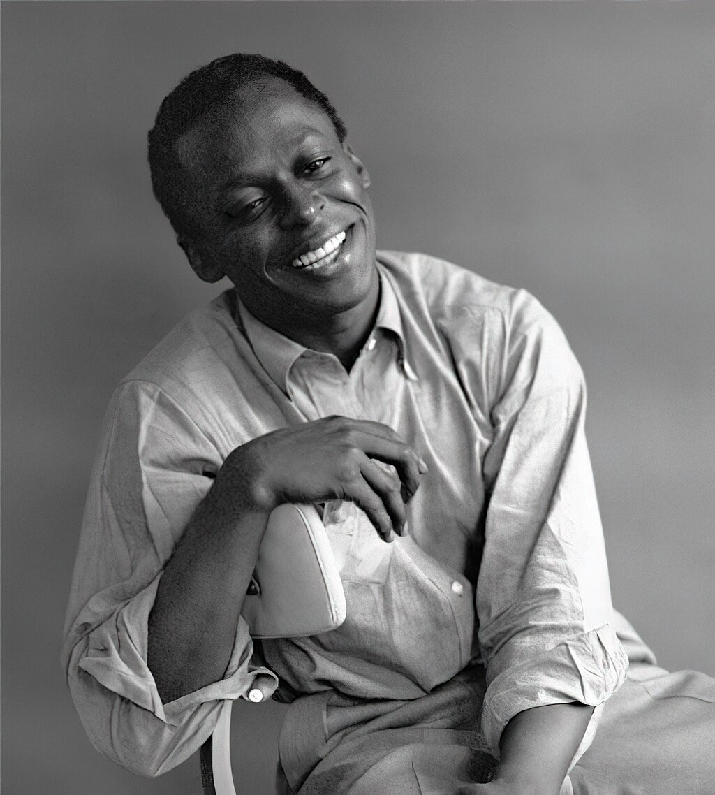

Davis in 1956

Background information

Born

Miles Dewey Davis III

(1926-05-26)May 26, 1926

[Alton, Illinois](https://en.wikipedia.org/wiki/Alton,_Illinois "Alton, Illinois"), U.S.

Died

September 28, 1991(1991-09-28) (aged 65)

[Santa Monica, California](https://en.wikipedia.org/wiki/Santa_Monica,_California "Santa Monica, California"), U.S.

Genres

*   [Jazz](/source/jazz/ "Jazz")
*   [bebop](https://en.wikipedia.org/wiki/Bebop "Bebop")
*   [jazz fusion](https://en.wikipedia.org/wiki/Jazz_fusion "Jazz fusion")
*   [avant-garde jazz](https://en.wikipedia.org/wiki/Avant-garde_jazz "Avant-garde jazz")

Occupations

*   Musician
*   bandleader
*   composer

Instruments

*   Trumpet
*   [flugelhorn](https://en.wikipedia.org/wiki/Flugelhorn "Flugelhorn")
*   [cornet](https://en.wikipedia.org/wiki/Cornet "Cornet")
*   piano
*   [electric organ](https://en.wikipedia.org/wiki/Electric_organ "Electric organ")

Works

Years active

*   1944–1975
*   1980–1991

Labels

*   [Capitol](https://en.wikipedia.org/wiki/Capitol_Records "Capitol Records")
*   [Prestige](https://en.wikipedia.org/wiki/Prestige_Records "Prestige Records")
*   [Columbia](https://en.wikipedia.org/wiki/Columbia_Records "Columbia Records")
*   [Fontana](https://en.wikipedia.org/wiki/Fontana_Records "Fontana Records")
*   [Warner Bros.](https://en.wikipedia.org/wiki/Warner_Bros._Records "Warner Bros. Records")

Formerly of

*   [Charlie Parker Quintet](https://en.wikipedia.org/wiki/Charlie_Parker's_Savoy_and_Dial_sessions "Charlie Parker's Savoy and Dial sessions")
*   [Birth of the Cool band](https://en.wikipedia.org/wiki/Birth_of_the_Cool "Birth of the Cool")
*   [Miles Davis Quintet](https://en.wikipedia.org/wiki/Miles_Davis_Quintet "Miles Davis Quintet")

Spouses

*   [Frances Taylor](https://en.wikipedia.org/wiki/Frances_Taylor_Davis "Frances Taylor Davis")

    ​

    ​

    (m. 1959; div. 1968)​

*   [Betty Mabry](https://en.wikipedia.org/wiki/Betty_Mabry "Betty Mabry")

    ​

    ​

    (m. 1968; div. 1969)​

*   [Cicely Tyson](https://en.wikipedia.org/wiki/Cicely_Tyson "Cicely Tyson")

    ​

    ​

    (m. 1981; div. 1989)​

Website

[milesdavis.com](https://milesdavis.com)

**Miles Dewey Davis III** (May 26, 1926 – September 28, 1991) was an American trumpeter, bandleader and composer. He is among the most influential and acclaimed figures in the history of [jazz](/source/jazz/ "Jazz") and [20th-century music](https://en.wikipedia.org/wiki/20th-century_music "20th-century music"). In a career spanning nearly five decades, Davis was at the forefront of several major stylistic developments in jazz, including [bebop](https://en.wikipedia.org/wiki/Bebop "Bebop"), [cool jazz](/source/cool-jazz/ "Cool jazz"), [hard bop](https://en.wikipedia.org/wiki/Hard_bop "Hard bop"), [third stream](https://en.wikipedia.org/wiki/Third_stream "Third stream"), [modal jazz](https://en.wikipedia.org/wiki/Modal_jazz "Modal jazz"), [avant-garde jazz](https://en.wikipedia.org/wiki/Avant-garde_jazz "Avant-garde jazz"), and [jazz fusion](https://en.wikipedia.org/wiki/Jazz_fusion "Jazz fusion"). His legacy extends into [rock](https://en.wikipedia.org/wiki/Rock_music "Rock music"), [funk](https://en.wikipedia.org/wiki/Funk "Funk"), [classical](https://en.wikipedia.org/wiki/Classical_music "Classical music"), and [hip-hop](https://en.wikipedia.org/wiki/Hip-hop "Hip-hop").

Born into an upper-middle-class family in [Alton, Illinois](https://en.wikipedia.org/wiki/Alton,_Illinois "Alton, Illinois"), and raised in [East St. Louis](https://en.wikipedia.org/wiki/East_St._Louis "East St. Louis"), Davis started on the trumpet in his early teens. He left to study at [Juilliard](https://en.wikipedia.org/wiki/Juilliard "Juilliard") in New York City, before dropping out and making his professional debut as a member of saxophonist [Charlie Parker](https://en.wikipedia.org/wiki/Charlie_Parker "Charlie Parker")'s bebop quintet from 1944 to 1948. Shortly afterwards, he recorded the _[Birth of the Cool](https://en.wikipedia.org/wiki/Birth_of_the_Cool "Birth of the Cool")_ sessions for [Capitol Records](https://en.wikipedia.org/wiki/Capitol_Records "Capitol Records"), which were instrumental to the development of cool jazz. In the early 1950s, while addicted to heroin, Davis recorded some of the earliest hard bop music under [Prestige Records](https://en.wikipedia.org/wiki/Prestige_Records "Prestige Records"). After a widely acclaimed comeback performance at the [Newport Jazz Festival](https://en.wikipedia.org/wiki/Newport_Jazz_Festival "Newport Jazz Festival"), he signed a long-term contract with [Columbia Records](https://en.wikipedia.org/wiki/Columbia_Records "Columbia Records"), and recorded the album _['Round About Midnight](https://en.wikipedia.org/wiki/'Round_About_Midnight "'Round About Midnight")_ in 1955. It was his first work with saxophonist [John Coltrane](/source/john-coltrane/ "John Coltrane") and bassist [Paul Chambers](https://en.wikipedia.org/wiki/Paul_Chambers "Paul Chambers"), key members of the sextet he led into the early 1960s. During this period, he alternated between orchestral jazz collaborations with arranger [Gil Evans](https://en.wikipedia.org/wiki/Gil_Evans "Gil Evans"), such as the [Spanish music](https://en.wikipedia.org/wiki/Music_of_Spain "Music of Spain")–influenced _[Sketches of Spain](https://en.wikipedia.org/wiki/Sketches_of_Spain "Sketches of Spain")_ (1960), and band recordings, such as _[Milestones](https://en.wikipedia.org/wiki/Milestones_\(Miles_Davis_album\) "Milestones (Miles Davis album)")_ (1958) and _[Kind of Blue](https://en.wikipedia.org/wiki/Kind_of_Blue "Kind of Blue")_ (1959). The latter recording remains one of the most popular jazz albums of all time, having sold more than five million copies in the U.S.

Davis made several lineup changes while recording _[Someday My Prince Will Come](https://en.wikipedia.org/wiki/Someday_My_Prince_Will_Come_\(Miles_Davis_album\) "Someday My Prince Will Come (Miles Davis album)")_ (1961), his [1961 Blackhawk concerts](https://en.wikipedia.org/wiki/In_Person_Friday_and_Saturday_Nights_at_the_Blackhawk,_Complete "In Person Friday and Saturday Nights at the Blackhawk, Complete"), and _[Seven Steps to Heaven](https://en.wikipedia.org/wiki/Seven_Steps_to_Heaven "Seven Steps to Heaven")_ (1963), another commercial success that introduced bassist [Ron Carter](https://en.wikipedia.org/wiki/Ron_Carter "Ron Carter"), pianist [Herbie Hancock](https://en.wikipedia.org/wiki/Herbie_Hancock "Herbie Hancock") and drummer [Tony Williams](https://en.wikipedia.org/wiki/Tony_Williams_\(drummer\) "Tony Williams (drummer)"). After adding saxophonist [Wayne Shorter](https://en.wikipedia.org/wiki/Wayne_Shorter "Wayne Shorter") to his new quintet in 1964, Davis led them on a series of more abstract recordings often composed by the band members, helping pioneer the [post-bop](https://en.wikipedia.org/wiki/Post-bop "Post-bop") genre with albums such as _[E.S.P.](https://en.wikipedia.org/wiki/E.S.P._\(Miles_Davis_album\) "E.S.P. (Miles Davis album)")_ (1965) and _[Miles Smiles](https://en.wikipedia.org/wiki/Miles_Smiles "Miles Smiles")_ (1967), before transitioning into his electric period. During the 1970s, he experimented with rock, funk, [African rhythms](https://en.wikipedia.org/wiki/African_rhythms "African rhythms"), emerging [electronic music technology](https://en.wikipedia.org/wiki/Electronic_music_technology "Electronic music technology"), and an ever-changing lineup of musicians, including keyboardist [Joe Zawinul](https://en.wikipedia.org/wiki/Joe_Zawinul "Joe Zawinul"), drummer [Al Foster](https://en.wikipedia.org/wiki/Al_Foster "Al Foster"), bassist [Michael Henderson](https://en.wikipedia.org/wiki/Michael_Henderson "Michael Henderson") and guitarist [John McLaughlin](https://en.wikipedia.org/wiki/John_McLaughlin_\(musician\) "John McLaughlin (musician)"). This period, beginning with Davis's 1969 studio album _[In a Silent Way](https://en.wikipedia.org/wiki/In_a_Silent_Way "In a Silent Way")_ and concluding with the 1975 concert recording _[Agharta](https://en.wikipedia.org/wiki/Agharta_\(album\) "Agharta (album)")_, was the most controversial in his career, alienating and challenging many in jazz. His million-selling 1970 record _[Bitches Brew](https://en.wikipedia.org/wiki/Bitches_Brew "Bitches Brew")_ helped spark a resurgence in the genre's commercial popularity with jazz fusion as the decade progressed.

After a five-year retirement due to poor health, Davis resumed his career in the 1980s, employing younger musicians and [pop](https://en.wikipedia.org/wiki/Popular_music "Popular music") sounds on albums such as _[The Man with the Horn](https://en.wikipedia.org/wiki/The_Man_with_the_Horn "The Man with the Horn")_ (1981), _[You're Under Arrest](https://en.wikipedia.org/wiki/You're_Under_Arrest_\(Miles_Davis_album\) "You're Under Arrest (Miles Davis album)")_ (1985) and _[Tutu](https://en.wikipedia.org/wiki/Tutu_\(album\) "Tutu (album)")_ (1986). Critics were often unreceptive but the decade garnered Davis his highest level of commercial recognition. He performed sold-out concerts worldwide, while branching out into visual arts, film and television work, before his death in 1991 from the combined effects of a stroke, [pneumonia](https://en.wikipedia.org/wiki/Pneumonia "Pneumonia") and [respiratory failure](https://en.wikipedia.org/wiki/Respiratory_failure "Respiratory failure"), aged 65. In 2006, Davis was inducted into the [Rock and Roll Hall of Fame](https://en.wikipedia.org/wiki/Rock_and_Roll_Hall_of_Fame "Rock and Roll Hall of Fame"), which recognized him as "one of the key figures in the history of jazz". _[Rolling Stone](https://en.wikipedia.org/wiki/Rolling_Stone "Rolling Stone")_ magazine described him as "the most revered jazz trumpeter of all time, not to mention one of the most important musicians of the 20th century," while [Gerald Early](https://en.wikipedia.org/wiki/Gerald_Early "Gerald Early") called him inarguably one of the most influential and innovative musicians of that period.

## Early life

Davis was born on May 26, 1926, to an affluent [African-American](https://en.wikipedia.org/wiki/African-American "African-American") family in [Alton, Illinois](https://en.wikipedia.org/wiki/Alton,_Illinois "Alton, Illinois"), 15 miles (24 kilometers) north of [St. Louis](https://en.wikipedia.org/wiki/St._Louis "St. Louis"). He had an older sister, Dorothy Mae (1925–1996) and a younger brother, Vernon (1929–1999). His mother, Cleota Mae Henry of [Arkansas](https://en.wikipedia.org/wiki/Arkansas "Arkansas"), was a music teacher and violinist, and his father, [Miles Dewey Davis Jr.](https://en.wikipedia.org/wiki/Miles_Dewey_Davis_Jr. "Miles Dewey Davis Jr."), also of Arkansas, was a dentist. They owned a 200-acre (81 ha) estate near [Pine Bluff, Arkansas](https://en.wikipedia.org/wiki/Pine_Bluff,_Arkansas "Pine Bluff, Arkansas"), with a profitable pig farm. In Pine Bluff, he and his siblings fished, hunted, and rode horses. Davis's grandparents were the owners of an Arkansas farm where he would spend many summers.

In 1927, the family moved to [East St. Louis, Illinois](https://en.wikipedia.org/wiki/East_St._Louis,_Illinois "East St. Louis, Illinois"). They lived on the second floor of a commercial building behind a dental office in a predominantly white neighborhood. Davis's father would soon become distant to his children as the [Great Depression](https://en.wikipedia.org/wiki/Great_Depression "Great Depression") caused him to become increasingly consumed by his job, typically working six days a week. From 1932 to 1934, Davis attended John Robinson Elementary School, an all-black school, then Crispus Attucks, where he performed well in mathematics, music and sports. Davis had previously attended Catholic school. At an early age he liked music, especially blues, big bands and gospel.

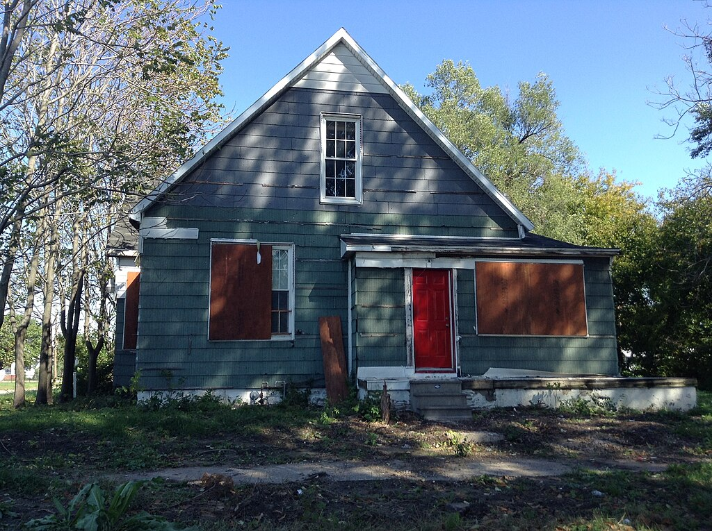The house at 1701 Kansas Avenue in [East St. Louis, Illinois](https://en.wikipedia.org/wiki/East_St._Louis,_Illinois "East St. Louis, Illinois"), where Davis lived from 1939 to 1944

In 1935, Davis received his first trumpet as a gift from John Eubanks, a friend of his father. He then took weekly lessons from "the biggest influence on my life", [Elwood Buchanan](https://en.wikipedia.org/wiki/Elwood_Buchanan "Elwood Buchanan"), a teacher and musician who was a patient of his father. His mother wanted him to play the violin instead. Against the fashion of the time, Buchanan stressed the importance of playing without [vibrato](https://en.wikipedia.org/wiki/Vibrato "Vibrato") and encouraged him to use a clear, mid-range tone. Davis said that whenever he started playing with heavy vibrato, Buchanan slapped his knuckles. In later years Davis said, "I prefer a round sound with no attitude in it, like a round voice with not too much tremolo and not too much bass. Just right in the middle. If I can't get that sound I can't play anything." The family soon moved to 1701 Kansas Avenue in East St. Louis.

In his autobiography, Davis stated: "By the age of 12, music had become the most important thing in my life." On his 13th birthday, his father bought him a new trumpet, and Davis began to play in local bands. He took additional trumpet lessons from Joseph Gustat, principal trumpeter of the [St. Louis Symphony Orchestra](https://en.wikipedia.org/wiki/St._Louis_Symphony_Orchestra "St. Louis Symphony Orchestra"). Davis would also play the trumpet in talent shows he and his siblings would put on.

In 1941, the 15-year-old attended [East St. Louis Lincoln High School](https://en.wikipedia.org/wiki/East_St._Louis_Lincoln_High_School "East St. Louis Lincoln High School"), where he joined the marching band directed by Buchanan and entered music competitions. Years later, Davis said that he was discriminated against in these competitions due to his race, but he added that these experiences made him a better musician. When a drummer asked him to play a certain passage of music, and he could not do it, he began to learn [music theory](/source/music-theory/ "Music theory"). "I went and got everything, every book I could get to learn about theory." At Lincoln, Davis met his first girlfriend, Irene Birth (later Cawthon). He had a band that performed at the Elks Club. Part of his earnings paid for his sister's education at [Fisk University](https://en.wikipedia.org/wiki/Fisk_University "Fisk University"). Davis befriended trumpeter [Clark Terry](https://en.wikipedia.org/wiki/Clark_Terry "Clark Terry"), who suggested he play without vibrato, and performed with him for several years.

With encouragement from his teacher and girlfriend, Davis filled a vacant spot in the [Rhumboogie Orchestra](https://en.wikipedia.org/wiki/Rhumboogie_Café "Rhumboogie Café"), also known as the Blue Devils, led by Eddie Randle. He became the band's musical director, which involved hiring musicians and scheduling rehearsal. Years later, Davis considered this job one of the most important of his career. [Sonny Stitt](https://en.wikipedia.org/wiki/Sonny_Stitt "Sonny Stitt") tried to persuade him to join the [Tiny Bradshaw](https://en.wikipedia.org/wiki/Tiny_Bradshaw "Tiny Bradshaw") band, which was passing through town, but his mother insisted he finish high school before going on tour. He said later, "I didn't talk to her for two weeks. And I didn't go with the band either." In January 1944, Davis finished high school and graduated in absentia in June. During the next month, his girlfriend gave birth to a daughter, Cheryl.

In July 1944, [Billy Eckstine](https://en.wikipedia.org/wiki/Billy_Eckstine "Billy Eckstine") visited St. Louis with a band that included [Art Blakey](https://en.wikipedia.org/wiki/Art_Blakey "Art Blakey"), [Dizzy Gillespie](https://en.wikipedia.org/wiki/Dizzy_Gillespie "Dizzy Gillespie") and [Charlie Parker](https://en.wikipedia.org/wiki/Charlie_Parker "Charlie Parker"). Trumpeter Buddy Anderson was too sick to perform, so Davis was invited to join. He played with the band for two weeks at [Club Riviera](https://en.wikipedia.org/wiki/Club_Riviera "Club Riviera"). After playing with these musicians, he was certain he should move to New York City, "where the action was". His mother wanted him to go to Fisk University, like his sister, and study piano or violin. Davis had other interests.

## Career

### 1944–1948: New York City and the bebop years

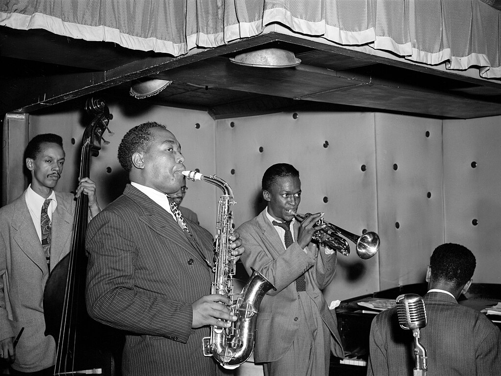[Tommy Potter](https://en.wikipedia.org/wiki/Tommy_Potter "Tommy Potter"), [Charlie Parker](https://en.wikipedia.org/wiki/Charlie_Parker "Charlie Parker"), [Max Roach](https://en.wikipedia.org/wiki/Max_Roach "Max Roach"), Miles Davis and [Duke Jordan](https://en.wikipedia.org/wiki/Duke_Jordan "Duke Jordan") in August 1947

In September 1944, Davis accepted his father's idea of studying at the [Juilliard School of Music](https://en.wikipedia.org/wiki/Juilliard_School_of_Music "Juilliard School of Music") in New York City. After passing the audition, he attended classes in music theory, piano and dictation. Davis often skipped his classes.

Much of Davis's time was spent in clubs seeking his idol, Charlie Parker. According to Davis, [Coleman Hawkins](https://en.wikipedia.org/wiki/Coleman_Hawkins "Coleman Hawkins") told him "finish your studies at Juilliard and forget Bird \[Parker\]". After finding Parker, he joined a cadre of regulars at [Minton's](https://en.wikipedia.org/wiki/Minton's "Minton's") and [Monroe's](https://en.wikipedia.org/wiki/Monroe's "Monroe's") in Harlem who held jam sessions every night. The other regulars included [J. J. Johnson](https://en.wikipedia.org/wiki/J._J._Johnson "J. J. Johnson"), [Kenny Clarke](https://en.wikipedia.org/wiki/Kenny_Clarke "Kenny Clarke"), [Thelonious Monk](https://en.wikipedia.org/wiki/Thelonious_Monk "Thelonious Monk"), [Fats Navarro](https://en.wikipedia.org/wiki/Fats_Navarro "Fats Navarro") and [Freddie Webster](https://en.wikipedia.org/wiki/Freddie_Webster "Freddie Webster"). Davis reunited with Irene and their daughter Cheryl when they moved to New York City. Parker became a roommate. Around this time Davis was paid an allowance of $40 (equivalent to $730 in 2025).

In mid-1945, Davis failed to register for the year's autumn term at Juilliard and dropped out after three semesters because he wanted to perform full-time.

Davis began performing at clubs on 52nd Street with Coleman Hawkins and [Eddie "Lockjaw" Davis](./Eddie_"Lockjaw"_Davis "Eddie \"Lockjaw\" Davis"). He recorded for the first time on April 24, 1945, when he entered the studio as a sideman for [Herbie Fields](https://en.wikipedia.org/wiki/Herbie_Fields "Herbie Fields")'s band. During the next year, he recorded as a leader for the first time with the Miles Davis Sextet plus [Earl Coleman](https://en.wikipedia.org/wiki/Earl_Coleman_\(singer\) "Earl Coleman (singer)") and [Ann Baker](https://en.wikipedia.org/wiki/Ann_Baker_\(singer\) "Ann Baker (singer)"), one of the few times he accompanied a singer.

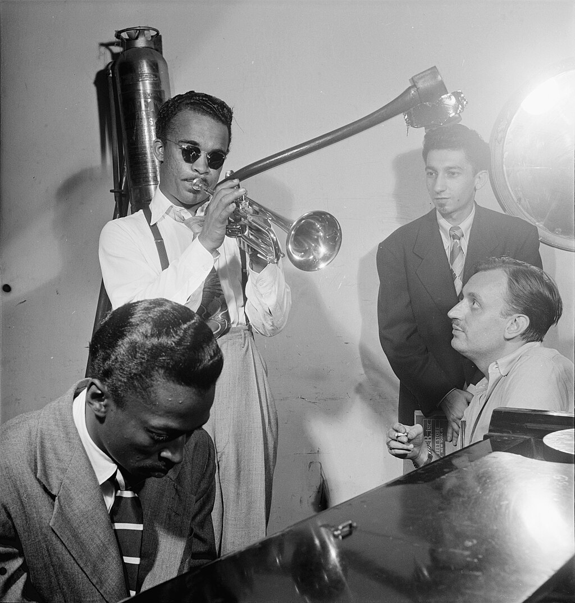Davis on piano with [Howard McGhee](https://en.wikipedia.org/wiki/Howard_McGhee "Howard McGhee") (trumpet), [Joe Albany](https://en.wikipedia.org/wiki/Joe_Albany "Joe Albany") (pianist, standing) and [Brick Fleagle](https://en.wikipedia.org/wiki/Brick_Fleagle "Brick Fleagle") (guitarist, smoking), September 1947

In 1945, Davis replaced Dizzy Gillespie in Charlie Parker's quintet. On November 26, he participated in several recording sessions as part of Parker's group Reboppers that also involved Gillespie and [Max Roach](https://en.wikipedia.org/wiki/Max_Roach "Max Roach"), displaying hints of the style he would become known for. On Parker's tune "[Now's the Time](https://en.wikipedia.org/wiki/Now's_the_Time_\(composition\) "Now's the Time (composition)")", Davis played a solo that anticipated [cool jazz](/source/cool-jazz/ "Cool jazz"). He next joined a big band led by [Benny Carter](https://en.wikipedia.org/wiki/Benny_Carter "Benny Carter"), performing in St. Louis and remaining with the band in California. He again played with Parker and Gillespie. In Los Angeles, Parker had a [nervous breakdown](https://en.wikipedia.org/wiki/Nervous_breakdown "Nervous breakdown") that put him in the hospital for several months. In March 1946, Davis played in studio sessions with Parker and began a collaboration with Mingus that summer. Cawthon gave birth to Davis's second child, Gregory, in East St. Louis before reuniting with Davis in New York City the following year. Davis noted that by this time, "I was still so much into the music that I was even ignoring Irene." He had also turned to alcohol and cocaine.

Davis was a member of [Billy Eckstine](https://en.wikipedia.org/wiki/Billy_Eckstine "Billy Eckstine")'s big band in 1946 and Gillespie's in 1947. He joined a quintet led by Parker that also included Max Roach. Together they performed live with [Duke Jordan](https://en.wikipedia.org/wiki/Duke_Jordan "Duke Jordan") and [Tommy Potter](https://en.wikipedia.org/wiki/Tommy_Potter "Tommy Potter") for much of the year, including several studio sessions. In one session that May, Davis wrote the tune "Cheryl", for his daughter. Davis's first session as a leader followed in August 1947, playing as the Miles Davis All Stars that included Parker, pianist [John Lewis](https://en.wikipedia.org/wiki/John_Lewis_\(pianist\) "John Lewis (pianist)") and bassist [Nelson Boyd](https://en.wikipedia.org/wiki/Nelson_Boyd "Nelson Boyd"); they recorded "Milestones", "[Half Nelson](https://en.wikipedia.org/wiki/Half_Nelson_\(composition\) "Half Nelson (composition)")" and "Sippin' at Bells". After touring Chicago and Detroit with Parker's quintet, Davis returned to New York City in March 1948 and joined the [Jazz at the Philharmonic](https://en.wikipedia.org/wiki/Jazz_at_the_Philharmonic "Jazz at the Philharmonic") tour, which included a stop in St. Louis on April 30.

### 1948–1950: Miles Davis Nonet and _Birth of the Cool_

In August 1948, Davis declined an offer to join [Duke Ellington](https://en.wikipedia.org/wiki/Duke_Ellington "Duke Ellington")'s orchestra as he had entered rehearsals with a nine-piece band featuring baritone saxophonist [Gerry Mulligan](https://en.wikipedia.org/wiki/Gerry_Mulligan "Gerry Mulligan") and arrangements by [Gil Evans](https://en.wikipedia.org/wiki/Gil_Evans "Gil Evans"), taking an active role on what soon became his own project. Evans' Manhattan apartment had become the meeting place for several young musicians and composers such as Davis, Roach, Lewis and Mulligan who were unhappy with the increasingly virtuoso instrumental techniques that dominated bebop. These gatherings led to the formation of the Miles Davis [Nonet](https://en.wikipedia.org/wiki/Nonet_\(music\) "Nonet (music)"), which included atypical modern jazz instruments such as [French horn](https://en.wikipedia.org/wiki/French_horn_in_jazz "French horn in jazz") and [tuba](https://en.wikipedia.org/wiki/Tuba "Tuba"), leading to a thickly textured, almost orchestral sound. The intent was to imitate the human voice through carefully arranged compositions and a relaxed, melodic approach to improvisation. In September, the band completed their sole engagement as the opening band for [Count Basie](https://en.wikipedia.org/wiki/Count_Basie "Count Basie") at the [Royal Roost](https://en.wikipedia.org/wiki/Royal_Roost "Royal Roost") for two weeks. Davis had to persuade the venue's manager to write the sign "Miles Davis Nonet. Arrangements by Gil Evans, John Lewis and Gerry Mulligan". Davis returned to Parker's quintet, but relationships within the quintet were growing tense mainly due to Parker's erratic behavior caused by his drug addiction. Early in his time with Parker, Davis abstained from drugs, chose a vegetarian diet, and spoke of the benefits of water and juice.

In December 1948, Davis quit, saying he was not being paid. His departure began a period when he worked mainly as a freelancer and sideman. His nonet remained active until the end of 1949. After signing a contract with [Capitol Records](https://en.wikipedia.org/wiki/Capitol_Records "Capitol Records"), they recorded sessions in January and April 1949, which sold little but influenced the "Cool" or "[West Coast](https://en.wikipedia.org/wiki/West_Coast_jazz "West Coast jazz")" style of jazz. The lineup changed throughout the year and included tuba player [Bill Barber](https://en.wikipedia.org/wiki/Bill_Barber_\(musician\) "Bill Barber (musician)"), alto saxophonist [Lee Konitz](https://en.wikipedia.org/wiki/Lee_Konitz "Lee Konitz"), pianist [Al Haig](https://en.wikipedia.org/wiki/Al_Haig "Al Haig"), trombone players [Mike Zwerin](https://en.wikipedia.org/wiki/Mike_Zwerin "Mike Zwerin") with [Kai Winding](https://en.wikipedia.org/wiki/Kai_Winding "Kai Winding"), French horn players [Junior Collins](https://en.wikipedia.org/wiki/Junior_Collins "Junior Collins") with Sandy Siegelstein and [Gunther Schuller](https://en.wikipedia.org/wiki/Gunther_Schuller "Gunther Schuller"), and bassists [Al McKibbon](https://en.wikipedia.org/wiki/Al_McKibbon "Al McKibbon") and [Joe Shulman](https://en.wikipedia.org/wiki/Joe_Shulman "Joe Shulman"). One track featured singer [Kenny Hagood](https://en.wikipedia.org/wiki/Kenny_Hagood "Kenny Hagood"). The presence of white musicians in the group angered some black players, many of whom were unemployed at the time, yet Davis rebuffed their criticisms. Recording sessions with the nonet for Capitol continued until April 1950. The Nonet recorded a dozen tracks which were released as singles and subsequently compiled on the 1957 album _[Birth of the Cool](https://en.wikipedia.org/wiki/Birth_of_the_Cool "Birth of the Cool")_.

In May 1949, Davis performed with the [Tadd Dameron](https://en.wikipedia.org/wiki/Tadd_Dameron "Tadd Dameron") Quintet with [Kenny Clarke](https://en.wikipedia.org/wiki/Kenny_Clarke "Kenny Clarke") and [James Moody](https://en.wikipedia.org/wiki/James_Moody_\(saxophonist\) "James Moody (saxophonist)") at the [Paris International Jazz Festival](https://en.wikipedia.org/wiki/Paris_Jazz_Festival "Paris Jazz Festival"). On his first trip abroad Davis took a strong liking to Paris and its cultural environment, where he felt black jazz musicians and people of color in general were better respected than in the U.S. The trip, he said, "changed the way I looked at things forever". He began an affair with singer and actress [Juliette Gréco](https://en.wikipedia.org/wiki/Juliette_Gréco "Juliette Gréco").

### 1949–1955: Signing with Prestige, heroin addiction and hard bop

After returning from Paris in mid-1949, Davis became depressed and found little work except a short engagement with [Bud Powell](https://en.wikipedia.org/wiki/Bud_Powell "Bud Powell") in October and guest spots in New York City, Chicago and Detroit until January 1950. He was falling behind in hotel rent and attempts were made to repossess his car. His heroin use became an expensive addiction, and Davis, not yet 24 years old, "lost my sense of discipline, lost my sense of control over my life, and started to drift". In August 1950, Cawthon gave birth to Davis's second son, Miles IV. Davis befriended boxer [Johnny Bratton](https://en.wikipedia.org/wiki/Johnny_Bratton "Johnny Bratton") which began his interest in the sport. Davis left Cawthon and his three children in New York City in the hands of one his friends, jazz singer [Betty Carter](https://en.wikipedia.org/wiki/Betty_Carter "Betty Carter"). He toured with Eckstine and [Billie Holiday](https://en.wikipedia.org/wiki/Billie_Holiday "Billie Holiday") and was arrested for heroin possession in Los Angeles. The story was reported in _[DownBeat](https://en.wikipedia.org/wiki/DownBeat "DownBeat")_ magazine, which led to a further reduction in work, though he was acquitted weeks later. By the 1950s, Davis had become more skilled and was experimenting with the middle register of the trumpet alongside harmonies and rhythms.

In January 1951, Davis's fortunes improved when he signed a one-year contract with [Prestige](https://en.wikipedia.org/wiki/Prestige_Records "Prestige Records") after owner [Bob Weinstock](https://en.wikipedia.org/wiki/Bob_Weinstock "Bob Weinstock") became a fan of the nonet. Davis chose Lewis, trombonist [Bennie Green](https://en.wikipedia.org/wiki/Bennie_Green "Bennie Green"), bassist [Percy Heath](https://en.wikipedia.org/wiki/Percy_Heath "Percy Heath"), saxophonist [Sonny Rollins](https://en.wikipedia.org/wiki/Sonny_Rollins "Sonny Rollins") and drummer [Roy Haynes](https://en.wikipedia.org/wiki/Roy_Haynes "Roy Haynes"); they recorded what became part of _[Miles Davis and Horns](https://en.wikipedia.org/wiki/Miles_Davis_and_Horns "Miles Davis and Horns")_ (1956). Davis was hired for other studio dates in 1951 and began to transcribe scores for record labels to fund his heroin addiction. His second session for Prestige was released on _[The New Sounds](https://en.wikipedia.org/wiki/The_New_Sounds "The New Sounds")_ (1951), _[Dig](https://en.wikipedia.org/wiki/Dig_\(Miles_Davis_album\) "Dig (Miles Davis album)")_ (1956) and _[Conception](https://en.wikipedia.org/wiki/Conception_\(album\) "Conception (album)")_ (1956).

Davis supported his heroin habit by playing music and by living the life of a hustler, exploiting prostitutes and receiving money from friends. By 1953, his addiction began to impair his playing. His drug habit became public in a _DownBeat_ interview with [Cab Calloway](https://en.wikipedia.org/wiki/Cab_Calloway "Cab Calloway"), whom he never forgave as it brought him "all pain and suffering". He returned to St. Louis and stayed with his father for several months. After a brief period with Roach and Mingus in September 1953, he returned to his father's home, where he concentrated on addressing his addiction.

Davis lived in Detroit for about six months, avoiding New York City, where it was easy to get drugs. Though he used heroin, he was still able to perform locally with [Elvin Jones](https://en.wikipedia.org/wiki/Elvin_Jones "Elvin Jones") and [Tommy Flanagan](https://en.wikipedia.org/wiki/Tommy_Flanagan_\(musician\) "Tommy Flanagan (musician)") as part of [Billy Mitchell](https://en.wikipedia.org/wiki/Billy_Mitchell_\(saxophonist\) "Billy Mitchell (saxophonist)")'s house band at the [Blue Bird](https://en.wikipedia.org/wiki/Blue_Bird_Inn "Blue Bird Inn") club. He was also "pimping a little". However, he was able to end his addiction, and, in February 1954, Davis returned to New York City, feeling good "for the first time in a long time", mentally and physically stronger, and joined a gym. He informed Weinstock and [Blue Note](https://en.wikipedia.org/wiki/Blue_Note "Blue Note") that he was ready to record with a quintet, which he was granted. He considered the albums that resulted from these and earlier sessions—_[Miles Davis Quartet](https://en.wikipedia.org/wiki/Miles_Davis_Quartet "Miles Davis Quartet")_ and _[Miles Davis Volume 2](https://en.wikipedia.org/wiki/Miles_Davis_Volume_2 "Miles Davis Volume 2")_—"very important" because he felt his performances were particularly strong. He was paid roughly $750 (equivalent to $9,000 in 2025) for each album and refused to give away his publishing rights.

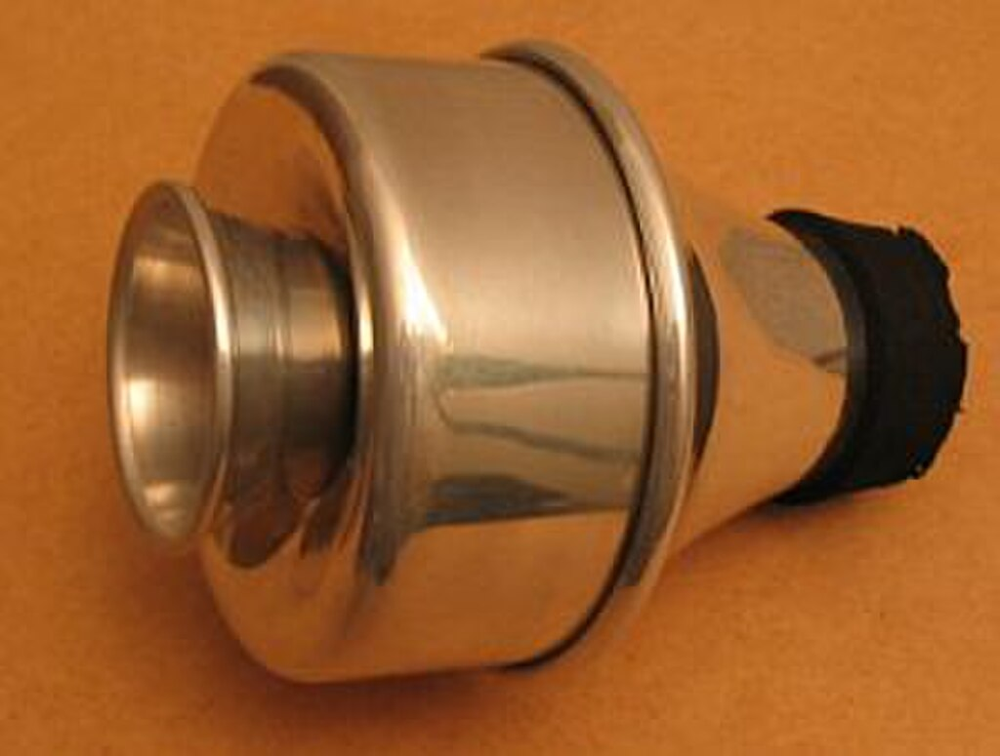During the 1950s, Davis started using a [Harmon mute](https://en.wikipedia.org/wiki/Harmon_mute "Harmon mute") on his trumpet. It became part of his signature sound for the rest of his career.

Davis abandoned the bebop style and turned to the music of pianist [Ahmad Jamal](https://en.wikipedia.org/wiki/Ahmad_Jamal "Ahmad Jamal"), whose approach and use of space influenced him. When he returned to the studio in June 1955 to record _The Musings of Miles_, he wanted a pianist like Jamal and chose [Red Garland](https://en.wikipedia.org/wiki/Red_Garland "Red Garland"). _[Blue Haze](https://en.wikipedia.org/wiki/Blue_Haze "Blue Haze")_ (1956), _[Bags' Groove](https://en.wikipedia.org/wiki/Bags'_Groove "Bags' Groove")_ (1957), _[Walkin'](https://en.wikipedia.org/wiki/Walkin' "Walkin'")_ (1957), and _[Miles Davis and the Modern Jazz Giants](https://en.wikipedia.org/wiki/Miles_Davis_and_the_Modern_Jazz_Giants "Miles Davis and the Modern Jazz Giants")_ (1959) documented the evolution of his sound with the [Harmon mute](https://en.wikipedia.org/wiki/Harmon_mute "Harmon mute") placed close to the microphone, and the use of more spacious and relaxed phrasing. He assumed a central role in [hard bop](https://en.wikipedia.org/wiki/Hard_bop "Hard bop"), less radical in harmony and melody, and used popular songs and American standards as starting points for improvisation. Hard bop distanced itself from cool jazz with a harder beat and music inspired by the blues. A few critics consider _Walkin'_ (April 1954) the album that created the hard bop genre.

Davis gained a reputation for being cold, distant and easily angered. He wrote that in 1954 [Sugar Ray Robinson](https://en.wikipedia.org/wiki/Sugar_Ray_Robinson "Sugar Ray Robinson") "was the most important thing in my life besides music", and he adopted Robinson's "arrogant attitude". He showed contempt for critics and the press.

Davis had an operation to remove [polyps](https://en.wikipedia.org/wiki/Polyp_\(medicine\) "Polyp (medicine)") from his larynx in October 1955. The doctors told him to remain silent after the operation, but he got into an argument that permanently damaged his vocal cords and gave him a raspy voice for the rest of his life. He was called the "prince of darkness", adding a patina of mystery to his public persona.

### 1955–1959: Signing with Columbia, first quintet and modal jazz

In July 1955, Davis's fortunes improved considerably when he played at the [Newport Jazz Festival](https://en.wikipedia.org/wiki/Newport_Jazz_Festival "Newport Jazz Festival"), with a lineup of Monk, Heath, drummer [Connie Kay](https://en.wikipedia.org/wiki/Connie_Kay "Connie Kay"), and horn players [Zoot Sims](https://en.wikipedia.org/wiki/Zoot_Sims "Zoot Sims") and [Gerry Mulligan](https://en.wikipedia.org/wiki/Gerry_Mulligan "Gerry Mulligan"). The performance was praised by critics and audiences alike, who considered it to be a highlight of the festival as well as helping Davis, the least well known musician in the group, to increase his popularity among affluent white audiences. He tied with Dizzy Gillespie for best trumpeter in the 1955 _DownBeat_ magazine Readers' Poll.

[George Avakian](https://en.wikipedia.org/wiki/George_Avakian "George Avakian") of [Columbia Records](https://en.wikipedia.org/wiki/Columbia_Records "Columbia Records") heard Davis perform at Newport and wanted to sign him to the label. Davis had one year left on his contract with Prestige, which required him to release four more albums. He signed a contract with Columbia that included a $4,000 advance (equivalent to $48,070 in 2025) and required that his recordings for Columbia remain unreleased until his agreement with Prestige expired.

At the request of Avakian, he formed the [Miles Davis Quintet](https://en.wikipedia.org/wiki/Miles_Davis_Quintet "Miles Davis Quintet") for a performance at [Café Bohemia](https://en.wikipedia.org/wiki/Café_Bohemia "Café Bohemia"). The quintet contained Sonny Rollins on tenor saxophone, [Red Garland](https://en.wikipedia.org/wiki/Red_Garland "Red Garland") on piano, [Paul Chambers](https://en.wikipedia.org/wiki/Paul_Chambers "Paul Chambers") on double bass and [Philly Joe Jones](https://en.wikipedia.org/wiki/Philly_Joe_Jones "Philly Joe Jones") on drums. Rollins was replaced by [John Coltrane](/source/john-coltrane/ "John Coltrane"), completing the membership of the first quintet. To fulfill Davis's contract with Prestige, this new group worked through [two marathon sessions](https://en.wikipedia.org/wiki/The_Legendary_Prestige_Quintet_Sessions "The Legendary Prestige Quintet Sessions") in May and October 1956 that were released by the label as four LPs: _[Cookin' with the Miles Davis Quintet](https://en.wikipedia.org/wiki/Cookin'_with_the_Miles_Davis_Quintet "Cookin' with the Miles Davis Quintet")_ (1957), _[Relaxin' with the Miles Davis Quintet](https://en.wikipedia.org/wiki/Relaxin'_with_the_Miles_Davis_Quintet "Relaxin' with the Miles Davis Quintet")_ (1958), _[Workin' with the Miles Davis Quintet](https://en.wikipedia.org/wiki/Workin'_with_the_Miles_Davis_Quintet "Workin' with the Miles Davis Quintet")_ (1960) and _[Steamin' with the Miles Davis Quintet](https://en.wikipedia.org/wiki/Steamin'_with_the_Miles_Davis_Quintet "Steamin' with the Miles Davis Quintet")_ (1961). Each album was critically acclaimed and helped establish Davis's quintet as one of the best.

The style of the group was an extension of their experience playing with Davis. He played long, legato, melodic lines, while Coltrane contrasted with energetic solos. Their live repertoire was a mix of bebop, standards from the [Great American Songbook](https://en.wikipedia.org/wiki/Great_American_Songbook "Great American Songbook") and pre-bop eras, and traditional tunes. They appeared on _['Round About Midnight](https://en.wikipedia.org/wiki/'Round_About_Midnight "'Round About Midnight")_, Davis's first album for Columbia.

In 1956, he left his quintet temporarily to tour Europe as part of the Birdland All-Stars, which included the [Modern Jazz Quartet](https://en.wikipedia.org/wiki/Modern_Jazz_Quartet "Modern Jazz Quartet") and French and German musicians. In Paris, he reunited with Gréco and they "were lovers for many years". He then returned home, reunited his quintet and toured the US for two months. Conflict arose on tour when he grew impatient with the drug habits of Jones and Coltrane. Davis was trying to live a healthier life by exercising and reducing his use of alcohol. But he continued to use cocaine. At the end of the tour, he fired Jones and Coltrane and replaced them with Sonny Rollins and [Art Taylor](https://en.wikipedia.org/wiki/Art_Taylor "Art Taylor").

In November 1957, Davis went to Paris and recorded the [soundtrack](https://en.wikipedia.org/wiki/Ascenseur_pour_l'échafaud_\(soundtrack\) "Ascenseur pour l'échafaud (soundtrack)") to _[Ascenseur pour l'échafaud](https://en.wikipedia.org/wiki/Elevator_to_the_Gallows "Elevator to the Gallows")_. directed by [Louis Malle](https://en.wikipedia.org/wiki/Louis_Malle "Louis Malle") and starring [Jeanne Moreau](https://en.wikipedia.org/wiki/Jeanne_Moreau "Jeanne Moreau"). Consisting of French jazz musicians [Barney Wilen](https://en.wikipedia.org/wiki/Barney_Wilen "Barney Wilen"), [Pierre Michelot](https://en.wikipedia.org/wiki/Pierre_Michelot "Pierre Michelot") and [René Urtreger](https://en.wikipedia.org/wiki/René_Urtreger "René Urtreger"), and American drummer [Kenny Clarke](https://en.wikipedia.org/wiki/Kenny_Clarke "Kenny Clarke"), the group avoided a written score and instead improvised while they watched the film in a recording studio.

After returning to New York, Davis revived his quintet with Adderley and Coltrane, who was clean from his drug habit. Now a sextet, the group recorded material in early 1958 that was released on _[Milestones](https://en.wikipedia.org/wiki/Milestones_\(Miles_Davis_album\) "Milestones (Miles Davis album)")_, an album on which the title track demonstrated Davis's interest in [modal jazz](https://en.wikipedia.org/wiki/Modal_jazz "Modal jazz"). A performance by [Les Ballets Africains](https://en.wikipedia.org/wiki/Les_Ballets_Africains "Les Ballets Africains") drew him to slower, deliberate music that allowed the creation of solos from static harmony rather than constant changing chords.

By May 1958, he had replaced Jones with drummer [Jimmy Cobb](https://en.wikipedia.org/wiki/Jimmy_Cobb "Jimmy Cobb"), and Garland left the group, leaving Davis to play piano on "Sid's Ahead" for _Milestones_. He wanted someone who could play modal jazz, so he hired [Bill Evans](https://en.wikipedia.org/wiki/Bill_Evans "Bill Evans"), a young pianist with a background in classical music. This new edition of the sextet made their recording debut on _[Jazz Track](https://en.wikipedia.org/wiki/Jazz_Track "Jazz Track")_ (1958). Evans had an impressionistic approach to piano. His ideas greatly influenced Davis. But after eight months of touring, a tired Evans left. [Wynton Kelly](https://en.wikipedia.org/wiki/Wynton_Kelly "Wynton Kelly"), his replacement, brought to the group a swinging style that contrasted with Evans's delicacy.

### 1957–1963: Collaborations with Gil Evans and _Kind of Blue_

By early 1957, Davis was exhausted from recording and touring and wished to pursue new projects. In March, the 30-year-old Davis told journalists of his intention to retire soon and revealed offers he had received to teach at [Harvard University](https://en.wikipedia.org/wiki/Harvard_University "Harvard University") and be a musical director at a record label. Avakian agreed that it was time for Davis to explore something different, but Davis rejected his suggestion of returning to his nonet as he considered that a step backward. Avakian then suggested that he work with a bigger ensemble, similar to _Music for Brass_ (1957), an album of orchestral and brass-arranged music led by [Gunther Schuller](https://en.wikipedia.org/wiki/Gunther_Schuller "Gunther Schuller") featuring Davis as a guest soloist.

Davis accepted and worked with Gil Evans in what became a five-album collaboration from 1957 to 1962. _[Miles Ahead](https://en.wikipedia.org/wiki/Miles_Ahead_\(album\) "Miles Ahead (album)")_ (1957) showcased Davis on flugelhorn and a rendition of "The Maids of Cadiz" by [Léo Delibes](https://en.wikipedia.org/wiki/Léo_Delibes "Léo Delibes"), the first piece of classical music that Davis recorded. Evans devised orchestral passages as transitions, thus turning the album into one long piece of music. _[Porgy and Bess](https://en.wikipedia.org/wiki/Porgy_and_Bess_\(Miles_Davis_album\) "Porgy and Bess (Miles Davis album)")_ (1959) includes arrangements of pieces from George Gershwin's [opera](https://en.wikipedia.org/wiki/Porgy_and_Bess "Porgy and Bess"). _[Sketches of Spain](https://en.wikipedia.org/wiki/Sketches_of_Spain "Sketches of Spain")_ (1960) contained music by [Joaquín Rodrigo](https://en.wikipedia.org/wiki/Joaquín_Rodrigo "Joaquín Rodrigo") and [Manuel de Falla](https://en.wikipedia.org/wiki/Manuel_de_Falla "Manuel de Falla") and originals by Evans. The classical musicians had trouble improvising, while the jazz musicians could not handle the difficult arrangements, but the album was a critical success, selling more than 120,000 copies in the US. Davis performed with an orchestra conducted by Evans at Carnegie Hall in May 1961 to raise money for charity. The pair's final album was _[Quiet Nights](https://en.wikipedia.org/wiki/Quiet_Nights_\(Miles_Davis_album\) "Quiet Nights (Miles Davis album)")_ (1963), a collection of [bossa nova](https://en.wikipedia.org/wiki/Bossa_nova "Bossa nova") songs released against their wishes. Evans stated it was only half an album and blamed the record company; Davis blamed producer [Teo Macero](https://en.wikipedia.org/wiki/Teo_Macero "Teo Macero") and refused to speak to him for more than two years. The boxed set _[Miles Davis & Gil Evans: The Complete Columbia Studio Recordings](https://en.wikipedia.org/wiki/Miles_Davis_&_Gil_Evans:_The_Complete_Columbia_Studio_Recordings "Miles Davis & Gil Evans: The Complete Columbia Studio Recordings")_ (1996) won the [Grammy Award for Best Historical Album](https://en.wikipedia.org/wiki/Grammy_Award_for_Best_Historical_Album "Grammy Award for Best Historical Album") and [Best Album Notes](https://en.wikipedia.org/wiki/Best_Album_Notes "Best Album Notes") in 1997.

In March and April 1959, Davis recorded what some consider his greatest album, _[Kind of Blue](https://en.wikipedia.org/wiki/Kind_of_Blue "Kind of Blue")_. He named the album for its mood. He called back Bill Evans, as the music had been planned around Evans's piano style. Both Davis and Evans were familiar with [George Russell](https://en.wikipedia.org/wiki/George_Russell_\(composer\) "George Russell (composer)")'s ideas about modal jazz. But Davis neglected to tell pianist Wynton Kelly that Evans was returning, so Kelly appeared on only one song, "[Freddie Freeloader](https://en.wikipedia.org/wiki/Freddie_Freeloader "Freddie Freeloader")". The sextet had played "[So What](https://en.wikipedia.org/wiki/So_What_\(Miles_Davis_composition\) "So What (Miles Davis composition)")" and "[All Blues](https://en.wikipedia.org/wiki/All_Blues "All Blues")" at performances, but the remaining three compositions they saw for the first time in the studio.

Released in August 1959, _Kind of Blue_ was an instant success, with widespread radio airplay and rave reviews from critics. It has remained a strong seller over the years. In 2019, the album achieved [5× platinum](https://en.wikipedia.org/wiki/RIAA_certification "RIAA certification") certification from the [Recording Industry Association of America](https://en.wikipedia.org/wiki/Recording_Industry_Association_of_America "Recording Industry Association of America") for sales of more than five million copies in the US, making it one of the most successful jazz albums in history. In 2009, the US House of Representatives passed a resolution that honored it as a national treasure.

In August 1959, during a break in a recording session at the [Birdland](https://en.wikipedia.org/wiki/Birdland_\(New_York_jazz_club\) "Birdland (New York jazz club)") nightclub in New York City, Davis was escorting a blonde-haired woman to a taxi outside the club when policeman Gerald Kilduff told him to "move on". Davis said that he was working at the club, and he refused to move. Kilduff arrested and grabbed Davis as he tried to protect himself. Witnesses said the policeman hit Davis in the stomach with a nightstick without provocation. Two detectives held the crowd back, while a third approached Davis from behind and beat him over the head. Davis was taken to jail, charged with assaulting an officer, then taken to the hospital where he received five stitches. By January 1960, he was acquitted of disorderly conduct and third-degree assault. He later stated the incident "changed my whole life and whole attitude again, made me feel bitter and cynical again when I was starting to feel good about the things that had changed in this country".

Davis and his sextet toured to support _Kind of Blue_. Cannonball Adderley left the group September of that year reducing the band back to a quintet. Coltrane was ready to leave as well but Davis persuaded him to play with the group on one final European tour in the spring of 1960. Coltrane then departed to form his quartet, though he returned for a couple tracks on Davis's album _[Someday My Prince Will Come](https://en.wikipedia.org/wiki/Someday_My_Prince_Will_Come_\(Miles_Davis_album\) "Someday My Prince Will Come (Miles Davis album)")_ (1961). Its front cover shows a photograph of Davis's wife, [Frances Taylor](https://en.wikipedia.org/wiki/Frances_Taylor_Davis "Frances Taylor Davis"), after Davis demanded that Columbia depict black women on his album covers.

### 1963–1968: Second quintet

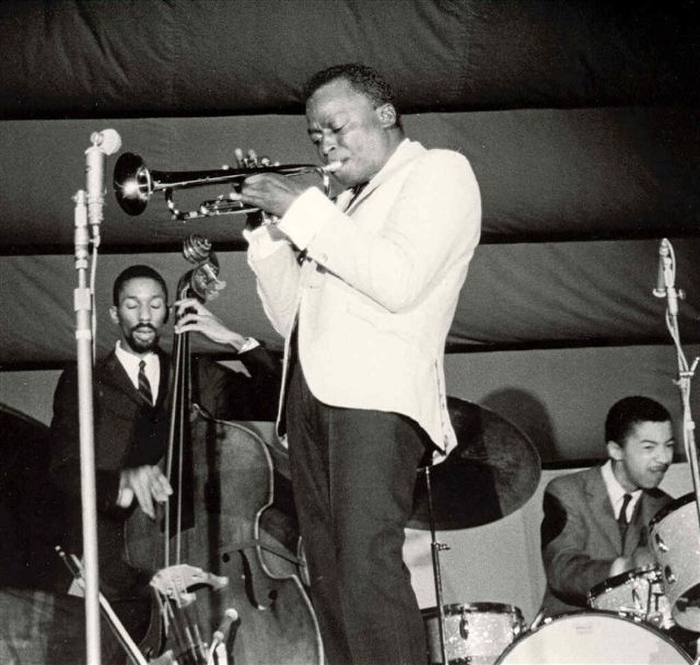Davis performing in Antibes, France, in July 1963

In December 1962, Davis, Rollins, Kelly, Chambers and Cobb played together for the last time as the latter three wanted to leave and play as a trio. Rollins left them soon after, leaving Davis to pay more than $25,000 (equivalent to $266,100 in 2025) to cancel upcoming gigs and quickly assemble a new group. Following auditions, he found his new band in tenor saxophonist [George Coleman](https://en.wikipedia.org/wiki/George_Coleman "George Coleman"), bassist [Ron Carter](https://en.wikipedia.org/wiki/Ron_Carter "Ron Carter"), pianist [Victor Feldman](https://en.wikipedia.org/wiki/Victor_Feldman "Victor Feldman") and drummer [Frank Butler](https://en.wikipedia.org/wiki/Frank_Butler_\(musician\) "Frank Butler (musician)"). By May 1963, Feldman and Butler were replaced by 23-year-old pianist [Herbie Hancock](https://en.wikipedia.org/wiki/Herbie_Hancock "Herbie Hancock") and 17-year-old drummer [Tony Williams](https://en.wikipedia.org/wiki/Tony_Williams_\(drummer\) "Tony Williams (drummer)") who made Davis "excited all over again". With this group, Davis completed the rest of what became _[Seven Steps to Heaven](https://en.wikipedia.org/wiki/Seven_Steps_to_Heaven "Seven Steps to Heaven")_ (1963) and recorded the live albums _[Miles Davis in Europe](https://en.wikipedia.org/wiki/Miles_Davis_in_Europe "Miles Davis in Europe")_ (1964), _[My Funny Valentine](https://en.wikipedia.org/wiki/My_Funny_Valentine:_Miles_Davis_in_Concert "My Funny Valentine: Miles Davis in Concert")_ (1965) and _[Four & More](https://en.wikipedia.org/wiki/Four_&_More "Four & More")_ (1966). The quintet played essentially the same bebop tunes and standards that Davis's previous bands had played, but they approached them with structural and rhythmic freedom and occasionally breakneck speed.

In 1964, Coleman was briefly replaced by saxophonist [Sam Rivers](https://en.wikipedia.org/wiki/Sam_Rivers_\(jazz_musician\) "Sam Rivers (jazz musician)") (who recorded with Davis on _[Miles in Tokyo](https://en.wikipedia.org/wiki/Miles_in_Tokyo "Miles in Tokyo")_) until [Wayne Shorter](https://en.wikipedia.org/wiki/Wayne_Shorter "Wayne Shorter") was persuaded to leave the [Jazz Messengers](https://en.wikipedia.org/wiki/Jazz_Messengers "Jazz Messengers"). The quintet with Shorter lasted through 1968, with Shorter becoming the group's principal composer. The album _[E.S.P.](https://en.wikipedia.org/wiki/E.S.P._\(Miles_Davis_album\) "E.S.P. (Miles Davis album)")_ (1965) was named after his composition. While touring Europe, the group made its first album, _[Miles in Berlin](https://en.wikipedia.org/wiki/Miles_in_Berlin "Miles in Berlin")_ (1965).

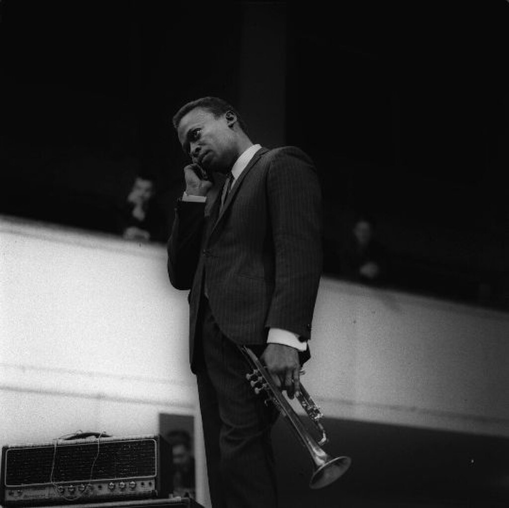Davis performing at [Töölö Sports Hall](https://en.wikipedia.org/wiki/Töölö_Sports_Hall "Töölö Sports Hall") (Messuhalli) in [Helsinki](https://en.wikipedia.org/wiki/Helsinki "Helsinki"), Finland, in October 1964

Davis needed medical attention for hip pain, which had worsened since his Japanese tour during the previous year. He underwent hip replacement surgery in April 1965, with bone taken from his shin, but it failed. After his third month in the hospital, he discharged himself due to boredom and went home. He returned to the hospital in August after a fall required the insertion of a plastic hip joint. In November 1965, he had recovered enough to return to performing with his quintet, which included [gigs at the Plugged Nickel](https://en.wikipedia.org/wiki/The_Complete_Live_at_the_Plugged_Nickel_1965 "The Complete Live at the Plugged Nickel 1965") in Chicago. Teo Macero returned as his record producer after their rift over _Quiet Nights_ had healed.

In January 1966, Davis spent three months in the hospital with a liver infection. When he resumed touring, he performed more at colleges because he had grown tired of the typical jazz venues. Columbia president [Clive Davis](https://en.wikipedia.org/wiki/Clive_Davis "Clive Davis") reported in 1966 his sales had declined to around 40,000–50,000 per album, compared to as many as 100,000 per release a few years before. Matters were not helped by the press reporting his apparent financial troubles and imminent demise. After his appearance at the 1966 Newport Jazz Festival, he returned to the studio with his quintet for a series of sessions. He started a relationship with actress [Cicely Tyson](https://en.wikipedia.org/wiki/Cicely_Tyson "Cicely Tyson"), who helped him reduce his alcohol consumption.

Material from the 1966–1968 sessions was released on _[Miles Smiles](https://en.wikipedia.org/wiki/Miles_Smiles "Miles Smiles")_ (1966), _[Sorcerer](https://en.wikipedia.org/wiki/Sorcerer_\(Miles_Davis_album\) "Sorcerer (Miles Davis album)")_ (1967), _[Nefertiti](https://en.wikipedia.org/wiki/Nefertiti_\(Miles_Davis_album\) "Nefertiti (Miles Davis album)")_ (1967), _[Miles in the Sky](https://en.wikipedia.org/wiki/Miles_in_the_Sky "Miles in the Sky")_ (1968) and _[Filles de Kilimanjaro](https://en.wikipedia.org/wiki/Filles_de_Kilimanjaro "Filles de Kilimanjaro")_ (1968). The quintet's approach to the new music became known as "time no changes"—which referred to Davis's decision to depart from chordal sequences and adopt a more open approach, with the rhythm section responding to the soloists' melodies. Through _Nefertiti_ the studio recordings consisted primarily of originals composed by Shorter, with occasional compositions by the other sidemen. In 1967, the group began to play their concerts in continuous sets, each tune flowing into the next, with only the melody indicating any sort of change. His bands performed this way until his hiatus in 1975.

_Miles in the Sky_ and _Filles de Kilimanjaro_—which tentatively introduced electric bass, electric piano and electric guitar on some tracks—pointed the way to the [fusion](https://en.wikipedia.org/wiki/Jazz_fusion "Jazz fusion") phase of Davis's career. He also began experimenting with more rock-oriented rhythms on these records. By the time the second half of _Filles de Kilimanjaro_ was recorded, bassist [Dave Holland](https://en.wikipedia.org/wiki/Dave_Holland_\(bassist\) "Dave Holland (bassist)") and pianist [Chick Corea](https://en.wikipedia.org/wiki/Chick_Corea "Chick Corea") had replaced Carter and Hancock. Davis soon took over the compositional duties of his sidemen.

### 1968–1975: The electric period

_[In a Silent Way](https://en.wikipedia.org/wiki/In_a_Silent_Way "In a Silent Way")_ was recorded in a single studio session in February 1969, with Shorter, Hancock, Holland and Williams alongside keyboardists [Chick Corea](https://en.wikipedia.org/wiki/Chick_Corea "Chick Corea") and [Joe Zawinul](https://en.wikipedia.org/wiki/Joe_Zawinul "Joe Zawinul") and guitarist [John McLaughlin](https://en.wikipedia.org/wiki/John_McLaughlin_\(musician\) "John McLaughlin (musician)"). The album contains two side-long tracks that Macero pieced together from different takes recorded at the session. When the album was released later that year, some critics accused him of "selling out" to the rock and roll audience. Nevertheless, it reached number 134 on the US [_Billboard_ Top LPs](https://en.wikipedia.org/wiki/Billboard_200 "Billboard 200") chart, his first album since _My Funny Valentine_ to reach the chart. _In a Silent Way_ was his entry into jazz fusion. The touring band of 1969–1970—with Shorter, Corea, Holland and DeJohnette—never completed a studio recording together, and became known as Davis's "lost quintet", though radio broadcasts from the band's European tour have been extensively bootlegged.

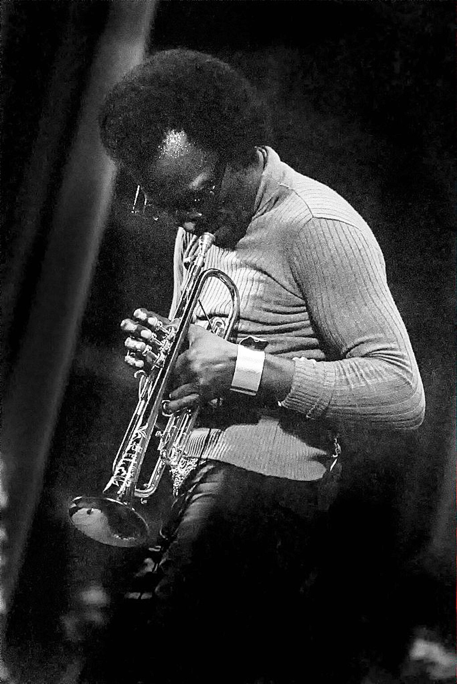Davis performing in 1971

For the double album _[Bitches Brew](https://en.wikipedia.org/wiki/Bitches_Brew "Bitches Brew")_ (1970), he hired [Jack DeJohnette](https://en.wikipedia.org/wiki/Jack_DeJohnette "Jack DeJohnette"), [Harvey Brooks](https://en.wikipedia.org/wiki/Harvey_Brooks_\(bassist\) "Harvey Brooks (bassist)") and [Bennie Maupin](https://en.wikipedia.org/wiki/Bennie_Maupin "Bennie Maupin"). The album contained long compositions, some exceeding twenty minutes, which more often than not, were constructed from several takes by Macero and Davis via splicing and tape loops amid epochal advances in multitrack recording technologies. _Bitches Brew_ peaked at No. 35 on the _Billboard_ Album chart. In 1976, it was certified gold for selling more than 500,000 records. By 2003, it had sold one million copies.

In March 1970, Davis began to perform as the opening act for rock bands, allowing Columbia to market _Bitches Brew_ to a larger audience. He shared a [Fillmore East](https://en.wikipedia.org/wiki/Fillmore_East "Fillmore East") bill with the [Steve Miller Band](https://en.wikipedia.org/wiki/Steve_Miller_Band "Steve Miller Band") and [Neil Young](https://en.wikipedia.org/wiki/Neil_Young "Neil Young") with [Crazy Horse](https://en.wikipedia.org/wiki/Crazy_Horse_\(band\) "Crazy Horse (band)") on March 6 and 7. Biographer [Paul Tingen](https://en.wikipedia.org/wiki/Paul_Tingen "Paul Tingen") wrote, "Miles' newcomer status in this environment" led to "mixed audience reactions, often having to play for dramatically reduced fees, and enduring the 'sell-out' accusations from the jazz world", as well as being "attacked by sections of the black press for supposedly genuflecting to white culture". The 1970 tours included the [1970 Isle of Wight Festival](https://en.wikipedia.org/wiki/1970_Isle_of_Wight_Festival "1970 Isle of Wight Festival") on August 29 when he performed to an estimated 600,000 people, the largest of his career. Plans to record with Hendrix ended after the guitarist's death; his funeral was the last one that Davis attended. Several live albums with a transitional sextet/septet including Corea, DeJohnette, Holland, [Airto Moreira](https://en.wikipedia.org/wiki/Airto_Moreira "Airto Moreira"), saxophonist [Steve Grossman](https://en.wikipedia.org/wiki/Steve_Grossman_\(saxophonist\) "Steve Grossman (saxophonist)") and keyboardist [Keith Jarrett](https://en.wikipedia.org/wiki/Keith_Jarrett "Keith Jarrett") were recorded during this period, including _[Miles Davis at Fillmore](https://en.wikipedia.org/wiki/Miles_Davis_at_Fillmore "Miles Davis at Fillmore")_ (1970) and _[Black Beauty: Miles Davis at Fillmore West](https://en.wikipedia.org/wiki/Black_Beauty:_Miles_Davis_at_Fillmore_West "Black Beauty: Miles Davis at Fillmore West")_ (1973).

By 1971, Davis had signed a contract with Columbia that paid him $100,000 a year (equivalent to $794,990 in 2025) for three years in addition to royalties. He recorded a soundtrack album (_[Jack Johnson](https://en.wikipedia.org/wiki/Jack_Johnson_\(album\) "Jack Johnson (album)")_) for the [1970 documentary film](https://en.wikipedia.org/wiki/Jack_Johnson_\(film\) "Jack Johnson (film)") about heavyweight boxer [Jack Johnson](https://en.wikipedia.org/wiki/Jack_Johnson "Jack Johnson"), containing two long pieces of 25 and 26 minutes in length with Hancock, McLaughlin, [Sonny Sharrock](https://en.wikipedia.org/wiki/Sonny_Sharrock "Sonny Sharrock") and [Billy Cobham](https://en.wikipedia.org/wiki/Billy_Cobham "Billy Cobham"). He was committed to making music for African-Americans who liked more commercial, pop, groove-oriented music. By November 1971, DeJohnette and Moreira had been replaced in the touring ensemble by drummer [Leon "Ndugu" Chancler](./Leon_"Ndugu"_Chancler "Leon \"Ndugu\" Chancler") and percussionists [James Mtume](https://en.wikipedia.org/wiki/James_Mtume "James Mtume") and [Don Alias](https://en.wikipedia.org/wiki/Don_Alias "Don Alias"). _[Live-Evil](https://en.wikipedia.org/wiki/Live-Evil_\(Miles_Davis_album\) "Live-Evil (Miles Davis album)")_ was released in the same month. Showcasing bassist [Michael Henderson](https://en.wikipedia.org/wiki/Michael_Henderson "Michael Henderson"), who had replaced Holland in 1970, the album demonstrated that Davis's ensemble had transformed into a funk-oriented group while retaining the exploratory imperative of _Bitches Brew_.

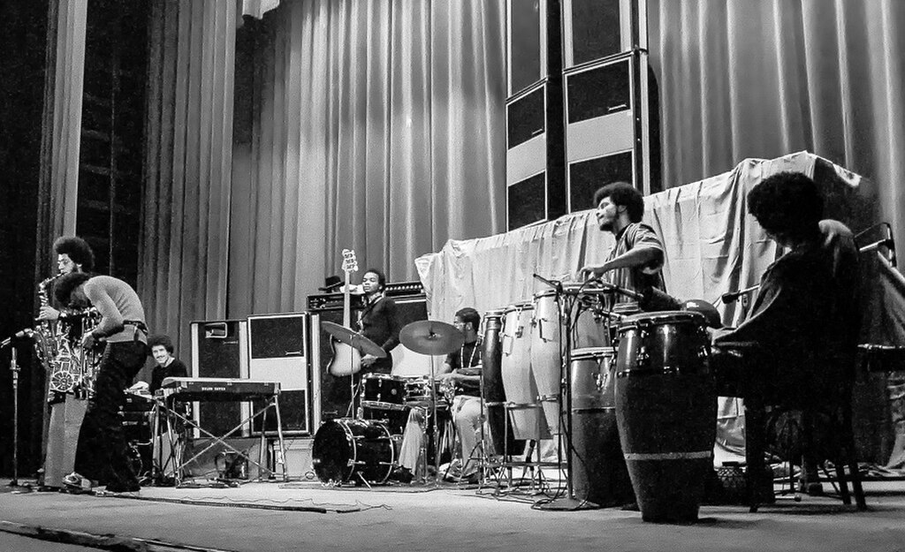Davis's septet in November 1971; left to right: [Gary Bartz](https://en.wikipedia.org/wiki/Gary_Bartz "Gary Bartz"), Davis, [Keith Jarrett](https://en.wikipedia.org/wiki/Keith_Jarrett "Keith Jarrett"), [Michael Henderson](https://en.wikipedia.org/wiki/Michael_Henderson "Michael Henderson"), [Leon "Ndugu" Chancler](./Leon_"Ndugu"_Chancler "Leon \"Ndugu\" Chancler"), [James Mtume](https://en.wikipedia.org/wiki/James_Mtume "James Mtume") and [Don Alias](https://en.wikipedia.org/wiki/Don_Alias "Don Alias")

In 1972, composer-arranger [Paul Buckmaster](https://en.wikipedia.org/wiki/Paul_Buckmaster "Paul Buckmaster") introduced Davis to the music of avant-garde composer [Karlheinz Stockhausen](https://en.wikipedia.org/wiki/Karlheinz_Stockhausen "Karlheinz Stockhausen"), leading to a period of creative exploration. Biographer J. K. Chambers wrote: "The effect of Davis' study of Stockhausen could not be repressed for long ... Davis' own 'space music' shows Stockhausen's influence compositionally." His recordings and performances during this period were described as "space music" by fans, Feather and Buckmaster, who described it as "a lot of mood changes—heavy, dark, intense—definitely space music". The studio album _[On the Corner](https://en.wikipedia.org/wiki/On_the_Corner "On the Corner")_ (1972) blended the influence of Stockhausen and Buckmaster with funk elements. Davis invited Buckmaster to New York City to oversee the writing and recording of the album with Macero. The album reached No. 1 on the _Billboard_ jazz chart but peaked at No. 156 on the more heterogeneous Top 200 Albums chart. Davis felt that Columbia marketed it to the wrong audience. "The music was meant to be heard by young black people, but they just treated it like any other jazz album and advertised it that way, pushed it on the jazz radio stations. Young black kids don't listen to those stations; they listen to R&B stations and some rock stations." In October 1972, he broke his ankles in a car crash. He took painkillers and cocaine to cope with the pain. Looking back at his career after the incident, he wrote: "Everything started to blur."

After recording _On the Corner_, he assembled a group with Henderson, Mtume, [Carlos Garnett](https://en.wikipedia.org/wiki/Carlos_Garnett "Carlos Garnett"), guitarist [Reggie Lucas](https://en.wikipedia.org/wiki/Reggie_Lucas "Reggie Lucas"), organist [Lonnie Liston Smith](https://en.wikipedia.org/wiki/Lonnie_Liston_Smith "Lonnie Liston Smith"), tabla player [Badal Roy](https://en.wikipedia.org/wiki/Badal_Roy "Badal Roy"), sitarist [Khalil Balakrishna](https://en.wikipedia.org/wiki/Khalil_Balakrishna "Khalil Balakrishna") and drummer [Al Foster](https://en.wikipedia.org/wiki/Al_Foster "Al Foster"). In striking contrast to that of his previous lineups, the music emphasized rhythmic density and shifting textures instead of solos. This group was recorded live in 1972 for _[In Concert](https://en.wikipedia.org/wiki/In_Concert_\(Miles_Davis_album\) "In Concert (Miles Davis album)")_, but Davis found it unsatisfactory, leading him to drop the tabla and sitar and play organ himself. He also added guitarist [Pete Cosey](https://en.wikipedia.org/wiki/Pete_Cosey "Pete Cosey"). The compilation studio album _[Big Fun](https://en.wikipedia.org/wiki/Big_Fun_\(Miles_Davis_album\) "Big Fun (Miles Davis album)")_ contains four long improvisations recorded between 1969 and 1972.

> This was music that polarized audiences, provoking boos and walk-outs amid the ecstasy of others. The length, density, and unforgiving nature of it mocked those who said that Miles was interested only in being trendy and popular. Some have heard in this music the feel and shape of a musician's late work, an egoless music that precedes its creator's death. As [Theodor Adorno](https://en.wikipedia.org/wiki/Theodor_Adorno "Theodor Adorno") said of the late [Beethoven](https://en.wikipedia.org/wiki/Beethoven "Beethoven"), the disappearance of the musician into the work is a bow to mortality. It was as if Miles were testifying to all that he had been witness to for the past thirty years, both terrifying and joyful.

— [John Szwed](https://en.wikipedia.org/wiki/John_Szwed "John Szwed") on _[Agharta](https://en.wikipedia.org/wiki/Agharta_\(album\) "Agharta (album)")_ (1975) and _[Pangaea](https://en.wikipedia.org/wiki/Pangaea_\(album\) "Pangaea (album)")_ (1976)

Studio sessions throughout 1973 and 1974 led to _[Get Up with It](https://en.wikipedia.org/wiki/Get_Up_with_It "Get Up with It")_, an album that included four long pieces alongside four shorter recordings from 1970 and 1972. The track "He Loved Him Madly", a 30-minute tribute to the recently deceased Duke Ellington, influenced [Brian Eno](https://en.wikipedia.org/wiki/Brian_Eno "Brian Eno")'s [ambient music](https://en.wikipedia.org/wiki/Ambient_music "Ambient music"). In the United States, it performed comparably to _On the Corner_, reaching number 8 on the jazz chart and number 141 on the pop chart. He then concentrated on live performance with a series of concerts that Columbia released on the double live albums _[Agharta](https://en.wikipedia.org/wiki/Agharta_\(album\) "Agharta (album)")_ (1975), _[Pangaea](https://en.wikipedia.org/wiki/Pangaea_\(album\) "Pangaea (album)")_ (1976) and _[Dark Magus](https://en.wikipedia.org/wiki/Dark_Magus "Dark Magus")_ (1977). The first two are recordings of two sets from February 1, 1975, in Osaka, by which time Davis was troubled by several physical ailments; he relied on alcohol, codeine and morphine to get through the engagements. His shows were routinely panned by critics who mentioned his habit of performing with his back to the audience. Cosey later asserted that "the band really advanced after the Japanese tour", but Davis was again hospitalized, for his ulcers and a hernia, during a tour of the US while opening for Herbie Hancock.

After appearances at the 1975 Newport Jazz Festival in July and the [Schaefer Music Festival](https://en.wikipedia.org/wiki/Schaefer_Music_Festival "Schaefer Music Festival") in New York in September, Davis dropped out of music.

### 1975–1980: Hiatus

In his autobiography, Davis wrote frankly about his life during his hiatus from music. He called his [Upper West Side](https://en.wikipedia.org/wiki/Upper_West_Side "Upper West Side") brownstone a wreck and chronicled his heavy use of alcohol and cocaine, in addition to sexual encounters with many women. He also stated that "Sex and drugs took the place music had occupied in my life." Drummer Tony Williams recalled that by noon (on average) Davis would be sick from the previous night's intake.

In December 1975, he had regained enough strength to undergo a much-needed hip replacement operation. In December 1976, Columbia was reluctant to renew his contract and pay his usual large advances. But after his lawyer started negotiating with [United Artists](https://en.wikipedia.org/wiki/United_Artists_Records "United Artists Records"), Columbia matched its offer, establishing the Miles Davis Fund to pay him regularly. Pianist [Vladimir Horowitz](https://en.wikipedia.org/wiki/Vladimir_Horowitz "Vladimir Horowitz") was the only other musician with CBS Records who had similar status.

In 1978, Davis asked fusion guitarist [Larry Coryell](https://en.wikipedia.org/wiki/Larry_Coryell "Larry Coryell") to participate in sessions with keyboardists [Masabumi Kikuchi](https://en.wikipedia.org/wiki/Masabumi_Kikuchi "Masabumi Kikuchi") and George Pavlis, bassist [T. M. Stevens](https://en.wikipedia.org/wiki/T._M._Stevens "T. M. Stevens") and drummer [Al Foster](https://en.wikipedia.org/wiki/Al_Foster "Al Foster"). Davis played the arranged piece uptempo, abandoned his trumpet for the organ, and had Macero record the session without the band's knowledge. After Coryell declined a spot in a band that Davis was beginning to put together, Davis returned to his reclusive lifestyle in New York City. Soon after, Marguerite Eskridge had Davis jailed for failing to pay child support for their son Erin, which cost him $10,000 (equivalent to $49,360 in 2025) for release on bail. A recording session that involved Buckmaster and Gil Evans was halted, with Evans leaving after failing to receive the payment he was promised. In August 1978, Davis hired a new manager, Mark Rothbaum, who had worked with him since 1972.

### 1980–1985: Comeback

Having played the trumpet little throughout the previous three years, Davis found it difficult to reclaim his [embouchure](https://en.wikipedia.org/wiki/Embouchure "Embouchure"). His first post-hiatus studio appearance took place in May 1980. A day later, Davis was hospitalized due to a leg infection. He recorded _[The Man with the Horn](https://en.wikipedia.org/wiki/The_Man_with_the_Horn "The Man with the Horn")_ from June 1980 to May 1981 with Macero producing. A large band was abandoned in favor of a combo with saxophonist [Bill Evans](https://en.wikipedia.org/wiki/Bill_Evans_\(saxophonist\) "Bill Evans (saxophonist)") and bassist [Marcus Miller](https://en.wikipedia.org/wiki/Marcus_Miller "Marcus Miller"). Both would collaborate with him during the next decade.

_The Man with the Horn_ received a poor critical reception despite selling well. In June 1981, Davis returned to the stage for the first time since 1975 in a ten-minute guest solo as part of [Mel Lewis](https://en.wikipedia.org/wiki/Mel_Lewis "Mel Lewis")'s band at the [Village Vanguard](https://en.wikipedia.org/wiki/Village_Vanguard "Village Vanguard"). This was followed by appearances with a new band. Recordings from a mixture of dates from 1981, including from the Kix in Boston and Avery Fisher Hall, were released on _[We Want Miles](https://en.wikipedia.org/wiki/We_Want_Miles "We Want Miles")_, which earned him a Grammy Award for Best Jazz Instrumental Performance by a Soloist.

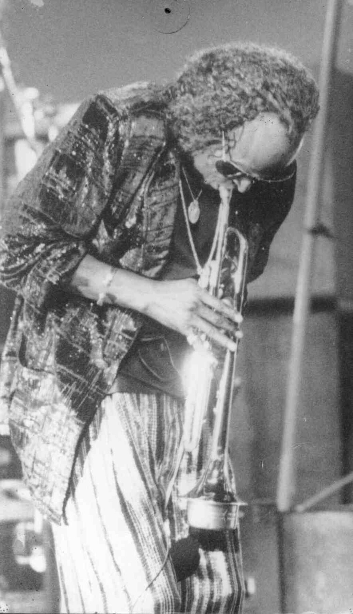Davis performing in 1985

In January 1982, while Tyson was working in Africa, Davis "went a little wild" with alcohol and suffered a stroke that temporarily paralyzed his right hand. Tyson returned home and cared for him. After three months of treatment with a Chinese acupuncturist, he was able to play the trumpet again. He listened to his doctor's warnings and gave up alcohol and drugs. He credited Tyson with helping his recovery, which involved exercise, piano playing and visits to spas. She encouraged him to draw, which he pursued for the rest of his life. [Takao Ogawa](https://en.wikipedia.org/wiki/Takao_Ogawa "Takao Ogawa"), a Japanese jazz journalist who befriended Davis during this period, took pictures of his drawings and put them in his book along with the interviews of Davis at his apartment in New York. Davis told Ogawa: "I'm interested in line and color, line is like phrase and coating colors is like code. When I see good paintings, I hear good music. That is why my paintings are the same as my music. They are different than any paintings."

Davis resumed touring in May 1982 with a lineup that included percussionist [Mino Cinelu](https://en.wikipedia.org/wiki/Mino_Cinelu "Mino Cinelu") and guitarist [John Scofield](https://en.wikipedia.org/wiki/John_Scofield "John Scofield"), with whom he worked closely on the album _[Star People](https://en.wikipedia.org/wiki/Star_People "Star People")_ (1983). In mid-1983, he worked on the tracks for _[Decoy](https://en.wikipedia.org/wiki/Decoy_\(album\) "Decoy (album)")_, an album mixing soul music and [electronica](https://en.wikipedia.org/wiki/Electronica "Electronica") that was released in 1984. He brought in producer, composer and keyboardist [Robert Irving III](https://en.wikipedia.org/wiki/Robert_Irving_III "Robert Irving III"), who had collaborated with him on _The Man with the Horn_. With a seven-piece band that included Scofield, Evans, Irving, Foster and [Darryl Jones](https://en.wikipedia.org/wiki/Darryl_Jones "Darryl Jones"), he played a series of European performances that were positively received. In December 1984, while in Denmark, he was awarded the [Léonie Sonning Music Prize](https://en.wikipedia.org/wiki/Léonie_Sonning_Music_Prize "Léonie Sonning Music Prize"). Trumpeter [Palle Mikkelborg](https://en.wikipedia.org/wiki/Palle_Mikkelborg "Palle Mikkelborg") had written "Aura", a contemporary classical piece, for the event which impressed Davis to the point of returning to Denmark in early 1985 to record his next studio album, _[Aura](https://en.wikipedia.org/wiki/Aura_\(Miles_Davis_album\) "Aura (Miles Davis album)")_. Columbia was dissatisfied with the recording and delayed its release.

In May 1985, one month into a tour, Davis signed a contract with [Warner Bros.](https://en.wikipedia.org/wiki/Warner_Bros._Records "Warner Bros. Records") that required him to give up his publishing rights. _[You're Under Arrest](https://en.wikipedia.org/wiki/You're_Under_Arrest_\(Miles_Davis_album\) "You're Under Arrest (Miles Davis album)")_, his final album for Columbia, was released in September. It included cover versions of two pop songs: "[Time After Time](https://en.wikipedia.org/wiki/Time_After_Time_\(Cyndi_Lauper_song\) "Time After Time (Cyndi Lauper song)")" by [Cyndi Lauper](https://en.wikipedia.org/wiki/Cyndi_Lauper "Cyndi Lauper") and [Michael Jackson](https://en.wikipedia.org/wiki/Michael_Jackson "Michael Jackson")'s "[Human Nature](https://en.wikipedia.org/wiki/Human_Nature_\(Michael_Jackson_song\) "Human Nature (Michael Jackson song)")". He considered releasing an album of pop songs, and he recorded dozens of them, but the idea was rejected. He said that many of today's jazz standards had been pop songs in [Broadway theater](https://en.wikipedia.org/wiki/Broadway_theater "Broadway theater") and that he was simply updating the standards repertoire.

Davis collaborated with a number of figures from the British post-punk and new wave movements during this period, including [Scritti Politti](https://en.wikipedia.org/wiki/Scritti_Politti "Scritti Politti"). This period also saw Davis move from his funk-inspired sound of the early 1970s to a more melodic style.

### 1986–1991: Final years

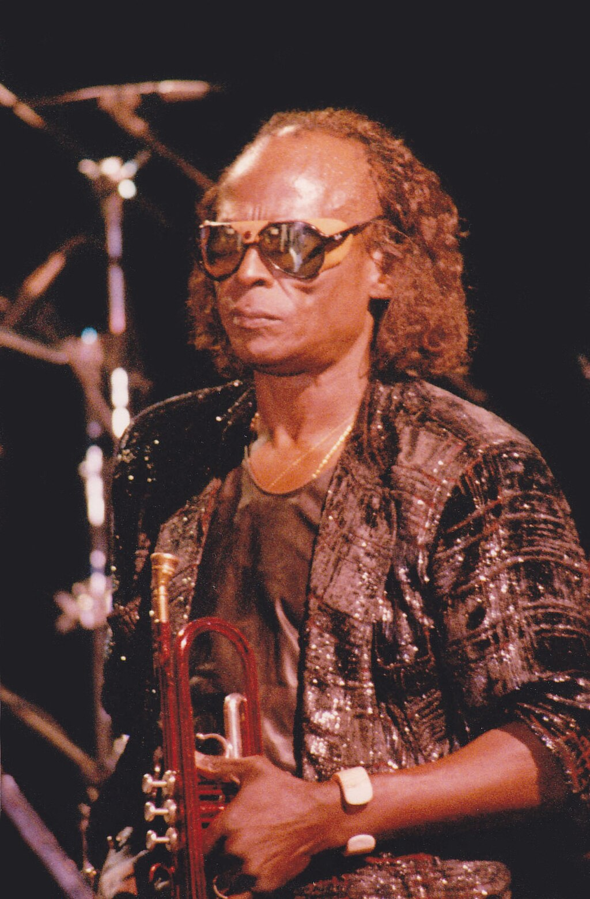Davis performing in [Strasbourg](https://en.wikipedia.org/wiki/Strasbourg "Strasbourg"), 1987

After taking part in the recording of the 1985 protest song "[Sun City](https://en.wikipedia.org/wiki/Sun_City_\(song\) "Sun City (song)")" as a member of [Artists United Against Apartheid](https://en.wikipedia.org/wiki/Artists_United_Against_Apartheid "Artists United Against Apartheid"), Davis appeared on the instrumental "Don't Stop Me Now" by [Toto](https://en.wikipedia.org/wiki/Toto_\(band\) "Toto (band)") on its album _[Fahrenheit](https://en.wikipedia.org/wiki/Fahrenheit_\(Toto_album\) "Fahrenheit (Toto album)")_ (1986). Davis collaborated with [Prince](https://en.wikipedia.org/wiki/Prince_\(artist\) "Prince (artist)") on a song titled "Can I Play With U," which went unreleased until 2020. Davis also collaborated with Zane Giles and [Randy Hall](https://en.wikipedia.org/wiki/Randy_Hall "Randy Hall") on the _[Rubberband](https://en.wikipedia.org/wiki/Rubberband_\(Miles_Davis_album\) "Rubberband (Miles Davis album)")_ sessions in 1985 but those would remain unreleased until 2019. Instead, he worked with Marcus Miller, and _[Tutu](https://en.wikipedia.org/wiki/Tutu_\(album\) "Tutu (album)")_ (1986) became the first time he used modern studio tools such as programmed synthesizers, [sampling](https://en.wikipedia.org/wiki/Sampling_\(music\) "Sampling (music)") and drum loops. Released in September 1986, its front cover is a photographic portrait of Davis by [Irving Penn](https://en.wikipedia.org/wiki/Irving_Penn "Irving Penn"). In 1987, he won a Grammy Award for [Best Jazz Instrumental Performance, Soloist](https://en.wikipedia.org/wiki/Best_Jazz_Instrumental_Performance,_Soloist "Best Jazz Instrumental Performance, Soloist"). Also in 1987, Davis contacted American journalist [Quincy Troupe](https://en.wikipedia.org/wiki/Quincy_Troupe "Quincy Troupe") to work with him on his autobiography. The two men had met the previous year when Troupe conducted a two-day-long interview, which was published by _[Spin](https://en.wikipedia.org/wiki/Spin_\(magazine\) "Spin (magazine)")_ as a 45-page article.

In 1988, Davis had a small part as a street musician in the Christmas comedy film _[Scrooged](https://en.wikipedia.org/wiki/Scrooged "Scrooged")_ starring [Bill Murray](https://en.wikipedia.org/wiki/Bill_Murray "Bill Murray"). He also collaborated with [Zucchero Fornaciari](https://en.wikipedia.org/wiki/Zucchero_Fornaciari "Zucchero Fornaciari") in a version of _Dune Mosse_ (_[Blue's](https://en.wikipedia.org/wiki/Blue's "Blue's")_), published in 2004 in _[Zu & Co.](https://en.wikipedia.org/wiki/Zu_&_Co. "Zu & Co.")_ of the Italian bluesman. In November 1988 he was inducted into the Knights of Malta at a ceremony at the [Alhambra Palace](https://en.wikipedia.org/wiki/Alhambra_Palace "Alhambra Palace") in Spain. Later that month, Davis cut his European tour short after he collapsed and fainted after a two-hour show in Madrid and flew home. There were rumors of more poor health reported by the American magazine _Star_ in its February 21, 1989, edition, which published a claim that Davis had contracted AIDS, prompting his manager Peter Shukat to issue a statement the following day. Shukat said Davis had been in the hospital for a mild case of pneumonia and the removal of a benign polyp on his vocal cords and was resting comfortably in preparation for his 1989 tours. Davis later blamed one of his former wives or girlfriends for starting the rumor and decided against taking legal action. He was interviewed on _[60 Minutes](https://en.wikipedia.org/wiki/60_Minutes "60 Minutes")_ by Harry Reasoner. In October 1989, he received a Grande Medaille de Vermeil from Paris mayor [Jacques Chirac](https://en.wikipedia.org/wiki/Jacques_Chirac "Jacques Chirac"). In 1990, he received a [Grammy Lifetime Achievement Award](https://en.wikipedia.org/wiki/Grammy_Lifetime_Achievement_Award "Grammy Lifetime Achievement Award"). In early 1991, he appeared in the [Rolf de Heer](https://en.wikipedia.org/wiki/Rolf_de_Heer "Rolf de Heer") film _[Dingo](https://en.wikipedia.org/wiki/Dingo_\(film\) "Dingo (film)")_ as a jazz musician.

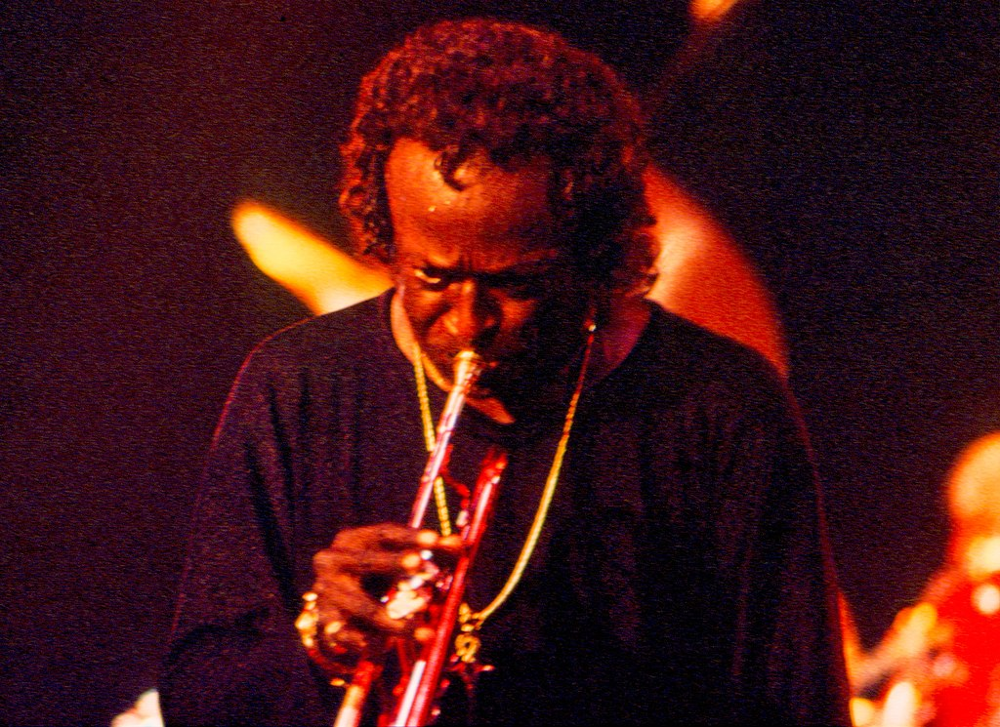Davis at the [North Sea Jazz Festival](https://en.wikipedia.org/wiki/North_Sea_Jazz_Festival "North Sea Jazz Festival"), 1991

Davis followed _Tutu_ with _[Amandla](https://en.wikipedia.org/wiki/Amandla_\(album\) "Amandla (album)")_ (1989) and soundtracks to four films: _[Street Smart](https://en.wikipedia.org/wiki/Street_Smart_\(1987_film\) "Street Smart (1987 film)")_, _[Siesta](https://en.wikipedia.org/wiki/Siesta_\(film\) "Siesta (film)")_, _[The Hot Spot](https://en.wikipedia.org/wiki/The_Hot_Spot "The Hot Spot")_ and _[Dingo](https://en.wikipedia.org/wiki/Dingo_\(soundtrack\) "Dingo (soundtrack)")._ His last albums were released posthumously: the hip hop-influenced _[Doo-Bop](https://en.wikipedia.org/wiki/Doo-Bop "Doo-Bop")_ (1992) and _[Miles & Quincy Live at Montreux](https://en.wikipedia.org/wiki/Miles_&_Quincy_Live_at_Montreux "Miles & Quincy Live at Montreux")_ (1993), a collaboration with Quincy Jones from the 1991 [Montreux Jazz Festival](https://en.wikipedia.org/wiki/Montreux_Jazz_Festival "Montreux Jazz Festival") where, for the first time in three decades, he performed songs from _Miles Ahead_, _Porgy and Bess_, and _Sketches of Spain_.

On July 8, 1991, Davis returned to performing material from his past at the 1991 Montreux Jazz Festival with a band and orchestra conducted by Quincy Jones. The set consisted of arrangements from his albums recorded with Gil Evans. The show was followed by a concert billed as "Miles and Friends" at the [Grande halle de la Villette](https://en.wikipedia.org/wiki/Grande_halle_de_la_Villette "Grande halle de la Villette") in Paris two days later, with guest performances by musicians from throughout his career, including John McLaughlin, Herbie Hancock and Joe Zawinul. In Paris, he was awarded a knighthood, the [Chevalier of the Legion of Honour](https://en.wikipedia.org/wiki/Chevalier_of_the_Legion_of_Honour "Chevalier of the Legion of Honour") by French Culture Minister, Jack Lang, who called him "the Picasso of Jazz." After returning to America, he stopped in New York City to record material for _Doo-Bop and_ then returned to California to play at the Hollywood Bowl on August 25, his final live performance.

## Personal life

In 1957, Davis began a relationship with [Frances Taylor](https://en.wikipedia.org/wiki/Frances_Taylor_Davis "Frances Taylor Davis"), a dancer he had met in 1953 at [Ciro's](https://en.wikipedia.org/wiki/Ciro's "Ciro's") in Los Angeles. They married in December 1959 in [Toledo, Ohio](https://en.wikipedia.org/wiki/Toledo,_Ohio "Toledo, Ohio"). Due to Miles Davis's physical abuse of Frances Taylor, their relationship suffered. He later wrote: "Every time I hit her, I felt bad because a lot of it really wasn't her fault but had to do with me being temperamental and jealous." One theory about his behavior was that in 1963 he had increased his use of alcohol and cocaine to alleviate joint pain caused by [sickle cell anemia](https://en.wikipedia.org/wiki/Sickle_cell_anemia "Sickle cell anemia"). He hallucinated, "looking for this imaginary person" in his house while wielding a kitchen knife. Soon after the photograph for the album _[E.S.P.](https://en.wikipedia.org/wiki/E.S.P._\(Miles_Davis_album\) "E.S.P. (Miles Davis album)")_ (1965) was taken, Taylor left him for the final time. She filed for divorce in 1966; it was finalized in February 1968.

In September 1968, Davis married 23-year-old model and songwriter [Betty Mabry](https://en.wikipedia.org/wiki/Betty_Mabry "Betty Mabry"). In his autobiography, Davis described her as a "high-class groupie, who was very talented but who didn't believe in her own talent". Mabry, a familiar face in the New York City counterculture, introduced Davis to popular rock, soul and funk musicians. Jazz critic [Leonard Feather](https://en.wikipedia.org/wiki/Leonard_Feather "Leonard Feather") visited Davis's apartment and was shocked to find him listening to albums by [the Byrds](https://en.wikipedia.org/wiki/The_Byrds "The Byrds"), [Aretha Franklin](https://en.wikipedia.org/wiki/Aretha_Franklin "Aretha Franklin") and [Dionne Warwick](https://en.wikipedia.org/wiki/Dionne_Warwick "Dionne Warwick"). He also liked [James Brown](https://en.wikipedia.org/wiki/James_Brown "James Brown"), [Sly and the Family Stone](https://en.wikipedia.org/wiki/Sly_and_the_Family_Stone "Sly and the Family Stone"), and [Jimi Hendrix](https://en.wikipedia.org/wiki/Jimi_Hendrix "Jimi Hendrix"), whose group [Band of Gypsys](https://en.wikipedia.org/wiki/Band_of_Gypsys "Band of Gypsys") particularly impressed Davis. Davis filed for divorce from Mabry in 1969, after accusing her of having an affair with Hendrix.

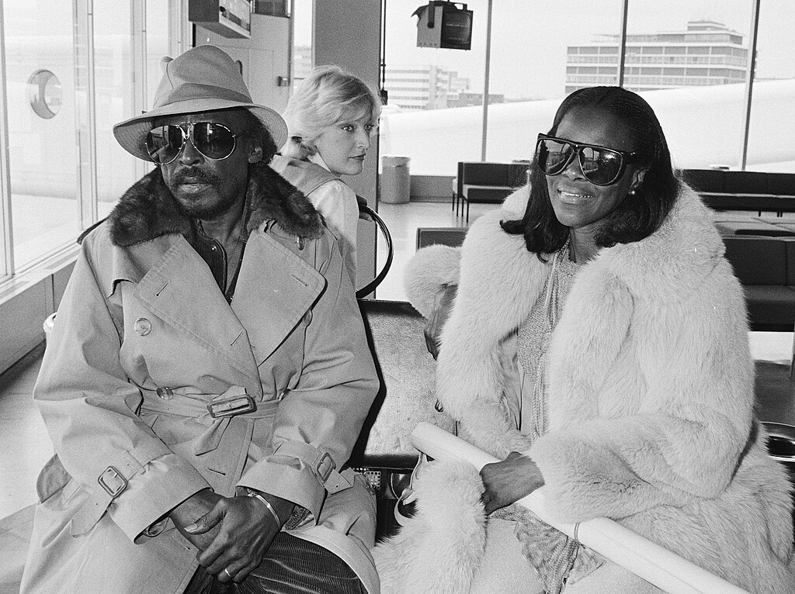Davis and Cicely Tyson in 1982

On October 10, 1969, Davis was shot at five times while in his Ferrari with Marguerite Eskridge, one of his lovers. One bullet grazed his hip; Eskridge was unharmed. Davis later wrote that the incident arose from a dispute among nightclub promoters.

In 1970, Marguerite gave birth to their son Erin. By 1979, Davis rekindled his relationship with actress [Cicely Tyson](https://en.wikipedia.org/wiki/Cicely_Tyson "Cicely Tyson"), who helped him to overcome his cocaine addiction and regain his enthusiasm for music. The two married in November 1981, but their tumultuous marriage ended with Tyson filing for divorce in 1988, which was finalized in 1989.

In 1984, Davis met 34-year-old sculptor Jo Gelbard. She taught Davis how to paint; the two were frequent collaborators and were soon romantically involved, eventually leaving their respective partners and living together.

By 1985, Davis was diabetic and required daily injections of insulin. Davis became increasingly aggressive in his final year due in part to the medication he was taking, and his aggression manifested as violence towards Gelbard.

## Death

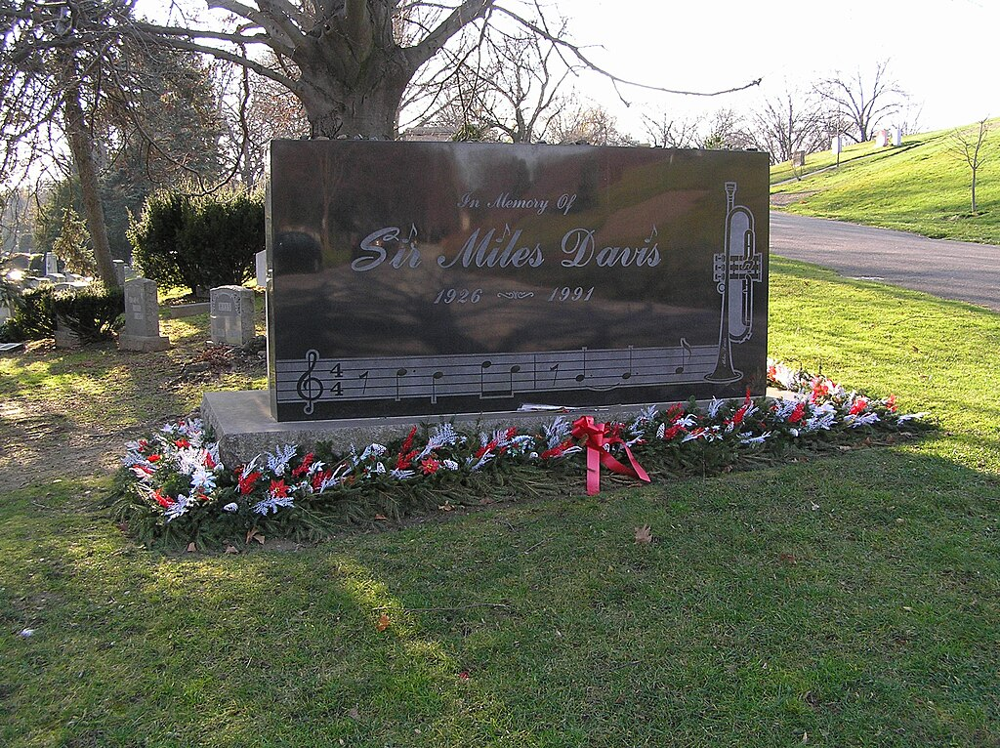Davis's grave in [Woodlawn Cemetery](https://en.wikipedia.org/wiki/Woodlawn_Cemetery_\(Bronx,_New_York\) "Woodlawn Cemetery (Bronx, New York)"), with headstone inscribed with the beginning notes of one of his compositions, "[Solar](https://en.wikipedia.org/wiki/Solar_\(composition\) "Solar (composition)")"

In early September 1991, Davis checked into [St. John's Hospital](https://en.wikipedia.org/wiki/Saint_John's_Health_Center "Saint John's Health Center") near his home in Santa Monica, California, for routine tests. Doctors suggested he have a [tracheal tube](https://en.wikipedia.org/wiki/Tracheal_tube "Tracheal tube") implanted to relieve his breathing after repeated bouts of [bronchial pneumonia](https://en.wikipedia.org/wiki/Bronchial_pneumonia "Bronchial pneumonia"). The suggestion provoked an outburst from Davis that led to an [intracerebral hemorrhage](https://en.wikipedia.org/wiki/Intracerebral_hemorrhage "Intracerebral hemorrhage") followed by a coma. According to Jo Gelbard, on September 26, Davis painted his final painting—and that painting, composed of dark, ghostly figures dripping blood "was full of his imminent demise". After several days on life support, his machine was turned off and he died on September 28, 1991, in the arms of Gelbard. He was 65 years old.

Davis's death was attributed to the combined effects of a stroke, pneumonia and respiratory failure. According to Troupe, Davis was taking [azidothymidine](https://en.wikipedia.org/wiki/Azidothymidine "Azidothymidine") (AZT), a type of [antiretroviral drug](https://en.wikipedia.org/wiki/Antiretroviral_drug "Antiretroviral drug") used for the treatment of [HIV](https://en.wikipedia.org/wiki/HIV "HIV") and [AIDS](https://en.wikipedia.org/wiki/AIDS "AIDS"), during his treatments in the hospital.

A funeral service was held on October 5, 1991, at [St. Peter's Lutheran Church](https://en.wikipedia.org/wiki/Citigroup_Center#St._Peter's_Lutheran_Church "Citigroup Center") on [Lexington Avenue](https://en.wikipedia.org/wiki/Lexington_Avenue "Lexington Avenue") in New York City that was attended by around 500 friends, family members and musical acquaintances, with many fans standing in the rain. He was buried in [Woodlawn Cemetery](https://en.wikipedia.org/wiki/Woodlawn_Cemetery_\(Bronx,_New_York\) "Woodlawn Cemetery (Bronx, New York)") in [the Bronx](https://en.wikipedia.org/wiki/The_Bronx "The Bronx"), New York City, with one of his trumpets, near the site of [Duke Ellington](https://en.wikipedia.org/wiki/Duke_Ellington "Duke Ellington")'s grave.

At the time of his death, Davis's estate was valued at more than $1 million (equivalent to roughly $2.4 million in 2025). In his will, Davis left 20 percent to his daughter Cheryl Davis; 40 percent to his son Erin Davis; 10 percent to his nephew Vincent Wilburn Jr. and 15 percent each to his brother Vernon Davis and his sister Dorothy Wilburn. He excluded his two sons Gregory and Miles IV.

## Views on his earlier work

Late in his life, from the "electric period" onwards, Davis repeatedly explained his reasons for not wishing to perform his earlier works, such as _[Birth of the Cool](https://en.wikipedia.org/wiki/Birth_of_the_Cool "Birth of the Cool")_ or _[Kind of Blue](https://en.wikipedia.org/wiki/Kind_of_Blue "Kind of Blue")_. In his view, remaining stylistically static was the wrong option. He commented: "'So What' or _Kind of Blue_, they were done in that era, the right hour, the right day, and it happened. It's over ... What I used to play with Bill Evans, all those different modes, and substitute chords, we had the energy then and we liked it. But I have no feel for it anymore, it's more like warmed-over turkey." When [Shirley Horn](https://en.wikipedia.org/wiki/Shirley_Horn "Shirley Horn") insisted in 1990 that Miles reconsider playing the ballads and modal tunes of his _Kind of Blue_ period, he said: "Nah, it hurts my lip." [Bill Evans](https://en.wikipedia.org/wiki/Bill_Evans "Bill Evans"), who played piano on _Kind of Blue_, said: "I would like to hear more of the consummate melodic master, but I feel that big business and his record company have had a corrupting influence on his material. The rock and pop thing certainly draws a wider audience." Throughout his later career, Davis declined offers to reinstate his 1960s quintet.

Many books and documentaries focus on his work before 1975. According to an article by _[The Independent](https://en.wikipedia.org/wiki/The_Independent "The Independent")_, from 1975 onwards a decline in critical praise for Davis's output began to form, with many viewing the era as "worthless": "There is a surprisingly widespread view that, in terms of the merits of his musical output, Davis might as well have died in 1975." In a 1982 interview in _[DownBeat](https://en.wikipedia.org/wiki/DownBeat "DownBeat")_, [Wynton Marsalis](https://en.wikipedia.org/wiki/Wynton_Marsalis "Wynton Marsalis") said: "They call Miles's stuff jazz. That stuff is not jazz, man. Just because somebody played jazz at one time, that doesn't mean they're still playing it." Despite his contempt for Davis' later work, Marsalis' work is "laden with ironic references to Davis' music of the '60s". Davis did not necessarily disagree; lambasting what he saw as Marsalis's stylistic conservatism, Davis said "Jazz is dead ... it's finito! It's over and there's no point apeing the shit." Writer [Stanley Crouch](https://en.wikipedia.org/wiki/Stanley_Crouch "Stanley Crouch") criticized Davis's work from _In a Silent Way_ onwards.

## Legacy and influence

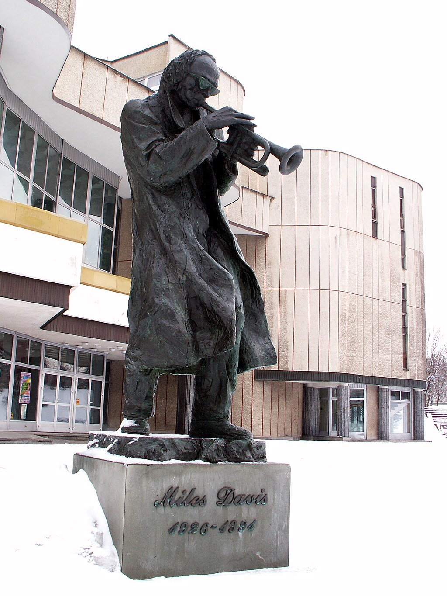[Miles Davis Monument](https://en.wikipedia.org/wiki/Miles_Davis_Monument "Miles Davis Monument"), unveiled in 2001, by Grzegorz Łagowski, in [Kielce](https://en.wikipedia.org/wiki/Kielce "Kielce"), Poland

Miles Davis is considered one of the most innovative, influential and respected figures in the history of music. _[The Guardian](https://en.wikipedia.org/wiki/The_Guardian "The Guardian")_ described him as "a pioneer of 20th-century music, leading many of the key developments in the world of jazz." He has been called "one of the great innovators in jazz", and had the titles Prince of Darkness and the Picasso of Jazz bestowed upon him. _The Rolling Stone Encyclopedia of Rock & Roll_ said, "Miles Davis played a crucial and inevitably controversial role in every major development in jazz since the mid-'40s, and no other jazz musician has had so profound an effect on rock. Miles Davis was the most widely recognized jazz musician of his era, an outspoken social critic and an arbiter of style—in attitude and fashion—as well as music."

William Ruhlmann of [AllMusic](https://en.wikipedia.org/wiki/AllMusic "AllMusic") wrote: "To examine his career is to examine the history of jazz from the mid-1940s to the early 1990s, since he was in the thick of almost every important innovation and stylistic development in the music during that period ... It can even be argued that jazz stopped evolving when Davis wasn't there to push it forward." Francis Davis of _[The Atlantic](https://en.wikipedia.org/wiki/The_Atlantic "The Atlantic")_ noted that Davis's career can be seen as "an ongoing critique of bebop: the origins of 'cool' jazz..., hard bop, or 'funky'..., modal improvisation..., and jazz-rock fusion... can be traced to his efforts to tear bebop down to its essentials."

His approach, owing largely to the African-American performance tradition that focused on individual expression, emphatic interaction, and creative response to shifting contents, had a profound impact on generations of jazz musicians. In 2016, digital publication _[The Pudding](https://en.wikipedia.org/wiki/The_Pudding "The Pudding")_, in an article examining Davis's legacy, found that 2,452 Wikipedia pages mention Davis, with over 286 citing him as an influence.

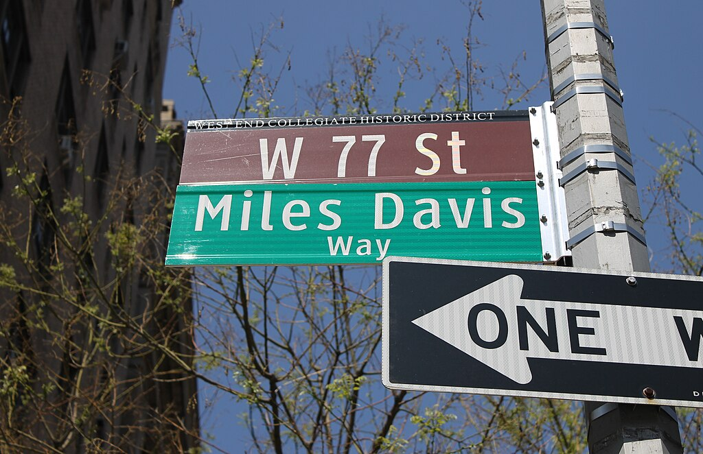The westernmost part of 77th Street in New York City has been named Miles Davis Way. He once lived on the block.

On November 5, 2009, U.S. Representative [John Conyers](https://en.wikipedia.org/wiki/John_Conyers "John Conyers") of Michigan sponsored a measure in the United States House of Representatives to commemorate _Kind of Blue_ on its 50th anniversary. The measure also affirms jazz as a national treasure and "encourages the United States government to preserve and advance the art form of jazz music". It passed with a vote of 409–0 on December 15, 2009. The trumpet Davis used on the recording is displayed on the campus of the [University of North Carolina](https://en.wikipedia.org/wiki/University_of_North_Carolina "University of North Carolina") at [Greensboro](https://en.wikipedia.org/wiki/Greensboro "Greensboro"). It was donated to the school by Arthur "Buddy" Gist, who met Davis in 1949 and became a close friend. The gift was the reason why the jazz program at UNCG is named the Miles Davis Jazz Studies Program.

In 1986, the [New England Conservatory](https://en.wikipedia.org/wiki/New_England_Conservatory "New England Conservatory") awarded Davis an honorary doctorate for his contributions to music. Since 1960, the [National Academy of Recording Arts and Sciences](https://en.wikipedia.org/wiki/National_Academy_of_Recording_Arts_and_Sciences "National Academy of Recording Arts and Sciences") (NARAS) honored him with eight Grammy Awards, a Grammy Lifetime Achievement Award and three Grammy Hall of Fame Awards.

In 2001, _The Miles Davis Story_, a two-hour documentary film by [Mike Dibb](https://en.wikipedia.org/wiki/Mike_Dibb "Mike Dibb"), won an [International Emmy Award](https://en.wikipedia.org/wiki/International_Emmy_Award "International Emmy Award") for arts documentary of the year. Since 2005, the Miles Davis Jazz Committee has held an annual Miles Davis Jazz Festival. Also in 2005, the Davis biography, _[The Last Miles](https://en.wikipedia.org/wiki/The_Last_Miles "The Last Miles")_ was published, and a London exhibition was held of his paintings, _The Last Miles: The Music of Miles Davis, 1980–1991_, was released detailing his final years and eight of his albums from the 1960s and 1970s were reissued in celebration of the 50th anniversary of his signing to Columbia Records. In 2006, Davis was inducted into the Rock and Roll Hall of Fame. In 2012, the U.S. Postal Service issued commemorative stamps featuring Davis.

_[Miles Ahead](https://en.wikipedia.org/wiki/Miles_Ahead_\(film\) "Miles Ahead (film)")_ was a 2015 American music film directed by [Don Cheadle](https://en.wikipedia.org/wiki/Don_Cheadle "Don Cheadle"), co-written by Cheadle with [Steven Baigelman](https://en.wikipedia.org/wiki/Steven_Baigelman "Steven Baigelman"), Stephen J. Rivele and [Christopher Wilkinson](https://en.wikipedia.org/wiki/Christopher_Wilkinson "Christopher Wilkinson"), which interprets the life and compositions of Davis. It premiered at the [New York Film Festival](https://en.wikipedia.org/wiki/New_York_Film_Festival "New York Film Festival") in October 2015. The film stars Cheadle, [Emayatzy Corinealdi](https://en.wikipedia.org/wiki/Emayatzy_Corinealdi "Emayatzy Corinealdi") as Frances Taylor, [Ewan McGregor](https://en.wikipedia.org/wiki/Ewan_McGregor "Ewan McGregor"), [Michael Stuhlbarg](https://en.wikipedia.org/wiki/Michael_Stuhlbarg "Michael Stuhlbarg") and [Lakeith Stanfield](https://en.wikipedia.org/wiki/Lakeith_Stanfield "Lakeith Stanfield"). That same year a statue of him was erected in his home city, [Alton, Illinois](https://en.wikipedia.org/wiki/Alton,_Illinois "Alton, Illinois"), and listeners of BBC Radio and Jazz FM voted Davis the greatest jazz musician. Publications such as _[The Guardian](https://en.wikipedia.org/wiki/The_Guardian "The Guardian")_ have also ranked Davis among the best of all jazz musicians.

In 2018, American rapper [Q-Tip](https://en.wikipedia.org/wiki/Q-Tip_\(musician\) "Q-Tip (musician)") played Miles Davis in a theater production titled _My Funny Valentine_. Q-Tip had previously played Davis in 2010. In 2019, the documentary _[Miles Davis: Birth of the Cool](https://en.wikipedia.org/wiki/Miles_Davis:_Birth_of_the_Cool "Miles Davis: Birth of the Cool")_, directed by [Stanley Nelson](https://en.wikipedia.org/wiki/Stanley_Nelson "Stanley Nelson"), premiered at the [Sundance Film Festival](https://en.wikipedia.org/wiki/Sundance_Film_Festival "Sundance Film Festival"). It was later released on [PBS](https://en.wikipedia.org/wiki/PBS "PBS")' _American Masters_ series. Davis is the subject of the upcoming period romance film _[Davis & Juliette](https://en.wikipedia.org/wiki/Miles_&_Juliette "Miles & Juliette")_ about his meeting Juliette Gréco in Paris in 1949. In a statement to accompany the film's announcement, English musician and co-producer [Mick Jagger](https://en.wikipedia.org/wiki/Mick_Jagger "Mick Jagger") regarded Davis as "inarguably one of the most influential and important musicians of the 20th Century."

Davis has, however, been subject to criticism. In 1990, writer [Stanley Crouch](https://en.wikipedia.org/wiki/Stanley_Crouch "Stanley Crouch"), a prominent critic of jazz fusion, labeled Davis "the most brilliant sellout in the history of jazz." A 1993 essay by Robert Walser in _[The Musical Quarterly](https://en.wikipedia.org/wiki/The_Musical_Quarterly "The Musical Quarterly")_ claims that "Davis has long been infamous for missing more notes than any other major trumpet player." Also in the essay is a quote by music critic [James Lincoln Collier](https://en.wikipedia.org/wiki/James_Lincoln_Collier "James Lincoln Collier") who states that "if his influence was profound, the ultimate value of his work is another matter", and calls Davis an "adequate instrumentalist" but "not a great one". In 2013, _[The A.V. Club](https://en.wikipedia.org/wiki/The_A.V._Club "The A.V. Club")_ published an article titled "Miles Davis beat his wives _and_ made beautiful music". In the article, writer Sonia Saraiya praises Davis as a musician, but criticizes him as a person, in particular, his abuse of his wives. Others, such as Francis Davis, have criticized his treatment of women, describing it as "contemptible".

In 2025, [Reservoir Media](https://en.wikipedia.org/wiki/Reservoir_Media "Reservoir Media") acquired the rights to Davis's publishing catalog.

## Awards and honors

**Grammy Awards**

*   Miles Davis won eight Grammy Awards and received 32 nominations.

YearCategoryWork

1960

[Best Jazz Composition of More Than Five Minutes Duration](https://en.wikipedia.org/wiki/Grammy_Award_for_Best_Original_Jazz_Composition "Grammy Award for Best Original Jazz Composition")

_[Sketches of Spain](https://en.wikipedia.org/wiki/Sketches_of_Spain "Sketches of Spain")_

1970

[Best Jazz Performance, Large Group or Soloist with Large Group](https://en.wikipedia.org/wiki/Grammy_Award_for_Best_Large_Jazz_Ensemble_Album "Grammy Award for Best Large Jazz Ensemble Album")

_[Bitches Brew](https://en.wikipedia.org/wiki/Bitches_Brew "Bitches Brew")_

1982

[Best Jazz Instrumental Performance, Soloist](https://en.wikipedia.org/wiki/Best_Jazz_Instrumental_Performance,_Soloist "Best Jazz Instrumental Performance, Soloist")

_[We Want Miles](https://en.wikipedia.org/wiki/We_Want_Miles "We Want Miles")_

1986

Best Jazz Instrumental Performance, Soloist

_[Tutu](https://en.wikipedia.org/wiki/Tutu_\(album\) "Tutu (album)")_

1989

Best Jazz Instrumental Performance, Soloist

_[Aura](https://en.wikipedia.org/wiki/Aura_\(Miles_Davis_album\) "Aura (Miles Davis album)")_

1989

[Best Jazz Instrumental Performance, Big Band](https://en.wikipedia.org/wiki/Best_Jazz_Instrumental_Performance,_Big_Band "Best Jazz Instrumental Performance, Big Band")

_[Aura](https://en.wikipedia.org/wiki/Aura_\(Miles_Davis_album\) "Aura (Miles Davis album)")_

1990

[Lifetime Achievement Award](https://en.wikipedia.org/wiki/Grammy_Lifetime_Achievement_Award "Grammy Lifetime Achievement Award")

1992

[Best R&B Instrumental Performance](https://en.wikipedia.org/wiki/Best_R&B_Instrumental_Performance "Best R&B Instrumental Performance")

_[Doo-Bop](https://en.wikipedia.org/wiki/Doo-Bop "Doo-Bop")_

1993

[Best Large Jazz Ensemble Performance](https://en.wikipedia.org/wiki/Best_Large_Jazz_Ensemble_Performance "Best Large Jazz Ensemble Performance")

_[Miles & Quincy Live at Montreux](https://en.wikipedia.org/wiki/Miles_&_Quincy_Live_at_Montreux "Miles & Quincy Live at Montreux")_

**Other awards**

YearAwardSource

1955

Voted Best Trumpeter, _DownBeat_ Readers' Poll

1957

Voted Best Trumpeter, _DownBeat_ Readers' Poll

1961

Voted Best Trumpeter, _DownBeat_ Readers' Poll

1984

[Sonning Award](https://en.wikipedia.org/wiki/Sonning_Award "Sonning Award") for Lifetime Achievement in Music

1986

Doctor of Music, _[honoris causa](https://en.wikipedia.org/wiki/Honoris_causa "Honoris causa")_, [New England Conservatory](https://en.wikipedia.org/wiki/New_England_Conservatory "New England Conservatory")

1988

Knighthood by the Knights of Malta

1989

Governor's Award from the [New York State Council on the Arts](https://en.wikipedia.org/wiki/New_York_State_Council_on_the_Arts "New York State Council on the Arts")

1990

[St. Louis Walk of Fame](https://en.wikipedia.org/wiki/St._Louis_Walk_of_Fame "St. Louis Walk of Fame")

1991

[Australian Film Institute Award for Best Original Music Score](https://en.wikipedia.org/wiki/Australian_Film_Institute_Award_for_Best_Original_Music_Score "Australian Film Institute Award for Best Original Music Score") for _[Dingo](https://en.wikipedia.org/wiki/Dingo_\(film\) "Dingo (film)")_, shared with [Michel Legrand](https://en.wikipedia.org/wiki/Michel_Legrand "Michel Legrand")

1991

Knight of the [Legion of Honor](https://en.wikipedia.org/wiki/Legion_of_Honor "Legion of Honor")

1998

[Hollywood Walk of Fame](https://en.wikipedia.org/wiki/Hollywood_Walk_of_Fame "Hollywood Walk of Fame")

2006

[Rock and Roll Hall of Fame](https://en.wikipedia.org/wiki/Rock_and_Roll_Hall_of_Fame "Rock and Roll Hall of Fame")

2006

[Hollywood's Rockwalk](https://en.wikipedia.org/wiki/Hollywood's_Rockwalk "Hollywood's Rockwalk")

2008

[Quadruple platinum](https://en.wikipedia.org/wiki/Quadruple_platinum "Quadruple platinum") certification for _[Kind of Blue](https://en.wikipedia.org/wiki/Kind_of_Blue "Kind of Blue")_

2019

[Quintuple platinum](https://en.wikipedia.org/wiki/Music_recording_sales_certification "Music recording sales certification") certification for _[Kind of Blue](https://en.wikipedia.org/wiki/Kind_of_Blue "Kind of Blue")_

## Discography

The following list intends to outline Davis's major works, particularly studio albums. A more comprehensive discography can be found at the main article.

1.  _[The New Sounds](https://en.wikipedia.org/wiki/The_New_Sounds "The New Sounds")_ (1951)
2.  _[Young Man with a Horn](https://en.wikipedia.org/wiki/Young_Man_with_a_Horn_\(Miles_Davis_album\) "Young Man with a Horn (Miles Davis album)")_ (1952)
3.  _[Blue Period](https://en.wikipedia.org/wiki/Blue_Period_\(album\) "Blue Period (album)")_ (1953)
4.  _[The Compositions of Al Cohn](https://en.wikipedia.org/wiki/The_Compositions_of_Al_Cohn "The Compositions of Al Cohn")_ (1953)
5.  _[Miles Davis Volume 2](https://en.wikipedia.org/wiki/Miles_Davis_Volume_2 "Miles Davis Volume 2")_ (1954)
6.  _[Miles Davis Volume 3](https://en.wikipedia.org/wiki/Miles_Davis_Volume_3 "Miles Davis Volume 3")_ (1954)
7.  _[Miles Davis Quintet](https://en.wikipedia.org/wiki/Miles_Davis_Quintet_\(album\) "Miles Davis Quintet (album)")_ (1954)
8.  _[With Sonny Rollins](https://en.wikipedia.org/wiki/Miles_Davis_with_Sonny_Rollins "Miles Davis with Sonny Rollins")_ (1954)
9.  _[Miles Davis Quartet](https://en.wikipedia.org/wiki/Miles_Davis_Quartet "Miles Davis Quartet")_ (1954)
10.  _[All-Stars, Volume 1](https://en.wikipedia.org/wiki/Miles_Davis_All_Stars,_Volume_1 "Miles Davis All Stars, Volume 1")_ (1955)
11.  _[All-Stars, Volume 2](https://en.wikipedia.org/wiki/Miles_Davis_All_Stars,_Volume_2 "Miles Davis All Stars, Volume 2")_ (1955)
12.  _[All Star Sextet](https://en.wikipedia.org/wiki/Miles_Davis_All_Star_Sextet_\(album\) "Miles Davis All Star Sextet (album)")_ (1955)
13.  _[The Musings of Miles](https://en.wikipedia.org/wiki/The_Musings_of_Miles "The Musings of Miles")_ (1955)
14.  _[Blue Moods](https://en.wikipedia.org/wiki/Blue_Moods "Blue Moods")_ (1955)
15.  _[Miles Davis, Vol. 1](https://en.wikipedia.org/wiki/Miles_Davis_Vols._1_&_2 "Miles Davis Vols. 1 & 2")_ (1956)
16.  _[Miles Davis, Vol. 2](https://en.wikipedia.org/wiki/Miles_Davis_Vols._1_&_2 "Miles Davis Vols. 1 & 2")_ (1956)
17.  _[Dig](https://en.wikipedia.org/wiki/Dig_\(Miles_Davis_album\) "Dig (Miles Davis album)")_ (1956)
18.  _[Miles: The New Miles Davis Quintet](https://en.wikipedia.org/wiki/Miles:_The_New_Miles_Davis_Quintet "Miles: The New Miles Davis Quintet")_ (1956)
19.  _[Quintet/Sextet](https://en.wikipedia.org/wiki/Quintet/Sextet "Quintet/Sextet")_ (1956)
20.  _[Collectors' Items](https://en.wikipedia.org/wiki/Collectors'_Items "Collectors' Items")_ (1956)
21.  _[Birth of the Cool](https://en.wikipedia.org/wiki/Birth_of_the_Cool "Birth of the Cool")_ (1957)
22.  _['Round About Midnight](https://en.wikipedia.org/wiki/'Round_About_Midnight "'Round About Midnight")_ (1957)
23.  _[Walkin'](https://en.wikipedia.org/wiki/Walkin' "Walkin'")_ (1957)
24.  _[Cookin'](https://en.wikipedia.org/wiki/Cookin'_with_the_Miles_Davis_Quintet "Cookin' with the Miles Davis Quintet")_ (1957)
25.  _[Miles Ahead](https://en.wikipedia.org/wiki/Miles_Ahead_\(album\) "Miles Ahead (album)")_ (1957)
26.  _[Relaxin'](https://en.wikipedia.org/wiki/Relaxin' "Relaxin'")_ (1958)
27.  _[Milestones](https://en.wikipedia.org/wiki/Milestones_\(Miles_Davis_album\) "Milestones (Miles Davis album)")_ (1958)
28.  _[Miles Davis and the Modern Jazz Giants](https://en.wikipedia.org/wiki/Miles_Davis_and_the_Modern_Jazz_Giants "Miles Davis and the Modern Jazz Giants")_ (1959)
29.  _[Porgy and Bess](https://en.wikipedia.org/wiki/Porgy_and_Bess_\(Miles_Davis_album\) "Porgy and Bess (Miles Davis album)")_ (1959)
30.  _[Kind of Blue](https://en.wikipedia.org/wiki/Kind_of_Blue "Kind of Blue")_ (1959)
31.  _[Workin'](https://en.wikipedia.org/wiki/Workin'_with_the_Miles_Davis_Quintet "Workin' with the Miles Davis Quintet")_ (1960)
32.  _[Sketches of Spain](https://en.wikipedia.org/wiki/Sketches_of_Spain "Sketches of Spain")_ (1960)
33.  _[Steamin'](https://en.wikipedia.org/wiki/Steamin' "Steamin'")_ (1961)
34.  _[Someday My Prince Will Come](https://en.wikipedia.org/wiki/Someday_My_Prince_Will_Come_\(Miles_Davis_album\) "Someday My Prince Will Come (Miles Davis album)")_ (1961)
35.  _[Seven Steps to Heaven](https://en.wikipedia.org/wiki/Seven_Steps_to_Heaven "Seven Steps to Heaven")_ (1963)
36.  _[Quiet Nights](https://en.wikipedia.org/wiki/Quiet_Nights_\(Miles_Davis_album\) "Quiet Nights (Miles Davis album)")_ (1963)
37.  _[E.S.P.](https://en.wikipedia.org/wiki/E.S.P._\(Miles_Davis_album\) "E.S.P. (Miles Davis album)")_ (1965)
38.  _[Miles Smiles](https://en.wikipedia.org/wiki/Miles_Smiles "Miles Smiles")_ (1967)
39.  _[Sorcerer](https://en.wikipedia.org/wiki/Sorcerer_\(Miles_Davis_album\) "Sorcerer (Miles Davis album)")_ (1967)
40.  _[Nefertiti](https://en.wikipedia.org/wiki/Nefertiti_\(Miles_Davis_album\) "Nefertiti (Miles Davis album)")_ (1968)
41.  _[Miles in the Sky](https://en.wikipedia.org/wiki/Miles_in_the_Sky "Miles in the Sky")_ (1968)
42.  _[Filles de Kilimanjaro](https://en.wikipedia.org/wiki/Filles_de_Kilimanjaro "Filles de Kilimanjaro")_ (1968)
43.  _[In a Silent Way](https://en.wikipedia.org/wiki/In_a_Silent_Way "In a Silent Way")_ (1969)
44.  _[Bitches Brew](https://en.wikipedia.org/wiki/Bitches_Brew "Bitches Brew")_ (1970)
45.  _[Jack Johnson](https://en.wikipedia.org/wiki/Jack_Johnson_\(album\) "Jack Johnson (album)")_ (1971)
46.  _[Live-Evil](https://en.wikipedia.org/wiki/Live-Evil_\(Miles_Davis_album\) "Live-Evil (Miles Davis album)")_ (1971)
47.  _[On the Corner](https://en.wikipedia.org/wiki/On_the_Corner "On the Corner")_ (1972)
48.  _[In Concert](https://en.wikipedia.org/wiki/In_Concert_\(Miles_Davis_album\) "In Concert (Miles Davis album)")_ (1973)
49.  _[Big Fun](https://en.wikipedia.org/wiki/Big_Fun_\(Miles_Davis_album\) "Big Fun (Miles Davis album)")_ (1974)
50.  _[Get Up with It](https://en.wikipedia.org/wiki/Get_Up_with_It "Get Up with It")_ (1974)
51.  _[Agharta](https://en.wikipedia.org/wiki/Agharta_\(album\) "Agharta (album)")_ (1975)
52.  _[Pangaea](https://en.wikipedia.org/wiki/Pangaea_\(album\) "Pangaea (album)")_ (1976)
53.  _[Dark Magus](https://en.wikipedia.org/wiki/Dark_Magus "Dark Magus")_ (1977)
54.  _[The Man with the Horn](https://en.wikipedia.org/wiki/The_Man_with_the_Horn "The Man with the Horn")_ (1981)
55.  _[We Want Miles](https://en.wikipedia.org/wiki/We_Want_Miles "We Want Miles")_ (1982)
56.  _[Star People](https://en.wikipedia.org/wiki/Star_People "Star People")_ (1983)
57.  _[Decoy](https://en.wikipedia.org/wiki/Decoy_\(album\) "Decoy (album)")_ (1984)
58.  _[You're Under Arrest](https://en.wikipedia.org/wiki/You're_Under_Arrest_\(Miles_Davis_album\) "You're Under Arrest (Miles Davis album)")_ (1985)
59.  _[Tutu](https://en.wikipedia.org/wiki/Tutu_\(album\) "Tutu (album)")_ (1986)
60.  _[Amandla](https://en.wikipedia.org/wiki/Amandla_\(album\) "Amandla (album)")_ (1989)
61.  _[Aura](https://en.wikipedia.org/wiki/Aura_\(Miles_Davis_album\) "Aura (Miles Davis album)")_ (1989)
62.  _[Doo-Bop](https://en.wikipedia.org/wiki/Doo-Bop "Doo-Bop")_ (1992)
63.  _[Rubberband](https://en.wikipedia.org/wiki/Rubberband_\(Miles_Davis_album\) "Rubberband (Miles Davis album)")_ (2019)

## Filmography

YearFilmCredited asRoleNotes

ComposerPerformerActor

1958

_[Elevator to the Gallows](https://en.wikipedia.org/wiki/Elevator_to_the_Gallows "Elevator to the Gallows")_

Yes

Yes

—

Described by critic Phil Johnson as "the loneliest trumpet sound you will ever hear, and the model for sad-core music ever since. Hear it and weep."

1968

_[Symbiopsychotaxiplasm](https://en.wikipedia.org/wiki/Symbiopsychotaxiplasm "Symbiopsychotaxiplasm")_

Yes

Yes

—

Music by Davis, from _[In a Silent Way](https://en.wikipedia.org/wiki/In_a_Silent_Way "In a Silent Way")_

1970

_[Jack Johnson](https://en.wikipedia.org/wiki/Jack_Johnson_\(film\) "Jack Johnson (film)")_

Yes

Yes

Basis for the 1971 album [_Jack Johnson_](https://en.wikipedia.org/wiki/Jack_Johnson_\(album\) "Jack Johnson (album)")

1972

_[Imagine](https://en.wikipedia.org/wiki/Imagine_\(1972_film\) "Imagine (1972 film)")_

Yes

Himself

Cameo, uncredited

1985

_[Miami Vice](https://en.wikipedia.org/wiki/Miami_Vice "Miami Vice")_

Yes

Ivory Jones

TV series (1 episode – "Junk Love")

1986

_[Crime Story](https://en.wikipedia.org/wiki/Crime_Story_\(U.S._TV_series\) "Crime Story (U.S. TV series)")_

Yes

Jazz musician

Cameo, TV series (1 episode – "The War")

1987

_[Siesta](https://en.wikipedia.org/wiki/Siesta_\(film\) "Siesta (film)")_

Yes

Yes

—

Only one song is composed by Miles Davis in cooperation with [Marcus Miller](https://en.wikipedia.org/wiki/Marcus_Miller "Marcus Miller") ("Theme For Augustine").

1988

_[Scrooged](https://en.wikipedia.org/wiki/Scrooged "Scrooged")_

Yes

Yes

Street musician

Cameo

1990

_[The Hot Spot](https://en.wikipedia.org/wiki/The_Hot_Spot "The Hot Spot")_

Yes

Composed by [Jack Nitzsche](https://en.wikipedia.org/wiki/Jack_Nitzsche "Jack Nitzsche"), also featuring [John Lee Hooker](https://en.wikipedia.org/wiki/John_Lee_Hooker "John Lee Hooker")

1991

_[Dingo](https://en.wikipedia.org/wiki/Dingo_\(film\) "Dingo (film)")_

Yes

Yes

Yes

Billy Cross

Soundtrack is composed by Miles Davis in cooperation with [Michel Legrand](https://en.wikipedia.org/wiki/Michel_Legrand "Michel Legrand").
