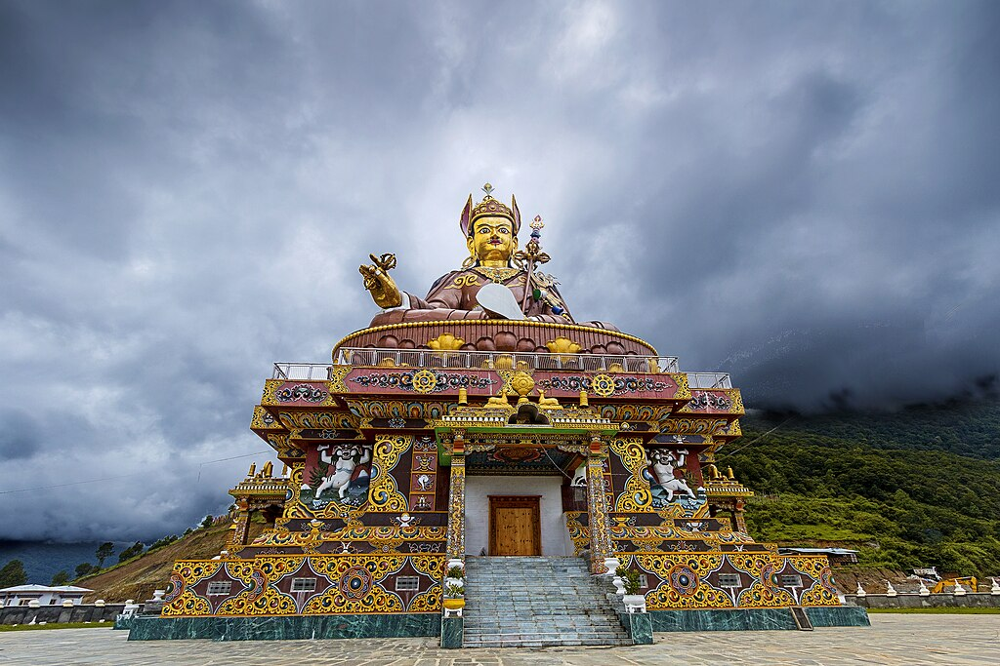
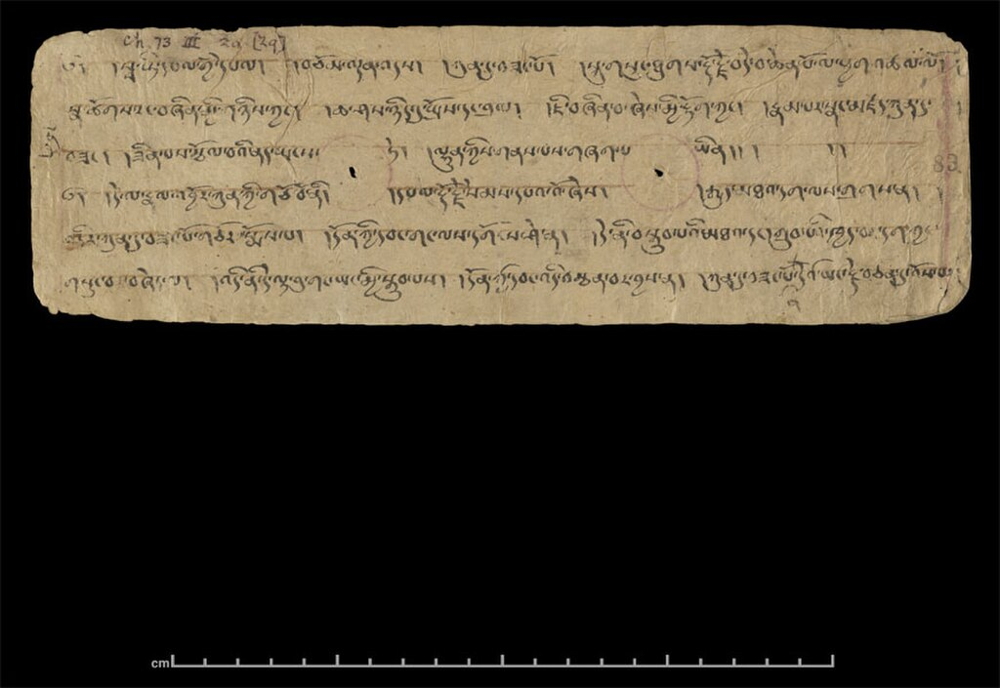
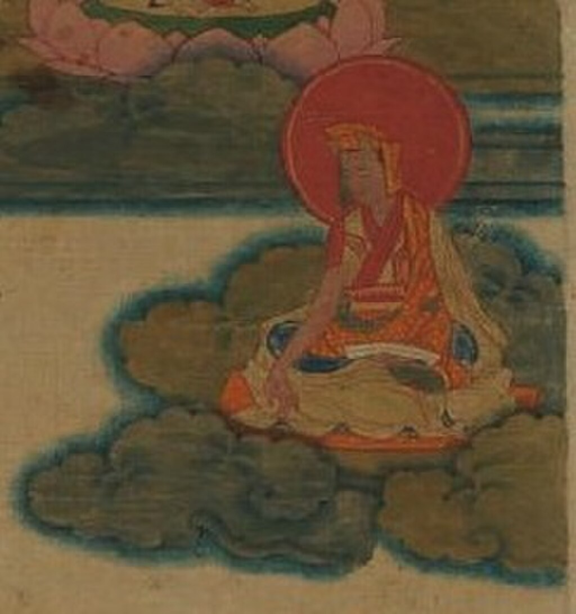
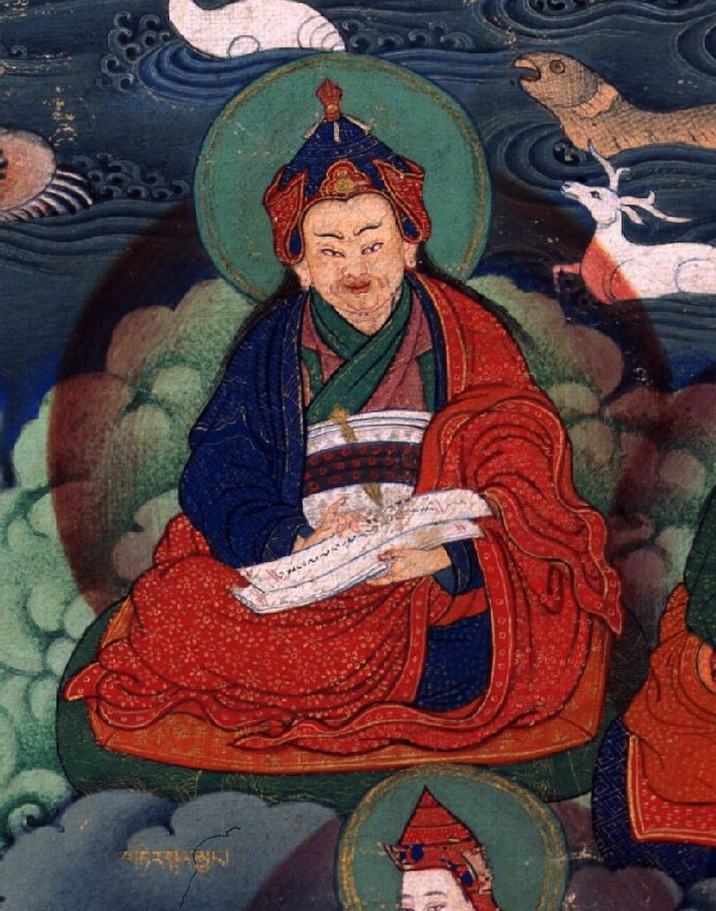
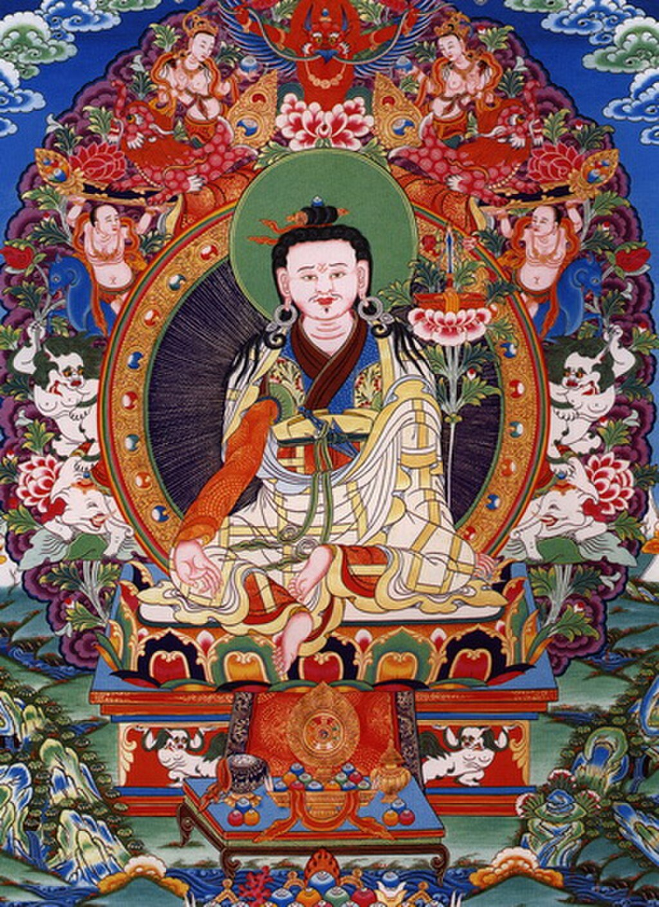
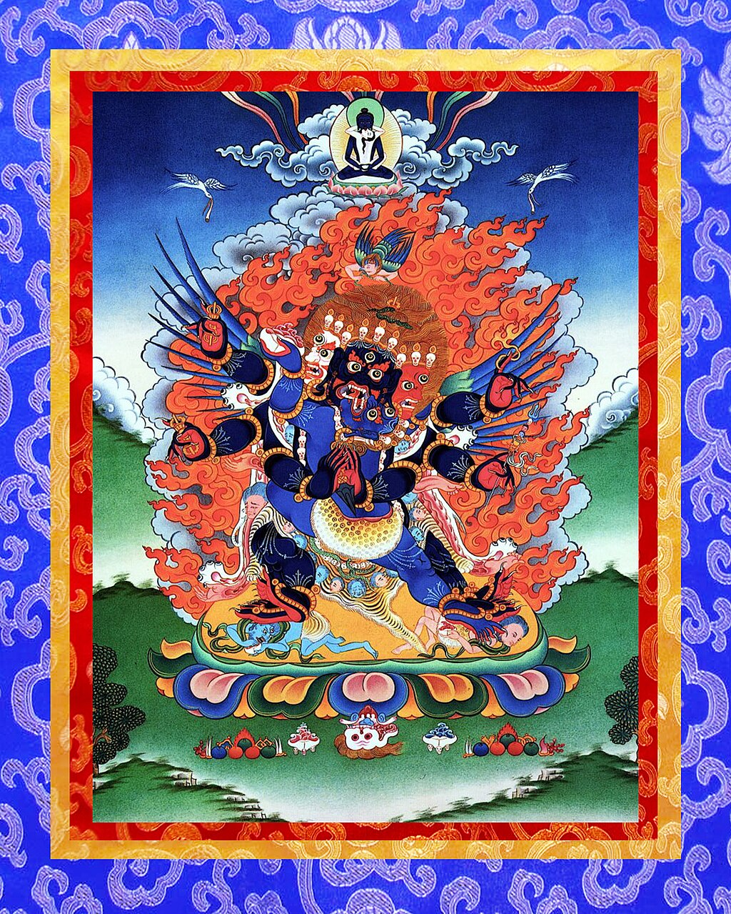
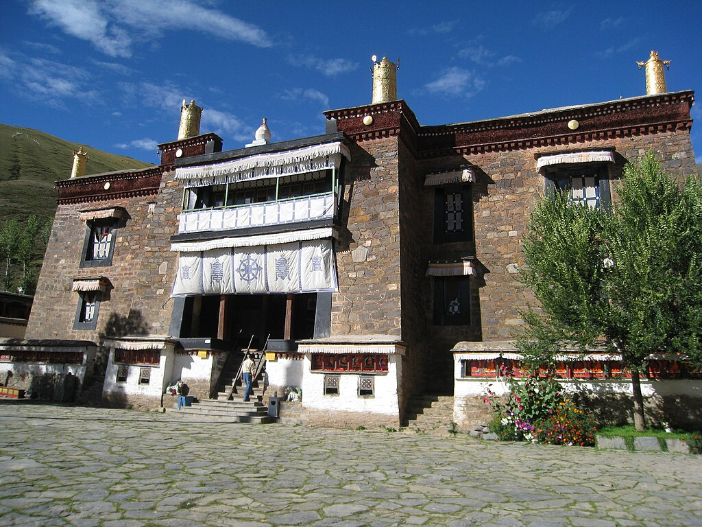

Statue of [Padmasambhava](/source/padmasambhava/ "Padmasambhava"), founder of the Nyingma school, in [Bhutan](https://en.wikipedia.org/wiki/Bhutan "Bhutan")

**Nyingma** ([Tibetan](https://en.wikipedia.org/wiki/Tibetan_script "Tibetan script"): རྙིང་མ་, [Wylie](https://en.wikipedia.org/wiki/Wylie_transliteration "Wylie transliteration"): rnying ma, [Lhasa dialect](https://en.wikipedia.org/wiki/Standard_Tibetan "Standard Tibetan"): [\[ɲ̟iŋ˥˥.ma˥˥\]](https://en.wikipedia.org/wiki/Help:IPA/Tibetan "Help:IPA/Tibetan"), lit.'old school'), also referred to as _Ngagyur_ ([Tibetan](https://en.wikipedia.org/wiki/Tibetan_script "Tibetan script"): སྔ་འགྱུར་རྙིང་མ།, [Wylie](https://en.wikipedia.org/wiki/Wylie_transliteration "Wylie transliteration"): snga 'gyur rnying ma, [Lhasa dialect](https://en.wikipedia.org/wiki/Standard_Tibetan "Standard Tibetan"): [\[ŋa˥˥.ʈ͡ʂuɹ\]](https://en.wikipedia.org/wiki/Help:IPA/Tibetan "Help:IPA/Tibetan"), lit.'order of the ancient translations'), is the oldest of the four major schools of [Tibetan Buddhism](https://en.wikipedia.org/wiki/Tibetan_Buddhism "Tibetan Buddhism"). The Nyingma school was founded by [Padmasambhava](/source/padmasambhava/ "Padmasambhava") as the first translations of Buddhist scriptures from [Pali](https://en.wikipedia.org/wiki/Pali "Pali") and [Sanskrit](/source/sanskrit/ "Sanskrit") into [Tibetan](https://en.wikipedia.org/wiki/Tibetic_languages "Tibetic languages") occurred in the eighth century. The establishment of Tibetan Buddhism and the Nyingma tradition is collectively ascribed to Khenpo [Shantarakshita](https://en.wikipedia.org/wiki/Shantarakshita "Shantarakshita"), Guru [Padmasambhava](/source/padmasambhava/ "Padmasambhava"), and King [Trisong Detsen](https://en.wikipedia.org/wiki/Trisong_Detsen "Trisong Detsen"), known as _Khen Lop Chos Sum_ (The Three: Khenpo, Lopon, Chosgyal).

The Nyingma tradition traces its [Dzogchen](/source/dzogchen/ "Dzogchen") lineage from the [first Buddha Samantabhadra](https://en.wikipedia.org/wiki/Adi-Buddha "Adi-Buddha") to [Garab Dorje](https://en.wikipedia.org/wiki/Garab_Dorje "Garab Dorje"), and its other lineages from Indian [mahasiddhas](https://en.wikipedia.org/wiki/Mahasiddha "Mahasiddha") such as [Sri Singha](https://en.wikipedia.org/wiki/Sri_Singha "Sri Singha") and [Jnanasutra](https://en.wikipedia.org/wiki/Jnanasutra "Jnanasutra"). [Yeshe Tsogyal](https://en.wikipedia.org/wiki/Yeshe_Tsogyal "Yeshe Tsogyal") recorded the teachings. Other great masters from the founding period include [Vimalamitra](/source/vimalamitra/ "Vimalamitra"), [Vairotsana](https://en.wikipedia.org/wiki/Vairotsana "Vairotsana"), and [Buddhaguhya](https://en.wikipedia.org/wiki/Buddhaguhya "Buddhaguhya"). The Nyingma tradition was physically founded at [Samye](https://en.wikipedia.org/wiki/Samye "Samye"), the first monastery in Tibet. Nyingma teachings are also known for having been passed down through networks of lay practitioners, and of [Ngakmapas](https://en.wikipedia.org/wiki/Ngagpa "Ngagpa") (Skt. _mantrī_).

While the Nyingma tradition contains most of the major elements of Tibetan Buddhism, it also has some unique features and teachings. The Nyingma teachings include a distinctive classification of the Buddhist Yanas, or vehicles to liberation, called the _Nine Yanas_. The Nyingma teachings on the _Great Perfection_ or [Dzogchen](/source/dzogchen/ "Dzogchen") is considered the highest of all Buddhist teachings. As such, the Nyingmas consider the Dzogchen teachings to be the most direct and profound path to [Buddhahood](https://en.wikipedia.org/wiki/Buddhahood "Buddhahood"). The main Dzogchen sources like the _[Seventeen tantras](https://en.wikipedia.org/wiki/Seventeen_tantras "Seventeen tantras")_ are seen as communicating a path that goes beyond the methods of [Highest Yoga Tantra](https://en.wikipedia.org/wiki/Classes_of_Tantra_in_Tibetan_Buddhism#Unsurpassable_Yoga "Classes of Tantra in Tibetan Buddhism"), which are seen as supreme in other schools of Tibetan Buddhism.

The Nyingma school also has an important tradition of discovering and revealing "hidden treasure texts" called [Termas](https://en.wikipedia.org/wiki/Terma_\(religion\) "Terma (religion)"), which allows the treasure discoverers or [tertöns](https://en.wikipedia.org/wiki/Tertön "Tertön") to reveal teachings according to conditions. Many Nyingma lineages are based on particular termas. For example, [Mindrolling Monastery](https://en.wikipedia.org/wiki/Mindrolling_Monastery "Mindrolling Monastery") focuses on the revelations of [Nyangrel Nyima Özer](https://en.wikipedia.org/wiki/Nyangrel_Nyima_Özer "Nyangrel Nyima Özer"), while [Dorje Drak](https://en.wikipedia.org/wiki/Dorje_Drak "Dorje Drak") is based on the Northern Treasures of [Rigdzin Gödem](https://en.wikipedia.org/wiki/Rigdzin_Gödem "Rigdzin Gödem").

## History

### Mythos

The Nyingma school recognizes [Samantabhadra](https://en.wikipedia.org/wiki/Samantabhadra_\(Bodhisattva\) "Samantabhadra (Bodhisattva)") (Küntu Sangpo), the "primordial buddha" ([Adi Buddha](https://en.wikipedia.org/wiki/Adi_Buddha "Adi Buddha")) as an embodiment of the [Dharmakāya](https://en.wikipedia.org/wiki/Dharmakāya "Dharmakāya"), the "truth body" of all buddhas. The Nyingma school sees the Dharmakaya as inseparable from both the [Sambhogakaya](https://en.wikipedia.org/wiki/Sambhogakaya "Sambhogakaya") and the [Nirmanakaya](https://en.wikipedia.org/wiki/Nirmanakaya "Nirmanakaya"). The origin of Nyingma's teaching (_bka' ma_) traditional is attributed to Samantabhadra, which is divided into (1) apparitional (_sgyu_), the eighteen tantric cycles of great yoga, (2) sūtra (_mdo_), the subsequent yoga, and (3) mind (_sems_), the teachings of the great perfection.

The [Vajrayana](/source/vajrayana/ "Vajrayana") or [Tantra](https://en.wikipedia.org/wiki/Tantra "Tantra") of the Nyingma school traces its origins to an emanation of [Amitaba](https://en.wikipedia.org/wiki/Amitaba "Amitaba") and of [Avalokitesvara](https://en.wikipedia.org/wiki/Avalokitesvara "Avalokitesvara"), Guru [Padmasambhava](/source/padmasambhava/ "Padmasambhava"), whose coming and activities are believed to have been predicted by [Buddha Shakyamuni](https://en.wikipedia.org/wiki/Buddha_Shakyamuni "Buddha Shakyamuni"). Nyingma origins are also traced to [Garab Dorje](https://en.wikipedia.org/wiki/Garab_Dorje "Garab Dorje") and to [Yeshe Tsogyal](https://en.wikipedia.org/wiki/Yeshe_Tsogyal "Yeshe Tsogyal").

Nyingma also sees [Vajradhara](https://en.wikipedia.org/wiki/Vajradhara "Vajradhara") (an emanation of Samantabhadra) and other buddhas as teachers of their many doctrines. Samantabhadra's wisdom and compassion spontaneously radiate myriad teachings, all appropriate to the capacities of different beings and entrusts them to "knowledge holders" (_vidyadharas_), the chief of which is Dorjé Chörap, who gives them to [Vajrasattva](https://en.wikipedia.org/wiki/Vajrasattva "Vajrasattva") and the dakini Légi Wangmoché, who in turn disseminate them among human siddhas. The first human teacher of the tradition was said to be [Garab Dorje](https://en.wikipedia.org/wiki/Garab_Dorje "Garab Dorje") (b. 55 c.e.), who had visions of Vajrasattva. [Padmasambhava](/source/padmasambhava/ "Padmasambhava") is the most famous and revered figure of the early human teachers and there are many legends about him, making it difficult to separate history from myth. Other early teachers include [Vimalamitra](/source/vimalamitra/ "Vimalamitra"), Jambel Shé Nyen, Śrī Siṃha, and Jñānasūtra. Most of these figures are associated with the Indian region of [Oddiyana](https://en.wikipedia.org/wiki/Oddiyana "Oddiyana").

### Historical origins

Buddhism existed in [Tibet](https://en.wikipedia.org/wiki/Tibet "Tibet") at least from the time of king [Thothori Nyantsen](https://en.wikipedia.org/wiki/Thothori_Nyantsen "Thothori Nyantsen") (fl.173?–300? CE), especially in the eastern regions. The reign of [Songtsen Gampo](https://en.wikipedia.org/wiki/Songtsen_Gampo "Songtsen Gampo") (ca.617-649/50) saw an expansion of Tibetan power, the adoption of a writing system, and the promotion of Buddhism.

Around 760, [Trisong Detsen](https://en.wikipedia.org/wiki/Trisong_Detsen "Trisong Detsen") invited [Padmasambhava](/source/padmasambhava/ "Padmasambhava"), later recognized as the most significant Nyingma teacher, and the [Nalanda](https://en.wikipedia.org/wiki/Nalanda "Nalanda") abbot [Śāntarakṣita](https://en.wikipedia.org/wiki/Śāntarakṣita "Śāntarakṣita") to Tibet to introduce Buddhism to the "Land of Snows." Trisong Detsen ordered the translation of all Buddhist texts into Tibetan. Padmasambhava, Śāntarakṣita, 108 translators, and 25 of Padmasambhava's nearest disciples worked for many years on a gigantic translation project. The translations from this period formed the base for the large scriptural transmission of Dharma teachings into Tibet and are known as the "Old Translations" and as the "Early Translation School". Padmasambhava supervised mainly the translation of tantras; Śāntarakṣita concentrated on the [sutras](https://en.wikipedia.org/wiki/Sutra "Sutra"). Padmasambhava and Śāntarakṣita also founded the first [Buddhist monastery](https://en.wikipedia.org/wiki/Gompa "Gompa") in Tibet: [Samye](https://en.wikipedia.org/wiki/Samye "Samye"). However, this situation would not last:

> The explosive developments were interrupted in the mid-ninth century as the Empire began to disintegrate, leading to a century-long interim of civil war and decentralization about which we know relatively little.

The early [Vajrayana](/source/vajrayana/ "Vajrayana") that was transmitted from India to Tibet may be differentiated by the specific term "Mantrayana" ([Wylie](https://en.wikipedia.org/wiki/Wylie_transliteration "Wylie transliteration"): sngags kyi theg pa). "Mantrayana" is the Sanskrit of what became rendered in Tibetan as "Secret Mantra" ([Wylie](https://en.wikipedia.org/wiki/Wylie_transliteration "Wylie transliteration"): gsang sngags): this is the self-identifying term employed in the earliest literature.

### Persecution

Part of the Dzogchen text _The cuckoo of awareness_, from [Dunhuang](https://en.wikipedia.org/wiki/Dunhuang "Dunhuang")

From this basis, [Vajrayana](/source/vajrayana/ "Vajrayana") was established in its entirety in Tibet. From the eighth until the eleventh century, this textual tradition (which was later identified as 'Nyingma') was the only form of Buddhism in Tibet. With the reign of King [Langdarma](https://en.wikipedia.org/wiki/Langdarma "Langdarma") (836–842), the brother of King Ralpachen, a time of political instability ensued which continued over the next 300 years, during which time Buddhism was persecuted and largely forced underground because the King saw it as a threat to the indigenous Bön tradition. Langdarma persecuted monks and nuns, and attempted to wipe out Buddhism. His efforts, however, were not successful. A few monks escaped to [Amdo](https://en.wikipedia.org/wiki/Amdo "Amdo") in the northeast of Tibet, where they preserved the lineage of monastic ordination.

The period of the 9–10th centuries also saw increasing popularity of a new class of texts which would later be classified as the [Dzogchen](/source/dzogchen/ "Dzogchen") "Mind series" ([Semde](https://en.wikipedia.org/wiki/Semde "Semde")). Some of these texts present themselves as translations of Indian works, though according to [David Germano](https://en.wikipedia.org/wiki/David_Germano "David Germano"), most are original Tibetan compositions. These texts promote the view that true nature of the mind is empty and luminous and seem to reject traditional forms of practice. An emphasis on the Dzogchen textual tradition is a central feature of the Nyingma school.

In a series of articles, Flavio Geisshuesler explores the persecution of the proponents of the Nyingma school from multiple perspectives, including trauma studies. In a monograph, he suggests that Dzogchen might actually be a pre-Buddhist tradition indigenous to Tibet. Exploring a series of motifs that are found pervasively throughout the contemplative system, such as the hunting of animals, he argues that the tradition was originally associated with shamanism and the Eurasian cult of the sky-deer.

### Second dissemination and New translations

From the eleventh century onward, there was an attempt to reintroduce Vajrayana Buddhism to Tibet. This saw new translation efforts which led to the foundation of new Vajrayana schools which are collectively known as the [Sarma](https://en.wikipedia.org/wiki/Sarma_\(Tibetan_Buddhism\) "Sarma (Tibetan Buddhism)") "New translation" schools because they reject the old translations of the Nyingma canon. It was at that time that Nyingmapas began to see themselves as a distinct group and the term "Nyingma" came into usage to refer to those who continued to use the "Old" or "Ancient" translations. Nyingma writers such as Rongzom (ca. 11th century) and Nyangrel were instrumental in defending the old texts from the critiques of the Sarma translators and in establishing a foundation for the mythology and philosophy of the Nyingma tradition.

[Rongzom Chokyi Zangpo](https://en.wikipedia.org/wiki/Rongzom_Chokyi_Zangpo "Rongzom Chokyi Zangpo") was the most influential of the 11th century Nyingma authors, writing "extensive exoteric and esoteric commentaries." He upheld the view that sutra teachings such as [Madhyamaka](/source/madhyamaka/ "Madhyamaka") were ultimately inferior to the teachings found in the [Buddhist Tantras](https://en.wikipedia.org/wiki/Buddhist_Tantras "Buddhist Tantras") and [Dzogchen](/source/dzogchen/ "Dzogchen"). Rongzom also wrote a commentary on the [Guhyagarbha tantra](https://en.wikipedia.org/wiki/Guhyagarbha_tantra "Guhyagarbha tantra"), which is the main tantra in the Nyingma tradition.

Drapa Ngonshe, 11th century tertonNyangrel Nyima Ozer, 11th century terton

The period of the new dissemination of Buddhism which saw the rise of the Sarma schools also saw the proliferation of fresh Nyingma Dzogchen texts with fresh doctrines and meditative practices, mainly the 'Space class' ([Longdé](https://en.wikipedia.org/wiki/Longdé "Longdé")) and the 'Instruction class' ([Menngagde](https://en.wikipedia.org/wiki/Menngagde "Menngagde")) (11th–14th century), particularly important were the [seventeen tantras](https://en.wikipedia.org/wiki/Seventeen_tantras "Seventeen tantras"). To vitalize the legitimacy of these new texts against the criticism of the Sarma schools, the Nyingma school expanded the tradition of the "[Terma](https://en.wikipedia.org/wiki/Terma_\(religion\) "Terma (religion)")", which are said to be revealed treasure texts by ancient masters, usually Padmasambhava, which had been hidden away and then discovered by [tertons](https://en.wikipedia.org/wiki/Tertons "Tertons") (treasure revealers). The first tertons dating to the 11th century were Sangyé Lama and Drapa Ngönshé. Another important terton, Nyangrel Nyima Özer (1136–1204), was the principal promulgator of the Padmasambhava mythos, according to [Janet Gyatso](https://en.wikipedia.org/wiki/Janet_Gyatso "Janet Gyatso"). Guru Chöwang (1212–70) was also influential in developing the myths of Padmasambhava. Nyangrel and Chögi Wangchuk (1212–1270) are known as the "sun and moon" of tertons, and along with Rikdsin Gödem (1337–1409), are called the "three grand tertons".

By this period we see the establishment of three major classes of Nyingma literature; those translated and transmitted without interruption from the beginning of the Buddhist dissemination are called "transmitted precepts" (_bka' ma_), the hidden "treasures" are called _gter ma_ and lastly there are those collected works (_gsung 'bum_) of individual Tibetan authors.

### Systematization and growth

[Jigme Lingpa](https://en.wikipedia.org/wiki/Jigme_Lingpa "Jigme Lingpa")

[Longchen Rabjampa, Drimé Özer](/source/longchenpa/ "Longchenpa") (Longchenpa, 1308–1364, possibly 1369) is a central thinker and poet in Nyingma thought and Tibetan [Buddhist philosophy](https://en.wikipedia.org/wiki/Buddhist_philosophy "Buddhist philosophy"). He is mainly known for his systematized integration and exposition of the major textual cycles such as the [Menngagde](https://en.wikipedia.org/wiki/Menngagde "Menngagde") in his various writings, which by his time had become central texts in the Nyingma tradition. His main writings include the [Seven Treasuries](https://en.wikipedia.org/wiki/Seven_Treasuries "Seven Treasuries") (_mdzod bdun_), the "Trilogy of Natural Freedom" (_rang grol skor gsum_), the "Trilogy that Clears Darkness" ("mun sel skor gsum"), and the [Trilogy of Natural Ease](https://en.wikipedia.org/wiki/Trilogy_of_Natural_Ease "Trilogy of Natural Ease") (_ngal gso skor gsum_).

The 14th and 15th centuries saw the work of many tertons such as Orgyen Lingpa (1323–1360), [Pema Lingpa](https://en.wikipedia.org/wiki/Pema_Lingpa "Pema Lingpa") (1346–1405), Sangye Lingpa (1340–1396) and Ratna Lingpa (1403–1479). Another key figure was [Karma Lingpa](https://en.wikipedia.org/wiki/Karma_Lingpa "Karma Lingpa") (1326–1386), who wrote down an important work called "Profound Dharma of Self-Liberation through the Intention of the Peaceful and Wrathful Ones" which includes the two texts of the _[bar-do thos-grol](https://en.wikipedia.org/wiki/Bardo_Thodol "Bardo Thodol")_, the "Tibetan Book of the Dead". Lochen Dharmaśrī (1654–1717) wrote important commentaries on the [Guhyagarbha tantra](https://en.wikipedia.org/wiki/Guhyagarbha_tantra "Guhyagarbha tantra") and his brother Terdak Lingpa (1646–1714) was the founder of the [Mindrolling Monastery](https://en.wikipedia.org/wiki/Mindrolling_Monastery "Mindrolling Monastery") in 1670, one of the six major Nyingma monasteries.

A later seminal figure in the development of the Nyingma system was [Jigme Lingpa](https://en.wikipedia.org/wiki/Jigme_Lingpa "Jigme Lingpa") (1730–1798) "the greatest treasure finder of the eighteenth century", whose [Longchen Nyingthig](https://en.wikipedia.org/wiki/Longchen_Nyingthig "Longchen Nyingthig") ("The Heart-essence of the Vast Expanse") is a systematization of the path which is one of the most widely used Nyingma [Dzogchen](/source/dzogchen/ "Dzogchen") teachings today. The innovations that emerged within the Nyingma tradition during the 17th and 18th centuries significantly accelerated its revival, which was also greatly supported by the favorable attitudes of the Fifth Dalai Lama and the ruler of Central Tibet in the early 18th century, P'olhané.

### Rimé and the rise of scholasticism

[Jamgon Ju Mipham Gyatso](https://en.wikipedia.org/wiki/Jamgon_Ju_Mipham_Gyatso "Jamgon Ju Mipham Gyatso")

In 1848, the Nyingma monastic college of Dzogchen Shri Sengha (rdzogs chen srwi sengha), was founded in Kham by a charismatic teacher, Zhanphan Thaye (gzhan phan mtha' yas, 1800–), in association with the active participation of Do Kyentse (rndo mkhyen rtse). According to Georges Dreyfus, the Nyingma school had traditionally "relied on non-ordained tantric practitioners to transmit its teachings through authorized lineages." The foundation of this monastic school was a major shift in the Nyingma tradition, and is seen as a response to the growth of the [Gelug](https://en.wikipedia.org/wiki/Gelug "Gelug") school's hegemony which was based on a well organized system of monastic [scholasticism](https://en.wikipedia.org/wiki/Scholasticism "Scholasticism") and education. The sort of study and learning in this monastery was mostly based on exegetical commentary, a contrast to the more debate based Gelug education. In this way, the Nyingma school revitalized itself and presented itself as a legitimate rival to the Gelug school.

The 19th century also saw the rise of the non-sectarian '[Rimé](https://en.wikipedia.org/wiki/Rimé_movement "Rimé movement")' movement, led by [Jamyang Khyentse Wangpo](https://en.wikipedia.org/wiki/Jamyang_Khyentse_Wangpo "Jamyang Khyentse Wangpo") (1820–1892) and [Jamgön Kongtrül](https://en.wikipedia.org/wiki/Jamgön_Kongtrül "Jamgön Kongtrül") (1813–1899) which sought to collect and print the teachings of the [Sakya](https://en.wikipedia.org/wiki/Sakya_\(Tibetan_Buddhist_school\) "Sakya (Tibetan Buddhist school)"), [Kagyu](/source/kagyu/ "Kagyu") and Nyingma schools in response to the hegemonic influence of the [Gelug](https://en.wikipedia.org/wiki/Gelug "Gelug") school.

[Jamgon Ju Mipham Gyatso](https://en.wikipedia.org/wiki/Jamgon_Ju_Mipham_Gyatso "Jamgon Ju Mipham Gyatso") ("Mipham the Great", 1846–1912) was born into an aristocratic family in 1846 in Kham, a province of eastern Tibet. Mipham was a student of Rime scholars like Kongtrül. Mipham composed authoritative works on both the Sutra and Vajrayana teachings as understood in the Nyingma tradition, writing extensively on [Dzogchen](/source/dzogchen/ "Dzogchen") and [Madhyamaka](/source/madhyamaka/ "Madhyamaka"). According to Karma Phuntsho, Mipham's work "completely revolutionised rNying ma pa scholasticism in the late nineteenth century, raising its status after many centuries as a comparative intellectual backwater, to arguably the most dynamic and expansive of philosophical traditions in all of Tibetan Buddhism, with an influence and impact far beyond the rNying ma pa themselves."

Mipham's works have become the foundation of study for not only the Nyingma lineage, but the [Kagyu](/source/kagyu/ "Kagyu") lineage as well. They hold a central position in all Nyingma monasteries and monastic colleges.

Following in the footsteps of Mipham, [Khenpo Shenga](https://en.wikipedia.org/wiki/Khenpo_Shenga "Khenpo Shenga") was also an important figure in the revitalization of Nyingma monastic education by establishing the study of exoteric philosophy at Dzogchen Shri Sengha through the use of [classic Indian texts](https://en.wikipedia.org/wiki/Tibetan_Buddhist_canon#Five_traditional_topics_of_study "Tibetan Buddhist canon"), which include the major works of [Asanga](https://en.wikipedia.org/wiki/Asanga "Asanga"), [Nagarjuna](https://en.wikipedia.org/wiki/Nagarjuna "Nagarjuna") and [Aryadeva](https://en.wikipedia.org/wiki/Aryadeva "Aryadeva"). Khenpo Shenga composed commentaries on these key texts and scholastic textbooks. He focused on the study of these texts as a way to avoid sectarian disputes by appealing to classic Indian material.

The 19th century also saw the production of new Terma texts, particularly by [Orgyen Chokgyur Lingpa](https://en.wikipedia.org/wiki/Orgyen_Chokgyur_Lingpa "Orgyen Chokgyur Lingpa") (1829–1870), Péma Ösel Dongak Lingpa (1820–1892), and [Dudjom Lingpa](https://en.wikipedia.org/wiki/Dudjom_Lingpa "Dudjom Lingpa") (1835–1904). Another important figure is [Patrul Rinpoche](https://en.wikipedia.org/wiki/Patrul_Rinpoche "Patrul Rinpoche") (b. 1808), who wrote _The Words of My Perfect Teacher_, a key text on Nyingma preliminaries.

## Teaching

### Nine Yānas

The doxography employed by the Nyingma tradition to categorize the whole of the Buddhist path is unique. Nyingmapas divide the Buddhist path into nine [yanas](https://en.wikipedia.org/wiki/Yana_\(Buddhism\) "Yana (Buddhism)"), as follows:

#### Sutra system

*   [Śrāvakayāna](https://en.wikipedia.org/wiki/Śrāvakayāna "Śrāvakayāna"), the Vehicle of the Listeners or disciples.
*   [Pratyekabuddhayāna](https://en.wikipedia.org/wiki/Pratyekabuddhayāna "Pratyekabuddhayāna") ([Hinayana](https://en.wikipedia.org/wiki/Hinayana "Hinayana")), the Vehicle of the Solitary Buddhas, the way of solitary meditation.
*   Bodhisattvayāna ([Mahayana](https://en.wikipedia.org/wiki/Mahayana "Mahayana")), the Great or Causal Vehicle, the Vehicle of Enlightened Beings, is the way of those who seek or attain enlightenment for the sake or intention of liberating not just oneself, but all sentient beings from [Saṃsāra](https://en.wikipedia.org/wiki/Saṃsāra "Saṃsāra").

#### Outer tantras

*   [Kriyā](https://en.wikipedia.org/wiki/Kriyā "Kriyā") ([Wylie](https://en.wikipedia.org/wiki/Wylie_transliteration "Wylie transliteration"): bya ba'i rgyud), Tantra of Action which involves ritual, mantra repetition and visualization.
*   [Carya or Ubhaya](https://en.wikipedia.org/wiki/Charya_tantra_yana "Charya tantra yana") ([Wylie](https://en.wikipedia.org/wiki/Wylie_transliteration "Wylie transliteration"): u pa'i rgyud or _spyod pa'i rgyud_), Tantra of Conduct — equal amounts of meditation and symbolic rituals.
*   [Yogatantra](https://en.wikipedia.org/wiki/Yogatantra "Yogatantra") ([Wylie](https://en.wikipedia.org/wiki/Wylie_transliteration "Wylie transliteration"): rnal 'byor gyi rgyud), Tantra of Union.

Passed down into Tibet by the disciples of Buddhaguhya, each is linked to a complete enjoyment body Buddha: Vajrasattva for Kriyā, Mañjuśrī for Carya, and Avalokiteśvara for Yogatantra.

#### Inner tantras

*   [Mahayoga](https://en.wikipedia.org/wiki/Mahayoga "Mahayoga") ([Wylie](https://en.wikipedia.org/wiki/Wylie_transliteration "Wylie transliteration"): chen po'i rnal 'byor), Great Yoga.
*   Subsequent yoga.
*   Atiyoga ([Dzogchen](/source/dzogchen/ "Dzogchen")) ([Wylie](https://en.wikipedia.org/wiki/Wylie_transliteration "Wylie transliteration"): lhag pa'i rnal 'byor or _rdzogs chen_), Ultimate Yoga; the Great Perfection — often practised in monasteries kept specially for this purpose.

The eighteen major works of the Inner Tantra were transmitted and translated by Padmasambhava and Vimalamitra, with Samantabhadra as the origin. In the later schools the inner tantric teachings are known as _[Anuttarayoga Tantra](https://en.wikipedia.org/wiki/Anuttarayoga_Tantra "Anuttarayoga Tantra")_, which corresponds to Mahayoga in the Nyingma system, while the [Mahamudra](https://en.wikipedia.org/wiki/Mahamudra "Mahamudra") teachings of the later schools are said to lead to similar results as the Dzogchen teachings.

The first two of the nine vehicles are seen as Hinayana, the third as Mahayana and the remaining six as specifically Vajrayana. [Dudjom Jigdral Yeshe Dorje](/source/dudjom-rinpoche/ "Dudjom Jigdral Yeshe Dorje") emphasized the eight lower vehicles are intellectually fabricated and contrived, while Rongzom held that the views of sutra such as Madhyamaka were inferior to that of tantra.

The nine vehicles are further categorized into four divisions: (1) Basis Continuum (_gzhi rgyud_), referring to Samantabhadra, the primordially awakened truth body; (2) Path Continuum (_lam rgyud_), practices aimed at eliminating afflictions through the accumulation of merit and wisdom; (3) Result Continuum ('_bras bu rgyud_), the attainment of awakening following bodhisattva training; and (4) Method Continuum (_thabs rgyud_), the awakened being’s capacity to benefit sentient beings.

### Practices

Vajrakilaya

#### Preliminary practices

Like in other schools of Tibetan Buddhism, Nyingma teaches various forms of [ngöndro](https://en.wikipedia.org/wiki/Ngöndro "Ngöndro"), or preliminary practices which help prepare the mind for later meditations. These include the cultivation of "[bodhicitta](https://en.wikipedia.org/wiki/Bodhicitta "Bodhicitta")", the "four thoughts that turn the mind", and [Vajrasattva](https://en.wikipedia.org/wiki/Vajrasattva "Vajrasattva") purification practice.

#### Yidam practice and protectors

[Deity Yoga](https://en.wikipedia.org/wiki/Deity_Yoga "Deity Yoga") is also a feature of Nyingma. The foremost deities ([yidam](https://en.wikipedia.org/wiki/Yidam "Yidam")) practiced by the Nyingma masters are [Vajrakīla](https://en.wikipedia.org/wiki/Vajrakīla "Vajrakīla") (Tib. _Dorje Phurba_) and Vajra Heruka (also _Vishuddha Heruka_; Tib. _Yangdak Tratung_, [Wylie](https://en.wikipedia.org/wiki/Wylie_transliteration "Wylie transliteration"): yang dag khrag 'thung), the third of the [Eight Herukas](https://en.wikipedia.org/wiki/Heruka#Eight_Herukas_of_the_Nyingma_Mahayoga "Heruka") who closely resembles Śrī Heruka of the [Chakrasamvara](https://en.wikipedia.org/wiki/Chakrasamvara "Chakrasamvara") tantra. The three principle protectors of the Nyingma lineage are said to be [Ekajaṭī](https://en.wikipedia.org/wiki/Ekajati "Ekajati") ([Wylie](https://en.wikipedia.org/wiki/Wylie_transliteration "Wylie transliteration"): e ka dza ti), [Rāhula](https://en.wikipedia.org/wiki/Rahu "Rahu") ([Wylie](https://en.wikipedia.org/wiki/Wylie_transliteration "Wylie transliteration"): gza' ra hu la) and [Dorje Legpa](https://en.wikipedia.org/wiki/Damchen_Dorje_Legpa "Damchen Dorje Legpa") ([Wylie](https://en.wikipedia.org/wiki/Wylie_transliteration "Wylie transliteration"): rdo rje legs pa, Sanskrit: _Vajrasādhu_).

#### Other practices

Other forms of practice like [Lojong](https://en.wikipedia.org/wiki/Lojong "Lojong") and [subtle body](https://en.wikipedia.org/wiki/Subtle_body "Subtle body") practices such as [Trul khor](https://en.wikipedia.org/wiki/Trul_khor "Trul khor") are also taught in Nyingma.

## Scriptural canon

With the advent of the transmission of [Sarma](https://en.wikipedia.org/wiki/Sarma_\(Tibetan_Buddhism\) "Sarma (Tibetan Buddhism)") traditions into Tibet, various proponents of the new systems cast aspersions on the Indic origins of much of the Nyingma esoteric corpus. Indic origin was an important component of perceived legitimacy at the time. As a result, much of the Nyingma esoteric corpus was excluded from the [Tengyur](https://en.wikipedia.org/wiki/Tengyur "Tengyur"), a compilation of texts by [Buton Rinchen Drub](https://en.wikipedia.org/wiki/Buton_Rinchen_Drub "Buton Rinchen Drub") that became the established canon for the Sarma traditions. This means that while Nyingma accept the Tengyur scriptures they also include writings that other schools reject as not being authentic for having no Indic sources—though Sanskrit originals of some have been discovered in Nepal.

The Nyingma school acknowledges two primary types of transmission lineages: (1) Teachings (_bka' ma_)—kama, unbroken instructions passed down from the Buddha, and (2) Hidden Treasures (gter ma)—termas, which were concealed by past masters.

The Kama lineage, which begins with Padmasambhava, [Shantarakshita](https://en.wikipedia.org/wiki/Shantarakshita "Shantarakshita"), [Vimalamitra](/source/vimalamitra/ "Vimalamitra"), and [Vairochana](https://en.wikipedia.org/wiki/Vairochana "Vairochana"), is the oral transmission lineage and is called the "source of Nyingma tradition" by Nyingma scholar [Khenchen Palden Sherab Rinpoche](https://en.wikipedia.org/wiki/Palden_Sherab "Palden Sherab"). It is further stated by Khenchen Palden Sherab Rinpoche that,

> From the time of Guru Padmasambhava and for at least three centuries afterwards, everyone who attained enlightenment in Tibet did so by practicing the kama lineage teachings of the Nyingma School.

The Kama lineage remained predominant from the 8th to 11th century, and Kama masters taught from the lineage's teachings.

The [Terma](https://en.wikipedia.org/wiki/Terma_\(religion\) "Terma (religion)") lineage is the revealed transmission lineage where [Tertons](https://en.wikipedia.org/wiki/Tertons "Tertons"), or treasure revealers, realize the teachings. The arising of the Terma lineage began in the 11th century, and by the 14th century Tertons were more sought as teachers than Kama masters. The Terma lineage was established by Guru [Padmasambhava](/source/padmasambhava/ "Padmasambhava") and [Yeshe Tsogyal](https://en.wikipedia.org/wiki/Yeshe_Tsogyal "Yeshe Tsogyal"), through the hiding of teachings for the purpose of future discovery. The Kama is the basis of the Terma.

### _Nyingma Gyubum_

The Nyingmapas organized their esoteric corpus, comprising mostly [Mahayoga](https://en.wikipedia.org/wiki/Mahayoga "Mahayoga"), Atiyoga (Dzogchen) Mind class [Semde](https://en.wikipedia.org/wiki/Semde "Semde") and Space Class ([Longdé](https://en.wikipedia.org/wiki/Longdé "Longdé")) texts, into an alternate collection, called the _[Nyingma Gyubum](https://en.wikipedia.org/wiki/Nyingma_Gyubum "Nyingma Gyubum")_ (the Hundred Thousand Tantras of the Ancient School, [Wylie](https://en.wikipedia.org/wiki/Wylie_transliteration "Wylie transliteration"): rnying ma rgyud ‘bum). Generally, the Gyubum contains Kahma ([Wylie](https://en.wikipedia.org/wiki/Wylie_transliteration "Wylie transliteration"): bka' ma) and very little terma ([Wylie](https://en.wikipedia.org/wiki/Wylie_transliteration "Wylie transliteration"): gter ma). The third class of Atiyoga, the Secret Oral Instructions (Menngagde), are mostly terma texts.

Various editions of the Gyubum are extant, but one typical version is the thirty-six Tibetan-language folio volumes published by [Dilgo Khyentse Rinpoche](https://en.wikipedia.org/wiki/Dilgo_Khyentse_Rinpoche "Dilgo Khyentse Rinpoche") in New Delhi, 1974. It contains:

*   10 volumes of Ati Yoga (Dzogchen)
*   3 volumes of Anu Yoga
*   6 volumes of the tantra Section of Mahayoga
*   13 volumes of the sadhana Section of Mahayoga
*   1 volume of protector tantras
*   3 volumes of catalogues and historical background

### Mahayoga

There are 'eighteen great tantras' ([Wylie](https://en.wikipedia.org/wiki/Wylie_transliteration "Wylie transliteration"): bshad pa dang cha mthun gyi rgyud tantra sde bco brgyad) at the heart of the 'Mahayoga' ([Wylie](https://en.wikipedia.org/wiki/Wylie_transliteration "Wylie transliteration"): rnal 'byor chen po) tradition, grouped into 'five root tantras' ([Wylie](https://en.wikipedia.org/wiki/Wylie_transliteration "Wylie transliteration"): rtsa ba sku gsung thugs yon tan phrin las kyi rgyud chen po lnga), 'five practice tantras' ([Wylie](https://en.wikipedia.org/wiki/Wylie_transliteration "Wylie transliteration"): sgrub pa lag len du bstan pa rol pa' rgyud chen po lnga), and 'five activity tantras' ([Wylie](https://en.wikipedia.org/wiki/Wylie_transliteration "Wylie transliteration"): spyod pa'i yan lag tu 'gro ba'i rgyud chen po lnga), and the 'two supplementary tantras' ([Wylie](https://en.wikipedia.org/wiki/Wylie_transliteration "Wylie transliteration"): ma tshang kha bskong ba'i rgyud chen po gnyis). Together they are known as the _Māyājāla_. The [Guhyagarbha Tantra](https://en.wikipedia.org/wiki/Guhyagarbha_Tantra "Guhyagarbha Tantra") ([Wylie](https://en.wikipedia.org/wiki/Wylie_transliteration "Wylie transliteration"): rDo rje sems dpa' sgyu 'phrul drwa ba gSang ba snying po) is the foremost of all of these and it abridges the content of the seventeen others.

### Dzogchen

[Dzogchen](/source/dzogchen/ "Dzogchen") ("Great Perfection") is the central distinctive practice and view which is the focus of Nyingma and it is seen by this school as the supreme practice. It is seen as the ultimate understanding of the [nature of mind](https://en.wikipedia.org/wiki/Nature_of_mind_\(Buddhism\) "Nature of mind (Buddhism)"), which is known as [rigpa](https://en.wikipedia.org/wiki/Rigpa "Rigpa"). Dzogchen seeks to understand the nature of mind without the [subtle body](https://en.wikipedia.org/wiki/Subtle_body "Subtle body") practices and visualizations of other tantric forms, and Dzogchen tantras state that visualization practices are inferior to Dzogchen, which directly works with the nature of the mind itself. A main feature of Dzogchen is the practice of "cutting through" (_khregs chod_) the everyday mind and its obscurations to reach the primordial nature of mind or [rigpa](https://en.wikipedia.org/wiki/Rigpa "Rigpa"), which is essential purity (_ka dag_) and spontaneity (_lhun grub_), and is associated with emptiness (_[shunyata](https://en.wikipedia.org/wiki/Shunyata "Shunyata")_). The second form of Dzogchen practice is referred to as "direct approach" (_thod rgal_) and involves making an effort at recognizing spontaneity through the use of visions or appearances. This is said to be associated with skillful means (_[upaya](https://en.wikipedia.org/wiki/Upaya "Upaya")_).

The Nyingma [Dzogchen](/source/dzogchen/ "Dzogchen") lineage was transmitted directly from [Garab Dorje](https://en.wikipedia.org/wiki/Garab_Dorje "Garab Dorje") to Padmasambhava. The most influential Nyingma scholar yogi of the Great Perfection is [Longchenpa](/source/longchenpa/ "Longchenpa") (1308–1364), and his voluminous works mark a turning point in the scholastic systematization and refinement of the Nyingma Dzogchen system. Koppl notes that although later Nyingma authors such as [Mipham](https://en.wikipedia.org/wiki/Jamgon_Ju_Mipham_Gyatso "Jamgon Ju Mipham Gyatso") attempted to harmonize the view of Dzogchen with [Madhyamaka](/source/madhyamaka/ "Madhyamaka"), the earlier Nyingma author [Rongzom Chokyi Zangpo](https://en.wikipedia.org/wiki/Rongzom_Chokyi_Zangpo "Rongzom Chokyi Zangpo") did not.

[Dzogchen](/source/dzogchen/ "Dzogchen") literature is usually divided into three categories, which more or less reflect the historical development of Dzogchen:

1.  [Semde](https://en.wikipedia.org/wiki/Semde "Semde") (Wylie: _sems sde_; Skt: _cittavarga_), the "Mind Series"; this category contains the earliest Dzogchen teachings from the 9th century and later. It includes texts like the _Harbinger of Awareness_ and the [Kunjed Gyalpo](https://en.wikipedia.org/wiki/Kulayarāja_Tantra "Kulayarāja Tantra") (Sanskrit: _Kulayarāja Tantra_; The Great Leveler) Tantra, the most significant of the 'mind' tantras. Twenty-one main tantras are listed, though the Great Leveler contains five of them and other similar texts are included in different recensions of the Mind Section.
2.  [Longdé](https://en.wikipedia.org/wiki/Longdé "Longdé") (Wylie: _klong sde_; Skt: _abhyantaravarga_), the series of Space; dating from the 11th–14th centuries. These texts emphasize emptiness ([shunyata](https://en.wikipedia.org/wiki/Shunyata "Shunyata")) or spaciousness. The most important text in this division is "Samantabhadra’s Royal Tantra of All-Inclusive Vastness" (Sanskrit: Mahāvarntaprasaranirajatantranāma).
3.  [Menngagde](https://en.wikipedia.org/wiki/Menngagde "Menngagde") (Wylie: _man ngag sde_, Skt: _upadeshavarga_), the series of secret Oral Instructions, 11th–14th centuries. This division, including the important "[Seventeen tantras](https://en.wikipedia.org/wiki/Seventeen_tantras "Seventeen tantras")", focuses on two major forms of practice, _kadag trekchö_, "the cutting through of primordial purity", and _lhündrub tögal_, "the direct crossing of spontaneous presence."

### Termas

According to the Nyingma-tradition, Padmasambhava and his main disciples hid hundreds of scriptures, ritual objects and relics in secret places to protect Buddhism during the time of decline, under King Langdarma, and when the dharma would need revitalizing in the future. These termas were later rediscovered. This system is effective in revitalizing the Nyingma order while preserving its connection to tradition.

Termas are often encoded in "ḍākini language," which can only be deciphered by those trained in its interpretation. Additionally, safeguards are said to be in place to prevent their discovery before the appropriate time, ensuring that they are revealed only by the right individuals at the right moment. The core terma texts are the eight Heruka sādhanas, brought to Tibet by Padmasambhava.

Today, the Rinchen Terdzod ([Tibetan](https://en.wikipedia.org/wiki/Tibetan_script "Tibetan script"): རིན་ཆེན་གཏེར་མཛོད།, [Wylie](https://en.wikipedia.org/wiki/Wylie_transliteration "Wylie transliteration"): rin chen gter mdzod) is the most important collection of terma treasure to Nyingmapas. This collection is the assemblage of thousands of the most important terma texts from all across Tibet made by [Jamgon Kongtrul Lodro Thaye](https://en.wikipedia.org/wiki/Jamgon_Kongtrul_Lodro_Thaye "Jamgon Kongtrul Lodro Thaye"), at the behest of Jamyang Khyentse Wangpo in the nineteenth century.

## Hierarchy and teachers

### Internal administration

The Nyingma school traditionally had no centralized authority or Nyingma-wide hierarchy. There was never a single "head of the lineage" in the manner of either the [Karmapa](https://en.wikipedia.org/wiki/Karmapa "Karmapa") of the [Karma Kagyu](https://en.wikipedia.org/wiki/Karma_Kagyu "Karma Kagyu") school, or the [Sakya Trizin](https://en.wikipedia.org/wiki/Sakya_Trizin "Sakya Trizin") of the [Sakya](https://en.wikipedia.org/wiki/Sakya_\(Tibetan_Buddhist_school\) "Sakya (Tibetan Buddhist school)") school, or the [Ganden Tripa](https://en.wikipedia.org/wiki/Ganden_Tripa "Ganden Tripa") of the [Gelug](https://en.wikipedia.org/wiki/Gelug "Gelug") school.

After the [Tibetan diaspora](https://en.wikipedia.org/wiki/Tibetan_diaspora "Tibetan diaspora") following the Chinese invasion of Tibet, the Nyingma school temporarily had a head of the school. The [14th Dalai Lama](https://en.wikipedia.org/wiki/14th_Dalai_Lama "14th Dalai Lama") appointed [Dudjom Rinpoche](https://en.wikipedia.org/wiki/Dudjom_Rinpoche "Dudjom Rinpoche") to the position in 1960, in a semi-official status. Dudjom Rinpoche led efforts until his passing in 1987 to stabilize the exile community and gather Tibetan Buddhist texts. The temporary Nyingma leadership position lasted from 1960 until 2018 and was largely administrative, but the Rinpoches who served in this role are among the most universally highly regarded.

They include:

*   [Dudjom Jigdral Yeshe Dorje](/source/dudjom-rinpoche/ "Dudjom Jigdral Yeshe Dorje") Rinpoche (c. 1904–1987), served from 1960 until his death.
*   [Dilgo Khyentse](/source/dilgo-khyentse/ "Dilgo Khyentse") Rinpoche (c. 1910–1991), served from 1987 until his death.
*   [Penor Rinpoche](https://en.wikipedia.org/wiki/Penor_Rinpoche "Penor Rinpoche") (1932–2009), served from 1991 until retirement in 2003.
*   [Mindrolling Trichen](https://en.wikipedia.org/wiki/Mindrolling_Trichen "Mindrolling Trichen") Rinpoche (c. 1930–2008), served from 2003 until his death.
*   [Trulshik Rinpoche](https://en.wikipedia.org/wiki/Trulshik_Rinpoche "Trulshik Rinpoche") (1923–2011), served from 2010 until his death on September 2, 2011. Selected after [Chatral Rinpoche](https://en.wikipedia.org/wiki/Chatral_Rinpoche "Chatral Rinpoche") declined the position.
*   [Taklung Tsetrul Rinpoche](https://en.wikipedia.org/wiki/Taklung_Tsetrul_Rinpoche "Taklung Tsetrul Rinpoche") (1926–2015), served from 2012 until his death.

Afterwards, it was unanimously decided that the internal administration would revolve between the head lamas of the six principle Nyingma monasteries – Kathok, Dzogchen, Shechen, Mindrolling, Dorje Drak and Palyul. The representatives were appointed for three-year terms at the annual Nyingma Monlam. They include:

*   Katok Getse Rinpoche (1954–2018), appointed during the 29th Nyingma Monlam in Bodh Gaya in January 2018, served until his death in November 2018.
*   [Dzogchen Rinpoche](https://en.wikipedia.org/wiki/Dzogchen_Rinpoche "Dzogchen Rinpoche") (born 1964), appointed during the 30th Nyingma Monlam in Bodh Gaya, India on 15 January 2019. Rinpoche declined the position, owing to his health concerns.

The internal administration recently changed. During the 31st Nyingma Monlam in 2020, Shechen Rabjam Rinpoche was requested to accept the position. Rinpoche did not accept, and expressed his concerns about how the continued appointment of a "head of the tradition" would be problematic. Upon his suggestion, the representatives of major Nyingma monasteries decided that the position of "head of Nyingma tradition" would thenceforth not be selected. Instead, representatives would be selected for the Nyingma Monlam Committee, which would look after the welfare of the tradition.

The Nyingma school is therefore decentralized and often individual monastery administration decisions are made by the community of the lamas together with senior sangha members. The Nyingma school is also historically characterized and distinguished by this decentralization and by their general wider political disinterest. They have a dual sangha -'red and white'. The 'red sangha' is composed of ordained [monks](https://en.wikipedia.org/wiki/Monks "Monks") and [nuns](https://en.wikipedia.org/wiki/Nuns "Nuns"), usually residing in monasteries and nunneries; the 'white sangha' is composed of vow-holding [ngakmapas](https://en.wikipedia.org/wiki/Ngagpa "Ngagpa"), who can be householders.

### Tertons

The appearance of _terma_ ("hidden treasures") is of particular significance to the Nyingma tradition. Although there have been a few Kagyupa "[tertons](https://en.wikipedia.org/wiki/Terton "Terton")" (treasure revealers) and the practice is endemic to the [Bönpo](https://en.wikipedia.org/wiki/Bönpo "Bönpo") as well, the vast majority of Tibetan Buddhist tertons have been Nyingmapas. It is held that past masters, principally Padmasambhava and Yeshe Tsogyal, secreted objects and hid teachings for discovery by later tertons at appropriate and auspicious times such that the teaching would be beneficial. These teachings may be physically discovered, often in rocks and caves, or they may be "mind terma," appearing directly within the mindstream of the terton.

The terma tradition had antecedents in India; [Nagarjuna](https://en.wikipedia.org/wiki/Nagarjuna "Nagarjuna"), for example, rediscovered the last part of the "[Prajnaparamita-Sutra](https://en.wikipedia.org/wiki/Perfection_of_Wisdom "Perfection of Wisdom") in one hundred thousand verses" in the realm of the [Nāgas](https://en.wikipedia.org/wiki/Nāga "Nāga"), where it had been kept since the time of Buddha [Shakyamuni](https://en.wikipedia.org/wiki/Gautama_Buddha "Gautama Buddha"). Special terma lineages were established throughout Tibet. The foremost revealers of these termas were the five terton kings from the eleventh to the fourteenth century and the [eight Lingpas](https://en.wikipedia.org/wiki/Eight_Lingpas "Eight Lingpas") in the fourteenth and fifteenth centuries.

According to Nyingma tradition, tertons are often mindstream emanations of the 25 main disciples of Padmasambhava. A vast system of transmission lineages developed through the ages. Nyingma scriptures were updated when the time was appropriate. Terma teachings guided many Buddhist practitioners to realisation and enlightenment.

The rediscovering of terma began with the first terton, Sangye Lama (1000–1080). Tertons of outstanding importance were Nyangral Nyima Oser (1124–1192), Guru Chowang (1212–1270), Rigdzin Godem (1307–1408), [Pema Lingpa](https://en.wikipedia.org/wiki/Pema_Lingpa "Pema Lingpa") (1450–1521), [Mingyur Dorje](https://en.wikipedia.org/wiki/Mingyur_Dorje "Mingyur Dorje") (1645–1667), [Jamyang Khyentse Wangpo](https://en.wikipedia.org/wiki/Jamyang_Khyentse_Wangpo "Jamyang Khyentse Wangpo") (1820–1892) and [Orgyen Chokyur Lingpa](https://en.wikipedia.org/wiki/Orgyen_Chokyur_Lingpa "Orgyen Chokyur Lingpa") (1829–1870). In the nineteenth century some of the most famous were the Khen Kong Chok Sum referring to [Jamyang Khyentse](https://en.wikipedia.org/wiki/Jamyang_Khyentse "Jamyang Khyentse"), [Jamgon Kongtrul](/source/jamgon-kongtrul/ "Jamgon Kongtrul") and [Chokgyur Lingpa](https://en.wikipedia.org/wiki/Chokgyur_Lingpa "Chokgyur Lingpa").

### Contemporary organizations

Some of the largest international Nyingma organizations are [Namkhai Norbu](https://en.wikipedia.org/wiki/Namkhai_Norbu "Namkhai Norbu")'s Dzogchen community and [Sogyal Rinpoche](https://en.wikipedia.org/wiki/Sogyal_Rinpoche "Sogyal Rinpoche")'s [Rigpa organization](https://en.wikipedia.org/wiki/Rigpa_organization "Rigpa organization").

Besides the major monasteries in Tibet, there are also now various Nyingma institutions of the Tibetan exile community in India including Thekchok Namdrol Shedrub Dargye Ling, in Bylakuppe, [Karnataka](https://en.wikipedia.org/wiki/Karnataka "Karnataka") State; Ngedon Gatsal Ling, in Clementown, Dehradun; Palyul Chokhor Ling, E-Vam Gyurmed Ling, Nechung Drayang Ling, and Thubten E-vam Dorjey Drag in [Himachal Pradesh](https://en.wikipedia.org/wiki/Himachal_Pradesh "Himachal Pradesh").

## Six Mother Monasteries

Mindrolling Monastery, Tibet

Of great importance to the Nyingma lineage is [Samye monastery](https://en.wikipedia.org/wiki/Samye "Samye") (787), the first Tibetan and Nyingma monastery, which was founded by [Śāntarakṣita](https://en.wikipedia.org/wiki/Śāntarakṣita "Śāntarakṣita"). In addition, the Nyingma tradition has held that there were also "Six Mother Monasteries" out of which developed a large number of branch monasteries throughout Tibet, Bhutan, and Nepal. Of these six, [Katok Monastery](https://en.wikipedia.org/wiki/Katok_Monastery "Katok Monastery") is credited with being the original monastery, after which the five grew. Between 1656 and 1685, four of the six major monasteries—Katok, Palyul, Mindrolling, and Dzogchen—were founded. Following several decades of turbulence, the Nyingma tradition continued to expand during the 18th century. Mindrolling and Dorje Drak were rebuilt, and Shechen, the sixth monastery, was established in 1734. What had previously been a largely decentralized network of small hermitages was now anchored by monastic centers capable of supporting a respected academic and clerical tradition.

There have been slightly different formulations of the six. At one time they included [Dorje Drak Monastery](https://en.wikipedia.org/wiki/Dorje_Drak "Dorje Drak") (14th century, relocated 1632), [Mindrolling Monastery](https://en.wikipedia.org/wiki/Mindrolling_Monastery "Mindrolling Monastery") (1676), Palri Monastery (1571; formal name Chonggye Pelri Thekchen Ling) in Upper Tibet, [Katok Monastery](https://en.wikipedia.org/wiki/Katok_Monastery "Katok Monastery") (1159), [Palyul Monastery](https://en.wikipedia.org/wiki/Palyul_Monastery "Palyul Monastery") (1665), and [Dzogchen Monastery](https://en.wikipedia.org/wiki/Dzogchen_Monastery "Dzogchen Monastery") (1684), in Lower Tibet. After the decline of Palri and the flourishing of [Shechen Monastery](https://en.wikipedia.org/wiki/Shechen_Monastery "Shechen Monastery") (1695), the Six Mother Monasteries were Dorje Drak and Mindrolling in the upper region, Shechen and Dzogchen in the center, and Kathok and Palyul in the lower part of Tibet. The last four monasteries were all located in Kham while Shechen Monastery was rebuilt in Nepal in 1985 after the Chinese destroyed the monastery in Tibet during the 1950s.

The Nyingma's Six Mother Monasteries are located across Tibet while institutions have been centered in [Kham](https://en.wikipedia.org/wiki/Kham "Kham"). Many monasteries were destroyed before and after the [Cultural Revolution](https://en.wikipedia.org/wiki/Cultural_Revolution "Cultural Revolution"), and most recently demolished at [Larung Gar](https://en.wikipedia.org/wiki/Larung_Gar "Larung Gar") and [Yarchen Gar](https://en.wikipedia.org/wiki/Yarchen_Gar "Yarchen Gar") while nuns and monks face arrests and re-education camps. Nyingma monasteries have been rebuilt in Nepal and throughout India, while the [Tibetan diaspora](https://en.wikipedia.org/wiki/Tibetan_diaspora "Tibetan diaspora") has also spread Nyingma Vajrayana masters to the west and in Europe and the Americas. It has also been associated with the [Rimé movement](https://en.wikipedia.org/wiki/Rimé_movement "Rimé movement").

NameLocationTraditionEstablishedDestroyedNote

[Samye](https://en.wikipedia.org/wiki/Samye "Samye")

Ü

[Nyingma](/source/nyingma/)

775 - 779

First monastery in Tibet, established by [Padmasambhava](/source/padmasambhava/ "Padmasambhava") and [Shantarakshita](https://en.wikipedia.org/wiki/Shantarakshita "Shantarakshita"). [Heinrich Harrer](https://en.wikipedia.org/wiki/Heinrich_Harrer "Heinrich Harrer") in 1982 flew over "Samye; it was totally destroyed. One can still make out the outer wall, but none of the temples or stupas survives."

[Katok](https://en.wikipedia.org/wiki/Katok_Monastery "Katok Monastery")

[Garze](https://en.wikipedia.org/wiki/Garzê_Tibetan_Autonomous_Prefecture "Garzê Tibetan Autonomous Prefecture")

[Nyingma](/source/nyingma/)

1159

One of the six "Nyingmapa mother monasteries".

[Dorje Drak](https://en.wikipedia.org/wiki/Dorje_Drak "Dorje Drak")

[Lhoka](https://en.wikipedia.org/wiki/Shannan,_Tibet "Shannan, Tibet")

[Nyingma](/source/nyingma/)

1400, 1720, 1960s in India

1717, 1960s

One of the six "Nyingmapa mother monasteries."

[Palyul](https://en.wikipedia.org/wiki/Palyul_Monastery "Palyul Monastery")

Palyul

[Nyingma](/source/nyingma/)

1665

One of the six "Nyingmapa mother monasteries". Other branch "Namdroling Monastery" established by Penor Rinpoche in India, in 1963

[Mindrolling](https://en.wikipedia.org/wiki/Mindrolling_Monastery "Mindrolling Monastery")

Lhokha

[Nyingma](/source/nyingma/)

1676

One of the six "Nyingmapa mother monasteries."

[Dzogchen](https://en.wikipedia.org/wiki/Dzogchen_Monastery "Dzogchen Monastery")

[Kham](https://en.wikipedia.org/wiki/Kham "Kham")

[Nyingma](/source/nyingma/)

1684

One of the six "Nyingmapa mother monasteries."

[Shechen](https://en.wikipedia.org/wiki/Shechen_Monastery "Shechen Monastery")

Kham

[Nyingma](/source/nyingma/)

1695

One of the six "Nyingmapa mother monasteries".
