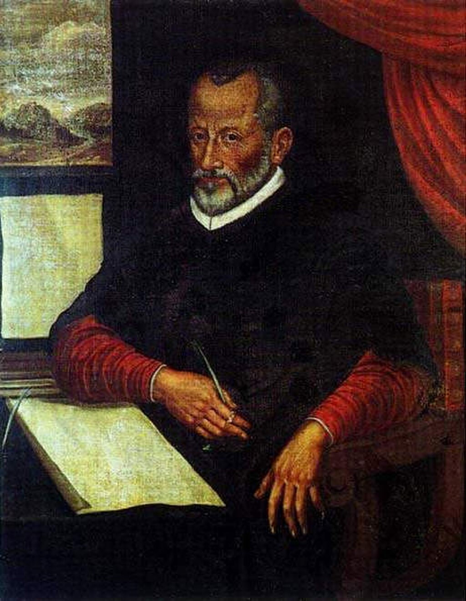
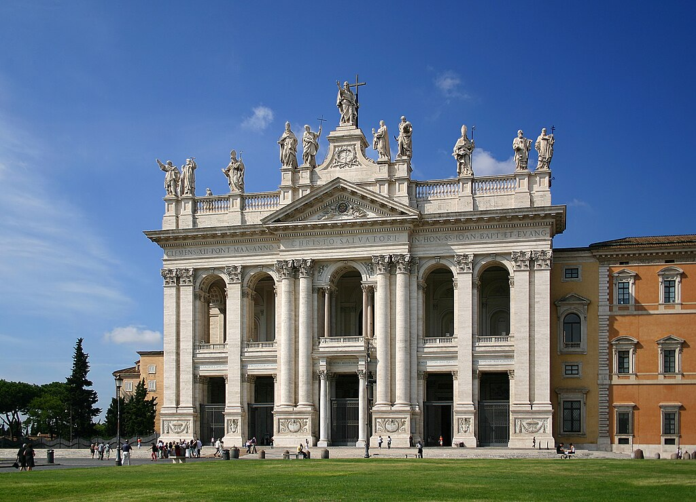
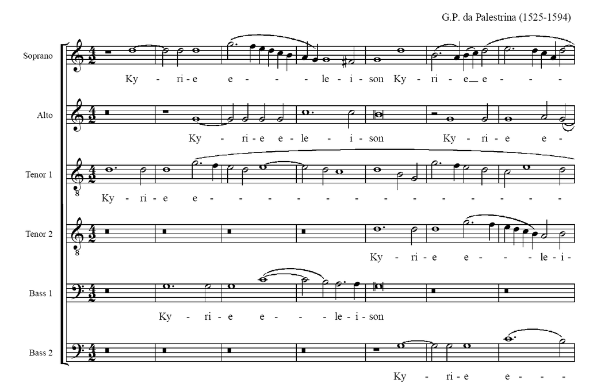
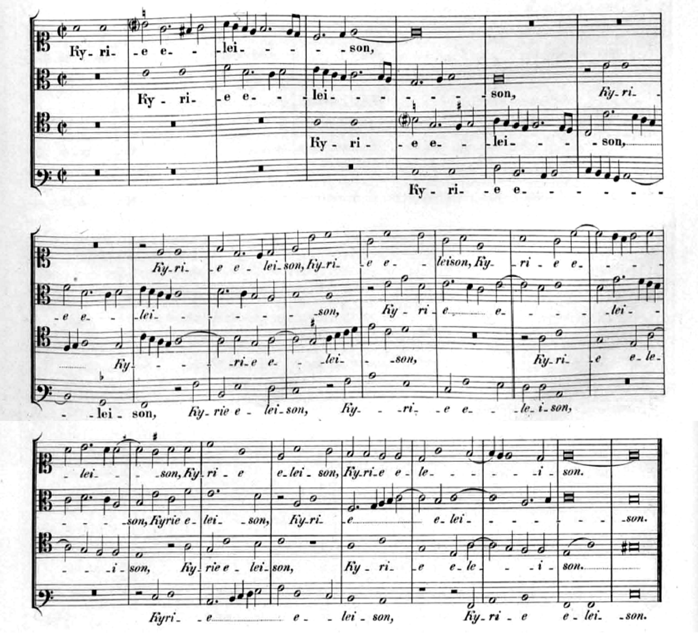
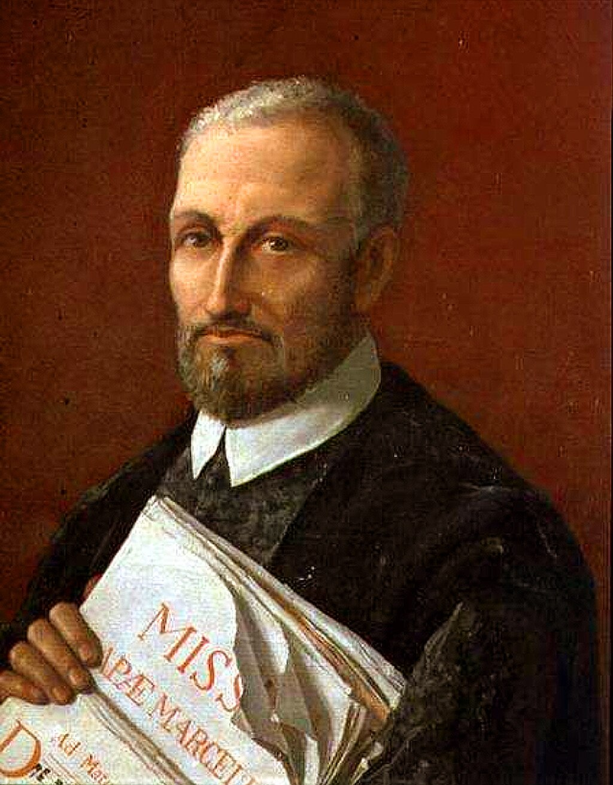
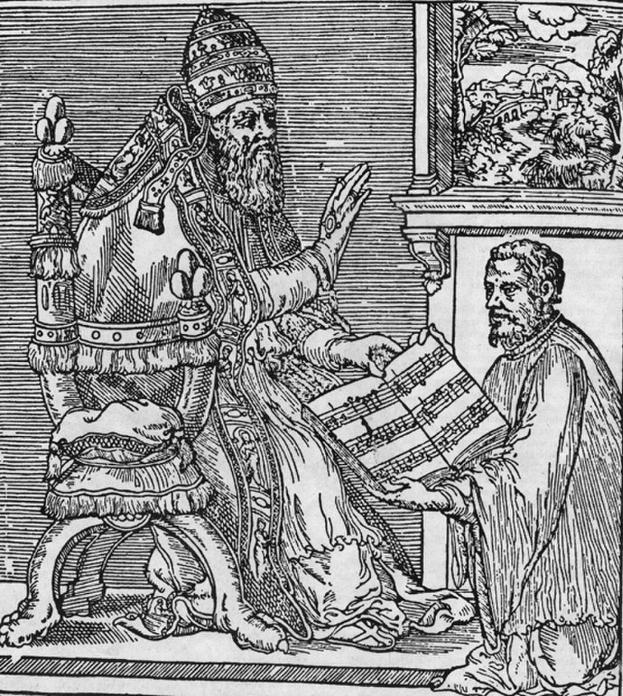

Giovanni Pierluigi da Palestrina

Portrait of Giovanni Pierluigi da Palestrina, by an unknown Italian painter (c. 1590)

Born

between 3 February 1525 and 2 February 1526

[Palestrina](https://en.wikipedia.org/wiki/Palestrina "Palestrina"), [Papal States](https://en.wikipedia.org/wiki/Papal_States "Papal States")

Died

2 February 1594(1594-02-02) (aged 68)

[Rome](https://en.wikipedia.org/wiki/Rome "Rome"), Papal States

Works

[List of compositions](https://en.wikipedia.org/wiki/List_of_compositions_by_Giovanni_Pierluigi_da_Palestrina "List of compositions by Giovanni Pierluigi da Palestrina")

**Giovanni Pierluigi da Palestrina** (between 3 February 1525 and 2 February 1526 – 2 February 1594) was an Italian composer of late [Renaissance music](/source/renaissance-music/ "Renaissance music"). The central representative of the [Roman School](https://en.wikipedia.org/wiki/Roman_School "Roman School"), with [Orlande de Lassus](https://en.wikipedia.org/wiki/Orlande_de_Lassus "Orlande de Lassus") and [Tomás Luis de Victoria](https://en.wikipedia.org/wiki/Tomás_Luis_de_Victoria "Tomás Luis de Victoria"), Palestrina is considered the leading composer of late 16th-century Europe. Palestrina was one of the few Renaissance composers never entirely forgotten, but it was the so-called "Palestrinian style" of counterpoint—especially as codified by [Johann Joseph Fux](https://en.wikipedia.org/wiki/Johann_Joseph_Fux "Johann Joseph Fux")—rather than his individual compositions that exerted the greatest influence.

Born in the town of [Palestrina](https://en.wikipedia.org/wiki/Palestrina "Palestrina") in the [Papal States](https://en.wikipedia.org/wiki/Papal_States "Papal States"), Palestrina moved to Rome as a child and underwent musical studies there. In 1551, [Pope Julius III](https://en.wikipedia.org/wiki/Pope_Julius_III "Pope Julius III") appointed him _[maestro di cappella](https://en.wikipedia.org/wiki/Kapellmeister "Kapellmeister")_ of the [Cappella Giulia](https://en.wikipedia.org/wiki/Cappella_Giulia "Cappella Giulia") at [St. Peter's Basilica](https://en.wikipedia.org/wiki/St._Peter's_Basilica "St. Peter's Basilica"). He left the post four years later, unable to continue as a layman under the papacy of [Paul IV](https://en.wikipedia.org/wiki/Pope_Paul_IV "Pope Paul IV"), and held similar positions at [St. John Lateran](https://en.wikipedia.org/wiki/Archbasilica_of_Saint_John_Lateran "Archbasilica of Saint John Lateran") and [Santa Maria Maggiore](https://en.wikipedia.org/wiki/Santa_Maria_Maggiore "Santa Maria Maggiore") in the following decade. Palestrina returned to the Cappella Giulia in 1571 and remained at St Peter's until his death in 1594.

Primarily known for his masses and motets, which number over 105 and 250 respectively, Palestrina had a long-lasting influence on the development of church and secular music in Europe, especially on the development of [counterpoint](https://en.wikipedia.org/wiki/Counterpoint "Counterpoint"). According to _[Grove Music Online](https://en.wikipedia.org/wiki/Grove_Music_Online "Grove Music Online")_, Palestrina's "success in reconciling the functional and aesthetic aims of Catholic church music in the [post-Tridentine](https://en.wikipedia.org/wiki/Council_of_Trent "Council of Trent") period earned him an enduring reputation as the ideal Catholic composer, as well as giving his style (or, more precisely, later generations' selective view of it) an iconic stature as a model of perfect achievement."

## Biography

Palestrina was born in the town of [Palestrina](https://en.wikipedia.org/wiki/Palestrina "Palestrina"), near Rome, then part of the [Papal States](https://en.wikipedia.org/wiki/Papal_States "Papal States"), to Neapolitan parents, Santo and Palma Pierluigi, in 1525, possibly on 3 February. His mother died on 16 January 1536, when Palestrina was 10. Documents suggest that he first visited Rome in 1537, when he was listed as a chorister at the [Basilica of Santa Maria Maggiore](https://en.wikipedia.org/wiki/Santa_Maria_Maggiore "Santa Maria Maggiore"), one of the [papal basilicas](https://en.wikipedia.org/wiki/Papal_basilicas "Papal basilicas") of the [Diocese of Rome](https://en.wikipedia.org/wiki/Diocese_of_Rome "Diocese of Rome"), which allowed him to learn literature and music. In 1540, he moved to Rome, where he studied in the school of the Huguenot [Claude Goudimel](https://en.wikipedia.org/wiki/Claude_Goudimel "Claude Goudimel"). He also studied with [Robin Mallapert](https://en.wikipedia.org/wiki/Robin_Mallapert "Robin Mallapert") and [Firmin Lebel](https://en.wikipedia.org/wiki/Firmin_Lebel "Firmin Lebel"). He spent most of his career in the city.

Palestrina came of age as a musician under the influence of the northern European style of [polyphony](https://en.wikipedia.org/wiki/Polyphony "Polyphony"), which owed its dominance in Italy primarily to two influential [Netherlandish](https://en.wikipedia.org/wiki/Netherlandish "Netherlandish") composers, [Guillaume Du Fay](https://en.wikipedia.org/wiki/Guillaume_Du_Fay "Guillaume Du Fay") and [Josquin des Prez](https://en.wikipedia.org/wiki/Josquin_des_Prez "Josquin des Prez"), who had spent significant portions of their careers there. Italy itself had yet to produce anyone of comparable fame or skill in polyphony. [Orlando di Lasso](https://en.wikipedia.org/wiki/Orlando_di_Lasso "Orlando di Lasso"), who accompanied Palestrina in his early years, also played an important role in the formation of his style as an adviser.

From 1544 to 1551, Palestrina was the organist of the [Cathedral of St. Agapito](https://en.wikipedia.org/wiki/Palestrina_Cathedral "Palestrina Cathedral"), the principal church of his native city. In 1551 [Pope Julius III](https://en.wikipedia.org/wiki/Pope_Julius_III "Pope Julius III") (previously the [Bishop of Palestrina](https://en.wikipedia.org/wiki/Bishop_of_Palestrina "Bishop of Palestrina")) appointed Palestrina _[maestro di cappella](https://en.wikipedia.org/wiki/Maestro_di_cappella "Maestro di cappella")_ or musical director of the [Cappella Giulia](https://en.wikipedia.org/wiki/Cappella_Giulia "Cappella Giulia"), (Julian Chapel, in the sense of choir), the choir of the chapter of [canons](https://en.wikipedia.org/wiki/Canon_\(priest\) "Canon (priest)") at [St. Peter's Basilica](https://en.wikipedia.org/wiki/St._Peter's_Basilica "St. Peter's Basilica"). Palestrina dedicated to Julius III his first published compositions (1554), a book of [Masses](https://en.wikipedia.org/wiki/Mass_\(music\) "Mass (music)"). It was the first book of Masses by a native composer, since in the Italian states of Palestrina's day, most composers of sacred music were from the [Low Countries](https://en.wikipedia.org/wiki/Low_Countries "Low Countries"), France, or Spain. In fact the book was modelled on one by [Cristóbal de Morales](https://en.wikipedia.org/wiki/Cristóbal_de_Morales "Cristóbal de Morales"): the [woodcut](https://en.wikipedia.org/wiki/Woodcut "Woodcut") in the front is almost an exact copy of the one from the book by the Spanish composer.

In 1555, [Pope Paul IV](https://en.wikipedia.org/wiki/Pope_Paul_IV "Pope Paul IV") ordered that all papal choristers should be clerical. As Palestrina married early in life and had four children, he was unable to continue in the chapel as a [layman](https://en.wikipedia.org/wiki/Laity "Laity").

Facade of the [Archbasilica of Saint John Lateran](https://en.wikipedia.org/wiki/Basilica_of_St._John_Lateran "Basilica of St. John Lateran"), Rome, where Palestrina was musical director

During the next decade, Palestrina held positions similar to his Julian Chapel appointment at other chapels and churches in Rome, notably the [Archbasilica of Saint John Lateran](https://en.wikipedia.org/wiki/Basilica_of_St._John_Lateran "Basilica of St. John Lateran") (1555–1560, a post previously held by [Lassus](https://en.wikipedia.org/wiki/Lassus "Lassus")), and Santa Maria Maggiore (1561–1566). In 1571 he returned to the Julian Chapel and remained at St Peter's for the rest of his life. The decade of the 1570s was difficult for him personally: he lost his brother, two of his sons, and his wife, Lucrezia Gori, in three separate outbreaks of the plague (1572, 1575, and 1580, respectively). He seems to have considered becoming a priest at this time, but instead he remarried, this time to a wealthy widow, Virginia Dormoli. This finally gave him financial independence (he was not paid well as choirmaster) and he was able to compose prolifically until his death.

He died in Rome of [pleurisy](https://en.wikipedia.org/wiki/Pleurisy "Pleurisy") on 2 February 1594. As was usual, Palestrina was buried on the same day he died, in a plain coffin with a lead plate on which was inscribed _Ioannes Petrus Aloysius Praenestinus Musicæ Princeps_. A five-part _Libera me Domine_ psalm for three choirs was sung at the funeral. Palestrina's funeral was held at St. Peter's, and he was buried beneath the floor of the basilica. His tomb was later covered by new construction and attempts to locate his grave have been unsuccessful.

Italian composers [Giovanni Maria Nanino](https://en.wikipedia.org/wiki/Giovanni_Maria_Nanino "Giovanni Maria Nanino") and [Gregorio Allegri](https://en.wikipedia.org/wiki/Gregorio_Allegri "Gregorio Allegri"), both of them disciples of his school, continued his works.

## Music

### Overview

Palestrina left hundreds of compositions, including 105 [masses](https://en.wikipedia.org/wiki/Mass_\(music\) "Mass (music)"), 68 [offertories](https://en.wikipedia.org/wiki/Offertory "Offertory"), at least 140 [madrigals](https://en.wikipedia.org/wiki/Madrigal "Madrigal") and more than 300 [motets](https://en.wikipedia.org/wiki/Motet "Motet"). In addition, there are at least 72 [hymns](https://en.wikipedia.org/wiki/Hymn "Hymn"), 35 [magnificats](https://en.wikipedia.org/wiki/Magnificat "Magnificat"), 11 [litanies](https://en.wikipedia.org/wiki/Litany "Litany"), and four or five sets of [lamentations](https://en.wikipedia.org/wiki/Lamentations_\(music\) "Lamentations (music)"). The _Gloria_ melody from Palestrina's _Magnificat Tertii Toni_ (1591) is widely used today in the resurrection hymn tune, _Victory_ (The Strife Is O'er).

His attitude toward madrigals was somewhat enigmatic: whereas in the preface to his collection of _Canticum canticorum_ (Song of Songs) motets (1584) he renounced the setting of profane texts, only two years later he was back in print with Book II of his secular madrigals (some of these being among the finest compositions in the medium). He published just two collections of madrigals with profane texts, one in 1555 and another in 1586. The other two collections were spiritual madrigals, a genre beloved by the proponents of the Counter-Reformation.

Palestrina's masses show how his compositional style developed over time. His _Missa sine nomine_ seems to have been particularly attractive to [Johann Sebastian Bach](/source/johann-sebastian-bach/ "Johann Sebastian Bach"), who studied and performed it while writing the [Mass in B minor](https://en.wikipedia.org/wiki/Mass_in_B_minor "Mass in B minor"). Most of Palestrina's masses appeared in thirteen volumes printed between 1554 and 1601, the last seven published after his death.

Missa Papae Marcelli – Kyrie

One of his most important works, the _[Missa Papae Marcelli](https://en.wikipedia.org/wiki/Missa_Papae_Marcelli "Missa Papae Marcelli")_ (Pope Marcellus Mass) has been historically associated with erroneous information involving the Council of Trent. According to this tale (which forms the basis of [Hans Pfitzner](https://en.wikipedia.org/wiki/Hans_Pfitzner "Hans Pfitzner")'s opera [_Palestrina_](https://en.wikipedia.org/wiki/Palestrina_\(opera\) "Palestrina (opera)")), it was composed in order to persuade the [Council of Trent](https://en.wikipedia.org/wiki/Council_of_Trent "Council of Trent") that a draconian ban on the [polyphonic](https://en.wikipedia.org/wiki/Polyphony "Polyphony") treatment of text in sacred music (as opposed, that is, to a more directly intelligible homophonic treatment) was unnecessary. However, more recent scholarship shows that this mass was in fact composed before the cardinals convened to discuss the ban (possibly as much as 10 years before). Historical data indicates that the Council of Trent, as an official body, never actually banned any church music and failed to make any ruling or official statement on the subject. These stories originated from the unofficial points-of-view of some Council attendees who discussed their ideas with those not privy to the council's deliberations. Those opinions and rumors have, over centuries, been transmuted into fictional accounts, put into print, and often incorrectly taught as historical fact. While Palestrina's compositional motivations are not known, he may have been quite conscious of the need for intelligible text; however, this was not to conform with any doctrine of the [Counter-Reformation](https://en.wikipedia.org/wiki/Counter-Reformation "Counter-Reformation"), because no such doctrine exists. His characteristic style remained consistent from the 1560s until the end of his life. Roche's hypothesis that Palestrina's seemingly dispassionate approach to expressive or emotive texts could have resulted from his having to produce many to order, or from a deliberate decision that any intensity of expression was unbecoming in church music, reflects modern expectations about expressive freedom and underestimates the extent to which the mood of Palestrina's settings is adapted to the liturgical occasions for which the texts were set, rather than the line-by-line meaning of the text, and depends on the distinctive characters of the [church modes](https://en.wikipedia.org/wiki/Gregorian_mode "Gregorian mode") and variations in vocal grouping for expressive effect. Performing editions and recordings of Palestrina have tended to favour his works in the more familiar modes and standard (SATB) voicings, under-representing the expressive variety of his settings.

There are two comprehensive editions of Palestrina's works: a 33-volume edition published by Breitkopf and Härtel, in [Leipzig](https://en.wikipedia.org/wiki/Leipzig "Leipzig") Germany between 1862 and 1894 edited by [Franz Xaver Haberl](https://en.wikipedia.org/wiki/Franz_Xaver_Haberl "Franz Xaver Haberl"), and a 34-volume edition published in the mid twentieth century, by Fratelli Scalera, in Rome, Italy edited by [R. Casimiri](https://it.wikipedia.org/wiki/Raffaele%20Casimiri "it:Raffaele Casimiri") and others.

### Church music

Palestrina left a vast oeuvre in the field of church music, including 105 masses, over 300 [motets](https://en.wikipedia.org/wiki/Motet "Motet"), 35 [magnificats](https://en.wikipedia.org/wiki/Magnificat "Magnificat"), a cycle of [lamentations](https://en.wikipedia.org/wiki/Book_of_Lamentations "Book of Lamentations"), 11 [litanies](https://en.wikipedia.org/wiki/Litany "Litany"), more than 70 [hymns](https://en.wikipedia.org/wiki/Hymn "Hymn") and 68 [offertories](https://en.wikipedia.org/wiki/Offertory "Offertory"). His early works were strongly influenced by the [Franco-Flemish school](https://en.wikipedia.org/wiki/Franco-Flemish_school "Franco-Flemish school"), reflecting the trainings of his masters. However, his aesthetic evolution soon shifted toward a progressive simplification of polyphony. This did not, however, imply a reduction in technical complexity, but rather a desire to discipline the excess of freedom that characterized much of the Flemish generation in their interpretation of text, favoring expressive clarity and the transparency of musical textures, while simultaneously emphasizing specific meanings through musical devices. The text in his works takes on such importance that it often defines the entire structure of the composition.

Mass _Sanctorum Meritis_, 1594.

The main tool of Palestrina's music is the melodic line, and was always conceived as polyphonic within the ancient [modal system](https://en.wikipedia.org/wiki/Mode_\(music\) "Mode (music)"). [Gregorian chant](https://en.wikipedia.org/wiki/Gregorian_chant "Gregorian chant") remained a central reference, offering him an enormous repertoire of melodies that he adapted and enriched according to his own criteria, often turning the sources to an almost unrecognizable point. At the time, it was common practice to borrow melodies from others as a starting point for composing new works, and in addition to Gregorian chant, he adapted ideas from several other composers, both past and contemporaries. However, a significant corpus of pieces has survived, especially motets, in which he gave full freedom to his imagination. There is no proof of him composing purely instrumental works, but according to the custom of the time, the vocal parts could often be doubled by the organ or by a variable combination of wind and string instruments.

According to Knud Jeppesen, "proportion and serenity are the main tendencies in Palestrina's music, and perhaps in no other style the passionate impulse, understood as violent and extreme excitement, is so disciplined and even so deliberately left out." This control is highlighted by the extremely careful management of elements that could attract too much attention within the musical phrases, such as syllabic and metrical accentuation, rhythm, melodic leaps, and dissonance.

Overall, his work is both conservative and progressive. Conservative because he abandoned the habit of florid ornamentation, remained faithful to the foundations of Gregorian chant, rejected Mannerist artificiality, and disciplined freedom in polyphony, moving toward a synthetic standard that can be called classical, due to its economy of means, its great formal balance and its great clarity of texture and proportion: a model of order, discipline, and reverence for the past and tradition, a symbol of everything the Church sought to establish in a time of disorder and conflict. On the other hand, his attention to text intelligibility, his use of [homophonic](https://en.wikipedia.org/wiki/Homophony "Homophony") passages in a polyphonic context, his empirical understanding of [harmonic connections](https://en.wikipedia.org/wiki/Harmony "Harmony"), his care for sonority and color, his control of dissonance, his extensive use of [polychoralism](https://en.wikipedia.org/wiki/Venetian_polychoral_style "Venetian polychoral style"), sound groupings and contrasts, as well as a distinctly classical aesthetic at a time when classicism was in decline, make him an innovator, a forerunner of the tonal system and the founder of a highly influential school that endures nowadays.

### Secular music

Palestrina is of the highest importance in the [history of music](/source/history-of-music/ "History of music"), especially for the great influence he had on church music, but his secular work, of notable quality, has been largely overlooked by critics. It focuses on madrigals, with at least 140 pieces that have come down to us. This is a lesser-known group of pieces, generally overlooked compared to his sacred works, but they remain compositions generally characterized by great skills in illustrating the content of the text with pure musical tools, generally nature, but sometimes also incorporating love or erotic poetry. He is best remembered for being one of the first to set [sonnets](https://en.wikipedia.org/wiki/Sonnet "Sonnet") to music and for the exceptional quality of the pieces with texts by Petrarch. However, these works did not make a significant contribution to the evolution of the genre in the 16th century, mainly due to their lack of experimental character and their tendency to control the most extreme emotional expressions, limitations that were not observed by the leading madrigalists of the time, with the consequence that this collection is smaller and less expressively varied. A notable exception is _Vestiva i colli_ (1566), which was extremely popular at the time, spawning hundreds of imitations in the fifty years following its publication. Despite the limitations imposed on expressiveness, some critics believe that the intrinsic quality of the pieces is equal to that of the best compositions of the period.

### The "Palestrina Style"

Portrait of Giovanni Pierluigi da Palestrina, 16th century

One of the hallmarks of Palestrina's music is that [dissonances](https://en.wikipedia.org/wiki/Consonance_and_dissonance "Consonance and dissonance") are typically relegated to the ["weak" beats](https://en.wikipedia.org/wiki/Off-beat_\(music\) "Off-beat (music)") in a measure. This produced a smoother and more [consonant](https://en.wikipedia.org/wiki/Consonance_and_dissonance "Consonance and dissonance") type of [polyphony](https://en.wikipedia.org/wiki/Polyphony "Polyphony") which is now considered to be definitive of late Renaissance music, given Palestrina's position as Europe's leading composer in the wake of [Josquin des Prez](https://en.wikipedia.org/wiki/Josquin_des_Prez "Josquin des Prez") (d. 1521).

The "Palestrina style" taught in college courses covering Renaissance [counterpoint](https://en.wikipedia.org/wiki/Counterpoint "Counterpoint") is often based on the codification by the 18th-century composer and theorist [Johann Joseph Fux](https://en.wikipedia.org/wiki/Johann_Joseph_Fux "Johann Joseph Fux"), published as _[Gradus ad Parnassum](https://en.wikipedia.org/wiki/Gradus_ad_Parnassum "Gradus ad Parnassum")_ (Steps to Parnassus, 1725). Citing Palestrina as his model, Fux divided counterpoint into five _species_ (hence the term "[species counterpoint](https://en.wikipedia.org/wiki/Species_counterpoint "Species counterpoint")"), designed as exercises for the student, which deployed progressively more elaborate rhythmic combinations of voices while adhering to strict harmonic and melodic requirements. The method was widely adopted and was the main basis of contrapuntal training in the 19th century, but Fux had introduced a number of simplifications to the Palestrina style, notably the obligatory use of a _[cantus firmus](https://en.wikipedia.org/wiki/Cantus_firmus "Cantus firmus")_ in [semibreves](https://en.wikipedia.org/wiki/Semibreves "Semibreves"), which were corrected by later authors such as [Knud Jeppesen](https://en.wikipedia.org/wiki/Knud_Jeppesen "Knud Jeppesen") and [R. O. Morris](https://en.wikipedia.org/wiki/R._O._Morris "R. O. Morris"). Palestrina's music conforms in many ways to Fux's rules, particularly in the fifth species but does not fit his pedagogical format.

The main insight, that the "pure" style of polyphony achieved by Palestrina followed an invariable set of stylistic and combinational requirements, was justified. Fux's manual was endorsed by his contemporary [J.S. Bach](/source/johann-sebastian-bach/ "Johann Sebastian Bach"), who himself arranged two of Palestrina's masses for performance.

According to Fux, Palestrina had established and followed these basic guidelines:

*   The flow of music is dynamic, not rigid or static.
*   Melody should contain few leaps between notes. (Jeppesen: "The line is the starting point of Palestrina's style".)
*   If a leap occurs, it must be small and immediately countered by stepwise motion in the opposite direction.
*   Dissonances are to be confined to suspensions, passing notes and weak beats. If one falls on a strong beat (in a suspension) it must be immediately resolved.

Fux omits to mention the manner in which the musical phrasing of Palestrina followed the [syntax](https://en.wikipedia.org/wiki/Syntax "Syntax") of the sentences he was setting to music, something not always observed by earlier composers. Also to be noticed in Palestrina is a great deal of [tone painting](https://en.wikipedia.org/wiki/Tone_painting "Tone painting"). Elementary examples of this are descending musical motion with Latin words like _descendit_ (descends) or of a static musical or cadential moment with the words _de coelis_ (from heaven).

## Reputation

Palestrina, presenting his masses to Pope [Julius III](https://en.wikipedia.org/wiki/Julius_III "Julius III"), 1554

Palestrina was extremely famous in his day, and if anything, his reputation and influence increased after his death. [J.S. Bach](/source/johann-sebastian-bach/ "Johann Sebastian Bach") studied and hand-copied Palestrina's first book of _Masses_, and in 1742 [wrote his own adaptation](https://en.wikipedia.org/wiki/Bach's_church_music_in_Latin#Kyrie–Gloria_Mass,_BNB_I/P/2,_after_Palestrina's_Missa_sine_nomine_a_6_\(Bach_manuscript_from_c._1742\) "Bach's church music in Latin") of the Kyrie and Gloria of the _Missa sine nomine_. [Felix Mendelssohn](https://en.wikipedia.org/wiki/Felix_Mendelssohn "Felix Mendelssohn") placed him in the pantheon of the greatest musicians, writing, "I always get upset when some praise only Beethoven, others only Palestrina and still others only Mozart or Bach. All four of them, I say, or none at all."

Conservative music of the Roman school continued to be written in Palestrina's style (which in the 17th century came to be known as the _[prima prattica](https://en.wikipedia.org/wiki/Prima_pratica "Prima pratica")_) by such students of his as [Giovanni Maria Nanino](https://en.wikipedia.org/wiki/Giovanni_Maria_Nanino "Giovanni Maria Nanino"), [Ruggiero Giovanelli](https://en.wikipedia.org/wiki/Ruggiero_Giovanelli "Ruggiero Giovanelli"), Arcangelo Crivelli, Teofilo Gargari, [Francesco Soriano](https://en.wikipedia.org/wiki/Francesco_Soriano "Francesco Soriano"), and [Gregorio Allegri](https://en.wikipedia.org/wiki/Gregorio_Allegri "Gregorio Allegri"). As late as the 1750s, Palestrina's style was still the reference for composers working in the motet form, as can be seen by [Francesco Barsanti](https://en.wikipedia.org/wiki/Francesco_Barsanti "Francesco Barsanti")'s _Sei Antifones_ 'in the style of Palestrina' (c. 1750; published by \[Peter\] Welcker, c. 1762).

Much research on Palestrina was done in the 19th century by [Giuseppe Baini](https://en.wikipedia.org/wiki/Giuseppe_Baini "Giuseppe Baini"), who published a monograph in 1828 which made Palestrina famous again and reinforced the already existing legend that he was the "Saviour of Church Music" during the reforms of the [Council of Trent](https://en.wikipedia.org/wiki/Council_of_Trent "Council of Trent").

20th and 21st century scholarship by and large retains the view that Palestrina was a strong and refined composer whose music represents a summit of technical perfection. Contemporary analysis highlighted the modern qualities in the compositions of Palestrina such as research of color and sonority, use of sonic grouping in large-scale setting, interest in vertical as well as horizontal organization, studied attention to text setting. These unique characteristics, together with effortless delivery and an indefinable "otherness", constitute to this day the attraction of Palestrina's work.

The opera _[Palestrina](https://en.wikipedia.org/wiki/Palestrina_\(opera\) "Palestrina (opera)")_ by [Hans Pfitzner](https://en.wikipedia.org/wiki/Hans_Pfitzner "Hans Pfitzner") depicts Palestrina working to preserve polyphony during the Council of Trent.

The Cagliari music conservatory in [Cagliari](https://en.wikipedia.org/wiki/Cagliari "Cagliari"), Italy is named in his honor.

In 2009 a film about the composer was produced by German television [ZDF](https://en.wikipedia.org/wiki/ZDF "ZDF")/[Arte](https://en.wikipedia.org/wiki/Arte "Arte"). Title: _[Palestrina - Prince of Music](https://en.wikipedia.org/wiki/Palestrina_-_Prince_of_Music "Palestrina - Prince of Music")_, directed by [Georg Brintrup](https://en.wikipedia.org/wiki/Georg_Brintrup "Georg Brintrup").
