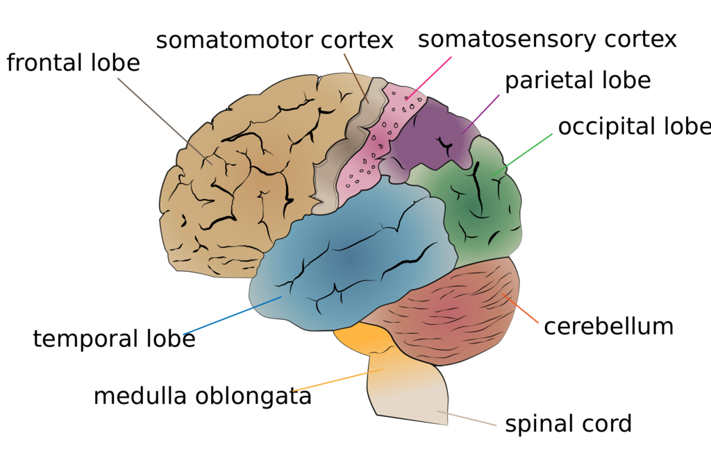
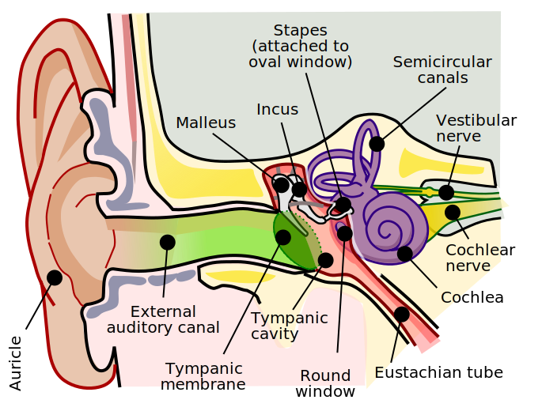
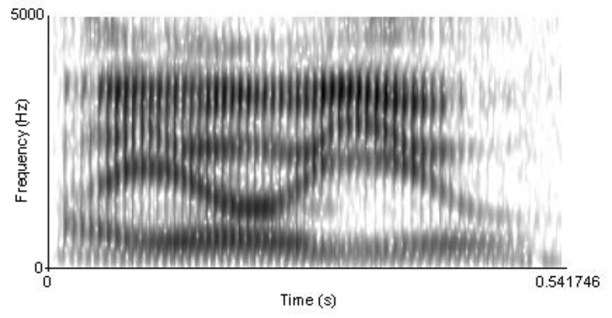

The [Necker cube](https://en.wikipedia.org/wiki/Necker_cube "Necker cube") and [Rubin vase](https://en.wikipedia.org/wiki/Rubin_vase "Rubin vase") can be perceived in more than one way.Humans are able to make a very good guess on the underlying 3D shape category/identity/geometry given a silhouette of that shape. [Computer vision](https://en.wikipedia.org/wiki/Computer_vision "Computer vision") researchers have been able to build computational models for perception that exhibit a similar behavior and are capable of generating and [reconstructing 3D shapes](https://en.wikipedia.org/wiki/3D_reconstruction "3D reconstruction") from single or multi-view depth maps or silhouettes.

**Perception** (from [Latin](https://en.wikipedia.org/wiki/Latin_language "Latin language") __[perceptio](https://en.wiktionary.org/wiki/perceptio#Latin "wikt:perceptio")__'gathering, receiving') is the organization, identification, and interpretation of [sensory](https://en.wikipedia.org/wiki/Sense "Sense") information, in order to represent and understand the presented information or environment. All perception involves signals that go through the [nervous system](https://en.wikipedia.org/wiki/Nervous_system "Nervous system"), which in turn result from physical or chemical stimulation of the [sensory system](https://en.wikipedia.org/wiki/Sensory_nervous_system "Sensory nervous system"). [Vision](https://en.wikipedia.org/wiki/Visual_system "Visual system") involves [light](https://en.wikipedia.org/wiki/Light "Light") striking the [retina](https://en.wikipedia.org/wiki/Retina "Retina") of the [eye](/source/eye/ "Eye"); [smell](https://en.wikipedia.org/wiki/Sense_of_smell "Sense of smell") is mediated by [odor molecules](https://en.wikipedia.org/wiki/Olfactory_system#Peripheral "Olfactory system"); and [hearing](https://en.wikipedia.org/wiki/Hearing "Hearing") involves [pressure waves](https://en.wikipedia.org/wiki/Sound_wave "Sound wave").

Perception is not only the passive receipt of these [signals](https://en.wikipedia.org/wiki/Signal_processing "Signal processing"), but it is also shaped by the recipient's [learning](https://en.wikipedia.org/wiki/Perceptual_learning "Perceptual learning"), [memory](https://en.wikipedia.org/wiki/Memory "Memory"), [expectation](https://en.wikipedia.org/wiki/Expectation_\(epistemic\) "Expectation (epistemic)"), and [attention](https://en.wikipedia.org/wiki/Attention "Attention"). Sensory input is a process that transforms this low-level information to higher-level information (e.g., extracts shapes for [object recognition](https://en.wikipedia.org/wiki/Cognitive_neuroscience_of_visual_object_recognition "Cognitive neuroscience of visual object recognition")). The following process connects a person's concepts and expectations (or [knowledge](https://en.wikipedia.org/wiki/Knowledge "Knowledge")) with restorative and selective mechanisms, such as [attention](https://en.wikipedia.org/wiki/Attention "Attention"), that influence perception.

Perception depends on complex functions of the [nervous system](https://en.wikipedia.org/wiki/Nervous_system "Nervous system"), but subjectively seems mostly effortless because this processing happens outside [conscious](https://en.wikipedia.org/wiki/Consciousness "Consciousness") [awareness](https://en.wikipedia.org/wiki/Awareness "Awareness"). Since the rise of [experimental psychology](https://en.wikipedia.org/wiki/Experimental_psychology "Experimental psychology") in the 19th century, [psychology's understanding of perception](https://en.wikipedia.org/wiki/Perceptual_psychology "Perceptual psychology") has progressed by combining a variety of techniques. [Psychophysics](https://en.wikipedia.org/wiki/Psychophysics "Psychophysics") [quantitatively](https://en.wikipedia.org/wiki/Quantitatively "Quantitatively") describes the relationships between the physical qualities of the sensory input and perception. [Sensory neuroscience](https://en.wikipedia.org/wiki/Sensory_neuroscience "Sensory neuroscience") studies the neural mechanisms underlying perception. Perceptual systems can also be studied [computationally](https://en.wikipedia.org/wiki/Computation "Computation"), in terms of the information they process. [Perceptual issues in philosophy](https://en.wikipedia.org/wiki/Philosophy_of_perception "Philosophy of perception") include the extent to which sensory qualities such as [sound](https://en.wikipedia.org/wiki/Sound "Sound"), smell or [color](https://en.wikipedia.org/wiki/Color "Color") exist in objective reality rather than in the mind of the perceiver.

Although people traditionally viewed the senses as passive receptors, the study of [illusions](https://en.wikipedia.org/wiki/Illusion "Illusion") and [ambiguous images](https://en.wikipedia.org/wiki/Ambiguous_image "Ambiguous image") has demonstrated that the [brain](https://en.wikipedia.org/wiki/Brain "Brain")'s perceptual systems actively and pre-consciously attempt to make sense of their input. There is still active debate about the extent to which perception is an active process of [hypothesis](https://en.wikipedia.org/wiki/Hypothesis "Hypothesis") testing, analogous to [science](https://en.wikipedia.org/wiki/Science "Science"), or whether realistic sensory information is rich enough to make this process unnecessary.

The [perceptual systems](https://en.wikipedia.org/wiki/Perceptual_system "Perceptual system") of the brain enable individuals to see the world around them as stable, even though the sensory information is typically incomplete and rapidly varying. Human and other animal brains are structured in a [modular way](https://en.wikipedia.org/wiki/Cognitive_module "Cognitive module"), with different areas processing different kinds of sensory information. Some of these modules take the form of [sensory maps](https://en.wikipedia.org/wiki/Sensory_Maps "Sensory Maps"), mapping some aspect of the world across part of the brain's surface. These different modules are interconnected and influence each other. For instance, [taste](https://en.wikipedia.org/wiki/Taste "Taste") is strongly influenced by smell.

## Process and terminology

The process of perception begins with an object in the real world, known as the _[distal](https://en.wikipedia.org/wiki/Distal "Distal") stimulus_ or _distal object_. By means of light, sound, or another physical process, the object stimulates the body's sensory organs. These sensory organs transform the input energy into neural activity—a process called _[transduction](https://en.wikipedia.org/wiki/Transduction_\(physiology\) "Transduction (physiology)")_. This raw pattern of neural activity is called the _proximal stimulus_. These neural signals are then transmitted to the brain and processed. The resulting mental re-creation of the distal stimulus is the _percept_.

To explain the process of perception, an example could be an ordinary shoe. The shoe itself is the distal stimulus. When light from the shoe enters a person's eye and stimulates the retina, that stimulation is the proximal stimulus. The image of the shoe reconstructed by the brain of the person is the percept. Another example could be a ringing telephone. The ringing of the phone is the distal stimulus. The sound stimulating a person's auditory receptors is the proximal stimulus. The brain's interpretation of this as the "ringing of a telephone" is the percept.

The different kinds of sensation (such as warmth, sound, and taste) are called _[sensory modalities](https://en.wikipedia.org/wiki/Stimulus_modality "Stimulus modality")_ or _stimulus modalities_.

### Bruner's model of the perceptual process

Psychologist [Jerome Bruner](https://en.wikipedia.org/wiki/Jerome_Bruner "Jerome Bruner") developed a model of perception, in which people put "together the information contained in" a target and a situation to form "perceptions of ourselves and others based on social categories." This model is composed of three states:

1.  When people encounter an unfamiliar target, they are very open to the informational [cues](https://en.wikipedia.org/wiki/Sensory_cue "Sensory cue") contained in the target and the situation surrounding it.
2.  The first stage does not give people enough information on which to base perceptions of the target, so they will actively seek out cues to resolve this ambiguity. Gradually, people collect some familiar cues that enable them to make a rough categorization of the target.
3.  The cues become less open and selective. People try to search for more cues that confirm the categorization of the target. They actively ignore and distort cues that violate their initial perceptions. Their perception becomes more selective and they finally paint a consistent picture of the target.

### Saks and Johns' three components to perception

According to Alan Saks and Gary Johns, there are three components to perception:

1.  **The Perceiver**: a person whose awareness is focused on the stimulus, and thus begins to perceive it. There are many factors that may influence the perceptions of the perceiver, while the three major ones include (1) [motivational state](https://en.wikipedia.org/wiki/Motivation "Motivation"), (2) [emotional state](https://en.wikipedia.org/wiki/Emotional_state "Emotional state"), and (3) [experience](https://en.wikipedia.org/wiki/Experience "Experience"). All of these factors, especially the first two, greatly contribute to how the person perceives a situation. Oftentimes, the perceiver may employ what is called a "perceptual defense", where the person will only see what they want to see.
2.  **The Target**: the _object_ of perception; something or someone who is being perceived. The amount of information gathered by the sensory organs of the perceiver affects the interpretation and understanding about the target.
3.  **The Situation**: the _environmental_ factors, timing, and degree of stimulation that affect the process of perception. These factors may render a single stimulus to be left as merely a stimulus, not a percept that is subject for brain interpretation.

#### Multistable perception

Stimuli are not necessarily translated into a percept and rarely does a single stimulus translate into a percept. An ambiguous stimulus may sometimes be transduced into one or more percepts, experienced randomly, one at a time, in a process termed _[multistable perception](https://en.wikipedia.org/wiki/Multistable_perception "Multistable perception")_. The same stimuli, or absence of them, may result in different percepts depending on subject's culture and previous experiences.

Ambiguous figures demonstrate that a single stimulus can result in more than one percept. For example, the [Rubin vase](https://en.wikipedia.org/wiki/Rubin_vase "Rubin vase") can be interpreted either as a vase or as two faces. The percept can bind sensations from multiple senses into a whole. A picture of a talking person on a television screen, for example, is bound to the sound of speech from speakers to form a percept of a talking person.

## Types of perception

### Vision

Cerebrum lobes

In many ways, vision is the primary human sense. Light is taken in through each eye and focused in a way which sorts it on the retina according to direction of origin. A dense surface of photosensitive cells, including rods, cones, and [intrinsically photosensitive retinal ganglion cells](https://en.wikipedia.org/wiki/Intrinsically_photosensitive_retinal_ganglion_cells "Intrinsically photosensitive retinal ganglion cells") captures information about the intensity, color, and position of incoming light. Some processing of texture and movement occurs within the neurons on the retina before the information is sent to the brain. In total, about 15 differing types of information are then forwarded to the brain proper via the optic nerve.

The timing of perception of a visual event, at points along the visual circuit, have been measured. A sudden alteration of light at a spot in the environment first alters photoreceptor cells in the [retina](https://en.wikipedia.org/wiki/Retina "Retina"), which send a signal to the [retina bipolar cell](https://en.wikipedia.org/wiki/Retina_bipolar_cell "Retina bipolar cell") layer which, in turn, can activate a retinal ganglion neuron cell. A retinal ganglion cell is a bridging neuron that connects visual retinal input to the visual processing centers within the central nervous system. Light-altered neuron activation occurs within about 5–20 milliseconds in a rabbit retinal ganglion, although in a mouse retinal ganglion cell the initial spike takes between 40 and 240 milliseconds before the initial activation. The initial activation can be detected by an [action potential](https://en.wikipedia.org/wiki/Action_potential "Action potential") spike, a sudden spike in neuron membrane electric voltage.

A perceptual visual event measured in humans was the presentation to individuals of an anomalous word. If these individuals are shown a sentence, presented as a sequence of single words on a computer screen, with a puzzling word out of place in the sequence, the perception of the puzzling word can register on an electroencephalogram (EEG). In an experiment, human readers wore an elastic cap with 64 embedded electrodes distributed over their scalp surface. Within 230 milliseconds of encountering the anomalous word, the human readers generated an event-related electrical potential alteration of their EEG at the left occipital-temporal channel, over the left occipital lobe and temporal lobe.

### Sound

Anatomy of the human ear. (The length of the auditory canal is exaggerated in this image.)

 Brown is [outer ear](https://en.wikipedia.org/wiki/Outer_ear "Outer ear").

 Red is [middle ear](https://en.wikipedia.org/wiki/Middle_ear "Middle ear").

 Purple is [inner ear](https://en.wikipedia.org/wiki/Inner_ear "Inner ear").

[Hearing](https://en.wikipedia.org/wiki/Hearing "Hearing") (or _audition_) is the ability to perceive [sound](https://en.wikipedia.org/wiki/Sound "Sound") by detecting [vibrations](https://en.wikipedia.org/wiki/Vibration "Vibration") (i.e., _sonic_ detection). Frequencies capable of being heard by humans are called [_audio_ or _audible_ _frequencies_](https://en.wikipedia.org/wiki/Audio_frequency "Audio frequency"), the range of which is typically considered to be between 20 [Hz](https://en.wikipedia.org/wiki/Hertz "Hertz") and 20,000 Hz. Frequencies higher than audio are referred to as [_ultrasonic_](https://en.wikipedia.org/wiki/Ultrasound "Ultrasound"), while frequencies below audio are referred to as [_infrasonic_](https://en.wikipedia.org/wiki/Infrasound "Infrasound").

The [auditory system](https://en.wikipedia.org/wiki/Auditory_system "Auditory system") includes the [outer ears](https://en.wikipedia.org/wiki/Ear "Ear"), which collect and filter sound waves; the [middle ear](https://en.wikipedia.org/wiki/Ear "Ear"), which transforms the sound pressure ([impedance matching](https://en.wikipedia.org/wiki/Impedance_matching "Impedance matching")); and the [inner ear](https://en.wikipedia.org/wiki/Ear "Ear"), which produces neural signals in response to the sound. By the ascending [auditory pathway](https://en.wikipedia.org/wiki/Auditory_pathway "Auditory pathway") these are led to the [primary auditory cortex](https://en.wikipedia.org/wiki/Primary_auditory_cortex "Primary auditory cortex") within the [temporal lobe](https://en.wikipedia.org/wiki/Temporal_lobe "Temporal lobe") of the human brain, from where the auditory information then goes to the [cerebral cortex](https://en.wikipedia.org/wiki/Cerebral_cortex "Cerebral cortex") for further processing.

Sound does not usually come from a single source: in real situations, sounds from multiple sources and directions are [superimposed](https://www.merriam-webster.com/dictionary/superimpose "mwod:superimpose") as they arrive at the ears. Hearing involves the computationally complex task of separating out sources of interest, identifying them and often estimating their distance and direction.

### Touch

The process of recognizing objects through touch is known as _haptic perception_. It involves a combination of [somatosensory](https://en.wikipedia.org/wiki/Somatosensory "Somatosensory") perception of patterns on the skin surface (e.g., edges, curvature, and texture) and [proprioception](https://en.wikipedia.org/wiki/Proprioception "Proprioception") of hand position and conformation. People can rapidly and accurately identify three-dimensional objects by touch. This involves exploratory procedures, such as moving the fingers over the outer surface of the object or holding the entire object in the hand. Haptic perception relies on the forces experienced during touch.

Professor [Gibson](https://en.wikipedia.org/wiki/James_J._Gibson "James J. Gibson") defined the haptic system as "the sensibility of the individual to the world adjacent to his body by use of his body." Gibson and others emphasized the close link between body movement and haptic perception, where the latter is _active exploration_.

The concept of haptic perception is related to the concept of [extended physiological proprioception](https://en.wikipedia.org/wiki/Extended_physiological_proprioception "Extended physiological proprioception") according to which, when using a tool such as a stick, perceptual experience is transparently transferred to the end of the tool.

### Taste

Taste (formally known as _gustation_) is the ability to perceive the [flavor](https://en.wikipedia.org/wiki/Flavor_\(taste\) "Flavor (taste)") of substances, including, but not limited to, [food](https://en.wikipedia.org/wiki/Food "Food"). Humans receive tastes through sensory organs concentrated on the upper surface of the [tongue](https://en.wikipedia.org/wiki/Tongue "Tongue"), called _[taste buds](https://en.wikipedia.org/wiki/Taste_bud "Taste bud")_ or _gustatory calyculi_. The human tongue has 100 to 150 taste receptor cells on each of its roughly-ten thousand taste buds.

Traditionally, there have been four primary tastes: [sweetness](https://en.wikipedia.org/wiki/Sweetness "Sweetness"), [bitterness](https://en.wikipedia.org/wiki/Bitter_\(taste\)#Bitter "Bitter (taste)"), [sourness](https://en.wikipedia.org/wiki/Sourness "Sourness"), and [saltiness](https://en.wikipedia.org/wiki/Saltiness "Saltiness"). The recognition and awareness of [umami](https://en.wikipedia.org/wiki/Umami "Umami"), which is considered the fifth primary taste, is a relatively recent development in [Western cuisine](https://en.wikipedia.org/wiki/Western_cuisine "Western cuisine"). Other tastes can be mimicked by combining these basic tastes, all of which contribute only partially to the sensation and [flavor](https://en.wikipedia.org/wiki/Flavor_\(taste\) "Flavor (taste)") of food in the mouth. Other factors include [smell](https://en.wikipedia.org/wiki/Odor "Odor"), which is detected by the [olfactory epithelium](https://en.wikipedia.org/wiki/Olfactory_epithelium "Olfactory epithelium") of the nose; [texture](https://en.wikipedia.org/wiki/Texture_\(food\) "Texture (food)"), which is detected through a variety of [mechanoreceptors](https://en.wikipedia.org/wiki/Mechanoreceptor "Mechanoreceptor"), muscle nerves, etc.; and temperature, which is detected by [thermoreceptors](https://en.wikipedia.org/wiki/Thermoreceptor "Thermoreceptor"). All basic tastes are classified as either _[appetitive](https://en.wikipedia.org/wiki/Reward_system "Reward system")_ or _[aversive](https://en.wikipedia.org/wiki/Aversives "Aversives")_, depending upon whether the things they sense are harmful or beneficial.

### Smell

Smell is the process of absorbing molecules through [olfactory organs](https://en.wikipedia.org/wiki/Olfactory_system "Olfactory system"), which are absorbed by humans through the [nose](https://en.wikipedia.org/wiki/Nose "Nose"). These molecules diffuse through a thick layer of [mucus](https://en.wikipedia.org/wiki/Mucus "Mucus"); come into contact with one of thousands of [cilia](https://en.wikipedia.org/wiki/Cilium "Cilium") that are projected from sensory neurons; and are then absorbed into a receptor (one of 347 or so). It is this process that causes humans to understand the concept of smell from a physical standpoint.

Smell is also a very interactive sense as scientists have begun to observe that olfaction comes into contact with the other sense in unexpected ways. It is also the most primal of the senses, as it is known to be the first indicator of safety or danger, therefore being the sense that drives the most basic of human survival skills. As such, it can be a catalyst for human behavior on a [subconscious](https://en.wikipedia.org/wiki/Subconscious "Subconscious") and [instinctive](https://en.wikipedia.org/wiki/Instinct "Instinct") level.

### Social

[Social perception](https://en.wikipedia.org/wiki/Social_perception "Social perception") is the part of perception that allows people to understand the individuals and groups of their social world. Thus, it is an element of [social cognition](https://en.wikipedia.org/wiki/Social_cognition "Social cognition").

#### Speech

Though the phrase "I owe you" can be heard as three distinct words, a [spectrogram](https://en.wikipedia.org/wiki/Spectrogram "Spectrogram") reveals no clear boundaries.

_Speech perception_ is the process by which [spoken language](https://en.wikipedia.org/wiki/Spoken_language "Spoken language") is heard, interpreted and understood. Research in this field seeks to understand how human listeners recognize the sound of speech (or _[phonetics](https://en.wikipedia.org/wiki/Phonetics "Phonetics")_) and use such information to understand spoken language.

Listeners manage to perceive words across a wide range of conditions, as the sound of a word can vary widely according to words that surround it and the [tempo](https://en.wikipedia.org/wiki/Tempo "Tempo") of the speech, as well as the physical characteristics, [accent](https://en.wikipedia.org/wiki/Accent_\(dialect\) "Accent (dialect)"), [tone](https://en.wikipedia.org/wiki/Tone_\(linguistics\) "Tone (linguistics)"), and mood of the speaker. [Reverberation](https://en.wikipedia.org/wiki/Reverberation "Reverberation"), signifying the persistence of sound after the sound is produced, can also have a considerable impact on perception. Experiments have shown that people automatically compensate for this effect when hearing speech.

The process of perceiving speech begins at the level of the sound within the auditory signal and the process of [audition](https://en.wikipedia.org/wiki/Hearing_\(sense\) "Hearing (sense)"). The initial auditory signal is compared with visual information—primarily lip movement—to extract acoustic cues and phonetic information. It is possible other sensory modalities are integrated at this stage as well. This speech information can then be used for higher-level language processes, such as [word recognition](https://en.wikipedia.org/wiki/Word_recognition "Word recognition").

Speech perception is not necessarily uni-directional. Higher-level language processes connected with [morphology](https://en.wikipedia.org/wiki/Morphology_\(linguistics\) "Morphology (linguistics)"), [syntax](https://en.wikipedia.org/wiki/Syntax "Syntax"), and/or [semantics](https://en.wikipedia.org/wiki/Semantics "Semantics") may also interact with basic speech perception processes to aid in recognition of speech sounds. It may be the case that it is not necessary (maybe not even possible) for a listener to recognize [phonemes](https://en.wikipedia.org/wiki/Phoneme "Phoneme") before recognizing higher units, such as words. In an experiment, professor Richard M. Warren replaced one phoneme of a word with a cough-like sound. His subjects restored the missing speech sound perceptually without any difficulty. Moreover, they were not able to accurately identify which phoneme had even been disturbed.

#### Faces

_Facial perception_ refers to cognitive processes specialized in handling [human faces](https://en.wikipedia.org/wiki/Human_faces "Human faces") (including perceiving the identity of an individual) and facial expressions (such as emotional cues.)

#### Social touch

The _somatosensory cortex_ is a part of the brain that receives and encodes sensory information from receptors of the entire body.

[Affective touch](https://en.wikipedia.org/wiki/Affective "Affective") is a type of sensory information that elicits an emotional reaction and is usually social in nature. Such information is actually coded differently than other sensory information. Though the intensity of affective touch is still encoded in the primary somatosensory cortex, the feeling of pleasantness associated with affective touch is activated more in the [anterior cingulate cortex](https://en.wikipedia.org/wiki/Anterior_cingulate_cortex "Anterior cingulate cortex"). Increased [blood oxygen level-dependent](https://en.wikipedia.org/wiki/Blood-oxygen-level-dependent_imaging "Blood-oxygen-level-dependent imaging") (BOLD) contrast imaging, identified during [functional magnetic resonance imaging](https://en.wikipedia.org/wiki/Functional_magnetic_resonance_imaging "Functional magnetic resonance imaging") (fMRI), shows that signals in the anterior cingulate cortex, as well as the [prefrontal cortex](https://en.wikipedia.org/wiki/Prefrontal_cortex "Prefrontal cortex"), are highly correlated with pleasantness scores of affective touch. Inhibitory [transcranial magnetic stimulation](https://en.wikipedia.org/wiki/Transcranial_magnetic_stimulation "Transcranial magnetic stimulation") (TMS) of the primary somatosensory cortex inhibits the perception of affective touch intensity, but not affective touch pleasantness. Therefore, the S1 is not directly involved in processing socially affective touch pleasantness, but still plays a role in discriminating touch location and intensity.

### Multi-modal perception

[Multi-modal perception](https://en.wikipedia.org/wiki/Multi-modal_perception "Multi-modal perception") refers to concurrent stimulation in more than one sensory modality and the effect such has on the perception of events and objects in the world.

#### Time (chronoception)

[Chronoception](https://en.wikipedia.org/wiki/Time_perception "Time perception") refers to how the passage of [time](https://en.wikipedia.org/wiki/Time "Time") is perceived and experienced. Although the [sense of time](https://en.wikipedia.org/wiki/Time_perception "Time perception") is not associated with a specific [sensory system](https://en.wikipedia.org/wiki/Sensory_system "Sensory system"), the work of [psychologists](https://en.wikipedia.org/wiki/Psychologist "Psychologist") and [neuroscientists](https://en.wikipedia.org/wiki/Neuroscientist "Neuroscientist") indicates that human brains do have a system governing the perception of time, composed of a highly distributed system involving the [cerebral cortex](https://en.wikipedia.org/wiki/Cerebral_cortex "Cerebral cortex"), [cerebellum](https://en.wikipedia.org/wiki/Cerebellum "Cerebellum"), and [basal ganglia](https://en.wikipedia.org/wiki/Basal_ganglia "Basal ganglia"). One particular component of the brain, the [suprachiasmatic nucleus](https://en.wikipedia.org/wiki/Suprachiasmatic_nucleus "Suprachiasmatic nucleus"), is responsible for the [circadian rhythm](https://en.wikipedia.org/wiki/Circadian_rhythm "Circadian rhythm") (commonly known as one's "internal clock"), while other cell clusters appear to be capable of shorter-range timekeeping, known as an _[ultradian](https://en.wikipedia.org/wiki/Ultradian "Ultradian") rhythm_.

One or more [dopaminergic pathways](https://en.wikipedia.org/wiki/Dopaminergic_pathways "Dopaminergic pathways") in the [central nervous system](https://en.wikipedia.org/wiki/Central_nervous_system "Central nervous system") appear to have a strong modulatory influence on [mental chronometry](https://en.wikipedia.org/wiki/Mental_chronometry "Mental chronometry"), particularly [interval timing.](https://en.wikipedia.org/wiki/Interval_\(time\) "Interval (time)")

#### Agency

_Sense of agency_ refers to the subjective feeling of having chosen a particular action. Some conditions, such as [schizophrenia](https://en.wikipedia.org/wiki/Schizophrenia "Schizophrenia"), can cause a loss of this sense, which may lead a person into delusions, such as feeling like a machine or like an outside source is controlling them. An opposite extreme can also occur, where people experience everything in their environment as though they had decided that it would happen.

Even in non-[pathological](https://en.wikipedia.org/wiki/Pathology "Pathology") cases, there is a measurable difference between the making of a decision and the feeling of agency. Through methods such as [the Libet experiment](https://en.wikipedia.org/wiki/Neuroscience_of_free_will#Libet_experiment "Neuroscience of free will"), a gap of half a second or more can be detected from the time when there are detectable neurological signs of a decision having been made to the time when the subject actually becomes conscious of the decision.

There are also experiments in which an illusion of agency is induced in psychologically normal subjects. In 1999, psychologists [Wegner](https://en.wikipedia.org/wiki/Daniel_Wegner "Daniel Wegner") and Wheatley gave subjects instructions to move a mouse around a scene and point to an image about once every thirty seconds. However, a second person—acting as a test subject but actually a confederate—had their hand on the mouse at the same time, and controlled some of the movement. Experimenters were able to arrange for subjects to perceive certain "forced stops" as if they were their own choice.

#### Familiarity

[Recognition memory](https://en.wikipedia.org/wiki/Recognition_memory "Recognition memory") is sometimes divided into two functions by neuroscientists: _familiarity_ and _recollection_. A strong sense of familiarity can occur without any recollection, for example in cases of [deja vu](https://en.wikipedia.org/wiki/Deja_vu "Deja vu").

The [temporal lobe](https://en.wikipedia.org/wiki/Temporal_lobe "Temporal lobe") (specifically the [perirhinal cortex](https://en.wikipedia.org/wiki/Perirhinal_cortex "Perirhinal cortex")) responds differently to stimuli that feel novel compared to stimuli that feel familiar. [Firing rates](https://en.wikipedia.org/wiki/Firing_rate_\(cells\) "Firing rate (cells)") in the perirhinal cortex are connected with the sense of familiarity in humans and other mammals. In tests, stimulating this area at 10–15 Hz caused animals to treat even novel images as familiar, and stimulation at 30–40 Hz caused novel images to be partially treated as familiar. In particular, stimulation at 30–40 Hz led to animals looking at a familiar image for longer periods, as they would for an unfamiliar one, though it did not lead to the same exploration behavior normally associated with novelty.

Recent studies on [lesions](https://en.wikipedia.org/wiki/Lesion "Lesion") in the area concluded that rats with a damaged perirhinal cortex were still more interested in exploring when novel objects were present, but seemed unable to tell novel objects from familiar ones—they examined both equally. Thus, other brain regions are involved with noticing unfamiliarity, while the perirhinal cortex is needed to associate the feeling with a specific source.

#### Sexual stimulation

[Sexual stimulation](https://en.wikipedia.org/wiki/Sexual_stimulation "Sexual stimulation") is any [stimulus](https://en.wikipedia.org/wiki/Stimulation "Stimulation") (including bodily contact) that leads to, enhances, and maintains [sexual arousal](https://en.wikipedia.org/wiki/Sexual_arousal "Sexual arousal"), possibly even leading to [orgasm](https://en.wikipedia.org/wiki/Orgasm "Orgasm"). Distinct from the general sense of [touch](/source/perception/#Touch), sexual stimulation is strongly tied to [hormonal activity](https://en.wikipedia.org/wiki/Hormone "Hormone") and chemical triggers in the body. Although sexual arousal may arise without [physical stimulation](https://en.wikipedia.org/wiki/Physical_stimulation "Physical stimulation"), achieving orgasm usually requires physical sexual stimulation (stimulation of the Krause-Finger [corpuscles](https://en.wikipedia.org/wiki/Bulboid_corpuscle "Bulboid corpuscle") found in erogenous zones of the body.)

### Other senses

Other senses enable perception of [body balance](https://en.wikipedia.org/wiki/Balance_\(ability\) "Balance (ability)") (vestibular sense); [acceleration](https://en.wikipedia.org/wiki/Acceleration "Acceleration"), including [gravity](https://en.wikipedia.org/wiki/Gravity "Gravity"); [position of body parts](https://en.wikipedia.org/wiki/Proprioception "Proprioception") (proprioception sense). They can also enable perception of internal senses (interoception sense), such as temperature, pain, [suffocation](https://en.wikipedia.org/wiki/Suffocation "Suffocation"), [gag reflex](https://en.wikipedia.org/wiki/Gag_Reflex "Gag Reflex"), [abdominal distension](https://en.wikipedia.org/wiki/Abdominal_distension "Abdominal distension"), fullness of [rectum](https://en.wikipedia.org/wiki/Rectum "Rectum") and [urinary bladder](https://en.wikipedia.org/wiki/Urinary_bladder "Urinary bladder"), and sensations felt in the [throat](https://en.wikipedia.org/wiki/Throat "Throat") and [lungs](https://en.wikipedia.org/wiki/Lung "Lung").

## Reality

In the case of visual perception, some people can see the percept shift in their [mind's eye](https://en.wikipedia.org/wiki/Mind's_eye "Mind's eye"). Others, who are not [picture thinkers](https://en.wikipedia.org/wiki/Picture_thinking "Picture thinking"), may not necessarily perceive the 'shape-shifting' as their world changes. This [esemplastic](https://en.wikipedia.org/wiki/Esemplastic "Esemplastic") nature has been demonstrated by an experiment that showed that [ambiguous images](https://en.wikipedia.org/wiki/Ambiguous_image "Ambiguous image") have multiple interpretations on the perceptual level.

The confusing ambiguity of perception is exploited in human technologies such as [camouflage](https://en.wikipedia.org/wiki/Camouflage "Camouflage") and biological [mimicry](https://en.wikipedia.org/wiki/Mimicry "Mimicry"). For example, the wings of [European peacock butterflies](https://en.wikipedia.org/wiki/European_peacock "European peacock") bear [eyespots](https://en.wikipedia.org/wiki/Eyespot_\(mimicry\) "Eyespot (mimicry)") that birds respond to as though they were the eyes of a dangerous predator.

There is also evidence that the brain in some ways operates on a slight "delay" in order to allow nerve impulses from distant parts of the body to be integrated into simultaneous signals.

Perception is one of the oldest fields in psychology. The oldest [quantitative](https://en.wikipedia.org/wiki/Quantitative_research "Quantitative research") laws in psychology are [Weber's law](https://en.wikipedia.org/wiki/Weber-Fechner_law "Weber-Fechner law"), which states that the smallest noticeable difference in stimulus intensity is proportional to the intensity of the reference; and [Fechner's law](https://en.wikipedia.org/wiki/Weber-Fechner_law "Weber-Fechner law"), which quantifies the relationship between the intensity of the physical stimulus and its perceptual counterpart (e.g., testing how much darker a computer screen can get before the viewer actually notices). The study of perception gave rise to the [Gestalt School of Psychology](https://en.wikipedia.org/wiki/Gestalt_psychology "Gestalt psychology"), with an emphasis on a [holistic](https://en.wikipedia.org/wiki/Holism "Holism") approach.

## Physiology

A _sensory system_ is a part of the nervous system responsible for processing [sensory](https://en.wikipedia.org/wiki/Sense "Sense") information. A sensory system consists of [sensory receptors](https://en.wikipedia.org/wiki/Sensory_receptor "Sensory receptor"), [neural pathways](https://en.wikipedia.org/wiki/Neural_pathway "Neural pathway"), and parts of the brain involved in sensory perception. Commonly recognized sensory systems are those for [vision](https://en.wikipedia.org/wiki/Vision_\(sense\) "Vision (sense)"), [hearing](https://en.wikipedia.org/wiki/Hearing_\(sense\) "Hearing (sense)"), [somatic sensation](https://en.wikipedia.org/wiki/Somatic_sensation "Somatic sensation") (touch), [taste](https://en.wikipedia.org/wiki/Taste "Taste") and [olfaction](https://en.wikipedia.org/wiki/Olfaction "Olfaction") (smell), as listed above. It has been suggested that the immune system is an overlooked sensory modality. In short, senses are [transducers](https://en.wikipedia.org/wiki/Transducers "Transducers") from the physical world to the realm of the mind.

The [receptive field](https://en.wikipedia.org/wiki/Receptive_field "Receptive field") is the specific part of the world to which a receptor organ and receptor cells respond. For instance, the part of the world an eye can see, is its receptive field; the light that each [rod](https://en.wikipedia.org/wiki/Rod_cell "Rod cell") or [cone](https://en.wikipedia.org/wiki/Cone_cell "Cone cell") can see, is its receptive field. Receptive fields have been identified for the [visual system](https://en.wikipedia.org/wiki/Visual_system "Visual system"), [auditory system](https://en.wikipedia.org/wiki/Auditory_system "Auditory system") and [somatosensory system](https://en.wikipedia.org/wiki/Somatosensory_system "Somatosensory system"), so far. Research attention is currently focused not only on external perception processes, but also to "[interoception](https://en.wikipedia.org/wiki/Interoception "Interoception")", considered as the process of receiving, accessing and appraising internal bodily signals. Maintaining desired physiological states is critical for an organism's well-being and survival. Interoception is an iterative process, requiring the interplay between perception of body states and awareness of these states to generate proper self-regulation. Afferent sensory signals continuously interact with higher order cognitive representations of goals, history, and environment, shaping emotional experience and motivating regulatory behavior.

## Features

### Constancy

_Perceptual constancy_ is the ability of perceptual systems to recognize the same object from widely varying sensory inputs. For example, individual people can be recognized from views, such as frontal and profile, which form very different shapes on the retina. A coin looked at face-on makes a circular image on the retina, but when held at angle it makes an elliptical image. In normal perception these are recognized as a single three-dimensional object. Without this correction process, an animal approaching from the distance would appear to gain in size. One kind of perceptual constancy is _[color constancy](https://en.wikipedia.org/wiki/Color_constancy "Color constancy")_: for example, a white piece of paper can be recognized as such under different colors and intensities of light. Another example is _roughness constancy_: when a hand is drawn quickly across a surface, the touch nerves are stimulated more intensely. The brain compensates for this, so the speed of contact does not affect the perceived roughness. Other constancies include melody, odor, brightness and words. These constancies are not always total, but the variation in the percept is much less than the variation in the physical stimulus. The perceptual systems of the brain achieve perceptual constancy in a variety of ways, each specialized for the kind of information being processed, with [phonemic restoration](https://en.wikipedia.org/wiki/Phonemic_restoration_effect "Phonemic restoration effect") as a notable example from hearing.

### Grouping (Gestalt)

Law of Closure. The human brain tends to perceive complete shapes even if those forms are incomplete.

The _principles of grouping_ (or _Gestalt laws of grouping_) are a set of principles in [psychology](https://en.wikipedia.org/wiki/Psychology "Psychology"), first proposed by [Gestalt psychologists](https://en.wikipedia.org/wiki/Gestalt_psychology "Gestalt psychology"), to explain how humans naturally perceive objects with patterns and objects. Gestalt psychologists argued that these principles exist because the mind has an innate disposition to [perceive](https://en.wikipedia.org/wiki/Perceive "Perceive") patterns in the stimulus based on certain rules. These principles are [organized into six categories](https://en.wikipedia.org/wiki/Principles_of_grouping "Principles of grouping"):

1.  **Proximity**: the principle of _[proximity](https://en.wikipedia.org/wiki/Proximity_principle "Proximity principle")_ states that, [all else being equal](https://en.wikipedia.org/wiki/Ceteris_paribus "Ceteris paribus"), perception tends to group stimuli that are close together as part of the same object, and [stimuli](https://en.wikipedia.org/wiki/Stimulus_\(psychology\) "Stimulus (psychology)") that are far apart as two separate objects.
2.  **Similarity**: the principle of _[similarity](https://en.wikipedia.org/wiki/Similarity_\(psychology\) "Similarity (psychology)")_ states that, all else being equal, perception lends itself to seeing stimuli that physically resemble each other as part of the same object and that are different as part of a separate object. This allows for people to distinguish between adjacent and overlapping objects based on their [visual texture](https://en.wikipedia.org/wiki/Texture_\(visual_arts\)#Visual_texture "Texture (visual arts)") and [resemblance](https://en.wikipedia.org/wiki/Nominalism "Nominalism").
3.  **Closure**: the principle of _[closure](https://en.wikipedia.org/wiki/Closure_\(psychology\) "Closure (psychology)")_ refers to the mind's tendency to see complete figures or forms even if a picture is incomplete, partially hidden by other objects, or if part of the information needed to make a complete picture in our minds is missing. For example, if part of a shape's border is missing people still tend to see the shape as completely enclosed by the border and ignore the gaps.
4.  **Good Continuation:** the principle of _[good continuation](https://en.wikipedia.org/wiki/Principles_of_grouping#Good_continuation "Principles of grouping")_ makes sense of stimuli that overlap: when there is an intersection between two or more objects, people tend to perceive each as a single uninterrupted object.
5.  **Common Fate**: the principle of _[common fate](https://en.wikipedia.org/wiki/Principles_of_grouping#Common_fate "Principles of grouping")_ groups stimuli together on the basis of their movement. When visual elements are seen moving in the same direction at the same rate, perception associates the movement as part of the same stimulus. This allows people to make out moving objects even when other details, such as color or outline, are obscured.
6.  The principle of _[good form](https://en.wikipedia.org/wiki/Principles_of_grouping#Good_form "Principles of grouping")_ refers to the tendency to group together forms of similar shape, pattern, [color](https://en.wikipedia.org/wiki/Color "Color"), etc.

Later research has identified additional grouping principles.

### Contrast effects

A common finding across many different kinds of perception is that the perceived qualities of an object can be affected by the qualities of context. If one object is extreme on some dimension, then neighboring objects are perceived as further away from that extreme.

"[Simultaneous contrast effect](https://en.wikipedia.org/wiki/Contrast_effect#Types "Contrast effect")" is the term used when stimuli are presented at the same time, whereas _[successive contrast](https://en.wikipedia.org/wiki/Successive_contrast "Successive contrast")_ applies when stimuli are presented one after another.

The contrast effect was noted by the 17th Century philosopher [John Locke](https://en.wikipedia.org/wiki/John_Locke "John Locke"), who observed that lukewarm water can feel hot or cold depending on whether the hand touching it was previously in hot or cold water. In the early 20th Century, [Wilhelm Wundt](https://en.wikipedia.org/wiki/Wilhelm_Wundt "Wilhelm Wundt") identified contrast as a fundamental principle of perception, and since then the effect has been confirmed in many different areas. These effects shape not only visual qualities like color and brightness, but other kinds of perception, including how heavy an object feels. One experiment found that thinking of the name "Hitler" led to subjects rating a person as more hostile. Whether a piece of music is perceived as good or bad can depend on whether the music heard before it was pleasant or unpleasant. For the effect to work, the objects being compared need to be similar to each other: a television reporter can seem smaller when interviewing a tall basketball player, but not when standing next to a tall building. In the brain, brightness contrast exerts effects on both neuronal [firing rates](https://en.wikipedia.org/wiki/Firing_rate_\(cells\) "Firing rate (cells)") and [neuronal synchrony](https://en.wikipedia.org/wiki/Neuronal_synchronization "Neuronal synchronization").

## Theories

### Perception as direct perception (Gibson)

[Cognitive theories](https://en.wikipedia.org/wiki/Cognitivism_\(psychology\) "Cognitivism (psychology)") of perception assume there is a [poverty of the stimulus](https://en.wikipedia.org/wiki/Poverty_of_the_stimulus "Poverty of the stimulus"). This is the claim that [sensations](https://en.wiktionary.org/wiki/sensation "wikt:sensation"), by themselves, are unable to provide a unique description of the world. Sensations require 'enriching', which is the role of the [mental model](https://en.wikipedia.org/wiki/Mental_model "Mental model").

The [perceptual ecology](https://en.wikipedia.org/wiki/Ecological_psychology "Ecological psychology") approach was introduced by professor [James J. Gibson](https://en.wikipedia.org/wiki/James_J._Gibson "James J. Gibson"), who rejected the assumption of a [poverty of stimulus](https://en.wikipedia.org/wiki/Poverty_of_stimulus "Poverty of stimulus") and the idea that perception is based upon sensations. Instead, Gibson investigated what information is actually presented to the perceptual systems. His theory "assumes the existence of stable, unbounded, and permanent stimulus-information in the [ambient optic array](https://en.wikipedia.org/wiki/Ambient_optic_array "Ambient optic array"). And it supposes that the visual system can explore and detect this information. The theory is information-based, not sensation-based." He and the psychologists who work within this [paradigm](https://en.wikipedia.org/wiki/Paradigm "Paradigm") detailed how the world could be specified to a mobile, exploring organism via the lawful projection of information about the world into energy arrays. "Specification" would be a 1:1 mapping of some aspect of the world into a perceptual array. Given such a mapping, no enrichment is required and perception is [direct](https://en.wikipedia.org/wiki/Direct_perception "Direct perception").

### Perception-in-action

From Gibson's early work derived an ecological understanding of perception known as _perception-in-action,_ which argues that perception is a requisite property of animate action. It posits that, without perception, action would be unguided, and without action, perception would serve no purpose. Animate actions require both perception and motion, which can be described as "two sides of the same coin, the coin is action." Gibson works from the assumption that singular entities, which he calls _invariants,_ already exist in the real world and that all that the perception process does is home in upon them.

The [constructivist view](https://en.wikipedia.org/wiki/Constructive_perception "Constructive perception"), held by such philosophers as [Ernst von Glasersfeld](https://en.wikipedia.org/wiki/Ernst_von_Glasersfeld "Ernst von Glasersfeld"), regards the continual adjustment of perception and action to the external input as precisely what constitutes the "entity," which is therefore far from being invariant. Glasersfeld considers an _invariant_ as a target to be homed in upon, and a pragmatic necessity to allow an initial measure of understanding to be established prior to the updating that a statement aims to achieve. The invariant does not, and need not, represent an actuality. Glasersfeld describes it as extremely unlikely that what is desired or [feared](https://en.wikipedia.org/wiki/Fear_processing_in_the_brain "Fear processing in the brain") by an organism will never suffer change as time goes on. This [social constructionist](https://en.wikipedia.org/wiki/Social_constructionist "Social constructionist") theory thus allows for a needful evolutionary adjustment.

A mathematical theory of perception-in-action has been devised and investigated in many forms of controlled movement, and has been described in many different species of organism using the [General Tau Theory](https://en.wikipedia.org/wiki/General_Tau_Theory "General Tau Theory"). According to this theory, "tau information", or time-to-goal information is the fundamental _percept_ in perception.

### Evolutionary psychology

Many philosophers, such as [Jerry Fodor](https://en.wikipedia.org/wiki/Jerry_Fodor "Jerry Fodor"), write that the purpose of perception is knowledge. However, [evolutionary psychologists](https://en.wikipedia.org/wiki/Evolutionary_psychology "Evolutionary psychology") hold that the primary purpose of perception is to guide action. They give the example of [depth perception](https://en.wikipedia.org/wiki/Depth_perception "Depth perception"), which seems to have evolved not to aid in knowing the distances to other objects but rather to aid movement. Evolutionary psychologists argue that animals ranging from [fiddler crabs](https://en.wikipedia.org/wiki/Fiddler_crab "Fiddler crab") to humans use eyesight for [collision avoidance](https://en.wikipedia.org/wiki/Collision_avoidance_in_transportation "Collision avoidance in transportation"), suggesting that vision is basically for directing action, not providing knowledge. [Neuropsychologists](https://en.wikipedia.org/wiki/Neuropsychology "Neuropsychology") showed that perception systems evolved along the specifics of animals' activities. This explains why bats and worms can perceive different frequency of auditory and visual systems than, for example, humans.

Building and maintaining sense organs is [metabolically](https://en.wikipedia.org/wiki/Metabolically "Metabolically") expensive. More than half the brain is devoted to processing sensory information, and the brain itself consumes roughly one-fourth of one's metabolic resources. Thus, such organs evolve only when they provide exceptional benefits to an organism's fitness.

Scientists who study perception and sensation have long understood the human senses as adaptations. Depth perception consists of processing over half a dozen visual cues, each of which is based on a regularity of the physical world. Vision evolved to respond to the narrow range of electromagnetic energy that is plentiful and that does not pass through objects. Sound waves provide useful information about the sources of and distances to objects, with larger animals making and hearing lower-frequency sounds and smaller animals making and hearing higher-frequency sounds. Taste and smell respond to chemicals in the environment that were significant for fitness in the environment of evolutionary adaptedness. The sense of touch is actually many senses, including pressure, heat, cold, tickle, and pain. Pain, while unpleasant, is adaptive. An important adaptation for senses is range shifting, by which the organism becomes temporarily more or less sensitive to sensation. For example, one's eyes automatically adjust to dim or bright ambient light. Sensory abilities of different organisms often co-evolve, as is the case with the hearing of echolocating bats and that of the moths that have evolved to respond to the sounds that the bats make.

Evolutionary psychologists claim that perception demonstrates the principle of modularity, with specialized mechanisms handling particular perception tasks. For example, people with damage to a particular part of the brain are not able to recognize faces (_[prosopagnosia](https://en.wikipedia.org/wiki/Prosopagnosia "Prosopagnosia")_). Evolutionary psychology suggests that this indicates a so-called face-reading module.

### Closed-loop perception

The theory of [closed-loop perception](https://en.wikipedia.org/wiki/Closed-loop_transfer_function "Closed-loop transfer function") proposes dynamic motor-sensory closed-loop process in which information flows through the environment and the brain in continuous loops. Closed-loop perception appears consistent with anatomy and with the fact that perception is typically an incremental process. Repeated encounters with an object, whether conscious or not, enable an animal to refine its impressions of that object. This can be achieved more easily with a circular closed-loop system than with a linear open-loop one. Closed-loop perception can explain many of the phenomena that open-loop perception struggles to account for. This is largely because closed-loop perception considers motion to be an integral part of perception, and not an interfering component that must be corrected for. Furthermore, an environment perceived via sensor motion, and not despite sensor motion, need not be further stabilized by internal processes.

### Feature integration theory

[Anne Treisman](https://en.wikipedia.org/wiki/Anne_Treisman "Anne Treisman")'s feature integration theory (FIT) attempts to explain how characteristics of a stimulus such as physical location in space, motion, color, and shape are merged to form one percept despite each of these characteristics activating separate areas of the cortex. FIT explains this through a two part system of perception involving the preattentive and focused attention stages.

The preattentive stage of perception is largely unconscious, and analyzes an object by breaking it down into its basic features, such as the specific color, geometric shape, motion, depth, individual lines, and many others. Studies have shown that, when small groups of objects with different features (e.g., red triangle, blue circle) are briefly flashed in front of human participants, many individuals later report seeing shapes made up of the combined features of two different stimuli, thereby referred to as [illusory conjunctions](https://en.wikipedia.org/wiki/Illusory_conjunctions "Illusory conjunctions").

The unconnected features described in the preattentive stage are combined into the objects one normally sees during the focused attention stage. The focused attention stage is based heavily around the idea of attention in perception and 'binds' the features together onto specific objects at specific spatial locations (see the [binding problem](https://en.wikipedia.org/wiki/Binding_problem "Binding problem")).

### Shared Intentionality theory

A fundamentally different approach to understanding the perception of objects relies upon the essential role of [Shared intentionality](https://en.wikipedia.org/wiki/Shared_intentionality "Shared intentionality"). Cognitive psychologist professor [Michael Tomasello](https://en.wikipedia.org/wiki/Michael_Tomasello "Michael Tomasello") hypothesized that social bonds between children and caregivers would gradually increase through the essential motive force of shared intentionality beginning from birth. The notion of shared intentionality, introduced by Michael Tomasello, was developed by later researchers, who tended to explain this collaborative interaction from different perspectives, e.g., [psychophysiology](https://en.wikipedia.org/wiki/Psychophysiology "Psychophysiology"), and neurobiology. The [Shared intentionality](https://en.wikipedia.org/wiki/Shared_intentionality "Shared intentionality") approach considers perception occurrence at an earlier stage of organisms' development than other theories, even before the emergence of [Intentionality](https://en.wikipedia.org/wiki/Intentionality "Intentionality"). Because many theories build their knowledge about perception based on its main features of the organization, identification, and interpretation of sensory information to represent the holistic picture of the environment, [Intentionality](https://en.wikipedia.org/wiki/Intentionality "Intentionality") is the central issue in perception development. Nowadays, only one hypothesis attempts to explain [Shared intentionality](https://en.wikipedia.org/wiki/Shared_intentionality "Shared intentionality") in all its integral complexity from the level of interpersonal dynamics to interaction at the neuronal level. Introduced by Latvian professor Igor Val Danilov, the hypothesis of neurobiological processes occurring during Shared intentionality highlights that, at the beginning of cognition, very young organisms cannot distinguish relevant sensory stimuli independently. Because the environment is the cacophony of stimuli (electromagnetic waves, chemical interactions, and pressure fluctuations), their sensation is too limited by the noise to solve the cue problem. The relevant stimulus cannot overcome the noise magnitude if it passes through the senses. Therefore, [Intentionality](https://en.wikipedia.org/wiki/Intentionality "Intentionality") is a difficult problem for them since it needs the representation of the environment already categorized into objects (see also [binding problem](https://en.wikipedia.org/wiki/Binding_problem "Binding problem")). The perception of objects is also problematic since it cannot appear without Intentionality. From the perspective of this hypothesis, [Shared intentionality](https://en.wikipedia.org/wiki/Shared_intentionality "Shared intentionality") is collaborative interactions in which participants share the essential sensory stimulus of the actual cognitive problem. This social bond enables ecological training of the young immature organism, starting at the reflexes stage of development, for processing the organization, identification, and interpretation of sensory information in developing perception. From this account perception emerges due to [Shared intentionality](https://en.wikipedia.org/wiki/Shared_intentionality "Shared intentionality") in the embryonic stage of development, i.e., even before birth.

### Other theories of perception

*   [Enactivism](https://en.wikipedia.org/wiki/Enactivism "Enactivism")
*   [The Interactive Activation and Competition Model](https://en.wikipedia.org/wiki/Interactive_activation_and_competition_networks "Interactive activation and competition networks")
*   [Recognition-By-Components Theory](https://en.wikipedia.org/wiki/Recognition-by-components_theory "Recognition-by-components theory") ([Irving Biederman](https://en.wikipedia.org/wiki/Irving_Biederman "Irving Biederman"))

## Effects on perception

### Effect of experience

With experience, [organisms](https://en.wikipedia.org/wiki/Organism "Organism") can learn to make finer perceptual distinctions, and learn new kinds of categorization. Wine-tasting, the reading of X-ray images and music appreciation are applications of this process in the [human](https://en.wikipedia.org/wiki/Human "Human") sphere. [Research](https://en.wikipedia.org/wiki/Research "Research") has focused on the relation of this to other kinds of [learning](https://en.wikipedia.org/wiki/Learning "Learning"), and whether it takes place in peripheral [sensory](https://en.wikipedia.org/wiki/Sensory_perception "Sensory perception") systems or in the brain's processing of sense information. [Empirical](https://en.wikipedia.org/wiki/Empirical "Empirical") [research](https://en.wikipedia.org/wiki/Research "Research") show that specific practices (such as [yoga](https://en.wikipedia.org/wiki/Yoga "Yoga"), [mindfulness](https://en.wikipedia.org/wiki/Mindfulness "Mindfulness"), [Tai Chi](https://en.wikipedia.org/wiki/Tai_chi "Tai chi"), [meditation](https://en.wikipedia.org/wiki/Meditation "Meditation"), Daoshi and other mind-body disciplines) can modify human perceptual modality. Specifically, these practices enable perception skills to switch from the external (exteroceptive field) towards a higher ability to focus on internal signals (_[proprioception](https://en.wikipedia.org/wiki/Proprioception "Proprioception")_). Also, when asked to provide verticality judgments, highly self-transcendent [yoga](https://en.wikipedia.org/wiki/Yoga "Yoga") practitioners were significantly less influenced by a misleading visual context. Increasing self-transcendence may enable yoga practitioners to optimize verticality judgment tasks by relying more on internal (vestibular and proprioceptive) signals coming from their own body, rather than on exteroceptive, visual cues.

Past actions and events that transpire right before an encounter or any form of stimulation have a strong degree of influence on how sensory stimuli are processed and perceived. On a basic level, the information our senses receive is often ambiguous and incomplete. However, they are grouped together in order for us to be able to understand the physical world around us. But it is these various forms of stimulation, combined with our previous knowledge and experience that allows us to create our overall perception. For example, when engaging in conversation, we attempt to understand their message and words by not only paying attention to what we hear through our ears but also from the previous shapes we have seen our mouths make. Another example would be if we had a similar topic come up in another conversation, we would use our previous knowledge to guess the direction the conversation is headed in.

### Effect of motivation and expectation

A _perceptual set_ (also called _perceptual expectancy_ or simply _set_) is a predisposition to perceive things in a certain way. It is an example of how perception can be shaped by "top-down" processes such as drives and expectations. Perceptual sets occur in all the different senses. They can be long term, such as a special sensitivity to hearing one's own name in a crowded room, or short-term, as in the ease with which hungry people notice the smell of food. A simple demonstration of the effect involved very brief presentations of non-words such as "sael". Subjects who were told to expect words about animals read it as "seal", but others who were expecting boat-related words read it as "sail".

Sets can be created by [motivation](https://en.wikipedia.org/wiki/Motivation "Motivation") and so can result in people interpreting ambiguous figures so that they see what they want to see. For instance, how someone perceives what unfolds during a sports game can be biased if they strongly support one of the teams. In one experiment, students were allocated to pleasant or unpleasant tasks by a computer. They were told that either a number or a letter would flash on the screen to say whether they were going to taste an orange juice drink or an unpleasant-tasting health drink. In fact, an ambiguous figure was flashed on screen, which could either be read as the letter B or the number 13. When the letters were associated with the pleasant task, subjects were more likely to perceive a letter B, and when letters were associated with the unpleasant task they tended to perceive a number 13.

Perceptual set has been demonstrated in many social contexts. When someone has a reputation for being funny, an audience is more likely to find them amusing. Individual's perceptual sets reflect their own personality traits. For example, people with an aggressive personality are quicker to correctly identify aggressive words or situations. In general, perceptual speed as a mental ability is positively correlated with personality traits such as conscientiousness, emotional stability, and agreeableness suggesting its evolutionary role in preserving homeostasis.

One classic psychological experiment showed slower reaction times and less accurate answers when a deck of [playing cards](https://en.wikipedia.org/wiki/Playing_cards "Playing cards") reversed the color of the [suit](https://en.wikipedia.org/wiki/Suit_\(cards\) "Suit (cards)") symbol for some cards (e.g. red spades and black hearts).

Philosopher [Andy Clark](https://en.wikipedia.org/wiki/Andy_Clark "Andy Clark") explains that perception, although it occurs quickly, is not simply a bottom-up process (where minute details are put together to form larger wholes). Instead, our brains use what he calls _[predictive coding](https://en.wikipedia.org/wiki/Predictive_coding "Predictive coding")_. It starts with very broad constraints and expectations for the state of the world, and as expectations are met, it makes more detailed predictions (errors lead to new predictions, or _[learning](https://en.wikipedia.org/wiki/Learning "Learning") processes)_. Clark says this research has various implications; not only can there be no completely "unbiased, unfiltered" perception, but this means that there is a great deal of feedback between perception and expectation (perceptual experiences often shape our beliefs, but those perceptions were based on existing beliefs). Indeed, predictive coding provides an account where this type of feedback assists in stabilizing our inference-making process about the physical world, such as with perceptual constancy examples.

[Embodied cognition](https://en.wikipedia.org/wiki/Embodied_cognition "Embodied cognition") challenges the idea of perception as internal representations resulting from a passive reception of (incomplete) sensory inputs coming from the outside world. According to O'Regan (1992), the major issue with this perspective is that it leaves the subjective character of perception unexplained. Thus, perception is understood as an active process conducted by perceiving and engaged agents (perceivers). Furthermore, perception is influenced by agents' motives and expectations, their bodily states, and the interaction between the agent's body and the environment around it.

## Philosophy

Perception is an important part of the theories of many philosophers it has been famously addressed by [Rene Descartes](https://en.wikipedia.org/wiki/René_Descartes "René Descartes"), [George Berkeley](https://en.wikipedia.org/wiki/George_Berkeley "George Berkeley"), and [Immanuel Kant](https://en.wikipedia.org/wiki/Immanuel_Kant "Immanuel Kant") to name a few. In his work The Meditations Descartes begins by doubting all of his perceptions proving his existence with the famous phrase "I think therefore I am", and then works to the conclusion that perceptions are God-given. George Berkeley took the stance that all things that we see have a reality to them and that our perceptions were sufficient to know and understand that thing because our perceptions are capable of responding to a true reality. Kant almost meets the rationalists and the empiricists half way. His theory utilizes the reality of a noumenon, the actual objects that cannot be understood, and then a phenomenon which is human understanding through the mind lens interpreting that noumenon.
