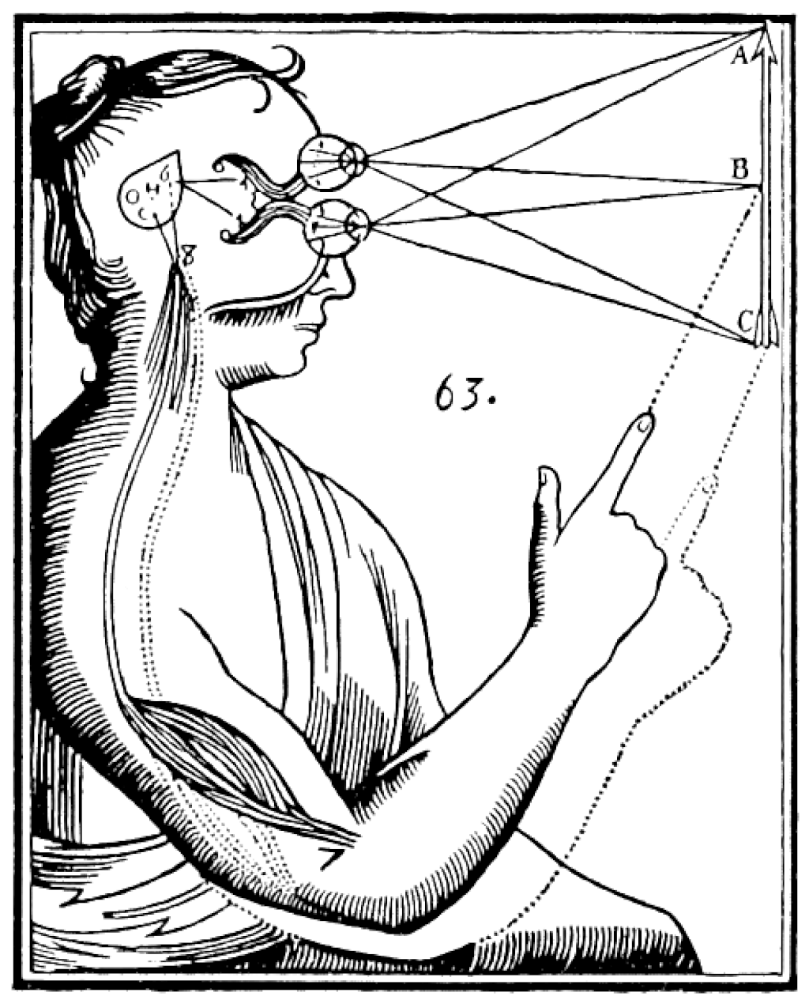
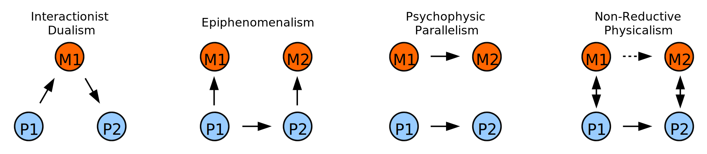
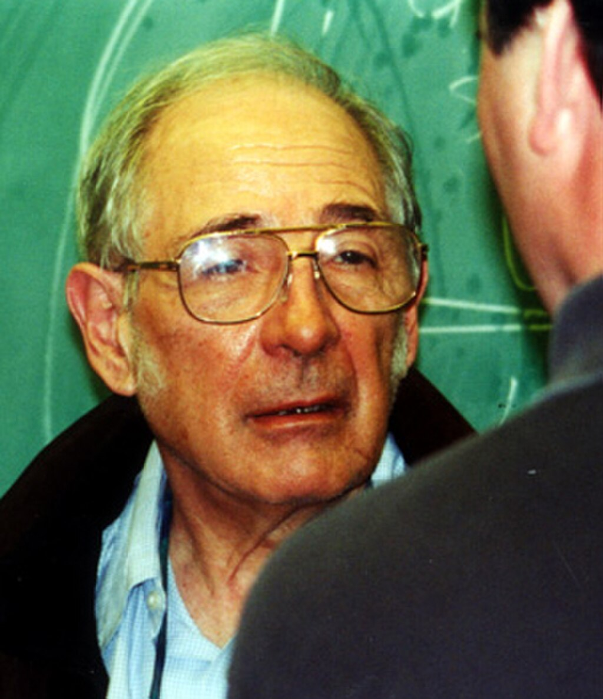
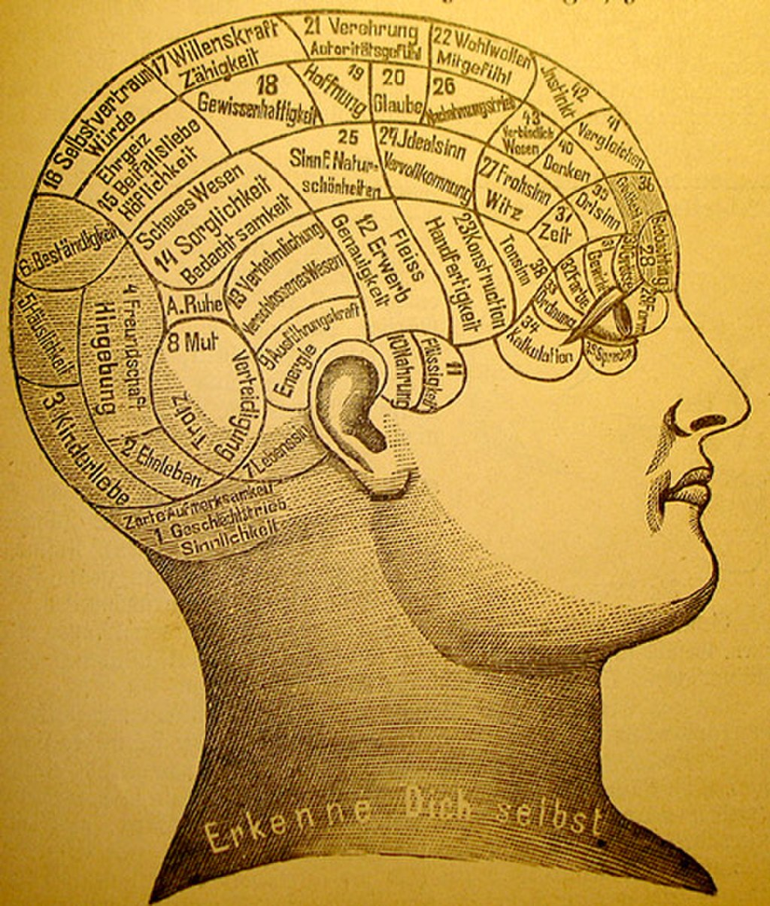
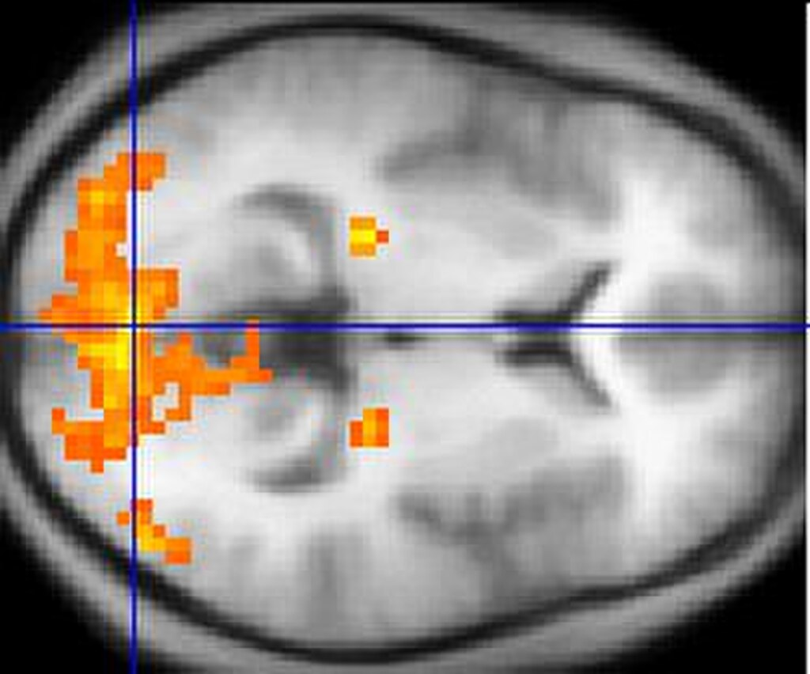

**Philosophy of mind** is a branch of [philosophy](https://en.wikipedia.org/wiki/Philosophy "Philosophy") that deals with the nature of the [mind](https://en.wikipedia.org/wiki/Mind "Mind") and its relation to the [body](https://en.wikipedia.org/wiki/Body_\(biology\) "Body (biology)") and the [external world](https://en.wikipedia.org/wiki/Reality "Reality").

The [mind–body problem](https://en.wikipedia.org/wiki/Mind–body_problem "Mind–body problem") is a paradigmatic issue in philosophy of mind, although a number of other issues are addressed, such as the [hard problem of consciousness](https://en.wikipedia.org/wiki/Hard_problem_of_consciousness "Hard problem of consciousness") and the nature of particular mental states. Aspects of the mind that are studied include [mental events](https://en.wikipedia.org/wiki/Mental_event "Mental event"), [mental functions](https://en.wikipedia.org/wiki/Mental_function "Mental function"), [mental properties](https://en.wikipedia.org/wiki/Mental_property "Mental property"), [consciousness](https://en.wikipedia.org/wiki/Consciousness "Consciousness") and [its neural correlates](https://en.wikipedia.org/wiki/Neural_correlates_of_consciousness "Neural correlates of consciousness"), the ontology of the mind, the nature of [cognition](https://en.wikipedia.org/wiki/Cognition "Cognition") and of [thought](https://en.wikipedia.org/wiki/Thought "Thought"), and the relationship of the mind to the body.

[Dualism](https://en.wikipedia.org/wiki/Dualism_\(philosophy_of_mind\) "Dualism (philosophy of mind)") and [monism](https://en.wikipedia.org/wiki/Monism "Monism") are the two central [schools of thought](https://en.wikipedia.org/wiki/Schools_of_thought "Schools of thought") on the mind–body problem, although nuanced views have arisen that do not fit one or the other category neatly.

*   Dualism finds its entry into [Western philosophy](https://en.wikipedia.org/wiki/Western_philosophy "Western philosophy") thanks to [René Descartes](https://en.wikipedia.org/wiki/René_Descartes "René Descartes") in the [17th century](https://en.wikipedia.org/wiki/17th_century "17th century"). Substance dualists like Descartes argue that the mind is an independently existing [substance](https://en.wikipedia.org/wiki/Substance_\(philosophy\) "Substance (philosophy)"), whereas [property dualists](https://en.wikipedia.org/wiki/Property_dualism "Property dualism") maintain that the mind is a group of independent properties that [emerge](https://en.wikipedia.org/wiki/Emergentism "Emergentism") from and cannot be reduced to the brain, but that it is not a distinct substance.
*   Monism is the position that mind and body are [ontologically](https://en.wikipedia.org/wiki/Ontology "Ontology") indiscernible entities, not dependent substances. This view was espoused by the 17th-century rationalist [Baruch Spinoza](https://en.wikipedia.org/wiki/Baruch_Spinoza "Baruch Spinoza"). [Physicalists](https://en.wikipedia.org/wiki/Physicalism "Physicalism") argue that only entities postulated by physical theory exist, and that mental processes will eventually be explained in terms of these entities as physical theory continues to evolve. Physicalists maintain various positions on the prospects of [reducing mental properties to physical properties](https://en.wikipedia.org/wiki/Physicalism#Reductionism "Physicalism") (many of whom adopt compatible forms of property dualism), and the ontological status of such mental properties remains unclear. [Idealists](https://en.wikipedia.org/wiki/Idealism_\(philosophy\) "Idealism (philosophy)") maintain that the mind is all that exists and that the external world is either mental itself, or an illusion created by the mind. [Neutral monists](https://en.wikipedia.org/wiki/Neutral_monism "Neutral monism") such as [Ernst Mach](https://en.wikipedia.org/wiki/Ernst_Mach "Ernst Mach") and [William James](https://en.wikipedia.org/wiki/William_James "William James") argue that events in the world can be thought of as either mental (psychological) or physical depending on the network of relationships into which they enter, and dual-aspect monists such as [Spinoza](https://en.wikipedia.org/wiki/Baruch_Spinoza "Baruch Spinoza") adhere to the position that there is some other, neutral substance, and that both matter and mind are properties of this unknown substance. The most common monisms in the 20th and 21st centuries have all been variations of physicalism; these positions include [behaviorism](https://en.wikipedia.org/wiki/Behaviorism "Behaviorism"), the [type identity theory](https://en.wikipedia.org/wiki/Type_physicalism "Type physicalism"), [anomalous monism](https://en.wikipedia.org/wiki/Anomalous_monism "Anomalous monism") and [functionalism](https://en.wikipedia.org/wiki/Functionalism_\(philosophy_of_mind\) "Functionalism (philosophy of mind)").

Most modern philosophers of mind adopt either a [reductive physicalist](https://en.wikipedia.org/wiki/Physicalism#Reductionism "Physicalism") or [non-reductive physicalist](https://en.wikipedia.org/wiki/Physicalism#Reductionism "Physicalism") position, maintaining in their different ways that the mind is not something separate from the body. These approaches have been particularly influential in the sciences, especially in the fields of [sociobiology](https://en.wikipedia.org/wiki/Sociobiology "Sociobiology"), [computer science](https://en.wikipedia.org/wiki/Computer_science "Computer science") (specifically, [artificial intelligence](/source/artificial-intelligence/ "Artificial intelligence")), [evolutionary psychology](https://en.wikipedia.org/wiki/Evolutionary_psychology "Evolutionary psychology") and the various [neurosciences](https://en.wikipedia.org/wiki/Neuroscience "Neuroscience"). Reductive physicalists assert that all mental states and properties will eventually be explained by scientific accounts of physiological processes and states. Non-reductive physicalists argue that although the mind is not a separate substance, mental properties [supervene](https://en.wikipedia.org/wiki/Supervenience "Supervenience") on physical properties, or that the predicates and vocabulary used in mental descriptions and explanations are indispensable, and cannot be reduced to the language and lower-level explanations of physical science. Continued [neuroscientific](https://en.wikipedia.org/wiki/Neuroscientific "Neuroscientific") progress has helped to clarify some of these issues; however, they are far from being resolved. Modern philosophers of mind continue to ask how the subjective qualities and the [intentionality](https://en.wikipedia.org/wiki/Intentionality "Intentionality") of mental states and properties can be explained in naturalistic terms.

## Mind–body problem

Illustration of mind–body dualism by [René Descartes](https://en.wikipedia.org/wiki/René_Descartes "René Descartes"). Inputs are passed by the sensory organs to the [pineal gland](https://en.wikipedia.org/wiki/Pineal_gland "Pineal gland"), and from there to the immaterial [spirit](https://en.wikipedia.org/wiki/Soul "Soul").

The mind–body problem concerns the explanation of the relationship that exists between [minds](https://en.wikipedia.org/wiki/Mind "Mind"), or [mental processes](https://en.wikipedia.org/wiki/Mental_processes "Mental processes"), and bodily states or processes. The main aim of philosophers working in this area is to determine the nature of the mind and mental states/processes, and how—or even if—minds are affected by and can affect the body.

[Perceptual](https://en.wikipedia.org/wiki/Perceptual "Perceptual") experiences depend on [stimuli](https://en.wikipedia.org/wiki/Stimulation "Stimulation") that arrive at our various [sensory organs](https://en.wikipedia.org/wiki/Sensory_system "Sensory system") from the external world, and these stimuli cause changes in our mental states, ultimately causing us to feel a sensation, which may be pleasant or unpleasant. The subjective features of these sensations are often referred to as qualia, the “what it is like” aspect of conscious experience. For example, someone's desire for a slice of pizza will tend to cause that person to move his or her body in a specific manner and direction to obtain what he or she wants. The question, then, is how it can be possible for conscious experiences to arise out of a lump of gray matter endowed with nothing but electrochemical properties.

A related problem is how someone's [propositional attitudes](https://en.wikipedia.org/wiki/Propositional_attitude "Propositional attitude") (e.g. beliefs and desires) cause that individual's [neurons](https://en.wikipedia.org/wiki/Neuron "Neuron") to fire and muscles to contract. These comprise some of the puzzles that have confronted [epistemologists](https://en.wikipedia.org/wiki/Epistemology "Epistemology") and philosophers of mind from the time of [René Descartes](https://en.wikipedia.org/wiki/René_Descartes "René Descartes").

### Dualist solutions to the mind–body problem

[Dualism](https://en.wikipedia.org/wiki/Dualism_\(philosophy_of_mind\) "Dualism (philosophy of mind)") is a set of views about the relationship between [mind](https://en.wikipedia.org/wiki/Mind "Mind") and [matter](https://en.wikipedia.org/wiki/Matter "Matter") (or [body](https://en.wikipedia.org/wiki/Human_body "Human body")). It begins with the claim that mental [phenomena](https://en.wikipedia.org/wiki/Phenomenon "Phenomenon") are, in some respects, non-[physical](https://en.wikipedia.org/wiki/Nature "Nature").

A form of [property dualism](https://en.wikipedia.org/wiki/Property_dualism "Property dualism") may be found in the ancient Indian philosophical schools of [Samkhya](https://en.wikipedia.org/wiki/Samkhya "Samkhya") and [Yoga](https://en.wikipedia.org/wiki/Yoga "Yoga") (ca. 6th c. BCE), as mind and body ([Indriya](https://en.wikipedia.org/wiki/Indriya "Indriya")) are different functions of [prakriti](https://en.wikipedia.org/wiki/Prakriti "Prakriti"). Wrongly conflating [purusha](https://en.wikipedia.org/wiki/Purusha "Purusha") ("spirit", or better, pure consciousness) with mind or manas (a development of non-conscious [prakriti](https://en.wikipedia.org/wiki/Prakriti "Prakriti")) while correctly distinguishing [purusha](https://en.wikipedia.org/wiki/Purusha "Purusha") and [prakriti](https://en.wikipedia.org/wiki/Prakriti "Prakriti") (two eternally-different ontological entities) leads to the erroneous conclusion that [Samkhya](https://en.wikipedia.org/wiki/Samkhya "Samkhya") supports [substance dualism](https://en.wikipedia.org/wiki/Mind–body_dualism "Mind–body dualism"). Yet both mind and body are equally non-conscious (jaDaa) in [Samkhya](https://en.wikipedia.org/wiki/Samkhya "Samkhya") and, while they are different developments of [prakriti](https://en.wikipedia.org/wiki/Prakriti "Prakriti"), they are both made up of [gunas](https://en.wikipedia.org/wiki/Gunas "Gunas").

In Western philosophy, the earliest discussions of dualist ideas are in the writings of [Plato](https://en.wikipedia.org/wiki/Plato "Plato"), who suggested that humans' _intelligence_ (a faculty of the mind or soul) could not be identified with, or explained in terms of, their physical body. However, the best-known version of dualism is due to [René Descartes](https://en.wikipedia.org/wiki/René_Descartes "René Descartes") (1641), and holds that the mind is a non-extended, non-physical substance, a "[res cogitans](https://en.wikipedia.org/wiki/Mental_substance "Mental substance")". Descartes was the first to clearly identify the mind with [consciousness](https://en.wikipedia.org/wiki/Consciousness "Consciousness") and [self-awareness](https://en.wikipedia.org/wiki/Self-awareness "Self-awareness"), and to distinguish this from the brain, which was the seat of intelligence. He was therefore the first to formulate the mind–body problem in the form in which it still exists today.

#### Arguments for dualism

The problems of physicalist theories of the mind have led some contemporary philosophers to assert that the traditional view of substance dualism should be defended. From this perspective, this theory is coherent, and problems such as "the interaction of mind and body" can be rationally resolved. The most frequently used argument in favor of dualism appeals to the common-sense intuition that conscious experience is distinct from inanimate matter. If asked what the mind is, the average person would usually respond by identifying it with their [self](https://en.wikipedia.org/wiki/Self_\(psychology\) "Self (psychology)"), their personality, their [soul](https://en.wikipedia.org/wiki/Soul "Soul"), or another related entity. They would almost certainly deny that the mind simply is the brain, or vice versa, finding the idea that there is just one [ontological](https://en.wikipedia.org/wiki/Ontology "Ontology") entity at play to be too mechanistic or unintelligible. Modern philosophers of mind think that these intuitions are misleading, and that critical faculties, along with [empirical evidence](https://en.wikipedia.org/wiki/Empirical_evidence "Empirical evidence") from the sciences, should be used to examine these assumptions and determine whether there is any real basis to them.

According to philosophers like [Thomas Nagel](https://en.wikipedia.org/wiki/Thomas_Nagel "Thomas Nagel") and [Frank Jackson](https://en.wikipedia.org/wiki/Frank_Cameron_Jackson "Frank Cameron Jackson"), the mental and the physical seem to have quite different, and perhaps irreconcilable, properties. Mental events have a subjective quality, whereas physical events do not. So, for example, one can reasonably ask what a burnt finger feels like, or what a blue sky looks like, or what nice music sounds like to a person. But it is meaningless, or at least odd, to ask what a surge in the uptake of [glutamate](https://en.wikipedia.org/wiki/Glutamate "Glutamate") in the dorsolateral portion of the [prefrontal cortex](https://en.wikipedia.org/wiki/Prefrontal_cortex "Prefrontal cortex") feels like.

A related thought experiment is the [Inverted Spectrum Hypothesis (ISH)](https://en.wikipedia.org/wiki/Inverted_spectrum "Inverted spectrum"). Which explores the idea of people experiencing colors differently. The ISH suggests that people could have an inverted view of colors.  For instance, what one person sees as red, another person might see the opposite on the color wheel, which would be green. However, both people have learned to assign the color that they experience differently to the one term.The idea can be traced back to John Locke, found in his book _Essay Concerning Human Understanding_ published in 1690.

Philosophers of mind call the subjective aspects of mental events "[qualia](https://en.wikipedia.org/wiki/Qualia "Qualia")" or "raw feels". There are qualia involved in these mental events that seem particularly difficult to reduce to anything physical. David Chalmers explains this argument by stating that we could conceivably know all the objective information about something, such as the brain states and wavelengths of light involved with seeing the color red, but still not know something fundamental about the situation – what it is like to see the color red. The phrase “what it is like” is used in philosophy of mind to characterize conscious experience; it originated with Timothy Sprigge and was later popularized by Thomas Nagel.

If consciousness (the mind) can exist independently of physical reality (the brain), one must explain how physical memories are created concerning consciousness. Dualism must therefore explain how consciousness affects physical reality. One possible explanation is that of a miracle, proposed by [Arnold Geulincx](https://en.wikipedia.org/wiki/Arnold_Geulincx "Arnold Geulincx") and [Nicolas Malebranche](https://en.wikipedia.org/wiki/Nicolas_Malebranche "Nicolas Malebranche"), where all mind–body interactions require the direct intervention of God.

Another argument that has been proposed by [C. S. Lewis](https://en.wikipedia.org/wiki/C._S._Lewis "C. S. Lewis") is the [Argument from Reason](https://en.wikipedia.org/wiki/Argument_from_Reason "Argument from Reason"): if, as monism implies, all of our thoughts are the effects of physical causes, then we have no reason for assuming that they are also the [consequent](https://en.wikipedia.org/wiki/Consequent "Consequent") of a reasonable ground. Knowledge, however, is apprehended by reasoning from ground to consequent. Therefore, if monism is correct, there would be no way of knowing this—or anything else—we could not even suppose it, except by a fluke.

The [zombie argument](https://en.wikipedia.org/wiki/P-zombie "P-zombie") is based on a [thought experiment](https://en.wikipedia.org/wiki/Thought_experiment "Thought experiment") proposed by Todd Moody, and developed by [David Chalmers](https://en.wikipedia.org/wiki/David_Chalmers "David Chalmers") in his book _[The Conscious Mind](https://en.wikipedia.org/wiki/The_Conscious_Mind "The Conscious Mind")_. The basic idea is that one can imagine one's body, and therefore conceive the existence of one's body, without any conscious states being associated with this body. Chalmers' argument is that it seems possible that such a being could exist because all that is needed is that all and only the things that the physical sciences describe about a zombie must be true of it. Since none of the concepts involved in these sciences make reference to consciousness or other mental phenomena, and any physical entity can be by definition described scientifically via [physics](/source/physics/ "Physics"), the move from conceivability to possibility is not such a large one. Others such as Dennett have [argued](https://en.wikipedia.org/wiki/Philosophical_zombie#Criticism "Philosophical zombie") that the notion of a philosophical zombie is an incoherent, or unlikely, concept. It has been argued under physicalism that one must either believe that anyone including oneself might be a zombie, or that no one can be a zombie—following from the assertion that one's own conviction about being (or not being) a zombie is a product of the physical world and is therefore no different from anyone else's. This argument has been expressed by Dennett who argues that "Zombies think they are conscious, think they have qualia, think they suffer pains—they are just 'wrong' (according to this lamentable tradition) in ways that neither they nor we could ever discover!" See also the [problem of other minds](https://en.wikipedia.org/wiki/Problem_of_other_minds "Problem of other minds").

[Avshalom Elitzur](https://en.wikipedia.org/wiki/Avshalom_Elitzur "Avshalom Elitzur") has described himself as a "reluctant dualist". One argument Elitzur makes in favor of dualism is an argument from bafflement. According to Elitzur, a conscious being can conceive of a P-zombie version of his/herself. However, a P-zombie cannot conceive of a version of itself that lacks corresponding qualia.

[Christian List](https://en.wikipedia.org/wiki/Christian_List "Christian List") argues that the existence of first-person perspectives is evidence against physicalist views of consciousness. According to List, first-personal phenomenal facts cannot supervene on third-person physical facts. However, List argues that this also refutes versions of dualism that have purely third-personal metaphysics. List has proposed a model he calls the "many-worlds theory of consciousness" in order to reconcile the subjective nature of consciousness without lapsing into solipsism.

#### Interactionist dualism

Portrait of [René Descartes](https://en.wikipedia.org/wiki/René_Descartes "René Descartes") by [Frans Hals](https://en.wikipedia.org/wiki/Frans_Hals "Frans Hals") (1648)

Interactionist dualism, or simply [interactionism](https://en.wikipedia.org/wiki/Interactionism_\(philosophy_of_mind\) "Interactionism (philosophy of mind)"), is the particular form of dualism first espoused by Descartes in the _Meditations_. In the 20th century, its major defenders have been [Karl Popper](https://en.wikipedia.org/wiki/Karl_Popper "Karl Popper") and [John Carew Eccles](https://en.wikipedia.org/wiki/John_Carew_Eccles "John Carew Eccles"). It is the view that mental states, such as beliefs and desires, causally interact with physical states.

Descartes's argument for this position can be summarized as follows: Seth has a clear and distinct idea of his mind as a thinking thing that has no spatial extension (i.e., it cannot be measured in terms of length, weight, height, and so on). He also has a clear and distinct idea of his body as something that is spatially extended, subject to quantification and not able to think. It follows that mind and body are not identical because they have radically different properties.

Seth's mental states (desires, beliefs, etc.) have [causal](https://en.wikipedia.org/wiki/Causality "Causality") effects on his body and vice versa: A child touches a hot stove (physical event) which causes pain (mental event) and makes her yell (physical event), this in turn provokes a sense of fear and protectiveness in the caregiver (mental event), and so on.

Descartes' argument depends on the premise that what Seth believes to be "clear and distinct" ideas in his mind are [necessarily true](https://en.wikipedia.org/wiki/Logical_truth "Logical truth"). Many contemporary philosophers doubt this. For example, [Joseph Agassi](https://en.wikipedia.org/wiki/Joseph_Agassi "Joseph Agassi") suggests that several scientific discoveries made since the early 20th century have undermined the idea of privileged access to one's own ideas. [Freud](https://en.wikipedia.org/wiki/Sigmund_Freud "Sigmund Freud") claimed that a psychologically-trained observer can understand a person's unconscious motivations better than the person himself does. [Duhem](https://en.wikipedia.org/wiki/Pierre_Duhem "Pierre Duhem") has shown that a philosopher of science can know a person's methods of discovery better than that person herself does, while [Malinowski](https://en.wikipedia.org/wiki/Bronisław_Malinowski "Bronisław Malinowski") has shown that an anthropologist can know a person's customs and habits better than the person whose customs and habits they are. He also asserts that modern psychological experiments that cause people to see things that are not there provide grounds for rejecting Descartes' argument, because scientists can describe a person's perceptions better than the person themself can.

#### Other forms of dualism

Four varieties of dualism. The arrows indicate the direction of the causal interactions. Occasionalism is not shown.

##### Psychophysical parallelism

[Psychophysical parallelism](https://en.wikipedia.org/wiki/Psychophysical_parallelism "Psychophysical parallelism"), or simply **parallelism**, is the view that mind and body, while having distinct ontological statuses, do not causally influence one another. Instead, they run along parallel paths (mind events causally interact with mind events and brain events causally interact with brain events) and only seem to influence each other. This view was most prominently defended by [Gottfried Leibniz](https://en.wikipedia.org/wiki/Gottfried_Leibniz "Gottfried Leibniz"). Although Leibniz was an ontological monist who believed that only one type of substance, the [monad](https://en.wikipedia.org/wiki/Monad_\(Greek_philosophy\) "Monad (Greek philosophy)"), exists in the universe, and that everything is reducible to it, he nonetheless maintained that there was an important distinction between "the mental" and "the physical" in terms of causation. He held that God had arranged things in advance so that minds and bodies would be in harmony with each other. This is known as the doctrine of [pre-established harmony](https://en.wikipedia.org/wiki/Pre-established_harmony "Pre-established harmony").

##### Occasionalism

[Occasionalism](https://en.wikipedia.org/wiki/Occasionalism "Occasionalism") is the view espoused by [Nicholas Malebranche](https://en.wikipedia.org/wiki/Nicholas_Malebranche "Nicholas Malebranche") as well as Islamic philosophers such as [Abu Hamid Muhammad ibn Muhammad al-Ghazali](https://en.wikipedia.org/wiki/Al-Ghazali "Al-Ghazali") that asserts all supposedly causal relations between physical events, or between physical and mental events, are not really causal at all. While body and mind are different substances, causes (whether mental or physical) are related to their effects by an act of God's intervention on each specific occasion.

##### Property dualism

[Property dualism](https://en.wikipedia.org/wiki/Property_dualism "Property dualism") is the view that the world is constituted of one kind of [substance](https://en.wikipedia.org/wiki/Substance_theory "Substance theory") – the physical kind – and there exist two distinct kinds of properties: [physical properties](https://en.wikipedia.org/wiki/Physical_properties "Physical properties") and [mental properties](https://en.wikipedia.org/wiki/Mental_properties "Mental properties"). It is the view that non-physical, mental properties (such as beliefs, desires and emotions) inhere in some physical bodies (at least, brains). Sub-varieties of property dualism include:

1.  [Emergent materialism](https://en.wikipedia.org/wiki/Emergent_materialism "Emergent materialism") asserts that when matter is organized in the appropriate way (i.e., in the way that living human bodies are organized), mental properties emerge in a way not fully accountable for by physical laws. These emergent properties have an independent ontological status and cannot be reduced to, or explained in terms of, the physical substrate from which they emerge. They are dependent on the physical properties from which they emerge, but opinions vary as to the coherence of top–down causation, that is, the causal effectiveness of such properties. A form of emergent materialism has been espoused by [David Chalmers](https://en.wikipedia.org/wiki/David_Chalmers "David Chalmers") and the concept has undergone something of a renaissance in recent years, but it was already suggested in the 19th century by [William James](https://en.wikipedia.org/wiki/William_James "William James").
2.  [Epiphenomenalism](https://en.wikipedia.org/wiki/Epiphenomenalism "Epiphenomenalism") is a doctrine first formulated by [Thomas Henry Huxley](https://en.wikipedia.org/wiki/Thomas_Henry_Huxley "Thomas Henry Huxley"). It consists of the view that mental phenomena are causally ineffectual, where one or more mental states do not have any influence on physical states or mental phenomena are the effects, but not the causes, of physical phenomena. Physical events can cause other physical and mental events, but mental events cannot cause anything since they are just causally inert by-products (i.e., epiphenomena) of the physical world. This view has been defended by [Frank Jackson](https://en.wikipedia.org/wiki/Frank_Cameron_Jackson "Frank Cameron Jackson").
3.  [Non-reductive physicalism](https://en.wikipedia.org/wiki/Property_dualism#Non-reductive_Physicalism "Property dualism") is the view that mental properties form a separate ontological class to physical properties: mental states (such as qualia) are not reducible to physical states. The ontological stance towards qualia in the case of non-reductive physicalism does not imply that qualia are causally inert; this is what distinguishes it from epiphenomenalism.
4.  [Panpsychism](https://en.wikipedia.org/wiki/Panpsychism "Panpsychism") is the view that all matter has a mental aspect, or, alternatively, all objects have a unified center of experience or point of view. Superficially, it seems to be a form of property dualism, since it regards everything as having both mental and physical properties. However, some panpsychists say that mechanical behaviour is derived from the primitive mentality of atoms and molecules—as are sophisticated mentality and organic behaviour, the difference being attributed to the presence or absence of [complex](https://en.wikipedia.org/wiki/Complexity "Complexity") structure in a compound object. So long as the _reduction_ of non-mental properties to mental ones is in place, panpsychism is not a (strong) form of property dualism; otherwise it is.

##### Dual aspect theory

[Dual aspect theory](https://en.wikipedia.org/wiki/Dual_aspect_theory "Dual aspect theory") or dual-aspect monism is the view that the [mental](https://en.wikipedia.org/wiki/Mind "Mind") and the [physical](https://en.wikipedia.org/wiki/Nature "Nature") are two aspects of, or perspectives on, the same substance. (Thus it is a mixed position, which is monistic in some respects). In modern philosophical writings, the theory's relationship to [neutral monism](https://en.wikipedia.org/wiki/Neutral_monism "Neutral monism") has become somewhat ill-defined, but one proffered distinction says that whereas neutral monism allows the context of a given group of neutral elements and the relationships into which they enter to determine whether the group can be thought of as mental, physical, both, or neither, dual-aspect theory suggests that the mental and the physical are manifestations (or aspects) of some underlying substance, entity or process that is itself neither mental nor physical as normally understood. Various formulations of dual-aspect monism also require the mental and the physical to be complementary, mutually irreducible and perhaps inseparable (though distinct).

##### Experiential dualism

This is a philosophy of mind that regards the degrees of freedom between mental and physical well-being as not synonymous thus implying an experiential dualism between body and mind. An example of these disparate degrees of freedom is given by [Allan Wallace](https://en.wikipedia.org/wiki/B._Alan_Wallace "B. Alan Wallace") who notes that it is "experientially apparent that one may be physically uncomfortable—for instance, while engaging in a strenuous physical workout—while mentally cheerful; conversely, one may be mentally distraught while experiencing physical comfort". Experiential dualism notes that our subjective experience of merely seeing something in the physical world seems qualitatively different from mental processes like grief that comes from losing a loved one. This philosophy is a proponent of causal dualism, which is defined as the dual ability for mental states and physical states to affect one another. Mental states can cause changes in physical states and vice versa.

However, unlike cartesian dualism or some other systems, experiential dualism does not posit two fundamental substances in reality: mind and matter. Rather, experiential dualism is to be understood as a conceptual framework that gives credence to the qualitative difference between the experience of mental and physical states. Experiential dualism is accepted as the conceptual framework of [Madhyamaka Buddhism](/source/madhyamaka/ "Madhyamaka").

Madhayamaka Buddhism goes further, finding fault with the monist view of physicalist philosophies of mind as well in that these generally posit matter and energy as the fundamental substance of reality. Nonetheless, this does not imply that the cartesian dualist view is correct, rather Madhyamaka regards as error any affirming view of a fundamental substance to reality.

> In denying the independent self-existence of all the phenomena that make up the world of our experience, the Madhyamaka view departs from both the substance dualism of Descartes and the substance monism—namely, physicalism—that is characteristic of modern science. The physicalism propounded by many contemporary scientists seems to assert that the real world is composed of physical things-in-themselves, while all mental phenomena are regarded as mere appearances, devoid of any reality in and of themselves. Much is made of this difference between appearances and reality.

Indeed, physicalism, or the idea that matter is the only fundamental substance of reality, is explicitly rejected by Buddhism.

> In the Madhyamaka view, mental events are no more or less real than physical events. In terms of our common-sense experience, differences of kind do exist between physical and mental phenomena. While the former commonly have mass, location, velocity, shape, size, and numerous other physical attributes, these are not generally characteristic of mental phenomena. For example, we do not commonly conceive of the feeling of affection for another person as having mass or location. These physical attributes are no more appropriate to other mental events such as sadness, a recalled image from one's childhood, the visual perception of a rose, or consciousness of any sort. Mental phenomena are, therefore, not regarded as being physical, for the simple reason that they lack many of the attributes that are uniquely characteristic of physical phenomena. Thus, Buddhism has never adopted the physicalist principle that regards only physical things as real.

### Monist solutions to the mind–body problem

In contrast to [dualism](https://en.wikipedia.org/wiki/Mind-body_dualism "Mind-body dualism"), [monism](https://en.wikipedia.org/wiki/Monism "Monism") does not accept any fundamental divisions. The fundamentally disparate nature of reality has been central to forms of eastern philosophies for over two millennia. In [Indian](https://en.wikipedia.org/wiki/Indian_philosophy "Indian philosophy") and [Chinese philosophy](https://en.wikipedia.org/wiki/Chinese_philosophy "Chinese philosophy"), monism is integral to how experience is understood. In Buddhist philosophy, a person is defined to have five interdependent aggregates (skandhas) rather than a permanent soul or substance. The aggregates are form (body), sensation, perception, mental formations, and consciousness. These are described as dynamic and ever-changing processes that together constitute what is referred to as a person. Nāgārjuna, an Indian philosopher in the Mahāyāna Buddhist tradition, describes mind and body as mutually dependent rather than as two separate substances. In his view, mental and physical processes arise together and cannot exist independently of one another. Today, the most common forms of monism in Western philosophy are [physicalist](https://en.wikipedia.org/wiki/Physicalism "Physicalism"). Physicalistic monism asserts that the only existing substance is physical, in some sense of that term to be clarified by our best science. However, a variety of formulations (see below) are possible. Another form of monism, [idealism](https://en.wikipedia.org/wiki/Idealism "Idealism"), states that the only existing substance is mental. Although pure idealism, such as that of [George Berkeley](https://en.wikipedia.org/wiki/George_Berkeley "George Berkeley"), is uncommon in contemporary Western philosophy, a more sophisticated variant called [panpsychism](https://en.wikipedia.org/wiki/Panpsychism "Panpsychism"), according to which mental experience and properties may be at the foundation of physical experience and properties, has been espoused by some philosophers such as [Alfred North Whitehead](https://en.wikipedia.org/wiki/Alfred_North_Whitehead "Alfred North Whitehead") and [David Ray Griffin](https://en.wikipedia.org/wiki/David_Ray_Griffin "David Ray Griffin").

[Phenomenalism](https://en.wikipedia.org/wiki/Phenomenalism "Phenomenalism") is the theory that representations (or [sense data](https://en.wikipedia.org/wiki/Sense_data "Sense data")) of external objects are all that exist. Such a view was briefly adopted by [Bertrand Russell](https://en.wikipedia.org/wiki/Bertrand_Russell "Bertrand Russell") and many of the [logical positivists](https://en.wikipedia.org/wiki/Logical_positivists "Logical positivists") during the early 20th century. A third possibility is to accept the existence of a basic substance that is neither physical nor mental. The mental and physical would then both be properties of this neutral substance. Such a position was adopted by Baruch Spinoza and was popularized by [Ernst Mach](https://en.wikipedia.org/wiki/Ernst_Mach "Ernst Mach") in the 19th century. This [neutral monism](https://en.wikipedia.org/wiki/Neutral_monism "Neutral monism"), as it is called, resembles property dualism.

#### Physicalistic monisms

##### Behaviorism

Behaviorism dominated philosophy of mind for much of the 20th century, especially the first half. In psychology, behaviorism developed as a reaction to the inadequacies of [introspectionism](https://en.wikipedia.org/wiki/Introspection "Introspection"). Introspective reports on one's own interior mental life are not subject to careful examination for accuracy and cannot be used to form predictive generalizations. Without generalizability and the possibility of third-person examination, the behaviorists argued, psychology cannot be scientific. The way out, therefore, was to eliminate the idea of an interior mental life (and hence an ontologically independent mind) altogether and focus instead on the description of observable behavior.

Parallel to these developments in psychology, a philosophical behaviorism (sometimes called logical behaviorism) was developed. This is characterized by a strong [verificationism](https://en.wikipedia.org/wiki/Verificationism "Verificationism"), which generally considers unverifiable statements about interior mental life pointless. For the behaviorist, mental states are not interior states on which one can make introspective reports. They are just descriptions of behavior or [dispositions](https://en.wikipedia.org/wiki/Disposition "Disposition") to behave in certain ways, made by third parties to explain and predict another's behavior.

Philosophical behaviorism has fallen out of favor since the latter half of the 20th century, coinciding with the rise of [cognitivism](https://en.wikipedia.org/wiki/Cognitivism_\(psychology\) "Cognitivism (psychology)").

##### Identity theory

Type physicalism (or type-identity theory) was developed by [Jack Smart](https://en.wikipedia.org/wiki/J._J._C._Smart "J. J. C. Smart") and [Ullin Place](https://en.wikipedia.org/wiki/Ullin_Place "Ullin Place") as a direct reaction to the failure of behaviorism. These philosophers reasoned that, if mental states are something material, but not behavioral, then mental states are probably identical to internal states of the brain. In very simplified terms: a mental state _M_ is nothing other than brain state _B_. The mental state "desire for a cup of coffee" would thus be nothing more than the "firing of certain neurons in certain brain regions".

The classic Identity theory and Anomalous Monism in contrast. For the Identity theory, every token instantiation of a single mental type corresponds (as indicated by the arrows) to a physical token of a single physical type. For anomalous monism, the token–token correspondences can fall outside of the type–type correspondences. The result is token identity.

On the other hand, even granted the above, it does not follow that identity theories of all types must be abandoned. According to token identity theories, the fact that a certain brain state is connected with only one mental state of a person does not have to mean that there is an absolute correlation between types of mental state and types of brain state. The type–token distinction can be illustrated by a simple example: the word "green" contains four types of letters (g, r, e, n) with two tokens (occurrences) of the letter _e_ along with one each of the others. The idea of token identity is that only particular occurrences of mental events are identical with particular occurrences or tokenings of physical events. Anomalous monism (see below) and most other non-reductive physicalisms are token-identity theories. Despite these problems, there is a renewed interest in the type identity theory today, primarily due to the influence of [Jaegwon Kim](https://en.wikipedia.org/wiki/Jaegwon_Kim "Jaegwon Kim").

##### Functionalism

Functionalism was formulated by [Hilary Putnam](https://en.wikipedia.org/wiki/Hilary_Putnam "Hilary Putnam") and [Jerry Fodor](https://en.wikipedia.org/wiki/Jerry_Fodor "Jerry Fodor") as a reaction to the inadequacies of the identity theory. Putnam and Fodor saw mental states in terms of an empirical [computational theory of the mind](https://en.wikipedia.org/wiki/Computational_theory_of_mind "Computational theory of mind"). At about the same time or slightly after, [D.M. Armstrong](https://en.wikipedia.org/wiki/D.M._Armstrong "D.M. Armstrong") and [David Kellogg Lewis](https://en.wikipedia.org/wiki/David_Kellogg_Lewis "David Kellogg Lewis") formulated a version of functionalism that analyzed the mental concepts of folk psychology in terms of functional roles. Finally, [Wittgenstein](https://en.wikipedia.org/wiki/Ludwig_Wittgenstein "Ludwig Wittgenstein")'s idea of meaning as use led to a version of functionalism as a theory of meaning, further developed by [Wilfrid Sellars](https://en.wikipedia.org/wiki/Wilfrid_Sellars "Wilfrid Sellars") and [Gilbert Harman](https://en.wikipedia.org/wiki/Gilbert_Harman "Gilbert Harman"). Another one, [psychofunctionalism](https://en.wikipedia.org/wiki/Functionalism_\(philosophy_of_mind\)#Psychofunctionalism "Functionalism (philosophy of mind)"), is an approach adopted by the [naturalistic philosophy of mind](https://en.wikipedia.org/wiki/Naturalism_\(philosophy\)#Metaphysical_naturalism "Naturalism (philosophy)") associated with Jerry Fodor and [Zenon Pylyshyn](https://en.wikipedia.org/wiki/Zenon_Pylyshyn "Zenon Pylyshyn").

Mental states are characterized by their causal relations with other mental states and with sensory inputs and behavioral outputs. Functionalism abstracts away from the details of the physical implementation of a mental state by characterizing it in terms of non-mental functional properties. For example, a kidney is characterized scientifically by its functional role in filtering blood and maintaining certain chemical balances.

##### Non-reductive physicalism

Non-reductionist philosophers hold firmly to two essential convictions with regard to mind–body relations: 1) Physicalism is true and mental states must be physical states, but 2) All reductionist proposals are unsatisfactory: mental states cannot be reduced to behavior, brain states or functional states. Hence, the question arises whether there can still be a non-reductive physicalism. [Donald Davidson](https://en.wikipedia.org/wiki/Donald_Davidson_\(philosopher\) "Donald Davidson (philosopher)")'s [anomalous monism](https://en.wikipedia.org/wiki/Anomalous_monism "Anomalous monism") is an attempt to formulate such a physicalism. He "thinks that when one runs across what are traditionally seen as absurdities of Reason, such as [akrasia](https://en.wikipedia.org/wiki/Akrasia "Akrasia") or self-deception, the personal psychology framework is not to be given up in favor of the subpersonal one, but rather must be enlarged or extended so that the rationality set out by the principle of charity can be found elsewhere."

Davidson uses the thesis of [supervenience](https://en.wikipedia.org/wiki/Supervenience "Supervenience"): mental states supervene on physical states, but are not reducible to them. "Supervenience" therefore describes a functional dependence: there can be no change in the mental without some change in the physical–causal reducibility between the mental and physical without ontological reducibility.

##### Weak emergentism

Weak emergentism is a form of "non-reductive physicalism" that involves a layered view of nature, with the layers arranged in terms of increasing complexity and each corresponding to its own special science. Some philosophers like [C. D. Broad](https://en.wikipedia.org/wiki/C._D._Broad "C. D. Broad") hold that emergent properties causally interact with more fundamental levels, while others maintain that higher-order properties simply supervene over lower levels without direct causal interaction. The latter group therefore holds a less strict, or "weaker", definition of emergentism, which can be rigorously stated as follows: a property P of composite object O is emergent if it is metaphysically impossible for another object to lack property P if that object is composed of parts with intrinsic properties identical to those in O and has those parts in an identical configuration.

Sometimes emergentists use the example of water having a new property when Hydrogen H and Oxygen O combine to form H2O (water). In this example, there "emerges" a new property of a transparent liquid that would not have been predicted by understanding hydrogen and oxygen as gases. This is analogous to physical properties of the brain giving rise to a mental state. Emergentists try to solve the notorious mind–body gap this way. One problem for emergentism is the idea of [causal closure](https://en.wikipedia.org/wiki/Causal_closure "Causal closure") in the world that does not allow for a mind-to-body causation.

##### Eliminative materialism

If one is a materialist and believes that all aspects of our common-sense psychology will find reduction to a mature [cognitive neuroscience](https://en.wikipedia.org/wiki/Cognitive_neuroscience "Cognitive neuroscience"), and that non-reductive materialism is mistaken, then one can adopt a final, more radical position: eliminative materialism.

There are several varieties of eliminative materialism, but all maintain that our common-sense "[folk psychology](https://en.wikipedia.org/wiki/Folk_psychology "Folk psychology")" badly misrepresents the nature of some aspect of cognition. Eliminativists such as [Patricia](https://en.wikipedia.org/wiki/Patricia_Churchland "Patricia Churchland") and [Paul Churchland](https://en.wikipedia.org/wiki/Paul_Churchland "Paul Churchland") argue that while folk psychology treats cognition as fundamentally sentence-like, the non-linguistic vector/matrix model of neural network theory or [connectionism](https://en.wikipedia.org/wiki/Connectionism "Connectionism") will prove to be a much more accurate account of how the brain works.

The Churchlands often invoke the fate of other, erroneous popular theories and [ontologies](https://en.wikipedia.org/wiki/Ontology "Ontology") that have arisen in the course of history. For example, Ptolemaic astronomy served to explain and roughly predict the motions of the planets for centuries, but eventually this model of the [Solar System](https://en.wikipedia.org/wiki/Solar_System "Solar System") was eliminated in favor of the Copernican model. The Churchlands believe the same eliminative fate awaits the "sentence-cruncher" model of the mind in which thought and behavior are the result of manipulating sentence-like states called "[propositional attitudes](https://en.wikipedia.org/wiki/Propositional_attitude "Propositional attitude")". Sociologist [Jacy Reese Anthis](https://en.wikipedia.org/wiki/Jacy_Reese_Anthis "Jacy Reese Anthis") argues for eliminative materialism on all faculties of mind, including consciousness, stating, "The deepest mysteries of the mind are within our reach."

### Mysterianism

Some philosophers take an epistemic approach and argue that the mind–body problem is currently unsolvable, and perhaps will always remain unsolvable to human beings. This is usually termed [New mysterianism](https://en.wikipedia.org/wiki/New_mysterianism "New mysterianism"). [Colin McGinn](https://en.wikipedia.org/wiki/Colin_McGinn "Colin McGinn") holds that human beings are [cognitively closed](https://en.wikipedia.org/wiki/Cognitive_closure_\(philosophy\) "Cognitive closure (philosophy)") in regards to their own minds. According to McGinn human minds lack the concept-forming procedures to fully grasp how mental properties such as [consciousness](https://en.wikipedia.org/wiki/Consciousness "Consciousness") arise from their causal basis. An example would be how an elephant is cognitively closed in regards to particle physics.

A more moderate conception has been expounded by [Thomas Nagel](https://en.wikipedia.org/wiki/Thomas_Nagel "Thomas Nagel"), which holds that the mind–body problem is currently unsolvable at the present stage of scientific development and that it might take a future scientific [paradigm shift](https://en.wikipedia.org/wiki/Paradigm_shift "Paradigm shift") or revolution to bridge the [explanatory gap](https://en.wikipedia.org/wiki/Explanatory_gap "Explanatory gap"). Nagel posits that in the future a sort of "objective [phenomenology](https://en.wikipedia.org/wiki/Phenomenology_\(philosophy\) "Phenomenology (philosophy)")" might be able to bridge the gap between subjective conscious experience and its physical basis.

### Linguistic criticism of the mind–body problem

Each attempt to answer the mind–body problem encounters substantial problems. Some philosophers argue that this is because there is an underlying conceptual confusion. These philosophers, such as [Ludwig Wittgenstein](https://en.wikipedia.org/wiki/Ludwig_Wittgenstein "Ludwig Wittgenstein") and his followers in the tradition of linguistic criticism, therefore reject the problem as illusory. They argue that it is an error to ask how mental and biological states fit together. Rather it should simply be accepted that human experience can be described in different ways—for instance, in a mental and in a biological vocabulary. Illusory problems arise if one tries to describe the one in terms of the other's vocabulary or if the mental vocabulary is used in the wrong contexts. This is the case, for instance, if one searches for mental states of the brain. The brain is simply the wrong context for the use of mental vocabulary—the search for mental states of the brain is therefore a [category error](https://en.wikipedia.org/wiki/Category_error "Category error") or a sort of fallacy of reasoning.

Today, such a position is often adopted by interpreters of Wittgenstein such as [Peter Hacker](https://en.wikipedia.org/wiki/Peter_Hacker "Peter Hacker"). However, [Hilary Putnam](https://en.wikipedia.org/wiki/Hilary_Putnam "Hilary Putnam"), the originator of functionalism, has also adopted the position that the mind–body problem is an illusory problem which should be dissolved according to the manner of Wittgenstein.

### Naturalism and its problems

The thesis of physicalism is that the mind is part of the material (or physical) world. Such a position faces the problem that the mind has certain properties that no other material thing seems to possess. Physicalism must therefore explain how it is possible that these properties can nonetheless emerge from a material thing. The project of providing such an explanation is often referred to as the "[naturalization](https://en.wikipedia.org/wiki/Naturalism_\(philosophy\) "Naturalism (philosophy)") of the mental". Some of the crucial problems that this project attempts to resolve include the existence of qualia and the nature of intentionality.

#### Qualia

Many mental states seem to be experienced subjectively in different ways by different individuals. And it is characteristic of a mental state that it has some experiential _quality_, e.g. of pain, that it hurts. However, the sensation of pain between two individuals may not be identical, since no one has a perfect way to measure how much something hurts or of describing exactly how it feels to hurt. Philosophers and scientists therefore ask where these experiences come from. The existence of cerebral events, in and of themselves, cannot explain why they are accompanied by these corresponding qualitative experiences. The puzzle of why many cerebral processes occur with an accompanying experiential aspect in consciousness seems impossible to explain.

Yet it also seems to many that science will eventually have to explain such experiences. This [follows from](https://en.wikipedia.org/wiki/Logical_consequence "Logical consequence") an assumption about the possibility of [reductive explanations](https://en.wikipedia.org/wiki/Reductionism "Reductionism"). According to this view, if an attempt can be successfully made to explain a phenomenon reductively (e.g., water), then it can be explained why the phenomenon has all of its properties (e.g., fluidity, transparency). In the case of mental states, this means that there needs to be an explanation of why they have the property of being experienced in a certain way.

The 20th-century German philosopher [Martin Heidegger](https://en.wikipedia.org/wiki/Martin_Heidegger "Martin Heidegger") criticized the [ontological](https://en.wikipedia.org/wiki/Ontology "Ontology") assumptions underpinning such a reductive model, and claimed that it was impossible to make sense of experience in these terms. This is because, according to Heidegger, the nature of our subjective experience and its _qualities_ is impossible to understand in terms of [Cartesian](https://en.wikipedia.org/wiki/Descartes "Descartes") "substances" that bear "properties". Another way to put this is that the very concept of qualitative experience is incoherent in terms of—or is semantically [incommensurable](https://en.wikipedia.org/wiki/Commensurability_\(philosophy_of_science\) "Commensurability (philosophy of science)") with the concept of—substances that bear properties.

This problem of explaining introspective first-person aspects of mental states and consciousness in general in terms of third-person quantitative neuroscience is called the [explanatory gap](https://en.wikipedia.org/wiki/Explanatory_gap "Explanatory gap"). There are several different views of the nature of this gap among contemporary philosophers of mind. [David Chalmers](https://en.wikipedia.org/wiki/David_Chalmers "David Chalmers") and the early [Frank Jackson](https://en.wikipedia.org/wiki/Frank_Cameron_Jackson "Frank Cameron Jackson") interpret the gap as [ontological](https://en.wikipedia.org/wiki/Ontology "Ontology") in nature; that is, they maintain that qualia can never be explained by science because [physicalism](https://en.wikipedia.org/wiki/Physicalism "Physicalism") is false. There are two separate categories involved and one cannot be reduced to the other. An alternative view is taken by philosophers such as [Thomas Nagel](https://en.wikipedia.org/wiki/Thomas_Nagel "Thomas Nagel") and [Colin McGinn](https://en.wikipedia.org/wiki/Colin_McGinn "Colin McGinn"). According to them, the gap is [epistemological](https://en.wikipedia.org/wiki/Epistemology "Epistemology") in nature. For Nagel, science is not yet able to explain subjective experience because it has not yet arrived at the level or kind of knowledge that is required. We are not even able to formulate the problem coherently. For McGinn, on other hand, the problem is one of permanent and inherent biological limitations. We are not able to resolve the explanatory gap because the realm of subjective experiences is cognitively closed to us in the same manner that quantum physics is cognitively closed to elephants. Other philosophers liquidate the gap as purely a semantic problem. This semantic problem, of course, led to the famous "_Qualia Question_", which is: _Does Red cause Redness_?

#### Intentionality

[John Searle](https://en.wikipedia.org/wiki/John_Searle "John Searle")—one of the most influential philosophers of mind, proponent of [biological naturalism](https://en.wikipedia.org/wiki/Biological_naturalism "Biological naturalism") (Berkeley 2002)

[Intentionality](https://en.wikipedia.org/wiki/Intentionality "Intentionality") is the capacity of mental states to be directed towards (_about_) or be in relation with something in the external world. This property of mental states entails that they have [contents](https://en.wikipedia.org/wiki/Mental_content "Mental content") and [semantic referents](https://en.wikipedia.org/wiki/Semantics "Semantics") and can therefore be assigned [truth values](https://en.wikipedia.org/wiki/Truth_value "Truth value"). When one tries to reduce these states to natural processes there arises a problem: natural processes are not true or false, they simply happen. It would not make any sense to say that a natural process is true or false. But mental ideas or judgments are true or false, so how then can mental states (ideas or judgments) be natural processes? The possibility of assigning semantic value to ideas must mean that such ideas are about facts. Thus, for example, the idea that [Herodotus](https://en.wikipedia.org/wiki/Herodotus "Herodotus") was a historian refers to Herodotus and to the fact that he was a historian. If the fact is true, then the idea is true; otherwise, it is false. But where does this relation come from? In the brain, there are only electrochemical processes and these seem not to have anything to do with Herodotus.

## Philosophy of perception

Philosophy of perception is concerned with the nature of [perceptual experience](/source/perception/ "Perception") and the status of perceptual objects, in particular how perceptual experience relates to appearances and beliefs about the world. The main contemporary views within philosophy of perception include [naive realism](https://en.wikipedia.org/wiki/Naive_realism "Naive realism"), [enactivism](https://en.wikipedia.org/wiki/Enactivism "Enactivism") and [representational](https://en.wikipedia.org/wiki/Mental_representation "Mental representation") views.

## Philosophy of mind and science

A phrenological [mapping](https://en.wikipedia.org/wiki/Brain_mapping "Brain mapping") of the [brain](https://en.wikipedia.org/wiki/Brain "Brain") – [phrenology](https://en.wikipedia.org/wiki/Phrenology "Phrenology") was among the first attempts to correlate mental functions with specific parts of the brain although it is now widely discredited.

Humans are corporeal beings and, as such, they are subject to examination and description by the natural sciences. Since mental processes are intimately related to bodily processes (e.g., [embodied cognition](https://en.wikipedia.org/wiki/Embodied_cognition "Embodied cognition") theory of mind), the descriptions that the natural sciences furnish of human beings play an important role in the philosophy of mind. There are many scientific disciplines that study processes related to the mental. The list of such sciences includes: [biology](https://en.wikipedia.org/wiki/Biology "Biology"), [computer science](https://en.wikipedia.org/wiki/Computer_science "Computer science"), [cognitive science](/source/cognitive-science/ "Cognitive science"), [cybernetics](https://en.wikipedia.org/wiki/Cybernetics "Cybernetics"), [linguistics](https://en.wikipedia.org/wiki/Linguistics "Linguistics"), [medicine](https://en.wikipedia.org/wiki/Medicine "Medicine"), [pharmacology](https://en.wikipedia.org/wiki/Pharmacology "Pharmacology"), and [psychology](https://en.wikipedia.org/wiki/Psychology "Psychology").. Recently, it was argued that [Representationalism](https://en.wikipedia.org/wiki/Representationalism "Representationalism"), in particular theories of the formation of [Mental representation](https://en.wikipedia.org/wiki/Mental_representation "Mental representation"), in [explicit memory](https://en.wikipedia.org/wiki/Explicit_memory "Explicit memory"), offered a way to reconcile philosophical concepts such as intentionality, emergence, and qualia with concepts from neuroscience. On the basis of the proposed model, it was further concluded that concepts from the philosophy of mind can be harmonized, in a non-reductionist way, with neurocognitive theories that define memory

### Neurobiology

The theoretical background of biology, as is the case with modern [natural sciences](https://en.wikipedia.org/wiki/Natural_science "Natural science") in general, is fundamentally materialistic. The objects of study are, in the first place, physical processes, which are considered to be the foundations of mental activity and behavior. The increasing success of biology in the explanation of mental phenomena can be seen by the absence of any empirical refutation of its fundamental presupposition: "there can be no change in the mental states of a person without a change in brain states."

Within the field of neurobiology, there are many subdisciplines that are concerned with the relations between mental and physical states and processes: [Sensory neurophysiology](https://en.wikipedia.org/wiki/Neurophysiology "Neurophysiology") investigates the relation between the processes of [perception](/source/perception/ "Perception") and [stimulation](https://en.wikipedia.org/wiki/Stimulation "Stimulation"). [Cognitive neuroscience](https://en.wikipedia.org/wiki/Cognitive_neuroscience "Cognitive neuroscience") studies the correlations between mental processes and neural processes. [Neuropsychology](https://en.wikipedia.org/wiki/Neuropsychology "Neuropsychology") describes the dependence of mental faculties on specific anatomical regions of the brain. Lastly, [evolutionary biology](https://en.wikipedia.org/wiki/Evolutionary_biology "Evolutionary biology") studies the origins and development of the human nervous system and, in as much as this is the basis of the mind, also describes the [ontogenetic](https://en.wikipedia.org/wiki/Ontogenesis "Ontogenesis") and [phylogenetic](https://en.wikipedia.org/wiki/Phylogenesis "Phylogenesis") development of mental phenomena beginning from their most primitive stages. Evolutionary biology furthermore places tight constraints on any philosophical theory of the mind, as the [gene](https://en.wikipedia.org/wiki/Gene "Gene")-based mechanism of [natural selection](https://en.wikipedia.org/wiki/Natural_selection "Natural selection") does not allow any giant leaps in the development of neural complexity or neural software but only incremental steps over long time periods.

Since the 1980s, sophisticated [neuroimaging](https://en.wikipedia.org/wiki/Neuroimaging "Neuroimaging") procedures, such as [fMRI](https://en.wikipedia.org/wiki/FMRI "FMRI") (above), have furnished increasing knowledge about the workings of the human brain, shedding light on ancient philosophical problems.

The [methodological](https://en.wikipedia.org/wiki/Methodology "Methodology") breakthroughs of the neurosciences, in particular the introduction of high-tech neuroimaging procedures, has propelled scientists toward the elaboration of increasingly ambitious research programs: one of the main goals is to describe and comprehend the neural processes which correspond to mental functions (see: [neural correlate](https://en.wikipedia.org/wiki/Neural_correlate "Neural correlate")). Several groups are inspired by these advances.

### Neurophilosophy

Neurophilosophy is an interdisciplinary field that examines the intersection of neuroscience and philosophy, particularly focusing on how neuroscientific findings inform and challenge traditional arguments in the philosophy of mind, offering insights into the nature of consciousness, cognition, and the mind-brain relationship.

[Patricia Churchland](https://en.wikipedia.org/wiki/Patricia_Churchland "Patricia Churchland") argues for a deep integration of neuroscience and philosophy, emphasizing that understanding the mind requires grounding philosophical questions in empirical findings about the brain. Churchland challenges traditional dualistic and purely conceptual approaches to the mind, advocating for a materialistic framework where mental phenomena are understood as brain processes. She posits that philosophical theories of mind must be informed by advances in neuroscience, such as the study of neural networks, brain plasticity, and the biochemical basis of cognition and behavior. Churchland critiques the idea that introspection or purely conceptual analysis can sufficiently explain consciousness, arguing instead that empirical methods can illuminate how subjective experiences arise from neural mechanisms.

An unsolved question in neuroscience and the philosophy of mind is the [binding problem](https://en.wikipedia.org/wiki/Binding_problem "Binding problem"), which is the problem of how objects, background, and abstract or emotional features are combined into a single experience. It is considered a "problem" because no complete model exists. The binding problem can be subdivided into the four areas of [perception](https://en.wikipedia.org/wiki/Sensory_perception "Sensory perception"), neuroscience, cognitive science, and the philosophy of mind. It includes general considerations on coordination, the subjective unity of perception, and variable binding. Another related problem is known as the boundary problem. The boundary problem is essentially the inverse of the binding problem, and asks how binding stops occurring and what prevents other neurological phenomena from being included in first-person perspectives, giving first-person perspectives hard boundaries.

### Computer science

Computer science concerns itself with the automatic processing of [information](https://en.wikipedia.org/wiki/Information "Information") (or at least with physical systems of symbols to which information is assigned) by means of such things as [computers](https://en.wikipedia.org/wiki/Computer "Computer"). From the beginning, [computer programmers](https://en.wikipedia.org/wiki/Computer_programmer "Computer programmer") have been able to develop programs that permit computers to carry out tasks for which organic beings need a mind. A simple example is multiplication. It is not clear whether computers could be said to have a mind. Could they, someday, come to have what we call a mind? This question has been propelled into the forefront of much philosophical debate because of investigations in the field of [artificial intelligence](/source/artificial-intelligence/ "Artificial intelligence") (AI).

Within AI, it is common to distinguish between a modest research program and a more ambitious one: this distinction was coined by [John Searle](https://en.wikipedia.org/wiki/John_Searle "John Searle") in terms of a [weak AI and strong AI](https://en.wikipedia.org/wiki/Philosophy_of_artificial_intelligence#Strong_AI_vs._weak_AI "Philosophy of artificial intelligence"). The exclusive objective of "weak AI", according to Searle, is the successful simulation of mental states, with no attempt to make computers become conscious or aware, etc. The objective of strong AI, on the contrary, is a computer with consciousness similar to that of human beings. The program of strong AI goes back to one of the pioneers of computation [Alan Turing](https://en.wikipedia.org/wiki/Alan_Turing "Alan Turing"). As an answer to the question "Can computers think?", he formulated the famous [Turing test](https://en.wikipedia.org/wiki/Turing_test "Turing test"). Turing believed that a computer could be said to "think" when, if placed in a room by itself next to another room that contained a human being and with the same questions being asked of both the computer and the human being by a third party human being, the computer's responses turned out to be indistinguishable from those of the human. Essentially, Turing's view of machine intelligence followed the behaviourist model of the mind—intelligence is as intelligence does. The Turing test has received many criticisms, among which the most famous is probably the [Chinese room](https://en.wikipedia.org/wiki/Chinese_room "Chinese room") [thought experiment](https://en.wikipedia.org/wiki/Thought_experiment "Thought experiment") formulated by Searle. A claim made by Searle is that computers lack semantics. Searle argues that simulating cognition is not the same as instantiating cognition.

The question about the possible sensitivity ([qualia](https://en.wikipedia.org/wiki/Qualia "Qualia")) of computers or robots still remains open. Some computer scientists believe that the specialty of AI can still make new contributions to the resolution of the "mind–body problem". They suggest that based on the reciprocal influences between software and hardware that takes place in all computers, it is possible that someday theories can be discovered that help us to understand the reciprocal influences between the human mind and the brain ([wetware](https://en.wikipedia.org/wiki/Wetware_\(brain\) "Wetware (brain)")).

### Psychology

Psychology is generally defined as the scientific study of behavior and mental processes. It relies on empirical methods to investigate concrete mental states like [joy](https://en.wikipedia.org/wiki/Joy "Joy"), [fear](https://en.wikipedia.org/wiki/Fear "Fear") or [obsessions](https://en.wikipedia.org/wiki/Obsessive–compulsive_disorder "Obsessive–compulsive disorder"). Psychology investigates the laws that bind these mental states to each other or with inputs and outputs to the human organism.

An example of this is the [psychology of perception](/source/perception/ "Perception"). Scientists working in this field have discovered general principles of the [perception of forms](https://en.wikipedia.org/wiki/Form_perception "Form perception"). A law of the psychology of forms says that objects that move in the same direction are perceived as related to each other. This law describes a relation between visual input and mental perceptual states. However, it does not suggest anything about the nature of perceptual states. The laws discovered by psychology are compatible with all the answers to the mind–body problem already described.

### Cognitive science

[Cognitive science](/source/cognitive-science/ "Cognitive science") is the interdisciplinary scientific study of the mind and its processes. It examines what [cognition](https://en.wikipedia.org/wiki/Cognition "Cognition") is, what it does, and how it works. It includes research on intelligence and behavior, especially focusing on how information is represented, processed, and transformed (in faculties such as perception, language, memory, reasoning, and emotion) within nervous systems (human or other animals) and machines (e.g. computers). Cognitive science consists of multiple research disciplines, including [psychology](https://en.wikipedia.org/wiki/Psychology "Psychology"), [artificial intelligence](/source/artificial-intelligence/ "Artificial intelligence"), [philosophy](https://en.wikipedia.org/wiki/Philosophy "Philosophy"), [neuroscience](https://en.wikipedia.org/wiki/Neuroscience "Neuroscience"), [linguistics](https://en.wikipedia.org/wiki/Linguistics "Linguistics"), [anthropology](https://en.wikipedia.org/wiki/Anthropology "Anthropology"), [sociology](https://en.wikipedia.org/wiki/Sociology "Sociology"), and [education](https://en.wikipedia.org/wiki/Education "Education"). It spans many levels of analysis, from low-level learning and decision mechanisms to high-level logic and planning; from neural circuitry to modular brain organization. Over the years, cognitive science has evolved from a representational and information processing approach to explaining the mind to embrace an [embodied](https://en.wikipedia.org/wiki/Embodied_cognition "Embodied cognition") perspective of it. Accordingly, bodily processes play a significant role in the acquisition, development, and shaping of cognitive capabilities. For instance, [Rowlands](https://en.wikipedia.org/wiki/Mark_Rowlands "Mark Rowlands") (2012) argues that cognition is enactive, [embodied](https://en.wikipedia.org/wiki/Embodied_cognition "Embodied cognition"), embedded, affective and (potentially) extended. The position is taken that the "classical sandwich" of cognition sandwiched between perception and action is artificial; cognition has to be seen as a product of a strongly coupled interaction that cannot be divided this way.

### Near-death research

In the field of near-death research, the following phenomenon, among others, occurs: For example, during some brain operations the brain is artificially and measurably deactivated. Nevertheless, some patients report during this phase that they have perceived what is happening in their surroundings, that is, that they have had consciousness. Patients also report experiences during a cardiac arrest. There is the following problem: As soon as the brain is no longer supplied with blood and thus with oxygen after a cardiac arrest, the brain ceases its normal operation after about 15 seconds, that is, the brain falls into a state of unconsciousness.

## Philosophy of mind in the continental tradition

Most of the discussion in this article has focused on one style or tradition of philosophy in modern [Western culture](https://en.wikipedia.org/wiki/Western_culture "Western culture"), usually called [analytic philosophy](https://en.wikipedia.org/wiki/Analytic_philosophy "Analytic philosophy") (sometimes described as Anglo-American philosophy). Many other schools of thought exist, however, which are sometimes subsumed under the broad (and vague) label of [continental philosophy](https://en.wikipedia.org/wiki/Continental_philosophy "Continental philosophy"). In any case, though topics and methods here are numerous, in relation to the philosophy of mind the various schools that fall under this label ([phenomenology](https://en.wikipedia.org/wiki/Phenomenology_\(philosophy\) "Phenomenology (philosophy)"), [existentialism](https://en.wikipedia.org/wiki/Existentialism "Existentialism"), etc.) can globally be seen to differ from the analytic school in that they focus less on language and logical analysis alone but also take in other forms of understanding human existence and experience. With reference specifically to the discussion of the mind, this tends to translate into attempts to grasp the concepts of [thought](https://en.wikipedia.org/wiki/Thought "Thought") and [perceptual experience](https://en.wikipedia.org/wiki/Experience "Experience") in some sense that does not merely involve the analysis of linguistic forms.

Immanuel Kant's _[Critique of Pure Reason](https://en.wikipedia.org/wiki/Critique_of_Pure_Reason "Critique of Pure Reason")_, first published in 1781 and presented again with major revisions in 1787, represents a significant intervention into what will later become known as the philosophy of mind. Kant's first [critique](https://en.wikipedia.org/wiki/Critique "Critique") is generally recognized as among the most significant works of [modern philosophy](https://en.wikipedia.org/wiki/Modern_philosophy "Modern philosophy") in the West. Kant is a figure whose influence is marked in both [continental](https://en.wikipedia.org/wiki/Continental_philosophy "Continental philosophy") and analytic/Anglo-American philosophy. Kant's work develops an in-depth study of [transcendental](https://en.wikipedia.org/wiki/Transcendental_idealism "Transcendental idealism") consciousness, or the life of the mind as conceived through the universal [categories](https://en.wikipedia.org/wiki/Category_\(Kant\) "Category (Kant)") of understanding.

In [Georg Wilhelm Friedrich Hegel](https://en.wikipedia.org/wiki/Georg_Wilhelm_Friedrich_Hegel "Georg Wilhelm Friedrich Hegel")'s _Philosophy of Mind_ (frequently translated as _Philosophy of Spirit_ or [Geist](https://en.wikipedia.org/wiki/Geist "Geist")), the third part of his _[Encyclopedia of the Philosophical Sciences](https://en.wikipedia.org/wiki/Encyclopedia_of_the_Philosophical_Sciences "Encyclopedia of the Philosophical Sciences")_, Hegel discusses three distinct types of mind: the "subjective mind/spirit", the mind of an individual; the "objective mind/spirit", the mind of society and of the State; and the "Absolute mind/spirit", the position of religion, art, and philosophy. See also Hegel's _[The Phenomenology of Spirit](https://en.wikipedia.org/wiki/The_Phenomenology_of_Spirit "The Phenomenology of Spirit")_. Nonetheless, Hegel's work differs radically from the style of [Anglo-American](https://en.wikipedia.org/wiki/Anglosphere "Anglosphere") philosophy of mind.

In 1896, [Henri Bergson](https://en.wikipedia.org/wiki/Henri_Bergson "Henri Bergson") made in _[Matter and Memory](https://en.wikipedia.org/wiki/Matter_and_Memory "Matter and Memory")_ "Essay on the relation of body and spirit" a forceful case for the ontological difference of body and mind by reducing the problem to the more definite one of memory, thus allowing for a solution built on the _empirical test case_ of [aphasia](https://en.wikipedia.org/wiki/Aphasia "Aphasia").

In modern times, the two main schools that have developed in response or opposition to this Hegelian tradition are phenomenology and existentialism. Phenomenology, founded by [Edmund Husserl](https://en.wikipedia.org/wiki/Edmund_Husserl "Edmund Husserl"), focuses on the contents of the human mind (see [noema](https://en.wikipedia.org/wiki/Noema "Noema")) and how processes shape our experiences. Existentialism, a school of thought founded upon the work of [Søren Kierkegaard](https://en.wikipedia.org/wiki/Søren_Kierkegaard "Søren Kierkegaard"), focuses on Human predicament and how people deal with the situation of being alive. Existential-phenomenology represents a major branch of continental philosophy (they are not contradictory), rooted in the work of Husserl but expressed in its fullest forms in the work of [Martin Heidegger](https://en.wikipedia.org/wiki/Martin_Heidegger "Martin Heidegger"), [Jean-Paul Sartre](https://en.wikipedia.org/wiki/Jean-Paul_Sartre "Jean-Paul Sartre"), [Simone de Beauvoir](https://en.wikipedia.org/wiki/Simone_de_Beauvoir "Simone de Beauvoir") and [Maurice Merleau-Ponty](https://en.wikipedia.org/wiki/Maurice_Merleau-Ponty "Maurice Merleau-Ponty"). See Heidegger's _[Being and Time](https://en.wikipedia.org/wiki/Being_and_Time "Being and Time")_, Merleau-Ponty's _[Phenomenology of Perception](https://en.wikipedia.org/wiki/Phenomenology_of_Perception "Phenomenology of Perception")_, Sartre's _[Being and Nothingness](https://en.wikipedia.org/wiki/Being_and_Nothingness "Being and Nothingness")_, and Simone de Beauvoir's _[The Second Sex](https://en.wikipedia.org/wiki/The_Second_Sex "The Second Sex")_.

## Topics related to the philosophy of mind

There are countless subjects that are affected by the ideas developed in the philosophy of mind. Clear examples of this are the nature of [death](https://en.wikipedia.org/wiki/Death "Death") and its definitive character, the nature of [emotion](https://en.wikipedia.org/wiki/Emotion "Emotion"), of [perception](/source/perception/ "Perception") and of [memory](https://en.wikipedia.org/wiki/Memory "Memory"). Questions about what a [person](https://en.wikipedia.org/wiki/Person "Person") is and what his or her [identity](https://en.wikipedia.org/wiki/Personal_identity "Personal identity") have to do with the philosophy of mind. There are two subjects that, in connection with the philosophy of the mind, have aroused special attention: [free will](https://en.wikipedia.org/wiki/Free_will "Free will") and the [self](https://en.wikipedia.org/wiki/Self_\(philosophy\) "Self (philosophy)").

### Free will

In the context of philosophy of mind, the problem of free will takes on renewed intensity. This is the case for materialistic [determinists](https://en.wikipedia.org/wiki/Determinism "Determinism"). According to this position, natural laws completely determine the course of the material world. Mental states, and therefore the will as well, would be material states, which means human behavior and decisions would be completely determined by natural laws. Some take this reasoning a step further: people cannot determine by themselves what they want and what they do. Consequently, they are not free.

This argumentation is rejected, on the one hand, by the [compatibilists](https://en.wikipedia.org/wiki/Compatibilism "Compatibilism"). Those who adopt this position suggest that the question "Are we free?" can only be answered once we have determined what the term "free" means. The opposite of "free" is not "caused" but "compelled" or "coerced". It is not appropriate to identify freedom with indetermination. A free act is one where the agent could have done otherwise if it had chosen otherwise. In this sense a person can be free even though determinism is true. The most important compatibilist in the history of the philosophy was [David Hume](https://en.wikipedia.org/wiki/David_Hume "David Hume"). More recently, this position was defended, for example, by [Daniel Dennett](https://en.wikipedia.org/wiki/Daniel_Dennett "Daniel Dennett").

On the other hand, there are also many [incompatibilists](https://en.wikipedia.org/wiki/Incompatibilism "Incompatibilism") who reject the argument because they believe that the will is free in a stronger sense called [libertarianism](https://en.wikipedia.org/wiki/Libertarianism_\(metaphysics\) "Libertarianism (metaphysics)"). These philosophers affirm the course of the world is either a) not completely determined by natural law where natural law is intercepted by physically independent agency, b) determined by indeterministic natural law only, or c) determined by indeterministic natural law in line with the subjective effort of physically non-reducible agency. Under Libertarianism, the will does not have to be deterministic and, therefore, it is potentially free. Critics of the second proposition (b) accuse the incompatibilists of using an incoherent concept of freedom. They argue as follows: if our will is not determined by anything, then we desire what we desire by pure chance. And if what we desire is purely accidental, we are not free. So if our will is not determined by anything, we are not free.

### Self

The philosophy of mind also has important consequences for the concept of "self". If by "self" or "I" one refers to an essential, immutable nucleus of the _person_, some modern philosophers of mind, such as [Daniel Dennett](https://en.wikipedia.org/wiki/Daniel_Dennett "Daniel Dennett") believe that no such thing exists. According to Dennett and other contemporaries, the self is considered an illusion. The idea of a self as an immutable essential nucleus derives from the idea of an [immaterial soul](https://en.wikipedia.org/wiki/Soul "Soul"). Such an idea is unacceptable to modern philosophers with physicalist orientations and their general skepticism of the concept of "self" as postulated by [David Hume](https://en.wikipedia.org/wiki/David_Hume "David Hume"), who could never catch himself _not_ doing, thinking or feeling anything. However, in the light of empirical results from [developmental psychology](https://en.wikipedia.org/wiki/Developmental_psychology "Developmental psychology"), [developmental biology](https://en.wikipedia.org/wiki/Developmental_biology "Developmental biology") and [neuroscience](https://en.wikipedia.org/wiki/Neuroscience "Neuroscience"), the idea of an essential inconstant, material nucleus—an integrated representational system distributed over changing patterns of synaptic connections—seems reasonable.

One question central to the philosophy of personal identity is Benj Hellie's [vertiginous question](https://en.wikipedia.org/wiki/Vertiginous_question "Vertiginous question"). The vertiginous question asks why, of all the subjects of experience out there, _this_ one—the one corresponding to the human being referred to as Benj Hellie—is the one whose experiences are _live_? (The reader is supposed to substitute their own case for Hellie's.) In other words: Why am I me and not someone else? A common response to the question is that it reduces to "Why are Hellie's experiences live from Hellie's perspective," and thus the entire question is a tautology. However, Hellie argues, through a parable, that this response leaves something out. His parable describes two situations, one reflecting a broad global constellation view of the world and everyone's phenomenal features, and one describing an embedded view from the perspective of a single subject. Caspar Hare has discussed similar ideas with the concepts of [egocentric presentism](https://en.wikipedia.org/wiki/Egocentric_presentism "Egocentric presentism") and [perspectival realism](https://en.wikipedia.org/wiki/Perspectival_realism "Perspectival realism").

In his book _I am You: The Metaphysical Foundations for Global Ethics_, [Daniel Kolak](https://en.wikipedia.org/wiki/Daniel_Kolak "Daniel Kolak") advocates for a philosophy he calls [open individualism](https://en.wikipedia.org/wiki/Open_individualism "Open individualism"). Open individualism states that individual personal identity is an illusion and all individual conscious minds are in reality the same being, similar to the idea of [anattā](https://en.wikipedia.org/wiki/Anattā "Anattā") in Buddhist philosophy. Kolak describes three opposing philosophical views of personal identity: closed individualism, empty individualism, and open individualism. Closed individualism is considered to be the default view of personal identity, which is that one's personal identity consists of a ray or line traveling through time, and that one has a [future self](https://en.wikipedia.org/wiki/Future_self "Future self"). Empty individualism is another view, which is that personal identity exists, but one's "identity" only persists for an infinitesimally small amount of time, and the "you" that will exist in the future is an ontologically different being from the "you" that exists now. Similar ideas have been discussed by [Derek Parfit](https://en.wikipedia.org/wiki/Derek_Parfit "Derek Parfit") in the book _[Reasons and Persons](https://en.wikipedia.org/wiki/Reasons_and_Persons "Reasons and Persons")_ with thought experiments such as the [teletransportation paradox](https://en.wikipedia.org/wiki/Teletransportation_paradox "Teletransportation paradox").

Thomas Nagel further discusses the philosophy of self and perspective in the book _[The View from Nowhere](https://en.wikipedia.org/wiki/The_View_from_Nowhere "The View from Nowhere")_. It contrasts passive and active points of view in how humanity interacts with the world, relying either on a subjective perspective that reflects a point of view or an objective perspective that takes a more detached perspective. Nagel describes the objective perspective as the "view from nowhere", one where the only valuable ideas are ones derived independently.

### Problems in Philosophy of Mind

1) Is the emergent level autonomous?

2) Can constraint and constitution be causal relations for mental causation?

3) Does Downward causation violate fundamental micro-level explanation?

4) Can downward causation between two levels be generalised to other levels?

5) Is self-organization an answer to reductionism – anti-reductionism debate? Is it a paradigm shift

from substance and process philosophy?

6) What is meaning of causation in Downward Causation

7) Synchronic and diachronic identity of individual self, problem of identity - Ship of Theseus .

8) Is the reductionism – antireductionism debate same as physicalism – nonreductive physicalism .

9) How can the higher level of organization which is dependent on the lower level for its existence

have any causal impact on the lower?

10) Is causal asymmetry is violated in mental causation?

11) Is Artificial Intelligence theoretical psychology?

12) Are special sciences like psychology autonomous in their explanation or reducible to lower levels.

13) Is perception controlled form of hallucination?

14) Why is there a subjective feeling when the brain is processing information?

15) What is epiphenomenal causation?
