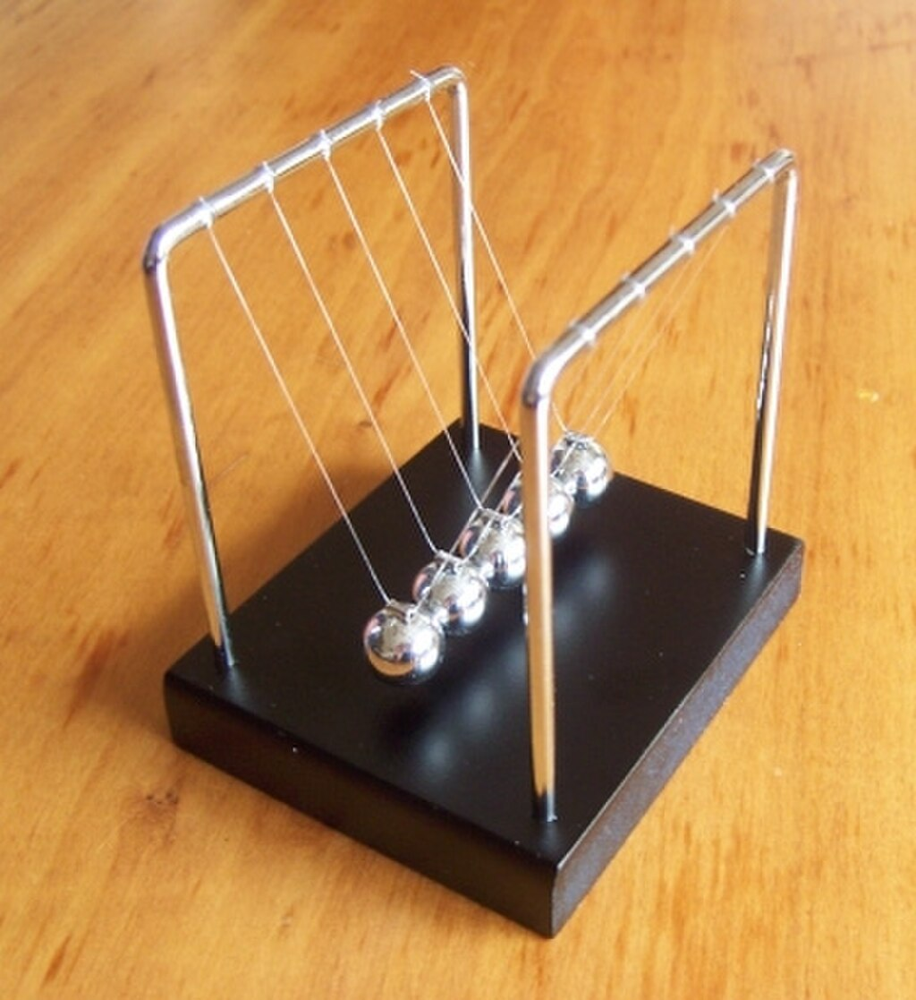

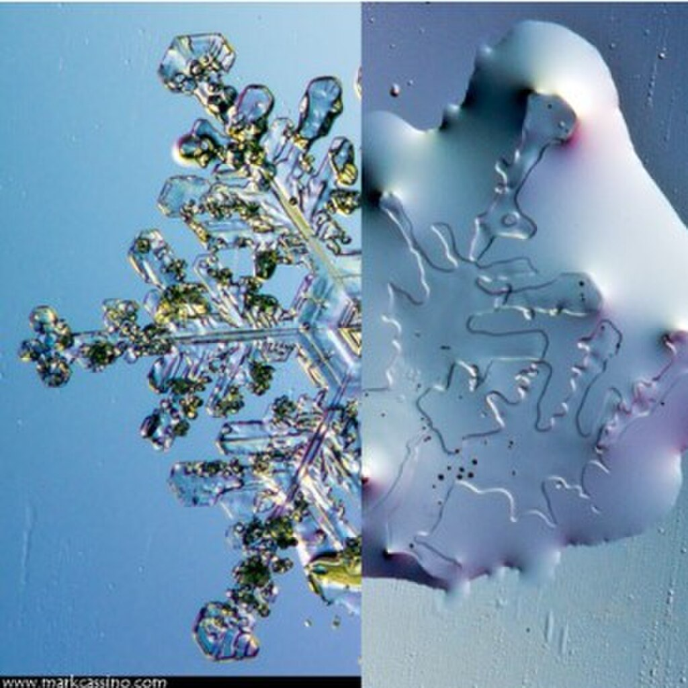

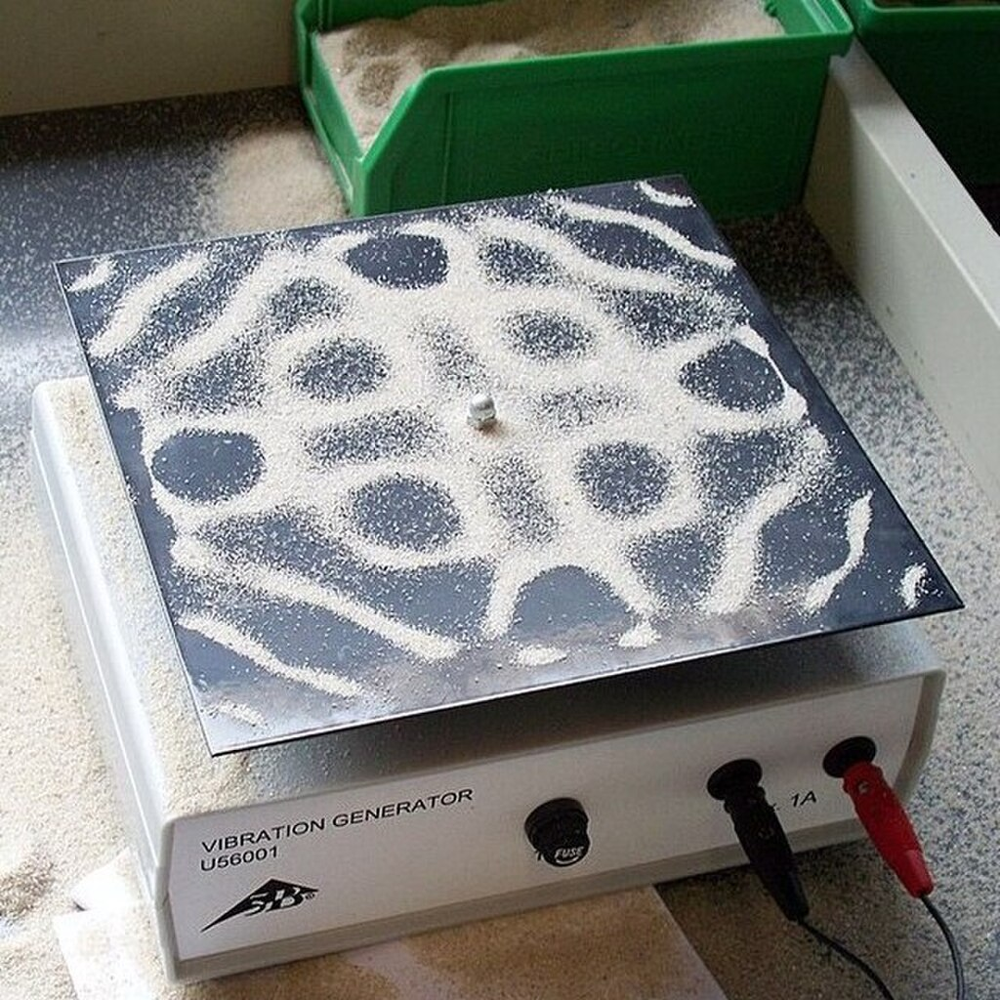

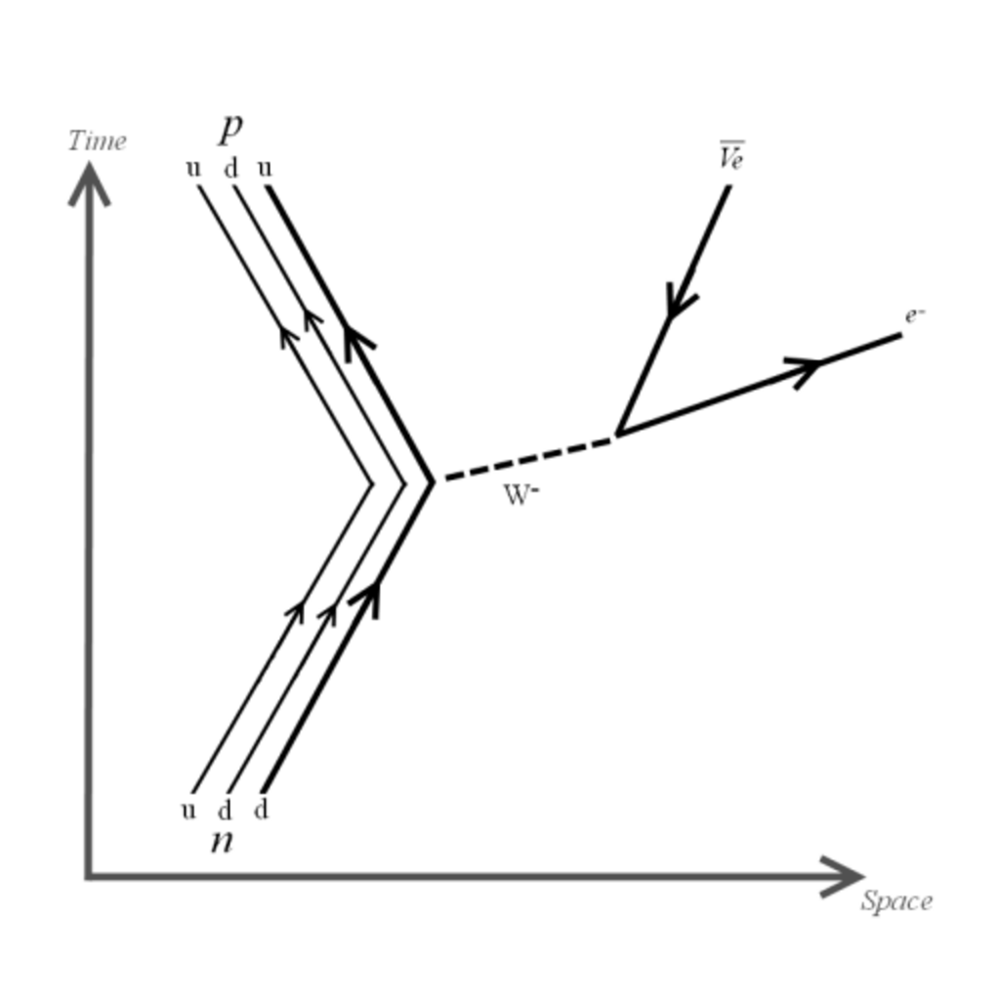

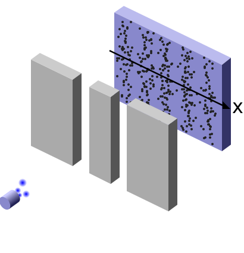

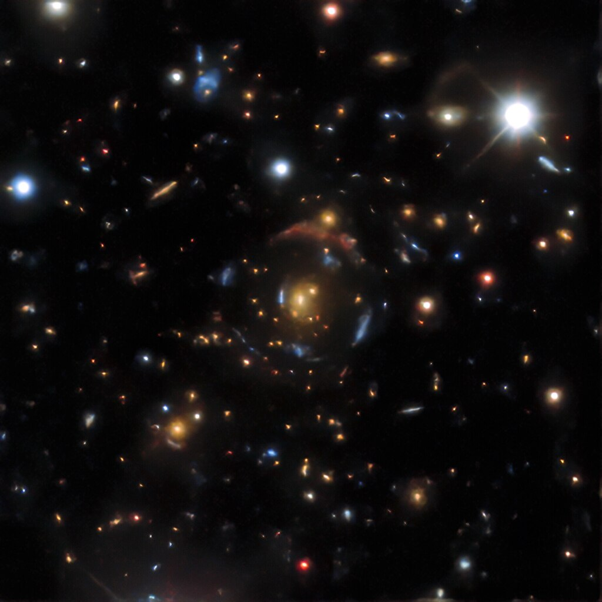

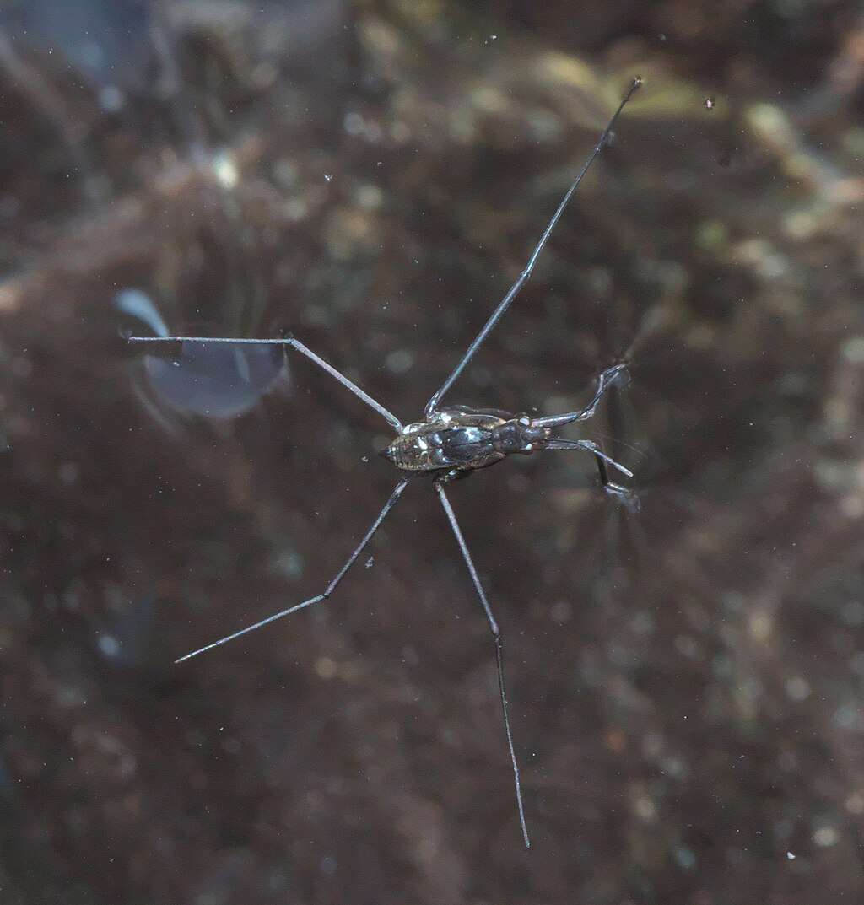

Phenomena and processes of [physics' various domains](https://en.wikipedia.org/wiki/Branches_of_physics "Branches of physics"), clockwise from the upper left : a [Newton's cradle](https://en.wikipedia.org/wiki/Newton's_cradle "Newton's cradle") (**[classical mechanics](https://en.wikipedia.org/wiki/Classical_mechanics "Classical mechanics")**), [entropic](https://en.wikipedia.org/wiki/Entropy "Entropy") changes in a [snowflake](https://en.wikipedia.org/wiki/Snowflake "Snowflake") (**[thermodynamics](https://en.wikipedia.org/wiki/Thermodynamics "Thermodynamics")**), a [Chladni figure](https://en.wikipedia.org/wiki/Chladni_figure "Chladni figure") (**[waves](https://en.wikipedia.org/wiki/Wave "Wave")**, **[oscillations](https://en.wikipedia.org/wiki/Oscillation "Oscillation")** & **[acoustics](https://en.wikipedia.org/wiki/Acoustics "Acoustics")**), the [aurora borealis](https://en.wikipedia.org/wiki/Aurora_borealis "Aurora borealis") (**[geophysics](https://en.wikipedia.org/wiki/Geophysics "Geophysics")** & **[electromagnetism](https://en.wikipedia.org/wiki/Electromagnetism "Electromagnetism")**), an insect floating across a pond (**[fluid mechanics](https://en.wikipedia.org/wiki/Fluid_mechanics "Fluid mechanics")** & **[biophysics](https://en.wikipedia.org/wiki/Biophysics "Biophysics")**), [gravitational lensing](https://en.wikipedia.org/wiki/Gravitational_lensing "Gravitational lensing") (**[astrophysics](https://en.wikipedia.org/wiki/Astrophysics "Astrophysics")**, **[optics](https://en.wikipedia.org/wiki/Optics "Optics")** & **[relativity](https://en.wikipedia.org/wiki/Theory_of_relativity "Theory of relativity")**), the [double-slit experiment](https://en.wikipedia.org/wiki/Double-slit_experiment "Double-slit experiment") (**[quantum mechanics](/source/quantum-mechanics/ "Quantum mechanics")**), and a [Feynman diagram](https://en.wikipedia.org/wiki/Feynman_diagram "Feynman diagram") of [beta decay](https://en.wikipedia.org/wiki/Beta_decay "Beta decay") (**[nuclear physics](https://en.wikipedia.org/wiki/Nuclear_physics "Nuclear physics")** & **[particle physics](https://en.wikipedia.org/wiki/Particle_physics "Particle physics")**).

**Physics** is the [scientific](https://en.wikipedia.org/wiki/Science "Science") study of [matter](https://en.wikipedia.org/wiki/Matter "Matter"), its [fundamental constituents](https://en.wikipedia.org/wiki/Elementary_particle "Elementary particle"), its [motion](https://en.wikipedia.org/wiki/Motion "Motion") and behavior through [space](https://en.wikipedia.org/wiki/Space "Space") and [time](https://en.wikipedia.org/wiki/Time "Time"), and the related entities of [energy](https://en.wikipedia.org/wiki/Energy "Energy") and [force](https://en.wikipedia.org/wiki/Force "Force"). It is one of the most fundamental scientific disciplines. A scientist who specializes in the field of physics is called a [physicist](https://en.wikipedia.org/wiki/Physicist "Physicist").

Physics is one of the oldest [academic disciplines](https://en.wikipedia.org/wiki/Academic_discipline "Academic discipline"). Over much of the past two millennia, physics, [chemistry](https://en.wikipedia.org/wiki/Chemistry "Chemistry"), [biology](https://en.wikipedia.org/wiki/Biology "Biology"), and certain branches of [mathematics](https://en.wikipedia.org/wiki/Mathematics "Mathematics") were part of [natural philosophy](https://en.wikipedia.org/wiki/Natural_philosophy "Natural philosophy"), but during the [Scientific Revolution](https://en.wikipedia.org/wiki/Scientific_Revolution "Scientific Revolution") in the 17th century, these natural sciences branched into separate research endeavors. Physics intersects with many [interdisciplinary](https://en.wikipedia.org/wiki/Interdisciplinarity "Interdisciplinarity") areas of research, such as [biophysics](https://en.wikipedia.org/wiki/Biophysics "Biophysics") and [quantum chemistry](https://en.wikipedia.org/wiki/Quantum_chemistry "Quantum chemistry"), and the boundaries of physics are not rigidly defined. New ideas in physics often explain the fundamental mechanisms studied by other sciences and suggest new avenues of research in these and other academic disciplines, such as mathematics and philosophy.

Advances in physics often enable new [technologies](https://en.wikipedia.org/wiki/Technology "Technology"). For example, advances in the understanding of [electromagnetism](https://en.wikipedia.org/wiki/Electromagnetism "Electromagnetism"), [solid-state physics](https://en.wikipedia.org/wiki/Solid-state_physics "Solid-state physics"), and [nuclear physics](https://en.wikipedia.org/wiki/Nuclear_physics "Nuclear physics") led directly to the development of technologies that have transformed modern society, such as television, computers, [domestic appliances](https://en.wikipedia.org/wiki/Domestic_appliance "Domestic appliance"), and [nuclear weapons](https://en.wikipedia.org/wiki/Nuclear_weapon "Nuclear weapon"); advances in [thermodynamics](https://en.wikipedia.org/wiki/Thermodynamics "Thermodynamics") led to the development of industrialization; and advances in [mechanics](https://en.wikipedia.org/wiki/Mechanics "Mechanics") inspired the development of [calculus](https://en.wikipedia.org/wiki/Calculus "Calculus").

## History

The word _physics_ comes from the [Latin](https://en.wikipedia.org/wiki/Latin "Latin") _physica_ ('study of nature'), which itself is a borrowing of the [Greek](https://en.wikipedia.org/wiki/Greek_language "Greek language") φυσική (_phusikḗ_ 'natural science'), a term derived from φύσις (_phúsis_ 'origin, nature, property').

### Ancient astronomy

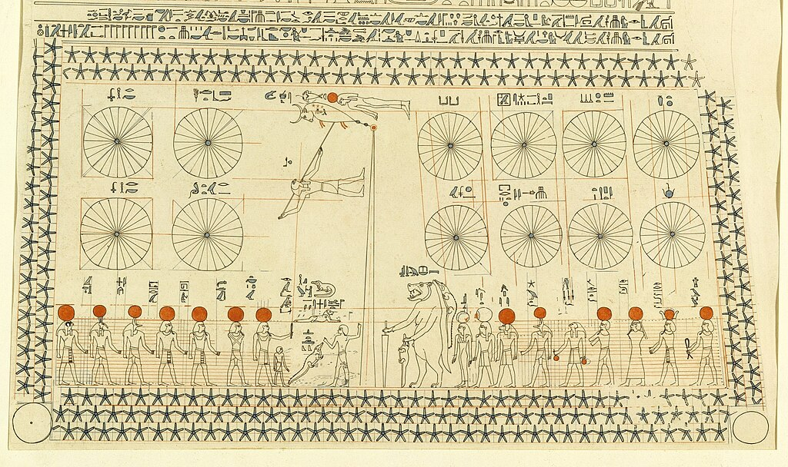Ancient [Egyptian astronomy](https://en.wikipedia.org/wiki/Egyptian_astronomy "Egyptian astronomy") is evident in monuments like the [ceiling of Senemut's tomb](https://en.wikipedia.org/wiki/Astronomical_ceiling_of_Senemut_Tomb "Astronomical ceiling of Senemut Tomb") from the [Eighteenth Dynasty of Egypt](https://en.wikipedia.org/wiki/Eighteenth_Dynasty_of_Egypt "Eighteenth Dynasty of Egypt").

[Astronomy](https://en.wikipedia.org/wiki/Astronomy "Astronomy") is one of the oldest [natural sciences](https://en.wikipedia.org/wiki/Natural_science "Natural science"). Early civilizations dating before 3000 BCE, such as the [Sumerians](https://en.wikipedia.org/wiki/Sumer "Sumer"), [ancient Egyptians](https://en.wikipedia.org/wiki/Ancient_Egypt "Ancient Egypt"), and the [Indus Valley Civilization](https://en.wikipedia.org/wiki/Indus_Valley_Civilization "Indus Valley Civilization"), had a predictive knowledge and a basic awareness of the motions of the Sun, Moon, and stars. The stars and planets, believed to represent gods, were often worshipped. While the explanations for the observed positions of the stars were often unscientific and lacking in evidence, these early observations laid the foundation for later astronomy, as the stars were found to traverse [great circles](https://en.wikipedia.org/wiki/Great_circle "Great circle") across the sky, which could not explain the positions of the [planets](https://en.wikipedia.org/wiki/Planet "Planet").

According to [Asger Aaboe](https://en.wikipedia.org/wiki/Asger_Aaboe "Asger Aaboe"), the origins of Western astronomy can be found in [Mesopotamia](https://en.wikipedia.org/wiki/Mesopotamia "Mesopotamia"), and all Western efforts in the [exact sciences](https://en.wikipedia.org/wiki/Exact_science "Exact science") are descended from late [Babylonian astronomy](https://en.wikipedia.org/wiki/Babylonian_astronomy "Babylonian astronomy"). [Egyptian astronomers](https://en.wikipedia.org/wiki/Egyptian_astronomy "Egyptian astronomy") left monuments showing knowledge of the constellations and the motions of the celestial bodies, while Greek poet [Homer](https://en.wikipedia.org/wiki/Homer "Homer") wrote of various celestial objects in his _[Iliad](https://en.wikipedia.org/wiki/Iliad "Iliad")_ and _[Odyssey](https://en.wikipedia.org/wiki/Odyssey "Odyssey")_; later [Greek astronomers](https://en.wikipedia.org/wiki/Greek_astronomy "Greek astronomy") provided names, which are still used today, for most constellations visible from the [Northern Hemisphere](https://en.wikipedia.org/wiki/Northern_Hemisphere "Northern Hemisphere").

### Natural philosophy

[Natural philosophy](https://en.wikipedia.org/wiki/Natural_philosophy "Natural philosophy") has its origins in [Greece](https://en.wikipedia.org/wiki/Greece "Greece") during the [Archaic period](https://en.wikipedia.org/wiki/Archaic_Greece "Archaic Greece") (650 BCE – 480 BCE), when [pre-Socratic philosophers](https://en.wikipedia.org/wiki/Presocratics "Presocratics") like [Thales](https://en.wikipedia.org/wiki/Thales "Thales") rejected [non-naturalistic](https://en.wikipedia.org/wiki/Methodological_naturalism "Methodological naturalism") explanations for natural phenomena and proclaimed that every event had a natural cause. They proposed ideas verified by reason and observation, and many of their hypotheses proved successful in experiment; for example, [atomism](https://en.wikipedia.org/wiki/Atomism "Atomism") was found to be correct approximately 2000 years after it was proposed by [Leucippus](https://en.wikipedia.org/wiki/Leucippus "Leucippus") and his pupil [Democritus](https://en.wikipedia.org/wiki/Democritus "Democritus").

### Aristotle and Hellenistic physics

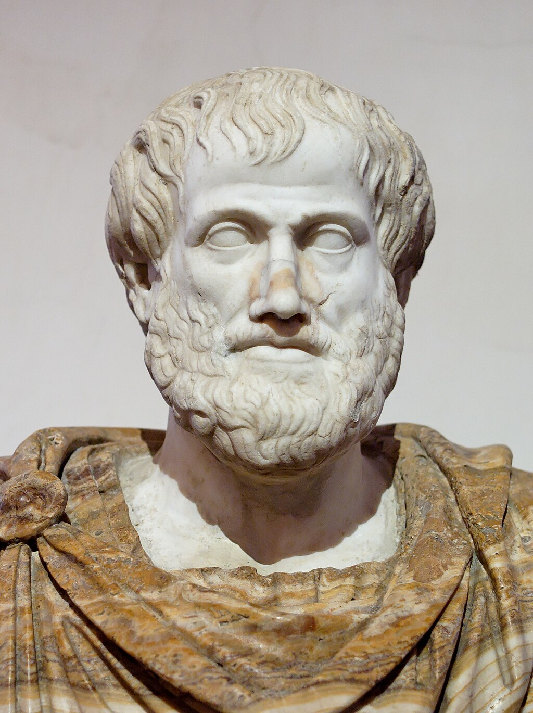[Aristotle](https://en.wikipedia.org/wiki/Aristotle "Aristotle") (384–322 [BCE](https://en.wikipedia.org/wiki/BCE "BCE"))

During the [classical period](https://en.wikipedia.org/wiki/Classical_Greece "Classical Greece") in Greece (6th, 5th and 4th centuries BCE) and in [Hellenistic times](https://en.wikipedia.org/wiki/Hellenistic_civilization "Hellenistic civilization"), natural philosophy developed along many lines of inquiry. [Aristotle](https://en.wikipedia.org/wiki/Aristotle "Aristotle") ([Greek](https://en.wikipedia.org/wiki/Greek_language "Greek language"): Ἀριστοτέλης, _Aristotélēs_) (384–322 BCE), a student of [Plato](https://en.wikipedia.org/wiki/Plato "Plato"), wrote on many subjects, including a substantial treatise on "[Physics](https://en.wikipedia.org/wiki/Physics_\(Aristotle\) "Physics (Aristotle)")" – in the 4th century BC. [Aristotelian physics](https://en.wikipedia.org/wiki/Aristotelian_physics "Aristotelian physics") was influential for about two millennia. His approach mixed some limited observation with logical deductive arguments, but did not rely on experimental verification of deduced statements. Aristotle's foundational work in Physics, though very imperfect, formed a framework against which later thinkers further developed the field. His approach is entirely superseded today.

He explained ideas such as [motion](https://en.wikipedia.org/wiki/Motion_\(physics\) "Motion (physics)") (and [gravity](https://en.wikipedia.org/wiki/Gravity "Gravity")) with the theory of [four elements](https://en.wikipedia.org/wiki/Classical_elements "Classical elements"). Aristotle believed that each of the four classical elements (air, fire, water, earth) had its own natural place. Because of their differing densities, each element will revert to its own specific place in the atmosphere. So, because of their weights, fire would be at the top, air underneath fire, then water, then lastly earth. He also stated that when a small amount of one element enters the natural place of another, the less abundant element will automatically go towards its own natural place. For example, if there is a fire on the ground, the flames go up into the air in an attempt to go back into its natural place where it belongs. His laws of motion included: that heavier objects will fall faster, the speed being proportional to the weight and the speed of the object that is falling depends inversely on the density object it is falling through (e.g. density of air). He also stated that, when it comes to violent motion (motion of an object when a force is applied to it by a second object), the speed that object moves will only be as fast or strong as the measure of force applied to it. The problem of motion and its causes was studied carefully, leading to the philosophical notion of a "[prime mover](https://en.wikipedia.org/wiki/Unmoved_mover "Unmoved mover")" as the ultimate source of all motion in the world (Book 8 of his treatise _[Physics](https://en.wikipedia.org/wiki/Physics_\(Aristotle\) "Physics (Aristotle)")_).

### Medieval European and Islamic

[Ibn al-Haytham](https://en.wikipedia.org/wiki/Ibn_al-Haytham "Ibn al-Haytham") (c. 965 – c. 1040) wrote of his _camera obscura_ experiments in the _Book of Optics_.

The [Western Roman Empire](https://en.wikipedia.org/wiki/Western_Roman_Empire "Western Roman Empire") fell to invaders and internal decay in the fifth century, resulting in a decline in intellectual pursuits in western Europe. By contrast, the Eastern Roman Empire (usually known as the [Byzantine Empire](https://en.wikipedia.org/wiki/Byzantine_Empire "Byzantine Empire")) resisted the attacks from invaders and continued to advance various fields of learning, including physics. In the sixth century, [John Philoponus](https://en.wikipedia.org/wiki/John_Philoponus "John Philoponus") challenged the dominant Aristotelian approach to science although much of his work was focused on Christian theology.

In the sixth century, [Isidore of Miletus](https://en.wikipedia.org/wiki/Isidore_of_Miletus "Isidore of Miletus") created an important compilation of [Archimedes](https://en.wikipedia.org/wiki/Archimedes "Archimedes")' works that are copied in the [Archimedes Palimpsest](https://en.wikipedia.org/wiki/Archimedes_Palimpsest "Archimedes Palimpsest"). [Islamic scholarship](https://en.wikipedia.org/wiki/Science_in_the_medieval_Islamic_world "Science in the medieval Islamic world") inherited [Aristotelian physics](https://en.wikipedia.org/wiki/Aristotelian_physics "Aristotelian physics") from the Greeks and during the [Islamic Golden Age](https://en.wikipedia.org/wiki/Islamic_Golden_Age "Islamic Golden Age") developed it further.

The most notable innovations under Islamic scholarship were in the field of [optics](https://en.wikipedia.org/wiki/Optics "Optics") and vision, which came from the works of many scientists like [Ibn Sahl](https://en.wikipedia.org/wiki/Ibn_Sahl_\(mathematician\) "Ibn Sahl (mathematician)"), [Al-Kindi](https://en.wikipedia.org/wiki/Al-Kindi "Al-Kindi"), [Ibn al-Haytham](https://en.wikipedia.org/wiki/Ibn_al-Haytham "Ibn al-Haytham"), [Al-Farisi](https://en.wikipedia.org/wiki/Kamāl_al-Dīn_al-Fārisī "Kamāl al-Dīn al-Fārisī") and [Avicenna](https://en.wikipedia.org/wiki/Avicenna "Avicenna"). In his Book of Optics (also known as Kitāb al-Manāẓir) Ibn al-Haytham presented the idea of light rays as an alternative to the ancient Greek idea about visual rays. Like Ptolemy, Ibn al-Haytham applied controlled experiments, verifying the laws of refraction and reflection with the new concept of light rays, but still lacking the concept of image formation.

The basic way camera obscura works

### Scientific Revolution

Physics became a separate science when [early modern Europeans](https://en.wikipedia.org/wiki/Early_modern_Europe "Early modern Europe") used experimental and quantitative methods to discover what are now considered to be the [laws of physics](https://en.wikipedia.org/wiki/Laws_of_physics "Laws of physics").

Major developments in this period include the replacement of the [geocentric model](https://en.wikipedia.org/wiki/Geocentric_model "Geocentric model") of the [Solar System](https://en.wikipedia.org/wiki/Solar_System "Solar System") with the heliocentric [Copernican model](https://en.wikipedia.org/wiki/Copernican_model "Copernican model"), the [laws governing the motion of planetary bodies](https://en.wikipedia.org/wiki/Kepler's_laws "Kepler's laws") (determined by [Johannes Kepler](https://en.wikipedia.org/wiki/Johannes_Kepler "Johannes Kepler") between 1609 and 1619), Galileo's pioneering work on [telescopes](https://en.wikipedia.org/wiki/Telescope "Telescope") and [observational astronomy](https://en.wikipedia.org/wiki/Observational_astronomy "Observational astronomy") in the 16th and 17th centuries, and [Isaac Newton](https://en.wikipedia.org/wiki/Isaac_Newton "Isaac Newton")'s discovery and unification of the [laws of motion](https://en.wikipedia.org/wiki/Newton's_laws_of_motion "Newton's laws of motion") and [universal gravitation](https://en.wikipedia.org/wiki/Newton's_law_of_universal_gravitation "Newton's law of universal gravitation") (that would come to bear his name). Newton, and separately [Gottfried Wilhelm Leibniz](https://en.wikipedia.org/wiki/Gottfried_Wilhelm_Leibniz "Gottfried Wilhelm Leibniz"), developed [calculus](https://en.wikipedia.org/wiki/Calculus "Calculus"), the mathematical study of continuous change, and Newton applied it to solve physical problems.

*   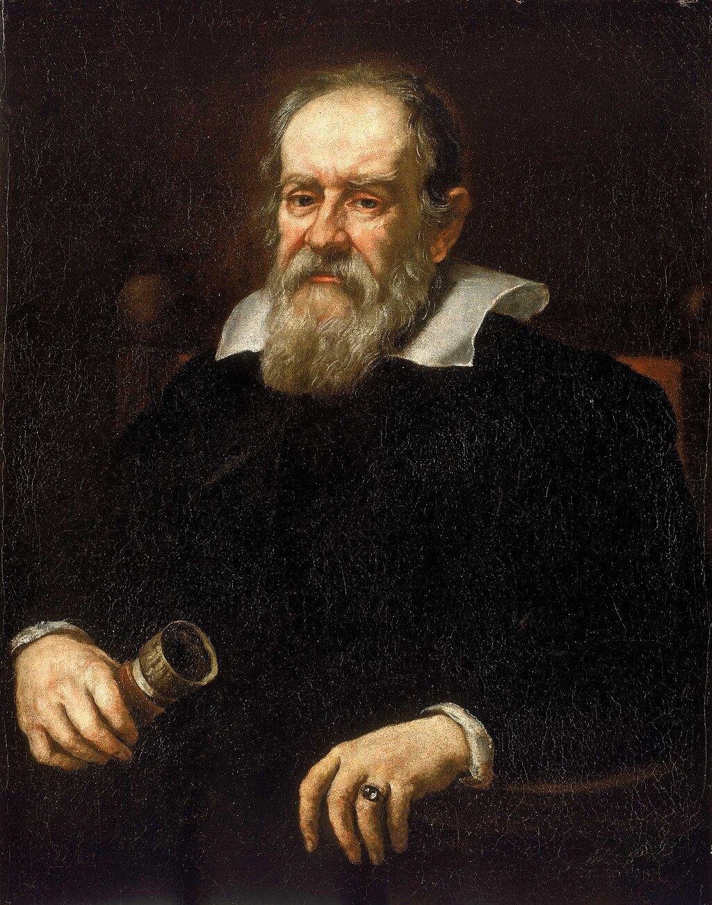

    [Galileo Galilei](https://en.wikipedia.org/wiki/Galileo_Galilei "Galileo Galilei") (1564–1642) related mathematics, theoretical physics, and experimental physics

*   

    [Johannes Kepler](https://en.wikipedia.org/wiki/Johannes_Kepler "Johannes Kepler") (1571–1630) explained [planetary motions](https://en.wikipedia.org/wiki/Kepler's_laws "Kepler's laws"), formulating the first "natural laws" in the modern sense

*   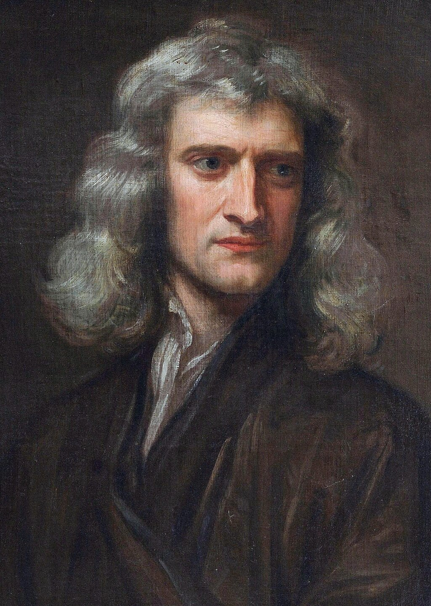

    [Isaac Newton](https://en.wikipedia.org/wiki/Isaac_Newton "Isaac Newton") discovered the [laws of motion](https://en.wikipedia.org/wiki/Newton's_laws_of_motion "Newton's laws of motion") and [universal gravitation](https://en.wikipedia.org/wiki/Newton's_law_of_universal_gravitation "Newton's law of universal gravitation")

### 19th century

The discovery of laws in [thermodynamics](https://en.wikipedia.org/wiki/Thermodynamics "Thermodynamics"), [chemistry](https://en.wikipedia.org/wiki/Chemistry "Chemistry"), and [electromagnetics](https://en.wikipedia.org/wiki/Electromagnetics "Electromagnetics") resulted from research efforts during the [Industrial Revolution](https://en.wikipedia.org/wiki/Industrial_Revolution "Industrial Revolution") as energy needs increased. By the end of the 19th century, theories of thermodynamics, [mechanics](https://en.wikipedia.org/wiki/Classical_mechanics "Classical mechanics"), and electromagnetics matched a wide variety of observations. Taken together these theories became the basis for what would later be called [classical physics](https://en.wikipedia.org/wiki/Classical_physics "Classical physics").

A few experimental results remained inexplicable. Classical electromagnetism presumed a medium, an [luminiferous aether](https://en.wikipedia.org/wiki/Luminiferous_aether "Luminiferous aether") to support the propagation of waves, but this medium could not be detected. The intensity of light from hot glowing [blackbody](https://en.wikipedia.org/wiki/Blackbody_radiation "Blackbody radiation") objects did not match the predictions of thermodynamics and electromagnetism. The character of [electron emission](https://en.wikipedia.org/wiki/Photoelectric_effect "Photoelectric effect") of illuminated metals differed from predictions. These failures, seemingly insignificant in the big picture would upset the physics world in first two decades of the 20th century.

### 20th century

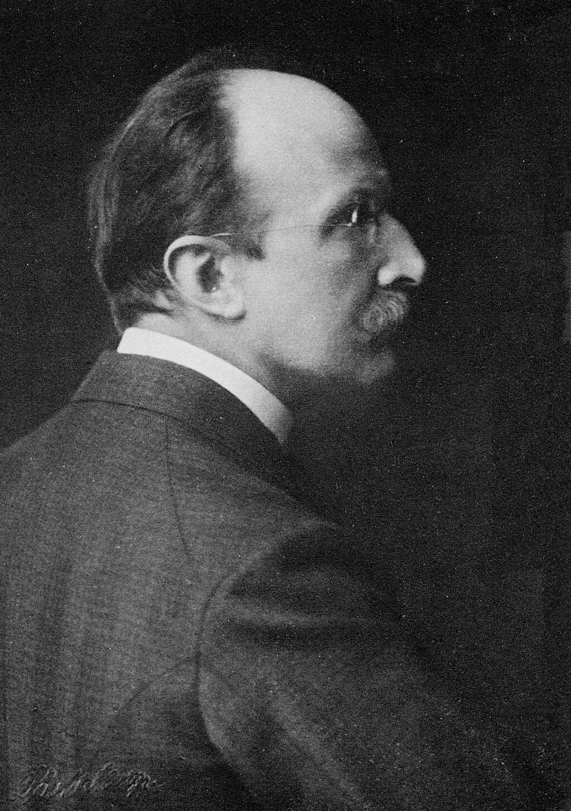[Max Planck](https://en.wikipedia.org/wiki/Max_Planck "Max Planck") (1858–1947), proposed [quanta](https://en.wikipedia.org/wiki/Quantum "Quantum") to explain the [blackbody spectrum](https://en.wikipedia.org/wiki/Blackbody_spectrum "Blackbody spectrum"), originating [quantum theory](/source/quantum-mechanics/ "Quantum mechanics").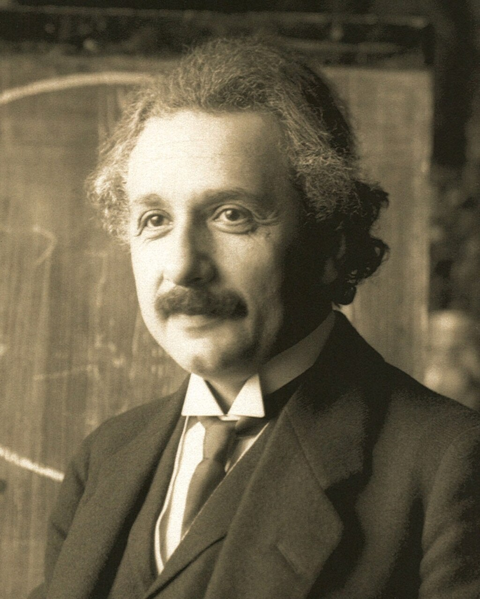[Albert Einstein](https://en.wikipedia.org/wiki/Albert_Einstein "Albert Einstein") (1879–1955), discovered the [photoelectric effect](https://en.wikipedia.org/wiki/Photoelectric_effect "Photoelectric effect") and [theory of relativity](https://en.wikipedia.org/wiki/Theory_of_relativity "Theory of relativity").

[Modern physics](https://en.wikipedia.org/wiki/Modern_physics "Modern physics") began in the early 20th century with the work of [Max Planck](https://en.wikipedia.org/wiki/Max_Planck "Max Planck") in quantum theory and [Albert Einstein](https://en.wikipedia.org/wiki/Albert_Einstein "Albert Einstein")'s theory of relativity. Both of these theories came about due to inaccuracies in classical mechanics in certain situations. [Classical mechanics](https://en.wikipedia.org/wiki/Classical_mechanics "Classical mechanics") predicted that the [speed of light](https://en.wikipedia.org/wiki/Speed_of_light "Speed of light") depends on the motion of the observer, which could not be resolved with the constant speed predicted by [Maxwell's equations](https://en.wikipedia.org/wiki/Maxwell's_equations "Maxwell's equations") of electromagnetism. This discrepancy was corrected by Einstein's theory of [special relativity](https://en.wikipedia.org/wiki/Special_relativity "Special relativity"), which replaced classical mechanics for fast-moving bodies and allowed for a constant speed of light. [Black-body radiation](https://en.wikipedia.org/wiki/Black-body_radiation "Black-body radiation") provided another problem for classical physics, which was corrected when Planck proposed that the excitation of material oscillators is possible only in discrete steps proportional to their [frequency](https://en.wikipedia.org/wiki/Frequency "Frequency"). This, along with the [photoelectric effect](https://en.wikipedia.org/wiki/Photoelectric_effect "Photoelectric effect") and a complete theory predicting discrete [energy levels](https://en.wikipedia.org/wiki/Energy_levels "Energy levels") of [electron orbitals](https://en.wikipedia.org/wiki/Atomic_orbital "Atomic orbital"), led to the theory of quantum mechanics improving on classical physics at very small scales.

Quantum mechanics would come to be pioneered by [Werner Heisenberg](https://en.wikipedia.org/wiki/Werner_Heisenberg "Werner Heisenberg"), [Erwin Schrödinger](https://en.wikipedia.org/wiki/Erwin_Schrödinger "Erwin Schrödinger") and [Paul Dirac](https://en.wikipedia.org/wiki/Paul_Dirac "Paul Dirac"). From this early work, and work in related fields, the [Standard Model of particle physics](https://en.wikipedia.org/wiki/Standard_Model_of_particle_physics "Standard Model of particle physics") was derived. Following the discovery of a particle with properties consistent with the [Higgs boson](https://en.wikipedia.org/wiki/Higgs_boson "Higgs boson") at [CERN](https://en.wikipedia.org/wiki/CERN "CERN") in 2012, all [fundamental particles](https://en.wikipedia.org/wiki/Fundamental_particles "Fundamental particles") predicted by the Standard Model, and no others, appear to exist; however, [physics beyond the Standard Model](https://en.wikipedia.org/wiki/Physics_beyond_the_Standard_Model "Physics beyond the Standard Model"), with theories such as [supersymmetry](/source/supersymmetry/ "Supersymmetry"), is an active area of research. Areas of mathematics in general are important to this field, such as the study of [probabilities](https://en.wikipedia.org/wiki/Probability_amplitude "Probability amplitude") and [groups](/source/group-theory/#Physics "Group theory").

## Core theories

Physics deals with a wide variety of systems, although certain theories are used by all physicists. Each of these theories was experimentally tested numerous times and found to be an adequate approximation of nature. These central theories are important tools for research into more specialized topics, and any physicist, regardless of their specialization, is expected to be literate in them. These include classical mechanics, quantum mechanics, thermodynamics and [statistical mechanics](https://en.wikipedia.org/wiki/Statistical_mechanics "Statistical mechanics"), [electromagnetism](https://en.wikipedia.org/wiki/Electromagnetism "Electromagnetism"), and special relativity.

### Distinction between classical and modern physics

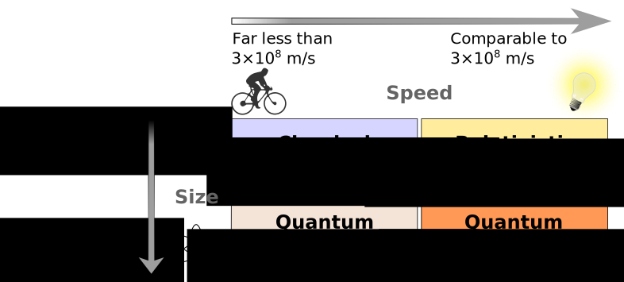Classical mechanics works for larger and slower objects; modern theories are needed otherwise.

In the first decades of the 20th century physics was revolutionized by the discoveries of quantum mechanics and relativity. The changes were so fundamental that these new concepts became the foundation of "modern physics", with other topics becoming "classical physics". The majority of applications of physics are essentially classical. The laws of classical physics accurately describe systems whose important length scales are greater than the atomic scale and whose motions are much slower than the speed of light. Outside of this domain, observations do not match predictions provided by classical mechanics.

### Classical theory

Classical physics includes the traditional branches and topics that were recognized and well-developed before the beginning of the 20th century—classical mechanics, thermodynamics, and electromagnetism. Classical mechanics is concerned with bodies acted on by [forces](https://en.wikipedia.org/wiki/Force "Force") and bodies in [motion](https://en.wikipedia.org/wiki/Motion_\(physics\) "Motion (physics)") and may be divided into [statics](https://en.wikipedia.org/wiki/Statics "Statics") (study of the forces on a body or bodies not subject to an acceleration), [kinematics](https://en.wikipedia.org/wiki/Kinematics "Kinematics") (study of motion without regard to its causes), and [dynamics](https://en.wikipedia.org/wiki/Analytical_dynamics "Analytical dynamics") (study of motion and the forces that affect it); mechanics may also be divided into [solid mechanics](https://en.wikipedia.org/wiki/Solid_mechanics "Solid mechanics") and [fluid mechanics](https://en.wikipedia.org/wiki/Fluid_mechanics "Fluid mechanics") (known together as [continuum mechanics](https://en.wikipedia.org/wiki/Continuum_mechanics "Continuum mechanics")), the latter include such branches as [hydrostatics](https://en.wikipedia.org/wiki/Hydrostatics "Hydrostatics"), [hydrodynamics](https://en.wikipedia.org/wiki/Fluid_dynamics "Fluid dynamics") and [pneumatics](https://en.wikipedia.org/wiki/Pneumatics "Pneumatics"). Acoustics is the study of how sound is produced, controlled, transmitted and received. Important modern branches of acoustics include [ultrasonics](https://en.wikipedia.org/wiki/Ultrasonics "Ultrasonics"), the study of sound waves of very high frequency beyond the range of human hearing; [bioacoustics](https://en.wikipedia.org/wiki/Bioacoustics "Bioacoustics"), the physics of animal calls and hearing; and [electroacoustics](https://en.wikipedia.org/wiki/Electroacoustics "Electroacoustics"), the manipulation of audible sound waves using electronics.

Optics, the study of light, is concerned not only with [visible light](https://en.wikipedia.org/wiki/Visible_light "Visible light") but also with [infrared](https://en.wikipedia.org/wiki/Infrared "Infrared") and [ultraviolet radiation](https://en.wikipedia.org/wiki/Ultraviolet_radiation "Ultraviolet radiation"), which exhibit all of the phenomena of visible light except visibility, e.g., reflection, refraction, interference, diffraction, dispersion, and polarization of light. Heat is a form of energy, the internal energy possessed by the particles of which a substance is composed; thermodynamics deals with the relationships between heat and other forms of energy. Electricity and [magnetism](https://en.wikipedia.org/wiki/Magnetism "Magnetism") have been studied as a single branch of physics since the intimate connection between them was discovered in the early 19th century; an [electric current](https://en.wikipedia.org/wiki/Electric_current "Electric current") gives rise to a [magnetic field](https://en.wikipedia.org/wiki/Magnetic_field "Magnetic field"), and a changing magnetic field induces an electric current. [Electrostatics](https://en.wikipedia.org/wiki/Electrostatics "Electrostatics") deals with [electric charges](https://en.wikipedia.org/wiki/Electric_charge "Electric charge") at rest, [electrodynamics](https://en.wikipedia.org/wiki/Classical_electromagnetism "Classical electromagnetism") with moving charges, and [magnetostatics](https://en.wikipedia.org/wiki/Magnetostatics "Magnetostatics") with magnetic poles at rest.

### Modern theory

The discovery of relativity and of quantum mechanics in the first decades of the 20th century transformed the conceptual basis of physics without reducing the practical value of most of the physical theories developed up to that time. Consequently the topics of physics have come to be divided into "classical physics" and "modern physics", with the latter category including effects related to quantum mechanics and relativity. Classical physics is generally concerned with matter and energy on the normal scale of observation, while much of modern physics is concerned with the behavior of matter and energy under extreme conditions or on a very large or very small scale. For example, [atomic](https://en.wikipedia.org/wiki/Atomic_physics "Atomic physics") and [nuclear physics](https://en.wikipedia.org/wiki/Nuclear_physics "Nuclear physics") study matter on the smallest scale at which [chemical elements](https://en.wikipedia.org/wiki/Chemical_element "Chemical element") can be identified. The [physics of elementary particles](https://en.wikipedia.org/wiki/Particle_physics "Particle physics") is on an even smaller scale since it is concerned with the most basic units of matter; this branch of physics is also known as high-energy physics because of the extremely high energies necessary to produce many types of particles in [particle accelerators](https://en.wikipedia.org/wiki/Particle_accelerator "Particle accelerator"). On this scale, ordinary, commonsensical notions of space, time, matter, and energy are no longer valid.

The two chief theories of modern physics present a different picture of the concepts of space, time, and matter from that presented by classical physics. Classical mechanics approximates nature as continuous, while quantum theory is concerned with the discrete nature of many phenomena at the atomic and subatomic level and with the complementary aspects of particles and waves in the description of such phenomena. The theory of relativity is concerned with the description of phenomena that take place in a [frame of reference](https://en.wikipedia.org/wiki/Frame_of_reference "Frame of reference") that is in motion with respect to an observer; the special theory of relativity is concerned with motion in the absence of gravitational fields and the [general theory of relativity](/source/general-relativity/ "General relativity") with motion and its connection with [gravitation](https://en.wikipedia.org/wiki/Gravitation "Gravitation"). Both quantum theory and the theory of relativity find applications in many areas of modern physics.

Fundamental concepts in modern physics include:

*   [Action](https://en.wikipedia.org/wiki/Action_\(physics\) "Action (physics)")
*   [Causality](https://en.wikipedia.org/wiki/Causality_\(physics\) "Causality (physics)")
*   [Covariance](https://en.wikipedia.org/wiki/Principle_of_covariance "Principle of covariance")
*   [Particle](https://en.wikipedia.org/wiki/Particle "Particle")
*   [Physical field](https://en.wikipedia.org/wiki/Physical_field "Physical field")
*   [Physical interaction](https://en.wikipedia.org/wiki/Physical_interaction "Physical interaction")
*   [Quantum](https://en.wikipedia.org/wiki/Quantum "Quantum")
*   [Statistical ensemble](https://en.wikipedia.org/wiki/Statistical_ensemble "Statistical ensemble")
*   [Symmetry](https://en.wikipedia.org/wiki/Symmetry_\(physics\) "Symmetry (physics)")
*   [Wave](https://en.wikipedia.org/wiki/Wave "Wave")

## Research

### Scientific method

Physicists use the scientific method to test the validity of a [physical theory](https://en.wikipedia.org/wiki/Physical_theory "Physical theory"). By using a methodical approach to compare the implications of a theory with the conclusions drawn from its related experiments and observations, physicists are better able to test the validity of a theory in a logical, unbiased, and repeatable way. To that end, experiments are performed and observations are made in order to determine the validity or invalidity of a [theory](https://en.wikipedia.org/wiki/Theory "Theory").

A scientific law is a concise verbal or mathematical statement of a relation that expresses a fundamental principle of some theory, such as Newton's law of universal gravitation.

### Theory and experiment

The [astronaut](https://en.wikipedia.org/wiki/Astronaut "Astronaut") and Earth are both in [free fall](https://en.wikipedia.org/wiki/Free_fall "Free fall"). (Pictured: Astronaut Bruce McCandless.) [Lightning](https://en.wikipedia.org/wiki/Lightning "Lightning") is an [electric current](https://en.wikipedia.org/wiki/Electric_current "Electric current")

Theorists seek to develop [mathematical models](https://en.wikipedia.org/wiki/Mathematical_model "Mathematical model") that both agree with existing experiments and successfully predict future experimental results, while [experimentalists](https://en.wikipedia.org/wiki/Experimentalism "Experimentalism") devise and perform experiments to test theoretical predictions and explore new phenomena. Although [theory](https://en.wikipedia.org/wiki/Theory "Theory") and experiment are developed separately, they strongly affect and depend upon each other. Progress in physics frequently comes about when experimental results defy explanation by existing theories, prompting intense focus on applicable modeling, and when new theories generate experimentally testable [predictions](https://en.wikipedia.org/wiki/Prediction "Prediction"), which inspire the development of new experiments (and often related equipment).

[Physicists](https://en.wikipedia.org/wiki/Physicist "Physicist") who work at the interplay of theory and experiment are called [phenomenologists](https://en.wikipedia.org/wiki/Phenomenology_\(particle_physics\) "Phenomenology (particle physics)"), who study complex phenomena observed in experiment and work to relate them to a [fundamental theory](https://en.wikipedia.org/wiki/Theory_of_everything "Theory of everything").

Theoretical physics has historically taken inspiration from philosophy; electromagnetism was unified this way. Beyond the known universe, the field of theoretical physics also deals with hypothetical issues, such as [parallel universes](https://en.wikipedia.org/wiki/Many-worlds_interpretation "Many-worlds interpretation"), a [multiverse](https://en.wikipedia.org/wiki/Multiverse "Multiverse"), and [higher dimensions](https://en.wikipedia.org/wiki/Higher_dimension "Higher dimension"). Theorists invoke these ideas in hopes of solving particular problems with existing theories; they then explore the consequences of these ideas and work toward making testable predictions.

Experimental physics expands, and is expanded by, engineering and technology. Experimental physicists who are involved in [basic research](https://en.wikipedia.org/wiki/Basic_research "Basic research") design and perform experiments with equipment such as particle accelerators and [lasers](https://en.wikipedia.org/wiki/Laser "Laser"), whereas those involved in [applied research](https://en.wikipedia.org/wiki/Applied_research "Applied research") often work in industry, developing technologies such as [magnetic resonance imaging](https://en.wikipedia.org/wiki/Magnetic_resonance_imaging "Magnetic resonance imaging") (MRI) and [transistors](https://en.wikipedia.org/wiki/Transistor "Transistor"). [Feynman](https://en.wikipedia.org/wiki/Richard_Feynman "Richard Feynman") has noted that experimentalists may seek areas that have not been explored well by theorists.

### Scope and aims

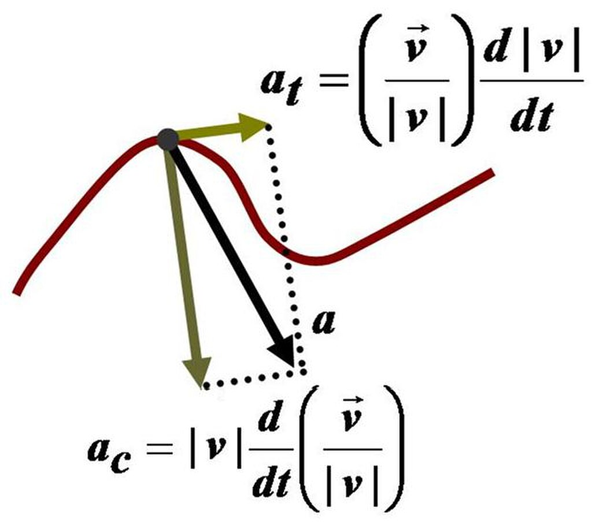Physics involves modeling the natural world with theory, usually quantitative. Here, the path of a particle is modeled with the mathematics of [calculus](https://en.wikipedia.org/wiki/Calculus "Calculus") to explain its behavior: the purview of the branch of physics known as [mechanics](https://en.wikipedia.org/wiki/Mechanics "Mechanics").

Physics covers a wide range of [phenomena](https://en.wikipedia.org/wiki/Phenomenon "Phenomenon"), from [elementary particles](https://en.wikipedia.org/wiki/Elementary_particle "Elementary particle") (such as [quarks](https://en.wikipedia.org/wiki/Quark "Quark"), [neutrinos](https://en.wikipedia.org/wiki/Neutrino "Neutrino"), and [electrons](https://en.wikipedia.org/wiki/Electron "Electron")) to the largest [superclusters](https://en.wikipedia.org/wiki/Supercluster "Supercluster") of galaxies. Included in these phenomena are the most basic objects composing all other things. Therefore, physics is sometimes called the "fundamental science". Physics aims to describe the various phenomena that occur in nature in terms of simpler phenomena. Thus, physics aims to both connect the things observable to humans to root causes, and then connect these causes together.

For example, the [ancient Chinese](https://en.wikipedia.org/wiki/History_of_China "History of China") observed that certain rocks ([lodestone](https://en.wikipedia.org/wiki/Lodestone "Lodestone") and [magnetite](https://en.wikipedia.org/wiki/Magnetite "Magnetite")) were attracted to one another by an invisible force. This effect was later called magnetism, which was first rigorously studied in the 17th century. But even before the Chinese discovered magnetism, the [ancient Greeks](https://en.wikipedia.org/wiki/Ancient_Greece "Ancient Greece") knew of other objects such as [amber](https://en.wikipedia.org/wiki/Amber "Amber"), that when rubbed with fur would cause a similar invisible attraction between the two. This was also first studied rigorously in the 17th century and came to be called electricity. Thus, physics had come to understand two observations of nature in terms of some root cause (electricity and magnetism). However, further work in the 19th century revealed that these two forces were just two different aspects of one force—[electromagnetism](https://en.wikipedia.org/wiki/Electromagnetism "Electromagnetism"). This process of "unifying" forces continues today, and electromagnetism and the [weak nuclear force](https://en.wikipedia.org/wiki/Weak_nuclear_force "Weak nuclear force") are now considered to be two aspects of the [electroweak interaction](https://en.wikipedia.org/wiki/Electroweak_interaction "Electroweak interaction"). Physics hopes to find an ultimate reason (theory of everything) for why nature is as it is (see section _[Current research](/source/physics/#Current_research)_ below for more information).

### Current research

[Feynman diagram](https://en.wikipedia.org/wiki/Feynman_diagram "Feynman diagram") signed by [R. P. Feynman](https://en.wikipedia.org/wiki/R._P._Feynman "R. P. Feynman")A typical phenomenon described by physics: a [magnet](https://en.wikipedia.org/wiki/Magnet "Magnet") levitating above a [superconductor](https://en.wikipedia.org/wiki/Superconductor "Superconductor") demonstrates the [Meissner effect](https://en.wikipedia.org/wiki/Meissner_effect "Meissner effect").

Research in physics is continually progressing on a large number of fronts.

In condensed matter physics, an important unsolved theoretical problem is that of [high-temperature superconductivity](https://en.wikipedia.org/wiki/High-temperature_superconductivity "High-temperature superconductivity"). Many condensed matter experiments are aiming to fabricate workable [spintronics](https://en.wikipedia.org/wiki/Spintronics "Spintronics") and [quantum computers](https://en.wikipedia.org/wiki/Quantum_computer "Quantum computer").

In particle physics, the first pieces of experimental evidence for physics beyond the Standard Model have begun to appear. Foremost among these are indications that [neutrinos](https://en.wikipedia.org/wiki/Neutrino "Neutrino") have non-zero [mass](https://en.wikipedia.org/wiki/Mass "Mass"). These experimental results appear to have solved the long-standing [solar neutrino problem](https://en.wikipedia.org/wiki/Solar_neutrino_problem "Solar neutrino problem"), and the physics of massive neutrinos remains an area of active theoretical and experimental research. The Large Hadron Collider has already found the Higgs boson, but future research aims to prove or disprove the [supersymmetry](/source/supersymmetry/ "Supersymmetry"), which extends the Standard Model of particle physics. Research on the nature of the major mysteries of dark matter and [dark energy](https://en.wikipedia.org/wiki/Dark_energy "Dark energy") is also currently ongoing.

Although much progress has been made in high-energy, [quantum](https://en.wikipedia.org/wiki/Quantum "Quantum"), and astronomical physics, many everyday phenomena involving [complexity](https://en.wikipedia.org/wiki/Complex_system "Complex system"), chaos, or [turbulence](https://en.wikipedia.org/wiki/Turbulence "Turbulence") are still poorly understood. Complex problems that seem like they could be solved by a clever application of dynamics and mechanics remain unsolved; examples include the formation of sandpiles, nodes in trickling water, the shape of water droplets, mechanisms of [surface tension](https://en.wikipedia.org/wiki/Surface_tension "Surface tension") [catastrophes](https://en.wikipedia.org/wiki/Catastrophe_theory "Catastrophe theory"), and self-sorting in shaken heterogeneous collections.

These complex phenomena have received growing attention since the 1970s for several reasons, including the availability of modern mathematical methods and computers, which enabled [complex systems](https://en.wikipedia.org/wiki/Complex_systems "Complex systems") to be modeled in new ways. Complex physics has become part of increasingly interdisciplinary research, as exemplified by the study of turbulence in aerodynamics and the observation of [pattern formation](https://en.wikipedia.org/wiki/Pattern_formation "Pattern formation") in biological systems. In the 1932 _Annual Review of Fluid Mechanics_, [Horace Lamb](https://en.wikipedia.org/wiki/Horace_Lamb "Horace Lamb") said:

> I am an old man now, and when I die and go to heaven there are two matters on which I hope for enlightenment. One is quantum electrodynamics, and the other is the turbulent motion of fluids. And about the former I am rather optimistic.

## Branches and fields

Branches of physics include classical [mechanics](https://en.wikipedia.org/wiki/Mechanics "Mechanics"); [thermodynamics](https://en.wikipedia.org/wiki/Thermodynamics "Thermodynamics") and [statistical mechanics](https://en.wikipedia.org/wiki/Statistical_mechanics "Statistical mechanics"); [electromagnetism](https://en.wikipedia.org/wiki/Electromagnetism "Electromagnetism") and [photonics](https://en.wikipedia.org/wiki/Photonics "Photonics"); relativity; [quantum mechanics](/source/quantum-mechanics/ "Quantum mechanics"), [atomic physics](https://en.wikipedia.org/wiki/Atomic_physics "Atomic physics"), and [molecular physics](https://en.wikipedia.org/wiki/Molecular_physics "Molecular physics"); [optics](https://en.wikipedia.org/wiki/Optics "Optics") and acoustics; condensed matter physics; high-energy particle physics and nuclear physics; and [chaos theory](https://en.wikipedia.org/wiki/Chaos_theory "Chaos theory") and cosmology; and interdisciplinary fields.

### Fields

The major fields of physics, along with their subfields and the theories and concepts they employ, are shown in the following table.

FieldSubfieldsMajor theoriesConcepts

[Nuclear](https://en.wikipedia.org/wiki/Nuclear_physics "Nuclear physics") and [particle physics](https://en.wikipedia.org/wiki/Particle_physics "Particle physics")

[Nuclear physics](https://en.wikipedia.org/wiki/Nuclear_physics "Nuclear physics"), [Nuclear astrophysics](https://en.wikipedia.org/wiki/Nuclear_astrophysics "Nuclear astrophysics"), [Particle physics](https://en.wikipedia.org/wiki/Particle_physics "Particle physics"), [Astroparticle physics](https://en.wikipedia.org/wiki/Astroparticle_physics "Astroparticle physics"), [Particle physics phenomenology](https://en.wikipedia.org/wiki/Phenomenology_\(physics\) "Phenomenology (physics)")

[Standard Model](https://en.wikipedia.org/wiki/Standard_Model "Standard Model"), [Quantum field theory](https://en.wikipedia.org/wiki/Quantum_field_theory "Quantum field theory"), [Quantum electrodynamics](https://en.wikipedia.org/wiki/Quantum_electrodynamics "Quantum electrodynamics"), [Quantum chromodynamics](https://en.wikipedia.org/wiki/Quantum_chromodynamics "Quantum chromodynamics"), [Electroweak theory](https://en.wikipedia.org/wiki/Electroweak_interaction "Electroweak interaction"), [Effective field theory](https://en.wikipedia.org/wiki/Effective_field_theory "Effective field theory"), [Lattice field theory](https://en.wikipedia.org/wiki/Lattice_field_theory "Lattice field theory"), [Gauge theory](https://en.wikipedia.org/wiki/Gauge_theory "Gauge theory"), [Supersymmetry](/source/supersymmetry/ "Supersymmetry"), [Grand Unified Theory](https://en.wikipedia.org/wiki/Grand_Unified_Theory "Grand Unified Theory"), [Superstring theory](https://en.wikipedia.org/wiki/Superstring_theory "Superstring theory"), [M-theory](/source/m-theory/ "M-theory"), [AdS/CFT correspondence](/source/ads-cft-correspondence/ "AdS/CFT correspondence")

[Fundamental interaction](https://en.wikipedia.org/wiki/Fundamental_interaction "Fundamental interaction") ([gravitational](https://en.wikipedia.org/wiki/Gravity "Gravity"), [electromagnetic](https://en.wikipedia.org/wiki/Electromagnetism "Electromagnetism"), [weak](https://en.wikipedia.org/wiki/Weak_interaction "Weak interaction"), [strong](https://en.wikipedia.org/wiki/Strong_interaction "Strong interaction")), [Elementary particle](https://en.wikipedia.org/wiki/Elementary_particle "Elementary particle"), [Spin](https://en.wikipedia.org/wiki/Spin_\(particle_physics\) "Spin (particle physics)"), [Antimatter](https://en.wikipedia.org/wiki/Antimatter "Antimatter"), [Spontaneous symmetry breaking](https://en.wikipedia.org/wiki/Spontaneous_symmetry_breaking "Spontaneous symmetry breaking"), [Neutrino oscillation](https://en.wikipedia.org/wiki/Neutrino_oscillation "Neutrino oscillation"), [Seesaw mechanism](https://en.wikipedia.org/wiki/Seesaw_mechanism "Seesaw mechanism"), [Brane](https://en.wikipedia.org/wiki/Brane "Brane"), [String](https://en.wikipedia.org/wiki/String_\(physics\) "String (physics)"), [Quantum gravity](https://en.wikipedia.org/wiki/Quantum_gravity "Quantum gravity"), [Theory of everything](https://en.wikipedia.org/wiki/Theory_of_everything "Theory of everything"), [Vacuum energy](https://en.wikipedia.org/wiki/Vacuum_energy "Vacuum energy")

[Atomic, molecular, and optical physics](https://en.wikipedia.org/wiki/Atomic,_molecular,_and_optical_physics "Atomic, molecular, and optical physics")

[Atomic physics](https://en.wikipedia.org/wiki/Atomic_physics "Atomic physics"), [Molecular physics](https://en.wikipedia.org/wiki/Molecular_physics "Molecular physics"), [Atomic and molecular astrophysics](https://en.wikipedia.org/wiki/Atomic_and_molecular_astrophysics "Atomic and molecular astrophysics"), [Chemical physics](https://en.wikipedia.org/wiki/Chemical_physics "Chemical physics"), [Optics](https://en.wikipedia.org/wiki/Optics "Optics"), [Photonics](https://en.wikipedia.org/wiki/Photonics "Photonics")

[Quantum optics](https://en.wikipedia.org/wiki/Quantum_optics "Quantum optics"), [Quantum chemistry](https://en.wikipedia.org/wiki/Quantum_chemistry "Quantum chemistry"), [Quantum information science](https://en.wikipedia.org/wiki/Quantum_information_science "Quantum information science")

[Photon](https://en.wikipedia.org/wiki/Photon "Photon"), [Atom](https://en.wikipedia.org/wiki/Atom "Atom"), [Molecule](https://en.wikipedia.org/wiki/Molecule "Molecule"), [Diffraction](https://en.wikipedia.org/wiki/Diffraction "Diffraction"), [Electromagnetic radiation](https://en.wikipedia.org/wiki/Electromagnetic_radiation "Electromagnetic radiation"), [Laser](https://en.wikipedia.org/wiki/Laser "Laser"), [Polarization (waves)](https://en.wikipedia.org/wiki/Polarization_\(waves\) "Polarization (waves)"), [Spectral line](https://en.wikipedia.org/wiki/Spectral_line "Spectral line"), [Casimir effect](https://en.wikipedia.org/wiki/Casimir_effect "Casimir effect")

[Condensed matter physics](https://en.wikipedia.org/wiki/Condensed_matter_physics "Condensed matter physics")

[Solid-state physics](https://en.wikipedia.org/wiki/Solid-state_physics "Solid-state physics"), [High-pressure physics](https://en.wikipedia.org/wiki/High-pressure_physics "High-pressure physics"), [Low-temperature physics](https://en.wikipedia.org/wiki/Cryogenics "Cryogenics"), [Surface physics](https://en.wikipedia.org/wiki/Surface_science "Surface science"), [Nanoscale and mesoscopic physics](https://en.wikipedia.org/wiki/Nanotechnology "Nanotechnology"), [Polymer physics](https://en.wikipedia.org/wiki/Polymer_physics "Polymer physics")

[BCS theory](https://en.wikipedia.org/wiki/BCS_theory "BCS theory"), [Bloch's theorem](https://en.wikipedia.org/wiki/Bloch's_theorem "Bloch's theorem"), [Density functional theory](https://en.wikipedia.org/wiki/Density_functional_theory "Density functional theory"), [Fermi gas](https://en.wikipedia.org/wiki/Fermi_gas "Fermi gas"), [Fermi liquid theory](https://en.wikipedia.org/wiki/Fermi_liquid_theory "Fermi liquid theory"), [Many-body theory](https://en.wikipedia.org/wiki/Many-body_theory "Many-body theory"), [Statistical mechanics](https://en.wikipedia.org/wiki/Statistical_mechanics "Statistical mechanics")

[Phases](https://en.wikipedia.org/wiki/Phase_\(matter\) "Phase (matter)") ([gas](https://en.wikipedia.org/wiki/Gas "Gas"), [liquid](https://en.wikipedia.org/wiki/Liquid "Liquid"), [solid](https://en.wikipedia.org/wiki/Solid "Solid")), [Bose–Einstein condensate](https://en.wikipedia.org/wiki/Bose–Einstein_condensate "Bose–Einstein condensate"), [Electrical conduction](https://en.wikipedia.org/wiki/Electrical_conduction "Electrical conduction"), [Phonon](https://en.wikipedia.org/wiki/Phonon "Phonon"), [Magnetism](https://en.wikipedia.org/wiki/Magnetism "Magnetism"), [Self-organization](https://en.wikipedia.org/wiki/Self-organization "Self-organization"), [Semiconductor](https://en.wikipedia.org/wiki/Semiconductor "Semiconductor"), [superconductor](https://en.wikipedia.org/wiki/Superconductivity "Superconductivity"), [superfluidity](https://en.wikipedia.org/wiki/Superfluidity "Superfluidity"), [Spin](https://en.wikipedia.org/wiki/Spin_\(particle_physics\) "Spin (particle physics)")

[Astrophysics](https://en.wikipedia.org/wiki/Astrophysics "Astrophysics")

[Astronomy](https://en.wikipedia.org/wiki/Astronomy "Astronomy"), [Astrometry](https://en.wikipedia.org/wiki/Astrometry "Astrometry"), [Cosmology](https://en.wikipedia.org/wiki/Physical_cosmology "Physical cosmology"), [Gravitation physics](https://en.wikipedia.org/wiki/Gravity "Gravity"), [High-energy astrophysics](https://en.wikipedia.org/wiki/High-energy_astronomy "High-energy astronomy"), [Planetary astrophysics](https://en.wikipedia.org/wiki/Planetary_science "Planetary science"), [Plasma physics](https://en.wikipedia.org/wiki/Plasma_\(physics\) "Plasma (physics)"), [Solar physics](https://en.wikipedia.org/wiki/Solar_physics "Solar physics"), [Space physics](https://en.wikipedia.org/wiki/Space_physics "Space physics"), [Stellar astrophysics](https://en.wikipedia.org/wiki/Astronomy#Stellar_astronomy "Astronomy")

[Big Bang](https://en.wikipedia.org/wiki/Big_Bang "Big Bang"), [Cosmic inflation](https://en.wikipedia.org/wiki/Cosmic_inflation "Cosmic inflation"), [General relativity](/source/general-relativity/ "General relativity"), [Newton's law of universal gravitation](https://en.wikipedia.org/wiki/Newton's_law_of_universal_gravitation "Newton's law of universal gravitation"), [Lambda-CDM model](https://en.wikipedia.org/wiki/Lambda-CDM_model "Lambda-CDM model"), [Magnetohydrodynamics](https://en.wikipedia.org/wiki/Magnetohydrodynamics "Magnetohydrodynamics")

[Black hole](https://en.wikipedia.org/wiki/Black_hole "Black hole"), [Cosmic background radiation](https://en.wikipedia.org/wiki/Cosmic_background_radiation "Cosmic background radiation"), [Cosmic string](https://en.wikipedia.org/wiki/Cosmic_string "Cosmic string"), [Cosmos](https://en.wikipedia.org/wiki/Cosmos "Cosmos"), [Dark energy](https://en.wikipedia.org/wiki/Dark_energy "Dark energy"), [Dark matter](https://en.wikipedia.org/wiki/Dark_matter "Dark matter"), [Galaxy](https://en.wikipedia.org/wiki/Galaxy "Galaxy"), [Gravity](https://en.wikipedia.org/wiki/Gravity "Gravity"), [Gravitational radiation](https://en.wikipedia.org/wiki/Gravitational_radiation "Gravitational radiation"), [Gravitational singularity](https://en.wikipedia.org/wiki/Gravitational_singularity "Gravitational singularity"), [Planet](https://en.wikipedia.org/wiki/Planet "Planet"), [Solar System](https://en.wikipedia.org/wiki/Solar_System "Solar System"), [Star](https://en.wikipedia.org/wiki/Star "Star"), [Supernova](https://en.wikipedia.org/wiki/Supernova "Supernova"), [Universe](https://en.wikipedia.org/wiki/Universe "Universe")

[Applied physics](https://en.wikipedia.org/wiki/Applied_physics "Applied physics")

[Accelerator physics](https://en.wikipedia.org/wiki/Accelerator_physics "Accelerator physics"), [Acoustics](https://en.wikipedia.org/wiki/Acoustics "Acoustics"), [Agrophysics](https://en.wikipedia.org/wiki/Agrophysics "Agrophysics"), [Atmospheric physics](https://en.wikipedia.org/wiki/Atmospheric_physics "Atmospheric physics"), [Biophysics](https://en.wikipedia.org/wiki/Biophysics "Biophysics"), [Chemical physics](https://en.wikipedia.org/wiki/Chemical_physics "Chemical physics"), [Communication physics](https://en.wikipedia.org/wiki/Communication_physics "Communication physics"), [Econophysics](https://en.wikipedia.org/wiki/Econophysics "Econophysics"), [Engineering physics](https://en.wikipedia.org/wiki/Engineering_physics "Engineering physics"), [Fluid dynamics](https://en.wikipedia.org/wiki/Fluid_dynamics "Fluid dynamics"), [Geophysics](https://en.wikipedia.org/wiki/Geophysics "Geophysics"), [Laser physics](https://en.wikipedia.org/wiki/Laser_physics "Laser physics"), [Materials physics](https://en.wikipedia.org/wiki/Materials_science "Materials science"), [Medical physics](https://en.wikipedia.org/wiki/Medical_physics "Medical physics"), [Nanotechnology](https://en.wikipedia.org/wiki/Nanotechnology "Nanotechnology"), [Optics](https://en.wikipedia.org/wiki/Optics "Optics"), [Optoelectronics](https://en.wikipedia.org/wiki/Optoelectronics "Optoelectronics"), [Photonics](https://en.wikipedia.org/wiki/Photonics "Photonics"), [Photovoltaics](https://en.wikipedia.org/wiki/Photovoltaics "Photovoltaics"), [Physical chemistry](https://en.wikipedia.org/wiki/Physical_chemistry "Physical chemistry"), [Physical oceanography](https://en.wikipedia.org/wiki/Physical_oceanography "Physical oceanography"), [Physics of computation](https://en.wikipedia.org/wiki/Physics_of_computation "Physics of computation"), [Plasma physics](https://en.wikipedia.org/wiki/Plasma_physics "Plasma physics"), [Solid-state devices](https://en.wikipedia.org/wiki/Solid-state_physics "Solid-state physics"), [Quantum chemistry](https://en.wikipedia.org/wiki/Quantum_chemistry "Quantum chemistry"), [Quantum electronics](https://en.wikipedia.org/wiki/Quantum_electronics "Quantum electronics"), [Quantum information science](https://en.wikipedia.org/wiki/Quantum_information_science "Quantum information science"), [Vehicle dynamics](https://en.wikipedia.org/wiki/Vehicle_dynamics "Vehicle dynamics")

Since the 20th century, the individual fields of physics have become increasingly specialized, and today most physicists work in a single field for their entire careers. "Universalists" such as Einstein (1879–1955) and [Lev Landau](https://en.wikipedia.org/wiki/Lev_Landau "Lev Landau") (1908–1968), who worked in multiple fields of physics, are now very rare.

Contemporary research in physics can be broadly divided into [nuclear](https://en.wikipedia.org/wiki/Nuclear_physics "Nuclear physics") and [particle physics](https://en.wikipedia.org/wiki/Particle_physics "Particle physics"); [condensed matter physics](https://en.wikipedia.org/wiki/Condensed_matter_physics "Condensed matter physics"); [atomic, molecular, and optical physics](https://en.wikipedia.org/wiki/Atomic,_molecular,_and_optical_physics "Atomic, molecular, and optical physics"); [astrophysics](https://en.wikipedia.org/wiki/Astrophysics "Astrophysics"); and applied physics. Some physics departments also support [physics education research](https://en.wikipedia.org/wiki/Physics_education_research "Physics education research") and [physics outreach](https://en.wikipedia.org/wiki/Physics_outreach "Physics outreach").

#### Nuclear and particle

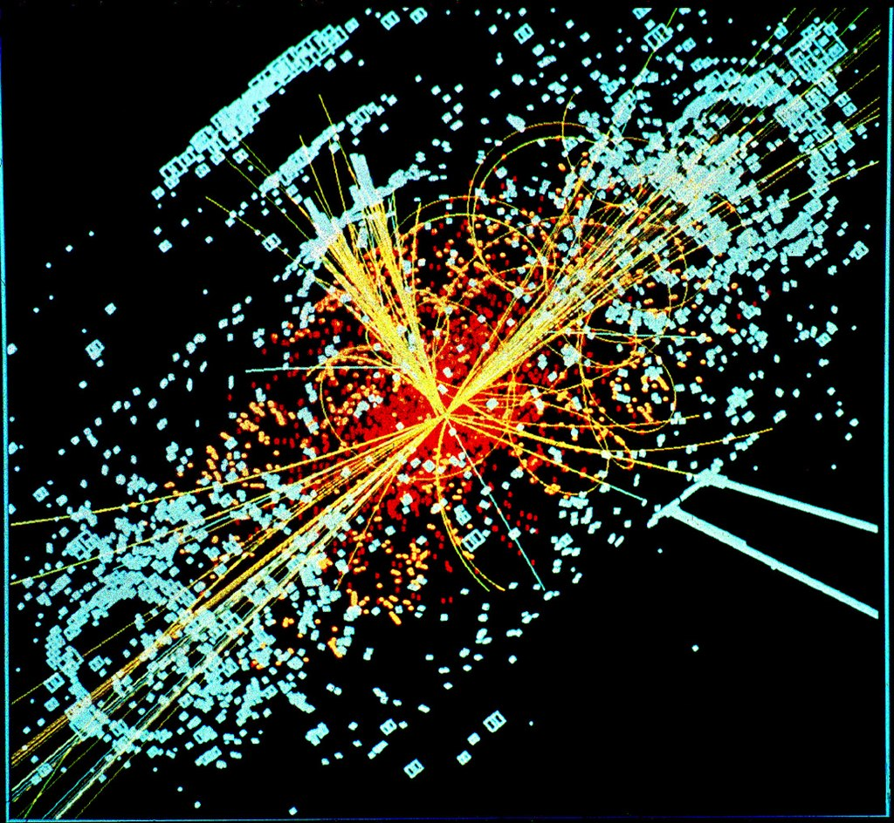A simulated event in the CMS detector of the [Large Hadron Collider](https://en.wikipedia.org/wiki/Large_Hadron_Collider "Large Hadron Collider"), featuring a possible appearance of the [Higgs boson](https://en.wikipedia.org/wiki/Higgs_boson "Higgs boson")

Particle physics is the study of the elementary constituents of [matter](https://en.wikipedia.org/wiki/Matter "Matter") and energy and the [interactions](https://en.wikipedia.org/wiki/Fundamental_interaction "Fundamental interaction") between them. In addition, particle physicists design and develop the high-energy accelerators, detectors, and [computer programs](https://en.wikipedia.org/wiki/Computational_particle_physics "Computational particle physics") necessary for this research. The field is also called "high-energy physics" because many elementary particles do not occur naturally but are created only during high-energy [collisions](https://en.wikipedia.org/wiki/Collision "Collision") of other particles.

Currently, the interactions of elementary particles and [fields](https://en.wikipedia.org/wiki/Field_\(physics\) "Field (physics)") are described by the [Standard Model](https://en.wikipedia.org/wiki/Standard_Model "Standard Model"). The model accounts for the 12 known particles of matter ([quarks](https://en.wikipedia.org/wiki/Quark "Quark") and [leptons](https://en.wikipedia.org/wiki/Lepton "Lepton")) that interact via the [strong](https://en.wikipedia.org/wiki/Strong_nuclear_force "Strong nuclear force"), weak, and electromagnetic [fundamental forces](https://en.wikipedia.org/wiki/Fundamental_force "Fundamental force"). Dynamics are described in terms of matter particles exchanging [gauge bosons](https://en.wikipedia.org/wiki/Gauge_boson "Gauge boson") ([gluons](https://en.wikipedia.org/wiki/Gluon "Gluon"), [W and Z bosons](https://en.wikipedia.org/wiki/W_and_Z_bosons "W and Z bosons"), and [photons](https://en.wikipedia.org/wiki/Photon "Photon"), respectively). The Standard Model also predicts a particle known as the Higgs boson. In July 2012 CERN, the European laboratory for particle physics, announced the detection of a particle consistent with the Higgs boson, an integral part of the [Higgs mechanism](https://en.wikipedia.org/wiki/Higgs_mechanism "Higgs mechanism").

Nuclear physics is the field of physics that studies the constituents and interactions of [atomic nuclei](https://en.wikipedia.org/wiki/Atomic_nuclei "Atomic nuclei"). The most commonly known applications of nuclear physics are [nuclear power](https://en.wikipedia.org/wiki/Nuclear_power "Nuclear power") generation and [nuclear weapons](https://en.wikipedia.org/wiki/Nuclear_weapons "Nuclear weapons") technology, but the research has provided application in many fields, including those in [nuclear medicine](https://en.wikipedia.org/wiki/Nuclear_medicine "Nuclear medicine") and magnetic resonance imaging, [ion implantation](https://en.wikipedia.org/wiki/Ion_implantation "Ion implantation") in [materials engineering](https://en.wikipedia.org/wiki/Materials_engineering "Materials engineering"), and [radiocarbon dating](https://en.wikipedia.org/wiki/Radiocarbon_dating "Radiocarbon dating") in geology and [archaeology](https://en.wikipedia.org/wiki/Archaeology "Archaeology").

#### Atomic, molecular, and optical

Atomic, [molecular](https://en.wikipedia.org/wiki/Molecule "Molecule"), and optical physics (AMO) is the study of matter—matter and [light—matter interactions](https://en.wikipedia.org/wiki/Light–matter_interaction "Light–matter interaction") on the scale of single atoms and molecules. The three areas are grouped together because of their interrelationships, the similarity of methods used, and the commonality of their relevant energy scales. All three areas include both classical, semi-classical and [quantum](/source/quantum-mechanics/ "Quantum mechanics") treatments; they can treat their subject from a microscopic view (in contrast to a macroscopic view).

Atomic physics studies the [electron shells](https://en.wikipedia.org/wiki/Electron_shell "Electron shell") of atoms. Current research focuses on activities in quantum control, cooling and trapping of atoms and ions, low-temperature collision dynamics and the effects of electron correlation on structure and dynamics. Atomic physics is influenced by the [nucleus](https://en.wikipedia.org/wiki/Atomic_nucleus "Atomic nucleus") (see [hyperfine splitting](https://en.wikipedia.org/wiki/Hyperfine_splitting "Hyperfine splitting")), but intra-nuclear phenomena such as [fission](https://en.wikipedia.org/wiki/Nuclear_fission "Nuclear fission") and [fusion](https://en.wikipedia.org/wiki/Nuclear_fusion "Nuclear fusion") are considered part of nuclear physics.

[Molecular physics](https://en.wikipedia.org/wiki/Molecular_physics "Molecular physics") focuses on multi-atomic structures and their internal and external interactions with matter and light. [Optical physics](https://en.wikipedia.org/wiki/Optical_physics "Optical physics") is distinct from optics in that it tends to focus not on the control of classical light fields by macroscopic objects but on the fundamental properties of [optical fields](https://en.wikipedia.org/wiki/Optical_field "Optical field") and their interactions with matter in the microscopic realm.

#### Condensed matter

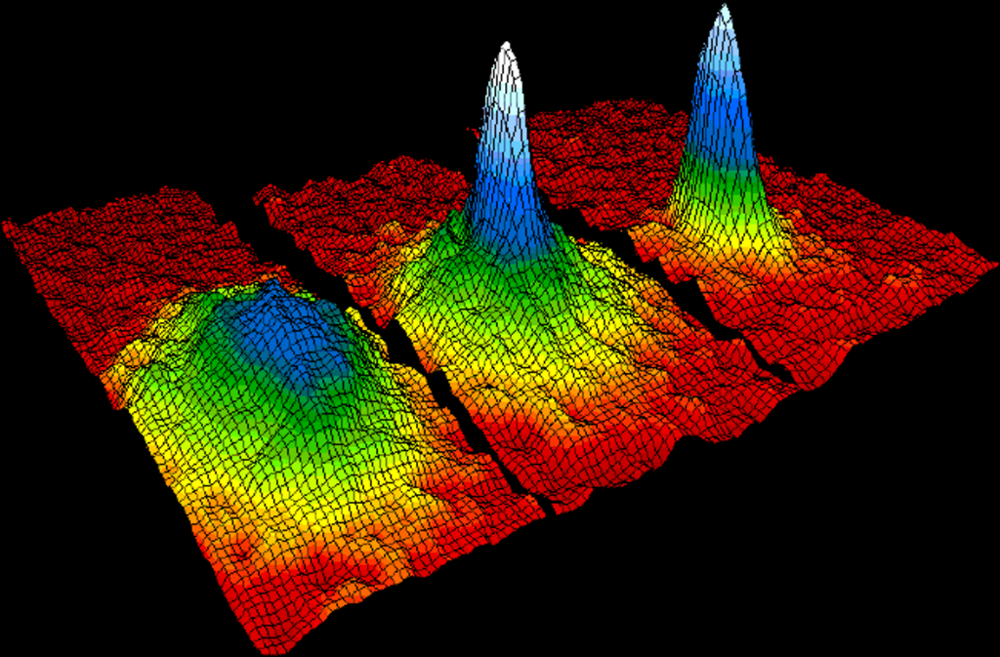Velocity-distribution data of a gas of [rubidium](https://en.wikipedia.org/wiki/Rubidium "Rubidium") atoms, confirming the discovery of a new phase of matter, the [Bose–Einstein condensate](https://en.wikipedia.org/wiki/Bose–Einstein_condensate "Bose–Einstein condensate")

Condensed matter physics is the field of physics that deals with the macroscopic physical properties of matter. In particular, it is concerned with the "condensed" [phases](https://en.wikipedia.org/wiki/Phase_\(matter\) "Phase (matter)") that appear whenever the number of particles in a system is extremely large and the interactions between them are strong.

The most familiar examples of condensed phases are [solids](https://en.wikipedia.org/wiki/Solid-state_physics "Solid-state physics") and liquids, which arise from the bonding by way of the [electromagnetic force](https://en.wikipedia.org/wiki/Electromagnetic_force "Electromagnetic force") between atoms. More exotic condensed phases include the [superfluid](https://en.wikipedia.org/wiki/Superfluid "Superfluid") and the [Bose–Einstein condensate](https://en.wikipedia.org/wiki/Bose–Einstein_condensate "Bose–Einstein condensate") found in certain atomic systems at very low temperature, the [superconducting](https://en.wikipedia.org/wiki/Superconductivity "Superconductivity") phase exhibited by [conduction electrons](https://en.wikipedia.org/wiki/Conduction_electron "Conduction electron") in certain materials, and the [ferromagnetic](https://en.wikipedia.org/wiki/Ferromagnet "Ferromagnet") and [antiferromagnetic](https://en.wikipedia.org/wiki/Antiferromagnet "Antiferromagnet") phases of [spins](https://en.wikipedia.org/wiki/Spin_\(physics\) "Spin (physics)") on [atomic lattices](https://en.wikipedia.org/wiki/Crystal_lattice "Crystal lattice").

Condensed matter physics is the largest field of contemporary physics. Historically, condensed matter physics grew out of solid-state physics, which is now considered one of its main subfields. The term _condensed matter physics_ was apparently coined by [Philip Anderson](https://en.wikipedia.org/wiki/Philip_Warren_Anderson "Philip Warren Anderson") when he renamed his research group—previously _solid-state theory_—in 1967. In 1978, the Division of Solid State Physics of the [American Physical Society](https://en.wikipedia.org/wiki/American_Physical_Society "American Physical Society") was renamed as the Division of Condensed Matter Physics. Condensed matter physics has a large overlap with chemistry, [materials science](https://en.wikipedia.org/wiki/Materials_science "Materials science"), [nanotechnology](https://en.wikipedia.org/wiki/Nanotechnology "Nanotechnology") and engineering.

#### Astrophysics

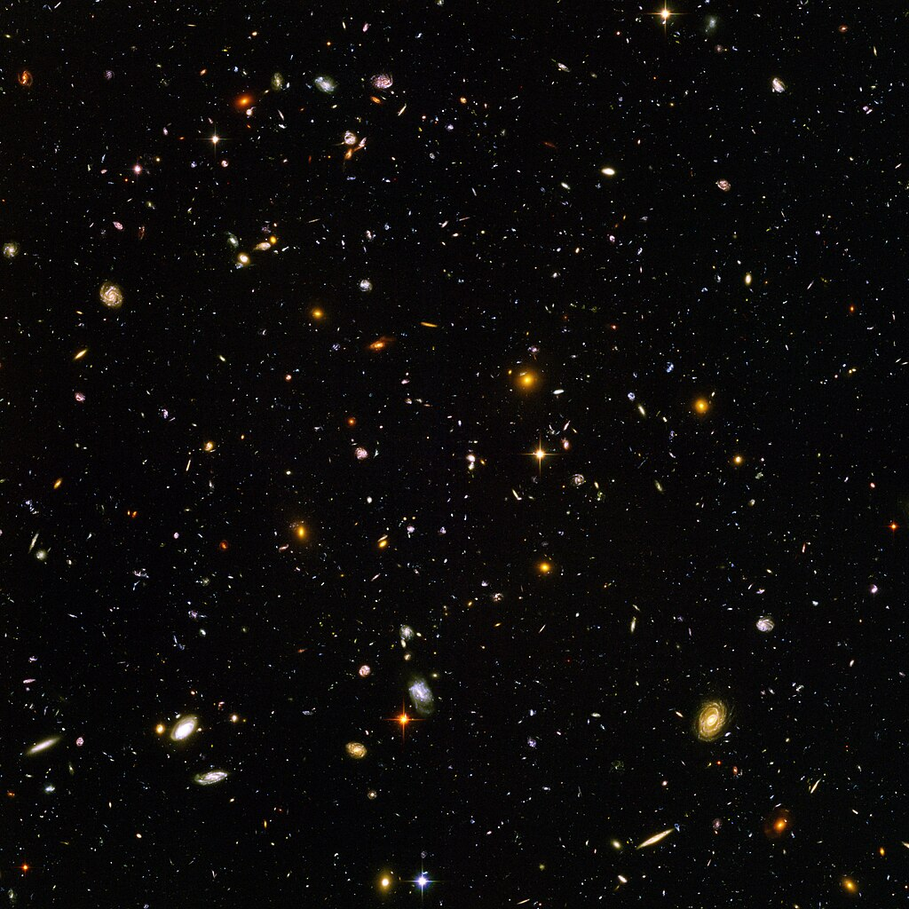The deepest visible-light image of the [universe](https://en.wikipedia.org/wiki/Universe "Universe"), the [Hubble Ultra-Deep Field](https://en.wikipedia.org/wiki/Hubble_Ultra-Deep_Field "Hubble Ultra-Deep Field"). The vast majority of objects seen above are distant galaxies.

Astrophysics and astronomy are the application of the theories and methods of physics to the study of [stellar structure](https://en.wikipedia.org/wiki/Stellar_structure "Stellar structure"), [stellar evolution](https://en.wikipedia.org/wiki/Stellar_evolution "Stellar evolution"), the origin of the Solar System, and related problems of cosmology. Because astrophysics is a broad subject, astrophysicists typically apply many disciplines of physics, including mechanics, electromagnetism, statistical mechanics, thermodynamics, quantum mechanics, relativity, nuclear and particle physics, and atomic and molecular physics.

The discovery by [Karl Jansky](https://en.wikipedia.org/wiki/Karl_Jansky "Karl Jansky") in 1931 that radio signals were emitted by celestial bodies initiated the science of [radio astronomy](https://en.wikipedia.org/wiki/Radio_astronomy "Radio astronomy"). Most recently, the frontiers of astronomy have been expanded by space exploration. Perturbations and interference from the Earth's atmosphere make space-based observations necessary for [infrared](https://en.wikipedia.org/wiki/Infrared_astronomy "Infrared astronomy"), [ultraviolet](https://en.wikipedia.org/wiki/Ultraviolet_astronomy "Ultraviolet astronomy"), [gamma-ray](https://en.wikipedia.org/wiki/Gamma-ray_astronomy "Gamma-ray astronomy"), and [X-ray astronomy](https://en.wikipedia.org/wiki/X-ray_astronomy "X-ray astronomy").

Physical cosmology is the study of the formation and evolution of the universe on its largest scales. Albert Einstein's theory of relativity plays a central role in all modern cosmological theories. In the early 20th century, [Hubble](https://en.wikipedia.org/wiki/Edwin_Hubble "Edwin Hubble")'s discovery that the universe is expanding, as shown by the [Hubble diagram](https://en.wikipedia.org/wiki/Hubble_diagram "Hubble diagram"), prompted rival explanations known as the [steady state](https://en.wikipedia.org/wiki/Steady-state_model "Steady-state model") universe and the [Big Bang](https://en.wikipedia.org/wiki/Big_Bang "Big Bang").

The Big Bang was confirmed by the success of [Big Bang nucleosynthesis](https://en.wikipedia.org/wiki/Big_Bang_nucleosynthesis "Big Bang nucleosynthesis") and the discovery of the [cosmic microwave background](https://en.wikipedia.org/wiki/Cosmic_microwave_background "Cosmic microwave background") in 1964. The Big Bang model rests on two theoretical pillars: Albert Einstein's general relativity and the [cosmological principle](https://en.wikipedia.org/wiki/Cosmological_principle "Cosmological principle"). Cosmologists have recently established the [ΛCDM model](https://en.wikipedia.org/wiki/Lambda-CDM_model "Lambda-CDM model") of the evolution of the universe, which includes [cosmic inflation](https://en.wikipedia.org/wiki/Cosmic_inflation "Cosmic inflation"), [dark energy](https://en.wikipedia.org/wiki/Dark_energy "Dark energy"), and [dark matter](https://en.wikipedia.org/wiki/Dark_matter "Dark matter").

## Other aspects

### Education

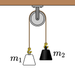An Atwood's machine is a machine consisting of a pulley and two masses that is commonly used in physics classrooms to demonstrate Newton's laws of motion

[Physics education](https://en.wikipedia.org/wiki/Physics_education "Physics education") or physics teaching refers to the [education](https://en.wikipedia.org/wiki/Education "Education") methods currently used to [teach](https://en.wikipedia.org/wiki/Teaching "Teaching") physics. The occupation is called physics educator or physics teacher. [Physics education research](https://en.wikipedia.org/wiki/Physics_education_research "Physics education research") refers to an area of pedagogical research that seeks to improve those methods. Historically, physics has been taught at the high school and college level primarily by the lecture method together with laboratory exercises aimed at verifying concepts taught in the lectures. These concepts are better understood when lectures are accompanied with demonstration, hand-on experiments, and questions that require students to ponder what will happen in an experiment and why. Students who participate in [active learning](https://en.wikipedia.org/wiki/Active_learning "Active learning") for example with hands-on experiments learn through self-discovery. By trial and error they learn to change their preconceptions about phenomena in physics and discover the underlying concepts. Physics education is part of the broader area of [science education](https://en.wikipedia.org/wiki/Science_education "Science education").

### Careers

A [physicist](https://en.wikipedia.org/wiki/Physicist "Physicist") is a [scientist](https://en.wikipedia.org/wiki/Scientist "Scientist") who specializes in the field of physics, which encompasses the interactions of matter and energy at all length and time scales in the physical universe. Physicists generally are interested in the root or ultimate causes of [phenomena](https://en.wikipedia.org/wiki/Phenomenon "Phenomenon"), and usually frame their understanding in mathematical terms. They work across a wide range of [research fields](/source/physics/#Research_fields), spanning all length scales: from [sub-atomic](https://en.wikipedia.org/wiki/Atom "Atom") and [particle physics](https://en.wikipedia.org/wiki/Particle_physics "Particle physics"), through [biological physics](https://en.wikipedia.org/wiki/Biological_physics "Biological physics"), to [cosmological](https://en.wikipedia.org/wiki/Physical_cosmology "Physical cosmology") length scales encompassing the [universe](https://en.wikipedia.org/wiki/Universe "Universe") as a whole. The field generally includes two types of physicists: [experimental physicists](https://en.wikipedia.org/wiki/Experimental_physics "Experimental physics") who specialize in the observation of natural phenomena and the development and analysis of experiments, and [theoretical physicists](https://en.wikipedia.org/wiki/Theoretical_physics "Theoretical physics") who specialize in mathematical modeling of physical systems to rationalize, explain and predict natural phenomena.

Physicists can apply their knowledge towards solving practical problems or to developing new technologies (also known as [applied physics](https://en.wikipedia.org/wiki/Applied_physics "Applied physics") or [engineering physics](https://en.wikipedia.org/wiki/Engineering_physics "Engineering physics")).

### Philosophy

Physics, as with the rest of science, relies on the [philosophy of science](https://en.wikipedia.org/wiki/Philosophy_of_science "Philosophy of science") and its "[scientific method](https://en.wikipedia.org/wiki/Scientific_method "Scientific method")" to advance knowledge of the physical world. The scientific method employs _[a priori and a posteriori](https://en.wikipedia.org/wiki/A_priori_and_a_posteriori "A priori and a posteriori")_ reasoning as well as the use of [Bayesian inference](https://en.wikipedia.org/wiki/Bayesian_inference "Bayesian inference") to measure the validity of a given theory. Study of the philosophical issues surrounding physics, the [philosophy of physics](https://en.wikipedia.org/wiki/Philosophy_of_physics "Philosophy of physics"), involves issues such as the nature of [space and time](https://en.wikipedia.org/wiki/Spacetime "Spacetime"), [determinism](https://en.wikipedia.org/wiki/Determinism "Determinism"), and [metaphysical](https://en.wikipedia.org/wiki/Metaphysics "Metaphysics") outlooks such as [empiricism](https://en.wikipedia.org/wiki/Empiricism "Empiricism"), [naturalism](https://en.wikipedia.org/wiki/Naturalism_\(philosophy\) "Naturalism (philosophy)"), and [realism](https://en.wikipedia.org/wiki/Philosophical_realism "Philosophical realism").

Many physicists have written about the philosophical implications of their work, for instance [Laplace](https://en.wikipedia.org/wiki/Pierre-Simon_Laplace "Pierre-Simon Laplace"), who championed [causal determinism](https://en.wikipedia.org/wiki/Causal_determinism "Causal determinism"), and [Erwin Schrödinger](https://en.wikipedia.org/wiki/Erwin_Schrödinger "Erwin Schrödinger"), who wrote on quantum mechanics. The mathematical physicist [Roger Penrose](https://en.wikipedia.org/wiki/Roger_Penrose "Roger Penrose") has been called a [Platonist](https://en.wikipedia.org/wiki/Platonism "Platonism") by [Stephen Hawking](https://en.wikipedia.org/wiki/Stephen_Hawking "Stephen Hawking"), a view Penrose discusses in his book, _[The Road to Reality](https://en.wikipedia.org/wiki/The_Road_to_Reality "The Road to Reality")_. Hawking referred to himself as an "unashamed reductionist" and took issue with Penrose's views.

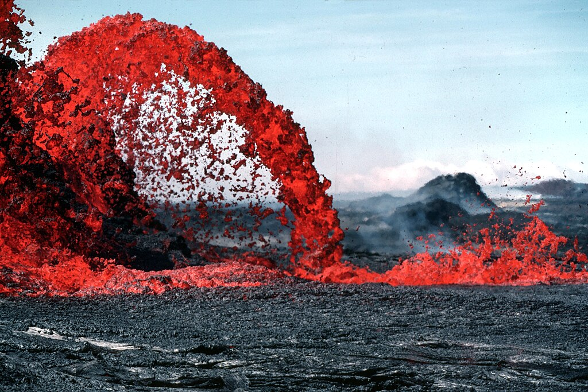This [parabola](https://en.wikipedia.org/wiki/Parabola "Parabola")-shaped [lava flow](https://en.wikipedia.org/wiki/Lava_flow "Lava flow") illustrates an application of mathematics in physics — in this case, Galileo's [law of falling bodies](https://en.wikipedia.org/wiki/Law_of_falling_bodies "Law of falling bodies").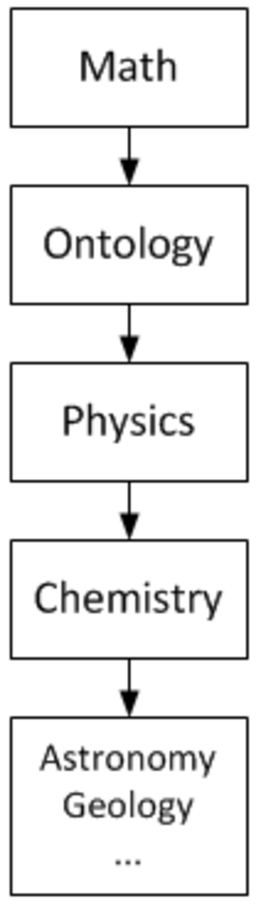Mathematics and ontology are used in physics. Physics is used in chemistry and [cosmology](https://en.wikipedia.org/wiki/Cosmology "Cosmology").

Mathematics provides a compact and exact language used to describe the order in nature. This was noted and advocated by [Pythagoras](https://en.wikipedia.org/wiki/Pythagoras "Pythagoras"), [Plato](https://en.wikipedia.org/wiki/Plato "Plato"), Galileo, and Newton. Some theorists, like [Hilary Putnam](https://en.wikipedia.org/wiki/Hilary_Putnam "Hilary Putnam") and [Penelope Maddy](https://en.wikipedia.org/wiki/Penelope_Maddy "Penelope Maddy"), hold that logical truths, and therefore mathematical reasoning, depend on the [empirical](https://en.wikipedia.org/wiki/Empirical "Empirical") world. This is usually combined with the claim that the laws of logic express universal regularities found in the structural features of the world, which may explain the peculiar relation between these fields.

Physics uses mathematics to organize and formulate experimental results. From those results, [precise](https://en.wikipedia.org/wiki/Analytic_solution "Analytic solution") or [estimated](https://en.wikipedia.org/wiki/Simulation#Computer_simulation "Simulation") solutions are obtained, or quantitative results, from which new predictions can be made and experimentally confirmed or negated. The results from physics experiments are numerical data, with their [units of measure](https://en.wikipedia.org/wiki/Units_of_measure "Units of measure") and estimates of the errors in the measurements. Technologies based on mathematics, like [computation](https://en.wikipedia.org/wiki/Scientific_computing "Scientific computing") have made [computational physics](https://en.wikipedia.org/wiki/Computational_physics "Computational physics") an active area of research.

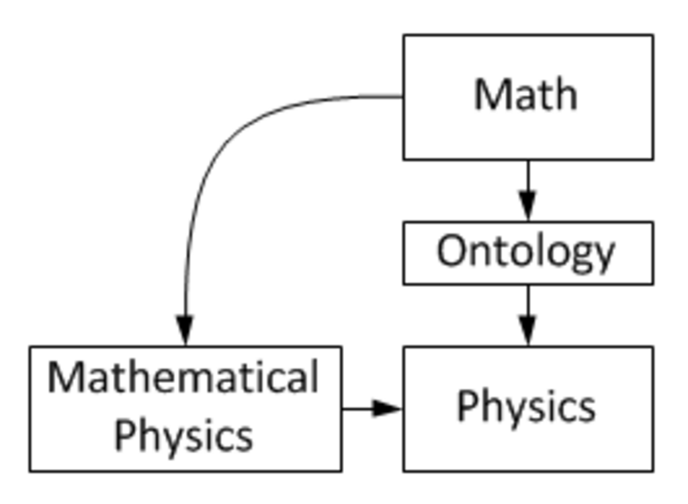The distinction between mathematics and physics is clear-cut, but not always obvious, especially in mathematical physics.

[Ontology](https://en.wikipedia.org/wiki/Ontology "Ontology") is a prerequisite for physics, but not for mathematics. It means physics is ultimately concerned with descriptions of the real world, while mathematics is concerned with abstract patterns, even beyond the real world. Thus physics statements are synthetic, while mathematical statements are analytic. Mathematics contains hypotheses, while physics contains theories. Mathematics statements have to be only logically true, while predictions of physics statements must match observed and experimental data.

The distinction is clear-cut, but not always obvious. For example, [mathematical physics](https://en.wikipedia.org/wiki/Mathematical_physics "Mathematical physics") is the application of mathematics in physics. Its methods are mathematical, but its subject is physical. The problems in this field start with a "[mathematical model of a physical situation](https://en.wikipedia.org/wiki/Boundary_condition "Boundary condition")" (system) and a "mathematical description of a physical law" that will be applied to that system. Every mathematical statement used for solving has a hard-to-find physical meaning. The final mathematical solution has an easier-to-find meaning, because it is what the solver is looking for.

### Fundamental vs. applied physics

Physics is a branch of [fundamental science](https://en.wikipedia.org/wiki/Fundamental_science "Fundamental science") (also called basic science). Physics is also called "_the_ fundamental science" because all branches of natural science including chemistry, astronomy, geology, and biology are constrained by laws of physics. Similarly, chemistry is often called [the central science](https://en.wikipedia.org/wiki/The_central_science "The central science") because of its role in linking the physical sciences. For example, chemistry studies properties, structures, and [reactions](https://en.wikipedia.org/wiki/Chemical_reaction "Chemical reaction") of matter (chemistry's focus on the molecular and atomic scale [distinguishes it from physics](https://en.wikipedia.org/wiki/Difference_between_chemistry_and_physics "Difference between chemistry and physics")). Structures are formed because particles exert electrical forces on each other, properties include physical characteristics of given substances, and reactions are bound by laws of physics, like [conservation of energy](https://en.wikipedia.org/wiki/Conservation_of_energy "Conservation of energy"), [mass](https://en.wikipedia.org/wiki/Conservation_of_mass "Conservation of mass"), and [charge](https://en.wikipedia.org/wiki/Charge_conservation "Charge conservation"). Fundamental physics seeks to better explain and understand phenomena in all spheres, without a specific practical application as a goal, other than the deeper insight into the phenomema themselves.

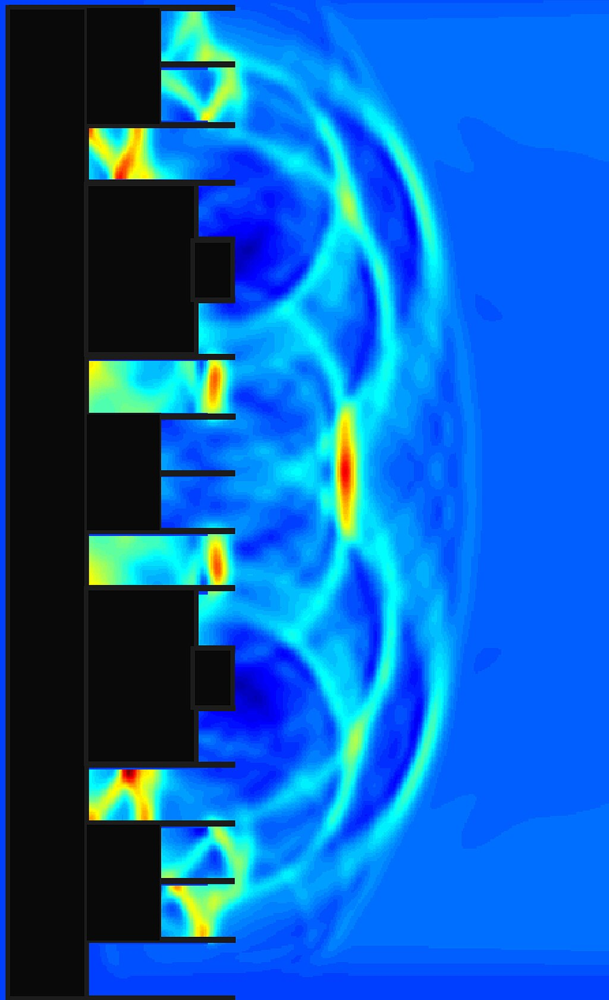An [acoustic engineering](https://en.wikipedia.org/wiki/Acoustic_engineering "Acoustic engineering") model of sound reflecting from an acoustic [diffuser](https://en.wikipedia.org/wiki/Diffusion_\(acoustics\) "Diffusion (acoustics)"), implemented with classical physics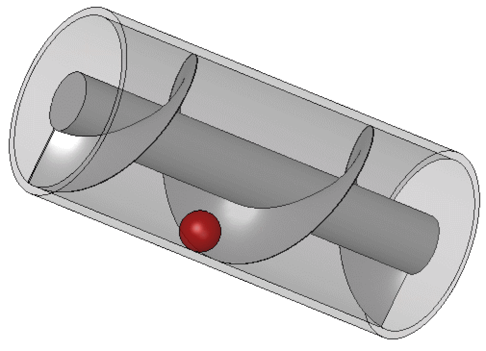[Archimedes' screw](https://en.wikipedia.org/wiki/Archimedes'_screw "Archimedes' screw"), a [simple machine](https://en.wikipedia.org/wiki/Simple_machine "Simple machine") for lifting

Applied physics is a general term for physics research and development that is intended for a particular use. An applied physics curriculum usually contains a few classes in an applied discipline, like geology or electrical engineering. It usually differs from engineering in that an applied physicist may not be designing something in particular, but rather is using physics or conducting physics research with the aim of developing new technologies or solving a problem.

The approach is similar to that of [applied mathematics](https://en.wikipedia.org/wiki/Applied_mathematics "Applied mathematics"). Applied physicists use physics in scientific research. For instance, people working on [accelerator physics](https://en.wikipedia.org/wiki/Accelerator_physics "Accelerator physics") might seek to build better [particle detectors](https://en.wikipedia.org/wiki/Particle_detector "Particle detector") for research in theoretical physics.

Physics is used heavily in engineering. For example, statics, a subfield of [mechanics](https://en.wikipedia.org/wiki/Mechanics "Mechanics"), is used in the building of bridges and other static structures. The understanding and use of acoustics results in sound control and better concert halls; similarly, the use of optics creates better optical devices. An understanding of physics makes for more realistic [flight simulators](https://en.wikipedia.org/wiki/Flight_simulator "Flight simulator"), video games, and movies, and is often critical in [forensic](https://en.wikipedia.org/wiki/Forensic "Forensic") investigations.

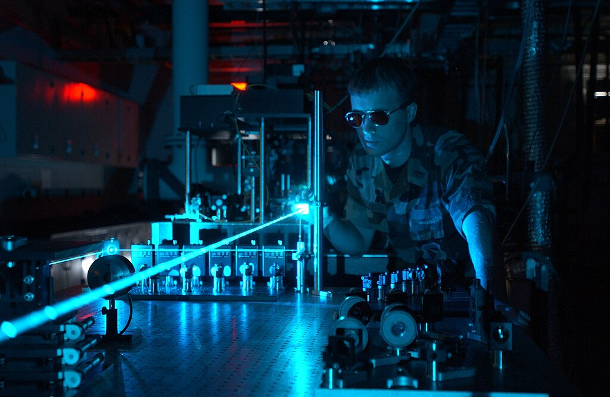Experiment using a [laser](https://en.wikipedia.org/wiki/Laser "Laser")

With the [standard consensus](https://en.wikipedia.org/wiki/Uniformitarianism_\(science\) "Uniformitarianism (science)") that the [laws](https://en.wikipedia.org/wiki/Scientific_law "Scientific law") of physics are universal and do not change with time, physics can be used to study things that would ordinarily be mired in [uncertainty](https://en.wikipedia.org/wiki/Uncertainty "Uncertainty"). For example, in the study of the origin of the Earth, a physicist can reasonably model Earth's mass, temperature, and rate of rotation, as a function of time allowing the extrapolation forward or backward in time and so predict future or prior events. It also allows for simulations in engineering that speed up the development of a new technology.

There is also considerable [interdisciplinarity](https://en.wikipedia.org/wiki/Interdisciplinarity "Interdisciplinarity"), so many other important fields are influenced by physics (e.g., the fields of [econophysics](https://en.wikipedia.org/wiki/Econophysics "Econophysics") and [sociophysics](https://en.wikipedia.org/wiki/Sociophysics "Sociophysics")).
