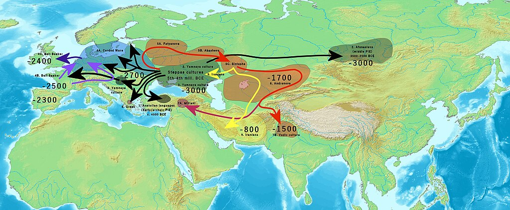
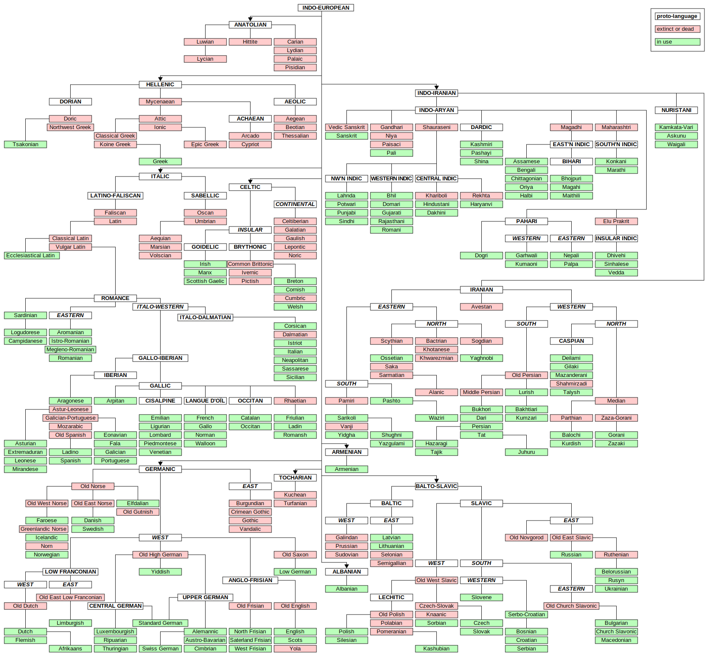

Proto-Indo-European

PIE

Reconstruction of

[Indo-European languages](https://en.wikipedia.org/wiki/Indo-European_languages "Indo-European languages")

Region

[Proto-Indo-European homeland](https://en.wikipedia.org/wiki/Proto-Indo-European_homeland "Proto-Indo-European homeland"), most likely on the [Pontic–Caspian steppe](https://en.wikipedia.org/wiki/Pontic–Caspian_steppe "Pontic–Caspian steppe")

Era

c. 4500 – c. 2500 BC

Lower-order reconstructions

*   [Proto-Albanian](https://en.wikipedia.org/wiki/Proto-Albanian_language "Proto-Albanian language")
*   [Proto-Anatolian](https://en.wikipedia.org/wiki/Proto-Anatolian_language "Proto-Anatolian language")
*   [Proto-Armenian](https://en.wikipedia.org/wiki/Proto-Armenian_language "Proto-Armenian language")
*   [Proto-Balto-Slavic](https://en.wikipedia.org/wiki/Proto-Balto-Slavic_language "Proto-Balto-Slavic language")
*   [Proto-Celtic](https://en.wikipedia.org/wiki/Proto-Celtic_language "Proto-Celtic language")
*   [Proto-Germanic](https://en.wikipedia.org/wiki/Proto-Germanic_language "Proto-Germanic language")
*   [Proto-Greek](https://en.wikipedia.org/wiki/Proto-Greek_language "Proto-Greek language")
*   [Proto-Indo-Iranian](https://en.wikipedia.org/wiki/Proto-Indo-Iranian_language "Proto-Indo-Iranian language")
*   [Proto-Italic](https://en.wikipedia.org/wiki/Proto-Italic_language "Proto-Italic language")
*   [Proto-Tocharian](https://en.wikipedia.org/wiki/Proto-Tocharian_language "Proto-Tocharian language")

**Proto-Indo-European** (**PIE**) is the reconstructed [common ancestor](https://en.wikipedia.org/wiki/Proto-language "Proto-language") of the [Indo-European language family](https://en.wikipedia.org/wiki/Indo-European_language_family "Indo-European language family"). No direct record of Proto-Indo-European has been discovered; its proposed features have been derived by [linguistic reconstruction](https://en.wikipedia.org/wiki/Linguistic_reconstruction "Linguistic reconstruction") from documented Indo-European languages. Far more work has gone into reconstructing PIE than any other [proto-language](https://en.wikipedia.org/wiki/Proto-language "Proto-language"). The majority of linguistic work during the 19th century was devoted to the reconstruction of PIE and its [daughter languages](https://en.wikipedia.org/wiki/Daughter_language "Daughter language"), and many of the modern techniques of linguistic reconstruction (such as the [comparative method](https://en.wikipedia.org/wiki/Comparative_method "Comparative method")) were developed as a result.

PIE is hypothesized to have been spoken as a single language from approximately 4500 BCE to 2500 BCE during the Late [Neolithic](https://en.wikipedia.org/wiki/Neolithic "Neolithic") to Early [Bronze Age](https://en.wikipedia.org/wiki/Bronze_Age "Bronze Age"), though other estimates place the bounds of the period as much as more than a thousand years later. According to the prevailing [Kurgan hypothesis](https://en.wikipedia.org/wiki/Kurgan_hypothesis "Kurgan hypothesis"), the [original homeland](https://en.wikipedia.org/wiki/Proto-Indo-European_homeland "Proto-Indo-European homeland") of the [Proto-Indo-Europeans](https://en.wikipedia.org/wiki/Proto-Indo-Europeans "Proto-Indo-Europeans") may have been in the [Pontic–Caspian steppe](https://en.wikipedia.org/wiki/Pontic–Caspian_steppe "Pontic–Caspian steppe") of eastern Europe and central Asia. The linguistic reconstruction of PIE has provided insight into the pastoral [culture](https://en.wikipedia.org/wiki/Proto-Indo-European_culture "Proto-Indo-European culture") and patriarchal [religion](https://en.wikipedia.org/wiki/Proto-Indo-European_religion "Proto-Indo-European religion") of its speakers. As speakers of Proto-Indo-European became isolated from each other through the [Indo-European migrations](https://en.wikipedia.org/wiki/Indo-European_migrations "Indo-European migrations"), the regional [dialects](https://en.wikipedia.org/wiki/Dialect "Dialect") of Proto-Indo-European spoken by the various groups diverged, as each dialect [underwent shifts in pronunciation](https://en.wikipedia.org/wiki/Indo-European_sound_laws "Indo-European sound laws"), [morphology](https://en.wikipedia.org/wiki/Morphology_\(linguistics\) "Morphology (linguistics)"), and vocabulary. Over many centuries, these dialects transformed into the known ancient Indo-European languages. From there, more linguistic divergence led to the evolution of their current descendants, the modern Indo-European languages.

PIE is believed to have had an elaborate system of morphology that included [inflectional suffixes](https://en.wikipedia.org/wiki/Inflection "Inflection") (analogous to English _child, child's, children, children's_) as well as [ablaut](https://en.wikipedia.org/wiki/Indo-European_ablaut "Indo-European ablaut") (vowel alterations, as preserved in English _sing, sang, sung, song_) and [accent](https://en.wikipedia.org/wiki/Proto-Indo-European_accent "Proto-Indo-European accent"). PIE [nominals](https://en.wikipedia.org/wiki/Proto-Indo-European_nominals "Proto-Indo-European nominals") and [pronouns](https://en.wikipedia.org/wiki/Proto-Indo-European_pronouns "Proto-Indo-European pronouns") had a complex system of [declension](https://en.wikipedia.org/wiki/Declension "Declension"), and [verbs](https://en.wikipedia.org/wiki/Proto-Indo-European_verbs "Proto-Indo-European verbs") similarly had a complex system of [conjugation](https://en.wikipedia.org/wiki/Grammatical_conjugation "Grammatical conjugation"). The PIE [phonology](https://en.wikipedia.org/wiki/Proto-Indo-European_phonology "Proto-Indo-European phonology"), [particles](https://en.wikipedia.org/wiki/Proto-Indo-European_particles "Proto-Indo-European particles"), [numerals](https://en.wikipedia.org/wiki/Proto-Indo-European_numerals "Proto-Indo-European numerals"), and [copula](https://en.wikipedia.org/wiki/Indo-European_copula "Indo-European copula") are also well-reconstructed. Asterisks are used by linguists as a conventional mark of reconstructed words, such as \*_wódr̥_, \*_ḱwn̥tós_, or \*_tréyes_; these forms are the reconstructed ancestors of the modern English words _water_, _hound_, and _three_, respectively.

## Development of the hypothesis

No direct evidence of the Proto-Indo-European language exists; scholars have reconstructed PIE from its present-day descendants using the [comparative method](https://en.wikipedia.org/wiki/Comparative_method_\(linguistics\) "Comparative method (linguistics)"). For example, compare the pairs of words in Italian and English: _piede_ and _foot_, _padre_ and _father_, _pesce_ and _fish_. Since there is a consistent correspondence of the initial consonants (_p_ and _f_) that emerges far too frequently to be unrelated coincidence, one can infer that these languages stem from a common [parent language](https://en.wikipedia.org/wiki/Parent_language "Parent language"). Detailed analysis suggests a system of [sound laws](https://en.wikipedia.org/wiki/Indo-European_sound_laws "Indo-European sound laws") to describe the [phonetic](https://en.wikipedia.org/wiki/Phonetics "Phonetics") and [phonological](https://en.wikipedia.org/wiki/Phonology "Phonology") changes from the hypothetical ancestral words to the modern ones. These laws have become so detailed and reliable as to support the [Neogrammarian hypothesis](https://en.wikipedia.org/wiki/Neogrammarian_hypothesis "Neogrammarian hypothesis"): the Indo-European sound laws apply without exception.

[William Jones](https://en.wikipedia.org/wiki/William_Jones_\(philologist\) "William Jones (philologist)"), an [Anglo-Welsh](https://en.wikipedia.org/wiki/Anglo-Welsh "Anglo-Welsh") [philologist](https://en.wikipedia.org/wiki/Philology "Philology") and [puisne judge](https://en.wikipedia.org/wiki/Puisne_judge "Puisne judge") in [Bengal](https://en.wikipedia.org/wiki/Bengal "Bengal"), caused an academic sensation when in 1786 he postulated the common ancestry of [Sanskrit](/source/sanskrit/ "Sanskrit"), [Greek](https://en.wikipedia.org/wiki/Greek_language "Greek language"), [Latin](https://en.wikipedia.org/wiki/Latin "Latin"), [Gothic](https://en.wikipedia.org/wiki/Gothic_language "Gothic language"), the [Celtic languages](https://en.wikipedia.org/wiki/Celtic_languages "Celtic languages"), and [Old Persian](https://en.wikipedia.org/wiki/Old_Persian "Old Persian"), but he was not the first to state such a hypothesis. In the 16th century, European visitors to the [Indian subcontinent](https://en.wikipedia.org/wiki/Indian_subcontinent "Indian subcontinent") became aware of similarities between [Indo-Iranian languages](https://en.wikipedia.org/wiki/Indo-Iranian_language "Indo-Iranian language") and European languages, and as early as 1653, [Marcus Zuerius van Boxhorn](https://en.wikipedia.org/wiki/Marcus_Zuerius_van_Boxhorn "Marcus Zuerius van Boxhorn") had published a proposal for a [proto-language](https://en.wikipedia.org/wiki/Proto-language "Proto-language") ("Scythian") for the following language families: [Germanic](https://en.wikipedia.org/wiki/Germanic_languages "Germanic languages"), [Romance](https://en.wikipedia.org/wiki/Romance_languages "Romance languages"), [Greek](https://en.wikipedia.org/wiki/Hellenic_languages "Hellenic languages"), [Baltic](https://en.wikipedia.org/wiki/Baltic_languages "Baltic languages"), [Slavic](https://en.wikipedia.org/wiki/Slavic_languages "Slavic languages"), [Celtic](https://en.wikipedia.org/wiki/Celtic_languages "Celtic languages"), and [Iranian](https://en.wikipedia.org/wiki/Iranian_languages "Iranian languages"). In a memoir sent to the [Académie des Inscriptions et Belles-Lettres](https://en.wikipedia.org/wiki/Académie_des_Inscriptions_et_Belles-Lettres "Académie des Inscriptions et Belles-Lettres") in 1767, [Gaston-Laurent Coeurdoux](https://en.wikipedia.org/wiki/Gaston-Laurent_Coeurdoux "Gaston-Laurent Coeurdoux"), a French [Jesuit](https://en.wikipedia.org/wiki/Jesuit "Jesuit") who spent most of his life in India, had specifically demonstrated the analogy between Sanskrit and European languages. According to current academic consensus, Jones's famous work of 1786 was less accurate than his predecessors', as he erroneously included [Egyptian](https://en.wikipedia.org/wiki/Egyptian_language "Egyptian language"), [Japanese](https://en.wikipedia.org/wiki/Japanese_language "Japanese language") and [Chinese](https://en.wikipedia.org/wiki/Chinese_language "Chinese language") in the Indo-European languages, while omitting [Hindi](https://en.wikipedia.org/wiki/Hindi "Hindi").

In 1818, Danish linguist [Rasmus Christian Rask](https://en.wikipedia.org/wiki/Rasmus_Christian_Rask "Rasmus Christian Rask") elaborated the set of correspondences in his prize essay _Undersøgelse om det gamle Nordiske eller Islandske Sprogs Oprindelse_ ('Investigation of the Origin of the Old Norse or Icelandic Language'), where he argued that [Old Norse](https://en.wikipedia.org/wiki/Old_Norse "Old Norse") was related to the Germanic languages, and even suggested a relation to the Baltic, Slavic, Greek, Latin and Romance languages. In 1816, [Franz Bopp](https://en.wikipedia.org/wiki/Franz_Bopp "Franz Bopp") published _On the System of Conjugation in Sanskrit_, in which he investigated the common origin of Sanskrit, Persian, Greek, Latin, and German. In 1833, he began publishing the _Comparative Grammar of Sanskrit, [Zend](/source/avestan/ "Avestan"), Greek, Latin, Lithuanian, Old Slavic, Gothic, and German_.

In 1822, [Jacob Grimm](https://en.wikipedia.org/wiki/Jacob_Grimm "Jacob Grimm") formulated what became known as [Grimm's law](https://en.wikipedia.org/wiki/Grimm's_law "Grimm's law") as a general rule in his _Deutsche Grammatik_. Grimm showed correlations between the Germanic and other Indo-European languages and demonstrated that sound change systematically transforms all words of a language. From the 1870s, the Neogrammarians proposed that sound laws have no exceptions, as illustrated by [Verner's law](https://en.wikipedia.org/wiki/Verner's_law "Verner's law"), published in 1876, which resolved apparent exceptions to Grimm's law by exploring the role of accent (stress) in language change.

[August Schleicher](https://en.wikipedia.org/wiki/August_Schleicher "August Schleicher")'s _A Compendium of the Comparative Grammar of the Indo-European, Sanskrit, Greek and Latin Languages_ (1874–77) represented an early attempt to reconstruct the Proto-Indo-European language.

By the early 1900s, [Indo-Europeanists](https://en.wikipedia.org/wiki/Indo-Europeanist "Indo-Europeanist") had developed well-defined descriptions of PIE which scholars still accept today. Later, the discovery of the [Anatolian](https://en.wikipedia.org/wiki/Anatolian_languages "Anatolian languages") and [Tocharian languages](https://en.wikipedia.org/wiki/Tocharian_languages "Tocharian languages") added to the corpus of descendant languages. A subtle new principle won wide acceptance: the [laryngeal theory](https://en.wikipedia.org/wiki/Laryngeal_theory "Laryngeal theory"), which explained irregularities in the reconstruction of Proto-Indo-European phonology as the effects of hypothetical sounds which no longer exist in all languages documented prior to the excavation of [cuneiform](https://en.wikipedia.org/wiki/Cuneiform "Cuneiform") tablets in Anatolian. This theory was first proposed by [Ferdinand de Saussure](https://en.wikipedia.org/wiki/Ferdinand_de_Saussure "Ferdinand de Saussure") in 1879 on the basis of internal reconstruction only, and progressively won general acceptance after [Jerzy Kuryłowicz](https://en.wikipedia.org/wiki/Jerzy_Kuryłowicz "Jerzy Kuryłowicz")'s discovery of consonantal reflexes of these reconstructed sounds in Hittite.

[Julius Pokorny](https://en.wikipedia.org/wiki/Julius_Pokorny "Julius Pokorny")'s _[Indogermanisches etymologisches Wörterbuch](https://en.wikipedia.org/wiki/Indogermanisches_etymologisches_Wörterbuch "Indogermanisches etymologisches Wörterbuch")_ ('Indo-European Etymological Dictionary', 1959) gave a detailed, though conservative, overview of the lexical knowledge accumulated by 1959. Jerzy Kuryłowicz's 1956 _Apophonie_ gave a better understanding of [Indo-European ablaut](https://en.wikipedia.org/wiki/Indo-European_ablaut "Indo-European ablaut"). From the 1960s, knowledge of Anatolian became robust enough to establish its relationship to PIE.

In _The Oxford Introduction to Proto-Indo-European and the Proto-Indo-European World_, Mallory and Adams illustrate the resemblance with the following examples of [cognate](https://en.wikipedia.org/wiki/Cognate "Cognate") forms (with the addition of Old English for further comparison):

Examples of cognate words in Indo-European languages

  PIE  [Modern
 English](https://en.wikipedia.org/wiki/English_language "English language") [Old
 English](https://en.wikipedia.org/wiki/Old_English_language "Old English language")   [Latin](https://en.wikipedia.org/wiki/Latin_language "Latin language")    [Greek](https://en.wikipedia.org/wiki/Greek_language "Greek language")   [Sanskrit](https://en.wikipedia.org/wiki/Sanskrit_language "Sanskrit language")

 \*méh₂tēr

 mother

 mōdor

 māter

 mḗtēr

 mātár-

 \*ph₂tḗr

 father

 fæder

 pater

 patḗr

 pitár-

 \*bʰréh₂tēr

 brother

 brōþor

 frāter

 phrḗtēr

 bhrā́tar-

 \*swésōr

 sister

 sweostor

 soror

 éor

 svásar-

 \*suHnús,
 \*suHyús

 son

 sunu

—

 huiús

 sūnú-

 \*dʰugh₂tḗr

 daughter

 dohtor

—

 thugátēr

 duhitár-

 \*gʷṓus

 cow

 cū

 bōs

 boûs

 gáu-

## Historical and geographical setting

Early [Indo-European migrations](https://en.wikipedia.org/wiki/Indo-European_migrations "Indo-European migrations") from the [Pontic steppes](https://en.wikipedia.org/wiki/Pontic_steppes "Pontic steppes") and across Central Asia according to the widely held Kurgan hypothesis

Scholars have proposed multiple hypotheses about when, where, and by whom PIE was spoken. The [Kurgan hypothesis](https://en.wikipedia.org/wiki/Kurgan_hypothesis "Kurgan hypothesis"), first put forward in 1956 by [Marija Gimbutas](https://en.wikipedia.org/wiki/Marija_Gimbutas "Marija Gimbutas"), has become the most popular. It proposes that this proto-language was spoken by the [Yamnaya culture](https://en.wikipedia.org/wiki/Yamnaya_culture "Yamnaya culture") in the general area of the [Pontic steppe](https://en.wikipedia.org/wiki/Pontic_steppe "Pontic steppe") north of the Black Sea c. 3400 BCE.

Other theories include the [Anatolian hypothesis](https://en.wikipedia.org/wiki/Anatolian_hypothesis "Anatolian hypothesis"), which posits that PIE spread out from Anatolia with agriculture beginning c. 7500–6000 BCE, the [Armenian hypothesis](https://en.wikipedia.org/wiki/Armenian_hypothesis "Armenian hypothesis"), the [Paleolithic continuity paradigm](https://en.wikipedia.org/wiki/Paleolithic_continuity_paradigm "Paleolithic continuity paradigm"), and the [indigenous Aryans](https://en.wikipedia.org/wiki/Indigenous_Aryans "Indigenous Aryans") theory. The last two of these theories are not regarded as credible within academia. Out of all the theories for a PIE homeland, the Kurgan and Anatolian hypotheses are the ones most widely accepted, and also the ones most debated against each other. Following the publication of several studies on ancient DNA in 2015, [Colin Renfrew](https://en.wikipedia.org/wiki/Colin_Renfrew "Colin Renfrew"), the original author and proponent of the Anatolian hypothesis, has accepted the reality of migrations of populations speaking one or several Indo-European languages from the Pontic steppe towards Northwestern Europe.

Classification of Indo-European languages. Red: Extinct languages. White: categories or unattested proto-languages. Left half: [centum](https://en.wikipedia.org/wiki/Centum "Centum") languages; right half: [satem](https://en.wikipedia.org/wiki/Satem "Satem") languages

## Descendants

The antiquity of the earliest attestation (in units of 500 years) of each Indo-European group is: 2000–1500 BCE for Anatolian; 1500–1000 BCE for Indo-Aryan and Greek; 1000–500 BCE for Iranic, Celtic, Italic, Phrygian, Illyric, Messapic, South Picene, and Venetic; 500–1 BCE for Thracian and Ancient Macedonian; 1–500 CE for Germanic, Armenian, Lusitanian, and Tocharian; 500–1000 CE for Slavic; 1500–2000 CE for Albanian and Baltic.

The table lists the main Indo-European language families, comprising the languages descended from Proto-Indo-European.

CladeProto-languageDescriptionHistorical languagesModern descendants

[Anatolian](https://en.wikipedia.org/wiki/Anatolian_languages "Anatolian languages")

[Proto-Anatolian](https://en.wikipedia.org/wiki/Proto-Anatolian_language "Proto-Anatolian language")

All now extinct, the best attested being the [Hittite language](https://en.wikipedia.org/wiki/Hittite_language "Hittite language").

[Hittite](https://en.wikipedia.org/wiki/Hittite_language "Hittite language"), [Luwian](https://en.wikipedia.org/wiki/Luwian_language "Luwian language"), [Palaic](https://en.wikipedia.org/wiki/Palaic "Palaic"), [Lycian](https://en.wikipedia.org/wiki/Lycian_language "Lycian language"), [Lydian](https://en.wikipedia.org/wiki/Lydian_language "Lydian language"), [Carian](https://en.wikipedia.org/wiki/Carian_language "Carian language"), [Pisidian](https://en.wikipedia.org/wiki/Pisidian_language "Pisidian language"), [Sidetic](https://en.wikipedia.org/wiki/Sidetic_language "Sidetic language"), [Milyan](https://en.wikipedia.org/wiki/Milyan_language "Milyan language")

There are no living descendants of Proto-Anatolian.

[Tocharian](https://en.wikipedia.org/wiki/Tocharian_languages "Tocharian languages")

[Proto-Tocharian](https://en.wikipedia.org/wiki/Proto-Tocharian_language "Proto-Tocharian language")

An extinct branch known from manuscripts dating from the 6th to the 8th century AD and found in northwest China.

[Tocharian A](https://en.wikipedia.org/wiki/Tocharian_A "Tocharian A"), [Tocharian B](https://en.wikipedia.org/wiki/Tocharian_B "Tocharian B")

There are no living descendants of Proto-Tocharian.

[Italic](https://en.wikipedia.org/wiki/Italic_languages "Italic languages")

[Proto-Italic](https://en.wikipedia.org/wiki/Proto-Italic_language "Proto-Italic language")

This included many languages, but only descendants of [Latin](https://en.wikipedia.org/wiki/Latin "Latin") (the [Romance languages](https://en.wikipedia.org/wiki/Romance_languages "Romance languages")) survive.

[Latin](https://en.wikipedia.org/wiki/Latin "Latin"), [Faliscan](https://en.wikipedia.org/wiki/Faliscan_language "Faliscan language"), [Umbrian](https://en.wikipedia.org/wiki/Umbrian "Umbrian"), [Oscan](https://en.wikipedia.org/wiki/Oscan "Oscan"), [African Romance](https://en.wikipedia.org/wiki/African_Romance "African Romance"), [Dalmatian](https://en.wikipedia.org/wiki/Dalmatian_language "Dalmatian language"), [Volscian](https://en.wikipedia.org/wiki/Volscian_language "Volscian language"), [Marsi](https://en.wikipedia.org/wiki/Marsi "Marsi"), [Pre-Samnite](https://en.wikipedia.org/wiki/Pre-Samnite_language "Pre-Samnite language"), [Paeligni](https://en.wikipedia.org/wiki/Paeligni "Paeligni"), [Sabine](https://en.wikipedia.org/wiki/Sabines "Sabines")

[Portuguese](https://en.wikipedia.org/wiki/Portuguese_language "Portuguese language"), [Galician](https://en.wikipedia.org/wiki/Galician_language "Galician language"), [Spanish](https://en.wikipedia.org/wiki/Spanish_language "Spanish language"), [Ladino](https://en.wikipedia.org/wiki/Judaeo-Spanish "Judaeo-Spanish"), [Catalan](https://en.wikipedia.org/wiki/Catalan_language "Catalan language"), [Occitan](https://en.wikipedia.org/wiki/Occitan_languages "Occitan languages"), [French](https://en.wikipedia.org/wiki/French_language "French language"), [Italian](https://en.wikipedia.org/wiki/Italian_language "Italian language"), [Friulian](https://en.wikipedia.org/wiki/Friulian_language "Friulian language"), [Romansh](https://en.wikipedia.org/wiki/Romansh_language "Romansh language"), [Romanian](https://en.wikipedia.org/wiki/Romanian_language "Romanian language"), [Aromanian](https://en.wikipedia.org/wiki/Aromanian_language "Aromanian language"), [Sardinian](https://en.wikipedia.org/wiki/Sardinian_language "Sardinian language"), [Corsican](https://en.wikipedia.org/wiki/Corsican_language "Corsican language"), [Venetian](https://en.wikipedia.org/wiki/Venetian_language "Venetian language"), Latin (as a [liturgical language](https://en.wikipedia.org/wiki/Liturgical_language "Liturgical language") of the Catholic Church and the official language of the [Vatican City](https://en.wikipedia.org/wiki/Vatican_City "Vatican City")), [Picard](https://en.wikipedia.org/wiki/Picard_language "Picard language"), [Mirandese](https://en.wikipedia.org/wiki/Mirandese_language "Mirandese language"), [Aragonese](https://en.wikipedia.org/wiki/Aragonese_language "Aragonese language"), [Walloon](https://en.wikipedia.org/wiki/Walloon_language "Walloon language"), [Piedmontese](https://en.wikipedia.org/wiki/Piedmontese_language "Piedmontese language"), [Lombard](https://en.wikipedia.org/wiki/Lombard_language "Lombard language"), [Neapolitan](https://en.wikipedia.org/wiki/Neapolitan_language "Neapolitan language"), [Sicilian](https://en.wikipedia.org/wiki/Sicilian_language "Sicilian language"), [Emilian-Romagnol](https://en.wikipedia.org/wiki/Emilian-Romagnol_language "Emilian-Romagnol language"), [Ligurian](https://en.wikipedia.org/wiki/Ligurian_language "Ligurian language"), [Ladin](https://en.wikipedia.org/wiki/Ladin_language "Ladin language")

[Celtic](https://en.wikipedia.org/wiki/Celtic_languages "Celtic languages")

[Proto-Celtic](https://en.wikipedia.org/wiki/Proto-Celtic_language "Proto-Celtic language")

Once spoken across Europe and Anatolia (Asia Minor), but now mostly confined to Europe's northwestern edge.

[Gaulish](https://en.wikipedia.org/wiki/Gaulish "Gaulish"), [Lepontic](https://en.wikipedia.org/wiki/Lepontic_language "Lepontic language"), [Noric](https://en.wikipedia.org/wiki/Noric_language "Noric language"), [Pictish](https://en.wikipedia.org/wiki/Pictish "Pictish"), [Cumbric](https://en.wikipedia.org/wiki/Cumbric "Cumbric"), [Old Irish](https://en.wikipedia.org/wiki/Old_Irish_language "Old Irish language"), [Middle Welsh](https://en.wikipedia.org/wiki/Middle_Welsh_language "Middle Welsh language"), [Gallaecian](https://en.wikipedia.org/wiki/Gallaecian_language "Gallaecian language"), [Galatian](https://en.wikipedia.org/wiki/Galatian_language "Galatian language"), [Celtiberian](https://en.wikipedia.org/wiki/Celtiberian_language "Celtiberian language")

[Irish](https://en.wikipedia.org/wiki/Irish_language "Irish language"), [Scottish Gaelic](https://en.wikipedia.org/wiki/Scottish_Gaelic "Scottish Gaelic"), [Welsh](https://en.wikipedia.org/wiki/Welsh_language "Welsh language"), [Breton](https://en.wikipedia.org/wiki/Breton_language "Breton language"), [Cornish](https://en.wikipedia.org/wiki/Cornish_language "Cornish language"), [Manx](https://en.wikipedia.org/wiki/Manx_language "Manx language")

[Germanic](https://en.wikipedia.org/wiki/Germanic_languages "Germanic languages")

[Proto-Germanic](https://en.wikipedia.org/wiki/Proto-Germanic_language "Proto-Germanic language")

Branched into three subfamilies: [West Germanic](https://en.wikipedia.org/wiki/West_Germanic_languages "West Germanic languages"), [East Germanic](https://en.wikipedia.org/wiki/East_Germanic_languages "East Germanic languages") (now extinct), and [North Germanic](https://en.wikipedia.org/wiki/North_Germanic_languages "North Germanic languages").

[Old English](https://en.wikipedia.org/wiki/Old_English "Old English"), [Old Norse](https://en.wikipedia.org/wiki/Old_Norse "Old Norse"), [Gothic](https://en.wikipedia.org/wiki/Gothic_language "Gothic language"), [Old High German](https://en.wikipedia.org/wiki/Old_High_German "Old High German"), [Old Saxon](https://en.wikipedia.org/wiki/Old_Saxon "Old Saxon"), [Vandalic](https://en.wikipedia.org/wiki/Vandalic_language "Vandalic language"), [Burgundian](https://en.wikipedia.org/wiki/Burgundian_language_\(Germanic\) "Burgundian language (Germanic)"), [Crimean Gothic](https://en.wikipedia.org/wiki/Crimean_Gothic "Crimean Gothic"), [Norn](https://en.wikipedia.org/wiki/Norn_language "Norn language"), [Greenlandic Norse](https://en.wikipedia.org/wiki/Greenlandic_Norse "Greenlandic Norse")

[English](https://en.wikipedia.org/wiki/English_language "English language"), [German](https://en.wikipedia.org/wiki/German_language "German language"), [Afrikaans](https://en.wikipedia.org/wiki/Afrikaans "Afrikaans"), [Dutch](https://en.wikipedia.org/wiki/Dutch_language "Dutch language"), [Yiddish](https://en.wikipedia.org/wiki/Yiddish "Yiddish"), [Norwegian](https://en.wikipedia.org/wiki/Norwegian_language "Norwegian language"), [Danish](https://en.wikipedia.org/wiki/Danish_language "Danish language"), [Swedish](https://en.wikipedia.org/wiki/Swedish_language "Swedish language"), [Frisian](https://en.wikipedia.org/wiki/Frisian_languages "Frisian languages"), [Icelandic](https://en.wikipedia.org/wiki/Icelandic_language "Icelandic language"), [Faroese](https://en.wikipedia.org/wiki/Faroese_language "Faroese language"), [Luxembourgish](https://en.wikipedia.org/wiki/Luxembourgish_language "Luxembourgish language"), [Scots](https://en.wikipedia.org/wiki/Scots_language "Scots language"), [Limburgish](https://en.wikipedia.org/wiki/Limburgish "Limburgish"), [Wymysorys](https://en.wikipedia.org/wiki/Wymysorys_language "Wymysorys language"), [Elfdalian](https://en.wikipedia.org/wiki/Elfdalian "Elfdalian")

[Balto-Slavic](https://en.wikipedia.org/wiki/Balto-Slavic_languages "Balto-Slavic languages")

[Proto-Balto-Slavic](https://en.wikipedia.org/wiki/Proto-Balto-Slavic_language "Proto-Balto-Slavic language")

Branched into the [Baltic languages](https://en.wikipedia.org/wiki/Baltic_languages "Baltic languages") and the [Slavic languages](https://en.wikipedia.org/wiki/Slavic_languages "Slavic languages").

[Old Prussian](https://en.wikipedia.org/wiki/Old_Prussian "Old Prussian"), [Old Church Slavonic](https://en.wikipedia.org/wiki/Old_Church_Slavonic "Old Church Slavonic"), [Sudovian](https://en.wikipedia.org/wiki/Sudovian_language "Sudovian language"), [Semigallian](https://en.wikipedia.org/wiki/Semigallian_language "Semigallian language"), [Selonian](https://en.wikipedia.org/wiki/Selonian_language "Selonian language"), [Skalvian](https://en.wikipedia.org/wiki/Skalvian_language "Skalvian language"), [Galindian](https://en.wikipedia.org/wiki/Galindian_language "Galindian language"), [Polabian](https://en.wikipedia.org/wiki/Polabian_language "Polabian language"), [Knaanic](https://en.wikipedia.org/wiki/Knaanic_language "Knaanic language")

Baltic: [Latvian](https://en.wikipedia.org/wiki/Latvian_language "Latvian language"), [Latgalian](https://en.wikipedia.org/wiki/Latgalian_language "Latgalian language") and [Lithuanian](https://en.wikipedia.org/wiki/Lithuanian_language "Lithuanian language");

Slavic: [Russian](https://en.wikipedia.org/wiki/Russian_language "Russian language"), [Ukrainian](https://en.wikipedia.org/wiki/Ukrainian_language "Ukrainian language"), [Belarusian](https://en.wikipedia.org/wiki/Belarusian_language "Belarusian language"), [Polish](https://en.wikipedia.org/wiki/Polish_language "Polish language"), [Czech](https://en.wikipedia.org/wiki/Czech_language "Czech language"), [Slovak](https://en.wikipedia.org/wiki/Slovak_language "Slovak language"), [Sorbian](https://en.wikipedia.org/wiki/Sorbian_languages "Sorbian languages"), [Serbo-Croatian](https://en.wikipedia.org/wiki/Serbo-Croatian "Serbo-Croatian"), [Bulgarian](https://en.wikipedia.org/wiki/Bulgarian_language "Bulgarian language"), [Slovenian](https://en.wikipedia.org/wiki/Slovenian_language "Slovenian language"), [Macedonian](https://en.wikipedia.org/wiki/Macedonian_language "Macedonian language"), [Kashubian](https://en.wikipedia.org/wiki/Kashubian_language "Kashubian language"), [Rusyn](https://en.wikipedia.org/wiki/Rusyn_language "Rusyn language")

[Indo-Iranian](https://en.wikipedia.org/wiki/Indo-Iranian_languages "Indo-Iranian languages")

[Proto-Indo-Iranian](https://en.wikipedia.org/wiki/Proto-Indo-Iranian_language "Proto-Indo-Iranian language")

Branched into the [Indo-Aryan](https://en.wikipedia.org/wiki/Indo-Aryan_languages "Indo-Aryan languages"), [Iranian](https://en.wikipedia.org/wiki/Iranian_languages "Iranian languages") and [Nuristani](https://en.wikipedia.org/wiki/Nuristani_languages "Nuristani languages") languages.

[Vedic Sanskrit](https://en.wikipedia.org/wiki/Vedic_Sanskrit "Vedic Sanskrit"), [Pali](https://en.wikipedia.org/wiki/Pali_language "Pali language"), [Prakrit languages](https://en.wikipedia.org/wiki/Prakrit "Prakrit"); [Old Persian](https://en.wikipedia.org/wiki/Old_Persian "Old Persian"), [Parthian](https://en.wikipedia.org/wiki/Parthian_language "Parthian language"), [Old Azeri](https://en.wikipedia.org/wiki/Old_Azeri "Old Azeri"), [Median](https://en.wikipedia.org/wiki/Median_language "Median language"), [Elu](https://en.wikipedia.org/wiki/Elu "Elu"), [Sogdian](https://en.wikipedia.org/wiki/Sogdian_language "Sogdian language"), [Saka](https://en.wikipedia.org/wiki/Saka_language "Saka language"), [Avestan](https://en.wikipedia.org/wiki/Avestan_language "Avestan language"), [Bactrian](https://en.wikipedia.org/wiki/Bactrian_language "Bactrian language")

Indo-Aryan: [Hindustani](https://en.wikipedia.org/wiki/Hindustani_language "Hindustani language") ([Hindi](https://en.wikipedia.org/wiki/Hindi "Hindi") and [Urdu](https://en.wikipedia.org/wiki/Urdu "Urdu")), [Marathi](https://en.wikipedia.org/wiki/Marathi_language "Marathi language"), [Sylheti](https://en.wikipedia.org/wiki/Sylheti_language "Sylheti language"), [Bengali](https://en.wikipedia.org/wiki/Bengali_language "Bengali language"), [Assamese](https://en.wikipedia.org/wiki/Assamese_language "Assamese language"), [Odia](https://en.wikipedia.org/wiki/Odia_language "Odia language"), [Konkani](https://en.wikipedia.org/wiki/Konkani_language "Konkani language"), [Gujarati](https://en.wikipedia.org/wiki/Gujarati_language "Gujarati language"), [Nepali](https://en.wikipedia.org/wiki/Nepali_language "Nepali language"), [Dogri](https://en.wikipedia.org/wiki/Dogri_language "Dogri language"), [Romani](https://en.wikipedia.org/wiki/Romani_language "Romani language"), [Sindhi](https://en.wikipedia.org/wiki/Sindhi_language "Sindhi language"), [Maithili](https://en.wikipedia.org/wiki/Maithili_language "Maithili language"), [Sinhala](https://en.wikipedia.org/wiki/Sinhala_language "Sinhala language"), [Dhivehi](https://en.wikipedia.org/wiki/Dhivehi_language "Dhivehi language"), [Punjabi](https://en.wikipedia.org/wiki/Punjabi_language "Punjabi language"), [Kashmiri](https://en.wikipedia.org/wiki/Kashmiri_language "Kashmiri language"), [Sanskrit](/source/sanskrit/ "Sanskrit") ([revived](https://en.wikipedia.org/wiki/Revived_language "Revived language"));

Iranian: [Persian](https://en.wikipedia.org/wiki/Persian_language "Persian language"), [Pashto](https://en.wikipedia.org/wiki/Pashto "Pashto"), [Balochi](https://en.wikipedia.org/wiki/Balochi_language "Balochi language"), [Kurdish](https://en.wikipedia.org/wiki/Kurdish_languages "Kurdish languages"), [Zaza](https://en.wikipedia.org/wiki/Zaza_language "Zaza language"), [Ossetian](https://en.wikipedia.org/wiki/Ossetian_language "Ossetian language"), [Luri](https://en.wikipedia.org/wiki/Luri_language "Luri language"), [Talyshi](https://en.wikipedia.org/wiki/Talysh_language "Talysh language"), [Tati](https://en.wikipedia.org/wiki/Tati_language_\(Iran\) "Tati language (Iran)"), [Gilaki](https://en.wikipedia.org/wiki/Gilaki_language "Gilaki language"), [Mazandarani](https://en.wikipedia.org/wiki/Mazanderani_language "Mazanderani language"), [Semnani](https://en.wikipedia.org/wiki/Semnani_language "Semnani language"), [Yaghnobi](https://en.wikipedia.org/wiki/Yaghnobi_language "Yaghnobi language");

Nuristani: [Katë](https://en.wikipedia.org/wiki/Katë_language "Katë language"), [Prasun](https://en.wikipedia.org/wiki/Prasun_language "Prasun language"), [Ashkun](https://en.wikipedia.org/wiki/Ashkun_language "Ashkun language"), [Nuristani Kalasha](https://en.wikipedia.org/wiki/Nuristani_Kalasha_language "Nuristani Kalasha language"), [Tregami](https://en.wikipedia.org/wiki/Tregami_language "Tregami language"), [Zemiaki](https://en.wikipedia.org/wiki/Zemiaki_language "Zemiaki language")

[Armenian](https://en.wikipedia.org/wiki/Armenian_language "Armenian language")

[Proto-Armenian](https://en.wikipedia.org/wiki/Proto-Armenian_language "Proto-Armenian language")

Armenian is the only surviving representative of the Armenian branch of the Indo-European language family.

[Classical Armenian](https://en.wikipedia.org/wiki/Classical_Armenian "Classical Armenian")

[Armenian](https://en.wikipedia.org/wiki/Armenian_language "Armenian language") ([Eastern](https://en.wikipedia.org/wiki/Eastern_Armenian "Eastern Armenian") and [Western](https://en.wikipedia.org/wiki/Western_Armenian "Western Armenian"))

[Hellenic](https://en.wikipedia.org/wiki/Hellenic_languages "Hellenic languages")

[Proto-Greek](https://en.wikipedia.org/wiki/Proto-Greek_language "Proto-Greek language")

Modern Greek and Tsakonian are the only surviving varieties of Greek.

[Ancient Greek](https://en.wikipedia.org/wiki/Ancient_Greek "Ancient Greek"), [Ancient Macedonian](https://en.wikipedia.org/wiki/Ancient_Macedonian_language "Ancient Macedonian language")

[Greek](https://en.wikipedia.org/wiki/Greek_language "Greek language"), [Tsakonian](https://en.wikipedia.org/wiki/Tsakonian_language "Tsakonian language")

[Albanian](https://en.wikipedia.org/wiki/Albanian_language "Albanian language")

[Proto-Albanian](https://en.wikipedia.org/wiki/Proto-Albanian_language "Proto-Albanian language")

Albanian is the only surviving representative of the [Albanoid](https://en.wikipedia.org/wiki/Albanoid "Albanoid") branch of the Indo-European language family.

[Illyrian](https://en.wikipedia.org/wiki/Illyrian_language "Illyrian language") (disputed); [Daco-Thracian](https://en.wikipedia.org/wiki/Daco-Thracian "Daco-Thracian") (disputed)

[Albanian](https://en.wikipedia.org/wiki/Albanian_language "Albanian language") ([Gheg](https://en.wikipedia.org/wiki/Gheg_Albanian "Gheg Albanian") and [Tosk](https://en.wikipedia.org/wiki/Tosk_Albanian "Tosk Albanian"))

Commonly proposed subgroups of Indo-European languages include [Italo-Celtic](https://en.wikipedia.org/wiki/Italo-Celtic "Italo-Celtic"), [Graeco-Aryan](https://en.wikipedia.org/wiki/Graeco-Aryan "Graeco-Aryan"), [Graeco-Armenian](https://en.wikipedia.org/wiki/Graeco-Armenian "Graeco-Armenian"), [Graeco-Phrygian](https://en.wikipedia.org/wiki/Graeco-Phrygian "Graeco-Phrygian"), [Daco-Thracian](https://en.wikipedia.org/wiki/Daco-Thracian "Daco-Thracian"), and [Thraco-Illyrian](https://en.wikipedia.org/wiki/Thraco-Illyrian "Thraco-Illyrian").

There are numerous lexical similarities between the Proto-Indo-European and [Proto-Kartvelian](https://en.wikipedia.org/wiki/Proto-Kartvelian_language "Proto-Kartvelian language") languages due to early [language contact](https://en.wikipedia.org/wiki/Language_contact "Language contact"), as well as some morphological similarities—notably the [Indo-European ablaut](https://en.wikipedia.org/wiki/Indo-European_ablaut "Indo-European ablaut"), which is remarkably similar to the root ablaut system reconstructible for Proto-Kartvelian.

### Marginally attested languages

The [Lusitanian language](https://en.wikipedia.org/wiki/Lusitanian_language "Lusitanian language") was a marginally attested language spoken in areas near the border between present-day [Portugal](https://en.wikipedia.org/wiki/Portugal "Portugal") and [Spain](https://en.wikipedia.org/wiki/Spain "Spain"). The [Venetic](https://en.wikipedia.org/wiki/Venetic_language "Venetic language") and [Liburnian](https://en.wikipedia.org/wiki/Liburnian_language "Liburnian language") languages known from the North Adriatic region are sometimes classified as Italic.

Albanian and Greek are the only surviving Indo-European descendants of a [Paleo-Balkan](https://en.wikipedia.org/wiki/Paleo-Balkan_languages "Paleo-Balkan languages") language area, named for their occurrence in or in the vicinity of the [Balkan peninsula](https://en.wikipedia.org/wiki/Balkan_peninsula "Balkan peninsula"). Most of the other languages of this area—including [Illyrian](https://en.wikipedia.org/wiki/Illyrian_languages "Illyrian languages"), [Thracian](https://en.wikipedia.org/wiki/Thracian_language "Thracian language"), and [Dacian](https://en.wikipedia.org/wiki/Dacian_language "Dacian language")—do not appear to be members of any other subfamilies of PIE, but are so poorly attested that proper classification of them is not possible. Forming an exception, [Phrygian](https://en.wikipedia.org/wiki/Phrygian_language "Phrygian language") is sufficiently well-attested to allow proposals of a particularly close affiliation with Greek, and a [Graeco-Phrygian](https://en.wikipedia.org/wiki/Graeco-Phrygian "Graeco-Phrygian") branch of Indo-European is becoming increasingly accepted.

## Phonology

Proto-Indo-European [phonology](https://en.wikipedia.org/wiki/Phonology "Phonology") has been reconstructed in some detail. Notable features of the most widely accepted (but not uncontroversial) reconstruction include:

*   three series of [stop consonants](https://en.wikipedia.org/wiki/Stop_consonant "Stop consonant") reconstructed as [voiceless](https://en.wikipedia.org/wiki/Voiceless_consonant "Voiceless consonant"), [voiced](https://en.wikipedia.org/wiki/Voiced_consonant "Voiced consonant"), and [breathy voiced](https://en.wikipedia.org/wiki/Breathy_voice "Breathy voice");
*   [sonorant](https://en.wikipedia.org/wiki/Sonorant "Sonorant") consonants that could be used [syllabically](https://en.wikipedia.org/wiki/Syllabic_consonant "Syllabic consonant");
*   three so-called [laryngeal](https://en.wikipedia.org/wiki/Laryngeal_theory "Laryngeal theory") consonants, whose exact pronunciation is not well-established but which are believed to have existed in part based on their detectable effects on adjacent sounds;
*   the [fricative](https://en.wikipedia.org/wiki/Fricative "Fricative")/s/
*   a [vowel](https://en.wikipedia.org/wiki/Vowel "Vowel") system in which /e/ and /o/ were the most frequently occurring vowels. The existence of /a/ as a separate phoneme is debated.

### Notation

#### Vowels

The vowels in commonly used notation are:

Type[front](https://en.wikipedia.org/wiki/Front_vowel "Front vowel")[back](https://en.wikipedia.org/wiki/Back_vowel "Back vowel")

[Mid](https://en.wikipedia.org/wiki/Mid_vowel "Mid vowel")

\*_e_ /[e](https://en.wikipedia.org/wiki/Close-mid_front_unrounded_vowel "Close-mid front unrounded vowel")/, \*_ē_ /[eː](https://en.wikipedia.org/wiki/Close-mid_front_unrounded_vowel "Close-mid front unrounded vowel")/

\*_o_ /[o](https://en.wikipedia.org/wiki/Close-mid_back_rounded_vowel "Close-mid back rounded vowel")/, \*_ō_ /[oː](https://en.wikipedia.org/wiki/Close-mid_back_rounded_vowel "Close-mid back rounded vowel")/

[Low](https://en.wikipedia.org/wiki/Low_vowel "Low vowel")

(\*_a_ /[a](https://en.wikipedia.org/wiki/Open_front_unrounded_vowel "Open front unrounded vowel")/, \*_ā_ /[aː](https://en.wikipedia.org/wiki/Open_front_unrounded_vowel "Open front unrounded vowel")/)

#### Consonants

The corresponding consonants in commonly used notation are:

[Labial](https://en.wikipedia.org/wiki/Labial_consonant "Labial consonant")[Dental](https://en.wikipedia.org/wiki/Dental_consonant "Dental consonant") or [Alveolar](https://en.wikipedia.org/wiki/Alveolar_consonant "Alveolar consonant")[Velar](https://en.wikipedia.org/wiki/Velar_consonant "Velar consonant")[Laryngeal](https://en.wikipedia.org/wiki/Laryngeal_consonant "Laryngeal consonant")

[palatalised](https://en.wikipedia.org/wiki/Palatalization_\(phonetics\) "Palatalization (phonetics)")[plain](https://en.wikipedia.org/wiki/Velar_consonant "Velar consonant")[labialised](https://en.wikipedia.org/wiki/Labialized_velar_consonant "Labialized velar consonant")[velar](https://en.wikipedia.org/wiki/Velar_consonant "Velar consonant") or [uvular](https://en.wikipedia.org/wiki/Uvular_consonant "Uvular consonant")[glottal](https://en.wikipedia.org/wiki/Glottal_consonant "Glottal consonant")

[Nasals](https://en.wikipedia.org/wiki/Nasal_consonant "Nasal consonant")

\*_m_ /[m](https://en.wikipedia.org/wiki/Voiced_bilabial_nasal "Voiced bilabial nasal")/

\*_n_ /[n](https://en.wikipedia.org/wiki/Voiced_alveolar_nasal "Voiced alveolar nasal")/

\*_n_ \[[ŋ](https://en.wikipedia.org/wiki/Voiced_velar_nasal "Voiced velar nasal")\]

[Stops](https://en.wikipedia.org/wiki/Stop_consonant "Stop consonant")[voiceless](https://en.wikipedia.org/wiki/Voicelessness "Voicelessness")

\*_p_ /[p](https://en.wikipedia.org/wiki/Voiceless_bilabial_plosive "Voiceless bilabial plosive")/

\*_t_ /[t](https://en.wikipedia.org/wiki/Voiceless_alveolar_plosive "Voiceless alveolar plosive")/

\*_ḱ_ /[kʲ](https://en.wikipedia.org/wiki/Palatalization_\(phonetics\) "Palatalization (phonetics)")/

\*_k_ /[k](https://en.wikipedia.org/wiki/Voiceless_velar_plosive "Voiceless velar plosive")/

\*_kʷ_ /[kʷ](https://en.wikipedia.org/wiki/Labialization "Labialization")/

[voiced](https://en.wikipedia.org/wiki/Voice_\(phonetics\) "Voice (phonetics)")

\*_b_ /[b](https://en.wikipedia.org/wiki/Voiced_bilabial_plosive "Voiced bilabial plosive")/

\*_d_ /[d](https://en.wikipedia.org/wiki/Voiced_alveolar_plosive "Voiced alveolar plosive")/

\*_ǵ_ /[gʲ](https://en.wikipedia.org/wiki/Palatalization_\(phonetics\) "Palatalization (phonetics)")/

\*_g_ /[ɡ](https://en.wikipedia.org/wiki/Voiced_velar_plosive "Voiced velar plosive")/

\*_gʷ_ /[ɡʷ](https://en.wikipedia.org/wiki/Labialization "Labialization")/

[aspirated](https://en.wikipedia.org/wiki/Breathy_voice "Breathy voice")

\*_bʰ_ /[bʱ](https://en.wikipedia.org/wiki/Breathy_voice "Breathy voice")/

\*_dʰ_ /[dʱ](https://en.wikipedia.org/wiki/Breathy_voice "Breathy voice")/

\*_ǵʰ_ /[gʲʱ](https://en.wikipedia.org/wiki/Palatalization_\(phonetics\) "Palatalization (phonetics)")/

\*_gʰ_ /[ɡʱ](https://en.wikipedia.org/wiki/Breathy_voice "Breathy voice")/

\*_gʷʰ_ /[ɡʷʱ](https://en.wikipedia.org/wiki/Labialization "Labialization")/

[Fricatives](https://en.wikipedia.org/wiki/Fricative_consonant "Fricative consonant")

\*_s_ /[s](https://en.wikipedia.org/wiki/Voiceless_alveolar_fricative "Voiceless alveolar fricative")/, \[[z](https://en.wikipedia.org/wiki/Voiced_alveolar_fricative "Voiced alveolar fricative")\]

\*_h₃_ /[ɣʷ](https://en.wikipedia.org/wiki/Labialization "Labialization")/\~/[qʷː](https://en.wikipedia.org/wiki/Labialization "Labialization")/

\*_h₂_ /[x](https://en.wikipedia.org/wiki/Voiceless_velar_fricative "Voiceless velar fricative")/\~/[qː](https://en.wikipedia.org/wiki/Voiceless_uvular_plosive "Voiceless uvular plosive")/

\*_h₁_ /[h](https://en.wikipedia.org/wiki/Voiceless_glottal_fricative "Voiceless glottal fricative")/\~/[ʔ](https://en.wikipedia.org/wiki/Glottal_stop "Glottal stop")/

[Laryngeal](https://en.wikipedia.org/wiki/Laryngeal_theory "Laryngeal theory") Pronunciation
([J. E. Rasmussen](https://en.wikipedia.org/wiki/Jens_Elmegård_Rasmussen "Jens Elmegård Rasmussen"), [Kloekhorst](https://en.wikipedia.org/wiki/Alwin_Kloekhorst "Alwin Kloekhorst"))

\[[ɵ](https://en.wikipedia.org/wiki/Close-mid_central_rounded_vowel "Close-mid central rounded vowel")\]

\[[ɐ](https://en.wikipedia.org/wiki/Near-open_central_vowel "Near-open central vowel")\]

\[[ə](https://en.wikipedia.org/wiki/Mid_central_vowel "Mid central vowel")\]

[Syllabic](https://en.wikipedia.org/wiki/Syllabic_consonant "Syllabic consonant") [allophone](https://en.wikipedia.org/wiki/Allophone "Allophone")

[Liquids](https://en.wikipedia.org/wiki/Liquid_consonant "Liquid consonant")[Trill](https://en.wikipedia.org/wiki/Trill_consonant "Trill consonant")

\*_r_ /[r](https://en.wikipedia.org/wiki/Voiced_alveolar_trill "Voiced alveolar trill")/

[Lateral](https://en.wikipedia.org/wiki/Lateral_consonant "Lateral consonant")

\*_l_ /[l](https://en.wikipedia.org/wiki/Voiced_alveolar_lateral_approximant "Voiced alveolar lateral approximant")/

[Semivowels](https://en.wikipedia.org/wiki/Semivowels "Semivowels")

\*_y_ /[j](https://en.wikipedia.org/wiki/Voiced_palatal_approximant "Voiced palatal approximant")/

\*_w_ /[w](https://en.wikipedia.org/wiki/Voiced_labial–velar_approximant "Voiced labial–velar approximant")/

\*_i_ \[[i](https://en.wikipedia.org/wiki/Close_front_unrounded_vowel "Close front unrounded vowel")\]

\*_u_ \[[u](https://en.wikipedia.org/wiki/Close_back_rounded_vowel "Close back rounded vowel")\]

Syllabic allophone

All [sonorants](https://en.wikipedia.org/wiki/Sonorant "Sonorant") (i.e. nasals, liquids and semivowels) can appear in [syllabic](https://en.wikipedia.org/wiki/Syllabic_consonant "Syllabic consonant") position (commonly indicated by an [underring](https://en.wikipedia.org/wiki/Ring_\(diacritic\) "Ring (diacritic)") for nasals and liquids). The syllabic allophones of \*_y_ and \*_w_ are realized as the surface vowels \*_i_ and \*_u_ respectively.

\[[z](https://en.wikipedia.org/wiki/Voiced_alveolar_fricative "Voiced alveolar fricative")\] is an allophone of \*_s_ when next to a voiced consonant in certain positions.

\[[ŋ](https://en.wikipedia.org/wiki/Voiced_velar_nasal "Voiced velar nasal")\] is an allophone of \*_n_ before velar consonants.

### Accent

The [Proto-Indo-European accent](https://en.wikipedia.org/wiki/Proto-Indo-European_accent "Proto-Indo-European accent") is reconstructed today as having had variable lexical stress, which could appear on any syllable and whose position often varied among different members of a paradigm (e.g. between singular and plural of a verbal paradigm). Stressed syllables received a higher pitch and it is often said that PIE had a [pitch accent](https://en.wikipedia.org/wiki/Pitch-accent_language "Pitch-accent language"). The location of the stress is associated with ablaut variations, especially between full-grade vowels (/e/ and /o/) and zero-grade (i.e. lack of a vowel), but not entirely predictable from it.

The accent is best preserved in [Vedic Sanskrit](https://en.wikipedia.org/wiki/Vedic_Sanskrit "Vedic Sanskrit") and (in the case of nouns) [Ancient Greek](https://en.wikipedia.org/wiki/Ancient_Greek "Ancient Greek"), and indirectly attested in a number of phenomena in other IE languages, such as [Verner's Law](https://en.wikipedia.org/wiki/Verner's_Law "Verner's Law") in the Germanic branch. Sources for Indo-European accentuation are also the [Balto-Slavic](https://en.wikipedia.org/wiki/Balto-Slavic_languages "Balto-Slavic languages") accentual system and _plene_ spelling in [Hittite](https://en.wikipedia.org/wiki/Hittite_language "Hittite language") cuneiform. To account for mismatches between the accent of Vedic Sanskrit and Ancient Greek, as well as a few other phenomena, a few historical linguists prefer to reconstruct PIE as a [tone language](https://en.wikipedia.org/wiki/Tone_\(linguistics\) "Tone (linguistics)") where each [morpheme](https://en.wikipedia.org/wiki/Morpheme "Morpheme") had an inherent tone; the sequence of tones in a word then evolved, according to that hypothesis, into the placement of lexical stress in different ways in different IE branches.

## Morphology

Proto-Indo-European, like its earliest attested descendants, was a highly inflected, [fusional language](https://en.wikipedia.org/wiki/Fusional_language "Fusional language"). Suffixation and ablaut were the main methods of marking inflection, both for nominals and verbs. The subject of a sentence was in the nominative case and agreed in number and person with the verb, which was additionally marked for voice, tense, aspect, and mood.

### Root

Proto-Indo-European nominals and verbs were primarily composed of roots – [affix](https://en.wikipedia.org/wiki/Affix "Affix")-lacking [morphemes](https://en.wikipedia.org/wiki/Morpheme "Morpheme") that carried the core [lexical](https://en.wikipedia.org/wiki/Lexical_\(semiotics\) "Lexical (semiotics)") meaning of a word. They were used to derive related words (cf. the English root "-_friend_-", from which are derived related words such as _friendship,_ _friendly_, _befriend_, and newly coined words such as _unfriend_). As a rule, roots were monosyllabic, and had the structure (s)(C)CVC(C), where the symbols C stand for consonants, V stands for a variable vowel, and optional components are in parentheses. All roots ended in a consonant and, although less certain, they appear to have started with a consonant as well.

A root plus a [suffix](https://en.wikipedia.org/wiki/Suffix "Suffix") formed a [word stem](https://en.wikipedia.org/wiki/Word_stem "Word stem"), and a word stem plus an [inflectional ending](https://en.wikipedia.org/wiki/Suffix#Inflectional_suffixes "Suffix") formed a word. Proto-Indo-European was a [fusional language](https://en.wikipedia.org/wiki/Fusional_language "Fusional language"), in which [inflectional](https://en.wikipedia.org/wiki/Inflection "Inflection") morphemes signaled the grammatical relationships between words. This dependence on inflectional morphemes means that roots in PIE, unlike those in English, were rarely used without affixes.

### Ablaut

Many morphemes in Proto-Indo-European had short _e_ as their inherent vowel; the [Indo-European ablaut](https://en.wikipedia.org/wiki/Indo-European_ablaut "Indo-European ablaut") is the change of this short _e_ to short _o_, long _e_ (_ē_), long _o_ (_ō_), or no vowel. The forms are referred to as the "ablaut grades" of the morpheme—the _e_-grade, _o_-grade, zero-grade (no vowel), etc. This variation in vowels occurred both within [inflectional morphology](https://en.wikipedia.org/wiki/Inflectional_morphology "Inflectional morphology") (e.g., different grammatical forms of a noun or verb may have different vowels) and [derivational morphology](https://en.wikipedia.org/wiki/Derivational_morphology "Derivational morphology") (e.g., a verb and an associated abstract [verbal noun](https://en.wikipedia.org/wiki/Verbal_noun "Verbal noun") may have different vowels).

Categories that PIE distinguished through ablaut were often also identifiable by contrasting endings, but the loss of these endings in some later Indo-European languages has led them to use ablaut alone to identify grammatical categories, as in the Modern English words _sing_, _sang_, _sung_.

### Noun

[Proto-Indo-European nouns](https://en.wikipedia.org/wiki/Proto-Indo-European_nominals "Proto-Indo-European nominals") were probably declined for eight or nine cases:

*   [nominative](https://en.wikipedia.org/wiki/Nominative_case "Nominative case"): marks the [subject](https://en.wikipedia.org/wiki/Subject_\(grammar\) "Subject (grammar)") of a verb. Words that follow a linking verb ([copulative verb](https://en.wikipedia.org/wiki/Copulative_verb "Copulative verb")) and restate the subject of that verb also use the nominative case. The nominative is the dictionary form of the noun.
*   [accusative](https://en.wikipedia.org/wiki/Accusative_case "Accusative case"): used for the [direct object](https://en.wikipedia.org/wiki/Direct_object "Direct object") of a [transitive verb](https://en.wikipedia.org/wiki/Transitive_verb "Transitive verb").
*   [genitive](https://en.wikipedia.org/wiki/Genitive_case "Genitive case"): marks a [noun](https://en.wikipedia.org/wiki/Noun "Noun") as modifying another noun.
*   [dative](https://en.wikipedia.org/wiki/Dative_case "Dative case"): used to indicate the indirect object of a transitive verb, such as _Jacob_ in _Maria gave Jacob a drink_.
*   [instrumental](https://en.wikipedia.org/wiki/Instrumental_case "Instrumental case"): marks the _instrument_ or means by, or with, which the subject achieves or accomplishes an action. It may be either a physical object or an abstract concept.
*   [ablative](https://en.wikipedia.org/wiki/Ablative_case "Ablative case"): used to express motion away from something.
*   [locative](https://en.wikipedia.org/wiki/Locative_case "Locative case"): expresses location, corresponding vaguely to the English prepositions _in_, _on_, _at_, and _by_.
*   [vocative](https://en.wikipedia.org/wiki/Vocative_case "Vocative case"): used for a word that identifies an addressee. A vocative is a [noun of address](https://en.wikipedia.org/wiki/Noun_of_address "Noun of address") where the identity of the party spoken to is set forth expressly within a sentence. For example, in the sentence, "I don't know, John", _John_ is a noun of address, indicating the party being addressed.
*   [allative](https://en.wikipedia.org/wiki/Allative_case "Allative case"): used as a type of [locative case](https://en.wikipedia.org/wiki/Locative_case "Locative case") that expresses movement towards something. It was preserved in Anatolian (particularly Old Hittite), and fossilized traces of it have been found in Greek. It is also present in Tocharian. Its PIE shape is uncertain, with candidates including \*_-h₂(e)_, \*_-(e)h₂_, or \*_-a_.

Late Proto-Indo-European had three [grammatical genders](https://en.wikipedia.org/wiki/Grammatical_gender "Grammatical gender"):

*   masculine
*   feminine
*   neuter

This system is probably derived from an older two-gender system, attested in Anatolian languages: [common](https://en.wikipedia.org/wiki/Common_gender "Common gender") (or [animate](https://en.wikipedia.org/wiki/Animate_gender "Animate gender")) and neuter (or inanimate) gender. The feminine gender only arose in the later period of the language. Neuter nouns collapsed the nominative, vocative and accusative into a single form, the plural of which used a special [collective](https://en.wikipedia.org/wiki/Collective_noun "Collective noun") suffix _[\*-h₂](https://en.wiktionary.org/wiki/Reconstruction:Proto-Indo-European/-h₂#Proto-Indo-European "wikt:Reconstruction:Proto-Indo-European/-h₂")_ (manifested in most descendants as _-a_). This same collective suffix in extended forms _[\*-eh₂](https://en.wiktionary.org/wiki/Reconstruction:Proto-Indo-European/-éh₂#Proto-Indo-European "wikt:Reconstruction:Proto-Indo-European/-éh₂")_ and _[\*-ih₂](https://en.wiktionary.org/wiki/Reconstruction:Proto-Indo-European/-ih₂#Proto-Indo-European "wikt:Reconstruction:Proto-Indo-European/-ih₂")_ (respectively on thematic and athematic nouns, becoming _-ā_ and _-ī_ in the early daughter languages) became used to form feminine nouns from masculines.

All nominals distinguished three [numbers](https://en.wikipedia.org/wiki/Grammatical_number "Grammatical number"):

*   singular
*   dual
*   plural

These numbers were also distinguished in verbs (see [below](/source/proto-indo-european/#Verb)), requiring [agreement](https://en.wikipedia.org/wiki/Agreement_\(linguistics\) "Agreement (linguistics)") with their subject nominal.

### Pronoun

[Proto-Indo-European pronouns](https://en.wikipedia.org/wiki/Proto-Indo-European_pronouns "Proto-Indo-European pronouns") are difficult to reconstruct, owing to their variety in later languages. PIE had personal [pronouns](https://en.wikipedia.org/wiki/Pronoun "Pronoun") in the first and second [grammatical person](https://en.wikipedia.org/wiki/Grammatical_person "Grammatical person"), but not the third person, where [demonstrative pronouns](https://en.wikipedia.org/wiki/Demonstrative_pronoun "Demonstrative pronoun") were used instead. The personal pronouns had their own unique forms and endings, and some had [two distinct stems](https://en.wikipedia.org/wiki/Suppletion "Suppletion"); this is most obvious in the first person singular where the two stems are still preserved in English _I_ and _me_. There were also two varieties for the accusative, genitive and dative cases, a stressed and an [enclitic](https://en.wikipedia.org/wiki/Enclitic "Enclitic") form.

Personal pronouns

CaseFirst personSecond person

SingularPluralSingularPlural

[Nominative](https://en.wikipedia.org/wiki/Nominative_case "Nominative case")

\*_h₁eǵ(oH/Hom)_

\*_wei_

\*_tuH_

\*_yuH_

[Accusative](https://en.wikipedia.org/wiki/Accusative_case "Accusative case")

\*_h₁mé_, \*_h₁me_

\*_n̥smé_, \*_nōs_

\*_twé_

\*_usmé_, \*_wōs_

[Genitive](https://en.wikipedia.org/wiki/Genitive_case "Genitive case")

\*_h₁méne_, \*_h₁moi_

\*_n̥s(er)o-_, \*_nos_

\*_tewe_, \*_toi_

\*_yus(er)o-_, \*_wos_

[Dative](https://en.wikipedia.org/wiki/Dative_case "Dative case")

\*_h₁méǵʰio_, \*_h₁moi_

\*_n̥smei_, \*_n̥s_

\*_tébʰio_, \*_toi_

\*_usmei_

[Instrumental](https://en.wikipedia.org/wiki/Instrumental_case "Instrumental case")

\*_h₁moí_

\*_n̥smoí_

\*_toí_

\*_usmoí_

[Ablative](https://en.wikipedia.org/wiki/Ablative_case "Ablative case")

\*_h₁med_

\*_n̥smed_

\*_tued_

\*_usmed_

[Locative](https://en.wikipedia.org/wiki/Locative_case "Locative case")

\*_h₁moí_

\*_n̥smi_

\*_toí_

\*_usmi_

### Verb

[Proto-Indo-European verbs](https://en.wikipedia.org/wiki/Proto-Indo-European_verbs "Proto-Indo-European verbs"), like the nouns, exhibited an ablaut system.

The most basic categorisation for the reconstructed Indo-European verb is [grammatical aspect](https://en.wikipedia.org/wiki/Grammatical_aspect "Grammatical aspect"). Verbs are classed as:

*   [stative](https://en.wikipedia.org/wiki/Stative_verb "Stative verb"): verbs that depict a state of being
*   [imperfective](https://en.wikipedia.org/wiki/Imperfective_aspect "Imperfective aspect"): verbs depicting ongoing, habitual or repeated action
*   [perfective](https://en.wikipedia.org/wiki/Perfective_aspect "Perfective aspect"): verbs depicting a completed action or actions viewed as an entire process.

Verbs have at least four [grammatical moods](https://en.wikipedia.org/wiki/Grammatical_mood "Grammatical mood"):

*   [indicative](https://en.wikipedia.org/wiki/Indicative_mood "Indicative mood"): indicates that something is a statement of fact; in other words, to express what the speaker considers to be a known state of affairs, as in [declarative sentences](https://en.wikipedia.org/wiki/Declarative_sentence "Declarative sentence").
*   [imperative](https://en.wikipedia.org/wiki/Imperative_mood "Imperative mood"): forms commands or requests, including the giving of prohibition or permission, or any other kind of advice or exhortation.
*   [subjunctive](https://en.wikipedia.org/wiki/Subjunctive_mood "Subjunctive mood"): used to express various states of unreality such as wish, emotion, possibility, judgment, opinion, obligation, or action that has not yet occurred
*   [optative](https://en.wikipedia.org/wiki/Optative_mood "Optative mood"): indicates a wish or hope. It is similar to the [cohortative mood](https://en.wikipedia.org/wiki/Cohortative_mood "Cohortative mood") and is closely related to the [subjunctive mood](https://en.wikipedia.org/wiki/Subjunctive_mood "Subjunctive mood").

Verbs had two [grammatical voices](https://en.wikipedia.org/wiki/Grammatical_voice "Grammatical voice"):

*   [active](https://en.wikipedia.org/wiki/Active_voice "Active voice"): used in a clause whose subject expresses the main verb's [agent](https://en.wikipedia.org/wiki/Agent_\(grammar\) "Agent (grammar)").
*   [mediopassive](https://en.wikipedia.org/wiki/Mediopassive_voice "Mediopassive voice"): for the [middle voice](https://en.wikipedia.org/wiki/Middle_voice "Middle voice") and the [passive voice](https://en.wikipedia.org/wiki/Passive_voice "Passive voice").

Verbs had three [grammatical persons](https://en.wikipedia.org/wiki/Grammatical_person "Grammatical person"): first, second and third.

Verbs had three [grammatical numbers](https://en.wikipedia.org/wiki/Grammatical_number "Grammatical number"):

*   singular
*   [dual](https://en.wikipedia.org/wiki/Dual_grammatical_number "Dual grammatical number"): referring to precisely two of the entities (objects or persons) identified by the noun or pronoun.
*   [plural](https://en.wikipedia.org/wiki/Plural "Plural"): a number other than singular or dual.

Verbs were probably marked by a highly developed system of [participles](https://en.wikipedia.org/wiki/Participle "Participle"), one for each combination of tense and voice, and an assorted array of [verbal nouns](https://en.wikipedia.org/wiki/Verbal_noun "Verbal noun") and adjectival formations.

The following table shows a possible reconstruction of the PIE verb endings from Sihler, which largely represents the current consensus among Indo-Europeanists.

Person**Sihler (1995)**

[Athematic](https://en.wikipedia.org/wiki/Athematic_stem "Athematic stem")[Thematic](https://en.wikipedia.org/wiki/Thematic_stem "Thematic stem")

[Singular](https://en.wikipedia.org/wiki/Grammatical_number "Grammatical number")[1st](https://en.wikipedia.org/wiki/Grammatical_person "Grammatical person")

\*_-mi_

\*_-oh₂_

2nd

\*_-si_

\*_-esi_

3rd

\*_-ti_

\*_-eti_

Dual1st

\*_-wos_

\*_-owos_

2nd

\*_-th₁es_

\*_-eth₁es_

3rd

\*_-tes_

\*_-etes_

Plural1st

\*_-mos_

\*_-omos_

2nd

\*_-te_

\*_-ete_

3rd

\*_-nti_

\*_-onti_

### Numbers

[Proto-Indo-European numerals](https://en.wikipedia.org/wiki/Proto-Indo-European_numerals "Proto-Indo-European numerals") are generally reconstructed as follows:

Number**Sihler**

one

\*_(H)óynos_/\*_(H)óywos_/\*_(H)óyk(ʷ)os_; \*_sḗm_ (full grade), \*_sm̥-_ _(zero grade)_

two

\*_d(u)wóh₁_ (full grade), \*_dwi-_ (zero grade)

three

\*_tréyes_ (full grade), \*_tri-_ (zero grade)

four

\*_kʷetwóres_ (_o_-grade), \*_kʷ(e)twr̥-_ (zero grade)
(see also the [\*kʷetwóres rule](https://en.wikipedia.org/wiki/*kʷetwóres_rule "*kʷetwóres rule"))

five

\*_pénkʷe_

six

\*_s(w)éḱs_; originally perhaps \*_wéḱs_, with \*_s-_ under the influence of \*_septḿ̥_

seven

\*_septḿ̥_

eight

\*_oḱtṓ(w)_ or \*_h₃eḱtṓ(w)_

nine

\*_h₁néwn̥_

ten

\*_déḱm̥(t)_

Rather than specifically 100, \*_ḱm̥tóm_ may originally have meant "a large number".

### Particle

[Proto-Indo-European particles](https://en.wikipedia.org/wiki/Proto-Indo-European_particles "Proto-Indo-European particles") were probably used both as [adverbs](https://en.wikipedia.org/wiki/Adverb "Adverb") and as [postpositions](https://en.wikipedia.org/wiki/Preposition_and_postposition "Preposition and postposition"). These postpositions became prepositions in most daughter languages.

Reconstructed particles include for example, \*_upo_ "under, below"; the [negators](https://en.wikipedia.org/wiki/Affirmative_and_negative "Affirmative and negative") \*_ne_, \*_mē_; the [conjunctions](https://en.wikipedia.org/wiki/Conjunction_\(grammar\) "Conjunction (grammar)") \*_kʷe_ "and", \*_wē_ "or" and others; and an [interjection](https://en.wikipedia.org/wiki/Interjection "Interjection"), \*_wai!_, expressing woe or agony.

### Derivational morphology

Proto-Indo-European employed various means of deriving words from other words, or directly from verb roots.

#### Internal derivation

Internal derivation was a process that derived new words through changes in accent and ablaut alone. It was not as productive as external (affixing) derivation, but is firmly established by the evidence of various later languages.

##### Possessive adjectives

Possessive or associated adjectives were probably created from nouns through internal derivation. Such words could be used directly as adjectives, or they could be turned back into a noun without any change in morphology, indicating someone or something characterised by the adjective. They were probably also used as the second elements in compounds. If the first element was a noun, this created an adjective that resembled a present participle in meaning, e.g. "having much rice" or "cutting trees". When turned back into nouns, such compounds were [Bahuvrihis](https://en.wikipedia.org/wiki/Bahuvrihi "Bahuvrihi") or semantically resembled [agent nouns](https://en.wikipedia.org/wiki/Agent_noun "Agent noun").

In thematic stems, creating a possessive adjective seems to have involved shifting the accent one syllable to the right, for example:

*   \*_tómh₁-o-s_ "slice" ([Ancient Greek](https://en.wikipedia.org/wiki/Ancient_Greek "Ancient Greek")τόμος_tómos_) > \*_tomh₁-ó-s_ "cutting" (i.e. "making slices"; Greek τομός_tomós_) > \*_dr-u-tomh₁-ó-s_ "cutting trees" (Greek δρυτόμος_drutómos_ "woodcutter" with irregular accent).
*   \*_wólh₁-o-s_ "wish" ([Vedic Sanskrit](https://en.wikipedia.org/wiki/Vedic_Sanskrit "Vedic Sanskrit")वर॑_vára_) > \*_wolh₁-ó-s_ "having wishes" (Sanskrit व॒र_vará_ "suitor").

In athematic stems, there was a change in the accent/ablaut class. The reconstructed four classes followed an ordering in which a derivation would shift the class one to the right:

: acrostatic → proterokinetic → hysterokinetic → amphikinetic

The reason for this particular ordering of the classes in derivation is not known. Some examples:

*   Acrostatic \*_krót-u-s_ ~ \*_krét-u-s_ "strength" (Sanskrit क्रतु॑_krátu_ > proterokinetic \*_krét-u-s_ ~ \*_kr̥t-éw-s_ "having strength, strong" (Greek κρατύς_kratús_).
*   Hysterokinetic \*_ph₂-tḗr_ ~ \*_ph₂-tr-és_ "father" (Greek πατήρ_patḗr_) > amphikinetic \*_h₁su-péh₂-tōr_ ~ \*_h₁su-ph₂-tr-és_ "having a good father" (Greek εὐπάτωρ_eupátōr_).

##### Vṛddhi

A [vṛddhi](https://en.wikipedia.org/wiki/Vṛddhi "Vṛddhi") derivation, named after the Sanskrit grammatical term, signifying "of, belonging to, descended from". It was characterised by "upgrading" the root grade, from zero to full (_e_) or from full to lengthened (_ē_). When upgrading from zero to full grade, the vowel could sometimes be inserted in an unexpected location, creating a different stem from the original full grade.

Examples:

*   full grade \*_sw**é**ḱuro-s_ "father-in-law" ([Vedic Sanskrit](https://en.wikipedia.org/wiki/Vedic_Sanskrit "Vedic Sanskrit")श्वशु॑र_śv**á**śura-_) > lengthened grade \*_sw**ē**ḱuró-s_ "relating to one's father-in-law" (Sanskrit श्वाशुर_śv**ā**śura_, [Old High German](https://en.wikipedia.org/wiki/Old_High_German "Old High German")_swāgur_ "brother-in-law").
*   full grade \*_dyḗw-s_ > zero grade \*_diw-és_ "sky" (Sanskrit द्यौस्_dy**á**us_) > new full grade \*_d**e**yw-o-s_ "god, [sky god](https://en.wikipedia.org/wiki/Dyeus "Dyeus")" (Sanskrit दे॒वस्_d**e**vás_, [Ancient Greek](https://en.wikipedia.org/wiki/Ancient_Greek "Ancient Greek")Ζεύς_Z**e**ús_, [Latin](https://en.wikipedia.org/wiki/Latin "Latin")_d**e**us_, etc.). Note the difference in vowel placement, \*_dyew-_ in the full-grade stem of the original noun, but \*_deyw-_ in the vṛddhi derivative.

##### Nominalization

Adjectives with accent on the thematic vowel could be turned into nouns by moving the accent back onto the root. A zero grade root could remain so, or be "upgraded" to full grade like in a vṛddhi derivative. Some examples:

*   PIE \*_ǵn̥h₁-tó-s_ ("born"; [Vedic Sanskrit](https://en.wikipedia.org/wiki/Vedic_Sanskrit "Vedic Sanskrit")जा॒त_jātá_) > \*_ǵénh₁-to-_ ("child", literally "thing that is born"; Sanskrit जात_jāta_; German _Kind_).
*   [Ancient Greek](https://en.wikipedia.org/wiki/Ancient_Greek "Ancient Greek")λευκός_leukós_ ("white") > λεῦκος_leûkos_ (_a kind of fish_, literally "white one").
*   Sanskrit कृ॒ष्ण_kṛṣṇá_ ("dark") > कृष्ण॑स्_kṛ́ṣṇas_ ("antelope", literally "dark one").

This kind of derivation is likely related to the possessive adjectives, and can be seen as essentially the reverse of it.

#### Affixal derivation

## Syntax

The [syntax](https://en.wikipedia.org/wiki/Syntax "Syntax") of the older Indo-European languages has been studied in earnest since at least the late nineteenth century, by such scholars as [Hermann Hirt](https://en.wikipedia.org/wiki/Hermann_Hirt "Hermann Hirt") and [Berthold Delbrück](https://en.wikipedia.org/wiki/Berthold_Delbrück "Berthold Delbrück"). In the second half of the twentieth century, interest in the topic increased and led to reconstructions of Proto-Indo-European syntax.

Since all the early attested IE languages were inflectional, PIE is thought to have relied primarily on morphological markers, rather than [word order](https://en.wikipedia.org/wiki/Word_order "Word order"), to signal [syntactic](https://en.wikipedia.org/wiki/Syntax "Syntax") relationships within sentences. Still, a default ([unmarked](https://en.wikipedia.org/wiki/Markedness "Markedness")) word order is thought to have existed in PIE. In 1892, [Jacob Wackernagel](https://en.wikipedia.org/wiki/Jacob_Wackernagel "Jacob Wackernagel") reconstructed PIE's word order as [subject–verb–object](https://en.wikipedia.org/wiki/Subject–verb–object "Subject–verb–object") (SVO), based on evidence in Vedic Sanskrit.

[Winfred P. Lehmann](https://en.wikipedia.org/wiki/Winfred_P._Lehmann "Winfred P. Lehmann") (1974), on the other hand, reconstructs PIE as a [subject–object–verb](https://en.wikipedia.org/wiki/Subject–object–verb "Subject–object–verb") (SOV) language. He posits that the presence of [person marking](https://en.wikipedia.org/wiki/Grammatical_person "Grammatical person") in PIE verbs motivated a shift from OV to VO order in later dialects. Many of the descendant languages have VO order: modern Greek, [Romance](https://en.wikipedia.org/wiki/Romance_languages "Romance languages") and [Albanian](https://en.wikipedia.org/wiki/Albanian_language "Albanian language") prefer SVO, [Insular Celtic](https://en.wikipedia.org/wiki/Insular_Celtic "Insular Celtic") has VSO as the default order, and even the [Anatolian languages](https://en.wikipedia.org/wiki/Anatolian_languages "Anatolian languages") show some signs of this word order shift. [Tocharian](https://en.wikipedia.org/wiki/Tocharian_languages "Tocharian languages") and [Indo-Iranian](https://en.wikipedia.org/wiki/Indo-Iranian_languages "Indo-Iranian languages"), meanwhile, retained the conservative OV order. Lehmann attributes the context-dependent order preferences in Baltic, Slavic and Germanic to outside influences. [Donald Ringe](https://en.wikipedia.org/wiki/Donald_Ringe "Donald Ringe") (2006), however, attributes these to internal developments instead.

[Paul Friedrich](https://en.wikipedia.org/wiki/Paul_Friedrich_\(linguist\) "Paul Friedrich (linguist)") (1975) disagrees with Lehmann's analysis. He reconstructs PIE with the following syntax:

*   basic SVO word order
*   adjectives before nouns
*   head nouns before [genitives](https://en.wikipedia.org/wiki/Genitive "Genitive")
*   [prepositions](https://en.wikipedia.org/wiki/Prepositions "Prepositions") rather than postpositions
*   no dominant order in [comparative constructions](https://en.wikipedia.org/wiki/Comparison_\(grammar\) "Comparison (grammar)")
*   main clauses before [relative clauses](https://en.wikipedia.org/wiki/Relative_clauses "Relative clauses")

Friedrich notes that even among those Indo-European languages with basic OV word order, none of them are _rigidly_ OV. He also notes that these non-rigid OV languages mainly occur in parts of the IE area that overlap with OV languages from other families (such as [Uralic](https://en.wikipedia.org/wiki/Uralic "Uralic") and [Dravidian](https://en.wikipedia.org/wiki/Dravidian_languages "Dravidian languages")), whereas VO is predominant in the central parts of the IE area. For these reasons, among others, he argues for a VO common ancestor.

[Hans Henrich Hock](https://en.wikipedia.org/wiki/Hans_Henrich_Hock "Hans Henrich Hock") (2015) reports that the SVO hypothesis still has some adherents, but the "broad consensus" among PIE scholars is that PIE would have been an SOV language. The SOV default word order with other orders used to express emphasis (e.g., [verb–subject–object](https://en.wikipedia.org/wiki/Verb–subject–object "Verb–subject–object") to emphasise the verb) is attested in [Old Indo-Aryan](https://en.wikipedia.org/wiki/Old_Indo-Aryan "Old Indo-Aryan"), [Old Iranian](https://en.wikipedia.org/wiki/Old_Iranian "Old Iranian"), [Old Latin](https://en.wikipedia.org/wiki/Old_Latin "Old Latin") and [Hittite](https://en.wikipedia.org/wiki/Hittite_language "Hittite language"), while traces of it can be found in the [enclitic](https://en.wikipedia.org/wiki/Enclitic "Enclitic") personal pronouns of the [Tocharian languages](https://en.wikipedia.org/wiki/Tocharian_languages "Tocharian languages").
