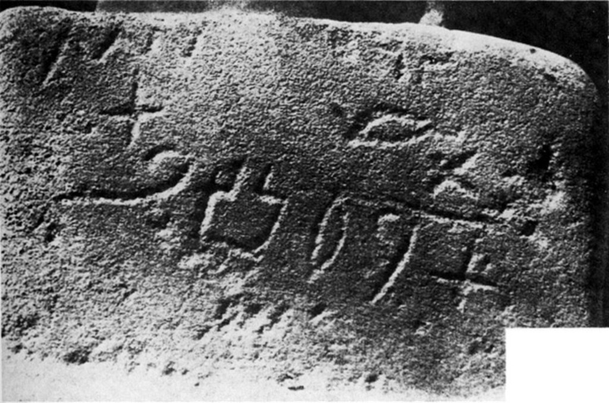
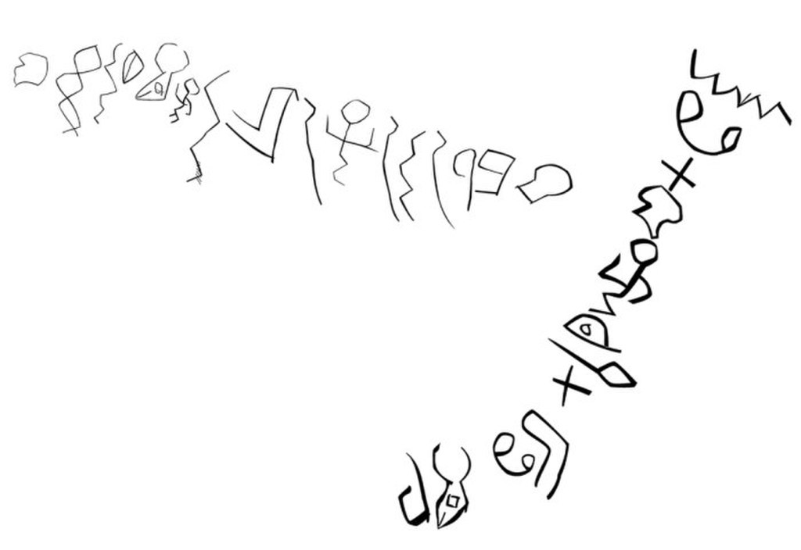
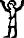
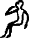
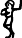
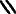
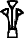

Proto-Sinaitic script

Proto-Sinaitic inscription #346, the first published photograph of the script. The line running from the upper left to lower right may read _mt l bʿlt_ '... to the Lady'

Script type

[Abjad](https://en.wikipedia.org/wiki/Abjad "Abjad")

Period

c. 19th–16th centuries BC

Direction

Mixed

Languages

[Canaanite languages](https://en.wikipedia.org/wiki/Canaanite_languages "Canaanite languages")

Related scripts

Parent systems

[Egyptian hieroglyphs](https://en.wikipedia.org/wiki/Egyptian_hieroglyphs "Egyptian hieroglyphs")

*   Proto-Sinaitic script

Child systems

*   [Phoenician](https://en.wikipedia.org/wiki/Phoenician_alphabet "Phoenician alphabet")
*   [South Semitic](https://en.wikipedia.org/wiki/South_Semitic_scripts "South Semitic scripts")
*   ? [Ugaritic](https://en.wikipedia.org/wiki/Ugaritic_alphabet "Ugaritic alphabet")

ISO 15924

[ISO 15924](https://en.wikipedia.org/wiki/ISO_15924 "ISO 15924")

Psin (103), ​Proto-Sinaitic

The **Proto-Sinaitic script** is a [Middle Bronze Age](https://en.wikipedia.org/wiki/Middle_Bronze_Age "Middle Bronze Age") writing system known from a small corpus of about [30–40 inscriptions and fragments from Serabit el-Khadim](https://en.wikipedia.org/wiki/Serabit_el-Khadim_proto-Sinaitic_inscriptions "Serabit el-Khadim proto-Sinaitic inscriptions") in the [Sinai Peninsula](https://en.wikipedia.org/wiki/Sinai_Peninsula "Sinai Peninsula"), as well as [two inscriptions from Wadi el-Hol](https://en.wikipedia.org/wiki/Wadi_el-Hol_inscriptions "Wadi el-Hol inscriptions") in [Middle Egypt](https://en.wikipedia.org/wiki/Middle_Egypt "Middle Egypt"). Together with about 20 known [Proto-Canaanite](https://en.wikipedia.org/wiki/Proto-Canaanite_alphabet "Proto-Canaanite alphabet") inscriptions, it is also known as **Early Alphabetic**, i.e. the [earliest trace of alphabetic writing](https://en.wikipedia.org/wiki/History_of_the_alphabet "History of the alphabet") and the common ancestor of the [Paleo-Hebrew alphabet](https://en.wikipedia.org/wiki/Paleo-Hebrew_alphabet "Paleo-Hebrew alphabet"), the [Ancient South Arabian script](https://en.wikipedia.org/wiki/Ancient_South_Arabian_script "Ancient South Arabian script") and the [Phoenician alphabet](https://en.wikipedia.org/wiki/Phoenician_alphabet "Phoenician alphabet"), which led to many modern alphabets including the [Greek alphabet](https://en.wikipedia.org/wiki/Greek_alphabet "Greek alphabet") and, subsequently, the [Latin alphabet](https://en.wikipedia.org/wiki/Latin_alphabet "Latin alphabet"). According to common theory, [Israelites](https://en.wikipedia.org/wiki/Israelites "Israelites"), [Canaanites](https://en.wikipedia.org/wiki/Canaan "Canaan") or [Hyksos](https://en.wikipedia.org/wiki/Hyksos "Hyksos") who spoke a [Canaanite language](https://en.wikipedia.org/wiki/Canaanite_language "Canaanite language") repurposed Egyptian [hieroglyphs](https://en.wikipedia.org/wiki/Hieroglyph "Hieroglyph") to construct a different script.

The earliest Proto-Sinaitic inscriptions are mostly dated to between the mid-19th (early date) and the mid-16th (late date) century BC.

> The principal debate is between an early date, around 1850 BC, and a late date, around 1550 BC. The choice of one or the other date decides whether it is proto-Sinaitic or proto-Canaanite, and by extension locates the invention of the alphabet in Egypt or Canaan respectively.

However, the discovery of the two Wadi el-Hol inscriptions near the Nile River suggests that the script originated in Egypt. The evolution of Proto-Sinaitic and the small number of Proto-Canaanite inscriptions from the Bronze Age is based on rather scant [epigraphic](https://en.wikipedia.org/wiki/Epigraphy "Epigraphy") evidence; it is only with the [Bronze Age collapse](https://en.wikipedia.org/wiki/Bronze_Age_collapse "Bronze Age collapse") and the rise of new [Semitic kingdoms](https://en.wikipedia.org/wiki/Neo-Hittite_states "Neo-Hittite states") in the Levant that Proto-Canaanite is clearly attested ([Byblos inscriptions](https://en.wikipedia.org/wiki/Byblian_royal_inscriptions "Byblian royal inscriptions") 10th–8th century BC, [Khirbet Qeiyafa inscription](https://en.wikipedia.org/wiki/Khirbet_Qeiyafa_ostracon "Khirbet Qeiyafa ostracon") c. 10th century BC).

The first published group of Proto-Sinaitic inscriptions were discovered in the winter of 1904–1905 in [Sinai](https://en.wikipedia.org/wiki/Sinai_Peninsula "Sinai Peninsula") by [Hilda](https://en.wikipedia.org/wiki/Hilda_Petrie "Hilda Petrie") and [Flinders Petrie](https://en.wikipedia.org/wiki/Flinders_Petrie "Flinders Petrie"). These ten inscriptions, plus an eleventh published by [Raymond Weill](https://en.wikipedia.org/wiki/Raymond_Weill "Raymond Weill") in 1904 from the 1868 notes of [Edward Henry Palmer](https://en.wikipedia.org/wiki/Edward_Henry_Palmer "Edward Henry Palmer"), were reviewed in detail, and numbered (as 345–355), by [Alan Gardiner](https://en.wikipedia.org/wiki/Alan_Gardiner "Alan Gardiner") in 1916. To this were added a number of short Proto-Canaanite inscriptions found in [Canaan](https://en.wikipedia.org/wiki/Canaan "Canaan") and dated to between the 17th and 15th centuries BC, and more recently, the discovery in 1999 of the two [Wadi el-Hol](https://en.wikipedia.org/wiki/Wadi_el-Hol "Wadi el-Hol") inscriptions, found in [Middle Egypt](https://en.wikipedia.org/wiki/Middle_Egypt "Middle Egypt") by [John](https://en.wikipedia.org/wiki/John_Coleman_Darnell "John Coleman Darnell") and [Deborah Darnell](https://en.wikipedia.org/wiki/Deborah_Darnell "Deborah Darnell"). The Wadi el-Hol inscriptions strongly suggest a date of development of Proto-Sinaitic writing from the mid-19th to 18th centuries BC.

## Discovery

> "I am disposed to see in this one of the many alphabets which were in use in the Mediterranean lands long before the fixed alphabet selected by the Phoenicians. A mass of signs was used continuously from 6,000 or 7,000 B.C., until out of it was crystallized the alphabets of the Mediterranean – the Karians and Celtiberians preserving the greatest number of signs, the Semites and Phoenicans keeping fewer... The two systems of writing, pictorial and linear, which Dr. Evans has found to have been used in Crete, long before the Phoenician age, show how several systems were in use. Some of the workmen employed by the Egyptians, probably the Aamu or Retennu – Syrians – who are often named, had this system of linear signs which we have found; they naturally mixed many hieroglyphs with it, borrowed from their masters. And here we have the result, at a date some five centuries before the oldest Phoenician writing that is known. Such seems to be the conclusion that we must reach from the external evidence that we can trace. The ulterior conclusion is very important – namely, that common Syrian workmen, who could not command the skill of an Egyptian sculptor, were familiar with writing at 1500 B.C., and this a writing independent of hieroglyphics and cuneiform. It finally disproves the hypothesis that the Israelites, who came through this region into Egypt and passed back again, could not have used writing. Here we have common Syrian labourers possessing a script which other Semitic peoples of this region must be credited with knowing."

— [Flinders Petrie](https://en.wikipedia.org/wiki/Flinders_Petrie "Flinders Petrie"), 1906, _Researches in Sinai_

> O my god, 「rescue」 \[me\] 「from」 the interior of the mine.
>
> ’l「ḫlṣ」\[n\]「b」t「k」nqb

— Text 350 Steliform rock panel, column ii, left column.

According to William Albright, in his book "The Proto-Sinaitic Inscriptions And Their Decipherment", the first inscriptions in the category now known as Proto-Sinaitic were discovered and copied by E.H Palmer in Wadi Magharah during the winter of 1868–1869. His text was not published until 1904. However, E.H. Palmer notes that he was not the first, others had done work before him and as such his work was more of a "Re-discovery". In the winter of 1905, [Flinders Petrie](https://en.wikipedia.org/wiki/Flinders_Petrie "Flinders Petrie") and his wife [Hilda](https://en.wikipedia.org/wiki/Hilda_Petrie "Hilda Petrie") were conducting a series of archaeological excavations in the [Sinai Peninsula](https://en.wikipedia.org/wiki/Sinai_Peninsula "Sinai Peninsula"). During a dig at [Serabit el-Khadim](https://en.wikipedia.org/wiki/Serabit_el-Khadim "Serabit el-Khadim"), an extremely lucrative [turquoise](https://en.wikipedia.org/wiki/Turquoise "Turquoise") mine used between the [Twelfth](https://en.wikipedia.org/wiki/Twelfth_Dynasty_of_Egypt "Twelfth Dynasty of Egypt") and [Thirteenth Dynasty](https://en.wikipedia.org/wiki/Thirteenth_Dynasty_of_Egypt "Thirteenth Dynasty of Egypt") and again between the [Eighteenth](https://en.wikipedia.org/wiki/Eighteenth_Dynasty_of_Egypt "Eighteenth Dynasty of Egypt") and mid-[Twentieth Dynasty](https://en.wikipedia.org/wiki/Twentieth_Dynasty_of_Egypt "Twentieth Dynasty of Egypt"), Petrie discovered a series of inscriptions at the site's massive invocative temple to [Hathor](https://en.wikipedia.org/wiki/Hathor "Hathor"), as well as some fragmentary inscriptions in the mines themselves. Petrie immediately recognized hieroglyphic characters in the inscriptions, but upon closer inspection realized the script was not the combination of [logograms](https://en.wikipedia.org/wiki/Logograms "Logograms") and [syllabics](https://en.wikipedia.org/wiki/Syllabary "Syllabary") as in Egyptian script proper. He thus assumed that the inscriptions showed a script that the turquoise miners had devised themselves, using linear signs that they had borrowed from hieroglyphics. He published his findings in London the following year.

Ten years later, in 1916, [Alan Gardiner](https://en.wikipedia.org/wiki/Alan_Gardiner "Alan Gardiner"), one of the premier [Egyptologists](https://en.wikipedia.org/wiki/Egyptology "Egyptology") of the early and mid-20th century, published his own interpretation of Petrie's findings, arguing that the [glyphs](https://en.wikipedia.org/wiki/Glyph "Glyph") appeared to be early versions of the signs used for later [Semitic languages](https://en.wikipedia.org/wiki/Semitic_languages "Semitic languages") such as [Phoenician](https://en.wikipedia.org/wiki/Phoenician_language "Phoenician language"), and was able to assign sound values and reconstructed names to some of the letters by assuming they represented what would later become the common Semitic [abjad](https://en.wikipedia.org/wiki/Abjad "Abjad"). One example was the character , to which Gardiner assigned the [⟨b⟩](https://en.wikipedia.org/wiki/Voiced_bilabial_stop "Voiced bilabial stop") sound, on the grounds that it derived from the Egyptian glyph for 'house' , and was very similar to the Phoenician letter  _bet_, whose name derives from the Semitic word for “house”, _bayt_. Using his hypothesis, Gardiner was able to affirm Petrie's hypothesis that the mystery inscriptions were of a religious nature, as his model allowed an often recurring word to be reconstructed as _[l](https://en.wikipedia.org/wiki/Lamedh "Lamedh")[bʿl](https://en.wikipedia.org/wiki/Baal "Baal")[t](https://en.wikipedia.org/wiki/Taw "Taw")_, meaning "to Ba'alat" or more accurately, "to (the) Lady" – that is, the "lady" [Hathor](https://en.wikipedia.org/wiki/Hathor "Hathor"). Likewise, this allowed another recurring word _[m](https://en.wikipedia.org/wiki/Mem "Mem")[ʿ](https://en.wikipedia.org/wiki/Aleph "Aleph")[h](https://en.wikipedia.org/wiki/He_\(letter\) "He (letter)")bʿlt_ to be translated as "Beloved of (the) Lady", a reading which became very acceptable after the [lemma](https://en.wikipedia.org/wiki/Lemma_\(morphology\) "Lemma (morphology)") was found carved underneath a hieroglyphic inscription which read "Beloved of Hathor, Lady of Turquoise". Gardiner's hypothesis allowed researchers to connect the letters of the inscriptions to modern Semitic alphabets, and resulted in the inscriptions becoming much more readable, leading to the immediate acceptance of his hypothesis.

## Development

The letters of the earliest script used for Semitic languages were derived from Egyptian hieroglyphs. In the 19th century, the theory of Egyptian origin competed alongside other theories that the Phoenician script developed from [Akkadian cuneiform](https://en.wikipedia.org/wiki/Akkadian_cuneiform "Akkadian cuneiform"), [Cretan hieroglyphs](https://en.wikipedia.org/wiki/Cretan_hieroglyphs "Cretan hieroglyphs"), the [Cypriot syllabary](https://en.wikipedia.org/wiki/Cypriot_syllabary "Cypriot syllabary"), and [Anatolian hieroglyphs](https://en.wikipedia.org/wiki/Anatolian_hieroglyphs "Anatolian hieroglyphs"). Then the Proto-Sinaitic inscriptions were studied by [Alan Gardiner](https://en.wikipedia.org/wiki/Alan_Gardiner "Alan Gardiner") who identified the word __bʿlt__ "Lady" occurring several times in inscriptions, and also attempted to decipher other words. In the 1950s and 1960s, [William Albright](https://en.wikipedia.org/wiki/William_F._Albright "William F. Albright") published interpretations of Proto-Sinaitic as the key to show the derivation of the Canaanite alphabet from [hieratic](https://en.wikipedia.org/wiki/Hieratic "Hieratic").

According to the "alphabet theory", the early Semitic proto-alphabet reflected in the Proto-Sinaitic inscriptions would have given rise to both the [Ancient South Arabian script](https://en.wikipedia.org/wiki/Ancient_South_Arabian_script "Ancient South Arabian script") and the [Proto-Canaanite alphabet](https://en.wikipedia.org/wiki/Proto-Canaanite_alphabet "Proto-Canaanite alphabet") by the time of the [Late Bronze Age collapse](https://en.wikipedia.org/wiki/Late_Bronze_Age_collapse "Late Bronze Age collapse") (1200–1150 BC).

For example, the hieroglyph for [_pr_](https://en.wikipedia.org/wiki/Pr_\(hieroglyph\) "Pr (hieroglyph)") "house" (a rectangle partially open along one side, "O1" in [Gardiner's sign list](https://en.wikipedia.org/wiki/Gardiner's_sign_list "Gardiner's sign list")) was adopted to write Semitic /b/, after the first consonant of _baytu_, the Semitic word for "house".

A transitional stage between Proto-Canaanite and Old Phoenician (1000–800 BC) has been proposed by authors such as Werner Pichler as the origin of the [Libyco-Berber](https://en.wikipedia.org/wiki/Tifinagh "Tifinagh") script used among [Ancient Libyans](https://en.wikipedia.org/wiki/Ancient_Libya "Ancient Libya") (i.e. [Proto-Berbers](https://en.wikipedia.org/wiki/Proto-Berber_language "Proto-Berber language")) – citing common similarities to both Proto-Canaanite proper and its early North Arabian descendants.

## Inscriptions

### Serabit inscriptions

The Sinai inscriptions are best known from the [Serabit el-Khadim proto-Sinaitic inscriptions](https://en.wikipedia.org/wiki/Serabit_el-Khadim_proto-Sinaitic_inscriptions "Serabit el-Khadim proto-Sinaitic inscriptions"), carved [graffiti](https://en.wikipedia.org/wiki/Graffiti "Graffiti") and [votive](https://en.wikipedia.org/wiki/Votive "Votive") texts from a mountain in the Sinai called [Serabit el-Khadim](https://en.wikipedia.org/wiki/Serabit_el-Khadim "Serabit el-Khadim") and its temple to the Egyptian goddess [Hathor](https://en.wikipedia.org/wiki/Hathor "Hathor") (__ḥwt-ḥr__). The mountain contained [turquoise](https://en.wikipedia.org/wiki/Turquoise "Turquoise") mines which were visited by repeated expeditions over 800 years. Many of the workers and officials were from the [Nile Delta](https://en.wikipedia.org/wiki/Nile_Delta "Nile Delta"), and included large numbers of Semitic peoples (i.e. speakers of an early form of [Northwest Semitic](https://en.wikipedia.org/wiki/Northwest_Semitic_languages "Northwest Semitic languages") ancestral to the [Canaanite languages](https://en.wikipedia.org/wiki/Canaanite_languages "Canaanite languages") of the Late Bronze Age) who had been allowed to settle the eastern Delta, corresponding to the Israelites as described in the book of [Exodus](https://en.wikipedia.org/wiki/Book_of_Exodus "Book of Exodus").

Most of the forty or so inscriptions have been found among much more numerous [hieratic](https://en.wikipedia.org/wiki/Hieratic "Hieratic") and [hieroglyphic](https://en.wikipedia.org/wiki/Hieroglyphic "Hieroglyphic") inscriptions, scratched on rocks near and in the turquoise mines and along the roads leading to the temple.

The date of the inscriptions is mostly placed in the 17th or 16th century BC. An alternative view dates most of the inscriptions to the reign of [Amenemhat III](https://en.wikipedia.org/wiki/Amenemhat_III "Amenemhat III") or his successor circa 1800 BC. It has been suggested that the dating period includes the reign of pharaoh [Senwosret III](https://en.wikipedia.org/wiki/Senwosret_III "Senwosret III").

Four inscriptions have been found in the temple, on two small human statues and on either side of a small stone [sphinx](https://en.wikipedia.org/wiki/Sphinx "Sphinx"). They are crudely done, suggesting that the workers who made them were illiterate apart from this script.

### Wadi el-Hol inscriptions

Traces of the 16 and 12 characters of the two Wadi el-Hol inscriptions

The two [Wadi el-Hol inscriptions](https://en.wikipedia.org/wiki/Wadi_el-Hol_inscriptions "Wadi el-Hol inscriptions") ([Arabic](https://en.wikipedia.org/wiki/Arabic_language "Arabic language"): وادي الهول _Wādī al-Hawl_ 'Ravine of Terror') were carved on the stone sides of an ancient high-desert military and trade road linking [Thebes](https://en.wikipedia.org/wiki/Thebes,_Egypt "Thebes, Egypt") and [Abydos](https://en.wikipedia.org/wiki/Abydos,_Egypt "Abydos, Egypt"), in the heart of literate Egypt. They have been dated to somewhere between 1900 and 1800 BC. They are in a [wadi](https://en.wikipedia.org/wiki/Wadi "Wadi") in the [Qena](https://en.wikipedia.org/wiki/Qena "Qena") bend of the Nile, at approx. [25°57′N 32°25′E / 25.950°N 32.417°E / 25.950; 32.417](https://geohack.toolforge.org/geohack.php?pagename=Proto-Sinaitic_script&params=25_57_N_32_25_E_), among dozens of hieratic and hieroglyphic inscriptions. Rock inscriptions in the valley appear to show the oldest examples of phonetic alphabetic writing discovered to date.

The inscriptions are graphically very similar to the Serabit inscriptions, but show a greater hieroglyphic influence, such as a glyph for a man that was apparently not read alphabetically: The first of these (_h1_) is a figure of celebration \[Gardiner A28\], whereas the second (_h2_) is either that of a child \[Gardiner A17\] or of dancing \[Gardiner A32\]. If the latter, _h1_ and _h2_ may be graphic variants (such as two hieroglyphs both used to write the Canaanite word _hillul_ "jubilation" corresponding to הלל hallel or hillel in Hebrew) rather than different consonants.

[Hieroglyphs](https://en.wikipedia.org/wiki/Hieroglyph "Hieroglyph") representing, reading left to right, celebration, a child, and dancing. The first appears to be the prototype for _h1,_ while the latter two have been suggested as the prototype for _h2._

Brian Colless has published a translation of the text, in which some of the signs are treated as [logograms](https://en.wikipedia.org/wiki/Logogram "Logogram") (representing a whole word, not just a single consonant) or [rebuses](https://en.wikipedia.org/wiki/Rebus "Rebus"):

: \[Vertical\] mšt r h ʿnt ygš ʾl : \[Vertical\] Excellent banquet (mšt r\[ʾš\]) of the celebration (h\[illul\]) of ʿAnat (ʿnt). \[It\] will provide (ygš) ʾEl (ʾl) : \[Horizontal\] rb wn mn h ngṯ h ʾ p mẖ r : \[Horizontal\] plenty (rb) of wine (wn) \[and\] victuals (mn) for the celebration (h\[illul\]). We will sacrifice (ngṯ) to her (h) an ox (ʾ‍\[lp\]) and (p) a prime fatling (mẖ r\[ʾš\])."

Here, _[aleph](https://en.wikipedia.org/wiki/Aleph "Aleph")_, whose glyph depicts the head of an ox, is a logogram used to represent the word "ox" (_\***ʾa**lp_), _[he](https://en.wikipedia.org/wiki/He_\(letter\) "He (letter)")_, whose glyph depicts a man in celebration, is a logogram for the words "celebration" (_\***h**illul_) and "she/her" (_**h**iʾ‎_‍), and _[resh](https://en.wikipedia.org/wiki/Resh "Resh")_, whose glyph depicts a man's head, is a logogram for the word "utmost/greatest" (_\***r**aʾš_). This interpretation fits into the pattern in some of the surrounding Egyptian inscriptions, with celebrations for the goddess Hathor involving inebriation.

### Other possible inscriptions

Archaeological excavations at the site of [Umm el-Marra](https://en.wikipedia.org/wiki/Umm_el-Marra "Umm el-Marra") have uncovered four inscribed clay cylinders dating to ca. 2300 BC whose incisions have been hypothesized to be Early Alphabetic Semitic writing, which would make them the oldest such examples.

In 2009, [Stephanie Dalley](https://en.wikipedia.org/wiki/Stephanie_Dalley "Stephanie Dalley") published several tablets from the [Schøyen Collection](https://en.wikipedia.org/wiki/Schøyen_Collection "Schøyen Collection") dating to the times of the [First Sealand dynasty](https://en.wikipedia.org/wiki/First_Sealand_dynasty "First Sealand dynasty"), four of which have been identified as examples of Early Alphabetic inscriptions. Other probable examples of Early Alphabetic inscriptions include an ostracon from a tomb in western [Thebes](https://en.wikipedia.org/wiki/Thebes,_Egypt "Thebes, Egypt") and an inscribed sherd from [Lachish](https://en.wikipedia.org/wiki/Lachish "Lachish"), both dating to the 15th century BC.

In 2010, Stefan Wimmer published an inscription discovered at [Timna Valley](https://en.wikipedia.org/wiki/Timna_Valley "Timna Valley") which he also identified as written in proto-Sinaitic writing, although he also noted that its authenticity is not certain.

## Table of symbols

Below is a table synoptically showing selected Proto-Sinaitic signs and the proposed correspondences with Phoenician letters and Egyptian hieroglyphs. Each glyph's inscription of origin is listed in parentheses. A full repertoire of the currently known letterforms can be found on pages 8 and 9 here: [https://www.unicode.org/L2/L2019/19299-revisiting-proto-sinaitic.pdf](https://www.unicode.org/L2/L2019/19299-revisiting-proto-sinaitic.pdf). Also shown are the reconstructed sound values and names.

Possible ancestral [hieroglyph](https://en.wikipedia.org/wiki/Egyptian_hieroglyphs "Egyptian hieroglyphs")[Serabit El-Khadim](https://en.wikipedia.org/wiki/Serabit_el-Khadim_proto-Sinaitic_inscriptions "Serabit el-Khadim proto-Sinaitic inscriptions")[Wadi El-Hol](https://en.wikipedia.org/wiki/Wadi_el-Hol_inscriptions "Wadi el-Hol inscriptions")Timna[IPA](https://en.wikipedia.org/wiki/International_Phonetic_Alphabet "International Phonetic Alphabet") valueReconstructed name[Phoenician](https://en.wikipedia.org/wiki/Phoenician_alphabet "Phoenician alphabet")/[Paleo-Hebrew alphabet](https://en.wikipedia.org/wiki/Paleo-Hebrew_alphabet "Paleo-Hebrew alphabet")

[𓃾](https://en.wikipedia.org/wiki/List_of_Egyptian_hieroglyphs#F1 "List of Egyptian hieroglyphs")

—N/a

/ʔ/

[ʾalp](https://en.wikipedia.org/wiki/ʾalp "ʾalp") "ox"

𐤀

[𓉐](https://en.wikipedia.org/wiki/List_of_Egyptian_hieroglyphs#O1 "List of Egyptian hieroglyphs")

(346)

—N/a

—N/a

/b/

[bayt](https://en.wikipedia.org/wiki/Bet_\(letter\) "Bet (letter)") "house"

𐤁

[𓉔](https://en.wikipedia.org/wiki/List_of_Egyptian_hieroglyphs#O4 "List of Egyptian hieroglyphs")

—N/a

—N/a

[𓌙](https://en.wikipedia.org/wiki/List_of_Egyptian_hieroglyphs#T14 "List of Egyptian hieroglyphs")

—N/a

—N/a

/g/

[gaml](https://en.wikipedia.org/wiki/Gimel "Gimel") "throw-stick"

𐤂

[𓉿](https://en.wikipedia.org/wiki/List_of_Egyptian_hieroglyphs#O31 "List of Egyptian hieroglyphs")

(367)

—N/a

—N/a

/d/

[dalt](https://en.wikipedia.org/wiki/Dalet "Dalet") "door"

𐤃

[𓆟](https://en.wikipedia.org/wiki/List_of_Egyptian_hieroglyphs#K5 "List of Egyptian hieroglyphs") or

[𓆡](https://en.wikipedia.org/wiki/List_of_Egyptian_hieroglyphs#K7 "List of Egyptian hieroglyphs")

(346)

—N/a

—N/a

[dag](https://en.wikipedia.org/wiki/Dalet "Dalet") "fish"

[𓀠](https://en.wikipedia.org/wiki/List_of_Egyptian_hieroglyphs#A28 "List of Egyptian hieroglyphs")

(354)

—N/a

—N/a

/h/

[haw](https://en.wikipedia.org/wiki/He_\(letter\) "He (letter)") "man calling"/ [hll](https://en.wikipedia.org/wiki/He_\(letter\) "He (letter)") "jubilate"

𐤄

[𓀁](https://en.wikipedia.org/wiki/List_of_Egyptian_hieroglyphs#A2 "List of Egyptian hieroglyphs")

—N/a

—N/a

[𓌉](https://en.wikipedia.org/wiki/List_of_Egyptian_hieroglyphs#T3 "List of Egyptian hieroglyphs")

?

—N/a

/w/

[waw](https://en.wikipedia.org/wiki/Waw_\(letter\) "Waw (letter)") "hook"

𐤅

[𓏭](https://en.wikipedia.org/wiki/List_of_Egyptian_hieroglyphs#Z4 "List of Egyptian hieroglyphs") or

[𓂃](https://en.wikipedia.org/wiki/List_of_Egyptian_hieroglyphs#D13 "List of Egyptian hieroglyphs")

—N/a

/z/ or /ð/

[zayn](https://en.wikipedia.org/wiki/Zayin "Zayin") "weapon" or [ḏayp](https://en.wikipedia.org/wiki/Zayin "Zayin") "eyebrow"

𐤆

[𓉗](https://en.wikipedia.org/wiki/List_of_Egyptian_hieroglyphs#O6 "List of Egyptian hieroglyphs") or

[𓉿](https://en.wikipedia.org/wiki/List_of_Egyptian_hieroglyphs#O31 "List of Egyptian hieroglyphs")

(362)

—N/a

—N/a

/ħ/

[ḥaṣir](https://en.wikipedia.org/wiki/Heth "Heth") "mansion"

𐤇

[𓎛](https://en.wikipedia.org/wiki/List_of_Egyptian_hieroglyphs#V28 "List of Egyptian hieroglyphs")

(349)

/x/

[ḫayt](https://en.wikipedia.org/wiki/Heth "Heth") "thread"

[𓄤](https://en.wikipedia.org/wiki/List_of_Egyptian_hieroglyphs#F35 "List of Egyptian hieroglyphs")

—N/a

—N/a

/tˤ/

[ṭab](https://en.wikipedia.org/wiki/Teth "Teth") "good"

𐤈

[𓂝](https://en.wikipedia.org/wiki/List_of_Egyptian_hieroglyphs#D36 "List of Egyptian hieroglyphs")

 

—N/a

/j/

[yad](https://en.wikipedia.org/wiki/Yodh "Yodh") "hand"

𐤉

[𓂧](https://en.wikipedia.org/wiki/List_of_Egyptian_hieroglyphs#D46 "List of Egyptian hieroglyphs")

(363)

—N/a

/k/

[kap](https://en.wikipedia.org/wiki/Kaph "Kaph") "palm"

𐤊

[𓍢](https://en.wikipedia.org/wiki/List_of_Egyptian_hieroglyphs#V1 "List of Egyptian hieroglyphs") or

[𓋿](https://en.wikipedia.org/wiki/List_of_Egyptian_hieroglyphs#S39 "List of Egyptian hieroglyphs")

(358)

(348)

?

/l/

[lamd](https://en.wikipedia.org/wiki/Lamedh "Lamedh") "goad"

𐤋

[𓈖](https://en.wikipedia.org/wiki/List_of_Egyptian_hieroglyphs#N35 "List of Egyptian hieroglyphs")

(354)

/m/

[maym](https://en.wikipedia.org/wiki/Mem "Mem") "water"

𐤌

[𓆓](https://en.wikipedia.org/wiki/List_of_Egyptian_hieroglyphs#I10 "List of Egyptian hieroglyphs")

—N/a

/n/

[naḥš](https://en.wikipedia.org/wiki/Nun_\(letter\) "Nun (letter)") "snake"

𐤍

[𓊽](https://en.wikipedia.org/wiki/List_of_Egyptian_hieroglyphs#R11 "List of Egyptian hieroglyphs")

—N/a

—N/a

—N/a

/s/

[samk](https://en.wikipedia.org/wiki/Samekh "Samekh") "support"

𐤎

[𓁹](https://en.wikipedia.org/wiki/List_of_Egyptian_hieroglyphs#D4 "List of Egyptian hieroglyphs")

/ʕ/

[ʿayn](https://en.wikipedia.org/wiki/ʿen "ʿen") "eye"

𐤏

[𓂋](https://en.wikipedia.org/wiki/List_of_Egyptian_hieroglyphs#D21 "List of Egyptian hieroglyphs")

(346)

—N/a

—N/a

/p/

[pay](https://en.wikipedia.org/wiki/Pe_\(Semitic_letter\) "Pe (Semitic letter)") "mouth"

𐤐

[𓂏](https://en.wikipedia.org/wiki/List_of_Egyptian_hieroglyphs#D25 "List of Egyptian hieroglyphs")?

[𓇳](https://en.wikipedia.org/wiki/List_of_Egyptian_hieroglyphs#N5 "List of Egyptian hieroglyphs")

—N/a

—N/a

[𓊋](https://en.wikipedia.org/wiki/List_of_Egyptian_hieroglyphs#O38 "List of Egyptian hieroglyphs")

—N/a

[pi](https://en.wikipedia.org/wiki/Pe_\(Semitic_letter\) "Pe (Semitic letter)")[ʾ](https://en.wikipedia.org/wiki/ʾalp "ʾalp")t "corner"

[𓇑](https://en.wikipedia.org/wiki/List_of_Egyptian_hieroglyphs#M22 "List of Egyptian hieroglyphs") or

[𓇉](https://en.wikipedia.org/wiki/List_of_Egyptian_hieroglyphs#M16 "List of Egyptian hieroglyphs")

(356)

—N/a

—N/a

/sˤ/

[ṣad](https://en.wikipedia.org/wiki/Tsade "Tsade") "plant"

𐤑

𓫪

—N/a

—N/a

/kˤ/ or /q/

[qup](https://en.wikipedia.org/wiki/Qoph "Qoph") "monkey"

𐤒

[𓎗](https://en.wikipedia.org/wiki/List_of_Egyptian_hieroglyphs#V24 "List of Egyptian hieroglyphs")

—N/a

—N/a

—N/a

[qaw](https://en.wikipedia.org/wiki/Qoph "Qoph") "cord, line"

[𓁶](https://en.wikipedia.org/wiki/List_of_Egyptian_hieroglyphs#D1 "List of Egyptian hieroglyphs") or

[𓂉](https://en.wikipedia.org/wiki/List_of_Egyptian_hieroglyphs#D19 "List of Egyptian hieroglyphs")

(352)

/r/

[raʾš](https://en.wikipedia.org/wiki/Resh "Resh") "head"

𐤓

𓻔

—N/a

/ʃ/

[šamš](https://en.wikipedia.org/wiki/Shin_\(letter\) "Shin (letter)") "sun"

𐤔

(357)

—N/a

—N/a

[𓌔](https://en.wikipedia.org/wiki/List_of_Egyptian_hieroglyphs#T10 "List of Egyptian hieroglyphs") or

[𓐮](https://en.wikipedia.org/wiki/List_of_Egyptian_hieroglyphs#Aa32 "List of Egyptian hieroglyphs")?

(357)

(348)

—N/a

/t͡θ/

[ṯad](https://en.wikipedia.org/wiki/Shin_\(letter\) "Shin (letter)") "breast"

[𓏴](https://en.wikipedia.org/wiki/List_of_Egyptian_hieroglyphs#Z9 "List of Egyptian hieroglyphs")?

—N/a

/t/

[taw](https://en.wikipedia.org/wiki/Tav_\(letter\) "Tav (letter)") "mark"

𐤕
