In [physics](/source/physics/ "Physics"), **string theory** is a [theoretical framework](https://en.wikipedia.org/wiki/Mathematical_theory "Mathematical theory") in which the [point-like particles](https://en.wikipedia.org/wiki/Point_particle "Point particle") of [particle physics](https://en.wikipedia.org/wiki/Particle_physics "Particle physics") are replaced by [one-dimensional](https://en.wikipedia.org/wiki/Dimension_\(mathematics_and_physics\) "Dimension (mathematics and physics)") objects called [strings](https://en.wikipedia.org/wiki/String_\(physics\) "String (physics)"). String theory describes how these strings propagate through space and interact with each other. On distance scales larger than the string scale, a string acts like a particle, with its [mass](https://en.wikipedia.org/wiki/Mass "Mass"), [charge](https://en.wikipedia.org/wiki/Charge_\(physics\) "Charge (physics)"), and other properties determined by the [vibrational](https://en.wikipedia.org/wiki/Vibration "Vibration") state of the string. In string theory, one of the many vibrational states of the string corresponds to the [graviton](https://en.wikipedia.org/wiki/Graviton "Graviton"), a [quantum mechanical](/source/quantum-mechanics/ "Quantum mechanics") particle that carries the [gravitational force](https://en.wikipedia.org/wiki/Gravity "Gravity"). Thus, string theory is a theory of [quantum gravity](https://en.wikipedia.org/wiki/Quantum_gravity "Quantum gravity").

String theory is a broad and varied subject that attempts to address a number of deep questions of [fundamental physics](https://en.wikipedia.org/wiki/Fundamental_physics "Fundamental physics"). String theory has contributed a number of advances to [mathematical physics](https://en.wikipedia.org/wiki/Mathematical_physics "Mathematical physics"), which have been applied to a variety of problems in [black hole](https://en.wikipedia.org/wiki/Black_hole "Black hole") physics, early universe [cosmology](https://en.wikipedia.org/wiki/Physical_cosmology "Physical cosmology"), [nuclear physics](https://en.wikipedia.org/wiki/Nuclear_physics "Nuclear physics"), and [condensed matter physics](https://en.wikipedia.org/wiki/Condensed_matter_physics "Condensed matter physics"), and it has stimulated a number of major developments in [pure mathematics](https://en.wikipedia.org/wiki/Pure_mathematics "Pure mathematics"). Because string theory potentially provides a unified description of gravity and particle physics, it is a candidate for a [theory of everything](https://en.wikipedia.org/wiki/Theory_of_everything "Theory of everything"), a self-contained [mathematical model](https://en.wikipedia.org/wiki/Mathematical_model "Mathematical model") that describes all [fundamental forces](https://en.wikipedia.org/wiki/Fundamental_interaction "Fundamental interaction") and forms of [matter](https://en.wikipedia.org/wiki/Matter "Matter"). Despite much work on these problems, it is not known to what extent string theory describes the real world or how much freedom the theory allows in the choice of its details.

String theory was first studied in the late 1960s as a theory of the [strong nuclear force](https://en.wikipedia.org/wiki/Strong_nuclear_force "Strong nuclear force"), before being abandoned in favor of [quantum chromodynamics](https://en.wikipedia.org/wiki/Quantum_chromodynamics "Quantum chromodynamics"). Because of this, it was realized that the very properties that made string theory unsuitable as a theory of nuclear physics made it a promising candidate for a quantum theory of gravity. The earliest version of string theory, [bosonic string theory](https://en.wikipedia.org/wiki/Bosonic_string_theory "Bosonic string theory"), incorporated only the class of [particles](https://en.wikipedia.org/wiki/Particle "Particle") known as [bosons](https://en.wikipedia.org/wiki/Boson "Boson"). It later developed into [superstring theory](https://en.wikipedia.org/wiki/Superstring_theory "Superstring theory"), which posits a connection called [supersymmetry](/source/supersymmetry/ "Supersymmetry") between bosons and the class of particles called [fermions](https://en.wikipedia.org/wiki/Fermion "Fermion"). Five consistent versions of superstring theory were developed before it was conjectured in the mid-1990s that they were all different limiting cases of a single theory in eleven dimensions known as [M-theory](/source/m-theory/ "M-theory"). In late 1997, theorists discovered an important relationship called the [anti-de Sitter/conformal field theory correspondence](https://en.wikipedia.org/wiki/Anti-de_Sitter/conformal_field_theory_correspondence "Anti-de Sitter/conformal field theory correspondence") (AdS/CFT correspondence), which relates string theory to another type of physical theory called a [quantum field theory](https://en.wikipedia.org/wiki/Quantum_field_theory "Quantum field theory").

One of the challenges of string theory is that the full theory does not have a satisfactory definition in all circumstances. Another issue is that the theory is thought to describe an enormous [landscape](https://en.wikipedia.org/wiki/String_theory_landscape "String theory landscape") of possible [universes](https://en.wikipedia.org/wiki/Universe "Universe"), which has complicated efforts to develop theories of particle physics based on string theory. These issues have led some in the community to criticize these approaches to physics, and to question the value of continued research on string theory unification.

## Fundamentals

The fundamental objects of string theory are open and closed [strings](https://en.wikipedia.org/wiki/String_\(physics\) "String (physics)").

### Overview

In the 20th century, two theoretical frameworks emerged for formulating the laws of physics. The first is [Albert Einstein](https://en.wikipedia.org/wiki/Albert_Einstein "Albert Einstein")'s [general theory of relativity](https://en.wikipedia.org/wiki/General_theory_of_relativity "General theory of relativity"), a theory that explains the force of [gravity](https://en.wikipedia.org/wiki/Gravity "Gravity") and the structure of [spacetime](https://en.wikipedia.org/wiki/Spacetime "Spacetime") at the macro-level. The other is [quantum mechanics](/source/quantum-mechanics/ "Quantum mechanics"), a completely different formulation, which uses known [probability](https://en.wikipedia.org/wiki/Probability "Probability") principles to describe physical phenomena at the micro-level. By the late 1970s, these two frameworks had proven to be sufficient to explain most of the observed features of the [universe](https://en.wikipedia.org/wiki/Universe "Universe"), from [elementary particles](https://en.wikipedia.org/wiki/Elementary_particle "Elementary particle") to [atoms](https://en.wikipedia.org/wiki/Atom "Atom") to the evolution of stars and the universe as a whole.

In spite of these successes, there are still many problems that remain to be solved. One of the deepest problems in modern physics is the problem of [quantum gravity](https://en.wikipedia.org/wiki/Quantum_gravity "Quantum gravity"). The general theory of relativity is formulated within the framework of [classical physics](https://en.wikipedia.org/wiki/Classical_physics "Classical physics"), whereas the other [fundamental forces](https://en.wikipedia.org/wiki/Fundamental_interaction "Fundamental interaction") are described within the framework of quantum mechanics. A quantum theory of gravity is needed in order to reconcile general relativity with the principles of quantum mechanics, but difficulties arise when one attempts to apply the usual prescriptions of quantum theory to the force of gravity.

String theory is a [theoretical framework](https://en.wikipedia.org/wiki/Mathematical_theory "Mathematical theory") that attempts to address these questions.

The starting point for string theory is the idea that the [point-like particles](https://en.wikipedia.org/wiki/Point_particle "Point particle") of [particle physics](https://en.wikipedia.org/wiki/Particle_physics "Particle physics") can also be modeled as one-dimensional objects called [strings](https://en.wikipedia.org/wiki/String_\(physics\) "String (physics)"). String theory describes how strings propagate through space and interact with each other. In a given version of string theory, there is only one kind of string, which may look like a small loop or segment of ordinary string, and it can [vibrate](https://en.wikipedia.org/wiki/Vibration "Vibration") in different ways. On distance scales larger than the string scale, a string will look just like an ordinary particle consistent with non-string models of elementary particles, with its [mass](https://en.wikipedia.org/wiki/Mass "Mass"), [charge](https://en.wikipedia.org/wiki/Charge_\(physics\) "Charge (physics)"), and other properties determined by the vibrational state of the string. String theory's application as a form of quantum gravity proposes a vibrational state responsible for the [graviton](https://en.wikipedia.org/wiki/Graviton "Graviton"), a yet unproven quantum particle that is theorized to carry gravitational force.

One of the main developments of the past several decades in string theory was the discovery of certain 'dualities'—mathematical transformations that identify one physical theory with another. Physicists studying string theory have discovered a number of these dualities between different versions of string theory, and this has led to the conjecture that all consistent versions of string theory are subsumed in a single framework known as [M-theory](/source/m-theory/ "M-theory").

Studies of string theory have also yielded a number of results on the nature of black holes and the gravitational interaction. There are certain paradoxes that arise when one attempts to understand the quantum aspects of black holes, and work on string theory has attempted to clarify these issues. In late 1997 this line of work culminated in the discovery of the [anti-de Sitter/conformal field theory correspondence](https://en.wikipedia.org/wiki/Anti-de_Sitter/conformal_field_theory_correspondence "Anti-de Sitter/conformal field theory correspondence") (AdS/CFT for short). This is a theoretical result that relates string theory to other physical theories which are better understood theoretically. The AdS/CFT correspondence has implications for the study of black holes and quantum gravity, and it has been applied to other subjects, including [nuclear](https://en.wikipedia.org/wiki/Nuclear_physics "Nuclear physics") and [condensed matter physics](https://en.wikipedia.org/wiki/Condensed_matter_physics "Condensed matter physics").

Since string theory incorporates all of the fundamental interactions, including gravity, many physicists hope that it will eventually be developed to the point where it fully describes our universe, making it a [theory of everything](https://en.wikipedia.org/wiki/Theory_of_everything "Theory of everything"). One of the goals of current research in string theory is to find a solution of the theory that reproduces the observed spectrum of elementary particles, with a small [cosmological constant](https://en.wikipedia.org/wiki/Cosmological_constant "Cosmological constant"), containing [dark matter](https://en.wikipedia.org/wiki/Dark_matter "Dark matter") and a plausible mechanism for [cosmic inflation](https://en.wikipedia.org/wiki/Cosmic_inflation "Cosmic inflation"). While there has been progress toward these goals, it is not known to what extent string theory describes the real world or how much freedom the theory allows in the choice of details.

One of the challenges of string theory is that the full theory does not have a satisfactory definition in all circumstances. The scattering of strings is most straightforwardly defined using the techniques of [perturbation theory](https://en.wikipedia.org/wiki/Perturbation_theory_\(quantum_mechanics\) "Perturbation theory (quantum mechanics)"), but it is not known in general how to define string theory [nonperturbatively](https://en.wikipedia.org/wiki/Non-perturbative "Non-perturbative"). It is also not clear whether there is any principle by which string theory selects its [vacuum state](https://en.wikipedia.org/wiki/Vacuum_state "Vacuum state"), the physical state that determines the properties of our universe. These problems have led some in the community to criticize these approaches to the unification of physics and question the value of continued research on these problems.

### Strings

Interaction in the quantum world: [worldlines](https://en.wikipedia.org/wiki/Worldline "Worldline") of point-like [particles](https://en.wikipedia.org/wiki/Particles "Particles") or a [worldsheet](https://en.wikipedia.org/wiki/Worldsheet "Worldsheet") swept up by closed [strings](https://en.wikipedia.org/wiki/String_\(physics\) "String (physics)") in string theory

The application of quantum mechanics to physical objects such as the [electromagnetic field](https://en.wikipedia.org/wiki/Electromagnetic_field "Electromagnetic field"), which are extended in space and time, is known as [quantum field theory](https://en.wikipedia.org/wiki/Quantum_field_theory "Quantum field theory"). In particle physics, quantum field theories form the basis for our understanding of elementary particles, which are modeled as excitations in the fundamental fields.

In quantum field theory, one typically computes the probabilities of various physical events using the techniques of [perturbation theory](https://en.wikipedia.org/wiki/Perturbation_theory_\(quantum_mechanics\) "Perturbation theory (quantum mechanics)"). Developed by [Richard Feynman](https://en.wikipedia.org/wiki/Richard_Feynman "Richard Feynman") and others in the first half of the twentieth century, perturbative quantum field theory uses special diagrams called [Feynman diagrams](https://en.wikipedia.org/wiki/Feynman_diagram "Feynman diagram") to organize computations. One imagines that these diagrams depict the paths of point-like particles and their interactions.

The starting point for string theory is the idea that the point-like particles of quantum field theory can also be modeled as one-dimensional objects called strings. The interaction of strings is most straightforwardly defined by generalizing the perturbation theory used in ordinary quantum field theory. At the level of Feynman diagrams, this means replacing the one-dimensional diagram representing the path of a point particle by a two-dimensional (2D) surface representing the motion of a string. Unlike in quantum field theory, string theory does not have a full non-perturbative definition, so many of the theoretical questions that physicists would like to answer remain out of reach.

In theories of particle physics based on string theory, the characteristic length scale of strings is assumed to be on the order of the [Planck length](https://en.wikipedia.org/wiki/Planck_length "Planck length"), or 10−35 meters, the scale at which the effects of quantum gravity are believed to become significant. On much larger length scales, such as the scales visible in physics laboratories, such objects would be indistinguishable from zero-dimensional point particles, and the vibrational state of the string would determine the type of particle. One of the vibrational states of a string corresponds to the graviton, a quantum mechanical particle that carries the gravitational force.

The original version of string theory was [bosonic string theory](https://en.wikipedia.org/wiki/Bosonic_string_theory "Bosonic string theory"), but this version described only [bosons](https://en.wikipedia.org/wiki/Bosons "Bosons"), a class of particles that transmit forces between the matter particles, or [fermions](https://en.wikipedia.org/wiki/Fermions "Fermions"). Bosonic string theory was eventually superseded by theories called [superstring theories](https://en.wikipedia.org/wiki/Superstring_theory "Superstring theory"). These theories describe both bosons and fermions, and they incorporate a theoretical idea called [supersymmetry](/source/supersymmetry/ "Supersymmetry"). In theories with supersymmetry, each boson has a counterpart which is a fermion, and vice versa.

There are several versions of superstring theory: [type I](https://en.wikipedia.org/wiki/Type_I_string "Type I string"), [type IIA](https://en.wikipedia.org/wiki/Type_IIA_string "Type IIA string"), [type IIB](https://en.wikipedia.org/wiki/Type_IIB_string "Type IIB string"), and two flavors of [heterotic string](https://en.wikipedia.org/wiki/Heterotic_string "Heterotic string") theory ([_SO_(32)](https://en.wikipedia.org/wiki/Special_orthogonal_group "Special orthogonal group") and [_E_8×_E_8](https://en.wikipedia.org/wiki/E8_\(mathematics\) "E8 (mathematics)")). The different theories allow different types of strings, and the particles that arise at low energies exhibit different [symmetries](https://en.wikipedia.org/wiki/Symmetry_\(physics\) "Symmetry (physics)"). For example, the type I theory includes both open strings (which are segments with endpoints) and closed strings (which form closed loops), while types IIA, IIB and heterotic include only closed strings.

### Extra dimensions

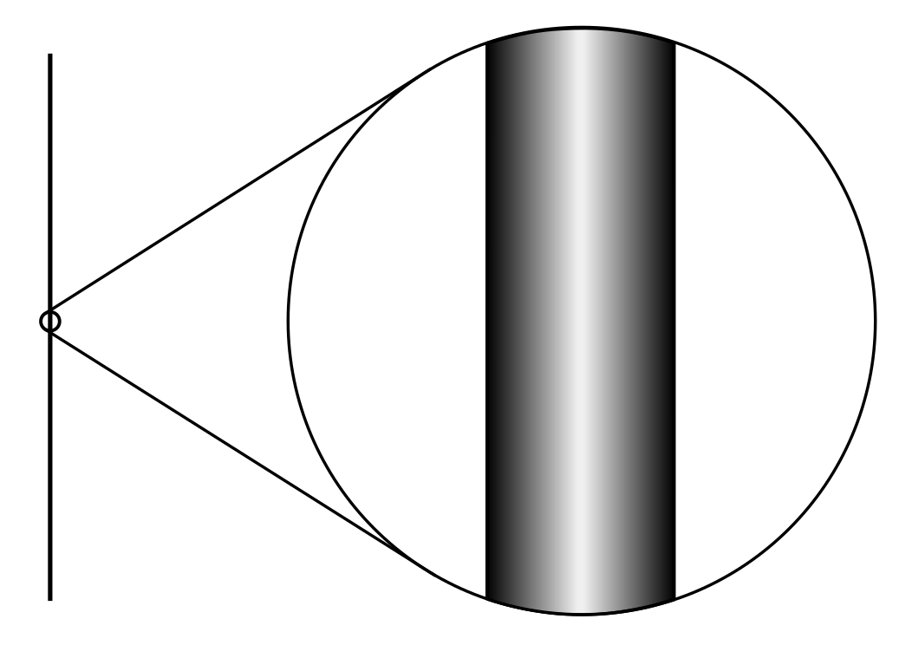An example of [compactification](https://en.wikipedia.org/wiki/Compactification_\(physics\) "Compactification (physics)"): At large distances, a two dimensional surface with one circular dimension looks one-dimensional.

In everyday life, there are three familiar dimensions (3D) of space: height, width and length. Einstein's general theory of relativity treats time as a dimension on par with the three spatial dimensions; in general relativity, space and time are not modeled as separate entities but are instead unified to a four-dimensional (4D) [spacetime](https://en.wikipedia.org/wiki/Spacetime "Spacetime"). In this framework, the phenomenon of gravity is viewed as a consequence of the geometry of spacetime.

In spite of the fact that the Universe is well described by 4D spacetime, there are several reasons why physicists consider theories in other dimensions. In some cases, by modeling spacetime in a different number of dimensions, a theory becomes more mathematically tractable, and one can perform calculations and gain general insights more easily. There are also situations where theories in two or three spacetime dimensions are useful for describing phenomena in condensed matter physics. Finally, there exist scenarios in which there could actually be more than 4D of spacetime which have nonetheless managed to escape detection.

String theories require [extra dimensions](https://en.wikipedia.org/wiki/Extra_dimensions "Extra dimensions") of spacetime for their mathematical consistency. In bosonic string theory, spacetime is 26-dimensional, while in superstring theory it is 10-dimensional, and in [M-theory](/source/m-theory/ "M-theory") it is 11-dimensional. In order to describe real physical phenomena using string theory, one must therefore imagine scenarios in which these extra dimensions would not be observed in experiments.

A cross section of a quintic [Calabi–Yau manifold](https://en.wikipedia.org/wiki/Calabi–Yau_manifold "Calabi–Yau manifold")

[Compactification](https://en.wikipedia.org/wiki/Compactification_\(physics\) "Compactification (physics)") is one way of modifying the number of dimensions in a physical theory. In compactification, some of the extra dimensions are assumed to "close up" on themselves to form circles. In the limit where these curled up dimensions become very small, one obtains a theory in which spacetime has effectively a lower number of dimensions. A standard analogy for this is to consider a multidimensional object such as a garden hose. If the hose is viewed from a sufficient distance, it appears to have only one dimension, its length. However, as one approaches the hose, one discovers that it contains a second dimension, its circumference. Thus, an ant crawling on the surface of the hose would move in two dimensions.

Compactification can be used to construct models in which spacetime is effectively four-dimensional. However, not every way of compactifying the extra dimensions produces a model with the right properties to describe nature. In a viable model of particle physics, the compact extra dimensions must be shaped like a [Calabi–Yau manifold](https://en.wikipedia.org/wiki/Calabi–Yau_manifold "Calabi–Yau manifold"). A Calabi–Yau manifold is a special [space](https://en.wikipedia.org/wiki/Topological_space "Topological space") which is typically taken to be six-dimensional in applications to string theory. It is named after mathematicians [Eugenio Calabi](https://en.wikipedia.org/wiki/Eugenio_Calabi "Eugenio Calabi") and [Shing-Tung Yau](https://en.wikipedia.org/wiki/Shing-Tung_Yau "Shing-Tung Yau").

Another approach to reducing the number of dimensions is the so-called [brane-world](https://en.wikipedia.org/wiki/Brane_cosmology "Brane cosmology") scenario. In this approach, physicists assume that the observable universe is a four-dimensional subspace of a higher dimensional space. In such models, the force-carrying bosons of particle physics arise from open strings with endpoints attached to the four-dimensional subspace, while gravity arises from closed strings propagating through the larger ambient space. This idea plays an important role in attempts to develop models of real-world physics based on string theory, and it provides a natural explanation for the weakness of gravity compared to the other fundamental forces.

### Dualities

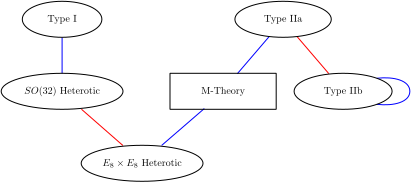A diagram of string theory dualities. Blue edges indicate S-duality. Red edges indicate T-duality.

A notable fact about string theory is that the different versions of the theory all turn out to be related in highly nontrivial ways. One of the relationships that can exist between different string theories is called S-duality. This is a relationship that says that a collection of strongly interacting particles in one theory can, in some cases, be viewed as a collection of weakly interacting particles in a completely different theory. Roughly speaking, a collection of particles is said to be strongly interacting if they combine and decay often and weakly interacting if they do so infrequently. Type I string theory turns out to be equivalent by S-duality to the _SO_(32) heterotic string theory. Similarly, type IIB string theory is related to itself in a nontrivial way by S-duality.

Another relationship between different string theories is [T-duality](https://en.wikipedia.org/wiki/T-duality "T-duality"). Here one considers strings propagating around a circular extra dimension. T-duality states that a string propagating around a circle of radius _R_ is equivalent to a string propagating around a circle of radius 1/_R_ in the sense that all observable quantities in one description are identified with quantities in the dual description. For example, a string has [momentum](https://en.wikipedia.org/wiki/Momentum "Momentum") as it propagates around a circle, and it can also wind around the circle one or more times. The number of times the string winds around a circle is called the [winding number](https://en.wikipedia.org/wiki/Winding_number "Winding number"). If a string has momentum _p_ and winding number _n_ in one description, it will have momentum _n_ and winding number _p_ in the dual description. For example, type IIA string theory is equivalent to type IIB string theory via T-duality, and the two versions of heterotic string theory are also related by T-duality.

In general, the term _duality_ refers to a situation where two seemingly different [physical systems](https://en.wikipedia.org/wiki/Physical_system "Physical system") turn out to be equivalent in a nontrivial way. Two theories related by a duality need not be string theories. For example, [Montonen–Olive duality](https://en.wikipedia.org/wiki/Montonen–Olive_duality "Montonen–Olive duality") is an example of an S-duality relationship between quantum field theories. The AdS/CFT correspondence is an example of a duality that relates string theory to a quantum field theory. If two theories are related by a duality, it means that one theory can be transformed in some way so that it ends up looking just like the other theory. The two theories are then said to be _dual_ to one another under the transformation. Put differently, the two theories are mathematically different descriptions of the same phenomena.

### Branes

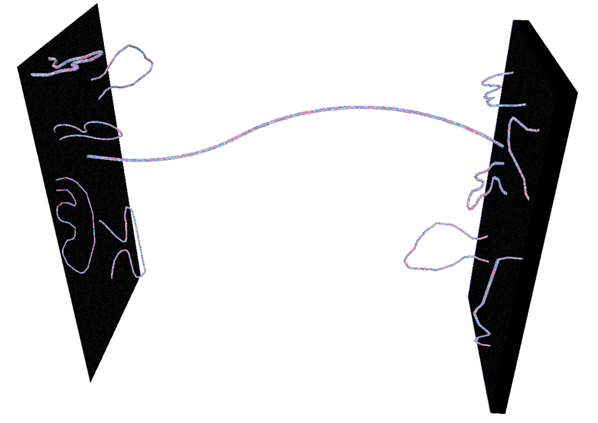Open strings attached to a pair of [D-branes](https://en.wikipedia.org/wiki/D-brane "D-brane")

In string theory and other related theories, a [brane](https://en.wikipedia.org/wiki/Brane "Brane") is a physical object that generalizes the notion of a point particle to higher dimensions. For instance, a point particle can be viewed as a brane of dimension zero, while a string can be viewed as a brane of dimension one. It is also possible to consider higher-dimensional branes. In dimension _p_, these are called _p_-branes. The word brane comes from the word "membrane" which refers to a two-dimensional brane.

Branes are dynamical objects which can propagate through spacetime according to the rules of quantum mechanics. They have mass and can have other attributes such as charge. A _p_-brane sweeps out a (_p_+1)-dimensional volume in spacetime called its _worldvolume_. Physicists often study [fields](https://en.wikipedia.org/wiki/Field_\(physics\) "Field (physics)") analogous to the electromagnetic field which live on the worldvolume of a brane.

In string theory, [D-branes](https://en.wikipedia.org/wiki/D-brane "D-brane") are an important class of branes that arise when one considers open strings. As an open string propagates through spacetime, its endpoints are required to lie on a D-brane. The letter "D" in D-brane refers to a certain mathematical condition on the system known as the [Dirichlet boundary condition](https://en.wikipedia.org/wiki/Dirichlet_boundary_condition "Dirichlet boundary condition"). The study of D-branes in string theory has led to important results such as the AdS/CFT correspondence, which has shed light on many problems in quantum field theory.

Branes are frequently studied from a purely mathematical point of view, and they are described as objects of certain [categories](https://en.wikipedia.org/wiki/Category_\(mathematics\) "Category (mathematics)"), such as the [derived category](https://en.wikipedia.org/wiki/Derived_category "Derived category") of [coherent sheaves](https://en.wikipedia.org/wiki/Coherent_sheaf "Coherent sheaf") on a [complex algebraic variety](https://en.wikipedia.org/wiki/Complex_algebraic_variety "Complex algebraic variety"), or the [Fukaya category](https://en.wikipedia.org/wiki/Fukaya_category "Fukaya category") of a [symplectic manifold](https://en.wikipedia.org/wiki/Symplectic_manifold "Symplectic manifold"). The connection between the physical notion of a brane and the mathematical notion of a category has led to important mathematical insights in the fields of [algebraic](https://en.wikipedia.org/wiki/Algebraic_geometry "Algebraic geometry") and [symplectic geometry](https://en.wikipedia.org/wiki/Symplectic_geometry "Symplectic geometry") and [representation theory](https://en.wikipedia.org/wiki/Representation_theory "Representation theory").

## M-theory

Prior to 1995, theorists believed that there were five consistent versions of superstring theory (type I, type IIA, type IIB, and two versions of heterotic string theory). This understanding changed in 1995 when [Edward Witten](/source/edward-witten/ "Edward Witten") suggested that the five theories were just special limiting cases of an eleven-dimensional theory called M-theory. Witten's conjecture was based on the work of a number of other physicists, including [Ashoke Sen](https://en.wikipedia.org/wiki/Ashoke_Sen "Ashoke Sen"), [Chris Hull](https://en.wikipedia.org/wiki/Chris_Hull "Chris Hull"), [Paul Townsend](https://en.wikipedia.org/wiki/Paul_Townsend "Paul Townsend"), and [Michael Duff](https://en.wikipedia.org/wiki/Michael_Duff_\(physicist\) "Michael Duff (physicist)"). His announcement led to a flurry of research activity now known as the [second superstring revolution](https://en.wikipedia.org/wiki/Second_superstring_revolution "Second superstring revolution").

### Unification of superstring theories

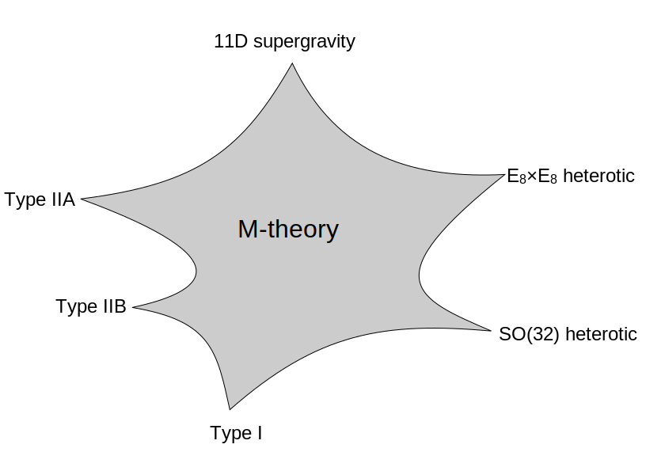A schematic illustration of the relationship between [M-theory](/source/m-theory/ "M-theory"), the five [superstring theories](https://en.wikipedia.org/wiki/Superstring_theory "Superstring theory"), and eleven-dimensional [supergravity](https://en.wikipedia.org/wiki/Supergravity "Supergravity"). The shaded region represents a family of different physical scenarios that are possible in M-theory. In certain limiting cases corresponding to the cusps, it is natural to describe the physics using one of the six theories labeled there.

In the 1970s, many physicists became interested in [supergravity](https://en.wikipedia.org/wiki/Supergravity "Supergravity") theories, which combine general relativity with supersymmetry. Whereas general relativity makes sense in any number of dimensions, supergravity places an upper limit on the number of dimensions. In 1978, work by [Werner Nahm](https://en.wikipedia.org/wiki/Werner_Nahm "Werner Nahm") showed that the maximum spacetime dimension in which one can formulate a consistent supersymmetric theory is eleven. In the same year, [Eugene Cremmer](https://en.wikipedia.org/wiki/Eugene_Cremmer "Eugene Cremmer"), [Bernard Julia](https://en.wikipedia.org/wiki/Bernard_Julia "Bernard Julia"), and [Joël Scherk](https://en.wikipedia.org/wiki/Joël_Scherk "Joël Scherk") of the [École Normale Supérieure](https://en.wikipedia.org/wiki/École_Normale_Supérieure "École Normale Supérieure") showed that supergravity not only permits up to eleven dimensions but is in fact most elegant in this maximal number of dimensions.

Initially, many physicists hoped that by compactifying [eleven-dimensional supergravity](https://en.wikipedia.org/wiki/Eleven-dimensional_supergravity "Eleven-dimensional supergravity"), it might be possible to construct realistic models of our four-dimensional world. The hope was that such models would provide a unified description of the four fundamental forces of nature: electromagnetism, the [strong](https://en.wikipedia.org/wiki/Strong_nuclear_force "Strong nuclear force") and [weak nuclear forces](https://en.wikipedia.org/wiki/Weak_nuclear_force "Weak nuclear force"), and gravity. Interest in eleven-dimensional supergravity soon waned as various flaws in this scheme were discovered. One of the problems was that the laws of physics appear to distinguish between clockwise and counterclockwise, a phenomenon known as [chirality](https://en.wikipedia.org/wiki/Chirality_\(physics\) "Chirality (physics)"). Edward Witten and others observed this chirality property cannot be readily derived by compactifying from eleven dimensions.

In the [first superstring revolution](https://en.wikipedia.org/wiki/First_superstring_revolution "First superstring revolution") in 1984, many physicists turned to string theory as a unified theory of particle physics and quantum gravity. Unlike supergravity theory, string theory was able to accommodate the chirality of the [Standard Model](https://en.wikipedia.org/wiki/Standard_Model "Standard Model"), and it provided a theory of gravity consistent with quantum effects. Another feature of string theory that many physicists were drawn to in the 1980s and 1990s was its high degree of uniqueness. In ordinary particle theories, one can consider any collection of elementary particles whose classical behavior is described by an arbitrary [Lagrangian](https://en.wikipedia.org/wiki/Lagrangian_\(field_theory\) "Lagrangian (field theory)"). In string theory, the possibilities are much more constrained: by the 1990s, physicists had argued that there were only five consistent supersymmetric versions of the theory.

Although there were only a handful of consistent superstring theories, it remained a mystery why there was not just one consistent formulation. However, as physicists began to examine string theory more closely, they realized that these theories are related in intricate and nontrivial ways. They found that a system of strongly interacting strings can, in some cases, be viewed as a system of weakly interacting strings. This phenomenon is known as S-duality. It was studied by Ashoke Sen in the context of heterotic strings in four dimensions and by Chris Hull and Paul Townsend in the context of the type IIB theory. Theorists also found that different string theories may be related by T-duality. This duality implies that strings propagating on completely different spacetime geometries may be physically equivalent.

At around the same time, as many physicists were studying the properties of strings, a small group of physicists were examining the possible applications of higher dimensional objects. In 1987, Eric Bergshoeff, Ergin Sezgin, and Paul Townsend showed that eleven-dimensional supergravity includes two-dimensional branes. Intuitively, these objects look like sheets or membranes propagating through the eleven-dimensional spacetime. Shortly after this discovery, [Michael Duff](https://en.wikipedia.org/wiki/Michael_Duff_\(physicist\) "Michael Duff (physicist)"), Paul Howe, Takeo Inami, and Kellogg Stelle considered a particular compactification of eleven-dimensional supergravity with one of the dimensions curled up into a circle. In this setting, one can imagine the membrane wrapping around the circular dimension. If the radius of the circle is sufficiently small, then this membrane looks just like a string in ten-dimensional spacetime. Duff and his collaborators showed that this construction reproduces exactly the strings appearing in type IIA superstring theory.

Speaking at a string theory conference in 1995, Edward Witten made the surprising suggestion that all five superstring theories were in fact just different limiting cases of a single theory in eleven spacetime dimensions. Witten's announcement drew together all of the previous results on S- and T-duality and the appearance of higher-dimensional branes in string theory. In the months following Witten's announcement, hundreds of new papers appeared on the Internet confirming different parts of his proposal. Today this flurry of work is known as the second superstring revolution.

Initially, some physicists suggested that the new theory was a fundamental theory of membranes, but Witten was skeptical of the role of membranes in the theory. In a paper from 1996, Hořava and Witten wrote "As it has been proposed that the eleven-dimensional theory is a supermembrane theory but there are some reasons to doubt that interpretation, we will non-committally call it the M-theory, leaving to the future the relation of M to membranes." In the absence of an understanding of the true meaning and structure of M-theory, Witten has suggested that the _M_ should stand for "magic", "mystery", or "membrane" according to taste, and the true meaning of the title should be decided when a more fundamental formulation of the theory is known.

### Matrix theory

In mathematics, a [matrix](https://en.wikipedia.org/wiki/Matrix_\(mathematics\) "Matrix (mathematics)") is a rectangular array of numbers or other data. In physics, a [matrix model](https://en.wikipedia.org/wiki/Matrix_theory_\(physics\) "Matrix theory (physics)") is a particular kind of physical theory whose mathematical formulation involves the notion of a matrix in an important way. A matrix model describes the behavior of a set of matrices within the framework of quantum mechanics.

One important example of a matrix model is the BFSS matrix model proposed by [Tom Banks](https://en.wikipedia.org/wiki/Tom_Banks_\(physicist\) "Tom Banks (physicist)"), [Willy Fischler](https://en.wikipedia.org/wiki/Willy_Fischler "Willy Fischler"), [Stephen Shenker](https://en.wikipedia.org/wiki/Stephen_Shenker "Stephen Shenker"), and [Leonard Susskind](https://en.wikipedia.org/wiki/Leonard_Susskind "Leonard Susskind") in 1997. This theory describes the behavior of a set of nine large matrices. In their original paper, these authors showed, among other things, that the low energy limit of this matrix model is described by eleven-dimensional supergravity. These calculations led them to propose that the BFSS matrix model is exactly equivalent to M-theory. The BFSS matrix model can therefore be used as a prototype for a correct formulation of M-theory and a tool for investigating the properties of M-theory in a relatively simple setting.

The development of the matrix model formulation of M-theory has led physicists to consider various connections between string theory and a branch of mathematics called [noncommutative geometry](https://en.wikipedia.org/wiki/Noncommutative_geometry "Noncommutative geometry"). This subject is a generalization of ordinary geometry in which mathematicians define new geometric notions using tools from [noncommutative algebra](https://en.wikipedia.org/wiki/Noncommutative_algebra "Noncommutative algebra"). In a paper from 1998, [Alain Connes](https://en.wikipedia.org/wiki/Alain_Connes "Alain Connes"), [Michael R. Douglas](https://en.wikipedia.org/wiki/Michael_R._Douglas "Michael R. Douglas"), and [Albert Schwarz](https://en.wikipedia.org/wiki/Albert_Schwarz "Albert Schwarz") showed that some aspects of matrix models and M-theory are described by a [noncommutative quantum field theory](https://en.wikipedia.org/wiki/Noncommutative_quantum_field_theory "Noncommutative quantum field theory"), a special kind of physical theory in which spacetime is described mathematically using noncommutative geometry. This established a link between matrix models and M-theory on the one hand, and noncommutative geometry on the other hand. It quickly led to the discovery of other important links between noncommutative geometry and various physical theories.

## Black holes

In general relativity, a black hole is defined as a region of spacetime in which the gravitational field is so strong that no particle or radiation can escape. In the currently accepted models of stellar evolution, black holes are thought to arise when massive stars undergo [gravitational collapse](https://en.wikipedia.org/wiki/Gravitational_collapse "Gravitational collapse"), and many [galaxies](https://en.wikipedia.org/wiki/Galaxies "Galaxies") are thought to contain [supermassive black holes](https://en.wikipedia.org/wiki/Supermassive_black_hole "Supermassive black hole") at their centers. Black holes are also important for theoretical reasons, as they present profound challenges for theorists attempting to understand the quantum aspects of gravity. String theory has proved to be an important tool for investigating the theoretical properties of black holes because it provides a framework in which theorists can study their [thermodynamics](https://en.wikipedia.org/wiki/Black_hole_thermodynamics "Black hole thermodynamics").

### Bekenstein–Hawking formula

In the branch of physics called [statistical mechanics](https://en.wikipedia.org/wiki/Statistical_mechanics "Statistical mechanics"), [entropy](https://en.wikipedia.org/wiki/Entropy "Entropy") is a measure of the randomness or disorder of a physical system. This concept was studied in the 1870s by the Austrian physicist [Ludwig Boltzmann](https://en.wikipedia.org/wiki/Ludwig_Boltzmann "Ludwig Boltzmann"), who showed that the [thermodynamic](https://en.wikipedia.org/wiki/Thermodynamics "Thermodynamics") properties of a [gas](https://en.wikipedia.org/wiki/Gas "Gas") could be derived from the combined properties of its many constituent [molecules](https://en.wikipedia.org/wiki/Molecule "Molecule"). Boltzmann argued that by averaging the behaviors of all the different molecules in a gas, one can understand macroscopic properties such as volume, temperature, and pressure. In addition, this perspective led him to give a precise definition of entropy as the [natural logarithm](https://en.wikipedia.org/wiki/Natural_logarithm "Natural logarithm") of the number of different states of the molecules (also called _microstates_) that give rise to the same macroscopic features.

In the twentieth century, physicists began to apply the same concepts to black holes. In most systems such as gases, the entropy scales with the volume. In the 1970s, the physicist [Jacob Bekenstein](https://en.wikipedia.org/wiki/Jacob_Bekenstein "Jacob Bekenstein") suggested that the entropy of a black hole is instead proportional to the _surface area_ of its [event horizon](https://en.wikipedia.org/wiki/Event_horizon "Event horizon"), the boundary beyond which matter and radiation may escape its gravitational attraction. When combined with ideas of the physicist [Stephen Hawking](https://en.wikipedia.org/wiki/Stephen_Hawking "Stephen Hawking"), Bekenstein's work yielded a precise formula for the entropy of a black hole. The [Bekenstein–Hawking formula](https://en.wikipedia.org/wiki/Bekenstein–Hawking_formula "Bekenstein–Hawking formula") expresses the entropy _S_ as

: $S= \frac{c^3kA}{4\hbar G}$

where _c_ is the [speed of light](https://en.wikipedia.org/wiki/Speed_of_light "Speed of light"), _k_ is the [Boltzmann constant](https://en.wikipedia.org/wiki/Boltzmann_constant "Boltzmann constant"), _ħ_ is the [reduced Planck constant](https://en.wikipedia.org/wiki/Reduced_Planck_constant "Reduced Planck constant"), _G_ is [Newton's constant](https://en.wikipedia.org/wiki/Newton's_constant "Newton's constant"), and _A_ is the surface area of the event horizon.

Like any physical system, a black hole has an entropy defined in terms of the number of different microstates that lead to the same macroscopic features. The Bekenstein–Hawking entropy formula gives the expected value of the entropy of a black hole, but by the 1990s, physicists still lacked a derivation of this formula by counting microstates in a theory of quantum gravity. Finding such a derivation of this formula was considered an important test of the viability of any theory of quantum gravity such as string theory.

### Derivation within string theory

In a paper from 1996, [Andrew Strominger](https://en.wikipedia.org/wiki/Andrew_Strominger "Andrew Strominger") and [Cumrun Vafa](https://en.wikipedia.org/wiki/Cumrun_Vafa "Cumrun Vafa") showed how to derive the Bekenstein–Hawking formula for certain black holes in string theory. Their calculation was based on the observation that D-branes—which look like fluctuating membranes when they are weakly interacting—become dense, massive objects with event horizons when the interactions are strong. In other words, a system of strongly interacting D-branes in string theory is indistinguishable from a black hole. Strominger and Vafa analyzed such D-brane systems and calculated the number of different ways of placing D-branes in spacetime so that their combined mass and charge is equal to a given mass and charge for the resulting black hole. Their calculation reproduced the Bekenstein–Hawking formula exactly, including the factor of 1/4. Subsequent work by Strominger, Vafa, and others refined the original calculations and gave the precise values of the "quantum corrections" needed to describe very small black holes.

The black holes that Strominger and Vafa considered in their original work were quite different from real astrophysical black holes. One difference was that Strominger and Vafa considered only [extremal black holes](https://en.wikipedia.org/wiki/Extremal_black_hole "Extremal black hole") in order to make the calculation tractable. These are defined as black holes with the lowest possible mass compatible with a given charge. Strominger and Vafa also restricted attention to black holes in five-dimensional spacetime with unphysical supersymmetry.

Although it was originally developed in this very particular and physically unrealistic context in string theory, the entropy calculation of Strominger and Vafa has led to a qualitative understanding of how black hole entropy can be accounted for in any theory of quantum gravity. Indeed, in 1998, Strominger argued that the original result could be generalized to an arbitrary consistent theory of quantum gravity without relying on strings or supersymmetry. In collaboration with several other authors in 2010, he showed that some results on black hole entropy could be extended to non-extremal astrophysical black holes.

## AdS/CFT correspondence

One approach to formulating string theory and studying its properties is provided by the anti-de Sitter/conformal field theory (AdS/CFT) correspondence. This is a theoretical result that implies that string theory is in some cases equivalent to a quantum field theory. In addition to providing insights into the mathematical structure of string theory, the AdS/CFT correspondence has shed light on many aspects of quantum field theory in regimes where traditional calculational techniques are ineffective. The AdS/CFT correspondence was first proposed by [Juan Maldacena](https://en.wikipedia.org/wiki/Juan_Maldacena "Juan Maldacena") in late 1997. Important aspects of the correspondence were elaborated in articles by [Steven Gubser](https://en.wikipedia.org/wiki/Steven_Gubser "Steven Gubser"), [Igor Klebanov](https://en.wikipedia.org/wiki/Igor_Klebanov "Igor Klebanov"), and [Alexander Markovich Polyakov](https://en.wikipedia.org/wiki/Alexander_Markovich_Polyakov "Alexander Markovich Polyakov"), and by Edward Witten. By 2010, Maldacena's article had over 7000 citations, becoming the most highly cited article in the field of [high energy physics](https://en.wikipedia.org/wiki/High_energy_physics "High energy physics").

### Overview of the correspondence

A [tessellation](https://en.wikipedia.org/wiki/Tessellation "Tessellation") of the [hyperbolic plane](https://en.wikipedia.org/wiki/Hyperbolic_plane "Hyperbolic plane") [by triangles and squares](https://en.wikipedia.org/wiki/Tritetragonal_tiling "Tritetragonal tiling")

In the AdS/CFT correspondence, the geometry of spacetime is described in terms of a certain [vacuum solution](https://en.wikipedia.org/wiki/Vacuum_solution "Vacuum solution") of [Einstein's equation](https://en.wikipedia.org/wiki/Einstein's_equation "Einstein's equation") called [anti-de Sitter space](https://en.wikipedia.org/wiki/Anti-de_Sitter_space "Anti-de Sitter space"). In very elementary terms, anti-de Sitter space is a mathematical model of spacetime in which the notion of distance between points (the [metric](https://en.wikipedia.org/wiki/Metric_tensor "Metric tensor")) is different from the notion of distance in ordinary [Euclidean geometry](https://en.wikipedia.org/wiki/Euclidean_geometry "Euclidean geometry"). It is closely related to [hyperbolic space](https://en.wikipedia.org/wiki/Hyperbolic_space "Hyperbolic space"), which can be viewed as a [disk](https://en.wikipedia.org/wiki/Poincaré_disk_model "Poincaré disk model") as illustrated on the left, or above. This image shows a [tessellation](https://en.wikipedia.org/wiki/Tessellation "Tessellation") of a disk by triangles and squares. One can define the distance between points of this disk in such a way that all the triangles and squares are the same size and the circular outer boundary is infinitely far from any point in the interior.

One can imagine a stack of hyperbolic disks where each disk represents the state of the universe at a given time. The resulting geometric object is three-dimensional anti-de Sitter space. It looks like a solid [cylinder](https://en.wikipedia.org/wiki/Cylinder_\(geometry\) "Cylinder (geometry)") in which any [cross section](https://en.wikipedia.org/wiki/Cross_section_\(geometry\) "Cross section (geometry)") is a copy of the hyperbolic disk. Time runs along the vertical direction in this picture. The surface of this cylinder plays an important role in the AdS/CFT correspondence. As with the hyperbolic plane, anti-de Sitter space is [curved](https://en.wikipedia.org/wiki/Curvature "Curvature") in such a way that any point in the interior is actually infinitely far from this boundary surface.

Three-dimensional [anti-de Sitter space](https://en.wikipedia.org/wiki/Anti-de_Sitter_space "Anti-de Sitter space") is like a stack of [hyperbolic disks](https://en.wikipedia.org/wiki/Poincaré_disk_model "Poincaré disk model"), each one representing the state of the universe at a given time. The resulting [spacetime](https://en.wikipedia.org/wiki/Spacetime "Spacetime") looks like a solid [cylinder](https://en.wikipedia.org/wiki/Cylinder_\(geometry\) "Cylinder (geometry)").

This construction describes a hypothetical universe with only two space dimensions and one time dimension, but it can be generalized to any number of dimensions. Indeed, hyperbolic space can have more than two dimensions and one can "stack up" copies of hyperbolic space to get higher-dimensional models of anti-de Sitter space.

An important feature of anti-de Sitter space is its boundary (which looks like a cylinder in the case of three-dimensional anti-de Sitter space). One property of this boundary is that, within a small region on the surface around any given point, it looks just like [Minkowski space](https://en.wikipedia.org/wiki/Minkowski_space "Minkowski space"), the model of spacetime used in non-gravitational physics. One can therefore consider an auxiliary theory in which "spacetime" is given by the boundary of anti-de Sitter space. This observation is the starting point for AdS/CFT correspondence, which states that the boundary of anti-de Sitter space can be regarded as the "spacetime" for a quantum field theory. The claim is that this quantum field theory is equivalent to a gravitational theory, such as string theory, in the bulk anti-de Sitter space in the sense that there is a "dictionary" for translating entities and calculations in one theory into their counterparts in the other theory. For example, a single particle in the gravitational theory might correspond to some collection of particles in the boundary theory. In addition, the predictions in the two theories are quantitatively identical so that if two particles have a 40 percent chance of colliding in the gravitational theory, then the corresponding collections in the boundary theory would also have a 40 percent chance of colliding.

### Applications to quantum gravity

The discovery of the AdS/CFT correspondence was a major advance in physicists' understanding of string theory and quantum gravity. One reason for this is that the correspondence provides a formulation of string theory in terms of quantum field theory, which is well understood by comparison. Another reason is that it provides a general framework in which physicists can study and attempt to resolve the paradoxes of black holes.

In 1975, Stephen Hawking published a calculation which suggested that black holes are not completely black but emit a dim radiation due to quantum effects near the [event horizon](https://en.wikipedia.org/wiki/Event_horizon "Event horizon"). At first, Hawking's result posed a problem for theorists because it suggested that black holes destroy information. More precisely, Hawking's calculation seemed to conflict with one of the basic [postulates of quantum mechanics](https://en.wikipedia.org/wiki/Postulates_of_quantum_mechanics "Postulates of quantum mechanics"), which states that physical systems evolve in time according to the [Schrödinger equation](https://en.wikipedia.org/wiki/Schrödinger_equation "Schrödinger equation"). This property is usually referred to as [unitarity](https://en.wikipedia.org/wiki/Unitarity_\(physics\) "Unitarity (physics)") of time evolution. The apparent contradiction between Hawking's calculation and the unitarity postulate of quantum mechanics came to be known as the [black hole information paradox](https://en.wikipedia.org/wiki/Black_hole_information_paradox "Black hole information paradox").

The AdS/CFT correspondence resolves the black hole information paradox, at least to some extent, because it shows how a black hole can evolve in a manner consistent with quantum mechanics in some contexts. Indeed, one can consider black holes in the context of the AdS/CFT correspondence, and any such black hole corresponds to a configuration of particles on the boundary of anti-de Sitter space. These particles obey the usual rules of quantum mechanics and in particular evolve in a unitary fashion, so the black hole must also evolve in a unitary fashion, respecting the principles of quantum mechanics. In 2005, Hawking announced that the paradox had been settled in favor of information conservation by the AdS/CFT correspondence, and he suggested a concrete mechanism by which black holes might preserve information.

### Applications to nuclear physics

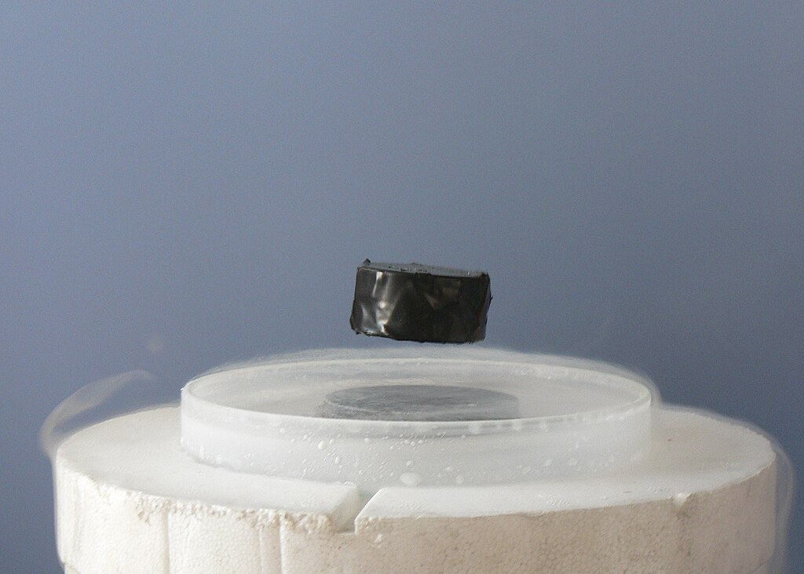A [magnet](https://en.wikipedia.org/wiki/Magnet "Magnet") [levitating](https://en.wikipedia.org/wiki/Meissner_effect "Meissner effect") above a [high-temperature superconductor](https://en.wikipedia.org/wiki/High-temperature_superconductor "High-temperature superconductor"). Today some physicists are working to understand high-temperature superconductivity using the AdS/CFT correspondence.

In addition to its applications to theoretical problems in quantum gravity, the AdS/CFT correspondence has been applied to a variety of problems in quantum field theory. One physical system that has been studied using the AdS/CFT correspondence is the [quark–gluon plasma](https://en.wikipedia.org/wiki/Quark–gluon_plasma "Quark–gluon plasma"), an exotic [state of matter](https://en.wikipedia.org/wiki/State_of_matter "State of matter") produced in [particle accelerators](https://en.wikipedia.org/wiki/Particle_accelerator "Particle accelerator"). This state of matter arises for brief instants when heavy [ions](https://en.wikipedia.org/wiki/Ions "Ions") such as [gold](https://en.wikipedia.org/wiki/Gold "Gold") or [lead](https://en.wikipedia.org/wiki/Lead "Lead") nuclei are collided at high energies. Such collisions cause the [quarks](https://en.wikipedia.org/wiki/Quarks "Quarks") that make up atomic nuclei to [deconfine](https://en.wikipedia.org/wiki/Deconfinement "Deconfinement") at temperatures of approximately two [trillion](https://en.wikipedia.org/wiki/1,000,000,000,000 "1,000,000,000,000") [kelvin](https://en.wikipedia.org/wiki/Kelvin "Kelvin"), conditions similar to those present at around 10−11 seconds after the [Big Bang](https://en.wikipedia.org/wiki/Big_Bang "Big Bang").

The physics of the quark–gluon plasma is governed by a theory called [quantum chromodynamics](https://en.wikipedia.org/wiki/Quantum_chromodynamics "Quantum chromodynamics"), but this theory is mathematically intractable in problems involving the quark–gluon plasma. In an article appearing in 2005, [Đàm Thanh Sơn](https://en.wikipedia.org/wiki/Đàm_Thanh_Sơn "Đàm Thanh Sơn") and his collaborators showed that the AdS/CFT correspondence could be used to understand some aspects of the quark-gluon plasma by describing it in the language of string theory. By applying the AdS/CFT correspondence, Sơn and his collaborators were able to describe the quark-gluon plasma in terms of black holes in five-dimensional spacetime. The calculation showed that the ratio of two quantities associated with the quark-gluon plasma, the [shear viscosity](https://en.wikipedia.org/wiki/Shear_viscosity "Shear viscosity") and volume density of entropy, should be approximately equal to a certain universal [constant](https://en.wikipedia.org/wiki/Constant_\(mathematics\) "Constant (mathematics)"). In 2008, the predicted value of this ratio for the quark-gluon plasma was confirmed at the [Relativistic Heavy Ion Collider](https://en.wikipedia.org/wiki/Relativistic_Heavy_Ion_Collider "Relativistic Heavy Ion Collider") at [Brookhaven National Laboratory](https://en.wikipedia.org/wiki/Brookhaven_National_Laboratory "Brookhaven National Laboratory").

### Applications to condensed matter physics

The AdS/CFT correspondence has also been used to study aspects of condensed matter physics. Over the decades, [experimental](https://en.wikipedia.org/wiki/Experimental_physics "Experimental physics") condensed matter physicists have discovered a number of exotic states of matter, including [superconductors](https://en.wikipedia.org/wiki/Superconductors "Superconductors") and [superfluids](https://en.wikipedia.org/wiki/Superfluids "Superfluids"). These states are described using the formalism of quantum field theory, but some phenomena are difficult to explain using standard field theoretic techniques. Some condensed matter theorists including [Subir Sachdev](https://en.wikipedia.org/wiki/Subir_Sachdev "Subir Sachdev") hope that the AdS/CFT correspondence will make it possible to describe these systems in the language of string theory and learn more about their behavior.

So far some success has been achieved in using string theory methods to describe the transition of a superfluid to an [insulator](https://en.wikipedia.org/wiki/Insulator_\(electricity\) "Insulator (electricity)"). A superfluid is a system of [electrically neutral](https://en.wikipedia.org/wiki/Electrically_neutral "Electrically neutral") [atoms](https://en.wikipedia.org/wiki/Atoms "Atoms") that flows without any [friction](https://en.wikipedia.org/wiki/Friction "Friction"). Such systems are often produced in the laboratory using [liquid helium](https://en.wikipedia.org/wiki/Liquid_helium "Liquid helium"), but recently experimentalists have developed new ways of producing artificial superfluids by pouring trillions of cold atoms into a lattice of criss-crossing [lasers](https://en.wikipedia.org/wiki/Lasers "Lasers"). These atoms initially behave as a superfluid, but as experimentalists increase the intensity of the lasers, they become less mobile and then suddenly transition to an insulating state. During the transition, the atoms behave in an unusual way. For example, the atoms slow to a halt at a rate that depends on the [temperature](https://en.wikipedia.org/wiki/Temperature "Temperature") and on the [Planck constant](https://en.wikipedia.org/wiki/Planck_constant "Planck constant"), the fundamental parameter of quantum mechanics, which does not enter into the description of the other [phases](https://en.wikipedia.org/wiki/Phase_\(matter\) "Phase (matter)"). This behavior has recently been understood by considering a dual description where properties of the fluid are described in terms of a higher dimensional black hole.

## Phenomenology

In addition to being an idea of considerable theoretical interest, string theory provides a framework for constructing models of real-world physics that combine general relativity and particle physics. [Phenomenology](https://en.wikipedia.org/wiki/Phenomenology_\(particle_physics\) "Phenomenology (particle physics)") is the branch of theoretical physics in which physicists construct realistic models of nature from more abstract theoretical ideas. [String phenomenology](https://en.wikipedia.org/wiki/String_phenomenology "String phenomenology") is the part of string theory that attempts to construct realistic or semi-realistic models based on string theory.

Partly because of theoretical and mathematical difficulties and partly because of the extremely high energies needed to test these theories experimentally, there is so far no experimental evidence that would unambiguously point to any of these models being a correct fundamental description of nature. This has led some in the community to criticize these approaches to unification and question the value of continued research on these problems.

### Particle physics

The currently accepted theory describing elementary particles and their interactions is known as the [Standard Model of particle physics](https://en.wikipedia.org/wiki/Standard_Model_of_particle_physics "Standard Model of particle physics"). This theory provides a unified description of three of the fundamental forces of nature: electromagnetism and the strong and weak nuclear forces. Despite its remarkable success in explaining a wide range of physical phenomena, the Standard Model cannot be a complete description of reality. This is because the Standard Model fails to incorporate the force of gravity and because of problems such as the [hierarchy problem](https://en.wikipedia.org/wiki/Hierarchy_problem "Hierarchy problem") and the inability to explain the structure of fermion masses or dark matter.

String theory has been used to construct a variety of models of particle physics going beyond the Standard Model. Typically, such models are based on the idea of compactification. Starting with the ten- or eleven-dimensional spacetime of string or M-theory, physicists postulate a shape for the extra dimensions. By choosing this shape appropriately, they can construct models roughly similar to the Standard Model of particle physics, together with additional undiscovered particles. One popular way of deriving realistic physics from string theory is to start with the heterotic theory in ten dimensions and assume that the six extra dimensions of spacetime are shaped like a six-dimensional Calabi–Yau manifold. Such compactifications offer many ways of extracting realistic physics from string theory. Other similar methods can be used to construct realistic or semi-realistic models of our four-dimensional world based on M-theory.

### Cosmology

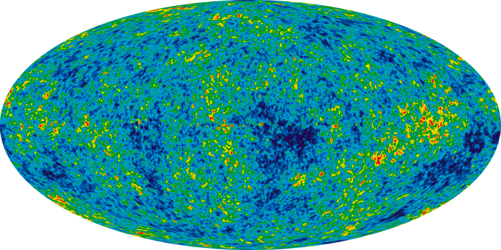A map of the [cosmic microwave background](https://en.wikipedia.org/wiki/Cosmic_microwave_background "Cosmic microwave background") produced by the [Wilkinson Microwave Anisotropy Probe](https://en.wikipedia.org/wiki/Wilkinson_Microwave_Anisotropy_Probe "Wilkinson Microwave Anisotropy Probe")

The Big Bang theory is the prevailing [cosmological](https://en.wikipedia.org/wiki/Physical_cosmology "Physical cosmology") model for the universe from the earliest known periods through its subsequent large-scale evolution. Despite its success in explaining many observed features of the universe including galactic [redshifts](https://en.wikipedia.org/wiki/Redshift "Redshift"), the relative abundance of light elements such as [hydrogen](https://en.wikipedia.org/wiki/Hydrogen "Hydrogen") and [helium](https://en.wikipedia.org/wiki/Helium "Helium"), and the existence of a [cosmic microwave background](https://en.wikipedia.org/wiki/Cosmic_microwave_background "Cosmic microwave background"), there are several questions that remain unanswered. For example, the standard Big Bang model does not explain why the universe appears to be the same in all directions, why it appears flat on very large distance scales, or why certain hypothesized particles such as [magnetic monopoles](https://en.wikipedia.org/wiki/Magnetic_monopoles "Magnetic monopoles") are not observed in experiments.

Currently, the leading candidate for a theory going beyond the Big Bang is the theory of cosmic inflation. Developed by [Alan Guth](https://en.wikipedia.org/wiki/Alan_Guth "Alan Guth") and others in the 1980s, inflation postulates a period of extremely rapid accelerated expansion of the universe prior to the expansion described by the standard Big Bang theory. The theory of cosmic inflation preserves the successes of the Big Bang while providing a natural explanation for some of the mysterious features of the universe. The theory has also received striking support from observations of the cosmic microwave background, the radiation that has filled the sky since around 380,000 years after the Big Bang.

In the theory of inflation, the rapid initial expansion of the universe is caused by a hypothetical particle called the [inflaton](https://en.wikipedia.org/wiki/Inflaton "Inflaton"). The exact properties of this particle are not fixed by the theory but should ultimately be derived from a more fundamental theory such as string theory. Indeed, there have been a number of attempts to identify an inflaton within the spectrum of particles described by string theory and to study inflation using string theory. While these approaches might eventually find support in observational data such as measurements of the cosmic microwave background, the application of string theory to cosmology is still in its early stages.

## Connections to mathematics

In addition to influencing research in [theoretical physics](https://en.wikipedia.org/wiki/Theoretical_physics "Theoretical physics"), string theory has stimulated a number of major developments in [pure mathematics](https://en.wikipedia.org/wiki/Pure_mathematics "Pure mathematics"). Like many ideas in theoretical physics, string theory does not at present have a [mathematically rigorous](https://en.wikipedia.org/wiki/Mathematical_rigor "Mathematical rigor") formulation in which all of its concepts can be defined precisely. As a result, physicists who study string theory are often guided by physical intuition to conjecture relationships between the seemingly different mathematical structures that are used to formalize different parts of the theory. These conjectures are sometimes later proved by mathematicians, and in this way, string theory serves as a source of new ideas in pure mathematics.

### Mirror symmetry

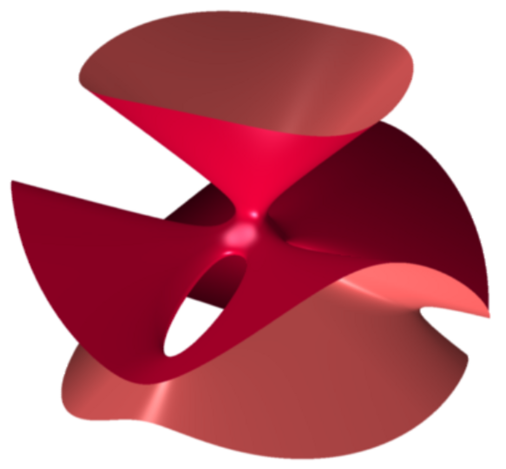The [Clebsch cubic](https://en.wikipedia.org/wiki/Clebsch_cubic "Clebsch cubic") is an example of a kind of geometric object called an [algebraic variety](https://en.wikipedia.org/wiki/Algebraic_variety "Algebraic variety"). A classical result of [enumerative geometry](https://en.wikipedia.org/wiki/Enumerative_geometry "Enumerative geometry") states that there are exactly 27 straight lines that lie entirely on this surface.

After Calabi–Yau manifolds had entered physics as a way to compactify extra dimensions in string theory, many physicists began studying these manifolds. In the late 1980s, several physicists noticed that given such a compactification of string theory, it is not possible to reconstruct uniquely a corresponding Calabi–Yau manifold. Instead, two different versions of string theory, type IIA and type IIB, can be compactified on completely different Calabi–Yau manifolds giving rise to the same physics. In this situation, the manifolds are called mirror manifolds, and the relationship between the two physical theories is called [mirror symmetry](https://en.wikipedia.org/wiki/Mirror_symmetry_\(string_theory\) "Mirror symmetry (string theory)").

Regardless of whether Calabi–Yau compactifications of string theory provide a correct description of nature, the existence of the mirror duality between different string theories has significant mathematical consequences. The Calabi–Yau manifolds used in string theory are of interest in pure mathematics, and mirror symmetry allows mathematicians to solve problems in [enumerative geometry](https://en.wikipedia.org/wiki/Enumerative_geometry "Enumerative geometry"), a branch of mathematics concerned with counting the numbers of solutions to geometric questions.

Enumerative geometry studies a class of geometric objects called [algebraic varieties](https://en.wikipedia.org/wiki/Algebraic_varieties "Algebraic varieties") which are defined by the vanishing of [polynomials](https://en.wikipedia.org/wiki/Polynomial "Polynomial"). For example, the [Clebsch cubic](https://en.wikipedia.org/wiki/Clebsch_cubic "Clebsch cubic") illustrated on the right is an algebraic variety defined using a certain polynomial of [degree](https://en.wikipedia.org/wiki/Degree_of_a_polynomial "Degree of a polynomial") three in four variables. A celebrated result of nineteenth-century mathematicians [Arthur Cayley](https://en.wikipedia.org/wiki/Arthur_Cayley "Arthur Cayley") and [George Salmon](https://en.wikipedia.org/wiki/George_Salmon "George Salmon") states that there are exactly 27 straight lines that lie entirely on such a surface.

Generalizing this problem, one can ask how many lines can be drawn on a quintic [Calabi–Yau manifold](https://en.wikipedia.org/wiki/Calabi–Yau_manifold "Calabi–Yau manifold"), which is defined by a polynomial of degree five. This problem was solved by the nineteenth-century German mathematician [Hermann Schubert](https://en.wikipedia.org/wiki/Hermann_Schubert "Hermann Schubert"), who found that there are exactly 2,875 such lines. In 1986, geometer [Sheldon Katz](https://en.wikipedia.org/wiki/Sheldon_Katz "Sheldon Katz") proved that the number of curves, such as circles, that are defined by polynomials of degree two and lie entirely in the quintic is 609,250.

By the year 1991, most of the classical problems of enumerative geometry had been solved and interest in enumerative geometry had begun to diminish. The field was reinvigorated in May 1991 when physicists [Philip Candelas](https://en.wikipedia.org/wiki/Philip_Candelas "Philip Candelas"), [Xenia de la Ossa](https://en.wikipedia.org/wiki/Xenia_de_la_Ossa "Xenia de la Ossa"), Paul Green, and Linda Parkes showed that mirror symmetry could be used to translate difficult mathematical questions about one Calabi–Yau manifold into easier questions about its mirror. In particular, they used mirror symmetry to show that a six-dimensional Calabi–Yau manifold can contain exactly 317,206,375 curves of degree three. In addition to counting degree-three curves, Candelas and his collaborators obtained a number of more general results for counting rational curves which went far beyond the results obtained by mathematicians.

Originally, these results of Candelas were justified on physical grounds. However, mathematicians generally prefer rigorous proofs that do not require an appeal to physical intuition. Inspired by physicists' work on mirror symmetry, mathematicians have therefore constructed their own arguments proving the enumerative predictions of mirror symmetry. Today mirror symmetry is an active area of research in mathematics, and mathematicians are working to develop a more complete mathematical understanding of mirror symmetry based on physicists' intuition. Major approaches to mirror symmetry include the [homological mirror symmetry](https://en.wikipedia.org/wiki/Homological_mirror_symmetry "Homological mirror symmetry") program of [Maxim Kontsevich](https://en.wikipedia.org/wiki/Maxim_Kontsevich "Maxim Kontsevich") and the [SYZ conjecture](https://en.wikipedia.org/wiki/SYZ_conjecture "SYZ conjecture") of Andrew Strominger, Shing-Tung Yau, and [Eric Zaslow](https://en.wikipedia.org/wiki/Eric_Zaslow "Eric Zaslow").

### Monstrous moonshine

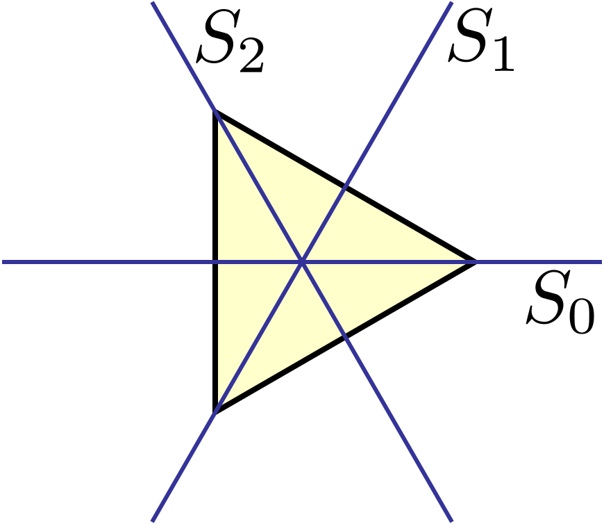An equilateral triangle can be rotated through 120°, 240°, or 360°, or reflected in any of the three lines pictured without changing its shape.

[Group theory](/source/group-theory/ "Group theory") is the branch of mathematics that studies the concept of [symmetry](https://en.wikipedia.org/wiki/Symmetry "Symmetry"). For example, one can consider a geometric shape such as an equilateral triangle. There are various operations that one can perform on this triangle without changing its shape. One can rotate it through 120°, 240°, or 360°, or one can reflect in any of the lines labeled _S_0, _S_1, or _S_2 in the picture. Each of these operations is called a _symmetry_, and the collection of these symmetries satisfies certain technical properties making it into what mathematicians call a [group](/source/group-mathematics/ "Group (mathematics)"). In this particular example, the group is known as the [dihedral group](https://en.wikipedia.org/wiki/Dihedral_group "Dihedral group") of [order](https://en.wikipedia.org/wiki/Order_\(group_theory\) "Order (group theory)") 6 because it has six elements. A general group may describe finitely many or infinitely many symmetries; if there are only finitely many symmetries, it is called a [finite group](https://en.wikipedia.org/wiki/Finite_group "Finite group").

Mathematicians often strive for a [classification](https://en.wikipedia.org/wiki/Classification_theorems "Classification theorems") (or list) of all mathematical objects of a given type. It is generally believed that finite groups are too diverse to admit a useful classification. A more modest but still challenging problem is to classify all finite _simple_ groups. These are finite groups that may be used as building blocks for constructing arbitrary finite groups in the same way that [prime numbers](https://en.wikipedia.org/wiki/Prime_number "Prime number") can be used to construct arbitrary [whole numbers](https://en.wikipedia.org/wiki/Integer "Integer") by taking products. One of the major achievements of contemporary group theory is the [classification of finite simple groups](https://en.wikipedia.org/wiki/Classification_of_finite_simple_groups "Classification of finite simple groups"), a mathematical theorem that provides a list of all possible finite simple groups.

This classification theorem identifies several infinite families of groups as well as 26 additional groups which do not fit into any family. The latter groups are called the "sporadic" groups, and each one owes its existence to a remarkable combination of circumstances. The largest sporadic group, the so-called [monster group](https://en.wikipedia.org/wiki/Monster_group "Monster group"), has over 1053 elements, more than a thousand times the number of atoms in the Earth.

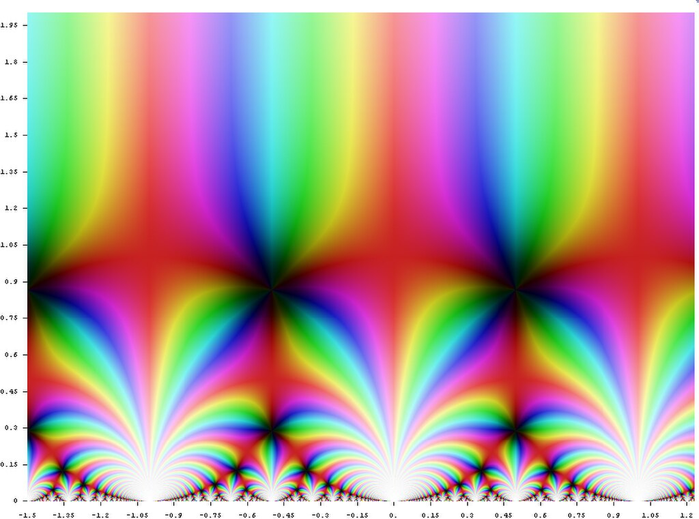A graph of the [_j_-function](https://en.wikipedia.org/wiki/J-invariant "J-invariant") in the complex plane

A seemingly unrelated construction is the [_j_-function](https://en.wikipedia.org/wiki/J-invariant "J-invariant") of [number theory](https://en.wikipedia.org/wiki/Number_theory "Number theory"). This object belongs to a special class of functions called [modular functions](https://en.wikipedia.org/wiki/Modular_function "Modular function"), whose graphs form a certain kind of repeating pattern. Although this function appears in a branch of mathematics that seems very different from the theory of finite groups, the two subjects turn out to be intimately related. In the late 1970s, mathematicians [John McKay](https://en.wikipedia.org/wiki/John_McKay_\(mathematician\) "John McKay (mathematician)") and [John Thompson](https://en.wikipedia.org/wiki/John_G._Thompson "John G. Thompson") noticed that certain numbers arising in the analysis of the monster group (namely, the dimensions of its [irreducible representations](https://en.wikipedia.org/wiki/Irreducible_representation "Irreducible representation")) are related to numbers that appear in a formula for the _j_-function (namely, the coefficients of its [Fourier series](https://en.wikipedia.org/wiki/Fourier_series "Fourier series")). This relationship was further developed by [John Horton Conway](https://en.wikipedia.org/wiki/John_Horton_Conway "John Horton Conway") and [Simon Norton](https://en.wikipedia.org/wiki/Simon_P._Norton "Simon P. Norton") who called it [monstrous moonshine](https://en.wikipedia.org/wiki/Monstrous_moonshine "Monstrous moonshine") because it seemed so far fetched.

In 1992, [Richard Borcherds](https://en.wikipedia.org/wiki/Richard_Borcherds "Richard Borcherds") constructed a bridge between the theory of modular functions and finite groups and, in the process, explained the observations of McKay and Thompson. Borcherds' work used ideas from string theory in an essential way, extending earlier results of [Igor Frenkel](https://en.wikipedia.org/wiki/Igor_Frenkel "Igor Frenkel"), [James Lepowsky](https://en.wikipedia.org/wiki/James_Lepowsky "James Lepowsky"), and [Arne Meurman](https://en.wikipedia.org/wiki/Arne_Meurman "Arne Meurman"), who had realized the monster group as the symmetries of a particular version of string theory. In 1998, Borcherds was awarded the [Fields medal](https://en.wikipedia.org/wiki/Fields_medal "Fields medal") for his work.

Since the 1990s, the connection between string theory and moonshine has led to further results in mathematics and physics. In 2010, physicists [Tohru Eguchi](https://en.wikipedia.org/wiki/Tohru_Eguchi "Tohru Eguchi"), [Hirosi Ooguri](https://en.wikipedia.org/wiki/Hirosi_Ooguri "Hirosi Ooguri"), and Yuji Tachikawa discovered connections between a different sporadic group, the [Mathieu group _M_24](https://en.wikipedia.org/wiki/Mathieu_group_M24 "Mathieu group M24"), and a certain version of string theory. [Miranda Cheng](https://en.wikipedia.org/wiki/Miranda_Cheng "Miranda Cheng"), John Duncan, and [Jeffrey A. Harvey](https://en.wikipedia.org/wiki/Jeffrey_A._Harvey "Jeffrey A. Harvey") proposed a generalization of this moonshine phenomenon called [umbral moonshine](https://en.wikipedia.org/wiki/Umbral_moonshine "Umbral moonshine"), and their conjecture was proved mathematically by Duncan, Michael Griffin, and [Ken Ono](https://en.wikipedia.org/wiki/Ken_Ono "Ken Ono"). Witten has also speculated that the version of string theory appearing in monstrous moonshine might be related to a certain simplified model of gravity in three spacetime dimensions.

## History

### Early results

Some of the structures reintroduced by string theory arose for the first time much earlier as part of the program of classical unification started by [Albert Einstein](https://en.wikipedia.org/wiki/Albert_Einstein "Albert Einstein"). The first person to add a [fifth dimension](https://en.wikipedia.org/wiki/Five-dimensional_space "Five-dimensional space") to a theory of gravity was [Gunnar Nordström](https://en.wikipedia.org/wiki/Gunnar_Nordström "Gunnar Nordström") in 1914, who noted that gravity in five dimensions describes both gravity and electromagnetism in four. Nordström attempted to unify electromagnetism with [his theory of gravitation](https://en.wikipedia.org/wiki/Nordström's_theory_of_gravitation "Nordström's theory of gravitation"), which was however superseded by Einstein's general relativity in 1919. Thereafter, German mathematician [Theodor Kaluza](https://en.wikipedia.org/wiki/Theodor_Kaluza "Theodor Kaluza") combined the fifth dimension with [general relativity](/source/general-relativity/ "General relativity"), and only Kaluza is usually credited with the idea. In 1926, the Swedish physicist [Oskar Klein](https://en.wikipedia.org/wiki/Oskar_Klein "Oskar Klein") gave [a physical interpretation](https://en.wikipedia.org/wiki/Kaluza–Klein_theory "Kaluza–Klein theory") of the unobservable extra dimension—it is wrapped into a small circle. Einstein introduced a [non-symmetric](https://en.wikipedia.org/wiki/Antisymmetric_tensor "Antisymmetric tensor") [metric tensor](https://en.wikipedia.org/wiki/Metric_tensor "Metric tensor"), while much later Brans and Dicke added a scalar component to gravity. These ideas would be revived within string theory, where they are demanded by consistency conditions.

[Leonard Susskind](https://en.wikipedia.org/wiki/Leonard_Susskind "Leonard Susskind")

String theory was originally developed during the late 1960s and early 1970s as a never completely successful theory of [hadrons](https://en.wikipedia.org/wiki/Hadron "Hadron"), the [subatomic particles](https://en.wikipedia.org/wiki/Subatomic_particle "Subatomic particle") like the [proton](https://en.wikipedia.org/wiki/Proton "Proton") and [neutron](https://en.wikipedia.org/wiki/Neutron "Neutron") that feel the [strong interaction](https://en.wikipedia.org/wiki/Strong_interaction "Strong interaction"). In the 1960s, [Geoffrey Chew](https://en.wikipedia.org/wiki/Geoffrey_Chew "Geoffrey Chew") and [Steven Frautschi](https://en.wikipedia.org/wiki/Steven_Frautschi "Steven Frautschi") discovered that the [mesons](https://en.wikipedia.org/wiki/Meson "Meson") make families called [Regge trajectories](https://en.wikipedia.org/wiki/Regge_trajectories "Regge trajectories") with masses related to spins in a way that was later understood by [Yoichiro Nambu](https://en.wikipedia.org/wiki/Yoichiro_Nambu "Yoichiro Nambu"), [Holger Bech Nielsen](https://en.wikipedia.org/wiki/Holger_Bech_Nielsen "Holger Bech Nielsen") and [Leonard Susskind](https://en.wikipedia.org/wiki/Leonard_Susskind "Leonard Susskind") to be the relationship expected from rotating strings. Chew advocated making a theory for the interactions of these trajectories that did not presume that they were composed of any fundamental particles, but would construct their interactions from [self-consistency conditions](https://en.wikipedia.org/wiki/Bootstrap_model "Bootstrap model") on the [S-matrix](https://en.wikipedia.org/wiki/S-matrix "S-matrix"). The [S-matrix approach](https://en.wikipedia.org/wiki/S-matrix_theory "S-matrix theory") was started by [Werner Heisenberg](https://en.wikipedia.org/wiki/Werner_Heisenberg "Werner Heisenberg") in the 1940s as a way of constructing a theory that did not rely on the local notions of space and time, which Heisenberg believed break down at the nuclear scale. While the scale was off by many orders of magnitude, the approach he advocated was ideally suited for a theory of quantum gravity.

Working with experimental data, R. Dolen, D. Horn and C. Schmid developed some sum rules for hadron exchange. When a particle and [antiparticle](https://en.wikipedia.org/wiki/Antiparticle "Antiparticle") scatter, virtual particles can be exchanged in two qualitatively different ways. In the s-channel, the two particles annihilate to make temporary intermediate states that fall apart into the final state particles. In the t-channel, the particles exchange intermediate states by emission and absorption. In field theory, the two contributions add together, one giving a continuous background contribution, the other giving peaks at certain energies. In the data, it was clear that the peaks were stealing from the background—the authors interpreted this as saying that the t-channel contribution was dual to the s-channel one, meaning both described the whole amplitude and included the other.

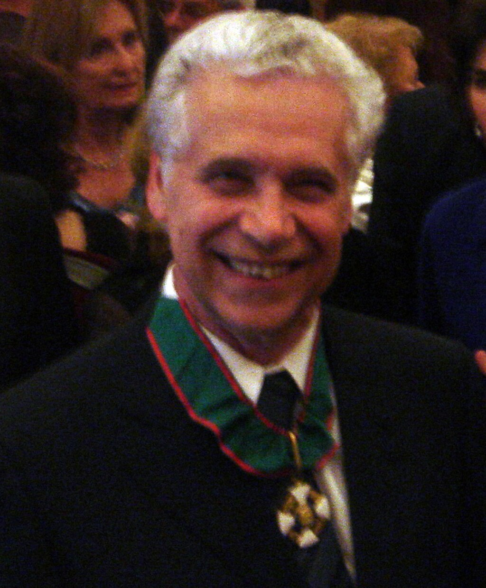[Gabriele Veneziano](https://en.wikipedia.org/wiki/Gabriele_Veneziano "Gabriele Veneziano")

The result was widely advertised by [Murray Gell-Mann](https://en.wikipedia.org/wiki/Murray_Gell-Mann "Murray Gell-Mann"), leading [Gabriele Veneziano](https://en.wikipedia.org/wiki/Gabriele_Veneziano "Gabriele Veneziano") to construct a [scattering amplitude](https://en.wikipedia.org/wiki/Veneziano_scattering_amplitude "Veneziano scattering amplitude") that had the property of Dolen–Horn–Schmid duality, later renamed world-sheet duality. The amplitude needed poles where the particles appear, on straight-line trajectories, and there is a special mathematical function whose poles are evenly spaced on half the real line—the [gamma function](https://en.wikipedia.org/wiki/Gamma_function "Gamma function")—which was widely used in Regge theory. By manipulating combinations of gamma functions, Veneziano was able to find a consistent scattering amplitude with poles on straight lines, with mostly positive residues, which obeyed duality and had the appropriate Regge scaling at high energy. The amplitude could fit near-beam scattering data as well as other Regge type fits and had a suggestive integral representation that could be used for generalization.

Over the next years, hundreds of physicists worked to complete the [bootstrap program](https://en.wikipedia.org/wiki/Bootstrap_model "Bootstrap model") for this model, with many surprises. Veneziano himself discovered that for the scattering amplitude to describe the scattering of a particle that appears in the theory, an obvious self-consistency condition, the lightest particle must be a [tachyon](https://en.wikipedia.org/wiki/Tachyon "Tachyon"). [Miguel Virasoro](https://en.wikipedia.org/wiki/Miguel_Ángel_Virasoro_\(physicist\) "Miguel Ángel Virasoro (physicist)") and Joel Shapiro found a different amplitude now understood to be that of closed strings, while Ziro Koba and [Holger Nielsen](https://en.wikipedia.org/wiki/Holger_Bech_Nielsen "Holger Bech Nielsen") generalized Veneziano's integral representation to multiparticle scattering. Veneziano and [Sergio Fubini](https://en.wikipedia.org/wiki/Sergio_Fubini "Sergio Fubini") introduced an operator formalism for computing the scattering amplitudes that was a forerunner of world-sheet conformal theory, while Virasoro understood how to remove the poles with wrong-sign residues using a constraint on the states. [Claud Lovelace](https://en.wikipedia.org/wiki/Claud_Lovelace "Claud Lovelace") calculated a loop amplitude, and noted that there is an inconsistency unless the dimension of the theory is 26. [Charles Thorn](https://en.wikipedia.org/wiki/Charles_Thorn "Charles Thorn"), [Peter Goddard](https://en.wikipedia.org/wiki/Peter_Goddard_\(physicist\) "Peter Goddard (physicist)") and Richard Brower went on to prove that there are no wrong-sign propagating states in dimensions less than or equal to 26.

In 1969–1970, [Yoichiro Nambu](https://en.wikipedia.org/wiki/Yoichiro_Nambu "Yoichiro Nambu"), [Holger Bech Nielsen](https://en.wikipedia.org/wiki/Holger_Bech_Nielsen "Holger Bech Nielsen"), and [Leonard Susskind](https://en.wikipedia.org/wiki/Leonard_Susskind "Leonard Susskind") recognized that the theory could be given a description in space and time in terms of strings. The scattering amplitudes were derived systematically from the action principle by [Peter Goddard](https://en.wikipedia.org/wiki/Peter_Goddard_\(physicist\) "Peter Goddard (physicist)"), [Jeffrey Goldstone](https://en.wikipedia.org/wiki/Jeffrey_Goldstone "Jeffrey Goldstone"), Claudio Rebbi, and [Charles Thorn](https://en.wikipedia.org/wiki/Charles_Thorn "Charles Thorn"), giving a space-time picture to the vertex operators introduced by Veneziano and Fubini and a geometrical interpretation to the [Virasoro conditions](https://en.wikipedia.org/wiki/Virasoro_algebra "Virasoro algebra").

In 1971, [Pierre Ramond](https://en.wikipedia.org/wiki/Pierre_Ramond "Pierre Ramond") added fermions to the model, which led him to formulate a two-dimensional supersymmetry to cancel the wrong-sign states. [John Schwarz](https://en.wikipedia.org/wiki/John_Henry_Schwarz "John Henry Schwarz") and [André Neveu](https://en.wikipedia.org/wiki/André_Neveu "André Neveu") added another sector to the fermi theory a short time later. In the fermion theories, the critical dimension was 10. [Stanley Mandelstam](https://en.wikipedia.org/wiki/Stanley_Mandelstam "Stanley Mandelstam") formulated a world sheet conformal theory for both the bose and fermi case, giving a two-dimensional field theoretic path-integral to generate the operator formalism. [Michio Kaku](https://en.wikipedia.org/wiki/Michio_Kaku "Michio Kaku") and [Keiji Kikkawa](https://en.wikipedia.org/wiki/Keiji_Kikkawa "Keiji Kikkawa") gave a different formulation of the bosonic string, as a [string field theory](https://en.wikipedia.org/wiki/String_field_theory "String field theory"), with infinitely many particle types and with fields taking values not on points, but on loops and curves.

In 1974, [Tamiaki Yoneya](https://en.wikipedia.org/wiki/Tamiaki_Yoneya "Tamiaki Yoneya") discovered that all the known string theories included a massless spin-two particle that obeyed the correct [Ward identities](https://en.wikipedia.org/wiki/Ward_identities "Ward identities") to be a graviton. John Schwarz and [Joël Scherk](https://en.wikipedia.org/wiki/Joël_Scherk "Joël Scherk") came to the same conclusion and made the bold leap to suggest that string theory was a theory of gravity, not a theory of hadrons. They reintroduced [Kaluza–Klein theory](https://en.wikipedia.org/wiki/Kaluza–Klein_theory "Kaluza–Klein theory") as a way of making sense of the extra dimensions. At the same time, [quantum chromodynamics](https://en.wikipedia.org/wiki/Quantum_chromodynamics "Quantum chromodynamics") was recognized as the correct theory of hadrons, shifting the attention of physicists and apparently leaving the bootstrap program in the [dustbin of history](https://en.wikipedia.org/wiki/Dustbin_of_history "Dustbin of history").

String theory eventually made it out of the dustbin, but for the following decade, all work on the theory was completely ignored. Still, the theory continued to develop at a steady pace thanks to the work of a handful of devotees. [Ferdinando Gliozzi](https://en.wikipedia.org/wiki/Ferdinando_Gliozzi "Ferdinando Gliozzi"), Joël Scherk, and [David Olive](https://en.wikipedia.org/wiki/David_Olive "David Olive") realized in 1977 that the original Ramond and Neveu Schwarz-strings were separately inconsistent and needed to be combined. The resulting theory did not have a tachyon and was proven to have space-time supersymmetry by John Schwarz and [Michael Green](https://en.wikipedia.org/wiki/Michael_Green_\(physicist\) "Michael Green (physicist)") in 1984. The same year, [Alexander Polyakov](https://en.wikipedia.org/wiki/Alexander_Markovich_Polyakov "Alexander Markovich Polyakov") gave the theory a modern path integral formulation, and went on to develop conformal field theory extensively. In 1979, [Daniel Friedan](https://en.wikipedia.org/wiki/Daniel_Friedan "Daniel Friedan") showed that the equations of motions of string theory, which are generalizations of the [Einstein equations](https://en.wikipedia.org/wiki/Einstein_equations "Einstein equations") of [general relativity](/source/general-relativity/ "General relativity"), emerge from the [renormalization group](https://en.wikipedia.org/wiki/Renormalization_group "Renormalization group") equations for the two-dimensional field theory. Schwarz and Green discovered T-duality, and constructed two superstring theories—IIA and IIB related by T-duality, and type I theories with open strings. The consistency conditions had been so strong, that the entire theory was nearly uniquely determined, with only a few discrete choices.

### First superstring revolution

[Edward Witten](/source/edward-witten/ "Edward Witten")

In the early 1980s, [Edward Witten](/source/edward-witten/ "Edward Witten") discovered that most theories of quantum gravity could not accommodate [chiral](https://en.wikipedia.org/wiki/Chirality_\(physics\) "Chirality (physics)") fermions like the neutrino. This led him, in collaboration with [Luis Álvarez-Gaumé](https://en.wikipedia.org/wiki/Luis_Álvarez-Gaumé "Luis Álvarez-Gaumé"), to study violations of the conservation laws in gravity theories with [anomalies](https://en.wikipedia.org/wiki/Gravitational_anomaly "Gravitational anomaly"), concluding that type I string theories were inconsistent. Green and Schwarz discovered a contribution to the anomaly that Witten and Alvarez-Gaumé had missed, which restricted the gauge group of the type I string theory to be SO(32). In coming to understand this calculation, Edward Witten became convinced that string theory was truly a consistent theory of gravity, and he became a high-profile advocate. Following Witten's lead, between 1984 and 1986, hundreds of physicists started to work in this field, and this is sometimes called the [first superstring revolution](https://en.wikipedia.org/wiki/First_superstring_revolution "First superstring revolution").

During this period, [David Gross](https://en.wikipedia.org/wiki/David_Gross "David Gross"), [Jeffrey Harvey](https://en.wikipedia.org/wiki/Jeffrey_A._Harvey "Jeffrey A. Harvey"), [Emil Martinec](https://en.wikipedia.org/wiki/Emil_Martinec "Emil Martinec"), and [Ryan Rohm](https://en.wikipedia.org/wiki/Ryan_Rohm "Ryan Rohm") discovered [heterotic strings](https://en.wikipedia.org/wiki/Heterotic_strings "Heterotic strings"). The gauge group of these closed strings was two copies of [E8](https://en.wikipedia.org/wiki/E8_\(mathematics\) "E8 (mathematics)"), and either copy could easily and naturally include the standard model. [Philip Candelas](https://en.wikipedia.org/wiki/Philip_Candelas "Philip Candelas"), [Gary Horowitz](https://en.wikipedia.org/wiki/Gary_Horowitz "Gary Horowitz"), [Andrew Strominger](https://en.wikipedia.org/wiki/Andrew_Strominger "Andrew Strominger") and Edward Witten found that the Calabi–Yau manifolds are the compactifications that preserve a realistic amount of supersymmetry, while [Lance Dixon](https://en.wikipedia.org/wiki/Lance_Dixon "Lance Dixon") and others worked out the physical properties of [orbifolds](https://en.wikipedia.org/wiki/Orbifolds "Orbifolds"), distinctive geometrical singularities allowed in string theory. [Cumrun Vafa](https://en.wikipedia.org/wiki/Cumrun_Vafa "Cumrun Vafa") generalized T-duality from circles to arbitrary manifolds, creating the mathematical field of [mirror symmetry](https://en.wikipedia.org/wiki/Mirror_symmetry_\(string_theory\) "Mirror symmetry (string theory)"). [Daniel Friedan](https://en.wikipedia.org/wiki/Daniel_Friedan "Daniel Friedan"), [Emil Martinec](https://en.wikipedia.org/wiki/Emil_Martinec "Emil Martinec") and [Stephen Shenker](https://en.wikipedia.org/wiki/Stephen_Shenker "Stephen Shenker") further developed the covariant quantization of the superstring using conformal field theory techniques. [David Gross](https://en.wikipedia.org/wiki/David_Gross "David Gross") and Vipul Periwal discovered that string perturbation theory was divergent. [Stephen Shenker](https://en.wikipedia.org/wiki/Stephen_Shenker "Stephen Shenker") showed it diverged much faster than in field theory suggesting that new non-perturbative objects were missing.

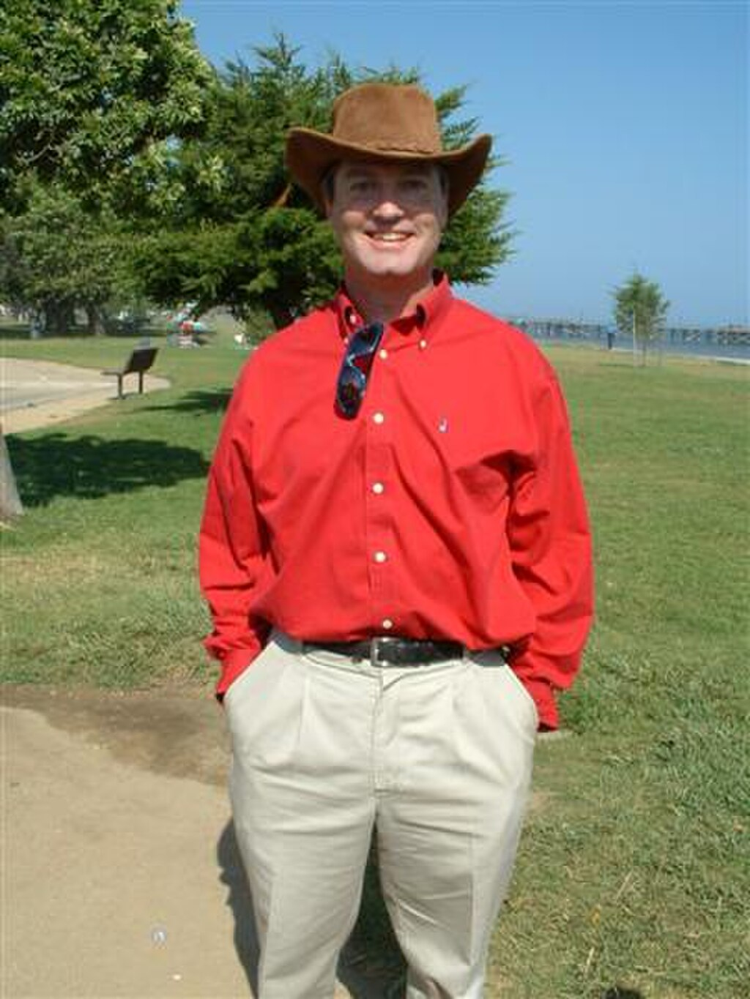[Joseph Polchinski](https://en.wikipedia.org/wiki/Joseph_Polchinski "Joseph Polchinski")

In the 1990s, [Joseph Polchinski](https://en.wikipedia.org/wiki/Joseph_Polchinski "Joseph Polchinski") discovered that the theory requires higher-dimensional objects, called [D-branes](https://en.wikipedia.org/wiki/D-brane "D-brane") and identified these with the black-hole solutions of supergravity. These were understood to be the new objects suggested by the perturbative divergences, and they opened up a new field with rich mathematical structure. It quickly became clear that D-branes and other p-branes, not just strings, formed the matter content of the string theories, and the physical interpretation of the strings and branes was revealed—they are a type of black hole. [Leonard Susskind](https://en.wikipedia.org/wiki/Leonard_Susskind "Leonard Susskind") had incorporated the [holographic principle](https://en.wikipedia.org/wiki/Holographic_principle "Holographic principle") of [Gerardus 't Hooft](https://en.wikipedia.org/wiki/Gerardus_'t_Hooft "Gerardus 't Hooft") into string theory, identifying the long highly excited string states with ordinary thermal black hole states. As suggested by 't Hooft, the fluctuations of the black hole horizon, the world-sheet or world-volume theory, describes not only the degrees of freedom of the black hole, but all nearby objects too.

### Second superstring revolution

In 1995, at the annual conference of string theorists at the University of Southern California (USC), [Edward Witten](/source/edward-witten/ "Edward Witten") gave a speech on string theory that in essence united the five string theories that existed at the time, and giving birth to a new 11-dimensional theory called [M-theory](/source/m-theory/ "M-theory"). M-theory was also foreshadowed in the work of [Paul Townsend](https://en.wikipedia.org/wiki/Paul_Townsend "Paul Townsend") at approximately the same time. The flurry of activity that began at this time is sometimes called the [second superstring revolution](https://en.wikipedia.org/wiki/Second_superstring_revolution "Second superstring revolution").

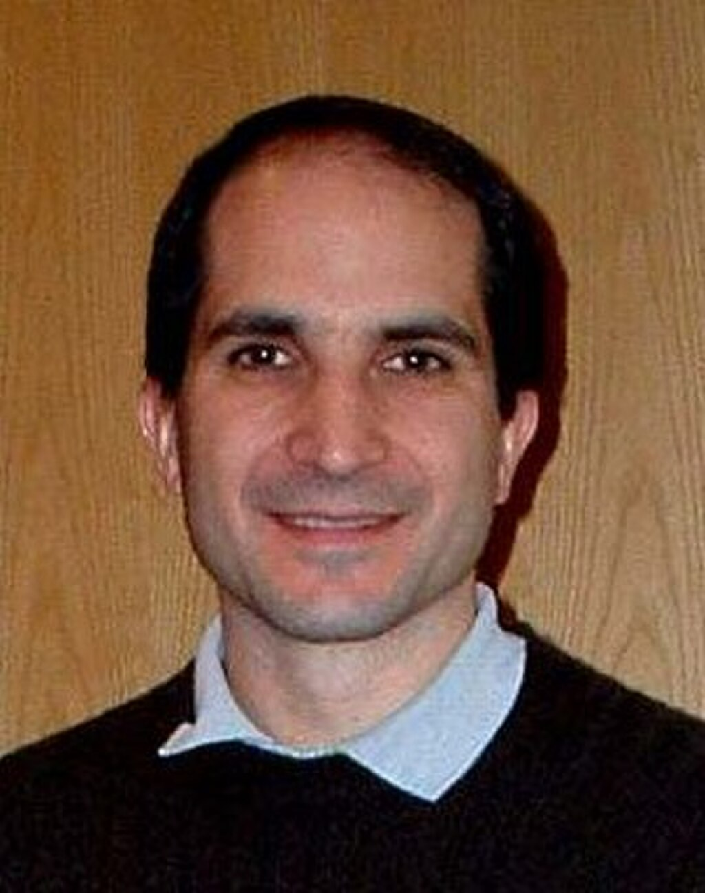[Juan Maldacena](https://en.wikipedia.org/wiki/Juan_Maldacena "Juan Maldacena")

During this period, [Tom Banks](https://en.wikipedia.org/wiki/Tom_Banks_\(physicist\) "Tom Banks (physicist)"), [Willy Fischler](https://en.wikipedia.org/wiki/Willy_Fischler "Willy Fischler"), [Stephen Shenker](https://en.wikipedia.org/wiki/Stephen_Shenker "Stephen Shenker") and [Leonard Susskind](https://en.wikipedia.org/wiki/Leonard_Susskind "Leonard Susskind") formulated matrix theory, a full holographic description of M-theory using IIA D0 branes. This was the first definition of string theory that was fully non-perturbative and a concrete mathematical realization of the [holographic principle](https://en.wikipedia.org/wiki/Holographic_principle "Holographic principle"). It is an example of a gauge-gravity duality and is now understood to be a special case of the [AdS/CFT correspondence](/source/ads-cft-correspondence/ "AdS/CFT correspondence"). [Andrew Strominger](https://en.wikipedia.org/wiki/Andrew_Strominger "Andrew Strominger") and [Cumrun Vafa](https://en.wikipedia.org/wiki/Cumrun_Vafa "Cumrun Vafa") calculated the entropy of certain configurations of D-branes and found agreement with the semi-classical answer for extreme charged black holes. [Petr Hořava](https://en.wikipedia.org/wiki/Petr_Hořava_\(theorist\) "Petr Hořava (theorist)") and Witten found the eleven-dimensional formulation of the heterotic string theories, showing that orbifolds solve the chirality problem. Witten noted that the effective description of the physics of D-branes at low energies is by a supersymmetric gauge theory, and found geometrical interpretations of mathematical structures in gauge theory that he and [Nathan Seiberg](https://en.wikipedia.org/wiki/Nathan_Seiberg "Nathan Seiberg") had earlier discovered in terms of the location of the branes.

In 1997, [Juan Maldacena](https://en.wikipedia.org/wiki/Juan_Maldacena "Juan Maldacena") noted that the low energy excitations of a theory near a black hole consist of objects close to the horizon, which for extreme charged black holes looks like an [anti-de Sitter space](https://en.wikipedia.org/wiki/Anti-de_Sitter_space "Anti-de Sitter space"). He noted that in this limit the gauge theory describes the string excitations near the branes. So he hypothesized that string theory on a near-horizon extreme-charged black-hole geometry, an anti-de Sitter space times a sphere with flux, is equally well described by the low-energy limiting [gauge theory](https://en.wikipedia.org/wiki/Gauge_theory "Gauge theory"), the [N = 4 supersymmetric Yang–Mills theory](https://en.wikipedia.org/wiki/N_=_4_supersymmetric_Yang–Mills_theory "N = 4 supersymmetric Yang–Mills theory"). This hypothesis, which is called the [AdS/CFT correspondence](/source/ads-cft-correspondence/ "AdS/CFT correspondence"), was further developed by [Steven Gubser](https://en.wikipedia.org/wiki/Steven_Gubser "Steven Gubser"), [Igor Klebanov](https://en.wikipedia.org/wiki/Igor_Klebanov "Igor Klebanov") and [Alexander Polyakov](https://en.wikipedia.org/wiki/Alexander_Markovich_Polyakov "Alexander Markovich Polyakov"), and by Edward Witten, and it is now well-accepted. It is a concrete realization of the [holographic principle](https://en.wikipedia.org/wiki/Holographic_principle "Holographic principle"), which has far-reaching implications for [black holes](https://en.wikipedia.org/wiki/Black_hole "Black hole"), [locality](https://en.wikipedia.org/wiki/Principle_of_locality "Principle of locality") and [information](https://en.wikipedia.org/wiki/Information "Information") in physics, as well as the nature of the gravitational interaction. Through this relationship, string theory has been shown to be related to gauge theories like [quantum chromodynamics](https://en.wikipedia.org/wiki/Quantum_chromodynamics "Quantum chromodynamics") and this has led to a more quantitative understanding of the behavior of [hadrons](https://en.wikipedia.org/wiki/Hadron "Hadron"), bringing string theory back to its roots.

## Criticism

### Number of solutions

To construct models of particle physics based on string theory, physicists typically begin by specifying a shape for the extra dimensions of spacetime. Each of these different shapes corresponds to a different possible universe, or "vacuum state", with a different collection of particles and forces. String theory as it is currently understood has an enormous number of vacuum states, typically estimated to be around 10500, and these might be sufficiently diverse to accommodate almost any phenomenon that might be observed at low energies.

Many critics of string theory have expressed concerns about the large number of possible universes described by string theory. In his book _Not Even Wrong_, [Peter Woit](https://en.wikipedia.org/wiki/Peter_Woit "Peter Woit"), a lecturer in the mathematics department at [Columbia University](https://en.wikipedia.org/wiki/Columbia_University "Columbia University"), has argued that the large number of different physical scenarios renders string theory vacuous as a framework for constructing models of particle physics. According to Woit,

> The possible existence of, say, 10500 consistent different vacuum states for superstring theory probably destroys the hope of using the theory to predict anything. If one picks among this large set just those states whose properties agree with present experimental observations, it is likely there still will be such a large number of these that one can get just about whatever value one wants for the results of any new observation.

Some physicists believe this large number of solutions is actually a virtue because it may allow a natural anthropic explanation of the observed values of [physical constants](https://en.wikipedia.org/wiki/Physical_constant "Physical constant"), in particular the small value of the cosmological constant. The [anthropic principle](https://en.wikipedia.org/wiki/Anthropic_principle "Anthropic principle") is the idea that some of the numbers appearing in the laws of physics are not fixed by any fundamental principle but must be compatible with the evolution of intelligent life. In 1987, [Steven Weinberg](https://en.wikipedia.org/wiki/Steven_Weinberg "Steven Weinberg") published an article in which he argued that the cosmological constant could not have been too large, or else [galaxies](https://en.wikipedia.org/wiki/Galaxy "Galaxy") and intelligent life would not have been able to develop. Weinberg suggested that there might be a huge number of possible consistent universes, each with a different value of the cosmological constant, and observations indicate a small value of the cosmological constant only because humans happen to live in a universe that has allowed intelligent life, and hence observers, to exist.

String theorist Leonard Susskind has argued that string theory provides a natural anthropic explanation of the small value of the cosmological constant. According to Susskind, the different vacuum states of string theory might be realized as different universes within a larger [multiverse](https://en.wikipedia.org/wiki/Multiverse "Multiverse"). The fact that the observed universe has a small cosmological constant is just a tautological consequence of the fact that a small value is required for life to exist. Many prominent theorists and critics have disagreed with Susskind's conclusions. According to Woit, "in this case \[anthropic reasoning\] is nothing more than an excuse for failure. Speculative scientific ideas fail not just when they make incorrect predictions, but also when they turn out to be vacuous and incapable of predicting anything."

### Compatibility with dark energy

It remains unknown whether string theory is compatible with a metastable, positive [cosmological constant](https://en.wikipedia.org/wiki/Cosmological_constant "Cosmological constant"). Some putative examples of such solutions do exist, such as the model described by Kachru _et al_. in 2003. In 2018, a group of four physicists advanced a controversial conjecture which would imply that [no such universe exists](https://en.wikipedia.org/wiki/Swampland_\(physics\) "Swampland (physics)"). This is contrary to some popular models of [dark energy](https://en.wikipedia.org/wiki/Dark_energy "Dark energy") such as [Λ-CDM](https://en.wikipedia.org/wiki/Lambda-CDM_model "Lambda-CDM model"), which requires a positive vacuum energy. However, string theory is likely compatible with certain types of [quintessence](https://en.wikipedia.org/wiki/Quintessence_\(physics\) "Quintessence (physics)"), where dark energy is caused by a new field with exotic properties.

### Background independence

One of the fundamental properties of Einstein's general theory of relativity is that it is [background independent](https://en.wikipedia.org/wiki/Background_independence "Background independence"), meaning that the formulation of the theory does not in any way privilege a particular spacetime geometry.

One of the main criticisms of string theory from early on is that it is not manifestly background-independent. In string theory, one must typically specify a fixed reference geometry for spacetime, and all other possible geometries are described as perturbations of this fixed one. In his book _[The Trouble With Physics](https://en.wikipedia.org/wiki/The_Trouble_With_Physics "The Trouble With Physics")_, physicist [Lee Smolin](https://en.wikipedia.org/wiki/Lee_Smolin "Lee Smolin") of the [Perimeter Institute for Theoretical Physics](https://en.wikipedia.org/wiki/Perimeter_Institute_for_Theoretical_Physics "Perimeter Institute for Theoretical Physics") claims that this is the principal weakness of string theory as a theory of quantum gravity, saying that string theory has failed to incorporate this important insight from general relativity.

Others have disagreed with Smolin's characterization of string theory. In a review of Smolin's book, string theorist Joseph Polchinski writes

> \[Smolin\] is mistaking an aspect of the mathematical language being used for one of the physics being described. New physical theories are often discovered using a mathematical language that is not the most suitable for them... In string theory, it has always been clear that the physics is background-independent, even if the language being used is not, and the search for a more suitable language continues. Indeed, as Smolin belatedly notes, \[AdS/CFT\] provides a solution to this problem, one that is unexpected and powerful.

Polchinski notes that an important open problem in quantum gravity is to develop holographic descriptions of gravity which do not require the gravitational field to be asymptotically anti-de Sitter. Smolin has responded by saying that the AdS/CFT correspondence, as it is currently understood, may not be strong enough to resolve all concerns about background independence.

### Sociology of science

Since the superstring revolutions of the 1980s and 1990s, string theory has been one of the dominant paradigms of high energy theoretical physics. Some string theorists have expressed the view that there does not exist an equally successful alternative theory addressing the deep questions of fundamental physics. In an interview from 1987, [Nobel laureate](https://en.wikipedia.org/wiki/Nobel_laureate "Nobel laureate") [David Gross](https://en.wikipedia.org/wiki/David_Gross "David Gross") made the following controversial comments about the reasons for the popularity of string theory:

> The most important \[reason\] is that there are no other good ideas around. That's what gets most people into it. When people started to get interested in string theory they didn't know anything about it. In fact, the first reaction of most people is that the theory is extremely ugly and unpleasant, at least that was the case a few years ago when the understanding of string theory was much less developed. It was difficult for people to learn about it and to be turned on. So I think the real reason why people have got attracted by it is because there is no other game in town. All other approaches of constructing grand unified theories, which were more conservative to begin with, and only gradually became more and more radical, have failed, and this game hasn't failed yet.

Several other high-profile theorists and commentators have expressed similar views, suggesting that there are no viable alternatives to string theory.

Many critics of string theory have commented on this state of affairs. In his book criticizing string theory, Peter Woit views the status of string theory research as unhealthy and detrimental to the future of fundamental physics. He argues that the extreme popularity of string theory among theoretical physicists is partly a consequence of the financial structure of academia and the fierce competition for scarce resources. In his 2004 book _[The Road to Reality](https://en.wikipedia.org/wiki/The_Road_to_Reality "The Road to Reality")_, mathematical physicist [Roger Penrose](https://en.wikipedia.org/wiki/Roger_Penrose "Roger Penrose") expresses similar views, stating "The often frantic competitiveness that this ease of communication engenders leads to [bandwagon effects](https://en.wikipedia.org/wiki/Bandwagon_effect "Bandwagon effect"), where researchers fear to be left behind if they do not join in." Penrose also claims that the technical difficulty of modern physics forces young scientists to rely on the preferences of established researchers, rather than forging new paths of their own. Lee Smolin expresses a slightly different position in his critique, claiming that string theory grew out of a tradition of particle physics which discourages speculation about the foundations of physics, while his preferred approach, [loop quantum gravity](https://en.wikipedia.org/wiki/Loop_quantum_gravity "Loop quantum gravity"), encourages more radical thinking. According to Smolin,

> String theory is a powerful, well-motivated idea and deserves much of the work that has been devoted to it. If it has so far failed, the principal reason is that its intrinsic flaws are closely tied to its strengths—and, of course, the story is unfinished, since string theory may well turn out to be part of the truth. The real question is not why we have expended so much energy on string theory but why we haven't expended nearly enough on alternative approaches.

Smolin goes on to offer a number of prescriptions for how scientists might encourage a greater diversity of approaches to quantum gravity research.
