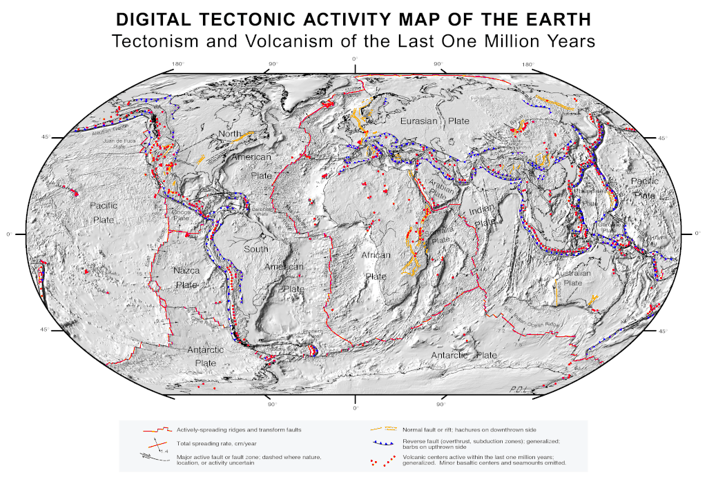
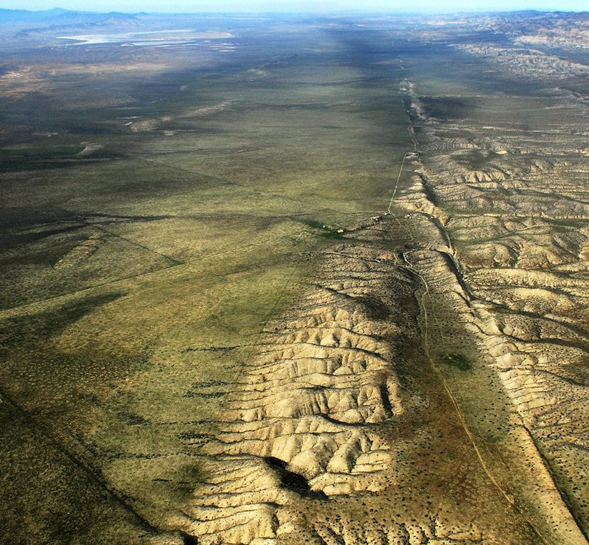

**Tectonics** (from [Ancient Greek](https://en.wikipedia.org/wiki/Ancient_Greek_language "Ancient Greek language")[τεκτονικός](https://en.wiktionary.org/wiki/τεκτονικός#Ancient_Greek "wikt:τεκτονικός") __tektonikós__'pertaining to [building](https://en.wikipedia.org/wiki/Construction "Construction")' via [Latin](https://en.wikipedia.org/wiki/Latin "Latin") _[tectonicus](https://en.wiktionary.org/wiki/tectonicus#Latin "wikt:tectonicus")_) are the processes that result in the structure and properties of [Earth's crust](/source/earths-crust/ "Earth's crust") and its evolution through time. The field of _planetary tectonics_ extends the concept to other planets and moons.

These processes include those of [mountain-building](https://en.wikipedia.org/wiki/Orogeny "Orogeny"), the growth and behavior of the strong, old cores of continents known as [cratons](https://en.wikipedia.org/wiki/Craton "Craton"), and the ways in which the relatively rigid [plates](https://en.wikipedia.org/wiki/Tectonic_plate "Tectonic plate") that constitute Earth's outer shell interact with each other. Principles of tectonics also provide a framework for understanding the [earthquake](https://en.wikipedia.org/wiki/Earthquake "Earthquake") and [volcanic belts](https://en.wikipedia.org/wiki/Volcanic_belt "Volcanic belt") that directly affect much of the global population.

Tectonic studies are important as guides for [economic geologists](https://en.wikipedia.org/wiki/Economic_geology "Economic geology") searching for [fossil fuels](https://en.wikipedia.org/wiki/Fossil_fuel "Fossil fuel") and [ore deposits](https://en.wikipedia.org/wiki/Ore_deposit "Ore deposit") of metallic and nonmetallic resources. The understanding of tectonic principles can help [geomorphologists](https://en.wikipedia.org/wiki/Geomorphology "Geomorphology") to explain [erosion patterns](https://en.wikipedia.org/wiki/Erosion_and_tectonics "Erosion and tectonics") and other Earth-surface features.

## Main types of tectonic regime

### Extensional tectonics

Extensional tectonics is associated with the stretching and thinning of the crust or the [lithosphere](https://en.wikipedia.org/wiki/Lithosphere "Lithosphere"). This type of tectonics is found at divergent plate boundaries, in continental [rifts](https://en.wikipedia.org/wiki/Rift "Rift"), during and after a period of [continental collision](https://en.wikipedia.org/wiki/Continental_collision "Continental collision") caused by the lateral spreading of the thickened crust formed, at releasing bends in [strike-slip faults](https://en.wikipedia.org/wiki/Fault_\(geology\)#Strike-slip_faults "Fault (geology)"), in [back-arc basins](https://en.wikipedia.org/wiki/Back-arc_basin "Back-arc basin"), and on the continental end of [passive margin](https://en.wikipedia.org/wiki/Passive_margin "Passive margin") sequences where a [detachment layer](https://en.wikipedia.org/wiki/Décollement "Décollement") is present.

### Thrust (contractional) tectonics

Thrust tectonics is associated with the shortening and thickening of the crust, or the lithosphere. This type of tectonics is found at zones of [continental collision](https://en.wikipedia.org/wiki/Continental_collision "Continental collision"), at restraining bends in strike-slip faults, and at the oceanward part of passive margin sequences where a detachment layer is present.

### Strike-slip tectonics

[San Andreas transform fault](https://en.wikipedia.org/wiki/San_Andreas_Fault "San Andreas Fault") on the [Carrizo Plain](https://en.wikipedia.org/wiki/Carrizo_Plain "Carrizo Plain")

Strike-slip tectonics is associated with the relative lateral movement of parts of the crust or the lithosphere. This type of tectonics is found along oceanic and continental [transform faults](https://en.wikipedia.org/wiki/Transform_fault "Transform fault") which connect offset segments of [mid-ocean ridges](https://en.wikipedia.org/wiki/Mid-ocean_ridge "Mid-ocean ridge"). Strike-slip tectonics also occurs at lateral offsets in extensional and [thrust fault](https://en.wikipedia.org/wiki/Thrust_fault "Thrust fault") systems. In areas involved with [plate collisions](https://en.wikipedia.org/wiki/Continental_collision "Continental collision") strike-slip deformation occurs in the over-riding plate in zones of oblique collision and accommodates deformation in the [foreland](https://en.wikipedia.org/wiki/Foreland_basin "Foreland basin") to a collisional belt.

## Plate tectonics

The Tectonic Network of Earth. Legend: Brown: Terrane (microplate) boundaries in the continents and Mobile Belts, Cyan: Terranes of the Oceanic Plates, Blue: Oceanic transform faults; Red and orange: Fault zones in the Continental and Mountain belt domain; Purple: Main subduction zones and suture zones; Green: Continental margins

In plate tectonics, the outermost part of Earth known as the [lithosphere](https://en.wikipedia.org/wiki/Lithosphere "Lithosphere") (the [crust](https://en.wikipedia.org/wiki/Crust_\(geology\) "Crust (geology)") and uppermost [mantle](/source/mantle/ "Mantle (geology)")) act as a single mechanical layer. The lithosphere is divided into separate "plates" that move relative to each other on the underlying, relatively weak [asthenosphere](https://en.wikipedia.org/wiki/Asthenosphere "Asthenosphere") in a process ultimately driven by the continuous loss of heat from Earth's interior. There are three main types of plate boundaries: [divergent](https://en.wikipedia.org/wiki/Divergent_boundary "Divergent boundary"), where plates move apart from each other and new lithosphere is formed in the process of [sea-floor spreading](https://en.wikipedia.org/wiki/Sea-floor_spreading "Sea-floor spreading"); [transform](https://en.wikipedia.org/wiki/Transform_fault "Transform fault"), where plates slide past each other, and [convergent](https://en.wikipedia.org/wiki/Convergent_boundary "Convergent boundary"), where plates converge and lithosphere is "consumed" by the process of [subduction](https://en.wikipedia.org/wiki/Subduction "Subduction"). Convergent and transform boundaries are responsible for most of the world's major ([Mw](https://en.wikipedia.org/wiki/Moment_magnitude_scale "Moment magnitude scale") > 7) [earthquakes](https://en.wikipedia.org/wiki/Earthquake "Earthquake"). Convergent and divergent boundaries are also the site of most of the world's [volcanoes](https://en.wikipedia.org/wiki/Volcano "Volcano"), such as around the Pacific [Ring of Fire](https://en.wikipedia.org/wiki/Ring_of_Fire "Ring of Fire"). Most of the deformation in the lithosphere is related to the interaction between plates at or near plate boundaries. The latest studies, based on the integration of available geological data, and satellite imagery and Gravimetric and magnetic anomaly datasets have shown that the crust of Earth is dissected by thousands of different types of tectonic elements which define the subdivision into numerous smaller microplates which have amalgamated into the larger Plates.

## Other fields of tectonic studies

### Salt tectonics

Salt tectonics is concerned with the structural geometries and deformation processes associated with the presence of significant thicknesses of [rock salt](https://en.wikipedia.org/wiki/Rock_salt "Rock salt") within a sequence of rocks. This is due both to the low density of salt, which does not increase with burial, and its low strength.

### Neotectonics

Neotectonics is the study of the motions and deformations of [Earth's crust](/source/earths-crust/ "Earth's crust") ([geological](https://en.wikipedia.org/wiki/Geology "Geology") and [geomorphological](https://en.wikipedia.org/wiki/Geomorphology "Geomorphology") processes) that are current or recent in [geological time](https://en.wikipedia.org/wiki/Geologic_time_scale "Geologic time scale"). The term may also refer to the motions and deformations themselves. The corresponding time frame is referred to as the _neotectonic period_. Accordingly, the preceding time is referred to as _palaeotectonic period_.

### Tectonophysics

Tectonophysics is the study of the physical processes associated with deformation of the crust and mantle from the scale of individual mineral grains up to that of tectonic plates.

### Seismotectonics

Seismotectonics is the study of the relationship between earthquakes, active tectonics, and individual [faults](https://en.wikipedia.org/wiki/Fault_\(geology\) "Fault (geology)") in a region. It seeks to understand which faults are responsible for seismic activity in an area by analysing a combination of regional tectonics, recent instrumentally recorded events, accounts of historical earthquakes, and geomorphological evidence. This information can then be used to quantify the [seismic hazard](https://en.wikipedia.org/wiki/Seismic_hazard "Seismic hazard") of an area.

### Impact tectonics

Impact tectonics is the study of modification of the lithosphere through high velocity impact cratering events.

### Planetary tectonics

Techniques used in the analysis of tectonics on Earth have also been applied to the study of the [planets](https://en.wikipedia.org/wiki/Planetary_science "Planetary science") and their moons, especially [icy moons](https://en.wikipedia.org/wiki/Tectonics_on_icy_moons "Tectonics on icy moons").
