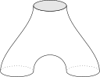

In [gauge theory](https://en.wikipedia.org/wiki/Gauge_theory_\(mathematics\) "Gauge theory (mathematics)") and [mathematical physics](https://en.wikipedia.org/wiki/Mathematical_physics "Mathematical physics"), a **topological quantum field theory** (or **topological field theory** or **TQFT**) is a [quantum field theory](https://en.wikipedia.org/wiki/Quantum_field_theory "Quantum field theory") that computes [topological invariants](https://en.wikipedia.org/wiki/Topological_invariant "Topological invariant").

While TQFTs were invented by physicists, they are also of mathematical interest, being related to, among other things, [knot theory](https://en.wikipedia.org/wiki/Knot_theory "Knot theory") and the theory of [four-manifolds](https://en.wikipedia.org/wiki/Four-manifold "Four-manifold") in [algebraic topology](https://en.wikipedia.org/wiki/Algebraic_topology "Algebraic topology"), and to the theory of [moduli spaces](https://en.wikipedia.org/wiki/Moduli_spaces "Moduli spaces") in [algebraic geometry](https://en.wikipedia.org/wiki/Algebraic_geometry "Algebraic geometry"). [Donaldson](https://en.wikipedia.org/wiki/Simon_Donaldson "Simon Donaldson"), [Jones](https://en.wikipedia.org/wiki/Vaughan_Jones "Vaughan Jones"), [Witten](/source/edward-witten/ "Edward Witten"), and [Kontsevich](https://en.wikipedia.org/wiki/Maxim_Kontsevich "Maxim Kontsevich") have all won [Fields Medals](https://en.wikipedia.org/wiki/Fields_Medal "Fields Medal") for mathematical work related to topological field theory.

In [condensed matter physics](https://en.wikipedia.org/wiki/Condensed_matter_physics "Condensed matter physics"), topological quantum field theories are the low-energy [effective theories](https://en.wikipedia.org/wiki/Effective_field_theory "Effective field theory") of [topologically ordered](https://en.wikipedia.org/wiki/Topological_order "Topological order") states, such as [fractional quantum Hall](https://en.wikipedia.org/wiki/Quantum_Hall_Effect "Quantum Hall Effect") states, [string-net](https://en.wikipedia.org/wiki/String-net "String-net") condensed states, and other [strongly correlated quantum liquid](https://en.wikipedia.org/wiki/Strongly_correlated_quantum_spin_liquid "Strongly correlated quantum spin liquid") states.

## Overview

In a topological field theory, [correlation functions](https://en.wikipedia.org/wiki/Correlation_function_\(quantum_field_theory\) "Correlation function (quantum field theory)") are [metric](https://en.wikipedia.org/wiki/Metric_tensor_\(general_relativity\) "Metric tensor (general relativity)")-independent, so they remain unchanged under any deformation of [spacetime](https://en.wikipedia.org/wiki/Spacetime "Spacetime") and are therefore [topological invariants](https://en.wikipedia.org/wiki/Topological_property "Topological property").

Topological field theories are not very interesting on flat [Minkowski spacetime](https://en.wikipedia.org/wiki/Minkowski_spacetime "Minkowski spacetime") used in particle physics. Minkowski space can be [contracted to a point](https://en.wikipedia.org/wiki/Contractible_space "Contractible space"), so a TQFT applied to Minkowski space results in trivial topological invariants. Consequently, TQFTs are usually applied to curved spacetimes, such as, for example, [Riemann surfaces](https://en.wikipedia.org/wiki/Riemann_surfaces "Riemann surfaces"). Most of the known topological field theories are [defined on spacetimes](https://en.wikipedia.org/wiki/Quantum_field_theory_in_curved_spacetime "Quantum field theory in curved spacetime") of dimension less than five. It seems that a few higher-dimensional theories exist, but they are not very well understood .

Quantum gravity is believed to be [background-independent](https://en.wikipedia.org/wiki/Background_independence "Background independence") (in some suitable sense), and TQFTs provide examples of background independent quantum field theories. This has prompted ongoing theoretical investigations into this class of models.

(Caveat: It is often said that TQFTs have only finitely many degrees of freedom. This is not a fundamental property. It happens to be true in most of the examples that physicists and mathematicians study, but it is not necessary. A topological [sigma model](https://en.wikipedia.org/wiki/Sigma_model "Sigma model") targets infinite-dimensional projective space, and if such a thing could be defined it would have [countably infinitely](https://en.wikipedia.org/wiki/Countably_infinite "Countably infinite") many degrees of freedom.)

## Specific models

The known topological field theories fall into two general classes: Schwarz-type TQFTs and Witten-type TQFTs. Witten TQFTs are also sometimes referred to as cohomological field theories. See ([Schwarz 2000](/source/topological-qft/#CITEREFSchwarz2000)).

### Schwarz-type TQFTs

In **Schwarz-type TQFTs**, the [correlation functions](https://en.wikipedia.org/wiki/Correlation_function_\(quantum_field_theory\) "Correlation function (quantum field theory)") or [partition functions](https://en.wikipedia.org/wiki/Partition_function_\(quantum_field_theory\) "Partition function (quantum field theory)") of the system are computed by the path integral of metric-independent action functionals. For instance, in the [BF model](https://en.wikipedia.org/wiki/BF_model "BF model"), the spacetime is a two-dimensional manifold M, the observables are constructed from a two-form F, an auxiliary scalar B, and their derivatives. The action (which determines the path integral) is

: $S=\int\limits_M B F$

The spacetime metric does not appear anywhere in the theory, so the theory is explicitly topologically invariant. The first example appeared in 1977 and is due to [A. Schwarz](https://en.wikipedia.org/wiki/Albert_Schwarz "Albert Schwarz"); its action functional is:

: $S=\int\limits_M A\wedge dA.$

Another more famous example is [Chern–Simons theory](https://en.wikipedia.org/wiki/Chern–Simons_theory "Chern–Simons theory"), which can be applied to [knot invariants](https://en.wikipedia.org/wiki/Knot_invariant "Knot invariant"). In general, partition functions depend on a metric but the above examples are metric-independent.

### Witten-type TQFTs

The first example of **Witten-type TQFTs** appeared in Witten's paper in 1988 ([Witten 1988a](/source/topological-qft/#CITEREFWitten1988a)), i.e. [topological Yang–Mills theory](https://en.wikipedia.org/wiki/Topological_Yang–Mills_theory "Topological Yang–Mills theory") in four dimensions. Though its action functional contains the spacetime metric _g_αβ, after a [topological twist](https://en.wikipedia.org/wiki/Topological_string_theory#The_topological_twist "Topological string theory") it turns out to be metric independent. The independence of the stress-energy tensor _T_αβ of the system from the metric depends on whether the [BRST-operator](https://en.wikipedia.org/wiki/BRST_quantization "BRST quantization") is closed. Following Witten's example many other examples can be found in [string theory](https://en.wikipedia.org/wiki/Topological_string_theory "Topological string theory").

Witten-type TQFTs arise if the following conditions are satisfied:

1.  The action $S$ of the TQFT has a symmetry, i.e. if $\delta$ denotes a symmetry transformation (e.g. a [Lie derivative](https://en.wikipedia.org/wiki/Lie_derivative "Lie derivative")) then $\delta S = 0$ holds.
2.  The symmetry transformation is [exact](https://en.wikipedia.org/wiki/Exact_sequence "Exact sequence"), i.e. $\delta^2 = 0$
3.  There are existing [observables](https://en.wikipedia.org/wiki/Observable "Observable") $O_1, \dots, O_n$ which satisfy $\delta O_i = 0$ for all $i \in \{ 1, \dots, n\}$.
4.  The stress-energy-tensor (or similar physical quantities) is of the form $T^{\alpha \beta} = \delta G^{\alpha \beta}$ for an arbitrary tensor $G^{\alpha \beta}$.

As an example ([Linker 2015](/source/topological-qft/#CITEREFLinker2015)): Given a 2-form field $B$ with the differential operator $\delta$ which satisfies $\delta^2=0$, then the action $S = \int\limits_M B \wedge \delta B$ has a symmetry if $\delta B \wedge \delta B = 0$ since

: $\delta S = \int\limits_M \delta(B \wedge \delta B) = \int\limits_M \delta B \wedge \delta B + \int\limits_M B \wedge \delta^2 B = 0 .$

Further, the following holds (under the condition that $\delta$ is independent on $B$ and acts similarly to a [functional derivative](https://en.wikipedia.org/wiki/Functional_derivative "Functional derivative")):

: $\frac{\delta}{\delta B^{\alpha \beta}}S =
  \int\limits_M \frac{\delta}{\delta B^{\alpha \beta}}B \wedge \delta B + \int\limits_M B \wedge \delta \frac{\delta}{\delta B^{\alpha \beta}}B =
  \int\limits_M \frac{\delta}{\delta B^{\alpha \beta}}B \wedge \delta B - \int\limits_M \delta B \wedge \frac{\delta}{\delta B^{\alpha \beta}}B =
  -2 \int\limits_M \delta B \wedge \frac{\delta}{\delta B^{\alpha \beta}}B .$

The expression $\frac{\delta}{\delta B^{\alpha \beta}}S$ is proportional to $\delta G$ with another 2-form $G$.

Now any averages of observables $\left\langle O_i \right\rangle := \int d \mu O_i e^{iS}$ for the corresponding [Haar measure](https://en.wikipedia.org/wiki/Haar_measure "Haar measure") $\mu$ are independent on the "geometric" field $B$ and are therefore topological:

: $\frac{\delta}{\delta B} \left\langle O_i \right\rangle = \int d \mu O_i i \frac{\delta}{\delta B}S e^{iS} \propto \int d \mu O_i \delta G e^{iS} = \delta \left(\int d \mu O_i G e^{iS}\right) = 0$.

The third equality uses the fact that $\delta O_i = \delta S = 0$ and the invariance of the Haar measure under symmetry transformations. Since $\int d \mu O_i G e^{iS}$ is only a number, its Lie derivative vanishes.

## Mathematical formulations

### Original Atiyah–Segal axioms

[Atiyah](https://en.wikipedia.org/wiki/Michael_Atiyah "Michael Atiyah") suggested a set of axioms for topological quantum field theory, inspired by [Segal](https://en.wikipedia.org/wiki/Graeme_Segal "Graeme Segal")'s proposed axioms for [conformal field theory](https://en.wikipedia.org/wiki/Conformal_field_theory "Conformal field theory") (subsequently, Segal's idea was summarized in [Segal (2001)](/source/topological-qft/#CITEREFSegal2001)), and Witten's geometric meaning of supersymmetry in [Witten (1982)](/source/topological-qft/#CITEREFWitten1982). Atiyah's axioms are constructed by gluing the boundary with a differentiable (topological or continuous) transformation, while Segal's axioms are for conformal transformations. These axioms have been relatively useful for mathematical treatments of Schwarz-type QFTs, although it isn't clear that they capture the whole structure of Witten-type QFTs. The basic idea is that a TQFT is a [functor](https://en.wikipedia.org/wiki/Functor "Functor") from a certain [category](https://en.wikipedia.org/wiki/Category_\(mathematics\) "Category (mathematics)") of [cobordisms](https://en.wikipedia.org/wiki/Cobordism "Cobordism") to the category of [vector spaces](https://en.wikipedia.org/wiki/Vector_space "Vector space").

There are in fact two different sets of axioms which could reasonably be called the Atiyah axioms. These axioms differ basically in whether or not they apply to a TQFT defined on a single fixed _n_-dimensional Riemannian / Lorentzian spacetime _M_ or a TQFT defined on all _n_-dimensional spacetimes at once.

Let Λ be a [commutative ring](https://en.wikipedia.org/wiki/Commutative_ring "Commutative ring") with 1 (for almost all real-world purposes we will have Λ = **Z**, **R** or **C**). Atiyah originally proposed the axioms of a topological quantum field theory (TQFT) in dimension _d_ defined over a ground ring Λ as following:

*   A finitely generated Λ-module _Z_(Σ) associated to each oriented closed smooth d-dimensional manifold Σ (corresponding to the _[homotopy](/source/homotopy/ "Homotopy")_ axiom),
*   An element _Z_(_M_) ∈ _Z_(∂_M_) associated to each oriented smooth (_d_ + 1)-dimensional manifold (with boundary) _M_ (corresponding to an _additive_ axiom).

These data are subject to the following axioms (4 and 5 were added by Atiyah):

1.  _Z_ is _functorial_ with respect to orientation preserving [diffeomorphisms](https://en.wikipedia.org/wiki/Diffeomorphisms "Diffeomorphisms") of Σ and _M_,
2.  _Z_ is _involutory_, i.e. _Z_(Σ\*) = _Z_(Σ)\* where Σ\* is Σ with opposite orientation and _Z_(Σ)\* denotes the dual module,
3.  _Z_ is _multiplicative_.
4.  _Z_($\emptyset$) = Λ for the d-dimensional empty manifold and _Z_($\emptyset$) = 1 for the (_d_ + 1)-dimensional empty manifold.
5.  _Z_(_M\*_) = _Z_(_M_) (the _[hermitian](https://en.wikipedia.org/wiki/Sesquilinear_form "Sesquilinear form")_ axiom). If $\partial M = \Sigma^*_0 \cup \Sigma_1$ so that _Z_(_M_) can be viewed as a linear transformation between hermitian vector spaces, then this is equivalent to _Z_(_M\*_) being the [adjoint](https://en.wikipedia.org/wiki/Hermitian_adjoint "Hermitian adjoint") of _Z_(_M_).

**Remark**. If for a closed manifold _M_ we view _Z_(_M_) as a numerical invariant, then for a manifold with a boundary we should think of _Z_(_M_) ∈ _Z_(∂_M_) as a "relative" invariant. Let _f_: Σ → Σ be an orientation-preserving diffeomorphism, and identify opposite ends of Σ × _I_ by _f_. This gives a manifold Σ_f_ and our axioms imply

: $Z(\Sigma_f) = \operatorname{Trace}\ \Sigma(f)$

where Σ(_f_) is the induced automorphism of _Z_(Σ).

**Remark**. For a manifold _M_ with boundary Σ we can always form the double $M\cup_\Sigma M^*$ which is a closed manifold. The fifth axiom shows that

: $Z\left(M\cup_\Sigma M^*\right) = |Z(M)|^2$

where on the right we compute the norm in the hermitian (possibly indefinite) metric.

### Relation to physics

Physically (2) + (4) are related to relativistic invariance while (3) + (5) are indicative of the quantum nature of the theory.

Σ is meant to indicate the physical space (usually, _d_ = 3 for standard physics) and the extra dimension in Σ × _I_ is "imaginary" time. The space _Z_(Σ) is the [Hilbert space](https://en.wikipedia.org/wiki/Hilbert_space "Hilbert space") of the quantum theory and a physical theory, with a [Hamiltonian](https://en.wikipedia.org/wiki/Hamiltonian_\(quantum_mechanics\) "Hamiltonian (quantum mechanics)") _H_, will have a time evolution operator _eitH_ or an "imaginary time" operator _e−tH_. The main feature of _topological_ QFTs is that _H_ = 0, which implies that there is no real dynamics or propagation along the cylinder Σ × _I_. However, there can be non-trivial "propagation" (or tunneling amplitudes) from Σ0 to Σ1 through an intervening manifold _M_ with $\partial M = \Sigma^*_0 \cup \Sigma_1$; this reflects the topology of _M_.

If ∂_M_ = Σ, then the distinguished vector _Z_(_M_) in the Hilbert space _Z_(Σ) is thought of as the _vacuum state_ defined by _M_. For a closed manifold _M_ the number _Z_(_M_) is the [vacuum expectation value](https://en.wikipedia.org/wiki/Vacuum_expectation_value "Vacuum expectation value"). In analogy with [statistical mechanics](https://en.wikipedia.org/wiki/Statistical_mechanics "Statistical mechanics") it is also called the [partition function](https://en.wikipedia.org/wiki/Partition_function_\(quantum_field_theory\) "Partition function (quantum field theory)").

The reason why a theory with a zero Hamiltonian can be sensibly formulated resides in the [Feynman path integral](https://en.wikipedia.org/wiki/Feynman_path_integral "Feynman path integral") approach to QFT. This incorporates relativistic invariance (which applies to general (_d_ + 1)-dimensional "spacetimes") and the theory is formally defined by a suitable [Lagrangian](https://en.wikipedia.org/wiki/Lagrangian_\(field_theory\) "Lagrangian (field theory)")—a functional of the classical fields of the theory. A Lagrangian which involves only first derivatives in time formally leads to a zero Hamiltonian, but the Lagrangian itself may have non-trivial features which relate to the topology of _M_.

### Atiyah's examples

In 1988, M. Atiyah published a paper in which he described many new examples of topological quantum field theory that were considered at that time ([Atiyah 1988a](/source/topological-qft/#CITEREFAtiyah1988a))([Atiyah 1988b](/source/topological-qft/#CITEREFAtiyah1988b)). It contains some new [topological invariants](https://en.wikipedia.org/wiki/Topological_invariant "Topological invariant") along with some new ideas: [Casson invariant](https://en.wikipedia.org/wiki/Casson_invariant "Casson invariant"), [Donaldson invariant](https://en.wikipedia.org/wiki/Donaldson_invariant "Donaldson invariant"), [Gromov's theory](https://en.wikipedia.org/wiki/Geometric_group_theory "Geometric group theory"), [Floer homology](https://en.wikipedia.org/wiki/Floer_homology "Floer homology") and [Jones–Witten theory](https://en.wikipedia.org/wiki/Jones_polynomial "Jones polynomial").

#### _d_ = 0

In this case Σ consists of finitely many points. To a single point we associate a vector space _V_ = _Z_(point) and to _n_-points the _n_-fold tensor product: _V_⊗_n_ = _V_ ⊗ … ⊗ _V_. The [symmetric group](https://en.wikipedia.org/wiki/Symmetric_group "Symmetric group") S_n_ acts on _V_⊗_n_. A standard way to get the quantum Hilbert space is to start with a classical [symplectic manifold](https://en.wikipedia.org/wiki/Symplectic_manifold "Symplectic manifold") (or [phase space](https://en.wikipedia.org/wiki/Phase_space "Phase space")) and then quantize it. Let us extend _Sn_ to a compact Lie group _G_ and consider "integrable" orbits for which the symplectic structure comes from a [line bundle](https://en.wikipedia.org/wiki/Line_bundle "Line bundle"), then quantization leads to the irreducible representations _V_ of _G_. This is the physical interpretation of the [Borel–Weil theorem](https://en.wikipedia.org/wiki/Borel–Weil_theorem "Borel–Weil theorem") or the [Borel–Weil–Bott theorem](https://en.wikipedia.org/wiki/Borel–Weil–Bott_theorem "Borel–Weil–Bott theorem"). The Lagrangian of these theories is the classical action ([holonomy](https://en.wikipedia.org/wiki/Holonomy "Holonomy") of the line bundle). Thus topological QFT's with _d_ = 0 relate naturally to the classical [representation theory](https://en.wikipedia.org/wiki/Representation_theory "Representation theory") of [Lie groups](https://en.wikipedia.org/wiki/Lie_group "Lie group") and the [symmetric group](https://en.wikipedia.org/wiki/Symmetric_group "Symmetric group").

#### _d_ = 1

We should consider periodic boundary conditions given by closed loops in a compact symplectic manifold _X_. Along with [Witten (1982)](/source/topological-qft/#CITEREFWitten1982) holonomy such loops as used in the case of _d_ = 0 as a Lagrangian are then used to modify the Hamiltonian. For a closed surface _M_ the invariant _Z_(_M_) of the theory is the number of [pseudo holomorphic maps](https://en.wikipedia.org/wiki/Pseudoholomorphic_curve "Pseudoholomorphic curve") _f_: _M_ → _X_ in the sense of Gromov (they are ordinary [holomorphic maps](https://en.wikipedia.org/wiki/Holomorphic_map "Holomorphic map") if _X_ is a [Kähler manifold](https://en.wikipedia.org/wiki/Kähler_manifold "Kähler manifold")). If this number becomes infinite i.e. if there are "moduli", then we must fix further data on _M_. This can be done by picking some points _Pi_ and then looking at holomorphic maps _f_: _M_ → _X_ with _f_(_Pi_) constrained to lie on a fixed hyperplane. [Witten (1988b)](/source/topological-qft/#CITEREFWitten1988b) has written down the relevant Lagrangian for this theory. Floer has given a rigorous treatment, i.e. [Floer homology](https://en.wikipedia.org/wiki/Floer_homology "Floer homology"), based on Witten's [Morse theory](https://en.wikipedia.org/wiki/Morse_theory "Morse theory") ideas; for the case when the boundary conditions are over the interval instead of being periodic, the path initial and end-points lie on two fixed [Lagrangian submanifolds](https://en.wikipedia.org/wiki/Lagrangian_submanifold "Lagrangian submanifold"). This theory has been developed as [Gromov–Witten invariant](https://en.wikipedia.org/wiki/Gromov–Witten_invariant "Gromov–Witten invariant") theory.

Another example is [Holomorphic](https://en.wikipedia.org/wiki/Holomorphic_function "Holomorphic function") [Conformal Field Theory](https://en.wikipedia.org/wiki/Conformal_Field_Theory "Conformal Field Theory"). This might not have been considered strictly topological quantum field theory at the time because Hilbert spaces are infinite dimensional. The conformal field theories are also related to the compact Lie group _G_ in which the classical phase consists of a central extension of the [loop group](https://en.wikipedia.org/wiki/Loop_group "Loop group") _(LG)_. Quantizing these produces the Hilbert spaces of the theory of irreducible (projective) representations of _LG_. The group Diff+(**S**1) now substitutes for the symmetric group and plays an important role. As a result, the partition function in such theories depends on [complex structure](https://en.wikipedia.org/wiki/Complex_manifold "Complex manifold"), thus it is not purely topological.

#### _d_ = 2

Jones–Witten theory is the most important theory in this case. Here the classical phase space, associated with a closed surface Σ is the moduli space of a flat _G_-bundle over Σ. The Lagrangian is an integer multiple of the [Chern–Simons function](https://en.wikipedia.org/wiki/Chern–Simons_theory "Chern–Simons theory") of a _G_-connection on a 3-manifold (which has to be "framed"). The integer multiple _k_, called the level, is a parameter of the theory and _k_ → ∞ gives the classical limit. This theory can be naturally coupled with the _d_ = 0 theory to produce a "relative" theory. The details have been described by Witten who shows that the partition function for a (framed) link in the 3-sphere is just the value of the [Jones polynomial](https://en.wikipedia.org/wiki/Jones_polynomial "Jones polynomial") for a suitable root of unity. The theory can be defined over the relevant [cyclotomic field](https://en.wikipedia.org/wiki/Cyclotomic_field "Cyclotomic field"), see [Atiyah (1988b)](/source/topological-qft/#CITEREFAtiyah1988b). By considering a [Riemann surface](https://en.wikipedia.org/wiki/Riemann_surface "Riemann surface") with boundary, we can couple it to the _d_ = 1 conformal theory instead of coupling _d_ = 2 theory to _d_ = 0. This has developed into Jones–Witten theory and has led to the discovery of deep connections between [knot theory](https://en.wikipedia.org/wiki/Knot_theory "Knot theory") and quantum field theory.

#### _d_ = 3

Donaldson has defined the integer invariant of smooth 4-manifolds by using moduli spaces of SU(2)-instantons. These invariants are polynomials on the second homology. Thus 4-manifolds should have extra data consisting of the symmetric algebra of _H_2. [Witten (1988a)](/source/topological-qft/#CITEREFWitten1988a) has produced a super-symmetric Lagrangian which formally reproduces the Donaldson theory. Witten's formula might be understood as an infinite-dimensional analogue of the [Gauss–Bonnet theorem](https://en.wikipedia.org/wiki/Gauss–Bonnet_theorem "Gauss–Bonnet theorem"). At a later date, this theory was further developed and became the [Seiberg–Witten gauge theory](https://en.wikipedia.org/wiki/Seiberg–Witten_theory "Seiberg–Witten theory") which reduces SU(2) to U(1) in _N_ = 2, _d_ = 4 gauge theory. The Hamiltonian version of the theory has been developed by [Andreas Floer](https://en.wikipedia.org/wiki/Andreas_Floer "Andreas Floer") in terms of the space of connections on a 3-manifold. Floer uses the [Chern–Simons function](https://en.wikipedia.org/wiki/Chern–Simons_theory "Chern–Simons theory"), which is the Lagrangian of Jones–Witten theory to modify the Hamiltonian. For details, see [Atiyah (1988b)](/source/topological-qft/#CITEREFAtiyah1988b). [Witten (1988a)](/source/topological-qft/#CITEREFWitten1988a) has also shown how one can couple the _d_ = 3 and _d_ = 1 theories together: this is quite analogous to the coupling between _d_ = 2 and _d_ = 0 in Jones–Witten theory.

Now, topological field theory is viewed as a [functor](https://en.wikipedia.org/wiki/Functor "Functor"), not on a fixed dimension but on all dimensions at the same time.

### Case of a fixed spacetime

Let _BordM_ be the category whose morphisms are _n_-dimensional [submanifolds](https://en.wikipedia.org/wiki/Submanifold "Submanifold") of _M_ and whose objects are [connected](https://en.wikipedia.org/wiki/Connected_space "Connected space") components of the boundaries of such submanifolds. Regard two morphisms as equivalent if they are [homotopic](/source/homotopy/ "Homotopy") via submanifolds of _M_, and so form the quotient category _hBordM_: The objects in _hBordM_ are the objects of _BordM_, and the morphisms of _hBordM_ are homotopy equivalence classes of morphisms in _BordM_. A TQFT on _M_ is a [symmetric monoidal functor](https://en.wikipedia.org/wiki/Symmetric_monoidal_functor "Symmetric monoidal functor") from _hBordM_ to the category of vector spaces.

Note that cobordisms can, if their boundaries match, be sewn together to form a new bordism. This is the composition law for morphisms in the cobordism category. Since functors are required to preserve composition, this says that the linear map corresponding to a sewn together morphism is just the composition of the linear map for each piece.

There is an [equivalence of categories](https://en.wikipedia.org/wiki/Equivalence_of_categories "Equivalence of categories") between the category of 2-dimensional topological quantum field theories and the category of commutative [Frobenius algebras](https://en.wikipedia.org/wiki/Frobenius_algebra "Frobenius algebra").

### All _n_-dimensional spacetimes at once

The [pair of pants](https://en.wikipedia.org/wiki/Pair_of_pants_\(mathematics\) "Pair of pants (mathematics)") is a (1+1)-dimensional bordism, which corresponds to a product or coproduct in a 2-dimensional TQFT.

To consider all spacetimes at once, it is necessary to replace _hBordM_ by a larger category. So let _Bordn_ be the category of bordisms, i.e. the category whose morphisms are _n_-dimensional manifolds with boundary, and whose objects are the connected components of the boundaries of n-dimensional manifolds. (Note that any (_n_−1)-dimensional manifold may appear as an object in _Bordn_.) As above, regard two morphisms in _Bordn_ as equivalent if they are homotopic, and form the quotient category _hBordn_. _Bordn_ is a [monoidal category](https://en.wikipedia.org/wiki/Monoidal_category "Monoidal category") under the operation which maps two bordisms to the bordism made from their disjoint union. A TQFT on _n_-dimensional manifolds is then a functor from _hBordn_ to the category of vector spaces, which maps disjoint unions of bordisms to their tensor product.

For example, for (1 + 1)-dimensional bordisms (2-dimensional bordisms between 1-dimensional manifolds), the map associated with a [pair of pants](https://en.wikipedia.org/wiki/Pair_of_pants_\(mathematics\) "Pair of pants (mathematics)") gives a product or coproduct, depending on how the boundary components are grouped – which is commutative or cocommutative, while the map associated with a disk gives a counit (trace) or unit (scalars), depending on the grouping of boundary components, and thus (1+1)-dimension TQFTs correspond to [Frobenius algebras](https://en.wikipedia.org/wiki/Frobenius_algebra "Frobenius algebra").

Furthermore, we can consider simultaneously 4-dimensional, 3-dimensional and 2-dimensional manifolds related by the above bordisms, and from them we can obtain ample and important examples.

### Development at a later time

Looking at the development of topological quantum field theory, we should consider its many applications to [Seiberg–Witten gauge theory](https://en.wikipedia.org/wiki/Seiberg–Witten_theory "Seiberg–Witten theory"), [topological string theory](https://en.wikipedia.org/wiki/Topological_string_theory "Topological string theory"), the relationship between [knot theory](https://en.wikipedia.org/wiki/Knot_theory "Knot theory") and quantum field theory, and [quantum knot invariants](https://en.wikipedia.org/wiki/Quantum_knot_invariant "Quantum knot invariant"). Furthermore, it has generated topics of great interest in both mathematics and physics. Also of important recent interest are non-local operators in TQFT ([Gukov & Kapustin (2013)](/source/topological-qft/#CITEREFGukovKapustin2013)). If string theory is viewed as the fundamental, then non-local TQFTs can be viewed as non-physical models that provide a computationally efficient approximation to local string theory.

### Witten-type TQFTs and dynamical systems

[Stochastic (partial) differential equations](https://en.wikipedia.org/wiki/Stochastic_differential_equation "Stochastic differential equation") (SDEs) are the foundation for models of everything in nature above the scale of quantum degeneracy and coherence and are essentially Witten-type TQFTs. All SDEs possess topological or [BRST supersymmetry](https://en.wikipedia.org/wiki/BRST_supersymmetry "BRST supersymmetry"), $\delta$, and in the operator representation of stochastic dynamics is the [exterior derivative](https://en.wikipedia.org/wiki/Exterior_derivative "Exterior derivative"), which is commutative with the stochastic evolution operator. This supersymmetry preserves the continuity of phase space by continuous flows, and the phenomenon of supersymmetric spontaneous breakdown by a global non-supersymmetric ground state encompasses such well-established physical concepts as [chaos](https://en.wikipedia.org/wiki/Chaos_theory "Chaos theory"), [turbulence](https://en.wikipedia.org/wiki/Turbulence "Turbulence"), [1/f](https://en.wikipedia.org/wiki/Pink_noise "Pink noise") and [crackling](https://en.wikipedia.org/wiki/Crackling_noise "Crackling noise") noises, [self-organized criticality](https://en.wikipedia.org/wiki/Self-organized_criticality "Self-organized criticality") etc. The topological sector of the theory for any SDE can be recognized as a Witten-type TQFT.
