**Vajrayāna** ([Sanskrit](https://en.wikipedia.org/wiki/Sanskrit_language "Sanskrit language"): वज्रयान, [lit.](https://en.wikipedia.org/wiki/Literal_translation "Literal translation") 'Diamond Vehicle or Thunderbolt Vehicle'), otherwise known as **Mantrayāna** ("[Mantra](https://en.wikipedia.org/wiki/Mantra "Mantra") Vehicle"), **Guhyamantrayāna** ("Secret Mantra Vehicle"), **Tantrayāna** ("Tantra Vehicle"), **Indo-Tibetan Buddhism**, **Tantric Buddhism**, and **Esoteric Buddhism**, is a [vehicle](https://en.wikipedia.org/wiki/Yana_\(Buddhism\) "Yana (Buddhism)") in the [Mahāyāna Buddhist](https://en.wikipedia.org/wiki/Mahāyāna_Buddhism "Mahāyāna Buddhism") tradition that emphasizes [esoteric](https://en.wikipedia.org/wiki/Eastern_esotericism "Eastern esotericism") practices and [rituals](https://en.wikipedia.org/wiki/Ritual "Ritual") aimed at [rapid spiritual awakening](https://en.wikipedia.org/wiki/Sudden_awakening "Sudden awakening"). Emerging between the 5th and 7th centuries CE in [medieval India](https://en.wikipedia.org/wiki/Medieval_India "Medieval India"). Vajrayāna Buddhism incorporates a [range of techniques](https://en.wikipedia.org/wiki/Tibetan_tantric_practice "Tibetan tantric practice"), including the use of [mantras](https://en.wikipedia.org/wiki/Mantra "Mantra") (sacred sounds), [dhāraṇīs](https://en.wikipedia.org/wiki/Dhāraṇī "Dhāraṇī") (mnemonic codes), [mudrās](https://en.wikipedia.org/wiki/Mudrā "Mudrā") (symbolic hand gestures), [mandalās](https://en.wikipedia.org/wiki/Mandala "Mandala") (spiritual diagrams), and the visualization of [deities](https://en.wikipedia.org/wiki/Buddhist_deities "Buddhist deities") and [Buddhas](https://en.wikipedia.org/wiki/Buddhahood "Buddhahood"). These practices are designed to transform ordinary experiences into spiritual paths toward [enlightenment](https://en.wikipedia.org/wiki/Enlightenment_in_Buddhism "Enlightenment in Buddhism") and [liberation](https://en.wikipedia.org/wiki/Buddhist_paths_to_liberation "Buddhist paths to liberation"), often by engaging with aspects of [desire](https://en.wikipedia.org/wiki/Taṇhā "Taṇhā") and [aversion](https://en.wikipedia.org/wiki/Dvesha "Dvesha") in a ritualized context.

A distinctive feature of Vajrayāna Buddhism is its emphasis on [esoteric transmission](https://en.wikipedia.org/wiki/Esoteric_transmission "Esoteric transmission"), where teachings are passed directly from teacher ([guru](https://en.wikipedia.org/wiki/Guru#In_Buddhism "Guru") or [vajrācārya](https://en.wikipedia.org/wiki/Vajracharya "Vajracharya")) to student through [initiation](https://en.wikipedia.org/wiki/Initiation "Initiation") ceremonies. Tradition asserts that these teachings have been passed down through an unbroken lineage going back to the [historical Buddha](https://en.wikipedia.org/wiki/The_Buddha "The Buddha") (c. the 5th century BCE), sometimes via other Buddhas or [bodhisattvas](https://en.wikipedia.org/wiki/Bodhisattva "Bodhisattva") (e.g., [Vajrapani](https://en.wikipedia.org/wiki/Vajrapani "Vajrapani")). This lineage-based transmission ensures the preservation of the purity and effectiveness of the teachings. Practitioners often engage in [deity yoga](https://en.wikipedia.org/wiki/Deity_yoga "Deity yoga"), a meditative practice where one visualizes oneself as a deity [embodying](https://en.wikipedia.org/wiki/Divine_embodiment "Divine embodiment") enlightened qualities to transform one's perception of reality. The tradition also acknowledges the role of feminine energy, venerating female Buddhas and [ḍākiṇīs](https://en.wikipedia.org/wiki/Dakini "Dakini") (spiritual beings), and sometimes incorporates practices that challenge conventional norms to [transcend dualistic thinking](https://en.wikipedia.org/wiki/Nondualism "Nondualism").

Vajrayāna has given rise to various sub-traditions across Asia. In [Tibet](https://en.wikipedia.org/wiki/Tibet "Tibet"), it evolved into [Tibetan Buddhism](https://en.wikipedia.org/wiki/Tibetan_Buddhism "Tibetan Buddhism"), which became the dominant spiritual tradition, integrating local beliefs and practices. In [Japan](https://en.wikipedia.org/wiki/Japan "Japan"), it influenced [Shingon Buddhism](https://en.wikipedia.org/wiki/Shingon_Buddhism "Shingon Buddhism"), established by [Kūkai](https://en.wikipedia.org/wiki/Kūkai "Kūkai"), emphasizing the use of mantras and rituals. [Chinese Esoteric Buddhism](https://en.wikipedia.org/wiki/Chinese_Esoteric_Buddhism "Chinese Esoteric Buddhism") also emerged, blending Vajrayāna practices with existing [Chinese Buddhist traditions](https://en.wikipedia.org/wiki/Chinese_Buddhism "Chinese Buddhism"), however this is no longer a separate sect and has mostly mixed in with normal exoteric Buddhism. Each of these traditions adapted Vajrayāna principles to its cultural context while maintaining core esoteric practices aimed at achieving enlightenment.

Central to Vajrayāna symbolism is the [vajra](https://en.wikipedia.org/wiki/Vajra "Vajra"), a ritual implement representing indestructibility and irresistible force, embodying the union of [transcendental wisdom](https://en.wikipedia.org/wiki/Prajñā_\(Buddhism\) "Prajñā (Buddhism)") and [compassion](https://en.wikipedia.org/wiki/Karuṇā#Buddhism "Karuṇā"). Practitioners often use the vajra in conjunction with a [bell](https://en.wikipedia.org/wiki/Ghanta "Ghanta") during rituals, symbolizing the integration of male and female principles. The tradition also employs rich visual imagery, including [mudrās](https://en.wikipedia.org/wiki/Mudrā "Mudrā"), complex [mandalās](https://en.wikipedia.org/wiki/Mandala "Mandala"), and depictions of [wrathful deities](https://en.wikipedia.org/wiki/Wrathful_deities "Wrathful deities") that serve as [meditation](https://en.wikipedia.org/wiki/Buddhist_meditation "Buddhist meditation") aids to help practitioners internalize spiritual concepts and confront inner obstacles on the path to enlightenment.

## Terminology

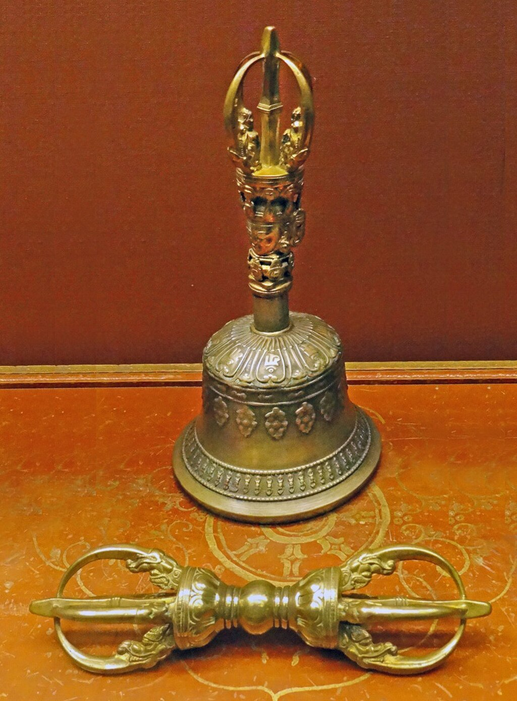A [vajra](https://en.wikipedia.org/wiki/Vajra "Vajra") and [bell](https://en.wikipedia.org/wiki/Bell "Bell") (_[ghanta](https://en.wikipedia.org/wiki/Ghanta "Ghanta")_), which are classic ritual symbols of Vajrayāna Buddhism

In [medieval India](https://en.wikipedia.org/wiki/Medieval_India "Medieval India"), the initial terms that were used to refer to the tantric Buddhist tradition were _Mantranāya_ ("Path of Mantras") and _Mantrayāna_ ("Mantra Vehicle"). Later, other terms were adopted, like _Vajrayāna_ ("Diamond Vehicle" or "Thunderbolt Vehicle").

In [Tibetan Buddhism](https://en.wikipedia.org/wiki/Tibetan_Buddhism "Tibetan Buddhism") practiced in the Himalayan regions of [India](https://en.wikipedia.org/wiki/India "India"), [Nepal](https://en.wikipedia.org/wiki/Nepal "Nepal"), [Tibet](https://en.wikipedia.org/wiki/Tibet "Tibet"), and [Bhutan](https://en.wikipedia.org/wiki/Bhutan "Bhutan"), Buddhist Tantra is most often termed _Vajrayāna_ (Tib. རྡོ་རྗེ་ཐེག་པ་, _dorje tekpa_, Wyl. _rdo rje theg pa_) and _Secret mantra_ (Skt. _Guhyamantra_, Tib. གསང་སྔགས་, _sang ngak_, Wyl. _gsang sngags_). The _[vajra](https://en.wikipedia.org/wiki/Vajra "Vajra")_ is a mythical weapon associated with [Indra](https://en.wikipedia.org/wiki/Indra "Indra") that was said to be indestructible and unbreakable (like a [diamond](https://en.wikipedia.org/wiki/Diamond "Diamond")) and extremely powerful (like a [thunderbolt](https://en.wikipedia.org/wiki/Thunder "Thunder")). Thus, the term is variously translated as Diamond Vehicle, Thunderbolt Vehicle, Indestructible Vehicle, and so on.

> The [vajra](https://en.wikipedia.org/wiki/Vajra "Vajra"), or [diamond](https://en.wikipedia.org/wiki/Diamond "Diamond"), is an adamantine symbol. A diamond has two qualities: it has the power to shatter all ordinary stones, and conversely, no stone can break a diamond. The actual vajra is the [mind](https://en.wikipedia.org/wiki/Mind "Mind") that has the [realization](https://en.wikipedia.org/wiki/Enlightenment_in_Buddhism "Enlightenment in Buddhism") of the [ultimate truth](https://en.wikipedia.org/wiki/Two_truths_doctrine "Two truths doctrine") inseparably merged with a special kind of tantric bliss. \[...\] That is why the vajra, or diamond, is the symbol of the tantric path and its result: the [wisdom](https://en.wikipedia.org/wiki/Prajñā_\(Buddhism\) "Prajñā (Buddhism)") of [nondual](https://en.wikipedia.org/wiki/Nondualism "Nondualism") [emptiness](https://en.wikipedia.org/wiki/Śūnyatā "Śūnyatā") and bliss.

In [Chinese Esoteric Buddhism](https://en.wikipedia.org/wiki/Chinese_Esoteric_Buddhism "Chinese Esoteric Buddhism"), it is generally known by terms such as _Zhēnyán_ ([Chinese](https://en.wikipedia.org/wiki/Chinese_language "Chinese language"): 真言, literally "true word", referring to mantra), [_Tángmì_](https://en.wikipedia.org/wiki/Tangmi "Tangmi") or _Hanmì_ (唐密 - 漢密, "[Tang](https://en.wikipedia.org/wiki/Tang_dynasty "Tang dynasty") Esotericism" or "[Han](https://en.wikipedia.org/wiki/Han_Chinese "Han Chinese") Esotericism")_, Mìzōng_ (密宗, "Esoteric Sect"), or _Mìjiao_ (Chinese: 密教; Esoteric Teaching). The Chinese term _mì_ 密 ("secret, esoteric") is a translation of the Sanskrit term _Guhya_ ("secret, hidden, profound, abstruse").

In [Japan](https://en.wikipedia.org/wiki/Japan "Japan"), Buddhist esotericism is known as _[Mikkyō](https://en.wikipedia.org/wiki/Mikkyō "Mikkyō")_ (密教, secret teachings) or by the term [Shingon](https://en.wikipedia.org/wiki/Shingon_Buddhism "Shingon Buddhism") (a Japanese rendering of _Zhēnyán_), which also refers to a specific school of _Shingon-shū_ (真言宗).

The term "Esoteric Buddhism" is first used by [Western occultist](https://en.wikipedia.org/wiki/Western_Esoteric_Tradition "Western Esoteric Tradition") writers, such as [Helena Blavatsky](https://en.wikipedia.org/wiki/Helena_Blavatsky "Helena Blavatsky") and [Alfred Percy Sinnett](https://en.wikipedia.org/wiki/Alfred_Percy_Sinnett "Alfred Percy Sinnett"), to describe [theosophical](https://en.wikipedia.org/wiki/Theosophy "Theosophy") doctrines passed down from "supposedly initiated Buddhist masters."

## Origins

According to David B. Gray, Vajrayana originated from pre-existing [Tantric](https://en.wikipedia.org/wiki/Tantric "Tantric") traditions, also known as 'Tantrism', which emerged within [Hinduism](https://en.wikipedia.org/wiki/Hinduism "Hinduism") during the first millennium CE. These early Hindu tantric practices had a profound influence on South Asian Mahāyāna Buddhism, leading to the development of distinct Buddhist tantric traditions, which arose in the 7th century CE, rapidly spread across Southeast, East, and Central Asia, giving rise to distinct traditions in East Asia and Tibet.

## History

Mahasiddhas, Palpung monastery. Note the figure of the great adept Putalipa at center, seated in a cave and gazing at an image of the meditational deity Samvara and the figure at the bottom left holding a skull-staff (_[khaṭvāṅga](https://en.wikipedia.org/wiki/Khaṭvāṅga "Khaṭvāṅga")_) and a flaying knife (_[kartika](https://en.wikipedia.org/wiki/Kartika_\(knife\) "Kartika (knife)")_).

### Mahasiddhas and the tantric movement

Tantric Buddhism is associated with groups of wandering [yogis](https://en.wikipedia.org/wiki/Yogi "Yogi") called [mahasiddhas](https://en.wikipedia.org/wiki/Mahasiddha "Mahasiddha") in [medieval India](https://en.wikipedia.org/wiki/Medieval_India "Medieval India"). According to [Robert Thurman](https://en.wikipedia.org/wiki/Robert_Thurman "Robert Thurman"), these tantric figures thrived during the latter half of the first millennium CE. According to John Myrdhin Reynolds, the mahasiddhas date to the medieval period in North India and used methods radically different from those used in Buddhist monasteries, including practicing on [charnel grounds](https://en.wikipedia.org/wiki/Charnel_ground "Charnel ground").

Since Tantra focuses on the transformation of poisons into wisdom, the yogic circles came together in _[tantric feasts](https://en.wikipedia.org/wiki/Ganachakra "Ganachakra")_, often in sacred sites (_pitha_) and places (_ksetra_), which included dancing, singing, consort practices, and the ingestion of [taboo](https://en.wikipedia.org/wiki/Taboo "Taboo") substances like alcohol, urine, and meat. At least two of the mahasiddhas cited in the Buddhist literature are comparable with the Shaiva [Nath](https://en.wikipedia.org/wiki/Nath "Nath") saints ([Gorakshanath](https://en.wikipedia.org/wiki/Gorakshanath "Gorakshanath") and [Matsyendranath](https://en.wikipedia.org/wiki/Matsyendranath "Matsyendranath")) who practiced [Hatha Yoga](https://en.wikipedia.org/wiki/Hatha_Yoga "Hatha Yoga").

According to Schumann, a movement called _[Sahaja](https://en.wikipedia.org/wiki/Sahaja "Sahaja")-siddhi_ developed in the 8th century in [Bengal](https://en.wikipedia.org/wiki/Bengal "Bengal"). It was dominated by long-haired, wandering mahasiddhas who openly challenged and ridiculed the Buddhist establishment. The mahasiddhas pursued _[siddhis](https://en.wikipedia.org/wiki/Siddhis "Siddhis")_, magical powers such as flight and [extrasensory perception](https://en.wikipedia.org/wiki/Extrasensory_perception "Extrasensory perception") as well as spiritual liberation.

### Tantras

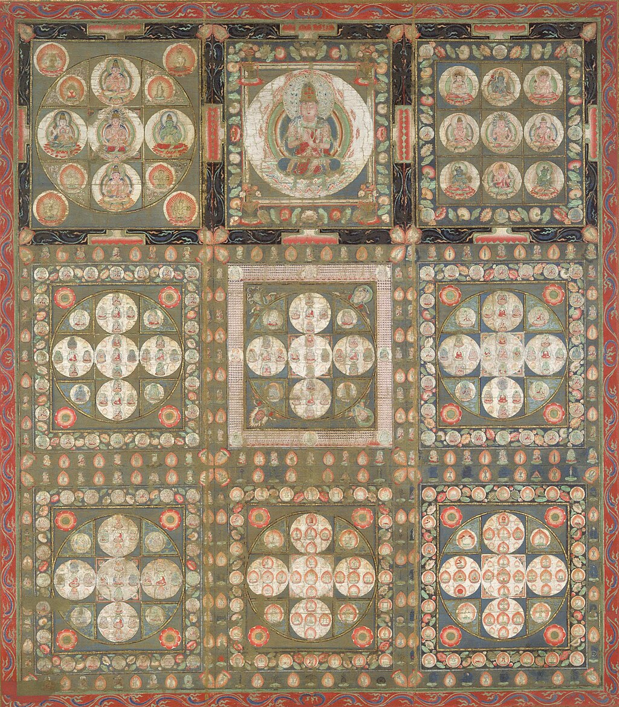[Vajra Realm Mandala](https://en.wikipedia.org/wiki/Vajra_Realm_Mandala "Vajra Realm Mandala"), based on the tantric [Vajrasekhara Sutra](https://en.wikipedia.org/wiki/Vajrasekhara_Sutra "Vajrasekhara Sutra"), and symbolizing the final realization of [Vairocana](https://en.wikipedia.org/wiki/Vairocana "Vairocana") Buddha in [Shingon](https://en.wikipedia.org/wiki/Shingon "Shingon")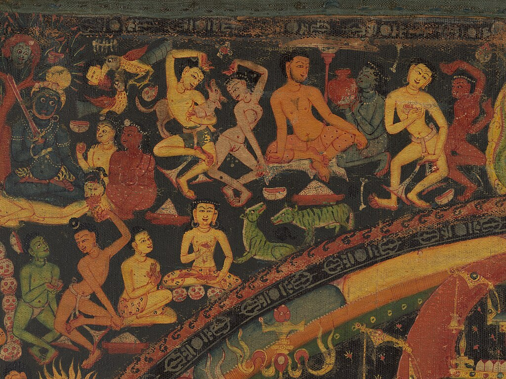Naked tantrikas dancing and eating from skull cups ([kapalas](https://en.wikipedia.org/wiki/Kapala "Kapala")), closeup of a [Chakrasamvara](https://en.wikipedia.org/wiki/Cakrasaṃvara_Tantra "Cakrasaṃvara Tantra") mandala

Mahāyāna [sutras](https://en.wikipedia.org/wiki/Sutras "Sutras") contain "proto-tantric" material, such as the _[Gandavyuha](https://en.wikipedia.org/wiki/Gandavyuha "Gandavyuha")_ and the [_Dasabhumika_](https://en.wikipedia.org/wiki/Ten_Stages_Sutra "Ten Stages Sutra"), which might have served as a central source of visual imagery for Tantric texts. Later Mahāyāna texts like the _[Kāraṇḍavyūha Sūtra](https://en.wikipedia.org/wiki/Kāraṇḍavyūhasūtra "Kāraṇḍavyūhasūtra")_ (c. 4th–5th century CE) expound the use of mantras such as [Om mani padme hum](https://en.wikipedia.org/wiki/Om_mani_padme_hum "Om mani padme hum"), associated with vastly powerful beings like [Avalokiteshvara](https://en.wikipedia.org/wiki/Avalokiteśvara "Avalokiteśvara"). The [Heart Sutra](https://en.wikipedia.org/wiki/Heart_Sutra "Heart Sutra") also includes a mantra.

Vajrayāna Buddhists developed a large corpus of texts, the [Buddhist Tantras](https://en.wikipedia.org/wiki/Buddhist_Tantras "Buddhist Tantras"), some of which can be traced to at least the 7th century CE but might be older. The dating of the tantras is "a difficult, indeed an impossible task", according to [David Snellgrove](https://en.wikipedia.org/wiki/David_Snellgrove "David Snellgrove").

Some of the earliest of these texts, [Kriya tantras](https://en.wikipedia.org/wiki/Outer_Tantras "Outer Tantras") such as the _[Mañjuśrī-mūla-kalpa](https://en.wikipedia.org/wiki/Mañjuśrī-mūla-kalpa "Mañjuśrī-mūla-kalpa")_ (c. 6th century), teach the use of mantras and dharanis for mostly worldly ends, including curing illness, controlling the weather and generating wealth. The _[Tattvasaṃgraha Tantra](https://en.wikipedia.org/wiki/Tattvasaṃgraha_Tantra "Tattvasaṃgraha Tantra")_ (_Compendium of Principles_), classed as a "Yoga tantra", is one of the first Buddhist tantras that focuses on liberation as opposed to worldly goals. In another early tantra, the [_Vajrasekhara_](https://en.wikipedia.org/wiki/Vajrasekhara_Sutra "Vajrasekhara Sutra") (Vajra Peak), the influential schema of the [five Buddha families](https://en.wikipedia.org/wiki/Five_Dhyani_Buddhas "Five Dhyani Buddhas") is developed. Other early tantras include the _[Mahāvairocana Abhisaṃbodhi](https://en.wikipedia.org/wiki/Mahavairocana_Tantra "Mahavairocana Tantra")_ and the _[Guhyasamāja](https://en.wikipedia.org/wiki/Guhyasamāja_Tantra "Guhyasamāja Tantra")_ (Gathering of Secrets).

The Guhyasamāja is a [Mahayoga](https://en.wikipedia.org/wiki/Mahayoga "Mahayoga") class of Tantra, which features forms of ritual practice considered "left-hand" (_[vamachara](https://en.wikipedia.org/wiki/Vamachara "Vamachara")_), such as use of taboo substances like alcohol, consort practices, and [charnel ground](https://en.wikipedia.org/wiki/Charnel_ground "Charnel ground") practices that evoke [wrathful deities](https://en.wikipedia.org/wiki/Wrathful_deities "Wrathful deities"). Ryujun Tajima divides the tantras into those that were "a development of Mahāyānist thought" and those "formed in a rather popular mould toward the end of the eighth century and declining into the esoterism of the left". This "left esoterism" mainly refers to the Yogini tantras and later works associated with wandering yogis. This practice survives in Tibetan Buddhism, but it is rare for this to be done with an actual person. It is more common for a yogi or yogini to use an imagined consort (a buddhist tantric deity, i.e. a yidam).

Later tantras such as the _[Hevajra Tantra](https://en.wikipedia.org/wiki/Hevajra_Tantra "Hevajra Tantra")_ and the _[Chakrasamvara](https://en.wikipedia.org/wiki/Chakrasamvara "Chakrasamvara")_ are classed as "[Yogini](https://en.wikipedia.org/wiki/Yogini "Yogini") tantras" and represent the final form of development of Indian Buddhist tantras in the ninth and tenth centuries. The _[Kalachakra tantra](https://en.wikipedia.org/wiki/Kalachakra_tantra "Kalachakra tantra")_ developed in the 10th century. It is farthest removed from the earlier Buddhist traditions, and incorporates concepts of [messianism](https://en.wikipedia.org/wiki/Messianism "Messianism") and [astrology](https://en.wikipedia.org/wiki/Astrology "Astrology") not present elsewhere in Buddhist literature.

According to Ronald M. Davidson, the rise of Tantric Buddhism was a response to the feudal structure of Indian society in the early medieval period (ca. 500–1200 CE), which saw kings divinized as manifestations of gods. Likewise, tantric yogis reconfigured their practice through the metaphor of being consecrated (_[abhiśeka](https://en.wikipedia.org/wiki/Abhisheka "Abhisheka")_) as the overlord (_rājādhirāja_) of a mandala palace of divine vassals, an imperial metaphor symbolizing kingly fortresses and their political power.

### Relationship to Shaivism

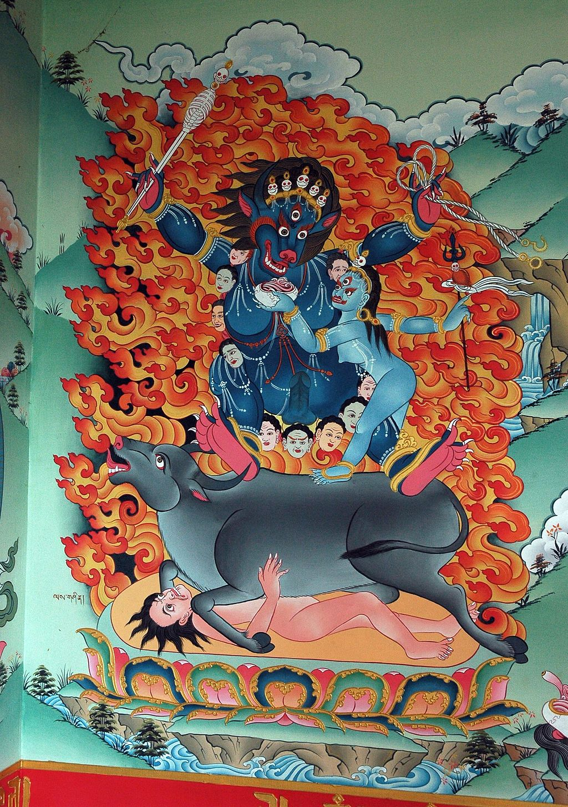Vajrayana adopted deities such as [Bhairava](https://en.wikipedia.org/wiki/Bhairava "Bhairava"), known as [Yamantaka](https://en.wikipedia.org/wiki/Yamantaka "Yamantaka") in [Tibetan Buddhism](https://en.wikipedia.org/wiki/Tibetan_Buddhism "Tibetan Buddhism").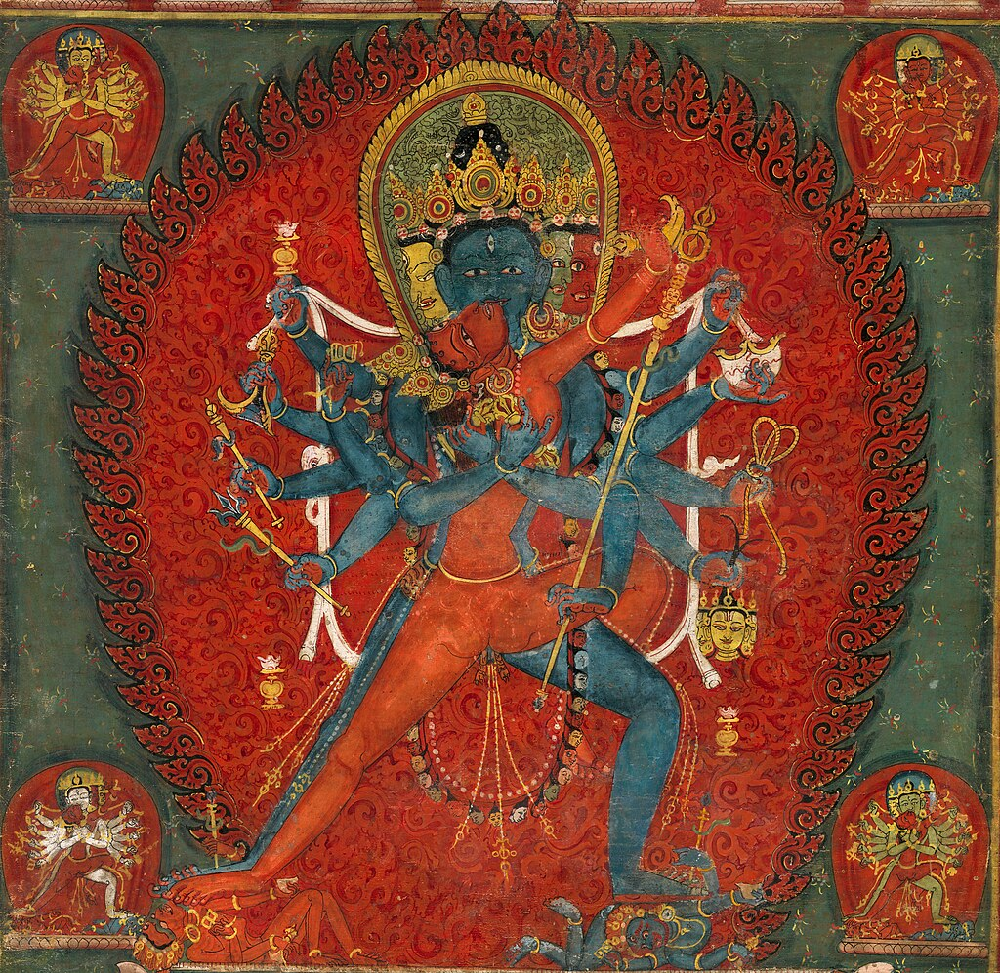The central deity of the [Cakrasaṃvara Tantra](https://en.wikipedia.org/wiki/Cakrasaṃvara_Tantra "Cakrasaṃvara Tantra"), which, according to scholars like David B. Gray and Alexis Sanderson, appropriated numerous elements from nondual Shaiva Tantra

The question of the origins of early Vajrayāna has been taken up by various scholars. [David Seyfort Ruegg](https://en.wikipedia.org/wiki/David_Seyfort_Ruegg "David Seyfort Ruegg") has suggested that Buddhist tantra employed various elements of a "pan-Indian religious substrate" that is not specifically Buddhist, [Shaiva](https://en.wikipedia.org/wiki/Shaivism "Shaivism") or [Vaishnava](https://en.wikipedia.org/wiki/Vaishnavism "Vaishnavism").

According to [Alexis Sanderson](https://en.wikipedia.org/wiki/Alexis_Sanderson "Alexis Sanderson"), various classes of Vajrayāna literature developed as a result of royal courts sponsoring both Buddhism and Shaivism. The relationship between the two systems can be seen in texts like the [_Mañjusrimulakalpa_](https://en.wikipedia.org/wiki/Mañjuśrī-mūla-kalpa "Mañjuśrī-mūla-kalpa"), which later came to be classified under [Kriya tantra](https://en.wikipedia.org/wiki/Outer_Tantras#Kriyatantra "Outer Tantras"), and states that mantras taught in the Shaiva, Garuda, and Vaishnava tantras will be effective if applied by Buddhists since they were all taught originally by [Manjushri](https://en.wikipedia.org/wiki/Manjushri "Manjushri").

Sanderson notes that the Vajrayāna Yogini tantras draw extensively from the material also present in Shaiva [Bhairava](https://en.wikipedia.org/wiki/Bhairava "Bhairava") tantras classified as _Vidyapitha_. Sanderson's comparison of them shows similarity in "ritual procedures, style of observance, deities, mantras, mandalas, ritual dress, Kapalika accouterments like skull bowls, specialized terminology, secret gestures, and secret jargons. There is even direct borrowing of passages from Shaiva texts." Sanderson gives numerous examples, such as the _Guhyasiddhi_ of Padmavajra, a work associated with the [Guhyasamaja tradition](https://en.wikipedia.org/wiki/Guhyasamāja_tantra "Guhyasamāja tantra"), which prescribes acting as a [Shaiva](https://en.wikipedia.org/wiki/Shaivism "Shaivism") guru and initiating members into [Saiva Siddhanta](https://en.wikipedia.org/wiki/Shaiva_Siddhanta "Shaiva Siddhanta") scriptures and mandalas. Sanderson says that the [Samvara tantra](https://en.wikipedia.org/wiki/Cakrasaṃvara_Tantra "Cakrasaṃvara Tantra") texts adopted the [pitha](https://en.wikipedia.org/wiki/Hindu_pilgrimage_sites "Hindu pilgrimage sites") list from the Shaiva text _Tantrasadbhāva_, introducing a copying error where a deity was mistaken for a place.

Davidson argues that Sanderson's arguments for direct influence from Shaiva _Vidyapitha_ texts are problematic because "the chronology of the _Vidyapitha_ tantras is by no means so well established" and "the available evidence suggests that received Saiva tantras come into evidence sometime in the ninth to tenth centuries with their affirmation by scholars like [Abhinavagupta](https://en.wikipedia.org/wiki/Abhinavagupta "Abhinavagupta") (c. 1000 c.e.)" Davidson also notes that the list of pithas or sacred places is "certainly not particularly Buddhist, nor are they uniquely [Kapalika](https://en.wikipedia.org/wiki/Kapalika "Kapalika") venues, despite their presence in lists employed by both traditions." He adds that, like the Buddhists, the Shaiva tradition was involved in the appropriation of Hindu and non-Hindu deities, texts, and traditions, an example being "village or tribal divinities like Tumburu".

Davidson adds that Buddhists and Kapalikas as well as other ascetics (possibly [Pasupatas](https://en.wikipedia.org/wiki/Pashupata_Shaivism "Pashupata Shaivism")) mingled and discussed their paths at various pilgrimage places and that there were conversions between the different groups. Thus he concludes:

> The Buddhist-Kapalika connection is more complex than a simple process of religious imitation and textual appropriation. There can be no question that the Buddhist tantras were heavily influenced by [Kapalika](https://en.wikipedia.org/wiki/Kapalika "Kapalika") and other Saiva movements, but the influence was apparently mutual. Perhaps a more nuanced model would be that the various lines of transmission were locally flourishing and that in some areas they interacted, while in others they maintained concerted hostility. Thus the influence was both sustained and reciprocal, even in those places where Buddhist and Kapalika siddhas were in extreme antagonism.

Davidson also argues for the influence of non-Brahmanical and outcaste [tribal religions](https://en.wikipedia.org/wiki/Tribal_religions_in_India "Tribal religions in India") and their feminine deities (such as [Parnasabari](https://en.wikipedia.org/wiki/Paranasabari "Paranasabari") and Janguli).

### Traditional legends

According to several Buddhist tantras as well as traditional Tibetan Buddhist sources, the Vajrayana tantras were taught by the [Buddha Shakyamuni](https://en.wikipedia.org/wiki/Gautama_Buddha "Gautama Buddha"), but only to some individuals. There are several stories and versions of how the tantras were disseminated. The _Jñana Tilaka Tantra_, for example, has the Buddha say that the tantras will be explained by the bodhisattva [Vajrapani](https://en.wikipedia.org/wiki/Vajrapani "Vajrapani"). One of the most famous legends is that of king [Indrabhuti](https://en.wikipedia.org/wiki/Indrabhuti "Indrabhuti") (also known as King Ja) of [Oddiyana](https://en.wikipedia.org/wiki/Oddiyana "Oddiyana") (a figure related to Vajrapani, in some cases said to be an emanation of him).

Other accounts attribute the revelation of Buddhist tantras to [Padmasambhava](/source/padmasambhava/ "Padmasambhava"), saying that he was an emanation of [Amitabha](https://en.wikipedia.org/wiki/Amitabha "Amitabha") and [Avalokiteshvara](https://en.wikipedia.org/wiki/Avalokiteśvara "Avalokiteśvara") and that the Buddha predicted his arrival. Some accounts also maintain Padmasambhava is a direct reincarnation of Buddha Shakyamuni.

## Philosophical background

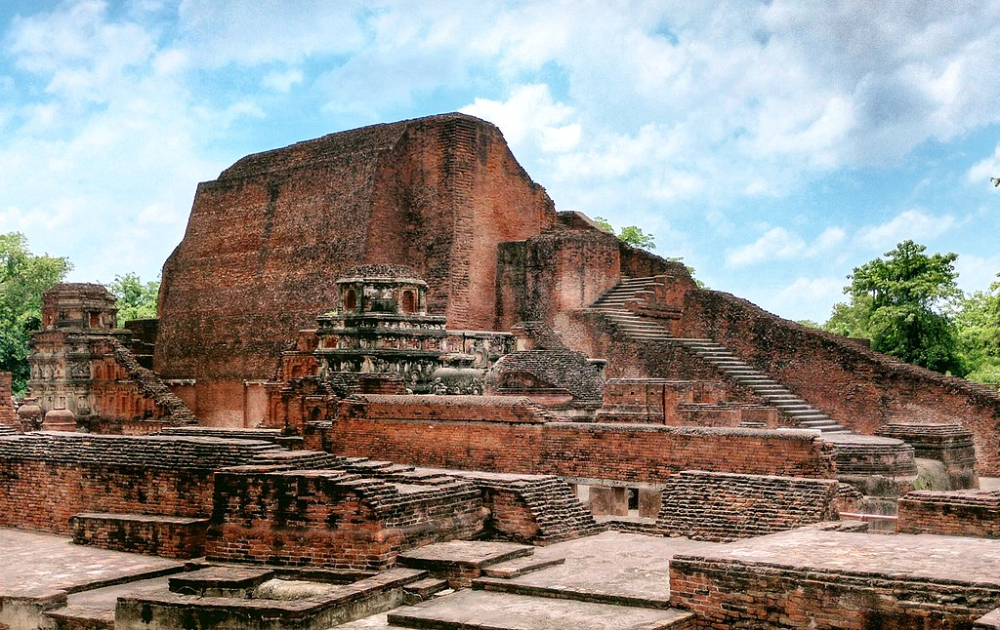[Nalanda Mahavihara](https://en.wikipedia.org/wiki/Nalanda_mahavihara "Nalanda mahavihara"), a major center for the study of Vajrayana philosophy during the [Pala era](https://en.wikipedia.org/wiki/Pala_Empire "Pala Empire").

According to [Alex Wayman](https://en.wikipedia.org/wiki/Alex_Wayman "Alex Wayman"), the philosophical view of Vajrayana is based on [Mahayana](https://en.wikipedia.org/wiki/Mahayana "Mahayana") [Buddhist philosophy](https://en.wikipedia.org/wiki/Buddhist_philosophy "Buddhist philosophy"), mainly the [Madhyamaka](/source/madhyamaka/ "Madhyamaka") and [Yogacara](https://en.wikipedia.org/wiki/Yogacara "Yogacara") schools. The major difference seen by Vajrayana thinkers is the superiority of Tantric methods, which provide a faster vehicle to liberation and contain many more skillful means (_[upaya](https://en.wikipedia.org/wiki/Upaya "Upaya")_).

The importance of the theory of [emptiness](https://en.wikipedia.org/wiki/Shunyata "Shunyata") is central to the Tantric Buddhist view and practice. The Buddhist emptiness view sees the world as fluid, without an ontological foundation or inherent existence, but ultimately a fabric of constructions. Because of this, tantric practice such as self-visualization as the deity is seen as no less real than everyday reality, but a process of transforming reality itself, including the practitioner's identity as the deity. Stephan Beyer notes, "In a universe where all events dissolve ontologically into Emptiness, the touching of Emptiness in the ritual is the re-creation of the world in actuality".

The doctrine of [Buddha-nature](https://en.wikipedia.org/wiki/Buddha-nature "Buddha-nature"), as outlined in the _[Ratnagotravibhāga](https://en.wikipedia.org/wiki/Ratnagotravibhāga "Ratnagotravibhāga")_ of [Asanga](https://en.wikipedia.org/wiki/Asanga "Asanga"), was also an important theory that became the basis for Tantric views. As explained by the Tantric commentator Lilavajra, this "intrinsic secret \[behind\] diverse manifestation" is Tantra's utmost secret and aim. According to Wayman, this "Buddha embryo" (_tathāgatagarbha_) is a "non-dual, self-originated Wisdom ([jnana](https://en.wikipedia.org/wiki/Jnana "Jnana")), an effortless fount of good qualities" that resides in the mindstream but is "obscured by discursive thought". This doctrine is often associated with the idea of [inherent or natural luminosity](https://en.wikipedia.org/wiki/Luminous_mind "Luminous mind") ([Skt:](/source/sanskrit/ "Sanskrit") _prakṛti-prabhāsvara-citta_, [T.](https://en.wikipedia.org/wiki/Tibetic_languages "Tibetic languages") _’od gsal gyi sems_) or purity of the mind (_prakrti-parisuddha_).

Another fundamental theory of [Tantric practice](https://en.wikipedia.org/wiki/Tantric_practice "Tantric practice") is that of transformation. In Vajrayāna, negative mental factors such as desire, hatred, greed, and pride are used as part of the path. As French Indologist Madeleine Biardeau notes, the tantric doctrine is "an attempt to place _[kama](https://en.wikipedia.org/wiki/Kama "Kama")_, desire, in every meaning of the word, in the service of liberation." This view is outlined in the following passage from the _[Hevajra tantra](https://en.wikipedia.org/wiki/Hevajra_tantra "Hevajra tantra")_:

> Those things by which evil men are bound, others turn into means and gain thereby release from the bonds of existence. By passion the world is bound, by passion too it is released, but by heretical Buddhists this practice of reversals is not known.

The _Hevajra_ further states that "one knowing the nature of poison may dispel poison with poison." As Snellgrove notes, this idea is already present in [Asanga](https://en.wikipedia.org/wiki/Asanga "Asanga")'s _[Mahayana-sutra-alamkara-karika](https://en.wikipedia.org/wiki/Mahayana-sutra-alamkara-karika "Mahayana-sutra-alamkara-karika")_ and therefore it is possible that he was aware of Tantric techniques, including sexual yoga.

According to Buddhist Tantra, there is no strict separation of the profane or _[samsara](https://en.wikipedia.org/wiki/Samsara "Samsara")_ and the sacred or _[nirvana](https://en.wikipedia.org/wiki/Nirvana "Nirvana")_; rather, they exist in a continuum. Everyone is seen as containing the seed of enlightenment, which is covered over by [defilements](https://en.wikipedia.org/wiki/Kleshas_\(Buddhism\) "Kleshas (Buddhism)"). [Douglas Duckworth](https://en.wikipedia.org/wiki/Douglas_Duckworth "Douglas Duckworth") notes that Vajrayana sees [Buddhahood](https://en.wikipedia.org/wiki/Buddhahood "Buddhahood") not as something outside or an event in the future, but as immanently present.

Indian Tantric Buddhist philosophers such as [Buddhaguhya](https://en.wikipedia.org/wiki/Buddhaguhya "Buddhaguhya"), [Vimalamitra](/source/vimalamitra/ "Vimalamitra"), [Ratnākaraśānti](https://en.wikipedia.org/wiki/Ratnākaraśānti "Ratnākaraśānti"), and [Abhayakaragupta](https://en.wikipedia.org/wiki/Abhayakaragupta "Abhayakaragupta") continued the tradition of Buddhist philosophy and adapted it to their commentaries on the major Tantras. Abhayakaragupta's _Vajravali_ is a key source in the theory and practice of tantric rituals. After monks such as [Vajrabodhi](https://en.wikipedia.org/wiki/Vajrabodhi "Vajrabodhi") and [Śubhakarasiṃha](https://en.wikipedia.org/wiki/Śubhakarasiṃha "Śubhakarasiṃha") brought Tantra to Tang China (716 to 720), tantric philosophy continued to be developed in Chinese and Japanese by thinkers such as [Yi Xing](https://en.wikipedia.org/wiki/Yi_Xing "Yi Xing") and [Kūkai](https://en.wikipedia.org/wiki/Kūkai "Kūkai").

Likewise in [Tibet](https://en.wikipedia.org/wiki/Tibet "Tibet"), [Sakya Pandita](https://en.wikipedia.org/wiki/Sakya_Pandita "Sakya Pandita") (1182–28 – 1251), as well as later thinkers like [Longchenpa](/source/longchenpa/ "Longchenpa") (1308–1364) expanded on these philosophies in their tantric commentaries and treatises. The status of the tantric view continued to be debated in medieval Tibet. [Tibetan Buddhist](https://en.wikipedia.org/wiki/Tibetan_Buddhist "Tibetan Buddhist") [Rongzom Chokyi Zangpo](https://en.wikipedia.org/wiki/Rongzom_Chokyi_Zangpo "Rongzom Chokyi Zangpo") (1012–1088) held that the views of sutra such as Madhyamaka were inferior to that of tantra, which was based on basic purity of ultimate reality. [Tsongkhapa](https://en.wikipedia.org/wiki/Tsongkhapa "Tsongkhapa") (1357–1419), on the other hand, held that there is no difference between Vajrayāna and other forms of Mahāyāna in terms of _[prajnaparamita](https://en.wikipedia.org/wiki/Prajnaparamita "Prajnaparamita")_ (perfection of insight) itself, only that Vajrayāna works faster.

## Place within Buddhist tradition

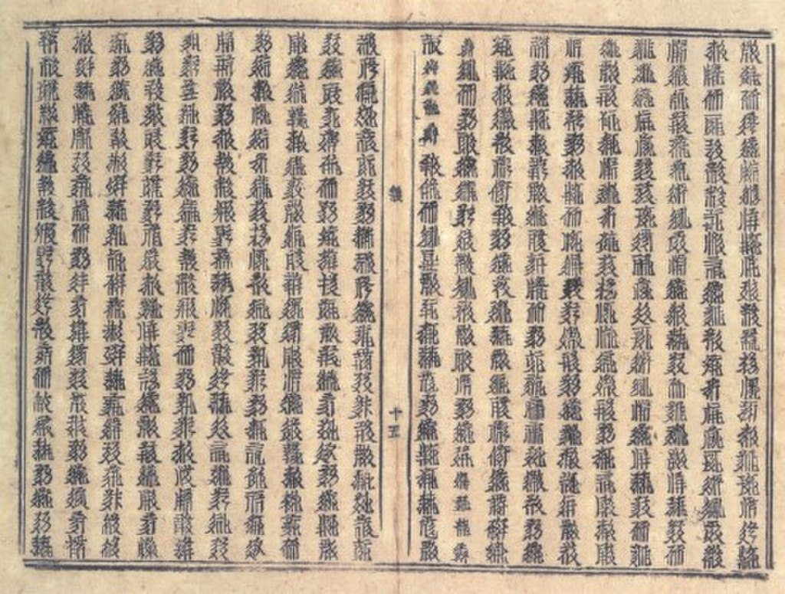[Tangut](https://en.wikipedia.org/wiki/Tangut_people "Tangut people") _Auspicious [Tantra](https://en.wikipedia.org/wiki/Tantras_\(Buddhism\) "Tantras (Buddhism)") of All-Reaching Union_

Various classifications distinguish Vajrayāna from other Buddhist traditions. Vajrayāna can be seen as a third _yana_, next to [Śrāvakayāna](https://en.wikipedia.org/wiki/Śrāvakayāna "Śrāvakayāna") and [Mahayana](https://en.wikipedia.org/wiki/Mahayana "Mahayana"). Vajrayāna can be distinguished from [Sutrayana](https://en.wikipedia.org/wiki/Sutrayana "Sutrayana"). Sutrayana is the method of perfecting good qualities, where Vajrayāna is the method of taking the intended outcome of [Buddhahood](https://en.wikipedia.org/wiki/Buddhahood "Buddhahood") as the path. Vajrayāna can also be distinguished from the paramitayana. According to this schema, Indian Mahāyāna revealed two vehicles (_yana_) or methods for attaining enlightenment: the method of the perfections (_Paramitayana_) and the method of mantra (_Mantrayana_).

The Paramitayana consists of the six or ten _[paramitas](https://en.wikipedia.org/wiki/Paramita "Paramita")_, of which the scriptures say that it takes three incalculable [aeons](https://en.wikipedia.org/wiki/Aeon "Aeon") to lead one to Buddhahood. The tantra literature, on the other hand, says that Mantrayana leads one to Buddhahood in a single lifetime. According to the literature, the mantra is an easy path without the difficulties of Paramitayana. Mantrayana is sometimes portrayed as a method for those of inferior abilities, but the practitioner of mantra must still adhere to the [Bodhisattva vow](https://en.wikipedia.org/wiki/Bodhisattva_vow "Bodhisattva vow").

## Characteristics

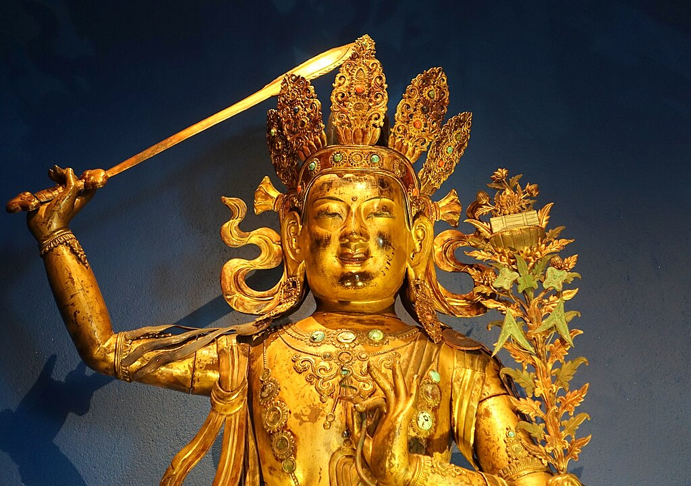[Manjushri](https://en.wikipedia.org/wiki/Manjushri "Manjushri"), the [bodhisattva](https://en.wikipedia.org/wiki/Bodhisattva "Bodhisattva") associated with [prajñā](https://en.wikipedia.org/wiki/Prajñā_\(Buddhism\) "Prajñā (Buddhism)")

### Goal

The goal of spiritual practice in the Mahāyāna and Vajrayāna traditions is to become a _[Sammāsambuddha](https://en.wikipedia.org/wiki/Buddhahood "Buddhahood")_ (fully awakened [Buddha](https://en.wikipedia.org/wiki/Buddha "Buddha")); those on this path are termed [Bodhisattvas](https://en.wikipedia.org/wiki/Bodhisattvas "Bodhisattvas"). As with the Mahāyāna, motivation is a vital component of Vajrayāna practice. The Bodhisattva-path is an integral part of Vajrayāna, which teaches that all practices are to be undertaken with the motivation to achieve Buddhahood for the benefit of all sentient beings.

In the vehicle of Sutra Mahāyāna, the "path of the cause" is taken whereby a practitioner starts with his or her potential Buddha-nature and nurtures it to produce the fruit of Buddhahood. In Vajrayāna, the "path of the fruit" is taken whereby the practitioner takes his or her innate Buddha-nature as the means of practice. Experiencing ultimate truth is said to be the purpose of all the various [tantric techniques](https://en.wikipedia.org/wiki/Tantra_techniques_\(Vajrayana\) "Tantra techniques (Vajrayana)") practiced in Vajrayana.

### Esoteric transmission

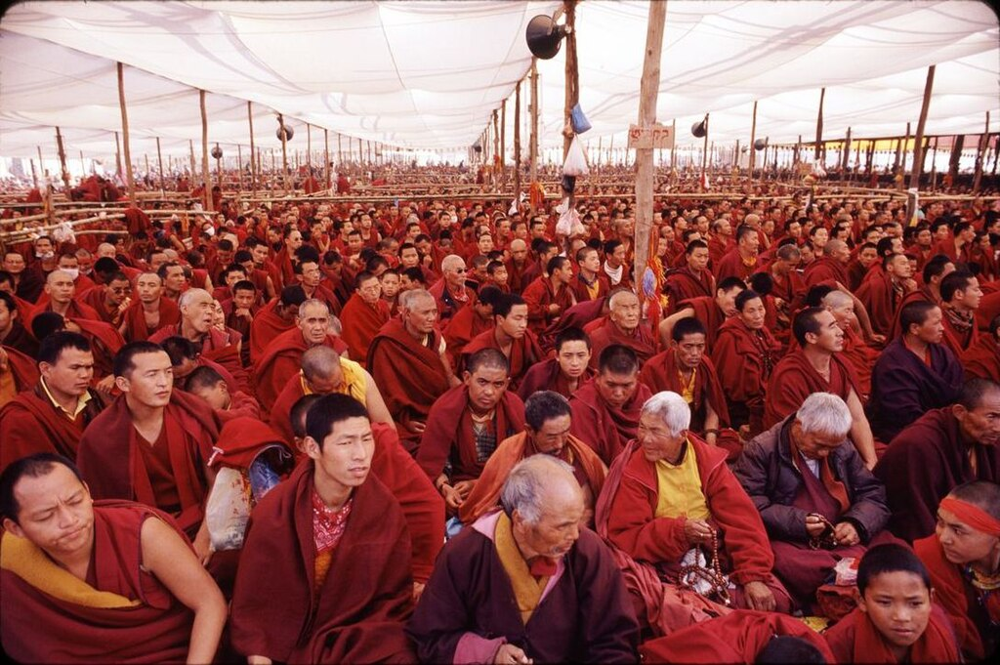Monks attending the 2003 [Kalachakra](https://en.wikipedia.org/wiki/Kalachakra "Kalachakra") empowerment in [Bodhgaya](https://en.wikipedia.org/wiki/Bodhgaya "Bodhgaya"), India. Some empowerment ceremonies can include large numbers of initiates.

Vajrayāna Buddhism is esoteric in the sense that the transmission of certain teachings occurs only from teacher to student during an [empowerment](https://en.wikipedia.org/wiki/Empowerment_\(Vajrayana\) "Empowerment (Vajrayana)") (_abhiṣeka_), and their practice requires initiation in a ritual space containing the mandala of the deity. Because of their role in giving access to the practices and guiding the student through them, the [Vajracharya](https://en.wikipedia.org/wiki/Vajracharya "Vajracharya") [Lama](https://en.wikipedia.org/wiki/Lama "Lama") is considered indispensable in Vajrayāna.

The secrecy of teachings was often protected through the use of allusive, indirect, [symbolic](https://en.wikipedia.org/wiki/Symbolic_language_\(literature\) "Symbolic language (literature)"), and metaphorical language ([twilight language](https://en.wikipedia.org/wiki/Twilight_language "Twilight language")) that required interpretation and guidance from a teacher. The teachings may also be considered "self-secret", meaning that even if they were to be told directly to a person, that person would not necessarily understand the teachings without proper context. In this way, the teachings are "secret" to the minds of those who are not following the path with more than simple curiosity.

Esler points out that while secrecy is presented as necessary to prevent the teachings from falling into the hands of unworthy recipients, it also serves to demarcate a kind of religious in-group. He observes that from an anthropological perspective, allowing reference to the secret to "remain close to the social surface" through veiled allusions plays a more important role in some ways than the secret content itself, as it mobilizes the secret as a kind of symbolic capital.

### Affirmation of the feminine, antinomian and taboo

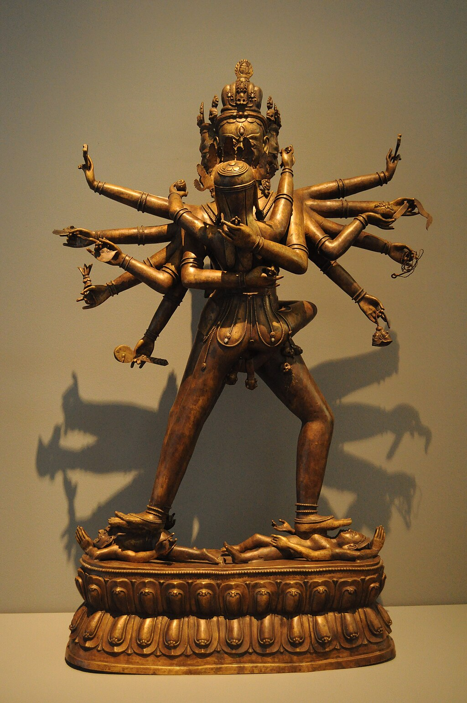Tibetan [Chakrasamvara](https://en.wikipedia.org/wiki/Chakrasamvara "Chakrasamvara") statue in [Yab-Yum](https://en.wikipedia.org/wiki/Yab-Yum "Yab-Yum") union with his consort [Vajravārāhī](https://en.wikipedia.org/wiki/Vajravārāhī "Vajravārāhī")

Some Vajrayāna rituals traditionally included the use of certain [taboo](https://en.wikipedia.org/wiki/Taboo "Taboo") substances, such as blood, semen, alcohol, and urine, as ritual offerings and [sacraments](https://en.wikipedia.org/wiki/Sacrament "Sacrament"), though some of these are often replaced with less taboo substances such as yogurt. Tantric feasts and initiations sometimes employed substances like human flesh, as noted by Kahha's _Yogaratnamala_.

The use of these substances is related to the [non-dual](https://en.wikipedia.org/wiki/Non-dual "Non-dual") (_advaya_) nature of a Buddha's wisdom (_buddhajñana_). Since the ultimate state is in some sense non-dual, a practitioner can approach that state by "transcending attachment to dual categories such as pure and impure, permitted and forbidden". As the _Guhyasamaja Tantra_ states, "the wise man who does not discriminate achieves Buddhahood".

Vajrayāna rituals also include [sexual yoga](https://en.wikipedia.org/wiki/Karmamudra "Karmamudra"), union with a physical consort as part of advanced practices. Some tantras go further: the _Hevajra tantra_ states, "You should kill living beings, speak lying words, take what is not given, consort with the women of others". While some of these statements were taken literally as part of ritual practice, others, such as killing, were interpreted metaphorically. In the Hevajra, "killing" is defined as developing concentration by killing the life-breath of discursive thoughts. Likewise, while actual sexual union with a physical consort is practiced, it is also common to use a visualized consort.

Wayman points out that the symbolic meaning of tantric sexuality is ultimately rooted in _[bodhicitta](https://en.wikipedia.org/wiki/Bodhicitta "Bodhicitta")_ and the bodhisattva's quest for enlightenment is likened to a lover seeking union with the mind of the Buddha. [Judith Simmer-Brown](https://en.wikipedia.org/wiki/Judith_Simmer-Brown "Judith Simmer-Brown") notes the importance of the psycho-physical experiences arising in sexual yoga, termed "great bliss" (_mahasukha_): "Bliss melts the conceptual mind, heightens sensory awareness, and opens the practitioner to the naked experience of the nature of mind." This tantric experience is not the same as ordinary self-gratifying sexual passion since it relies on tantric meditative methods using the [illusory body](https://en.wikipedia.org/wiki/Illusory_body "Illusory body") and visualizations as well as the motivation for enlightenment. The _Hevajra tantra_ says:

> This practice \[of sexual union with a consort\] is not taught for the sake of enjoyment, but for the examination of one's own thought, whether the mind is steady or waving.

Feminine deities and forces are a major element of Vajrayāna. In the Yogini tantras in particular, women and female yoginis are given high status as the embodiment of female deities such as the wild and nude [Vajrayogini](https://en.wikipedia.org/wiki/Vajrayogini "Vajrayogini"). The _Candamaharosana Tantra_ (_viii:29–30_) states:

> Women are heaven, women are the teaching (_dharma_)
> Women indeed are the highest austerity (_tapas_)
> Women are the Buddha, women are the _[Sangha](https://en.wikipedia.org/wiki/Sangha "Sangha")_
> Women are the Perfection of Wisdom.

In India, there is evidence that women participated in tantric practice alongside men and were also teachers, adepts, and authors of tantric texts.

### Vows and behaviour

Practitioners of Vajrayāna must abide by various tantric vows or pledges called _[samaya](https://en.wikipedia.org/wiki/Samaya "Samaya")_. These are extensions of the rules of the [Prātimokṣa](https://en.wikipedia.org/wiki/Prātimokṣa "Prātimokṣa") and [Bodhisattva vows](https://en.wikipedia.org/wiki/Bodhisattva_vow "Bodhisattva vow") for the lower levels of tantra, and are taken during initiations into the empowerment for a particular [Unsurpassed Yoga Tantra](https://en.wikipedia.org/wiki/Anuttarayoga_Tantra "Anuttarayoga Tantra"). The special tantric vows vary depending on the specific mandala practice for which the initiation is received and on the level of initiation. [Ngagpas](https://en.wikipedia.org/wiki/Ngagpa "Ngagpa") of the [Nyingma](/source/nyingma/ "Nyingma") school keep a special non-celibate ordination.

A tantric [guru](https://en.wikipedia.org/wiki/Guru "Guru"), or teacher, is expected to keep his or her _samaya_ vows in the same way as his students. Proper conduct is considered especially necessary for a qualified Vajrayana guru. For example, the _Ornament for the Essence_ of Manjushrikirti states:

> Distance yourself from Vajra Masters who are not keeping the three vows
> who keep on with a root downfall, who are miserly with the Dharma,
> and who engage in actions that should be forsaken.
> Those who worship them go to hell and so on as a result.

## Tantra techniques

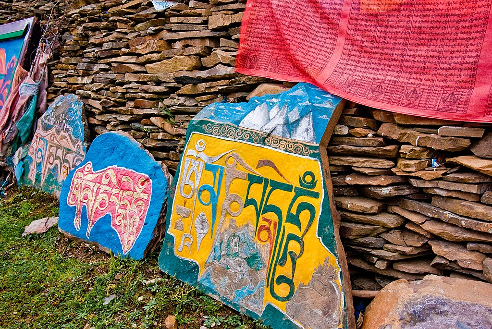[Mani stones](https://en.wikipedia.org/wiki/Mani_stone "Mani stone"), stones inscribed with the "[om mani padme hum](https://en.wikipedia.org/wiki/Om_mani_padme_hum "Om mani padme hum")" mantra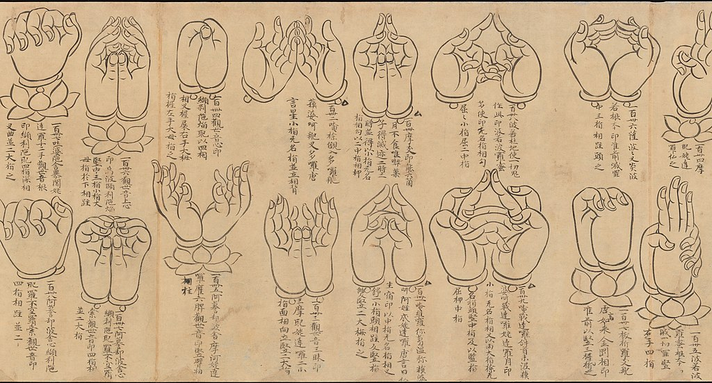A Japanese Handscroll depicting various mudras, 11th–12th century

While all Vajrayāna Buddhist traditions include all the traditional practices used in Mahāyāna Buddhism, such as developing [bodhicitta](https://en.wikipedia.org/wiki/Bodhicitta "Bodhicitta"), practicing the _paramitas,_ and [meditations](https://en.wikipedia.org/wiki/Buddhist_meditation "Buddhist meditation"), they also make use of unique tantric methods and [Dzogchen](/source/dzogchen/ "Dzogchen") meditation, which are seen as more advanced. These include mantras, mandalas, mudras, [deity yoga](https://en.wikipedia.org/wiki/Deity_yoga "Deity yoga"), other visualization-based meditations, [illusory body](https://en.wikipedia.org/wiki/Illusory_body "Illusory body") yogas like [tummo](https://en.wikipedia.org/wiki/Tummo "Tummo"), and rituals like the [goma](https://en.wikipedia.org/wiki/Homa_\(ritual\) "Homa (ritual)") fire ritual. Vajrayana teaches that these techniques provide a faster path to [Buddhahood](https://en.wikipedia.org/wiki/Buddhahood "Buddhahood").

A central feature of tantric practice is the use of mantras and seed syllables (_[bijas](https://en.wikipedia.org/wiki/Bījā "Bījā")_). Mantras are words, phrases, or a collection of syllables used for various meditative, magical, and ritual ends. Mantras are usually associated with [specific deities or Buddhas](https://en.wikipedia.org/wiki/Buddhist_deities "Buddhist deities"), and are seen as their manifestations in sonic form. They are traditionally believed to have spiritual power, which can lead to enlightenment as well as supramundane abilities (_[siddhis](https://en.wikipedia.org/wiki/Siddhi "Siddhi")_).

According to [Indologist](https://en.wikipedia.org/wiki/Indology "Indology") [Alex Wayman](https://en.wikipedia.org/wiki/Alex_Wayman "Alex Wayman"), Buddhist esotericism centers on what is known as "the three mysteries" or "secrets": the tantric adept affiliates his body, speech, and mind with the body, speech, and mind of a Buddha through mudra, mantras, and [samadhi](https://en.wikipedia.org/wiki/Samadhi "Samadhi"), respectively. Padmavajra (c. 7th century) explains in his _Tantrarthavatara_ Commentary, the secret Body, Speech, and Mind of the Buddhas are:

> *   Secret of Body: Whatever form is necessary to tame the [living beings](https://en.wikipedia.org/wiki/Living_beings "Living beings").
> *   Secret of Speech: Speech exactly appropriate to the lineage of the creature, as in the language of the yaksas, etc.
> *   Secret of Mind: Knowing all things as they really are.

These elements are brought together in the practice of tantric deity yoga, which involves visualizing the deity's body and mandala, reciting the deity's mantra, and gaining insight into the nature of things based on this contemplation. Advanced tantric practices such as deity yoga are taught in the context of an initiation ceremony by tantric gurus or vajracharyas (vajra-masters) to the tantric initiate, who also takes on formal commitments or vows (_samaya_). In [Tibetan Buddhism](https://en.wikipedia.org/wiki/Tibetan_Buddhism "Tibetan Buddhism"), advanced practices like deity yoga are usually preceded by or coupled with "preliminary practices" called _[ngondro](https://en.wikipedia.org/wiki/Ngondro "Ngondro")_, consisting of five to seven accumulation practices and includes [prostrations](https://en.wikipedia.org/wiki/Prostration_\(Buddhism\) "Prostration (Buddhism)") and recitations of the [100 syllable mantra](https://en.wikipedia.org/wiki/Vajrasattva#Hundred_Syllable_Mantra "Vajrasattva").

Vajrayana is a system of tantric [lineages](https://en.wikipedia.org/wiki/Lineage_\(Buddhism\) "Lineage (Buddhism)"), and thus only those who receive an empowerment or initiation (_[abhiseka](https://en.wikipedia.org/wiki/Abhiṣeka "Abhiṣeka")_) may practice the more advanced esoteric methods. In tantric deity yoga, mantras, or bijas are used during the ritual evocation of deities that are said to arise out of the uttered and visualized mantric syllables. After the deity's image and mandala has been established, heart mantras are visualized as part of the contemplation in different points of the deity's body.

Most Tantric Buddhists believe nirvana is achievable in a single lifetime with "vigorous study and meditation".

### Deity yoga

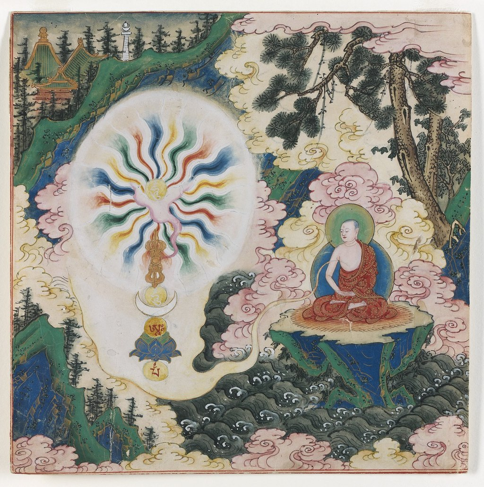An 18th century Mongolian miniature which depicts a monk generating a tantric visualization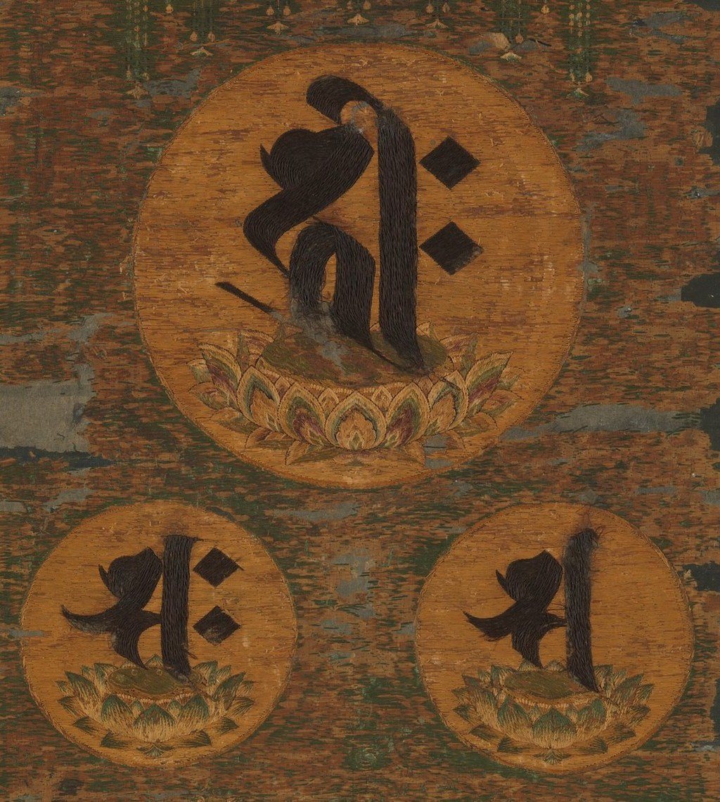A Japanese depiction of the Amida Triad in Seed Syllable form ([Siddham Script](https://en.wikipedia.org/wiki/Siddhaṃ_script "Siddhaṃ script")). Visualizing deities in the form of seed syllables is a common Vajrayana meditation. In Shingon, one of the most common practices is _Ajikan_ (阿字觀), meditating on the syllable A.

The fundamental practice of Buddhist Tantra is "[deity yoga](https://en.wikipedia.org/wiki/Deity_yoga "Deity yoga")" (_devatayoga_), meditation on a chosen deity or "cherished divinity" (Skt. _Iṣṭa-devatā,_ Tib. _yidam_), which involves the recitation of mantras and prayers and visualization of the deity, the associated [mandala](https://en.wikipedia.org/wiki/Mandala "Mandala") of the deity's [Buddha field](https://en.wikipedia.org/wiki/Pure_land "Pure land"), along with consorts and attendant Buddhas and bodhisattvas. According to the Tibetan scholar [Tsongkhapa](https://en.wikipedia.org/wiki/Tsongkhapa "Tsongkhapa"), deity yoga separates Tantra from Sutra practice.

In the Unsurpassed Yoga Tantras, the most widespread tantric form in Indo-Tibetan Buddhism, this method is divided into two stages, generation (_utpatti-krama_) and completion (_nispanna-krama_). In the generation stage, one dissolves one's reality into emptiness and meditates on the deity-mandala, resulting in identification with this divine reality. During [deity visualization](https://en.wikipedia.org/wiki/Deity_visualization "Deity visualization"), the deity is to be imagined as not solid or tangible, as "empty yet apparent", with the character of a [mirage](https://en.wikipedia.org/wiki/Mirage "Mirage") or a [rainbow](https://en.wikipedia.org/wiki/Rainbow "Rainbow").

This visualization is to be combined with "divine pride", which is "the thought that one is oneself the deity being visualized." Divine pride is different from common pride because it is based on compassion for others and an understanding of emptiness. The divine image along with the illusory body is then dissolved into [luminous](https://en.wikipedia.org/wiki/Luminous_mind "Luminous mind") [emptiness](https://en.wikipedia.org/wiki/Sunyata "Sunyata"). This dissolution into emptiness is then followed by the visualization of the deity and the yogi's re-emergence as the deity. This practice is repeated over a number of daily sessions. The practitioner proceeds to the completion state after completing a requisite number of mantra repetitions, either defined in the text or given by the empowering lama.

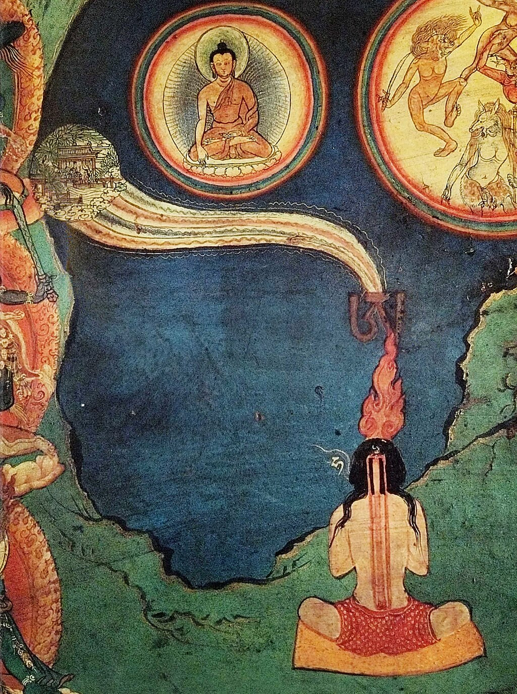A Tibetan depiction of the perfection stage practices of _[tummo](https://en.wikipedia.org/wiki/Tummo "Tummo")_ (Skt. _candali_, inner heat) and _[phowa](https://en.wikipedia.org/wiki/Phowa "Phowa")_ (transference of consciousness)

The Tibetologist [David Germano](https://en.wikipedia.org/wiki/David_Germano "David Germano") outlines two main types of completion practice: a formless and image-less contemplation on the ultimate empty nature of the mind and various yogas that make use of the illusory body to produce energetic sensations of bliss and warmth. The illusory body yogas systems like the [Six Dharmas of Naropa](https://en.wikipedia.org/wiki/Six_Dharmas_of_Naropa "Six Dharmas of Naropa") and the [Six Yogas of Kalachakra](https://en.wikipedia.org/wiki/Kalachakra "Kalachakra") make use of energetic schemas of human psycho-physiology composed of "energy channels" (Skt. [nadi](https://en.wikipedia.org/wiki/Nadi_\(yoga\) "Nadi (yoga)"), Tib. _rtsa_), "winds" or currents (Skt. _vayu_, Tib. _rlung_), "drops" or charged particles (Skt. _bindu_, Tib. _thig le_), and [chakras](https://en.wikipedia.org/wiki/Chakra "Chakra") ("wheels"). These subtle energies are seen as "mounts" for consciousness, the physical component of awareness. They are engaged by various means such as [pranayama](https://en.wikipedia.org/wiki/Pranayama "Pranayama") (breath control) to produce blissful experiences that are then applied to the realization of ultimate reality.

Other methods associated with the completion stage in Tibetan Buddhism include [dream yoga](https://en.wikipedia.org/wiki/Dream_yoga "Dream yoga") (which relies on [lucid dreaming](https://en.wikipedia.org/wiki/Lucid_dream "Lucid dream")), practices associated with the [bardo](https://en.wikipedia.org/wiki/Bardo "Bardo") (the interim state between death and [rebirth](https://en.wikipedia.org/wiki/Rebirth_\(Buddhism\) "Rebirth (Buddhism)")), transference of consciousness (_phowa_), and [Chöd](https://en.wikipedia.org/wiki/Chöd "Chöd"), in which the yogi ceremonially offers their body to be eaten by tantric deities in a ritual feast.

### Other practices

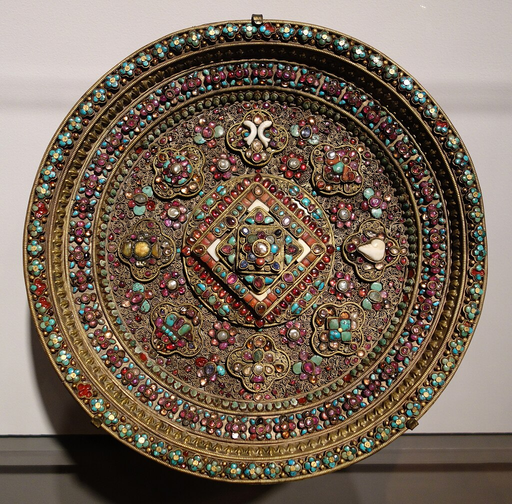A Newari Buddhist mandala used for Guru Puja, Nepal, 19th century, gilt copper inlaid with semiprecious stones

Another form of Vajrayana practice are certain meditative techniques associated with [Mahāmudrā](https://en.wikipedia.org/wiki/Mahamudra "Mahamudra") and [Dzogchen](/source/dzogchen/ "Dzogchen"), often termed "formless practices" or the path of self-liberation. These techniques do not rely on deity visualization per se but on direct [pointing-out instruction](https://en.wikipedia.org/wiki/Pointing-out_instruction "Pointing-out instruction") from a master, and are often seen as the most advanced and direct methods.

Another distinctive feature of Tantric Buddhism is its unique and often elaborate [rituals](https://en.wikipedia.org/wiki/Ritual "Ritual"). They include pujas (worship rituals), [prayer festivals](https://en.wikipedia.org/wiki/Monlam_Prayer_Festival "Monlam Prayer Festival"), protection rituals, death rituals, tantric feasts (_ganachakra_), tantric initiations (_abhiseka_) and the goma fire ritual (common in East Asian Esotericism).

An important element in some of these rituals (particularly initiations and tantric feasts) seems to have been the practice of [ritual sex](https://en.wikipedia.org/wiki/Sexual_ritual "Sexual ritual") or sexual yoga (_[karmamudra](https://en.wikipedia.org/wiki/Karmamudrā "Karmamudrā"),_ "desire seal", also called "consort observance", _vidyavrata,_ and euphemistically as "_[puja](https://en.wikipedia.org/wiki/Puja_\(Buddhism\) "Puja (Buddhism)")_"), as well as the sacramental ingestion of "power substances" such as the mingled sexual fluids and uterine blood (often performed by licking these substances off the [vulva](https://en.wikipedia.org/wiki/Vulva "Vulva"), a practice termed _yonipuja_).

The practice of ingestion of sexual fluids is mentioned by numerous tantric commentators, sometimes euphemistically referring to the penis as the "vajra" and the vagina as the "lotus". The _[Cakrasamvara Tantra](https://en.wikipedia.org/wiki/Cakrasaṃvara_Tantra "Cakrasaṃvara Tantra")_ commentator Kambala, writing about this practice, states:

> The seats are well-known on earth to be spots within the lotus mandala; by abiding within it there is great bliss, the royal nature of nondual joy. Therefore the lotus seat is supreme: filled with a mixture of semen and uterine blood, one should especially kiss it, and lolling with the tongue take it up. Unite the vajra and lotus, with the rapture of drinking \[this\] liquor.

According to David Gray, these sexual practices probably originated in a non-monastic context and were later adopted by monastic establishments (such as [Nalanda](https://en.wikipedia.org/wiki/Nalanda "Nalanda") and [Vikramashila](https://en.wikipedia.org/wiki/Vikramashila "Vikramashila")). He notes that the anxiety of figures like [Atisa](https://en.wikipedia.org/wiki/Atiśa "Atiśa") about these practices, and the stories of [Virūpa](https://en.wikipedia.org/wiki/Virupa "Virupa") and [Maitripa](https://en.wikipedia.org/wiki/Maitripada "Maitripada") being expelled from their monasteries for performing them, shows that supposedly celibate monastics were undertaking these sexual rites.

Because of its adoption by the monastic tradition, sexual yoga slowly became either done with an imaginary consort visualized by the yogi instead of an actual person, or reserved to a small group of the "highest" or elite practitioners. Likewise, the drinking of sexual fluids was also reinterpreted by later commentators to refer to illusory body anatomy of the perfection stage practices.

## Symbols and imagery

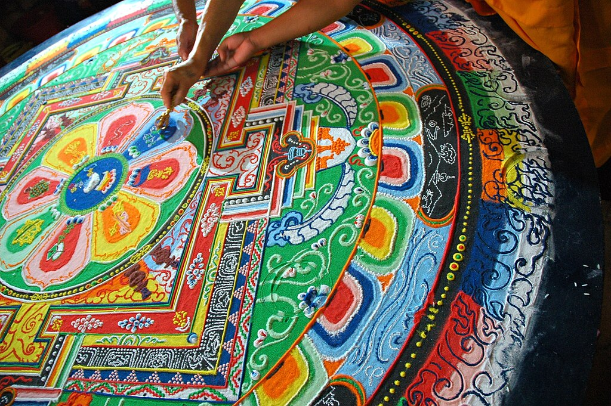[Dagchen Rinpoche](https://en.wikipedia.org/wiki/Dagchen_Rinpoche "Dagchen Rinpoche")'s hand holds a [vajra](https://en.wikipedia.org/wiki/Vajra "Vajra") drawing lines that close the [Hevajra](https://en.wikipedia.org/wiki/Hevajra "Hevajra") [Mandala](https://en.wikipedia.org/wiki/Mandala "Mandala"), after the empowerment, Tharlam Monastery of Tibetan Buddhism, Boudha, [Kathmandu](https://en.wikipedia.org/wiki/Kathmandu "Kathmandu"), [Nepal](https://en.wikipedia.org/wiki/Nepal "Nepal").

Vajrayāna uses a rich variety of symbols, terms, and images that have multiple meanings according to a complex system of [analogical](https://en.wikipedia.org/wiki/Analogical "Analogical") thinking. In Vajrayāna, symbols, and terms are multi-valent, reflecting the microcosm and the macrocosm as in the phrase "As without, so within" (_yatha bahyam tatha ’dhyatmam iti_) from [Abhayakaragupta](https://en.wikipedia.org/wiki/Abhayakaragupta "Abhayakaragupta")'s _Nispannayogavali_.

### The vajra

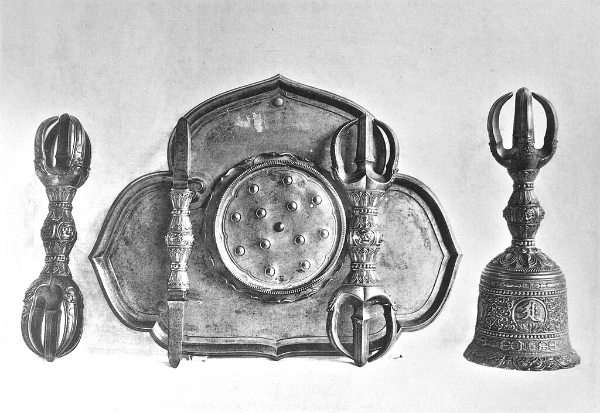Bronze vajras and bell from [Itsukushima](https://en.wikipedia.org/wiki/Itsukushima "Itsukushima"), Japan

The [Sanskrit](/source/sanskrit/ "Sanskrit") term "_[vajra](https://en.wikipedia.org/wiki/Vajra "Vajra")_" denoted a [thunderbolt](https://en.wikipedia.org/wiki/Thunderbolt "Thunderbolt") like a legendary weapon and divine attribute that was made from an [adamantine](https://en.wikipedia.org/wiki/Adamant "Adamant"), or an indestructible substance which could, therefore, pierce and penetrate any obstacle or [obfuscation](https://en.wikipedia.org/wiki/Obfuscation "Obfuscation"). It is the weapon of choice of [Indra](https://en.wikipedia.org/wiki/Indra "Indra"), the King of the [Devas](https://en.wikipedia.org/wiki/Deva_\(Hinduism\) "Deva (Hinduism)"). As a secondary meaning, "vajra" symbolizes the ultimate nature of things which is described in the tantras as translucent, pure and radiant, but also indestructible and indivisible. It is also symbolic of the power of tantric methods to achieve its goals.

A vajra is also a scepter-like ritual object ([Standard Tibetan](https://en.wikipedia.org/wiki/Standard_Tibetan_language "Standard Tibetan language"): རྡོ་རྗེ་ _dorje_), which has a sphere (and sometimes a [gankyil](https://en.wikipedia.org/wiki/Gankyil "Gankyil")) at its centre, and a variable number of spokes, 3, 5 or 9 at each end (depending on the [sadhana](https://en.wikipedia.org/wiki/Sadhana "Sadhana")), enfolding either end of the rod. The vajra is often traditionally employed in tantric rituals in combination with the [bell](https://en.wikipedia.org/wiki/Bell_\(instrument\) "Bell (instrument)") or [ghanta](https://en.wikipedia.org/wiki/Ghanta "Ghanta"); symbolically, the vajra may represent [method](https://en.wikipedia.org/wiki/Upaya "Upaya") as well as great bliss and the bell stands for [wisdom](https://en.wikipedia.org/wiki/Wisdom_in_Buddhism "Wisdom in Buddhism"), specifically the [wisdom realizing emptiness](https://en.wikipedia.org/wiki/Śūnyatā "Śūnyatā"). The union of the two sets of spokes at the center of the wheel is said to symbolize the unity of wisdom (prajña) and compassion (karuna) as well as the sexual union of male and female deities.

### Imagery and ritual in deity yoga

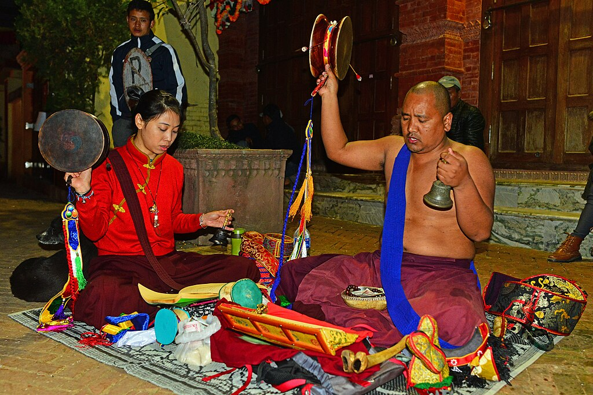[Chöd](https://en.wikipedia.org/wiki/Chöd "Chöd") ritual, showing the use of [Damaru](https://en.wikipedia.org/wiki/Damaru "Damaru") drum and hand-bell, as well as the [Kangling](https://en.wikipedia.org/wiki/Kangling "Kangling") (thighbone trumpet)

Representations of the deity, such as statues (_[murti](https://en.wikipedia.org/wiki/Murti "Murti")_), paintings (_[thangka](https://en.wikipedia.org/wiki/Thangka "Thangka")_), or mandala, are often employed as an aid to [visualization](https://en.wikipedia.org/wiki/Mental_image "Mental image"), in [deity yoga](https://en.wikipedia.org/wiki/Deity_yoga "Deity yoga"). The use of visual aids, particularly microcosmic/macrocosmic diagrams, known as _mandalas_, is another unique feature of Buddhist Tantra. Mandalas are symbolic depictions of the sacred space of the awakened Buddhas and [Bodhisattvas](https://en.wikipedia.org/wiki/Bodhisattvas "Bodhisattvas") as well as of the inner workings of the human person. The macrocosmic symbolism of the mandala then, also represents the forces of the human body. The explanatory tantra of the _Guhyasamaja tantra_, the _Vajramala_, states: "The body becomes a palace, the hallowed basis of all the Buddhas."

Mandalas are also [sacred enclosures](https://en.wikipedia.org/wiki/Sacred_enclosure "Sacred enclosure"), [sacred architecture](https://en.wikipedia.org/wiki/Sacred_architecture "Sacred architecture") that house and contain the uncontainable essence of a central deity or _yidam_ and their retinue. In the book _The World of Tibetan Buddhism_, the Dalai Lama describes mandalas thus: "This is the celestial mansion, the pure residence of the deity." The [Five Tathagatas](https://en.wikipedia.org/wiki/Five_Tathagatas "Five Tathagatas") or 'Five Buddhas', along with the figure of the [Adi-Buddha](https://en.wikipedia.org/wiki/Adi-Buddha "Adi-Buddha"), are central to many Vajrayana mandalas as they represent the "five wisdoms", which are the five primary aspects of primordial wisdom or [Buddha-nature](https://en.wikipedia.org/wiki/Buddha-nature "Buddha-nature").

All ritual in Vajrayana practice can be seen as aiding in this process of visualization and identification. The practitioner can use various hand implements such as a _vajra_, bell, hand-drum (_[damaru](https://en.wikipedia.org/wiki/Damaru "Damaru")_) or a ritual dagger (_[phurba](https://en.wikipedia.org/wiki/Phurba "Phurba")_), but also ritual hand gestures (_mudras_) can be made, special chanting techniques can be used, and in elaborate offering rituals or initiations, many more ritual implements and tools are used, each with an elaborate symbolic meaning to create a special environment for practice. Vajrayana has thus become a major inspiration in traditional [Tibetan art](https://en.wikipedia.org/wiki/Tibetan_art "Tibetan art").

## Texts

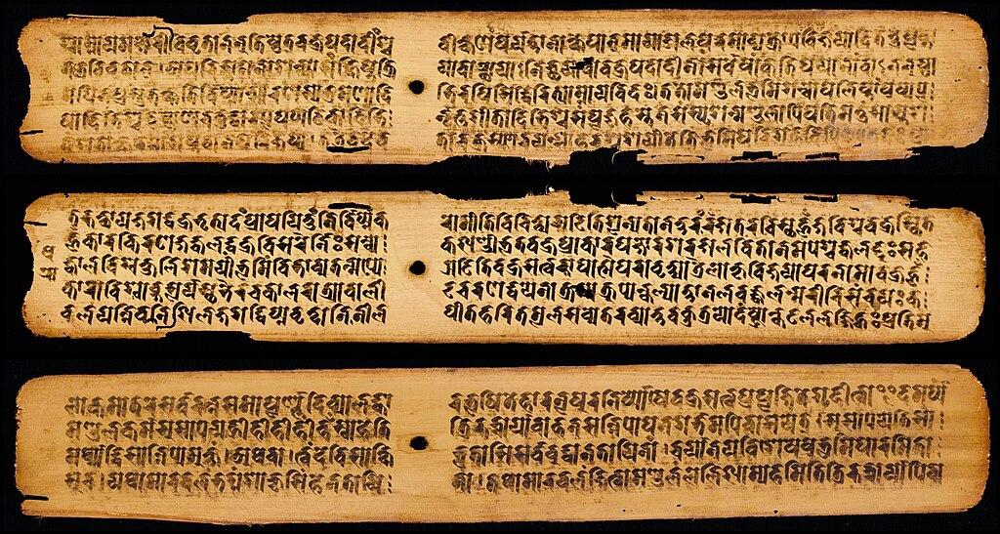Three leaves from a manuscript of the _Vajrāvalī_, a ritual compendium compiled by [Abhayakaragupta](https://en.wikipedia.org/wiki/Abhayakaragupta "Abhayakaragupta"), abbot of the Vikramashila monastery around 1100 CE

There is an extended body of texts associated with Buddhist Tantra, including the "tantras" themselves, tantric commentaries and [_shastras_](https://en.wikipedia.org/wiki/Shastra "Shastra"), [_sadhanas_](https://en.wikipedia.org/wiki/Sādhanā "Sādhanā") (liturgical texts), ritual manuals ([Chinese](https://en.wikipedia.org/wiki/Chinese_language "Chinese language"): 儀軌; [Pinyin](https://en.wikipedia.org/wiki/Pinyin "Pinyin"): _Yíguǐ_; [Rōmaji](https://en.wikipedia.org/wiki/Romanization_of_Japanese "Romanization of Japanese"): _Giki_), dharanis, poems or songs ([_dohas_](https://en.wikipedia.org/wiki/Doha_\(Indian_literature\) "Doha (Indian literature)")), [termas](https://en.wikipedia.org/wiki/Terma_\(religion\) "Terma (religion)") and so on. According to Harunaga Isaacson,

> Though we do not know precisely at present just how many Indian tantric Buddhist texts survive today in the language in which they were written, their number is certainly over one thousand five hundred; I suspect indeed over two thousand. A large part of this body of texts has also been translated into Tibetan, and a smaller part into Chinese. Aside from these, there are perhaps another two thousand or more works that are known today only from such translations. We can be certain as well that many others are lost to us forever, in whatever form. Of the texts that survive a very small proportion has been published; an almost insignificant percentage has been edited or translated reliably.

Vajrayāna texts exhibit a wide range of literary characteristics—usually a mix of verse and prose, almost always in a Sanskrit that "transgresses frequently against classical norms of grammar and usage," although also occasionally in various Middle Indic dialects or elegant classical Sanskrit.

In Chinese [Mantrayana](https://en.wikipedia.org/wiki/Chinese_Esoteric_Buddhism "Chinese Esoteric Buddhism") (_[Zhenyan](https://en.wikipedia.org/wiki/Chinese_Esoteric_Buddhism "Chinese Esoteric Buddhism")_), and Japanese [Shingon](https://en.wikipedia.org/wiki/Shingon_Buddhism "Shingon Buddhism"), the most influential esoteric texts are the _[Mahavairocana Tantra](https://en.wikipedia.org/wiki/Mahavairocana_Tantra "Mahavairocana Tantra")_ and the [_Vajraśekhara Sūtra_](https://en.wikipedia.org/wiki/Vajrasekhara_Sutra "Vajrasekhara Sutra").

In [Tibetan Buddhism](https://en.wikipedia.org/wiki/Tibetan_Buddhism "Tibetan Buddhism"), a large number of tantric works are widely studied and different schools focus on the study and practice of different cycles of texts. According to [Geoffrey Samuel](https://en.wikipedia.org/wiki/Geoffrey_Samuel "Geoffrey Samuel"),

> the [Sakyapa](https://en.wikipedia.org/wiki/Sakya_\(Tibetan_Buddhist_school\) "Sakya (Tibetan Buddhist school)") specialize in the _[Hevajra Tantra](https://en.wikipedia.org/wiki/Hevajra_Tantra "Hevajra Tantra")_, the [Nyingmapa](/source/nyingma/ "Nyingma") specialize in the various so called [Old Tantras](https://en.wikipedia.org/wiki/Nyingma_Gyubum "Nyingma Gyubum") and terma cycles, and the most important [Kagyudpa](/source/kagyu/ "Kagyu") and [Gelugpa](https://en.wikipedia.org/wiki/Gelug "Gelug") tantras are _[Guhyasamāja](https://en.wikipedia.org/wiki/Guhyasamāja "Guhyasamāja"), [Cakrasaṃvara](https://en.wikipedia.org/wiki/Cakrasaṃvara_Tantra "Cakrasaṃvara Tantra")_ and [_Kālacakra_](https://en.wikipedia.org/wiki/Kalachakra#Text_of_the_Kālacakra_Tantra "Kalachakra").

### Dunhuang manuscripts

The [Dunhuang manuscripts](https://en.wikipedia.org/wiki/Dunhuang_manuscripts "Dunhuang manuscripts") also contain Tibetan Tantric manuscripts. Dalton and Schaik (2007, revised) provide an excellent online catalogue listing 350 Tibetan Tantric Manuscripts\] from [Dunhuang](https://en.wikipedia.org/wiki/Dunhuang "Dunhuang") in the Stein Collection of the [British Library](https://en.wikipedia.org/wiki/British_Library "British Library") which is currently fully accessible online in discrete digitized manuscripts. With the Wylie transcription of the manuscripts they are to be made discoverable online in the future. These 350 texts are just a small portion of the vast cache of the Dunhuang manuscripts.

## Traditions

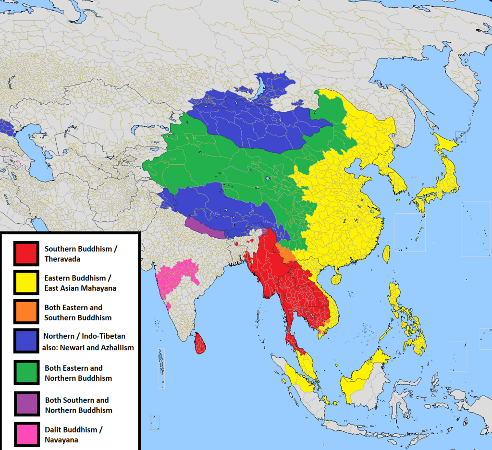Map showing the dominant [Buddhist tradition](https://en.wikipedia.org/wiki/Schools_of_Buddhism "Schools of Buddhism") throughout Asia. Vajrayana (in the form of Tibetan Buddhism) dominates the Himalayan regions and in the [Mongolian](https://en.wikipedia.org/wiki/Mongols#Geographic_distribution "Mongols") regions.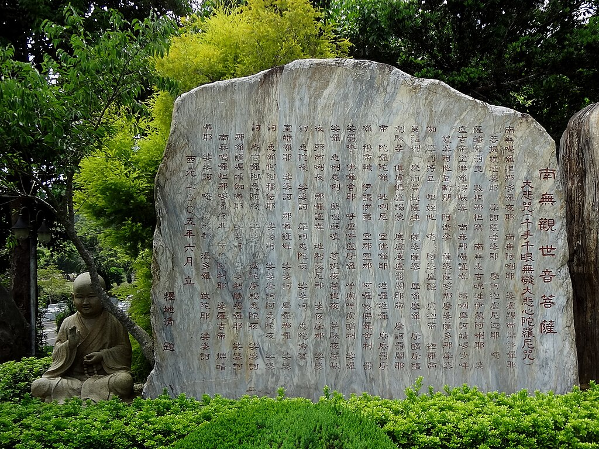The [Nīlakaṇṭha Dhāraṇī](https://en.wikipedia.org/wiki/Nīlakaṇṭha_Dhāraṇī "Nīlakaṇṭha Dhāraṇī") engraved on a stele. Temple Fo Ding Shan Chao Sheng in Sanyi Township, [Taiwan](https://en.wikipedia.org/wiki/Taiwan "Taiwan"). Erected in June 2005.

Although there is historical evidence for [Vajrayāna Buddhism in Southeast Asia](https://en.wikipedia.org/wiki/Vajrayana_Buddhism_in_Southeast_Asia "Vajrayana Buddhism in Southeast Asia") and elsewhere (see [History of Vajrayāna](/source/vajrayana/#History) above), today Vajrayāna exists primarily in the form of the two major traditions of [Indo-Tibetan Buddhism](https://en.wikipedia.org/wiki/Tibetan_Buddhism "Tibetan Buddhism") (in [Tibet](https://en.wikipedia.org/wiki/Tibet "Tibet") and other parts of the [PRC](https://en.wikipedia.org/wiki/China "China"), [Bhutan](https://en.wikipedia.org/wiki/Bhutan "Bhutan"), [India](https://en.wikipedia.org/wiki/India "India") and also internationally) and [Japanese Esoteric Buddhism](https://en.wikipedia.org/wiki/Shingon_Buddhism "Shingon Buddhism") (mostly in [Japan](https://en.wikipedia.org/wiki/Japan "Japan")), which is found in the [Shingon](https://en.wikipedia.org/wiki/Shingon_Buddhism "Shingon Buddhism") (literally "True Speech", i.e. _[mantra](https://en.wikipedia.org/wiki/Mantra "Mantra")_) and [Tendai](https://en.wikipedia.org/wiki/Tendai "Tendai") schools.

Other traditions like contemporary [Chinese Buddhism](https://en.wikipedia.org/wiki/Chinese_Buddhism "Chinese Buddhism"), [Japanese Zen](https://en.wikipedia.org/wiki/Japanese_Zen "Japanese Zen"), [Korean Buddhism](https://en.wikipedia.org/wiki/Korean_Buddhism "Korean Buddhism"), and [Vietnamese Buddhism](https://en.wikipedia.org/wiki/Buddhism_in_Vietnam "Buddhism in Vietnam") also make use of esoteric (Chinese: mijiao, Japanese: [mikkyo](https://en.wikipedia.org/wiki/Mikkyō "Mikkyō")) or mantrayana methods to a lesser extent. In many Asian Mahāyāna Buddhist traditions, esoteric methods are used as a complement, not as the central practice. This mainly involves the recitation of mantras (like the [ten small mantras](https://en.wikipedia.org/wiki/Ten_Small_Mantras "Ten Small Mantras")) and various popular [dharanis](https://en.wikipedia.org/wiki/Dharani "Dharani"). However, certain revival movements have attempted to establish new esoteric schools in mainland East Asia such as [Mantra School Bright Lineage](http://www.kmkt.org.tw/index.html) (in China) and the South Korean [Jingak Order](https://en.wikipedia.org/wiki/Jingak_Order "Jingak Order").

There was strong connection between the [Palas](https://en.wikipedia.org/wiki/Pala_Empire "Pala Empire") in [Bengal](https://en.wikipedia.org/wiki/Bengal "Bengal"), [Srivijaya](https://en.wikipedia.org/wiki/Srivijaya_Empire "Srivijaya Empire") in [Nusantara](https://en.wikipedia.org/wiki/Nusantara_\(term\) "Nusantara (term)"), and the kingdoms in [East Asia](https://en.wikipedia.org/wiki/East_Asia "East Asia") through the sea route. Medieval monks were a prime factor in the spread of esoteric Buddhism.

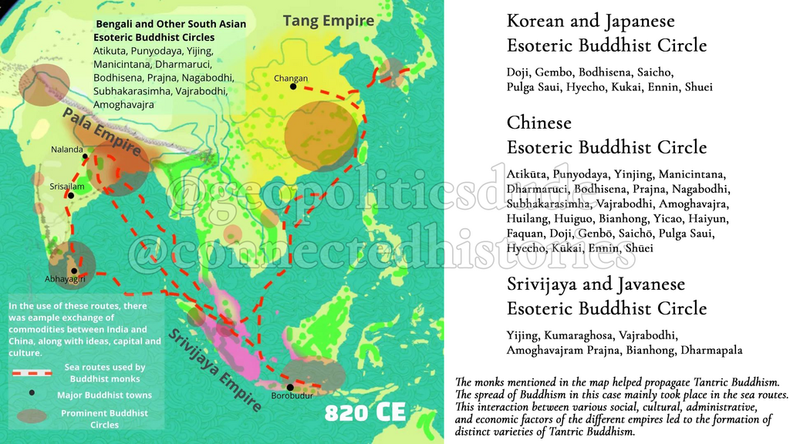A map depicting the spread of Esoteric Buddhism in Southeast and Eastern Eurasia

The distinction between mantrayana traditions is not always rigid. For example, the [tantra](https://en.wikipedia.org/wiki/Tantra "Tantra") sections of the [Tibetan Buddhist canon of texts](https://en.wikipedia.org/wiki/Kangyur "Kangyur") sometimes include material not usually thought of as tantric outside the Tibetan Buddhist tradition, such as the widely recited _[Heart Sutra](https://en.wikipedia.org/wiki/Heart_Sutra "Heart Sutra")_ and even versions of some material found in the _[Pali Canon](https://en.wikipedia.org/wiki/Pali_Canon "Pali Canon")_.

### Chinese Esoteric Buddhism

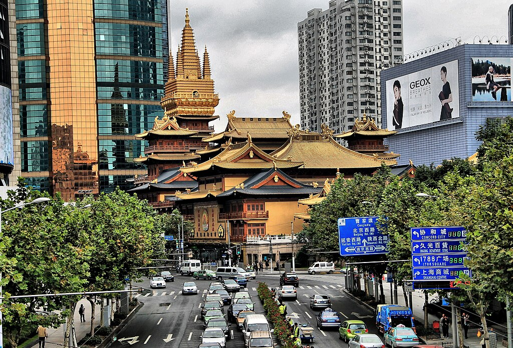The [Jing'an Temple](https://en.wikipedia.org/wiki/Jing'an_Temple "Jing'an Temple") in [Shanghai](https://en.wikipedia.org/wiki/Shanghai "Shanghai"), China, which promotes the Chinese Zhenyan (Mantrayana) tradition.

Esoteric and Tantric teachings followed the same route into northern [China](https://en.wikipedia.org/wiki/China "China") as [Buddhism](https://en.wikipedia.org/wiki/Buddhism "Buddhism") itself, arriving via the [Silk Road](https://en.wikipedia.org/wiki/Silk_Road "Silk Road") and Southeast Asian Maritime trade routes sometime during the first half of the 7th century, during the [Tang dynasty](https://en.wikipedia.org/wiki/Tang_dynasty "Tang dynasty") and received sanction from the emperors of the Tang dynasty. During this time, three great masters came from India to China: [Śubhakarasiṃha](https://en.wikipedia.org/wiki/Subhakarasimha "Subhakarasimha"), [Vajrabodhi](https://en.wikipedia.org/wiki/Vajrabodhi "Vajrabodhi"), and [Amoghavajra](https://en.wikipedia.org/wiki/Amoghavajra "Amoghavajra") who translated key texts and founded the _Zhenyan_ (真言, "true word", "[mantra](https://en.wikipedia.org/wiki/Mantra "Mantra")") tradition.

_Zhenyan_ was also brought to [Japan](https://en.wikipedia.org/wiki/Japan "Japan") as [Shingon](https://en.wikipedia.org/wiki/Shingon "Shingon") during this period. This tradition focused on tantras like the [Mahavairocana tantra](https://en.wikipedia.org/wiki/Mahavairocana_tantra "Mahavairocana tantra"), and unlike Tibetan Buddhism, it does not employ the antinomian and radical tantrism of the _[Anuttarayoga Tantras](https://en.wikipedia.org/wiki/Anuttarayoga_Tantra "Anuttarayoga Tantra")._ The prestige of this tradition eventually influenced other schools of [Chinese Buddhism](https://en.wikipedia.org/wiki/Chinese_Buddhism "Chinese Buddhism") such as [Chan](https://en.wikipedia.org/wiki/Chan_Buddhism "Chan Buddhism") and [Tiantai](https://en.wikipedia.org/wiki/Tiantai "Tiantai") to adopt various esoteric practices over time, leading to a merging of teachings between the various schools. During the [Yuan dynasty](https://en.wikipedia.org/wiki/Yuan_dynasty "Yuan dynasty"), the [Mongol](https://en.wikipedia.org/wiki/Mongol "Mongol") emperors made [Tibetan Buddhism](https://en.wikipedia.org/wiki/Tibetan_Buddhism "Tibetan Buddhism") the official religion of China, and Tibetan lamas were given patronage at the court. Imperial support of Tibetan Vajrayana continued into the Ming and Qing dynasties.

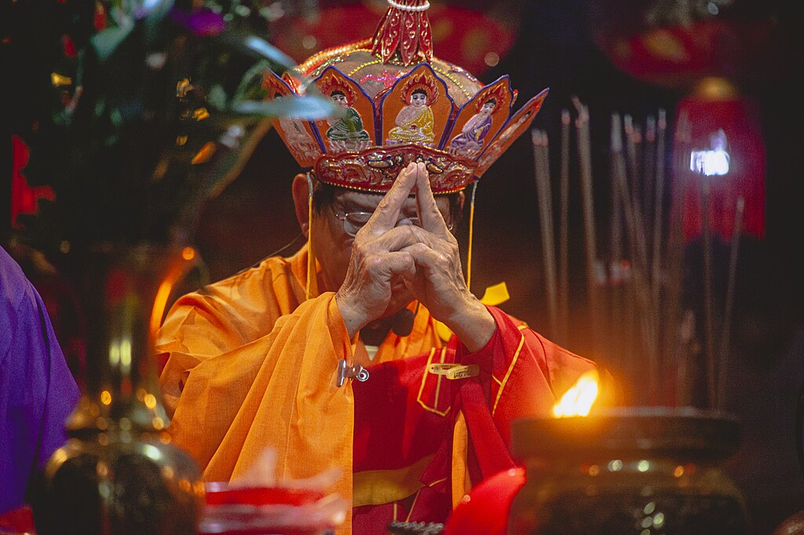The [vajrācārya](https://en.wikipedia.org/wiki/Vajracharya "Vajracharya") of a Yujia Yankou ritual performing a mudrā while wearing a Five Buddha crown adorned with images of the [Five Tathāgatas](https://en.wikipedia.org/wiki/Five_Tathāgatas "Five Tathāgatas")

Today, esoteric traditions are deeply embedded in mainstream Chinese Buddhism and expressed through various rituals which make use of tantric mantra and dhāraṇī and the veneration of certain tantric deities like [Cundi](https://en.wikipedia.org/wiki/Cundi_\(Buddhism\) "Cundi (Buddhism)") and [Acala](https://en.wikipedia.org/wiki/Acala "Acala"). One example of esoteric teachings still practiced in many Chinese Buddhist monasteries is the [Śūraṅgama Sūtra](https://en.wikipedia.org/wiki/Śūraṅgama_Sūtra "Śūraṅgama Sūtra") and the dhāraṇī revealed within it, the [Śūraṅgama Mantra](https://en.wikipedia.org/wiki/Shurangama_Mantra "Shurangama Mantra"), which are especially influential in the Chinese Chan tradition. Another example is the popular tantric [Yujia Yankou](https://en.wikipedia.org/wiki/Yujia_Yankou "Yujia Yankou") ritual, where monastics take on the role of a [vajrācārya](https://en.wikipedia.org/wiki/Vajracharya "Vajracharya") and performs [deity yoga](https://en.wikipedia.org/wiki/Deity_yoga "Deity yoga") through the usage of [mantras](https://en.wikipedia.org/wiki/Mantra "Mantra"), [mudrās](https://en.wikipedia.org/wiki/Mudra "Mudra") and [maṇḍala](https://en.wikipedia.org/wiki/Mandala "Mandala") offerings in order to help facilitate the nourishment and ultimate liberation of all [sentient beings](https://en.wikipedia.org/wiki/Sentient_beings_\(Buddhism\) "Sentient beings (Buddhism)"). In particular, the usage of [mantras](https://en.wikipedia.org/wiki/Mantra "Mantra"), [mudrās](https://en.wikipedia.org/wiki/Mudra "Mudra") and [maṇḍalas](https://en.wikipedia.org/wiki/Mandala "Mandala") in the ritual correspond directly to the concept of the "Three Mysteries" ([Chinese](https://en.wikipedia.org/wiki/Traditional_Chinese_characters "Traditional Chinese characters"): 三密; [pinyin](https://en.wikipedia.org/wiki/Pinyin "Pinyin"): _Sānmì_) in [tantric Buddhism](https://en.wikipedia.org/wiki/Tantric_Buddhism "Tantric Buddhism"): the "secrets" of body, speech and mind. This ritual is commonly performed during or at the end of regular religious temple events such as [repentance](https://en.wikipedia.org/wiki/Repentance "Repentance") rites, [Buddha recitation](https://en.wikipedia.org/wiki/Nianfo "Nianfo") retreats, the dedication of a new monastic complex or gatherings for the transmission of [monastic vows](https://en.wikipedia.org/wiki/Monastic_vows "Monastic vows"). It is also widely performed as a post-mortem rite within Chinese society during funerals and other related occasions such as the [Ghost Festival](https://en.wikipedia.org/wiki/Ghost_Festival "Ghost Festival"). A related ritual that also involves esoteric practices is the extensive [Shuilu Fahui](https://en.wikipedia.org/wiki/Shuilu_Fahui "Shuilu Fahui") ceremony, which involves setting up [maṇḍalas](https://en.wikipedia.org/wiki/Mandala "Mandala") of esoteric deities such as the [Ten Wisdom Kings](https://en.wikipedia.org/wiki/Wisdom_King#The_Ten_Wisdom_Kings "Wisdom King") as well as the invocation of those deities to the ritual space via [mantras](https://en.wikipedia.org/wiki/Mantra "Mantra"), [mudrās](https://en.wikipedia.org/wiki/Mudra "Mudra") and visualization.

A recent development is known as the "tantric revival movement" (mijiao fuxing yundong 密教復興運動) which involved the revival of Chinese Esoteric schools by Chinese students of Japanese Shingon. Some important figures of this revival include Wang Hongyuan 王弘願 (1876–1937), and Guru Wuguang (悟光上師 (1918–2000), both trained in Shingon and went on to spread Shingon teachings in the Chinese speaking world. These revivalist lineages exist in Hong Kong, Taiwan and Malaysia. Though they draw mainly from Shingon teachings, they have also adopted some [Tibetan Buddhist](https://en.wikipedia.org/wiki/Tibetan_Buddhism "Tibetan Buddhism") elements.

Another form of esoteric Buddhism in China is the related but unique tradition of [Azhaliism](https://en.wikipedia.org/wiki/Azhaliism "Azhaliism"), which is practiced among the [Bai people](https://en.wikipedia.org/wiki/Bai_people "Bai people") of China and venerates [Mahakala](https://en.wikipedia.org/wiki/Mahakala "Mahakala") as a major deity.

### Japanese esotericism

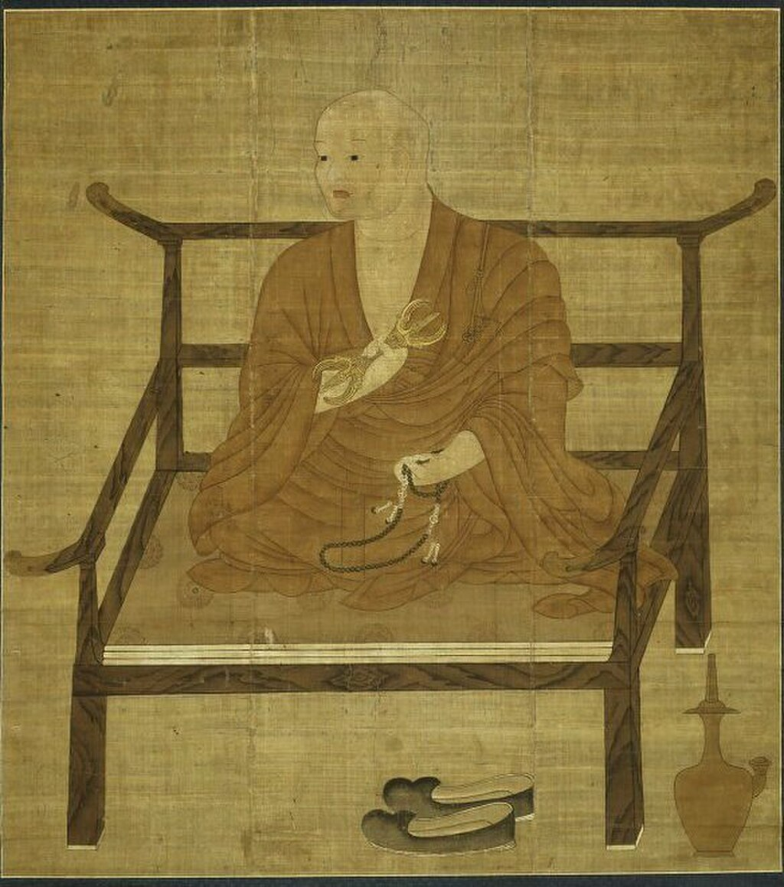Portrait of [Kobo Daishi (Kukai)](https://en.wikipedia.org/wiki/Kūkai "Kūkai") holding a vajra and a mala, 14th century, Art Institute of Chicago

#### Shingon Buddhism

The Shingon school is found in [Japan](https://en.wikipedia.org/wiki/Japan "Japan") and includes practices, known in Japan as _[Mikkyō](https://en.wikipedia.org/wiki/Mikkyō "Mikkyō")_ ("Esoteric (or Mystery) Teaching"), which are similar in concept to those in Vajrayana Buddhism. The lineage for Shingon Buddhism differs from that of Tibetan Vajrayana, having emerged from [India](https://en.wikipedia.org/wiki/India "India") during the 9th–11th centuries in the [Pala Dynasty](https://en.wikipedia.org/wiki/Pala_Dynasty "Pala Dynasty") and [Central Asia](https://en.wikipedia.org/wiki/Central_Asia "Central Asia") (via [China](https://en.wikipedia.org/wiki/China "China")) and is based on earlier versions of the Indian texts than the Tibetan lineage. Shingon shares material with [Tibetan Buddhism](https://en.wikipedia.org/wiki/Tibetan_Buddhism "Tibetan Buddhism") – such as the esoteric sutras (called [Tantras](https://en.wikipedia.org/wiki/Tantras_\(Buddhism\) "Tantras (Buddhism)") in Tibetan Buddhism) and [mandalas](https://en.wikipedia.org/wiki/Mandala "Mandala") – but the actual practices are not related.

The primary texts of Shingon Buddhism are the _[Mahavairocana Sutra](https://en.wikipedia.org/wiki/Mahavairocana_Sutra "Mahavairocana Sutra")_ and _[Vajrasekhara Sutra](https://en.wikipedia.org/wiki/Vajrasekhara_Sutra "Vajrasekhara Sutra")_. The founder of Shingon Buddhism was [Kukai](https://en.wikipedia.org/wiki/Kukai "Kukai"), a Japanese monk who studied in China in the 9th century during the Tang dynasty and brought back Vajrayana scriptures, techniques and mandalas then popular in China. The school was merged into other schools in China towards the end of the Tang dynasty but was sectarian in Japan. Shingon is one of the few remaining branches of Buddhism in the world that continues to use the _[siddham](https://en.wikipedia.org/wiki/Siddhaṃ_script "Siddhaṃ script")_ script of the [Sanskrit](/source/sanskrit/ "Sanskrit") language.

#### Tendai Buddhism

Although the Tendai school in China and Japan does employ some esoteric practices, these rituals came to be considered of equal importance with the exoteric teachings of the _[Lotus Sutra](https://en.wikipedia.org/wiki/Lotus_Sutra "Lotus Sutra")_. By chanting [mantras](https://en.wikipedia.org/wiki/Mantras "Mantras"), maintaining mudras, or practicing certain forms of meditation, [Tendai](https://en.wikipedia.org/wiki/Tendai "Tendai") maintains that one is able to understand sense experiences as taught by the Buddha, have [faith](https://en.wikipedia.org/wiki/Faith_in_Buddhism "Faith in Buddhism") that one is innately an enlightened being, and that one can attain enlightenment within the current lifetime.

### Korean _milgyo_

Esoteric Buddhist practices (known as _milgyo_, 密教) and texts arrived in [Korea](https://en.wikipedia.org/wiki/Korea "Korea") during the introduction of Buddhism to the region in 372 CE. Esoteric Buddhism was supported by the royalty of both [Unified Silla](https://en.wikipedia.org/wiki/Unified_Silla "Unified Silla") (668–935) and [Goryeo Dynasty](https://en.wikipedia.org/wiki/Goryeo_Dynasty "Goryeo Dynasty") (918–1392). During the Goryeo Dynasty esoteric practices were common within large sects like the [Seon school](https://en.wikipedia.org/wiki/Korean_Seon "Korean Seon") and the [Hwaeom](https://en.wikipedia.org/wiki/Hwaeom "Hwaeom") school as well as smaller esoteric sects like the Sinin (_mudra_) and Ch'ongji (_Dharani_) schools. During the era of the Mongol occupation (1251–1350s), Tibetan Buddhism also existed in Korea, though it never gained a foothold there.

During the [Joseon dynasty](https://en.wikipedia.org/wiki/Joseon_dynasty "Joseon dynasty"), Esoteric Buddhist schools were forced to merge with the Seon and Kyo schools, becoming the ritual specialists. With the decline of Buddhism in Korea, Esoteric Buddhism mostly died out, save for a few traces in the rituals of the [Jogye Order](https://en.wikipedia.org/wiki/Jogye_Order "Jogye Order") and [Taego Order](https://en.wikipedia.org/wiki/Taego_Order "Taego Order").

There are now five esoteric Buddhist schools in South Korea: [Jingak Order](https://en.wikipedia.org/wiki/Jingak_Order "Jingak Order"), Jineon Order, Chongji Order, Jisong Order, and Cheonhwa Buddhism. According to Henrik H. Sørensen, the Jineon and Jingak Orders "have absolutely no historical link with the Korean Buddhist tradition per se but are late constructs based in large measures on Japanese Shingon Buddhism."

### Vietnamese Buddhist esotericism

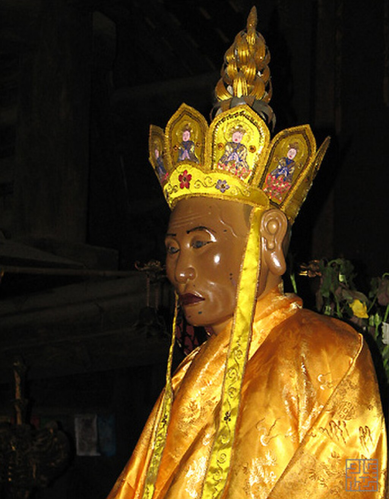Statue of [Từ Đạo Hạnh](https://en.wikipedia.org/wiki/Từ_Đạo_Hạnh "Từ Đạo Hạnh") wearing an esoteric [Five Tathāgatas](https://en.wikipedia.org/wiki/Five_Tathāgatas "Five Tathāgatas") Crown in the [Thầy Temple](https://en.wikipedia.org/wiki/Thầy_Temple "Thầy Temple") near [Hanoi](https://en.wikipedia.org/wiki/Hanoi "Hanoi").

Vietnamese Buddhist esotericism is known as _Mật giáo_ or _Mật Tông_ and is a common part of Vietnamese Mahāyāna Buddhism (along with [Pure Land](https://en.wikipedia.org/wiki/Pure_Land_Buddhism "Pure Land Buddhism") practice and [Thien](https://en.wikipedia.org/wiki/Thiền "Thiền")). Commonly recited esoteric texts include _Uṣṇīṣavijayadhāraṇī_, the _Nīlakaṇṭha Dhāraṇī_ and the _Śūraṅgama mantra_. According to Quang Minh Thich "at present, it is still the norm in Vietnamese Buddhist temples, both in Vietnam and abroad, that these mantras, as elements of the Mantrayana, are recited either in their distinctive chanted sessions or in conjunction with other popular Buddhist scriptures. In function, the Vietnamese Tantric practices serve as a complement to the practices of Zen and Pure Land, not as an independent tradition."

The first Vietnamese monk we know of who studied Vajrayana was Master Van Ky (c. 7th century) who received initiation in the kingdom of [Srivijaya](https://en.wikipedia.org/wiki/Srivijaya "Srivijaya") from a certain Jñanabhadra (Tri Hien) as reported by [Yijing](https://en.wikipedia.org/wiki/Yijing_\(monk\) "Yijing (monk)"). By the 12th century (under the [Lý dynasty](https://en.wikipedia.org/wiki/Lý_dynasty "Lý dynasty")), esoteric Buddhism was widespread in Vietnam, and was especially favored by the [Vô Ngôn Thông](https://en.wikipedia.org/wiki/Wu_Yantong "Wu Yantong") school as well as by the [Vinitaruci](https://en.wikipedia.org/wiki/Vinītaruci "Vinītaruci") school. One famous esoteric master of this period was [Từ Đạo Hạnh](https://en.wikipedia.org/wiki/Từ_Đạo_Hạnh "Từ Đạo Hạnh"). He brought back various texts and practices from Burma. He became famous as a powerful magician. He was fond of the _[Mahākaruṇika Dhāraṇī](https://en.wikipedia.org/wiki/Nīlakaṇṭha_Dhāraṇī "Nīlakaṇṭha Dhāraṇī")_. He also spread esoteric teachings throughout Vietnam and liberalized their practice, making them less dependent on reincarnation lineages (similar to Tibetan [tulkus](https://en.wikipedia.org/wiki/Tulku "Tulku")). Another promoter of esoteric Buddhism during this period was Sùng Phạm (1004-1078) of Phap Van pagoda who studied in India for nine years before returning to Vietnam and was the teacher of the influential esoteric master Tri Bat. Phap Loa (1284-1330), a leader of the [Truc Lam](https://en.wikipedia.org/wiki/Trúc_Lâm "Trúc Lâm") school, was another very influential Vietnamese esoteric master. He is known for establishing esoteric abhiseka (initiation) ceremonies as well as Huayan (_Hoa Nghiêm_) assemblies. He also wrote various texts on esoteric topics.

Chinese Buddhist esotericism also influenced Vietnamese esotericism during the medieval period, especially the [Huayan](https://en.wikipedia.org/wiki/Huayan "Huayan") Esotericism of Daoshen's _Xianmi yuantong chengfo xinyao ji_ (顯密圓通成佛心要集 _Collection of Essentials for the Attainment of Buddhahood by Total \[Inter-\]Penetration of the Esoteric and the Exoteric,_ T1955).

Some modern teachers and organizations focus specifically on Vietnamese esoteric Buddhism. Thích Viên Đức (1932-1980) was one important modern promoter of Esoteric Buddhism. He is known for translating a collection of Esoteric Buddhist texts, contributing to the dissemination of Esoteric Buddhism in Vietnam. Thích Viên Đức promoted esoteric Buddhist teachings as the fastest path to enlightenment. He established numerous communities in southern Vietnam and was also known as a healer. He also met with Tibetan lamas and Japanese Buddhists. Another modern Vietnamese esoteric organization is [Mat Giao Friendship Association](https://en.wikipedia.org/wiki/Mat_Giao_Friendship_Association "Mat Giao Friendship Association") who publishes Phước Triệu's _Quintessence of Esoteric Buddhism_ (2004). Esoteric practices are also currently associated with the [Thầy Temple](https://en.wikipedia.org/wiki/Thầy_Temple "Thầy Temple") in [Greater Hanoi](https://en.wikipedia.org/wiki/Hanoi "Hanoi"). Vietnamese esotericism can also be quite sycretic, borrowing from Chinese, Japanese and Tibetan Buddhism.

### Indo-Tibetan Buddhism

Born in the Tantric heartland of [Oddiyana](https://en.wikipedia.org/wiki/Oddiyana "Oddiyana") (identified as [Swat district](https://en.wikipedia.org/wiki/Swat_district "Swat district")), [Padmasambhava](/source/padmasambhava/ "Padmasambhava") was an important figure in disseminating Buddhism in Tibet

Buddhism was initially established in [Tibet](https://en.wikipedia.org/wiki/Tibet "Tibet") in the 8th century when various figures like [Padmasambhāva](/source/padmasambhava/ "Padmasambhava") (8th century CE) and [Śāntarakṣita](https://en.wikipedia.org/wiki/Śāntarakṣita "Śāntarakṣita") (725–788) were invited by King [Trisong Detsen](https://en.wikipedia.org/wiki/Trisong_Detsen "Trisong Detsen"), some time before 767. In contrast to its neighbours that adhered to Mahayana, Tibet adopted Vajrayana on full scale following the [Samye debate](https://en.wikipedia.org/wiki/Samye_Debate "Samye Debate"), where Indian Vajrayana scholar [Kamalaśīla](https://en.wikipedia.org/wiki/Kamalaśīla "Kamalaśīla") defeated the [Chan Buddhist](https://en.wikipedia.org/wiki/Chan_Buddhist "Chan Buddhist") scholar [Moheyan](https://en.wikipedia.org/wiki/Moheyan "Moheyan") in an [Indian style debate](https://en.wikipedia.org/wiki/Debates_in_ancient_India "Debates in ancient India"). Tibetan Buddhism reflects the later stages tantric [Indian Buddhism](https://en.wikipedia.org/wiki/Indian_Buddhism "Indian Buddhism") of the [post-Gupta](https://en.wikipedia.org/wiki/Gupta_Empire "Gupta Empire") [Early Medieval](https://en.wikipedia.org/wiki/Medieval_India "Medieval India") period (500 to 1200 CE).

This tradition practices and studies a set of tantric texts and commentaries associated with the more "left hand" (_[vamachara](https://en.wikipedia.org/wiki/Vamachara "Vamachara")_) tantras, which are not part of East Asian Esoteric Buddhism. These tantras (sometimes termed '[Anuttarayoga](https://en.wikipedia.org/wiki/Anuttarayoga "Anuttarayoga") tantras' include many transgressive elements, such as sexual and mortuary symbolism that is not shared by the earlier tantras that are studied in East Asian Buddhism. These texts were translated into [Classical Tibetan](/source/classical-tibetan/ "Classical Tibetan") during the "New translation period" (10th–12th centuries). Tibetan Buddhism also includes numerous native Tibetan developments, such as the [tulku](https://en.wikipedia.org/wiki/Tulku "Tulku") system, new [sadhana](https://en.wikipedia.org/wiki/Sadhana "Sadhana") texts, Tibetan scholastic works, [Dzogchen](/source/dzogchen/ "Dzogchen") literature and [Terma](https://en.wikipedia.org/wiki/Terma_\(religion\) "Terma (religion)") literature. There are four major traditions or schools: [Nyingma](/source/nyingma/ "Nyingma"), [Sakya](https://en.wikipedia.org/wiki/Sakya_\(Tibetan_Buddhist_school\) "Sakya (Tibetan Buddhist school)"), [Kagyu](/source/kagyu/ "Kagyu"), and [Gelug](https://en.wikipedia.org/wiki/Gelug "Gelug") in addition to minor schools like [Jonang](https://en.wikipedia.org/wiki/Jonang "Jonang") and [Rimé movement](https://en.wikipedia.org/wiki/Rimé_movement "Rimé movement").

In the pre-modern era, Tibetan Buddhism spread outside of Tibet primarily due to the influence of the [Mongol](https://en.wikipedia.org/wiki/Mongol_Empire "Mongol Empire") [Yuan dynasty](https://en.wikipedia.org/wiki/Yuan_dynasty "Yuan dynasty") (1271–1368), founded by [Kublai Khan](https://en.wikipedia.org/wiki/Kublai_Khan "Kublai Khan"), which ruled [China](https://en.wikipedia.org/wiki/China "China"), [Mongolia](https://en.wikipedia.org/wiki/Mongolia "Mongolia") and eastern [Siberia](https://en.wikipedia.org/wiki/Siberia "Siberia"). In the [modern era](https://en.wikipedia.org/wiki/Modern_history "Modern history") it has spread outside of Asia due to the efforts of the [Tibetan diaspora](https://en.wikipedia.org/wiki/Tibetan_diaspora "Tibetan diaspora") (1959 onwards).

The Tibetan Buddhist tradition is today found in Tibet, [Bhutan](https://en.wikipedia.org/wiki/Buddhism_in_Bhutan "Buddhism in Bhutan"), northern [India](https://en.wikipedia.org/wiki/Buddhism_in_India "Buddhism in India"), [Nepal](https://en.wikipedia.org/wiki/Buddhism_in_Nepal "Buddhism in Nepal"), southwestern and northern [China](https://en.wikipedia.org/wiki/Buddhism_in_China "Buddhism in China"), [Mongolia](https://en.wikipedia.org/wiki/Buddhism_in_Mongolia "Buddhism in Mongolia") and various constituent [republics](https://en.wikipedia.org/wiki/Republics "Republics") of [Russia](https://en.wikipedia.org/wiki/Buddhism_in_Russia "Buddhism in Russia") that are adjacent to the area, such as [Amur Oblast](https://en.wikipedia.org/wiki/Amur_Oblast "Amur Oblast"), [Buryatia](https://en.wikipedia.org/wiki/Republic_of_Buryatia "Republic of Buryatia"), [Zabaykalsky Krai](https://en.wikipedia.org/wiki/Zabaykalsky_Krai "Zabaykalsky Krai"), the [Tuva Republic](https://en.wikipedia.org/wiki/Tuva_Republic "Tuva Republic") and [Khabarovsk Krai](https://en.wikipedia.org/wiki/Khabarovsk_Krai "Khabarovsk Krai"). Tibetan Buddhism is also the main religion in [Kalmykia](https://en.wikipedia.org/wiki/Kalmykia "Kalmykia"). It has also spread to Western countries and there are now international networks of Tibetan Buddhist temples and meditation centers in the Western world from all four schools.

### Bengali Buddhism

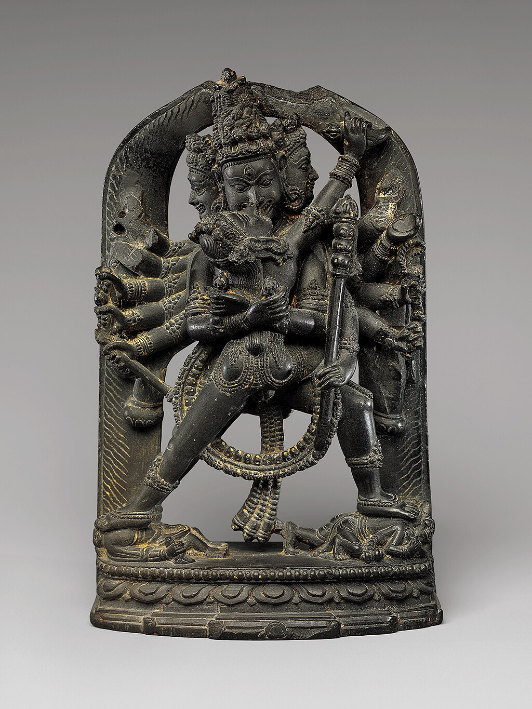12th century stone statue of [Chakrasamvara](https://en.wikipedia.org/wiki/Chakrasamvara "Chakrasamvara") in [sexual union](https://en.wikipedia.org/wiki/Yab-yum "Yab-yum") with [Vajravarahi](https://en.wikipedia.org/wiki/Vajravarahi "Vajravarahi") from Bengal

Bengal was a thriving centre of Vajrayana under the patronage of the [Pala dynasty](https://en.wikipedia.org/wiki/Pala_dynasty "Pala dynasty"). Many mahasiddhas hailed from the [Eastern zone of the Indian subcontinent](https://en.wikipedia.org/wiki/Eastern_South_Asia "Eastern South Asia"), with the _[Charyapada](https://en.wikipedia.org/wiki/Charyapada "Charyapada")_, a collection of songs composed by these mahasiddhas, containing early references to Vajrayana as well as being an early written record of [Eastern Indic languages](https://en.wikipedia.org/wiki/Eastern_Indo-Aryan_languages "Eastern Indo-Aryan languages"). Bengali Vajrayana scholar [Atiśa](https://en.wikipedia.org/wiki/Atiśa "Atiśa") played a vital role in revitalizing [Buddhism in Tibet](https://en.wikipedia.org/wiki/Buddhism_in_Tibet "Buddhism in Tibet") following its persecution by the [Bon](https://en.wikipedia.org/wiki/Bon "Bon") emperor [Langdarma](https://en.wikipedia.org/wiki/Langdarma "Langdarma") and onset of the [Era of Fragmentation](https://en.wikipedia.org/wiki/Era_of_Fragmentation "Era of Fragmentation"), leading to the foundation of the [Kadam](https://en.wikipedia.org/wiki/Kadam_\(Tibetan_Buddhism\) "Kadam (Tibetan Buddhism)") lineage. Another Bengali Vajrayana scholar [Abhayakaragupta](https://en.wikipedia.org/wiki/Abhayakaragupta "Abhayakaragupta") also had a profound impact on Tibetan Buddhism. However Vajrayana [declined](https://en.wikipedia.org/wiki/Decline_of_Buddhism_in_the_Indian_subcontinent "Decline of Buddhism in the Indian subcontinent") by the time the [Sena dynasty](https://en.wikipedia.org/wiki/Sena_dynasty "Sena dynasty") came to power. Vajrayana was further affected by the [Islamic conquest of India](https://en.wikipedia.org/wiki/Islamic_conquest_of_India "Islamic conquest of India") & consolidation of [Muslim rule in Bengal](https://en.wikipedia.org/wiki/Bengal_Sultanate "Bengal Sultanate"), with many of its adherents converting to [Islam](https://en.wikipedia.org/wiki/Islam_in_South_Asia "Islam in South Asia") [under duress](https://en.wikipedia.org/wiki/Forced_conversion "Forced conversion") & later [Gaudiya Vaishnavism](https://en.wikipedia.org/wiki/Gaudiya_Vaishnavism "Gaudiya Vaishnavism"), which lead to creation of new groups like [Sahajiyas](https://en.wikipedia.org/wiki/Vaishnava_Sahajiya "Vaishnava Sahajiya"). Today Buddhism in Bengal is followed only by a small minority of [Jumma people](https://en.wikipedia.org/wiki/Jumma_people "Jumma people") who are followers of [Theravāda Buddhism](https://en.wikipedia.org/wiki/Theravāda_Buddhism "Theravāda Buddhism").

### Nepalese Newar Buddhism

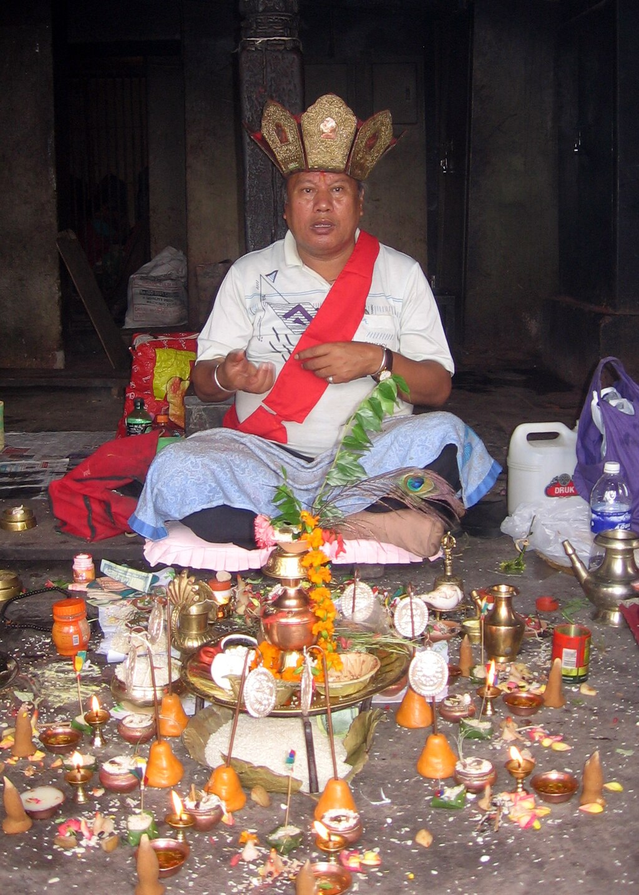A contemporary Newar [vajracharya](https://en.wikipedia.org/wiki/Vajracharya "Vajracharya") performing rituals at [Swayambhunath](https://en.wikipedia.org/wiki/Swayambhunath "Swayambhunath")

Newar Buddhism is practiced by [Newars](https://en.wikipedia.org/wiki/Newars "Newars") in [Nepal](https://en.wikipedia.org/wiki/Nepal "Nepal"). It is the only form of Vajrayana Buddhism in which the scriptures are written in [Sanskrit](/source/sanskrit/ "Sanskrit") and this tradition has preserved many Vajrayana texts in this language. Its priests do not follow celibacy and are called _[vajracharya](https://en.wikipedia.org/wiki/Vajracharya "Vajracharya")_ (literally "[diamond-thunderbolt](https://en.wikipedia.org/wiki/Vajra "Vajra") carriers").

### Indonesian Esoteric Buddhism

Indonesian Esoteric Buddhism refers to the traditions of Esoteric Buddhism found in the Indonesian islands of [Java](https://en.wikipedia.org/wiki/Java "Java") and [Sumatra](https://en.wikipedia.org/wiki/Sumatra "Sumatra") before the rise and dominance of [Islam](https://en.wikipedia.org/wiki/Islam "Islam") in the region (13–16th centuries). The Buddhist empire of [Srivijaya](https://en.wikipedia.org/wiki/Srivijaya "Srivijaya") (650 CE–1377 CE) was a major center of Esoteric Buddhist learning which drew Chinese monks such as [Yijing](https://en.wikipedia.org/wiki/Yijing_\(monk\) "Yijing (monk)") and Indian scholars like [Atiśa](https://en.wikipedia.org/wiki/Atiśa "Atiśa"). The temple complex at [Borobudur](https://en.wikipedia.org/wiki/Borobudur "Borobudur") in central Java, built by the [Shailendra dynasty](https://en.wikipedia.org/wiki/Shailendra_dynasty "Shailendra dynasty") also reflects strong Tantric or at least proto-tantric influences, particularly of the cult of [Vairocana](https://en.wikipedia.org/wiki/Vairocana "Vairocana").

[Hevajra](https://en.wikipedia.org/wiki/Hevajra "Hevajra") statue from [Khmer empire](https://en.wikipedia.org/wiki/Khmer_empire "Khmer empire"), dating to the reign of [Jayavarman VII](https://en.wikipedia.org/wiki/Jayavarman_VII "Jayavarman VII")

Indonesian Esoteric Buddhism may have also reached the [Philippines](https://en.wikipedia.org/wiki/Philippines "Philippines"), possibly establishing the first form of [Buddhism in the Philippines](https://en.wikipedia.org/wiki/Buddhism_in_the_Philippines "Buddhism in the Philippines"). The few Buddhist artifacts that have been found in the islands reflect the iconography of Srivijaya's Vajrayana.

## Related traditions

Some traditions are related to Vajrayana, but are not to be seen as "Vajrayana" or "Mantrayana" proper. Vajrayana here referring to the Buddhist tradition based on the tantric literature of North Indian Mahāyāna, the [Buddhist tantras](https://en.wikipedia.org/wiki/Tantras_\(Buddhism\) "Tantras (Buddhism)") and the works of the [Nalanda](https://en.wikipedia.org/wiki/Nalanda_mahavihara "Nalanda mahavihara") - [Vikramashila](https://en.wikipedia.org/wiki/Vikramashila "Vikramashila") masters and the Buddhist [mahasiddhas](https://en.wikipedia.org/wiki/Mahasiddha "Mahasiddha"). However, these related traditions may have been influenced by Vajrayana proper and have borrowed practices from Vajrayana schools.

### Shugendō

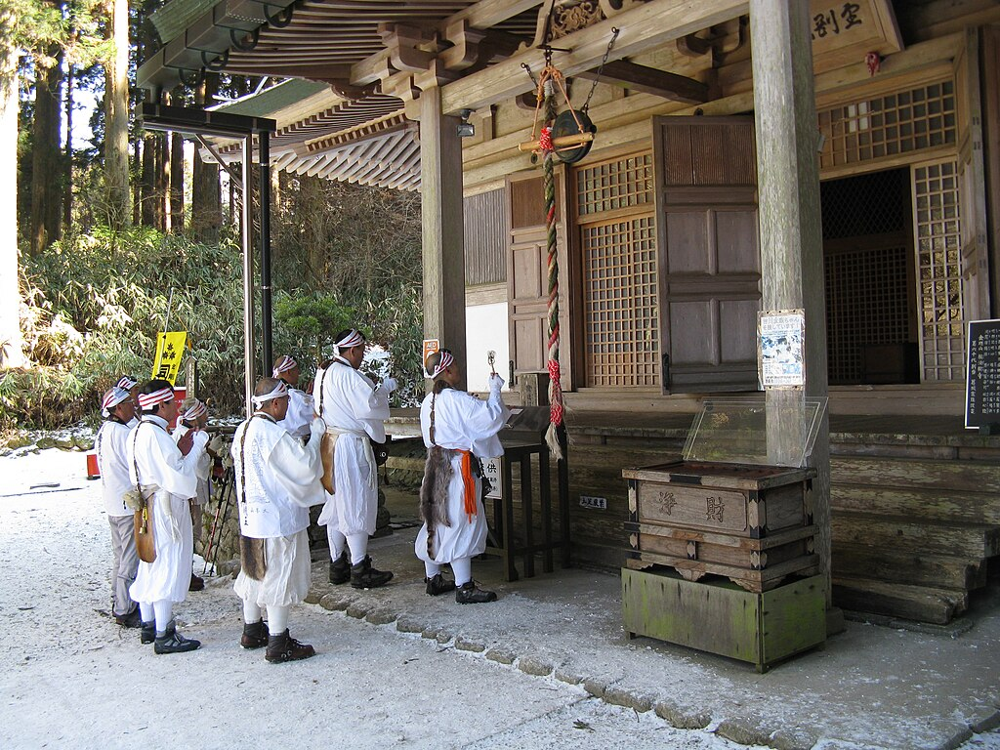[Yamabushi](https://en.wikipedia.org/wiki/Yamabushi "Yamabushi") priests at Gose, [Nara](https://en.wikipedia.org/wiki/Nara,_Nara "Nara, Nara")

Shugendō was founded in 7th-century Japan by the ascetic [En no Gyōja](https://en.wikipedia.org/wiki/En_no_Gyōja "En no Gyōja"), based on the _Queen's Peacocks Sutra_. With its origins in the solitary _hijiri_ back in the 7th century, Shugendō evolved as a sort of amalgamation between Esoteric Buddhism, Shinto and several other religious influences including [Taoism](https://en.wikipedia.org/wiki/Taoism "Taoism"). Buddhism and Shinto were amalgamated in the _shinbutsu shūgō_, and Kūkai's syncretic religion held wide sway up until the end of the [Edo period](https://en.wikipedia.org/wiki/Edo_period "Edo period"), coexisting with Shinto elements within Shugendō

In 1613 during the Edo period, the [Tokugawa Shogunate](https://en.wikipedia.org/wiki/Tokugawa_Shogunate "Tokugawa Shogunate") issued a regulation obliging Shugendō temples to belong to either Shingon or Tendai temples. During the [Meiji Restoration](https://en.wikipedia.org/wiki/Meiji_Restoration "Meiji Restoration"), when Shinto was declared an independent state religion separate from Buddhism, Shugendō was banned as a superstition not fit for a new, enlightened Japan. Some Shugendō temples converted themselves into various officially approved Shintō denominations. In modern times, Shugendō is practiced mainly by Tendai and Shingon sects, retaining an influence on modern [Japanese religion](https://en.wikipedia.org/wiki/Japanese_religion "Japanese religion") and [culture](https://en.wikipedia.org/wiki/Culture_of_Japan "Culture of Japan").

### Southern Esoteric Buddhism

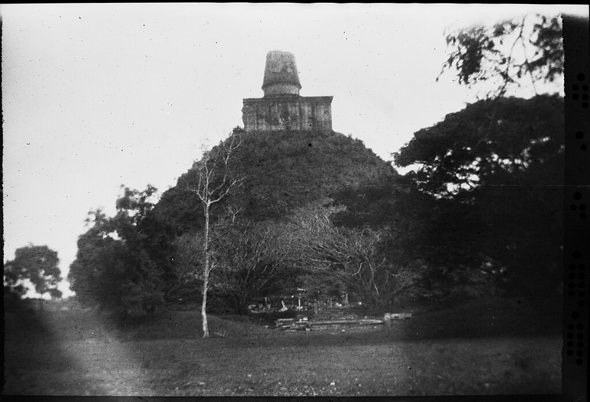[Abhayagiri vihara](https://en.wikipedia.org/wiki/Abhayagiri_vihara "Abhayagiri vihara") was a thriving centre of esoteric [Buddhism in Sri Lanka](https://en.wikipedia.org/wiki/Buddhism_in_Sri_Lanka "Buddhism in Sri Lanka") until its suppression by [Parakramabahu I](https://en.wikipedia.org/wiki/Parakramabahu_I "Parakramabahu I").

"Southern Esoteric Buddhism" or Borān kammaṭṭhāna ('ancient practices') is a term for esoteric forms of Buddhism from [Southeast Asia](https://en.wikipedia.org/wiki/Southeast_Asia "Southeast Asia"), where [Theravada Buddhism](https://en.wikipedia.org/wiki/Theravada_Buddhism "Theravada Buddhism") is dominant. The monks of the Sri Lankan, [Abhayagiri vihara](https://en.wikipedia.org/wiki/Abhayagiri_vihara "Abhayagiri vihara") once practiced forms of tantra which were popular in the island. Another tradition of this type was [Ari Buddhism](https://en.wikipedia.org/wiki/Ari_Buddhism "Ari Buddhism"), which was common in [Burma](https://en.wikipedia.org/wiki/Burma "Burma"). The Tantric Buddhist 'Yogāvacara' tradition was a major Buddhist tradition in [Cambodia](https://en.wikipedia.org/wiki/Cambodia "Cambodia"), [Laos](https://en.wikipedia.org/wiki/Laos "Laos") and [Thailand](https://en.wikipedia.org/wiki/Thailand "Thailand") well into the modern era.

Southern Esoteric Buddhism is a unique Southeast Asian development based on [Theravada](https://en.wikipedia.org/wiki/Theravada "Theravada") [Abhidhamma](https://en.wikipedia.org/wiki/Theravāda_Abhidhamma "Theravāda Abhidhamma") and [Pali language](https://en.wikipedia.org/wiki/Pali_language "Pali language") sources. As such, it has no direct connection to the Indian "Vajrayana" of the Buddhist tantras, the Indian mahasiddhas and the Nalanda-Vikramashila traditions.

Southern Esoteric Buddhism declined after the rise of Southeast Asian [Buddhist modernism](https://en.wikipedia.org/wiki/Buddhist_modernism "Buddhist modernism"). However, esoteric Buddhist practices remain in some contemporary South East Asian traditions, including the Thai [Dhammakaya tradition](https://en.wikipedia.org/wiki/Dhammakaya_tradition "Dhammakaya tradition"), the Burmese [Weizza tradition](https://en.wikipedia.org/wiki/Weizza "Weizza") and in rural [Cambodian Buddhism](https://en.wikipedia.org/wiki/Buddhism_in_Cambodia "Buddhism in Cambodia").

## Academic study difficulties

Serious Vajrayana academic study in the Western world is in early stages due to the following obstacles:

1.  Although a large number of Tantric scriptures are extant, they have not been formally ordered or systematized.
2.  Due to the esoteric initiatory nature of the tradition, many practitioners will not divulge information or sources of their information.
3.  As with many different subjects, it must be studied in context and with a long history spanning many different cultures.
4.  Ritual, as well as doctrine, need to be investigated.

Buddhist tantric practice is categorized as secret practice; this is to avoid misinformed people from harmfully misusing the practices. A method to keep this secrecy is that tantric initiation is required from a master before any instructions can be received about the actual practice. During the initiation procedure in the highest class of tantra (such as the Kalachakra), students must take the tantric vows which commit them to such secrecy. "Explaining general tantra theory in a scholarly manner, not sufficient for practice, is likewise not a root downfall. Nevertheless, it weakens the effectiveness of our tantric practice."

### Terminology

The terminology associated with Vajrayana Buddhism can be confusing. Most of the terms originated in the [Sanskrit](/source/sanskrit/ "Sanskrit") language of tantric [Indian Buddhism](https://en.wikipedia.org/wiki/Indian_Buddhism "Indian Buddhism") and may have passed through other cultures, notably those of Japan and Tibet, before translation for the modern reader. Further complications arise as seemingly equivalent terms can have subtle variations in use and meaning according to context, the time and place of use. A third problem is that Vajrayana texts employ the tantric tradition of [twilight language](https://en.wikipedia.org/wiki/Twilight_language_\(tantra\) "Twilight language (tantra)"), a means of instruction that is deliberately coded. These obscure teaching methods relying on [symbolism](https://en.wikipedia.org/wiki/Religious_symbolism "Religious symbolism") as well as [synonym](https://en.wikipedia.org/wiki/Synonym "Synonym"), [metaphor](https://en.wikipedia.org/wiki/Metaphor "Metaphor") and [word association](https://en.wikipedia.org/wiki/Word_association "Word association") add to the difficulties faced by those attempting to understand Vajrayana Buddhism:

> In the Vajrayana tradition, now preserved mainly in Tibetan lineages, it has long been recognized that certain important teachings are expressed in a form of secret symbolic language known as _saṃdhyā-bhāṣā_, 'Twilight Language'. _Mudrās_ and _mantras_, _maṇḍalas_ and _[cakras](https://en.wikipedia.org/wiki/Cakra "Cakra")_, those mysterious devices and diagrams that were so much in vogue in the pseudo-Buddhist [hippie](https://en.wikipedia.org/wiki/Hippie "Hippie") culture of the 1960s, were all examples of Twilight Language \[...\]

The term Tantric Buddhism was not one originally used by those who practiced it. As scholar Isabelle Onians explains:

> "Tantric Buddhism" \[...\] is not the transcription of a native term, but a rather modern coinage, if not totally occidental. For the equivalent Sanskrit _tāntrika_ is found, but not in Buddhist texts. _Tāntrika_ is a term denoting someone who follows the teachings of scriptures known as Tantras, but only in [Saivism](https://en.wikipedia.org/wiki/Saivism "Saivism"), not Buddhism \[...\] Tantric Buddhism is a name for a phenomenon which calls itself, in Sanskrit, Mantranaya, Vajrayāna, Mantrayāna or Mantramahāyāna (and apparently never Tantrayāna). Its practitioners are known as _mantrins_, _yogis_, or _sādhakas_. Thus, our use of the anglicised adjective “Tantric” for the Buddhist religion taught in Tantras is not native to the tradition, but is a borrowed term which serves its purpose.
