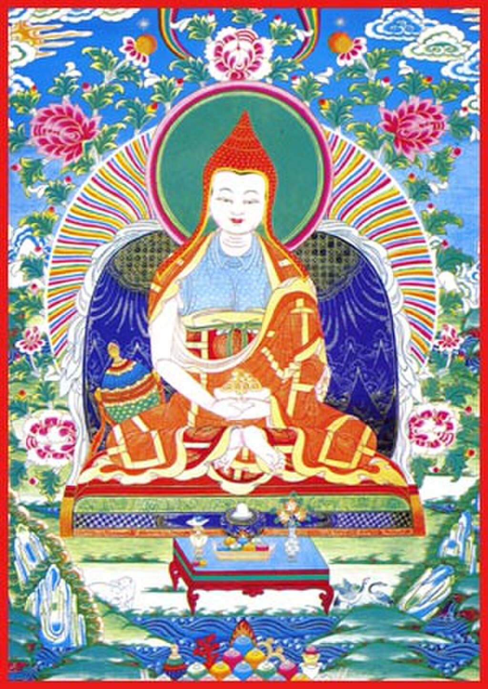

[Thangka](https://en.wikipedia.org/wiki/Thangka "Thangka") of Vimalamitra

**Vimalamitra** ([Tibetan](https://en.wikipedia.org/wiki/Tibetan_script "Tibetan script"): དྲི་མེད་བཤེས་གཉེན་, [Wylie](https://en.wikipedia.org/wiki/Wylie_transliteration "Wylie transliteration"): dri med bshes gnyen) was an 8th-century Indian Buddhist monk. His teachers were [Buddhaguhya](https://en.wikipedia.org/wiki/Buddhaguhya "Buddhaguhya"), [Jñānasūtra](https://en.wikipedia.org/wiki/Jnanasutra "Jnanasutra") and [Śrī Siṃha](https://en.wikipedia.org/wiki/Sri_Singha "Sri Singha"). He was supposed to have vowed to take rebirth every hundred years, with the most notable figures being Rigzin Jigme Lingpa, Khenchen Ngagchung, Kyabje Drubwang Penor Rinpoche and Kyabje Yangthang Rinpoche. He was one of the eight teachers of the great Indian adept [Padmasambhava](/source/padmasambhava/ "Padmasambhava"). Centuries later, [terma](https://en.wikipedia.org/wiki/Terma_\(religion\) "Terma (religion)") and various works were attributed to him. Chatral Sangye Dorji (1913-2016) was said to have received a mala rosary from a man who was at the time dressed as an Indian Sadhu. It was only later that Rinpoche told his attendants that he received a mala on that day from Vimalamitra in reality. The attendants were curious and returned to the place where they had met a sadhu only to be left dumbstruck. The sadhu was not to be found anywhere. One scholar remarked that the historical Vimalamitra "would have been astonished to find himself the focus of such a tradition."

## Attributed works

Among the works which have been attributed to Vimalamitra is the [Vima Nyingthig](https://en.wikipedia.org/wiki/Vima_Nyingthig "Vima Nyingthig"). However, scholars are not in agreement as to which works he actually authored.
