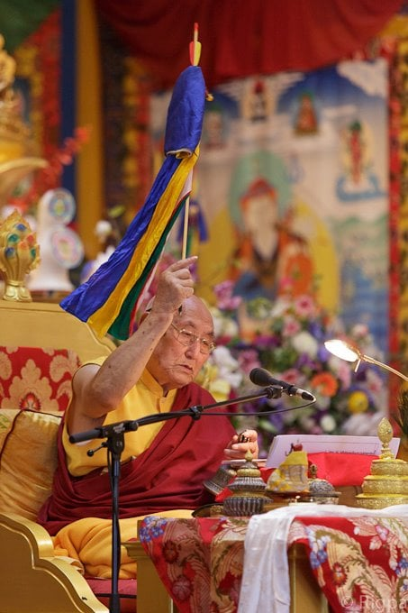

Yangthang Rinpoche during an [empowerment](https://www.rigpawiki.org/index.php?title=Empowerment "Empowerment") in [Lerab Ling](https://www.rigpawiki.org/index.php?title=Lerab_Ling "Lerab Ling")

**Domang Yangthang Rinpoche** (Tib. མདོ་མང་གཡང་ཐང་རིན་པོ་ཆེ་, [Wyl.](https://www.rigpawiki.org/index.php?title=Wyl. "Wyl.") _mdo mang g.yang thang rin po che_) or **Kunzang Jikme Dechen Ösal Dorje** (1930–2016) was a renowned [Nyingma](/source/nyingma/ "Nyingma") teacher from the region of Yangthang who was associated with [Domang Monastery](https://www.rigpawiki.org/index.php?title=Domang_Monastery "Domang Monastery"), a branch of [Palyul](https://www.rigpawiki.org/index.php?title=Palyul_Monastery "Palyul Monastery") in Eastern Tibet.

Rinpoche was born on the tenth day of the eleventh month of the Earth Snake year (i.e., 10 January 1930) in Yangthang in western Sikkim. His father, Pema Drodül, was from Dzogchen in East Tibet and his mother was Tenzin Chödrön, the daughter of Yangthang Ating from the family of Oyuk Drakar. At an early age, following miraculous indications, he was recognized as one of the two incarnations of Tertön [Dorje Dechen Lingpa](https://www.rigpawiki.org/index.php?title=Dorje_Dechen_Lingpa "Dorje Dechen Lingpa") of [Domang Monastery](https://www.rigpawiki.org/index.php?title=Domang_Monastery "Domang Monastery") in [East Tibet](https://www.rigpawiki.org/index.php?title=East_Tibet "East Tibet"), himself an incarnation of [Lhatsün Namkha Jikmé](https://www.rigpawiki.org/index.php?title=Lhatsün_Namkha_Jikmé "Lhatsün Namkha Jikmé").

In 1942 he travelled to [Domang Monastery](https://www.rigpawiki.org/index.php?title=Domang_Monastery "Domang Monastery"), where he began his studies there with [Domang Soktrul Rinpoche](https://www.rigpawiki.org/index.php?title=Domang_Soktrul_Rinpoche "Domang Soktrul Rinpoche"), the principal disciple of his previous incarnation. He also received teachings from Dzakha Lama Tsulo, who was a [khenpo](https://www.rigpawiki.org/index.php?title=Khenpo "Khenpo") at Domang, and from Palyul Khenpo Kunzang Özer, Rahor Dzogtrul Rinpoche, and Washul Kuchen Thupten Chökyi Wangchuk.

In 1959, when the Communist Chinese invaded Tibet, Rinpoche left Domang, but was later captured and imprisoned for twenty-two years. After his eventual release in 1981, he returned to Domang to find his monastery completely dismantled. He then obtained permission to return to Sikkim, where he remained thereafter. Following his return to Sikkim he received a number of important teachings and transmissions from [Dilgo Khyentse Rinpoche](https://www.rigpawiki.org/index.php?title=Dilgo_Khyentse_Rinpoche "Dilgo Khyentse Rinpoche"), [Dodrupchen Rinpoche](https://www.rigpawiki.org/index.php?title=Dodrupchen_Rinpoche "Dodrupchen Rinpoche") and [Penor Rinpoche](https://www.rigpawiki.org/index.php?title=Penor_Rinpoche "Penor Rinpoche").

In the winter of 2010–2011 he bestowed the entire [Rinchen Terdzö](https://www.rigpawiki.org/index.php?title=Rinchen_Terdzö "Rinchen Terdzö") in California at the invitation of [Gyatrul Rinpoche](/source/gyatrul-rinpoche/ "Gyatrul Rinpoche").

He passed into [parinirvana](https://www.rigpawiki.org/index.php?title=Parinirvana "Parinirvana") in Hyderabad on 15 October 2016.

## Teachings and [Empowerments](https://www.rigpawiki.org/index.php?title=Empowerment "Empowerment") Given to the [Rigpa](https://www.rigpawiki.org/index.php?title=About_Rigpa "About Rigpa") Sangha

*   28 July 2012, [Lerab Ling](https://www.rigpawiki.org/index.php?title=Lerab_Ling "Lerab Ling"), France: [Rigdzin Düpa](https://www.rigpawiki.org/index.php?title=Rigdzin_Düpa "Rigdzin Düpa") empowerment & Rigdzin Düpa [Tsedrup](https://www.rigpawiki.org/index.php?title=Tsedrup "Tsedrup"), long life empowerment—during Rigpa's annual Ngöndro Retreat.
*   2-9 August 2012, [Lerab Ling](https://www.rigpawiki.org/index.php?title=Lerab_Ling "Lerab Ling"), France: cycle of [Longchen Nyingtik](/source/longchen-nyingtik/ "Longchen Nyingtik") empowerments, see [Empowerments Given to the Rigpa Sangha](http://www.rigpawiki.org/index.php?title=Empowerments_Given_to_the_Rigpa_Sangha#2012) for more details—during Rigpa's annual Dzogchen Retreat.
*   7-17 August 2013, [Lerab Ling](https://www.rigpawiki.org/index.php?title=Lerab_Ling "Lerab Ling"), France: [Nyingtik Yabshyi](https://www.rigpawiki.org/index.php?title=Nyingtik_Yabshyi "Nyingtik Yabshyi") empowerments, [Gesar](https://www.rigpawiki.org/index.php?title=Gesar "Gesar") empowerment, and teachings. See [Empowerments Given to the Rigpa Sangha](http://www.rigpawiki.org/index.php?title=Empowerments_Given_to_the_Rigpa_Sangha#2013) for more details

## References

*   _sbas yul 'bras mo ljongs su deng rabs bod kyi bla ma skyes chen dam pa rnams kyis mdzad pa phyag ris ji bsyangs kyi rnam thar shin tu bsdus pa_, Gangtok: Namgyal Institute of Tibetology, 2008, pp. 123-128

 [འབྲས་ལྗོངས་སུ་དེང་རབས་བོད་ཀྱི་བླ་མ་རྣམས་ཀྱིས་མཛད་པ་དང་རྣམ་ཐར་བསྡུས་པ།](https://www.tbrc.org/link/?RID=O1PD95669%7CO1PD956692DB100174$W1KG852)

## External Links

*   [Yangthang Rinpoche series on Lotsawa House](http://www.lotsawahouse.org/tibetan-masters/yangthang-rinpoche)
*   
*   [Biography on Mahasiddha.org](http://www.mahasiddha.org/YTR.html)
*   [Teachings on the Seven Line Prayer](https://bodhiactivity.files.wordpress.com/2015/08/seven-line-prayer-yangthang-tulku.pdf)
*   [The Ladder That Leads to Pure Land](https://bodhiactivity.files.wordpress.com/2014/06/the-ladder-that-leads-to-pure-land.pdf), a teaching on aspiring for rebirth in [Sukhavati](https://www.rigpawiki.org/index.php?title=Sukhavati "Sukhavati")
