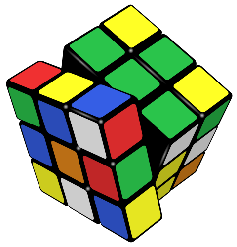
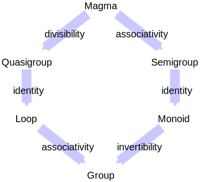

 The [permutations](https://en.wikipedia.org/wiki/Permutation "Permutation") of the [Rubik's Cube](https://en.wikipedia.org/wiki/Rubik's_Cube "Rubik's Cube") form a [group](/source/group-theory/ "Group theory"), a fundamental concept within abstract algebra.

In [mathematics](https://en.wikipedia.org/wiki/Mathematics "Mathematics"), more specifically [algebra](https://en.wikipedia.org/wiki/Algebra "Algebra"), **abstract algebra** or **modern algebra** is the study of [algebraic structures](/source/algebraic-structure/ "Algebraic structure"), which are [sets](https://en.wikipedia.org/wiki/Set_\(mathematics\) "Set (mathematics)") with specific [operations](https://en.wikipedia.org/wiki/Operation_\(mathematics\) "Operation (mathematics)") acting on their elements. Algebraic structures include [groups](/source/group-mathematics/ "Group (mathematics)"), [rings](https://en.wikipedia.org/wiki/Ring_\(mathematics\) "Ring (mathematics)"), [fields](https://en.wikipedia.org/wiki/Field_\(mathematics\) "Field (mathematics)"), [modules](https://en.wikipedia.org/wiki/Module_\(mathematics\) "Module (mathematics)"), [vector spaces](https://en.wikipedia.org/wiki/Vector_space "Vector space"), [lattices](https://en.wikipedia.org/wiki/Lattice_\(order\) "Lattice (order)"), and [algebras over a field](https://en.wikipedia.org/wiki/Algebra_over_a_field "Algebra over a field"). The term _abstract algebra_ was coined in the early 20th century to distinguish it from older parts of algebra, and more specifically from [elementary algebra](https://en.wikipedia.org/wiki/Elementary_algebra "Elementary algebra"), the use of [variables](https://en.wikipedia.org/wiki/Variable_\(mathematics\) "Variable (mathematics)") to represent numbers in computation and reasoning. The abstract perspective on algebra has become so fundamental to advanced mathematics that it is simply called "algebra", while the term "abstract algebra" is seldom used except in [pedagogy](https://en.wikipedia.org/wiki/Mathematical_education "Mathematical education").

Algebraic structures, with their associated [homomorphisms](https://en.wikipedia.org/wiki/Homomorphism "Homomorphism"), form [mathematical categories](https://en.wikipedia.org/wiki/Category_\(mathematics\) "Category (mathematics)"). [Category theory](/source/category-theory/ "Category theory") gives a unified framework to study properties and constructions that are similar for various structures.

[Universal algebra](https://en.wikipedia.org/wiki/Universal_algebra "Universal algebra") is a related subject that studies types of algebraic structures as single objects. For example, the structure of groups is a single object in universal algebra, which is called the _[variety](https://en.wikipedia.org/wiki/Variety_\(universal_algebra\) "Variety (universal algebra)") of groups_.

## History

Before the nineteenth century, [algebra](https://en.wikipedia.org/wiki/Algebra "Algebra") was defined as the study of [polynomials](https://en.wikipedia.org/wiki/Polynomial "Polynomial"). Abstract algebra came into existence during the nineteenth century as more complex problems and solution methods developed. Concrete problems and examples came from number theory, geometry, analysis, and the solutions of [algebraic equations](https://en.wikipedia.org/wiki/Algebraic_equation "Algebraic equation"). Most theories that are now recognized as parts of abstract algebra started as collections of disparate facts from various branches of mathematics, acquired a common theme that served as a core around which various results were grouped, and finally became unified on a basis of a common set of concepts. This unification occurred in the early decades of the 20th century and resulted in the formal [axiomatic](https://en.wikipedia.org/wiki/Axiom "Axiom") definitions of various [algebraic structures](/source/algebraic-structure/ "Algebraic structure") such as groups, rings, and fields. This historical development is almost the opposite of the treatment found in popular textbooks, such as van der Waerden's _[Moderne Algebra](https://en.wikipedia.org/wiki/Moderne_Algebra "Moderne Algebra")_, which start each chapter with a formal definition of a structure and then follow it with concrete examples.

### Elementary algebra

The study of polynomial equations or [algebraic equations](https://en.wikipedia.org/wiki/Algebraic_equations "Algebraic equations") has a long history. Circa 1700 BC, the Babylonians were able to solve quadratic equations specified as word problems. This word problem stage is classified as [rhetorical algebra](https://en.wikipedia.org/wiki/Rhetorical_algebra "Rhetorical algebra") and was the dominant approach up to the 16th century. [Al-Khwarizmi](https://en.wikipedia.org/wiki/Al-Khwarizmi "Al-Khwarizmi") originated the word "algebra" in 830 AD, but his work was entirely rhetorical algebra. Fully symbolic algebra did not appear until [François Viète](https://en.wikipedia.org/wiki/François_Viète "François Viète")'s 1591 [New Algebra](https://en.wikipedia.org/wiki/New_Algebra "New Algebra"), and even this had some spelled out words that were given symbols in Descartes's 1637 _[La Géométrie](https://en.wikipedia.org/wiki/La_Géométrie "La Géométrie")_. The formal study of solving symbolic equations led [Leonhard Euler](https://en.wikipedia.org/wiki/Leonhard_Euler "Leonhard Euler") to accept what were then considered "nonsense" roots such as [negative numbers](https://en.wikipedia.org/wiki/Negative_number "Negative number") and [imaginary numbers](https://en.wikipedia.org/wiki/Imaginary_number "Imaginary number"), in the late 18th century. However, European mathematicians, for the most part, resisted these concepts until the middle of the 19th century.

[George Peacock](https://en.wikipedia.org/wiki/George_Peacock_\(mathematician\) "George Peacock (mathematician)")'s 1830 _Treatise of Algebra_ was the first attempt to place algebra on a strictly symbolic basis. He distinguished a new [symbolical algebra](https://en.wikipedia.org/wiki/Symbolical_algebra "Symbolical algebra"), distinct from the old [arithmetical algebra](https://en.wikipedia.org/wiki/Arithmetical_algebra "Arithmetical algebra"). Whereas in arithmetical algebra $a - b$ is restricted to $a \geq b$, in symbolical algebra all rules of operations hold with no restrictions. Using this Peacock could show laws such as $(-a)(-b) = ab$, by letting $d=0,c=0$ in $(d - b)(c - a)=dc + ba - ad - bc$. Peacock used what he termed the [principle of the permanence of equivalent forms](https://en.wikipedia.org/wiki/Principle_of_the_permanence_of_equivalent_forms "Principle of the permanence of equivalent forms") to justify his argument, but his reasoning suffered from the [problem of induction](https://en.wikipedia.org/wiki/Problem_of_induction "Problem of induction"). For example, $\sqrt{a} \sqrt{b} = \sqrt{ab}$ holds for the nonnegative [real numbers](https://en.wikipedia.org/wiki/Real_number "Real number"), but not for general [complex numbers](https://en.wikipedia.org/wiki/Complex_number "Complex number").

### Early group theory

Several areas of mathematics led to the study of groups. Lagrange's 1770 study of the solutions of the quintic equation led to the [Galois group of a polynomial](https://en.wikipedia.org/wiki/Galois_group_of_a_polynomial "Galois group of a polynomial"). Gauss's 1801 study of [Fermat's little theorem](https://en.wikipedia.org/wiki/Fermat's_little_theorem "Fermat's little theorem") led to the [ring of integers modulo n](https://en.wikipedia.org/wiki/Ring_of_integers_modulo_n "Ring of integers modulo n"), the [multiplicative group of integers modulo n](https://en.wikipedia.org/wiki/Multiplicative_group_of_integers_modulo_n "Multiplicative group of integers modulo n"), and the more general concepts of [cyclic groups](https://en.wikipedia.org/wiki/Cyclic_group "Cyclic group") and [abelian groups](https://en.wikipedia.org/wiki/Abelian_group "Abelian group"). Klein's 1872 [Erlangen program](https://en.wikipedia.org/wiki/Erlangen_program "Erlangen program") studied geometry and led to [symmetry groups](https://en.wikipedia.org/wiki/Symmetry_group "Symmetry group") such as the [Euclidean group](https://en.wikipedia.org/wiki/Euclidean_group "Euclidean group") and the group of [projective transformations](https://en.wikipedia.org/wiki/Projective_transformation "Projective transformation"). In 1874 Lie introduced the theory of [Lie groups](https://en.wikipedia.org/wiki/Lie_group "Lie group"), aiming for "the Galois theory of differential equations". In 1876 Poincaré and Klein introduced the group of [Möbius transformations](https://en.wikipedia.org/wiki/Möbius_transformation "Möbius transformation"), and its subgroups such as the [modular group](https://en.wikipedia.org/wiki/Modular_group "Modular group") and [Fuchsian group](https://en.wikipedia.org/wiki/Fuchsian_group "Fuchsian group"), based on work on automorphic functions in analysis.

The abstract concept of group emerged slowly over the middle of the nineteenth century. Galois in 1832 was the first to use the term "group", signifying a collection of permutations closed under composition. [Arthur Cayley](https://en.wikipedia.org/wiki/Arthur_Cayley "Arthur Cayley")'s 1854 paper _On the theory of groups_ defined a group as a set with an associative composition operation and the identity 1, today called a [monoid](https://en.wikipedia.org/wiki/Monoid "Monoid"). In 1870 Kronecker defined an abstract binary operation that was closed, commutative, associative, and had the left [cancellation property](https://en.wikipedia.org/wiki/Cancellation_property "Cancellation property") $b\neq c \to a\cdot b\neq a\cdot c$, similar to the modern laws for a finite [abelian group](https://en.wikipedia.org/wiki/Abelian_group "Abelian group"). Weber's 1882 definition of a group was a closed binary operation that was associative and had left and right cancellation. [Walther von Dyck](https://en.wikipedia.org/wiki/Walther_von_Dyck "Walther von Dyck") in 1882 was the first to require inverse elements as part of the definition of a group.

Once this abstract group concept emerged, results were reformulated in this abstract setting. For example, [Sylow's theorem](https://en.wikipedia.org/wiki/Sylow's_theorem "Sylow's theorem") was reproven by Frobenius in 1887 directly from the laws of a finite group, although Frobenius remarked that the theorem followed from Cauchy's theorem on permutation groups and the fact that every finite group is a subgroup of a permutation group. [Otto Hölder](https://en.wikipedia.org/wiki/Otto_Hölder "Otto Hölder") was particularly prolific in this area, defining quotient groups in 1889, group automorphisms in 1893, as well as simple groups. He also completed the [Jordan–Hölder theorem](https://en.wikipedia.org/wiki/Jordan–Hölder_theorem "Jordan–Hölder theorem"). Dedekind and Miller independently characterized [Hamiltonian groups](https://en.wikipedia.org/wiki/Hamiltonian_group "Hamiltonian group") and introduced the notion of the [commutator](https://en.wikipedia.org/wiki/Commutator "Commutator") of two elements. Burnside, Frobenius, and Molien created the [representation theory](https://en.wikipedia.org/wiki/Representation_theory "Representation theory") of finite groups at the end of the nineteenth century. J. A. de Séguier's 1905 monograph _Elements of the Theory of Abstract Groups_ presented many of these results in an abstract, general form, relegating "concrete" groups to an appendix, although it was limited to finite groups. The first monograph on both finite and infinite abstract groups was O. K. Schmidt's 1916 _Abstract Theory of Groups_.

### Early ring theory

Noncommutative ring theory began with extensions of the complex numbers to [hypercomplex numbers](https://en.wikipedia.org/wiki/Hypercomplex_number "Hypercomplex number"), specifically [William Rowan Hamilton](https://en.wikipedia.org/wiki/William_Rowan_Hamilton "William Rowan Hamilton")'s [quaternions](https://en.wikipedia.org/wiki/Quaternion "Quaternion") in 1843. Many other number systems followed shortly. In 1844, Hamilton presented [biquaternions](https://en.wikipedia.org/wiki/Biquaternion "Biquaternion"), Cayley introduced [octonions](https://en.wikipedia.org/wiki/Octonion "Octonion"), and Grassman introduced [exterior algebras](https://en.wikipedia.org/wiki/Exterior_algebra "Exterior algebra"). [James Cockle](https://en.wikipedia.org/wiki/James_Cockle_\(lawyer\) "James Cockle (lawyer)") presented [tessarines](https://en.wikipedia.org/wiki/Tessarine "Tessarine") in 1848 and [coquaternions](https://en.wikipedia.org/wiki/Coquaternion "Coquaternion") in 1849. [William Kingdon Clifford](https://en.wikipedia.org/wiki/William_Kingdon_Clifford "William Kingdon Clifford") introduced [split-biquaternions](https://en.wikipedia.org/wiki/Split-biquaternion "Split-biquaternion") in 1873. In addition Cayley introduced [group algebras](https://en.wikipedia.org/wiki/Group_ring "Group ring") over the real and complex numbers in 1854 and [square matrices](https://en.wikipedia.org/wiki/Square_matrices "Square matrices") in two papers of 1855 and 1858.

Once there were sufficient examples, it remained to classify them. In an 1870 monograph, [Benjamin Peirce](https://en.wikipedia.org/wiki/Benjamin_Peirce "Benjamin Peirce") classified the more than 150 hypercomplex number systems of dimension below 6, and gave an explicit definition of an [associative algebra](https://en.wikipedia.org/wiki/Associative_algebra "Associative algebra"). He defined nilpotent and idempotent elements and proved that any algebra contains one or the other. He also defined the [Peirce decomposition](https://en.wikipedia.org/wiki/Peirce_decomposition "Peirce decomposition"). Frobenius in 1878 and [Charles Sanders Peirce](https://en.wikipedia.org/wiki/Charles_Sanders_Peirce "Charles Sanders Peirce") in 1881 independently proved that the only finite-dimensional division algebras over $\mathbb{R}$ were the real numbers, the complex numbers, and the quaternions. In the 1880s Killing and Cartan showed that semisimple [Lie algebras](https://en.wikipedia.org/wiki/Lie_algebra "Lie algebra") could be decomposed into simple ones, and classified all simple Lie algebras. Inspired by this, in the 1890s Cartan, Frobenius, and Molien proved (independently) that a finite-dimensional associative algebra over $\mathbb{R}$ or $\mathbb{C}$ uniquely decomposes into the [direct sums](https://en.wikipedia.org/wiki/Direct_sum_of_modules#Direct_sum_of_algebras "Direct sum of modules") of a nilpotent algebra and a semisimple algebra that is the product of some number of [simple algebras](https://en.wikipedia.org/wiki/Simple_algebra "Simple algebra"), square matrices over division algebras. Cartan was the first to define concepts such as direct sum and simple algebra, and these concepts proved quite influential. In 1907 Wedderburn extended Cartan's results to an arbitrary field, in what are now called the [Wedderburn principal theorem](https://en.wikipedia.org/wiki/Wedderburn_principal_theorem "Wedderburn principal theorem") and [Artin–Wedderburn theorem](https://en.wikipedia.org/wiki/Artin–Wedderburn_theorem "Artin–Wedderburn theorem").

For commutative rings, several areas together led to commutative ring theory. In two papers in 1828 and 1832, Gauss formulated the [Gaussian integers](https://en.wikipedia.org/wiki/Gaussian_integer "Gaussian integer") and showed that they form a [unique factorization domain](https://en.wikipedia.org/wiki/Unique_factorization_domain "Unique factorization domain") (UFD) and proved the [biquadratic reciprocity](https://en.wikipedia.org/wiki/Biquadratic_reciprocity "Biquadratic reciprocity") law. Jacobi and Eisenstein at around the same time proved a [cubic reciprocity](https://en.wikipedia.org/wiki/Cubic_reciprocity "Cubic reciprocity") law for the [Eisenstein integers](https://en.wikipedia.org/wiki/Eisenstein_integer "Eisenstein integer"). The study of [Fermat's Last Theorem](https://en.wikipedia.org/wiki/Fermat's_Last_Theorem "Fermat's Last Theorem") led to the [algebraic integers](https://en.wikipedia.org/wiki/Algebraic_integer "Algebraic integer"). In 1847, [Gabriel Lamé](https://en.wikipedia.org/wiki/Gabriel_Lamé "Gabriel Lamé") thought he had proven FLT, but his proof was faulty as he assumed all the [cyclotomic fields](https://en.wikipedia.org/wiki/Cyclotomic_field "Cyclotomic field") were UFDs, yet as Kummer pointed out, $\mathbb{Q}(\zeta_{23}))$ was not a UFD. In 1846 and 1847 Kummer introduced [ideal numbers](https://en.wikipedia.org/wiki/Ideal_number "Ideal number") and proved unique factorization into ideal primes for cyclotomic fields. Dedekind extended this in 1871 to show that every nonzero ideal in the domain of integers of an algebraic number field is a unique product of [prime ideals](https://en.wikipedia.org/wiki/Prime_ideal "Prime ideal"), a precursor of the theory of [Dedekind domains](https://en.wikipedia.org/wiki/Dedekind_domain "Dedekind domain"). Overall, Dedekind's work created the subject of [algebraic number theory](https://en.wikipedia.org/wiki/Algebraic_number_theory "Algebraic number theory").

In the 1850s, Riemann introduced the fundamental concept of a [Riemann surface](https://en.wikipedia.org/wiki/Riemann_surface "Riemann surface"). Riemann's methods relied on an assumption he called [Dirichlet's principle](https://en.wikipedia.org/wiki/Dirichlet's_principle "Dirichlet's principle"), which in 1870 was questioned by Weierstrass. Much later, in 1900, Hilbert justified Riemann's approach by developing the [direct method in the calculus of variations](https://en.wikipedia.org/wiki/Direct_method_in_the_calculus_of_variations "Direct method in the calculus of variations"). In the 1860s and 1870s, Clebsch, Gordan, Brill, and especially [M. Noether](https://en.wikipedia.org/wiki/Max_Noether "Max Noether") studied [algebraic functions](https://en.wikipedia.org/wiki/Algebraic_function "Algebraic function") and curves. In particular, Noether studied what conditions were required for a polynomial to be an element of the ideal generated by two algebraic curves in the polynomial ring $\mathbb{R}[x, y]$, although Noether did not use this modern language. In 1882 Dedekind and Weber, in analogy with Dedekind's earlier work on algebraic number theory, created a theory of [algebraic function fields](https://en.wikipedia.org/wiki/Algebraic_function_field "Algebraic function field") which allowed the first rigorous definition of a Riemann surface and a rigorous proof of the [Riemann–Roch theorem](https://en.wikipedia.org/wiki/Riemann–Roch_theorem "Riemann–Roch theorem"). Kronecker in the 1880s, Hilbert in 1890, Lasker in 1905, and [Macaulay](https://en.wikipedia.org/wiki/Francis_Sowerby_Macaulay "Francis Sowerby Macaulay") in 1913 further investigated the ideals of polynomial rings implicit in [E. Noether](https://en.wikipedia.org/wiki/Emmy_Noether "Emmy Noether")'s work. Lasker proved a special case of the [Lasker-Noether theorem](https://en.wikipedia.org/wiki/Lasker-Noether_theorem "Lasker-Noether theorem"), namely that every ideal in a polynomial ring is a finite intersection of [primary ideals](https://en.wikipedia.org/wiki/Primary_ideal "Primary ideal"). Macaulay proved the uniqueness of this decomposition. Overall, this work led to the development of [algebraic geometry](https://en.wikipedia.org/wiki/Algebraic_geometry "Algebraic geometry").

In 1801 Gauss introduced [binary quadratic forms](https://en.wikipedia.org/wiki/Binary_quadratic_form "Binary quadratic form") over the integers and defined their [equivalence](https://en.wikipedia.org/wiki/Binary_quadratic_form#Equivalence "Binary quadratic form"). He further defined the [discriminant](https://en.wikipedia.org/wiki/Discriminant "Discriminant") of these forms, which is an [invariant of a binary form](https://en.wikipedia.org/wiki/Invariant_of_a_binary_form "Invariant of a binary form"). Between the 1860s and 1890s [invariant theory](https://en.wikipedia.org/wiki/Invariant_theory "Invariant theory") developed and became a major field of algebra. Cayley, Sylvester, Gordan and others found the [Jacobian](https://en.wikipedia.org/wiki/Jacobian_matrix_and_determinant "Jacobian matrix and determinant") and the [Hessian](https://en.wikipedia.org/wiki/Hessian_matrix "Hessian matrix") for binary quartic forms and cubic forms. In 1868 Gordan proved that the [graded algebra](https://en.wikipedia.org/wiki/Graded_algebra "Graded algebra") of invariants of a binary form over the complex numbers was finitely generated, i.e., has a basis. Hilbert wrote a thesis on invariants in 1885 and in 1890 showed that any form of any degree or number of variables has a basis. He extended this further in 1890 to [Hilbert's basis theorem](https://en.wikipedia.org/wiki/Hilbert's_basis_theorem "Hilbert's basis theorem").

Once these theories had been developed, it was still several decades until an abstract ring concept emerged. The first axiomatic definition was given by [Abraham Fraenkel](https://en.wikipedia.org/wiki/Abraham_Fraenkel "Abraham Fraenkel") in 1914. His definition was mainly the standard axioms: a set with two operations addition, which forms a group (not necessarily commutative), and multiplication, which is associative, distributes over addition, and has an identity element. In addition, he had two axioms on "regular elements" inspired by work on the [p-adic numbers](https://en.wikipedia.org/wiki/P-adic_number "P-adic number"), which excluded now-common rings such as the ring of integers. These allowed Fraenkel to prove that addition was commutative. Fraenkel's work aimed to transfer Steinitz's 1910 definition of fields over to rings, but it was not connected with the existing work on concrete systems. Masazo Sono's 1917 definition was the first equivalent to the present one.

In 1920, [Emmy Noether](https://en.wikipedia.org/wiki/Emmy_Noether "Emmy Noether"), in collaboration with W. Schmeidler, published a paper about the [theory of ideals](https://en.wikipedia.org/wiki/Ideal_theory "Ideal theory") in which they defined [left and right ideals](https://en.wikipedia.org/wiki/Ideal_\(ring_theory\) "Ideal (ring theory)") in a [ring](https://en.wikipedia.org/wiki/Ring_\(mathematics\) "Ring (mathematics)"). The following year she published a landmark paper called _Idealtheorie in Ringbereichen_ (_Ideal theory in rings'_), analyzing [ascending chain conditions](https://en.wikipedia.org/wiki/Ascending_chain_condition "Ascending chain condition") with regard to (mathematical) ideals. The publication gave rise to the term "[Noetherian ring](https://en.wikipedia.org/wiki/Noetherian_ring "Noetherian ring")", and several other mathematical objects being called _[Noetherian](https://en.wikipedia.org/wiki/Noetherian_\(disambiguation\) "Noetherian (disambiguation)")_. Noted algebraist [Irving Kaplansky](https://en.wikipedia.org/wiki/Irving_Kaplansky "Irving Kaplansky") called this work "revolutionary"; results which seemed inextricably connected to properties of polynomial rings were shown to follow from a single axiom. Artin, inspired by Noether's work, came up with the [descending chain condition](https://en.wikipedia.org/wiki/Descending_chain_condition "Descending chain condition"). These definitions marked the birth of abstract ring theory.

### Early field theory

In 1801 Gauss introduced the [integers mod p](https://en.wikipedia.org/wiki/Integers_mod_n "Integers mod n"), where p is a prime number. Galois extended this in 1830 to [finite fields](https://en.wikipedia.org/wiki/Finite_field "Finite field") with $p^n$ elements. In 1871 [Richard Dedekind](https://en.wikipedia.org/wiki/Richard_Dedekind "Richard Dedekind") introduced, for a set of real or complex numbers that is closed under the four arithmetic operations, the [German](https://en.wikipedia.org/wiki/German_\(language\) "German (language)") word _Körper_, which means "body" or "corpus" (to suggest an organically closed entity). The English term "field" was introduced by Moore in 1893. In 1881 [Leopold Kronecker](https://en.wikipedia.org/wiki/Leopold_Kronecker "Leopold Kronecker") defined what he called a _domain of rationality_, which is a field of [rational fractions](https://en.wikipedia.org/wiki/Rational_fraction "Rational fraction") in modern terms. The first clear definition of an abstract field was due to [Heinrich Martin Weber](https://en.wikipedia.org/wiki/Heinrich_Martin_Weber "Heinrich Martin Weber") in 1893. It was missing the associative law for multiplication, but covered finite fields and the fields of algebraic number theory and algebraic geometry. In 1910 Steinitz synthesized the knowledge of abstract field theory accumulated so far. He axiomatically defined fields with the modern definition, classified them by their [characteristic](https://en.wikipedia.org/wiki/Characteristic_\(algebra\) "Characteristic (algebra)"), and proved many theorems commonly seen today.

### Other major areas

*   Solving of [systems of linear equations](https://en.wikipedia.org/wiki/Systems_of_linear_equations "Systems of linear equations"), which led to [linear algebra](https://en.wikipedia.org/wiki/Linear_algebra "Linear algebra")

### Modern algebra

The end of the 19th and the beginning of the 20th century saw a change in the methodology of mathematics. Abstract algebra emerged around the start of the 20th century, under the name _modern algebra_. Its study was part of the drive for more [intellectual rigor](https://en.wikipedia.org/wiki/Intellectual_rigor "Intellectual rigor") in mathematics. Initially, the assumptions in classical [algebra](https://en.wikipedia.org/wiki/Algebra "Algebra"), on which the whole of mathematics (and major parts of the [natural sciences](https://en.wikipedia.org/wiki/Natural_sciences "Natural sciences")) depend, took the form of [axiomatic systems](https://en.wikipedia.org/wiki/Axiomatic_system "Axiomatic system"). No longer satisfied with establishing properties of concrete objects, mathematicians started to turn their attention to general theory. Formal definitions of certain [algebraic structures](/source/algebraic-structure/ "Algebraic structure") began to emerge in the 19th century. For example, results about various groups of permutations came to be seen as instances of general theorems that concern a general notion of an _abstract group_. Questions of structure and classification of various mathematical objects came to the forefront.

These processes were occurring throughout all of mathematics but became especially noticeable in algebra. Formal definitions through primitive operations and axioms were proposed for many basic algebraic structures, such as [groups](/source/group-mathematics/ "Group (mathematics)"), [rings](https://en.wikipedia.org/wiki/Ring_\(mathematics\) "Ring (mathematics)"), and [fields](https://en.wikipedia.org/wiki/Field_\(mathematics\) "Field (mathematics)"). Hence such things as [group theory](/source/group-theory/ "Group theory") and [ring theory](https://en.wikipedia.org/wiki/Ring_theory "Ring theory") took their places in [pure mathematics](https://en.wikipedia.org/wiki/Pure_mathematics "Pure mathematics"). The algebraic investigations of general fields by [Ernst Steinitz](https://en.wikipedia.org/wiki/Ernst_Steinitz "Ernst Steinitz") and of commutative and then general rings by [David Hilbert](https://en.wikipedia.org/wiki/David_Hilbert "David Hilbert"), [Emil Artin](https://en.wikipedia.org/wiki/Emil_Artin "Emil Artin") and [Emmy Noether](https://en.wikipedia.org/wiki/Emmy_Noether "Emmy Noether"), building on the work of [Ernst Kummer](https://en.wikipedia.org/wiki/Ernst_Kummer "Ernst Kummer"), [Leopold Kronecker](https://en.wikipedia.org/wiki/Leopold_Kronecker "Leopold Kronecker") and [Richard Dedekind](https://en.wikipedia.org/wiki/Richard_Dedekind "Richard Dedekind"), who had considered ideals in commutative rings, and of [Georg Frobenius](https://en.wikipedia.org/wiki/Georg_Frobenius "Georg Frobenius") and [Issai Schur](https://en.wikipedia.org/wiki/Issai_Schur "Issai Schur"), concerning [representation theory](https://en.wikipedia.org/wiki/Representation_theory "Representation theory") of groups, came to define abstract algebra. These developments of the last quarter of the 19th century and the first quarter of the 20th century were systematically exposed in [Bartel van der Waerden](https://en.wikipedia.org/wiki/Bartel_van_der_Waerden "Bartel van der Waerden")'s _[Moderne Algebra](https://en.wikipedia.org/wiki/Moderne_Algebra "Moderne Algebra")_, the two-volume [monograph](https://en.wikipedia.org/wiki/Monograph "Monograph") published in 1930–1931 that reoriented the idea of algebra from _the theory of equations_ to _the_ _theory of algebraic structures_.

## Basic concepts

By abstracting away various amounts of detail, mathematicians have defined various algebraic structures that are used in many areas of mathematics. For instance, almost all systems studied are [sets](https://en.wikipedia.org/wiki/Set_\(mathematics\) "Set (mathematics)"), to which the theorems of [set theory](https://en.wikipedia.org/wiki/Set_theory "Set theory") apply. Those sets that have a certain binary operation defined on them form [magmas](https://en.wikipedia.org/wiki/Magma_\(algebra\) "Magma (algebra)"), to which the concepts concerning magmas, as well those concerning sets, apply. We can add additional constraints on the algebraic structure, such as associativity (to form [semigroups](https://en.wikipedia.org/wiki/Semigroup "Semigroup")); identity, and inverses (to form [groups](/source/group-mathematics/ "Group (mathematics)")); and other more complex structures. With additional structure, more theorems could be proved, but the generality is reduced. The "hierarchy" of algebraic objects (in terms of generality) creates a hierarchy of the corresponding theories: for instance, the theorems of [group theory](/source/group-theory/ "Group theory") may be used when studying [rings](https://en.wikipedia.org/wiki/Ring_\(mathematics\) "Ring (mathematics)") (algebraic objects that have two binary operations with certain axioms) since a ring is a group over one of its operations. In general there is a balance between the amount of generality and the richness of the theory: more general structures have usually fewer [nontrivial](https://en.wikipedia.org/wiki/Nontrivial "Nontrivial") theorems and fewer applications.

Algebraic structures between [magmas](https://en.wikipedia.org/wiki/Magma_\(algebra\) "Magma (algebra)") and [groups](/source/group-mathematics/ "Group (mathematics)"). For example, monoids are [semigroups](https://en.wikipedia.org/wiki/Semigroup "Semigroup") with identity.

Examples of algebraic structures with a single [binary operation](https://en.wikipedia.org/wiki/Binary_operation "Binary operation") are:

*   [Magma](https://en.wikipedia.org/wiki/Magma_\(algebra\) "Magma (algebra)")
*   [Quasigroup](https://en.wikipedia.org/wiki/Quasigroup "Quasigroup")
*   [Monoid](https://en.wikipedia.org/wiki/Monoid "Monoid")
*   [Semigroup](https://en.wikipedia.org/wiki/Semigroup "Semigroup")
*   [Group](/source/group-mathematics/ "Group (mathematics)")

Examples involving several operations include:

*   [Ring](https://en.wikipedia.org/wiki/Ring_\(mathematics\) "Ring (mathematics)")
*   [Field](https://en.wikipedia.org/wiki/Field_\(mathematics\) "Field (mathematics)")
*   [Module](https://en.wikipedia.org/wiki/Module_\(mathematics\) "Module (mathematics)")
*   [Vector space](https://en.wikipedia.org/wiki/Vector_space "Vector space")
*   [Algebra over a field](https://en.wikipedia.org/wiki/Algebra_over_a_field "Algebra over a field")
*   [Associative algebra](https://en.wikipedia.org/wiki/Associative_algebra "Associative algebra")
*   [Lie algebra](https://en.wikipedia.org/wiki/Lie_algebra "Lie algebra")
*   [Lattice](https://en.wikipedia.org/wiki/Lattice_\(order\) "Lattice (order)")
*   [Boolean algebra](https://en.wikipedia.org/wiki/Boolean_algebra_\(structure\) "Boolean algebra (structure)")

## Branches of abstract algebra

### Group theory

A group is a set $G$ together with a "group product", a binary operation $\cdot: G \times G \rightarrow G$. The group satisfies the following defining axioms

\*\*Identity\*\* : there exists an element $e$ such that, for each element $a$ in $G$, it holds that $e \cdot a = a \cdot e = a$. \*\*Inverse\*\* : for each element $a$ of $G$, there exists an element $b$ so that $a \cdot b = b \cdot a = e$. \*\*Associativity\*\* : for each triplet of elements $a,b,c$ in $G$, it holds that $(a \cdot b) \cdot c = a \cdot (b \cdot c)$.

### Ring theory

A ring is a set $R$ with two [binary operations](https://en.wikipedia.org/wiki/Binary_operation "Binary operation"), addition: $(x,y)\mapsto x+y,$ and multiplication: $(x,y) \mapsto xy$ satisfying the following [axioms](https://en.wikipedia.org/wiki/Axiom "Axiom").

*   $R$ is a [commutative group](https://en.wikipedia.org/wiki/Commutative_group "Commutative group") under addition.
*   $R$ is a [monoid](https://en.wikipedia.org/wiki/Monoid "Monoid") under multiplication.
*   Multiplication is [distributive](https://en.wikipedia.org/wiki/Distributive_law "Distributive law") with respect to addition.

## Applications

Because of its generality, abstract algebra is used in many fields of mathematics and science. For instance, [algebraic topology](https://en.wikipedia.org/wiki/Algebraic_topology "Algebraic topology") uses algebraic objects to study topologies. The [Poincaré conjecture](https://en.wikipedia.org/wiki/Poincaré_conjecture "Poincaré conjecture"), proved in 2003, asserts that the [fundamental group](https://en.wikipedia.org/wiki/Fundamental_group "Fundamental group") of a manifold, which encodes information about connectedness, can be used to determine whether a manifold is a sphere or not. [Algebraic number theory](https://en.wikipedia.org/wiki/Algebraic_number_theory "Algebraic number theory") studies various number [rings](https://en.wikipedia.org/wiki/Ring_\(mathematics\) "Ring (mathematics)") that generalize the set of integers. Using tools of algebraic number theory, [Andrew Wiles](https://en.wikipedia.org/wiki/Andrew_Wiles "Andrew Wiles") proved [Fermat's Last Theorem](https://en.wikipedia.org/wiki/Fermat's_Last_Theorem "Fermat's Last Theorem").

In physics, groups are used to represent symmetry operations, and the usage of group theory could simplify differential equations. In [gauge theory](https://en.wikipedia.org/wiki/Gauge_theory "Gauge theory"), the requirement of [local symmetry](https://en.wikipedia.org/wiki/Local_symmetry "Local symmetry") can be used to deduce the equations describing a system. The groups that describe those symmetries are [Lie groups](https://en.wikipedia.org/wiki/Lie_group "Lie group"), and the study of Lie groups and Lie algebras reveals much about the physical system; for instance, the number of [force carriers](https://en.wikipedia.org/wiki/Force_carrier "Force carrier") in a theory is equal to the dimension of the Lie algebra, and these [bosons](https://en.wikipedia.org/wiki/Boson "Boson") interact with the force they mediate if the Lie algebra is nonabelian.
