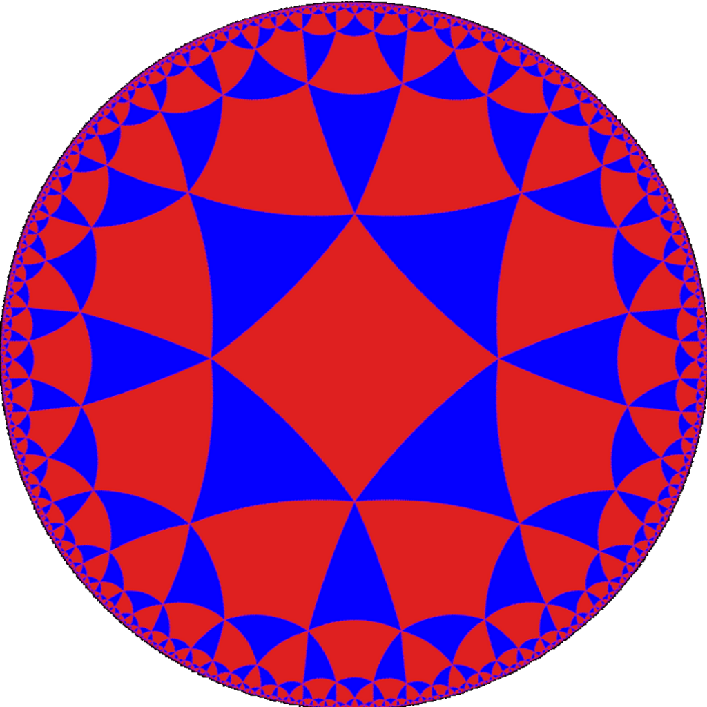
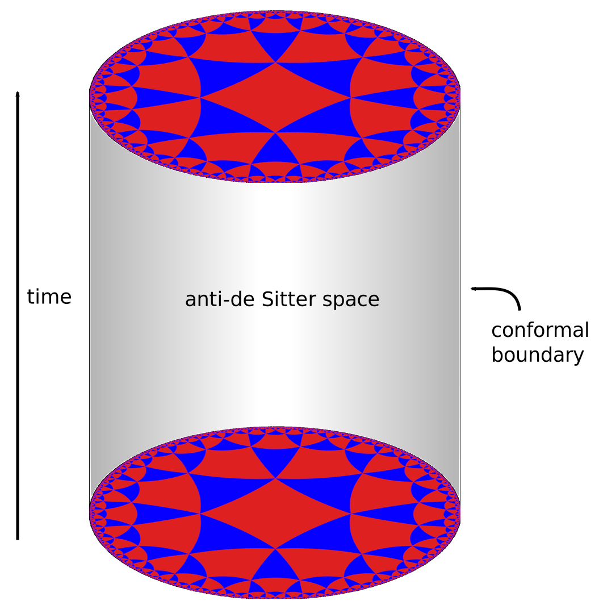
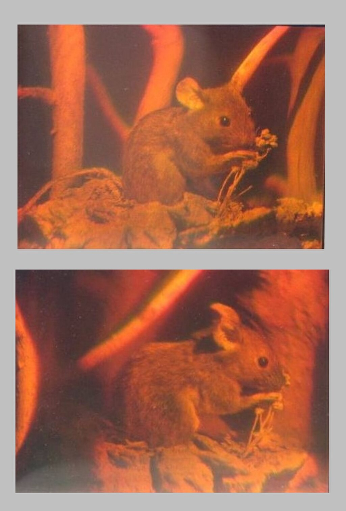
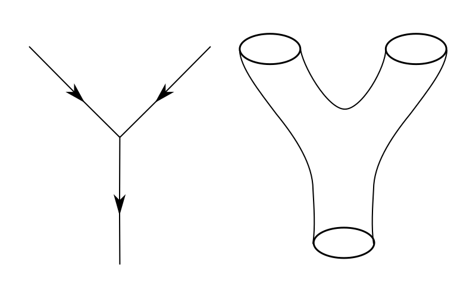
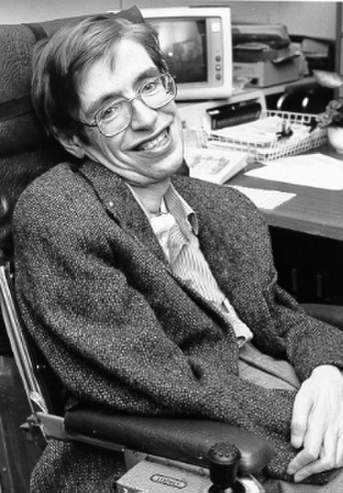
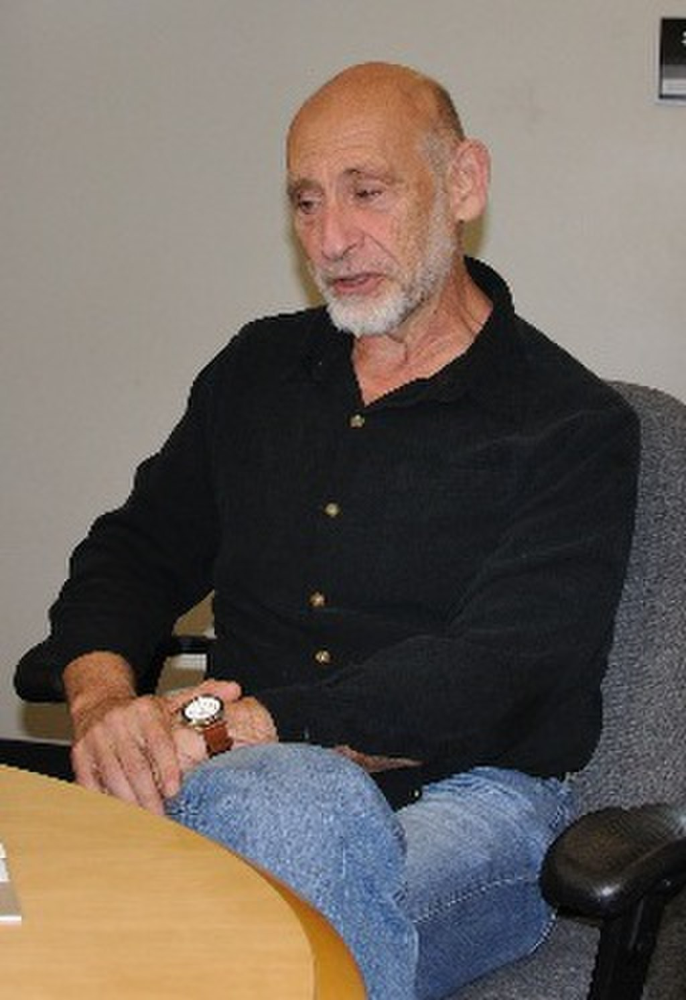

In [theoretical physics](https://en.wikipedia.org/wiki/Theoretical_physics "Theoretical physics"), the **anti-de Sitter/conformal field theory correspondence** (frequently abbreviated as AdS/CFT) is a conjectured relationship between two kinds of physical theories. On one side are [anti-de Sitter spaces](https://en.wikipedia.org/wiki/Anti-de_Sitter_space "Anti-de Sitter space") (AdS) that are used in theories of [quantum gravity](https://en.wikipedia.org/wiki/Quantum_gravity "Quantum gravity"), formulated in terms of [string theory](/source/string-theory/ "String theory") or [M-theory](/source/m-theory/ "M-theory"). On the other side of the correspondence are [conformal field theories](https://en.wikipedia.org/wiki/Conformal_field_theory "Conformal field theory") (CFT) that are [quantum field theories](https://en.wikipedia.org/wiki/Quantum_field_theory "Quantum field theory"), including theories similar to the [Yang–Mills theories](https://en.wikipedia.org/wiki/Yang–Mills_theory "Yang–Mills theory") that describe elementary particles.

The duality represents a major advance in the understanding of string theory and quantum gravity. This is because it provides a [non-perturbative](https://en.wikipedia.org/wiki/Non-perturbative "Non-perturbative") formulation of string theory with certain [boundary conditions](https://en.wikipedia.org/wiki/Boundary_condition "Boundary condition") and because it is the most successful realization of the [holographic principle](https://en.wikipedia.org/wiki/Holographic_principle "Holographic principle"), an idea in quantum gravity originally proposed by [Gerard 't Hooft](https://en.wikipedia.org/wiki/Gerard_'t_Hooft "Gerard 't Hooft") and promoted by [Leonard Susskind](https://en.wikipedia.org/wiki/Leonard_Susskind "Leonard Susskind").

It also provides a powerful toolkit for studying [strongly coupled](https://en.wikipedia.org/wiki/Coupling_\(physics\) "Coupling (physics)") quantum field theories. Much of the usefulness of the duality results from the fact that it is a strong–weak duality: when the fields of the quantum field theory are strongly interacting, the ones in the gravitational theory are weakly interacting and thus more mathematically tractable. This fact has been used to study many aspects of [nuclear](https://en.wikipedia.org/wiki/Nuclear_physics "Nuclear physics") and [condensed matter physics](https://en.wikipedia.org/wiki/Condensed_matter_physics "Condensed matter physics") by translating problems in those subjects into more mathematically tractable problems in string theory.

The AdS/CFT correspondence was first proposed by [Juan Maldacena](https://en.wikipedia.org/wiki/Juan_Maldacena "Juan Maldacena") in late 1997. Important aspects of the correspondence were soon elaborated on in two articles, one by [Steven Gubser](https://en.wikipedia.org/wiki/Steven_Gubser "Steven Gubser"), [Igor Klebanov](https://en.wikipedia.org/wiki/Igor_Klebanov "Igor Klebanov") and [Alexander Polyakov](https://en.wikipedia.org/wiki/Alexander_Markovich_Polyakov "Alexander Markovich Polyakov"), and another by [Edward Witten](/source/edward-witten/ "Edward Witten"). By 2015, Maldacena's article had over 10,000 citations, becoming the most highly cited article in the field of [high energy physics](https://en.wikipedia.org/wiki/High_energy_physics "High energy physics").

One of the most prominent examples of the AdS/CFT correspondence has been the AdS5/CFT4 correspondence: a relation between [_N_ = 4 supersymmetric Yang–Mills theory](https://en.wikipedia.org/wiki/N_=_4_supersymmetric_Yang–Mills_theory "N = 4 supersymmetric Yang–Mills theory") in 3+1 dimensions and type IIB superstring theory on AdS5 × _S_5.

## Background

### Quantum gravity and strings

Current understanding of [gravity](https://en.wikipedia.org/wiki/Gravity "Gravity") is based on [Albert Einstein](https://en.wikipedia.org/wiki/Albert_Einstein "Albert Einstein")'s [general theory of relativity](https://en.wikipedia.org/wiki/General_theory_of_relativity "General theory of relativity"). Formulated in 1915, general relativity explains gravity in terms of the geometry of space and time, or [spacetime](https://en.wikipedia.org/wiki/Spacetime "Spacetime"). It is formulated in the language of [classical physics](https://en.wikipedia.org/wiki/Classical_physics "Classical physics") that was developed by physicists such as [Isaac Newton](https://en.wikipedia.org/wiki/Isaac_Newton "Isaac Newton") and [James Clerk Maxwell](https://en.wikipedia.org/wiki/James_Clerk_Maxwell "James Clerk Maxwell"). The other nongravitational forces are explained in the framework of [quantum mechanics](/source/quantum-mechanics/ "Quantum mechanics"). Developed in the first half of the twentieth century by a number of different physicists, quantum mechanics provides a radically different way of describing physical phenomena based on probability.

[Quantum gravity](https://en.wikipedia.org/wiki/Quantum_gravity "Quantum gravity") is the branch of physics that seeks to describe gravity using the principles of quantum mechanics. Currently, a popular approach to quantum gravity is [string theory](/source/string-theory/ "String theory"), which models [elementary particles](https://en.wikipedia.org/wiki/Elementary_particle "Elementary particle") not as zero-dimensional points but as one-dimensional objects called [strings](https://en.wikipedia.org/wiki/String_\(physics\) "String (physics)"). In the AdS/CFT correspondence, one typically considers theories of quantum gravity derived from string theory or its modern extension, [M-theory](/source/m-theory/ "M-theory").

In everyday life, there are three familiar dimensions of space (up/down, left/right, and forward/backward), and there is one dimension of time. Thus, in the language of modern physics, one says that spacetime is four-dimensional. One peculiar feature of string theory and M-theory is that these theories require [extra dimensions](https://en.wikipedia.org/wiki/Extra_dimensions "Extra dimensions") of spacetime for their mathematical consistency: in string theory spacetime is ten-dimensional, while in M-theory it is eleven-dimensional. The quantum gravity theories appearing in the AdS/CFT correspondence are typically obtained from string and M-theory by a process known as [compactification](https://en.wikipedia.org/wiki/Compactification_\(physics\) "Compactification (physics)"). This produces a theory in which spacetime has effectively a lower number of dimensions and the extra dimensions are "curled up" into circles.

A standard analogy for compactification is to consider a multidimensional object such as a garden hose. If the hose is viewed from a sufficient distance, it appears to have only one dimension, its length, but as one approaches the hose, one discovers that it contains a second dimension, its circumference. Thus, an ant crawling inside it would move in two dimensions.

### Quantum field theory

The application of quantum mechanics to physical objects such as the [electromagnetic field](https://en.wikipedia.org/wiki/Electromagnetic_field "Electromagnetic field"), which are extended in space and time, is known as [quantum field theory](https://en.wikipedia.org/wiki/Quantum_field_theory "Quantum field theory"). In [particle physics](https://en.wikipedia.org/wiki/Particle_physics "Particle physics"), quantum field theories form the basis for our understanding of elementary particles, which are modeled as excitations in the fundamental fields. Quantum field theories are also used throughout condensed matter physics to model particle-like objects called [quasiparticles](https://en.wikipedia.org/wiki/Quasiparticle "Quasiparticle").

In the AdS/CFT correspondence, one considers, in addition to a theory of quantum gravity, a certain kind of quantum field theory called a [conformal field theory](https://en.wikipedia.org/wiki/Conformal_field_theory "Conformal field theory"). This is a particularly [symmetric](https://en.wikipedia.org/wiki/Symmetric "Symmetric") and mathematically well-behaved type of quantum field theory. Such theories are often studied in the context of string theory, where they are associated with the [surface](https://en.wikipedia.org/wiki/Worldsheet "Worldsheet") swept out by a string propagating through spacetime, and in [statistical mechanics](https://en.wikipedia.org/wiki/Statistical_mechanics "Statistical mechanics"), where they model systems at a [thermodynamic critical point](https://en.wikipedia.org/wiki/Critical_point_\(thermodynamics\) "Critical point (thermodynamics)").

## Overview of the correspondence

A [tessellation](https://en.wikipedia.org/wiki/Tritetragonal_tiling "Tritetragonal tiling") of the [hyperbolic plane](https://en.wikipedia.org/wiki/Hyperbolic_plane "Hyperbolic plane") by triangles and squares

### Geometry of anti-de Sitter space

In the AdS/CFT correspondence, one considers string theory or M-theory on an anti-de Sitter [background](https://en.wikipedia.org/wiki/String_background "String background"). This means that the geometry of spacetime is described in terms of a certain [vacuum solution](https://en.wikipedia.org/wiki/Vacuum_solution "Vacuum solution") of [Einstein's equation](https://en.wikipedia.org/wiki/Einstein's_equation "Einstein's equation") called [anti-de Sitter space](https://en.wikipedia.org/wiki/Anti-de_Sitter_space "Anti-de Sitter space").

In very elementary terms, anti-de Sitter space is a mathematical model of spacetime in which the notion of distance between points (the [metric](https://en.wikipedia.org/wiki/Metric_tensor "Metric tensor")) is different from the notion of distance in ordinary [Euclidean geometry](https://en.wikipedia.org/wiki/Euclidean_geometry "Euclidean geometry"). It is closely related to [hyperbolic space](https://en.wikipedia.org/wiki/Hyperbolic_space "Hyperbolic space"), which can be viewed as a [disk](https://en.wikipedia.org/wiki/Poincaré_disk_model "Poincaré disk model") as illustrated on the right. This image shows a [tessellation](https://en.wikipedia.org/wiki/Tessellation "Tessellation") of a disk by triangles and squares. One can define the distance between points of this disk in such a way that all the triangles and squares are the same size and the circular outer boundary is infinitely far from any point in the interior.

Now imagine a stack of hyperbolic disks where each disk represents the state of the [universe](https://en.wikipedia.org/wiki/Universe "Universe") at a given time. The resulting geometric object is three-dimensional anti-de Sitter space. It looks like a solid [cylinder](https://en.wikipedia.org/wiki/Cylinder_\(geometry\) "Cylinder (geometry)") in which any [cross section](https://en.wikipedia.org/wiki/Cross_section_\(geometry\) "Cross section (geometry)") is a copy of the hyperbolic disk. Time runs along the vertical direction in this picture. The surface of this cylinder plays an important role in the AdS/CFT correspondence. As with the hyperbolic plane, anti-de Sitter space is [curved](https://en.wikipedia.org/wiki/Curvature "Curvature") in such a way that any point in the interior is actually infinitely far from this boundary surface.

Three-dimensional [anti-de Sitter space](https://en.wikipedia.org/wiki/Anti-de_Sitter_space "Anti-de Sitter space") is like a stack of [hyperbolic disks](https://en.wikipedia.org/wiki/Poincaré_disk_model "Poincaré disk model"), each one representing the state of the universe at a given time. The resulting [spacetime](https://en.wikipedia.org/wiki/Spacetime "Spacetime") looks like a solid [cylinder](https://en.wikipedia.org/wiki/Cylinder_\(geometry\) "Cylinder (geometry)").

This construction describes a hypothetical universe with only two space and one time dimension, but it can be generalized to any number of dimensions. Indeed, hyperbolic space can have more than two dimensions and one can "stack up" copies of hyperbolic space to get higher-dimensional models of anti-de Sitter space.

### Idea of AdS/CFT

An important feature of anti-de Sitter space is its boundary (which looks like a cylinder in the case of three-dimensional anti-de Sitter space). One property of this boundary is that, locally around any point, it looks just like [Minkowski space](https://en.wikipedia.org/wiki/Minkowski_space "Minkowski space"), the model of spacetime used in nongravitational physics.

One can therefore consider an auxiliary theory in which "spacetime" is given by the boundary of anti-de Sitter space. This observation is the starting point for the AdS/CFT correspondence, which states that the boundary of anti-de Sitter space can be regarded as the "spacetime" for a conformal field theory. The claim is that this conformal field theory is equivalent to the gravitational theory on the bulk anti-de Sitter space in the sense that there is a "dictionary" for translating calculations in one theory into calculations in the other. Every entity in one theory has a counterpart in the other theory. For example, a single particle in the gravitational theory might correspond to some collection of particles in the boundary theory. In addition, the predictions in the two theories are quantitatively identical so that if two particles have a 40 percent chance of colliding in the gravitational theory, then the corresponding collections in the boundary theory would also have a 40 percent chance of colliding.

A [hologram](https://en.wikipedia.org/wiki/Hologram "Hologram") is a two-dimensional image that stores information about all three dimensions of the object it represents. The two images here are photographs of a single hologram taken from different angles.

Notice that the boundary of anti-de Sitter space has fewer dimensions than anti-de Sitter space itself. For instance, in the three-dimensional example illustrated above, the boundary is a two-dimensional surface. The AdS/CFT correspondence is often described as a "holographic duality" because this relationship between the two theories is similar to the relationship between a three-dimensional object and its image as a [hologram](https://en.wikipedia.org/wiki/Hologram "Hologram"). Although a hologram is two-dimensional, it encodes information about all three dimensions of the object it represents. In the same way, theories that are related by the AdS/CFT correspondence are conjectured to be _exactly_ equivalent, despite living in different numbers of dimensions. The conformal field theory is like a hologram that captures information about the higher-dimensional quantum gravity theory.

### Examples of the correspondence

Following Maldacena's insight in 1997, theorists have discovered many different realizations of the AdS/CFT correspondence. These relate various conformal field theories to compactifications of string theory and M-theory in various numbers of dimensions. The theories involved are generally not viable models of the real world, but they have certain features, such as their particle content or high degree of symmetry, which make them useful for solving problems in quantum field theory and quantum gravity.

The most famous example of the AdS/CFT correspondence states that [type IIB string theory](https://en.wikipedia.org/wiki/Type_IIB_string_theory "Type IIB string theory") on the [product space](https://en.wikipedia.org/wiki/Product_space "Product space") AdS5 × _S_5 is equivalent to [_N_ = 4 supersymmetric Yang–Mills theory](https://en.wikipedia.org/wiki/N_=_4_supersymmetric_Yang–Mills_theory "N = 4 supersymmetric Yang–Mills theory") on the four-dimensional boundary. In this example, the spacetime on which the gravitational theory lives is effectively five-dimensional (hence the notation AdS5), and there are five additional [compact dimensions](https://en.wikipedia.org/wiki/Compact_dimension "Compact dimension") (encoded by the _S_5 factor). In the real world, spacetime is four-dimensional, at least macroscopically, so this version of the correspondence does not provide a realistic model of gravity. Likewise, the dual theory is not a viable model of any real-world system as it assumes a large amount of [supersymmetry](/source/supersymmetry/ "Supersymmetry"). Nevertheless, as explained below, this boundary theory shares some features in common with [quantum chromodynamics](https://en.wikipedia.org/wiki/Quantum_chromodynamics "Quantum chromodynamics"), the fundamental theory of the [strong force](https://en.wikipedia.org/wiki/Strong_force "Strong force"). It describes particles similar to the [gluons](https://en.wikipedia.org/wiki/Gluon "Gluon") of quantum chromodynamics together with certain [fermions](https://en.wikipedia.org/wiki/Fermion "Fermion"). As a result, it has found applications in [nuclear physics](https://en.wikipedia.org/wiki/Nuclear_physics "Nuclear physics"), particularly in the study of the [quark–gluon plasma](https://en.wikipedia.org/wiki/Quark–gluon_plasma "Quark–gluon plasma").

Another realization of the correspondence states that M-theory on AdS7 × _S_4 is equivalent to the so-called [(2,0)-theory](https://en.wikipedia.org/wiki/6D_\(2,0\)_superconformal_field_theory "6D (2,0) superconformal field theory") in six dimensions. In this example, the spacetime of the gravitational theory is effectively seven-dimensional. The existence of the (2,0)-theory that appears on one side of the duality is predicted by the classification of [superconformal field theories](https://en.wikipedia.org/wiki/Super_conformal_field_theory "Super conformal field theory"). It is still poorly understood because it is a quantum mechanical theory without a [classical limit](https://en.wikipedia.org/wiki/Classical_limit "Classical limit"). Despite the inherent difficulty in studying this theory, it is considered to be an interesting object for a variety of reasons, both physical and mathematical.

Yet another realization of the correspondence states that M-theory on AdS4 × _S_7 is equivalent to the [ABJM superconformal field theory](https://en.wikipedia.org/wiki/ABJM_superconformal_field_theory "ABJM superconformal field theory") in three dimensions. Here the gravitational theory has four noncompact dimensions, so this version of the correspondence provides a somewhat more realistic description of gravity.

## Applications to quantum gravity

### A non-perturbative formulation of string theory

Interaction in the quantum world: [world lines](https://en.wikipedia.org/wiki/World_line "World line") of point-like [particles](https://en.wikipedia.org/wiki/Particles "Particles") or a [world sheet](https://en.wikipedia.org/wiki/World_sheet "World sheet") swept up by closed [strings](https://en.wikipedia.org/wiki/String_\(physics\) "String (physics)") in string theory.

In quantum field theory, one typically computes the probabilities of various physical events using the techniques of [perturbation theory](https://en.wikipedia.org/wiki/Perturbation_theory "Perturbation theory"). Developed by [Richard Feynman](https://en.wikipedia.org/wiki/Richard_Feynman "Richard Feynman") and others in the first half of the twentieth century, perturbative quantum field theory uses special diagrams called [Feynman diagrams](https://en.wikipedia.org/wiki/Feynman_diagram "Feynman diagram") to organize computations. One imagines that these diagrams depict the paths of point-like particles and their interactions. Although this formalism is extremely useful for making predictions, these predictions are only possible when the strength of the interactions, the [coupling constant](https://en.wikipedia.org/wiki/Coupling_constant "Coupling constant"), is small enough to reliably describe the theory as being close to a theory [without interactions](https://en.wikipedia.org/wiki/Free_field "Free field").

The starting point for string theory is the idea that the point-like particles of quantum field theory can also be modeled as one-dimensional objects called strings. The interaction of strings is most straightforwardly defined by generalizing the perturbation theory used in ordinary quantum field theory. At the level of Feynman diagrams, this means replacing the one-dimensional diagram representing the path of a point particle by a two-dimensional surface representing the motion of a string. Unlike in quantum field theory, string theory does not yet have a full non-perturbative definition, so many of the theoretical questions that physicists would like to answer remain out of reach.

The problem of developing a non-perturbative formulation of string theory was one of the original motivations for studying the AdS/CFT correspondence. As explained above, the correspondence provides several examples of quantum field theories that are equivalent to string theory on anti-de Sitter space. One can alternatively view this correspondence as providing a _definition_ of string theory in the special case where the gravitational field is asymptotically anti-de Sitter (that is, when the gravitational field resembles that of anti-de Sitter space at spatial infinity). Physically interesting quantities in string theory are defined in terms of quantities in the dual quantum field theory.

### Black hole information paradox

In 1975, [Stephen Hawking](https://en.wikipedia.org/wiki/Stephen_Hawking "Stephen Hawking") published a calculation that suggested that [black holes](https://en.wikipedia.org/wiki/Black_hole "Black hole") are not completely black but emit a dim radiation due to quantum effects near the [event horizon](https://en.wikipedia.org/wiki/Event_horizon "Event horizon"). At first, Hawking's result posed a problem for theorists because it suggested that black holes destroy information. More precisely, Hawking's calculation seemed to conflict with one of the basic [postulates of quantum mechanics](https://en.wikipedia.org/wiki/Postulates_of_quantum_mechanics "Postulates of quantum mechanics"), which states that physical systems evolve in time according to the [Schrödinger equation](https://en.wikipedia.org/wiki/Schrödinger_equation "Schrödinger equation"). This property is usually referred to as [unitarity](https://en.wikipedia.org/wiki/Unitarity_\(physics\) "Unitarity (physics)") of time evolution. The apparent contradiction between Hawking's calculation and the unitarity postulate of quantum mechanics came to be known as the [black hole information paradox](https://en.wikipedia.org/wiki/Black_hole_information_paradox "Black hole information paradox").

The AdS/CFT correspondence resolves the black hole information paradox, at least to some extent, because it shows how a black hole can evolve in a manner consistent with quantum mechanics in some contexts. Indeed, one can consider black holes in the context of the AdS/CFT correspondence, and any such black hole corresponds to a configuration of particles on the boundary of anti-de Sitter space. These particles obey the usual rules of quantum mechanics and in particular evolve in a unitary fashion, so the black hole must also evolve in a unitary fashion, respecting the principles of quantum mechanics. In 2005, Hawking announced that the paradox had been settled in favor of information conservation by the AdS/CFT correspondence, and he suggested a concrete mechanism by which black holes might preserve information.

## Applications to quantum field theory

### Nuclear physics

One [physical system](https://en.wikipedia.org/wiki/Physical_system "Physical system") that has been studied using the AdS/CFT correspondence is the quark–gluon plasma, an exotic [state of matter](https://en.wikipedia.org/wiki/State_of_matter "State of matter") produced in [particle accelerators](https://en.wikipedia.org/wiki/Particle_accelerator "Particle accelerator"). This state of matter arises for brief instants when heavy [ions](https://en.wikipedia.org/wiki/Ions "Ions") such as [gold](https://en.wikipedia.org/wiki/Gold "Gold") or [lead](https://en.wikipedia.org/wiki/Lead "Lead") [nuclei](https://en.wikipedia.org/wiki/Atomic_nucleus "Atomic nucleus") are collided at high energies. Such collisions cause the [quarks](https://en.wikipedia.org/wiki/Quarks "Quarks") that make up atomic nuclei to [deconfine](https://en.wikipedia.org/wiki/Deconfinement "Deconfinement") at temperatures of approximately two [trillion](https://en.wikipedia.org/wiki/1,000,000,000,000 "1,000,000,000,000") [kelvins](https://en.wikipedia.org/wiki/Kelvin "Kelvin"), conditions similar to those present at around 10−11 seconds after the [Big Bang](https://en.wikipedia.org/wiki/Big_Bang "Big Bang").

The physics of the quark–gluon plasma is governed by quantum chromodynamics, but this theory is mathematically intractable in problems involving the quark–gluon plasma. In an article appearing in 2005, [Đàm Thanh Sơn](https://en.wikipedia.org/wiki/Đàm_Thanh_Sơn "Đàm Thanh Sơn") and his collaborators showed that the AdS/CFT correspondence could be used to understand some aspects of the quark–gluon plasma by describing it in the language of string theory. By applying the AdS/CFT correspondence, Sơn and his collaborators were able to describe the quark gluon plasma in terms of black holes in five-dimensional spacetime. The calculation showed that the ratio of two quantities associated with the quark–gluon plasma, the [shear viscosity](https://en.wikipedia.org/wiki/Shear_viscosity "Shear viscosity") _η_ and volume density of [entropy](https://en.wikipedia.org/wiki/Entropy "Entropy") _s_, should be approximately equal to a certain [universal constant](https://en.wikipedia.org/wiki/Universal_constant "Universal constant"):

: $\frac{\eta}{s}\approx\frac{\hbar}{4\pi k}$

where _ħ_ denotes the [reduced Planck constant](https://en.wikipedia.org/wiki/Reduced_Planck_constant "Reduced Planck constant") and _k_ is the [Boltzmann constant](https://en.wikipedia.org/wiki/Boltzmann_constant "Boltzmann constant"). In addition, the authors conjectured that this universal constant provides a [lower bound](https://en.wikipedia.org/wiki/Lower_bound "Lower bound") for _η_/_s_ in a large class of systems. In an experiment conducted at the [Relativistic Heavy Ion Collider](https://en.wikipedia.org/wiki/Relativistic_Heavy_Ion_Collider "Relativistic Heavy Ion Collider") at [Brookhaven National Laboratory](https://en.wikipedia.org/wiki/Brookhaven_National_Laboratory "Brookhaven National Laboratory"), the experimental result in one model was close to this universal constant but it was not the case in another model.

Another important property of the quark–gluon plasma is that very high energy quarks moving through the plasma are stopped or "quenched" after traveling only a few [femtometres](https://en.wikipedia.org/wiki/Femtometre "Femtometre"). This phenomenon is characterized by a number ^_q_ called the [jet quenching](https://en.wikipedia.org/wiki/Jet_quenching "Jet quenching") parameter, which relates the energy loss of such a quark to the squared distance traveled through the plasma. Calculations based on the AdS/CFT correspondence give the estimated value ^_q_ ≈ 4 GeV2/fm, and the experimental value of ^_q_ lies in the range 5–15 GeV2/fm.

### Condensed matter physics

A [magnet](https://en.wikipedia.org/wiki/Magnet "Magnet") [levitating](https://en.wikipedia.org/wiki/Meissner_effect "Meissner effect") above a [high-temperature superconductor](https://en.wikipedia.org/wiki/High-temperature_superconductor "High-temperature superconductor"). Today some physicists are working to understand high-temperature superconductivity using the AdS/CFT correspondence.

Over the decades, [experimental](https://en.wikipedia.org/wiki/Experimental_physics "Experimental physics") [condensed matter](https://en.wikipedia.org/wiki/Condensed_matter "Condensed matter") physicists have discovered a number of exotic states of matter, including [superconductors](https://en.wikipedia.org/wiki/Superconductors "Superconductors") and [superfluids](https://en.wikipedia.org/wiki/Superfluids "Superfluids"). These states are described using the formalism of quantum field theory, but some phenomena are difficult to explain using standard field theoretic techniques. Some condensed matter theorists including [Subir Sachdev](https://en.wikipedia.org/wiki/Subir_Sachdev "Subir Sachdev") hope that the AdS/CFT correspondence will make it possible to describe these systems in the language of string theory and learn more about their behavior.

So far some success has been achieved in using string theory methods to describe the transition of a [superfluid](https://en.wikipedia.org/wiki/Superfluid "Superfluid") to an [insulator](https://en.wikipedia.org/wiki/Insulator_\(electricity\) "Insulator (electricity)"). A superfluid is a system of [electrically neutral](https://en.wikipedia.org/wiki/Electrically_neutral "Electrically neutral") [atoms](https://en.wikipedia.org/wiki/Atoms "Atoms") that flows without any [friction](https://en.wikipedia.org/wiki/Friction "Friction"). Such systems are often produced in the laboratory using [liquid helium](https://en.wikipedia.org/wiki/Liquid_helium "Liquid helium"), but recently experimentalists have developed new ways of producing artificial superfluids by pouring trillions of cold atoms into a lattice of criss-crossing [lasers](https://en.wikipedia.org/wiki/Lasers "Lasers"). These atoms initially behave as a superfluid, but as experimentalists increase the intensity of the lasers, they become less mobile and then suddenly transition to an insulating state. During the transition, the atoms behave in an unusual way. For example, the atoms slow to a halt at a rate that depends on the [temperature](https://en.wikipedia.org/wiki/Temperature "Temperature") and on the Planck constant, the fundamental parameter of quantum mechanics, which does not enter into the description of the other [phases](https://en.wikipedia.org/wiki/Phase_\(matter\) "Phase (matter)"). This behavior has recently been understood by considering a dual description where properties of the fluid are described in terms of a higher dimensional black hole.

### Criticism

With many physicists turning towards string-based methods to solve problems in nuclear and condensed matter physics, some theorists working in these areas have expressed doubts about whether the AdS/CFT correspondence can provide the tools needed to realistically model real-world systems. In a talk at the Quark Matter conference in 2006, an American physicist, Larry McLerran pointed out that the _N_ = 4 super Yang–Mills theory that appears in the AdS/CFT correspondence differs significantly from quantum chromodynamics, making it difficult to apply these methods to nuclear physics. According to McLerran,

> _N_ = 4 supersymmetric Yang–Mills is not QCD ... It has no mass scale and is conformally invariant. It has no confinement and no running coupling constant. It is supersymmetric. It has no chiral symmetry breaking or mass generation. It has six scalar and fermions in the adjoint representation ... It may be possible to correct some or all of the above problems, or, for various physical problems, some of the objections may not be relevant. As yet there is not consensus nor compelling arguments for the conjectured fixes or phenomena which would insure that the _N_ = 4 supersymmetric Yang Mills results would reliably reflect QCD.

In a letter to [Physics Today](https://en.wikipedia.org/wiki/Physics_Today "Physics Today"), [Nobel laureate](https://en.wikipedia.org/wiki/Nobel_laureate "Nobel laureate") [Philip W. Anderson](https://en.wikipedia.org/wiki/Philip_W._Anderson "Philip W. Anderson") voiced similar concerns about applications of AdS/CFT to condensed matter physics, stating

> As a very general problem with the AdS/CFT approach in condensed-matter theory, we can point to those telltale initials "CFT"—conformal field theory. Condensed-matter problems are, in general, neither relativistic nor conformal. Near a quantum critical point, both time and space may be scaling, but even there we still have a preferred coordinate system and, usually, a lattice. There is some evidence of other linear-T phases to the left of the strange metal about which they are welcome to speculate, but again in this case the condensed-matter problem is overdetermined by experimental facts.

## History and development

[Gerard 't Hooft](https://en.wikipedia.org/wiki/Gerard_'t_Hooft "Gerard 't Hooft") obtained results related to the AdS/CFT correspondence in the 1970s by studying analogies between [string theory](/source/string-theory/ "String theory") and [nuclear physics](https://en.wikipedia.org/wiki/Nuclear_physics "Nuclear physics").

### String theory and nuclear physics

The discovery of the AdS/CFT correspondence in late 1997 was the culmination of a long history of efforts to relate string theory to nuclear physics. In fact, string theory was originally developed during the late 1960s and early 1970s as a theory of [hadrons](https://en.wikipedia.org/wiki/Hadron "Hadron"), the [subatomic particles](https://en.wikipedia.org/wiki/Subatomic_particle "Subatomic particle") like the [proton](https://en.wikipedia.org/wiki/Proton "Proton") and [neutron](https://en.wikipedia.org/wiki/Neutron "Neutron") that are held together by the [strong nuclear force](https://en.wikipedia.org/wiki/Strong_nuclear_force "Strong nuclear force"). The idea was that each of these particles could be viewed as a different oscillation mode of a string. In the late 1960s, experimentalists had found that hadrons fall into families called [Regge trajectories](https://en.wikipedia.org/wiki/Regge_trajectories "Regge trajectories") with squared [energy](https://en.wikipedia.org/wiki/Energy "Energy") proportional to [angular momentum](https://en.wikipedia.org/wiki/Angular_momentum "Angular momentum"), and theorists showed that this relationship emerges naturally from the physics of a rotating [relativistic](https://en.wikipedia.org/wiki/Principle_of_relativity "Principle of relativity") string.

On the other hand, attempts to model hadrons as strings faced serious problems. One problem was that string theory includes a [massless](https://en.wikipedia.org/wiki/Mass "Mass") [spin-2](https://en.wikipedia.org/wiki/Spin_\(physics\) "Spin (physics)") particle whereas no such particle appears in the physics of hadrons. Such a particle would mediate a force with the properties of gravity. In 1974, [Joël Scherk](https://en.wikipedia.org/wiki/Joël_Scherk "Joël Scherk") and [John Schwarz](https://en.wikipedia.org/wiki/John_Henry_Schwarz "John Henry Schwarz") suggested that string theory was therefore not a theory of nuclear physics as many theorists had thought but instead a theory of quantum gravity. At the same time, it was realized that hadrons are actually made of quarks, and the string theory approach was abandoned in favor of quantum chromodynamics.

In quantum chromodynamics, quarks have a kind of [charge](https://en.wikipedia.org/wiki/Charge_\(physics\) "Charge (physics)") that comes in three varieties called [colors](https://en.wikipedia.org/wiki/Color_charge "Color charge"). In a paper from 1974, [Gerard 't Hooft](https://en.wikipedia.org/wiki/Gerard_'t_Hooft "Gerard 't Hooft") studied the relationship between string theory and nuclear physics from another point of view by considering theories similar to quantum chromodynamics, where the number of colors is some arbitrary number _N_, rather than three. In this article, 't Hooft considered a certain limit where _N_ tends to infinity and argued that in this limit certain calculations in quantum field theory resemble calculations in string theory.

### Black holes and holography

[Stephen Hawking](https://en.wikipedia.org/wiki/Stephen_Hawking "Stephen Hawking") predicted in 1975 that [black holes](https://en.wikipedia.org/wiki/Black_hole "Black hole") emit [radiation](https://en.wikipedia.org/wiki/Hawking_radiation "Hawking radiation") due to quantum effects.

In 1975, Stephen Hawking published a calculation that suggested that black holes are not completely black but emit a dim radiation due to quantum effects near the event horizon. This work extended previous results of [Jacob Bekenstein](https://en.wikipedia.org/wiki/Jacob_Bekenstein "Jacob Bekenstein") who had suggested that black holes have a well-defined entropy. At first, Hawking's result appeared to contradict one of the main postulates of quantum mechanics, namely the unitarity of time evolution. Intuitively, the unitarity postulate says that quantum mechanical systems do not destroy information as they evolve from one state to another. For this reason, the apparent contradiction came to be known as the black hole information paradox.

[Leonard Susskind](https://en.wikipedia.org/wiki/Leonard_Susskind "Leonard Susskind") made early contributions to the idea of [holography](https://en.wikipedia.org/wiki/Holography "Holography") in [quantum gravity](https://en.wikipedia.org/wiki/Quantum_gravity "Quantum gravity").

Later, in 1993, Gerard 't Hooft wrote a speculative paper on quantum gravity in which he revisited Hawking's work on [black hole thermodynamics](https://en.wikipedia.org/wiki/Black_hole_thermodynamics "Black hole thermodynamics"), concluding that the total number of [degrees of freedom](https://en.wikipedia.org/wiki/Degree_of_freedom "Degree of freedom") in a region of spacetime surrounding a black hole is proportional to the [surface area](https://en.wikipedia.org/wiki/Surface_area "Surface area") of the horizon. This idea was promoted by [Leonard Susskind](https://en.wikipedia.org/wiki/Leonard_Susskind "Leonard Susskind") and is now known as the [holographic principle](https://en.wikipedia.org/wiki/Holographic_principle "Holographic principle"). The holographic principle and its realization in string theory through the AdS/CFT correspondence have helped elucidate the mysteries of black holes suggested by Hawking's work and are believed to provide a resolution of the black hole information paradox. In 2004, Hawking conceded that black holes do not violate quantum mechanics, and he suggested a concrete mechanism by which they might preserve information.

### Maldacena's paper

[Juan Maldacena](https://en.wikipedia.org/wiki/Juan_Maldacena "Juan Maldacena") first proposed the AdS/CFT correspondence in late 1997.

On January 1, 1998, [Juan Maldacena](https://en.wikipedia.org/wiki/Juan_Maldacena "Juan Maldacena") published a landmark paper that initiated the study of AdS/CFT. According to [Alexander Markovich Polyakov](https://en.wikipedia.org/wiki/Alexander_Markovich_Polyakov "Alexander Markovich Polyakov"), "\[Maldacena's\] work opened the flood gates." The conjecture immediately excited great interest in the string theory community and was considered in a paper by [Steven Gubser](https://en.wikipedia.org/wiki/Steven_Gubser "Steven Gubser"), [Igor Klebanov](https://en.wikipedia.org/wiki/Igor_Klebanov "Igor Klebanov") and Polyakov, and another paper of [Edward Witten](/source/edward-witten/ "Edward Witten"). These papers made Maldacena's conjecture more precise and showed that the conformal field theory appearing in the correspondence lives on the boundary of anti-de Sitter space.

One special case of Maldacena's proposal says that _N_ = 4 super Yang–Mills theory, a [gauge theory](https://en.wikipedia.org/wiki/Gauge_theory "Gauge theory") similar in some ways to quantum chromodynamics, is equivalent to string theory in five-dimensional anti-de Sitter space. This result helped clarify the earlier work of 't Hooft on the relationship between string theory and quantum chromodynamics, taking string theory back to its roots as a theory of nuclear physics. Maldacena's results also provided a concrete realization of the holographic principle with important implications for quantum gravity and black hole physics. By the year 2015, Maldacena's paper had become the most highly cited paper in [high energy physics](https://en.wikipedia.org/wiki/High_energy_physics "High energy physics") with over 10,000 citations. These subsequent articles have provided considerable evidence that the correspondence is correct, although so far it has not been [rigorously proved](https://en.wikipedia.org/wiki/Mathematical_proof "Mathematical proof").

## Generalizations

### Three-dimensional gravity

In order to better understand the quantum aspects of gravity in our [four-dimensional](https://en.wikipedia.org/wiki/Four-dimensional "Four-dimensional") universe, some physicists have considered a lower-dimensional [mathematical model](https://en.wikipedia.org/wiki/Mathematical_model "Mathematical model") in which spacetime has only two spatial dimensions and one time dimension. In this setting, the mathematics describing the [gravitational field](https://en.wikipedia.org/wiki/Gravitational_field "Gravitational field") simplifies drastically, and one can study quantum gravity using familiar methods from quantum field theory, eliminating the need for string theory or other more radical approaches to quantum gravity in four dimensions.

Beginning with the work of J. David Brown and [Marc Henneaux](https://en.wikipedia.org/wiki/Marc_Henneaux "Marc Henneaux") in 1986, physicists have noticed that quantum gravity in a three-dimensional spacetime is closely related to two-dimensional conformal field theory. In 1995, Henneaux and his coworkers explored this relationship in more detail, suggesting that three-dimensional gravity in anti-de Sitter space is equivalent to the conformal field theory known as [Liouville field theory](https://en.wikipedia.org/wiki/Liouville_field_theory "Liouville field theory"). Another conjecture formulated by Edward Witten states that three-dimensional gravity in anti-de Sitter space is equivalent to a conformal field theory with [monster group](https://en.wikipedia.org/wiki/Monster_group "Monster group") symmetry. These conjectures provide examples of the AdS/CFT correspondence that do not require the full apparatus of string or M-theory.

### dS/CFT correspondence

Unlike our universe, which is now known to be expanding at an accelerating rate, anti-de Sitter space is neither expanding nor contracting. Instead it looks the same at all times. In more technical language, one says that anti-de Sitter space corresponds to a universe with a negative [cosmological constant](https://en.wikipedia.org/wiki/Cosmological_constant "Cosmological constant"), whereas the real universe has a small positive cosmological constant.

Although the properties of gravity at short distances should be somewhat independent of the value of the cosmological constant, it is desirable to have a version of the AdS/CFT correspondence for positive cosmological constant. In 2001, [Andrew Strominger](https://en.wikipedia.org/wiki/Andrew_Strominger "Andrew Strominger") introduced a version of the duality called the [dS/CFT correspondence](https://en.wikipedia.org/wiki/DS/CFT_correspondence "DS/CFT correspondence"). This duality involves a model of spacetime called [de Sitter space](https://en.wikipedia.org/wiki/De_Sitter_space "De Sitter space") with a positive cosmological constant. Such a duality is interesting from the point of view of [cosmology](https://en.wikipedia.org/wiki/Cosmology "Cosmology") since many cosmologists believe that the very early universe was close to being de Sitter space.

### Kerr/CFT correspondence

Although the AdS/CFT correspondence is often useful for studying the properties of black holes, most of the black holes considered in the context of AdS/CFT are physically unrealistic. Indeed, as explained above, most versions of the AdS/CFT correspondence involve higher-dimensional models of spacetime with unphysical supersymmetry.

In 2009, Monica Guica, Thomas Hartman, Wei Song, and Andrew Strominger showed that the ideas of AdS/CFT could nevertheless be used to understand certain [astrophysical](https://en.wikipedia.org/wiki/Astrophysical "Astrophysical") black holes. More precisely, their results apply to black holes that are approximated by [extremal](https://en.wikipedia.org/wiki/Extremal_black_hole "Extremal black hole") [Kerr black holes](https://en.wikipedia.org/wiki/Kerr_black_hole "Kerr black hole"), which have the largest possible angular momentum compatible with a given mass. They showed that such black holes have an equivalent description in terms of conformal field theory. The Kerr/CFT correspondence was later extended to black holes with lower angular momentum.

### Higher spin gauge theories

The AdS/CFT correspondence is closely related to another duality conjectured by Igor Klebanov and Alexander Markovich Polyakov in 2002. This duality states that certain "higher spin gauge theories" on anti-de Sitter space are equivalent to conformal field theories with [O(N)](https://en.wikipedia.org/wiki/Orthogonal_group "Orthogonal group") symmetry. Here the theory in the bulk is a type of gauge theory describing particles of arbitrarily high spin. It is similar to string theory, where the excited modes of vibrating strings correspond to particles with higher spin, and it may help to better understand the string theoretic versions of AdS/CFT and possibly even [prove](https://en.wikipedia.org/wiki/Mathematical_proof "Mathematical proof") the correspondence. In 2010, Simone Giombi and Xi Yin obtained further evidence for this duality by computing quantities called [three-point functions](https://en.wikipedia.org/wiki/Correlation_function_\(quantum_field_theory\) "Correlation function (quantum field theory)").
