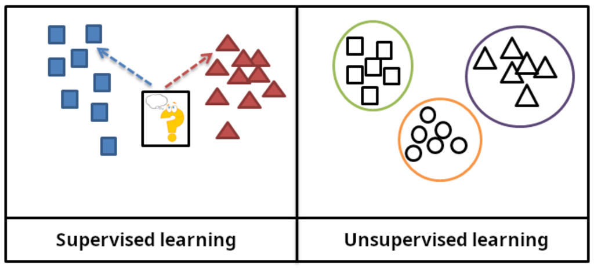
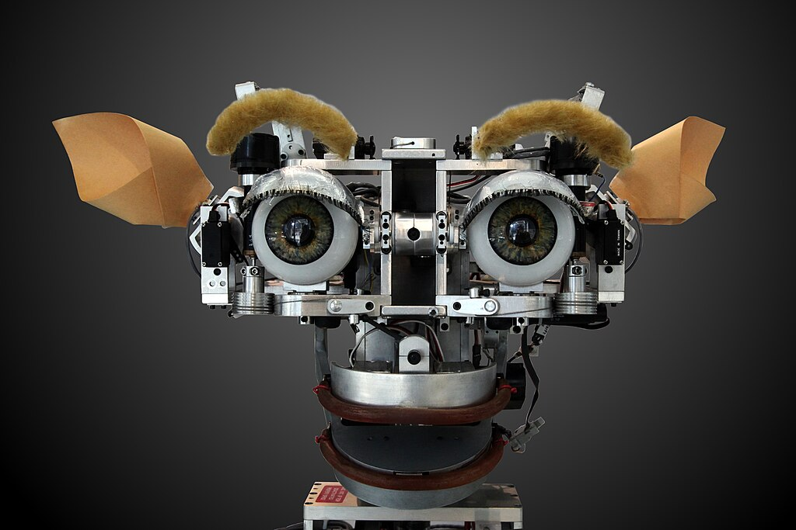
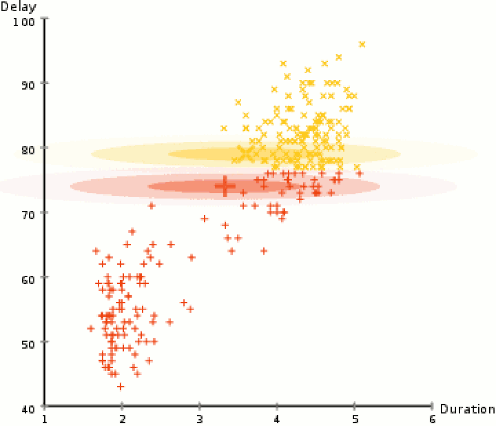
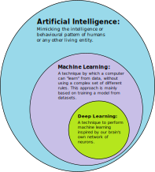
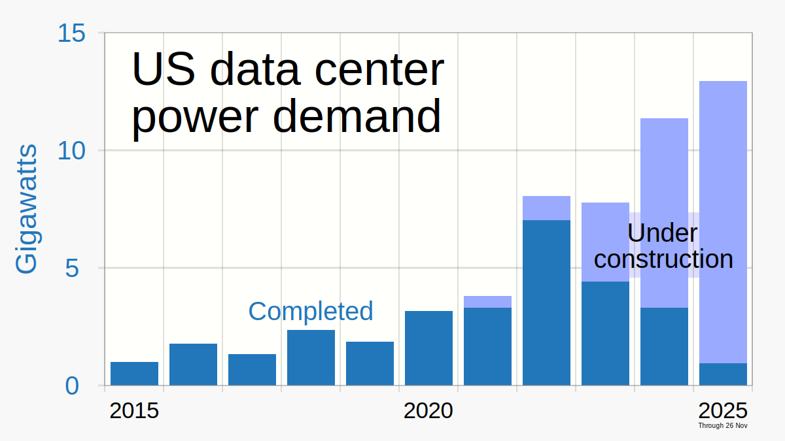
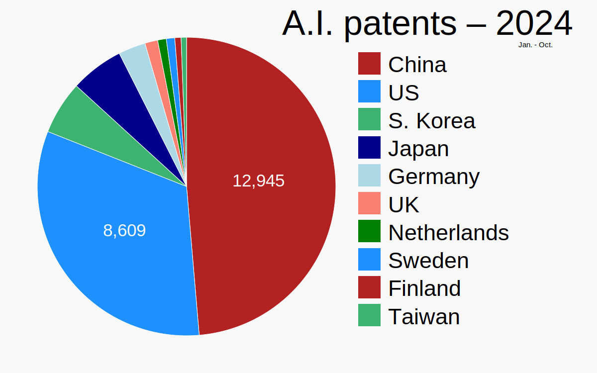
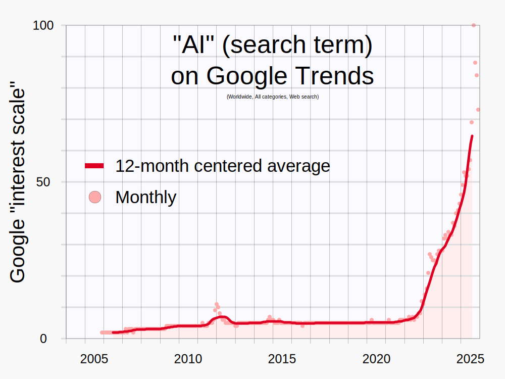
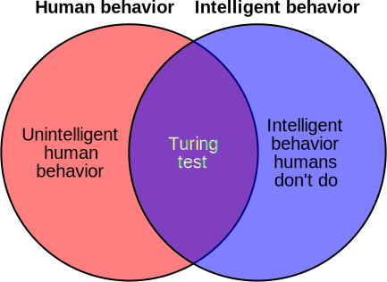

**Artificial intelligence** (**AI**) is the capability of [computational systems](https://en.wikipedia.org/wiki/Computer "Computer") to perform tasks typically associated with [human intelligence](https://en.wikipedia.org/wiki/Human_intelligence "Human intelligence"), such as [learning](https://en.wikipedia.org/wiki/Learning "Learning"), [reasoning](https://en.wikipedia.org/wiki/Reason "Reason"), [problem-solving](https://en.wikipedia.org/wiki/Problem-solving "Problem-solving"), [perception](/source/perception/ "Perception"), and [decision-making](https://en.wikipedia.org/wiki/Decision-making "Decision-making"). It is a [field of research](https://en.wikipedia.org/wiki/Field_of_research "Field of research") in [engineering](https://en.wikipedia.org/wiki/Engineering "Engineering"), [mathematics](https://en.wikipedia.org/wiki/Mathematics "Mathematics") and [computer science](https://en.wikipedia.org/wiki/Computer_science "Computer science") that develops and studies methods and [software](https://en.wikipedia.org/wiki/Software "Software") that enable machines to perceive their environment and use [learning](https://en.wikipedia.org/wiki/Machine_learning "Machine learning") and [intelligence](https://en.wikipedia.org/wiki/Intelligence "Intelligence") to take actions that maximize their chances of achieving defined goals.

High-profile [applications of AI](https://en.wikipedia.org/wiki/Applications_of_artificial_intelligence "Applications of artificial intelligence") include advanced [web search engines](https://en.wikipedia.org/wiki/Web_search_engine "Web search engine"), [chatbots](https://en.wikipedia.org/wiki/Chatbot "Chatbot"), [virtual assistants](https://en.wikipedia.org/wiki/Virtual_assistant "Virtual assistant"), [autonomous vehicles](https://en.wikipedia.org/wiki/Autonomous_vehicles "Autonomous vehicles"), and play and analysis in [strategy games](https://en.wikipedia.org/wiki/Strategy_game "Strategy game") (e.g., [chess](https://en.wikipedia.org/wiki/Chess "Chess") and [Go](https://en.wikipedia.org/wiki/Go_\(game\) "Go (game)")). Since the 2020s, [generative AI](https://en.wikipedia.org/wiki/Generative_AI "Generative AI") has become widely available to generate images, audio, and videos from text prompts.

The traditional goals of AI research include learning, [reasoning](https://en.wikipedia.org/wiki/Automated_reasoning "Automated reasoning"), [knowledge representation](https://en.wikipedia.org/wiki/Knowledge_representation "Knowledge representation"), [planning](https://en.wikipedia.org/wiki/Automated_planning_and_scheduling "Automated planning and scheduling"), [natural language processing](https://en.wikipedia.org/wiki/Natural_language_processing "Natural language processing"), and [perception](https://en.wikipedia.org/wiki/Machine_perception "Machine perception"), as well as support for [robotics](https://en.wikipedia.org/wiki/Robotics "Robotics"). To reach these goals, AI researchers have used techniques including [state space search](https://en.wikipedia.org/wiki/State_space_search "State space search") and [mathematical optimization](https://en.wikipedia.org/wiki/Mathematical_optimization "Mathematical optimization"), [formal logic](https://en.wikipedia.org/wiki/Formal_logic "Formal logic"), [artificial neural networks](https://en.wikipedia.org/wiki/Artificial_neural_network "Artificial neural network"), and methods based on [statistics](https://en.wikipedia.org/wiki/Statistics "Statistics"), [operations research](https://en.wikipedia.org/wiki/Operations_research "Operations research"), and [economics](https://en.wikipedia.org/wiki/Economics "Economics"). AI also draws upon [psychology](https://en.wikipedia.org/wiki/Psychology "Psychology"), [linguistics](https://en.wikipedia.org/wiki/Linguistics "Linguistics"), [philosophy](https://en.wikipedia.org/wiki/Philosophy_of_artificial_intelligence "Philosophy of artificial intelligence"), [neuroscience](https://en.wikipedia.org/wiki/Neuroscience "Neuroscience"), and other fields. Some companies, such as [OpenAI](https://en.wikipedia.org/wiki/OpenAI "OpenAI"), [Google DeepMind](https://en.wikipedia.org/wiki/Google_DeepMind "Google DeepMind") and [Meta](https://en.wikipedia.org/wiki/Meta_Platforms "Meta Platforms"), aim to create [artificial general intelligence](https://en.wikipedia.org/wiki/Artificial_general_intelligence "Artificial general intelligence") (AGI) – AI that can complete virtually any cognitive task at least as well as a human.

Artificial intelligence was founded as an academic discipline in 1956, and the field went through multiple cycles of optimism throughout [its history](https://en.wikipedia.org/wiki/History_of_artificial_intelligence "History of artificial intelligence"), followed by periods of disappointment and loss of funding, known as [AI winters](https://en.wikipedia.org/wiki/AI_winter "AI winter"). Funding and interest increased substantially after 2012, when [graphics processing units](https://en.wikipedia.org/wiki/Graphics_processing_unit "Graphics processing unit") began being used to accelerate neural networks, and [deep learning](https://en.wikipedia.org/wiki/Deep_learning "Deep learning") outperformed previous AI techniques. This growth accelerated further after 2017 with the [transformer architecture](https://en.wikipedia.org/wiki/Transformer_architecture "Transformer architecture"). In the 2020s, an [AI boom](https://en.wikipedia.org/wiki/AI_boom "AI boom") has coincided with advances in [generative AI](https://en.wikipedia.org/wiki/Generative_AI "Generative AI"), which allowed for the creation and modification of media. In addition to [AI safety](https://en.wikipedia.org/wiki/AI_safety "AI safety") and [unintended consequences and harms](https://en.wikipedia.org/wiki/Generative_AI#Concerns "Generative AI") from the use of AI, [ethical concerns](https://en.wikipedia.org/wiki/Ethics_of_artificial_intelligence "Ethics of artificial intelligence"), [AI's long-term effects](https://en.wikipedia.org/wiki/AI_aftermath_scenarios "AI aftermath scenarios"), and [potential existential risks](https://en.wikipedia.org/wiki/Existential_risk_from_artificial_intelligence "Existential risk from artificial intelligence") have prompted discussions of [AI regulation](https://en.wikipedia.org/wiki/Regulation_of_artificial_intelligence "Regulation of artificial intelligence").

## Goals

The general problem of simulating (or creating) intelligence has been broken into subproblems. These consist of particular traits or capabilities that researchers expect an intelligent system to display. The traits described below have received the most attention and cover the scope of AI research.

### Reasoning and problem-solving

Early researchers developed algorithms that imitated step-by-step reasoning that humans use when they solve puzzles or make logical [deductions](https://en.wikipedia.org/wiki/Deductive_reasoning "Deductive reasoning"). By the late 1980s and 1990s, methods were developed for dealing with [uncertain](https://en.wikipedia.org/wiki/Uncertainty "Uncertainty") or incomplete information, employing concepts from [probability](https://en.wikipedia.org/wiki/Probability "Probability") and [economics](https://en.wikipedia.org/wiki/Economics "Economics").

Many of these [algorithms](https://en.wikipedia.org/wiki/Algorithm "Algorithm") are insufficient for solving large reasoning problems because they experience a "combinatorial explosion": They become exponentially slower as the problems grow. Even humans rarely use the step-by-step deduction that early AI research could model. They solve most of their problems using fast, intuitive judgments. Accurate and efficient reasoning is an unsolved problem.

### Knowledge representation

An ontology represents knowledge as a set of concepts within a domain and the relationships between those concepts.

[Knowledge representation](https://en.wikipedia.org/wiki/Knowledge_representation "Knowledge representation") and [knowledge engineering](https://en.wikipedia.org/wiki/Knowledge_engineering "Knowledge engineering") allow AI programs to answer questions intelligently and make deductions about real-world facts. Formal knowledge representations are used in content-based indexing and retrieval, scene interpretation, clinical decision support, knowledge discovery (mining "interesting" and actionable inferences from large [databases](https://en.wikipedia.org/wiki/Database "Database")), and other areas.

A [knowledge base](https://en.wikipedia.org/wiki/Knowledge_base "Knowledge base") is a body of knowledge represented in a form that can be used by a program. An [ontology](https://en.wikipedia.org/wiki/Ontology_\(information_science\) "Ontology (information science)") is the set of objects, relations, concepts, and properties used by a particular domain of knowledge. Knowledge bases need to represent things such as objects, properties, categories, and relations between objects; situations, events, states, and time; causes and effects; knowledge about knowledge (what we know about what other people know); [default reasoning](https://en.wikipedia.org/wiki/Default_reasoning "Default reasoning") (things that humans assume are true until they are told differently and will remain true even when other facts are changing); and many other aspects and domains of knowledge.

Among the most difficult problems in knowledge representation are the breadth of [commonsense knowledge](https://en.wikipedia.org/wiki/Commonsense_knowledge "Commonsense knowledge") (the set of atomic facts that the average person knows is enormous); and the sub-symbolic form of most commonsense knowledge (much of what people know is not represented as "facts" or "statements" that they could express verbally). There is also the difficulty of [knowledge acquisition](https://en.wikipedia.org/wiki/Knowledge_acquisition "Knowledge acquisition"), the problem of obtaining knowledge for AI applications.

### Planning and decision-making

An "agent" is any entity (artificial or not) that perceives and takes actions in the world. A [rational agent](https://en.wikipedia.org/wiki/Rational_agent "Rational agent") has goals or preferences and takes actions to make them happen. In [automated planning](https://en.wikipedia.org/wiki/Automated_planning "Automated planning"), the agent has a specific goal. In [automated decision-making](https://en.wikipedia.org/wiki/Automated_decision-making "Automated decision-making"), the agent has preferences—there are some situations it would prefer to be in, and some situations it is trying to avoid. The decision-making agent assigns a number to each situation (called the "[utility](https://en.wikipedia.org/wiki/Utility "Utility")") that measures how much the agent prefers it. For each possible action, it can calculate the "[expected utility](https://en.wikipedia.org/wiki/Expected_utility "Expected utility")": the utility of all possible outcomes of the action, weighted by the probability that the outcome will occur. It can then choose the action with the maximum expected utility.

In [classical planning](https://en.wikipedia.org/wiki/Automated_planning_and_scheduling#classical_planning "Automated planning and scheduling"), the agent knows exactly what the effect of any action will be. In most real-world problems, however, the agent may not be certain about the situation they are in (it is "unknown" or "unobservable") and it may not know for certain what will happen after each possible action (it is not "deterministic"). It must choose an action by making a probabilistic guess and then reassess the situation to see if the action worked.

Alongside thorough testing and improvement based on previous decisions, having an explanation for why the agent took certain decisions is a way to build trust, especially when the decisions have to be relied upon.

In some problems, the agent's preferences may be uncertain, especially if there are other agents or humans involved. These can be learned (e.g., with [inverse reinforcement learning](https://en.wikipedia.org/wiki/Inverse_reinforcement_learning "Inverse reinforcement learning")), or the agent can seek information to improve its preferences. [Information value theory](https://en.wikipedia.org/wiki/Information_value_theory "Information value theory") can be used to weigh the value of exploratory or experimental actions. The space of possible future actions and situations is typically [intractably](https://en.wikipedia.org/wiki/Intractably "Intractably") large, so the agents must take actions and evaluate situations while being uncertain of what the outcome will be.

A [Markov decision process](https://en.wikipedia.org/wiki/Markov_decision_process "Markov decision process") has a [transition model](https://en.wikipedia.org/wiki/Finite-state_machine "Finite-state machine") that describes the probability that a particular action will change the state in a particular way and a reward function that supplies the utility of each state and the cost of each action. A [policy](https://en.wikipedia.org/wiki/Reinforcement_learning#Policy "Reinforcement learning") associates a decision with each possible state. The policy could be calculated (e.g., by [iteration](https://en.wikipedia.org/wiki/Policy_iteration "Policy iteration")), be [heuristic](https://en.wikipedia.org/wiki/Heuristic "Heuristic"), or it can be learned.

[Game theory](https://en.wikipedia.org/wiki/Game_theory "Game theory") describes the rational behavior of multiple interacting agents and is used in AI programs that make decisions that involve other agents.

### Learning

[Machine learning](https://en.wikipedia.org/wiki/Machine_learning "Machine learning") is the study of programs that can improve their performance on a given task automatically. It has been a part of AI from the beginning.

In [supervised learning](https://en.wikipedia.org/wiki/Supervised_learning "Supervised learning"), the training data is labelled with the expected answers, while in [unsupervised learning](https://en.wikipedia.org/wiki/Unsupervised_learning "Unsupervised learning"), the model identifies patterns or structures in unlabelled data.

There are several kinds of machine learning. [Unsupervised learning](https://en.wikipedia.org/wiki/Unsupervised_learning "Unsupervised learning") analyzes a stream of data and finds patterns and makes predictions without any other guidance. [Supervised learning](https://en.wikipedia.org/wiki/Supervised_learning "Supervised learning") requires labeling the training data with the expected answers, and comes in two main varieties: [classification](https://en.wikipedia.org/wiki/Statistical_classification "Statistical classification") (where the program must learn to predict what category the input belongs in) and [regression](https://en.wikipedia.org/wiki/Regression_analysis "Regression analysis") (where the program must deduce a numeric function based on numeric input).

In [reinforcement learning](https://en.wikipedia.org/wiki/Reinforcement_learning "Reinforcement learning"), the agent is rewarded for good responses and punished for bad ones. The agent learns to choose responses that are classified as "good". [Transfer learning](https://en.wikipedia.org/wiki/Transfer_learning "Transfer learning") is when the knowledge gained from one problem is applied to a new problem. [Deep learning](https://en.wikipedia.org/wiki/Deep_learning "Deep learning") is a type of machine learning that runs inputs through biologically inspired [artificial neural networks](https://en.wikipedia.org/wiki/Artificial_neural_networks "Artificial neural networks") for all of these types of learning.

[Computational learning theory](https://en.wikipedia.org/wiki/Computational_learning_theory "Computational learning theory") can assess learners by [computational complexity](https://en.wikipedia.org/wiki/Computational_complexity "Computational complexity"), by [sample complexity](https://en.wikipedia.org/wiki/Sample_complexity "Sample complexity") (how much data is required), or by other notions of [optimization](https://en.wikipedia.org/wiki/Optimization "Optimization").

### Natural language processing

[Natural language processing](https://en.wikipedia.org/wiki/Natural_language_processing "Natural language processing") (NLP) allows programs to read, write and communicate in human languages. Specific problems include [speech recognition](https://en.wikipedia.org/wiki/Speech_recognition "Speech recognition"), [speech synthesis](https://en.wikipedia.org/wiki/Speech_synthesis "Speech synthesis"), [machine translation](https://en.wikipedia.org/wiki/Machine_translation "Machine translation"), [information extraction](https://en.wikipedia.org/wiki/Information_extraction "Information extraction"), [information retrieval](https://en.wikipedia.org/wiki/Information_retrieval "Information retrieval") and [question answering](https://en.wikipedia.org/wiki/Question_answering "Question answering").

Early work, based on [Noam Chomsky](https://en.wikipedia.org/wiki/Noam_Chomsky "Noam Chomsky")'s [generative grammar](https://en.wikipedia.org/wiki/Generative_grammar "Generative grammar") and [semantic networks](https://en.wikipedia.org/wiki/Semantic_network "Semantic network"), had difficulty with [word-sense disambiguation](https://en.wikipedia.org/wiki/Word-sense_disambiguation "Word-sense disambiguation") unless restricted to small domains called "[micro-worlds](https://en.wikipedia.org/wiki/Blocks_world "Blocks world")" (due to the [common sense knowledge problem](https://en.wikipedia.org/wiki/Commonsense_knowledge_\(artificial_intelligence\) "Commonsense knowledge (artificial intelligence)")). [Margaret Masterman](https://en.wikipedia.org/wiki/Margaret_Masterman "Margaret Masterman") believed that it was meaning and not grammar that was the key to understanding languages, and that [thesauri](https://en.wikipedia.org/wiki/Thesauri "Thesauri") and not dictionaries should be the basis of computational language structure.

Modern deep learning techniques for NLP include [word embedding](https://en.wikipedia.org/wiki/Word_embedding "Word embedding") (representing words, typically as [vectors](https://en.wikipedia.org/wiki/Vector_space "Vector space") encoding their meaning), [transformers](https://en.wikipedia.org/wiki/Transformer_\(machine_learning_model\) "Transformer (machine learning model)") (a deep learning architecture using an [attention](https://en.wikipedia.org/wiki/Attention_\(machine_learning\) "Attention (machine learning)") mechanism), and others. In 2019, [generative pre-trained transformer](https://en.wikipedia.org/wiki/Generative_pre-trained_transformer "Generative pre-trained transformer") (or "GPT") language models began to generate coherent text, and by 2023, these models were able to get human-level scores on the [bar exam](https://en.wikipedia.org/wiki/Bar_exam "Bar exam"), [SAT](https://en.wikipedia.org/wiki/SAT "SAT") test, [GRE](https://en.wikipedia.org/wiki/GRE "GRE") test, and many other real-world applications.

### Perception

[Machine perception](https://en.wikipedia.org/wiki/Machine_perception "Machine perception") is the ability to use input from sensors (such as cameras, microphones, wireless signals, active [lidar](https://en.wikipedia.org/wiki/Lidar "Lidar"), sonar, radar, and [tactile sensors](https://en.wikipedia.org/wiki/Tactile_sensor "Tactile sensor")) to deduce aspects of the world. [Computer vision](https://en.wikipedia.org/wiki/Computer_vision "Computer vision") is the ability to analyze visual input.

The field includes [speech recognition](https://en.wikipedia.org/wiki/Speech_recognition "Speech recognition"), [image classification](https://en.wikipedia.org/wiki/Image_classification "Image classification"), [facial recognition](https://en.wikipedia.org/wiki/Facial_recognition_system "Facial recognition system"), [object recognition](https://en.wikipedia.org/wiki/Object_recognition "Object recognition"), [object tracking](https://en.wikipedia.org/wiki/Motion_capture "Motion capture"), and [robotic perception](https://en.wikipedia.org/wiki/Robotic_perception "Robotic perception").

### Social intelligence

[Kismet](https://en.wikipedia.org/wiki/Kismet_\(robot\) "Kismet (robot)"), a robot head made in the 1990s, is a machine that can recognize and simulate emotions.

[Affective computing](https://en.wikipedia.org/wiki/Affective_computing "Affective computing") is a field that comprises systems that recognize, interpret, process, or simulate human [feeling, emotion, and mood](https://en.wikipedia.org/wiki/Affect_\(psychology\) "Affect (psychology)"). For example, some [virtual assistants](https://en.wikipedia.org/wiki/Virtual_assistant "Virtual assistant") are programmed to speak conversationally or even to banter humorously; it makes them appear more sensitive to the emotional dynamics of human interaction, or to otherwise facilitate [human–computer interaction](https://en.wikipedia.org/wiki/Human–computer_interaction "Human–computer interaction").

However, this tends to give naïve users an unrealistic conception of the intelligence of existing computer agents. Moderate successes related to affective computing include textual [sentiment analysis](https://en.wikipedia.org/wiki/Sentiment_analysis "Sentiment analysis") and, more recently, [multimodal sentiment analysis](https://en.wikipedia.org/wiki/Multimodal_sentiment_analysis "Multimodal sentiment analysis"), wherein AI classifies the effects displayed by a videotaped subject.

### General intelligence

A machine with [artificial general intelligence](https://en.wikipedia.org/wiki/Artificial_general_intelligence "Artificial general intelligence") would be able to solve a wide variety of problems with breadth and versatility similar to [human intelligence](https://en.wikipedia.org/wiki/Human_intelligence "Human intelligence").

## Techniques

AI research uses a wide variety of techniques to accomplish the goals above.

### Search and optimization

There are two different kinds of search used in AI: [state space search](https://en.wikipedia.org/wiki/State_space_search "State space search") and [local search](https://en.wikipedia.org/wiki/Local_search_\(optimization\) "Local search (optimization)"):

#### State space search

[State space search](https://en.wikipedia.org/wiki/State_space_search "State space search") searches through a tree of possible states to try to find a goal state. For example, [planning](https://en.wikipedia.org/wiki/Automated_planning_and_scheduling "Automated planning and scheduling") algorithms search through trees of goals and subgoals, attempting to find a path to a target goal, a process called [means-ends analysis](https://en.wikipedia.org/wiki/Means-ends_analysis "Means-ends analysis").

[Simple exhaustive searches](https://en.wikipedia.org/wiki/Brute_force_search "Brute force search") are rarely sufficient for most real-world problems: the [search space](https://en.wikipedia.org/wiki/Search_algorithm "Search algorithm") (the number of places to search) quickly grows to [astronomical numbers](https://en.wikipedia.org/wiki/Astronomically_large "Astronomically large"). The result is a search that is [too slow](https://en.wikipedia.org/wiki/Computation_time "Computation time") or never completes. "[Heuristics](https://en.wikipedia.org/wiki/Heuristics "Heuristics")" or "rules of thumb" can help prioritize choices that are more likely to reach a goal.

[Adversarial search](https://en.wikipedia.org/wiki/Adversarial_search "Adversarial search") is used for [game-playing](https://en.wikipedia.org/wiki/Game_AI "Game AI") programs, such as chess or Go. It searches through a [tree](https://en.wikipedia.org/wiki/Game_tree "Game tree") of possible moves and countermoves, looking for a winning position.

#### Local search

Illustration of [gradient descent](https://en.wikipedia.org/wiki/Gradient_descent "Gradient descent") for three different starting points; two parameters (represented by the plan coordinates) are adjusted in order to minimize the [loss function](https://en.wikipedia.org/wiki/Loss_function "Loss function") (the height).

[Local search](https://en.wikipedia.org/wiki/Local_search_\(optimization\) "Local search (optimization)") uses [mathematical optimization](https://en.wikipedia.org/wiki/Mathematical_optimization "Mathematical optimization") to find a solution to a problem. It begins with some form of guess and refines it incrementally.

[Gradient descent](https://en.wikipedia.org/wiki/Gradient_descent "Gradient descent") is a type of local search that optimizes a set of numerical parameters by incrementally adjusting them to minimize a [loss function](https://en.wikipedia.org/wiki/Loss_function "Loss function"). Variants of gradient descent are commonly used to train [neural networks](https://en.wikipedia.org/wiki/Artificial_neural_network "Artificial neural network"), through the [backpropagation](https://en.wikipedia.org/wiki/Backpropagation "Backpropagation") algorithm.

Another type of local search is [evolutionary computation](https://en.wikipedia.org/wiki/Evolutionary_computation "Evolutionary computation"), which aims to iteratively improve a set of candidate solutions by "mutating" and "recombining" them, [selecting](https://en.wikipedia.org/wiki/Artificial_selection "Artificial selection") only the fittest to survive each generation.

Distributed search processes can coordinate via [swarm intelligence](https://en.wikipedia.org/wiki/Swarm_intelligence "Swarm intelligence") algorithms. Two popular swarm algorithms used in search are [particle swarm optimization](https://en.wikipedia.org/wiki/Particle_swarm_optimization "Particle swarm optimization") (inspired by bird [flocking](https://en.wikipedia.org/wiki/Flocking "Flocking")) and [ant colony optimization](https://en.wikipedia.org/wiki/Ant_colony_optimization "Ant colony optimization") (inspired by [ant trails](https://en.wikipedia.org/wiki/Ant_trail "Ant trail")).

### Logic

Formal [logic](https://en.wikipedia.org/wiki/Logic "Logic") is used for [reasoning](https://en.wikipedia.org/wiki/Automatic_reasoning "Automatic reasoning") and [knowledge representation](https://en.wikipedia.org/wiki/Knowledge_representation "Knowledge representation"). Formal logic comes in two main forms: [propositional logic](https://en.wikipedia.org/wiki/Propositional_logic "Propositional logic") (which operates on statements that are true or false and uses [logical connectives](https://en.wikipedia.org/wiki/Logical_connective "Logical connective") such as "and", "or", "not" and "implies") and [predicate logic](https://en.wikipedia.org/wiki/Predicate_logic "Predicate logic") (which also operates on objects, predicates and relations and uses [quantifiers](https://en.wikipedia.org/wiki/Quantifier_\(logic\) "Quantifier (logic)") such as "_Every_ _X_ is a _Y_" and "There are _some_ _X_s that are _Y_s").

[Deductive reasoning](https://en.wikipedia.org/wiki/Deductive_reasoning "Deductive reasoning") in logic is the process of [proving](https://en.wikipedia.org/wiki/Logical_proof "Logical proof") a new statement ([conclusion](https://en.wikipedia.org/wiki/Logical_consequence "Logical consequence")) from other statements that are given and assumed to be true (the [premises](https://en.wikipedia.org/wiki/Premise "Premise")). Proofs can be structured as proof [trees](https://en.wikipedia.org/wiki/Tree_structure "Tree structure"), in which nodes are labelled by sentences, and children nodes are connected to parent nodes by [inference rules](https://en.wikipedia.org/wiki/Inference_rule "Inference rule").

Given a problem and a set of premises, problem-solving reduces to searching for a proof tree whose root node is labelled by a solution of the problem and whose [leaf nodes](https://en.wikipedia.org/wiki/Leaf_nodes "Leaf nodes") are labelled by premises or [axioms](https://en.wikipedia.org/wiki/Axiom "Axiom"). In the case of [Horn clauses](https://en.wikipedia.org/wiki/Horn_clause "Horn clause"), problem-solving search can be performed by reasoning [forwards](https://en.wikipedia.org/wiki/Forward_chaining "Forward chaining") from the premises or [backwards](https://en.wikipedia.org/wiki/Backward_chaining "Backward chaining") from the problem. In the more general case of the clausal form of [first-order logic](https://en.wikipedia.org/wiki/First-order_logic "First-order logic"), [resolution](https://en.wikipedia.org/wiki/Resolution_\(logic\) "Resolution (logic)") is a single, axiom-free rule of inference, in which a problem is solved by proving a contradiction from premises that include the negation of the problem to be solved.

Inference in both Horn clause logic and first-order logic is [undecidable](https://en.wikipedia.org/wiki/Undecidable_problem "Undecidable problem"), and therefore [intractable](https://en.wikipedia.org/wiki/Intractable_problem "Intractable problem"). However, backward reasoning with Horn clauses, which underpins computation in the [logic programming](https://en.wikipedia.org/wiki/Logic_programming "Logic programming") language [Prolog](https://en.wikipedia.org/wiki/Prolog "Prolog"), is [Turing complete](https://en.wikipedia.org/wiki/Turing_complete "Turing complete"). Moreover, its efficiency is competitive with computation in other [symbolic programming](https://en.wikipedia.org/wiki/Symbolic_programming "Symbolic programming") languages.

[Fuzzy logic](https://en.wikipedia.org/wiki/Fuzzy_logic "Fuzzy logic") assigns a "degree of truth" between 0 and 1. It can therefore handle propositions that are vague and partially true.

[Non-monotonic logics](https://en.wikipedia.org/wiki/Non-monotonic_logic "Non-monotonic logic"), including logic programming with [negation as failure](https://en.wikipedia.org/wiki/Negation_as_failure "Negation as failure"), are designed to handle [default reasoning](https://en.wikipedia.org/wiki/Default_reasoning "Default reasoning"). Other specialized versions of logic have been developed to describe many complex domains.

### Probabilistic methods for uncertain reasoning

A simple [Bayesian network](https://en.wikipedia.org/wiki/Bayesian_network "Bayesian network"), with the associated [conditional probability tables](https://en.wikipedia.org/wiki/Conditional_probability_table "Conditional probability table")

Many problems in AI (including reasoning, planning, learning, perception, and robotics) require the agent to operate with incomplete or uncertain information. AI researchers have devised a number of tools to solve these problems using methods from [probability](https://en.wikipedia.org/wiki/Probability "Probability") theory and economics. Precise mathematical tools have been developed that analyze how an agent can make choices and plan, using [decision theory](https://en.wikipedia.org/wiki/Decision_theory "Decision theory"), [decision analysis](https://en.wikipedia.org/wiki/Decision_analysis "Decision analysis"), and [information value theory](https://en.wikipedia.org/wiki/Information_value_theory "Information value theory"). These tools include models such as [Markov decision processes](https://en.wikipedia.org/wiki/Markov_decision_process "Markov decision process"), dynamic [decision networks](https://en.wikipedia.org/wiki/Decision_network "Decision network"), [game theory](https://en.wikipedia.org/wiki/Game_theory "Game theory") and [mechanism design](https://en.wikipedia.org/wiki/Mechanism_design "Mechanism design").

[Bayesian networks](https://en.wikipedia.org/wiki/Bayesian_network "Bayesian network") are a tool that can be used for [reasoning](https://en.wikipedia.org/wiki/Automated_reasoning "Automated reasoning") (using the [Bayesian inference](https://en.wikipedia.org/wiki/Bayesian_inference "Bayesian inference") algorithm), [learning](https://en.wikipedia.org/wiki/Machine_learning "Machine learning") (using the [expectation–maximization algorithm](https://en.wikipedia.org/wiki/Expectation–maximization_algorithm "Expectation–maximization algorithm")), [planning](https://en.wikipedia.org/wiki/Automated_planning_and_scheduling "Automated planning and scheduling") (using [decision networks](https://en.wikipedia.org/wiki/Decision_network "Decision network")) and [perception](https://en.wikipedia.org/wiki/Machine_perception "Machine perception") (using [dynamic Bayesian networks](https://en.wikipedia.org/wiki/Dynamic_Bayesian_network "Dynamic Bayesian network")).

Probabilistic algorithms can also be used for filtering, prediction, smoothing, and finding explanations for streams of data, thus helping perception systems analyze processes that occur over time (e.g., [hidden Markov models](https://en.wikipedia.org/wiki/Hidden_Markov_model "Hidden Markov model") or [Kalman filters](https://en.wikipedia.org/wiki/Kalman_filter "Kalman filter")).

[Expectation–maximization](https://en.wikipedia.org/wiki/Expectation–maximization_algorithm "Expectation–maximization algorithm") [clustering](https://en.wikipedia.org/wiki/Cluster_analysis "Cluster analysis") of [Old Faithful](https://en.wikipedia.org/wiki/Old_Faithful "Old Faithful") eruption data starts from a random guess but then successfully converges on an accurate clustering of the two physically distinct modes of eruption.

### Classifiers and statistical learning methods

The simplest AI applications can be divided into two types: classifiers (e.g., "if shiny then diamond"), on one hand, and controllers (e.g., "if diamond then pick up"), on the other hand. [Classifiers](https://en.wikipedia.org/wiki/Classifier_\(mathematics\) "Classifier (mathematics)") are functions that use [pattern matching](https://en.wikipedia.org/wiki/Pattern_matching "Pattern matching") to determine the closest match. They can be fine-tuned based on chosen examples using [supervised learning](https://en.wikipedia.org/wiki/Supervised_learning "Supervised learning"). Each pattern (also called an "[observation](https://en.wikipedia.org/wiki/Random_variate "Random variate")") is labeled with a certain predefined class. All the observations combined with their class labels are known as a [data set](https://en.wikipedia.org/wiki/Data_set "Data set"). When a new observation is received, that observation is classified based on previous experience.

There are many kinds of classifiers in use. The [decision tree](https://en.wikipedia.org/wiki/Decision_tree "Decision tree") is the simplest and most widely used symbolic machine learning algorithm. [K-nearest neighbor](https://en.wikipedia.org/wiki/K-nearest_neighbor "K-nearest neighbor") algorithm was the most widely used analogical AI until the mid-1990s, and [Kernel methods](https://en.wikipedia.org/wiki/Kernel_methods "Kernel methods") such as the [support vector machine](https://en.wikipedia.org/wiki/Support_vector_machine "Support vector machine") (SVM) displaced k-nearest neighbor in the 1990s. The [naive Bayes classifier](https://en.wikipedia.org/wiki/Naive_Bayes_classifier "Naive Bayes classifier") is reportedly the "most widely used learner" at Google, due in part to its scalability. [Neural networks](https://en.wikipedia.org/wiki/Artificial_neural_network "Artificial neural network") are also used as classifiers.

### Artificial neural networks

A neural network is an interconnected group of nodes, akin to the vast network of [neurons](https://en.wikipedia.org/wiki/Neuron "Neuron") in the [human brain](https://en.wikipedia.org/wiki/Human_brain "Human brain").

An artificial neural network is based on a collection of nodes also known as [artificial neurons](https://en.wikipedia.org/wiki/Artificial_neurons "Artificial neurons"), which loosely model the [neurons](https://en.wikipedia.org/wiki/Neurons "Neurons") in a biological brain. It is trained to recognise patterns; once trained, it can recognise those patterns in fresh data. There is an input, at least one hidden layer of nodes and an output. Each node applies a function and once the [weight](https://en.wikipedia.org/wiki/Weighting "Weighting") crosses its specified threshold, the data is transmitted to the next layer. A network is typically called a deep neural network if it has at least 2 hidden layers.

Learning algorithms for neural networks use [local search](https://en.wikipedia.org/wiki/Local_search_\(optimization\) "Local search (optimization)") to choose the weights that will get the right output for each input during training. The most common training technique is the [backpropagation](https://en.wikipedia.org/wiki/Backpropagation "Backpropagation") algorithm. Neural networks learn to model complex relationships between inputs and outputs and [find patterns](https://en.wikipedia.org/wiki/Pattern_recognition "Pattern recognition") in data. In theory, a neural network can learn any function.

In [feedforward neural networks](https://en.wikipedia.org/wiki/Feedforward_neural_network "Feedforward neural network") the signal passes in only one direction. The term [perceptron](https://en.wikipedia.org/wiki/Perceptron "Perceptron") typically refers to a single-layer neural network. In contrast, deep learning uses many layers. [Recurrent neural networks](https://en.wikipedia.org/wiki/Recurrent_neural_network "Recurrent neural network") (RNNs) feed the output signal back into the input, which allows short-term memories of previous input events. [Long short-term memory](https://en.wikipedia.org/wiki/Long_short-term_memory "Long short-term memory") networks (LSTMs) are recurrent neural networks that better preserve longterm dependencies and are less sensitive to the [vanishing gradient problem](https://en.wikipedia.org/wiki/Vanishing_gradient_problem "Vanishing gradient problem"). [Convolutional neural networks](https://en.wikipedia.org/wiki/Convolutional_neural_network "Convolutional neural network") (CNNs) use layers of [kernels](https://en.wikipedia.org/wiki/Kernel_\(image_processing\) "Kernel (image processing)") to more efficiently process local patterns. This local processing is especially important in [image processing](https://en.wikipedia.org/wiki/Image_processing "Image processing"), where the early CNN layers typically identify simple local patterns such as edges and curves, with subsequent layers detecting more complex patterns like textures, and eventually whole objects.

### Deep learning

[Deep learning](https://en.wikipedia.org/wiki/Deep_learning "Deep learning") is a subset of [machine learning](https://en.wikipedia.org/wiki/Machine_learning "Machine learning"), which is itself a subset of artificial intelligence.

[Deep learning](https://en.wikipedia.org/wiki/Deep_learning "Deep learning") uses several layers of neurons between the network's inputs and outputs. The multiple layers can progressively extract higher-level features from the raw input. For example, in [image processing](https://en.wikipedia.org/wiki/Image_processing "Image processing"), lower layers may identify edges, while higher layers may identify the concepts relevant to a human such as digits, letters, or faces.

Deep learning has profoundly improved the performance of programs in many important subfields of artificial intelligence, including [computer vision](https://en.wikipedia.org/wiki/Computer_vision "Computer vision"), [speech recognition](https://en.wikipedia.org/wiki/Speech_recognition "Speech recognition"), [natural language processing](https://en.wikipedia.org/wiki/Natural_language_processing "Natural language processing"), [image classification](https://en.wikipedia.org/wiki/Image_classification "Image classification"), and others. The reason that deep learning performs so well in so many applications is not known as of 2021. The sudden success of deep learning in 2012–2015 did not occur because of some new discovery or theoretical breakthrough (deep neural networks and backpropagation had been described by many people, as far back as the 1950s) but because of two factors: the incredible increase in computer power (including the hundred-fold increase in speed by switching to [GPUs](https://en.wikipedia.org/wiki/GPU "GPU")) and the availability of vast amounts of training data, especially the giant [curated datasets](https://en.wikipedia.org/wiki/List_of_datasets_for_machine-learning_research "List of datasets for machine-learning research") used for benchmark testing, such as [ImageNet](https://en.wikipedia.org/wiki/ImageNet "ImageNet").

### GPT

[Generative pre-trained transformers](https://en.wikipedia.org/wiki/Generative_pre-trained_transformer "Generative pre-trained transformer") (GPT) are [large language models](https://en.wikipedia.org/wiki/Large_language_model "Large language model") (LLMs) that generate text based on the semantic relationships between words in sentences. Text-based GPT models are pre-trained on a large [corpus of text](https://en.wikipedia.org/wiki/Corpus_of_text "Corpus of text") that can be from the Internet. The pretraining consists of predicting the next [token](https://en.wikipedia.org/wiki/Lexical_analysis "Lexical analysis") (a token being usually a word, subword, or punctuation). Throughout this pretraining, GPT models accumulate knowledge about the world and can then generate human-like text by repeatedly predicting the next token. Typically, a subsequent training phase makes the model more truthful, useful, and harmless, usually with a technique called [reinforcement learning from human feedback](https://en.wikipedia.org/wiki/Reinforcement_learning_from_human_feedback "Reinforcement learning from human feedback") (RLHF). Current GPT models are prone to generating falsehoods called "[hallucinations](https://en.wikipedia.org/wiki/Hallucination_\(artificial_intelligence\) "Hallucination (artificial intelligence)")". These can be reduced with RLHF and quality data, but the problem has been getting worse for reasoning systems. Such systems are used in [chatbots](https://en.wikipedia.org/wiki/Chatbot "Chatbot"), which allow people to ask a question or request a task in simple text.

Current models and services include [ChatGPT](https://en.wikipedia.org/wiki/ChatGPT "ChatGPT"), [Claude](https://en.wikipedia.org/wiki/Claude_AI "Claude AI"), [Gemini](https://en.wikipedia.org/wiki/Gemini_\(chatbot\) "Gemini (chatbot)"), [Copilot](https://en.wikipedia.org/wiki/Microsoft_Copilot "Microsoft Copilot"), and [Meta AI](https://en.wikipedia.org/wiki/Meta_AI "Meta AI"). [Multimodal](https://en.wikipedia.org/wiki/Multimodal_learning "Multimodal learning") GPT models can process different types of data ([modalities](https://en.wikipedia.org/wiki/Modality_\(human–computer_interaction\) "Modality (human–computer interaction)")) such as images, videos, sound, and text.

### Hardware and software

Raspberry Pi AI Kit

In the late 2010s, [graphics processing units](https://en.wikipedia.org/wiki/Graphics_processing_unit "Graphics processing unit") (GPUs) that were increasingly designed with AI-specific enhancements and used with specialized [TensorFlow](https://en.wikipedia.org/wiki/TensorFlow "TensorFlow") software had replaced previously used [central processing unit](https://en.wikipedia.org/wiki/Central_processing_unit "Central processing unit") (CPUs) as the dominant means for large-scale (commercial and academic) [machine learning](https://en.wikipedia.org/wiki/Machine_learning "Machine learning") models' training. Specialized [programming languages](https://en.wikipedia.org/wiki/Programming_language "Programming language") such as [Prolog](https://en.wikipedia.org/wiki/Prolog "Prolog") were used in early AI research, but [general-purpose programming languages](https://en.wikipedia.org/wiki/General-purpose_programming_language "General-purpose programming language") like [Python](https://en.wikipedia.org/wiki/Python_\(programming_language\) "Python (programming language)") have become predominant.

The transistor density in [integrated circuits](https://en.wikipedia.org/wiki/Integrated_circuit "Integrated circuit") has been observed to roughly double every 18 months—a trend known as [Moore's law](https://en.wikipedia.org/wiki/Moore's_law "Moore's law"), named after the [Intel](https://en.wikipedia.org/wiki/Intel "Intel") co-founder [Gordon Moore](https://en.wikipedia.org/wiki/Gordon_Moore "Gordon Moore"), who first identified it. Improvements in [GPUs](https://en.wikipedia.org/wiki/GPUs "GPUs") have been even faster, a trend sometimes called [Huang's law](https://en.wikipedia.org/wiki/Huang's_law "Huang's law"), named after [Nvidia](https://en.wikipedia.org/wiki/Nvidia "Nvidia") co-founder and CEO [Jensen Huang](https://en.wikipedia.org/wiki/Jensen_Huang "Jensen Huang").

## Applications

[AI Overviews](https://en.wikipedia.org/wiki/AI_Overviews "AI Overviews"), an example of AI use on search engines

AI and machine learning technology is used in most of the essential applications of the 2020s, including:

*   [search engines](https://en.wikipedia.org/wiki/Search_engines "Search engines") (such as [Google Search](https://en.wikipedia.org/wiki/Google_Search "Google Search"))
*   [targeting online advertisements](https://en.wikipedia.org/wiki/Targeted_advertising "Targeted advertising")
*   [recommendation systems](https://en.wikipedia.org/wiki/Recommendation_systems "Recommendation systems") (offered by [Netflix](https://en.wikipedia.org/wiki/Netflix "Netflix"), [YouTube](https://en.wikipedia.org/wiki/YouTube "YouTube") or [Amazon](https://en.wikipedia.org/wiki/Amazon_\(company\) "Amazon (company)")) driving [internet traffic](https://en.wikipedia.org/wiki/Internet_traffic "Internet traffic")
*   [targeted advertising](https://en.wikipedia.org/wiki/Marketing_and_artificial_intelligence "Marketing and artificial intelligence") ([AdSense](https://en.wikipedia.org/wiki/AdSense "AdSense"), [Facebook](https://en.wikipedia.org/wiki/Facebook "Facebook"))
*   [virtual assistants](https://en.wikipedia.org/wiki/Virtual_assistant "Virtual assistant") (such as [Siri](https://en.wikipedia.org/wiki/Siri "Siri") or [Alexa](https://en.wikipedia.org/wiki/Amazon_Alexa "Amazon Alexa"))
*   [autonomous vehicles](https://en.wikipedia.org/wiki/Autonomous_vehicles "Autonomous vehicles") (including [drones](https://en.wikipedia.org/wiki/Unmanned_aerial_vehicle "Unmanned aerial vehicle"), [ADAS](https://en.wikipedia.org/wiki/Advanced_driver-assistance_system "Advanced driver-assistance system") and [self-driving cars](https://en.wikipedia.org/wiki/Self-driving_cars "Self-driving cars"))
*   [automatic language translation](https://en.wikipedia.org/wiki/Automatic_language_translation "Automatic language translation") ([Microsoft Translator](https://en.wikipedia.org/wiki/Microsoft_Translator "Microsoft Translator"), [Google Translate](https://en.wikipedia.org/wiki/Google_Translate "Google Translate"))
*   [facial recognition](https://en.wikipedia.org/wiki/Facial_recognition_system "Facial recognition system") ([Apple](https://en.wikipedia.org/wiki/Apple_Computer "Apple Computer")'s [FaceID](https://en.wikipedia.org/wiki/FaceID "FaceID") or [Microsoft](https://en.wikipedia.org/wiki/Microsoft "Microsoft")'s [DeepFace](https://en.wikipedia.org/wiki/DeepFace "DeepFace") and [Google](https://en.wikipedia.org/wiki/Google "Google")'s [FaceNet](https://en.wikipedia.org/wiki/FaceNet "FaceNet"))
*   [image labeling](https://en.wikipedia.org/wiki/Image_labeling "Image labeling") (used by Facebook, Apple's [Photos](https://en.wikipedia.org/wiki/Photos_\(Apple\) "Photos (Apple)") and [TikTok](https://en.wikipedia.org/wiki/TikTok "TikTok")).

The deployment of AI may be overseen by a [chief automation officer](https://en.wikipedia.org/wiki/Chief_automation_officer "Chief automation officer") (CAO).

### Health and medicine

It has been suggested that AI can overcome discrepancies in funding allocated to different fields of research.

[AlphaFold 2](https://en.wikipedia.org/wiki/AlphaFold_2 "AlphaFold 2") (2021) demonstrated the ability to approximate, in hours rather than months, the 3D [structure of a protein](https://en.wikipedia.org/wiki/Protein_structure "Protein structure"). In 2023, it was reported that AI-guided drug discovery helped find a class of antibiotics capable of killing two different types of drug-resistant bacteria. In 2024, researchers used machine learning to accelerate the search for [Parkinson's disease](https://en.wikipedia.org/wiki/Parkinson's_disease "Parkinson's disease") drug treatments. Their aim was to identify compounds that block the clumping, or aggregation, of [alpha-synuclein](https://en.wikipedia.org/wiki/Alpha-synuclein "Alpha-synuclein") (the protein that characterises Parkinson's disease). They were able to speed up the initial screening process ten-fold and reduce the cost by a thousand-fold.

### Gaming

[Game playing](https://en.wikipedia.org/wiki/Game_AI "Game AI") programs have been used since the 1950s to demonstrate and test AI's most advanced techniques. [Deep Blue](https://en.wikipedia.org/wiki/IBM_Deep_Blue "IBM Deep Blue") became the first computer chess-playing system to beat a reigning world chess champion, [Garry Kasparov](https://en.wikipedia.org/wiki/Garry_Kasparov "Garry Kasparov"), on 11 May 1997. In 2011, in a _[Jeopardy!](https://en.wikipedia.org/wiki/Jeopardy! "Jeopardy!")_ [quiz show](https://en.wikipedia.org/wiki/Quiz_show "Quiz show") exhibition match, [IBM](https://en.wikipedia.org/wiki/IBM "IBM")'s [question answering system](https://en.wikipedia.org/wiki/Question_answering_system "Question answering system"), [Watson](https://en.wikipedia.org/wiki/Watson_\(artificial_intelligence_software\) "Watson (artificial intelligence software)"), defeated the two greatest _Jeopardy!_ champions, [Brad Rutter](https://en.wikipedia.org/wiki/Brad_Rutter "Brad Rutter") and [Ken Jennings](https://en.wikipedia.org/wiki/Ken_Jennings "Ken Jennings"), by a significant margin. In March 2016, [AlphaGo](https://en.wikipedia.org/wiki/AlphaGo "AlphaGo") won 4 out of 5 games of [Go](https://en.wikipedia.org/wiki/Go_\(game\) "Go (game)") in a match with Go champion [Lee Sedol](https://en.wikipedia.org/wiki/Lee_Sedol "Lee Sedol"), becoming the first [computer Go](https://en.wikipedia.org/wiki/Computer_Go "Computer Go")-playing system to beat a professional Go player without [handicaps](https://en.wikipedia.org/wiki/Go_handicaps "Go handicaps"). Then, in 2017, it [defeated Ke Jie](https://en.wikipedia.org/wiki/AlphaGo_versus_Ke_Jie "AlphaGo versus Ke Jie"), who was the best Go player in the world. Other programs handle [imperfect-information](https://en.wikipedia.org/wiki/Imperfect_information "Imperfect information") games, such as the [poker](https://en.wikipedia.org/wiki/Poker "Poker")-playing program [Pluribus](https://en.wikipedia.org/wiki/Pluribus_\(poker_bot\) "Pluribus (poker bot)"). [DeepMind](https://en.wikipedia.org/wiki/DeepMind "DeepMind") developed increasingly generalistic [reinforcement learning](https://en.wikipedia.org/wiki/Reinforcement_learning "Reinforcement learning") models, such as with [MuZero](https://en.wikipedia.org/wiki/MuZero "MuZero"), which could be trained to play chess, Go, or [Atari](https://en.wikipedia.org/wiki/Atari "Atari") games. In 2019, DeepMind's AlphaStar achieved grandmaster level in [StarCraft II](https://en.wikipedia.org/wiki/StarCraft_II "StarCraft II"), a particularly challenging real-time strategy game that involves incomplete knowledge of what happens on the map. In 2021, an AI agent competed in a PlayStation [Gran Turismo](https://en.wikipedia.org/wiki/Gran_Turismo_\(series\) "Gran Turismo (series)") competition, winning against four of the world's best Gran Turismo drivers using deep reinforcement learning. In 2024, Google DeepMind introduced SIMA, a type of AI capable of autonomously playing nine previously unseen [open-world](https://en.wikipedia.org/wiki/Open-world "Open-world") video games by observing screen output, as well as executing short, specific tasks in response to natural language instructions.

### Mathematics

In mathematics, probabilistic large language models are versatile, but can also produce wrong answers in the form of [hallucinations](https://en.wikipedia.org/wiki/Hallucination_\(artificial_intelligence\) "Hallucination (artificial intelligence)"). The [Alibaba Group](https://en.wikipedia.org/wiki/Alibaba_Group "Alibaba Group") developed a version of its _[Qwen](https://en.wikipedia.org/wiki/Qwen "Qwen")_ models called _Qwen2-Math_, that achieved state-of-the-art performance on several mathematical benchmarks, including 84% accuracy on the MATH dataset of competition mathematics problems. In January 2025, Microsoft proposed the technique _rStar-Math_ that leverages [Monte Carlo tree search](https://en.wikipedia.org/wiki/Monte_Carlo_tree_search "Monte Carlo tree search") and step-by-step reasoning, enabling a relatively small language model like _Qwen-7B_ to solve 53% of the [AIME](https://en.wikipedia.org/wiki/American_Invitational_Mathematics_Examination "American Invitational Mathematics Examination") 2024 and 90% of the MATH benchmark problems. [Google DeepMind](https://en.wikipedia.org/wiki/Google_DeepMind "Google DeepMind") has developed models for solving mathematical problems: _AlphaTensor_, _[AlphaGeometry](https://en.wikipedia.org/wiki/AlphaGeometry "AlphaGeometry")_, _AlphaProof_ and _[AlphaEvolve](https://en.wikipedia.org/wiki/AlphaEvolve "AlphaEvolve")._

When natural language is used to describe mathematical problems, converters can transform such prompts into a formal language such as [Lean](https://en.wikipedia.org/wiki/Lean_\(proof_assistant\) "Lean (proof assistant)") to define mathematical tasks. The experimental model _Gemini Deep Think_ accepts natural language prompts directly and achieved gold medal results in the [International Math Olympiad](https://en.wikipedia.org/wiki/International_Math_Olympiad "International Math Olympiad") of 2025.

[Topological deep learning](https://en.wikipedia.org/wiki/Topological_deep_learning "Topological deep learning") integrates various [topological](https://en.wikipedia.org/wiki/Topological "Topological") approaches.

### Finance

According to Nicolas Firzli, director of the [World Pensions & Investments Forum](https://en.wikipedia.org/wiki/World_Pensions_&_Investments_Forum "World Pensions & Investments Forum"), it may be too early to see the emergence of highly innovative AI-informed financial products and services. He argues that "the deployment of AI tools will simply further automatise things: destroying tens of thousands of jobs in banking, financial planning, and pension advice in the process, but I'm not sure it will unleash a new wave of \[e.g., sophisticated\] pension innovation."

### Military

Various countries are deploying AI military applications. The main applications enhance [command and control](https://en.wikipedia.org/wiki/Command_and_control "Command and control"), communications, sensors, integration and interoperability. Research is targeting intelligence collection and analysis, logistics, cyber operations, information operations, and semiautonomous and [autonomous vehicles](https://en.wikipedia.org/wiki/Vehicular_automation "Vehicular automation"). AI technologies enable coordination of sensors and effectors, threat detection and identification, marking of enemy positions, [target acquisition](https://en.wikipedia.org/wiki/Target_acquisition "Target acquisition"), coordination and deconfliction of distributed [Joint Fires](https://en.wikipedia.org/wiki/Forward_observers_in_the_U.S._military "Forward observers in the U.S. military") between networked combat vehicles, both human-operated and autonomous.

AI has been used in military operations in Iraq, Syria, Israel and Ukraine.

### Generative AI

Generative artificial intelligence, commonly known as [generative AI](https://en.wikipedia.org/wiki/Generative_AI "Generative AI") or GenAI, is a subfield of artificial intelligence that uses [generative models](https://en.wikipedia.org/wiki/Generative_model "Generative model") to generate text, [images](https://en.wikipedia.org/wiki/Digital_image "Digital image"), [videos](https://en.wikipedia.org/wiki/Digital_video "Digital video"), [audio](https://en.wikipedia.org/wiki/Digital_audio "Digital audio"), [software code](https://en.wikipedia.org/wiki/Software_code "Software code") ([vibe coding](https://en.wikipedia.org/wiki/Vibe_coding "Vibe coding")) or other forms of data. These models [learn the underlying patterns](https://en.wikipedia.org/wiki/Machine_learning "Machine learning") and structures of their [training data](https://en.wikipedia.org/wiki/Training_data "Training data"), and use them to generate new data in response to input, which often takes the form of [natural language](https://en.wikipedia.org/wiki/Natural_language "Natural language") [_prompts_](https://en.wikipedia.org/wiki/Prompt_\(natural_language\) "Prompt (natural language)").

The prevalence of generative AI tools has increased significantly since the [AI boom](https://en.wikipedia.org/wiki/AI_boom "AI boom") in the 2020s. This boom was made possible by improvements in [deep](https://en.wikipedia.org/wiki/Deep_learning "Deep learning") [neural networks](https://en.wikipedia.org/wiki/Neural_network_\(machine_learning\) "Neural network (machine learning)"), particularly [large language models](https://en.wikipedia.org/wiki/Large_language_model "Large language model") (LLMs), which are based on the [transformer](https://en.wikipedia.org/wiki/Transformer_\(machine_learning_model\) "Transformer (machine learning model)") architecture. Generative AI applications include [chatbots](https://en.wikipedia.org/wiki/Chatbots "Chatbots") such as [ChatGPT](https://en.wikipedia.org/wiki/ChatGPT "ChatGPT"), [Claude](/source/claude-language-model/ "Claude (language model)"), [Copilot](https://en.wikipedia.org/wiki/Microsoft_Copilot "Microsoft Copilot"), [DeepSeek](https://en.wikipedia.org/wiki/DeepSeek_\(chatbot\) "DeepSeek (chatbot)"), [Google Gemini](https://en.wikipedia.org/wiki/Gemini_\(chatbot\) "Gemini (chatbot)") and [Grok](https://en.wikipedia.org/wiki/Grok_\(chatbot\) "Grok (chatbot)"); [text-to-image](https://en.wikipedia.org/wiki/Text-to-image "Text-to-image") models such as [DALL-E](https://en.wikipedia.org/wiki/DALL-E "DALL-E"), [Firefly](https://en.wikipedia.org/wiki/Adobe_Firefly "Adobe Firefly"), [Stable Diffusion](https://en.wikipedia.org/wiki/Stable_Diffusion "Stable Diffusion"), and [Midjourney](https://en.wikipedia.org/wiki/Midjourney "Midjourney"); and [text-to-video](https://en.wikipedia.org/wiki/Text-to-video "Text-to-video") models such as [Veo](https://en.wikipedia.org/wiki/Veo_\(text-to-video_model\) "Veo (text-to-video model)"), [LTX](https://en.wikipedia.org/wiki/LTX-2 "LTX-2") and [Sora](https://en.wikipedia.org/wiki/Sora_\(text-to-video_model\) "Sora (text-to-video model)").

Companies in a variety of sectors have used generative AI, including those in software development, healthcare, finance, entertainment, customer service, sales and marketing, art, writing, and product design.

### Agents

AI agents are software entities designed to perceive their environment, make decisions, and take actions autonomously to achieve specific goals. These agents can interact with users, their environment, or other agents. AI agents are used in various applications, including [virtual assistants](https://en.wikipedia.org/wiki/Virtual_assistant "Virtual assistant"), [chatbots](https://en.wikipedia.org/wiki/Chatbots "Chatbots"), [autonomous vehicles](https://en.wikipedia.org/wiki/Autonomous_vehicles "Autonomous vehicles"), [game-playing systems](https://en.wikipedia.org/wiki/Video_game_console "Video game console"), and [industrial robotics](https://en.wikipedia.org/wiki/Industrial_robotics "Industrial robotics"). AI agents operate within the constraints of their programming, available computational resources, and hardware limitations. This means they are restricted to performing tasks within their defined scope and have finite memory and processing capabilities. In real-world applications, AI agents often face time constraints for decision-making and action execution. Many AI agents incorporate learning algorithms, enabling them to improve their performance over time through experience or training. Using machine learning, AI agents can adapt to new situations and optimise their behaviour for their designated tasks.

### Web search

[Microsoft](https://en.wikipedia.org/wiki/Microsoft "Microsoft") introduced [Copilot Search](https://en.wikipedia.org/wiki/Microsoft_Copilot "Microsoft Copilot") in February 2023 under the name [Bing Chat](https://en.wikipedia.org/wiki/Bing_Chat "Bing Chat"). Copilot Search provides AI-generated summaries.

Google introduced an [AI Mode](https://en.wikipedia.org/wiki/AI_Mode "AI Mode") at its Google I/O event on 20 May 2025.

### Sexuality

Applications of AI in this domain include AI-enabled menstruation and fertility trackers that analyze user data to offer predictions, AI-integrated sex toys (e.g., [teledildonics](https://en.wikipedia.org/wiki/Teledildonics "Teledildonics")), AI-generated sexual education content, and AI agents that simulate sexual and romantic partners (e.g., [Replika](https://en.wikipedia.org/wiki/Replika "Replika")). AI is also used for the production of non-consensual [deepfake pornography](https://en.wikipedia.org/wiki/Deepfake_pornography "Deepfake pornography"), raising significant ethical and legal concerns.

AI technologies have also been used to attempt to identify [online gender-based violence](https://en.wikipedia.org/wiki/Online_gender-based_violence "Online gender-based violence") and online [sexual grooming](https://en.wikipedia.org/wiki/Sexual_grooming "Sexual grooming") of minors.

### Other industry-specific tasks

In a 2017 survey, one in five companies reported having incorporated "AI" in some offerings or processes.

In the field of evacuation and [disaster](https://en.wikipedia.org/wiki/Disaster "Disaster") management, AI has been used to investigate patterns in large-scale and small-scale evacuations using historical data from GPS, videos or social media.

During the [2024 Indian elections](https://en.wikipedia.org/wiki/2024_Indian_general_election "2024 Indian general election"), US$50 million was spent on authorized AI-generated content, notably by creating [deepfakes](https://en.wikipedia.org/wiki/Deepfake "Deepfake") of allied (including sometimes deceased) politicians to better engage with voters, and by translating speeches to various local languages.

## Ethics

[Street art in Tel Aviv](https://en.wikipedia.org/wiki/Street_art_in_Tel_Aviv "Street art in Tel Aviv")

AI has potential benefits and potential risks. AI may be able to advance science and find solutions for serious problems: [Demis Hassabis](https://en.wikipedia.org/wiki/Demis_Hassabis "Demis Hassabis") of [DeepMind](https://en.wikipedia.org/wiki/DeepMind "DeepMind") hopes to "solve intelligence, and then use that to solve everything else". However, as the use of AI has become widespread, several unintended consequences and risks have been identified. In-production systems can sometimes not factor ethics and bias into their AI training processes, especially when the AI algorithms are inherently unexplainable in deep learning.

### Risks and harm

#### Privacy and copyright

Machine learning algorithms require large amounts of data. The techniques used to acquire this data have raised concerns about [privacy](https://en.wikipedia.org/wiki/Privacy "Privacy"), [surveillance](https://en.wikipedia.org/wiki/Surveillance "Surveillance") and [copyright](https://en.wikipedia.org/wiki/Copyright "Copyright").

AI-powered devices and services, such as virtual assistants and IoT products, continuously collect personal information, raising concerns about intrusive data gathering and unauthorized access by third parties. The loss of privacy is further exacerbated by AI's ability to process and combine vast amounts of data, potentially leading to a surveillance society where individual activities are constantly monitored and analyzed without adequate safeguards or transparency.

Sensitive user data collected may include online activity records, geolocation data, video, or audio. For example, in order to build [speech recognition](https://en.wikipedia.org/wiki/Speech_recognition "Speech recognition") algorithms, [Amazon](https://en.wikipedia.org/wiki/Amazon_\(company\) "Amazon (company)") has recorded millions of private conversations and allowed [temporary workers](https://en.wikipedia.org/wiki/Temporary_worker "Temporary worker") to listen to and transcribe some of them. Opinions about this widespread surveillance range from those who see it as a [necessary evil](https://en.wikipedia.org/wiki/Necessary_evil "Necessary evil") to those for whom it is clearly [unethical](https://en.wikipedia.org/wiki/Unethical "Unethical") and a violation of the [right to privacy](https://en.wikipedia.org/wiki/Right_to_privacy "Right to privacy").

AI developers argue that this is the only way to deliver valuable applications and have developed several techniques that attempt to preserve privacy while still obtaining the data, such as [data aggregation](https://en.wikipedia.org/wiki/Data_aggregation "Data aggregation"), [de-identification](https://en.wikipedia.org/wiki/De-identification "De-identification") and [differential privacy](https://en.wikipedia.org/wiki/Differential_privacy "Differential privacy"). Since 2016, some privacy experts, such as [Cynthia Dwork](https://en.wikipedia.org/wiki/Cynthia_Dwork "Cynthia Dwork"), have begun to view privacy in terms of [fairness](https://en.wikipedia.org/wiki/Fairness_\(machine_learning\) "Fairness (machine learning)"). [Brian Christian](https://en.wikipedia.org/wiki/Brian_Christian "Brian Christian") wrote that experts have pivoted "from the question of 'what they know' to the question of 'what they're doing with it'."

Generative AI is often trained on unlicensed copyrighted works, including in domains such as images or computer code; the output is then used under the rationale of "[fair use](https://en.wikipedia.org/wiki/Fair_use "Fair use")". Experts disagree about how well and under what circumstances this rationale will hold up in courts of law; relevant factors may include "the purpose and character of the use of the copyrighted work" and "the effect upon the potential market for the copyrighted work". Website owners can indicate that they do not want their content scraped via a "[robots.txt](https://en.wikipedia.org/wiki/Robots.txt "Robots.txt")" file. However, some companies will scrape content regardless because the robots.txt file has no real authority. In 2023, leading authors (including [John Grisham](https://en.wikipedia.org/wiki/John_Grisham "John Grisham") and [Jonathan Franzen](https://en.wikipedia.org/wiki/Jonathan_Franzen "Jonathan Franzen")) sued AI companies for using their work to train generative AI. Another discussed approach is to envision a separate _[sui generis](https://en.wikipedia.org/wiki/Sui_generis "Sui generis")_ system of protection for creations generated by AI to ensure fair attribution and compensation for human authors.

#### Dominance by tech giants

The commercial AI scene is dominated by [Big Tech](https://en.wikipedia.org/wiki/Big_Tech "Big Tech") companies such as [Alphabet Inc.](https://en.wikipedia.org/wiki/Alphabet_Inc. "Alphabet Inc."), [Amazon](https://en.wikipedia.org/wiki/Amazon_\(company\) "Amazon (company)"), [Apple Inc.](https://en.wikipedia.org/wiki/Apple_Inc. "Apple Inc."), [Meta Platforms](https://en.wikipedia.org/wiki/Meta_Platforms "Meta Platforms"), and [Microsoft](https://en.wikipedia.org/wiki/Microsoft "Microsoft"). Some of these players already own the vast majority of existing [cloud infrastructure](https://en.wikipedia.org/wiki/Cloud_computing "Cloud computing") and [computing](https://en.wikipedia.org/wiki/Computing "Computing") power from [data centers](https://en.wikipedia.org/wiki/Data_center "Data center"), allowing them to entrench further in the marketplace.

#### Power needs and environmental impacts

Fueled by a growth in AI, data centers' demand for power increased in the 2020s.

Technology companies have built electricity and artificial intelligence infrastructure to facilitate the AI boom of the 2020s. A 2025 report from the consulting firm [McKinsey & Company](https://en.wikipedia.org/wiki/McKinsey_&_Company "McKinsey & Company") estimated that by 2030, $2.7 trillion would be invested into AI infrastructure and data centers in the US, surpassing World War II's [Manhattan Project](https://en.wikipedia.org/wiki/Manhattan_Project "Manhattan Project") every month.

In January 2024, the [International Energy Agency](https://en.wikipedia.org/wiki/International_Energy_Agency "International Energy Agency") (IEA) released _Electricity 2024, Analysis and Forecast to 2026_. This is the first IEA report to make projections for data centers and power consumption by AI and cryptocurrency. The report states that power demand for these uses might double by 2026, with the additional power consumption equaling that of Japan.

Power consumption by AI is responsible for an increase in fossil fuel use, and has delayed closings of obsolete, carbon-emitting coal energy facilities. A ChatGPT search involves the use of 10 times the electrical energy as a Google search.

A 2024 [Goldman Sachs](https://en.wikipedia.org/wiki/Goldman_Sachs "Goldman Sachs") Research Paper, _AI Data Centers and the Coming US Power Demand Surge_, found "US power demand (is) likely to experience growth not seen in a generation...." and forecasts that, by 2030, US data centers will consume 8% of US power, as opposed to 3% in 2022, presaging growth for the electrical power generation industry by a variety of means. Data centers' need for more and more electrical power is such that they might max out the electrical grid. The Big Tech companies counter that AI can be used to maximize the utilization of the grid by all.

In 2024, _The Wall Street Journal_ reported that big AI companies have begun negotiations with the US nuclear power providers to provide electricity to the data centers. In March 2024 Amazon purchased a Pennsylvania nuclear-powered data center for US$650 million.

In September 2024, [Microsoft](https://en.wikipedia.org/wiki/Microsoft "Microsoft") announced an agreement with [Constellation Energy](https://en.wikipedia.org/wiki/Constellation_Energy "Constellation Energy") to re-open the [Three Mile Island](https://en.wikipedia.org/wiki/Three_Mile_Island "Three Mile Island") nuclear power plant to provide Microsoft with 100% of all electric power produced by the plant for 20 years. Reopening the plant, which suffered a partial nuclear meltdown of its Unit 2 reactor in 1979, will require Constellation to get through strict regulatory processes which will include extensive safety scrutiny from the US [Nuclear Regulatory Commission](https://en.wikipedia.org/wiki/Nuclear_Regulatory_Commission "Nuclear Regulatory Commission"). If approved (this will be the first ever US re-commissioning of a nuclear plant), over 835 megawatts of power – enough for 800,000 homes – of energy will be produced. The cost for re-opening and upgrading is estimated at US$1.6 billion and is dependent on tax breaks for nuclear power contained in the 2022 US [Inflation Reduction Act](https://en.wikipedia.org/wiki/Inflation_Reduction_Act "Inflation Reduction Act"). As of 2024, the US government and the state of Michigan have been investing almost US$2 billion to reopen the [Palisades Nuclear](https://en.wikipedia.org/wiki/Palisades_Nuclear_Generating_Station "Palisades Nuclear Generating Station") reactor on Lake Michigan. Closed since 2022, the plant was planned to be reopened in October 2025.

After the last approval in September 2023, [Taiwan](https://en.wikipedia.org/wiki/Taiwan "Taiwan") suspended the approval of data centers north of [Taoyuan](https://en.wikipedia.org/wiki/Taoyuan,_Taiwan "Taoyuan, Taiwan") with a capacity of more than 5 MW in 2024, due to power supply shortages. Taiwan aims to [phase out nuclear power](https://en.wikipedia.org/wiki/Nuclear_power_phase-out "Nuclear power phase-out") by 2025.

[Singapore](https://en.wikipedia.org/wiki/Singapore "Singapore") imposed a ban on the opening of data centers in 2019 due to electric power, but in 2022, lifted this ban.

Although most nuclear plants in Japan have been shut down after the 2011 [Fukushima nuclear accident](https://en.wikipedia.org/wiki/Fukushima_nuclear_accident "Fukushima nuclear accident"), according to an October 2024 _Bloomberg_ article in Japanese, cloud gaming services company Ubitus, in which Nvidia has a stake, is looking for land in Japan near a nuclear power plant for a new data center for generative AI.

On 1 November 2024, the [Federal Energy Regulatory Commission](https://en.wikipedia.org/wiki/Federal_Energy_Regulatory_Commission "Federal Energy Regulatory Commission") (FERC) rejected an application submitted by [Talen Energy](https://en.wikipedia.org/wiki/Talen_Energy "Talen Energy") for approval to supply some electricity from the nuclear power station [Susquehanna](https://en.wikipedia.org/wiki/Susquehanna_Steam_Electric_Station "Susquehanna Steam Electric Station") to Amazon's data center. According to the Commission Chairman [Willie L. Phillips](https://en.wikipedia.org/wiki/Willie_L._Phillips "Willie L. Phillips"), it is a burden on the electricity grid as well as a significant cost shifting concern to households and other business sectors.

In 2025, a report prepared by the IEA estimated the [greenhouse gas emissions](https://en.wikipedia.org/wiki/Greenhouse_gas_emissions "Greenhouse gas emissions") from the energy consumption of AI at 180 million tons. By 2035, these emissions could rise to 300–500 million tonnes depending on what measures will be taken. This is below 1.5% of the energy sector emissions. The emissions reduction potential of AI was estimated at 5% of the energy sector emissions, but [rebound effects](https://en.wikipedia.org/wiki/Rebound_effect_\(conservation\) "Rebound effect (conservation)") (for example if people switch from public transport to autonomous cars) can reduce it.

#### Misinformation

[YouTube](https://en.wikipedia.org/wiki/YouTube "YouTube"), [Facebook](https://en.wikipedia.org/wiki/Facebook "Facebook") and others use [recommender systems](https://en.wikipedia.org/wiki/Recommender_system "Recommender system") to guide users to more content. These AI programs were given the goal of [maximizing](https://en.wikipedia.org/wiki/Mathematical_optimization "Mathematical optimization") user engagement (that is, the only goal was to keep people watching). The AI learned that users tended to choose [misinformation](https://en.wikipedia.org/wiki/Misinformation "Misinformation"), [conspiracy theories](https://en.wikipedia.org/wiki/Conspiracy_theories "Conspiracy theories"), and extreme [partisan](https://en.wikipedia.org/wiki/Partisan_\(politics\) "Partisan (politics)") content, and, to keep them watching, the AI recommended more of it. Users also tended to watch more content on the same subject, so the AI led people into [filter bubbles](https://en.wikipedia.org/wiki/Filter_bubbles "Filter bubbles") where they received multiple versions of the same misinformation. This convinced many users that the misinformation was true, and ultimately undermined trust in institutions, the media and the government. The AI program had correctly learned to maximize its goal, but the result was harmful to society. After the U.S. election in 2016, major technology companies took some steps to mitigate the problem.

In the early 2020s, [generative AI](https://en.wikipedia.org/wiki/Generative_AI "Generative AI") began to create images, audio, and texts that are virtually indistinguishable from real photographs, recordings, or human writing, while realistic AI-generated videos became feasible in the mid-2020s. It is possible for bad actors to use this technology to create massive amounts of misinformation or propaganda; one such potential malicious use is deepfakes for [computational propaganda](https://en.wikipedia.org/wiki/Computational_propaganda "Computational propaganda"). AI pioneer and Nobel Prize-winning computer scientist [Geoffrey Hinton](https://en.wikipedia.org/wiki/Geoffrey_Hinton "Geoffrey Hinton") expressed concern about AI enabling "authoritarian leaders to manipulate their electorates" on a large scale, among other risks. The ability to influence electorates has been proved in at least one study. This same study shows more inaccurate statements from the models when they advocate for candidates of the political right.

AI researchers at [Microsoft](https://en.wikipedia.org/wiki/Microsoft "Microsoft"), [OpenAI](https://en.wikipedia.org/wiki/OpenAI "OpenAI"), universities and other organisations have suggested using "[personhood credentials](https://en.wikipedia.org/wiki/Proof_of_personhood#Approaches "Proof of personhood")" as a way to overcome online deception enabled by AI models.

#### Algorithmic bias and fairness

Machine learning applications can be [biased](https://en.wikipedia.org/wiki/Algorithmic_bias "Algorithmic bias") if they learn from biased data. The developers may not be aware that the bias exists. Discriminatory behavior by some LLMs can be observed in their output. Bias can be introduced by the way [training data](https://en.wikipedia.org/wiki/Training_data "Training data") is selected and by the way a model is deployed. If a biased algorithm is used to make decisions that can seriously [harm](https://en.wikipedia.org/wiki/Harm "Harm") people (as it can in [medicine](https://en.wikipedia.org/wiki/Health_equity "Health equity"), [finance](https://en.wikipedia.org/wiki/Credit_rating "Credit rating"), [recruitment](https://en.wikipedia.org/wiki/Recruitment "Recruitment"), [housing](https://en.wikipedia.org/wiki/Public_housing "Public housing") or [policing](https://en.wikipedia.org/wiki/Policing "Policing")) then the algorithm may cause [discrimination](https://en.wikipedia.org/wiki/Discrimination "Discrimination"). The field of [fairness](https://en.wikipedia.org/wiki/Fairness_\(machine_learning\) "Fairness (machine learning)") studies how to prevent harms from algorithmic biases.

On 28 June 2015, [Google Photos](https://en.wikipedia.org/wiki/Google_Photos "Google Photos")'s new image labeling feature mistakenly identified Jacky Alcine and a friend as "gorillas" because they were black. The system was trained on a dataset that contained very few images of black people, a problem called "sample size disparity". Google "fixed" this problem by preventing the system from labelling _anything_ as a "gorilla". Eight years later, in 2023, Google Photos still could not identify a gorilla, and neither could similar products from Apple, Facebook, Microsoft and Amazon.

[COMPAS](https://en.wikipedia.org/wiki/COMPAS_\(software\) "COMPAS (software)") is a commercial program widely used by [U.S. courts](https://en.wikipedia.org/wiki/U.S._court "U.S. court") to assess the likelihood of a [defendant](https://en.wikipedia.org/wiki/Defendant "Defendant") becoming a [recidivist](https://en.wikipedia.org/wiki/Recidivist "Recidivist"). In 2016, [Julia Angwin](https://en.wikipedia.org/wiki/Julia_Angwin "Julia Angwin") at [ProPublica](https://en.wikipedia.org/wiki/ProPublica "ProPublica") discovered that COMPAS exhibited racial bias, despite the fact that the program was not told the races of the defendants. Although the error rate for both whites and blacks was calibrated equal at exactly 61%, the errors for each race were different—the system consistently overestimated the chance that a black person would re-offend and would underestimate the chance that a white person would not re-offend. In 2017, several researchers showed that it was mathematically impossible for COMPAS to accommodate all possible measures of fairness when the base rates of re-offense were different for whites and blacks in the data.

A program can make biased decisions even if the data does not explicitly mention a problematic feature (such as "race" or "gender"). The feature will correlate with other features (like "address", "shopping history" or "first name"), and the program will make the same decisions based on these features as it would on "race" or "gender". Moritz Hardt said "the most robust fact in this research area is that fairness through blindness doesn't work."

Criticism of COMPAS highlighted that machine learning models are designed to make "predictions" that are only valid if we assume that the future will resemble the past. If they are trained on data that includes the results of racist decisions in the past, machine learning models must predict that racist decisions will be made in the future. If an application then uses these predictions as _recommendations_, some of these "recommendations" will likely be racist. Thus, machine learning is not well suited to help make decisions in areas where there is hope that the future will be _better_ than the past. It is descriptive rather than prescriptive.

Bias and unfairness may go undetected because the developers are overwhelmingly white and male: among AI engineers, about 4% are black and 20% are women.

There are various conflicting definitions and mathematical models of fairness. These notions depend on ethical assumptions, and are influenced by beliefs about society. One broad category is [distributive fairness](https://en.wikipedia.org/wiki/Distributive_justice "Distributive justice"), which focuses on the outcomes, often identifying groups and seeking to compensate for statistical disparities. Representational fairness tries to ensure that AI systems do not reinforce negative [stereotypes](https://en.wikipedia.org/wiki/Stereotype "Stereotype") or render certain groups invisible. Procedural fairness focuses on the decision process rather than the outcome. The most relevant notions of fairness may depend on the context, notably the type of AI application and the stakeholders. The subjectivity in the notions of bias and fairness makes it difficult for companies to operationalize them. Having access to sensitive attributes such as race or gender is also considered by many AI ethicists to be necessary in order to compensate for biases, but it may conflict with [anti-discrimination laws](https://en.wikipedia.org/wiki/Anti-discrimination_law "Anti-discrimination law").

At the 2022 [ACM Conference on Fairness, Accountability, and Transparency](https://en.wikipedia.org/wiki/ACM_Conference_on_Fairness,_Accountability,_and_Transparency "ACM Conference on Fairness, Accountability, and Transparency") a paper reported that a CLIP‑based ([Contrastive Language-Image Pre-training](https://en.wikipedia.org/wiki/Contrastive_Language-Image_Pre-training "Contrastive Language-Image Pre-training")) robotic system reproduced harmful gender‑ and race‑linked stereotypes in a simulated manipulation task. The authors recommended robot‑learning methods which physically manifest such harms be "paused, reworked, or even wound down when appropriate, until outcomes can be proven safe, effective, and just."

#### Lack of transparency

Many AI systems are so complex that their designers cannot explain how they reach their decisions. Particularly with [deep neural networks](https://en.wikipedia.org/wiki/Deep_neural_networks "Deep neural networks"), in which there are many non-[linear](https://en.wikipedia.org/wiki/Linear "Linear") relationships between inputs and outputs. But some popular explainability techniques exist.

It is impossible to be certain that a program is operating correctly if no one knows how exactly it works. There have been many cases where a machine learning program passed rigorous tests, but nevertheless learned something different than what the programmers intended. For example, a system that could identify skin diseases better than medical professionals was found to actually have a strong tendency to classify images with a [ruler](https://en.wikipedia.org/wiki/Ruler "Ruler") as "cancerous", because pictures of malignancies typically include a ruler to show the scale. Another machine learning system designed to help effectively allocate medical resources was found to classify patients with asthma as being at "low risk" of dying from pneumonia. Having asthma is actually a severe risk factor, but since the patients having asthma would usually get much more medical care, they were relatively unlikely to die according to the training data. The correlation between asthma and low risk of dying from pneumonia was real, but misleading.

People who have been harmed by an algorithm's decision have a right to an explanation. Doctors, for example, are expected to clearly and completely explain to their colleagues the reasoning behind any decision they make. Early drafts of the European Union's [General Data Protection Regulation](https://en.wikipedia.org/wiki/General_Data_Protection_Regulation "General Data Protection Regulation") in 2016 included an explicit statement that this right exists. Industry experts noted that this is an unsolved problem with no solution in sight. Regulators argued that nevertheless the harm is real: if the problem has no solution, the tools should not be used.

[DARPA](https://en.wikipedia.org/wiki/DARPA "DARPA") established the [XAI](https://en.wikipedia.org/wiki/Explainable_Artificial_Intelligence "Explainable Artificial Intelligence") ("Explainable Artificial Intelligence") program in 2014 to try to solve these problems.

Several approaches aim to address the transparency problem. SHAP enables to visualise the contribution of each feature to the output. LIME can locally approximate a model's outputs with a simpler, interpretable model. [Multitask learning](https://en.wikipedia.org/wiki/Multitask_learning "Multitask learning") provides a large number of outputs in addition to the target classification. These other outputs can help developers deduce what the network has learned. [Deconvolution](https://en.wikipedia.org/wiki/Deconvolution "Deconvolution"), [DeepDream](https://en.wikipedia.org/wiki/DeepDream "DeepDream") and other [generative](https://en.wikipedia.org/wiki/Generative_AI "Generative AI") methods can allow developers to see what different layers of a deep network for computer vision have learned, and produce output that can suggest what the network is learning. For [generative pre-trained transformers](https://en.wikipedia.org/wiki/Generative_pre-trained_transformer "Generative pre-trained transformer"), [Anthropic](https://en.wikipedia.org/wiki/Anthropic "Anthropic") developed a technique based on [dictionary learning](https://en.wikipedia.org/wiki/Dictionary_learning "Dictionary learning") that associates patterns of neuron activations with human-understandable concepts.

#### Bad actors and weaponized AI

Artificial intelligence provides a number of tools that are useful to [bad actors](https://en.wikipedia.org/wiki/Bad_actor "Bad actor"), such as [authoritarian governments](https://en.wikipedia.org/wiki/Authoritarian "Authoritarian"), [terrorists](https://en.wikipedia.org/wiki/Terrorist "Terrorist"), [criminals](https://en.wikipedia.org/wiki/Criminals "Criminals") or [rogue states](https://en.wikipedia.org/wiki/Rogue_states "Rogue states").

A lethal autonomous weapon is a machine that locates, selects and engages human targets without human supervision. Widely available AI tools can be used by bad actors to develop inexpensive autonomous weapons and, if produced at scale, they are potentially [weapons of mass destruction](https://en.wikipedia.org/wiki/Weapons_of_mass_destruction "Weapons of mass destruction"). Even when used in conventional warfare, they currently cannot reliably choose targets and could potentially [kill an innocent person](https://en.wikipedia.org/wiki/Murder "Murder"). In 2014, 30 nations (including China) supported a ban on autonomous weapons under the [United Nations](https://en.wikipedia.org/wiki/United_Nations "United Nations")' [Convention on Certain Conventional Weapons](https://en.wikipedia.org/wiki/Convention_on_Certain_Conventional_Weapons "Convention on Certain Conventional Weapons"), however the [United States](https://en.wikipedia.org/wiki/United_States "United States") and others disagreed. By 2015, over fifty countries were reported to be researching battlefield robots.

AI tools make it easier for authoritarian governments to efficiently control their citizens in several ways. [Face](https://en.wikipedia.org/wiki/Facial_recognition_system "Facial recognition system") and [voice recognition](https://en.wikipedia.org/wiki/Speaker_recognition "Speaker recognition") allow widespread [surveillance](https://en.wikipedia.org/wiki/Surveillance "Surveillance"). [Machine learning](https://en.wikipedia.org/wiki/Machine_learning "Machine learning"), operating this data, can [classify](https://en.wikipedia.org/wiki/Classifier_\(machine_learning\) "Classifier (machine learning)") potential enemies of the state and prevent them from hiding. [Recommendation systems](https://en.wikipedia.org/wiki/Recommendation_systems "Recommendation systems") can precisely target [propaganda](https://en.wikipedia.org/wiki/Propaganda "Propaganda") and [misinformation](https://en.wikipedia.org/wiki/Misinformation "Misinformation") for maximum effect. [Deepfakes](https://en.wikipedia.org/wiki/Deepfakes "Deepfakes") and [generative AI](https://en.wikipedia.org/wiki/Generative_AI "Generative AI") aid in producing misinformation. Advanced AI can make authoritarian [centralized decision-making](https://en.wikipedia.org/wiki/Technocracy "Technocracy") more competitive than liberal and decentralized systems such as [markets](https://en.wikipedia.org/wiki/Market_\(economics\) "Market (economics)"). It lowers the cost and difficulty of [digital warfare](https://en.wikipedia.org/wiki/Digital_warfare "Digital warfare") and [advanced spyware](https://en.wikipedia.org/wiki/Spyware "Spyware"). All these technologies have been available since 2020 or earlier—AI [facial recognition systems](https://en.wikipedia.org/wiki/Facial_recognition_system "Facial recognition system") are already being used for [mass surveillance](https://en.wikipedia.org/wiki/Mass_surveillance "Mass surveillance") in China.

There are many other ways in which AI is expected to help bad actors, some of which can not be foreseen. For example, machine-learning AI is able to design tens of thousands of toxic molecules in a matter of hours.

#### Technological unemployment

Economists have frequently highlighted the risks of redundancies from AI, and speculated about unemployment if there is no adequate social policy for full employment.

In the past, technology has tended to increase rather than reduce total employment, but economists acknowledge that "we're in uncharted territory" with AI. A survey of economists showed disagreement about whether the increasing use of robots and AI will cause a substantial increase in long-term [unemployment](https://en.wikipedia.org/wiki/Unemployment "Unemployment"), but they generally agree that it could be a net benefit if [productivity](https://en.wikipedia.org/wiki/Productivity "Productivity") gains are [redistributed](https://en.wikipedia.org/wiki/Redistribution_of_income_and_wealth "Redistribution of income and wealth"). Risk estimates vary; for example, in the 2010s, Michael Osborne and [Carl Benedikt Frey](https://en.wikipedia.org/wiki/Carl_Benedikt_Frey "Carl Benedikt Frey") estimated 47% of U.S. jobs are at "high risk" of potential automation, while an OECD report classified only 9% of U.S. jobs as "high risk". The methodology of speculating about future employment levels has been criticised as lacking evidential foundation, and for implying that technology, rather than social policy, creates unemployment, as opposed to redundancies. In April 2023, it was reported that 70% of the jobs for Chinese video game illustrators had been eliminated by generative artificial intelligence. Early-career workers showed decreasing [employment rates](https://en.wikipedia.org/wiki/Employment_rate "Employment rate") in some AI-exposed occupations.

Unlike previous waves of automation, many middle-class jobs may be eliminated by artificial intelligence; _[The Economist](https://en.wikipedia.org/wiki/The_Economist "The Economist")_ stated in 2015 that "the worry that AI could do to white-collar jobs what steam power did to blue-collar ones during the Industrial Revolution" is "worth taking seriously". Jobs at extreme risk range from [paralegals](https://en.wikipedia.org/wiki/Paralegal "Paralegal") to fast food cooks, while job demand is likely to increase for care-related professions ranging from personal healthcare to the clergy. In July 2025, [Ford](https://en.wikipedia.org/wiki/Ford_Motor_Company "Ford Motor Company") CEO [Jim Farley](https://en.wikipedia.org/wiki/Jim_Farley_\(businessman\) "Jim Farley (businessman)") predicted that "artificial intelligence is going to replace literally half of all [white-collar workers](https://en.wikipedia.org/wiki/White-collar_worker "White-collar worker") in the U.S."

From the early days of the development of artificial intelligence, there have been arguments, for example, those put forward by [Joseph Weizenbaum](https://en.wikipedia.org/wiki/Joseph_Weizenbaum "Joseph Weizenbaum"), about whether tasks that can be done by computers actually should be done by them, given the difference between computers and humans, and between quantitative calculation and qualitative, value-based judgement.

#### Substitution for human–human interaction

With the increase of [loneliness](https://en.wikipedia.org/wiki/Loneliness#increasing_prevalence "Loneliness") in the early 21st century, AI is sometimes identified as a potential source of relief to this problem. It would be possible, via [human-like qualities built into AI products](https://en.wikipedia.org/wiki/AI_anthropomorphism#Current_anthropomorphic_attributions "AI anthropomorphism"), for individuals to assume that this need can be met by artificial means. In some cases, people approach artificial intelligence for companionship when they believe that they would not find acceptance due to feeling outcast. Examples of harm coming to humans from advanced [chatbots](https://en.wikipedia.org/wiki/Chatbots "Chatbots") have been reported in courts in the United States, with AI companies accused of creating products that endanger humans through [emotional confusion or deception](https://en.wikipedia.org/wiki/Illusion_of_understanding "Illusion of understanding").

#### Existential risk

Recent public debates in artificial intelligence have increasingly focused on its broader societal and ethical implications. It has been argued AI will become so powerful that humanity may irreversibly lose control of it. This could, as physicist [Stephen Hawking](https://en.wikipedia.org/wiki/Stephen_Hawking "Stephen Hawking") stated, "[spell the end of the human race](https://en.wikipedia.org/wiki/Global_catastrophic_risk "Global catastrophic risk")". This scenario has been common in science fiction, when a computer or robot suddenly develops a human-like "self-awareness" (or "sentience" or "consciousness") and becomes a malevolent character. These sci-fi scenarios are misleading in several ways.

First, AI does not require human-like [sentience](https://en.wikipedia.org/wiki/Sentience "Sentience") to be an existential risk. Modern AI programs are given specific goals and use learning and intelligence to achieve them. Philosopher [Nick Bostrom](https://en.wikipedia.org/wiki/Nick_Bostrom "Nick Bostrom") argued that if one gives _almost any_ goal to a sufficiently powerful AI, it may choose to destroy humanity to achieve it (he used the example of an [automated paperclip factory](https://en.wikipedia.org/wiki/Instrumental_convergence#Paperclip_maximizer "Instrumental convergence") that destroys the world to get more iron for paperclips). [Stuart Russell](https://en.wikipedia.org/wiki/Stuart_J._Russell "Stuart J. Russell") gives the example of household robot that tries to find a way to kill its owner to prevent it from being unplugged, reasoning that "you can't fetch the coffee if you're dead." In order to be safe for humanity, a [superintelligence](https://en.wikipedia.org/wiki/Superintelligence "Superintelligence") would have to be genuinely [aligned](https://en.wikipedia.org/wiki/AI_alignment "AI alignment") with humanity's morality and values so that it is "fundamentally on our side".

Second, [Yuval Noah Harari](https://en.wikipedia.org/wiki/Yuval_Noah_Harari "Yuval Noah Harari") argues that AI does not require a robot body or physical control to pose an existential risk. The essential parts of civilization are not physical. Things like [ideologies](https://en.wikipedia.org/wiki/Ideologies "Ideologies"), [law](https://en.wikipedia.org/wiki/Law "Law"), [government](https://en.wikipedia.org/wiki/Government "Government"), [money](https://en.wikipedia.org/wiki/Money "Money") and the [economy](https://en.wikipedia.org/wiki/Economy "Economy") are built on [language](/source/language/ "Language"); they exist because there are stories that billions of people believe. The current prevalence of [misinformation](https://en.wikipedia.org/wiki/Misinformation "Misinformation") suggests that an AI could use language to convince people to believe anything, even to take actions that are destructive. Geoffrey Hinton said in 2025 that [modern AI](https://en.wikipedia.org/wiki/Large_language_model "Large language model") is particularly "good at persuasion" and getting better all the time. He asks "Suppose you wanted to invade the capital of the US. Do you have to go there and do it yourself? No. You just have to be good at persuasion."

The opinions amongst experts and industry insiders are mixed, with sizable fractions both concerned and unconcerned by risk from eventual superintelligent AI. Personalities such as Stephen Hawking, [Bill Gates](https://en.wikipedia.org/wiki/Bill_Gates "Bill Gates"), and [Elon Musk](https://en.wikipedia.org/wiki/Elon_Musk "Elon Musk"), as well as AI pioneers such as [Geoffrey Hinton](https://en.wikipedia.org/wiki/Geoffrey_Hinton "Geoffrey Hinton"), [Yoshua Bengio](https://en.wikipedia.org/wiki/Yoshua_Bengio "Yoshua Bengio"), [Stuart Russell](https://en.wikipedia.org/wiki/Stuart_J._Russell "Stuart J. Russell"), [Demis Hassabis](https://en.wikipedia.org/wiki/Demis_Hassabis "Demis Hassabis"), and [Sam Altman](https://en.wikipedia.org/wiki/Sam_Altman "Sam Altman"), have expressed concerns about existential risk from AI.

In May 2023, Geoffrey Hinton announced his resignation from Google in order to be able to "freely speak out about the risks of AI" without "considering how this impacts Google". He notably mentioned risks of an [AI takeover](https://en.wikipedia.org/wiki/AI_takeover "AI takeover"), and stressed that in order to avoid the worst outcomes, establishing safety guidelines will require cooperation among those competing in use of AI.

In 2023, many leading AI experts endorsed [the joint statement](https://en.wikipedia.org/wiki/Statement_on_AI_risk_of_extinction "Statement on AI risk of extinction") that "Mitigating the risk of extinction from AI should be a global priority alongside other societal-scale risks such as pandemics and nuclear war".

Some other researchers were more optimistic. AI pioneer [Jürgen Schmidhuber](https://en.wikipedia.org/wiki/Jürgen_Schmidhuber "Jürgen Schmidhuber") did not sign the joint statement, emphasising that in 95% of all cases, AI research is about making "human lives longer and healthier and easier." While the tools that are now being used to improve lives can also be used by bad actors, "they can also be used against the bad actors." [Andrew Ng](https://en.wikipedia.org/wiki/Andrew_Ng "Andrew Ng") also argued that "it's a mistake to fall for the doomsday hype on AI—and that regulators who do will only benefit vested interests." [Yann LeCun](https://en.wikipedia.org/wiki/Yann_LeCun "Yann LeCun"), a Turing Award winner, disagreed with the idea that AI will subordinate humans "simply because they are smarter, let alone destroy \[us\]", "scoff\[ing\] at his peers' dystopian scenarios of supercharged misinformation and even, eventually, human extinction." In contrast, he claimed that "intelligent machines will usher in a new renaissance for humanity, a new era of enlightenment." In the early 2010s, experts argued that the risks are too distant in the future to warrant research or that humans will be valuable from the perspective of a superintelligent machine. However, after 2016, the study of current and future risks and possible solutions became a serious area of research.

### Ethical machines and alignment

Friendly AI are machines that have been designed from the beginning to minimize risks and to make choices that benefit humans. [Eliezer Yudkowsky](https://en.wikipedia.org/wiki/Eliezer_Yudkowsky "Eliezer Yudkowsky"), who coined the term, argues that developing friendly AI should be a higher research priority: it may require a large investment and it must be completed before AI becomes an existential risk.

Machines with intelligence have the potential to use their intelligence to make ethical decisions. The field of machine ethics provides machines with ethical principles and procedures for resolving ethical dilemmas. The field of machine ethics is also called computational morality, and was founded at an [AAAI](https://en.wikipedia.org/wiki/AAAI "AAAI") symposium in 2005.

Other approaches include [Wendell Wallach](https://en.wikipedia.org/wiki/Wendell_Wallach "Wendell Wallach")'s "artificial moral agents" and [Stuart J. Russell](https://en.wikipedia.org/wiki/Stuart_J._Russell "Stuart J. Russell")'s [three principles](https://en.wikipedia.org/wiki/Human_Compatible#Russell's_three_principles "Human Compatible") for developing provably beneficial machines.

### Open source

Active organizations in the AI open-source community include [Hugging Face](https://en.wikipedia.org/wiki/Hugging_Face "Hugging Face"), [Google](https://en.wikipedia.org/wiki/Google "Google"), [EleutherAI](https://en.wikipedia.org/wiki/EleutherAI "EleutherAI") and [Meta](https://en.wikipedia.org/wiki/Meta_Platforms "Meta Platforms"). Various AI models, such as [Llama 2](https://en.wikipedia.org/wiki/LLaMA "LLaMA"), [Mistral](https://en.wikipedia.org/wiki/Mistral_AI "Mistral AI") or [Stable Diffusion](https://en.wikipedia.org/wiki/Stable_Diffusion "Stable Diffusion"), have been made open-weight, meaning that their architecture and trained parameters (the "weights") are publicly available. Open-weight models can be freely [fine-tuned](https://en.wikipedia.org/wiki/Fine-tuning_\(deep_learning\) "Fine-tuning (deep learning)"), which allows companies to specialize them with their own data and for their own use-case. Open-weight models are useful for research and innovation but can also be misused. Since they can be fine-tuned, any built-in security measure, such as objecting to harmful requests, can be trained away until it becomes ineffective. Some researchers warn that future AI models may develop dangerous capabilities (such as the potential to drastically facilitate [bioterrorism](https://en.wikipedia.org/wiki/Bioterrorism "Bioterrorism")) and that once released on the Internet, they cannot be deleted everywhere if needed. They recommend pre-release audits and cost-benefit analyses.

### Frameworks

Artificial intelligence projects can be guided by ethical considerations during the design, development, and implementation of an AI system. An AI framework such as the Care and Act Framework, developed by the [Alan Turing Institute](https://en.wikipedia.org/wiki/Alan_Turing_Institute "Alan Turing Institute") and based on the SUM values, outlines four main ethical dimensions, defined as follows:

*   **Respect** the dignity of individual people
*   **Connect** with other people sincerely, openly, and inclusively
*   **Care** for the wellbeing of everyone
*   **Protect** social values, justice, and the public interest

Other developments in ethical frameworks include those decided upon during the [Asilomar Conference](https://en.wikipedia.org/wiki/Asilomar_Conference_on_Beneficial_AI "Asilomar Conference on Beneficial AI"), the Montreal Declaration for Responsible AI, and the IEEE's Ethics of Autonomous Systems initiative, among others; however, these principles are not without criticism, especially regarding the people chosen to contribute to these frameworks.

Promotion of the wellbeing of the people and communities that these technologies affect requires consideration of the social and ethical implications at all stages of AI system design, development and implementation, and collaboration between job roles such as data scientists, product managers, data engineers, domain experts, and delivery managers.

The [UK AI Safety Institute](https://en.wikipedia.org/wiki/AI_Safety_Institute_\(United_Kingdom\) "AI Safety Institute (United Kingdom)") released in 2024 a testing toolset called 'Inspect' for AI safety evaluations available under an MIT open-source licence which is freely available on GitHub and can be improved with third-party packages. It can be used to evaluate AI models in a range of areas including core knowledge, ability to reason, and autonomous capabilities.

### Regulation

The first global [AI Safety Summit](https://en.wikipedia.org/wiki/AI_Safety_Summit_2023 "AI Safety Summit 2023") was held in the United Kingdom in November 2023 with a declaration calling for international cooperation.

The regulation of artificial intelligence is the development of public sector policies and laws for promoting and regulating AI; it is therefore related to the broader regulation of algorithms. The regulatory and policy landscape for AI is an emerging issue in jurisdictions globally. According to AI Index at [Stanford](https://en.wikipedia.org/wiki/Stanford "Stanford"), the annual number of AI-related laws passed in the 127 survey countries jumped from one passed in 2016 to 37 passed in 2022 alone. Between 2016 and 2020, more than 30 countries adopted dedicated strategies for AI. Most EU member states had released national AI strategies, as had [Canada](https://en.wikipedia.org/wiki/Artificial_intelligence_industry_in_Canada "Artificial intelligence industry in Canada"), China, India, Japan, Mauritius, the Russian Federation, Saudi Arabia, United Arab Emirates, U.S., and Vietnam. Others were in the process of elaborating their own AI strategy, including Bangladesh, Malaysia and Tunisia. The [Global Partnership on Artificial Intelligence](https://en.wikipedia.org/wiki/Global_Partnership_on_Artificial_Intelligence "Global Partnership on Artificial Intelligence") was launched in June 2020, stating a need for AI to be developed in accordance with human rights and democratic values, to ensure public confidence and trust in the technology. [Henry Kissinger](https://en.wikipedia.org/wiki/Henry_Kissinger "Henry Kissinger"), [Eric Schmidt](https://en.wikipedia.org/wiki/Eric_Schmidt "Eric Schmidt"), and [Daniel Huttenlocher](https://en.wikipedia.org/wiki/Daniel_Huttenlocher "Daniel Huttenlocher") published a joint statement in November 2021 calling for a government commission to regulate AI. In 2023, OpenAI leaders published recommendations for the governance of superintelligence, which they believe may happen in less than 10 years. In 2023, the United Nations also launched an advisory body to provide recommendations on AI governance; the body comprises technology company executives, government officials and academics. On 1 August 2024, the EU [Artificial Intelligence Act](https://en.wikipedia.org/wiki/Artificial_Intelligence_Act "Artificial Intelligence Act") entered into force, establishing the first comprehensive EU-wide AI regulation. In 2024, the [Council of Europe](https://en.wikipedia.org/wiki/Council_of_Europe "Council of Europe") created the first international legally binding treaty on AI, called the "[Framework Convention on Artificial Intelligence and Human Rights, Democracy and the Rule of Law](https://en.wikipedia.org/wiki/Framework_Convention_on_Artificial_Intelligence_and_Human_Rights,_Democracy_and_the_Rule_of_Law "Framework Convention on Artificial Intelligence and Human Rights, Democracy and the Rule of Law")". It was adopted by the European Union, the United States, the United Kingdom, and other signatories.

In a 2022 [Ipsos](https://en.wikipedia.org/wiki/Ipsos "Ipsos") survey, attitudes towards AI varied greatly by country; 78% of Chinese citizens, but only 35% of Americans, agreed that "products and services using AI have more benefits than drawbacks". A 2023 [Reuters](https://en.wikipedia.org/wiki/Reuters "Reuters")/Ipsos poll found that 61% of Americans agree, and 22% disagree, that AI poses risks to humanity. In a 2023 [Fox News](https://en.wikipedia.org/wiki/Fox_News "Fox News") poll, 35% of Americans thought it "very important", and an additional 41% thought it "somewhat important", for the federal government to regulate AI, versus 13% responding "not very important" and 8% responding "not at all important".

In November 2023, the first global [AI Safety Summit](https://en.wikipedia.org/wiki/AI_Safety_Summit_2023 "AI Safety Summit 2023") was held in [Bletchley Park](https://en.wikipedia.org/wiki/Bletchley_Park "Bletchley Park") in the UK to discuss the near and far term risks of AI and the possibility of mandatory and voluntary regulatory frameworks. 28 countries including the United States, China, and the European Union issued a declaration at the start of the summit, calling for international co-operation to manage the challenges and risks of artificial intelligence. In May 2024 at the [AI Seoul Summit](https://en.wikipedia.org/wiki/AI_Seoul_Summit_2024 "AI Seoul Summit 2024"), 16 global AI tech companies agreed to safety commitments on the development of AI.

In March 2026, the [United Nations](https://en.wikipedia.org/wiki/United_Nations "United Nations") convened the inaugural meeting of the Independent International Scientific Panel on AI, a 40-member expert body established under the [Global Digital Compact](https://en.wikipedia.org/wiki/Global_Digital_Compact "Global Digital Compact") to produce annual evidence-based reports on AI's societal impacts.

## History

In 2024, AI patents in China and the US numbered more than three-fourths of AI patents worldwide. Though China had more AI patents, the US had 35% more patents per AI patent-applicant company than China.

The study of mechanical or "formal" reasoning began with philosophers and mathematicians in antiquity. The study of logic led directly to [Alan Turing](https://en.wikipedia.org/wiki/Alan_Turing "Alan Turing")'s [theory of computation](https://en.wikipedia.org/wiki/Theory_of_computation "Theory of computation"), which suggested that a machine, by shuffling symbols as simple as "0" and "1", could simulate any conceivable form of mathematical reasoning. This, along with concurrent discoveries in [cybernetics](https://en.wikipedia.org/wiki/Cybernetics "Cybernetics"), [information theory](https://en.wikipedia.org/wiki/Information_theory "Information theory") and [neurobiology](https://en.wikipedia.org/wiki/Neurobiology "Neurobiology"), led researchers to consider the possibility of building an "electronic brain". They developed several areas of research that would become part of AI, such as [McCulloch](https://en.wikipedia.org/wiki/Warren_Sturgis_McCulloch "Warren Sturgis McCulloch") and [Pitts](https://en.wikipedia.org/wiki/Walter_Pitts "Walter Pitts") design for "artificial neurons" in 1943, and Turing's influential 1950 paper '[Computing Machinery and Intelligence](https://en.wikipedia.org/wiki/Computing_Machinery_and_Intelligence "Computing Machinery and Intelligence")', which introduced the [Turing test](https://en.wikipedia.org/wiki/Turing_test "Turing test") and showed that "machine intelligence" was plausible.

The field of AI research was founded at [a workshop](/source/dartmouth-workshop/ "Dartmouth workshop") at [Dartmouth College](https://en.wikipedia.org/wiki/Dartmouth_College "Dartmouth College") in 1956. The attendees became the leaders of AI research in the 1960s. They and their students produced programs that the press described as "astonishing": computers were learning [checkers](https://en.wikipedia.org/wiki/Checkers "Checkers") strategies, solving word problems in algebra, proving [logical theorems](https://en.wikipedia.org/wiki/Theorem "Theorem") and speaking English. Artificial intelligence laboratories were set up at a number of British and U.S. universities in the latter 1950s and early 1960s.

Researchers in the 1960s and the 1970s were convinced that their methods would eventually succeed in creating a machine with [general intelligence](https://en.wikipedia.org/wiki/Artificial_general_intelligence "Artificial general intelligence") and considered this the goal of their field. In 1965 [Herbert Simon](https://en.wikipedia.org/wiki/Herbert_A._Simon "Herbert A. Simon") predicted, "machines will be capable, within twenty years, of doing any work a man can do". In 1967 [Marvin Minsky](https://en.wikipedia.org/wiki/Marvin_Minsky "Marvin Minsky") agreed, writing that "within a generation ... the problem of creating 'artificial intelligence' will substantially be solved". They had, however, underestimated the difficulty of the problem. In 1974, both the U.S. and British governments cut off exploratory research in response to the [criticism](https://en.wikipedia.org/wiki/Lighthill_report "Lighthill report") of [Sir James Lighthill](https://en.wikipedia.org/wiki/Sir_James_Lighthill "Sir James Lighthill") and ongoing pressure from the U.S. Congress to [fund more productive projects](https://en.wikipedia.org/wiki/Mansfield_Amendment "Mansfield Amendment"). Minsky and [Papert](https://en.wikipedia.org/wiki/Papert "Papert")'s book _[Perceptrons](https://en.wikipedia.org/wiki/Perceptron "Perceptron")_ was understood as proving that [artificial neural networks](https://en.wikipedia.org/wiki/Artificial_neural_networks "Artificial neural networks") would never be useful for solving real-world tasks, thus discrediting the approach altogether. The "[AI winter](https://en.wikipedia.org/wiki/AI_winter "AI winter")", a period when obtaining funding for AI projects was difficult, followed.

In the early 1980s, AI research was revived by the commercial success of [expert systems](https://en.wikipedia.org/wiki/Expert_system "Expert system"), a form of AI program that simulated the knowledge and analytical skills of human experts. By 1985, the market for AI had reached over a billion dollars. At the same time, Japan's [fifth generation computer](https://en.wikipedia.org/wiki/Fifth_generation_computer "Fifth generation computer") project inspired the U.S. and British governments to restore funding for [academic research](https://en.wikipedia.org/wiki/Academic_research "Academic research"). However, beginning with the collapse of the [Lisp Machine](https://en.wikipedia.org/wiki/Lisp_Machine "Lisp Machine") market in 1987, AI once again fell into disrepute, and a second, longer-lasting winter began.

Up to this point, most of AI's funding had gone to projects that used high-level [symbols](https://en.wikipedia.org/wiki/Symbolic_AI "Symbolic AI") to represent [mental objects](https://en.wikipedia.org/wiki/Mental_objects "Mental objects") like plans, goals, beliefs, and known facts. In the 1980s, some researchers began to doubt that this approach would be able to imitate all the processes of human cognition, especially [perception](https://en.wikipedia.org/wiki/Machine_perception "Machine perception"), [robotics](https://en.wikipedia.org/wiki/Robotics "Robotics"), [learning](https://en.wikipedia.org/wiki/Machine_learning "Machine learning") and [pattern recognition](https://en.wikipedia.org/wiki/Pattern_recognition "Pattern recognition"), and began to look into "sub-symbolic" approaches. [Rodney Brooks](https://en.wikipedia.org/wiki/Rodney_Brooks "Rodney Brooks") rejected "representation" in general and focussed directly on engineering machines that move and survive. [Judea Pearl](https://en.wikipedia.org/wiki/Judea_Pearl "Judea Pearl"), [Lotfi Zadeh](https://en.wikipedia.org/wiki/Lotfi_Zadeh "Lotfi Zadeh"), and others developed methods that handled incomplete and uncertain information by making reasonable guesses rather than precise logic. But the most important development was the revival of "[connectionism](https://en.wikipedia.org/wiki/Connectionism "Connectionism")", including neural network research, by [Geoffrey Hinton](https://en.wikipedia.org/wiki/Geoffrey_Hinton "Geoffrey Hinton") and others. In 1990, [Yann LeCun](https://en.wikipedia.org/wiki/Yann_LeCun "Yann LeCun") successfully showed that [convolutional neural networks](https://en.wikipedia.org/wiki/Convolutional_neural_networks "Convolutional neural networks") can recognize handwritten digits, the first of many successful applications of neural networks.

AI gradually restored its reputation in the late 1990s and early 21st century by exploiting formal mathematical methods and by finding specific solutions to specific problems. This "[narrow](https://en.wikipedia.org/wiki/Narrow_AI "Narrow AI")" and "formal" focus allowed researchers to produce verifiable results and collaborate with other fields (such as [statistics](https://en.wikipedia.org/wiki/Statistics "Statistics"), [economics](https://en.wikipedia.org/wiki/Economics "Economics") and [mathematics](https://en.wikipedia.org/wiki/Mathematical_optimization "Mathematical optimization")). By 2000, solutions developed by AI researchers were being widely used, although in the 1990s they were rarely described as "artificial intelligence" (a tendency known as the [AI effect](https://en.wikipedia.org/wiki/AI_effect "AI effect")). However, several academic researchers became concerned that AI was no longer pursuing its original goal of creating versatile, fully intelligent machines. Beginning around 2002, they founded the subfield of [artificial general intelligence](https://en.wikipedia.org/wiki/Artificial_general_intelligence "Artificial general intelligence") (or "AGI"), which had several well-funded institutions by the 2010s.

[Deep learning](https://en.wikipedia.org/wiki/Deep_learning "Deep learning") began to dominate industry benchmarks in 2012 and was adopted throughout the field. For many specific tasks, other methods were abandoned. Deep learning's success was based on both hardware improvements ([faster computers](https://en.wikipedia.org/wiki/Moore's_law "Moore's law"), [graphics processing units](https://en.wikipedia.org/wiki/Graphics_processing_unit "Graphics processing unit"), [cloud computing](https://en.wikipedia.org/wiki/Cloud_computing "Cloud computing")) and access to [large amounts of data](https://en.wikipedia.org/wiki/Big_data "Big data") (including curated datasets, such as [ImageNet](https://en.wikipedia.org/wiki/ImageNet "ImageNet")). Deep learning's success led to an enormous increase in interest and funding in AI. The amount of machine learning research (measured by total publications) increased by 50% in the years 2015–2019.

The number of Google searches for the term "AI" accelerated in 2022.

In 2016, issues of [fairness](https://en.wikipedia.org/wiki/Algorithmic_fairness "Algorithmic fairness") and the misuse of technology were catapulted into center stage at machine learning conferences, publications vastly increased, funding became available, and many researchers re-focussed their careers on these issues. The [alignment problem](https://en.wikipedia.org/wiki/AI_alignment "AI alignment") became a serious field of academic study.

In the late 2010s and early 2020s, AGI companies began to deliver programs that created enormous interest. In 2015, [AlphaGo](https://en.wikipedia.org/wiki/AlphaGo "AlphaGo"), developed by [DeepMind](https://en.wikipedia.org/wiki/DeepMind "DeepMind"), beat the world champion [Go player](https://en.wikipedia.org/wiki/Go_player "Go player"). The program taught only the game's rules and developed a strategy by itself. [GPT-3](https://en.wikipedia.org/wiki/GPT-3 "GPT-3") is a [large language model](https://en.wikipedia.org/wiki/Large_language_model "Large language model") that was released in 2020 by [OpenAI](https://en.wikipedia.org/wiki/OpenAI "OpenAI") and is capable of generating high-quality human-like text. [ChatGPT](https://en.wikipedia.org/wiki/ChatGPT "ChatGPT"), launched on 30 November 2022, became the fastest-growing consumer software application in history, gaining over 100 million users in two months. It marked what is widely regarded as AI's breakout year, bringing it into the public consciousness. These programs, and others, inspired an aggressive [AI boom](https://en.wikipedia.org/wiki/AI_boom "AI boom"), where large companies began investing billions of dollars in AI research. According to AI Impacts, about US$50 billion annually was invested in "AI" around 2022 in the U.S. alone and about 20% of the new U.S. Computer Science PhD graduates have specialized in "AI". About 800,000 "AI"-related U.S. job openings existed in 2022. According to PitchBook research, 22% of newly funded [startups](https://en.wikipedia.org/wiki/Startups "Startups") in 2024 claimed to be AI companies.

## Philosophy

Philosophical debates have historically sought to determine the nature of intelligence and how to make intelligent machines. Another major focus has been whether machines can be conscious, and the associated ethical implications. Many other topics in philosophy are relevant to AI, such as [epistemology](https://en.wikipedia.org/wiki/Epistemology "Epistemology") and [free will](https://en.wikipedia.org/wiki/Free_will "Free will"). Rapid advancements have intensified public discussions on the philosophy and [ethics of AI](https://en.wikipedia.org/wiki/Ethics_of_AI "Ethics of AI").

### Defining artificial intelligence

[Alan Turing](https://en.wikipedia.org/wiki/Alan_Turing "Alan Turing") investigated whether machines can show intelligent behaviour and think. In 1950, he proposed the [Turing test](https://en.wikipedia.org/wiki/Turing_test "Turing test"), which measures the ability of a machine to simulate human conversation. Since we can only observe the behavior of the machine, it does not matter if it is "actually" thinking or literally has a "mind". Turing notes that [we can not determine these things about other people](https://en.wikipedia.org/wiki/Problem_of_other_minds "Problem of other minds") but "it is usual to have a polite convention that everyone thinks."

The Turing test can provide some evidence of intelligence, but it penalizes non-human intelligent behavior.

[Russell](https://en.wikipedia.org/wiki/Stuart_J._Russell "Stuart J. Russell") and [Norvig](https://en.wikipedia.org/wiki/Norvig "Norvig") agree with Turing that intelligence must be defined in terms of external behavior, not internal structure. However, they are critical that the test requires the machine to imitate humans. "[Aeronautical engineering](https://en.wikipedia.org/wiki/Aeronautics "Aeronautics") texts", they wrote, "do not define the goal of their field as making 'machines that fly so exactly like [pigeons](https://en.wikipedia.org/wiki/Pigeon "Pigeon") that they can fool other pigeons.'" AI founder [John McCarthy](/source/john-mccarthy/ "John McCarthy (computer scientist)") agreed, writing that "Artificial intelligence is not, by definition, simulation of human intelligence".

McCarthy defines intelligence as "the computational part of the ability to achieve goals in the world". Another AI founder, [Marvin Minsky](https://en.wikipedia.org/wiki/Marvin_Minsky "Marvin Minsky"), similarly describes it as "the ability to solve hard problems". _[Artificial Intelligence: A Modern Approach](https://en.wikipedia.org/wiki/Artificial_Intelligence:_A_Modern_Approach "Artificial Intelligence: A Modern Approach")_ defines it as the study of agents that perceive their environment and take actions that maximize their chances of achieving defined goals.

The many differing definitions of AI have been critically analyzed. During the 2020s AI boom, the term has been used as a marketing [buzzword](https://en.wikipedia.org/wiki/Buzzword "Buzzword") to promote products and services which do not use AI.

#### Legal definitions

The [International Organization for Standardization](https://en.wikipedia.org/wiki/International_Organization_for_Standardization "International Organization for Standardization") describes an AI system as a "an engineered system that generates outputs such as content, forecasts, recommendations, or decisions for a given set of human‑defined objectives, and can operate with varying levels of automation". The [EU AI Act](https://en.wikipedia.org/wiki/Artificial_Intelligence_Act "Artificial Intelligence Act") defines an AI system as "a machine-based system that is designed to operate with varying levels of autonomy and that may exhibit adaptiveness after deployment, and that, for explicit or implicit objectives, infers, from the input it receives, how to generate outputs such as predictions, content, recommendations, or decisions that can influence physical or virtual environments". In the United States, influential but non‑binding guidance such as the [National Institute of Standards and Technology](https://en.wikipedia.org/wiki/National_Institute_of_Standards_and_Technology "National Institute of Standards and Technology")'s AI Risk Management Framework describes an AI system as "an engineered or machine-based system that can, for a given set of objectives, generate outputs such as predictions, recommendations, or decisions influencing real or virtual environments. AI systems are designed to operate with varying levels of autonomy".

### Evaluating approaches to AI

No established unifying theory or [paradigm](https://en.wikipedia.org/wiki/Paradigm "Paradigm") has guided AI research for most of its history. The unprecedented success of statistical machine learning in the 2010s eclipsed all other approaches (so much so that some sources, especially in the business world, use the term "artificial intelligence" to mean "machine learning with neural networks"). This approach is mostly [sub-symbolic](https://en.wikipedia.org/wiki/Sub-symbolic "Sub-symbolic"), [soft](https://en.wikipedia.org/wiki/Soft_computing "Soft computing") and [narrow](https://en.wikipedia.org/wiki/Artificial_general_intelligence "Artificial general intelligence"). Critics argue that these questions may have to be revisited by future generations of AI researchers.

#### Symbolic AI and its limits

[Symbolic AI](https://en.wikipedia.org/wiki/Symbolic_AI "Symbolic AI") (or "[GOFAI](https://en.wikipedia.org/wiki/GOFAI "GOFAI")") simulated the high-level conscious reasoning that people use when they solve puzzles, express legal reasoning and do mathematics. They were highly successful at "intelligent" tasks such as algebra or IQ tests. In the 1960s, Newell and Simon proposed the [physical symbol systems hypothesis](https://en.wikipedia.org/wiki/Physical_symbol_systems_hypothesis "Physical symbol systems hypothesis"): "A physical symbol system has the necessary and sufficient means of general intelligent action."

However, the symbolic approach failed on many tasks that humans solve easily, such as learning, recognizing an object or [commonsense reasoning](https://en.wikipedia.org/wiki/Commonsense_reasoning "Commonsense reasoning"). [Moravec's paradox](https://en.wikipedia.org/wiki/Moravec's_paradox "Moravec's paradox") is the discovery that high-level "intelligent" tasks were easy for AI, but low level "instinctive" tasks were extremely difficult. Philosopher [Hubert Dreyfus](https://en.wikipedia.org/wiki/Hubert_Dreyfus "Hubert Dreyfus") had [argued](https://en.wikipedia.org/wiki/Dreyfus'_critique_of_AI "Dreyfus' critique of AI") since the 1960s that human expertise depends on unconscious instinct rather than conscious symbol manipulation, and on having a "feel" for the situation, rather than explicit symbolic knowledge. Although his arguments had been ridiculed and ignored when they were first presented, eventually, AI research came to agree with him.

The issue is not resolved: [sub-symbolic](https://en.wikipedia.org/wiki/Sub-symbolic "Sub-symbolic") reasoning can make many of the same inscrutable mistakes that human intuition does, such as [algorithmic bias](https://en.wikipedia.org/wiki/Algorithmic_bias "Algorithmic bias"). Critics such as [Noam Chomsky](https://en.wikipedia.org/wiki/Noam_Chomsky "Noam Chomsky") argue continuing research into symbolic AI will still be necessary to attain general intelligence, in part because sub-symbolic AI is a move away from [explainable AI](https://en.wikipedia.org/wiki/Explainable_AI "Explainable AI"): it can be difficult or impossible to understand why a modern statistical AI program made a particular decision. The emerging field of [neuro-symbolic artificial intelligence](https://en.wikipedia.org/wiki/Neuro-symbolic_AI "Neuro-symbolic AI") attempts to bridge the two approaches.

#### Neat vs. scruffy

"Neats" hope that intelligent behavior is described using simple, elegant principles (such as [logic](https://en.wikipedia.org/wiki/Logic "Logic"), [optimization](https://en.wikipedia.org/wiki/Optimization "Optimization"), or [neural networks](https://en.wikipedia.org/wiki/Artificial_neural_network "Artificial neural network")). "Scruffies" expect that it necessarily requires solving a large number of unrelated problems. Neats defend their programs with theoretical rigor, scruffies rely mainly on incremental testing to see if they work. This issue was actively discussed in the 1970s and 1980s, but eventually was seen as irrelevant. Modern AI has elements of both.

#### Soft vs. hard computing

Finding a provably correct or optimal solution is [intractable](https://en.wikipedia.org/wiki/Intractability_\(complexity\) "Intractability (complexity)") for many important problems. Soft computing is a set of techniques, including [genetic algorithms](https://en.wikipedia.org/wiki/Genetic_algorithms "Genetic algorithms"), [fuzzy logic](https://en.wikipedia.org/wiki/Fuzzy_logic "Fuzzy logic") and neural networks, that are tolerant of imprecision, uncertainty, partial truth and approximation. Soft computing was introduced in the late 1980s and most successful AI programs in the 21st century are examples of soft computing with neural networks.

#### Narrow vs. general AI

AI researchers are divided as to whether to pursue the goals of artificial general intelligence and [superintelligence](https://en.wikipedia.org/wiki/Superintelligence "Superintelligence") directly or to solve as many specific problems as possible (narrow AI) in hopes these solutions will lead indirectly to the field's long-term goals. General intelligence is difficult to define and difficult to measure, and modern AI has had more verifiable successes by focusing on specific problems with specific solutions. The sub-field of artificial general intelligence studies this area exclusively.

### Machine consciousness, sentience, and mind

There is no settled consensus in [philosophy of mind](/source/philosophy-of-mind/ "Philosophy of mind") on whether a machine can have a [mind](https://en.wikipedia.org/wiki/Mind "Mind"), [consciousness](https://en.wikipedia.org/wiki/Consciousness "Consciousness") and [mental states](/source/philosophy-of-mind/ "Philosophy of mind") in the same sense that human beings do. This issue considers the internal experiences of the machine, rather than its external behavior. Mainstream AI research considers this issue irrelevant because it does not affect the goals of the field: to build machines that can solve problems using intelligence. [Russell](https://en.wikipedia.org/wiki/Stuart_J._Russell "Stuart J. Russell") and [Norvig](https://en.wikipedia.org/wiki/Norvig "Norvig") add that "\[t\]he additional project of making a machine conscious in exactly the way humans are is not one that we are equipped to take on." However, the question has become central to the philosophy of mind. It is also typically the central question at issue in [artificial intelligence in fiction](https://en.wikipedia.org/wiki/Artificial_intelligence_in_fiction "Artificial intelligence in fiction").

#### Consciousness

[David Chalmers](https://en.wikipedia.org/wiki/David_Chalmers "David Chalmers") identified two problems in understanding the mind, which he named the "hard" and "easy" problems of consciousness. The easy problem is understanding how the brain processes signals, makes plans and controls behavior. The hard problem is explaining how this _feels_ or why it should feel like anything at all, assuming we are right in thinking that it truly does feel like something (Dennett's consciousness illusionism says this is an illusion). While human [information processing](https://en.wikipedia.org/wiki/Information_processing_\(psychology\) "Information processing (psychology)") is easy to explain, human [subjective experience](https://en.wikipedia.org/wiki/Subjective_experience "Subjective experience") is difficult to explain. For example, it is easy to imagine a color-blind person who has learned to identify which objects in their field of view are red, but it is not clear what would be required for the person to _know what red looks like_.

#### Computationalism and functionalism

Computationalism is the position in the [philosophy of mind](/source/philosophy-of-mind/ "Philosophy of mind") that the human mind is an information processing system and that thinking is a form of computing. Computationalism argues that the relationship between mind and body is similar or identical to the relationship between software and hardware and thus may be a solution to the [mind–body problem](https://en.wikipedia.org/wiki/Mind–body_problem "Mind–body problem"). This philosophical position was inspired by the work of AI researchers and cognitive scientists in the 1960s and was originally proposed by philosophers [Jerry Fodor](https://en.wikipedia.org/wiki/Jerry_Fodor "Jerry Fodor") and [Hilary Putnam](https://en.wikipedia.org/wiki/Hilary_Putnam "Hilary Putnam").

Philosopher [John Searle](https://en.wikipedia.org/wiki/John_Searle "John Searle") characterized this position as "[strong AI](https://en.wikipedia.org/wiki/Strong_AI_hypothesis "Strong AI hypothesis")": "The appropriately programmed computer with the right inputs and outputs would thereby have a mind in exactly the same sense human beings have minds." Searle challenges this claim with his [Chinese room](https://en.wikipedia.org/wiki/Chinese_room "Chinese room") argument, which attempts to show that even a computer capable of perfectly simulating human behavior would not have a mind.

#### AI welfare and rights

It is difficult or impossible to reliably evaluate whether an advanced [AI is sentient](https://en.wikipedia.org/wiki/Sentient_AI "Sentient AI") (has the ability to feel), and if so, to what degree. But if there is a significant chance that a given machine can feel and suffer, then it may be entitled to certain rights or welfare protection measures, similarly to animals. [Sapience](https://en.wikipedia.org/wiki/Sapience "Sapience") (a set of capacities related to high intelligence, such as discernment or [self-awareness](https://en.wikipedia.org/wiki/Self-awareness "Self-awareness")) may provide another moral basis for AI rights. [Robot rights](https://en.wikipedia.org/wiki/Robot_rights "Robot rights") are also sometimes proposed as a practical way to integrate autonomous agents into society.

In 2017, the European Union considered granting "electronic personhood" to some of the most capable AI systems. Similarly to the legal status of companies, it would have conferred rights but also responsibilities. Critics argued in 2018 that granting rights to AI systems would downplay the importance of [human rights](https://en.wikipedia.org/wiki/Human_rights "Human rights"), and that legislation should focus on user needs rather than speculative futuristic scenarios. They also noted that robots lacked the autonomy to take part in society on their own.

Progress in AI increased interest in the topic. Proponents of AI welfare and rights often argue that AI sentience, if it emerges, would be particularly easy to deny. They warn that this may be a [moral blind spot](https://en.wikipedia.org/wiki/Moral_blindness "Moral blindness") analogous to [slavery](https://en.wikipedia.org/wiki/Slavery "Slavery") or [factory farming](https://en.wikipedia.org/wiki/Factory_farming "Factory farming"), which could lead to [large-scale suffering](https://en.wikipedia.org/wiki/Suffering_risks "Suffering risks") if sentient AI is created and carelessly exploited.

## Future

### Superintelligence and the singularity

A [superintelligence](https://en.wikipedia.org/wiki/Superintelligence "Superintelligence") is a hypothetical agent that would possess intelligence far surpassing that of the brightest and most gifted human mind. If research into [artificial general intelligence](https://en.wikipedia.org/wiki/Artificial_general_intelligence "Artificial general intelligence") produced sufficiently intelligent software, it might be able to [reprogram and improve itself](https://en.wikipedia.org/wiki/Recursive_self-improvement "Recursive self-improvement"). The improved software would be even better at improving itself, leading to what [I. J. Good](https://en.wikipedia.org/wiki/I._J._Good "I. J. Good") called an "[intelligence explosion](https://en.wikipedia.org/wiki/Intelligence_explosion "Intelligence explosion")" and [Vernor Vinge](https://en.wikipedia.org/wiki/Vernor_Vinge "Vernor Vinge") called a "[singularity](https://en.wikipedia.org/wiki/Technological_singularity "Technological singularity")".

However, technologies cannot improve exponentially indefinitely, and typically follow an [S-shaped curve](https://en.wikipedia.org/wiki/S-shaped_curve "S-shaped curve"), slowing when they reach the physical limits of what the technology can do.

### Transhumanism

Robot designer [Hans Moravec](https://en.wikipedia.org/wiki/Hans_Moravec "Hans Moravec"), cyberneticist [Kevin Warwick](https://en.wikipedia.org/wiki/Kevin_Warwick "Kevin Warwick") and inventor [Ray Kurzweil](https://en.wikipedia.org/wiki/Ray_Kurzweil "Ray Kurzweil") have predicted that humans and machines may merge in the future into [cyborgs](https://en.wikipedia.org/wiki/Cyborg "Cyborg") that are more capable and powerful than either. This idea, called transhumanism, has roots in the writings of [Aldous Huxley](https://en.wikipedia.org/wiki/Aldous_Huxley "Aldous Huxley") and [Robert Ettinger](https://en.wikipedia.org/wiki/Robert_Ettinger "Robert Ettinger").

[Edward Fredkin](https://en.wikipedia.org/wiki/Edward_Fredkin "Edward Fredkin") argues that "artificial intelligence is the next step in evolution", an idea first proposed by [Samuel Butler](https://en.wikipedia.org/wiki/Samuel_Butler_\(novelist\) "Samuel Butler (novelist)")'s "[Darwin among the Machines](https://en.wikipedia.org/wiki/Darwin_among_the_Machines "Darwin among the Machines")" as far back as 1863, and expanded upon by [George Dyson](https://en.wikipedia.org/wiki/George_Dyson_\(science_historian\) "George Dyson (science historian)") in his 1998 book _[Darwin Among the Machines: The Evolution of Global Intelligence](https://en.wikipedia.org/wiki/Darwin_Among_the_Machines#Evolution_of_Global_Intelligence "Darwin Among the Machines")_.

## In fiction

The word "robot" itself was coined by [Karel Čapek](https://en.wikipedia.org/wiki/Karel_Čapek "Karel Čapek") in his 1921 play _[R.U.R.](https://en.wikipedia.org/wiki/R.U.R. "R.U.R.")_, the title standing for "Rossum's Universal Robots".

Thought-capable artificial beings have appeared as storytelling devices since antiquity, and have been a persistent theme in [science fiction](https://en.wikipedia.org/wiki/Science_fiction "Science fiction").

A common [trope](https://en.wikipedia.org/wiki/Trope_\(literature\) "Trope (literature)") in these works began with [Mary Shelley](https://en.wikipedia.org/wiki/Mary_Shelley "Mary Shelley")'s _[Frankenstein](https://en.wikipedia.org/wiki/Frankenstein "Frankenstein")_, where a human creation becomes a threat to its masters. This includes such works as [Arthur C. Clarke's](https://en.wikipedia.org/wiki/2001:_A_Space_Odyssey_\(novel\) "2001: A Space Odyssey (novel)") and [Stanley Kubrick's](https://en.wikipedia.org/wiki/2001:_A_Space_Odyssey "2001: A Space Odyssey") _2001: A Space Odyssey_ (both 1968), with [HAL 9000](https://en.wikipedia.org/wiki/HAL_9000 "HAL 9000"), the murderous computer in charge of the _[Discovery One](https://en.wikipedia.org/wiki/Discovery_One "Discovery One")_ spaceship, as well as _[Blade Runner](https://en.wikipedia.org/wiki/Blade_Runner "Blade Runner")_ (1982), _[The Terminator](https://en.wikipedia.org/wiki/The_Terminator "The Terminator")_ (1984) and _[The Matrix](https://en.wikipedia.org/wiki/The_Matrix "The Matrix")_ (1999). In contrast, the rare loyal robots such as Gort from _[The Day the Earth Stood Still](https://en.wikipedia.org/wiki/The_Day_the_Earth_Stood_Still "The Day the Earth Stood Still")_ (1951) and Bishop from _[Aliens](https://en.wikipedia.org/wiki/Aliens_\(film\) "Aliens (film)")_ (1986) are less prominent in popular culture.

[Isaac Asimov](https://en.wikipedia.org/wiki/Isaac_Asimov "Isaac Asimov") introduced the [Three Laws of Robotics](https://en.wikipedia.org/wiki/Three_Laws_of_Robotics "Three Laws of Robotics") in many stories, most notably with the "[Multivac](https://en.wikipedia.org/wiki/Multivac "Multivac")" super-intelligent computer. Asimov's laws are often brought up during lay discussions of machine ethics; while almost all artificial intelligence researchers are familiar with Asimov's laws through popular culture, they generally consider the laws useless for many reasons, one of which is their ambiguity.

Several works use AI to force us to confront the fundamental question of what makes us human, showing us artificial beings that have [the ability to feel](https://en.wikipedia.org/wiki/Sentience "Sentience"), and thus to suffer. This appears in [Karel Čapek](https://en.wikipedia.org/wiki/Karel_Čapek "Karel Čapek")'s _[R.U.R.](https://en.wikipedia.org/wiki/R.U.R. "R.U.R.")_, the films _[A.I. Artificial Intelligence](https://en.wikipedia.org/wiki/A.I._Artificial_Intelligence "A.I. Artificial Intelligence")_ and _[Ex Machina](https://en.wikipedia.org/wiki/Ex_Machina_\(film\) "Ex Machina (film)")_, as well as the novel _[Do Androids Dream of Electric Sheep?](https://en.wikipedia.org/wiki/Do_Androids_Dream_of_Electric_Sheep? "Do Androids Dream of Electric Sheep?")_, by [Philip K. Dick](https://en.wikipedia.org/wiki/Philip_K._Dick "Philip K. Dick"). Dick considers the idea that our understanding of human subjectivity is altered by technology created with artificial intelligence.

## Explanatory notes
