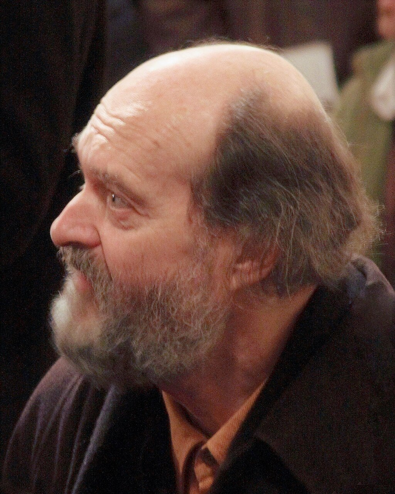
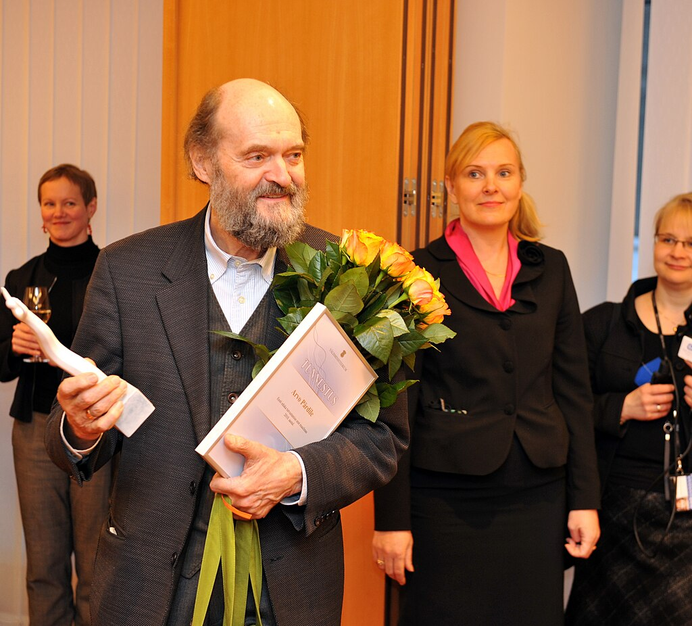
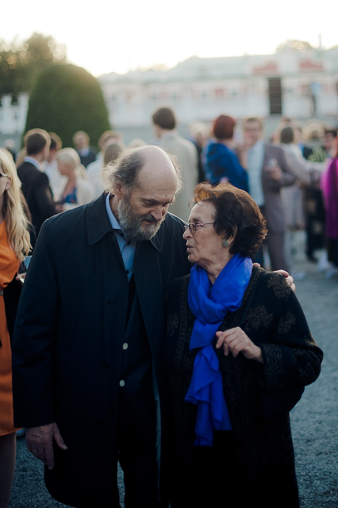

Arvo Pärt

Pärt at [Christ Church Cathedral, Dublin](https://en.wikipedia.org/wiki/Christ_Church_Cathedral,_Dublin "Christ Church Cathedral, Dublin"), 2008

Born

 (1935-09-11) 11 September 1935

[Paide](https://en.wikipedia.org/wiki/Paide "Paide"), [Järva County](https://en.wikipedia.org/wiki/Järva_County "Järva County"), [Estonia](https://en.wikipedia.org/wiki/History_of_Estonia_\(1920–1939\) "History of Estonia (1920–1939)")

Alma mater

[Estonian Academy of Music and Theatre](https://en.wikipedia.org/wiki/Estonian_Academy_of_Music_and_Theatre "Estonian Academy of Music and Theatre")

Occupation

Composer

Works

[List of compositions](https://en.wikipedia.org/wiki/List_of_compositions_by_Arvo_Pärt "List of compositions by Arvo Pärt")

Spouse

Nora Pärt

Children

[Michael Pärt](https://en.wikipedia.org/wiki/Michael_Pärt "Michael Pärt")

Awards

*   [American Academy of Arts and Letters](https://en.wikipedia.org/wiki/List_of_members_of_the_American_Academy_of_Arts_and_Letters_Department_of_Music#P "List of members of the American Academy of Arts and Letters Department of Music")
*   [Order of the National Coat of Arms](https://en.wikipedia.org/wiki/Order_of_the_National_Coat_of_Arms "Order of the National Coat of Arms")
*   [Brückepreis](https://en.wikipedia.org/wiki/Brückepreis "Brückepreis")
*   [Léonie Sonning Music Prize](https://en.wikipedia.org/wiki/Léonie_Sonning_Music_Prize "Léonie Sonning Music Prize")
*   [Légion d'honneur](https://en.wikipedia.org/wiki/Légion_d'honneur "Légion d'honneur")

**Arvo Pärt** (Estonian pronunciation:[\[ˈɑrvoˈpært\]](https://en.wikipedia.org/wiki/Help:IPA/Estonian "Help:IPA/Estonian"); born 11 September 1935) is an [Estonian](https://en.wikipedia.org/wiki/Estonia "Estonia") composer. Since the late 1970s, Pärt has worked in a [minimalist](https://en.wikipedia.org/wiki/Minimal_music "Minimal music") style that employs [tintinnabuli](https://en.wikipedia.org/wiki/Tintinnabuli "Tintinnabuli"), a compositional technique he invented. Pärt's music is in part inspired by [Gregorian chant](https://en.wikipedia.org/wiki/Gregorian_chant "Gregorian chant"). His most performed works include _[Fratres](https://en.wikipedia.org/wiki/Fratres "Fratres")_ (1977), _[Spiegel im Spiegel](https://en.wikipedia.org/wiki/Spiegel_im_Spiegel "Spiegel im Spiegel")_ (1978), and _[Für Alina](https://en.wikipedia.org/wiki/Für_Alina "Für Alina")_ (1976). From 2011 to 2018, and again in 2022 and 2025, Pärt was the most performed living composer in the world. The [Arvo Pärt Centre](https://en.wikipedia.org/wiki/Arvo_Pärt_Centre "Arvo Pärt Centre"), in [Laulasmaa](https://en.wikipedia.org/wiki/Laulasmaa "Laulasmaa"), was opened to the public in 2018.

## Early life, family and education

Pärt was born in [Paide](https://en.wikipedia.org/wiki/Paide "Paide") [Järva County](https://en.wikipedia.org/wiki/Järva_County "Järva County") Estonia, on 11. September 1935. He was raised by his mother and stepfather in [Rakvere](https://en.wikipedia.org/wiki/Rakvere "Rakvere") in northern Estonia. He began to experiment with the top and bottom notes of the family's piano as the middle register was damaged.

Pärt's musical education began at the age of seven when he began attending music school in Rakvere. By his early teenage years, Pärt was writing his own compositions. His first serious study came in 1954 at the Tallinn Music Middle School, but less than a year later he temporarily abandoned it to fulfill military service, playing [oboe](https://en.wikipedia.org/wiki/Oboe "Oboe") and percussion in the army band. After his military service he attended the [Tallinn Conservatory](https://en.wikipedia.org/wiki/Tallinn_Conservatory "Tallinn Conservatory"), where he studied composition with [Heino Eller](https://en.wikipedia.org/wiki/Heino_Eller "Heino Eller") and it was said of him, "he just seemed to shake his sleeves and the notes would fall out". During the 1950s, he also completed his first vocal composition, the [cantata](https://en.wikipedia.org/wiki/Cantata "Cantata") _Meie aed_ ('Our Garden') for children's choir and orchestra. He graduated in 1963.

## Career

As a student, Pärt composed music for film and the stage, creating scores for over fifty movies. Although filmmaking and film music were not primary sources of inspiration for him, these compositions provided a medium for exploring serial and tonal techniques—an amalgamation that would later influence his collage works of the 1960s. From 1957 to 1967, he worked as a sound producer for the Estonian public radio broadcaster [Eesti Rahvusringhääling](https://en.wikipedia.org/wiki/Eesti_Rahvusringhääling "Eesti Rahvusringhääling").

[Tikhon Khrennikov](https://en.wikipedia.org/wiki/Tikhon_Khrennikov "Tikhon Khrennikov") criticized Pärt in 1962 for employing [serialism](https://en.wikipedia.org/wiki/Serialism "Serialism") in _Nekrolog_ (1960), the first 12-tone music written in Estonia, which exhibited his "susceptibility to foreign influences". But nine months later Pärt won First Prize in a competition of 1,200 works, awarded by the all-_Union Society of Composers_, indicating the Soviet regime's inability to agree on what was permissible. His first overtly sacred piece, _Credo_ (1968), was a turning point in his career and life; on a personal level he had reached a creative crisis that led him to renounce the techniques and means of expression used so far; on a social level the religious nature of this piece resulted in him being unofficially censured and his music disappearing from concert halls. For the next eight years he composed very little, focusing instead on study of [medieval](/source/medieval-music/ "Medieval music") and [Renaissance music](/source/renaissance-music/ "Renaissance music") to find his new musical language. In 1972 he converted from [Lutheranism](https://en.wikipedia.org/wiki/Lutheranism "Lutheranism") to [Orthodox Christianity](https://en.wikipedia.org/wiki/Eastern_Orthodox_Church "Eastern Orthodox Church").

Pärt reemerged as a composer in 1976 with music in his new compositional style and technique, tintinnabuli.

On 10 December 2011, [Pope Benedict XVI](https://en.wikipedia.org/wiki/Pope_Benedict_XVI "Pope Benedict XVI") appointed Pärt a member of the [Pontifical Council for Culture](https://en.wikipedia.org/wiki/Pontifical_Council_for_Culture "Pontifical Council for Culture") for a five-year renewable term.

In 2014 _[The Daily Telegraph](https://en.wikipedia.org/wiki/The_Daily_Telegraph "The Daily Telegraph")_ described Pärt as possibly "the world's greatest living composer" and "by a long way, Estonia's most celebrated export". When asked how Estonian he felt his music to be, Pärt replied: "I don't know what is Estonian... I don't think about these things." Unlike many of his fellow Estonian composers, Pärt never found inspiration in the country's [national epic](https://en.wikipedia.org/wiki/National_epic "National epic"), _[Kalevipoeg](https://en.wikipedia.org/wiki/Kalevipoeg "Kalevipoeg")_, even in his early works. Pärt said, "My _Kalevipoeg_ is Jesus Christ."

## Music

### Overview

Familiar works by Pärt are _[Cantus in Memoriam Benjamin Britten](https://en.wikipedia.org/wiki/Cantus_in_Memoriam_Benjamin_Britten "Cantus in Memoriam Benjamin Britten")_ for [string orchestra](https://en.wikipedia.org/wiki/String_orchestra "String orchestra") and bell (1977) and the [string quintet](https://en.wikipedia.org/wiki/String_quintet "String quintet") _[Fratres](https://en.wikipedia.org/wiki/Fratres "Fratres") I_ (1977, revised 1983), which he transcribed for string orchestra and percussion, the solo violin "Fratres II" and the cello ensemble "Fratres III" (both 1980).

Pärt is often identified with the school of [minimalism](https://en.wikipedia.org/wiki/Minimalist_music "Minimalist music") and, more specifically, that of mystic minimalism or [holy minimalism](https://en.wikipedia.org/wiki/Holy_minimalism "Holy minimalism"). He is considered a pioneer of the latter style, along with contemporaries [Henryk Górecki](https://en.wikipedia.org/wiki/Henryk_Górecki "Henryk Górecki") and [John Tavener](https://en.wikipedia.org/wiki/John_Tavener "John Tavener"). Although his fame initially rested on instrumental works such as _[Tabula Rasa](https://en.wikipedia.org/wiki/Tabula_Rasa_\(Pärt\) "Tabula Rasa (Pärt)")_ and _[Spiegel im Spiegel](https://en.wikipedia.org/wiki/Spiegel_im_Spiegel "Spiegel im Spiegel")_, his [choral](https://en.wikipedia.org/wiki/Choral "Choral") works have also come to be widely appreciated.

In this period of Estonian history, Pärt was unable to encounter many musical influences from outside the Soviet Union except for a few illegal tapes and scores. Although Estonia had been an independent state at the time of Pärt's birth, the [Soviet Union occupied it in 1940](https://en.wikipedia.org/wiki/Soviet_occupation_of_Estonia "Soviet occupation of Estonia") as a result of the Soviet–[Nazi](https://en.wikipedia.org/wiki/Nazis "Nazis") [Molotov–Ribbentrop Pact](https://en.wikipedia.org/wiki/Molotov–Ribbentrop_Pact "Molotov–Ribbentrop Pact"); and the country would then remain under Soviet domination—except for the three-year period of German wartime occupation—for the next 51 years.

### Development

Pärt at the [Estonian Foreign Ministry](https://en.wikipedia.org/wiki/Ministry_of_Foreign_Affairs_\(Estonia\) "Ministry of Foreign Affairs (Estonia)") in 2011

Pärt's works are generally divided into two periods. He composed his early works using a range of [neo-classical](https://en.wikipedia.org/wiki/Neoclassicism_\(music\) "Neoclassicism (music)") styles influenced by [Shostakovich](https://en.wikipedia.org/wiki/Dmitri_Shostakovich "Dmitri Shostakovich"), [Prokofiev](https://en.wikipedia.org/wiki/Sergei_Prokofiev "Sergei Prokofiev"), and [Bartók](https://en.wikipedia.org/wiki/Béla_Bartók "Béla Bartók"). He then began to compose using [Schoenberg's](https://en.wikipedia.org/wiki/Arnold_Schoenberg "Arnold Schoenberg") [twelve-tone technique](https://en.wikipedia.org/wiki/Twelve-tone_technique "Twelve-tone technique") and serialism. This, however, not only earned the ire of the Soviet establishment but also proved to be a creative dead-end. When Soviet censors banned early works, Pärt entered the first of several periods of contemplative silence, during which he studied choral music from the 14th to 16th centuries. In this context, Pärt's biographer, [Paul Hillier](https://en.wikipedia.org/wiki/Paul_Hillier "Paul Hillier"), observed that "he had reached a position of complete despair in which the composition of music appeared to be the most futile of gestures, and he lacked the musical faith and willpower to write even a single note."

In his work _Credo_ (1968), written for solo piano, orchestra, and chorus, he employed [avant-garde](https://en.wikipedia.org/wiki/Avant-garde_music "Avant-garde music") techniques. This work differed in its forms and context from his earlier [atonal](https://en.wikipedia.org/wiki/Atonality "Atonality") and tintinnabula works. Inspired by 14th and 16th century liturgical music, he used a [poly-stylistic](https://en.wikipedia.org/wiki/Polystylism "Polystylism") compositional technique to express his faith in God while incorporating avant-garde techniques of the 20th century. By definition, a [credo](https://en.wikipedia.org/wiki/Credo "Credo") expresses beliefs and guides religious action, and in his work it represents his faith in God. The Soviets eventually banned the work due to its clear religious context, even though it incorporated avant-garde and a constructivist procedure.

The spirit of early European [polyphony](https://en.wikipedia.org/wiki/Polyphony#European_polyphony "Polyphony") informed the composition of Pärt's transitional [Third Symphony (1971)](https://en.wikipedia.org/wiki/Symphony_No._3_\(Pärt\) "Symphony No. 3 (Pärt)"); after that, he immersed himself in early music, reinvestigating the roots of Western music. He studied [plainsong](https://en.wikipedia.org/wiki/Plainsong "Plainsong"), [Gregorian chant](https://en.wikipedia.org/wiki/Gregorian_chant "Gregorian chant"), and the emergence of [polyphony](https://en.wikipedia.org/wiki/Polyphony "Polyphony") in the European [Renaissance](/source/renaissance-music/ "Renaissance music").

The music that began to emerge after this period was radically different. This period of new compositions included the 1977 works _[Fratres](https://en.wikipedia.org/wiki/Fratres "Fratres")_, _[Cantus in Memoriam Benjamin Britten](https://en.wikipedia.org/wiki/Cantus_in_Memoriam_Benjamin_Britten "Cantus in Memoriam Benjamin Britten")_ and _[Tabula Rasa](https://en.wikipedia.org/wiki/Tabula_Rasa_\(Pärt\) "Tabula Rasa (Pärt)")_. Pärt describes the music of this period as "[tintinnabuli](https://en.wikipedia.org/wiki/Tintinnabuli "Tintinnabuli")"—like the ringing of bells. _[Spiegel im Spiegel](https://en.wikipedia.org/wiki/Spiegel_im_Spiegel "Spiegel im Spiegel")_ (1978) is a well-known example used in many films. The music is characterised by simple [harmonies](https://en.wikipedia.org/wiki/Harmony "Harmony"), often single unadorned notes, or [triads](https://en.wikipedia.org/wiki/Chord_\(music\) "Chord (music)"), which form the basis of Western harmony. These are reminiscent of ringing bells. Tintinnabuli works are rhythmically simple and do not change tempo. In this technique, each syllable of a word is assigned to a pitch and a duration. Once two or three words have been connected, a phrase has been made. Another characteristic of Pärt's later works is that they are frequently settings for sacred texts, although he mostly chooses [Latin](https://en.wikipedia.org/wiki/Latin "Latin") or the [Church Slavonic language](https://en.wikipedia.org/wiki/Church_Slavonic_language "Church Slavonic language") used in Orthodox liturgy instead of his native [Estonian language](https://en.wikipedia.org/wiki/Estonian_language "Estonian language"). Large-scale works inspired by religious texts include _[Berliner Messe](https://en.wikipedia.org/wiki/Berliner_Messe "Berliner Messe")_, _[St. John Passion](https://en.wikipedia.org/wiki/Passio_\(Pärt\) "Passio (Pärt)")_ and _[Te Deum](https://en.wikipedia.org/wiki/Te_Deum_\(Pärt\) "Te Deum (Pärt)")_; the author of the famous text of _Litany_ is the 4th-century theologian [John Chrysostom](https://en.wikipedia.org/wiki/John_Chrysostom "John Chrysostom"). Choral works from this period include [_Magnificat_](https://en.wikipedia.org/wiki/Magnificat_\(Pärt\) "Magnificat (Pärt)") and _The Beatitudes_. Though such works have obviously been intended as religious, [Andreas Dorschel](https://en.wikipedia.org/wiki/Andreas_Dorschel "Andreas Dorschel") suggested that it is up for sociological scrutiny whether Pärt's music has led its 20th and 21st century audiences into religion or, rather, has replaced religion for them.

## Reception and later compositions

Pärt was the most performed living composer in the world from 2011 to 2018, 2022 and 2025. The years 2019 to 2021, 2023, 2024, he was the second-most performed composer, after film composer [John Williams](https://en.wikipedia.org/wiki/John_Williams "John Williams"). In 2025, during which Pärt's celebrated his 90th birthday, the most performed contemporary works were _Fratres_, _Da pacem Domine_, Magnificat, _Cantus in memoriam Benjamin Britten_.

Of Pärt's popularity, [Steve Reich](https://en.wikipedia.org/wiki/Steve_Reich "Steve Reich") has written:

> Even in Estonia, Arvo was getting the same feeling that we were all getting... I love his music, and I love the fact that he is such a brave, talented man… He's completely out of step with the [zeitgeist](https://en.wikipedia.org/wiki/Zeitgeist "Zeitgeist") and yet he's enormously popular, which is so inspiring. His music fulfills a deep human need that has nothing to do with fashion.

Pärt's music came to public attention in the West largely thanks to [Manfred Eicher](https://en.wikipedia.org/wiki/Manfred_Eicher "Manfred Eicher") who recorded several of Pärt's compositions for [ECM Records](https://en.wikipedia.org/wiki/ECM_Records "ECM Records") starting in 1984. Pärt wrote _[Cecilia, vergine romana](https://en.wikipedia.org/wiki/Cecilia,_vergine_romana "Cecilia, vergine romana")_ on an Italian text about life and martyrdom of [Saint Cecilia](https://en.wikipedia.org/wiki/Saint_Cecilia "Saint Cecilia"), the [patron saint](https://en.wikipedia.org/wiki/Patron_saint "Patron saint") of music, for choir and orchestra on a commission for the [Great Jubilee](https://en.wikipedia.org/wiki/Great_Jubilee "Great Jubilee") in Rome, where it was performed, close to her feast day on 22 November, by the [Accademia Nazionale di Santa Cecilia](https://en.wikipedia.org/wiki/Accademia_Nazionale_di_Santa_Cecilia "Accademia Nazionale di Santa Cecilia") conducted by [Myung-whun Chung](https://en.wikipedia.org/wiki/Myung-whun_Chung "Myung-whun Chung").

Invited by [Walter Fink](https://en.wikipedia.org/wiki/Walter_Fink "Walter Fink"), Pärt was the 15th composer featured in the annual [Komponistenporträt](https://en.wikipedia.org/wiki/Rheingau_Musik_Festival#Portraits_of_living_composers "Rheingau Musik Festival") of the [Rheingau Musik Festival](https://en.wikipedia.org/wiki/Rheingau_Musik_Festival "Rheingau Musik Festival") in 2005 in four concerts. Chamber music included _[Für Alina](https://en.wikipedia.org/wiki/Für_Alina "Für Alina")_ for piano, played by himself, _[Spiegel im Spiegel](https://en.wikipedia.org/wiki/Spiegel_im_Spiegel "Spiegel im Spiegel")_ and _Psalom_ for string quartet. The chamber orchestra of the [Bavarian Radio Symphony Orchestra](https://en.wikipedia.org/wiki/Bavarian_Radio_Symphony_Orchestra "Bavarian Radio Symphony Orchestra") played his _Trisagion_, _[Fratres](https://en.wikipedia.org/wiki/Fratres "Fratres")_ and _[Cantus](https://en.wikipedia.org/wiki/Cantus_in_Memoriam_Benjamin_Britten "Cantus in Memoriam Benjamin Britten")_ along with works of [J.S. Bach](/source/johann-sebastian-bach/ "Johann Sebastian Bach"). The [Windsbach Boys Choir](https://en.wikipedia.org/wiki/Windsbach_Boys_Choir "Windsbach Boys Choir") and soloists [Sibylla Rubens](https://en.wikipedia.org/wiki/Sibylla_Rubens "Sibylla Rubens"), [Ingeborg Danz](https://en.wikipedia.org/wiki/Ingeborg_Danz "Ingeborg Danz"), [Markus Schäfer](https://en.wikipedia.org/wiki/Markus_Schäfer "Markus Schäfer") and [Klaus Mertens](https://en.wikipedia.org/wiki/Klaus_Mertens "Klaus Mertens") performed _[Magnificat](https://en.wikipedia.org/wiki/Magnificat_\(Pärt\) "Magnificat (Pärt)")_ and _[Collage über B-A-C-H](https://en.wikipedia.org/wiki/Collage_sur_B-A-C-H "Collage sur B-A-C-H")_ together with two [Bach cantatas](https://en.wikipedia.org/wiki/Church_cantata_\(Bach\) "Church cantata (Bach)") and one by [Mendelssohn](https://en.wikipedia.org/wiki/Felix_Mendelssohn "Felix Mendelssohn"). The [Hilliard Ensemble](https://en.wikipedia.org/wiki/Hilliard_Ensemble "Hilliard Ensemble"), organist [Christopher Bowers-Broadbent](https://en.wikipedia.org/wiki/Christopher_Bowers-Broadbent "Christopher Bowers-Broadbent"), the [Rostock Motet Choir](https://en.wikipedia.org/wiki/Rostock_Motet_Choir "Rostock Motet Choir") and the Hilliard instrumental ensemble, conducted by Markus Johannes Langer, performed a program of Pärt's organ music and works for voices (some _a cappella_), including _[Pari intervallo](https://en.wikipedia.org/wiki/Pari_intervallo "Pari intervallo")_, [De profundis](https://en.wikipedia.org/wiki/De_profundis_\(Pärt\) "De profundis (Pärt)"), and [Miserere](https://en.wikipedia.org/wiki/Miserere_\(Pärt\) "Miserere (Pärt)"). Pärt's composition, _Für Lennart_, written for the memory of the Estonian President, [Lennart Meri](https://en.wikipedia.org/wiki/Lennart_Meri "Lennart Meri"), was played at Meri's funeral service on 26 March 2006.

Pärt with his wife Nora in 2012

In response to the [murder of the Russian investigative journalist Anna Politkovskaya](https://en.wikipedia.org/wiki/Assassination_of_Anna_Politkovskaya "Assassination of Anna Politkovskaya") in Moscow on 7 October 2006, Pärt declared that all of his works performed in 2006 and 2007 would be in honour of her death, issuing the following statement: "Anna Politkovskaya staked her entire talent, energy and—in the end—even her life on saving people who had become victims of the abuses prevailing in Russia."

Pärt was honoured as the featured composer of the 2008 [Raidió Teilifís Éireann](https://en.wikipedia.org/wiki/Raidió_Teilifís_Éireann "Raidió Teilifís Éireann") Living Music Festival in Dublin, Ireland. He was also commissioned by Louth Contemporary Music Society to compose a new choral work based on "[Saint Patrick's Breastplate](https://en.wikipedia.org/wiki/Saint_Patrick's_Breastplate "Saint Patrick's Breastplate")", which premiered in 2008 in [County Louth](https://en.wikipedia.org/wiki/County_Louth "County Louth"), Ireland. The new work, _[The Deer's Cry](https://en.wikipedia.org/wiki/The_Deer's_Cry_\(Pärt\) "The Deer's Cry (Pärt)")_, is his first Irish commission, and received its debut in [Drogheda](https://en.wikipedia.org/wiki/Drogheda "Drogheda") and [Dundalk](https://en.wikipedia.org/wiki/Dundalk "Dundalk") in February 2008.

Pärt's 2008 [Fourth Symphony is named _Los Angeles_](https://en.wikipedia.org/wiki/Symphony_No._4_\(Pärt\) "Symphony No. 4 (Pärt)") and was dedicated to [Mikhail Khodorkovsky](https://en.wikipedia.org/wiki/Mikhail_Khodorkovsky "Mikhail Khodorkovsky"). It was Pärt's first symphony written since his [Third Symphony](https://en.wikipedia.org/wiki/Symphony_No._3_\(Pärt\) "Symphony No. 3 (Pärt)") of 1971. It premiered in [Los Angeles](https://en.wikipedia.org/wiki/Los_Angeles "Los Angeles"), California, at the [Walt Disney Concert Hall](https://en.wikipedia.org/wiki/Walt_Disney_Concert_Hall "Walt Disney Concert Hall") on 10 January 2009, and was nominated for a [Grammy Award for Best Classical Contemporary Composition](https://en.wikipedia.org/wiki/Grammy_Award_for_Best_Classical_Contemporary_Composition "Grammy Award for Best Classical Contemporary Composition") in 2010.

On 26 January 2014, [Tõnu Kaljuste](https://en.wikipedia.org/wiki/Tõnu_Kaljuste "Tõnu Kaljuste"), conducting the [Estonian Philharmonic Chamber Choir](https://en.wikipedia.org/wiki/Estonian_Philharmonic_Chamber_Choir "Estonian Philharmonic Chamber Choir"), the Sinfonietta Riga, the [Tallinn Chamber Orchestra](https://en.wikipedia.org/wiki/Tallinn_Chamber_Orchestra "Tallinn Chamber Orchestra"), the [Latvian Radio Choir](https://en.wikipedia.org/wiki/Latvian_Radio_Choir "Latvian Radio Choir") and the Vox Clamantis ensemble, won a [Grammy for Best Choral Performance](https://en.wikipedia.org/wiki/Grammy_Award_for_Best_Choral_Performance "Grammy Award for Best Choral Performance") for a performance of Pärt's _[Adam's Lament](https://en.wikipedia.org/wiki/Adam's_Lament_\(Pärt\) "Adam's Lament (Pärt)")_. Describing aspects of Pärt's music as "[glocal](https://en.wikipedia.org/wiki/Glocal "Glocal")" in approach, Estonian musicologist Kerri Kotta noted that the composer "has been able to translate something very human into sound that crosses the borders normally separating people."

## Awards

*   1996 – [American Academy of Arts and Letters Department of Music](https://en.wikipedia.org/wiki/List_of_members_of_the_American_Academy_of_Arts_and_Letters_Department_of_Music#P "List of members of the American Academy of Arts and Letters Department of Music")
*   1996 – Honorary Doctor of Music, [University of Sydney](https://en.wikipedia.org/wiki/University_of_Sydney "University of Sydney")
*   1998 – Honorary Doctor of Arts, [University of Tartu](https://en.wikipedia.org/wiki/University_of_Tartu "University of Tartu")
*   2003 – Honorary Doctor of Music, [Durham University](https://en.wikipedia.org/wiki/Durham_University "Durham University")
*   2006 – [Order of the National Coat of Arms](https://en.wikipedia.org/wiki/Order_of_the_National_Coat_of_Arms "Order of the National Coat of Arms") 1st Class
*   2007 – [Brückepreis](https://en.wikipedia.org/wiki/Brückepreis "Brückepreis")
*   2008 – [Léonie Sonning Music Prize](https://en.wikipedia.org/wiki/Léonie_Sonning_Music_Prize "Léonie Sonning Music Prize"), Denmark
*   2008 – [Austrian Cross of Honour for Science and Art, First Class](https://en.wikipedia.org/wiki/Austrian_Decoration_for_Science_and_Art "Austrian Decoration for Science and Art")
*   2009 – Foreign Member, [Serbian Academy of Sciences and Arts](https://en.wikipedia.org/wiki/Serbian_Academy_of_Sciences_and_Arts "Serbian Academy of Sciences and Arts")
*   2010 – Honorary Doctor of Music, [University of St Andrews](https://en.wikipedia.org/wiki/University_of_St_Andrews "University of St Andrews")
*   2011 – Chevalier (Knight) of [Légion d'honneur](https://en.wikipedia.org/wiki/Légion_d'honneur "Légion d'honneur"), France
*   2011 – Membership of the [Pontifical Council for Culture](https://en.wikipedia.org/wiki/Pontifical_Council_for_Culture "Pontifical Council for Culture")
*   2013 – [Archon](https://en.wikipedia.org/wiki/Archons_of_the_Ecumenical_Patriarchate "Archons of the Ecumenical Patriarchate") of the [Ecumenical Patriarchate](https://en.wikipedia.org/wiki/Ecumenical_Patriarchate_of_Constantinople "Ecumenical Patriarchate of Constantinople")
*   2014 – Recipient of the [Praemium Imperiale](https://en.wikipedia.org/wiki/Praemium_Imperiale "Praemium Imperiale") award, Japan
*   2014 – Honorary Doctor of Sacred Music, [Saint Vladimir's Orthodox Theological Seminary](https://en.wikipedia.org/wiki/Saint_Vladimir's_Orthodox_Theological_Seminary "Saint Vladimir's Orthodox Theological Seminary")
*   2016 – Honorary Doctor of Music, [University of Oxford](https://en.wikipedia.org/wiki/University_of_Oxford "University of Oxford")
*   2017 – [Ratzinger Prize](https://en.wikipedia.org/wiki/Ratzinger_Prize "Ratzinger Prize"), Germany
*   2018 – Gold [Medal for Merit to Culture – Gloria Artis](https://en.wikipedia.org/wiki/Medal_for_Merit_to_Culture_–_Gloria_Artis "Medal for Merit to Culture – Gloria Artis"), Poland
*   2018 – Honorary Doctor of Music, [Fryderyk Chopin University of Music](https://en.wikipedia.org/wiki/Fryderyk_Chopin_University_of_Music "Fryderyk Chopin University of Music")
*   2019 – [Cross of Recognition](https://en.wikipedia.org/wiki/Cross_of_Recognition "Cross of Recognition"), 2nd Class, Latvia
*   2020 – [Frontiers of Knowledge Award](https://en.wikipedia.org/wiki/BBVA_Foundation_Frontiers_of_Knowledge_Awards "BBVA Foundation Frontiers of Knowledge Awards"), BBVA Foundation, Spain
*   2021 – [Order of Merit of the Federal Republic of Germany](https://en.wikipedia.org/wiki/Order_of_Merit_of_the_Federal_Republic_of_Germany "Order of Merit of the Federal Republic of Germany")
*   2022 – Officer of the [Order of the Oak Crown](https://en.wikipedia.org/wiki/Order_of_the_Oak_Crown "Order of the Oak Crown"), Luxembourg
*   2023 – [Polar Music Prize](https://en.wikipedia.org/wiki/Polar_Music_Prize "Polar Music Prize"), Sweden
*   2024 – Gold Medal of the [Royal Philharmonic Society](https://en.wikipedia.org/wiki/Royal_Philharmonic_Society "Royal Philharmonic Society")
*   2026 – [Goethe Medal](https://en.wikipedia.org/wiki/Goethe_Medal "Goethe Medal"), Germany

## Personal life

Pärt converted to Orthodox Christianity in 1972 upon marrying his second wife, Nora. Their son, [Michael Pärt](https://en.wikipedia.org/wiki/Michael_Pärt "Michael Pärt"), born in 1977, is a music producer and music editor.

In 1980, after a prolonged struggle with Soviet officials, he was allowed to emigrate with his wife and their two sons. He lived first in [Vienna](https://en.wikipedia.org/wiki/Vienna "Vienna"), where he took Austrian citizenship, and then relocated to [Berlin](https://en.wikipedia.org/wiki/Berlin "Berlin") in 1981. He returned to Estonia around the turn of the 21st century and for a while lived alternately in Berlin and [Tallinn](https://en.wikipedia.org/wiki/Tallinn "Tallinn"). He now resides in [Laulasmaa](https://en.wikipedia.org/wiki/Laulasmaa "Laulasmaa"), about 35 kilometres (22 mi) from Tallinn. He speaks fluent German as a result of living in German-speaking countries since 1980.

In 2010, the Pärt family established the [Arvo Pärt Centre](https://en.wikipedia.org/wiki/Arvo_Pärt_Centre "Arvo Pärt Centre"), an institution responsible for maintaining his personal archive, in the village of Laulasmaa. A new building of the centre opened to the visitors on 17 October 2018, containing a concert hall, a library, and research facilities. The centre also offers educational programmes for children and operates as an international information centre on Pärt's life and work.

In April 2020, although Pärt rarely gives interviews, he spoke to the Spanish newspaper [_ABC_](https://en.wikipedia.org/wiki/ABC_\(newspaper\) "ABC (newspaper)") about the [COVID-19 pandemic](https://en.wikipedia.org/wiki/COVID-19_pandemic "COVID-19 pandemic"), stating that it was a "mega [fast](https://en.wikipedia.org/wiki/Fasting "Fasting")" and reminded him to follow the example of [John Updike](https://en.wikipedia.org/wiki/John_Updike "John Updike"), who "once said that he tried to work with the same calm as the masters of the [Middle Ages](https://en.wikipedia.org/wiki/Middle_Ages "Middle Ages"), who carved the church pews in places where it was impossible to see them".

On 11 September 2025 he celebrated his 90th birthday.

## Citations and references

### Cited sources

*   [Hillier, Paul](https://en.wikipedia.org/wiki/Paul_Hillier "Paul Hillier"). (1997). _Arvo Pärt_. Oxford: [Oxford University Press](https://en.wikipedia.org/wiki/Oxford_University_Press "Oxford University Press"). [ISBN](https://en.wikipedia.org/wiki/ISBN_\(identifier\) "ISBN (identifier)") [978-0-19-816616-0](https://en.wikipedia.org/wiki/Special:BookSources/978-0-19-816616-0 "Special:BookSources/978-0-19-816616-0") (paper)
