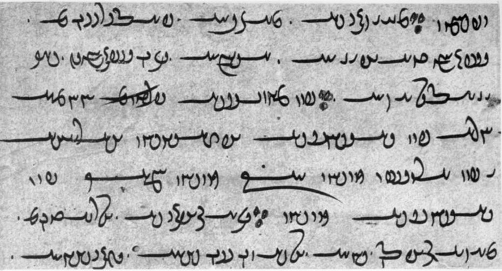
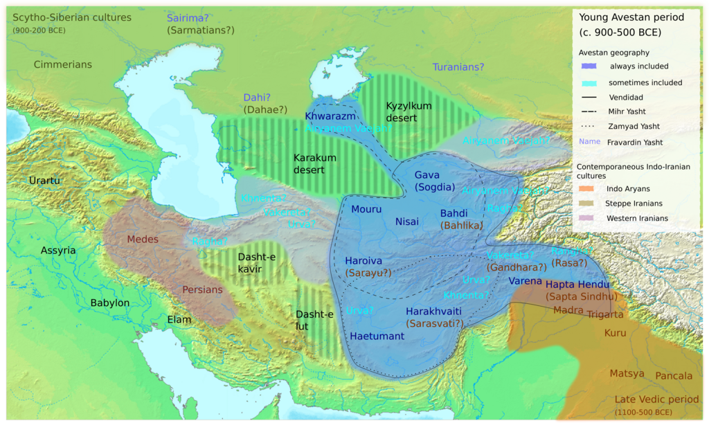

Avestan

_[Yasna](https://en.wikipedia.org/wiki/Yasna "Yasna")_ 28.1, [_Ahunavaiti_ Gatha](https://en.wikipedia.org/wiki/Gathas "Gathas") (Bodleian MS J2)

Region

[Central Asia](https://en.wikipedia.org/wiki/Central_Asia "Central Asia")

Era

[Late Bronze Age](https://en.wikipedia.org/wiki/Late_Bronze_Age "Late Bronze Age"), [Iron Age](https://en.wikipedia.org/wiki/Iron_Age "Iron Age")

[Language family](https://en.wikipedia.org/wiki/Language_family "Language family")

[Indo-European](https://en.wikipedia.org/wiki/Indo-European_languages "Indo-European languages")

*   [Indo-Iranian](https://en.wikipedia.org/wiki/Indo-Iranian_languages "Indo-Iranian languages")
    *   [Iranian](https://en.wikipedia.org/wiki/Iranian_languages "Iranian languages")
        *   **Avestan**

Early forms

[Proto-Indo-European](/source/proto-indo-european/ "Proto-Indo-European language")

*   [Proto-Indo-Iranian](https://en.wikipedia.org/wiki/Proto-Indo-Iranian_language "Proto-Indo-Iranian language")
    *   [Proto-Iranian](https://en.wikipedia.org/wiki/Proto-Iranian_language "Proto-Iranian language")

[Writing system](/source/writing-system/ "Writing system")

*   [Avestan alphabet](https://en.wikipedia.org/wiki/Avestan_alphabet "Avestan alphabet")
*   [Gujarati script](https://en.wikipedia.org/wiki/Gujarati_script "Gujarati script") (used by [Indian Zoroastrians](https://en.wikipedia.org/wiki/Zoroastrianism_in_India "Zoroastrianism in India"))

Official status

Official language in

Iraq Iran

Language codes

[ISO 639-1](https://en.wikipedia.org/wiki/ISO_639-1 "ISO 639-1")

`[ae](https://www.loc.gov/standards/iso639-2/php/langcodes_name.php?iso_639_1=ae)`

[ISO 639-2](https://en.wikipedia.org/wiki/ISO_639-2 "ISO 639-2")

`[ave](https://www.loc.gov/standards/iso639-2/php/langcodes_name.php?code_ID=36)`

[ISO 639-3](https://en.wikipedia.org/wiki/ISO_639-3 "ISO 639-3")

`[ave](https://iso639-3.sil.org/code/ave "iso639-3:ave")`

_[Glottolog](https://en.wikipedia.org/wiki/Glottolog "Glottolog")_

`[aves1237](https://glottolog.org/resource/languoid/id/aves1237)`

[Linguasphere](https://en.wikipedia.org/wiki/Linguasphere_Observatory "Linguasphere Observatory")

`[58-ABA-a](http://www.hortensj-garden.org/index.php?tnc=1&tr=lsr&nid=58-ABA-a)`

**Avestan** ([/əˈvɛstən/](https://en.wikipedia.org/wiki/Help:IPA/English "Help:IPA/English") [_ə-VESS-tən_](https://en.wikipedia.org/wiki/Help:Pronunciation_respelling_key "Help:Pronunciation respelling key")) is the [liturgical language](https://en.wikipedia.org/wiki/Liturgical_language "Liturgical language") of [Zoroastrianism](https://en.wikipedia.org/wiki/Zoroastrianism "Zoroastrianism"). It belongs to the [Iranian branch](https://en.wikipedia.org/wiki/Iranian_languages "Iranian languages") of the [Indo-European language family](https://en.wikipedia.org/wiki/Indo-European_languages "Indo-European languages") and was originally spoken during the [Avestan period](https://en.wikipedia.org/wiki/Avestan_period "Avestan period") (c. 1500 – c. 400 BCE) by the [Iranians](https://en.wikipedia.org/wiki/Arya_\(Iran\) "Arya (Iran)") living in eastern [Greater Iran](https://en.wikipedia.org/wiki/Greater_Iran "Greater Iran") as evidenced from names in [Avestan geography](https://en.wikipedia.org/wiki/Avestan_geography "Avestan geography").

After Avestan [became extinct](https://en.wikipedia.org/wiki/Language_death "Language death"), its [religious texts](https://en.wikipedia.org/wiki/Religious_text "Religious text") were transmitted [orally](https://en.wikipedia.org/wiki/Oral_literature "Oral literature"), then collected and [put into writing](https://en.wikipedia.org/wiki/Sasanian_Avesta "Sasanian Avesta") during the [Sasanian period](https://en.wikipedia.org/wiki/Sasanian_empire "Sasanian empire") (c. 400 – c. 500 CE). The [extant material](https://en.wikipedia.org/wiki/Avesta "Avesta") falls into two [groups](https://en.wikipedia.org/wiki/Variety_\(linguistics\) "Variety (linguistics)"): **Old Avestan** (c. 1500 – c. 900 BCE) and **Younger Avestan** (c. 900 – c. 400 BCE). The immediate ancestor of Old Avestan was the [Proto-Iranian language](https://en.wikipedia.org/wiki/Proto-Iranian_language "Proto-Iranian language"), a sister language to the [Proto-Indo-Aryan language](https://en.wikipedia.org/wiki/Proto-Indo-Aryan_language "Proto-Indo-Aryan language"), with both having developed from the earlier [Proto-Indo-Iranian language](https://en.wikipedia.org/wiki/Proto-Indo-Iranian_language "Proto-Indo-Iranian language"). As such, Old Avestan is quite close in both grammar and lexicon to [Vedic Sanskrit](https://en.wikipedia.org/wiki/Vedic_Sanskrit "Vedic Sanskrit"), the oldest preserved [Indo-Aryan language](https://en.wikipedia.org/wiki/Indo-Aryan_languages "Indo-Aryan languages").

## Name

The Avestan texts consistently use the term _[Arya](https://en.wikipedia.org/wiki/Arya_\(Iran\) "Arya (Iran)")_, "Iranian", for the speakers of Avestan. The same term also appears in ancient Persian and Greek sources as an umbrella term for Iranian languages. Despite this, the Avestan texts never use _Arya_, or any other term, specifically in reference to the language itself, and its native name therefore remains unknown.

The modern name _Avestan_ is instead derived from _[Avesta](https://en.wikipedia.org/wiki/Avesta "Avesta")_, which is the name of the written collection of the Avestan texts. This collection was created during the [Sasanian Empire](https://en.wikipedia.org/wiki/Sasanian_Empire "Sasanian Empire") period to complement the, up to then, purely [oral tradition](https://en.wikipedia.org/wiki/Oral_tradition "Oral tradition"). Like [Vedic](https://en.wikipedia.org/wiki/Vedic_Sanskrit "Vedic Sanskrit"), Avestan is therefore a language which is named after the text corpus in which it is used and simply means _language of the Avesta_. The name _Avesta_ comes from [Persian](https://en.wikipedia.org/wiki/Persian_language "Persian language") [اوستا](https://en.wiktionary.org/wiki/اوستا "wikt:اوستا") (avestâ) itself derived from [Middle Persian](https://en.wikipedia.org/wiki/Zoroastrian_Middle_Persian "Zoroastrian Middle Persian") _abestāg_. It might originate from a hypothetical Avestan term \*_upastāvaka_ (praise song). The language was sometimes called _Zend_ in older works, stemming from a misunderstanding of _[Zend](https://en.wikipedia.org/wiki/Zend "Zend")_ (commentaries and interpretations of Zoroastrian scripture) as referring to the Avesta itself, due to both often being bundled together as _Zend-Avesta_.

## Classification

Avestan is usually grouped into two variants: Old Avestan, also known as Gathic Avestan, and Young Avestan. More recently, some scholars have argued for a third intermediate stage called Middle Avestan, but this is not yet universally followed. Old Avestan is much more archaic than Young Avestan, especially in terms of its morphology. It is assumed that the two are separated by several centuries. In addition, Old Avestan differs dialectally, i.e. it is not the direct predecessor of Young Avestan but a closely related dialect. Despite these differences, Old and Young Avestan are usually interpreted as two different [variants](https://en.wikipedia.org/wiki/Variety_\(linguistics\) "Variety (linguistics)") of the same language instead of two different languages.

Avestan is an [Old Iranian](https://en.wikipedia.org/wiki/Old_Iranian "Old Iranian") language and, together with [Old Persian](https://en.wikipedia.org/wiki/Old_Persian "Old Persian"), one of the two languages from that period for which longer texts are available. Other known Old Iranian languages, like [Median](https://en.wikipedia.org/wiki/Median_language "Median language") and early [Scythian](https://en.wikipedia.org/wiki/Scythian_languages "Scythian languages"), are only known from isolated words and personal names. Young Avestan shows morphological and syntactical similarities with Old Persian, which may indicate that both were spoken around the same time. On the other hand, Old Avestan is substantially more archaic than either of these and largely agrees morphologically with [Vedic Sanskrit](https://en.wikipedia.org/wiki/Vedic_Sanskrit "Vedic Sanskrit"), i.e., the oldest known [Indo-Aryan language](https://en.wikipedia.org/wiki/Indo-Aryan_languages "Indo-Aryan languages"). This suggests that only a limited period of time has elapsed since the two separated from their common [Indo-Iranian](https://en.wikipedia.org/wiki/Indo-Iranian_languages "Indo-Iranian languages") ancestor.

Scholars traditionally classify Iranian languages as [Eastern](https://en.wikipedia.org/wiki/Eastern_Iranian_languages "Eastern Iranian languages") or [Western](https://en.wikipedia.org/wiki/Western_Iranian_languages "Western Iranian languages") according to certain grammatical features, and within this framework Avestan is sometimes classified as Eastern Old Iranian. However, as for instance [Sims-Williams](https://en.wikipedia.org/wiki/Nicholas_Sims-Williams "Nicholas Sims-Williams") and [Schmitt](https://en.wikipedia.org/wiki/Rüdiger_Schmitt "Rüdiger Schmitt") have pointed out, the east–west distinction is of limited meaning for Avestan, as the linguistic developments that later distinguish Eastern from Western Iranian had not yet occurred. Due to some shared developments with Median, Scholars like [Skjaervo](https://en.wikipedia.org/wiki/Prods_Oktor_Skjaervo "Prods Oktor Skjaervo") and [Windfuhr](https://en.wikipedia.org/wiki/Gernot_Ludwig_Windfuhr "Gernot Ludwig Windfuhr") have classified Avestan as a Central Iranian language.

## History

### Avestan as a native language

The Avestan language is only known from the Avesta and is otherwise unattested. As a result, there is no external evidence on which to base the time frame during which the Avestan language was natively spoken and all attempts have to rely on internal evidence. Such attempts were often linked to the life of [Zarathustra](https://en.wikipedia.org/wiki/Zarathustra "Zarathustra"), being the central figure of [Zoroastrianism](https://en.wikipedia.org/wiki/Zoroastrianism "Zoroastrianism"). Zarathustra was traditionally based in the 6th century BCE meaning that Old Avestan would have been spoken during the early [Achaemenid period](https://en.wikipedia.org/wiki/Achaemenid_Empire "Achaemenid Empire"). Given that a substantial time must have passed between Old Avestan and Young Avestan, the latter would have been spoken somewhere during the [Hellenistic](https://en.wikipedia.org/wiki/Hellenistic_period "Hellenistic period") or the [Parthian period](https://en.wikipedia.org/wiki/Parthian_empire "Parthian empire") of Iranian history.

However, more recent scholarship has increasingly shifted to an earlier dating. The literature presents a number of reasons for this shift, based on both the Old Avestan and the Young Avestan material. As regards Old Avestan, the [Gathas](https://en.wikipedia.org/wiki/Gatha_\(Zoroaster\) "Gatha (Zoroaster)") show strong linguistic and cultural similarities with the [Rigveda](https://en.wikipedia.org/wiki/Rigveda "Rigveda"), which in turn is assumed to represent the second half of the second millennium BCE. As regards Young Avestan, texts like the [Yashts](https://en.wikipedia.org/wiki/Yasht "Yasht") and the [Vendidad](https://en.wikipedia.org/wiki/Vendidad "Vendidad") are [situated](https://en.wikipedia.org/wiki/Avestan_geography "Avestan geography") in the eastern parts of [Greater Iran](https://en.wikipedia.org/wiki/Greater_Iran "Greater Iran") and lack any discernible [Persian](https://en.wikipedia.org/wiki/Achaemenid_Empire "Achaemenid Empire") or [Median](https://en.wikipedia.org/wiki/Median_Empire "Median Empire") influence from Western Iran. This is interpreted such that the bulk of this material, which has been produced several centuries after Zarathustra, must still predate the sixth century BCE. As a result, more recent scholarship often assumes that the major parts of the Young Avestan texts mainly reflect the first half of the first millennium BCE, whereas the Old Avestan texts of Zarathustra may have been composed around 1000 BCE or even as early as 1500 BCE.

It is not known at what point Avestan [ceased to be a spoken language](https://en.wikipedia.org/wiki/Language_death "Language death"). Even the Young Avestan texts are still quite archaic and show no signs of evolving into a hypothetical Middle Iranian stage of development. In addition, none of the known Middle Iranian languages are the successor of Avestan. The [Zend](https://en.wikipedia.org/wiki/Zend "Zend"), i.e., the [Middle Persian](https://en.wikipedia.org/wiki/Middle_Persian "Middle Persian") commentaries of the Avesta show that Avestan was no longer fully understood by the Zoroastrian commentators, indicating that it was no longer a living language by the late [Sasanian period](https://en.wikipedia.org/wiki/Sasanian_empire "Sasanian empire"). It has been suggested that the ancestor of [Pashto](https://en.wikipedia.org/wiki/Pashto "Pashto") was close to Old Avestan.

### Geographical distribution

Geographical distribution of the place names mentioned in the Avesta

There are no historical sources that connect Avestan or its native speakers with any specific region. In addition, the Old Avestan texts do not mention any place names that can be identified. On the other hand, the Younger Avestan texts contain a substantial number of [geographical references](https://en.wikipedia.org/wiki/Avestan_geography "Avestan geography") that are known from later sources and therefore allow to delineate the geographical horizon that was known and important to the speakers of Younger Avestan. It is nowadays widely accepted that these place names are situated in the eastern parts of [Greater Iran](https://en.wikipedia.org/wiki/Greater_Iran "Greater Iran") corresponding to the entirety of present-day [Afghanistan](https://en.wikipedia.org/wiki/Afghanistan "Afghanistan") and [Tajikistan](https://en.wikipedia.org/wiki/Tajikistan "Tajikistan") as well as parts of [Turkmenistan](https://en.wikipedia.org/wiki/Turkmenistan "Turkmenistan"), and [Uzbekistan](https://en.wikipedia.org/wiki/Uzbekistan "Uzbekistan"). Avestan is therefore assumed to have been spoken somewhere within this large region, although its precise location cannot be further specified.

Due to this geographical uncertainty, as well as the lack of any dateable historical events within the texts themselves, linking any given archeological culture with the speakers of Avestan has remained difficult. Among possible candidates, the [Yaz culture](https://en.wikipedia.org/wiki/Yaz_culture "Yaz culture") has been named as likely. This is due to the fact that it is connected with the southward spread of steppe-derived Iranic groups, the presence of farming practices consisted with the Young Avestan society and the lack of burial sites, indicating the Zoroastrian practice of [open air excarnation](https://en.wikipedia.org/wiki/Tower_of_Silence "Tower of Silence").

### Avestan as a liturgical language

Both Old and Young Avestan texts are assumed to have been composed by their respective native speakers and were possibly updated and revised for an extended period of time. At two different times, however, they became fixed, purely [liturgical](https://en.wikipedia.org/wiki/Sacred_language "Sacred language"), languages and were transmitted by [rote learning](https://en.wikipedia.org/wiki/Rote_learning "Rote learning"). Scholars like [Kellens](https://en.wikipedia.org/wiki/Jean_Kellens "Jean Kellens"), [Skjærvø](https://en.wikipedia.org/wiki/Prods_Oktor_Skjærvø "Prods Oktor Skjærvø") and [Hoffman](https://en.wikipedia.org/wiki/Karl_Hoffmann_\(linguist\) "Karl Hoffmann (linguist)") have identified a number of distinct stages of this transmission and how they changed the Avestan during its use as the sacred language of Zoroastrianism.

In the first stage, Old Avestan would have become the liturgical language of the early Zoroastrian community as described in the Young Avestan texts. [Karl Hoffmann](https://en.wikipedia.org/wiki/Karl_Hoffmann_\(linguist\) "Karl Hoffmann (linguist)") for instance identifies changes introduced due to slow [chanting](https://en.wikipedia.org/wiki/Cantillation "Cantillation"), the insertion of Young Avestan phonetic features into the material, attempts at standardizations as well as other editorial changes. The Young Avestan texts, however, were still produced, recomposed, and handed down during this time in a fluid oral tradition.

In the next stage, the Young Avestan texts crystallized as well meaning that both the Young and Old Avestan texts became the fixed, liturgical literature of non-Avestan Zoroastrian communities. The transmission of this literature largely took place in Western Iran as evidenced by alterations introduced by native Persian speakers. In addition, different scholars have tried to identify other dialects that may have impacted the pronunciation of certain Avestan features during the transmission, possibly before they reached [Persia](https://en.wikipedia.org/wiki/Persis "Persis"). Some Young Avestan texts, like the [Vendidad](https://en.wikipedia.org/wiki/Vendidad "Vendidad"), show ungrammatical features and may have been partly recomposed by non-Avestan speakers.

The purely oral transmission came to an end during the 5th or 6th century CE, when the Avestan corpus was committed to written form. This was achieved through the creation of the [Avestan alphabet](https://en.wikipedia.org/wiki/Avestan_alphabet "Avestan alphabet") resulting in the [Sasanian Avesta](https://en.wikipedia.org/wiki/Sasanian_Avesta "Sasanian Avesta"). Despite this, the post Sasanian written transmission saw a further deterioration of the Avestan texts. A large portion of the literature was lost after the 10th century CE and the surviving texts show signs of incorrect pronunciations and copying errors.

Many phonetic features cannot be ascribed with certainty to a particular stage since there may be more than one possibility. Every phonetic form that can be ascribed to the Sasanian archetype on the basis of critical assessment of the manuscript evidence must have gone through the stages mentioned above so that "Old Avestan" and "Young Avestan" really mean no more than "Old Avestan and Young Avestan of the [Sasanian period](https://en.wikipedia.org/wiki/Sasanid_Empire "Sasanid Empire")".

## Alphabet

[Mazdayasnā](https://en.wikipedia.org/wiki/Zoroastrianism "Zoroastrianism") written in the [Avestan alphabet](https://en.wikipedia.org/wiki/Avestan_alphabet "Avestan alphabet")

The script used for writing Avestan developed during the 3rd or 4th century CE. By then the language had been extinct for many centuries, and remained in use only as a liturgical language of the Avesta canon. As is still the case today, the liturgies were memorized by the priesthood and recited by rote.

The script devised to render Avestan was natively known as _[Din dabireh](https://en.wikipedia.org/wiki/Avestan_alphabet "Avestan alphabet")_ "religion writing". It has 53 distinct characters and is written right-to-left. Among the 53 characters are about 30 letters that are – through the addition of various loops and flourishes – variations of the 13 graphemes of the [cursive Pahlavi script](https://en.wikipedia.org/wiki/Pahlavi_scripts "Pahlavi scripts") (i.e. [Book Pahlavi](https://en.wikipedia.org/wiki/Book_Pahlavi "Book Pahlavi")) that is known from the post-Sasanian texts of Zoroastrian tradition. These symbols, like those of all the Pahlavi scripts, are in turn based on [Aramaic script](https://en.wikipedia.org/wiki/Aramaic_script "Aramaic script") symbols. Avestan also incorporates several letters from other writing systems, most notably the vowels, which are mostly derived from Greek minuscules. A few letters were free inventions, as were also the symbols used for punctuation. Also, the Avestan alphabet has one letter that has no corresponding sound in the Avestan language; the character for /l/ (a sound that Avestan does not have) was added to write [Pazend](https://en.wikipedia.org/wiki/Pazend "Pazend") texts.

The Avestan script is [alphabetic](https://en.wikipedia.org/wiki/Alphabet "Alphabet"), and the large number of letters suggests that its design was due to the need to render the orally recited texts with high phonetic precision. The correct enunciation of the liturgies was (and still is) considered necessary for the prayers to be effective.

The Zoroastrians of India, who represent one of the largest surviving Zoroastrian communities worldwide, also transcribe Avestan in [Brahmi](https://en.wikipedia.org/wiki/Brāhmī_script "Brāhmī script")-based scripts. This is a relatively recent development first seen in the c. 12th century texts of Neryosang Dhaval and other Parsi Sanskritist theologians of that era, which are roughly contemporary with the oldest surviving manuscripts in Avestan script. Today, Avestan is most commonly typeset in the [Gujarati script](https://en.wikipedia.org/wiki/Gujarati_script "Gujarati script") ([Gujarati](https://en.wikipedia.org/wiki/Gujarati_language "Gujarati language") being the traditional language of the Indian Zoroastrians). Some Avestan letters with no corresponding symbol are synthesized with additional diacritical marks, for example, the /z/ in _zaraθuštra_ is written with _j_ with a dot below.

## Phonology

Avestan has retained voiced sibilants, and has fricative rather than aspirate series. There are various conventions for transliteration of the [Avestan alphabet](https://en.wikipedia.org/wiki/Avestan_alphabet "Avestan alphabet"), the one adopted for this article being:

Vowels:

: a ā ə ə̄ e ē o ō å ą i ī u ū

Consonants:

: k g γ x xʷ č ǰ t d δ θ t̰ p b β f : ŋ ŋʷ ṇ ń n m y w r s z š ṣ̌ ž h

The glides _y_ and _w_ are often transcribed as <_ii_\> and <_uu_\>. The letter transcribed <_t̰_\> indicates an allophone of /t/ with [no audible release](https://en.wikipedia.org/wiki/No_audible_release "No audible release") at the end of a word and before certain [obstruents](https://en.wikipedia.org/wiki/Obstruent "Obstruent").

### Consonants

[Labial](https://en.wikipedia.org/wiki/Labial_consonant "Labial consonant")[Dental](https://en.wikipedia.org/wiki/Dental_consonant "Dental consonant")[Alveolar](https://en.wikipedia.org/wiki/Alveolar_consonant "Alveolar consonant")[Post-alveolar](https://en.wikipedia.org/wiki/Postalveolar_consonant "Postalveolar consonant")[Retroflex](https://en.wikipedia.org/wiki/Retroflex_consonant "Retroflex consonant")[Palatal](https://en.wikipedia.org/wiki/Palatal_consonant "Palatal consonant") or
[alveolo-palatal](https://en.wikipedia.org/wiki/Alveolo-palatal_consonant "Alveolo-palatal consonant")[Velar](https://en.wikipedia.org/wiki/Velar_consonant "Velar consonant")[Labiovelar](https://en.wikipedia.org/wiki/Labialized_velar_consonant "Labialized velar consonant")[Glottal](https://en.wikipedia.org/wiki/Glottal_consonant "Glottal consonant")

[Nasal](https://en.wikipedia.org/wiki/Nasal_consonant "Nasal consonant")

⟨m⟩ /[m](https://en.wikipedia.org/wiki/Voiced_bilabial_nasal "Voiced bilabial nasal")/

⟨n⟩ /[n](https://en.wikipedia.org/wiki/Voiced_alveolar_nasal "Voiced alveolar nasal")/

⟨ń⟩ /[ɲ](https://en.wikipedia.org/wiki/Voiced_palatal_nasal "Voiced palatal nasal")/

⟨ŋ⟩ /[ŋ](https://en.wikipedia.org/wiki/Voiced_velar_nasal "Voiced velar nasal")/

⟨ŋʷ⟩ /[ŋʷ](https://en.wikipedia.org/wiki/Labialization "Labialization")/

[Plosive](https://en.wikipedia.org/wiki/Stop_consonant "Stop consonant")[voiceless](https://en.wikipedia.org/wiki/Voicelessness "Voicelessness")

⟨p⟩ /[p](https://en.wikipedia.org/wiki/Voiceless_bilabial_plosive "Voiceless bilabial plosive")/

⟨t⟩ /[t](https://en.wikipedia.org/wiki/Voiceless_alveolar_plosive "Voiceless alveolar plosive")/

⟨č⟩ /[tʃ](https://en.wikipedia.org/wiki/Voiceless_postalveolar_affricate "Voiceless postalveolar affricate")/

⟨k⟩ /[k](https://en.wikipedia.org/wiki/Voiceless_velar_plosive "Voiceless velar plosive")/

[voiced](https://en.wikipedia.org/wiki/Voice_\(phonetics\) "Voice (phonetics)")

⟨b⟩ /[b](https://en.wikipedia.org/wiki/Voiced_bilabial_plosive "Voiced bilabial plosive")/

⟨d⟩ /[d](https://en.wikipedia.org/wiki/Voiced_alveolar_plosive "Voiced alveolar plosive")/

⟨ǰ⟩ /[dʒ](https://en.wikipedia.org/wiki/Voiced_postalveolar_affricate "Voiced postalveolar affricate")/

⟨g⟩ /[ɡ](https://en.wikipedia.org/wiki/Voiced_velar_plosive "Voiced velar plosive")/

[Fricative](https://en.wikipedia.org/wiki/Fricative_consonant "Fricative consonant")[voiceless](https://en.wikipedia.org/wiki/Voicelessness "Voicelessness")

⟨f⟩ /[ɸ](https://en.wikipedia.org/wiki/Voiceless_bilabial_fricative "Voiceless bilabial fricative")/

⟨θ⟩ /[θ](https://en.wikipedia.org/wiki/Voiceless_dental_fricative "Voiceless dental fricative")/

⟨s⟩ /[s](https://en.wikipedia.org/wiki/Voiceless_alveolar_fricative "Voiceless alveolar fricative")/

⟨š⟩ /[ʃ](https://en.wikipedia.org/wiki/Voiceless_postalveolar_fricative "Voiceless postalveolar fricative")/

⟨ṣ̌⟩ /[ʂ](https://en.wikipedia.org/wiki/Voiceless_retroflex_fricative "Voiceless retroflex fricative")/

⟨š́⟩ /[ɕ](https://en.wikipedia.org/wiki/Voiceless_alveolo-palatal_fricative "Voiceless alveolo-palatal fricative")/

⟨x⟩ /[x](https://en.wikipedia.org/wiki/Voiceless_velar_fricative "Voiceless velar fricative")/

⟨xʷ⟩ /[xʷ](https://en.wikipedia.org/wiki/Voiceless_labial–velar_fricative "Voiceless labial–velar fricative")/

⟨h⟩ /[h](https://en.wikipedia.org/wiki/Voiceless_glottal_fricative "Voiceless glottal fricative")/

[voiced](https://en.wikipedia.org/wiki/Voice_\(phonetics\) "Voice (phonetics)")

⟨β⟩ /[β](https://en.wikipedia.org/wiki/Voiced_bilabial_fricative "Voiced bilabial fricative")/

⟨δ⟩ /[ð](https://en.wikipedia.org/wiki/Voiced_dental_fricative "Voiced dental fricative")/

⟨z⟩ /[z](https://en.wikipedia.org/wiki/Voiced_alveolar_fricative "Voiced alveolar fricative")/

⟨ž⟩ /[ʒ](https://en.wikipedia.org/wiki/Voiced_postalveolar_fricative "Voiced postalveolar fricative")/

⟨γ⟩ /[ɣ](https://en.wikipedia.org/wiki/Voiced_velar_fricative "Voiced velar fricative")/

[Approximant](https://en.wikipedia.org/wiki/Approximant_consonant "Approximant consonant")

⟨y⟩ /[j](https://en.wikipedia.org/wiki/Voiced_palatal_approximant "Voiced palatal approximant")/

⟨v⟩ /[w](https://en.wikipedia.org/wiki/Voiced_labial–velar_approximant "Voiced labial–velar approximant")/

[Trill](https://en.wikipedia.org/wiki/Trill_consonant "Trill consonant")

⟨r⟩ /[r](https://en.wikipedia.org/wiki/Voiced_alveolar_trill "Voiced alveolar trill")/

According to Beekes, \[ð\] and \[ɣ\] are allophones of /θ/ and /x/ respectively (in Old Avestan).

### Vowels

[Front](https://en.wikipedia.org/wiki/Front_vowel "Front vowel")[Central](https://en.wikipedia.org/wiki/Central_vowel "Central vowel")[Back](https://en.wikipedia.org/wiki/Back_vowel "Back vowel")

[short](https://en.wikipedia.org/wiki/Short_vowel "Short vowel")[long](https://en.wikipedia.org/wiki/Long_vowel "Long vowel")[short](https://en.wikipedia.org/wiki/Short_vowel "Short vowel")[long](https://en.wikipedia.org/wiki/Long_vowel "Long vowel")[short](https://en.wikipedia.org/wiki/Short_vowel "Short vowel")[long](https://en.wikipedia.org/wiki/Long_vowel "Long vowel")

[Close](https://en.wikipedia.org/wiki/Close_vowel "Close vowel")

[i](https://en.wikipedia.org/wiki/Close_front_unrounded_vowel "Close front unrounded vowel") ⟨i⟩

[iː](https://en.wikipedia.org/wiki/Close_front_unrounded_vowel "Close front unrounded vowel") ⟨ī⟩

[u](https://en.wikipedia.org/wiki/Close_back_rounded_vowel "Close back rounded vowel") ⟨u⟩

[uː](https://en.wikipedia.org/wiki/Close_back_rounded_vowel "Close back rounded vowel") ⟨ū⟩

[Mid](https://en.wikipedia.org/wiki/Mid_vowel "Mid vowel")

[e](https://en.wikipedia.org/wiki/Close-mid_front_unrounded_vowel "Close-mid front unrounded vowel") ⟨e⟩

[eː](https://en.wikipedia.org/wiki/Close-mid_front_unrounded_vowel "Close-mid front unrounded vowel") ⟨ē⟩

[ə](https://en.wikipedia.org/wiki/Mid_central_vowel "Mid central vowel") ⟨ə⟩

[əː](https://en.wikipedia.org/wiki/Mid_central_vowel "Mid central vowel") ⟨ə̄⟩

[o](https://en.wikipedia.org/wiki/Close-mid_back_rounded_vowel "Close-mid back rounded vowel") ⟨o⟩

[oː](https://en.wikipedia.org/wiki/Close-mid_back_rounded_vowel "Close-mid back rounded vowel") ⟨ō⟩

[Open](https://en.wikipedia.org/wiki/Open_vowel "Open vowel")

[a](https://en.wikipedia.org/wiki/Open_front_unrounded_vowel "Open front unrounded vowel") ⟨a⟩

[aː](https://en.wikipedia.org/wiki/Open_front_unrounded_vowel "Open front unrounded vowel") ⟨ā⟩

[ɒ](https://en.wikipedia.org/wiki/Open_back_rounded_vowel "Open back rounded vowel") ⟨å⟩

[ɒː](https://en.wikipedia.org/wiki/Open_back_rounded_vowel "Open back rounded vowel") ⟨ā̊⟩

[Nasal](https://en.wikipedia.org/wiki/Nasal_vowel "Nasal vowel")

[ã](https://en.wikipedia.org/wiki/Nasal_vowel "Nasal vowel") ⟨ą⟩

[ãː](https://en.wikipedia.org/wiki/Nasal_vowel "Nasal vowel") ⟨ą̇⟩

## Grammar

### Nouns

Case"normal" endingsa-stems: (masc. neut.)

SingularDualPluralSingularDualPlural

Nominative

-s

-ā

-ō (-as), -ā

-ō (yasn-ō)

-a (vīr-a)

-a (-yasna)

Vocative

–

-a (ahur-a)

-a (yasn-a), -ånghō

Accusative

-əm

-ō (-as, -ns), -ā

-əm (ahur-əm)

-ą (haom-ą)

Instrumental

-ā

-byā

-bīš

-a (ahur-a)

-aēibya (vīr-aēibya)

-āiš (yasn-āiš)

Dative

-ē

-byō (-byas)

-āi (ahur-āi)

-aēibyō (yasn-aēibyō)

Ablative

-at

-byō

-āt (yasn-āt)

Genitive

-ō (-as)

-å

-ąm

-ahe (ahur-ahe)

-ayå (vīr-ayå)

-anąm (yasn-anąm)

Locative

-i

-ō, -yō

-su, -hu, -šva

-e (yesn-e)

-ayō (zast-ayō)

-aēšu (vīr-aēšu), -aēšva

### Verbs

Primary active endings

PersonSingularDualPlural

1st

-mi

-vahi

-mahi

2nd

-hi

-tha

-tha

3rd

-ti

-tō, -thō

-ṇti

## Sample text

Latin alphabet
Avestan alphabet
English Translation

_ahyā. yāsā. nəmaŋhā. ustānazastō. rafəδrahyā.manyə̄uš. mazdā. pourwīm. spəṇtahyā. aṣ̌ā. vīspə̄ṇg. š́yaoθanā.vaŋhə̄uš. xratūm. manaŋhō. yā. xṣ̌nəwīṣ̌ā. gə̄ušcā. urwānəm.::_

!

With outspread hands in petition for that help, O Mazda, I will pray for the works of the holy spirit, O thou the Right, whereby I may please the will of Good Thought and the Ox-Soul.

## Example phrases

The following phrases were [phonetically transcribed](https://en.wikipedia.org/wiki/Phonetic_transcription "Phonetic transcription") from Avestan:

AvestanEnglishComment

tapaiti

It's hot

Can also mean "he is hot" or "she is hot" (in temperature)

šyawaθa

You move

vō vatāmi

I understand you

mā vātayaθa

You teach me

Literally: "You let me understand"

dim nayehi

Thou leadest him/her

dim vō nāyayeiti

He/she lets you lead him/her

Present tense

mā barahi

Thou carryest me

nō baraiti

He/she carries us

θβā dim bārayāmahi

We let him/her carry thee

Present tense

drawāmahi

We run

dīš drāwayāmahi

We let them run

Present tense

θβā hacāmi

I follow thee

dīš hācayeinti

They accompany them

Literally: "They let them follow"

ramaiti

He rests

θβā rāmayemi

I calm thee

Literally: "I let thee rest"
