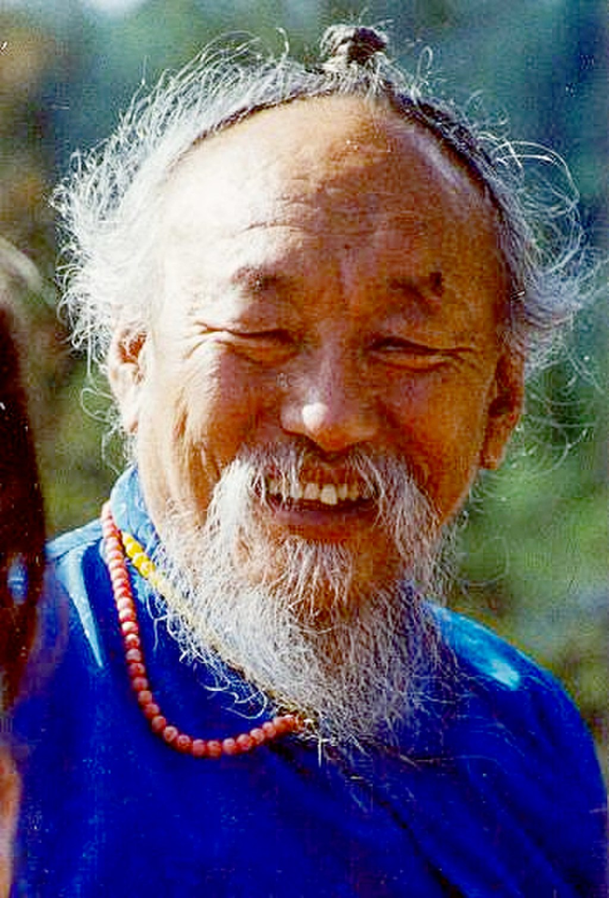
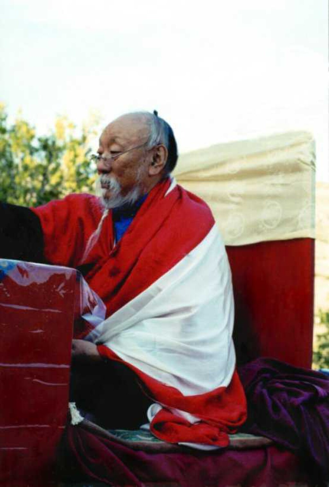

Chagdud Tulku RinpocheChagdud Tulku Rinpoche - April 2001

**Chagdud Tulku** ([Tibetan](https://en.wikipedia.org/wiki/Tibetan_script "Tibetan script"): ལྕགས་མདུད་, [Wylie](https://en.wikipedia.org/wiki/Wylie_transliteration "Wylie transliteration"): lcags mdud, 1930–2002) was a Tibetan teacher of the [Nyingma](/source/nyingma/ "Nyingma") school of [Vajrayana](/source/vajrayana/ "Vajrayana") [Tibetan Buddhism](https://en.wikipedia.org/wiki/Tibetan_Buddhism "Tibetan Buddhism"). He was known and respected in the West for his teachings, his melodic chanting voice, his artistry as a sculptor and painter, and his skill as a physician. He acted as a spiritual guide for thousands of students worldwide. He was the sixteenth [tülku](https://en.wikipedia.org/wiki/Tulku "Tulku") of the Chagdud line.

Chagdud Gonpa centers practice Tibetan Buddhism, primarily in the Nyingma tradition of [Padmasambhava](/source/padmasambhava/ "Padmasambhava").

## Early life

Chagdud Tulku Rinpoche was born Padma Gargyi Wangchuk in the Tromtar region of [Kham](https://en.wikipedia.org/wiki/Kham "Kham") eastern Tibet in 1930. His father was Sera Khato Tulku, a [lama](https://en.wikipedia.org/wiki/Lama "Lama") in the [Gelug](https://en.wikipedia.org/wiki/Gelug "Gelug") school of [Tibetan Buddhism](https://en.wikipedia.org/wiki/Tibetan_Buddhism "Tibetan Buddhism"). His mother was Dawa Drolma, who was widely considered to be an emanation of [Tara](https://en.wikipedia.org/wiki/Tara_\(Buddhism\) "Tara (Buddhism)") and was from a [Sakya](https://en.wikipedia.org/wiki/Sakya "Sakya") family, and had a profound influence on her son's spiritual life.

By the time he was three years old, he was recognized as the incarnation of the previous Chagdud Tulku, and soon thereafter traveled to Temp'hel Gonpa, a monastery about two or three days by horseback from Tromtar. As he recounts in his autobiography, _The Lord Of The Dance_:

> For the next seven years, until I went into three year retreat at the age of eleven, my life would alternate between periods of strict discipline in which my every move would be under the surveillance of my tutors and interludes in which my suppressed energies would explode. Throughout, I had many visions, many clairvoyant experiences, many extraordinary dreams, and within these, I sometimes had glimpses of absolute open awareness.

After this retreat he received numerous teachings, empowerments, and oral transmissions, from various spiritual masters. One of them, Sechen Rabjam Rinpoche, told him that [Tara](https://en.wikipedia.org/wiki/Tara_\(Buddhism\) "Tara (Buddhism)") [meditation](https://en.wikipedia.org/wiki/Meditation "Meditation") would be one of his major practices.

In 1945, shortly after completing his first three-year retreat, he went to see [Dzongsar Khyentse Chökyi Lodrö](https://en.wikipedia.org/wiki/Dzongsar_Khyentse_Chökyi_Lodrö "Dzongsar Khyentse Chökyi Lodrö"). From him, Chagdud tulku received the rinchen terdzö ([Tibetan](https://en.wikipedia.org/wiki/Tibetan_script "Tibetan script"): རིན་ཆེན་གཏེར་མཛོད་) empowerments and met [Dilgo Khyentse](/source/dilgo-khyentse/ "Dilgo Khyentse"), who was also attending. By 1946 he entered his second three-year retreat, this time under the guidance of the Tromge Trungpa Rinpoche. Near the conclusion of this retreat, the death of Tromge Trungpa forced him to leave before its completion. He then returned to Chagdud Gompa in Nyagrong, and after staying there for a while, proceeded on a pilgrimage to [Lhasa](https://en.wikipedia.org/wiki/Lhasa "Lhasa") with an entourage of monks. He then did an extended retreat at [Samye](https://en.wikipedia.org/wiki/Samye "Samye"), the monastery built by [Padmasambhava](/source/padmasambhava/ "Padmasambhava"), and afterwards attended empowerments given by [Dudjom Jigdral Yeshe Dorje](/source/dudjom-rinpoche/ "Dudjom Jigdral Yeshe Dorje"), who became a main teacher as well as a source of spiritual inspiration for him.

After this in 1957 he stayed for a year in Lhasa, Tibet, in the same household as Khenpo Dorje, whom he regarded as his root lama. Among his other teachers were Shechen Kongtrul, Tulku Arig and Dudjom Jigdral Yeshe Dorje.

During 1958, his last year in Tibet, Chagdud Tulku was advised to marry in order to have a companion and helper in the unsettled times to come. He later wed Karma Drolma, the daughter of a wealthy landowner in Kongpo. Later, in exile in India, they had a son and a daughter, Jigme Tromge and Dawa Lhamo Tromge.

## Life in exile from Tibet

Following the [Tibetan Uprising](https://en.wikipedia.org/wiki/1959_Tibetan_uprising "1959 Tibetan uprising") in 1959, Chagdud Tulku escaped along with Khenpo Dorje to [India](https://en.wikipedia.org/wiki/India "India"), after enduring hunger, and many dangers, where it looked like they would be captured. His route took him through the Pemakö region of Tibet, and his party came out from there into the Indian state of [Nagaland](https://en.wikipedia.org/wiki/Nagaland "Nagaland"). In India Rinpoche lived in a number of Tibetan refugee resettlement camps ─ [Kalimpong](https://en.wikipedia.org/wiki/Kalimpong "Kalimpong"), [Odisha](https://en.wikipedia.org/wiki/Odisha "Odisha"), [Dalhousie](https://en.wikipedia.org/wiki/Dalhousie,_India "Dalhousie, India"), [Bir, Himachal Pradesh](https://en.wikipedia.org/wiki/Bir,_Himachal_Pradesh "Bir, Himachal Pradesh"), and [Delhi](https://en.wikipedia.org/wiki/Delhi "Delhi"). He practiced [traditional Tibetan medicine](https://en.wikipedia.org/wiki/Traditional_Tibetan_medicine "Traditional Tibetan medicine"), and was much in demand as his fellow refugees had trouble coping with the heat, and subtropical diseases found in India.

A year or two after his arrival in India, Rinpoche entered a retreat in Tso Pema, a lake sacred to Padmasambhava, located near the city of [Mandi, Himachal Pradesh](https://en.wikipedia.org/wiki/Mandi,_Himachal_Pradesh "Mandi, Himachal Pradesh"). At this location he met Jangchub Dorje, a primary disciple of Apong Terton and a lineage holder of this great [tertön](https://en.wikipedia.org/wiki/Tertön "Tertön")'s [Red Tara](https://en.wikipedia.org/wiki/Red_Tara "Red Tara") cycle. Jangchub Dorje gave him empowerments for the Red Tara cycle, and then he re-entered into retreat and signs of accomplishment in the practices came very swiftly. Later, when he began teaching in the West, the Red Tara [sādhanā](https://en.wikipedia.org/wiki/Sādhanā "Sādhanā") became the meditation most extensively practiced by his Western students.

While he was living in Bir, Himachal Pradesh, circumstances there gradually led to an estrangement with Karma Drolma, and eventually they separated.

After giving a teaching in [Kulu Manali](https://en.wikipedia.org/wiki/Kulu_Manali "Kulu Manali"), the [14th Dalai Lama](https://en.wikipedia.org/wiki/14th_Dalai_Lama "14th Dalai Lama") extended an invitation for Rinpoche to go to the United States and teach, contingent upon him getting a visa. It was at this time that he moved to [Delhi](https://en.wikipedia.org/wiki/Delhi "Delhi"), and lived in [Majnu-ka-tilla](https://en.wikipedia.org/wiki/Majnu-ka-tilla "Majnu-ka-tilla"), a Tibetan camp on the banks of the [Yamuna](https://en.wikipedia.org/wiki/Yamuna "Yamuna"). The process of trying to get a visa went on for three years, and was ultimately unsuccessful. During this time period he met his first Western students, but he also caught [malaria](https://en.wikipedia.org/wiki/Malaria "Malaria") and nearly died, and was saved by an Indian doctor who finally made the correct diagnosis of what was ailing him.

In the fall of 1977 empowerment cycles were given in [Kathmandu](https://en.wikipedia.org/wiki/Kathmandu "Kathmandu"), [Nepal](https://en.wikipedia.org/wiki/Nepal "Nepal") by Dudjom Jigdral Yeshe Dorje in order to propagate the sacred lineages to a new generation. Chagdud Tulku decided to travel there in order to receive all the empowerments of the Dudjom treasures from Dudjom Rinpoche. Hundreds of [tulkus](https://en.wikipedia.org/wiki/Tulku "Tulku"), scholars, [yogis](https://en.wikipedia.org/wiki/Yogi "Yogi") and lay practitioners gathered at [Tulku Urgyen Rinpoche](https://en.wikipedia.org/wiki/Tulku_Urgyen_Rinpoche "Tulku Urgyen Rinpoche")'s monastery for these empowerments. About his experience he says this in his autobiography:

> During my stay in [Nepal](https://en.wikipedia.org/wiki/Nepal "Nepal") I received empowerments and oral transmissions for all the treasures he had discovered in this life and in his previous life as Dudjom Lingpa. It was a wealth of practices whose splendor is unsurpassed, and deep within me I formed the aspiration to offer this transmission to others through empowerment and teaching.

While attending them Chagdud Tulku met an older lama from Western Tibet, Lama Ladakh Nono, who was known for doing mirror [divinations](https://en.wikipedia.org/wiki/Divination "Divination"). He subsequently did a mirror divination for Chagdud and told him he should go to the West and benefit many people there by teaching the [Dharma](https://en.wikipedia.org/wiki/Dharma "Dharma"). He also predicted that a Western woman would come into his life and that this would be good.

He continued to stay in Nepal on into 1978 in order to attend a new series of empowerments in the [Chokling Tersar](https://en.wikipedia.org/wiki/Chokling_Tersar "Chokling Tersar") cycle given by [Dilgo Khyentse](/source/dilgo-khyentse/ "Dilgo Khyentse"). It was while attending one of these empowerments that a Western woman, Jane Dedman (later Chagdud Khadro), approached Chagdud Rinpoche with the offering of a white scarf and a jar of honey. Afterwards he invited her to lunch, and shortly after this he gave her some teachings. A month or so later he accepted her offer to serve as his attendant in retreat after the empowerments. This retreat lasted for several months, after which Dudjom Jigdral Yeshe Dorje among other things suggested Chagdud go to America to teach.

## Life in the West

After many months of waiting he was finally granted a visa and landed in [San Francisco](https://en.wikipedia.org/wiki/San_Francisco "San Francisco") on Oct. 24, 1979. Shortly after this, he married Jane in [South Lake Tahoe](https://en.wikipedia.org/wiki/South_Lake_Tahoe,_California "South Lake Tahoe, California"), [California](https://en.wikipedia.org/wiki/California "California"). The early years of his teaching in the Americas was spent in [Eugene](https://en.wikipedia.org/wiki/Eugene,_Oregon "Eugene, Oregon"), and [Cottage Grove](https://en.wikipedia.org/wiki/Cottage_Grove,_Oregon "Cottage Grove, Oregon"), [Oregon](https://en.wikipedia.org/wiki/Oregon "Oregon"). In 1983, at the request of his students, he established Chagdud Gonpa Foundation. He soon ordained his first lama, a Western woman named Inge Sandvoss, as Lama Yeshe Zangmo (in 1987).

Additionally in the time period of 1980 through 1987 he traveled widely and gave many teachings, accompanied by his interpreter, Tsering Everest. He invited many other Lamas such as [Dudjom Rinpoche](https://en.wikipedia.org/wiki/Dudjom_Rinpoche "Dudjom Rinpoche"), [Tulku Urgyen Rinpoche](https://en.wikipedia.org/wiki/Tulku_Urgyen_Rinpoche "Tulku Urgyen Rinpoche"), [Kalu Rinpoche](https://en.wikipedia.org/wiki/Kalu_Rinpoche "Kalu Rinpoche"), and Kyabje [Penor Rinpoche](https://en.wikipedia.org/wiki/Penor_Rinpoche "Penor Rinpoche") to Oregon where they bestowed many empowerments and teachings. He also helped set up Padma Publications which eventually published his two books: _The Lord of the Dance_, and _Gates to Buddhist Practice_. With the assistance of Richard Barron, Padma Publications also began the monumental task of translating [Longchenpa](/source/longchenpa/ "Longchenpa")'s [Seven Treasuries](https://en.wikipedia.org/wiki/Seven_Treasuries "Seven Treasuries") from Tibetan into English, three volumes of which have been published to date.

In 1987 he returned to Tibet for the first time since 1959. He traveled to Kham, visiting the three monasteries of his youth, and actually bestowed empowerments to the monastic staff there. His son, Jigme Tromge Rinpoche, traveled with him to Tibet and the next year immigrated to the [United States](https://en.wikipedia.org/wiki/United_States "United States"), entering a three-year retreat a few months after his arrival. Then in 1988, after land was acquired in the [Trinity Alps](https://en.wikipedia.org/wiki/Trinity_Alps "Trinity Alps") of Northern California, the main seat of Chagdud Gonpa Foundation was created there as Rigdzin Ling.

It was here that Chagdud Tulku offered the [empowerments](https://en.wikipedia.org/wiki/Empowerment "Empowerment") and oral transmissions of the Dudjom Treasures in 1991, and several years later, of the supreme [Dzogchen](/source/dzogchen/ "Dzogchen") cycle, Nyingt'hig Yabzhi.

In 1992 he received an invitation to teach in [Brazil](https://en.wikipedia.org/wiki/Brazil "Brazil") and he became a pioneer insofar as spreading the Dharma in [South America](https://en.wikipedia.org/wiki/South_America "South America"). Throughout the 1990s he maintained an extensive teaching schedule, put some of his senior students into three year retreats, and helped to establish many Chagdud Gonpa centers throughout the Western Hemisphere. These include more than 38 Dharma centers under Chagdud Tulku's supervision and inspiration, in USA, [Brazil](https://en.wikipedia.org/wiki/Brazil "Brazil"), [Chile](https://en.wikipedia.org/wiki/Chile "Chile"), [Uruguay](https://en.wikipedia.org/wiki/Uruguay "Uruguay"), [Switzerland](https://en.wikipedia.org/wiki/Switzerland "Switzerland") and [Australia](https://en.wikipedia.org/wiki/Australia "Australia"). The best known are Rigdzin Ling in [Junction City, California](https://en.wikipedia.org/wiki/Junction_City,_California "Junction City, California") and Khadro Ling, his main center in [Três Coroas](https://en.wikipedia.org/wiki/Três_Coroas "Três Coroas"), Brazil.

In all his teachings he was known for stressing pure motivation in doing spiritual practice. He once wrote, "In the course of my [Buddhist](https://en.wikipedia.org/wiki/Buddhist "Buddhist") training, I have received teachings on many philosophical topics and meditative methods. Of all teachings, I find none more important than pure motivation. If I had to leave only one legacy to my students, it would be the wisdom of pure motivation. If I were to be known by one title, it would be the 'motivation lama.'" ”

In this context, ‘pure motivation’ means the cultivation of _[bodhicitta](https://en.wikipedia.org/wiki/Bodhicitta "Bodhicitta")_, which is the enlightened intent of doing practice for the benefit of oneself, and all other sentient beings.

In 1995 he moved to Khadro Ling, in [Rio Grande do Sul](https://en.wikipedia.org/wiki/Rio_Grande_do_Sul "Rio Grande do Sul"), Brazil, and it became the main seat of his activities for the rest of his life. Before moving to Brazil, Chagdud Tulku enthroned Lama Drimed Norbu (Alwyn Fischel) one of his main Western students, head lama of the Chagdud Gonpa foundation and gave him authorization to teach the Great Perfection teachings. In 1996 the first Brazilian Dzogchen retreat took place at Khadro Ling and a large [Guru Rinpoche](https://en.wikipedia.org/wiki/Guru_Rinpoche "Guru Rinpoche") statue was created there. In the next few years, he traveled in South America, giving teachings in Uruguay, Argentina, and [Chile](https://en.wikipedia.org/wiki/Chile "Chile"), in addition to different parts of Brazil. He also continued to travel to his centers in the United States, and made frequent visits to Nepal, a return to Chagdud Gompa in eastern Tibet and a visit to mainland China. During this same time period, in addition to leading Drubchens and month-long Dzogchen retreats, he also trained his students in the sacred arts of sculpture and painting, as well as ritual dance, chanting, and music.

In 1998, construction began on the _lha khang_ (temple) of Khadro Ling. In July 1998, the empowerments of the Taksham Treasures were bestowed by Terton Namkhai Drimed in the still incomplete temple. This temple was followed by an enormous [prayer wheel](https://en.wikipedia.org/wiki/Prayer_wheel "Prayer wheel") project, perhaps the largest in the Western Hemisphere, then eight magnificent [stupas](https://en.wikipedia.org/wiki/Stupa "Stupa"), and a monumental statue of [Akshobhya](https://en.wikipedia.org/wiki/Akshobhya "Akshobhya") Buddha. In the same period, in [Pharping](https://en.wikipedia.org/wiki/Pharping "Pharping"), Nepal, Rinpoche built a new retreat center where eight people began training according to the Kat'hog tradition under Kyabje Getse Tulku.

While Chagdud Rinpoche kept up a tremendous amount of Dharmic activity, in the last few years of his life he was somewhat slowed down by [diabetes](https://en.wikipedia.org/wiki/Diabetes "Diabetes"), and in 1997, he entered a clinic and was diagnosed with a serious heart condition. In the last year of his life Rinpoche's body began to hinder his outer activities. He tired more easily, and travel became difficult. In 2002, he cancelled a trip to the United States, which had been scheduled for October, and instead entered strict retreat.

In the last week of his life, he concluded this retreat on November 12, worked with a student artist to complete a statue of [Amitabha](https://en.wikipedia.org/wiki/Amitabha "Amitabha"), talked with many of his students, and led a training in _[phowa](https://en.wikipedia.org/wiki/Phowa "Phowa")_ (transference of consciousness at the moment of death) for more than two hundred people. He continued teaching with great vigor until about 9 pm on the night of November 16. On November 17, at about 4:15 a.m., Brazilian daylight time, he suffered massive heart failure while sitting up in bed.

According to his son, Jigme Tromge Rinpoche, Chagdud Tulku Rinpoche then remained in a state of [meditation](https://en.wikipedia.org/wiki/Meditation "Meditation") for almost six full days. The ability to remain in meditation after the breath stops is known as (_t'hug dam_). Jigme Tromge Rinpoche described this in a release to the Brazilian press:

> After his last breath, my father remained in a state of meditation for almost six full days that prevented the usual deterioration of his body. The ability to remain in a state of meditation after the breath stops is well known among great Tibetan masters, but circumstances have rarely allowed it to occur in the West. Chagdud Rinpoche remained sitting in a natural, lifelike [meditation](https://en.wikipedia.org/wiki/Meditation "Meditation") posture, with little visible change of color or expression. During that time, no one touched his body.
>
> Until the sixth day, Friday, November 22nd, Rinpoche showed no physical signs that his meditation had ended. In the interim we were in constant consultation with a lawyer and other officials about local customs and regulations. Friday midday, his meditation ended and his mind separated from his body. Within hours, his appearance changed. He took on the signs typical of those occurring within the first 24 hours of death.

Afterwards his _ku dun_ (the physical body) was flown to [Kathmandu](https://en.wikipedia.org/wiki/Kathmandu "Kathmandu"), Nepal, and then to the retreat center in Parping. During the forty-nine days that followed, Getse Tulku Rinpoche and Jigme Tromge Rinpoche led ceremonies in Parping, to purify inauspicious circumstances to Rinpoche's rebirth and to generate great [merit](https://en.wikipedia.org/wiki/Merit_\(Buddhism\) "Merit (Buddhism)") through offerings and practice.

A year later on the full moon of December 8, 2003, Rinpoche's [cremation](https://en.wikipedia.org/wiki/Cremation "Cremation") was held on Jigme Rinpoche's land in Parping, with Kyabje Mogtza Rinpoche, one of the highest lamas of Kat'hog Gonpa, serving as [Vajra](https://en.wikipedia.org/wiki/Vajra "Vajra") Master. Hundreds of Rinpoche's students gathered, to mourn the loss of his direct physical presence, and made prayers and offerings for his eventual rebirth.

His main students and the lamas he ordained continue to teach and carry on Chagdud's many projects and practices.

At Brazil Gonpa, the project of Padmasambhava's Pureland was realized. To build a replica of Zangdog Palri was Chagdud Rinpoche's last wish and great project before he died in 2002.

Chagdud Rinpoche made it a point to not only ordain many western lineage holders and lamas, but to surround himself with powerful female practitioners. Over half of the 30 some-odd westerners he has ordained as lamas have been women..." The first lama whom he had ordained as Lama Yeshe Zangmo was a Western woman named Inge Sandvoss.

In 1995, Chagdud Rinpoche ordained western teacher Lama Padma Drimed Norbu (Alwyn Fischel), authorized him to teach Dzogchen, and recognized him as his Dzogchen lineage holder. In September 2010, Lama Drimed offered his resignation to the Board of Directors of Chagdud Gonpa Foundation from his positions as Spiritual Director and President of the Foundation, while remaining an ordained lama with authorization to teach the Great Perfection.
