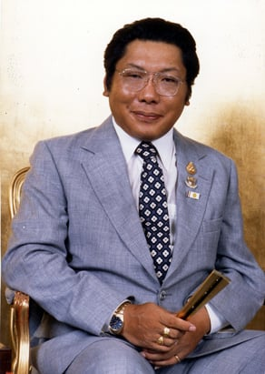

Chögyam Trungpa Rinpoche

**Chögyam Trungpa Rinpoche**, aka **Surmang Trungpa Chökyi Gyamtso** (Tib. ཟུར་མང་དྲུང་པ་ཆོས་ཀྱི་རྒྱ་མཚོ་, [Wyl.](https://www.rigpawiki.org/index.php?title=Wyl. "Wyl.") _zur mang drung pa chos kyi rgya mtsho_) (1940-1987) — a meditation master, teacher and artist, born in [Kham](https://www.rigpawiki.org/index.php?title=Kham "Kham"), eastern Tibet. He was supreme abbot—the Eleventh Surmang Trungpa—of the Surmang Monastery, where he received the degree of [khenpo](https://www.rigpawiki.org/index.php?title=Khenpo "Khenpo") at the age of eighteen. His main teachers were Shechen Kongtrul [Pema Drimé Lekpé Lodrö](https://www.rigpawiki.org/index.php?title=Pema_Drimé_Lekpé_Lodrö "Pema Drimé Lekpé Lodrö"), [Dilgo Khyentse Rinpoche](https://www.rigpawiki.org/index.php?title=Dilgo_Khyentse_Rinpoche "Dilgo Khyentse Rinpoche"), the [Sixteenth Karmapa](https://www.rigpawiki.org/index.php?title=Sixteenth_Karmapa "Sixteenth Karmapa"), and [Khenpo Gangshar](https://www.rigpawiki.org/index.php?title=Khenpo_Gangshar "Khenpo Gangshar"). He travelled to the United States in 1970 and is the founder of Naropa University and Shambhala International.

## Further Reading

*   Chögyam Trungpa, _Born in Tibet_, George Allen & Unwin, 1966
*   Diana J. Mukpo, _Dragon Thunder: My Life with Chögyam Trungpa_ (Boston: Shambhala, 2006)

## Publications

*   Chögyam Trungpa, _Mindfulness in Action_ (Shambhala, 2015)
*   Chögyam Trungpa, _The Teacup and the Skullcup—Where Zen and Tantra Meet_ (Shambhala, 2015)
*   Chögyam Trungpa, _The Profound Treasury of the Ocean of Dharma_
    *   Volume One: _The Path of Individual Liberation_ (Shambhala, 2014)
    *   Volume Two: _The Bodhisattva Path of Wisdom and Compassion_ (Shambhala, 2014)
    *   Volume Three: _The Tantric Path of Indestructible Wakefulness_ (Shambhala, 2013)
*   Chögyam Trungpa, _Work, Sex, Money—Real Life on the Path of Mindfulness_ (Shambhala, 2011)
*   Chögyam Trungpa, _The Mishap Lineage—Transforming Confusion into Wisdom_ (Shambhala, 2011)
*   _The Collected Works of Chögyam Trungpa_ (Shambhala, 2004)
    *   Volume One: _Born in Tibet_; _Meditation in Action_; _Mudra_ & _Selected Writings_
    *   Volume Two: _The Path Is the Goal_; _Training the Mind_; _Glimpses of Abhidharma_; _Glimpses of Shunyata_; _Glimpses of Mahayana_ & _Selected Writings_
    *   Volume Three: _Cutting Through Spiritual Materialism_; _The Myth of Freedom_; _The Heart of the Buddha_; _Selected Writings_
    *   Volume Four: _Journey without Goal_; _The Lion's Roar_; _The Dawn of Tantra_; _An Interview with Chogyam Trungpa_
    *   Volume Five: _Crazy Wisdom_; _Illusion's Game_; _The Life of Marpa_ (Excerpts); _The Rain of Wisdom_ (Excerpts); _The Sadhana of Mahamudra_ (Excerpts); _Selected Writings_
    *   Volume Six: _Glimpses of Space_; _Orderly Chaos_; _Secret Beyond Thought_; _The Tibetan Book of the Dead: Commentary_; _Transcending Madness_; _Selected Writings_
    *   Volume Seven: _The Art of Calligraphy_ (Excerpts); _Dharma Art_; _Visual Dharma_ (Excerpts); _Selected Poems_; _Selected Writings_
    *   Volume Eight: _Great Eastern Sun_; _Shambhala_; _Selected Writings_

## Internal Links

*   [Surmang Trungpa Incarnation Line](https://www.rigpawiki.org/index.php?title=Surmang_Trungpa_Incarnation_Line "Surmang Trungpa Incarnation Line")
*   [Andy Karr](https://www.rigpawiki.org/index.php?title=Andy_Karr "Andy Karr")

## External Links

*   [TBRC Profile](https://www.tbrc.org/link/?RID=P851)
*   [Chogyam Trungpa Digital Library](https://library.chogyamtrungpa.com)
*   [The Chronicles of Chögyam Trungpa Rinpoche](http://www.chronicleproject.com)
