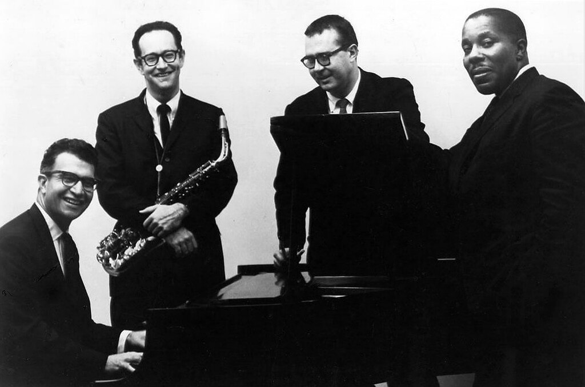
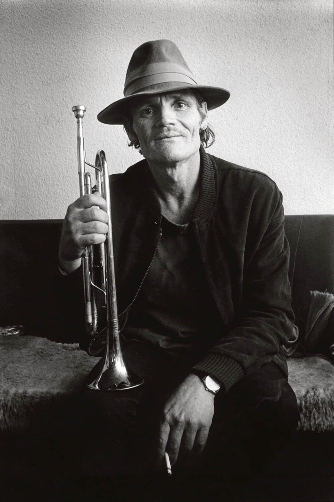

Cool jazz

[Dave Brubeck Quartet](https://en.wikipedia.org/wiki/Dave_Brubeck_Quartet "Dave Brubeck Quartet") in 1962

Stylistic origins

*   [Bebop](https://en.wikipedia.org/wiki/Bebop "Bebop")
*   [swing](https://en.wikipedia.org/wiki/Swing_music "Swing music")
*   [classical](https://en.wikipedia.org/wiki/Classical_music "Classical music")
*   [third stream](https://en.wikipedia.org/wiki/Third_stream "Third stream")

Cultural origins

1940s, United States

Derivative forms

*   [Modal jazz](https://en.wikipedia.org/wiki/Modal_jazz "Modal jazz")
*   [straight-ahead jazz](https://en.wikipedia.org/wiki/Straight-ahead_jazz "Straight-ahead jazz")

Local scenes

*   [Los Angeles](https://en.wikipedia.org/wiki/Los_Angeles "Los Angeles")
*   [New York City](https://en.wikipedia.org/wiki/New_York_City "New York City")
*   [San Francisco](https://en.wikipedia.org/wiki/San_Francisco "San Francisco")

Other topics

[West Coast jazz](https://en.wikipedia.org/wiki/West_Coast_jazz "West Coast jazz")

**Cool jazz** is a style and genre of modern [jazz](/source/jazz/ "Jazz") music inspired by [bebop](https://en.wikipedia.org/wiki/Bebop "Bebop") and [big band](https://en.wikipedia.org/wiki/Big_band "Big band") that arose in the United States after [World War II](https://en.wikipedia.org/wiki/World_War_II "World War II"). It is characterized by relaxed [tempos](https://en.wikipedia.org/wiki/Tempo "Tempo") and a lighter tone than that used in the fast and complex [bebop](https://en.wikipedia.org/wiki/Bebop "Bebop") style. Cool jazz often employs formal arrangements and incorporates elements of [classical music](https://en.wikipedia.org/wiki/Classical_music "Classical music"). Broadly, the genre refers to a number of post-war jazz styles employing a more subdued approach than that of contemporaneous jazz idioms. As [Paul Tanner](https://en.wikipedia.org/wiki/Paul_Tanner "Paul Tanner"), Maurice Gerow, and David Megill suggest, "the tonal sonorities of these conservative players could be compared to [pastel](https://en.wikipedia.org/wiki/Pastel_\(color\) "Pastel (color)") colors, while the solos of [\[Dizzy\] Gillespie](https://en.wikipedia.org/wiki/Dizzy_Gillespie "Dizzy Gillespie") and his followers could be compared to fiery red colors."

The term _cool_ started being applied to this music around 1953, when [Capitol Records](https://en.wikipedia.org/wiki/Capitol_Records "Capitol Records") released the album _Classics in Jazz: Cool and Quiet_. Mark C. Gridley, writing in the _[All Music Guide to Jazz](https://en.wikipedia.org/wiki/All_Music_Guide_to_Jazz "All Music Guide to Jazz")_, identifies four overlapping sub-categories of cool jazz:

1.  "Soft variants of bebop," including the [Miles Davis](/source/miles-davis/ "Miles Davis") recordings that constitute _[Birth of the Cool](https://en.wikipedia.org/wiki/Birth_of_the_Cool "Birth of the Cool")_; the complete works of the [Modern Jazz Quartet](https://en.wikipedia.org/wiki/Modern_Jazz_Quartet "Modern Jazz Quartet"); the output of [Gerry Mulligan](https://en.wikipedia.org/wiki/Gerry_Mulligan "Gerry Mulligan"), especially his work with [Chet Baker](https://en.wikipedia.org/wiki/Chet_Baker "Chet Baker") and [Bob Brookmeyer](https://en.wikipedia.org/wiki/Bob_Brookmeyer "Bob Brookmeyer"); the music of [Stan Kenton](https://en.wikipedia.org/wiki/Stan_Kenton "Stan Kenton")'s sidemen during the late 1940s through the 1950s; and the works of [George Shearing](https://en.wikipedia.org/wiki/George_Shearing "George Shearing") and [Stan Getz](https://en.wikipedia.org/wiki/Stan_Getz "Stan Getz").
2.  The output of modern players who eschewed bebop in favor of advanced [swing](https://en.wikipedia.org/wiki/Swing_music "Swing music")-era developments, including [Lennie Tristano](https://en.wikipedia.org/wiki/Lennie_Tristano "Lennie Tristano"), [Lee Konitz](https://en.wikipedia.org/wiki/Lee_Konitz "Lee Konitz"), and [Warne Marsh](https://en.wikipedia.org/wiki/Warne_Marsh "Warne Marsh"); [Dave Brubeck](https://en.wikipedia.org/wiki/Dave_Brubeck "Dave Brubeck") and [Paul Desmond](https://en.wikipedia.org/wiki/Paul_Desmond "Paul Desmond"); and performers such as [Jimmy Giuffre](https://en.wikipedia.org/wiki/Jimmy_Giuffre "Jimmy Giuffre") and [Dave Pell](https://en.wikipedia.org/wiki/Dave_Pell "Dave Pell") who were influenced by [Count Basie](https://en.wikipedia.org/wiki/Count_Basie "Count Basie") and [Lester Young](https://en.wikipedia.org/wiki/Lester_Young "Lester Young")'s small-group music.
3.  Musicians from either of the previous categories who were active in California from the 1940s through the 1960s, developing what came to be known as [West Coast jazz](https://en.wikipedia.org/wiki/West_Coast_jazz "West Coast jazz").
4.  "Exploratory music with a subdued effect by [Teddy Charles](https://en.wikipedia.org/wiki/Teddy_Charles "Teddy Charles"), [Chico Hamilton](https://en.wikipedia.org/wiki/Chico_Hamilton "Chico Hamilton"), [John LaPorta](https://en.wikipedia.org/wiki/John_LaPorta "John LaPorta"), and their colleagues during the 1950s."

## Characteristics

Cool jazz emerged as a reaction to bop, and is characterized by more moderate tempos and "a more reflective attitude". [Ted Gioia](https://en.wikipedia.org/wiki/Ted_Gioia "Ted Gioia") and Lee Konitz have each identified [cornetist](https://en.wikipedia.org/wiki/Cornet "Cornet") [Bix Beiderbecke](https://en.wikipedia.org/wiki/Bix_Beiderbecke "Bix Beiderbecke") and saxophonist [Frankie Trumbauer](https://en.wikipedia.org/wiki/Frankie_Trumbauer "Frankie Trumbauer") as early progenitors of the [cool aesthetic](https://en.wikipedia.org/wiki/Cool_\(aesthetic\) "Cool (aesthetic)") in jazz. Gioia cites Beiderbecke's softening of jazz's strong rhythmic impact in favor of maintaining melodic flow, while also employing complex techniques such as unusual harmonies and [whole tone scales](https://en.wikipedia.org/wiki/Whole_tone_scale "Whole tone scale"). Trumbauer, through "his smooth and seemingly effortless saxophone work," greatly affected [tenor saxophonist](https://en.wikipedia.org/wiki/Tenor_saxophone "Tenor saxophone") [Lester Young](https://en.wikipedia.org/wiki/Lester_Young "Lester Young"), who prefigured – and influenced – cool jazz more than any other musician.

Young's saxophone playing employed a light sound, in contrast to the "full-bodied" approach of players such as [Coleman Hawkins](https://en.wikipedia.org/wiki/Coleman_Hawkins "Coleman Hawkins"). Young also had a tendency to play behind the beat, instead of driving it. He more strongly emphasized melodic development in his improvisation, rather than "hot" phrases or chord changes. While Young's style initially alienated some observers, the cool school embraced it. (Young would also influence bebop through [Charlie Parker](https://en.wikipedia.org/wiki/Charlie_Parker "Charlie Parker")'s emulation of Young's playing style.) Tanner, Gerow, and Megill point out that "cool developed gradually, as did previous styles." In addition to Lester Young's approach, cool had other antecedents:

> Saxophonist [Benny Carter](https://en.wikipedia.org/wiki/Benny_Carter "Benny Carter") underplayed his attacks, [Teddy Wilson](https://en.wikipedia.org/wiki/Teddy_Wilson "Teddy Wilson") played the piano with a delicate touch, [Benny Goodman](https://en.wikipedia.org/wiki/Benny_Goodman "Benny Goodman") stopped using the thick [vibrato](https://en.wikipedia.org/wiki/Vibrato "Vibrato") of [Jimmy Noone](https://en.wikipedia.org/wiki/Jimmie_Noone "Jimmie Noone") and other [clarinetists](https://en.wikipedia.org/wiki/Clarinet "Clarinet"). Miles Davis's solo on Charlie Parker's "[Chasin' the Bird](https://en.wikipedia.org/wiki/Chasin'_the_Bird_\(song\) "Chasin' the Bird (song)")" in 1947 and [John Lewis](https://en.wikipedia.org/wiki/John_Lewis_\(pianist\) "John Lewis (pianist)")'s piano solo on Dizzie Gillespie's record of "['Round Midnight](https://en.wikipedia.org/wiki/'Round_Midnight_\(song\) "'Round Midnight (song)")" in 1948 anticipated the Cool Era.

## History

Cool jazz emerged in the 1940s. Its stylistic origins can be traced to Claude Thornhill's big band, which utilized clarinets, French horns, and tubas.

[Chet Baker](https://en.wikipedia.org/wiki/Chet_Baker "Chet Baker"), known as the "Prince of Cool," 1983

In 1947, [Woody Herman](https://en.wikipedia.org/wiki/Woody_Herman "Woody Herman") formed a band that included tenor saxophonists [Stan Getz](https://en.wikipedia.org/wiki/Stan_Getz "Stan Getz"), [Zoot Sims](https://en.wikipedia.org/wiki/Zoot_Sims "Zoot Sims"), and [Herbie Steward](https://en.wikipedia.org/wiki/Herbie_Steward "Herbie Steward"), and [baritone saxophonist](https://en.wikipedia.org/wiki/Baritone_saxophone "Baritone saxophone") [Serge Chaloff](https://en.wikipedia.org/wiki/Serge_Chaloff "Serge Chaloff"). The result was the "Four Brothers" sound, in which four strong improvisers could still perform well as a coordinated, blended section. (Jimmy Giuffre composed "[Four Brothers](https://en.wikipedia.org/wiki/Four_Brothers_\(jazz_standard\) "Four Brothers (jazz standard)")", which highlighted this group.) The Herman band's recording of "[Early Autumn](https://en.wikipedia.org/wiki/Early_Autumn_\(song\) "Early Autumn (song)")" launched Getz's career. Meanwhile, between 1946 and 1949, baritone saxophonist and arranger [Gerry Mulligan](https://en.wikipedia.org/wiki/Gerry_Mulligan "Gerry Mulligan"), arranger [Gil Evans](https://en.wikipedia.org/wiki/Gil_Evans "Gil Evans"), and alto saxophonist [Lee Konitz](https://en.wikipedia.org/wiki/Lee_Konitz "Lee Konitz") were all working for the [Claude Thornhill](https://en.wikipedia.org/wiki/Claude_Thornhill "Claude Thornhill") Orchestra, whose instrumentation included a [French horn](https://en.wikipedia.org/wiki/French_horn "French horn") and [tuba](https://en.wikipedia.org/wiki/Tuba "Tuba").

In 1948, [Miles Davis](/source/miles-davis/ "Miles Davis") formed a [nonet](https://en.wikipedia.org/wiki/Nonet_\(music\) "Nonet (music)") including Mulligan, Konitz, and Evans from Thornhill's orchestra. [Capitol Records](https://en.wikipedia.org/wiki/Capitol_Records "Capitol Records") recorded the group (at arranger [Pete Rugolo](https://en.wikipedia.org/wiki/Pete_Rugolo "Pete Rugolo")'s suggestion) in 1949 and 1950. These recordings, originally issued as [78 rpm records](https://en.wikipedia.org/wiki/Gramophone_record#78_rpm_disc_developments "Gramophone record"), were later [compiled](https://en.wikipedia.org/wiki/Compilation_album "Compilation album") as _[Birth of the Cool](https://en.wikipedia.org/wiki/Birth_of_the_Cool "Birth of the Cool")_ (1957). Gerry Mulligan explained that the idea behind Davis's Nonet was not to get away from bebop, but "just to try to get a good little rehearsal band together. Something to write for.... As far as the 'Cool Jazz' part of it, all of that comes _after_ the fact of what it was designed to be." As for Davis, his concern at the time was simply to play with a lighter sound, which he believed to be more expressive. Also his choice of notes suggested deliberation rather than wild exuberance.

The Miles Davis Nonet's existence was brief, consisting only of a two-week September 1948 engagement at the Manhattan's [Royal Roost](https://en.wikipedia.org/wiki/Royal_Roost "Royal Roost") and the three recording dates that make up _Birth of the Cool_. These recordings were not widely appreciated until some years later. However, they prefigured the work of nonet members John Lewis and Gerry Mulligan.

[John Lewis](https://en.wikipedia.org/wiki/John_Lewis_\(pianist\) "John Lewis (pianist)") went on to co-found the [Modern Jazz Quartet](https://en.wikipedia.org/wiki/Modern_Jazz_Quartet "Modern Jazz Quartet"), who incorporated classical forms, such as the [fugue](https://en.wikipedia.org/wiki/Fugue "Fugue"), in their music. Tanner, Gerow, and Megill note that the Quartet "played classical forms quite precisely. For example, the fugues they played were truly [baroque](https://en.wikipedia.org/wiki/Baroque_music "Baroque music") in form except that the [exposition](https://en.wikipedia.org/wiki/Exposition_\(music\) "Exposition (music)") parts were improvised." While [third stream](https://en.wikipedia.org/wiki/Third_stream "Third stream") music would combine classical elements with jazz, the Modern Jazz Quartet used these forms "just to play good, swinging, subtle jazz" and in pursuit of "the joy of collective improvisation and [counterpoint](https://en.wikipedia.org/wiki/Counterpoint "Counterpoint")."

[Gerry Mulligan](https://en.wikipedia.org/wiki/Gerry_Mulligan "Gerry Mulligan"), with [Chet Baker](https://en.wikipedia.org/wiki/Chet_Baker "Chet Baker"), formed a pianoless quartet that was both innovative and successful. Later, Mulligan formed a ["Tentette"](https://en.wikipedia.org/wiki/Decet_\(music\) "Decet (music)") that further developed the ideas he had brought to the _Birth of the Cool_ nonet.

[George Shearing](https://en.wikipedia.org/wiki/George_Shearing "George Shearing")'s quintet, which used a more subtle bebop style, also influenced cool's development. Both [Thelonious Monk](https://en.wikipedia.org/wiki/Thelonious_Monk "Thelonious Monk") and [Dizzy Gillespie](https://en.wikipedia.org/wiki/Dizzy_Gillespie "Dizzy Gillespie") praised Shearing's approach.

While Davis, Lewis, Mulligan, and Shearing's efforts were rooted in bebop, other musicians were less indebted to that style. In New York, pianist [Lennie Tristano](https://en.wikipedia.org/wiki/Lennie_Tristano "Lennie Tristano") and saxophonist Lee Konitz developed a "somewhat [atonal](https://en.wikipedia.org/wiki/Atonality "Atonality") cerebral alternative to bop which concentrated on linear improvisation and interweaving rhythmic complexities". In California, [Dave Brubeck](https://en.wikipedia.org/wiki/Dave_Brubeck "Dave Brubeck") hired alto saxophonist [Paul Desmond](https://en.wikipedia.org/wiki/Paul_Desmond "Paul Desmond"), forming a quartet. Both Konitz and Desmond used an approach that ran counter to bebop, in the sense that neither player employed a sound or style heavily indebted to [Charlie Parker](https://en.wikipedia.org/wiki/Charlie_Parker "Charlie Parker") (or Parker's blues elements). In a 2013 interview, Konitz noted that "the blues never connected with me," and further explained "I knew and loved Charlie Parker and copied his bebop solos like everyone else. But I didn't want to sound like him. So I used almost no vibrato and played mostly in the higher register. That's the heart of my sound."

## West Coast jazz

In 1951, [Stan Kenton](https://en.wikipedia.org/wiki/Stan_Kenton "Stan Kenton") disbanded his [Innovations Orchestra](https://en.wikipedia.org/wiki/Innovations_Orchestra "Innovations Orchestra") in Los Angeles. Many of the musicians, some of whom had also played in Woody Herman's band, chose to remain in California. Trumpeter [Shorty Rogers](https://en.wikipedia.org/wiki/Shorty_Rogers "Shorty Rogers") and drummer [Shelly Manne](https://en.wikipedia.org/wiki/Shelly_Manne "Shelly Manne") were central figures among this group of musicians. Much of this activity centered on the [Hermosa Beach](https://en.wikipedia.org/wiki/Hermosa_Beach,_California "Hermosa Beach, California") [Lighthouse Café](https://en.wikipedia.org/wiki/Lighthouse_Café "Lighthouse Café"), where [bassist](https://en.wikipedia.org/wiki/Double_bass "Double bass") [Howard Rumsey](https://en.wikipedia.org/wiki/Howard_Rumsey "Howard Rumsey") led a [house band](https://en.wikipedia.org/wiki/House_band "House band"), the [Lighthouse All-Stars](https://en.wikipedia.org/wiki/Lighthouse_All-Stars "Lighthouse All-Stars").

Drummer [Chico Hamilton](https://en.wikipedia.org/wiki/Chico_Hamilton "Chico Hamilton") led an ensemble that – unusually for a jazz group – included a cellist, [Fred Katz](https://en.wikipedia.org/wiki/Fred_Katz_\(cellist\) "Fred Katz (cellist)"). Tanner, Gerow, and Megill liken Hamilton's music to [chamber music](https://en.wikipedia.org/wiki/Chamber_music "Chamber music"), and have noted that Hamilton's "subtle rhythmic control and use of different drum pitches and timbres" was well-suited for this style of music.

Tanner, Gerow, and Megill are largely dismissive of the term "West Coast jazz." As it often refers to [Gerry Mulligan](https://en.wikipedia.org/wiki/Gerry_Mulligan "Gerry Mulligan") and his associates in California, "west coast" merely becomes synonymous with "cool," although [Lester Young](https://en.wikipedia.org/wiki/Lester_Young "Lester Young"), [Claude Thornhill](https://en.wikipedia.org/wiki/Claude_Thornhill "Claude Thornhill"), and [Miles Davis](/source/miles-davis/ "Miles Davis") were based in New York. At the same time, many musicians associated with West Coast jazz "were much more involved in a hotter approach to jazz. Communication being what it is, it is hardly likely that any style of jazz was fostered exclusively in one area."

## Legacy

In 1959, [The Dave Brubeck Quartet](https://en.wikipedia.org/wiki/The_Dave_Brubeck_Quartet "The Dave Brubeck Quartet") recorded _[Time Out](https://en.wikipedia.org/wiki/Time_Out_\(album\) "Time Out (album)")_, which reached No. 2 on the _[Billboard](https://en.wikipedia.org/wiki/Billboard_magazine "Billboard magazine")_ "Pop Albums" chart. The cool influence stretches into such later developments as [bossa nova](https://en.wikipedia.org/wiki/Bossa_nova "Bossa nova"), [modal jazz](https://en.wikipedia.org/wiki/Modal_jazz "Modal jazz") (especially in the form of Davis's _[Kind of Blue](https://en.wikipedia.org/wiki/Kind_of_Blue "Kind of Blue")_ (1959)), and even [free jazz](https://en.wikipedia.org/wiki/Free_jazz "Free jazz") (in the form of [Jimmy Giuffre](https://en.wikipedia.org/wiki/Jimmy_Giuffre "Jimmy Giuffre")'s 1961–1962 trio).

Following their work on _Birth of the Cool_, Miles Davis and Gil Evans would again collaborate on albums such as _[Miles Ahead](https://en.wikipedia.org/wiki/Miles_Ahead_\(album\) "Miles Ahead (album)")_, _[Porgy and Bess](https://en.wikipedia.org/wiki/Porgy_and_Bess_\(Miles_Davis_album\) "Porgy and Bess (Miles Davis album)")_, and _[Sketches of Spain](https://en.wikipedia.org/wiki/Sketches_of_Spain "Sketches of Spain")_.

Some observers saw the subsequent [hard bop](https://en.wikipedia.org/wiki/Hard_bop "Hard bop") style as a response to cool and West Coast jazz. Conversely, [David H. Rosenthal](https://en.wikipedia.org/wiki/David_H._Rosenthal "David H. Rosenthal") sees the development of hard bop as a response to both a perceived decline in bebop and the rise of rhythm and blues. Shelly Manne suggested that cool jazz and hard bop simply reflected their respective geographic environments: the relaxed cool jazz style reflected a more relaxed lifestyle in California, while driving bop typified the New York scene.

Ted Gioia has noted that some of the artists associated with the [ECM](https://en.wikipedia.org/wiki/ECM_Records "ECM Records") label during the 1970s are direct stylistic heirs of cool jazz. While these musicians may not sound similar to earlier cool artists, they share the same values:

> clarity of expression; subtlety of meaning; a willingness to depart from the standard rhythms of hot jazz and learn from other genres of music; a preference for emotion rather than mere emoting; progressive ambitions and a tendency to experiment; above all, a dislike for bombast.

Gioia also identifies cool's influence upon other idioms, such as [new-age](https://en.wikipedia.org/wiki/New-age_music "New-age music"), [minimalism](https://en.wikipedia.org/wiki/Minimal_music "Minimal music"), pop, [folk](https://en.wikipedia.org/wiki/Folk_music "Folk music"), and [world music](https://en.wikipedia.org/wiki/World_music "World music").

Cool also inspired [avant-garde jazz](https://en.wikipedia.org/wiki/Avant-garde_jazz "Avant-garde jazz") and, later, [free jazz](https://en.wikipedia.org/wiki/Free_jazz "Free jazz").
