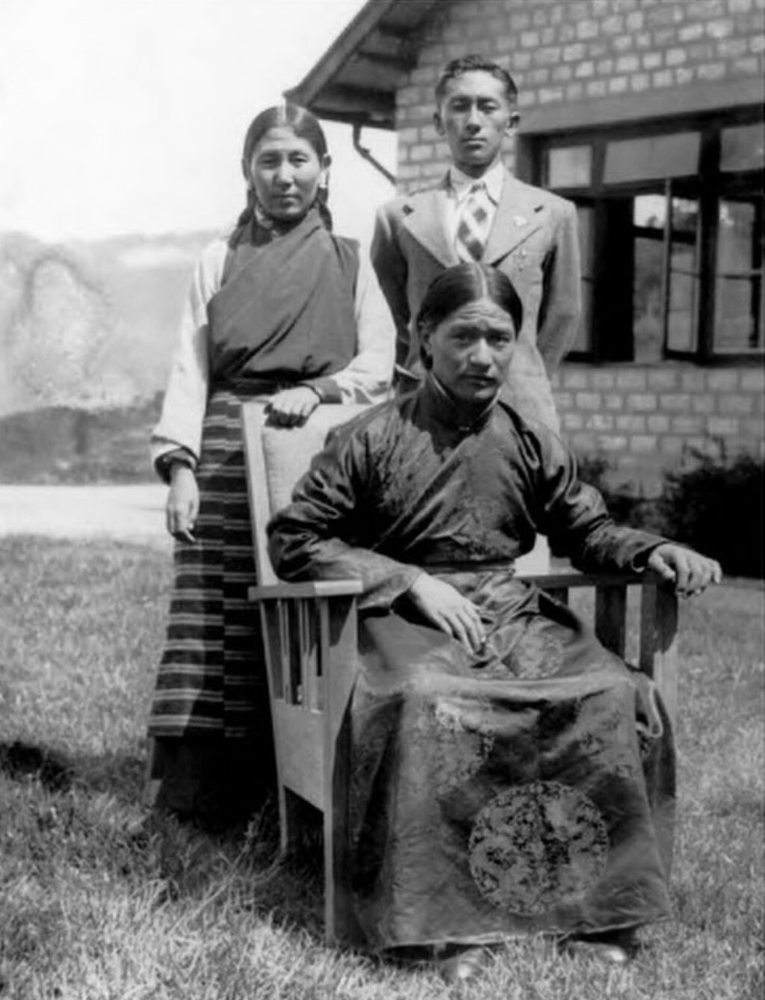

Dudjom Rinpoche in Sikkim at Namgyal Institute of Tibetology, with Maharani Kunzang Dechen Tshomo Namgyal and Prince Paljor Namgyal

**Kyabje Dudjom Rinpoche Jigdral Yeshe Dorje** ([Tibetan](https://en.wikipedia.org/wiki/Tibetan_script "Tibetan script"): བདུད་འཇོམས་འཇིགས་བྲལ་ཡེ་ཤེས་རྡོ་རྗེ།, [Wylie](https://en.wikipedia.org/wiki/Wylie_transliteration "Wylie transliteration"): bdud 'joms 'jigs bral ye shes rdo rje, [THL](https://en.wikipedia.org/wiki/THL_Simplified_Phonetic_Transcription "THL Simplified Phonetic Transcription") _Düjom Jikdrel Yéshé Dorjé_) was known simply as **Dudjom Rinpoche** (10 June 1904 – 17 January 1987). He is considered by many Tibetan Buddhists to be from an important [Tulku](https://en.wikipedia.org/wiki/Tulku "Tulku") lineage of Terton Dudul Dorje (1615–1672), and was recognized as the incarnation of [Terton](https://en.wikipedia.org/wiki/Terton "Terton") [Dudjom Lingpa](https://en.wikipedia.org/wiki/Dudjom_Lingpa "Dudjom Lingpa") (1835–1904), a renowned treasure revealer. He was a direct incarnation of both [Padmasambhava](/source/padmasambhava/ "Padmasambhava") and Dudjom Lingpa. He was a [Nyingma](/source/nyingma/ "Nyingma") [householder](https://en.wikipedia.org/wiki/Householder_\(Buddhism\) "Householder (Buddhism)"), a yogi, and a [Vajrayana](/source/vajrayana/ "Vajrayana") and [Dzogchen](/source/dzogchen/ "Dzogchen") master. According to his secretary Khenpo Tsewang Dongyal and many others, he was revered as "His Holiness" (Kyabje) and as a "Master of Masters".

In order to protect and preserve Tibetan Buddhist teachings and continue Tibetan culture in exile, Dudjom Rinpoche was appointed as the [first head](/source/nyingma/#Hierarchy_and_teachers "Nyingma") of the [Nyingma](/source/nyingma/ "Nyingma") school of [Tibetan Buddhism](https://en.wikipedia.org/wiki/Tibetan_Buddhism "Tibetan Buddhism"), by the [14th Dalai Lama](https://en.wikipedia.org/wiki/14th_Dalai_Lama "14th Dalai Lama") and the [Central Tibetan Administration](https://en.wikipedia.org/wiki/Central_Tibetan_Administration "Central Tibetan Administration") in the early 1960s, in [India](https://en.wikipedia.org/wiki/India "India"). He gave important Nyingma lineage empowerments and teachings at his monasteries [Zangdok Palri](https://en.wikipedia.org/wiki/Zang_Dhok_Palri_Phodang "Zang Dhok Palri Phodang") and Jangsa Gompa in [Kalimpong](https://en.wikipedia.org/wiki/Kalimpong "Kalimpong"), and at [Tso Pema](https://en.wikipedia.org/wiki/Rewalsar_Lake "Rewalsar Lake") in [Rewalsar](https://en.wikipedia.org/wiki/Rewalsar,_India "Rewalsar, India") which were attended by thousands of people. In 1965, Dudjom Rinpoche organized a conference for participants to discuss the preservation of teachings of the Nyingma, Kagyu, Sakya and Gelug schools.

In [Tibet](https://en.wikipedia.org/wiki/Tibet "Tibet") by 1955, Dudjom Rinpoche had travelled extensively to teach and was revered as a highly realized master by renown lamas, such as Zhechen Kongtrul and [Tulku Urgyen](https://en.wikipedia.org/wiki/Tulku_Urgyen "Tulku Urgyen"), as well as by Tibetan Buddhist laypeople. They still consider him to be the "Greatest Terton of Our Time", and a holder of all the teachings of the Nyingma school of Tibetan Buddhism, as well as that of the Kagyu, Sakya and Gelug schools. Dudjom Rinpoche was also a prolific author. The treatise _The Nyingma School of Tibetan Buddhism: Its Fundamentals and History_, was written by him in 1962 and 1996. Translated into two volumes, it is considered as a source of authority. He also authored the _Political History of Tibet_ in 1979, and the _History of the Dharma_. Teachers from various schools confirmed that the terma texts revealed by Dudjom Rinpoche are still being used as practice texts.

In addition to the above, Rinpoche also reconstructed monasteries in Tibet, and built numerous monasteries in India and Nepal after his exile from Tibet in 1957. In his lifetime, Dudjom Rinpoche continued travelling throughout the world to give teachings. He had a center in Hong Kong, and established centers both in France and in the United States. His activities and dharma centers brought the Vajrayana and the Nyingma teachings to the western worlds. Khenpo Dongyal credit this Great Master as being responsible for a "renaissance in Tibetan studies".

## Biography

### Introduction

Dudjom Rinpoche was born in [Kham](https://en.wikipedia.org/wiki/Kham "Kham"), southern [Tibet](https://en.wikipedia.org/wiki/Tibet "Tibet"), in a region named [Pemakö](https://en.wikipedia.org/wiki/Medog_County "Medog County") which is regarded as a [beyul](https://en.wikipedia.org/wiki/Beyul "Beyul") ([Wylie](https://en.wikipedia.org/wiki/Wylie_transliteration "Wylie transliteration"): sbas yul) or 'hidden land' to Tibetans. When he was born, he was given a [Sanskrit](/source/sanskrit/ "Sanskrit") name [Jñāna](https://en.wikipedia.org/wiki/Jñāna "Jñāna") which means "Yeshe" ([Wylie](https://en.wikipedia.org/wiki/Wylie_transliteration "Wylie transliteration"): ye shes) in Tibetan. Born into a family of Nyingma school practitioners, his father was Kathok Tulku Norbu Tenzing, a famous [tulku](https://en.wikipedia.org/wiki/Tulku "Tulku") in the Pemakö region, who had trained at [Katok Monastery](https://en.wikipedia.org/wiki/Katok_Monastery "Katok Monastery"). His mother was Namgyal Drolma, a descendant of [Ratna Lingpa](https://en.wikipedia.org/wiki/Eight_Lingpas "Eight Lingpas"). Dudjom Rinpoche was also a descendant of the 9th Tibetan king Nyatri Zangpo, and of Powo Kanam Depa, the King of Powo.

Known as the Second Dudjom Rinpoche, the name 'Dudjom' is translated from Tibetan as 'demon tamer'. His formal name includes Jigdral Yeshe Dorje; Jigdral ([Wylie](https://en.wikipedia.org/wiki/Wylie_transliteration "Wylie transliteration"): 'jigs bral). He was also regarded as fearless by many. This was a name given to him by [Khakyab Dorje](https://en.wikipedia.org/wiki/Khakyab_Dorje,_15th_Karmapa_Lama "Khakyab Dorje, 15th Karmapa Lama"), the Fifteenth Karmapa.

As detailed in written texts of revealed [tantras](https://en.wikipedia.org/wiki/Tantra "Tantra") and in ancient prophesies, during the time of the Buddha Pranidhanaraja, Dudjom Rinpoche's earlier incarnation was the yogin Nuden Dorje Chang. This yogin has vowed to reappear as the thousandth and the last Buddha of this Eon, as the Sugata Mopa Od Thaye.

Based on the biography of Dudjom Rinpoche by Wogmin Thubten Shedrup Ling, a [Drikung Kagyü](https://en.wikipedia.org/wiki/Drikung_Kagyu "Drikung Kagyu") monastery, a partial list of his other previous and highly notable incarnations includes [Śāriputra](https://en.wikipedia.org/wiki/Sariputta "Sariputta") who was one of the foremost disciples of [Gautama Buddha](https://en.wikipedia.org/wiki/Gautama_Buddha "Gautama Buddha") in India; [Saraha](https://en.wikipedia.org/wiki/Saraha "Saraha") who was the first and greatest of the eighty-four _[mahāsiddhas](https://en.wikipedia.org/wiki/Mahasiddha "Mahasiddha")_ of India; and also Humkara, who was also a _mahāsiddha_.

The Nyingma school's lineage can be traced to the great Vajrayana revealer and Second Buddha, [Guru Padmasambhava](/source/padmasambhava/ "Padmasambhava"), as well as to [Yeshe Tsogyal](https://en.wikipedia.org/wiki/Yeshe_Tsogyal "Yeshe Tsogyal") and to her recordings of Padmasambhava's teachings. Drokben Lotsawa, among Padmasambhava's twenty-five students, is also an earlier incarnation. The [Dzogchen](/source/dzogchen/ "Dzogchen") lineage in the Nyingma school can be traced to [Guru Padmasambhava](/source/padmasambhava/ "Padmasambhava") and to [Garab Dorje](https://en.wikipedia.org/wiki/Garab_Dorje "Garab Dorje"). The Dudjom Rinpoches are widely regarded as Padmasambhava's regents. Within the [Dzogchen](/source/dzogchen/ "Dzogchen") lineage, or the "Great Perfection", the [14th Dalai Lama](https://en.wikipedia.org/wiki/14th_Dalai_Lama "14th Dalai Lama") is also a lineage holder. He had received Dzogchen teachings from two teachers, namely [Dilgo Khyentse](/source/dilgo-khyentse/ "Dilgo Khyentse") and [Trulshik Rinpoche](https://en.wikipedia.org/wiki/Trulshik_Rinpoche "Trulshik Rinpoche"). Both of them were students of the Second Dudjom Rinpoche, and both were holders of the Dzogchen lineage.

Through Tibet's history, the Nyingma school never positioned itself in the role of the political leader of Tibet's nation, nor did the Nyingma school have a representative centralized leader. After Tibet's invasion by China caused a mass exodus of Tibetans escaping to India, efforts began to protect the Tibetan Buddhist teachings and the culture in exile. The [14th Dalai Lama](https://en.wikipedia.org/wiki/14th_Dalai_Lama "14th Dalai Lama") and the [Central Tibetan Administration](https://en.wikipedia.org/wiki/Central_Tibetan_Administration "Central Tibetan Administration") requested that the Nyingma school select a representative leader, and Dudjom Rinpoche accepted this role in order to help preserve the Vajrayana vehicle of Tibetan Buddhism, and the Nyingma lineage.

Due to concerted efforts by Dudjom Rinpoche and many other Tibetans, all of the texts of the Nyingma school's [Kama](https://en.wikipedia.org/wiki/Kama "Kama") lineage and [Terma](https://en.wikipedia.org/wiki/Terma_\(religion\) "Terma (religion)") lineage were recovered. He also helped locate missing texts and transferred them out of Tibet, thus saving the Tibetan Canon during the initial invasion of Tibet and during China's later [Cultural Revolution](https://en.wikipedia.org/wiki/Cultural_Revolution "Cultural Revolution") in Tibet.

Dudjom Rinpoche was revered by many as an exceptional scholar in various fields, including [sūtra](https://en.wikipedia.org/wiki/Sutra "Sutra"), [tantra](https://en.wikipedia.org/wiki/Tantra "Tantra"), prose literature, poetry, and history, all of which are in the Five Sciences curriculum of Tibetan monastic shedra programs. He also wrote about the history of the Nyingma school. All twenty-five volumes are deemed as official accounts. Therefore, Dudjom Rinpoche was a poet, author, scholar and Vajrayana Master. He also organised the building of monasteries and retreat centers, and gave teaching in India to where he first moved, in Nepal to where he later moved, in Bhutan, and in several western countries.

In 1988, a year after his death, Dudjom Rinpoche's body was moved from [Dordogne](https://en.wikipedia.org/wiki/Dordogne "Dordogne"), [France](https://en.wikipedia.org/wiki/France "France") to [Kathmandu](https://en.wikipedia.org/wiki/Kathmandu "Kathmandu"), [Nepal](https://en.wikipedia.org/wiki/Nepal "Nepal"), and placed in his [stūpa](https://en.wikipedia.org/wiki/Stupa "Stupa") at Orgyen Do Nyak Choling, the monastery which he had built in [Boudhanath](https://en.wikipedia.org/wiki/Boudhanath "Boudhanath"), Nepal. In a letter, Dudjom Rinpoche appointed the Dzogchen Master [Chatral Sangye Dorje](https://en.wikipedia.org/wiki/Chatral_Sangye_Dorje "Chatral Sangye Dorje") (1913–2015) as his Vajra Regent.

### Birth

Dudjom Rinpoche was born on July 22, 1904, according to the Western ([Gregorian](https://en.wikipedia.org/wiki/Gregorian_calendar "Gregorian calendar")) calendar—the year 2444 after Buddha's passing into parinirvana, the year 2440 after the birth of Padmasambhava, and the year 2031 counted from the inception of the Tibetan monarchy. According to the astrological sixty-year cycle it was year of the Wood Dragon, sixth month, tenth day. The month and day also correspond to the birth date of Padmasambhava. Rinpoche was born into a noble family in the south-eastern Tibetan province of [Pema Ko](https://en.wikipedia.org/wiki/Pemako "Pemako"), which is one of the _[beyul](https://en.wikipedia.org/wiki/Beyul "Beyul")_ ("hidden lands") of [Padmasambhava](/source/padmasambhava/ "Padmasambhava"). He was recognized as the incarnation of [Traktung Dudjom Lingpa](https://en.wikipedia.org/wiki/Dudjom_Lingpa "Dudjom Lingpa") (1835–1904), a famous _[tertön](https://en.wikipedia.org/wiki/Tertön "Tertön")_ or discoverer of concealed "treasures" (_[terma](https://en.wikipedia.org/wiki/Terma_\(religion\) "Terma (religion)")_), particularly those related to the practice of [Vajrakīla](https://en.wikipedia.org/wiki/Kīla_\(Buddhism\) "Kīla (Buddhism)") (_rdo rje phur pa_). Dudjom Lingpa had intended to visit southern Tibet to reveal the sacred land of Pema Kö, but as he was unable to do so, he predicted that his successor would be born there and reveal it himself.

### Dharma activity

In his youth, Dudjom Rinpoche studied with some of the most outstanding masters of the time. He began his studies with Khenpo Aten in Pema Kö, before attending some of the great monastic universities of Central Tibet, such as [Mindrolling](https://en.wikipedia.org/wiki/Mindrolling_Monastery "Mindrolling Monastery"), [Dorje Drak](https://en.wikipedia.org/wiki/Dorje_Drak "Dorje Drak") and Tarjé Tingpoling, and of East Tibet, such as [Kathok](https://en.wikipedia.org/wiki/Katok_Monastery "Katok Monastery") and [Dzogchen](https://en.wikipedia.org/wiki/Dzogchen_Monastery "Dzogchen Monastery"). Mindrolling was the monastery to which Dudjom Rinpoche returned to perfect his understanding of the Nyingma tradition. Foremost among his many teachers were Phungong Tulku Gyurmé Ngedön Wangpo, Jedrung Trinlé Jampa Jungne, Gyurme Phendei Özer, and Minling Dordzin Namdrol Gyatso.

Unique in having received the transmission of all the existing teachings of the Nyingma tradition, Dudjom Rinpoche was especially renowned as a great tertön, whose [termas](https://en.wikipedia.org/wiki/Terma_\(religion\) "Terma (religion)") are now widely taught and practiced, and as a leading exponent of Dzogchen. He was regarded as the living embodiment and regent of Padmasambhava and his representative for this time. Dudjom Rinpoche taught many of today's masters.

Amongst the most widely read of his works are _The Nyingma School of Tibetan Buddhism, Its Fundamentals and History_; which he composed soon after his arrival in India as an exile and which is now available in English translation. This history of the Nyingma School presents a great deal of new material on the development of Buddhism in Tibet. At the invitation of the Dalai Lama, Dudjom Rinpoche also wrote a history of Tibet. Another major part of his work was the revision, correction, and editing of many ancient and modern texts, including the whole of the Canonical Teachings (_kama_) of the [Nyingma](/source/nyingma/ "Nyingma") School, a venture he began at the age of seventy-four. His own private library contained the largest collection of precious manuscripts and books outside Tibet.

After leaving Tibet, Rinpoche settled first in [Kalimpong](https://en.wikipedia.org/wiki/Kalimpong "Kalimpong"), in India. He gave extensive teachings in Kalimpong and [Darjeeling](https://en.wikipedia.org/wiki/Darjeeling "Darjeeling"), including giving the [Vajrasattva](https://en.wikipedia.org/wiki/Vajrasattva "Vajrasattva") [sādhanā](https://en.wikipedia.org/wiki/Sādhanā "Sādhanā") to [Sangharakshita](https://en.wikipedia.org/wiki/Sangharakshita "Sangharakshita").

During a train ride back to Kalimpong from Dharamsala in the 1960s, the head lama of Kathok Monastery, Kathok Öntrul Rinpoche, believed able to do mirror divination, said that he saw a Padmasambhava statue wrapped in barbed wire. Dudjom Rinpoche was with him, and asked for that divination. The train had a stopover in [Siliguri](https://en.wikipedia.org/wiki/Siliguri "Siliguri"). According to Khenpo Tsewang Dongyal, enemies of Dudjom Rinpoche told Indian intelligence that Rinpoche was collaborating with the Chinese Communist party and was receiving a salary from them; the police put him under house arrest.

_As the news of this spread, his disciple were shocked and saddened. They'd also heard that authorities were going to transport His Holiness by train from Siliguri to Panchimari, the site of a prison for Tibetans detained for political reasons. Many students from Sikkim, Darjeeling, Bhutan, and Kalimpong planned to prevent the train from leaving by lying on the railroad tracks. But by then His Holiness the [Dalai Lama](https://en.wikipedia.org/wiki/Dalai_Lama "Dalai Lama") and his officials, the king of Sikkim, and the king, queen, and ministers of Bhutan, and important figures from India and Nepal, as well as thousands of students, had already written letters to Jawaharlal Nehru, the Prime Minister of India. After a few days His Holiness was released from house arrest in Siliguri and returned to his home in Kalimpong._

He played a key role in the renaissance of Tibetan culture amongst the refugee community, both through his teaching and his writing. He established a number of vital communities of practitioners in India and Nepal, such as Zangdok Palri in Kalimpong, Dudal Rapten Ling in Orissa, and the monasteries at Tsopema and Boudhanath. He actively encouraged the study of the Nyingma Tradition at the [Central Institute of Higher Tibetan Studies](https://en.wikipedia.org/wiki/Central_Institute_of_Higher_Tibetan_Studies "Central Institute of Higher Tibetan Studies") in [Sarnath](https://en.wikipedia.org/wiki/Sarnath "Sarnath"), and continued to give teachings according to his own terma tradition, as well as giving many other important empowerments and transmissions, including the Nyingma Kama, the Nyingma Tantras and the _Treasury of Precious Termas_ (Rinchen Terdzo).

When Dudjom Rinpoche was eight years old, he began to study [Shantideva](https://en.wikipedia.org/wiki/Shantideva "Shantideva")'s [Bodhicharyavatara](https://en.wikipedia.org/wiki/Bodhicharyavatara "Bodhicharyavatara") with his teacher Orgyen Chogyur Gyatso, a personal disciple of the great [Patrul Rinpoche](https://en.wikipedia.org/wiki/Patrul_Rinpoche "Patrul Rinpoche"). When they had completed the first chapter, his teacher presented him with a conch shell and asked him to blow it towards each of the four directions. The sound it made to the East and to the North was quite short, in the South it was long, and in the West longer still. This was considered to be an indication of where his work in later times would be most effective. [Kham](https://en.wikipedia.org/wiki/Kham "Kham"), in the east of Tibet, had been the birthplace of Dudjom Lingpa, who had already been very active in that region. In the South, throughout the Himalayan regions of [Bhutan](https://en.wikipedia.org/wiki/Bhutan "Bhutan"), [Sikkim](https://en.wikipedia.org/wiki/Sikkim "Sikkim"), [Nepal](https://en.wikipedia.org/wiki/Nepal "Nepal") and [Ladakh](https://en.wikipedia.org/wiki/Ladakh "Ladakh"), Dudjom Rinpoche had many thousands of disciples; when, on one occasion, he gave teachings in Kathmandu intended only for a few lamas, between twenty-five and thirty thousand disciples came from all over India and the Himalayas.

In the final decade of his life, in spite of ill-health and advancing years, he devoted much of his time to teaching in the West, where he successfully established the Nyingma tradition in response to the growing interest amongst Westerners. He founded many major centres including Dorje Nyingpo and Orgyen Samye Chöling in France, and Yeshe Nyingpo, Urgyen Chö Dzong and others in the United States. During this period, he tirelessly gave teachings and empowerments, and under his guidance a number of Western students began to undertake long retreats. Dudjom Rinpoche also traveled in Asia, and in Hong Kong he had a large following, with a thriving center which he visited on three occasions.

In the 1970s, Dudjom Rinpoche conducted a few teachings in the United States and London and then some retreats at Urgyen Samye Chöling in France. Eventually, "the wanderer, Dudjom", as he sometimes used to sign himself, settled with his family in the Dordogne area of France, and there in August 1984 he gave his last large public teaching. He died on January 17, 1987.

## Dudjom lineage

The Dudjom [terton](https://en.wikipedia.org/wiki/Terton "Terton") lineage started in 1835 with [Dudjom Lingpa](https://en.wikipedia.org/wiki/Dudjom_Lingpa "Dudjom Lingpa"). Dudjom Lingpa is considered a mind manifestation of Padmasambhava. Dudjom Lingpa was also considered a voice manifestation of Yeshe Tsogyal. Finally Dudjom Lingpa was considered the body manifestation of his own previous reincarnation, Drogben Lotsawa, who was one of the twenty-five main disciples of Padmasambhava.

One story of Dudjom Lingpa's reincarnation describes a new birth occurring before he died. In that story, he sent his main disciples to Pema Ko saying: "Go to the secret land of Pema Ko. Whoever has faith in me, go in that direction! Before you young ones arrive, I will already be there." It took a few years for the disciples to stumble upon the exact location but the very young Dudjom Rinpoche reportedly aged about three called the surprised incognito strangers by their individual names, spoke in their Golok dialect which no one else did in that area and invited them to his surprised parents' house. It is said he could remember his previous lives clearly.

## Dudjom Tersar lineage

_Dudjom Tersar_ is the collective name for the large collection of terma teachings revealed by [Dudjom Lingpa](https://en.wikipedia.org/wiki/Dudjom_Lingpa "Dudjom Lingpa") and Dudjom Rinpoche. As a class of texts, _Tersar_ (_gter gsar_) means "new or recently revealed treasure teachings". Dudjom Rinpoche was a major [terton](https://en.wikipedia.org/wiki/Tertön "Tertön") ([Wylie](https://en.wikipedia.org/wiki/Wylie_transliteration "Wylie transliteration"): _gter ston_) or treasure revealer of hidden teachings. Dudjom Rinpoche is considered one of the Hundred Great Tertons in the Nyingma lineage.

Most _terma_ are small in scale; major cycles are rare. Those containing many major cycles, such as Dudjom Tersar, are even rarer historically. The Dudjom Tersar is possibly the most comprehensive suite of terma to be revealed in the twentieth century. Since terma traditionally are considered to be discovered during the time they are most needed, the most recently discovered _terma_ may be the most pertinent to current needs. Recent _terma_ are, then, considered to "still have the warm fresh breath of the dakinis".

A set of preliminary practices known as Dudjom Tersar [ngöndro](https://en.wikipedia.org/wiki/Ngöndro "Ngöndro") has to be undertaken by beginners prior to higher initiations. Dudjom Tersar contains different cycles: some are comprehensive, from beginning instruction through the highest Dzogchen teachings, and there are also smaller cycles, and individual practices, for specific purposes.

There are four major cycles in the Dudjom Tersar of Dudjom Lingpa, the first three being Mind Treasures ([Wylie](https://en.wikipedia.org/wiki/Wylie_transliteration "Wylie transliteration"): _dgongs gter_) and the last one an Earth Treasure (Wylie: _sa gter_):

*   (a) The "Dagnang Yeshe Drawa" cycle (The Wisdom Nets of Pure Visions), such as the Troma teachings;
*   (b) The "Maha-Ati Yoga Zabcho Gongpa Rangdrol" cycle (The Profound Teachings on Naturally Self-liberating Enlightened Visions), such as the teachings of [Chenrezig](https://en.wikipedia.org/wiki/Chenrezig "Chenrezig");
*   (c) The "Chonyid Namkhai Longdzo" cycle (the Vast Space Treasure from the Wisdom Sky of the Ultimate Nature), with teachings of Thekchod and Thodgal; and
*   (d) The "Khandro Nyingthig" (Heart Essence of the Dakini) cycle.

There are four major cycles in the Dudjom Tersar of Kyabje Dudjom Rinpoche, Jigdral Yeshe Dorje, which are all Mind Treasures ([Wylie](https://en.wikipedia.org/wiki/Wylie_transliteration "Wylie transliteration"):_dgongs gter_):

*   (a) The "Tsokyi Thugthig" cycle, for the practices on the outer, inner, secret and innermost secret sadhanas of the [Lama](https://en.wikipedia.org/wiki/Lama "Lama");
*   (b) The "Pudri Rekpung" cycle, for the practices of the [Yidam](https://en.wikipedia.org/wiki/Yidam "Yidam");
*   (c) The "Khandro Thugthig" cycle, for the practices on the outer, inner, secret and innermost secret sadhanas of the [Khandro](https://en.wikipedia.org/wiki/Dakini "Dakini"); and
*   (d) The "Dorje Drolod" cycle.

## Reincarnations

### Dudjom Rinpoche III

The Tibetan Dudjom Yangsi Rinpoche was **Dudjom Rinpoche Sangye Pema Shepa** or Dudjom Rinpoche III, Sangye Pema Shepa (1990–2022), who was born on April 21, 1990. He was born in Jyekundo, [Kham](https://en.wikipedia.org/wiki/Kham "Kham"), [Tibet](https://en.wikipedia.org/wiki/Tibet "Tibet"), (Qinghai, China). His mother is Pema Khandro, and his father is the third son of Dudjom Rinpoche II, Dola Tulku, known as Jigmé Chokyi Nyima. Sangye Pema Shepa was first recognized by [Terton](https://en.wikipedia.org/wiki/Terton "Terton") Khandro Tare Lama through a prophetic poem written in dakini script on the day of his birth. Tare Lama wrote to [Chatral Rinpoche](https://en.wikipedia.org/wiki/Chatral_Rinpoche "Chatral Rinpoche"), who confirmed the prophecy then wrote to [Thinley Norbu Rinpoche](https://en.wikipedia.org/wiki/Thinley_Norbu "Thinley Norbu"), the eldest son of Sangyum Kusho Tseten Yudron and Dudjom Rinpoche II, and then recognized the three-year old Yangsi in person. Recognitions were also conferred by the [14th Dalai Lama](https://en.wikipedia.org/wiki/14th_Dalai_Lama "14th Dalai Lama"), by Minling Trichen Rinpoche, [Kyabje Penor Rinpoche](https://en.wikipedia.org/wiki/Penor_Rinpoche "Penor Rinpoche"), [Sakya Trinzin Rinpoche](https://en.wikipedia.org/wiki/Sakya_Trizin "Sakya Trizin"), Shechen Rabjam Rinpoche, and Kathok Situ Rinpoche. Dudjom Sangyum Rigzin Wangmo also recognized him with absolute certainty.

Sangye Pema Shepa was enthroned in Tibet at [Dzongsar Monastery](https://en.wikipedia.org/wiki/Dzongsar_Monastery "Dzongsar Monastery") by [Khenpo Jigme Phuntsok](https://en.wikipedia.org/wiki/Jigme_Phuntsok "Jigme Phuntsok"), with Dzongsar Jamyang Khyentse Rinpoche, and later enthroned in Godhavari, [Nepal](https://en.wikipedia.org/wiki/Nepal "Nepal") on Lhabab Duchen, November 25, 1994, by [Chatral Rinpoche](https://en.wikipedia.org/wiki/Chatral_Rinpoche "Chatral Rinpoche"), in the presence of [Penor Rinpoche](https://en.wikipedia.org/wiki/Penor_Rinpoche "Penor Rinpoche") and many Nyingma lamas and students of Dudjom Rinpoche II. Dudjom Rinpoche II had named Chatral Rinpoche as his successor in a letter to take over all his spiritual matters and sit in the middle of his [mandala](https://en.wikipedia.org/wiki/Mandala "Mandala") after his death. Chatral Rinpoche was the main teacher of Sangye Pema Shepa, as he promised to the previous Dudjom Rinpoche, who wrote a long life prayer for him. Chatral Rinpoche was considered by Nyingmas to be their highest master after Dudjom Rinpoche II died.

Sangye Pema Shepa bestowed his first initiations at the age of seven, and had spent the majority of his years in study and retreat in Tibet and Nepal, including at [Larung Gar](https://en.wikipedia.org/wiki/Larung_Gar "Larung Gar") and in strict solitary retreat at Gangri Thodkar. In June 2018, he made his first visit to Canada and the USA where he transmitted the Dudjom Tersar Empowerments and Transmissions at Pema Osel Ling in California. In August 2019, Dudjom Rinpoche III travelled to Spain, Switzerland, Russia, and to Dudjom Rinpoche II's European seat in France, where be conferred Dudjom Rinpoche's lineage initiations and blessings. Sangye Pema Shepa has actively expressed his ecological concerns in multiple platforms and has composed a prayer for this cause.

Dudjom Rinpoche Sangye Pema Shepa, after telling his staff that he was going to rest and relax, to be quiet, and not to disturb him, retreated into his room. After not emerging in the morning his attendance entered the room to find him in a state of thukdam, and annoucned his passing on February 15, 2022. He was 31 years of age when he passed at his residence in Tibet.

### Dudjom Rinpoche Tenzin Yeshe Dorje

The Bhutanese Dudjom Yangsi Rinpoche, **Dudjom Tenzin Yeshe Dorje Rinpoche**, was born in 1990 in [Bhutan](https://en.wikipedia.org/wiki/Bhutan "Bhutan"), and recognized by Dudjom Sangyum Rigdzin Wangmo, by the [14th Dalai Lama](https://en.wikipedia.org/wiki/14th_Dalai_Lama "14th Dalai Lama") and by [Tulku Urgyen Rinpoche](https://en.wikipedia.org/wiki/Tulku_Urgyen_Rinpoche "Tulku Urgyen Rinpoche"). Yangsi ([Wylie](https://en.wikipedia.org/wiki/Wylie_transliteration "Wylie transliteration"): yang srid) is the honorific title given a young child whom is a recognized [reincarnation](https://en.wikipedia.org/wiki/Reincarnation "Reincarnation") of a high lama, a [Tulku](https://en.wikipedia.org/wiki/Tulku "Tulku").

### Tulku Orgyen Tromge

The American Dudjom Yangsi Rinpoche is **Sungtrul Rinpoche**, also known as Tulku Orgyen Tromge (b. 1988). He was born on November 6, 1988, in the shrine room of his grandfather [Chagdud Tulku Rinpoche](/source/chagdud-tulku-rinpoche/ "Chagdud Tulku Rinpoche")'s remote retreat land in Oregon, USA. In 1999, he was enthroned by Mogtsa Rinpoche at [Kathok Monastery](https://en.wikipedia.org/wiki/Kathok_Monastery "Kathok Monastery") in [Tibet](https://en.wikipedia.org/wiki/Tibet "Tibet"), as a speech emanation of Dudjom Rinpoche. His father is Chagdud Rinpoche's son Jigme Tromge Rinpoche and his mother is Rigzin Wangmo Tromge. In 2004, Orgyen Tromge sat in attendance at Chagdud Tulku Rinpoche's Cremation ceremony at Katok Ritrö, near Pharping, Nepal.

## Dudjom Rinpoche II's family

Dudjom Rinpoche was a householder, a yogi, a writer, and a master and guru with a family, married twice.

### First wife Sangyum Kusho Tseten Yudron

Dudjom Rinpoche's first wife was Sangyum Kusho Tseten Yudron. Their eldest daughter, Semo Dechen Yudron ([Tibetan](https://en.wikipedia.org/wiki/Tibetan_script "Tibetan script"): སྲས་མོ་བདེ་ཆེན་གཡུ་སྒྲོན། English: Turquoise Radiance of Great Bliss.), lived in [Lhasa](https://en.wikipedia.org/wiki/Lhasa "Lhasa"), taking care of Dudjom Rinpoche's seat, Lama Ling, in [Kongpo](https://en.wikipedia.org/wiki/Kongpo "Kongpo"). Their third son, Pende Norbu Rinpoche ([Tibetan](https://en.wikipedia.org/wiki/Tibetan_script "Tibetan script"): ཕན་བདེ་ནོར་བུ་རིན་པོ་ཆེ། English: Jewel of Beneficial Well-Being), lived in Nepal with his wife Sangyum Kusho Pasang Wangmo.

### Second wife Sangyum Kusho Rigzin Wangmo

Dudjom Rinpoche's second wife was [Sangyum](https://en.wikipedia.org/wiki/Sangyum "Sangyum") **Kusho Rigzin Wangmo**, and they had four children, one son and three daughters.

Their first daughter, Dekyong Yeshe Wangmo, was recognized as an incarnate [ḍākinī](https://en.wikipedia.org/wiki/Dakini "Dakini") and was believed to be an emanation of [Yeshe Tsogyal](https://en.wikipedia.org/wiki/Yeshe_Tsogyal "Yeshe Tsogyal"), but died when she was a young woman. It was said that since birth she had no shadow, which meant she had fully attained the [rainbow body](https://en.wikipedia.org/wiki/Rainbow_body "Rainbow body") ([Wylie](https://en.wikipedia.org/wiki/Wylie_transliteration "Wylie transliteration"): 'ja' lus) while in the flesh, and that she displayed many miraculous signs and all who saw her felt great devotion.

Their elder daughter is Semo Chimey Wangmo, and their younger is Semo Tsering Penzom. Their son, Dungsey Shenphen Dawa Norbu Rinpoche ([Tibetan](https://en.wikipedia.org/wiki/Tibetan_script "Tibetan script"): གཞན་ཕན་ཟླ་བ་ནོར་བུ་, [Wylie](https://en.wikipedia.org/wiki/Wylie_transliteration "Wylie transliteration"): gzhan phan zla ba nor bu, 1950–2018), was a main holder of the Dudjom Tersar Lineage. Rinpoche spread the Dudjom Tersar throughout the East and West, establishing temples and retreat centers in France, Spain, and the US. His son, H.E. Dungsey Namgay Dawa Rinpoche, currently spreads the Dudjom Tersar Lineage as a main Lineage holder by overseeing centers in the US and Spain in lieu of Dungsey Shenphen Dawa Norbu Rinpoche's wishes.

### Grandchildren

Kyabje Dudjom Rinpoche's two grandsons via his first wife and their son [Thinley Norbu](https://en.wikipedia.org/wiki/Thinley_Norbu "Thinley Norbu") are renowned lamas. Thinley Norbu Rinpoche's wife, Jamyang Chödön, comes from the blood lineage of Künkhen Pema Karpo from the [Drukpa Lineage](https://en.wikipedia.org/wiki/Drukpa_Lineage "Drukpa Lineage") in [Bhutan](https://en.wikipedia.org/wiki/Bhutan "Bhutan").

One grandson is [Dzongsar Jamyang Khyentse Rinpoche](https://en.wikipedia.org/wiki/Dzongsar_Jamyang_Khyentse_Rinpoche "Dzongsar Jamyang Khyentse Rinpoche"). He is considered to be the reincarnation of [Dzongsar Khyentse Chökyi Lodrö](https://en.wikipedia.org/wiki/Dzongsar_Khyentse_Chökyi_Lodrö "Dzongsar Khyentse Chökyi Lodrö"); he oversees monasteries and educational and retreat centers throughout the world.

One of Rinpoche's grandsons is Garab Dorje Rinpoche. Rinpoche oversees monasteries and educational and retreat centers throughout the world as well. Apart from his root gurus Dudjom Rinpoche and Thinley Norbu Rinpoche (his own father), he studied under many masters, and pursued higher studies at [Penor Rinpoche](https://en.wikipedia.org/wiki/Penor_Rinpoche "Penor Rinpoche")'s Institute and at the [Mindrolling Monastery](https://en.wikipedia.org/wiki/Mindrolling_Monastery "Mindrolling Monastery") in India. He is responsible for the welfare of several hundred monks at Rangjung Wösel Chöling, nuns at Thegchog Kunzang Chödön, a nursing home for the elderly, and four retreat centers in eastern Bhutan. He has also established Buddhist study centers globally. At present, there are twenty-five Tröma Chöd Groups, with membership ranging from five hundred to over a thousand, throughout Bhutan; there are also Tröma Chöd Groups in Taiwan, China, Malaysia, Singapore and Germany. Garab Dorje Rinpoche is a lineage holder of the Dudjom Tersar or New Treasure ([Wylie](https://en.wikipedia.org/wiki/Wylie_transliteration "Wylie transliteration"): gter gsar) lineage in general, and the Dudjom Tersar practice of Krodhikali Troma Chod in particular.

Dudjom Rinpoche's grandsons via his second wife, Sangyum Kusho Rigzin Wangmo, and their son, Shenphen Dawa Norbu Rinpoche are also renowned lamas. Shenphen Dawa Rinpoche helped His Holiness establish his vajra seat in North America at Dudjom Tersar Yeshe Nyingpo Temple in New York City in 1976 and its sister retreat center Orgyen Chö Dzong in Greenville, NY in 1980. Kyabje Dudjom Rinpoche was offered an old farm, soon to be transformed into a Dharma Center named Urgyen Samyé Chöling in Laugeral, Saint Léon-sur-Vézère France in 1979. Dungsey Shenphen Dawa Norbu Rinpoche went on to establish Dudjom Tersar centers in Southern California and Spain.

H.E. Dungsey Namgay Dawa Rinpoche is the elder son of Dungsey Shenphen Dawa Norbu Rinpoche. Dungsey Namgay Dawa Rinpoche was enthroned by Kyabje Dudjom Rinpoche himself, who blessed him and predicted his future. Rinpoche is a main lineage holder that currently oversees Dudjom Tersar Yeshe Nyingpo Temple in New York City and its sister retreat center, Orgyen Chö Dzong in the Northern Catskill Mountains in New York. Dungsey Namgay Rinpoche oversees sister Dharma Centers in Spain and the US.
