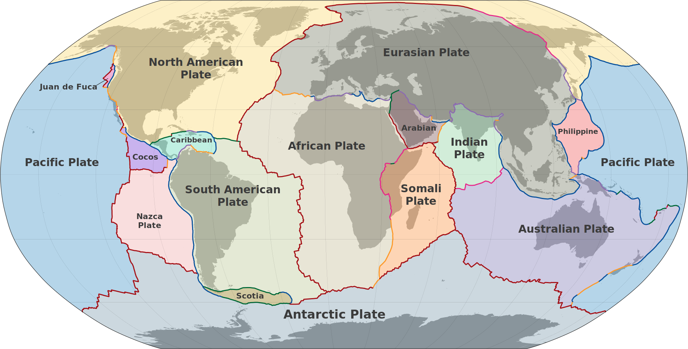
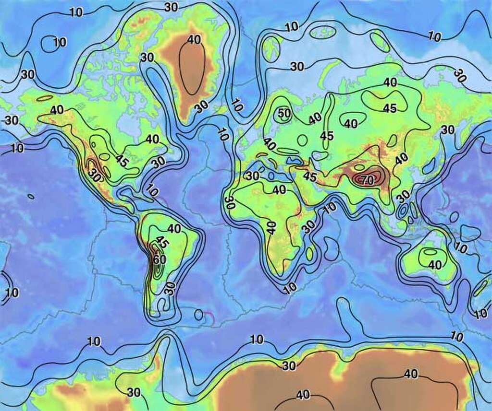

Plates in the crust of Earth

**Earth's crust** is its thick outer shell of [rock](https://en.wikipedia.org/wiki/Rock_\(geology\) "Rock (geology)"), comprising less than one percent of the planet's [radius](https://en.wikipedia.org/wiki/Radius "Radius") and [volume](https://en.wikipedia.org/wiki/Volume "Volume"). It is the top component of the [lithosphere](https://en.wikipedia.org/wiki/Lithosphere "Lithosphere"), a [solidified](https://en.wikipedia.org/wiki/Solidified "Solidified") division of [Earth](/source/earth/ "Earth")'s layers that includes the [crust](https://en.wikipedia.org/wiki/Crust_\(geology\) "Crust (geology)") and the upper part of the [mantle](/source/mantle/ "Mantle (geology)"). The lithosphere is broken into [tectonic plates](https://en.wikipedia.org/wiki/Tectonic_plates "Tectonic plates") whose motion allows heat to escape the interior of Earth into space.

The crust lies on top of the mantle, a configuration that is stable because the upper mantle is made of [peridotite](https://en.wikipedia.org/wiki/Peridotite "Peridotite") and is therefore significantly denser than the crust. The boundary between the crust and mantle is conventionally placed at the [Mohorovičić discontinuity](https://en.wikipedia.org/wiki/Mohorovičić_discontinuity "Mohorovičić discontinuity"), a boundary defined by a contrast in [seismic](https://en.wikipedia.org/wiki/Seismic "Seismic") velocity.

[Geologic provinces](https://en.wikipedia.org/wiki/Geologic_province "Geologic province") of the world ([USGS](https://en.wikipedia.org/wiki/United_States_Geological_Survey "United States Geological Survey"))

 [Shield](https://en.wikipedia.org/wiki/Shield_\(geology\) "Shield (geology)")

 [Platform](https://en.wikipedia.org/wiki/Platform_\(geology\) "Platform (geology)")

 [Orogen](https://en.wikipedia.org/wiki/Orogenic_belt "Orogenic belt")

 [Basin](https://en.wikipedia.org/wiki/Structural_basin "Structural basin")

 [Large igneous province](https://en.wikipedia.org/wiki/Large_igneous_province "Large igneous province")

 [Extended crust](https://en.wikipedia.org/wiki/Passive_margin "Passive margin")

[Oceanic crust](https://en.wikipedia.org/wiki/Oceanic_crust "Oceanic crust"):

 0–20 [Ma](https://en.wikipedia.org/wiki/Year#SI_prefix_multipliers "Year")

 20–65 [Ma](https://en.wikipedia.org/wiki/Year#SI_prefix_multipliers "Year")

 >65 [Ma](https://en.wikipedia.org/wiki/Year#SI_prefix_multipliers "Year")

The temperature of the crust increases with depth, reaching values typically in the range from about 700 to 1,600 °C (1,292 to 2,912 °F) at the boundary with the underlying mantle. The temperature increases by as much as 30 °C (54 °F) for every [kilometer](https://en.wikipedia.org/wiki/Kilometre "Kilometre") locally in the upper part of the crust.

## Composition

Thickness of Earth's crust (km)

*   ![Abundance (atom fraction) of the chemical elements in Earth's upper continental crust as a function of the atomic number.The rarest elements in the crust (shown in yellow) are not the heaviest, but are rather the siderophile (iron-loving) elements in the Goldschmidt classification of elements. These have been depleted by being relocated deeper into Earth's core. Their abundance in meteoroid materials is higher. Additionally, tellurium and selenium have been depleted from the crust due to formation of volatile hydrides.](../media/earths-crust/Elemental_abundances.svg)

    Abundance (atom fraction) of the chemical elements in Earth's upper continental crust as a function of the atomic number.
    The rarest elements in the crust (shown in yellow) are not the heaviest, but are rather the siderophile (iron-loving) elements in the [Goldschmidt classification](https://en.wikipedia.org/wiki/Goldschmidt_classification "Goldschmidt classification") of elements. These have been depleted by being relocated deeper into Earth's core. Their abundance in [meteoroid](https://en.wikipedia.org/wiki/Meteoroid "Meteoroid") materials is higher. Additionally, tellurium and selenium have been depleted from the crust due to formation of volatile hydrides.

The crust of Earth is of two distinct types:

1.  [Continental](https://en.wikipedia.org/wiki/Continental_crust "Continental crust"): 25–70 km (about 15–44 mi) thick and mostly composed of less dense, more [felsic](https://en.wikipedia.org/wiki/Felsic "Felsic") rocks, such as [granite](https://en.wikipedia.org/wiki/Granite "Granite"). In a few places, such as the [Tibetan Plateau](https://en.wikipedia.org/wiki/Tibetan_Plateau "Tibetan Plateau"), the [Altiplano](https://en.wikipedia.org/wiki/Altiplano "Altiplano"), and the eastern [Baltic Shield](https://en.wikipedia.org/wiki/Baltic_Shield "Baltic Shield"), the continental crust is thicker (50–80 km (31–50 mi)).
2.  [Oceanic](https://en.wikipedia.org/wiki/Oceanic_crust "Oceanic crust"): 5–10 km (3.1–6.2 mi) thick and composed primarily of denser, more [mafic](https://en.wikipedia.org/wiki/Mafic "Mafic") rocks, such as [basalt](https://en.wikipedia.org/wiki/Basalt "Basalt"), [diabase](https://en.wikipedia.org/wiki/Diabase "Diabase"), and [gabbro](https://en.wikipedia.org/wiki/Gabbro "Gabbro").

The average thickness of the crust is about 15–20 km (9.3–12.4 mi).

Because both the continental and oceanic crust are less dense than the mantle below, both types of crust "float" on the mantle. The surface of the continental crust is significantly higher than the surface of the oceanic crust, due to the greater buoyancy of the thicker, less dense continental crust (an example of [isostasy](https://en.wikipedia.org/wiki/Isostasy "Isostasy")). As a result, the continents form high ground surrounded by deep ocean basins.

The continental crust has an average composition similar to that of [andesite](https://en.wikipedia.org/wiki/Andesite "Andesite"), though the composition is not uniform, with the upper crust averaging a more felsic composition similar to that of [dacite](https://en.wikipedia.org/wiki/Dacite "Dacite"), while the lower crust averages a more mafic composition resembling basalt. The most abundant [minerals](https://en.wikipedia.org/wiki/Mineral "Mineral") in [Earth](/source/earth/ "Earth")'s [continental crust](https://en.wikipedia.org/wiki/Continental_crust "Continental crust") are [feldspars](https://en.wikipedia.org/wiki/Feldspar "Feldspar"), which make up about 41% of the crust by mass, followed by [quartz](https://en.wikipedia.org/wiki/Quartz "Quartz") at 12%, and [pyroxenes](https://en.wikipedia.org/wiki/Pyroxene "Pyroxene") at 11%.

Most Abundant Elements of Earth's CrustApproximate% by massOxideApproximate% oxide by mass

O

46.1

Si

28.2

[SiO2](https://en.wikipedia.org/wiki/Quartz "Quartz")

60.6

Al

8.23

[Al2O3](https://en.wikipedia.org/wiki/Corundum "Corundum")

15.9

Fe

5.63

[Fe](https://en.wikipedia.org/wiki/Iron_\(element\) "Iron (element)") as [FeO](https://en.wikipedia.org/wiki/FeO "FeO")

6.7

Ca

4.15

[CaO](https://en.wikipedia.org/wiki/Calcium_oxide "Calcium oxide")

6.4

Na

2.36

[Na2O](https://en.wikipedia.org/wiki/Sodium_oxide "Sodium oxide")

3.1

Mg

2.33

[MgO](https://en.wikipedia.org/wiki/Magnesium_oxide "Magnesium oxide")

1.8

K

2.09

[K2O](https://en.wikipedia.org/wiki/Potassium_oxide "Potassium oxide")

4.7

Ti

0.565

[TiO2](https://en.wikipedia.org/wiki/Titanium_dioxide "Titanium dioxide")

0.7

H

0.14

P

0.105

[P2O5](https://en.wikipedia.org/wiki/Phosphorus_pentoxide "Phosphorus pentoxide")

0.1

All the other constituents except water occur only in very small quantities and total less than 1%.

Continental crust is enriched in [incompatible elements](https://en.wikipedia.org/wiki/Incompatible_element "Incompatible element") compared to the [basaltic](https://en.wikipedia.org/wiki/Basalt "Basalt") ocean crust and much enriched compared to the underlying mantle. The most incompatible elements are enriched by a factor of 50 to 100 in the continental crust relative to primitive mantle rock, while oceanic crust is enriched with incompatible elements by a factor of about 10.

The estimated average density of the continental crust is 2.835 g/cm3, with density increasing with depth from an average of 2.66 g/cm3 in the uppermost crust to 3.1 g/cm3 at the base of the crust.

In contrast to the continental crust, the oceanic crust is composed predominantly of pillow lava and sheeted dikes with the composition of [mid-ocean ridge](https://en.wikipedia.org/wiki/Mid-ocean_ridge "Mid-ocean ridge") basalt, with a thin upper layer of sediments and a lower layer of [gabbro](https://en.wikipedia.org/wiki/Gabbro "Gabbro").

## Formation and evolution

Earth formed approximately 4.6 billion years ago from a disk of dust and gas orbiting the newly formed Sun. It formed via accretion, where [planetesimals](https://en.wikipedia.org/wiki/Planetesimal "Planetesimal") and other smaller rocky bodies collided and stuck, gradually growing into a planet. This process generated an enormous amount of heat, which caused early Earth to melt completely. As planetary accretion slowed, Earth began to cool, forming its first crust, called a primary or primordial crust. This crust was likely repeatedly destroyed by large impacts, then reformed from the [magma](https://en.wikipedia.org/wiki/Magma "Magma") ocean left by the impact. None of Earth's primary crust has survived to today; all was destroyed by [erosion](https://en.wikipedia.org/wiki/Erosion "Erosion"), impacts, and [plate tectonics](https://en.wikipedia.org/wiki/Plate_tectonics "Plate tectonics") over the past several billion years.

Since then, Earth has been forming a secondary and tertiary crust, which correspond to oceanic and continental crust, respectively. Secondary crust forms at mid-ocean [spreading centers](https://en.wikipedia.org/wiki/Spreading_centers "Spreading centers"), where partial-melting of the underlying [mantle](/source/mantle/ "Mantle (geology)") yields [basaltic](https://en.wikipedia.org/wiki/Basalt "Basalt") magmas and new ocean crust forms. This "ridge push" is one of the driving forces of plate tectonics, and it is constantly creating new ocean crust. Consequently, old crust must be destroyed, so opposite a spreading center, there is usually a subduction zone: a trench where an ocean plate is sinking back into the mantle. This constant process of creating a new ocean crust and destroying the old ocean crust means that the oldest ocean crust on Earth today is only about 200 million years old.

In contrast, the bulk of the continental crust is much older. The oldest continental crustal rocks on Earth have ages in the range from about 3.7 to 4.28 billion years and have been found in the [Narryer Gneiss terrane](https://en.wikipedia.org/wiki/Narryer_Gneiss_terrane "Narryer Gneiss terrane") in [Western Australia](https://en.wikipedia.org/wiki/Western_Australia "Western Australia"), in the [Acasta Gneiss](https://en.wikipedia.org/wiki/Acasta_Gneiss "Acasta Gneiss") in the [Northwest Territories](https://en.wikipedia.org/wiki/Northwest_Territories "Northwest Territories") on the [Canadian Shield](https://en.wikipedia.org/wiki/Canadian_Shield "Canadian Shield"), and on other [cratonic](https://en.wikipedia.org/wiki/Craton "Craton") regions such as those on the [Fennoscandian Shield](https://en.wikipedia.org/wiki/Fennoscandian_Shield "Fennoscandian Shield"). Some [zircon](https://en.wikipedia.org/wiki/Zircon "Zircon") with age as great as 4.3 billion years has been found in the [Narryer Gneiss terrane](https://en.wikipedia.org/wiki/Narryer_Gneiss_terrane "Narryer Gneiss terrane"). Continental crust is a tertiary crust, formed at subduction zones through recycling of subducted secondary (oceanic) crust.

The average age of Earth's current continental crust has been estimated to be about 2.0 billion years. Most crustal rocks formed before 2.5 billion years ago are located in [cratons](https://en.wikipedia.org/wiki/Craton "Craton"). Such an old continental crust and the underlying mantle [asthenosphere](https://en.wikipedia.org/wiki/Asthenosphere "Asthenosphere") are less dense than elsewhere on Earth and so are not readily destroyed by subduction. Formation of new continental crust is linked to periods of intense [orogeny](https://en.wikipedia.org/wiki/Orogeny "Orogeny"), which coincide with the formation of the [supercontinents](https://en.wikipedia.org/wiki/Supercontinent "Supercontinent") such as [Rodinia](https://en.wikipedia.org/wiki/Rodinia "Rodinia"), [Pangaea](https://en.wikipedia.org/wiki/Pangaea "Pangaea") and [Gondwana](https://en.wikipedia.org/wiki/Gondwana "Gondwana"). The crust forms in part by aggregation of [island arcs](https://en.wikipedia.org/wiki/Island_arc "Island arc") including granite and metamorphic fold belts, and it is preserved in part by depletion of the underlying mantle to form buoyant [lithospheric](https://en.wikipedia.org/wiki/Lithosphere "Lithosphere") mantle. Crustal movement on continents may result in earthquakes, while movement under the seabed can lead to tidal waves.
