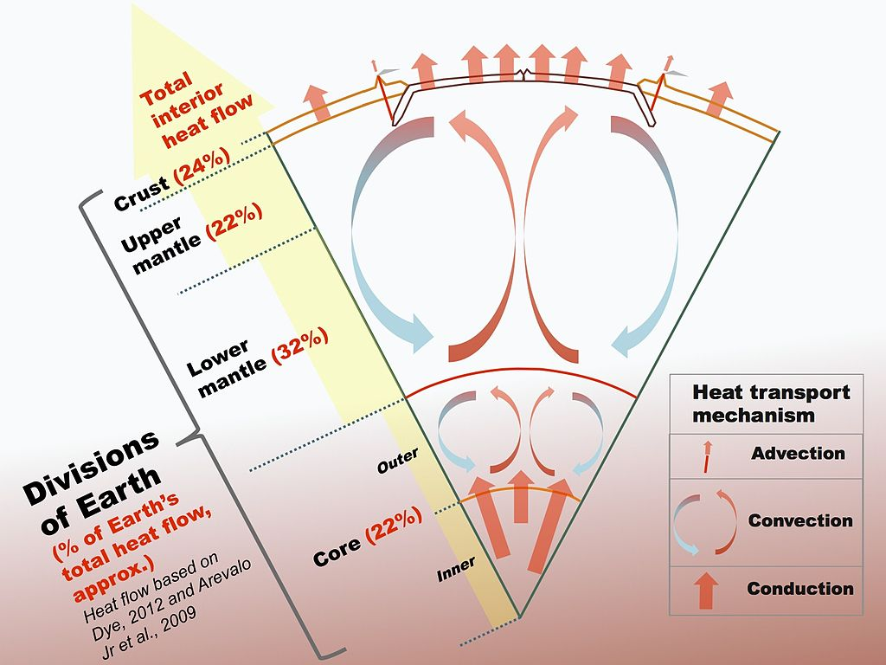
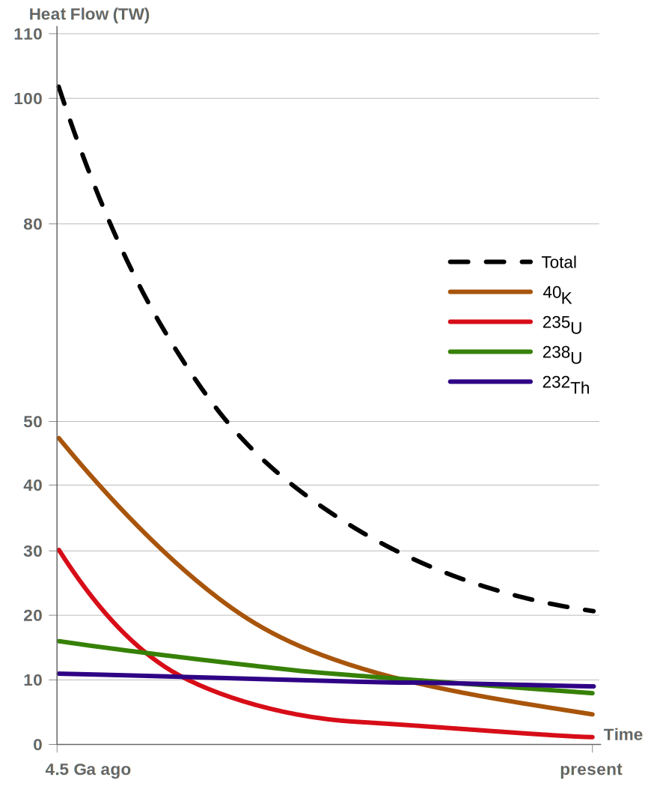
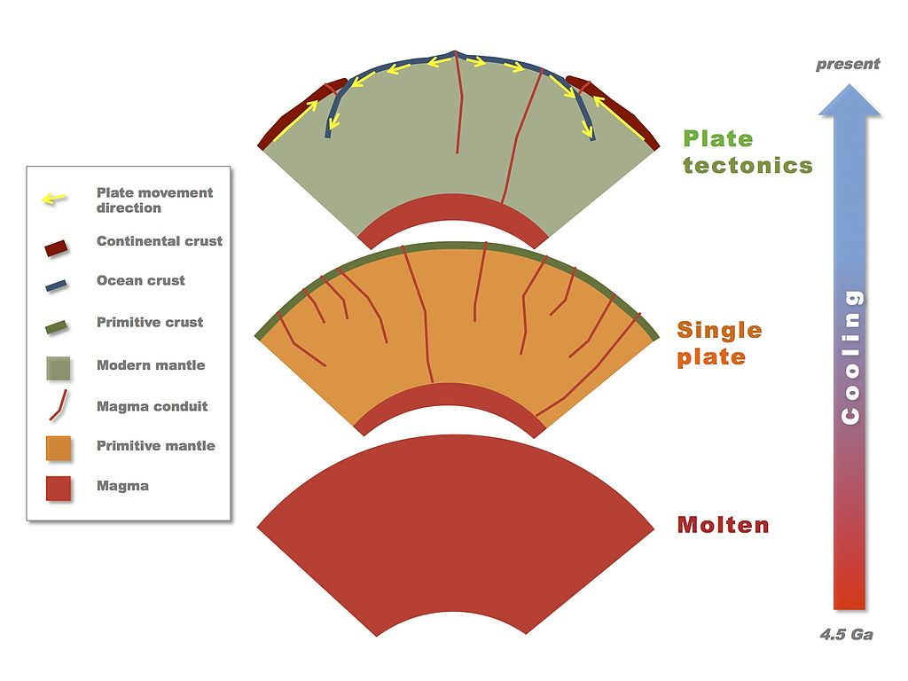

Global map of the flux of heat, in mW/m2, from Earth's interior to the surface. The largest values of heat flux coincide with [mid-ocean ridges](https://en.wikipedia.org/wiki/Mid-ocean_ridge "Mid-ocean ridge"), and the smallest values of heat flux occur in stable continental interiors.

**Earth's internal heat budget** is fundamental to the [thermal history of the Earth](https://en.wikipedia.org/wiki/Thermal_history_of_the_Earth "Thermal history of the Earth"). The flow of heat from Earth's interior to the surface is estimated at 47±2 [terawatts](https://en.wikipedia.org/wiki/Terawatt "Terawatt") (TW) and comes from two main sources in roughly equal amounts: the _radiogenic heat_ produced by the [radioactive decay](https://en.wikipedia.org/wiki/Radioactive_decay "Radioactive decay") of isotopes in the mantle and crust, and the _primordial heat_ left over from the [formation of Earth](/source/earth/#Formation "Earth").

Earth's internal heat travels along [geothermal gradients](https://en.wikipedia.org/wiki/Geothermal_gradient "Geothermal gradient") and powers most geological processes. It drives [mantle convection](https://en.wikipedia.org/wiki/Mantle_convection "Mantle convection"), [plate tectonics](https://en.wikipedia.org/wiki/Plate_tectonics "Plate tectonics"), [mountain building](https://en.wikipedia.org/wiki/Orogeny "Orogeny"), [rock metamorphism](https://en.wikipedia.org/wiki/Metamorphism "Metamorphism"), and [volcanism](https://en.wikipedia.org/wiki/Volcanism "Volcanism"). [Convective heat transfer](https://en.wikipedia.org/wiki/Convective_heat_transfer "Convective heat transfer") within the planet's [high-temperature metallic core](https://en.wikipedia.org/wiki/Earth's_core "Earth's core") is also theorized to sustain a [geodynamo](https://en.wikipedia.org/wiki/Geodynamo "Geodynamo") which generates [Earth's magnetic field](https://en.wikipedia.org/wiki/Earth's_magnetic_field "Earth's magnetic field").

Despite its geological significance, Earth's interior heat contributes only 0.03% of [Earth's total energy budget](https://en.wikipedia.org/wiki/Earth's_energy_budget "Earth's energy budget") at the surface, which is dominated by 173,000 TW of incoming [solar radiation](https://en.wikipedia.org/wiki/Solar_radiation "Solar radiation"). This external energy source powers most of the planet's atmospheric, oceanic, and biologic processes. Nevertheless on [land](https://en.wikipedia.org/wiki/Land "Land") and at the [ocean floor](https://en.wikipedia.org/wiki/Ocean_floor "Ocean floor"), the [sensible heat](https://en.wikipedia.org/wiki/Sensible_heat "Sensible heat") absorbed from non-reflected [insolation](https://en.wikipedia.org/wiki/Insolation "Insolation") flows inward only by means of [thermal conduction](https://en.wikipedia.org/wiki/Thermal_conduction "Thermal conduction"), and thus penetrates only a few dozen centimeters on the daily cycle and only a few dozen meters on the annual cycle. This renders solar radiation minimally relevant for processes internal to [Earth's crust](/source/earths-crust/ "Earth's crust").

Global data on heat-flow density are collected and compiled by the International Heat Flow Commission of the [International Association of Seismology and Physics of the Earth's Interior](https://en.wikipedia.org/wiki/International_Association_of_Seismology_and_Physics_of_the_Earth's_Interior "International Association of Seismology and Physics of the Earth's Interior").

## Heat and early estimate of Earth's age

Based on calculations of Earth's cooling rate, which assumed constant conductivity in the Earth's interior, in 1862 [William Thomson](https://en.wikipedia.org/wiki/William_Thomson,_1st_Baron_Kelvin "William Thomson, 1st Baron Kelvin"), later [Lord Kelvin](https://en.wikipedia.org/wiki/Lord_Kelvin "Lord Kelvin"), estimated the [age of the Earth](https://en.wikipedia.org/wiki/Age_of_the_Earth "Age of the Earth") at 98 million years, which contrasts with the age of 4.5 billion years obtained in the 20th century by [radiometric dating](https://en.wikipedia.org/wiki/Radiometric_dating "Radiometric dating"). As pointed out by John Perry in 1895 a variable conductivity in the Earth's interior could expand the computed age of the Earth to billions of years, as later confirmed by radiometric dating. Contrary to the usual representation of Thomson's argument, the observed thermal gradient of the Earth's crust would not be explained by the addition of radioactivity as a heat source. More significantly, [mantle convection](https://en.wikipedia.org/wiki/Mantle_convection "Mantle convection") alters how heat is transported within the Earth, invalidating Thomson's assumption of purely conductive cooling.

## Global internal heat flow

Cross section of the Earth showing its main divisions and their approximate contributions to Earth's total internal heat flow to the surface, and the dominant heat transport mechanisms within Earth

Estimates of the total heat flow from Earth's interior to surface span a range of 43 to 49 terawatts (TW) (a terawatt is 1012 [watts](https://en.wikipedia.org/wiki/Watt "Watt")). One recent estimate is 47 TW, equivalent to an average heat flux of 91.6 mW/m2, and is based on more than 38,000 measurements. The respective mean heat flows of continental and oceanic crust are 70.9 and 105.4 mW/m2.

While the total internal Earth heat flow to the surface is well constrained, the relative contribution of the two main sources of Earth's heat, radiogenic and primordial heat, are highly uncertain because their direct measurement is difficult. Chemical and physical models give estimated ranges of 15–41 TW and 12–30 TW for [radiogenic heat](https://en.wikipedia.org/wiki/Radiogenic_heat "Radiogenic heat") and primordial heat, respectively.

The [structure of Earth](https://en.wikipedia.org/wiki/Structure_of_Earth "Structure of Earth") is a rigid outer [crust](https://en.wikipedia.org/wiki/Crust_\(geology\) "Crust (geology)") that is composed of thicker [continental crust](https://en.wikipedia.org/wiki/Continental_crust "Continental crust") and thinner [oceanic crust](https://en.wikipedia.org/wiki/Oceanic_crust "Oceanic crust"), solid but plastically flowing [mantle](/source/mantle/ "Mantle (geology)"), a liquid [outer core](https://en.wikipedia.org/wiki/Outer_core "Outer core"), and a solid [inner core](https://en.wikipedia.org/wiki/Inner_core "Inner core"). The [fluidity](https://en.wikipedia.org/wiki/Viscosity "Viscosity") of a material is proportional to temperature; thus, the solid mantle can still flow on long time scales, as a function of its temperature and therefore as a function of the flow of Earth's internal heat. The [mantle convects](https://en.wikipedia.org/wiki/Mantle_convection "Mantle convection") in response to heat escaping from Earth's interior, with hotter and more buoyant mantle rising and cooler, and therefore denser, mantle sinking. This convective flow of the mantle drives the movement of Earth's [lithospheric plates](https://en.wikipedia.org/wiki/Lithosphere "Lithosphere"); thus, an additional reservoir of heat in the lower mantle is critical for the operation of plate tectonics and one possible source is an enrichment of radioactive elements in the lower mantle.

Earth heat transport occurs by [conduction](https://en.wikipedia.org/wiki/Conduction_\(heat\) "Conduction (heat)"), [mantle convection](https://en.wikipedia.org/wiki/Mantle_convection "Mantle convection"), [hydrothermal convection](https://en.wikipedia.org/wiki/Hydrothermal_circulation "Hydrothermal circulation"), and volcanic [advection](https://en.wikipedia.org/wiki/Advection "Advection"). Earth's internal heat flow to the surface is thought to be 80% due to mantle convection, with the remaining heat mostly originating in the Earth's crust, with about 1% due to volcanic activity, earthquakes, and mountain building. Thus, about 99% of Earth's internal heat loss at the surface is by conduction through the crust, and mantle convection is the dominant control on heat transport from deep within the Earth. Most of the heat flow from the thicker continental crust is attributed to internal radiogenic sources; in contrast the thinner oceanic crust has only 2% internal radiogenic heat. The remaining heat flow at the surface would be due to basal heating of the crust from mantle convection. Heat fluxes are negatively correlated with rock age, with the highest heat fluxes from the youngest rock at [mid-ocean ridge](https://en.wikipedia.org/wiki/Mid-ocean_ridge "Mid-ocean ridge") spreading centers (zones of mantle upwelling), as observed in the [global map of Earth heat flow](https://en.wikipedia.org/wiki/File:Earth_heat_flow.jpg "File:Earth heat flow.jpg").

## Sources of heat

### Radiogenic heat

The evolution of Earth's [radiogenic heat](https://en.wikipedia.org/wiki/Radiogenic_heat "Radiogenic heat") flow over time

The [radioactive decay](https://en.wikipedia.org/wiki/Radioactive_decay "Radioactive decay") of elements in the Earth's mantle and crust results in production of daughter [isotopes](https://en.wikipedia.org/wiki/Isotope "Isotope") and release of [geoneutrinos](https://en.wikipedia.org/wiki/Geoneutrino "Geoneutrino") and heat energy, or [radiogenic heat](https://en.wikipedia.org/wiki/Radiogenic_heat "Radiogenic heat"). About 50% of the Earth's internal heat originates from radioactive decay. Four radioactive isotopes are responsible for the majority of radiogenic heat because of their enrichment relative to other radioactive isotopes: [uranium-238](https://en.wikipedia.org/wiki/Uranium_238 "Uranium 238") (238U), [uranium-235](https://en.wikipedia.org/wiki/Uranium_235 "Uranium 235") (235U), [thorium-232](https://en.wikipedia.org/wiki/Thorium-232 "Thorium-232") (232Th), and [potassium-40](https://en.wikipedia.org/wiki/Potassium-40 "Potassium-40") (40K). Due to a lack of rock samples from below 200 km depth, it is difficult to determine precisely the radiogenic heat throughout the whole mantle, although some estimates are available.

For the Earth's core, [geochemical](https://en.wikipedia.org/wiki/Geochemical "Geochemical") studies indicate that it is unlikely to be a significant source of radiogenic heat due to an expected low concentration of radioactive elements partitioning into iron. Radiogenic heat production in the mantle is linked to the structure of [mantle convection](https://en.wikipedia.org/wiki/Mantle_convection "Mantle convection"), a topic of much debate, and it is thought that the mantle may either have a layered structure with a higher concentration of radioactive heat-producing elements in the lower mantle, or small reservoirs enriched in radioactive elements dispersed throughout the whole mantle.

An estimate of the present-day major heat-producing isotopes

IsotopeHeat release
⁠W/kg isotope⁠Half-life
yearsMean mantle concentration
⁠kg isotope/kg mantle⁠Heat release
⁠W/kg mantle⁠

232Th

26.4×10−6

14.0×109

124×10−9

3.27×10−12

238U

94.6×10−6

4.47×109

30.8×10−9

2.91×10−12

40K

29.2×10−6

1.25×109

36.9×10−9

1.08×10−12

235U

569×10−6

0.704×109

0.22×10−9

0.125×10−12

Geoneutrino detectors can detect the decay of 238U and 232Th and thus allow estimation of their contribution to the present radiogenic heat budget, while 235U and 40K are not thus detectable. Regardless, 40K is estimated to contribute 4 TW of heating. However, due to the short [half-lives](https://en.wikipedia.org/wiki/Half-life "Half-life") the decay of 235U and 40K contributed a large fraction of radiogenic heat flux to the early Earth, which was also much hotter than at present. Initial results from measuring the geoneutrino products of [radioactive decay](https://en.wikipedia.org/wiki/Radioactive_decay "Radioactive decay") from within the Earth, a [proxy](https://en.wikipedia.org/wiki/Proxy_\(statistics\) "Proxy (statistics)") for radiogenic heat, yielded a new estimate of half of the total Earth internal heat source being radiogenic, and this is consistent with previous estimates.

### Primordial heat

Primordial heat is the heat lost by the Earth as it continues to cool from its original formation, and this is in contrast to its still actively-produced radiogenic heat. The Earth core's heat flow—heat leaving the core and flowing into the overlying mantle—is thought to be due to primordial heat, and is estimated at 5–15 TW. Estimates of mantle primordial heat loss range between 7 and 15 TW, which is calculated as the remainder of heat after removal of core heat flow and bulk-Earth radiogenic heat production from the observed surface heat flow.

The early formation of the Earth's dense core could have caused superheating and rapid heat loss, and the heat loss rate would slow once the mantle solidified. Heat flow from the core is necessary for maintaining the convecting outer core and the geodynamo and [Earth's magnetic field](https://en.wikipedia.org/wiki/Earth's_magnetic_field "Earth's magnetic field"); therefore primordial heat from the core enabled Earth's atmosphere and thus helped retain Earth's liquid water.

Earth's tectonic evolution over time from a molten state at 4.5 Ga, to a single-plate lithosphere, to modern [plate tectonics](https://en.wikipedia.org/wiki/Plate_tectonics "Plate tectonics") sometime between 3.2  Ga and 1.0 Ga

Primordial heat energy comes from the [potential energy](https://en.wikipedia.org/wiki/Potential_energy "Potential energy") released by [collapsing](https://en.wikipedia.org/wiki/Gravitational_binding_energy "Gravitational binding energy") a large amount of matter into a [gravity well](https://en.wikipedia.org/wiki/Gravitational_potential "Gravitational potential"), and the [kinetic energy](https://en.wikipedia.org/wiki/Kinetic_energy "Kinetic energy") of accreted matter.

## Heat flow and tectonic plates

Controversy over the exact nature of mantle convection makes the linked evolution of Earth's heat budget and the dynamics and structure of the mantle difficult to unravel. There is evidence that the processes of [plate tectonics](https://en.wikipedia.org/wiki/Plate_tectonics "Plate tectonics") were not active in the Earth before 3.2 billion years ago, and that early Earth's internal heat loss could have been dominated by [advection](https://en.wikipedia.org/wiki/Advection "Advection") via heat-pipe [volcanism](https://en.wikipedia.org/wiki/Volcanism "Volcanism"). Terrestrial bodies with lower heat flows, such as the [Moon](https://en.wikipedia.org/wiki/Moon "Moon") and [Mars](https://en.wikipedia.org/wiki/Mars "Mars"), [conduct](https://en.wikipedia.org/wiki/Thermal_conduction "Thermal conduction") their internal heat through a single lithospheric plate, and higher heat flows, such as on Jupiter's moon [Io](https://en.wikipedia.org/wiki/Io_\(moon\) "Io (moon)"), result in [advective](https://en.wikipedia.org/wiki/Advection "Advection") heat transport via enhanced volcanism, while the active plate tectonics of Earth occur with an intermediate heat flow and a [convecting mantle](https://en.wikipedia.org/wiki/Mantle_convection "Mantle convection").
