Edicts of Ashoka

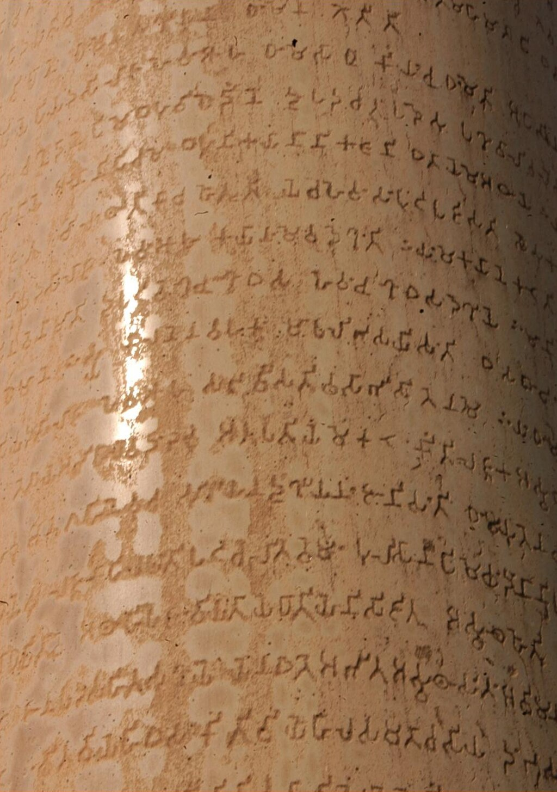

A [Major Pillar Edict](https://en.wikipedia.org/wiki/Major_Pillar_Edict "Major Pillar Edict") of [Ashoka](https://en.wikipedia.org/wiki/Ashoka "Ashoka"), in [Lauriya Araraj](https://en.wikipedia.org/wiki/Lauriya_Araraj "Lauriya Araraj"), [Bihar](https://en.wikipedia.org/wiki/Bihar "Bihar"), [India](https://en.wikipedia.org/wiki/India "India")

Material

Sandstone

Created

3rd century BCE

Present location

[Nepal](https://en.wikipedia.org/wiki/Nepal "Nepal"), [India](https://en.wikipedia.org/wiki/India "India"), [Pakistan](https://en.wikipedia.org/wiki/Pakistan "Pakistan"), [Afghanistan](https://en.wikipedia.org/wiki/Afghanistan "Afghanistan"), [Bangladesh](https://en.wikipedia.org/wiki/Bangladesh "Bangladesh")

Location

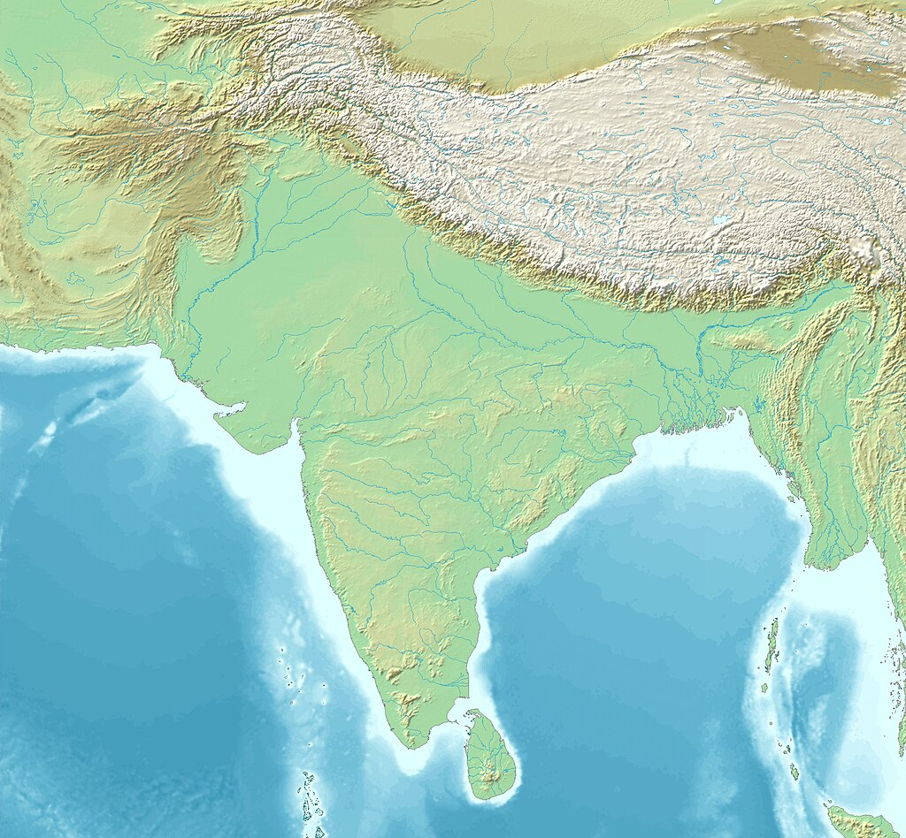

[**Bahapur**](https://en.wikipedia.org/wiki/Ashokan_Edicts_in_Delhi "Ashokan Edicts in Delhi")

[**Gujarra**](https://commons.wikimedia.org/wiki/Category:Ashoka%20Minor%20Rock%20Edict,%20Gujarra "commons:Category:Ashoka Minor Rock Edict, Gujarra")

**[Saru Maru](https://en.wikipedia.org/wiki/Saru_Maru "Saru Maru")**

**Udegolam**

**Nittur**

**[Maski](https://en.wikipedia.org/wiki/Maski "Maski")**

[Siddapur](https://commons.wikimedia.org/wiki/Category:Ashoka%20Minor%20Rock%20Edict,%20Siddapur "commons:Category:Ashoka Minor Rock Edict, Siddapur")

**Brahmagiri**

**Jatinga**

[**Pakilgundu**](https://commons.wikimedia.org/wiki/Category:Ashoka%20Minor%20Rock%20Edict,%20Palkigundu "commons:Category:Ashoka Minor Rock Edict, Palkigundu")

**Rajula Mandagiri**

**Yerragudi**

**Sasaram**

[**Rupnath**](https://commons.wikimedia.org/wiki/Category:Ashoka%20Minor%20Rock%20Edict,%20Rupnath "commons:Category:Ashoka Minor Rock Edict, Rupnath")

**[Bairat](https://en.wikipedia.org/wiki/Bairat "Bairat")**

[**Bhabru**](https://en.wikipedia.org/wiki/Bairat_Temple "Bairat Temple")

**[Ahraura](https://en.wikipedia.org/wiki/Ahraura "Ahraura")**

**[Barabar](https://en.wikipedia.org/wiki/Barabar_Caves "Barabar Caves")**

[**Taxila**](https://en.wikipedia.org/wiki/Aramaic_Inscription_of_Taxila "Aramaic Inscription of Taxila")
**([Aramaic](https://en.wikipedia.org/wiki/Aramaic "Aramaic"))**

**[Mahasthan](https://en.wikipedia.org/wiki/Mahasthan "Mahasthan")**

[**Laghman**](https://en.wikipedia.org/wiki/Aramaic_Inscription_of_Laghman "Aramaic Inscription of Laghman")
**([Aramaic](https://en.wikipedia.org/wiki/Aramaic "Aramaic"))**

**[Maski](https://en.wikipedia.org/wiki/Maski "Maski")**
[**Palkigundu**](https://commons.wikimedia.org/wiki/Category:Ashoka%20Minor%20Rock%20Edict,%20Palkigundu "commons:Category:Ashoka Minor Rock Edict, Palkigundu")
[**Gavimath**](https://commons.wikimedia.org/wiki/Category:Ashoka%20Minor%20Rock%20Edict,%20Gavimath "commons:Category:Ashoka Minor Rock Edict, Gavimath")
[**Jatinga/Rameshwara**](https://commons.wikimedia.org/wiki/Category:%20Ashoka%20Minor%20Rock%20Edict,%20Jatinga%20Rameshwara "commons:Category: Ashoka Minor Rock Edict, Jatinga Rameshwara")

[**Rajula/Mandagiri**](https://commons.wikimedia.org/wiki/Category:Ashoka%20Minor%20Rock%20Edicts,%20Rajula%20Mandagiri "commons:Category:Ashoka Minor Rock Edicts, Rajula Mandagiri")
[**Brahmagiri**](https://commons.wikimedia.org/wiki/Category:Ashoka%20Minor%20Rock%20Edict,%20Brahmagiri "commons:Category:Ashoka Minor Rock Edict, Brahmagiri")
[**Udegolam**](https://commons.wikimedia.org/wiki/Category:%20Ashoka%20Minor%20Rock%20Edict,%20Udegolam "commons:Category: Ashoka Minor Rock Edict, Udegolam")
[**Siddapur**](https://commons.wikimedia.org/wiki/Category:Ashoka%20Minor%20Rock%20Edict,%20Siddapur "commons:Category:Ashoka Minor Rock Edict, Siddapur")
[**Nittur**](https://commons.wikimedia.org/wiki/Category:%20Ashoka%20Minor%20Rock%20Edict,%20Nittur "commons:Category: Ashoka Minor Rock Edict, Nittur")

**[Ahraura](https://en.wikipedia.org/wiki/Ahraura "Ahraura")**
[**Sasaram**](https://commons.wikimedia.org/wiki/Category:Ashoka%20Minor%20Rock%20Edict,%20Sasaram "commons:Category:Ashoka Minor Rock Edict, Sasaram")

[Kandahar](https://en.wikipedia.org/wiki/Kandahar_Greek_Edict_of_Ashoka "Kandahar Greek Edict of Ashoka")
([Greek](https://en.wikipedia.org/wiki/Greek_language "Greek language") and [Aramaic](https://en.wikipedia.org/wiki/Aramaic_language "Aramaic language"))

[Kandahar](https://en.wikipedia.org/wiki/Kandahar_Greek_Edict_of_Ashoka "Kandahar Greek Edict of Ashoka")

[Yerragudi](https://commons.wikimedia.org/wiki/Category:Ashoka%20Major%20Rock%20Edict,%20Yerragudi "commons:Category:Ashoka Major Rock Edict, Yerragudi")

[Girnar](https://en.wikipedia.org/wiki/Girnar "Girnar")

[Dhauli](https://en.wikipedia.org/wiki/Dhauli "Dhauli")

[Khalsi](https://en.wikipedia.org/wiki/Khalsi_inscription "Khalsi inscription")

[Sopara](https://en.wikipedia.org/wiki/Nala_Sopara "Nala Sopara")

[Jaugada](https://en.wikipedia.org/wiki/Jaugada "Jaugada")

[Shahbazgarhi](https://en.wikipedia.org/wiki/Shahbazgarhi "Shahbazgarhi")

[Mansehra](https://en.wikipedia.org/wiki/Mansehra_Rock_Edicts "Mansehra Rock Edicts")

[Sannati](https://en.wikipedia.org/wiki/Sannati "Sannati")

[Sarnath](https://en.wikipedia.org/wiki/Sarnath "Sarnath")

[Sanchi](https://en.wikipedia.org/wiki/Sanchi "Sanchi")

[Lumbini](https://en.wikipedia.org/wiki/Lumbini_pillar_inscription "Lumbini pillar inscription")
[Nigali Sagar](https://en.wikipedia.org/wiki/Nigali_Sagar "Nigali Sagar")

[Nigali Sagar](https://en.wikipedia.org/wiki/Nigali_Sagar "Nigali Sagar")

[Nandangarh](https://en.wikipedia.org/wiki/Lauria_Nandangarh "Lauria Nandangarh")

[Kosambi](https://en.wikipedia.org/wiki/Kosambi "Kosambi")

[Meerut!](https://en.wikipedia.org/wiki/Meerut "Meerut")

[Araraj](https://en.wikipedia.org/wiki/Lauriya_Araraj "Lauriya Araraj")

[Araraj,](https://en.wikipedia.org/wiki/Lauriya_Araraj "Lauriya Araraj")[Rampurva](https://en.wikipedia.org/wiki/Rampurva "Rampurva")

[Rampurva](https://en.wikipedia.org/wiki/Rampurva "Rampurva")

_[Ai Khanoum](https://en.wikipedia.org/wiki/Ai_Khanoum "Ai Khanoum")_
(Greek city)

_[Pataliputra](https://en.wikipedia.org/wiki/Pataliputra "Pataliputra")_

_[Ujjain](https://en.wikipedia.org/wiki/Ujjain "Ujjain")_

! Location of the [Minor Rock Edicts](https://en.wikipedia.org/wiki/Minor_Rock_Edicts "Minor Rock Edicts") (Edicts 1, 2 & 3)
! Other inscriptions often classified as Minor Rock Edicts
! Location of the [Major Rock Edicts](https://en.wikipedia.org/wiki/Major_Rock_Edicts "Major Rock Edicts")
! Location of the [Minor Pillar Edicts](https://en.wikipedia.org/wiki/Minor_Pillar_Edicts "Minor Pillar Edicts")
! Original location of the [Major Pillar Edicts](https://en.wikipedia.org/wiki/Major_Pillar_Edicts "Major Pillar Edicts")
! Capital cities

The **Edicts of Ashoka** are a collection of more than thirty inscriptions on the [Pillars of Ashoka](https://en.wikipedia.org/wiki/Pillars_of_Ashoka "Pillars of Ashoka"), as well as boulders and cave walls, attributed to Emperor [Ashoka](https://en.wikipedia.org/wiki/Ashoka "Ashoka") of the [Mauryan Empire](https://en.wikipedia.org/wiki/Mauryan_Empire "Mauryan Empire") who ruled most of the [Indian subcontinent](https://en.wikipedia.org/wiki/Indian_subcontinent "Indian subcontinent") from 268 BCE to 232 BCE. These inscriptions were dispersed throughout the areas of modern-day [India](https://en.wikipedia.org/wiki/India "India"), [Bangladesh](https://en.wikipedia.org/wiki/Bangladesh "Bangladesh"), [Nepal](https://en.wikipedia.org/wiki/Nepal "Nepal"), [Afghanistan](https://en.wikipedia.org/wiki/Afghanistan "Afghanistan") and [Pakistan](https://en.wikipedia.org/wiki/Pakistan "Pakistan"), and provide the first tangible evidence of [Buddhism](https://en.wikipedia.org/wiki/Buddhism "Buddhism"). The Edicts are the earliest written and datable texts from India, and, since they were inscribed on stone, we have the added benefit of having them exactly as they were originally inscribed. Earlier texts, such as the Vedic texts, were all composed and handed down orally until later dates.

Ashoka used the expression _Dhaṃma [Lipi](https://en.wikipedia.org/wiki/Lipi_\(script\) "Lipi (script)")_ ([Prakrit](https://en.wikipedia.org/wiki/Prakrit "Prakrit") in the [Brahmi script](https://en.wikipedia.org/wiki/Brahmi_script "Brahmi script"): [𑀥𑀁𑀫𑀮𑀺𑀧𑀺](https://en.wiktionary.org/wiki/𑀥𑀁𑀫𑀮𑀺𑀧𑀺 "wikt:𑀥𑀁𑀫𑀮𑀺𑀧𑀺"), "Inscriptions of the [Dharma](https://en.wikipedia.org/wiki/Dharma "Dharma")") to describe his own Edicts. The edicts describe in detail [Ashoka's policy on dhamma](https://en.wikipedia.org/wiki/Ashoka's_policy_of_Dhamma "Ashoka's policy of Dhamma"), an earnest attempt to solve some of the problems that a complex society faced. According to the edicts, the extent of his promotion of _dhamma_ during this period reached as far as the Greeks in the [Mediterranean](https://en.wikipedia.org/wiki/Mediterranean_Basin "Mediterranean Basin") region. While the inscriptions mention the conversion of Ashoka to Buddhism, the _dhamma_ that he promotes is largely ecumenical and non-sectarian in nature. As historian Romila Thapar relates:

> In his edicts Aśoka defines the main principles of _dhamma_ as non-violence, tolerance of all sects and opinions, obedience to parents, respect to brahmins and other religious teachers and priests, liberality toward friends, humane treatment of servants and generosity towards all. It suggests a general ethic of behaviour to which no religious or social group could object. It also could act as a focus of loyalty to weld together the diverse strands that made up the empire. Interestingly, the Greek versions of these edicts translate _dhamma_ as _eusebeia_ (piety) and no mention is made anywhere of the teachings of the Buddha, as would be expected if Aśoka had been propagating Buddhism.’

The inscriptions show his efforts to develop the _dhamma_ throughout his empire. Although Buddhism as well as [Gautama Buddha](https://en.wikipedia.org/wiki/Gautama_Buddha "Gautama Buddha") are mentioned, the edicts focus on social and moral precepts rather than specific religious practices or the philosophical dimension of Buddhism. These were located in public places and were meant for people to read.

In these inscriptions, Ashoka refers to himself as "Beloved of the Gods" (_[Devanampiya](https://en.wikipedia.org/wiki/Devanampiya "Devanampiya")_). The identification of Devanampiya with Ashoka was confirmed by an inscription discovered in 1915 by C. Beadon, a British gold-mining engineer, at [Maski](https://en.wikipedia.org/wiki/Maski "Maski"), a town in [Madras Presidency](https://en.wikipedia.org/wiki/Madras_Presidency "Madras Presidency") (present day [Raichur district](https://en.wikipedia.org/wiki/Raichur_district "Raichur district"), [Karnataka](https://en.wikipedia.org/wiki/Karnataka "Karnataka")). Another minor rock edict, found at the village [Gujarra](https://commons.wikimedia.org/wiki/Category:Ashoka%20Minor%20Rock%20Edict,%20Gujarra "commons:Category:Ashoka Minor Rock Edict, Gujarra") in [Gwalior State](https://en.wikipedia.org/wiki/Gwalior_State "Gwalior State") (present day [Datia district](https://en.wikipedia.org/wiki/Datia_district "Datia district") of [Madhya Pradesh](https://en.wikipedia.org/wiki/Madhya_Pradesh "Madhya Pradesh")), also used the name of Ashoka together with his titles: _Devanampiya [Piyadasi](https://en.wikipedia.org/wiki/Priyadasi "Priyadasi") Asokaraja_. The inscriptions found in the central and eastern part of India were written in [Magadhi Prakrit](https://en.wikipedia.org/wiki/Magadhi_Prakrit "Magadhi Prakrit") using the [Brahmi script](https://en.wikipedia.org/wiki/Brahmi_script "Brahmi script"), while [Prakrit](https://en.wikipedia.org/wiki/Prakrit "Prakrit") using the [Kharoshthi](https://en.wikipedia.org/wiki/Kharoshthi "Kharoshthi") script, [Greek](https://en.wikipedia.org/wiki/Greek_language "Greek language") and [Aramaic](https://en.wikipedia.org/wiki/Aramaic "Aramaic") were used in the northwest. These edicts were deciphered by British [archaeologist](https://en.wikipedia.org/wiki/Archaeology "Archaeology") and historian [James Prinsep](https://en.wikipedia.org/wiki/James_Prinsep "James Prinsep").

The inscriptions revolve around a few recurring themes: Ashoka's conversion to Buddhism, the description of his efforts to spread _dhamma_, his moral and religious precepts, and his social and [animal welfare](https://en.wikipedia.org/wiki/Animal_welfare "Animal welfare") program. The edicts were based on Ashoka's ideas on administration and behavior of people towards one another and religion.

## Decipherment

[Brahmi script](https://en.wikipedia.org/wiki/Brahmi_script "Brahmi script") consonants, and their evolution down to modern [Devanagari](https://en.wikipedia.org/wiki/Devanagari "Devanagari"), according to [James Prinsep](https://en.wikipedia.org/wiki/James_Prinsep "James Prinsep"), as published in the Journal of the [Asiatic Society of Bengal](https://en.wikipedia.org/wiki/Asiatic_Society_of_Bengal "Asiatic Society of Bengal"), in March 1838. All the letters are correctly deciphered, except for two missing on the right: 𑀰(ś) and 𑀱(ṣ).

Besides a few inscriptions in [Greek](https://en.wikipedia.org/wiki/Greek_language "Greek language") and [Aramaic](https://en.wikipedia.org/wiki/Aramaic_language "Aramaic language") (which were discovered only in the 20th century), the Edicts were mostly written in the [Brahmi script](https://en.wikipedia.org/wiki/Brahmi_script "Brahmi script") and sometimes in the [Kharoshthi script](https://en.wikipedia.org/wiki/Kharoshthi_script "Kharoshthi script") in the northwest, two Indian scripts which had both become extinct around the 5th century CE, and were yet undeciphered at the time the Edicts were discovered and investigated in the 19th century.

The first successful attempts at deciphering the ancient [Brahmi script](https://en.wikipedia.org/wiki/Brahmi_script "Brahmi script") were made in 1836 by Norwegian scholar [Christian Lassen](https://en.wikipedia.org/wiki/Christian_Lassen "Christian Lassen"), who used the bilingual Greek-Brahmi coins of [Indo-Greek](https://en.wikipedia.org/wiki/Indo-Greek "Indo-Greek") king [Agathocles](https://en.wikipedia.org/wiki/Agathocles_of_Bactria "Agathocles of Bactria") to correctly and securely identify several Brahmi letters. The task was then completed by [James Prinsep](https://en.wikipedia.org/wiki/James_Prinsep "James Prinsep"), an archaeologist, philologist, and official of the [East India Company](https://en.wikipedia.org/wiki/East_India_Company "East India Company"), who was able to identify the rest of the Brahmi characters, with the help of [Major Cunningham](https://en.wikipedia.org/wiki/Major_Cunningham "Major Cunningham"). In a series of results that he published in March 1838 Prinsep was able to translate the inscriptions on a large number of rock edicts found around India, and to provide, according to [Richard Salomon](https://en.wikipedia.org/wiki/Richard_G._Salomon_\(professor_of_Asian_studies\) "Richard G. Salomon (professor of Asian studies)"), a "virtually perfect" rendering of the full Brahmi alphabet. The edicts in [Brahmi script](https://en.wikipedia.org/wiki/Brahmi_script "Brahmi script") mentioned a King [Devanampriya](https://en.wikipedia.org/wiki/Devanampriya "Devanampriya") Piyadasi which Prinsep initially assumed was a Sri Lankan king. He was then able to associate this title with Ashoka on the basis of [Pali script](https://en.wikipedia.org/wiki/Pali_script "Pali script") from Sri Lanka communicated to him by [George Turnour](https://en.wikipedia.org/wiki/George_Turnour "George Turnour").

The [Kharoshthi script](https://en.wikipedia.org/wiki/Kharoshthi_script "Kharoshthi script"), written from right to left, and associated with [Aramaic](https://en.wikipedia.org/wiki/Aramaic "Aramaic"), was also deciphered by [James Prinsep](https://en.wikipedia.org/wiki/James_Prinsep "James Prinsep") in parallel with [Christian Lassen](https://en.wikipedia.org/wiki/Christian_Lassen "Christian Lassen"), using the bilingual Greek-Kharoshthi coinage of the [Indo-Greek](https://en.wikipedia.org/wiki/Indo-Greek "Indo-Greek") and [Indo-Scythian](https://en.wikipedia.org/wiki/Indo-Scythian "Indo-Scythian") kings. "Within the incredibly brief space of three years (1834-37) the mystery of both the Kharoshthi and Brahmi scripts (were unlocked), the effect of which was instantly to remove the thick crust of oblivion which for many centuries had concealed the character and the language of the earliest epigraphs".

## The Edicts

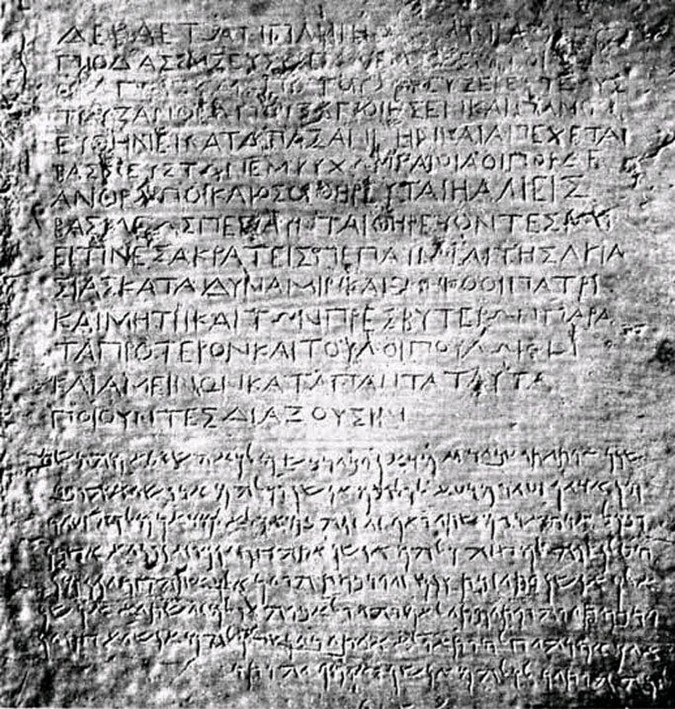The first known inscription by Ashoka, the [Kandahar Bilingual Rock Inscription](https://en.wikipedia.org/wiki/Kandahar_Bilingual_Rock_Inscription "Kandahar Bilingual Rock Inscription"), in Greek and in Aramaic, written in the 10th year of his reign (260 BCE).

The Edicts are divided into four categories, according to their size (Minor or Major) and according to their medium (Rock or Pillar). Chronologically, the minor inscriptions tend to precede the larger ones, while rock inscriptions generally seem to have been started earlier than the pillar inscriptions:

*   [Minor Rock Edicts](https://en.wikipedia.org/wiki/Minor_Rock_Edicts "Minor Rock Edicts"): Edicts inscribed at the beginning of Ashoka's reign; in [Prakrit](https://en.wikipedia.org/wiki/Prakrit "Prakrit"), [Greek](https://en.wikipedia.org/wiki/Greek_language "Greek language") and [Aramaic](https://en.wikipedia.org/wiki/Aramaic "Aramaic").
*   [Minor Pillar Edicts](https://en.wikipedia.org/wiki/Minor_Pillar_Edicts "Minor Pillar Edicts"): Schism Edict, [Queen's Edict](https://en.wikipedia.org/wiki/Queen's_edict "Queen's edict"), [Rummindei](https://en.wikipedia.org/wiki/Rummindei "Rummindei") Edict, [Nigali Sagar](https://en.wikipedia.org/wiki/Nigali_Sagar "Nigali Sagar") Edict; in [Prakrit](https://en.wikipedia.org/wiki/Prakrit "Prakrit").
*   [Major Rock Edicts](https://en.wikipedia.org/wiki/Major_Rock_Edicts "Major Rock Edicts"): 14 Edicts (termed 1st to 14th) and 2 separate ones found in [Odisha](https://en.wikipedia.org/wiki/Odisha "Odisha"); in [Prakrit](https://en.wikipedia.org/wiki/Prakrit "Prakrit") and [Greek](https://en.wikipedia.org/wiki/Greek_language "Greek language").
*   [Major Pillar Edicts](https://en.wikipedia.org/wiki/Major_Pillar_Edicts "Major Pillar Edicts"): 7 Edicts, inscribed at the end of Ashoka's reign; in [Prakrit](https://en.wikipedia.org/wiki/Prakrit "Prakrit").

\*\*General content\*\*

The [Minor Rock Edicts](https://en.wikipedia.org/wiki/Minor_Rock_Edicts "Minor Rock Edicts") (in which Ashoka is sometimes named in person, as in [Maski](https://en.wikipedia.org/wiki/Maski "Maski") and [Gujarra](https://commons.wikimedia.org/wiki/Category:Ashoka%20Minor%20Rock%20Edict,%20Gujarra "commons:Category:Ashoka Minor Rock Edict, Gujarra")) as well as the [Minor Pillar Edicts](https://en.wikipedia.org/wiki/Minor_Pillar_Edicts "Minor Pillar Edicts") are very religious in their content: they mention extensively the [Buddha](https://en.wikipedia.org/wiki/Buddha "Buddha") (and even previous [Buddhas](https://en.wikipedia.org/wiki/Buddhahood "Buddhahood") as in the [Nigali Sagar](https://en.wikipedia.org/wiki/Nigali_Sagar "Nigali Sagar") inscription), the [Sangha](https://en.wikipedia.org/wiki/Sangha "Sangha"), Buddhism and Buddhist scriptures (as in the [Bairat Temple](https://en.wikipedia.org/wiki/Bairat_Temple "Bairat Temple") Edict).

On the contrary, the [Major Rock Edicts](https://en.wikipedia.org/wiki/Major_Rock_Edicts "Major Rock Edicts") and [Major Pillar Edicts](https://en.wikipedia.org/wiki/Major_Pillar_Edicts "Major Pillar Edicts") are essentially moral and political in nature: they never mention the Buddha or explicit Buddhist teachings, but are preoccupied with order, proper behavior and non violence under the general concept of "[Dharma](https://en.wikipedia.org/wiki/Dharma "Dharma")", and they also focus on the administration of the state and positive relations with foreign countries as far as the [Hellenistic](https://en.wikipedia.org/wiki/Hellenistic "Hellenistic") [Mediterranean](https://en.wikipedia.org/wiki/Mediterranean_Basin "Mediterranean Basin") of the mid-3rd century BCE.

### Minor Rock Edicts

Minor Rock Edicts

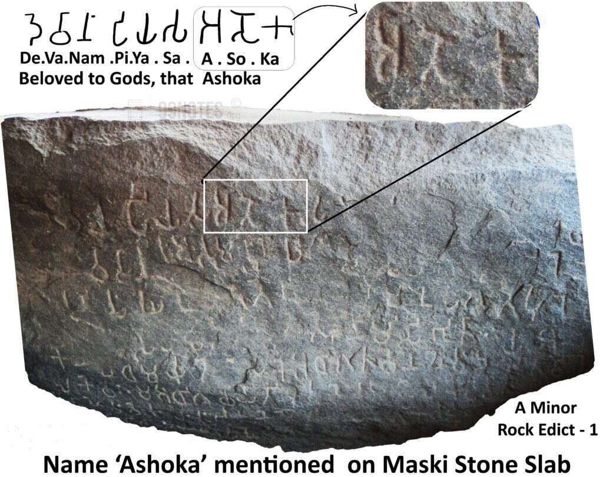

Minor Rock Edict from [Maski](https://en.wikipedia.org/wiki/Maski "Maski").

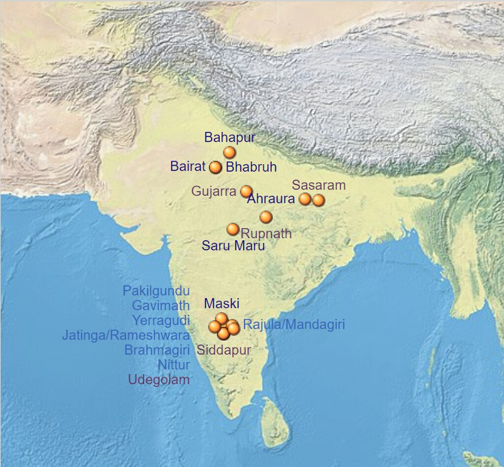

Map of the Minor Rock Edicts

The Minor Rock Edicts are often Buddhist in character, and some of them specifically mention the name "Asoka" (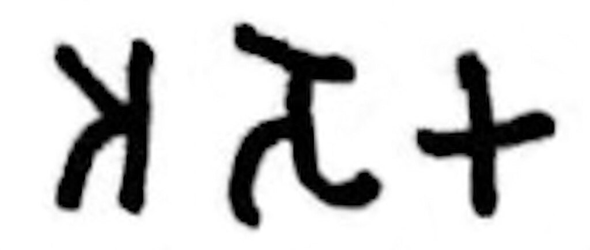, center of the top line) in conjunction with the title "Devanampriya" (Beloved-of-the-gods).

The [Minor Rock Edicts](https://en.wikipedia.org/wiki/Minor_Rock_Edicts "Minor Rock Edicts") of Ashoka (r.269-233 BCE) are rock inscriptions which form the earliest part of the Edicts of Ashoka. They predate [Ashoka's Major Rock Edicts](https://en.wikipedia.org/wiki/Ashoka's_Major_Rock_Edicts "Ashoka's Major Rock Edicts").

Chronologically, the first known edict, sometimes classified as a Minor Rock Edict, is the [Kandahar Bilingual Rock Inscription](https://en.wikipedia.org/wiki/Kandahar_Bilingual_Rock_Inscription "Kandahar Bilingual Rock Inscription"), in Greek and in Aramaic, written in the 10th year of his reign (260 BCE) at the border of his empire with the [Hellenistic world](https://en.wikipedia.org/wiki/Hellenistic_world "Hellenistic world"), in the city of [Old Kandahar](https://en.wikipedia.org/wiki/Old_Kandahar "Old Kandahar") in modern [Afghanistan](https://en.wikipedia.org/wiki/Afghanistan "Afghanistan").

Ashoka then made the first edicts in the Indian language, written in the [Brahmi](https://en.wikipedia.org/wiki/Brahmi "Brahmi") script, from the 11th year of his reign (according to his own inscription, "two and a half years after becoming a secular Buddhist", i.e. two and a half years at least after returning from the [Kalinga conquest](https://en.wikipedia.org/wiki/Kalinga_war "Kalinga war") of the eighth year of his reign, which is the starting point for his remorse towards the horrors of the war, and his gradual conversion to Buddhism). The texts of the inscriptions are rather short, the technical quality of the engraving of the inscriptions is generally very poor, and generally very inferior to the pillar edicts dated to the years 26 and 27 of Ashoka's reign.

There are several slight variations in the content of these edicts, depending on location, but a common designation is usually used, with Minor Rock Edict N°1 (MRE1) and a Minor Rock Edict N°2 (MRE2, which does not appear alone but always in combination with Edict N°1), the different versions being generally aggregated in most translations. The [Maski](https://en.wikipedia.org/wiki/Maski "Maski") version of Minor Rock Edict No.1 is historically particularly important in that it confirmed the association of the title "[Devanampriya](https://en.wikipedia.org/wiki/Devanampriya "Devanampriya")" with the name "Asoka", thereby clarifying the historical author of all these inscriptions. In the [Gujarra](https://commons.wikimedia.org/wiki/Category:Ashoka%20Minor%20Rock%20Edict,%20Gujarra "commons:Category:Ashoka Minor Rock Edict, Gujarra") version of Minor Rock Edict No.1 also, the name of Ashoka is used together with his full title: _[Devanampiya](https://en.wikipedia.org/wiki/Devanampriya "Devanampriya") [Piyadasi](https://en.wikipedia.org/wiki/Priyadasi "Priyadasi") Asoka[raja](https://en.wikipedia.org/wiki/Raja "Raja")_.

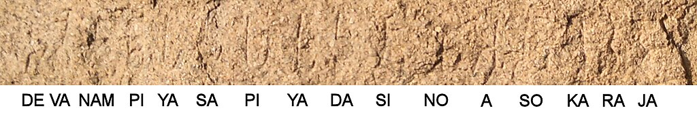The full title _[Devanampiyasa](https://en.wikipedia.org/wiki/Devanampriya "Devanampriya") [Piyadasino](https://en.wikipedia.org/wiki/Priyadasi "Priyadasi") Asoka[raja](https://en.wikipedia.org/wiki/Raja "Raja")_ (𑀤𑁂𑀯𑀸𑀦𑀁𑀧𑀺𑀬𑀲 𑀧𑀺𑀬𑀤𑀲𑀺𑀦𑁄 𑀅𑀲𑁄𑀓𑀭𑀸𑀚) in the [Gujarra inscription](https://commons.wikimedia.org/wiki/Category:Ashoka%20Minor%20Rock%20Edict,%20Gujarra "commons:Category:Ashoka Minor Rock Edict, Gujarra").

There is also a unique Minor Rock Edict No.3, discovered next to [Bairat Temple](https://en.wikipedia.org/wiki/Bairat_Temple "Bairat Temple"), for the Buddhist clergy, which gives a list of Buddhist scriptures (most of them unknown today) which the clergy should study regularly.

A few other inscriptions of Ashoka in [Aramaic](https://en.wikipedia.org/wiki/Aramaic "Aramaic"), which are not strictly edicts, but tend to share a similar content, are sometimes also categorized as "Minor Rock Edicts". The dedicatory inscriptions of the [Barabar caves](https://en.wikipedia.org/wiki/Barabar_caves "Barabar caves") are also sometimes classified among the Minor Rock Edicts of Ashoka.

The Minor Rock Edicts can be found throughout the territory of Ashoka, including in the frontier area near the [Hindu Kush](https://en.wikipedia.org/wiki/Hindu_Kush "Hindu Kush"), and are especially numerous in the southern, newly conquered, frontier areas of [Karnataka](https://en.wikipedia.org/wiki/Karnataka "Karnataka") and southern [Andhra Pradesh](https://en.wikipedia.org/wiki/Andhra_Pradesh "Andhra Pradesh").

### Minor Pillar Edicts

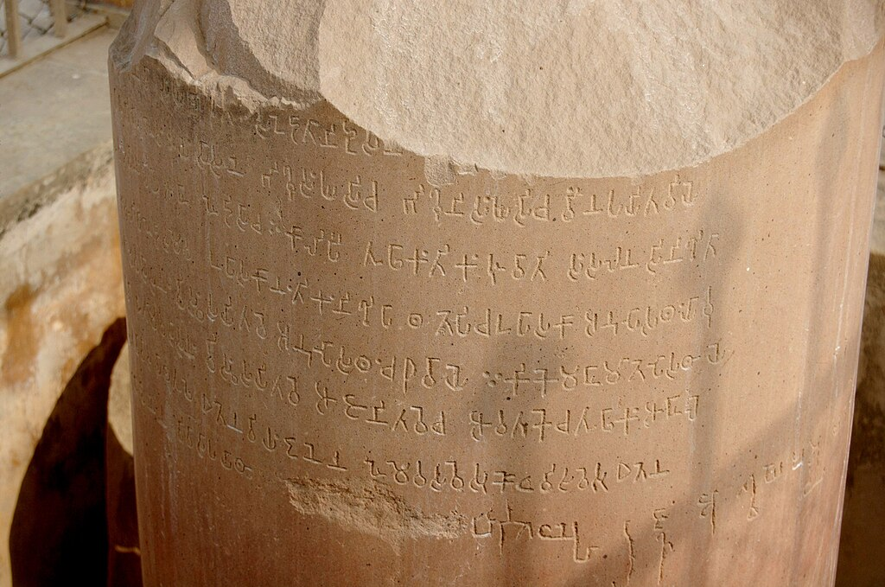

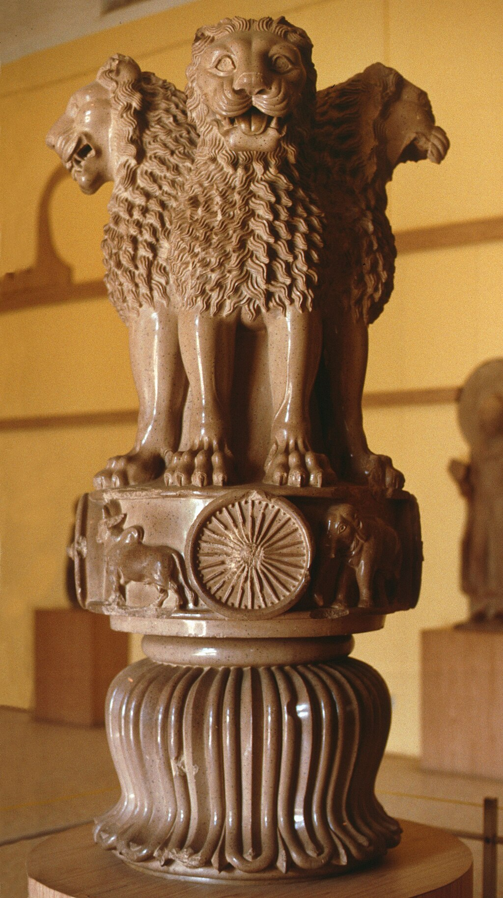

Minor Pillar Edict on the [Sarnath](https://en.wikipedia.org/wiki/Sarnath "Sarnath")[pillar of Ashoka](https://en.wikipedia.org/wiki/Pillar_of_Ashoka "Pillar of Ashoka"), and the [Lion Capital of Ashoka](https://en.wikipedia.org/wiki/Lion_Capital_of_Ashoka "Lion Capital of Ashoka") which crowned it.

The [Minor Pillar Edicts](https://en.wikipedia.org/wiki/Minor_Pillar_Edicts "Minor Pillar Edicts") of Ashoka refer to five separate minor Edicts inscribed on columns, the [Pillars of Ashoka](https://en.wikipedia.org/wiki/Pillars_of_Ashoka "Pillars of Ashoka"). These edicts are preceded chronologically by the Minor Rock Edicts and may have been made in parallel with the Major Rock Edicts.

The inscription technique is generally very poor compared for example to the later [Major Pillar Edicts](https://en.wikipedia.org/wiki/Major_Pillar_Edicts "Major Pillar Edicts"), however the Minor Pillar Edicts are often associated with some of the artistically most sophisticated pillar capitals of Ashoka, such as the [Lion Capital of Ashoka](https://en.wikipedia.org/wiki/Lion_Capital_of_Ashoka "Lion Capital of Ashoka"), which crowned the [Sarnath](https://en.wikipedia.org/wiki/Sarnath "Sarnath") Minor Pillar Edict, or the very similar, but less well-preserved [Sanchi](https://en.wikipedia.org/wiki/Sanchi "Sanchi") lion [capital](https://en.wikipedia.org/wiki/Capital_\(architecture\) "Capital (architecture)"), which crowned the very clumsily inscribed Schism Edict of Sanchi. According to Irwin, the Brahmi inscriptions on the Sarnath and Sanchi pillars were made by inexperienced Indian engravers at a time when stone engraving was still new in India, whereas the very refined Sarnath capital itself was made under the tutelage of craftsmen from the former [Achaemenid Empire](https://en.wikipedia.org/wiki/Achaemenid_Empire "Achaemenid Empire"), trained in Perso-Hellenistic statuary and employed by Ashoka. This suggests that the most sophisticated capitals were actually the earliest in the sequence of [Ashokan pillars](https://en.wikipedia.org/wiki/Pillars_of_Ashoka "Pillars of Ashoka") and that style degraded over a short period of time.

These edicts were probably made at the beginning of the reign of Ashoka (reigned 268-232 BCE), from the year 12 of his reign, that is, from 256 BCE.

The Minor Pillar Edicts are the Schism Edict, warning of punishment for dissent in the [Samgha](https://en.wikipedia.org/wiki/Samgha "Samgha"), the Queen's Edict, and the [Rummindei](https://en.wikipedia.org/wiki/Rummindei "Rummindei") Edict as well as the [Nigali Sagar](https://en.wikipedia.org/wiki/Nigali_Sagar "Nigali Sagar") Edict which record Ashoka's visits and Buddhist dedications in the area corresponding to today's [Nepal](https://en.wikipedia.org/wiki/Nepal "Nepal"). The Rummindei and Nigali Sagar edicts, inscribed on pillars erected by Ashoka later in his reign (19th and 20th year) display a high level of inscriptional technique with a good regularity in the lettering.

### Major Rock Edicts

Major Rock Edicts

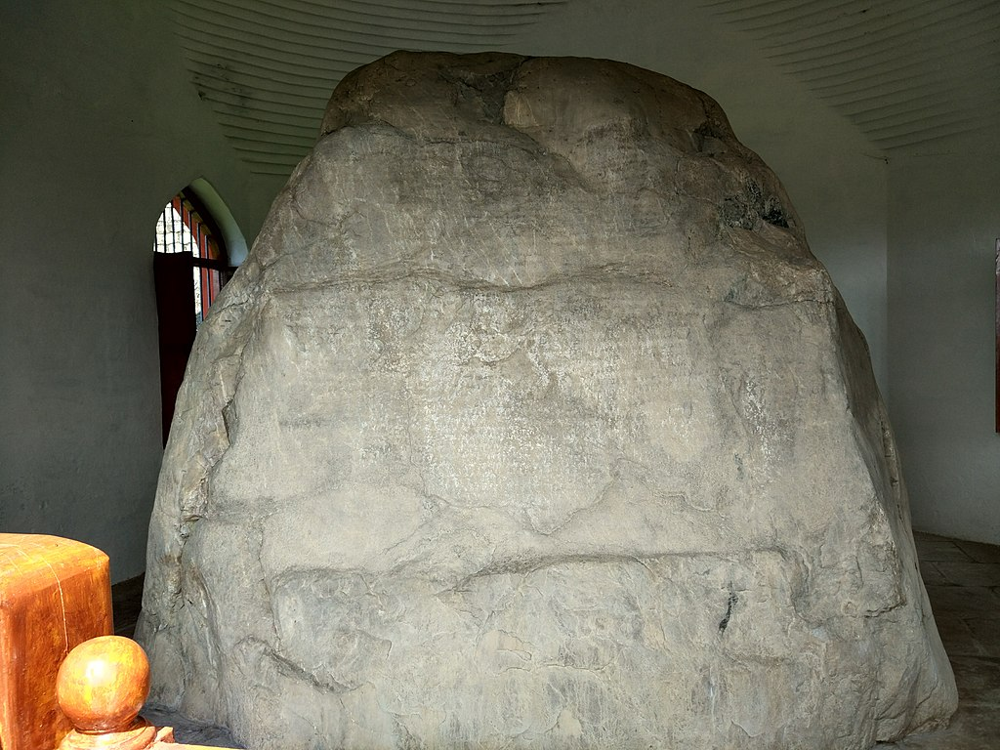

[Rock edicts of Khalsi](https://en.wikipedia.org/wiki/Rock_edicts_of_Khalsi "Rock edicts of Khalsi")

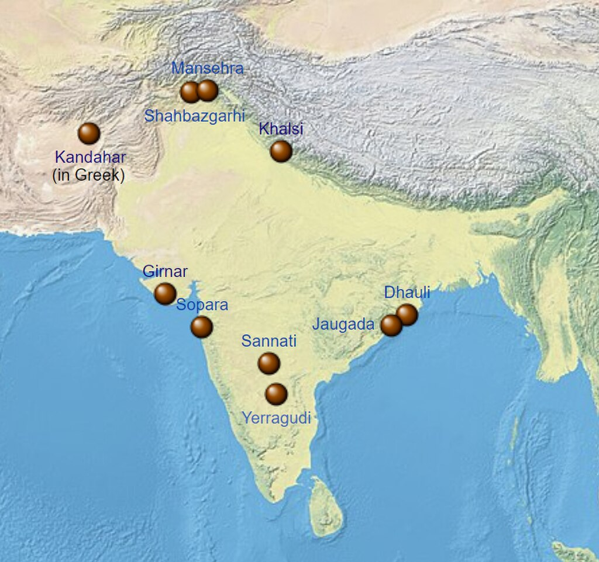

Map of the Major Rock Edicts

The [Major Rock Edicts](https://en.wikipedia.org/wiki/Major_Rock_Edicts "Major Rock Edicts") of [Ashoka](https://en.wikipedia.org/wiki/Ashoka "Ashoka") refer to 14 separate major Edicts, which are significantly detailed and extensive. These Edicts were concerned with practical instructions in running the empire such as the design of irrigation systems and descriptions of Ashoka's beliefs in peaceful moral behavior. They contain little personal detail about his life. These edicts are preceded chronologically by the Minor Rock Edicts.

Three languages were used, [Prakrit](https://en.wikipedia.org/wiki/Prakrit "Prakrit"), [Greek](https://en.wikipedia.org/wiki/Greek_language "Greek language") and [Aramaic](https://en.wikipedia.org/wiki/Aramaic_language "Aramaic language"). The edicts are composed in [non-standardized](https://en.wikipedia.org/wiki/Grammar "Grammar") and archaic forms of [Prakrit](https://en.wikipedia.org/wiki/Prakrit "Prakrit"). Prakrit inscriptions were written in [Brahmi](https://en.wikipedia.org/wiki/Brahmic_scripts "Brahmic scripts") and [Kharosthi](/source/kharosthi/ "Kharosthi") scripts, which even a commoner could read and understand. The inscriptions found in the area of Pakistan are in the [Kharoshthi](https://en.wikipedia.org/wiki/Kharoshthi "Kharoshthi") script. Other Edicts are written in Greek or Aramaic. The [Kandahar Greek Edict of Ashoka](https://en.wikipedia.org/wiki/Kandahar_Greek_Edict_of_Ashoka "Kandahar Greek Edict of Ashoka") (including portions of Edict No.13 and No.14) is in Greek only, and originally probably contained all the Major Rock Edicts 1-14.

The Major Rock Edicts of Ashoka are inscribed on large rocks, except for the Kandahar version in Greek ([Kandahar Greek Edict of Ashoka](https://en.wikipedia.org/wiki/Kandahar_Greek_Edict_of_Ashoka "Kandahar Greek Edict of Ashoka")), written on a stone plaque belonging to a building. The Major Edicts are not located in the heartland of Mauryan territory, traditionally centered on [Bihar](https://en.wikipedia.org/wiki/Bihar "Bihar"), but on the frontiers of the territory controlled by Ashoka.

### Major Pillar Edicts

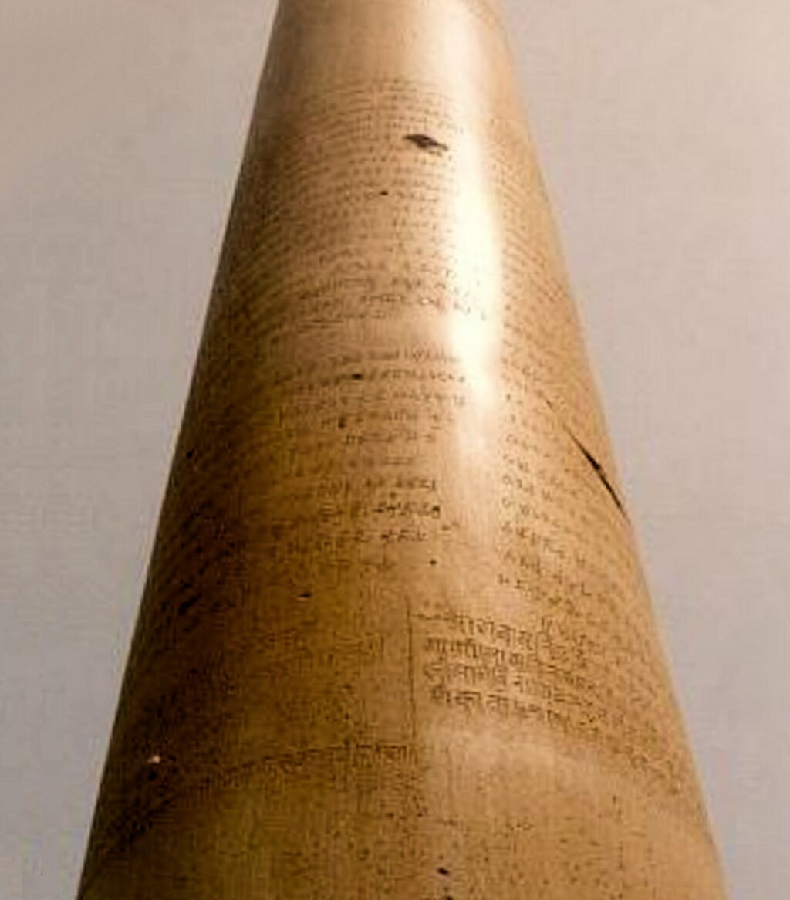

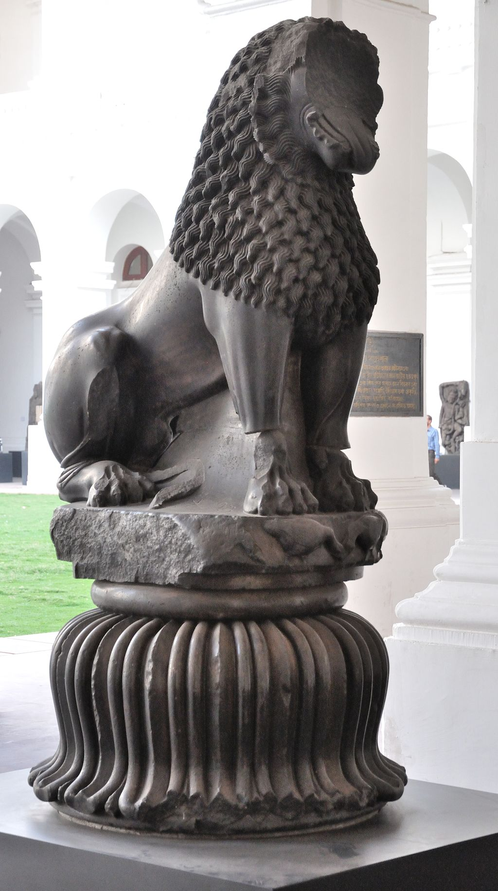

Major Pillar Edicts ([Delhi-Topra pillar](https://en.wikipedia.org/wiki/Topra_Kalan "Topra Kalan")), and one of the capitals (from [Rampurva](https://en.wikipedia.org/wiki/Rampurva "Rampurva")) which crowned such edicts.

The [Major Pillar Edicts](https://en.wikipedia.org/wiki/Major_Pillar_Edicts "Major Pillar Edicts") of Ashoka refer to seven separate major Edicts inscribed on columns, the [Pillars of Ashoka](https://en.wikipedia.org/wiki/Pillars_of_Ashoka "Pillars of Ashoka"), which are significantly detailed and extensive.

These edicts are preceded chronologically by the Minor Rock Edicts and the Major Rock Edicts, and constitute the most technically elegant of the inscriptions made by Ashoka. They were made at the end of his reign, from the years 26 and 27 of his reign, that is, from 237 to 236 BCE. Chronologically they follow the fall of [Seleucid](https://en.wikipedia.org/wiki/Seleucid_Empire "Seleucid Empire") power in [Central Asia](https://en.wikipedia.org/wiki/Central_Asia "Central Asia") and the related rise of the [Parthian Empire](https://en.wikipedia.org/wiki/Parthian_Empire "Parthian Empire") and the independent [Greco-Bactrian Kingdom](https://en.wikipedia.org/wiki/Greco-Bactrian_Kingdom "Greco-Bactrian Kingdom") circa 250 BCE. Hellenistic rulers are not mentioned anymore in these last edicts, as they only appear in [Major Rock Edict](https://en.wikipedia.org/wiki/Major_Rock_Edict "Major Rock Edict") No.13 (and to a lesser extent Major Rock Edict No.2), which can be dated to about the 14th year of the reign of Ashoka circa 256–255. The last Major Pillar Edicts (Edict No.7) is testamental in nature, making a summary of the accomplishments of Ashoka during his life.

The Major Pillar Edicts of Ashoka were exclusively inscribed on the [Pillars of Ashoka](https://en.wikipedia.org/wiki/Pillars_of_Ashoka "Pillars of Ashoka") or fragments thereof, at [Kausambi](https://en.wikipedia.org/wiki/Kausambi "Kausambi") (now [Allahabad Pillar](https://en.wikipedia.org/wiki/Allahabad_pillar "Allahabad pillar")), [Topra Kalan](https://en.wikipedia.org/wiki/Topra_Kalan "Topra Kalan"), [Meerut](https://en.wikipedia.org/wiki/Ashokan_Edicts_in_Delhi "Ashokan Edicts in Delhi"), [Lauriya-Araraj](https://en.wikipedia.org/wiki/Lauriya_Araraj "Lauriya Araraj"), [Lauria Nandangarh](https://en.wikipedia.org/wiki/Lauria_Nandangarh "Lauria Nandangarh"), [Rampurva](https://en.wikipedia.org/wiki/Rampurva "Rampurva") ([Champaran](https://en.wikipedia.org/wiki/Champaran "Champaran")), and fragments of these in Aramaic ([Kandahar, Edict No.7](https://en.wikipedia.org/wiki/Kandahar_Aramaic_inscription "Kandahar Aramaic inscription") and [Pul-i-Darunteh, Edict No.5 or No.7](https://en.wikipedia.org/wiki/Pul-i-Darunteh_Aramaic_inscription "Pul-i-Darunteh Aramaic inscription") in [Afghanistan](https://en.wikipedia.org/wiki/Afghanistan "Afghanistan")) However several pillars, such as the bull pillar of [Rampurva](https://en.wikipedia.org/wiki/Rampurva "Rampurva"), or the pillar of [Vaishali](https://en.wikipedia.org/wiki/Vaishali_\(ancient_city\) "Vaishali (ancient city)") do not have inscriptions, which, together with their lack of proper foundation stones and their particular style, led some authors to suggest that they were in fact pre-Ashokan.

The Major Pillar Edicts (excluding the two fragments of translations found in modern [Afghanistan](https://en.wikipedia.org/wiki/Afghanistan "Afghanistan")) are all located in [Central India](https://en.wikipedia.org/wiki/Central_India "Central India").

The Pillars of Ashoka are stylistically very close to an important Buddhist monument, also built by Ashoka in [Bodh Gaya](https://en.wikipedia.org/wiki/Bodh_Gaya "Bodh Gaya"), at the location where the [Buddha](https://en.wikipedia.org/wiki/Buddha "Buddha") had reached enlightenment some 200 years earlier: the [Diamond Throne](https://en.wikipedia.org/wiki/Vajrasana,_Bodh_Gaya "Vajrasana, Bodh Gaya"). The sculpted decorations on the Diamond Throne clearly echo the decorations found on the Pillars of Ashoka. The Pillars dated to the end of Ashoka's reign are associated with pillar capitals that tend to be more solemn and less elegant than the earlier capitals, such as those of [Sanchi](https://en.wikipedia.org/wiki/Sanchi "Sanchi") or Sarnath. This led some authors to suggest that the artistic level under Ashoka tended to fall towards the end of his reign.

## Languages of the Edicts

Three languages were used: [Ashokan Prakrit](https://en.wikipedia.org/wiki/Ashokan_Prakrit "Ashokan Prakrit"), [Greek](https://en.wikipedia.org/wiki/Greek_language "Greek language") (the language of the neighbouring [Greco-Bactrian Kingdom](https://en.wikipedia.org/wiki/Greco-Bactrian_Kingdom "Greco-Bactrian Kingdom") and the Greek communities in Ashoka's realm) and [Aramaic](https://en.wikipedia.org/wiki/Aramaic_language "Aramaic language") (an official language of the former [Achaemenid Empire](https://en.wikipedia.org/wiki/Achaemenid_Empire "Achaemenid Empire")). The Prakrit displayed local variations, from early [Gandhari language](https://en.wikipedia.org/wiki/Gāndhārī_language "Gāndhārī language") in the northwest, to [Old Ardhamagadhi](https://en.wikipedia.org/wiki/Ardhamagadhi_Prakrit "Ardhamagadhi Prakrit") in the east, where it was the "chancery language" of the court. The language level of the Prakrit inscriptions tends to be rather informal or colloquial.

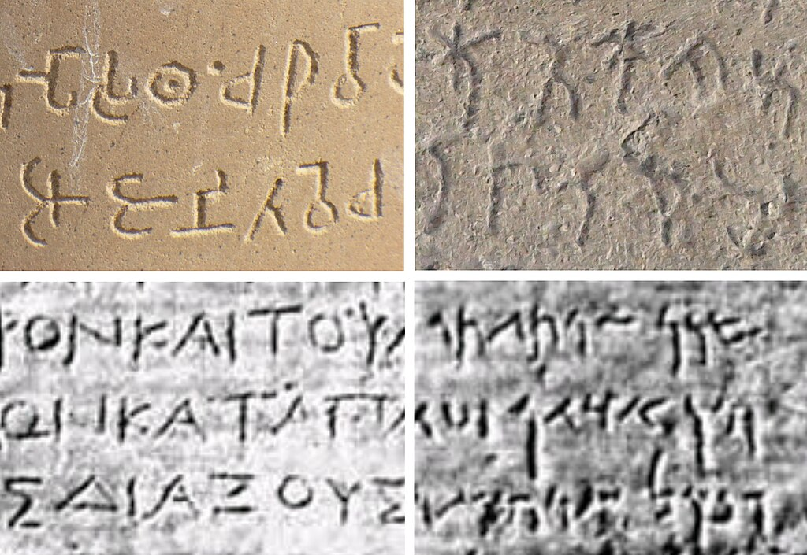The four scripts used by Ashoka in his Edicts: [Brahmi](https://en.wikipedia.org/wiki/Brahmi_script "Brahmi script") (top left), [Kharoshthi](https://en.wikipedia.org/wiki/Kharoshthi "Kharoshthi") (top right), [Greek](https://en.wikipedia.org/wiki/Greek_language "Greek language") (bottom left) and [Aramaic](https://en.wikipedia.org/wiki/Aramaic_language "Aramaic language") (bottom right).

Four scripts were used. Prakrit inscriptions were written in the [Brahmi](https://en.wikipedia.org/wiki/Brahmic_scripts "Brahmic scripts") and [Kharosthi](/source/kharosthi/ "Kharosthi") scripts, the latter for the area of modern Pakistan. The Greek and Aramaic inscriptions used their respective scripts, in the northwestern areas of Ashoka's territory, in modern [Pakistan](https://en.wikipedia.org/wiki/Pakistan "Pakistan") and [Afghanistan](https://en.wikipedia.org/wiki/Afghanistan "Afghanistan").

While most Edicts were in [Ashokan Prakrit](https://en.wikipedia.org/wiki/Ashokan_Prakrit "Ashokan Prakrit"), a few were written in Greek or Aramaic. The [Kandahar Rock Inscription](https://en.wikipedia.org/wiki/Kandahar_Bilingual_Rock_Inscription "Kandahar Bilingual Rock Inscription") is bilingual Greek-Aramaic. The [Kandahar Greek Edict of Ashoka](https://en.wikipedia.org/wiki/Kandahar_Greek_Edict_of_Ashoka "Kandahar Greek Edict of Ashoka") is in Greek only, and originally probably contained all the Major Rock Edicts 1-14. The Greek language used in the inscription is of a very high level and displays philosophical refinement. It also displays an in-depth understanding of the political language of the Hellenic world in the 3rd century BCE. This suggests a highly cultured Greek presence in Kandahar at that time.

By contrast, in the rock edicts engraved in southern India in the newly conquered territories of [Karnataka](https://en.wikipedia.org/wiki/History_of_Karnataka "History of Karnataka") and [Andhra Pradesh](https://en.wikipedia.org/wiki/History_of_Andhra_Pradesh "History of Andhra Pradesh"), Ashoka only used the [Prakrit](https://en.wikipedia.org/wiki/Prakrit "Prakrit") of the North as the language of communication, with the [Brahmi](https://en.wikipedia.org/wiki/Brahmi "Brahmi") script, and not the local [Dravidian](https://en.wikipedia.org/wiki/Dravidian_languages "Dravidian languages") idiom, which can be interpreted as a kind of authoritarianism in respect to the southern territories.

Ashoka's edicts were the first written inscriptions in India after the ancient city of [Harrapa](https://en.wikipedia.org/wiki/Harrapa "Harrapa") fell to ruin. Due to the influence of Ashoka's Prakrit inscriptions, Prakrit would remain the main inscriptional language for the following centuries, until the rise of inscriptional [Sanskrit](/source/sanskrit/ "Sanskrit") from the 1st century CE.

## Content of the Edicts

The Dharma preached by Ashoka is explained mainly in term of moral precepts, based on the doing of good deeds, respect for others, generosity and purity. The expressions used by Ashoka to express the Dharma, were the [Prakrit](https://en.wikipedia.org/wiki/Prakrit "Prakrit") word _[Dhaṃma](https://en.wikipedia.org/wiki/Dhamma "Dhamma")_, the Greek word _[Eusebeia](https://en.wikipedia.org/wiki/Eusebeia "Eusebeia")_ (in the [Kandahar Bilingual Rock Inscription](https://en.wikipedia.org/wiki/Kandahar_Bilingual_Rock_Inscription "Kandahar Bilingual Rock Inscription") and the [Kandahar Greek Edict of Ashoka](https://en.wikipedia.org/wiki/Kandahar_Greek_Edict_of_Ashoka "Kandahar Greek Edict of Ashoka")), and the [Aramaic](https://en.wikipedia.org/wiki/Aramaic_language "Aramaic language") word _Qsyt_ ("Truth") (in the [Kandahar Bilingual Rock Inscription](https://en.wikipedia.org/wiki/Kandahar_Bilingual_Rock_Inscription "Kandahar Bilingual Rock Inscription")).

### Empire boundaries

> Everywhere in the dominions of Dévanampriya Priyadarsina, and of those who are his borderers, such as the [Cholas](https://en.wikipedia.org/wiki/Chola_dynasty "Chola dynasty"), the [Pandyas](https://en.wikipedia.org/wiki/Pandya_dynasty "Pandya dynasty"), the [Satiyaputra](https://en.wikipedia.org/wiki/Satiyaputra "Satiyaputra"), the [Kéralaputra](https://en.wikipedia.org/wiki/Chera_dynasty "Chera dynasty"), [Tamraparni](https://en.wikipedia.org/wiki/Tamraparni "Tamraparni"), where the [Yona](https://en.wikipedia.org/wiki/Yona "Yona") (Greek) king named [Antiyoka](https://en.wikipedia.org/wiki/Antiochus_II_Theos "Antiochus II Theos") rule, and the other kings who are the neighbours of this Antiyoka, everywhere two kinds of medical treatment were established by King Devanampriya Priyadarsin, (viz.) medical treatment for men and medical treatment for cattle.
> (Major Rock Edict No.2), [E. Hultzsch](https://en.wikipedia.org/wiki/E._Hultzsch "E. Hultzsch") translation

The initial translation of this Edict by James Prinsep differs from that of [E. Hultzsch](https://en.wikipedia.org/wiki/E._Hultzsch "E. Hultzsch"). His translation is as follows:

> Everywhere within the conquered province of King [Piyadasi](https://en.wikipedia.org/wiki/Priyadasi "Priyadasi") (Ashoka), the beloved of the gods, as well as in the parts occupied by the faithful, such as [Chola](https://en.wikipedia.org/wiki/Chola_dynasty "Chola dynasty"), [Pandiya](https://en.wikipedia.org/wiki/Pandiya "Pandiya"), [Satiyaputra](https://en.wikipedia.org/wiki/Satiyaputra "Satiyaputra"), and [Keralaputra](https://en.wikipedia.org/wiki/Keralaputra "Keralaputra"), even as far as [Tambapanni](https://en.wikipedia.org/wiki/Tambapanni "Tambapanni") (Ceylon) and, moreover, within the dominions the [Greek](https://en.wikipedia.org/wiki/Ancient_Greece "Ancient Greece") (of which [Antiochus](https://en.wikipedia.org/wiki/Antiochus_II_Theos "Antiochus II Theos") generals are the rulers ) everywhere the heaven-beloved Raja Piyadasi’s double system of medical aid is established- both medical aid for men, and medical aid for animals.
> (Major Rock Edict No.2), [James Prinsep](https://en.wikipedia.org/wiki/James_Prinsep "James Prinsep") translation

### Moral precepts

\*\*Right behaviour\*\* 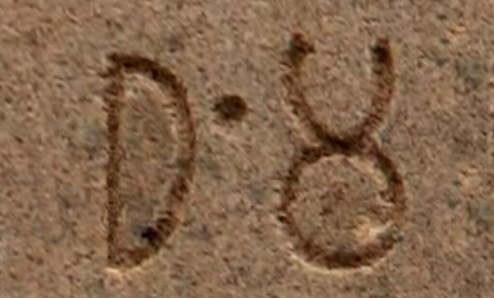The [Prakrit](https://en.wikipedia.org/wiki/Prakrit "Prakrit") word _[Dha-ṃ-ma](https://en.wikipedia.org/wiki/Dhamma "Dhamma")_ ([𑀥𑀁𑀫](https://en.wiktionary.org/wiki/𑀥𑀁𑀫 "wikt:𑀥𑀁𑀫"), Sanskrit: [Dharma](https://en.wikipedia.org/wiki/Dharma "Dharma")) in the [Brahmi script](https://en.wikipedia.org/wiki/Brahmi_script "Brahmi script"), as inscribed by Ashoka in his Edicts. [Topra Kalan](https://en.wikipedia.org/wiki/Topra_Kalan "Topra Kalan") pillar, now in [New Delhi](https://en.wikipedia.org/wiki/New_Delhi "New Delhi").

> Dharma is good. And what is Dharma? It is having few faults and many good deeds, mercy, charity, truthfulness and purity. (Major Pillar Edict No.2)

> Thus the glory of Dhamma will increase throughout the world, and it will be endorsed in the form of mercy, charity, truthfulness, purity, gentleness, and virtue. (Major Pillar Edict No. 7)

\*\*Benevolence\*\*

Ashoka's Dharma meant that he used his power to try to make life better for his people and he also tried to change the way people thought and lived. He also thought that dharma meant doing the right thing.

\*\*Kindness to prisoners\*\*

Ashoka showed great concern for fairness in the exercise of [justice](https://en.wikipedia.org/wiki/Justice "Justice"), caution and tolerance in the application of sentences, and regularly pardoned prisoners.

> But it is desirable that there should be uniformity in judicial procedure and punishment. This is my instruction from now on. Men who are imprisoned or sentenced to death are to be given three days respite. Thus their relations may plead for their lives, or, if there is no one to plead for them, they may make donations or undertake a fast for a better rebirth in the next life. For it is my wish that they should gain the next world. (Major Pillar Edict No. 4)

> In the period \[from my consecration\] to \[the anniversary on which\] I had been consecrated twenty-six years, twenty-five releases of prisoners have been made. (Major Pillar Edict No. 5)

\*\*Respect for animal life\*\* 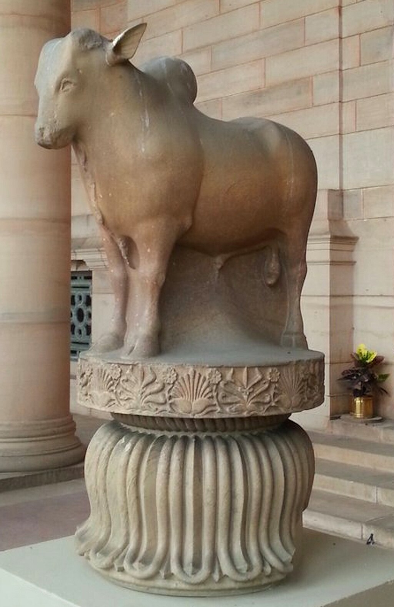Animals pervade imperial [Mauryan art](https://en.wikipedia.org/wiki/Mauryan_art "Mauryan art"). [Rampurva](https://en.wikipedia.org/wiki/Rampurva "Rampurva") bull [capital](https://en.wikipedia.org/wiki/Capital_\(architecture\) "Capital (architecture)") established by Ashoka, 3rd century BCE. Now in the [Rashtrapati Bhavan](https://en.wikipedia.org/wiki/Rashtrapati_Bhavan,_New_Delhi "Rashtrapati Bhavan, New Delhi") (Presidential Palace), [New Delhi](https://en.wikipedia.org/wiki/New_Delhi "New Delhi").

The Mauryan Empire was the first Indian empire to unify most of the country and it had a clear-cut policy of exploiting as well as protecting natural resources with specific officials tasked with protection duty. When [Ashoka](https://en.wikipedia.org/wiki/Ashoka "Ashoka") embraced [Buddhism](https://en.wikipedia.org/wiki/Buddhism "Buddhism") in the latter part of his reign, he brought about significant changes in his style of governance, which included providing protection to fauna, and even relinquished the [imperial hunt](https://en.wikipedia.org/wiki/Imperial_hunt "Imperial hunt"). He was perhaps the first ruler in history to advocate conservation measures for wildlife. Reference to these can be seen inscribed on the stone edicts.

> This rescript on morality has been caused to be written by Devanampriya Priyadarsin. Here no living being must be killed and sacrificed. And also no festival meeting must be held. For King Devanampriya Priyadarsin sees much evil in festival meetings. And there are also some festival meetings which are considered meritorious by King Devanampriya Priyadarsin. Formerly in the kitchen of King Devanampriya Priyadarsin many hundred thousands of animals were killed daily for the sake of curry. But now, when this rescript on morality is caused to be written, then only three animals are being killed (daily), (viz.) two peacocks (and) one deer, but even this deer not regularly. But even these three animals shall not be killed (in future). (Major Rock Edict No.1)

> King Devanampriya Priyadansin speaks thus. (When I had been) anointed twenty-six years, the following animals were declared by me inviolable, viz. parrots, mainas, the aruna, ruddy geese, wild geese, the nandimukha, the gelata, bats, queen-ants, terrapins, boneless fish, the vedaveyaka, the Ganga-puputaka, skate-fish, tortoises and porcupines, squirrels (?), the srimara, bulls set at liberty, iguanas (?), the rhinoceros, white doves, domestic doves, (and) all the quadrupeds which are neither useful nor edible. Those \[she-goats\], ewes, and sows (which are) either with young or in milk, are inviolable, and also those (of their) young ones (which are) less than six months old. Cocks must not be caponed. Husks containing living animals must not be burnt. Forests must not be burnt either uselessly or in order to destroy (living beings). Living animals must not be fed with (other) living animals. (Major Pillar Edict No.5)

> King Dévanampriya Priyadarsin speaks thus. Now this progress of morality among men has been promoted by me only in two ways, (viz.) by moral restrictions and by conversion. But among these two, those moral restrictions are of little consequence; by conversion, however, morality is promoted more considerably. Now moral restrictions indeed are these, that I have ordered this, that certain animals are inviolable. But there are also many other moral restrictions which have been imposed by me. By conversion, however, the progress of morality among men has been promoted more considerably, because it leads to abstention from hurting living beings and to abstention from killing animals.(Major Pillar Edict No.7)

> In times past, for many hundreds of years, there had ever been promoted the killing of animals and the hurting of living beings, discourtesy to relatives, and discourtesy to [Sramanas](https://en.wikipedia.org/wiki/Sramana "Sramana") and [Brahmanas](https://en.wikipedia.org/wiki/Brahmin "Brahmin"). But now, in consequence of the practice of morality on the part of King Dévanampriya Priyadarsin, the sound of drums has become the sound of morality, showing the people representations of [aerial chariots](https://en.wikipedia.org/wiki/Vimana "Vimana"), elephants, masses of light, and other divine figures. Such as they had not existed before for many hundreds of years, thus there are now promoted, through the instruction in morality on the part of King Dévanampriya Priyadaréin, abstention from killing animals, abstention from hurting living beings, courtesy to relatives, courtesy to Brahmanas and Sramanas, obedience to mother and father, and to the aged.(Major Rock Edict No.4, [Shahbazgarhi](https://en.wikipedia.org/wiki/Shahbaz_Garhi "Shahbaz Garhi"))

Ashoka advocated restraint in the number that had to be killed for consumption, protected some of them, and in general condemned violent acts against animals, such as [castration](https://en.wikipedia.org/wiki/Castration "Castration").

However, the edicts of Ashoka reflect more the desire of rulers than actual events; the mention of a 100 'panas' (coins) fine for poaching deer in imperial hunting preserves shows that rule-breakers did exist. The legal restrictions conflicted with the practices then freely exercised by the common people in hunting, felling, fishing and setting fires in forests.

### Religious precepts

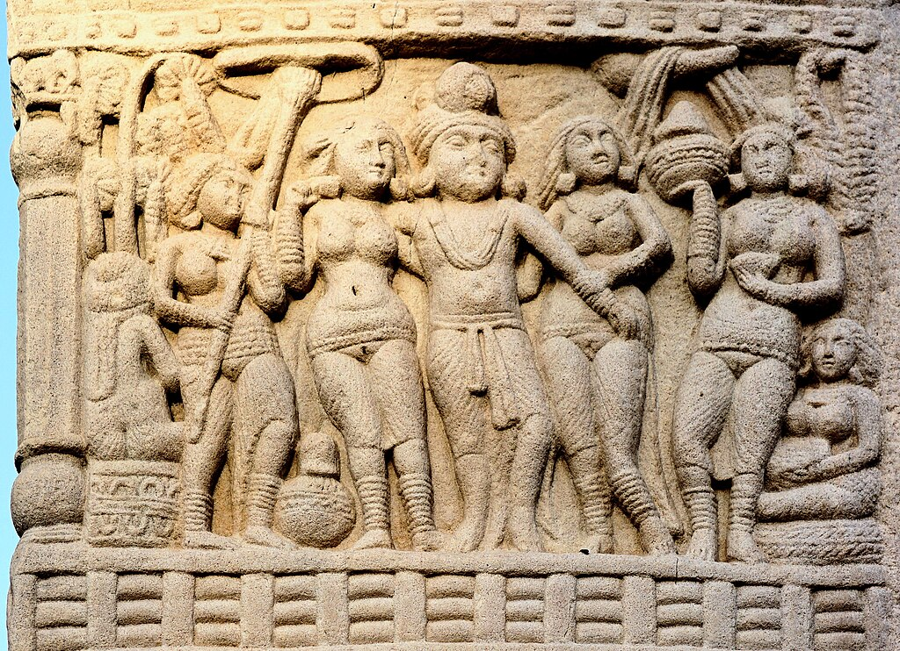Ashoka and his two empresses, visiting the [Bodhi Tree](https://en.wikipedia.org/wiki/Bodhi_Tree "Bodhi Tree") in [Bodh Gaya](https://en.wikipedia.org/wiki/Bodh_Gaya "Bodh Gaya"), in a relief at [Sanchi](https://en.wikipedia.org/wiki/Sanchi "Sanchi") (1st century CE). The identification with Ashoka is confirmed by the similar relief from [Kanaganahalli](https://en.wikipedia.org/wiki/Kanaganahalli "Kanaganahalli") inscribed "Raya Asoka".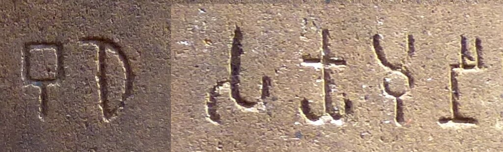The words "[Bu-dhe](https://en.wikipedia.org/wiki/Buddha "Buddha")" (𑀩𑀼𑀥𑁂, the [Buddha](https://en.wikipedia.org/wiki/Buddha "Buddha")) and "[Sa-kya](https://en.wikipedia.org/wiki/Shakyas "Shakyas")-[mu-nī](https://en.wikipedia.org/wiki/Muni_\(Saint\) "Muni (Saint)") " ( [𑀲𑀓𑁆𑀬𑀫𑀼𑀦𑀻](https://en.wiktionary.org/wiki/𑀲𑀓𑁆𑀬𑀫𑀼𑀦𑀻 "wikt:𑀲𑀓𑁆𑀬𑀫𑀼𑀦𑀻"), "[Sage](https://en.wikipedia.org/wiki/Muni_\(saint\) "Muni (saint)") of the [Shakyas](https://en.wikipedia.org/wiki/Shakyas "Shakyas")") in [Brahmi script](https://en.wikipedia.org/wiki/Brahmi_script "Brahmi script"), on [Ashoka](https://en.wikipedia.org/wiki/Ashoka "Ashoka")'s [Rummindei](https://en.wikipedia.org/wiki/Rummindei "Rummindei") [Minor Pillar Edict](https://en.wikipedia.org/wiki/Minor_Pillar_Edict "Minor Pillar Edict") (circa 250 BCE). \*\*Buddhism\*\*

Explicit mentions of Buddhism or the Buddha only appear in the [Minor Rock Edicts](https://en.wikipedia.org/wiki/Minor_Rock_Edicts "Minor Rock Edicts") and the [Minor Pillar Edicts](https://en.wikipedia.org/wiki/Minor_Pillar_Edicts "Minor Pillar Edicts"). Beyond affirming himself as a Buddhist and spreading the moral virtues of Buddhism, Ashoka also insisted that the word of the Buddha be read and followed, in particular in monastic circles (the [Sanghas](https://en.wikipedia.org/wiki/Sangha_\(Buddhism\) "Sangha (Buddhism)")), in a unique edict ([Minor Rock Edict No.3](https://en.wikipedia.org/wiki/Minor_Rock_Edict "Minor Rock Edict")), found in front of the [Bairat Temple](https://en.wikipedia.org/wiki/Bairat_Temple "Bairat Temple")

> I have been a devotee ("[Budha](https://en.wikipedia.org/wiki/The_Buddha "The Buddha")-[Shake](https://en.wikipedia.org/wiki/Shakya "Shakya")" in the Maski edict, _[upāshake](https://en.wikipedia.org/wiki/Upāsaka "Upāsaka")_ in others) for more than two and a half years, but for a year I did not make much progress. Now for more than a year I have drawn closer to the [Order](https://en.wikipedia.org/wiki/Samgha "Samgha") and have become more ardent. (Minor Rock Edict No.1)

> The [King of Magadha](https://en.wikipedia.org/wiki/List_of_monarchs_of_Magadha "List of monarchs of Magadha"), Piyadassi, greets the Order and wishes it prosperity and freedom from care. You know Sirs, how deep is my respect for and faith in the Buddha, the Dhamma and the Samgha \[i.e. the Buddhist creed\]. Sirs, whatever was spoken by the Lord Buddha was well spoken. (Minor Rock Edict No.3)

> These sermons on Dhamma, Sirs - the Excellence of the Discipline, the Lineage of the Noble One, the Future Fears, the Verses of, the Sage, the Sutra of Silence, the Question, of Upatissa, and the Admonition spoken by the Lord Buddha to [Rahula](https://en.wikipedia.org/wiki/Rahula "Rahula") on the subject of false speech - these sermons on the Dhamma, Sirs, I desire that many [monks](https://en.wikipedia.org/wiki/Bhikku "Bhikku") and [nuns](https://en.wikipedia.org/wiki/Bhikkuni "Bhikkuni") should hear frequently and meditate upon, and likewise laymen and laywomen. (Minor Rock Edict No.3)

Ashoka also expressed his devotion for the [Buddhas of the past](https://en.wikipedia.org/wiki/List_of_the_named_Buddhas "List of the named Buddhas"), such as the [Koṇāgamana Buddha](https://en.wikipedia.org/wiki/Koṇāgamana_Buddha "Koṇāgamana Buddha"), for whom he enlarged a [stupa](https://en.wikipedia.org/wiki/Stupa "Stupa") in the 14th year of his reign, and made a dedication and set up a pillar during a visit in person in the 20th year of his reign, as described in his [Minor Pillar Edict](https://en.wikipedia.org/wiki/Minor_Pillar_Edict "Minor Pillar Edict") of [Nigali Sagar](https://en.wikipedia.org/wiki/Nigali_Sagar "Nigali Sagar"), in modern [Nepal](https://en.wikipedia.org/wiki/Nepal "Nepal").

\*\*Belief in a next world\*\*

> By doing so, there is gain in this world, and in the next there is infinite merit, through the gift of Dhamma. (Major Rock Edict No.11)

> It is hard to obtain happiness in this world and the next without extreme love of Dhamma, much vigilance, much obedience, much fear of sin, and extreme energy. (Major Pillar Edict No. 1)

\*\*Religious exchange\*\* 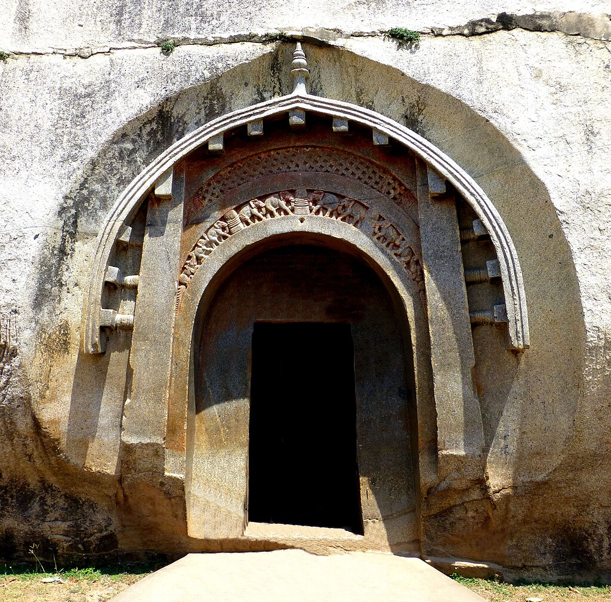The [Barabar caves](https://en.wikipedia.org/wiki/Barabar_caves "Barabar caves") were built by Ashoka for the ascetic sect of the [Ajivikas](https://en.wikipedia.org/wiki/Ajivikas "Ajivikas"), as well as for the Buddhists, illustrating his respect for several faiths. [Lomas Rishi](https://en.wikipedia.org/wiki/Lomas_Rishi "Lomas Rishi") cave. 3rd century BCE.

Far from being [sectarian](https://en.wikipedia.org/wiki/Sectarian "Sectarian"), Ashoka, based on a belief that all religions shared a common, positive essence, encouraged tolerance and understanding of other religions.

> The Beloved of the Gods, the King Piyadassi, wishes that all sects may dwell in all places, for all seek self-control and purity of mind. (Major Rock Edict No.7)

> For whosoever praises his own sect or blames other sects, — all (this) out of pure devotion to his own sect, (i.e.) with the view of glorifying his own sect, — if he is acting thus, he rather injures his own sect very severely. But concord is meritorious, (i.e.) that they should both hear and obey each other's morals. For this is the desire of Devanampriya, (viz.) that all sects should be both full of learning and pure in doctrine. And those who are attached to their respective (sects), ought to be spoken to (as follows). Devanampriya does not value either gifts or honours so (highly) as (this), (viz.) that a promotion of the essentials of all sects should take place. (Major Rock Edict No.12)

### Social and animal welfare

According to the edicts, Ashoka took great care of the [welfare of his subjects](https://en.wikipedia.org/wiki/Public_welfare "Public welfare") (human and animal), and those beyond his borders, spreading the use of medicinal treatments, improving roadside facilities for more comfortable travel, and establishing "officers of the faith" throughout his territories to survey the welfare of the population and the propagation of the [Dharma](https://en.wikipedia.org/wiki/Dharma "Dharma"). The Greek king [Antiochos](https://en.wikipedia.org/wiki/Antiochus_II_Theos "Antiochus II Theos") ("the [Yona](https://en.wikipedia.org/wiki/Yona "Yona") king named Antiyoga" in the text of the Edicts) is also named as a recipient of Ashoka's generosity, together with the other kings neighbouring him.

\*\*Medicinal treatments\*\* 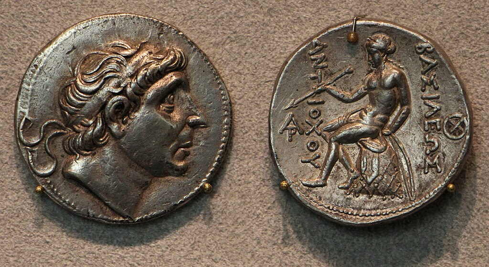The [Seleucid](https://en.wikipedia.org/wiki/Seleucid "Seleucid") king [Antiochos](https://en.wikipedia.org/wiki/Antiochus_II_Theos "Antiochus II Theos") (_Aṃtiyakā_, _Aṃtiyako_ or _Aṃtiyoga_ depending on the transliterations) is named as a recipient of Ashoka's medical treatments, together with his [Hellenistic](https://en.wikipedia.org/wiki/Hellenistic "Hellenistic") neighbours.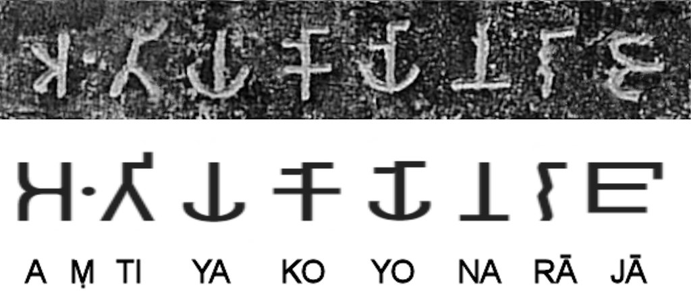_Aṃtiyako [Yona](https://en.wikipedia.org/wiki/Yona "Yona") [Rājā](https://en.wikipedia.org/wiki/Raja "Raja")_ ("The Greek king [Antiochos](https://en.wikipedia.org/wiki/Antiochus_II_Theos "Antiochus II Theos")"), mentioned in [Major Rock Edict](https://en.wikipedia.org/wiki/Major_Rock_Edict "Major Rock Edict") No.2, here at [Girnar](https://en.wikipedia.org/wiki/Girnar "Girnar"). [Brahmi script](https://en.wikipedia.org/wiki/Brahmi_script "Brahmi script").

> Everywhere in the dominions of king Devanampriya Priyadarsin and (of those) who (are his) borderers, such as the [Cholas](https://en.wikipedia.org/wiki/Chola_dynasty "Chola dynasty"), the [Pandyas](https://en.wikipedia.org/wiki/Pandyas "Pandyas"), the [Satiyaputa](https://en.wikipedia.org/wiki/Velir "Velir"), the [Kelalaputa](https://en.wikipedia.org/wiki/Chera_dynasty "Chera dynasty"), [Tamraparni](https://en.wikipedia.org/wiki/Tamraparni "Tamraparni"), the [Yona](https://en.wikipedia.org/wiki/Yona "Yona") king named [Antiyoga](https://en.wikipedia.org/wiki/Antiochus_II "Antiochus II"), and the other kings who are the neighbours of this Antiyoga, everywhere two (kinds of) medical treatment were established by King Devanampriya Priyadarsin, (viz.) medical treatment for men and medical treatment for cattle. Wherever there were no herbs beneficial to men and beneficial to cattle, everywhere they were caused to be imported and to be planted. Likewise, wherever there were no roots and fruits, everywhere they were caused to be imported and to be planted. On the roads trees were planted, and wells were caused to be dug for the use of cattle and men. (Major Rock Edict No. 2, [Khalsi](https://en.wikipedia.org/wiki/Rock_edicts_of_Khalsi "Rock edicts of Khalsi") version)

\*\*Roadside facilities\*\*

> On the roads [banyan](https://en.wikipedia.org/wiki/Banyan "Banyan")-trees were caused to be planted by me, (in order that) they might afford shade to cattle and men, (and) [mango](https://en.wikipedia.org/wiki/Mango_tree "Mango tree")-groves were caused to be planted. And (at intervals) of eight kos wells were caused to be dug by me, and flights of steps (for descending into the water) were caused to be built. Numerous drinking-places were caused to be established by me, here and there, for the enjoyment of cattle and men. \[But\] this so-called enjoyment (is) \[of little consequence\]. For with various comforts have the people been blessed both by former kings and by myself. But by me this has been done for the following purpose: that they might conform to that practice of morality. (Major Pillar Edict No.7)

\*\*Officers of the faith\*\*

> Now, in times past [mahamatras](https://en.wikipedia.org/wiki/Mahamatras "Mahamatras") (officers) of morality did not exist before. Officers of morality were appointed by me (when I had been) anointed thirteen years. These are occupied with all sects in establishing morality, in promoting morality, and for the welfare and happiness of those who are devoted to morality (even) among the [Greeks](https://en.wikipedia.org/wiki/Yona "Yona"), [Kambojas](https://en.wikipedia.org/wiki/Kambojas "Kambojas"), and [Gandharas](https://en.wikipedia.org/wiki/Gandharas "Gandharas"), and whatever other western borderers (of mine there are). They are occupied with servants and masters, with [Brahmanas](https://en.wikipedia.org/wiki/Brahmin "Brahmin") and Ibhiyas, with the destitute; (and) with the aged, for the welfare and happiness of those who are devoted to morality, (and) in releasing (them) from the fetters (of worldly life). (Major Rock Edict No.5)

\*\*Birthplace of the historical Buddha\*\*

In a particularly famous Edict, the Rummindei Edict in [Lumbini](https://en.wikipedia.org/wiki/Lumbini "Lumbini"), [Nepal](https://en.wikipedia.org/wiki/Nepal "Nepal"), Ashoka describes his visit in the 21st year of his reign, and mentions Lumbini as the birthplace of the Buddha. He also, for the first time in historical records, uses the epithet "Sakyamuni" ([Sage](https://en.wikipedia.org/wiki/Muni_\(saint\) "Muni (saint)") of the [Shakyas](https://en.wikipedia.org/wiki/Shakyas "Shakyas")), to describe the historical Buddha.

Rummindei pillar, inscription of Ashoka (circa 248 BCE)

Translation
(English)Transliteration
(original [Brahmi script](https://en.wikipedia.org/wiki/Brahmi_script "Brahmi script"))Inscription
([Prakrit](https://en.wikipedia.org/wiki/Prakrit "Prakrit") in the [Brahmi script](https://en.wikipedia.org/wiki/Brahmi_script "Brahmi script"))

> _When King Devanampriya Priyadarsin had been anointed twenty years, he came himself and worshipped (this spot) because the [Buddha Shakyamuni](https://en.wikipedia.org/wiki/Buddha_Shakyamuni "Buddha Shakyamuni") was born here. (He) both caused to be made a stone bearing a horse (?) and caused a stone pillar to be set up, (in order to show) that the Blessed One was born here. (He) made the village of [Lumbini](https://en.wikipedia.org/wiki/Lumbini "Lumbini") free of taxes, and paying (only) an eighth share (of the produce)._

— The [Rummindei](https://en.wikipedia.org/wiki/Rummindei "Rummindei") Edict, one of the [Minor Pillar Edicts](https://en.wikipedia.org/wiki/Minor_Pillar_Edicts "Minor Pillar Edicts") of Ashoka.

> [𑀤𑁂𑀯𑀸𑀦𑀁𑀧𑀺𑀬𑁂](https://en.wikipedia.org/wiki/Devanampriya "Devanampriya")𑀦 [𑀧𑀺𑀬𑀤𑀲𑀺](https://en.wikipedia.org/wiki/Priyadasi "Priyadasi")𑀦 [𑀮𑀸𑀚𑀺](https://en.wikipedia.org/wiki/Raja "Raja")𑀦𑀯𑀻𑀲𑀢𑀺𑀯𑀲𑀸𑀪𑀺𑀲𑀺𑀢𑁂𑀦
> Devānaṃpiyena Piyadasina lājina vīsati-vasābhisitena
> 𑀅𑀢𑀦𑀆𑀕𑀸𑀘 𑀫𑀳𑀻𑀬𑀺𑀢𑁂 𑀳𑀺𑀤[𑀩𑀼𑀥𑁂](https://en.wikipedia.org/wiki/Buddha "Buddha")𑀚𑀸𑀢 [𑀲𑀓𑁆𑀬𑀫𑀼𑀦𑀺](https://en.wikipedia.org/wiki/Sakyamuni "Sakyamuni")𑀢𑀺
> atana āgācha mahīyite hida Budhe jāte Sakyamuni ti
> 𑀲𑀺𑀮𑀸𑀯𑀺𑀕𑀥𑀪𑀺𑀘𑀸𑀓𑀸𑀮𑀸𑀧𑀺𑀢 𑀲𑀺𑀮𑀸𑀣𑀪𑁂𑀘 𑀉𑀲𑀧𑀸𑀧𑀺𑀢𑁂
> silā vigaḍabhī chā kālāpita silā-thabhe cha usapāpite
> 𑀳𑀺𑀤[𑀪𑀕𑀯𑀁](https://en.wikipedia.org/wiki/Bhagavat "Bhagavat")𑀚𑀸𑀢𑀢𑀺 [𑀮𑀼𑀁𑀫𑀺𑀦𑀺](https://en.wikipedia.org/wiki/Lumbini "Lumbini")𑀕𑀸𑀫𑁂 𑀉𑀩𑀮𑀺𑀓𑁂𑀓𑀝𑁂
> hida Bhagavaṃ jāte ti Luṃmini-gāme ubalike kaṭe
> 𑀅𑀞𑀪𑀸𑀕𑀺𑀬𑁂𑀘
> aṭha-bhāgiye cha

— Adapted from transliteration by [E. Hultzsch](https://en.wikipedia.org/wiki/E._Hultzsch "E. Hultzsch").

 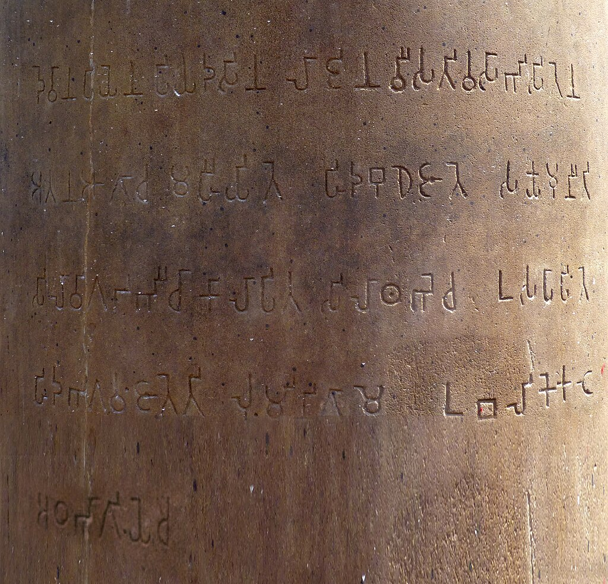The Rummindei pillar edict in [Lumbini](https://en.wikipedia.org/wiki/Lumbini "Lumbini").

## Ashoka's proselytism according to the Edicts

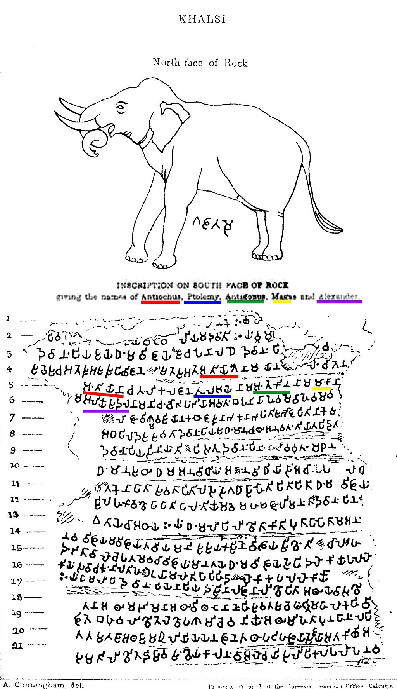The [Kalsi](https://en.wikipedia.org/wiki/Kalsi_\(Dehradun\) "Kalsi (Dehradun)") rock edict of Ashoka, which mentions the Greek kings [Antiochus](https://en.wikipedia.org/wiki/Antiochus_II_Theos "Antiochus II Theos"), [Ptolemy](https://en.wikipedia.org/wiki/Ptolemy_II_of_Egypt "Ptolemy II of Egypt"), [Antigonus](https://en.wikipedia.org/wiki/Antigonus_II_Gonatas "Antigonus II Gonatas"), [Magas](https://en.wikipedia.org/wiki/Magas_of_Cyrene "Magas of Cyrene") and [Alexander](https://en.wikipedia.org/wiki/Alexander_II_of_Epirus "Alexander II of Epirus") by name (underlined in color).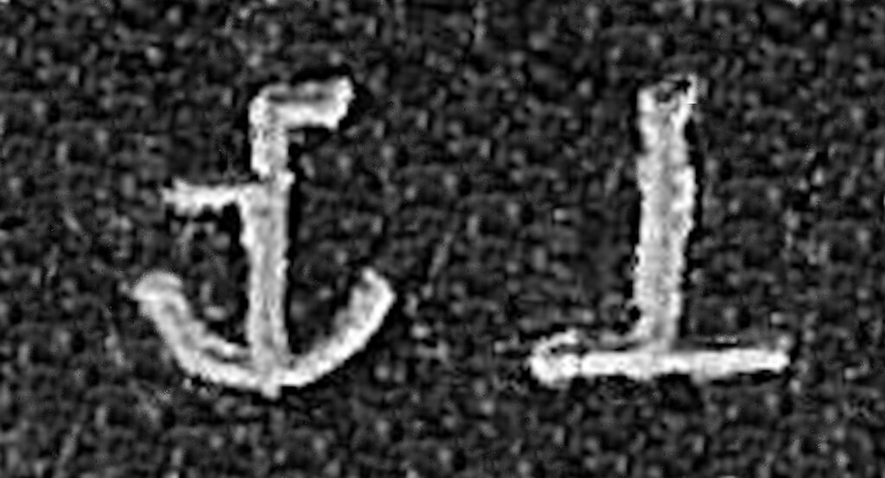The word _[Yona](https://en.wikipedia.org/wiki/Yona "Yona")_ for "Greek" in the Girnar 2nd [Major Rock Edict](https://en.wikipedia.org/wiki/Major_Rock_Edict "Major Rock Edict") of Ashoka. The word is part of the phrase "Amtiyako Yona Raja" (The Greek King Antiochus).

In order to propagate welfare, Ashoka explains that he sent emissaries and medicinal plants to the [Hellenistic](https://en.wikipedia.org/wiki/Hellenistic "Hellenistic") kings as far as the Mediterranean, and to people throughout [India](https://en.wikipedia.org/wiki/Ancient_india "Ancient india"), claiming that Dharma had been achieved in all their territories as well. He names the Greek rulers of the time, inheritors of the conquest of [Alexander the Great](https://en.wikipedia.org/wiki/Alexander_the_Great "Alexander the Great"), from [Bactria](https://en.wikipedia.org/wiki/Bactria "Bactria") to as far as [Greece](https://en.wikipedia.org/wiki/Ancient_Greece "Ancient Greece") and [North Africa](https://en.wikipedia.org/wiki/North_Africa "North Africa"), as recipients of the Dharma, displaying a clear grasp of the political situation at the time.

### Proselytism beyond India

> Now, it is the conquest by the Dharma that the Beloved of the Gods considers as the best conquest. And this one (the conquest by the Dharma) was won here, on the borders, and even as (far/to the extent of) 600 [(yojanas or leagues)](https://en.wikipedia.org/wiki/Yojana "Yojana") from here ([Panta](https://en.wikipedia.org/wiki/Panta "Panta") or [Kandahar](https://en.wikipedia.org/wiki/Kandahar "Kandahar")), where the king [Antiochos](https://en.wikipedia.org/wiki/Antiochos_II "Antiochos II") reigns, and beyond where reign the four kings [Ptolemy](https://en.wikipedia.org/wiki/Ptolemy_II "Ptolemy II"), [Antigonos](https://en.wikipedia.org/wiki/Antigonos_II_Gonatas "Antigonos II Gonatas"), [Magas](https://en.wikipedia.org/wiki/Magas_of_Cyrene "Magas of Cyrene") and [Alexander](https://en.wikipedia.org/wiki/Alexander_II_of_Epirus "Alexander II of Epirus"), likewise in the south, where live the [Cholas](https://en.wikipedia.org/wiki/Chola_dynasty "Chola dynasty"), the [Pandyas](https://en.wikipedia.org/wiki/Pandyas "Pandyas"), and as far as [Tamraparni](https://en.wikipedia.org/wiki/Tamraparni "Tamraparni").

— Extract from [Major Rock Edict](https://en.wikipedia.org/wiki/Major_Rock_Edict "Major Rock Edict") No.13.

The distance of 600 [yojanas](https://en.wikipedia.org/wiki/Yojana "Yojana") (> 2,000 km) corresponds roughly to the distance between the center of India and Greece.

In the [Gandhari](https://en.wikipedia.org/wiki/Gandhari_language "Gandhari language") original Antiochos is referred to as _Amtiyoge nama [Yona](https://en.wikipedia.org/wiki/Yona "Yona")-raja_ (lit. "The Greek king by the name of Antiokos"), beyond whom live the four other kings: _param ca tena Atiyogena cature 4 rajani Tulamaye nama Amtekine nama Makā nama Alikasudaro nama_ (lit. "And beyond Antiochus, four kings by the name of Ptolemy, the name of Antigonos, the name of Magas, the name Alexander".

*   **Amtiyaka** ([𑀅𑀁𑀢𑀺𑀬𑀓](https://en.wiktionary.org/wiki/𑀅𑀁𑀢𑀺𑀬𑀓#Ashokan_Prakrit "wiktionary:𑀅𑀁𑀢𑀺𑀬𑀓")) or Amtiyoga (𑀅𑀁𑀢𑀺𑀕), refers to [Antiochus II Theos](https://en.wikipedia.org/wiki/Antiochus_II_Theos "Antiochus II Theos") (261–246 BCE), King of the [Seleucid Empire](https://en.wikipedia.org/wiki/Seleucid_Empire "Seleucid Empire") from [Syria](https://en.wikipedia.org/wiki/Syria_\(region\) "Syria (region)") to [Bactria](https://en.wikipedia.org/wiki/Bactria "Bactria") in the east from 305 to 250 BCE, and was therefore a direct neighbor of Ashoka.
*   **Tulamāya** ([𑀢𑀼𑀮𑀫𑀬](https://en.wiktionary.org/wiki/𑀢𑀼𑀮𑀫𑀬#Ashokan_Prakrit "wiktionary:𑀢𑀼𑀮𑀫𑀬")) refers to [Ptolemy II Philadelphos](https://en.wikipedia.org/wiki/Ptolemy_II_of_Egypt "Ptolemy II of Egypt") of [Egypt](https://en.wikipedia.org/wiki/Ptolemaic_Kingdom "Ptolemaic Kingdom") (285–247 BCE), king of the dynasty founded by [Ptolemy I](https://en.wikipedia.org/wiki/Ptolemy_I_of_Egypt "Ptolemy I of Egypt"), a former general of Alexander the Great, in Egypt.
*   **Amtekina** ([𑀅𑀁𑀢𑁂𑀓𑀺𑀦](https://en.wiktionary.org/wiki/𑀅𑀁𑀢𑁂𑀓𑀺𑀦#Ashokan_Prakrit "wiktionary:𑀅𑀁𑀢𑁂𑀓𑀺𑀦")) refers to [Antigonus II Gonatas](https://en.wikipedia.org/wiki/Antigonus_II_Gonatas "Antigonus II Gonatas") of [Macedonia](https://en.wikipedia.org/wiki/Macedonia_\(ancient_kingdom\) "Macedonia (ancient kingdom)") (278–239 BCE).
*   **Makā** (𑀫𑀓𑀸) refers to [Magas](https://en.wikipedia.org/wiki/Magas_of_Cyrene "Magas of Cyrene") of [Cyrene](https://en.wikipedia.org/wiki/Cyrenaica "Cyrenaica") (300–258 BCE).
*   **Alikyaṣadala** (𑀅𑀁𑀮𑀺𑀱𑀤𑀮) refers to [Alexander II](https://en.wikipedia.org/wiki/Alexander_II_of_Epirus "Alexander II of Epirus") of [Epirus](https://en.wikipedia.org/wiki/Epirus_\(ancient_state\) "Epirus (ancient state)") (272–258 BCE).

All the kings mentioned in Ashoka's Major Rock Edict No.13 are famous Hellenistic rulers, contemporary of Ashoka:

*   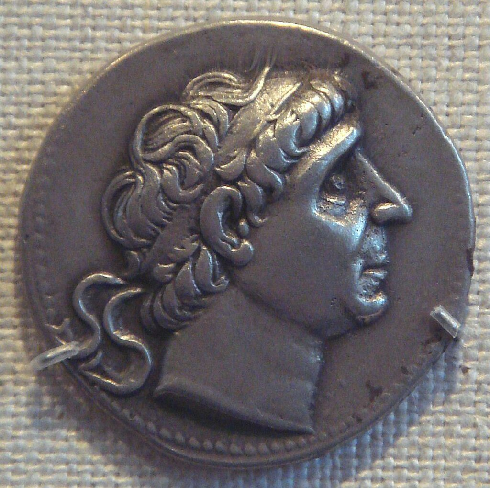

    Seleucid king [Antiochus II Theos](https://en.wikipedia.org/wiki/Antiochus_II_Theos "Antiochus II Theos") of Syria (261–246 BCE).

*   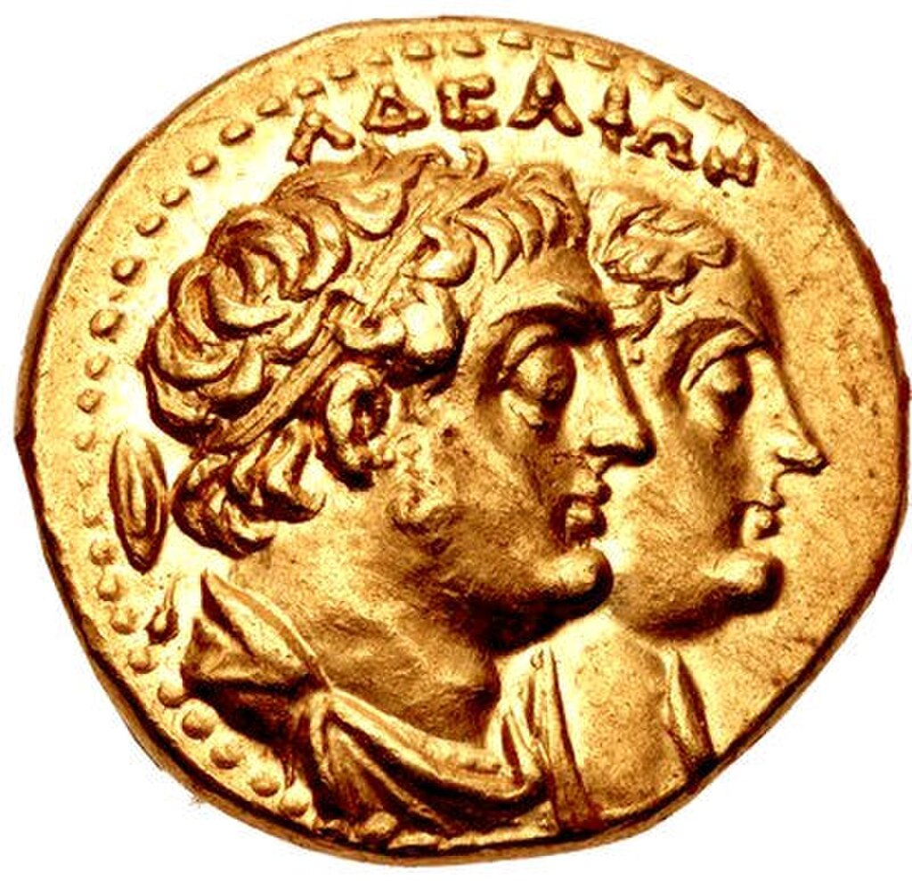

    [Ptolemy II Philadelphos](https://en.wikipedia.org/wiki/Ptolemy_II_of_Egypt "Ptolemy II of Egypt") of Egypt (285–247 BCE) with his sister [Arsinoe II](https://en.wikipedia.org/wiki/Arsinoe_II "Arsinoe II").

*   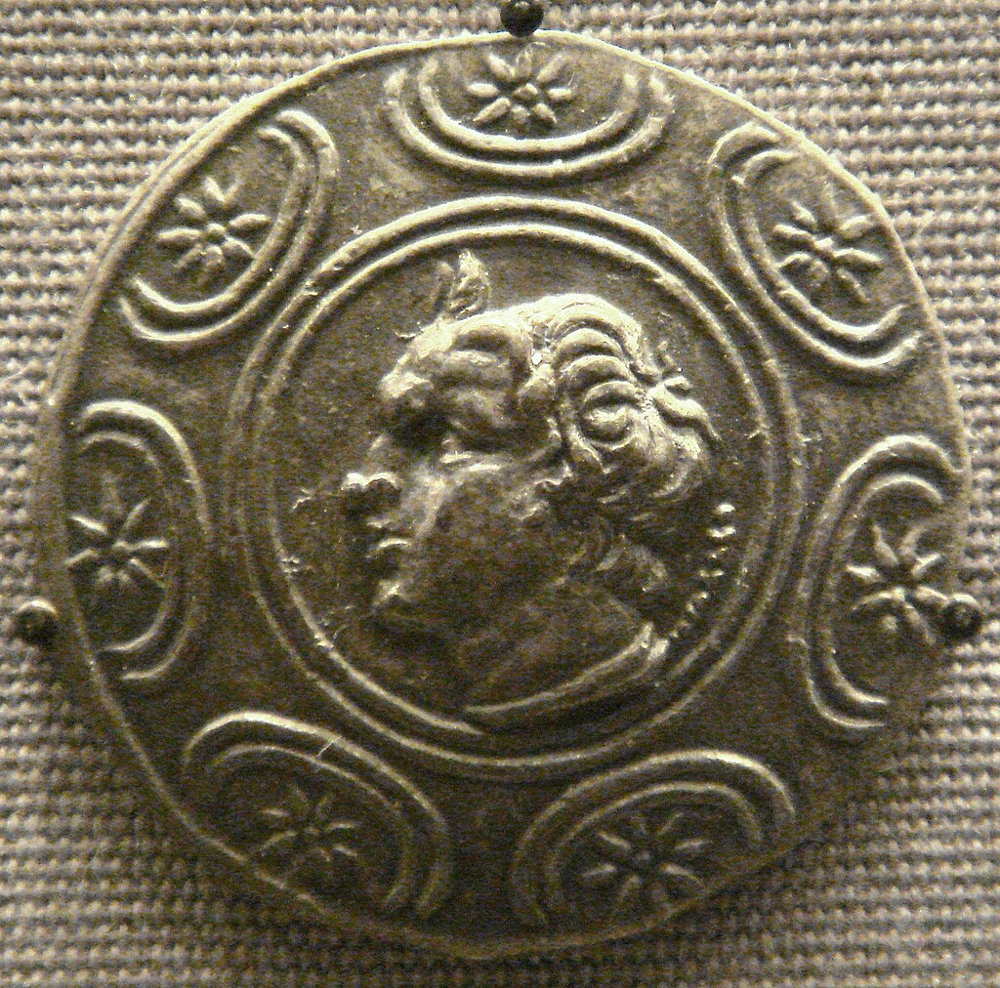

    [Antigonus II Gonatas](https://en.wikipedia.org/wiki/Antigonus_II_Gonatas "Antigonus II Gonatas") of [Macedon](https://en.wikipedia.org/wiki/Macedon "Macedon") (278–239 BCE).

*   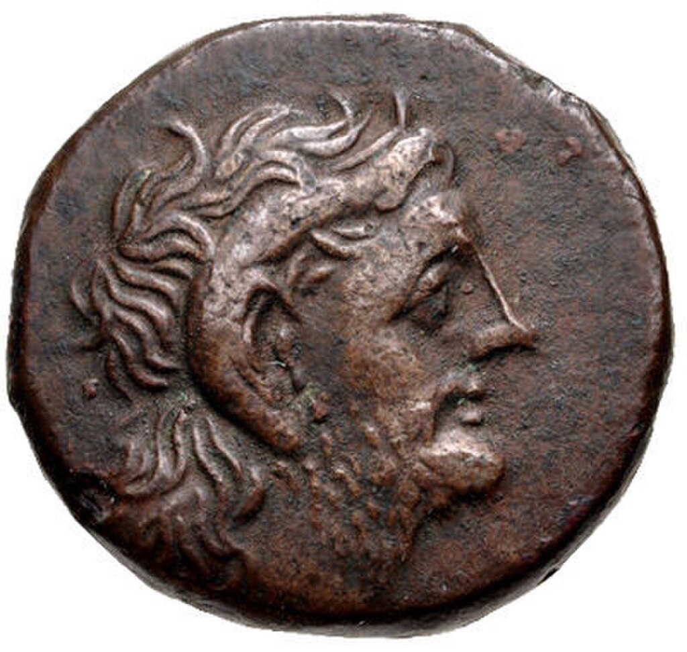

    [Magas of Cyrene](https://en.wikipedia.org/wiki/Magas_of_Cyrene "Magas of Cyrene") (300–258 BCE).

*   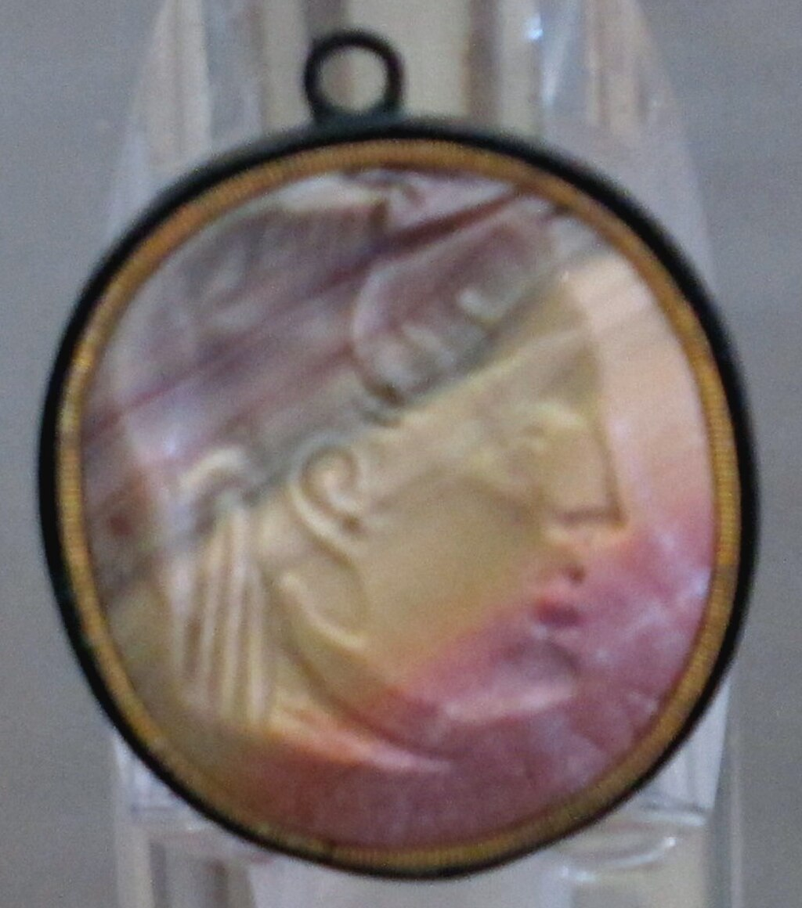

    [Alexander II of Epirus](https://en.wikipedia.org/wiki/Alexander_II_of_Epirus "Alexander II of Epirus") (272–258 BCE) on a cameo of agate.

\*\*Emissaries\*\* 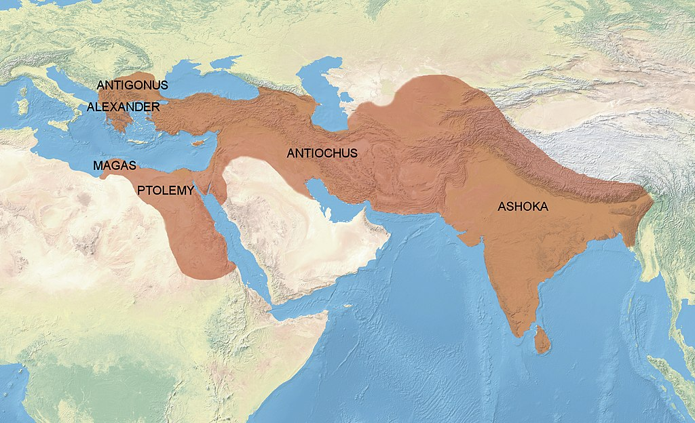Territories "conquered by the Dharma" according to [Major Rock Edict No.13](https://en.wikipedia.org/wiki/Major_Rock_Edicts "Major Rock Edicts") of Ashoka (260–232 BCE).

It is not clear in Hellenic records whether these emissaries were actually received, or had any influence on the Hellenic world. But the existence of the edicts in a very high-level Greek literary and philosophical language testifies to the high sophistication of the Greek community of [Kandahar](https://en.wikipedia.org/wiki/Kandahar "Kandahar"), and to a true communication between Greek intellectuals and Indian thought. According to historian [Louis Robert](https://en.wikipedia.org/wiki/Louis_Robert_\(historian\) "Louis Robert (historian)"), it becomes quite likely that these Kandahar Greeks who were very familiar with Indian culture could in turn transmit Indian ideas to the philosophical circles of the Mediterranean world, in [Seleucia](https://en.wikipedia.org/wiki/Seleucia "Seleucia"), [Antioch](https://en.wikipedia.org/wiki/Antioch "Antioch"), [Alexandria](https://en.wikipedia.org/wiki/Alexandria "Alexandria"), [Pella](https://en.wikipedia.org/wiki/Pella "Pella") or [Cyrene](https://en.wikipedia.org/wiki/Cyrene,_Libya "Cyrene, Libya"). He suggests that the famous Ashoka emissaries sent to the Western Hellenistic Courts according to Ashoka's Major Rock Edict No.13 were in fact Greek subjects and citizens of Kandahar, who had the full capacity to carry out these embassies.

Another document, the _[Mahavamsa](https://en.wikipedia.org/wiki/Mahavamsa "Mahavamsa")_ (XII, 1st paragraph), also states that in the 17th year of his reign, at the end of the [Third Buddhist Council](https://en.wikipedia.org/wiki/Third_Buddhist_Council "Third Buddhist Council"), Ashoka sent Buddhist missionaries to eight parts of Southern Asia and the "country of the Yonas" (Greeks) to propagate Buddhism.

\*\*Presence in the West\*\*

Overall, the evidence for the presence of Buddhists in the west from that time is very meager. But some scholars point to the possible presence of Buddhist communities in the [Hellenistic world](https://en.wikipedia.org/wiki/Hellenistic_world "Hellenistic world"), in particular in [Alexandria](https://en.wikipedia.org/wiki/Alexandria "Alexandria"). [Dio Chrysostum](https://en.wikipedia.org/wiki/Dio_Chrysostom "Dio Chrysostom") wrote to Alexandrians that there are "Indians who view the spectacles with you and are with you on all occasions" (Oratio.XXXII.373). According to [Ptolemy](https://en.wikipedia.org/wiki/Ptolemy "Ptolemy") also, Indians were present in Alexandria, to whom he was much indebted for his knowledge of India (As.Res.III.53). [Clement of Alexandria](https://en.wikipedia.org/wiki/Clement_of_Alexandria "Clement of Alexandria") too mentioned the presence of Indians in Alexandria. A possible Buddhist gravestone from the [Ptolemaic period](https://en.wikipedia.org/wiki/Ptolemaic_period "Ptolemaic period") has been found by [Flinders Petrie](https://en.wikipedia.org/wiki/Flinders_Petrie "Flinders Petrie"), decorated with a depiction of what may be [Dharmachakra](https://en.wikipedia.org/wiki/Dharmachakra "Dharmachakra") and [Trishula](https://en.wikipedia.org/wiki/Trishula "Trishula"). According to the 11th century Muslim historian [Al-Biruni](https://en.wikipedia.org/wiki/Al-Biruni "Al-Biruni"), before the advent of [Islam](https://en.wikipedia.org/wiki/Islam "Islam"), Buddhists were present in [Western Asia](https://en.wikipedia.org/wiki/Western_Asia "Western Asia") as far as the frontiers of [Syria](https://en.wikipedia.org/wiki/Syria_\(region\) "Syria (region)").

\*\*Possible influences on Western thought\*\* 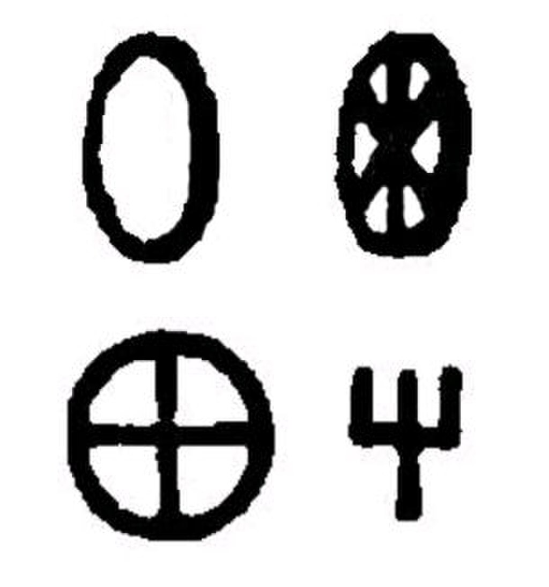**Top**: Wheels in Egyptian temples according to [Hero of Alexandria](https://en.wikipedia.org/wiki/Hero_of_Alexandria "Hero of Alexandria"). **Bottom**: Possible wheel and trisula symbol on Ptolemaic tombstones in Egypt.

Colonial era scholars such as [Rhys Davids](https://en.wikipedia.org/wiki/Thomas_Rhys_Davids "Thomas Rhys Davids") have attributed Ashoka's claims of "Dharmic conquest" to mere vanity, and expressed disbelief that Greeks could have been in any way influenced by Indian thought.

But numerous authors have noted the parallels between [Buddhism](https://en.wikipedia.org/wiki/Buddhism "Buddhism"), [Cyrenaicism](https://en.wikipedia.org/wiki/Cyrenaics "Cyrenaics") and [Epicureanism](https://en.wikipedia.org/wiki/Epicureanism "Epicureanism"), which all strive for a state of [ataraxia](https://en.wikipedia.org/wiki/Ataraxia "Ataraxia") ("equanimity") away from the sorrows of life. The positions of philosophers such as [Hegesias of Cyrene](https://en.wikipedia.org/wiki/Hegesias_of_Cyrene "Hegesias of Cyrene") were close to [Buddhism](https://en.wikipedia.org/wiki/Buddhism "Buddhism"), his ideas recalling the Buddhist doctrine of suffering: he lived in the city of [Cyrene](https://en.wikipedia.org/wiki/Cyrene,_Libya "Cyrene, Libya") where [Magas](https://en.wikipedia.org/wiki/Magas_of_Cyrene "Magas of Cyrene") ruled, the same Magas under whom the Dharma prospered according to Ashoka, and he may have been influenced by Ashoka's missionaries.

The religious communities of the [Essenes](https://en.wikipedia.org/wiki/Essenes "Essenes") of [Palestine](https://en.wikipedia.org/wiki/Palestine_\(region\) "Palestine (region)") and the [Therapeutae](https://en.wikipedia.org/wiki/Therapeutae "Therapeutae") of [Alexandria](https://en.wikipedia.org/wiki/Alexandria "Alexandria") may also have been communities based on the model of [Buddhist monasticism](https://en.wikipedia.org/wiki/Buddhist_monasticism "Buddhist monasticism"), following Ashoka's missions. According to [semitologist](https://en.wikipedia.org/wiki/Semitologist "Semitologist") [André Dupont-Sommer](https://en.wikipedia.org/wiki/André_Dupont-Sommer "André Dupont-Sommer"), speaking about the consequences of Ashoka's proselytism: "It is India which would be, according to us, at the beginning of this vast monastic current which shone with a strong brightness during about three centuries in [Judaism](https://en.wikipedia.org/wiki/Judaism "Judaism") itself". This influence would even contribute, according to André Dupont-Sommer, to the emergence of [Christianity](https://en.wikipedia.org/wiki/Christianity "Christianity"): "Thus was prepared the ground on which Christianity, that sect of Jewish origin influenced by the [Essenes](https://en.wikipedia.org/wiki/Essenes "Essenes"), which was so quickly and so powerfully to conquer a very large part of the world."

### Proselytism within Ashoka's territories

Inside India proper, in the empire of Ashoka, many different populations were the object of the emperor's proselytism. Greek communities also lived in the northwest of the Mauryan Empire, currently in Pakistan, notably ancient [Gandhara](/source/gandhara/ "Gandhara"), and in the region of [Gedrosia](https://en.wikipedia.org/wiki/Gedrosia "Gedrosia"), nowadays in Southern Afghanistan, following the conquest and the colonization efforts of Alexander the Great around 323 BCE. These communities therefore seem to have been still significant during the reign of Ashoka. The [Kambojas](https://en.wikipedia.org/wiki/Kambojas "Kambojas") are a people of [Central Asian](https://en.wikipedia.org/wiki/Central_Asia "Central Asia") origin who had settled first in [Arachosia](https://en.wikipedia.org/wiki/Arachosia "Arachosia") and [Drangiana](https://en.wikipedia.org/wiki/Drangiana "Drangiana") (today's southern [Afghanistan](https://en.wikipedia.org/wiki/Afghanistan "Afghanistan")), and in some of the other areas in the northwestern Indian subcontinent in [Sindh](https://en.wikipedia.org/wiki/History_of_sindh "History of sindh"), [Gujarat](https://en.wikipedia.org/wiki/History_of_Gujarat "History of Gujarat") and [Sauvira](https://en.wikipedia.org/wiki/Sauvira "Sauvira"). The Nabhakas, the Nabhapamkits, the [Bhojas](https://en.wikipedia.org/wiki/Bhoja_tribe "Bhoja tribe"), the Pitinikas, the [Andhras](https://en.wikipedia.org/wiki/Andhra_people "Andhra people") and the [Palidas](https://en.wikipedia.org/wiki/Paradas "Paradas") were other people under Ashoka's rule:

> Here in the king's domain among the Greeks, the [Kambojas](https://en.wikipedia.org/wiki/Kambojas "Kambojas"), the Nabhakas, the Nabhapamkits, the [Bhojas](https://en.wikipedia.org/wiki/Bhoja_tribe "Bhoja tribe"), the Pitinikas, the [Andhras](https://en.wikipedia.org/wiki/Andhras "Andhras") and the [Palidas](https://en.wikipedia.org/wiki/Paradas "Paradas"), everywhere people are following Beloved-of-the-Gods' instructions in Dhamma. Rock Edict No.13 (S. Dhammika)

## Influences

### Achaemenid inscriptional tradition

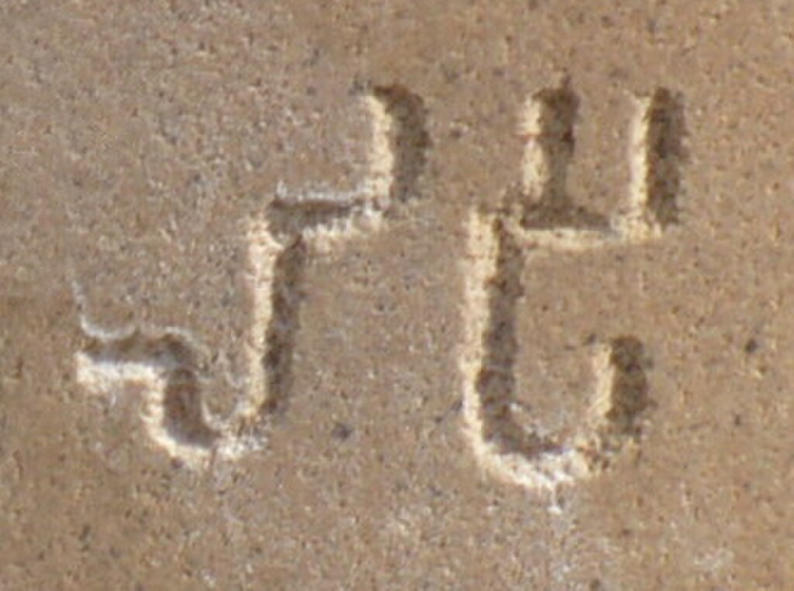The word _[Lipī](https://en.wikipedia.org/wiki/Lipī "Lipī")_ (𑀮𑀺𑀧𑀻) used by As hoka to describe his "Edicts". [Brahmi script](https://en.wikipedia.org/wiki/Brahmi_script "Brahmi script") (Li=`𑀮`La+`𑀺`i; pī=`𑀧`Pa+`𑀻`ii).The same word was "Dipi" in the northwest, identical with the Persian word for writing, as in this segment "[Dhrama](https://en.wikipedia.org/wiki/Dharma "Dharma")-[Dipi](https://en.wikipedia.org/wiki/Lipi_\(script\) "Lipi (script)")" (𐨢𐨿𐨪𐨨𐨡𐨁𐨤𐨁, "inscription of the Dharma") in [Kharosthi](/source/kharosthi/ "Kharosthi") script in the First Edict at [Shahbazgarhi](https://en.wikipedia.org/wiki/Shahbazgarhi "Shahbazgarhi"). The third letter from the right reads "Di"  and not "Li" .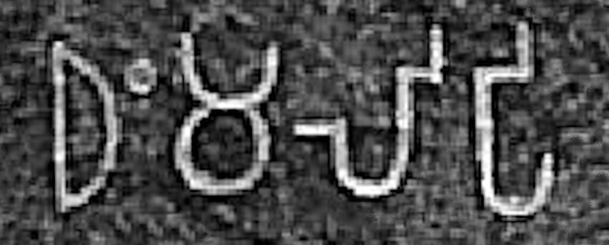The same expression _Dhamma Lipi_ ("Dharma inscriptions") in [Brahmi script](https://en.wikipedia.org/wiki/Brahmi_script "Brahmi script") ([𑀥𑀁𑀫𑀮𑀺𑀧𑀺](https://en.wiktionary.org/wiki/𑀥𑀁𑀫𑀮𑀺𑀧𑀺 "wikt:𑀥𑀁𑀫𑀮𑀺𑀧𑀺")), [Delhi-Topra Pillar](https://en.wikipedia.org/wiki/Delhi-Topra_pillar "Delhi-Topra pillar").

The inscriptions of Ashoka may show [Achaemenid](https://en.wikipedia.org/wiki/Achaemenid_Empire "Achaemenid Empire") influences, including formulaic parallels with [Achaemenid](https://en.wikipedia.org/wiki/Achaemenid_Empire "Achaemenid Empire") inscriptions, presence of [Iranian](https://en.wikipedia.org/wiki/Iranian_languages "Iranian languages") loanwords (in [Aramaic](https://en.wikipedia.org/wiki/Official_Aramaic "Official Aramaic") inscriptions), and the very act of engraving edicts on rocks and mountains (compare for example [Behistun inscription](https://en.wikipedia.org/wiki/Behistun_inscription "Behistun inscription")). To describe his own Edicts, Ashoka used the word _[Lipī](https://en.wikipedia.org/wiki/Lipī "Lipī")_ ([𑀮𑀺𑀧𑀺](https://en.wiktionary.org/wiki/𑀮𑀺𑀧𑀺 "wikt:𑀮𑀺𑀧𑀺")), now generally simply translated as "writing" or "inscription". It is thought the word "lipi", which is also orthographed "dipi" (𐨡𐨁𐨤𐨁) in the two [Kharosthi](/source/kharosthi/ "Kharosthi") versions of the rock edicts, comes from an [Old Persian](https://en.wikipedia.org/wiki/Old_Persian "Old Persian") prototype _dipî_ ([𐎮𐎡𐎱𐎡](https://en.wiktionary.org/wiki/लिपि "wikt:लिपि")) also meaning "inscription", which is used for example by [Darius I](https://en.wikipedia.org/wiki/Darius_I "Darius I") in his [Behistun inscription](https://en.wikipedia.org/wiki/Behistun_inscription "Behistun inscription"), suggesting borrowing and diffusion. There are other borrowings of [Old Persian](https://en.wikipedia.org/wiki/Old_Persian "Old Persian") terms for writing-related words in the Edicts of Ahoka, such as _nipista_ or _nipesita_ ([𐨣𐨁𐨤𐨁𐨯𐨿𐨟](https://en.wiktionary.org/wiki/𐨣𐨁𐨤𐨁𐨯𐨿𐨟 "wikt:𐨣𐨁𐨤𐨁𐨯𐨿𐨟"), "written" and "made to be written") in the [Kharoshthi](https://en.wikipedia.org/wiki/Kharoshthi "Kharoshthi") version of [Major Rock Edict](https://en.wikipedia.org/wiki/Major_Rock_Edict "Major Rock Edict") No.4, which can be related to the word _nipištā_ (𐎴𐎡𐎱𐎡𐏁𐎫𐎠, "written") from the _daiva_ inscription of [Xerxes I](https://en.wikipedia.org/wiki/Xerxes_I "Xerxes I") at [Persepolis](https://en.wikipedia.org/wiki/Persepolis "Persepolis").

### Hellenistic inscriptions

It has also been suggested that inscriptions bearing the [Delphic maxims](https://en.wikipedia.org/wiki/Delphic_maxims "Delphic maxims") from the [Seven Sages of Greece](https://en.wikipedia.org/wiki/Seven_Sages_of_Greece "Seven Sages of Greece"), inscribed by philosopher [Clearchus of Soli](https://en.wikipedia.org/wiki/Clearchus_of_Soli "Clearchus of Soli") in the neighbouring city of [Ai-Khanoum](https://en.wikipedia.org/wiki/Ai-Khanoum "Ai-Khanoum") circa 300 BCE, may have influenced the writings of Ashoka. These Greek inscriptions, located in the central square of Ai-Khanoum, put forward traditional Greek moral rules which are very close to the Edicts, both in term of formulation and content.

### Ancestor of the Hindu–Arabic numeral system

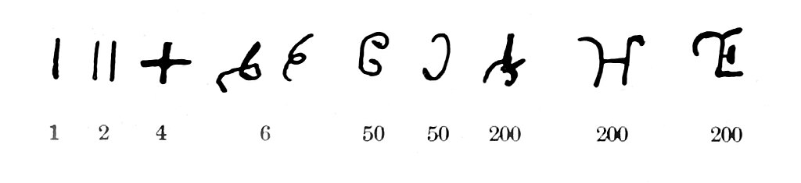The numerals used by Ashoka in his Edicts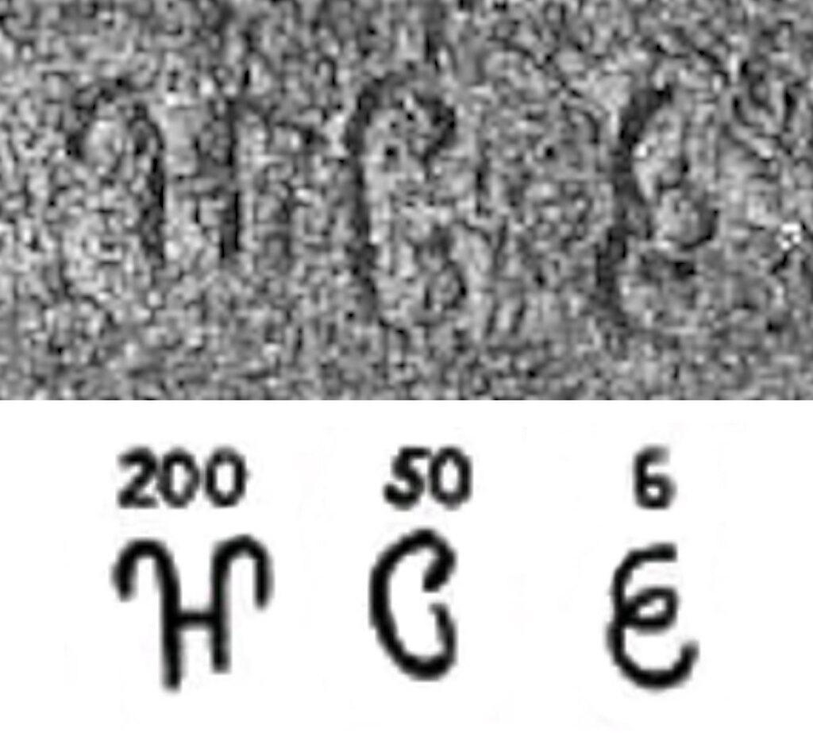The number "256" in Ashoka's [Minor Rock Edict](https://en.wikipedia.org/wiki/Minor_Rock_Edict "Minor Rock Edict") No.1 in [Sasaram](https://en.wikipedia.org/wiki/Sasaram "Sasaram")

The first examples of the [Hindu–Arabic numeral system](https://en.wikipedia.org/wiki/Hindu–Arabic_numeral_system "Hindu–Arabic numeral system") appeared in the [Brahmi numerals](https://en.wikipedia.org/wiki/Brahmi_numerals "Brahmi numerals") used in the Edicts of Ashoka, in which a few numerals are found, although the system is not yet positional (the [zero](https://en.wikipedia.org/wiki/Zero "Zero"), together with a mature positional system, was invented much later around the 6th century CE) and involves different symbols for units, dozens or hundreds. This system is later further documented with more numerals in the [Nanaghat inscriptions](https://en.wikipedia.org/wiki/Nanaghat_Inscriptions "Nanaghat Inscriptions") (1st century BCE), and later in the [Nasik Caves](https://en.wikipedia.org/wiki/Nasik_Caves "Nasik Caves") inscriptions (2nd century CE), to acquire designs which are largely similar to the [Hindu–Arabic numerals](https://en.wikipedia.org/wiki/Hindu–Arabic_numerals "Hindu–Arabic numerals") used today.

The number "[6](https://en.wikipedia.org/wiki/6 "6")" in particular appears in [Minor Rock Edict](https://en.wikipedia.org/wiki/Minor_Rock_Edict "Minor Rock Edict") No.1 when Ashoka explains he has "been on tour for 256 days". The evolution to the modern glyph for 6 appears rather straightforward. It was written in one stroke, somewhat like a cursive lowercase "e". Gradually, the upper part of the stroke (above the central squiggle) became more curved, while the lower part of the stroke (below the central squiggle) became straighter. The Arabs dropped the part of the stroke below the squiggle. From there, the European evolution to the modern 6 was very straightforward, aside from a flirtation with a glyph that looked more like an uppercase G.

### Influence on the Indian epigraphy

The Edicts of Ashoka started a tradition of epigraphical inscriptions. 1800 years separate these two inscriptions: Brahmi script of the 3rd century BCE (Major Pillar Edict of Ashoka), and its derivative, 16th century CE [Devanagari](https://en.wikipedia.org/wiki/Devanagari "Devanagari") script (1524 CE), on the [Delhi-Topra Pillar](https://en.wikipedia.org/wiki/Ashokan_Edicts_in_Delhi "Ashokan Edicts in Delhi").

Ashokan inscriptions in [Prakrit](https://en.wikipedia.org/wiki/Prakrit "Prakrit") precede by several centuries inscriptions in [Sanskrit](/source/sanskrit/ "Sanskrit"), probably owing to the great prestige which Ashokan inscriptions gave to the Prakrit language. Louis Renou called it "the great linguistical [paradox](https://en.wikipedia.org/wiki/Paradox "Paradox") of India" that the Sanskrit inscriptions appear later than [Prakrit](https://en.wikipedia.org/wiki/Prakrit "Prakrit") inscriptions, although Prakrit is considered as a descendant of the Sanskrit language.

Ashoka was probably the first Indian ruler to create stone inscriptions, and in doing so, he began an important Indian tradition of royal epigraphical inscriptions. The earliest known stone inscriptions in Sanskrit are in the Brahmi script from the first century BCE. These early Sanskrit inscriptions include the [Ayodhyā](https://en.wikipedia.org/wiki/Ayodhya_Inscription_of_Dhana "Ayodhya Inscription of Dhana") ([Uttar Pradesh](https://en.wikipedia.org/wiki/Uttar_Pradesh "Uttar Pradesh")) and [Hāthībādā-Ghosuṇḍī](https://en.wikipedia.org/wiki/Hathibada_Ghosundi_Inscriptions "Hathibada Ghosundi Inscriptions") (near [Chittorgarh](https://en.wikipedia.org/wiki/Chittorgarh "Chittorgarh"), [Rajasthan](https://en.wikipedia.org/wiki/Rajasthan "Rajasthan")) inscriptions. Other important inscriptions dated to the 1st century BCE, in relatively accurate classical Sanskrit and Brahmi script are the [Yavanarajya inscription](https://en.wikipedia.org/wiki/Yavanarajya_inscription "Yavanarajya inscription") on a red sandstone slab and the long [Naneghat inscription](https://en.wikipedia.org/wiki/Naneghat#Nanaghat_inscriptions "Naneghat") on the wall of a cave rest stop in the [Western Ghats](https://en.wikipedia.org/wiki/Western_Ghats "Western Ghats"). Besides these few examples from the 1st century BCE, the bulk of early Sanskrit inscriptions were made from the 1st and 2nd-century CE by the [Indo-Scythian](https://en.wikipedia.org/wiki/Indo-Scythian "Indo-Scythian") [Northern Satraps](https://en.wikipedia.org/wiki/Northern_Satraps "Northern Satraps") in [Mathura](https://en.wikipedia.org/wiki/Mathura "Mathura") ([Uttar Pradesh](https://en.wikipedia.org/wiki/History_of_Uttar_Pradesh "History of Uttar Pradesh")), and the [Western Satraps](https://en.wikipedia.org/wiki/Western_Satraps "Western Satraps") in [Gujarat](https://en.wikipedia.org/wiki/History_of_Gujarat "History of Gujarat") and [Maharashtra](https://en.wikipedia.org/wiki/History_of_Maharashtra "History of Maharashtra"). According to Salomon, the Scythian rulers of northern and western India while not the originators, were promoters of the use of Sanskrit language for inscriptions, and "their motivation in promoting Sanskrit was presumably a desire to establish themselves as legitimate Indian or at least Indianized rulers and to curry the favor of the educated Brahmanical elite".

The [Brahmi script](https://en.wikipedia.org/wiki/Brahmi_script "Brahmi script") used in the Edicts of Ashoka, as well as the [Prakrit](https://en.wikipedia.org/wiki/Prakrit "Prakrit") language of these inscriptions was in popular use down through the [Kushan period](https://en.wikipedia.org/wiki/Kushan_period "Kushan period"), and remained readable down to the 4th century CE during the [Gupta period](https://en.wikipedia.org/wiki/Gupta_period "Gupta period"). After that time the script underwent significant evolutions which rendered the Ashokan inscriptions unreadable. This still means that Ashoka's Edicts were for everyone to see and understand for a period of nearly 700 years in India, suggesting that they remained significantly influential for a long time.

## Later mention

The Chinese traveller [Fa Hian](https://en.wikipedia.org/wiki/Fa_Hian "Fa Hian") in his writings refers to one of Ashoka's edicts in Ni-li city. However, the specific edict mentioned by Fa-Hien has not yet been discovered.

> On the surface of this pillar is an inscription to the following effect:
>
> _“King Asoka presented the whole of Jambudvipa to the priests of the four quarters, and redeemed it again with money, and tins he did three times.”_
>
> Three or four hundred paces to the north of the pagoda is the spot where Asoka was horn (or resided). On this spot he raised the city of Ni-li, and in the midst of it erected a stone pillar, also about 35 feet in height, on the top of which he placed the figure of a lion, and also engraved an historical record on the pillar giving an account of the successive events connected with Ni-li, with the corresponding year, day, and month.
> — Chapter XXVII, The travels of [Fa Hian](https://en.wikipedia.org/wiki/Fa_Hian "Fa Hian") (400 A.D.)

## Questions of authorship

The Edicts and their declared authors

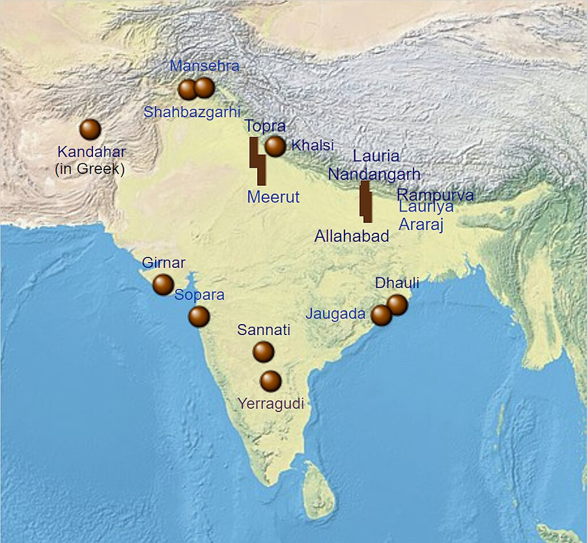

Edicts in the name of [Piyadasi](https://en.wikipedia.org/wiki/Priyadasi "Priyadasi") or _[Devanampiya](https://en.wikipedia.org/wiki/Devanampiya "Devanampiya")_ Piyadasi ("King Piyadasi"):
!: [Major Rock Edicts](https://en.wikipedia.org/wiki/Major_Rock_Edicts "Major Rock Edicts")
!: [Major Pillar Edicts](https://en.wikipedia.org/wiki/Major_Pillar_Edicts "Major Pillar Edicts")

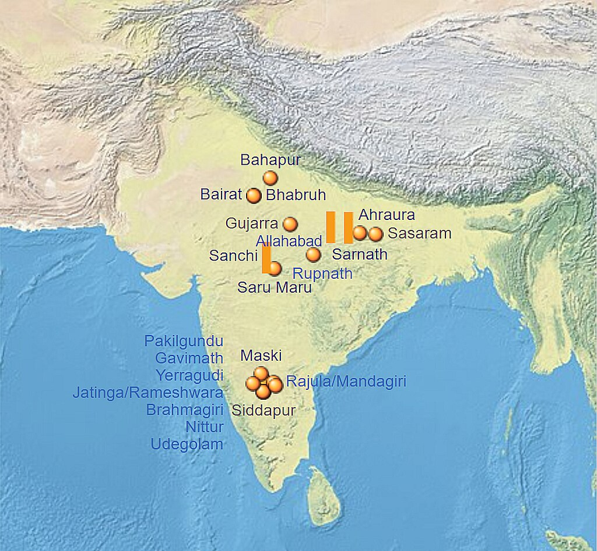

Edicts in the name of Ashoka or just _[Devanampiya](https://en.wikipedia.org/wiki/Devanampiya "Devanampiya")_ ("King"), or both together:
!: [Minor Rock Edicts](https://en.wikipedia.org/wiki/Minor_Rock_Edicts "Minor Rock Edicts")
!: [Minor Pillar Edicts](https://en.wikipedia.org/wiki/Minor_Pillar_Edicts "Minor Pillar Edicts")

The different areas covered by the two types of inscriptions, and their different content in respect to Buddhism, may point to different rulers namely [Chandragupta Maurya](https://en.wikipedia.org/wiki/Chandragupta_Maurya "Chandragupta Maurya") and [Bindusara](https://en.wikipedia.org/wiki/Bindusara "Bindusara").

According to [Christopher I. Beckwith](https://en.wikipedia.org/wiki/Christopher_I._Beckwith "Christopher I. Beckwith") — whose theories are not accepted by mainstream scholarship — Ashoka, whose name only appears in the [Minor Rock Edicts](https://en.wikipedia.org/wiki/Minor_Rock_Edicts "Minor Rock Edicts"), should be differentiated from the King [Piyadasi](https://en.wikipedia.org/wiki/Priyadasi "Priyadasi"), or _[Devanampiya](https://en.wikipedia.org/wiki/Devanampiya "Devanampiya")_ Piyadasi (i.e. "Beloved of the Gods Piyadasi", "Beloved of the Gods" being a fairly widespread title for "King"), who is named as the author of the [Major Pillar Edicts](https://en.wikipedia.org/wiki/Major_Pillar_Edicts "Major Pillar Edicts") and the [Major Rock Edicts](https://en.wikipedia.org/wiki/Major_Rock_Edicts "Major Rock Edicts"). Beckwith also highlights the fact that neither Buddhism nor the Buddha are mentioned in the Major Edicts, but only in the Minor Edicts. Further, the Buddhist notions described in the Minor Edicts (such as the Buddhist [canonical](https://en.wikipedia.org/wiki/Pali_Canon "Pali Canon") writings in Minor Edict No.3 at [Bairat Temple](https://en.wikipedia.org/wiki/Bairat_Temple "Bairat Temple"), the mention of a Buddha of the past [Kanakamuni Buddha](https://en.wikipedia.org/wiki/Kanakamuni_Buddha "Kanakamuni Buddha") in the [Nigali Sagar](https://en.wikipedia.org/wiki/Nigali_Sagar "Nigali Sagar") Minor Pillar Edict) are more characteristic of the "Normative Buddhism" of the [Saka](https://en.wikipedia.org/wiki/Saka "Saka")-[Kushan](https://en.wikipedia.org/wiki/Kushan_Empire "Kushan Empire") period around the 2nd century CE.

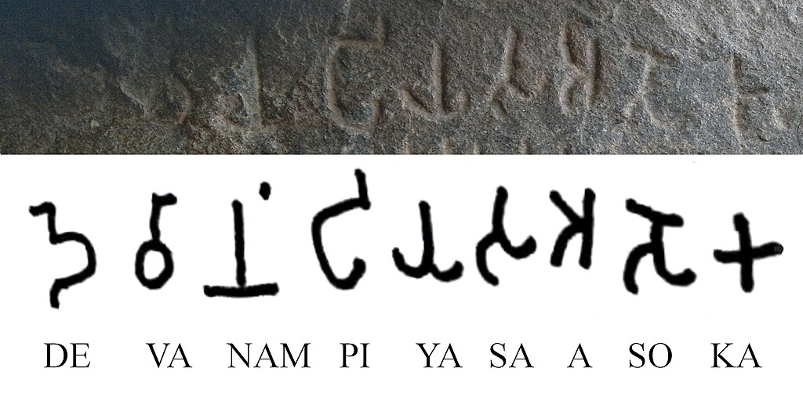"Devānaṃpiyasa Asoka", honorific Devanampiya ([Brahmi script](https://en.wikipedia.org/wiki/Brahmi_script "Brahmi script"): 𑀤𑁂𑀯𑀸𑀦𑀁𑀧𑀺𑀬𑀲𑀅𑀲𑁄𑀓, "Beloved of the God", in the adjectival form -sa) and name of [Ashoka](https://en.wikipedia.org/wiki/Ashoka "Ashoka"), in [Brahmi script](https://en.wikipedia.org/wiki/Brahmi_script "Brahmi script"), in the [Maski](https://en.wikipedia.org/wiki/Maski "Maski") [Edict of Ashoka](https://en.wikipedia.org/wiki/Edict_of_Ashoka "Edict of Ashoka")

Beckwith proposed that possibly [Piyadasi](https://en.wikipedia.org/wiki/Priyadasi "Priyadasi") and Ashoka were two different rulers. According to Beckwith, Piyadasi was living in the 3rd century BCE, probably the son of [Chandragupta Maurya](https://en.wikipedia.org/wiki/Chandragupta_Maurya "Chandragupta Maurya") known to the Greeks as [Amitrochates](https://en.wikipedia.org/wiki/Amitrochates "Amitrochates"), and only advocating for piety ("[Dharma](https://en.wikipedia.org/wiki/Dharma "Dharma")") in his [Major Pillar Edicts](https://en.wikipedia.org/wiki/Major_Pillar_Edicts "Major Pillar Edicts") and [Major Rock Edicts](https://en.wikipedia.org/wiki/Major_Rock_Edicts "Major Rock Edicts"), without ever mentioning [Buddhism](https://en.wikipedia.org/wiki/Buddhism "Buddhism"), the [Buddha](https://en.wikipedia.org/wiki/Buddha "Buddha") or the [Samgha](https://en.wikipedia.org/wiki/Samgha "Samgha"). Since he does mention a pilgrimage to _Sambhodi_ ([Bodh Gaya](https://en.wikipedia.org/wiki/Bodh_Gaya "Bodh Gaya"), in [Major Rock Edict](https://en.wikipedia.org/wiki/Major_Rock_Edict "Major Rock Edict") No.8) however, he may have adhered to an "early, pietistic, popular" form of Buddhism. Also, the geographical spread of his inscription shows that Piyadasi ruled a vast Empire, contiguous with the [Seleucid Empire](https://en.wikipedia.org/wiki/Seleucid_Empire "Seleucid Empire") in the West.

On the contrary, for Beckwith, Ashoka himself was a later king of the 1st-2nd century CE, whose name only appears explicitly in the [Minor Rock Edicts](https://en.wikipedia.org/wiki/Minor_Rock_Edicts "Minor Rock Edicts") and allusively in the [Minor Pillar Edicts](https://en.wikipedia.org/wiki/Minor_Pillar_Edicts "Minor Pillar Edicts"), and who does mention the Buddha and the [Samgha](https://en.wikipedia.org/wiki/Samgha "Samgha"), explicitly promoting Buddhism. He may have been an unknown or possibly invented ruler named Devanampriya Asoka, with the intent of propagating a later, more institutional version of the Buddhist faith. His inscriptions cover a very different and much smaller geographical area, clustering in Central India. According to Beckwith, the inscriptions of this later Ashoka were typical of the later forms of "normative Buddhism", which are well attested from inscriptions and Gandhari manuscripts dated to the turn of the millennium, and around the time of the [Kushan Empire](https://en.wikipedia.org/wiki/Kushan_Empire "Kushan Empire"). The quality of the inscriptions of this Ashoka is significantly lower than the quality of the inscriptions of the earlier Piyadasi.

However, many of Beckwith's methodologies and interpretations concerning early Buddhism, inscriptions, and archaeological sites have been criticized by other scholars, such as [Johannes Bronkhorst](https://en.wikipedia.org/wiki/Johannes_Bronkhorst "Johannes Bronkhorst") and [Osmund Bopearachchi](https://en.wikipedia.org/wiki/Osmund_Bopearachchi "Osmund Bopearachchi"). According to [Patrick Olivelle](https://en.wikipedia.org/wiki/Patrick_Olivelle "Patrick Olivelle"), Beckwith's theory is "an outlier and no mainstream Ashokan scholar would subscribe to that view."

## Timeline

Edicts of Ashoka (Ruled 269–232 BCE)

Regnal years
of [Ashoka](https://en.wikipedia.org/wiki/Ashoka "Ashoka")Type of Edict
(and location of the inscriptions)

Year 8

_End of the [Kalinga War](https://en.wikipedia.org/wiki/Kalinga_War "Kalinga War") and conversion to the [Dharma](https://en.wikipedia.org/wiki/Dharma "Dharma")_

Year 10

**[Minor Rock Edicts](https://en.wikipedia.org/wiki/Minor_Rock_Edicts "Minor Rock Edicts")**

**Related events:**
Visit to the [Bodhi tree](https://en.wikipedia.org/wiki/Bodhi_tree "Bodhi tree") in [Bodh Gaya](https://en.wikipedia.org/wiki/Bodh_Gaya "Bodh Gaya")
Construction of the [Mahabodhi Temple](https://en.wikipedia.org/wiki/Mahabodhi_Temple "Mahabodhi Temple") and [Diamond throne](https://en.wikipedia.org/wiki/Diamond_throne "Diamond throne") in Bodh Gaya
Predication throughout India.
Dissenssions in the [Sangha](https://en.wikipedia.org/wiki/Sangha "Sangha")
[Third Buddhist Council](https://en.wikipedia.org/wiki/Third_Buddhist_Council "Third Buddhist Council")
In Indian language: [Sohgaura inscription](https://en.wikipedia.org/wiki/Sohgaura_copper_plate_inscription "Sohgaura copper plate inscription")
Erection of the [Pillars of Ashoka](https://en.wikipedia.org/wiki/Pillars_of_Ashoka "Pillars of Ashoka")

[Kandahar Bilingual Rock Inscription](https://en.wikipedia.org/wiki/Kandahar_Bilingual_Rock_Inscription "Kandahar Bilingual Rock Inscription")
(in [Greek](https://en.wikipedia.org/wiki/Greek_language "Greek language") and [Aramaic](https://en.wikipedia.org/wiki/Aramaic "Aramaic"), [Kandahar](https://en.wikipedia.org/wiki/Kandahar "Kandahar"))

Minor Rock Edicts in [Aramaic](https://en.wikipedia.org/wiki/Aramaic "Aramaic"):
[Laghman Inscription](https://en.wikipedia.org/wiki/Aramaic_Inscription_of_Laghman "Aramaic Inscription of Laghman"), [Taxila inscription](https://en.wikipedia.org/wiki/Aramaic_Inscription_of_Taxila "Aramaic Inscription of Taxila")

Year 11 and later

[Minor Rock Edicts (n°1, n°2 and n°3)](https://en.wikipedia.org/wiki/Minor_Rock_Edicts "Minor Rock Edicts")
([Panguraria](https://en.wikipedia.org/wiki/Saru_Maru "Saru Maru"), [Maski](https://commons.wikimedia.org/wiki/Category:Ashoka%20Rock%20Edict,%20Maski "commons:Category:Ashoka Rock Edict, Maski"), [Palkigundu and Gavimath](https://en.wikipedia.org/wiki/Palkigundu_and_Gavimath,_Koppal "Palkigundu and Gavimath, Koppal"), [Bahapur/Srinivaspuri](https://commons.wikimedia.org/wiki/Category:Ashoka%20Minor%20Rock%20Edict,%20Bahapur,%20Delhi "commons:Category:Ashoka Minor Rock Edict, Bahapur, Delhi"), [Bairat](https://en.wikipedia.org/wiki/Bairat_Temple "Bairat Temple"), [Ahraura](https://en.wikipedia.org/wiki/Ahraura "Ahraura"), [Gujarra](https://commons.wikimedia.org/wiki/Category:Ashoka%20Minor%20Rock%20Edict,%20Gujarra "commons:Category:Ashoka Minor Rock Edict, Gujarra"), [Sasaram](https://en.wikipedia.org/wiki/Sasaram "Sasaram"), [Rajula Mandagiri](https://commons.wikimedia.org/wiki/Category:Ashoka%20Minor%20Rock%20Edicts,%20Rajula%20Mandagiri "commons:Category:Ashoka Minor Rock Edicts, Rajula Mandagiri"), [Yerragudi](https://commons.wikimedia.org/wiki/Category:Ashoka%20Minor%20Rock%20Edict,%20Yerragudi "commons:Category:Ashoka Minor Rock Edict, Yerragudi"), [Udegolam](https://commons.wikimedia.org/wiki/Category:Ashoka%20Minor%20Rock%20Edict,%20Udegolam "commons:Category:Ashoka Minor Rock Edict, Udegolam"), [Nittur](https://commons.wikimedia.org/wiki/Category:Ashoka%20Minor%20Rock%20Edict,%20Nittur "commons:Category:Ashoka Minor Rock Edict, Nittur"), [Brahmagiri](https://commons.wikimedia.org/wiki/Category:Ashoka%20Minor%20Rock%20Edict,%20Brahmagiri "commons:Category:Ashoka Minor Rock Edict, Brahmagiri"), [Siddapur](https://commons.wikimedia.org/wiki/Category:Ashoka%20Minor%20Rock%20Edict,%20Siddapur "commons:Category:Ashoka Minor Rock Edict, Siddapur"), [Jatinga-Rameshwara](https://commons.wikimedia.org/wiki/Category:Ashoka%20Minor%20Rock%20Edict,%20Jatinga%20Rameshwara "commons:Category:Ashoka Minor Rock Edict, Jatinga Rameshwara"))

Year 12 and later

**[Barabar Caves inscriptions](https://en.wikipedia.org/wiki/Barabar_Caves "Barabar Caves")**

**[Major Rock Edicts](https://en.wikipedia.org/wiki/Ashoka's_Major_Rock_Edicts "Ashoka's Major Rock Edicts")**

**[Minor Pillar Edicts](https://en.wikipedia.org/wiki/Minor_Pillar_Edicts "Minor Pillar Edicts")**

Major Rock Edicts in Greek: [Edicts n°12-13](https://en.wikipedia.org/wiki/Kandahar_Greek_Edict_of_Ashoka "Kandahar Greek Edict of Ashoka") ([Kandahar](https://en.wikipedia.org/wiki/Kandahar "Kandahar"))

Major Rock Edicts in Indian language:
[Edicts No.1 ~ No.14](https://en.wikipedia.org/wiki/Major_Rock_Edicts "Major Rock Edicts")
(in [Kharoshthi](https://en.wikipedia.org/wiki/Kharoshthi "Kharoshthi") script: [Shahbazgarhi](https://en.wikipedia.org/wiki/Shahbaz_Garhi "Shahbaz Garhi"), [Mansehra Edicts](https://en.wikipedia.org/wiki/Mansehra_Rock_Edicts "Mansehra Rock Edicts")
(in [Brahmi script](https://en.wikipedia.org/wiki/Brahmi_script "Brahmi script"): [Kalsi](https://en.wikipedia.org/wiki/Khalsi_inscription "Khalsi inscription"), [Girnar](https://en.wikipedia.org/wiki/Girnar "Girnar"), [Sopara](https://en.wikipedia.org/wiki/Sopara "Sopara"), [Sannati](https://en.wikipedia.org/wiki/Sannati "Sannati"), [Yerragudi](https://commons.wikimedia.org/wiki/Category:Ashoka%20Minor%20Rock%20Edict,%20Yerragudi "commons:Category:Ashoka Minor Rock Edict, Yerragudi"), [Delhi Edicts](https://en.wikipedia.org/wiki/Ashokan_Edicts_in_Delhi "Ashokan Edicts in Delhi"))
Major Rock Edicts 1-10, 14, [Separate Edicts 1&2](https://en.wikipedia.org/wiki/Major_Rock_Edicts "Major Rock Edicts"):
([Dhauli](https://en.wikipedia.org/wiki/Dhauli "Dhauli"), [Jaugada](https://en.wikipedia.org/wiki/Jaugada "Jaugada"))

[Schism Edict](https://commons.wikimedia.org/wiki/Category:Schism%20Edict%20of%20Ashoka "commons:Category:Schism Edict of Ashoka"), [Queen's Edict](https://en.wikipedia.org/wiki/File:Ashoka_Inscriptions_Queen's_edict.jpg "File:Ashoka Inscriptions Queen's edict.jpg")
([Sarnath](https://en.wikipedia.org/wiki/Sarnath "Sarnath") [Sanchi](https://en.wikipedia.org/wiki/Sanchi "Sanchi") [Allahabad](https://en.wikipedia.org/wiki/Allahabad_pillar "Allahabad pillar"))
[Lumbini inscription](https://en.wikipedia.org/wiki/Lumbini_pillar_inscription "Lumbini pillar inscription"), [Nigali Sagar inscription](https://en.wikipedia.org/wiki/Nigali_Sagar "Nigali Sagar")

Year 26, 27
and later

**[Major Pillar Edicts](https://en.wikipedia.org/wiki/Major_Pillar_Edicts "Major Pillar Edicts")**

In Indian language:
[Major Pillar Edicts No.1 ~ No.7](https://en.wikipedia.org/wiki/Major_Pillar_Edicts "Major Pillar Edicts")
([Allahabad pillar](https://en.wikipedia.org/wiki/Allahabad_pillar "Allahabad pillar") [Delhi-Meerut](https://en.wikipedia.org/wiki/Ashokan_Edicts_in_Delhi "Ashokan Edicts in Delhi") [Delhi-Topra](https://en.wikipedia.org/wiki/Delhi-Topra_pillar "Delhi-Topra pillar") [Rampurva](https://en.wikipedia.org/wiki/Rampurva "Rampurva") [Lauria Nandangarh](https://en.wikipedia.org/wiki/Lauria_Nandangarh "Lauria Nandangarh") [Lauriya-Araraj](https://en.wikipedia.org/wiki/Lauriya_Araraj "Lauriya Araraj") [Amaravati](https://en.wikipedia.org/wiki/File:Amaravati_Major_Pillar_Edict_inscription.jpg "File:Amaravati Major Pillar Edict inscription.jpg"))

Derived inscriptions in [Aramaic](https://en.wikipedia.org/wiki/Aramaic "Aramaic"), on rock:
[Kandahar, Edict No.7](https://en.wikipedia.org/wiki/Kandahar_Aramaic_inscription "Kandahar Aramaic inscription") and [Pul-i-Darunteh, Edict No.5 or No.7](https://en.wikipedia.org/wiki/Pul-i-Darunteh_Aramaic_inscription "Pul-i-Darunteh Aramaic inscription")
